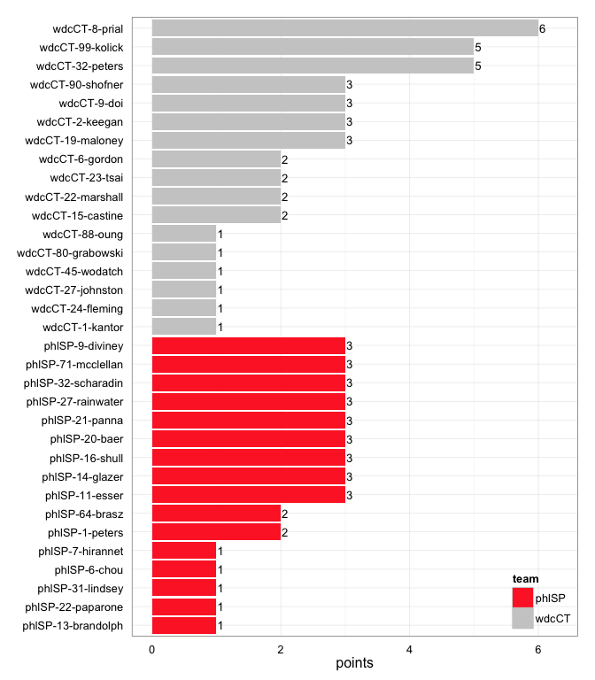
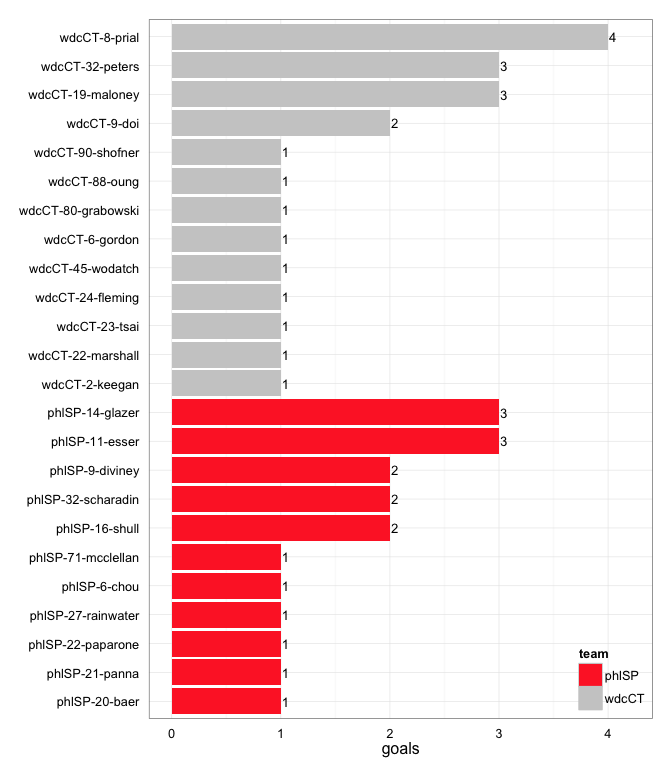
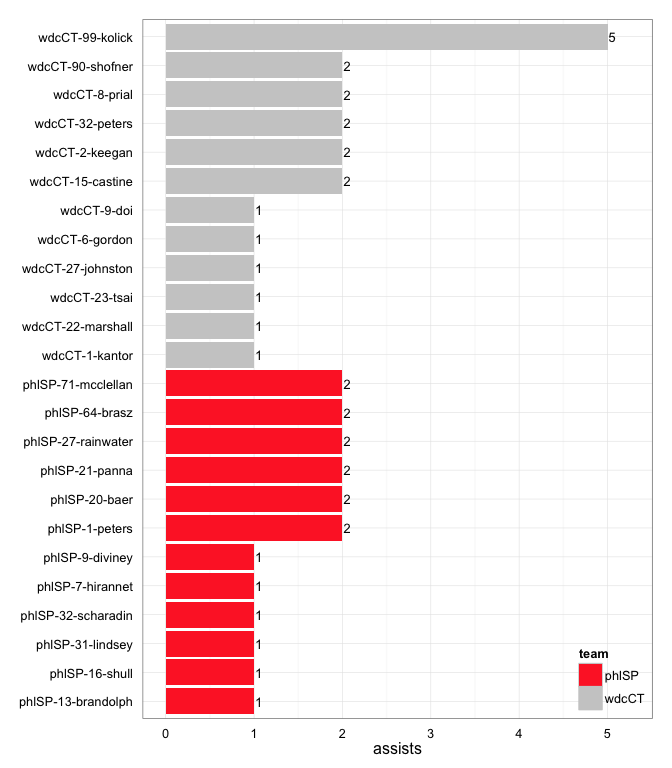
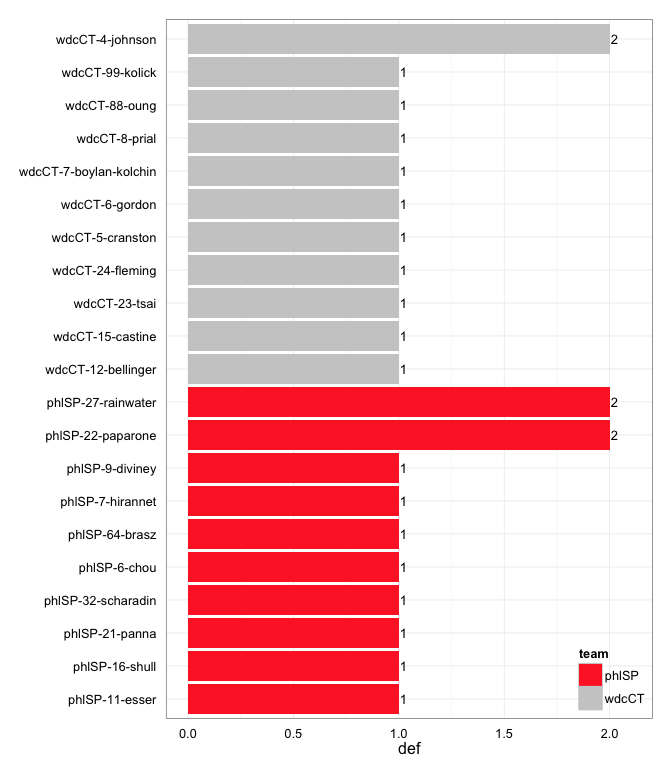

# wdcCT at phlSP 2014-04-12

# wdcCT 21
# phlSP 18
## game is complete

Go to ...  
  * [Scoring progression](#scoringProgression)  
  * [Player stats via figures](#pl_figs)  
  * [Player stats for wdcCT](#away)  
  * [Player stats for phlSP](#home)  
  * [Data on goals, assists, D's](#selectData)  
  * [Full raw data](#rawData)  

## Scoring progression:

| point|period |begin    |end     |pt_duration |desc                                     |wdcCT |phlSP |
|-----:|:------|:--------|:-------|:-----------|:----------------------------------------|:-----|:-----|
|    42|4      |0:13:00  |0:00:00 |00:13       |wdcCT-27-johnston to wdcCT-23-tsai       |21    |18    |
|    41|4      |1:35:00  |0:13:00 |01:22       |wdcCT-9-doi to wdcCT-8-prial             |20    |18    |
|    40|4      |2:28:00  |1:35:00 |00:53       |phlSP-1-peters to phlSP-71-mcclellan     |19    |18    |
|    39|4      |3:07:00  |2:28:00 |00:39       |wdcCT-99-kolick to wdcCT-8-prial         |19    |17    |
|    38|4      |4:23:00  |3:07:00 |01:16       |phlSP-64-brasz to phlSP-11-esser         |18    |17    |
|    37|4      |4:42:00  |4:23:00 |00:19       |phlSP-13-brandolph to phlSP-20-baer      |18    |16    |
|    36|4      |5:32:00  |4:42:00 |00:50       |wdcCT-99-kolick to wdcCT-32-peters       |18    |15    |
|    35|4      |5:58:00  |5:32:00 |00:26       |phlSP-64-brasz to phlSP-16-shull         |17    |15    |
|    34|4      |6:20:00  |5:58:00 |00:22       |phlSP-7-hirannet to phlSP-9-diviney      |17    |14    |
|    33|4      |6:57:00  |6:20:00 |00:37       |wdcCT-8-prial to wdcCT-32-peters         |17    |13    |
|    32|4      |7:37:00  |6:57:00 |00:40       |phlSP-21-panna to phlSP-11-esser         |16    |13    |
|    31|4      |8:18:00  |7:37:00 |00:41       |phlSP-71-mcclellan to phlSP-27-rainwater |16    |12    |
|    30|4      |8:49:00  |8:18:00 |00:31       |wdcCT-90-shofner to wdcCT-9-doi          |16    |11    |
|    29|4      |9:24:00  |8:49:00 |00:35       |phlSP-20-baer to phlSP-14-glazer         |15    |11    |
|    28|4      |10:00:00 |9:24:00 |00:36       |wdcCT-99-kolick to wdcCT-2-keegan        |15    |10    |
|    27|3      |0:40:00  |0:00:00 |00:40       |- no goal -                              |14    |10    |
|    26|3      |1:06:00  |0:40:00 |00:26       |wdcCT-99-kolick to wdcCT-8-prial         |14    |10    |
|    25|3      |2:02:00  |1:06:00 |00:56       |phlSP-27-rainwater to phlSP-6-chou       |13    |10    |
|    24|3      |6:36:00  |2:02:00 |04:34       |wdcCT-15-castine to wdcCT-19-maloney     |13    |9     |
|    23|3      |7:56:00  |6:36:00 |01:20       |wdcCT-2-keegan to wdcCT-88-oung          |12    |9     |
|    22|3      |8:20:00  |7:56:00 |00:24       |phlSP-27-rainwater to phlSP-32-scharadin |11    |9     |
|    21|3      |9:09:00  |8:20:00 |00:49       |wdcCT-22-marshall to wdcCT-19-maloney    |11    |8     |
|    20|3      |10:00:00 |9:09:00 |00:51       |wdcCT-1-kantor to wdcCT-6-gordon         |10    |8     |
|    19|2      |3:52:00  |0:00:00 |03:52       |- no goal -                              |9     |8     |
|    18|2      |4:21:00  |3:52:00 |00:29       |wdcCT-90-shofner to wdcCT-32-peters      |9     |8     |
|    17|2      |5:52:00  |4:21:00 |01:31       |phlSP-71-mcclellan to phlSP-16-shull     |8     |8     |
|    16|2      |6:07:00  |5:52:00 |00:15       |wdcCT-99-kolick to wdcCT-80-grabowski    |8     |7     |
|    15|2      |6:43:00  |6:07:00 |00:36       |phlSP-31-lindsey to phlSP-22-paparone    |7     |7     |
|    14|2      |7:35:00  |6:43:00 |00:52       |phlSP-20-baer to phlSP-14-glazer         |7     |6     |
|    13|2      |8:17:00  |7:35:00 |00:42       |wdcCT-32-peters to wdcCT-9-doi           |7     |5     |
|    12|2      |8:30:00  |8:17:00 |00:13       |phlSP-9-diviney to phlSP-14-glazer       |6     |5     |
|    11|2      |8:53:00  |8:30:00 |00:23       |wdcCT-2-keegan to wdcCT-90-shofner       |6     |4     |
|    10|2      |9:45:00  |8:52:00 |00:53       |phlSP-1-peters to phlSP-32-scharadin     |5     |4     |
|     9|2      |10:00:00 |9:45:00 |00:15       |wdcCT-8-prial to wdcCT-45-wodatch        |5     |3     |
|     8|1      |0:42:00  |0:00:00 |00:42       |- no goal -                              |4     |3     |
|     7|1      |1:08:00  |0:42:00 |00:26       |phlSP-16-shull to phlSP-21-panna         |4     |3     |
|     6|1      |2:45:00  |1:08:00 |01:37       |wdcCT-6-gordon to wdcCT-22-marshall      |4     |2     |
|     5|1      |3:12:00  |2:45:00 |00:27       |wdcCT-32-peters to wdcCT-8-prial         |3     |2     |
|     4|1      |5:18:00  |3:12:00 |02:06       |phlSP-21-panna to phlSP-11-esser         |2     |2     |
|     3|1      |7:02:00  |5:18:00 |01:44       |phlSP-32-scharadin to phlSP-9-diviney    |2     |1     |
|     2|1      |8:50:00  |7:02:00 |01:48       |wdcCT-15-castine to wdcCT-24-fleming     |2     |0     |
|     1|1      |10:00:00 |8:50:00 |01:10       |wdcCT-23-tsai to wdcCT-19-maloney        |1     |0     |

## Player stats via figures:

### Points = goals + assists

 

### Goals

 

### Assists

 

### D's
 

## Player stats for wdcCT :

points = goals + assists  
tables sorted in decreasing order based on points (then goals, assists, Ds)  
Ds = total of plain ol' D's + interceptions (D), hand blocks (HB), and foot blocks (FB)  
stats are cumulative for this game

|   |player   |last           | points| comp_pct| goals| assists| throws| completions| catches| def| drop|
|:--|:--------|:--------------|------:|--------:|-----:|-------:|------:|-----------:|-------:|---:|----:|
|23 |wdcCT-8  |prial          |      6|     0.92|     4|       2|     12|          11|      16|   1|    1|
|24 |wdcCT-32 |peters         |      5|     1.00|     3|       2|      9|           9|      11|   0|    0|
|25 |wdcCT-99 |kolick         |      5|     0.96|     0|       5|     47|          45|      36|   1|    0|
|26 |wdcCT-19 |maloney        |      3|     1.00|     3|       0|      2|           2|       5|   0|    0|
|27 |wdcCT-9  |doi            |      3|     0.56|     2|       1|      9|           5|      11|   0|    3|
|28 |wdcCT-2  |keegan         |      3|     0.83|     1|       2|     23|          19|      21|   0|    1|
|29 |wdcCT-90 |shofner        |      3|     0.85|     1|       2|     26|          22|      21|   0|    0|
|30 |wdcCT-23 |tsai           |      2|     0.77|     1|       1|     13|          10|      11|   1|    0|
|31 |wdcCT-6  |gordon         |      2|     1.00|     1|       1|      1|           1|       2|   1|    0|
|32 |wdcCT-22 |marshall       |      2|     0.67|     1|       1|      6|           4|       7|   0|    0|
|33 |wdcCT-15 |castine        |      2|     0.92|     0|       2|     13|          12|       9|   1|    0|
|34 |wdcCT-24 |fleming        |      1|       NA|     1|       0|      0|           0|       1|   1|    0|
|35 |wdcCT-88 |oung           |      1|     1.00|     1|       0|     12|          12|       4|   1|    0|
|36 |wdcCT-45 |wodatch        |      1|     1.00|     1|       0|      8|           8|       9|   0|    0|
|37 |wdcCT-80 |grabowski      |      1|     1.00|     1|       0|      1|           1|       2|   0|    0|
|38 |wdcCT-1  |kantor         |      1|     1.00|     0|       1|      4|           4|       4|   0|    0|
|39 |wdcCT-27 |johnston       |      1|     0.88|     0|       1|      8|           7|       6|   0|    0|
|40 |wdcCT-4  |johnson        |      0|     1.00|     0|       0|      5|           5|       4|   2|    0|
|41 |wdcCT-12 |bellinger      |      0|     1.00|     0|       0|      8|           8|       6|   1|    0|
|42 |wdcCT-5  |cranston       |      0|     0.89|     0|       0|      9|           8|       8|   1|    0|
|43 |wdcCT-7  |boylan-kolchin |      0|     1.00|     0|       0|      2|           2|       2|   1|    0|
|44 |wdcCT-21 |dulabon        |      0|     1.00|     0|       0|      1|           1|       1|   0|    0|
|45 |wdcCT-25 |gordon         |      0|     1.00|     0|       0|      3|           3|       2|   0|    0|
|46 |wdcCT-31 |cobb           |      0|     1.00|     0|       0|      2|           2|       2|   0|    0|

## Player stats for phlSP :

points = goals + assists  
tables sorted in decreasing order based on points (then goals, assists, Ds)  
Ds = total of plain ol' D's + interceptions (D), hand blocks (HB), and foot blocks (FB)  
stats are cumulative for this game

|   |player   |last      | points| comp_pct| goals| assists| throws| completions| catches| def| drop|
|:--|:--------|:---------|------:|--------:|-----:|-------:|------:|-----------:|-------:|---:|----:|
|1  |phlSP-11 |esser     |      3|     0.92|     3|       0|     12|          11|      15|   1|    0|
|2  |phlSP-14 |glazer    |      3|     0.90|     3|       0|     10|           9|      13|   0|    0|
|3  |phlSP-16 |shull     |      3|     0.85|     2|       1|     13|          11|      14|   1|    0|
|4  |phlSP-32 |scharadin |      3|     1.00|     2|       1|     11|          11|      11|   1|    0|
|5  |phlSP-9  |diviney   |      3|     1.00|     2|       1|      8|           8|      10|   1|    0|
|6  |phlSP-27 |rainwater |      3|     1.00|     1|       2|     22|          22|      21|   2|    0|
|7  |phlSP-21 |panna     |      3|     1.00|     1|       2|     23|          23|      17|   1|    0|
|8  |phlSP-20 |baer      |      3|     0.89|     1|       2|     45|          40|      38|   0|    1|
|9  |phlSP-71 |mcclellan |      3|     0.65|     1|       2|     17|          11|      13|   0|    1|
|10 |phlSP-64 |brasz     |      2|     0.94|     0|       2|     18|          17|      14|   1|    0|
|11 |phlSP-1  |peters    |      2|     0.92|     0|       2|     13|          12|      11|   0|    0|
|12 |phlSP-22 |paparone  |      1|     1.00|     1|       0|      3|           3|       4|   2|    0|
|13 |phlSP-6  |chou      |      1|     0.73|     1|       0|     11|           8|      11|   1|    0|
|14 |phlSP-7  |hirannet  |      1|     0.87|     0|       1|     38|          33|      30|   1|    2|
|15 |phlSP-13 |brandolph |      1|     0.89|     0|       1|     18|          16|      15|   0|    0|
|16 |phlSP-31 |lindsey   |      1|     1.00|     0|       1|      4|           4|       4|   0|    0|
|17 |phlSP-10 |casey     |      0|     1.00|     0|       0|      1|           1|       1|   0|    0|
|18 |phlSP-12 |zumbrum   |      0|     1.00|     0|       0|      3|           3|       4|   0|    0|
|19 |phlSP-2  |colton    |      0|     1.00|     0|       0|      3|           3|       1|   0|    0|
|20 |phlSP-28 |baer      |      0|     1.00|     0|       0|      1|           1|       0|   0|    0|
|21 |phlSP-41 |mathison  |      0|     1.00|     0|       0|      1|           1|       1|   0|    0|
|22 |phlSP-88 |carter    |      0|     1.00|     0|       0|      1|           1|       1|   0|    0|

## Raw data on select events (goals, assists, D's):

| point| period|pull_team | event| poss_abs| poss_rel|poss_team |pl_team |pl_pnum |pl_code |pl_lname       |player                 | phlSP| wdcCT|
|-----:|------:|:---------|-----:|--------:|--------:|:---------|:-------|:-------|:-------|:--------------|:----------------------|-----:|-----:|
|     1|      1|wdcCT     |    18|        2|        2|wdcCT     |wdcCT   |23      |A       |tsai           |wdcCT-23-tsai          |     0|     1|
|     1|      1|wdcCT     |    19|        2|        2|wdcCT     |wdcCT   |19      |G       |maloney        |wdcCT-19-maloney       |     0|     1|
|     2|      1|wdcCT     |    14|        3|        1|phlSP     |wdcCT   |24      |D       |fleming        |wdcCT-24-fleming       |     0|     2|
|     2|      1|wdcCT     |    19|        4|        2|wdcCT     |wdcCT   |15      |A       |castine        |wdcCT-15-castine       |     0|     2|
|     2|      1|wdcCT     |    20|        4|        2|wdcCT     |wdcCT   |24      |LG      |fleming        |wdcCT-24-fleming       |     0|     2|
|     3|      1|wdcCT     |     7|        6|        2|wdcCT     |phlSP   |9       |D       |diviney        |phlSP-9-diviney        |     1|     2|
|     3|      1|wdcCT     |     9|        7|        3|phlSP     |wdcCT   |5       |D       |cranston       |wdcCT-5-cranston       |     1|     2|
|     3|      1|wdcCT     |    14|        8|        4|wdcCT     |phlSP   |7       |D       |hirannet       |phlSP-7-hirannet       |     1|     2|
|     3|      1|wdcCT     |    18|        9|        5|phlSP     |phlSP   |32      |A       |scharadin      |phlSP-32-scharadin     |     1|     2|
|     3|      1|wdcCT     |    19|        9|        5|phlSP     |phlSP   |9       |G       |diviney        |phlSP-9-diviney        |     1|     2|
|     4|      1|phlSP     |    19|       12|        3|wdcCT     |phlSP   |16      |D       |shull          |phlSP-16-shull         |     2|     2|
|     4|      1|phlSP     |    25|       13|        4|phlSP     |phlSP   |21      |A       |panna          |phlSP-21-panna         |     2|     2|
|     4|      1|phlSP     |    26|       13|        4|phlSP     |phlSP   |11      |LG      |esser          |phlSP-11-esser         |     2|     2|
|     5|      1|phlSP     |     8|       14|        1|wdcCT     |wdcCT   |32      |A       |peters         |wdcCT-32-peters        |     2|     3|
|     5|      1|phlSP     |     9|       14|        1|wdcCT     |wdcCT   |8       |G       |prial          |wdcCT-8-prial          |     2|     3|
|     6|      1|wdcCT     |     9|       15|        1|phlSP     |wdcCT   |12      |D       |bellinger      |wdcCT-12-bellinger     |     2|     4|
|     6|      1|wdcCT     |    14|       16|        2|wdcCT     |phlSP   |27      |D       |rainwater      |phlSP-27-rainwater     |     2|     4|
|     6|      1|wdcCT     |    28|       18|        4|wdcCT     |wdcCT   |6       |A       |gordon         |wdcCT-6-gordon         |     2|     4|
|     6|      1|wdcCT     |    29|       18|        4|wdcCT     |wdcCT   |22      |G       |marshall       |wdcCT-22-marshall      |     2|     4|
|     7|      1|wdcCT     |     8|       19|        1|phlSP     |phlSP   |16      |A       |shull          |phlSP-16-shull         |     3|     4|
|     7|      1|wdcCT     |     9|       19|        1|phlSP     |phlSP   |21      |G       |panna          |phlSP-21-panna         |     3|     4|
|     8|      1|phlSP     |    13|       22|        3|wdcCT     |phlSP   |22      |D       |paparone       |phlSP-22-paparone      |     3|     4|
|     9|      2|phlSP     |     4|       23|        1|wdcCT     |wdcCT   |8       |A       |prial          |wdcCT-8-prial          |     3|     5|
|     9|      2|phlSP     |     5|       23|        1|wdcCT     |wdcCT   |45      |LG      |wodatch        |wdcCT-45-wodatch       |     3|     5|
|    10|      2|wdcCT     |    14|       24|        1|phlSP     |phlSP   |1       |A       |peters         |phlSP-1-peters         |     4|     5|
|    10|      2|wdcCT     |    15|       24|        1|phlSP     |phlSP   |32      |G       |scharadin      |phlSP-32-scharadin     |     4|     5|
|    11|      2|phlSP     |     7|       25|        1|wdcCT     |wdcCT   |2       |A       |keegan         |wdcCT-2-keegan         |     4|     6|
|    11|      2|phlSP     |     8|       25|        1|wdcCT     |wdcCT   |90      |G       |shofner        |wdcCT-90-shofner       |     4|     6|
|    12|      2|wdcCT     |     3|       26|        1|phlSP     |phlSP   |9       |LA      |diviney        |phlSP-9-diviney        |     5|     6|
|    12|      2|wdcCT     |     4|       26|        1|phlSP     |phlSP   |14      |G       |glazer         |phlSP-14-glazer        |     5|     6|
|    13|      2|phlSP     |    10|       29|        3|wdcCT     |wdcCT   |32      |LA      |peters         |wdcCT-32-peters        |     5|     7|
|    13|      2|phlSP     |    12|       29|        3|wdcCT     |wdcCT   |9       |G       |doi            |wdcCT-9-doi            |     5|     7|
|    14|      2|wdcCT     |    16|       30|        1|phlSP     |phlSP   |20      |A       |baer           |phlSP-20-baer          |     6|     7|
|    14|      2|wdcCT     |    17|       30|        1|phlSP     |phlSP   |14      |G       |glazer         |phlSP-14-glazer        |     6|     7|
|    15|      2|phlSP     |    11|       32|        2|phlSP     |phlSP   |31      |LA      |lindsey        |phlSP-31-lindsey       |     7|     7|
|    15|      2|phlSP     |    12|       32|        2|phlSP     |phlSP   |22      |G       |paparone       |phlSP-22-paparone      |     7|     7|
|    16|      2|phlSP     |     4|       33|        1|wdcCT     |wdcCT   |99      |LA      |kolick         |wdcCT-99-kolick        |     7|     8|
|    16|      2|phlSP     |     5|       33|        1|wdcCT     |wdcCT   |80      |G       |grabowski      |wdcCT-80-grabowski     |     7|     8|
|    17|      2|wdcCT     |     5|       34|        1|phlSP     |wdcCT   |7       |D       |boylan-kolchin |wdcCT-7-boylan-kolchin |     8|     8|
|    17|      2|wdcCT     |    17|       37|        4|wdcCT     |phlSP   |21      |D       |panna          |phlSP-21-panna         |     8|     8|
|    17|      2|wdcCT     |    20|       38|        5|phlSP     |phlSP   |71      |A       |mcclellan      |phlSP-71-mcclellan     |     8|     8|
|    17|      2|wdcCT     |    21|       38|        5|phlSP     |phlSP   |16      |G       |shull          |phlSP-16-shull         |     8|     8|
|    18|      2|phlSP     |     7|       39|        1|wdcCT     |wdcCT   |90      |LA      |shofner        |wdcCT-90-shofner       |     8|     9|
|    18|      2|phlSP     |     8|       39|        1|wdcCT     |wdcCT   |32      |G       |peters         |wdcCT-32-peters        |     8|     9|
|    19|      2|wdcCT     |     6|       41|        2|wdcCT     |phlSP   |32      |D       |scharadin      |phlSP-32-scharadin     |     8|     9|
|    19|      2|wdcCT     |    20|       43|        4|wdcCT     |phlSP   |27      |D       |rainwater      |phlSP-27-rainwater     |     8|     9|
|    19|      2|wdcCT     |    23|       44|        5|phlSP     |wdcCT   |15      |D       |castine        |wdcCT-15-castine       |     8|     9|
|    19|      2|wdcCT     |    43|       46|        7|phlSP     |wdcCT   |8       |D       |prial          |wdcCT-8-prial          |     8|     9|
|    19|      2|wdcCT     |    48|       47|        8|wdcCT     |phlSP   |6       |FB      |chou           |phlSP-6-chou           |     8|     9|
|    20|      3|wdcCT     |     7|       49|        1|phlSP     |wdcCT   |6       |D       |gordon         |wdcCT-6-gordon         |     8|    10|
|    20|      3|wdcCT     |    14|       50|        2|wdcCT     |wdcCT   |1       |A       |kantor         |wdcCT-1-kantor         |     8|    10|
|    20|      3|wdcCT     |    15|       50|        2|wdcCT     |wdcCT   |6       |G       |gordon         |wdcCT-6-gordon         |     8|    10|
|    21|      3|wdcCT     |     9|       51|        1|phlSP     |wdcCT   |4       |D       |johnson        |wdcCT-4-johnson        |     8|    11|
|    21|      3|wdcCT     |    16|       52|        2|wdcCT     |wdcCT   |22      |A       |marshall       |wdcCT-22-marshall      |     8|    11|
|    21|      3|wdcCT     |    17|       52|        2|wdcCT     |wdcCT   |19      |G       |maloney        |wdcCT-19-maloney       |     8|    11|
|    22|      3|wdcCT     |     7|       53|        1|phlSP     |phlSP   |27      |A       |rainwater      |phlSP-27-rainwater     |     9|    11|
|    22|      3|wdcCT     |     8|       53|        1|phlSP     |phlSP   |32      |LG      |scharadin      |phlSP-32-scharadin     |     9|    11|
|    23|      3|phlSP     |     7|       54|        1|wdcCT     |phlSP   |64      |FB      |brasz          |phlSP-64-brasz         |     9|    12|
|    23|      3|phlSP     |    21|       56|        3|wdcCT     |wdcCT   |2       |A       |keegan         |wdcCT-2-keegan         |     9|    12|
|    23|      3|phlSP     |    22|       56|        3|wdcCT     |wdcCT   |88      |LG      |oung           |wdcCT-88-oung          |     9|    12|
|    24|      3|wdcCT     |    19|       57|        1|phlSP     |wdcCT   |4       |D       |johnson        |wdcCT-4-johnson        |     9|    13|
|    24|      3|wdcCT     |    56|       62|        6|wdcCT     |wdcCT   |15      |A       |castine        |wdcCT-15-castine       |     9|    13|
|    24|      3|wdcCT     |    57|       62|        6|wdcCT     |wdcCT   |19      |G       |maloney        |wdcCT-19-maloney       |     9|    13|
|    25|      3|wdcCT     |    16|       63|        1|phlSP     |phlSP   |27      |A       |rainwater      |phlSP-27-rainwater     |    10|    13|
|    25|      3|wdcCT     |    17|       63|        1|phlSP     |phlSP   |6       |G       |chou           |phlSP-6-chou           |    10|    13|
|    26|      3|phlSP     |     9|       64|        1|wdcCT     |wdcCT   |99      |A       |kolick         |wdcCT-99-kolick        |    10|    14|
|    26|      3|phlSP     |    10|       64|        1|wdcCT     |wdcCT   |8       |G       |prial          |wdcCT-8-prial          |    10|    14|
|    27|      3|wdcCT     |    NA|       NA|       NA|NA        |NA      |NA      |NA      |NA             |NA-NA-NA               |    10|    14|
|    28|      4|phlSP     |     9|       66|        1|wdcCT     |wdcCT   |99      |A       |kolick         |wdcCT-99-kolick        |    10|    15|
|    28|      4|phlSP     |    10|       66|        1|wdcCT     |wdcCT   |2       |LG      |keegan         |wdcCT-2-keegan         |    10|    15|
|    29|      4|wdcCT     |    10|       67|        1|phlSP     |phlSP   |20      |A       |baer           |phlSP-20-baer          |    11|    15|
|    29|      4|wdcCT     |    11|       67|        1|phlSP     |phlSP   |14      |G       |glazer         |phlSP-14-glazer        |    11|    15|
|    30|      4|phlSP     |     8|       68|        1|wdcCT     |wdcCT   |90      |A       |shofner        |wdcCT-90-shofner       |    11|    16|
|    30|      4|phlSP     |     9|       68|        1|wdcCT     |wdcCT   |9       |G       |doi            |wdcCT-9-doi            |    11|    16|
|    31|      4|wdcCT     |     8|       69|        1|phlSP     |phlSP   |71      |A       |mcclellan      |phlSP-71-mcclellan     |    12|    16|
|    31|      4|wdcCT     |    10|       69|        1|phlSP     |phlSP   |27      |LG      |rainwater      |phlSP-27-rainwater     |    12|    16|
|    32|      4|phlSP     |     6|       70|        1|wdcCT     |phlSP   |22      |D       |paparone       |phlSP-22-paparone      |    13|    16|
|    32|      4|phlSP     |    11|       71|        2|phlSP     |phlSP   |21      |A       |panna          |phlSP-21-panna         |    13|    16|
|    32|      4|phlSP     |    12|       71|        2|phlSP     |phlSP   |11      |LG      |esser          |phlSP-11-esser         |    13|    16|
|    33|      4|phlSP     |     6|       72|        1|wdcCT     |wdcCT   |8       |A       |prial          |wdcCT-8-prial          |    13|    17|
|    33|      4|phlSP     |     8|       72|        1|wdcCT     |wdcCT   |32      |G       |peters         |wdcCT-32-peters        |    13|    17|
|    34|      4|wdcCT     |     6|       73|        1|phlSP     |phlSP   |7       |A       |hirannet       |phlSP-7-hirannet       |    14|    17|
|    34|      4|wdcCT     |     7|       73|        1|phlSP     |phlSP   |9       |LG      |diviney        |phlSP-9-diviney        |    14|    17|
|    35|      4|phlSP     |     7|       75|        2|phlSP     |phlSP   |64      |A       |brasz          |phlSP-64-brasz         |    15|    17|
|    35|      4|phlSP     |     8|       75|        2|phlSP     |phlSP   |16      |G       |shull          |phlSP-16-shull         |    15|    17|
|    36|      4|phlSP     |    12|       77|        2|phlSP     |wdcCT   |88      |D       |oung           |wdcCT-88-oung          |    15|    18|
|    36|      4|phlSP     |    14|       78|        3|wdcCT     |wdcCT   |99      |A       |kolick         |wdcCT-99-kolick        |    15|    18|
|    36|      4|phlSP     |    15|       78|        3|wdcCT     |wdcCT   |32      |LG      |peters         |wdcCT-32-peters        |    15|    18|
|    37|      4|wdcCT     |     6|       79|        1|phlSP     |phlSP   |13      |A       |brandolph      |phlSP-13-brandolph     |    16|    18|
|    37|      4|wdcCT     |     7|       79|        1|phlSP     |phlSP   |20      |LG      |baer           |phlSP-20-baer          |    16|    18|
|    38|      4|phlSP     |    12|       81|        2|phlSP     |wdcCT   |23      |D       |tsai           |wdcCT-23-tsai          |    17|    18|
|    38|      4|phlSP     |    18|       82|        3|wdcCT     |phlSP   |11      |D       |esser          |phlSP-11-esser         |    17|    18|
|    38|      4|phlSP     |    22|       83|        4|phlSP     |phlSP   |64      |A       |brasz          |phlSP-64-brasz         |    17|    18|
|    38|      4|phlSP     |    23|       83|        4|phlSP     |phlSP   |11      |LG      |esser          |phlSP-11-esser         |    17|    18|
|    39|      4|phlSP     |    12|       84|        1|wdcCT     |wdcCT   |99      |A       |kolick         |wdcCT-99-kolick        |    17|    19|
|    39|      4|phlSP     |    13|       84|        1|wdcCT     |wdcCT   |8       |G       |prial          |wdcCT-8-prial          |    17|    19|
|    40|      4|wdcCT     |    13|       85|        1|phlSP     |phlSP   |1       |A       |peters         |phlSP-1-peters         |    18|    19|
|    40|      4|wdcCT     |    14|       85|        1|phlSP     |phlSP   |71      |G       |mcclellan      |phlSP-71-mcclellan     |    18|    19|
|    41|      4|phlSP     |    16|       87|        2|phlSP     |wdcCT   |99      |D       |kolick         |wdcCT-99-kolick        |    18|    20|
|    41|      4|phlSP     |    20|       88|        3|wdcCT     |wdcCT   |9       |A       |doi            |wdcCT-9-doi            |    18|    20|
|    41|      4|phlSP     |    21|       88|        3|wdcCT     |wdcCT   |8       |G       |prial          |wdcCT-8-prial          |    18|    20|
|    42|      4|wdcCT     |     5|       90|        2|wdcCT     |wdcCT   |27      |PUA     |johnston       |wdcCT-27-johnston      |    18|    21|
|    42|      4|wdcCT     |     6|       90|        2|wdcCT     |wdcCT   |23      |G       |tsai           |wdcCT-23-tsai          |    18|    21|

## Full raw data:

__Note: just for display purposes.__ Raw data in more useful forms can be found in the [GitHub repository](https://github.com/jennybc/vanNH). Find the game you're interested in in the `games` subdirectory.

| period| point|pull_team | event| poss_abs| poss_rel|poss_team |pl_team |pl_pnum |pl_code |
|------:|-----:|:---------|-----:|--------:|--------:|:---------|:-------|:-------|:-------|
|      1|     1|wdcCT     |     1|        1|        1|phlSP     |wdcCT   |22      |P       |
|      1|     1|wdcCT     |     2|        1|        1|phlSP     |phlSP   |7       |PU      |
|      1|     1|wdcCT     |     3|        1|        1|phlSP     |phlSP   |20      |        |
|      1|     1|wdcCT     |     4|        1|        1|phlSP     |phlSP   |9       |TD      |
|      1|     1|wdcCT     |     5|        2|        2|wdcCT     |wdcCT   |27      |PU      |
|      1|     1|wdcCT     |     6|        2|        2|wdcCT     |wdcCT   |31      |        |
|      1|     1|wdcCT     |     7|        2|        2|wdcCT     |wdcCT   |5       |        |
|      1|     1|wdcCT     |     8|        2|        2|wdcCT     |wdcCT   |4       |        |
|      1|     1|wdcCT     |     9|        2|        2|wdcCT     |wdcCT   |5       |        |
|      1|     1|wdcCT     |    10|        2|        2|wdcCT     |wdcCT   |22      |        |
|      1|     1|wdcCT     |    11|        2|        2|wdcCT     |wdcCT   |23      |        |
|      1|     1|wdcCT     |    12|        2|        2|wdcCT     |wdcCT   |19      |        |
|      1|     1|wdcCT     |    13|        2|        2|wdcCT     |wdcCT   |23      |        |
|      1|     1|wdcCT     |    14|        2|        2|wdcCT     |wdcCT   |27      |        |
|      1|     1|wdcCT     |    15|        2|        2|wdcCT     |wdcCT   |1       |        |
|      1|     1|wdcCT     |    16|        2|        2|wdcCT     |wdcCT   |4       |        |
|      1|     1|wdcCT     |    17|        2|        2|wdcCT     |wdcCT   |5       |        |
|      1|     1|wdcCT     |    18|        2|        2|wdcCT     |wdcCT   |23      |A       |
|      1|     1|wdcCT     |    19|        2|        2|wdcCT     |wdcCT   |19      |G       |
|      1|     2|wdcCT     |     1|        3|        1|phlSP     |wdcCT   |15      |P       |
|      1|     2|wdcCT     |     2|        3|        1|phlSP     |phlSP   |21      |PU      |
|      1|     2|wdcCT     |     3|        3|        1|phlSP     |phlSP   |71      |        |
|      1|     2|wdcCT     |     4|        3|        1|phlSP     |phlSP   |13      |        |
|      1|     2|wdcCT     |     5|        3|        1|phlSP     |phlSP   |71      |        |
|      1|     2|wdcCT     |     6|        3|        1|phlSP     |phlSP   |16      |        |
|      1|     2|wdcCT     |     7|        3|        1|phlSP     |phlSP   |64      |        |
|      1|     2|wdcCT     |     8|        3|        1|phlSP     |phlSP   |11      |        |
|      1|     2|wdcCT     |     9|        3|        1|phlSP     |wdcCT   |15      |F       |
|      1|     2|wdcCT     |    10|        3|        1|phlSP     |phlSP   |16      |        |
|      1|     2|wdcCT     |    11|        3|        1|phlSP     |phlSP   |13      |        |
|      1|     2|wdcCT     |    12|        3|        1|phlSP     |wdcCT   |12      |F       |
|      1|     2|wdcCT     |    13|        3|        1|phlSP     |phlSP   |71      |        |
|      1|     2|wdcCT     |    14|        3|        1|phlSP     |wdcCT   |24      |D       |
|      1|     2|wdcCT     |    15|        4|        2|wdcCT     |wdcCT   |12      |PU      |
|      1|     2|wdcCT     |    16|        4|        2|wdcCT     |wdcCT   |7       |        |
|      1|     2|wdcCT     |    17|        4|        2|wdcCT     |wdcCT   |15      |        |
|      1|     2|wdcCT     |    18|        4|        2|wdcCT     |wdcCT   |12      |        |
|      1|     2|wdcCT     |    19|        4|        2|wdcCT     |wdcCT   |15      |A       |
|      1|     2|wdcCT     |    20|        4|        2|wdcCT     |wdcCT   |24      |LG      |
|      1|     3|wdcCT     |     1|        5|        1|phlSP     |wdcCT   |27      |P       |
|      1|     3|wdcCT     |     2|        5|        1|phlSP     |phlSP   |20      |PU      |
|      1|     3|wdcCT     |     3|        5|        1|phlSP     |phlSP   |27      |        |
|      1|     3|wdcCT     |     4|        5|        1|phlSP     |phlSP   |20      |        |
|      1|     3|wdcCT     |     5|        6|        2|wdcCT     |wdcCT   |27      |PU      |
|      1|     3|wdcCT     |     6|        6|        2|wdcCT     |wdcCT   |5       |        |
|      1|     3|wdcCT     |     7|        6|        2|wdcCT     |phlSP   |9       |D       |
|      1|     3|wdcCT     |     8|        7|        3|phlSP     |phlSP   |1       |PU      |
|      1|     3|wdcCT     |     9|        7|        3|phlSP     |wdcCT   |5       |D       |
|      1|     3|wdcCT     |    10|        8|        4|wdcCT     |wdcCT   |5       |PU      |
|      1|     3|wdcCT     |    11|        8|        4|wdcCT     |wdcCT   |23      |        |
|      1|     3|wdcCT     |    12|        8|        4|wdcCT     |wdcCT   |4       |        |
|      1|     3|wdcCT     |    13|        8|        4|wdcCT     |wdcCT   |23      |        |
|      1|     3|wdcCT     |    14|        8|        4|wdcCT     |phlSP   |7       |D       |
|      1|     3|wdcCT     |    15|        9|        5|phlSP     |phlSP   |20      |PU      |
|      1|     3|wdcCT     |    16|        9|        5|phlSP     |wdcCT   |27      |F       |
|      1|     3|wdcCT     |    17|        9|        5|phlSP     |phlSP   |27      |        |
|      1|     3|wdcCT     |    18|        9|        5|phlSP     |phlSP   |32      |A       |
|      1|     3|wdcCT     |    19|        9|        5|phlSP     |phlSP   |9       |G       |
|      1|     4|phlSP     |     1|       10|        1|wdcCT     |phlSP   |16      |P       |
|      1|     4|phlSP     |     2|       10|        1|wdcCT     |wdcCT   |90      |PU      |
|      1|     4|phlSP     |     3|       10|        1|wdcCT     |wdcCT   |99      |        |
|      1|     4|phlSP     |     4|       10|        1|wdcCT     |wdcCT   |88      |        |
|      1|     4|phlSP     |     5|       10|        1|wdcCT     |wdcCT   |45      |        |
|      1|     4|phlSP     |     6|       10|        1|wdcCT     |wdcCT   |8       |        |
|      1|     4|phlSP     |     7|       10|        1|wdcCT     |wdcCT   |99      |TD      |
|      1|     4|phlSP     |     8|       11|        2|phlSP     |phlSP   |11      |PU      |
|      1|     4|phlSP     |     9|       11|        2|phlSP     |phlSP   |21      |        |
|      1|     4|phlSP     |    10|       11|        2|phlSP     |phlSP   |16      |        |
|      1|     4|phlSP     |    11|       11|        2|phlSP     |phlSP   |21      |        |
|      1|     4|phlSP     |    12|       11|        2|phlSP     |phlSP   |64      |        |
|      1|     4|phlSP     |    13|       11|        2|phlSP     |phlSP   |6       |        |
|      1|     4|phlSP     |    14|       11|        2|phlSP     |phlSP   |64      |        |
|      1|     4|phlSP     |    15|       11|        2|phlSP     |phlSP   |16      |        |
|      1|     4|phlSP     |    16|       12|        3|wdcCT     |wdcCT   |99      |PU      |
|      1|     4|phlSP     |    17|       12|        3|wdcCT     |wdcCT   |88      |        |
|      1|     4|phlSP     |    18|       12|        3|wdcCT     |wdcCT   |90      |        |
|      1|     4|phlSP     |    19|       12|        3|wdcCT     |phlSP   |16      |D       |
|      1|     4|phlSP     |    20|       13|        4|phlSP     |phlSP   |21      |PU      |
|      1|     4|phlSP     |    21|       13|        4|phlSP     |phlSP   |64      |        |
|      1|     4|phlSP     |    22|       13|        4|phlSP     |phlSP   |6       |        |
|      1|     4|phlSP     |    23|       13|        4|phlSP     |phlSP   |16      |        |
|      1|     4|phlSP     |    24|       13|        4|phlSP     |phlSP   |64      |        |
|      1|     4|phlSP     |    25|       13|        4|phlSP     |phlSP   |21      |A       |
|      1|     4|phlSP     |    26|       13|        4|phlSP     |phlSP   |11      |LG      |
|      1|     5|phlSP     |     1|       14|        1|wdcCT     |phlSP   |88      |OBP     |
|      1|     5|phlSP     |     2|       14|        1|wdcCT     |wdcCT   |99      |PU      |
|      1|     5|phlSP     |     3|       14|        1|wdcCT     |wdcCT   |90      |        |
|      1|     5|phlSP     |     4|       14|        1|wdcCT     |wdcCT   |9       |        |
|      1|     5|phlSP     |     5|       14|        1|wdcCT     |wdcCT   |8       |        |
|      1|     5|phlSP     |     6|       14|        1|wdcCT     |wdcCT   |99      |        |
|      1|     5|phlSP     |     7|       14|        1|wdcCT     |wdcCT   |9       |        |
|      1|     5|phlSP     |     8|       14|        1|wdcCT     |wdcCT   |32      |A       |
|      1|     5|phlSP     |     9|       14|        1|wdcCT     |wdcCT   |8       |G       |
|      1|     6|wdcCT     |     1|       15|        1|phlSP     |wdcCT   |15      |P       |
|      1|     6|wdcCT     |     2|       15|        1|phlSP     |phlSP   |20      |PU      |
|      1|     6|wdcCT     |     3|       15|        1|phlSP     |phlSP   |7       |        |
|      1|     6|wdcCT     |     4|       15|        1|phlSP     |phlSP   |20      |        |
|      1|     6|wdcCT     |     5|       15|        1|phlSP     |phlSP   |13      |        |
|      1|     6|wdcCT     |     6|       15|        1|phlSP     |phlSP   |20      |        |
|      1|     6|wdcCT     |     7|       15|        1|phlSP     |phlSP   |27      |        |
|      1|     6|wdcCT     |     8|       15|        1|phlSP     |phlSP   |13      |        |
|      1|     6|wdcCT     |     9|       15|        1|phlSP     |wdcCT   |12      |D       |
|      1|     6|wdcCT     |    10|       16|        2|wdcCT     |wdcCT   |12      |PU      |
|      1|     6|wdcCT     |    11|       16|        2|wdcCT     |wdcCT   |15      |        |
|      1|     6|wdcCT     |    12|       16|        2|wdcCT     |wdcCT   |12      |        |
|      1|     6|wdcCT     |    13|       16|        2|wdcCT     |wdcCT   |22      |        |
|      1|     6|wdcCT     |    14|       16|        2|wdcCT     |phlSP   |27      |D       |
|      1|     6|wdcCT     |    15|       17|        3|phlSP     |phlSP   |27      |PU      |
|      1|     6|wdcCT     |    16|       17|        3|phlSP     |phlSP   |20      |        |
|      1|     6|wdcCT     |    17|       17|        3|phlSP     |phlSP   |12      |TO      |
|      1|     6|wdcCT     |    18|       17|        3|phlSP     |wdcCT   |19      |F       |
|      1|     6|wdcCT     |    19|       17|        3|phlSP     |phlSP   |71      |PU      |
|      1|     6|wdcCT     |    20|       17|        3|phlSP     |phlSP   |27      |        |
|      1|     6|wdcCT     |    21|       17|        3|phlSP     |phlSP   |20      |        |
|      1|     6|wdcCT     |    22|       17|        3|phlSP     |phlSP   |7       |        |
|      1|     6|wdcCT     |    23|       17|        3|phlSP     |phlSP   |27      |TD      |
|      1|     6|wdcCT     |    24|       18|        4|wdcCT     |wdcCT   |23      |PU      |
|      1|     6|wdcCT     |    25|       18|        4|wdcCT     |wdcCT   |27      |        |
|      1|     6|wdcCT     |    26|       18|        4|wdcCT     |wdcCT   |5       |        |
|      1|     6|wdcCT     |    27|       18|        4|wdcCT     |wdcCT   |27      |        |
|      1|     6|wdcCT     |    28|       18|        4|wdcCT     |wdcCT   |6       |A       |
|      1|     6|wdcCT     |    29|       18|        4|wdcCT     |wdcCT   |22      |G       |
|      1|     7|wdcCT     |     1|       19|        1|phlSP     |wdcCT   |15      |P       |
|      1|     7|wdcCT     |     2|       19|        1|phlSP     |phlSP   |64      |PU      |
|      1|     7|wdcCT     |     3|       19|        1|phlSP     |phlSP   |13      |        |
|      1|     7|wdcCT     |     4|       19|        1|phlSP     |phlSP   |21      |        |
|      1|     7|wdcCT     |     5|       19|        1|phlSP     |phlSP   |13      |        |
|      1|     7|wdcCT     |     6|       19|        1|phlSP     |phlSP   |12      |        |
|      1|     7|wdcCT     |     7|       19|        1|phlSP     |phlSP   |11      |        |
|      1|     7|wdcCT     |     8|       19|        1|phlSP     |phlSP   |16      |A       |
|      1|     7|wdcCT     |     9|       19|        1|phlSP     |phlSP   |21      |G       |
|      1|     8|phlSP     |     1|       20|        1|wdcCT     |phlSP   |11      |P       |
|      1|     8|phlSP     |     2|       20|        1|wdcCT     |wdcCT   |88      |PU      |
|      1|     8|phlSP     |     3|       20|        1|wdcCT     |wdcCT   |99      |        |
|      1|     8|phlSP     |     4|       20|        1|wdcCT     |wdcCT   |2       |        |
|      1|     8|phlSP     |     5|       20|        1|wdcCT     |wdcCT   |90      |        |
|      1|     8|phlSP     |     6|       20|        1|wdcCT     |wdcCT   |45      |        |
|      1|     8|phlSP     |     7|       20|        1|wdcCT     |wdcCT   |99      |        |
|      1|     8|phlSP     |     8|       20|        1|wdcCT     |wdcCT   |45      |        |
|      1|     8|phlSP     |     9|       20|        1|wdcCT     |wdcCT   |9       |        |
|      1|     8|phlSP     |    10|       20|        1|wdcCT     |wdcCT   |2       |TD      |
|      1|     8|phlSP     |    11|       21|        2|phlSP     |phlSP   |64      |PU      |
|      1|     8|phlSP     |    12|       22|        3|wdcCT     |wdcCT   |99      |PU      |
|      1|     8|phlSP     |    13|       22|        3|wdcCT     |phlSP   |22      |D       |
|      2|     9|phlSP     |     1|       23|        1|wdcCT     |phlSP   |16      |P       |
|      2|     9|phlSP     |     2|       23|        1|wdcCT     |wdcCT   |88      |PU      |
|      2|     9|phlSP     |     3|       23|        1|wdcCT     |wdcCT   |99      |        |
|      2|     9|phlSP     |     4|       23|        1|wdcCT     |wdcCT   |8       |A       |
|      2|     9|phlSP     |     5|       23|        1|wdcCT     |wdcCT   |45      |LG      |
|      2|    10|wdcCT     |     1|       24|        1|phlSP     |wdcCT   |5       |P       |
|      2|    10|wdcCT     |     2|       24|        1|phlSP     |phlSP   |7       |PU      |
|      2|    10|wdcCT     |     3|       24|        1|phlSP     |phlSP   |20      |        |
|      2|    10|wdcCT     |     4|       24|        1|phlSP     |phlSP   |9       |        |
|      2|    10|wdcCT     |     5|       24|        1|phlSP     |phlSP   |14      |        |
|      2|    10|wdcCT     |     6|       24|        1|phlSP     |phlSP   |20      |        |
|      2|    10|wdcCT     |     7|       24|        1|phlSP     |phlSP   |27      |        |
|      2|    10|wdcCT     |     8|       24|        1|phlSP     |phlSP   |7       |        |
|      2|    10|wdcCT     |     9|       24|        1|phlSP     |phlSP   |20      |        |
|      2|    10|wdcCT     |    10|       24|        1|phlSP     |phlSP   |9       |        |
|      2|    10|wdcCT     |    11|       24|        1|phlSP     |phlSP   |20      |        |
|      2|    10|wdcCT     |    12|       24|        1|phlSP     |phlSP   |7       |        |
|      2|    10|wdcCT     |    13|       24|        1|phlSP     |phlSP   |20      |        |
|      2|    10|wdcCT     |    14|       24|        1|phlSP     |phlSP   |1       |A       |
|      2|    10|wdcCT     |    15|       24|        1|phlSP     |phlSP   |32      |G       |
|      2|    11|phlSP     |     1|       25|        1|wdcCT     |phlSP   |11      |P       |
|      2|    11|phlSP     |     2|       25|        1|wdcCT     |wdcCT   |88      |PU      |
|      2|    11|phlSP     |     3|       25|        1|wdcCT     |wdcCT   |99      |        |
|      2|    11|phlSP     |     4|       25|        1|wdcCT     |wdcCT   |90      |        |
|      2|    11|phlSP     |     5|       25|        1|wdcCT     |wdcCT   |8       |        |
|      2|    11|phlSP     |     6|       25|        1|wdcCT     |wdcCT   |45      |        |
|      2|    11|phlSP     |     7|       25|        1|wdcCT     |wdcCT   |2       |A       |
|      2|    11|phlSP     |     8|       25|        1|wdcCT     |wdcCT   |90      |G       |
|      2|    12|wdcCT     |     1|       26|        1|phlSP     |wdcCT   |15      |P       |
|      2|    12|wdcCT     |     2|       26|        1|phlSP     |phlSP   |1       |PU      |
|      2|    12|wdcCT     |     3|       26|        1|phlSP     |phlSP   |9       |LA      |
|      2|    12|wdcCT     |     4|       26|        1|phlSP     |phlSP   |14      |G       |
|      2|    13|phlSP     |     1|       27|        1|wdcCT     |phlSP   |64      |P       |
|      2|    13|phlSP     |     2|       27|        1|wdcCT     |wdcCT   |88      |PU      |
|      2|    13|phlSP     |     3|       27|        1|wdcCT     |wdcCT   |99      |        |
|      2|    13|phlSP     |     4|       27|        1|wdcCT     |wdcCT   |2       |        |
|      2|    13|phlSP     |     5|       27|        1|wdcCT     |wdcCT   |9       |        |
|      2|    13|phlSP     |     6|       27|        1|wdcCT     |wdcCT   |8       |TD      |
|      2|    13|phlSP     |     7|       28|        2|phlSP     |phlSP   |16      |PU      |
|      2|    13|phlSP     |     8|       28|        2|phlSP     |phlSP   |11      |        |
|      2|    13|phlSP     |     9|       29|        3|wdcCT     |wdcCT   |88      |PU      |
|      2|    13|phlSP     |    10|       29|        3|wdcCT     |wdcCT   |32      |LA      |
|      2|    13|phlSP     |    11|       29|        3|wdcCT     |phlSP   |11      |F       |
|      2|    13|phlSP     |    12|       29|        3|wdcCT     |wdcCT   |9       |G       |
|      2|    14|wdcCT     |     1|       30|        1|phlSP     |wdcCT   |45      |P       |
|      2|    14|wdcCT     |     2|       30|        1|phlSP     |phlSP   |20      |PU      |
|      2|    14|wdcCT     |     3|       30|        1|phlSP     |phlSP   |1       |        |
|      2|    14|wdcCT     |     4|       30|        1|phlSP     |phlSP   |27      |        |
|      2|    14|wdcCT     |     5|       30|        1|phlSP     |phlSP   |32      |        |
|      2|    14|wdcCT     |     6|       30|        1|phlSP     |phlSP   |27      |        |
|      2|    14|wdcCT     |     7|       30|        1|phlSP     |phlSP   |7       |        |
|      2|    14|wdcCT     |     8|       30|        1|phlSP     |phlSP   |27      |        |
|      2|    14|wdcCT     |     9|       30|        1|phlSP     |phlSP   |7       |        |
|      2|    14|wdcCT     |    10|       30|        1|phlSP     |phlSP   |41      |        |
|      2|    14|wdcCT     |    11|       30|        1|phlSP     |phlSP   |20      |        |
|      2|    14|wdcCT     |    12|       30|        1|phlSP     |phlSP   |32      |        |
|      2|    14|wdcCT     |    13|       30|        1|phlSP     |phlSP   |14      |        |
|      2|    14|wdcCT     |    14|       30|        1|phlSP     |phlSP   |20      |        |
|      2|    14|wdcCT     |    15|       30|        1|phlSP     |phlSP   |32      |        |
|      2|    14|wdcCT     |    16|       30|        1|phlSP     |phlSP   |20      |A       |
|      2|    14|wdcCT     |    17|       30|        1|phlSP     |phlSP   |14      |G       |
|      2|    15|phlSP     |     1|       31|        1|wdcCT     |phlSP   |16      |P       |
|      2|    15|phlSP     |     2|       31|        1|wdcCT     |wdcCT   |99      |PU      |
|      2|    15|phlSP     |     3|       31|        1|wdcCT     |wdcCT   |90      |        |
|      2|    15|phlSP     |     4|       31|        1|wdcCT     |wdcCT   |99      |        |
|      2|    15|phlSP     |     5|       31|        1|wdcCT     |wdcCT   |9       |        |
|      2|    15|phlSP     |     6|       31|        1|wdcCT     |wdcCT   |32      |TD      |
|      2|    15|phlSP     |     7|       32|        2|phlSP     |phlSP   |21      |PU      |
|      2|    15|phlSP     |     8|       32|        2|phlSP     |phlSP   |64      |        |
|      2|    15|phlSP     |     9|       32|        2|phlSP     |phlSP   |11      |        |
|      2|    15|phlSP     |    10|       32|        2|phlSP     |phlSP   |16      |        |
|      2|    15|phlSP     |    11|       32|        2|phlSP     |phlSP   |31      |LA      |
|      2|    15|phlSP     |    12|       32|        2|phlSP     |phlSP   |22      |G       |
|      2|    16|phlSP     |     1|       33|        1|wdcCT     |phlSP   |16      |P       |
|      2|    16|phlSP     |     2|       33|        1|wdcCT     |wdcCT   |2       |PU      |
|      2|    16|phlSP     |     3|       33|        1|wdcCT     |wdcCT   |90      |        |
|      2|    16|phlSP     |     4|       33|        1|wdcCT     |wdcCT   |99      |LA      |
|      2|    16|phlSP     |     5|       33|        1|wdcCT     |wdcCT   |80      |G       |
|      2|    17|wdcCT     |     1|       34|        1|phlSP     |wdcCT   |5       |P       |
|      2|    17|wdcCT     |     2|       34|        1|phlSP     |phlSP   |13      |PU      |
|      2|    17|wdcCT     |     3|       34|        1|phlSP     |phlSP   |20      |        |
|      2|    17|wdcCT     |     4|       34|        1|phlSP     |phlSP   |13      |        |
|      2|    17|wdcCT     |     5|       34|        1|phlSP     |wdcCT   |7       |D       |
|      2|    17|wdcCT     |     6|       35|        2|wdcCT     |wdcCT   |23      |PU      |
|      2|    17|wdcCT     |     7|       36|        3|phlSP     |phlSP   |7       |PU      |
|      2|    17|wdcCT     |     8|       36|        3|phlSP     |phlSP   |13      |        |
|      2|    17|wdcCT     |     9|       36|        3|phlSP     |phlSP   |27      |        |
|      2|    17|wdcCT     |    10|       36|        3|phlSP     |phlSP   |12      |        |
|      2|    17|wdcCT     |    11|       36|        3|phlSP     |phlSP   |20      |        |
|      2|    17|wdcCT     |    12|       37|        4|wdcCT     |wdcCT   |21      |TO      |
|      2|    17|wdcCT     |    13|       37|        4|wdcCT     |wdcCT   |99      |PU      |
|      2|    17|wdcCT     |    14|       37|        4|wdcCT     |wdcCT   |90      |        |
|      2|    17|wdcCT     |    15|       37|        4|wdcCT     |wdcCT   |99      |        |
|      2|    17|wdcCT     |    16|       37|        4|wdcCT     |wdcCT   |9       |        |
|      2|    17|wdcCT     |    17|       37|        4|wdcCT     |phlSP   |21      |D       |
|      2|    17|wdcCT     |    18|       38|        5|phlSP     |phlSP   |21      |PU      |
|      2|    17|wdcCT     |    19|       38|        5|phlSP     |phlSP   |11      |        |
|      2|    17|wdcCT     |    20|       38|        5|phlSP     |phlSP   |71      |A       |
|      2|    17|wdcCT     |    21|       38|        5|phlSP     |phlSP   |16      |G       |
|      2|    18|phlSP     |     1|       39|        1|wdcCT     |phlSP   |11      |P       |
|      2|    18|phlSP     |     2|       39|        1|wdcCT     |wdcCT   |99      |PU      |
|      2|    18|phlSP     |     3|       39|        1|wdcCT     |wdcCT   |2       |        |
|      2|    18|phlSP     |     4|       39|        1|wdcCT     |wdcCT   |90      |        |
|      2|    18|phlSP     |     5|       39|        1|wdcCT     |wdcCT   |99      |        |
|      2|    18|phlSP     |     6|       39|        1|wdcCT     |wdcCT   |32      |        |
|      2|    18|phlSP     |     7|       39|        1|wdcCT     |wdcCT   |90      |LA      |
|      2|    18|phlSP     |     8|       39|        1|wdcCT     |wdcCT   |32      |G       |
|      2|    19|wdcCT     |     1|       40|        1|phlSP     |wdcCT   |15      |P       |
|      2|    19|wdcCT     |     2|       40|        1|phlSP     |phlSP   |7       |PU      |
|      2|    19|wdcCT     |     3|       40|        1|phlSP     |phlSP   |71      |TD      |
|      2|    19|wdcCT     |     4|       41|        2|wdcCT     |wdcCT   |15      |PU      |
|      2|    19|wdcCT     |     5|       41|        2|wdcCT     |wdcCT   |27      |        |
|      2|    19|wdcCT     |     6|       41|        2|wdcCT     |phlSP   |32      |D       |
|      2|    19|wdcCT     |     7|       42|        3|phlSP     |phlSP   |71      |PU      |
|      2|    19|wdcCT     |     8|       42|        3|phlSP     |phlSP   |7       |        |
|      2|    19|wdcCT     |     9|       42|        3|phlSP     |phlSP   |1       |        |
|      2|    19|wdcCT     |    10|       42|        3|phlSP     |phlSP   |71      |        |
|      2|    19|wdcCT     |    11|       42|        3|phlSP     |phlSP   |14      |        |
|      2|    19|wdcCT     |    12|       42|        3|phlSP     |phlSP   |71      |        |
|      2|    19|wdcCT     |    13|       42|        3|phlSP     |phlSP   |27      |TD      |
|      2|    19|wdcCT     |    14|       43|        4|wdcCT     |wdcCT   |25      |PU      |
|      2|    19|wdcCT     |    15|       43|        4|wdcCT     |wdcCT   |12      |        |
|      2|    19|wdcCT     |    16|       43|        4|wdcCT     |wdcCT   |15      |        |
|      2|    19|wdcCT     |    17|       43|        4|wdcCT     |wdcCT   |12      |        |
|      2|    19|wdcCT     |    18|       43|        4|wdcCT     |wdcCT   |19      |        |
|      2|    19|wdcCT     |    19|       43|        4|wdcCT     |wdcCT   |15      |        |
|      2|    19|wdcCT     |    20|       43|        4|wdcCT     |phlSP   |27      |D       |
|      2|    19|wdcCT     |    21|       44|        5|phlSP     |phlSP   |27      |PU      |
|      2|    19|wdcCT     |    22|       44|        5|phlSP     |phlSP   |7       |        |
|      2|    19|wdcCT     |    23|       44|        5|phlSP     |wdcCT   |15      |D       |
|      2|    19|wdcCT     |    24|       45|        6|wdcCT     |wdcCT   |15      |TO      |
|      2|    19|wdcCT     |    25|       45|        6|wdcCT     |wdcCT   |90      |PU      |
|      2|    19|wdcCT     |    26|       45|        6|wdcCT     |wdcCT   |99      |        |
|      2|    19|wdcCT     |    27|       45|        6|wdcCT     |wdcCT   |88      |        |
|      2|    19|wdcCT     |    28|       45|        6|wdcCT     |wdcCT   |99      |        |
|      2|    19|wdcCT     |    29|       45|        6|wdcCT     |wdcCT   |45      |        |
|      2|    19|wdcCT     |    30|       45|        6|wdcCT     |wdcCT   |2       |        |
|      2|    19|wdcCT     |    31|       46|        7|phlSP     |phlSP   |21      |PU      |
|      2|    19|wdcCT     |    32|       46|        7|phlSP     |phlSP   |64      |        |
|      2|    19|wdcCT     |    33|       46|        7|phlSP     |phlSP   |22      |        |
|      2|    19|wdcCT     |    34|       46|        7|phlSP     |phlSP   |16      |        |
|      2|    19|wdcCT     |    35|       46|        7|phlSP     |phlSP   |21      |        |
|      2|    19|wdcCT     |    36|       46|        7|phlSP     |phlSP   |6       |        |
|      2|    19|wdcCT     |    37|       46|        7|phlSP     |phlSP   |22      |        |
|      2|    19|wdcCT     |    38|       46|        7|phlSP     |phlSP   |31      |        |
|      2|    19|wdcCT     |    39|       46|        7|phlSP     |phlSP   |11      |        |
|      2|    19|wdcCT     |    40|       46|        7|phlSP     |phlSP   |21      |        |
|      2|    19|wdcCT     |    41|       46|        7|phlSP     |phlSP   |11      |        |
|      2|    19|wdcCT     |    42|       46|        7|phlSP     |phlSP   |16      |        |
|      2|    19|wdcCT     |    43|       46|        7|phlSP     |wdcCT   |8       |D       |
|      2|    19|wdcCT     |    44|       47|        8|wdcCT     |wdcCT   |8       |SO      |
|      2|    19|wdcCT     |    45|       47|        8|wdcCT     |wdcCT   |32      |SI      |
|      2|    19|wdcCT     |    46|       47|        8|wdcCT     |wdcCT   |99      |PU      |
|      2|    19|wdcCT     |    47|       47|        8|wdcCT     |wdcCT   |90      |        |
|      2|    19|wdcCT     |    48|       47|        8|wdcCT     |phlSP   |6       |FB      |
|      2|    19|wdcCT     |    49|       48|        9|phlSP     |phlSP   |21      |PU      |
|      2|    19|wdcCT     |    50|       48|        9|phlSP     |phlSP   |64      |        |
|      2|    19|wdcCT     |    51|       48|        9|phlSP     |phlSP   |16      |        |
|      2|    19|wdcCT     |    52|       48|        9|phlSP     |phlSP   |64      |        |
|      2|    19|wdcCT     |    53|       48|        9|phlSP     |phlSP   |11      |        |
|      2|    19|wdcCT     |    54|       48|        9|phlSP     |phlSP   |21      |        |
|      2|    19|wdcCT     |    55|       48|        9|phlSP     |phlSP   |11      |        |
|      2|    19|wdcCT     |    56|       48|        9|phlSP     |phlSP   |6       |        |
|      2|    19|wdcCT     |    57|       48|        9|phlSP     |phlSP   |31      |        |
|      2|    19|wdcCT     |    58|       48|        9|phlSP     |phlSP   |21      |TO      |
|      2|    19|wdcCT     |    59|       48|        9|phlSP     |phlSP   |71      |PU      |
|      3|    20|wdcCT     |     1|       49|        1|phlSP     |wdcCT   |5       |P       |
|      3|    20|wdcCT     |     2|       49|        1|phlSP     |phlSP   |7       |PU      |
|      3|    20|wdcCT     |     3|       49|        1|phlSP     |phlSP   |20      |        |
|      3|    20|wdcCT     |     4|       49|        1|phlSP     |phlSP   |14      |        |
|      3|    20|wdcCT     |     5|       49|        1|phlSP     |phlSP   |9       |        |
|      3|    20|wdcCT     |     6|       49|        1|phlSP     |phlSP   |20      |        |
|      3|    20|wdcCT     |     7|       49|        1|phlSP     |wdcCT   |6       |D       |
|      3|    20|wdcCT     |     8|       50|        2|wdcCT     |wdcCT   |23      |PU      |
|      3|    20|wdcCT     |     9|       50|        2|wdcCT     |wdcCT   |1       |        |
|      3|    20|wdcCT     |    10|       50|        2|wdcCT     |wdcCT   |23      |        |
|      3|    20|wdcCT     |    11|       50|        2|wdcCT     |wdcCT   |5       |        |
|      3|    20|wdcCT     |    12|       50|        2|wdcCT     |wdcCT   |1       |        |
|      3|    20|wdcCT     |    13|       50|        2|wdcCT     |wdcCT   |23      |        |
|      3|    20|wdcCT     |    14|       50|        2|wdcCT     |wdcCT   |1       |A       |
|      3|    20|wdcCT     |    15|       50|        2|wdcCT     |wdcCT   |6       |G       |
|      3|    21|wdcCT     |     1|       51|        1|phlSP     |wdcCT   |15      |P       |
|      3|    21|wdcCT     |     2|       51|        1|phlSP     |phlSP   |71      |PU      |
|      3|    21|wdcCT     |     3|       51|        1|phlSP     |phlSP   |13      |        |
|      3|    21|wdcCT     |     4|       51|        1|phlSP     |phlSP   |71      |        |
|      3|    21|wdcCT     |     5|       51|        1|phlSP     |phlSP   |13      |        |
|      3|    21|wdcCT     |     6|       51|        1|phlSP     |phlSP   |21      |        |
|      3|    21|wdcCT     |     7|       51|        1|phlSP     |phlSP   |13      |        |
|      3|    21|wdcCT     |     8|       51|        1|phlSP     |phlSP   |71      |        |
|      3|    21|wdcCT     |     9|       51|        1|phlSP     |wdcCT   |4       |D       |
|      3|    21|wdcCT     |    10|       52|        2|wdcCT     |wdcCT   |4       |PU      |
|      3|    21|wdcCT     |    11|       52|        2|wdcCT     |wdcCT   |22      |        |
|      3|    21|wdcCT     |    12|       52|        2|wdcCT     |wdcCT   |4       |        |
|      3|    21|wdcCT     |    13|       52|        2|wdcCT     |wdcCT   |15      |        |
|      3|    21|wdcCT     |    14|       52|        2|wdcCT     |wdcCT   |27      |        |
|      3|    21|wdcCT     |    15|       52|        2|wdcCT     |wdcCT   |25      |        |
|      3|    21|wdcCT     |    16|       52|        2|wdcCT     |wdcCT   |22      |A       |
|      3|    21|wdcCT     |    17|       52|        2|wdcCT     |wdcCT   |19      |G       |
|      3|    22|wdcCT     |     1|       53|        1|phlSP     |wdcCT   |15      |P       |
|      3|    22|wdcCT     |     2|       53|        1|phlSP     |phlSP   |20      |PU      |
|      3|    22|wdcCT     |     3|       53|        1|phlSP     |phlSP   |7       |        |
|      3|    22|wdcCT     |     4|       53|        1|phlSP     |phlSP   |1       |        |
|      3|    22|wdcCT     |     5|       53|        1|phlSP     |phlSP   |7       |        |
|      3|    22|wdcCT     |     6|       53|        1|phlSP     |phlSP   |20      |        |
|      3|    22|wdcCT     |     7|       53|        1|phlSP     |phlSP   |27      |A       |
|      3|    22|wdcCT     |     8|       53|        1|phlSP     |phlSP   |32      |LG      |
|      3|    23|phlSP     |     1|       54|        1|wdcCT     |phlSP   |16      |P       |
|      3|    23|phlSP     |     2|       54|        1|wdcCT     |wdcCT   |2       |PU      |
|      3|    23|phlSP     |     3|       54|        1|wdcCT     |wdcCT   |99      |        |
|      3|    23|phlSP     |     4|       54|        1|wdcCT     |wdcCT   |8       |        |
|      3|    23|phlSP     |     5|       54|        1|wdcCT     |wdcCT   |9       |        |
|      3|    23|phlSP     |     6|       54|        1|wdcCT     |wdcCT   |2       |        |
|      3|    23|phlSP     |     7|       54|        1|wdcCT     |phlSP   |64      |FB      |
|      3|    23|phlSP     |     8|       55|        2|phlSP     |phlSP   |64      |PU      |
|      3|    23|phlSP     |     9|       55|        2|phlSP     |phlSP   |21      |        |
|      3|    23|phlSP     |    10|       55|        2|phlSP     |phlSP   |6       |        |
|      3|    23|phlSP     |    11|       55|        2|phlSP     |phlSP   |21      |        |
|      3|    23|phlSP     |    12|       55|        2|phlSP     |phlSP   |64      |L       |
|      3|    23|phlSP     |    13|       55|        2|phlSP     |phlSP   |6       |        |
|      3|    23|phlSP     |    14|       56|        3|wdcCT     |wdcCT   |99      |PU      |
|      3|    23|phlSP     |    15|       56|        3|wdcCT     |wdcCT   |8       |        |
|      3|    23|phlSP     |    16|       56|        3|wdcCT     |wdcCT   |2       |        |
|      3|    23|phlSP     |    17|       56|        3|wdcCT     |wdcCT   |90      |        |
|      3|    23|phlSP     |    18|       56|        3|wdcCT     |wdcCT   |2       |        |
|      3|    23|phlSP     |    19|       56|        3|wdcCT     |wdcCT   |99      |        |
|      3|    23|phlSP     |    20|       56|        3|wdcCT     |wdcCT   |8       |        |
|      3|    23|phlSP     |    21|       56|        3|wdcCT     |wdcCT   |2       |A       |
|      3|    23|phlSP     |    22|       56|        3|wdcCT     |wdcCT   |88      |LG      |
|      3|    24|wdcCT     |     1|       57|        1|phlSP     |wdcCT   |5       |P       |
|      3|    24|wdcCT     |     2|       57|        1|phlSP     |phlSP   |20      |PU      |
|      3|    24|wdcCT     |     3|       57|        1|phlSP     |phlSP   |7       |        |
|      3|    24|wdcCT     |     4|       57|        1|phlSP     |phlSP   |9       |        |
|      3|    24|wdcCT     |     5|       57|        1|phlSP     |phlSP   |7       |        |
|      3|    24|wdcCT     |     6|       57|        1|phlSP     |phlSP   |20      |        |
|      3|    24|wdcCT     |     7|       57|        1|phlSP     |phlSP   |7       |        |
|      3|    24|wdcCT     |     8|       57|        1|phlSP     |phlSP   |14      |        |
|      3|    24|wdcCT     |     9|       57|        1|phlSP     |phlSP   |27      |        |
|      3|    24|wdcCT     |    10|       57|        1|phlSP     |phlSP   |14      |        |
|      3|    24|wdcCT     |    11|       57|        1|phlSP     |phlSP   |20      |        |
|      3|    24|wdcCT     |    12|       57|        1|phlSP     |phlSP   |9       |        |
|      3|    24|wdcCT     |    13|       57|        1|phlSP     |phlSP   |20      |        |
|      3|    24|wdcCT     |    14|       57|        1|phlSP     |phlSP   |7       |        |
|      3|    24|wdcCT     |    15|       57|        1|phlSP     |phlSP   |20      |        |
|      3|    24|wdcCT     |    16|       57|        1|phlSP     |phlSP   |27      |        |
|      3|    24|wdcCT     |    17|       57|        1|phlSP     |phlSP   |14      |        |
|      3|    24|wdcCT     |    18|       57|        1|phlSP     |wdcCT   |7       |F       |
|      3|    24|wdcCT     |    19|       57|        1|phlSP     |wdcCT   |4       |D       |
|      3|    24|wdcCT     |    20|       58|        2|wdcCT     |wdcCT   |4       |SO      |
|      3|    24|wdcCT     |    21|       58|        2|wdcCT     |phlSP   |1       |SO      |
|      3|    24|wdcCT     |    22|       58|        2|wdcCT     |wdcCT   |90      |SI      |
|      3|    24|wdcCT     |    23|       58|        2|wdcCT     |phlSP   |11      |SI      |
|      3|    24|wdcCT     |    24|       58|        2|wdcCT     |wdcCT   |90      |PU      |
|      3|    24|wdcCT     |    25|       58|        2|wdcCT     |phlSP   |11      |F       |
|      3|    24|wdcCT     |    26|       58|        2|wdcCT     |wdcCT   |23      |        |
|      3|    24|wdcCT     |    27|       59|        3|phlSP     |phlSP   |32      |PU      |
|      3|    24|wdcCT     |    28|       59|        3|phlSP     |phlSP   |14      |        |
|      3|    24|wdcCT     |    29|       59|        3|phlSP     |phlSP   |20      |        |
|      3|    24|wdcCT     |    30|       59|        3|phlSP     |phlSP   |27      |        |
|      3|    24|wdcCT     |    31|       59|        3|phlSP     |phlSP   |20      |        |
|      3|    24|wdcCT     |    32|       59|        3|phlSP     |phlSP   |11      |        |
|      3|    24|wdcCT     |    33|       59|        3|phlSP     |phlSP   |32      |        |
|      3|    24|wdcCT     |    34|       59|        3|phlSP     |phlSP   |20      |        |
|      3|    24|wdcCT     |    35|       60|        4|wdcCT     |wdcCT   |90      |PU      |
|      3|    24|wdcCT     |    36|       60|        4|wdcCT     |wdcCT   |21      |        |
|      3|    24|wdcCT     |    37|       60|        4|wdcCT     |wdcCT   |31      |        |
|      3|    24|wdcCT     |    38|       60|        4|wdcCT     |wdcCT   |23      |        |
|      3|    24|wdcCT     |    39|       60|        4|wdcCT     |wdcCT   |5       |        |
|      3|    24|wdcCT     |    40|       60|        4|wdcCT     |wdcCT   |7       |        |
|      3|    24|wdcCT     |    41|       60|        4|wdcCT     |wdcCT   |5       |        |
|      3|    24|wdcCT     |    42|       60|        4|wdcCT     |wdcCT   |23      |        |
|      3|    24|wdcCT     |    43|       60|        4|wdcCT     |wdcCT   |90      |        |
|      3|    24|wdcCT     |    44|       61|        5|phlSP     |phlSP   |7       |PU      |
|      3|    24|wdcCT     |    45|       61|        5|phlSP     |phlSP   |20      |        |
|      3|    24|wdcCT     |    46|       61|        5|phlSP     |phlSP   |9       |        |
|      3|    24|wdcCT     |    47|       61|        5|phlSP     |phlSP   |20      |TO      |
|      3|    24|wdcCT     |    48|       61|        5|phlSP     |phlSP   |71      |PU      |
|      3|    24|wdcCT     |    49|       62|        6|wdcCT     |wdcCT   |15      |PU      |
|      3|    24|wdcCT     |    50|       62|        6|wdcCT     |wdcCT   |12      |        |
|      3|    24|wdcCT     |    51|       62|        6|wdcCT     |wdcCT   |15      |        |
|      3|    24|wdcCT     |    52|       62|        6|wdcCT     |wdcCT   |25      |        |
|      3|    24|wdcCT     |    53|       62|        6|wdcCT     |wdcCT   |15      |        |
|      3|    24|wdcCT     |    54|       62|        6|wdcCT     |wdcCT   |12      |        |
|      3|    24|wdcCT     |    55|       62|        6|wdcCT     |wdcCT   |22      |        |
|      3|    24|wdcCT     |    56|       62|        6|wdcCT     |wdcCT   |15      |A       |
|      3|    24|wdcCT     |    57|       62|        6|wdcCT     |wdcCT   |19      |G       |
|      3|    25|wdcCT     |     1|       63|        1|phlSP     |wdcCT   |5       |P       |
|      3|    25|wdcCT     |     2|       63|        1|phlSP     |phlSP   |21      |PU      |
|      3|    25|wdcCT     |     3|       63|        1|phlSP     |phlSP   |7       |        |
|      3|    25|wdcCT     |     4|       63|        1|phlSP     |phlSP   |21      |        |
|      3|    25|wdcCT     |     5|       63|        1|phlSP     |phlSP   |7       |        |
|      3|    25|wdcCT     |     6|       63|        1|phlSP     |phlSP   |21      |        |
|      3|    25|wdcCT     |     7|       63|        1|phlSP     |phlSP   |32      |        |
|      3|    25|wdcCT     |     8|       63|        1|phlSP     |phlSP   |7       |        |
|      3|    25|wdcCT     |     9|       63|        1|phlSP     |phlSP   |14      |        |
|      3|    25|wdcCT     |    10|       63|        1|phlSP     |phlSP   |7       |        |
|      3|    25|wdcCT     |    11|       63|        1|phlSP     |phlSP   |20      |        |
|      3|    25|wdcCT     |    12|       63|        1|phlSP     |phlSP   |27      |        |
|      3|    25|wdcCT     |    13|       63|        1|phlSP     |phlSP   |20      |        |
|      3|    25|wdcCT     |    14|       63|        1|phlSP     |wdcCT   |5       |F       |
|      3|    25|wdcCT     |    15|       63|        1|phlSP     |phlSP   |32      |        |
|      3|    25|wdcCT     |    16|       63|        1|phlSP     |phlSP   |27      |A       |
|      3|    25|wdcCT     |    17|       63|        1|phlSP     |phlSP   |6       |G       |
|      3|    26|phlSP     |     1|       64|        1|wdcCT     |phlSP   |16      |P       |
|      3|    26|phlSP     |     2|       64|        1|wdcCT     |wdcCT   |88      |PU      |
|      3|    26|phlSP     |     3|       64|        1|wdcCT     |wdcCT   |99      |        |
|      3|    26|phlSP     |     4|       64|        1|wdcCT     |wdcCT   |2       |        |
|      3|    26|phlSP     |     5|       64|        1|wdcCT     |wdcCT   |32      |        |
|      3|    26|phlSP     |     6|       64|        1|wdcCT     |wdcCT   |99      |        |
|      3|    26|phlSP     |     7|       64|        1|wdcCT     |wdcCT   |45      |        |
|      3|    26|phlSP     |     8|       64|        1|wdcCT     |wdcCT   |32      |        |
|      3|    26|phlSP     |     9|       64|        1|wdcCT     |wdcCT   |99      |A       |
|      3|    26|phlSP     |    10|       64|        1|wdcCT     |wdcCT   |8       |G       |
|      3|    27|wdcCT     |     1|       65|        1|phlSP     |wdcCT   |14      |P       |
|      3|    27|wdcCT     |     2|       65|        1|phlSP     |phlSP   |13      |PU      |
|      3|    27|wdcCT     |     3|       65|        1|phlSP     |phlSP   |7       |        |
|      3|    27|wdcCT     |     4|       65|        1|phlSP     |phlSP   |1       |        |
|      3|    27|wdcCT     |     5|       65|        1|phlSP     |phlSP   |7       |        |
|      3|    27|wdcCT     |     6|       65|        1|phlSP     |phlSP   |13      |        |
|      3|    27|wdcCT     |     7|       65|        1|phlSP     |phlSP   |7       |        |
|      3|    27|wdcCT     |     8|       65|        1|phlSP     |phlSP   |13      |        |
|      3|    27|wdcCT     |     9|       65|        1|phlSP     |phlSP   |7       |        |
|      3|    27|wdcCT     |    10|       65|        1|phlSP     |phlSP   |1       |        |
|      3|    27|wdcCT     |    11|       65|        1|phlSP     |phlSP   |13      |        |
|      3|    27|wdcCT     |    12|       65|        1|phlSP     |phlSP   |7       |        |
|      3|    27|wdcCT     |    13|       65|        1|phlSP     |phlSP   |12      |        |
|      3|    27|wdcCT     |    14|       65|        1|phlSP     |phlSP   |7       |        |
|      4|    28|phlSP     |     1|       66|        1|wdcCT     |phlSP   |16      |P       |
|      4|    28|phlSP     |     2|       66|        1|wdcCT     |wdcCT   |2       |PU      |
|      4|    28|phlSP     |     3|       66|        1|wdcCT     |wdcCT   |99      |        |
|      4|    28|phlSP     |     4|       66|        1|wdcCT     |wdcCT   |90      |        |
|      4|    28|phlSP     |     5|       66|        1|wdcCT     |wdcCT   |99      |        |
|      4|    28|phlSP     |     6|       66|        1|wdcCT     |wdcCT   |90      |        |
|      4|    28|phlSP     |     7|       66|        1|wdcCT     |wdcCT   |99      |        |
|      4|    28|phlSP     |     8|       66|        1|wdcCT     |wdcCT   |90      |        |
|      4|    28|phlSP     |     9|       66|        1|wdcCT     |wdcCT   |99      |A       |
|      4|    28|phlSP     |    10|       66|        1|wdcCT     |wdcCT   |2       |LG      |
|      4|    29|wdcCT     |     1|       67|        1|phlSP     |wdcCT   |5       |P       |
|      4|    29|wdcCT     |     2|       67|        1|phlSP     |phlSP   |20      |PU      |
|      4|    29|wdcCT     |     3|       67|        1|phlSP     |phlSP   |1       |        |
|      4|    29|wdcCT     |     4|       67|        1|phlSP     |phlSP   |27      |        |
|      4|    29|wdcCT     |     5|       67|        1|phlSP     |phlSP   |1       |        |
|      4|    29|wdcCT     |     6|       67|        1|phlSP     |phlSP   |14      |        |
|      4|    29|wdcCT     |     7|       67|        1|phlSP     |phlSP   |27      |        |
|      4|    29|wdcCT     |     8|       67|        1|phlSP     |phlSP   |20      |        |
|      4|    29|wdcCT     |     9|       67|        1|phlSP     |phlSP   |1       |        |
|      4|    29|wdcCT     |    10|       67|        1|phlSP     |phlSP   |20      |A       |
|      4|    29|wdcCT     |    11|       67|        1|phlSP     |phlSP   |14      |G       |
|      4|    30|phlSP     |     1|       68|        1|wdcCT     |phlSP   |16      |P       |
|      4|    30|phlSP     |     2|       68|        1|wdcCT     |wdcCT   |90      |PU      |
|      4|    30|phlSP     |     3|       68|        1|wdcCT     |wdcCT   |99      |        |
|      4|    30|phlSP     |     4|       68|        1|wdcCT     |wdcCT   |8       |        |
|      4|    30|phlSP     |     5|       68|        1|wdcCT     |wdcCT   |90      |        |
|      4|    30|phlSP     |     6|       68|        1|wdcCT     |wdcCT   |99      |        |
|      4|    30|phlSP     |     7|       68|        1|wdcCT     |wdcCT   |80      |        |
|      4|    30|phlSP     |     8|       68|        1|wdcCT     |wdcCT   |90      |A       |
|      4|    30|phlSP     |     9|       68|        1|wdcCT     |wdcCT   |9       |G       |
|      4|    31|wdcCT     |     1|       69|        1|phlSP     |wdcCT   |15      |P       |
|      4|    31|wdcCT     |     2|       69|        1|phlSP     |phlSP   |7       |PU      |
|      4|    31|wdcCT     |     3|       69|        1|phlSP     |phlSP   |71      |        |
|      4|    31|wdcCT     |     4|       69|        1|phlSP     |phlSP   |7       |        |
|      4|    31|wdcCT     |     5|       69|        1|phlSP     |phlSP   |27      |        |
|      4|    31|wdcCT     |     6|       69|        1|phlSP     |phlSP   |7       |        |
|      4|    31|wdcCT     |     7|       69|        1|phlSP     |phlSP   |9       |        |
|      4|    31|wdcCT     |     8|       69|        1|phlSP     |phlSP   |71      |A       |
|      4|    31|wdcCT     |     9|       69|        1|phlSP     |wdcCT   |27      |F       |
|      4|    31|wdcCT     |    10|       69|        1|phlSP     |phlSP   |27      |LG      |
|      4|    32|phlSP     |     1|       70|        1|wdcCT     |phlSP   |88      |P       |
|      4|    32|phlSP     |     2|       70|        1|wdcCT     |wdcCT   |90      |PU      |
|      4|    32|phlSP     |     3|       70|        1|wdcCT     |wdcCT   |99      |        |
|      4|    32|phlSP     |     4|       70|        1|wdcCT     |wdcCT   |90      |        |
|      4|    32|phlSP     |     5|       70|        1|wdcCT     |wdcCT   |99      |        |
|      4|    32|phlSP     |     6|       70|        1|wdcCT     |phlSP   |22      |D       |
|      4|    32|phlSP     |     7|       71|        2|phlSP     |phlSP   |64      |PU      |
|      4|    32|phlSP     |     8|       71|        2|phlSP     |phlSP   |21      |        |
|      4|    32|phlSP     |     9|       71|        2|phlSP     |phlSP   |88      |        |
|      4|    32|phlSP     |    10|       71|        2|phlSP     |phlSP   |32      |        |
|      4|    32|phlSP     |    11|       71|        2|phlSP     |phlSP   |21      |A       |
|      4|    32|phlSP     |    12|       71|        2|phlSP     |phlSP   |11      |LG      |
|      4|    33|phlSP     |     1|       72|        1|wdcCT     |phlSP   |16      |P       |
|      4|    33|phlSP     |     2|       72|        1|wdcCT     |wdcCT   |99      |PU      |
|      4|    33|phlSP     |     3|       72|        1|wdcCT     |wdcCT   |2       |        |
|      4|    33|phlSP     |     4|       72|        1|wdcCT     |wdcCT   |99      |        |
|      4|    33|phlSP     |     5|       72|        1|wdcCT     |wdcCT   |2       |        |
|      4|    33|phlSP     |     6|       72|        1|wdcCT     |wdcCT   |8       |A       |
|      4|    33|phlSP     |     7|       72|        1|wdcCT     |phlSP   |16      |F       |
|      4|    33|phlSP     |     8|       72|        1|wdcCT     |wdcCT   |32      |G       |
|      4|    34|wdcCT     |     1|       73|        1|phlSP     |wdcCT   |15      |P       |
|      4|    34|wdcCT     |     2|       73|        1|phlSP     |phlSP   |20      |PU      |
|      4|    34|wdcCT     |     3|       73|        1|phlSP     |phlSP   |7       |        |
|      4|    34|wdcCT     |     4|       73|        1|phlSP     |phlSP   |27      |        |
|      4|    34|wdcCT     |     5|       73|        1|phlSP     |phlSP   |20      |        |
|      4|    34|wdcCT     |     6|       73|        1|phlSP     |phlSP   |7       |A       |
|      4|    34|wdcCT     |     7|       73|        1|phlSP     |phlSP   |9       |LG      |
|      4|    35|phlSP     |     1|       74|        1|wdcCT     |phlSP   |11      |OBP     |
|      4|    35|phlSP     |     2|       74|        1|wdcCT     |wdcCT   |99      |PU      |
|      4|    35|phlSP     |     3|       74|        1|wdcCT     |wdcCT   |90      |        |
|      4|    35|phlSP     |     4|       75|        2|phlSP     |phlSP   |28      |PU      |
|      4|    35|phlSP     |     5|       75|        2|phlSP     |phlSP   |6       |        |
|      4|    35|phlSP     |     6|       75|        2|phlSP     |phlSP   |31      |        |
|      4|    35|phlSP     |     7|       75|        2|phlSP     |phlSP   |64      |A       |
|      4|    35|phlSP     |     8|       75|        2|phlSP     |phlSP   |16      |G       |
|      4|    36|phlSP     |     1|       76|        1|wdcCT     |phlSP   |16      |P       |
|      4|    36|phlSP     |     2|       76|        1|wdcCT     |wdcCT   |2       |PU      |
|      4|    36|phlSP     |     3|       76|        1|wdcCT     |wdcCT   |99      |        |
|      4|    36|phlSP     |     4|       76|        1|wdcCT     |wdcCT   |2       |VTT     |
|      4|    36|phlSP     |     5|       77|        2|phlSP     |phlSP   |6       |PU      |
|      4|    36|phlSP     |     6|       77|        2|phlSP     |phlSP   |16      |        |
|      4|    36|phlSP     |     7|       77|        2|phlSP     |phlSP   |64      |        |
|      4|    36|phlSP     |     8|       77|        2|phlSP     |phlSP   |10      |        |
|      4|    36|phlSP     |     9|       77|        2|phlSP     |phlSP   |6       |        |
|      4|    36|phlSP     |    10|       77|        2|phlSP     |phlSP   |22      |        |
|      4|    36|phlSP     |    11|       77|        2|phlSP     |phlSP   |6       |        |
|      4|    36|phlSP     |    12|       77|        2|phlSP     |wdcCT   |88      |D       |
|      4|    36|phlSP     |    13|       78|        3|wdcCT     |wdcCT   |88      |PU      |
|      4|    36|phlSP     |    14|       78|        3|wdcCT     |wdcCT   |99      |A       |
|      4|    36|phlSP     |    15|       78|        3|wdcCT     |wdcCT   |32      |LG      |
|      4|    37|wdcCT     |     1|       79|        1|phlSP     |wdcCT   |5       |P       |
|      4|    37|wdcCT     |     2|       79|        1|phlSP     |phlSP   |13      |PU      |
|      4|    37|wdcCT     |     3|       79|        1|phlSP     |phlSP   |7       |        |
|      4|    37|wdcCT     |     4|       79|        1|phlSP     |phlSP   |20      |        |
|      4|    37|wdcCT     |     5|       79|        1|phlSP     |phlSP   |32      |        |
|      4|    37|wdcCT     |     6|       79|        1|phlSP     |phlSP   |13      |A       |
|      4|    37|wdcCT     |     7|       79|        1|phlSP     |phlSP   |20      |LG      |
|      4|    38|phlSP     |     1|       80|        1|wdcCT     |phlSP   |88      |P       |
|      4|    38|phlSP     |     2|       80|        1|wdcCT     |wdcCT   |88      |PU      |
|      4|    38|phlSP     |     3|       80|        1|wdcCT     |wdcCT   |2       |        |
|      4|    38|phlSP     |     4|       80|        1|wdcCT     |wdcCT   |88      |TD      |
|      4|    38|phlSP     |     5|       81|        2|phlSP     |phlSP   |11      |PU      |
|      4|    38|phlSP     |     6|       81|        2|phlSP     |wdcCT   |88      |F       |
|      4|    38|phlSP     |     7|       81|        2|phlSP     |phlSP   |64      |        |
|      4|    38|phlSP     |     8|       81|        2|phlSP     |phlSP   |11      |TO      |
|      4|    38|phlSP     |     9|       81|        2|phlSP     |phlSP   |7       |PU      |
|      4|    38|phlSP     |    10|       81|        2|phlSP     |phlSP   |2       |        |
|      4|    38|phlSP     |    11|       81|        2|phlSP     |phlSP   |7       |        |
|      4|    38|phlSP     |    12|       81|        2|phlSP     |wdcCT   |23      |D       |
|      4|    38|phlSP     |    13|       82|        3|wdcCT     |wdcCT   |15      |PU      |
|      4|    38|phlSP     |    14|       82|        3|wdcCT     |wdcCT   |27      |        |
|      4|    38|phlSP     |    15|       82|        3|wdcCT     |wdcCT   |27      |TO      |
|      4|    38|phlSP     |    16|       82|        3|wdcCT     |wdcCT   |15      |PU      |
|      4|    38|phlSP     |    17|       82|        3|wdcCT     |wdcCT   |22      |        |
|      4|    38|phlSP     |    18|       82|        3|wdcCT     |phlSP   |11      |D       |
|      4|    38|phlSP     |    19|       83|        4|phlSP     |phlSP   |2       |PU      |
|      4|    38|phlSP     |    20|       83|        4|phlSP     |phlSP   |21      |        |
|      4|    38|phlSP     |    21|       83|        4|phlSP     |phlSP   |16      |        |
|      4|    38|phlSP     |    22|       83|        4|phlSP     |phlSP   |64      |A       |
|      4|    38|phlSP     |    23|       83|        4|phlSP     |phlSP   |11      |LG      |
|      4|    39|phlSP     |     1|       84|        1|wdcCT     |phlSP   |88      |P       |
|      4|    39|phlSP     |     2|       84|        1|wdcCT     |wdcCT   |88      |PU      |
|      4|    39|phlSP     |     3|       84|        1|wdcCT     |wdcCT   |99      |        |
|      4|    39|phlSP     |     4|       84|        1|wdcCT     |wdcCT   |32      |        |
|      4|    39|phlSP     |     5|       84|        1|wdcCT     |wdcCT   |8       |        |
|      4|    39|phlSP     |     6|       84|        1|wdcCT     |wdcCT   |45      |        |
|      4|    39|phlSP     |     7|       84|        1|wdcCT     |wdcCT   |2       |        |
|      4|    39|phlSP     |     8|       84|        1|wdcCT     |wdcCT   |32      |        |
|      4|    39|phlSP     |     9|       84|        1|wdcCT     |wdcCT   |45      |        |
|      4|    39|phlSP     |    10|       84|        1|wdcCT     |wdcCT   |99      |        |
|      4|    39|phlSP     |    11|       84|        1|wdcCT     |wdcCT   |32      |        |
|      4|    39|phlSP     |    12|       84|        1|wdcCT     |wdcCT   |99      |A       |
|      4|    39|phlSP     |    13|       84|        1|wdcCT     |wdcCT   |8       |G       |
|      4|    40|wdcCT     |     1|       85|        1|phlSP     |wdcCT   |5       |P       |
|      4|    40|wdcCT     |     2|       85|        1|phlSP     |phlSP   |20      |PU      |
|      4|    40|wdcCT     |     3|       85|        1|phlSP     |phlSP   |71      |        |
|      4|    40|wdcCT     |     4|       85|        1|phlSP     |phlSP   |20      |        |
|      4|    40|wdcCT     |     5|       85|        1|phlSP     |phlSP   |1       |        |
|      4|    40|wdcCT     |     6|       85|        1|phlSP     |phlSP   |20      |        |
|      4|    40|wdcCT     |     7|       85|        1|phlSP     |phlSP   |11      |        |
|      4|    40|wdcCT     |     8|       85|        1|phlSP     |wdcCT   |1       |F       |
|      4|    40|wdcCT     |     9|       85|        1|phlSP     |phlSP   |11      |SO      |
|      4|    40|wdcCT     |    10|       85|        1|phlSP     |phlSP   |21      |SI      |
|      4|    40|wdcCT     |    11|       85|        1|phlSP     |phlSP   |21      |PU      |
|      4|    40|wdcCT     |    12|       85|        1|phlSP     |phlSP   |27      |        |
|      4|    40|wdcCT     |    13|       85|        1|phlSP     |phlSP   |1       |A       |
|      4|    40|wdcCT     |    14|       85|        1|phlSP     |phlSP   |71      |G       |
|      4|    41|phlSP     |     1|       86|        1|wdcCT     |phlSP   |16      |P       |
|      4|    41|phlSP     |     2|       86|        1|wdcCT     |wdcCT   |32      |PU      |
|      4|    41|phlSP     |     3|       86|        1|wdcCT     |wdcCT   |99      |        |
|      4|    41|phlSP     |     4|       86|        1|wdcCT     |wdcCT   |2       |        |
|      4|    41|phlSP     |     5|       86|        1|wdcCT     |wdcCT   |99      |        |
|      4|    41|phlSP     |     6|       86|        1|wdcCT     |wdcCT   |2       |        |
|      4|    41|phlSP     |     7|       86|        1|wdcCT     |wdcCT   |90      |        |
|      4|    41|phlSP     |     8|       86|        1|wdcCT     |wdcCT   |2       |        |
|      4|    41|phlSP     |     9|       86|        1|wdcCT     |wdcCT   |99      |        |
|      4|    41|phlSP     |    10|       86|        1|wdcCT     |wdcCT   |2       |        |
|      4|    41|phlSP     |    11|       86|        1|wdcCT     |wdcCT   |9       |        |
|      4|    41|phlSP     |    12|       86|        1|wdcCT     |wdcCT   |8       |        |
|      4|    41|phlSP     |    13|       86|        1|wdcCT     |wdcCT   |2       |        |
|      4|    41|phlSP     |    14|       87|        2|phlSP     |phlSP   |2       |PU      |
|      4|    41|phlSP     |    15|       87|        2|phlSP     |phlSP   |6       |        |
|      4|    41|phlSP     |    16|       87|        2|phlSP     |wdcCT   |99      |D       |
|      4|    41|phlSP     |    17|       88|        3|wdcCT     |wdcCT   |99      |PU      |
|      4|    41|phlSP     |    18|       88|        3|wdcCT     |wdcCT   |8       |        |
|      4|    41|phlSP     |    19|       88|        3|wdcCT     |wdcCT   |99      |        |
|      4|    41|phlSP     |    20|       88|        3|wdcCT     |wdcCT   |9       |A       |
|      4|    41|phlSP     |    21|       88|        3|wdcCT     |wdcCT   |8       |G       |
|      4|    42|wdcCT     |     1|       89|        1|phlSP     |wdcCT   |22      |P       |
|      4|    42|wdcCT     |     2|       89|        1|phlSP     |phlSP   |32      |PU      |
|      4|    42|wdcCT     |     3|       89|        1|phlSP     |phlSP   |20      |        |
|      4|    42|wdcCT     |     4|       89|        1|phlSP     |phlSP   |71      |        |
|      4|    42|wdcCT     |     5|       90|        2|wdcCT     |wdcCT   |27      |PUA     |
|      4|    42|wdcCT     |     6|       90|        2|wdcCT     |wdcCT   |23      |G       |

