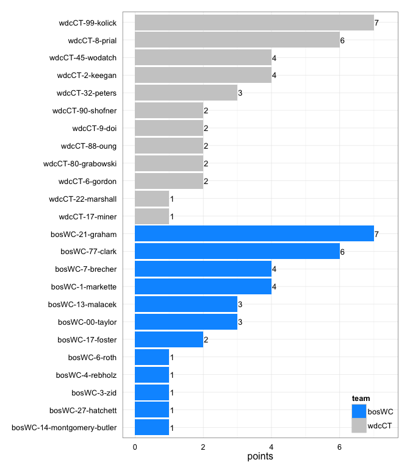
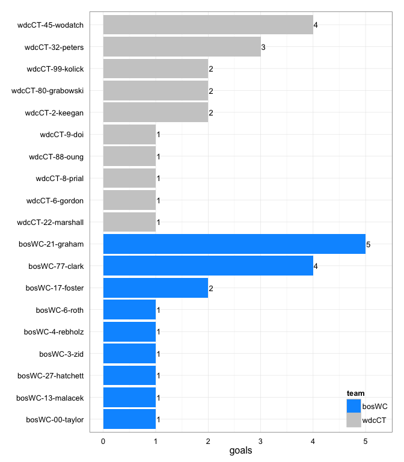
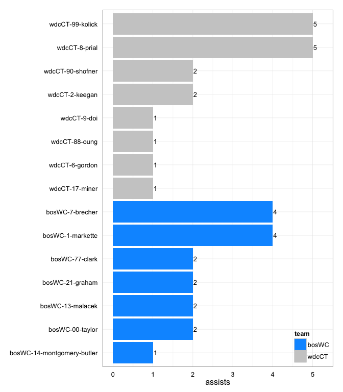
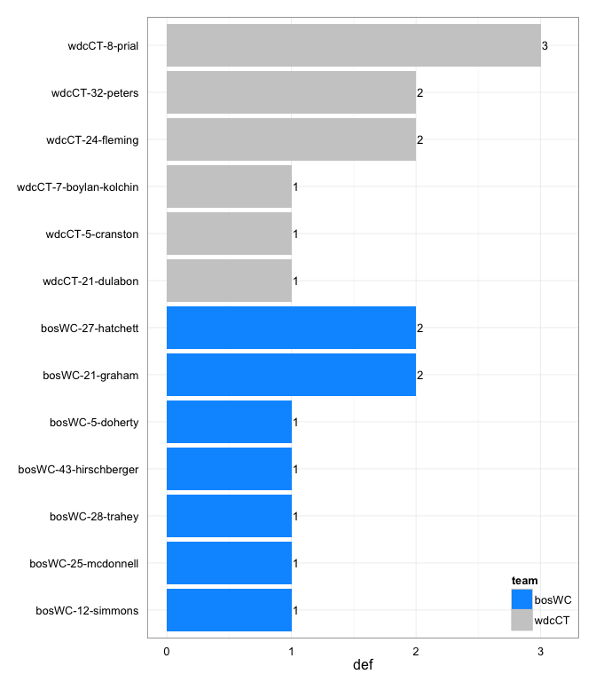

# bosWC at wdcCT 2014-04-19

# bosWC 17
# wdcCT 18
## game is complete

Go to ...  
  * [Scoring progression](#scoringProgression)  
  * [Player stats via figures](#pl_figs)  
  * [Player stats for bosWC](#away)  
  * [Player stats for wdcCT](#home)  
  * [Data on goals, assists, D's](#selectData)  
  * [Full raw data](#rawData)  

## Scoring progression:

| point|period |begin    |end     |pt_duration |desc                                            |bosWC |wdcCT |
|-----:|:------|:--------|:-------|:-----------|:-----------------------------------------------|:-----|:-----|
|    37|4      |0:29:00  |0:00:00 |00:29       |wdcCT-8-prial to wdcCT-88-oung                  |17    |18    |
|    36|4      |1:20:00  |0:29:00 |00:51       |bosWC-7-brecher to bosWC-21-graham              |17    |17    |
|    35|4      |2:32:00  |1:20:00 |01:12       |wdcCT-99-kolick to wdcCT-32-peters              |16    |17    |
|    34|4      |3:40:00  |2:32:00 |01:08       |wdcCT-6-gordon to wdcCT-22-marshall             |16    |16    |
|    33|4      |4:03:00  |3:40:00 |00:23       |wdcCT-2-keegan to wdcCT-45-wodatch              |16    |15    |
|    32|4      |7:21:00  |4:03:00 |03:18       |bosWC-1-markette to bosWC-21-graham             |16    |14    |
|    31|4      |10:00:00 |7:21:00 |02:39       |wdcCT-8-prial to wdcCT-9-doi                    |15    |14    |
|    30|3      |0:34:00  |0:00:00 |00:34       |- no goal -                                     |15    |13    |
|    29|3      |1:03:00  |0:34:00 |00:29       |bosWC-7-brecher to bosWC-77-clark               |15    |13    |
|    28|3      |1:28:00  |1:03:00 |00:25       |wdcCT-99-kolick to wdcCT-2-keegan               |14    |13    |
|    27|3      |5:09:00  |1:28:00 |03:41       |bosWC-77-clark to bosWC-4-rebholz               |14    |12    |
|    26|3      |5:40:00  |5:09:00 |00:31       |wdcCT-99-kolick to wdcCT-2-keegan               |13    |12    |
|    25|3      |7:23:00  |5:40:00 |01:43       |bosWC-7-brecher to bosWC-6-roth                 |13    |11    |
|    24|3      |7:52:00  |7:23:00 |00:29       |wdcCT-8-prial to wdcCT-80-grabowski             |12    |11    |
|    23|3      |8:24:00  |7:52:00 |00:32       |bosWC-13-malacek to bosWC-17-foster             |12    |10    |
|    22|3      |8:43:00  |8:24:00 |00:19       |wdcCT-90-shofner to wdcCT-45-wodatch            |11    |10    |
|    21|3      |9:11:00  |8:43:00 |00:28       |bosWC-14-montgomery-butler to bosWC-27-hatchett |11    |9     |
|    20|3      |10:00:00 |9:11:00 |00:49       |bosWC-00-taylor to bosWC-77-clark               |10    |9     |
|    19|2      |1:35:00  |0:00:00 |01:35       |- no goal -                                     |9     |9     |
|    18|2      |3:26:00  |1:35:00 |01:51       |bosWC-13-malacek to bosWC-21-graham             |9     |9     |
|    17|2      |4:25:00  |3:26:00 |00:59       |bosWC-1-markette to bosWC-3-zid                 |8     |9     |
|    16|2      |5:54:00  |4:25:00 |01:29       |wdcCT-90-shofner to wdcCT-45-wodatch            |7     |9     |
|    15|2      |7:07:00  |5:54:00 |01:13       |wdcCT-8-prial to wdcCT-99-kolick                |7     |8     |
|    14|2      |7:28:00  |7:07:00 |00:21       |bosWC-21-graham to bosWC-77-clark               |7     |7     |
|    13|2      |10:00:00 |7:28:00 |02:32       |wdcCT-2-keegan to wdcCT-99-kolick               |6     |7     |
|    12|1      |0:42:00  |0:00:00 |00:42       |bosWC-1-markette to bosWC-21-graham             |6     |6     |
|    11|1      |1:26:00  |0:42:00 |00:44       |wdcCT-99-kolick to wdcCT-32-peters              |5     |6     |
|    10|1      |2:25:00  |1:26:00 |00:59       |bosWC-7-brecher to bosWC-21-graham              |5     |5     |
|     9|1      |3:46:00  |2:25:00 |01:21       |wdcCT-17-miner to wdcCT-6-gordon                |4     |5     |
|     8|1      |4:05:00  |3:46:00 |00:19       |wdcCT-8-prial to wdcCT-80-grabowski             |4     |4     |
|     7|1      |4:39:00  |4:05:00 |00:34       |bosWC-00-taylor to bosWC-13-malacek             |4     |3     |
|     6|1      |6:44:00  |4:39:00 |02:05       |wdcCT-99-kolick to wdcCT-32-peters              |3     |3     |
|     5|1      |7:29:00  |6:44:00 |00:45       |bosWC-77-clark to bosWC-17-foster               |3     |2     |
|     4|1      |8:02:00  |7:29:00 |00:33       |wdcCT-88-oung to wdcCT-8-prial                  |2     |2     |
|     3|1      |8:17:00  |8:02:00 |00:15       |bosWC-21-graham to bosWC-77-clark               |2     |1     |
|     2|1      |8:45:00  |8:17:00 |00:28       |wdcCT-9-doi to wdcCT-45-wodatch                 |1     |1     |
|     1|1      |10:00:00 |8:45:00 |01:15       |bosWC-1-markette to bosWC-00-taylor             |1     |0     |

## Player stats via figures:

### Points = goals + assists

 

### Goals

 

### Assists

 

### D's
 

## Player stats for bosWC :

points = goals + assists  
tables sorted in decreasing order based on points (then goals, assists, Ds)  
Ds = total of plain ol' D's + interceptions (D), hand blocks (HB), and foot blocks (FB)  
stats are cumulative for this game

|   |player   |last              | points| comp_pct| goals| assists| throws| completions| catches| def| drop|
|:--|:--------|:-----------------|------:|--------:|-----:|-------:|------:|-----------:|-------:|---:|----:|
|1  |bosWC-21 |graham            |      7|     0.97|     5|       2|     31|          30|      36|   2|    0|
|2  |bosWC-77 |clark             |      6|     0.94|     4|       2|     18|          17|      22|   0|    1|
|3  |bosWC-1  |markette          |      4|     0.90|     0|       4|     30|          27|      28|   0|    1|
|4  |bosWC-7  |brecher           |      4|     0.90|     0|       4|     10|           9|       8|   0|    0|
|5  |bosWC-00 |taylor            |      3|     1.00|     1|       2|     39|          39|      31|   0|    0|
|6  |bosWC-13 |malacek           |      3|     0.95|     1|       2|     41|          39|      30|   0|    0|
|7  |bosWC-17 |foster            |      2|     0.90|     2|       0|     10|           9|      12|   0|    1|
|8  |bosWC-27 |hatchett          |      1|     1.00|     1|       0|      1|           1|       1|   2|    0|
|9  |bosWC-3  |zid               |      1|     0.83|     1|       0|      6|           5|       7|   0|    0|
|10 |bosWC-4  |rebholz           |      1|     0.92|     1|       0|     38|          35|      36|   0|    0|
|11 |bosWC-6  |roth              |      1|       NA|     1|       0|      0|           0|       1|   0|    0|
|12 |bosWC-14 |montgomery-butler |      1|     1.00|     0|       1|      6|           6|       4|   0|    0|
|13 |bosWC-12 |simmons           |      0|     0.88|     0|       0|      8|           7|       6|   1|    0|
|14 |bosWC-25 |mcdonnell         |      0|     1.00|     0|       0|      1|           1|       0|   1|    0|
|15 |bosWC-28 |trahey            |      0|     0.50|     0|       0|      2|           1|       2|   1|    0|
|16 |bosWC-43 |hirschberger      |      0|     0.50|     0|       0|      2|           1|       1|   1|    0|
|17 |bosWC-5  |doherty           |      0|       NA|     0|       0|      0|           0|       0|   1|    0|
|18 |bosWC-11 |foster            |      0|     0.50|     0|       0|      2|           1|       2|   0|    0|
|19 |bosWC-64 |farnsworth        |      0|     0.00|     0|       0|      1|           0|       1|   0|    0|

## Player stats for wdcCT :

points = goals + assists  
tables sorted in decreasing order based on points (then goals, assists, Ds)  
Ds = total of plain ol' D's + interceptions (D), hand blocks (HB), and foot blocks (FB)  
stats are cumulative for this game

|   |player   |last           | points| comp_pct| goals| assists| throws| completions| catches| def| drop|
|:--|:--------|:--------------|------:|--------:|-----:|-------:|------:|-----------:|-------:|---:|----:|
|20 |wdcCT-99 |kolick         |      7|     1.00|     2|       5|     56|          56|      49|   0|    0|
|21 |wdcCT-8  |prial          |      6|     0.97|     1|       5|     33|          32|      32|   3|    0|
|22 |wdcCT-45 |wodatch        |      4|     1.00|     4|       0|     11|          11|      15|   0|    0|
|23 |wdcCT-2  |keegan         |      4|     0.95|     2|       2|     20|          19|      18|   0|    0|
|24 |wdcCT-32 |peters         |      3|     0.84|     3|       0|     19|          16|      16|   2|    0|
|25 |wdcCT-80 |grabowski      |      2|     0.75|     2|       0|      4|           3|       6|   0|    1|
|26 |wdcCT-6  |gordon         |      2|     1.00|     1|       1|      2|           2|       3|   0|    0|
|27 |wdcCT-88 |oung           |      2|     0.84|     1|       1|     19|          16|      13|   0|    0|
|28 |wdcCT-9  |doi            |      2|     0.91|     1|       1|     11|          10|      12|   0|    0|
|29 |wdcCT-90 |shofner        |      2|     0.84|     0|       2|     19|          16|      18|   0|    0|
|30 |wdcCT-22 |marshall       |      1|     1.00|     1|       0|      1|           1|       2|   0|    0|
|31 |wdcCT-17 |miner          |      1|     1.00|     0|       1|      4|           4|       4|   0|    0|
|32 |wdcCT-24 |fleming        |      0|     1.00|     0|       0|      1|           1|       1|   2|    0|
|33 |wdcCT-21 |dulabon        |      0|       NA|     0|       0|      0|           0|       0|   1|    0|
|34 |wdcCT-5  |cranston       |      0|     1.00|     0|       0|      8|           8|       8|   1|    0|
|35 |wdcCT-7  |boylan-kolchin |      0|       NA|     0|       0|      0|           0|       0|   1|    0|
|36 |wdcCT-1  |kantor         |      0|     1.00|     0|       0|      2|           2|       3|   0|    0|
|37 |wdcCT-12 |bellinger      |      0|     0.86|     0|       0|      7|           6|       5|   0|    0|
|38 |wdcCT-23 |tsai           |      0|     1.00|     0|       0|      1|           1|       1|   0|    0|
|39 |wdcCT-25 |gordon         |      0|     0.50|     0|       0|      2|           1|       2|   0|    0|
|40 |wdcCT-27 |johnston       |      0|     1.00|     0|       0|     10|          10|       6|   0|    0|
|41 |wdcCT-31 |cobb           |      0|     0.50|     0|       0|      2|           1|       2|   0|    0|
|42 |wdcCT-61 |salmi          |      0|     0.60|     0|       0|      5|           3|       3|   0|    0|

## Raw data on select events (goals, assists, D's):

| point| period|pull_team | event| poss_abs| poss_rel|poss_team |pl_team |pl_pnum |pl_code |pl_lname          |player                     | bosWC| wdcCT|
|-----:|------:|:---------|-----:|--------:|--------:|:---------|:-------|:-------|:-------|:-----------------|:--------------------------|-----:|-----:|
|     1|      1|wdcCT     |    18|        1|        1|bosWC     |bosWC   |1       |A       |markette          |bosWC-1-markette           |     1|     0|
|     1|      1|wdcCT     |    19|        1|        1|bosWC     |bosWC   |00      |G       |taylor            |bosWC-00-taylor            |     1|     0|
|     2|      1|bosWC     |    10|        2|        1|wdcCT     |wdcCT   |9       |A       |doi               |wdcCT-9-doi                |     1|     1|
|     2|      1|bosWC     |    11|        2|        1|wdcCT     |wdcCT   |45      |G       |wodatch           |wdcCT-45-wodatch           |     1|     1|
|     3|      1|wdcCT     |     4|        3|        1|bosWC     |bosWC   |21      |LA      |graham            |bosWC-21-graham            |     2|     1|
|     3|      1|wdcCT     |     5|        3|        1|bosWC     |bosWC   |77      |G       |clark             |bosWC-77-clark             |     2|     1|
|     4|      1|bosWC     |     8|        4|        1|wdcCT     |wdcCT   |88      |LA      |oung              |wdcCT-88-oung              |     2|     2|
|     4|      1|bosWC     |     9|        4|        1|wdcCT     |wdcCT   |8       |G       |prial             |wdcCT-8-prial              |     2|     2|
|     5|      1|wdcCT     |    11|        5|        1|bosWC     |bosWC   |77      |A       |clark             |bosWC-77-clark             |     3|     2|
|     5|      1|wdcCT     |    12|        5|        1|bosWC     |bosWC   |17      |G       |foster            |bosWC-17-foster            |     3|     2|
|     6|      1|bosWC     |    23|        8|        3|wdcCT     |wdcCT   |99      |A       |kolick            |wdcCT-99-kolick            |     3|     3|
|     6|      1|bosWC     |    25|        8|        3|wdcCT     |wdcCT   |32      |G       |peters            |wdcCT-32-peters            |     3|     3|
|     7|      1|wdcCT     |     9|        9|        1|bosWC     |bosWC   |00      |A       |taylor            |bosWC-00-taylor            |     4|     3|
|     7|      1|wdcCT     |    10|        9|        1|bosWC     |bosWC   |13      |LG      |malacek           |bosWC-13-malacek           |     4|     3|
|     8|      1|bosWC     |     6|       10|        1|wdcCT     |wdcCT   |8       |A       |prial             |wdcCT-8-prial              |     4|     4|
|     8|      1|bosWC     |     7|       10|        1|wdcCT     |wdcCT   |80      |LG      |grabowski         |wdcCT-80-grabowski         |     4|     4|
|     9|      1|wdcCT     |     4|       11|        1|bosWC     |wdcCT   |21      |D       |dulabon           |wdcCT-21-dulabon           |     4|     5|
|     9|      1|wdcCT     |    14|       12|        2|wdcCT     |wdcCT   |17      |A       |miner             |wdcCT-17-miner             |     4|     5|
|     9|      1|wdcCT     |    15|       12|        2|wdcCT     |wdcCT   |6       |G       |gordon            |wdcCT-6-gordon             |     4|     5|
|    10|      1|wdcCT     |     8|       14|        2|wdcCT     |bosWC   |21      |D       |graham            |bosWC-21-graham            |     5|     5|
|    10|      1|wdcCT     |    10|       15|        3|bosWC     |bosWC   |7       |A       |brecher           |bosWC-7-brecher            |     5|     5|
|    10|      1|wdcCT     |    11|       15|        3|bosWC     |bosWC   |21      |LG      |graham            |bosWC-21-graham            |     5|     5|
|    11|      1|bosWC     |    11|       16|        1|wdcCT     |wdcCT   |99      |A       |kolick            |wdcCT-99-kolick            |     5|     6|
|    11|      1|bosWC     |    12|       16|        1|wdcCT     |wdcCT   |32      |G       |peters            |wdcCT-32-peters            |     5|     6|
|    12|      1|wdcCT     |    12|       17|        1|bosWC     |bosWC   |1       |A       |markette          |bosWC-1-markette           |     6|     6|
|    12|      1|wdcCT     |    13|       17|        1|bosWC     |bosWC   |21      |G       |graham            |bosWC-21-graham            |     6|     6|
|    13|      2|bosWC     |    11|       18|        1|wdcCT     |bosWC   |5       |D       |doherty           |bosWC-5-doherty            |     6|     7|
|    13|      2|bosWC     |    13|       19|        2|bosWC     |wdcCT   |8       |D       |prial             |wdcCT-8-prial              |     6|     7|
|    13|      2|bosWC     |    28|       20|        3|wdcCT     |wdcCT   |2       |A       |keegan            |wdcCT-2-keegan             |     6|     7|
|    13|      2|bosWC     |    29|       20|        3|wdcCT     |wdcCT   |99      |G       |kolick            |wdcCT-99-kolick            |     6|     7|
|    14|      2|wdcCT     |     7|       21|        1|bosWC     |bosWC   |21      |A       |graham            |bosWC-21-graham            |     7|     7|
|    14|      2|wdcCT     |     8|       21|        1|bosWC     |bosWC   |77      |LG      |clark             |bosWC-77-clark             |     7|     7|
|    15|      2|bosWC     |    13|       23|        2|bosWC     |wdcCT   |32      |D       |peters            |wdcCT-32-peters            |     7|     8|
|    15|      2|bosWC     |    15|       24|        3|wdcCT     |wdcCT   |8       |A       |prial             |wdcCT-8-prial              |     7|     8|
|    15|      2|bosWC     |    16|       24|        3|wdcCT     |wdcCT   |99      |G       |kolick            |wdcCT-99-kolick            |     7|     8|
|    16|      2|wdcCT     |    11|       25|        1|bosWC     |wdcCT   |24      |D       |fleming           |wdcCT-24-fleming           |     7|     9|
|    16|      2|wdcCT     |    17|       27|        3|bosWC     |wdcCT   |5       |D       |cranston          |wdcCT-5-cranston           |     7|     9|
|    16|      2|wdcCT     |    20|       28|        4|wdcCT     |wdcCT   |90      |A       |shofner           |wdcCT-90-shofner           |     7|     9|
|    16|      2|wdcCT     |    21|       28|        4|wdcCT     |wdcCT   |45      |LG      |wodatch           |wdcCT-45-wodatch           |     7|     9|
|    17|      2|wdcCT     |    14|       31|        3|bosWC     |bosWC   |1       |A       |markette          |bosWC-1-markette           |     8|     9|
|    17|      2|wdcCT     |    15|       31|        3|bosWC     |bosWC   |3       |G       |zid               |bosWC-3-zid                |     8|     9|
|    18|      2|bosWC     |     8|       32|        1|wdcCT     |bosWC   |25      |D       |mcdonnell         |bosWC-25-mcdonnell         |     9|     9|
|    18|      2|bosWC     |    24|       33|        2|bosWC     |bosWC   |13      |A       |malacek           |bosWC-13-malacek           |     9|     9|
|    18|      2|bosWC     |    25|       33|        2|bosWC     |bosWC   |21      |G       |graham            |bosWC-21-graham            |     9|     9|
|    19|      2|bosWC     |    24|       36|        3|wdcCT     |bosWC   |12      |D       |simmons           |bosWC-12-simmons           |     9|     9|
|    19|      2|bosWC     |    26|       37|        4|bosWC     |wdcCT   |8       |D       |prial             |wdcCT-8-prial              |     9|     9|
|    20|      3|wdcCT     |    15|       38|        1|bosWC     |bosWC   |00      |A       |taylor            |bosWC-00-taylor            |    10|     9|
|    20|      3|wdcCT     |    16|       38|        1|bosWC     |bosWC   |77      |G       |clark             |bosWC-77-clark             |    10|     9|
|    21|      3|bosWC     |     9|       39|        1|wdcCT     |bosWC   |27      |D       |hatchett          |bosWC-27-hatchett          |    11|     9|
|    21|      3|bosWC     |    11|       40|        2|bosWC     |bosWC   |14      |A       |montgomery-butler |bosWC-14-montgomery-butler |    11|     9|
|    21|      3|bosWC     |    12|       40|        2|bosWC     |bosWC   |27      |LG      |hatchett          |bosWC-27-hatchett          |    11|     9|
|    22|      3|bosWC     |     6|       41|        1|wdcCT     |wdcCT   |90      |A       |shofner           |wdcCT-90-shofner           |    11|    10|
|    22|      3|bosWC     |     7|       41|        1|wdcCT     |wdcCT   |45      |LG      |wodatch           |wdcCT-45-wodatch           |    11|    10|
|    23|      3|wdcCT     |     7|       42|        1|bosWC     |bosWC   |13      |A       |malacek           |bosWC-13-malacek           |    12|    10|
|    23|      3|wdcCT     |     8|       42|        1|bosWC     |bosWC   |17      |LG      |foster            |bosWC-17-foster            |    12|    10|
|    24|      3|bosWC     |     4|       43|        1|wdcCT     |wdcCT   |8       |LA      |prial             |wdcCT-8-prial              |    12|    11|
|    24|      3|bosWC     |     5|       43|        1|wdcCT     |wdcCT   |80      |G       |grabowski         |wdcCT-80-grabowski         |    12|    11|
|    25|      3|wdcCT     |    20|       46|        3|bosWC     |wdcCT   |24      |D       |fleming           |wdcCT-24-fleming           |    13|    11|
|    25|      3|wdcCT     |    25|       48|        5|bosWC     |bosWC   |7       |PUA     |brecher           |bosWC-7-brecher            |    13|    11|
|    25|      3|wdcCT     |    26|       48|        5|bosWC     |bosWC   |6       |G       |roth              |bosWC-6-roth               |    13|    11|
|    26|      3|bosWC     |    10|       49|        1|wdcCT     |wdcCT   |99      |A       |kolick            |wdcCT-99-kolick            |    13|    12|
|    26|      3|bosWC     |    11|       49|        1|wdcCT     |wdcCT   |2       |G       |keegan            |wdcCT-2-keegan             |    13|    12|
|    27|      3|wdcCT     |    50|       52|        3|bosWC     |bosWC   |77      |A       |clark             |bosWC-77-clark             |    14|    12|
|    27|      3|wdcCT     |    51|       52|        3|bosWC     |bosWC   |4       |G       |rebholz           |bosWC-4-rebholz            |    14|    12|
|    28|      3|bosWC     |     7|       53|        1|wdcCT     |wdcCT   |99      |A       |kolick            |wdcCT-99-kolick            |    14|    13|
|    28|      3|bosWC     |     8|       53|        1|wdcCT     |wdcCT   |2       |G       |keegan            |wdcCT-2-keegan             |    14|    13|
|    29|      3|wdcCT     |     8|       54|        1|bosWC     |bosWC   |7       |A       |brecher           |bosWC-7-brecher            |    15|    13|
|    29|      3|wdcCT     |     9|       54|        1|bosWC     |bosWC   |77      |G       |clark             |bosWC-77-clark             |    15|    13|
|    30|      3|bosWC     |     6|       55|        1|wdcCT     |bosWC   |43      |D       |hirschberger      |bosWC-43-hirschberger      |    15|    13|
|    30|      3|bosWC     |     9|       56|        2|bosWC     |wdcCT   |32      |D       |peters            |wdcCT-32-peters            |    15|    13|
|    31|      4|bosWC     |     8|       58|        1|wdcCT     |bosWC   |28      |D       |trahey            |bosWC-28-trahey            |    15|    14|
|    31|      4|bosWC     |    27|       60|        3|wdcCT     |bosWC   |27      |D       |hatchett          |bosWC-27-hatchett          |    15|    14|
|    31|      4|bosWC     |    36|       61|        4|bosWC     |wdcCT   |8       |D       |prial             |wdcCT-8-prial              |    15|    14|
|    31|      4|bosWC     |    39|       62|        5|wdcCT     |wdcCT   |8       |A       |prial             |wdcCT-8-prial              |    15|    14|
|    31|      4|bosWC     |    40|       62|        5|wdcCT     |wdcCT   |9       |G       |doi               |wdcCT-9-doi                |    15|    14|
|    32|      4|wdcCT     |    20|       64|        2|wdcCT     |bosWC   |21      |D       |graham            |bosWC-21-graham            |    16|    14|
|    32|      4|wdcCT     |    39|       65|        3|bosWC     |bosWC   |1       |A       |markette          |bosWC-1-markette           |    16|    14|
|    32|      4|wdcCT     |    40|       65|        3|bosWC     |bosWC   |21      |G       |graham            |bosWC-21-graham            |    16|    14|
|    33|      4|bosWC     |     6|       66|        1|wdcCT     |wdcCT   |2       |A       |keegan            |wdcCT-2-keegan             |    16|    15|
|    33|      4|bosWC     |     7|       66|        1|wdcCT     |wdcCT   |45      |LG      |wodatch           |wdcCT-45-wodatch           |    16|    15|
|    34|      4|wdcCT     |    14|       68|        2|wdcCT     |wdcCT   |6       |A       |gordon            |wdcCT-6-gordon             |    16|    16|
|    34|      4|wdcCT     |    15|       68|        2|wdcCT     |wdcCT   |22      |G       |marshall          |wdcCT-22-marshall          |    16|    16|
|    35|      4|wdcCT     |     8|       69|        1|bosWC     |wdcCT   |7       |D       |boylan-kolchin    |wdcCT-7-boylan-kolchin     |    16|    17|
|    35|      4|wdcCT     |    18|       70|        2|wdcCT     |wdcCT   |99      |A       |kolick            |wdcCT-99-kolick            |    16|    17|
|    35|      4|wdcCT     |    19|       70|        2|wdcCT     |wdcCT   |32      |G       |peters            |wdcCT-32-peters            |    16|    17|
|    36|      4|wdcCT     |    14|       71|        1|bosWC     |bosWC   |7       |A       |brecher           |bosWC-7-brecher            |    17|    17|
|    36|      4|wdcCT     |    15|       71|        1|bosWC     |bosWC   |21      |G       |graham            |bosWC-21-graham            |    17|    17|
|    37|      4|bosWC     |     9|       72|        1|wdcCT     |wdcCT   |8       |A       |prial             |wdcCT-8-prial              |    17|    18|
|    37|      4|bosWC     |    10|       72|        1|wdcCT     |wdcCT   |88      |G       |oung              |wdcCT-88-oung              |    17|    18|

## Full raw data:

__Note: just for display purposes.__ Raw data in more useful forms can be found in the [GitHub repository](https://github.com/jennybc/vanNH). Find the game you're interested in in the `games` subdirectory.

| period| point|pull_team | event| poss_abs| poss_rel|poss_team |pl_team |pl_pnum |pl_code |
|------:|-----:|:---------|-----:|--------:|--------:|:---------|:-------|:-------|:-------|
|      1|     1|wdcCT     |     1|        1|        1|bosWC     |wdcCT   |61      |P       |
|      1|     1|wdcCT     |     2|        1|        1|bosWC     |bosWC   |4       |PU      |
|      1|     1|wdcCT     |     3|        1|        1|bosWC     |bosWC   |13      |        |
|      1|     1|wdcCT     |     4|        1|        1|bosWC     |bosWC   |21      |        |
|      1|     1|wdcCT     |     5|        1|        1|bosWC     |bosWC   |00      |        |
|      1|     1|wdcCT     |     6|        1|        1|bosWC     |bosWC   |1       |        |
|      1|     1|wdcCT     |     7|        1|        1|bosWC     |bosWC   |00      |        |
|      1|     1|wdcCT     |     8|        1|        1|bosWC     |bosWC   |77      |        |
|      1|     1|wdcCT     |     9|        1|        1|bosWC     |bosWC   |00      |        |
|      1|     1|wdcCT     |    10|        1|        1|bosWC     |bosWC   |21      |        |
|      1|     1|wdcCT     |    11|        1|        1|bosWC     |bosWC   |13      |        |
|      1|     1|wdcCT     |    12|        1|        1|bosWC     |bosWC   |1       |        |
|      1|     1|wdcCT     |    13|        1|        1|bosWC     |bosWC   |17      |        |
|      1|     1|wdcCT     |    14|        1|        1|bosWC     |bosWC   |21      |        |
|      1|     1|wdcCT     |    15|        1|        1|bosWC     |bosWC   |00      |        |
|      1|     1|wdcCT     |    16|        1|        1|bosWC     |bosWC   |4       |        |
|      1|     1|wdcCT     |    17|        1|        1|bosWC     |bosWC   |13      |        |
|      1|     1|wdcCT     |    18|        1|        1|bosWC     |bosWC   |1       |A       |
|      1|     1|wdcCT     |    19|        1|        1|bosWC     |bosWC   |00      |G       |
|      1|     2|bosWC     |     1|        2|        1|wdcCT     |bosWC   |11      |P       |
|      1|     2|bosWC     |     2|        2|        1|wdcCT     |wdcCT   |88      |PU      |
|      1|     2|bosWC     |     3|        2|        1|wdcCT     |wdcCT   |99      |        |
|      1|     2|bosWC     |     4|        2|        1|wdcCT     |wdcCT   |90      |        |
|      1|     2|bosWC     |     5|        2|        1|wdcCT     |wdcCT   |99      |        |
|      1|     2|bosWC     |     6|        2|        1|wdcCT     |wdcCT   |90      |        |
|      1|     2|bosWC     |     7|        2|        1|wdcCT     |wdcCT   |99      |        |
|      1|     2|bosWC     |     8|        2|        1|wdcCT     |wdcCT   |45      |        |
|      1|     2|bosWC     |     9|        2|        1|wdcCT     |wdcCT   |8       |        |
|      1|     2|bosWC     |    10|        2|        1|wdcCT     |wdcCT   |9       |A       |
|      1|     2|bosWC     |    11|        2|        1|wdcCT     |wdcCT   |45      |G       |
|      1|     3|wdcCT     |     1|        3|        1|bosWC     |wdcCT   |22      |P       |
|      1|     3|wdcCT     |     2|        3|        1|bosWC     |bosWC   |13      |PU      |
|      1|     3|wdcCT     |     3|        3|        1|bosWC     |bosWC   |4       |        |
|      1|     3|wdcCT     |     4|        3|        1|bosWC     |bosWC   |21      |LA      |
|      1|     3|wdcCT     |     5|        3|        1|bosWC     |bosWC   |77      |G       |
|      1|     4|bosWC     |     1|        4|        1|wdcCT     |bosWC   |43      |P       |
|      1|     4|bosWC     |     2|        4|        1|wdcCT     |wdcCT   |88      |PU      |
|      1|     4|bosWC     |     3|        4|        1|wdcCT     |wdcCT   |99      |        |
|      1|     4|bosWC     |     4|        4|        1|wdcCT     |wdcCT   |8       |        |
|      1|     4|bosWC     |     5|        4|        1|wdcCT     |wdcCT   |99      |        |
|      1|     4|bosWC     |     6|        4|        1|wdcCT     |wdcCT   |8       |        |
|      1|     4|bosWC     |     7|        4|        1|wdcCT     |wdcCT   |99      |        |
|      1|     4|bosWC     |     8|        4|        1|wdcCT     |wdcCT   |88      |LA      |
|      1|     4|bosWC     |     9|        4|        1|wdcCT     |wdcCT   |8       |G       |
|      1|     5|wdcCT     |     1|        5|        1|bosWC     |wdcCT   |61      |P       |
|      1|     5|wdcCT     |     2|        5|        1|bosWC     |bosWC   |00      |PU      |
|      1|     5|wdcCT     |     3|        5|        1|bosWC     |bosWC   |13      |        |
|      1|     5|wdcCT     |     4|        5|        1|bosWC     |bosWC   |1       |        |
|      1|     5|wdcCT     |     5|        5|        1|bosWC     |bosWC   |21      |        |
|      1|     5|wdcCT     |     6|        5|        1|bosWC     |bosWC   |1       |        |
|      1|     5|wdcCT     |     7|        5|        1|bosWC     |bosWC   |21      |        |
|      1|     5|wdcCT     |     8|        5|        1|bosWC     |bosWC   |00      |        |
|      1|     5|wdcCT     |     9|        5|        1|bosWC     |bosWC   |1       |        |
|      1|     5|wdcCT     |    10|        5|        1|bosWC     |bosWC   |00      |        |
|      1|     5|wdcCT     |    11|        5|        1|bosWC     |bosWC   |77      |A       |
|      1|     5|wdcCT     |    12|        5|        1|bosWC     |bosWC   |17      |G       |
|      1|     6|bosWC     |     1|        6|        1|wdcCT     |bosWC   |7       |P       |
|      1|     6|bosWC     |     2|        6|        1|wdcCT     |wdcCT   |88      |PU      |
|      1|     6|bosWC     |     3|        6|        1|wdcCT     |wdcCT   |99      |        |
|      1|     6|bosWC     |     4|        6|        1|wdcCT     |wdcCT   |27      |        |
|      1|     6|bosWC     |     5|        6|        1|wdcCT     |wdcCT   |32      |        |
|      1|     6|bosWC     |     6|        7|        2|bosWC     |bosWC   |12      |PU      |
|      1|     6|bosWC     |     7|        7|        2|bosWC     |bosWC   |11      |        |
|      1|     6|bosWC     |     8|        8|        3|wdcCT     |wdcCT   |99      |PU      |
|      1|     6|bosWC     |     9|        8|        3|wdcCT     |wdcCT   |88      |        |
|      1|     6|bosWC     |    10|        8|        3|wdcCT     |wdcCT   |27      |        |
|      1|     6|bosWC     |    11|        8|        3|wdcCT     |wdcCT   |8       |        |
|      1|     6|bosWC     |    12|        8|        3|wdcCT     |wdcCT   |80      |        |
|      1|     6|bosWC     |    13|        8|        3|wdcCT     |wdcCT   |8       |        |
|      1|     6|bosWC     |    14|        8|        3|wdcCT     |wdcCT   |9       |        |
|      1|     6|bosWC     |    15|        8|        3|wdcCT     |wdcCT   |8       |        |
|      1|     6|bosWC     |    16|        8|        3|wdcCT     |wdcCT   |27      |        |
|      1|     6|bosWC     |    17|        8|        3|wdcCT     |wdcCT   |99      |        |
|      1|     6|bosWC     |    18|        8|        3|wdcCT     |wdcCT   |27      |        |
|      1|     6|bosWC     |    19|        8|        3|wdcCT     |wdcCT   |8       |        |
|      1|     6|bosWC     |    20|        8|        3|wdcCT     |wdcCT   |99      |        |
|      1|     6|bosWC     |    21|        8|        3|wdcCT     |wdcCT   |8       |        |
|      1|     6|bosWC     |    22|        8|        3|wdcCT     |wdcCT   |88      |        |
|      1|     6|bosWC     |    23|        8|        3|wdcCT     |wdcCT   |99      |A       |
|      1|     6|bosWC     |    24|        8|        3|wdcCT     |bosWC   |14      |F       |
|      1|     6|bosWC     |    25|        8|        3|wdcCT     |wdcCT   |32      |G       |
|      1|     7|wdcCT     |     1|        9|        1|bosWC     |wdcCT   |22      |P       |
|      1|     7|wdcCT     |     2|        9|        1|bosWC     |bosWC   |00      |PU      |
|      1|     7|wdcCT     |     3|        9|        1|bosWC     |bosWC   |4       |        |
|      1|     7|wdcCT     |     4|        9|        1|bosWC     |bosWC   |3       |        |
|      1|     7|wdcCT     |     5|        9|        1|bosWC     |bosWC   |21      |        |
|      1|     7|wdcCT     |     6|        9|        1|bosWC     |bosWC   |13      |        |
|      1|     7|wdcCT     |     7|        9|        1|bosWC     |bosWC   |21      |        |
|      1|     7|wdcCT     |     8|        9|        1|bosWC     |bosWC   |4       |        |
|      1|     7|wdcCT     |     9|        9|        1|bosWC     |bosWC   |00      |A       |
|      1|     7|wdcCT     |    10|        9|        1|bosWC     |bosWC   |13      |LG      |
|      1|     8|bosWC     |     1|       10|        1|wdcCT     |bosWC   |43      |P       |
|      1|     8|bosWC     |     2|       10|        1|wdcCT     |wdcCT   |8       |PU      |
|      1|     8|bosWC     |     3|       10|        1|wdcCT     |wdcCT   |99      |        |
|      1|     8|bosWC     |     4|       10|        1|wdcCT     |wdcCT   |90      |        |
|      1|     8|bosWC     |     5|       10|        1|wdcCT     |wdcCT   |45      |        |
|      1|     8|bosWC     |     6|       10|        1|wdcCT     |wdcCT   |8       |A       |
|      1|     8|bosWC     |     7|       10|        1|wdcCT     |wdcCT   |80      |LG      |
|      1|     9|wdcCT     |     1|       11|        1|bosWC     |wdcCT   |61      |P       |
|      1|     9|wdcCT     |     2|       11|        1|bosWC     |bosWC   |13      |PU      |
|      1|     9|wdcCT     |     3|       11|        1|bosWC     |bosWC   |4       |        |
|      1|     9|wdcCT     |     4|       11|        1|bosWC     |wdcCT   |21      |D       |
|      1|     9|wdcCT     |     5|       12|        2|wdcCT     |wdcCT   |12      |PU      |
|      1|     9|wdcCT     |     6|       12|        2|wdcCT     |wdcCT   |5       |        |
|      1|     9|wdcCT     |     7|       12|        2|wdcCT     |wdcCT   |61      |        |
|      1|     9|wdcCT     |     8|       12|        2|wdcCT     |wdcCT   |17      |        |
|      1|     9|wdcCT     |     9|       12|        2|wdcCT     |wdcCT   |24      |        |
|      1|     9|wdcCT     |    10|       12|        2|wdcCT     |wdcCT   |61      |        |
|      1|     9|wdcCT     |    11|       12|        2|wdcCT     |wdcCT   |12      |L       |
|      1|     9|wdcCT     |    12|       12|        2|wdcCT     |wdcCT   |5       |        |
|      1|     9|wdcCT     |    13|       12|        2|wdcCT     |wdcCT   |12      |        |
|      1|     9|wdcCT     |    14|       12|        2|wdcCT     |wdcCT   |17      |A       |
|      1|     9|wdcCT     |    15|       12|        2|wdcCT     |wdcCT   |6       |G       |
|      1|    10|wdcCT     |     1|       13|        1|bosWC     |wdcCT   |22      |P       |
|      1|    10|wdcCT     |     2|       13|        1|bosWC     |bosWC   |4       |PU      |
|      1|    10|wdcCT     |     3|       13|        1|bosWC     |bosWC   |21      |F       |
|      1|    10|wdcCT     |     4|       14|        2|wdcCT     |wdcCT   |27      |PU      |
|      1|    10|wdcCT     |     5|       14|        2|wdcCT     |wdcCT   |31      |        |
|      1|    10|wdcCT     |     6|       14|        2|wdcCT     |wdcCT   |27      |        |
|      1|    10|wdcCT     |     7|       14|        2|wdcCT     |wdcCT   |31      |        |
|      1|    10|wdcCT     |     8|       14|        2|wdcCT     |bosWC   |21      |D       |
|      1|    10|wdcCT     |     9|       15|        3|bosWC     |bosWC   |21      |        |
|      1|    10|wdcCT     |    10|       15|        3|bosWC     |bosWC   |7       |A       |
|      1|    10|wdcCT     |    11|       15|        3|bosWC     |bosWC   |21      |LG      |
|      1|    11|bosWC     |     1|       16|        1|wdcCT     |bosWC   |11      |P       |
|      1|    11|bosWC     |     2|       16|        1|wdcCT     |wdcCT   |90      |PU      |
|      1|    11|bosWC     |     3|       16|        1|wdcCT     |wdcCT   |45      |        |
|      1|    11|bosWC     |     4|       16|        1|wdcCT     |wdcCT   |99      |        |
|      1|    11|bosWC     |     5|       16|        1|wdcCT     |wdcCT   |9       |        |
|      1|    11|bosWC     |     6|       16|        1|wdcCT     |wdcCT   |32      |        |
|      1|    11|bosWC     |     7|       16|        1|wdcCT     |wdcCT   |8       |        |
|      1|    11|bosWC     |     8|       16|        1|wdcCT     |wdcCT   |99      |        |
|      1|    11|bosWC     |     9|       16|        1|wdcCT     |wdcCT   |45      |        |
|      1|    11|bosWC     |    10|       16|        1|wdcCT     |wdcCT   |9       |        |
|      1|    11|bosWC     |    11|       16|        1|wdcCT     |wdcCT   |99      |A       |
|      1|    11|bosWC     |    12|       16|        1|wdcCT     |wdcCT   |32      |G       |
|      1|    12|wdcCT     |     1|       17|        1|bosWC     |wdcCT   |61      |P       |
|      1|    12|wdcCT     |     2|       17|        1|bosWC     |bosWC   |00      |PU      |
|      1|    12|wdcCT     |     3|       17|        1|bosWC     |bosWC   |4       |        |
|      1|    12|wdcCT     |     4|       17|        1|bosWC     |bosWC   |17      |        |
|      1|    12|wdcCT     |     5|       17|        1|bosWC     |bosWC   |1       |        |
|      1|    12|wdcCT     |     6|       17|        1|bosWC     |bosWC   |13      |        |
|      1|    12|wdcCT     |     7|       17|        1|bosWC     |bosWC   |00      |        |
|      1|    12|wdcCT     |     8|       17|        1|bosWC     |bosWC   |1       |        |
|      1|    12|wdcCT     |     9|       17|        1|bosWC     |bosWC   |4       |        |
|      1|    12|wdcCT     |    10|       17|        1|bosWC     |bosWC   |13      |        |
|      1|    12|wdcCT     |    11|       17|        1|bosWC     |bosWC   |4       |        |
|      1|    12|wdcCT     |    12|       17|        1|bosWC     |bosWC   |1       |A       |
|      1|    12|wdcCT     |    13|       17|        1|bosWC     |bosWC   |21      |G       |
|      2|    13|bosWC     |     1|       18|        1|wdcCT     |bosWC   |43      |P       |
|      2|    13|bosWC     |     2|       18|        1|wdcCT     |wdcCT   |88      |PU      |
|      2|    13|bosWC     |     3|       18|        1|wdcCT     |wdcCT   |8       |        |
|      2|    13|bosWC     |     4|       18|        1|wdcCT     |wdcCT   |88      |        |
|      2|    13|bosWC     |     5|       18|        1|wdcCT     |wdcCT   |99      |        |
|      2|    13|bosWC     |     6|       18|        1|wdcCT     |wdcCT   |45      |        |
|      2|    13|bosWC     |     7|       18|        1|wdcCT     |wdcCT   |90      |        |
|      2|    13|bosWC     |     8|       18|        1|wdcCT     |wdcCT   |8       |        |
|      2|    13|bosWC     |     9|       18|        1|wdcCT     |wdcCT   |99      |        |
|      2|    13|bosWC     |    10|       18|        1|wdcCT     |wdcCT   |88      |        |
|      2|    13|bosWC     |    11|       18|        1|wdcCT     |bosWC   |5       |D       |
|      2|    13|bosWC     |    12|       19|        2|bosWC     |bosWC   |43      |PU      |
|      2|    13|bosWC     |    13|       19|        2|bosWC     |wdcCT   |8       |D       |
|      2|    13|bosWC     |    14|       20|        3|wdcCT     |wdcCT   |99      |PU      |
|      2|    13|bosWC     |    15|       20|        3|wdcCT     |wdcCT   |90      |        |
|      2|    13|bosWC     |    16|       20|        3|wdcCT     |wdcCT   |80      |        |
|      2|    13|bosWC     |    17|       20|        3|wdcCT     |wdcCT   |8       |        |
|      2|    13|bosWC     |    18|       20|        3|wdcCT     |wdcCT   |99      |        |
|      2|    13|bosWC     |    19|       20|        3|wdcCT     |wdcCT   |8       |        |
|      2|    13|bosWC     |    20|       20|        3|wdcCT     |wdcCT   |90      |        |
|      2|    13|bosWC     |    21|       20|        3|wdcCT     |wdcCT   |8       |        |
|      2|    13|bosWC     |    22|       20|        3|wdcCT     |bosWC   |64      |F       |
|      2|    13|bosWC     |    23|       20|        3|wdcCT     |wdcCT   |99      |        |
|      2|    13|bosWC     |    24|       20|        3|wdcCT     |wdcCT   |88      |        |
|      2|    13|bosWC     |    25|       20|        3|wdcCT     |wdcCT   |90      |L       |
|      2|    13|bosWC     |    26|       20|        3|wdcCT     |wdcCT   |90      |SO      |
|      2|    13|bosWC     |    27|       20|        3|wdcCT     |wdcCT   |32      |SI      |
|      2|    13|bosWC     |    28|       20|        3|wdcCT     |wdcCT   |2       |A       |
|      2|    13|bosWC     |    29|       20|        3|wdcCT     |wdcCT   |99      |G       |
|      2|    14|wdcCT     |     1|       21|        1|bosWC     |wdcCT   |22      |P       |
|      2|    14|wdcCT     |     2|       21|        1|bosWC     |bosWC   |00      |PU      |
|      2|    14|wdcCT     |     3|       21|        1|bosWC     |bosWC   |13      |        |
|      2|    14|wdcCT     |     4|       21|        1|bosWC     |bosWC   |77      |        |
|      2|    14|wdcCT     |     5|       21|        1|bosWC     |bosWC   |4       |        |
|      2|    14|wdcCT     |     6|       21|        1|bosWC     |bosWC   |00      |        |
|      2|    14|wdcCT     |     7|       21|        1|bosWC     |bosWC   |21      |A       |
|      2|    14|wdcCT     |     8|       21|        1|bosWC     |bosWC   |77      |LG      |
|      2|    15|bosWC     |     1|       22|        1|wdcCT     |bosWC   |11      |P       |
|      2|    15|bosWC     |     2|       22|        1|wdcCT     |wdcCT   |99      |PU      |
|      2|    15|bosWC     |     3|       22|        1|wdcCT     |wdcCT   |2       |        |
|      2|    15|bosWC     |     4|       22|        1|wdcCT     |wdcCT   |8       |        |
|      2|    15|bosWC     |     5|       22|        1|wdcCT     |wdcCT   |45      |        |
|      2|    15|bosWC     |     6|       22|        1|wdcCT     |wdcCT   |32      |        |
|      2|    15|bosWC     |     7|       22|        1|wdcCT     |bosWC   |25      |F       |
|      2|    15|bosWC     |     8|       22|        1|wdcCT     |wdcCT   |2       |        |
|      2|    15|bosWC     |     9|       22|        1|wdcCT     |wdcCT   |80      |        |
|      2|    15|bosWC     |    10|       22|        1|wdcCT     |wdcCT   |8       |TD      |
|      2|    15|bosWC     |    11|       23|        2|bosWC     |bosWC   |14      |PU      |
|      2|    15|bosWC     |    12|       23|        2|bosWC     |bosWC   |28      |        |
|      2|    15|bosWC     |    13|       23|        2|bosWC     |wdcCT   |32      |D       |
|      2|    15|bosWC     |    14|       24|        3|wdcCT     |wdcCT   |88      |PU      |
|      2|    15|bosWC     |    15|       24|        3|wdcCT     |wdcCT   |8       |A       |
|      2|    15|bosWC     |    16|       24|        3|wdcCT     |wdcCT   |99      |G       |
|      2|    16|wdcCT     |     1|       25|        1|bosWC     |wdcCT   |61      |P       |
|      2|    16|wdcCT     |     2|       25|        1|bosWC     |bosWC   |00      |PU      |
|      2|    16|wdcCT     |     3|       25|        1|bosWC     |bosWC   |4       |        |
|      2|    16|wdcCT     |     4|       25|        1|bosWC     |bosWC   |00      |        |
|      2|    16|wdcCT     |     5|       25|        1|bosWC     |bosWC   |1       |        |
|      2|    16|wdcCT     |     6|       25|        1|bosWC     |bosWC   |21      |        |
|      2|    16|wdcCT     |     7|       25|        1|bosWC     |bosWC   |00      |        |
|      2|    16|wdcCT     |     8|       25|        1|bosWC     |bosWC   |21      |        |
|      2|    16|wdcCT     |     9|       25|        1|bosWC     |bosWC   |00      |        |
|      2|    16|wdcCT     |    10|       25|        1|bosWC     |bosWC   |1       |        |
|      2|    16|wdcCT     |    11|       25|        1|bosWC     |wdcCT   |24      |D       |
|      2|    16|wdcCT     |    12|       26|        2|wdcCT     |wdcCT   |12      |PU      |
|      2|    16|wdcCT     |    13|       26|        2|wdcCT     |wdcCT   |5       |        |
|      2|    16|wdcCT     |    14|       26|        2|wdcCT     |wdcCT   |12      |        |
|      2|    16|wdcCT     |    15|       27|        3|bosWC     |bosWC   |21      |PU      |
|      2|    16|wdcCT     |    16|       27|        3|bosWC     |bosWC   |4       |        |
|      2|    16|wdcCT     |    17|       27|        3|bosWC     |wdcCT   |5       |D       |
|      2|    16|wdcCT     |    18|       28|        4|wdcCT     |wdcCT   |61      |TO      |
|      2|    16|wdcCT     |    19|       28|        4|wdcCT     |wdcCT   |99      |PU      |
|      2|    16|wdcCT     |    20|       28|        4|wdcCT     |wdcCT   |90      |A       |
|      2|    16|wdcCT     |    21|       28|        4|wdcCT     |wdcCT   |45      |LG      |
|      2|    17|wdcCT     |     1|       29|        1|bosWC     |wdcCT   |22      |P       |
|      2|    17|wdcCT     |     2|       29|        1|bosWC     |bosWC   |00      |PU      |
|      2|    17|wdcCT     |     3|       29|        1|bosWC     |bosWC   |13      |        |
|      2|    17|wdcCT     |     4|       29|        1|bosWC     |bosWC   |3       |        |
|      2|    17|wdcCT     |     5|       29|        1|bosWC     |bosWC   |00      |        |
|      2|    17|wdcCT     |     6|       29|        1|bosWC     |bosWC   |21      |        |
|      2|    17|wdcCT     |     7|       29|        1|bosWC     |bosWC   |1       |        |
|      2|    17|wdcCT     |     8|       29|        1|bosWC     |bosWC   |21      |TD      |
|      2|    17|wdcCT     |     9|       30|        2|wdcCT     |wdcCT   |27      |PU      |
|      2|    17|wdcCT     |    10|       30|        2|wdcCT     |wdcCT   |22      |        |
|      2|    17|wdcCT     |    11|       30|        2|wdcCT     |wdcCT   |25      |        |
|      2|    17|wdcCT     |    12|       31|        3|bosWC     |bosWC   |13      |PU      |
|      2|    17|wdcCT     |    13|       31|        3|bosWC     |bosWC   |77      |        |
|      2|    17|wdcCT     |    14|       31|        3|bosWC     |bosWC   |1       |A       |
|      2|    17|wdcCT     |    15|       31|        3|bosWC     |bosWC   |3       |G       |
|      2|    18|bosWC     |     1|       32|        1|wdcCT     |bosWC   |11      |P       |
|      2|    18|bosWC     |     2|       32|        1|wdcCT     |wdcCT   |2       |PU      |
|      2|    18|bosWC     |     3|       32|        1|wdcCT     |wdcCT   |99      |        |
|      2|    18|bosWC     |     4|       32|        1|wdcCT     |wdcCT   |2       |        |
|      2|    18|bosWC     |     5|       32|        1|wdcCT     |wdcCT   |90      |        |
|      2|    18|bosWC     |     6|       32|        1|wdcCT     |wdcCT   |2       |        |
|      2|    18|bosWC     |     7|       32|        1|wdcCT     |wdcCT   |90      |        |
|      2|    18|bosWC     |     8|       32|        1|wdcCT     |bosWC   |25      |D       |
|      2|    18|bosWC     |     9|       33|        2|bosWC     |bosWC   |13      |PU      |
|      2|    18|bosWC     |    10|       33|        2|bosWC     |bosWC   |1       |        |
|      2|    18|bosWC     |    11|       33|        2|bosWC     |bosWC   |13      |        |
|      2|    18|bosWC     |    12|       33|        2|bosWC     |bosWC   |17      |        |
|      2|    18|bosWC     |    13|       33|        2|bosWC     |bosWC   |1       |        |
|      2|    18|bosWC     |    14|       33|        2|bosWC     |bosWC   |13      |        |
|      2|    18|bosWC     |    15|       33|        2|bosWC     |bosWC   |21      |        |
|      2|    18|bosWC     |    16|       33|        2|bosWC     |bosWC   |17      |        |
|      2|    18|bosWC     |    17|       33|        2|bosWC     |bosWC   |21      |        |
|      2|    18|bosWC     |    18|       33|        2|bosWC     |bosWC   |4       |        |
|      2|    18|bosWC     |    19|       33|        2|bosWC     |bosWC   |13      |        |
|      2|    18|bosWC     |    20|       33|        2|bosWC     |bosWC   |77      |        |
|      2|    18|bosWC     |    21|       33|        2|bosWC     |bosWC   |4       |        |
|      2|    18|bosWC     |    22|       33|        2|bosWC     |bosWC   |13      |        |
|      2|    18|bosWC     |    23|       33|        2|bosWC     |bosWC   |21      |        |
|      2|    18|bosWC     |    24|       33|        2|bosWC     |bosWC   |13      |A       |
|      2|    18|bosWC     |    25|       33|        2|bosWC     |bosWC   |21      |G       |
|      2|    19|bosWC     |     1|       34|        1|wdcCT     |bosWC   |43      |P       |
|      2|    19|bosWC     |     2|       34|        1|wdcCT     |wdcCT   |32      |PU      |
|      2|    19|bosWC     |     3|       34|        1|wdcCT     |wdcCT   |99      |        |
|      2|    19|bosWC     |     4|       34|        1|wdcCT     |wdcCT   |32      |        |
|      2|    19|bosWC     |     5|       34|        1|wdcCT     |wdcCT   |88      |        |
|      2|    19|bosWC     |     6|       34|        1|wdcCT     |wdcCT   |8       |        |
|      2|    19|bosWC     |     7|       34|        1|wdcCT     |wdcCT   |2       |        |
|      2|    19|bosWC     |     8|       35|        2|bosWC     |bosWC   |43      |PU      |
|      2|    19|bosWC     |     9|       35|        2|bosWC     |bosWC   |7       |        |
|      2|    19|bosWC     |    10|       36|        3|wdcCT     |wdcCT   |32      |PU      |
|      2|    19|bosWC     |    11|       36|        3|wdcCT     |wdcCT   |8       |        |
|      2|    19|bosWC     |    12|       36|        3|wdcCT     |wdcCT   |32      |        |
|      2|    19|bosWC     |    13|       36|        3|wdcCT     |wdcCT   |99      |        |
|      2|    19|bosWC     |    14|       36|        3|wdcCT     |wdcCT   |2       |        |
|      2|    19|bosWC     |    15|       36|        3|wdcCT     |wdcCT   |32      |        |
|      2|    19|bosWC     |    16|       36|        3|wdcCT     |wdcCT   |9       |        |
|      2|    19|bosWC     |    17|       36|        3|wdcCT     |wdcCT   |45      |        |
|      2|    19|bosWC     |    18|       36|        3|wdcCT     |wdcCT   |32      |        |
|      2|    19|bosWC     |    19|       36|        3|wdcCT     |wdcCT   |8       |TO      |
|      2|    19|bosWC     |    20|       36|        3|wdcCT     |wdcCT   |8       |PU      |
|      2|    19|bosWC     |    21|       36|        3|wdcCT     |wdcCT   |99      |        |
|      2|    19|bosWC     |    22|       36|        3|wdcCT     |wdcCT   |2       |        |
|      2|    19|bosWC     |    23|       36|        3|wdcCT     |wdcCT   |88      |        |
|      2|    19|bosWC     |    24|       36|        3|wdcCT     |bosWC   |12      |D       |
|      2|    19|bosWC     |    25|       37|        4|bosWC     |bosWC   |13      |PU      |
|      2|    19|bosWC     |    26|       37|        4|bosWC     |wdcCT   |8       |D       |
|      3|    20|wdcCT     |     1|       38|        1|bosWC     |wdcCT   |61      |P       |
|      3|    20|wdcCT     |     2|       38|        1|bosWC     |bosWC   |4       |PU      |
|      3|    20|wdcCT     |     3|       38|        1|bosWC     |bosWC   |13      |        |
|      3|    20|wdcCT     |     4|       38|        1|bosWC     |bosWC   |4       |        |
|      3|    20|wdcCT     |     5|       38|        1|bosWC     |bosWC   |13      |        |
|      3|    20|wdcCT     |     6|       38|        1|bosWC     |bosWC   |00      |        |
|      3|    20|wdcCT     |     7|       38|        1|bosWC     |bosWC   |13      |        |
|      3|    20|wdcCT     |     8|       38|        1|bosWC     |bosWC   |1       |        |
|      3|    20|wdcCT     |     9|       38|        1|bosWC     |bosWC   |21      |        |
|      3|    20|wdcCT     |    10|       38|        1|bosWC     |bosWC   |13      |        |
|      3|    20|wdcCT     |    11|       38|        1|bosWC     |bosWC   |4       |        |
|      3|    20|wdcCT     |    12|       38|        1|bosWC     |bosWC   |00      |        |
|      3|    20|wdcCT     |    13|       38|        1|bosWC     |bosWC   |77      |        |
|      3|    20|wdcCT     |    14|       38|        1|bosWC     |bosWC   |13      |        |
|      3|    20|wdcCT     |    15|       38|        1|bosWC     |bosWC   |00      |A       |
|      3|    20|wdcCT     |    16|       38|        1|bosWC     |bosWC   |77      |G       |
|      3|    21|bosWC     |     1|       39|        1|wdcCT     |bosWC   |11      |P       |
|      3|    21|bosWC     |     2|       39|        1|wdcCT     |wdcCT   |2       |PU      |
|      3|    21|bosWC     |     3|       39|        1|wdcCT     |wdcCT   |99      |        |
|      3|    21|bosWC     |     4|       39|        1|wdcCT     |wdcCT   |90      |        |
|      3|    21|bosWC     |     5|       39|        1|wdcCT     |wdcCT   |99      |        |
|      3|    21|bosWC     |     6|       39|        1|wdcCT     |wdcCT   |90      |        |
|      3|    21|bosWC     |     7|       39|        1|wdcCT     |wdcCT   |99      |        |
|      3|    21|bosWC     |     8|       39|        1|wdcCT     |wdcCT   |90      |        |
|      3|    21|bosWC     |     9|       39|        1|wdcCT     |bosWC   |27      |D       |
|      3|    21|bosWC     |    10|       40|        2|bosWC     |bosWC   |12      |PU      |
|      3|    21|bosWC     |    11|       40|        2|bosWC     |bosWC   |14      |A       |
|      3|    21|bosWC     |    12|       40|        2|bosWC     |bosWC   |27      |LG      |
|      3|    22|bosWC     |     1|       41|        1|wdcCT     |bosWC   |43      |P       |
|      3|    22|bosWC     |     2|       41|        1|wdcCT     |wdcCT   |8       |PU      |
|      3|    22|bosWC     |     3|       41|        1|wdcCT     |wdcCT   |99      |        |
|      3|    22|bosWC     |     4|       41|        1|wdcCT     |wdcCT   |9       |        |
|      3|    22|bosWC     |     5|       41|        1|wdcCT     |wdcCT   |99      |        |
|      3|    22|bosWC     |     6|       41|        1|wdcCT     |wdcCT   |90      |A       |
|      3|    22|bosWC     |     7|       41|        1|wdcCT     |wdcCT   |45      |LG      |
|      3|    23|wdcCT     |     1|       42|        1|bosWC     |wdcCT   |22      |P       |
|      3|    23|wdcCT     |     2|       42|        1|bosWC     |bosWC   |13      |PU      |
|      3|    23|wdcCT     |     3|       42|        1|bosWC     |bosWC   |4       |        |
|      3|    23|wdcCT     |     4|       42|        1|bosWC     |bosWC   |77      |        |
|      3|    23|wdcCT     |     5|       42|        1|bosWC     |bosWC   |4       |        |
|      3|    23|wdcCT     |     6|       42|        1|bosWC     |bosWC   |00      |        |
|      3|    23|wdcCT     |     7|       42|        1|bosWC     |bosWC   |13      |A       |
|      3|    23|wdcCT     |     8|       42|        1|bosWC     |bosWC   |17      |LG      |
|      3|    24|bosWC     |     1|       43|        1|wdcCT     |bosWC   |11      |P       |
|      3|    24|bosWC     |     2|       43|        1|wdcCT     |wdcCT   |32      |PU      |
|      3|    24|bosWC     |     3|       43|        1|wdcCT     |wdcCT   |99      |F       |
|      3|    24|bosWC     |     4|       43|        1|wdcCT     |wdcCT   |8       |LA      |
|      3|    24|bosWC     |     5|       43|        1|wdcCT     |wdcCT   |80      |G       |
|      3|    25|wdcCT     |     1|       44|        1|bosWC     |wdcCT   |61      |P       |
|      3|    25|wdcCT     |     2|       44|        1|bosWC     |bosWC   |13      |PU      |
|      3|    25|wdcCT     |     3|       44|        1|bosWC     |bosWC   |4       |        |
|      3|    25|wdcCT     |     4|       44|        1|bosWC     |bosWC   |13      |        |
|      3|    25|wdcCT     |     5|       44|        1|bosWC     |bosWC   |3       |        |
|      3|    25|wdcCT     |     6|       44|        1|bosWC     |bosWC   |77      |        |
|      3|    25|wdcCT     |     7|       44|        1|bosWC     |bosWC   |00      |        |
|      3|    25|wdcCT     |     8|       44|        1|bosWC     |bosWC   |21      |        |
|      3|    25|wdcCT     |     9|       44|        1|bosWC     |bosWC   |77      |        |
|      3|    25|wdcCT     |    10|       44|        1|bosWC     |bosWC   |1       |TD      |
|      3|    25|wdcCT     |    11|       45|        2|wdcCT     |wdcCT   |61      |PU      |
|      3|    25|wdcCT     |    12|       46|        3|bosWC     |bosWC   |1       |PU      |
|      3|    25|wdcCT     |    13|       46|        3|bosWC     |bosWC   |4       |        |
|      3|    25|wdcCT     |    14|       46|        3|bosWC     |bosWC   |21      |        |
|      3|    25|wdcCT     |    15|       46|        3|bosWC     |bosWC   |00      |        |
|      3|    25|wdcCT     |    16|       46|        3|bosWC     |bosWC   |77      |        |
|      3|    25|wdcCT     |    17|       46|        3|bosWC     |bosWC   |1       |        |
|      3|    25|wdcCT     |    18|       46|        3|bosWC     |bosWC   |4       |        |
|      3|    25|wdcCT     |    19|       46|        3|bosWC     |bosWC   |13      |        |
|      3|    25|wdcCT     |    20|       46|        3|bosWC     |wdcCT   |24      |D       |
|      3|    25|wdcCT     |    21|       47|        4|wdcCT     |wdcCT   |24      |TO      |
|      3|    25|wdcCT     |    22|       47|        4|wdcCT     |wdcCT   |99      |PU      |
|      3|    25|wdcCT     |    23|       47|        4|wdcCT     |wdcCT   |8       |        |
|      3|    25|wdcCT     |    24|       47|        4|wdcCT     |wdcCT   |90      |        |
|      3|    25|wdcCT     |    25|       48|        5|bosWC     |bosWC   |7       |PUA     |
|      3|    25|wdcCT     |    26|       48|        5|bosWC     |bosWC   |6       |G       |
|      3|    26|bosWC     |     1|       49|        1|wdcCT     |bosWC   |11      |P       |
|      3|    26|bosWC     |     2|       49|        1|wdcCT     |wdcCT   |32      |PU      |
|      3|    26|bosWC     |     3|       49|        1|wdcCT     |wdcCT   |99      |        |
|      3|    26|bosWC     |     4|       49|        1|wdcCT     |wdcCT   |2       |        |
|      3|    26|bosWC     |     5|       49|        1|wdcCT     |wdcCT   |80      |        |
|      3|    26|bosWC     |     6|       49|        1|wdcCT     |wdcCT   |2       |        |
|      3|    26|bosWC     |     7|       49|        1|wdcCT     |wdcCT   |99      |        |
|      3|    26|bosWC     |     8|       49|        1|wdcCT     |wdcCT   |8       |        |
|      3|    26|bosWC     |     9|       49|        1|wdcCT     |wdcCT   |9       |        |
|      3|    26|bosWC     |    10|       49|        1|wdcCT     |wdcCT   |99      |A       |
|      3|    26|bosWC     |    11|       49|        1|wdcCT     |wdcCT   |2       |G       |
|      3|    27|wdcCT     |     1|       50|        1|bosWC     |wdcCT   |22      |P       |
|      3|    27|wdcCT     |     2|       50|        1|bosWC     |bosWC   |13      |PU      |
|      3|    27|wdcCT     |     3|       50|        1|bosWC     |bosWC   |4       |        |
|      3|    27|wdcCT     |     4|       50|        1|bosWC     |bosWC   |21      |        |
|      3|    27|wdcCT     |     5|       50|        1|bosWC     |bosWC   |00      |        |
|      3|    27|wdcCT     |     6|       50|        1|bosWC     |bosWC   |1       |        |
|      3|    27|wdcCT     |     7|       50|        1|bosWC     |bosWC   |17      |        |
|      3|    27|wdcCT     |     8|       50|        1|bosWC     |bosWC   |13      |        |
|      3|    27|wdcCT     |     9|       50|        1|bosWC     |bosWC   |00      |        |
|      3|    27|wdcCT     |    10|       50|        1|bosWC     |bosWC   |21      |        |
|      3|    27|wdcCT     |    11|       50|        1|bosWC     |bosWC   |1       |        |
|      3|    27|wdcCT     |    12|       51|        2|wdcCT     |wdcCT   |27      |PU      |
|      3|    27|wdcCT     |    13|       51|        2|wdcCT     |wdcCT   |1       |        |
|      3|    27|wdcCT     |    14|       51|        2|wdcCT     |wdcCT   |27      |        |
|      3|    27|wdcCT     |    15|       51|        2|wdcCT     |wdcCT   |1       |        |
|      3|    27|wdcCT     |    16|       51|        2|wdcCT     |bosWC   |13      |F       |
|      3|    27|wdcCT     |    17|       51|        2|wdcCT     |wdcCT   |25      |        |
|      3|    27|wdcCT     |    18|       51|        2|wdcCT     |wdcCT   |1       |TO      |
|      3|    27|wdcCT     |    19|       51|        2|wdcCT     |wdcCT   |99      |PU      |
|      3|    27|wdcCT     |    20|       51|        2|wdcCT     |wdcCT   |9       |        |
|      3|    27|wdcCT     |    21|       51|        2|wdcCT     |wdcCT   |99      |        |
|      3|    27|wdcCT     |    22|       51|        2|wdcCT     |wdcCT   |45      |        |
|      3|    27|wdcCT     |    23|       51|        2|wdcCT     |wdcCT   |99      |        |
|      3|    27|wdcCT     |    24|       51|        2|wdcCT     |wdcCT   |32      |        |
|      3|    27|wdcCT     |    25|       51|        2|wdcCT     |wdcCT   |9       |        |
|      3|    27|wdcCT     |    26|       52|        3|bosWC     |bosWC   |7       |PU      |
|      3|    27|wdcCT     |    27|       52|        3|bosWC     |bosWC   |43      |TO      |
|      3|    27|wdcCT     |    28|       52|        3|bosWC     |bosWC   |13      |PU      |
|      3|    27|wdcCT     |    29|       52|        3|bosWC     |bosWC   |4       |        |
|      3|    27|wdcCT     |    30|       52|        3|bosWC     |bosWC   |77      |        |
|      3|    27|wdcCT     |    31|       52|        3|bosWC     |bosWC   |17      |        |
|      3|    27|wdcCT     |    32|       52|        3|bosWC     |bosWC   |00      |        |
|      3|    27|wdcCT     |    33|       52|        3|bosWC     |bosWC   |77      |        |
|      3|    27|wdcCT     |    34|       52|        3|bosWC     |bosWC   |4       |        |
|      3|    27|wdcCT     |    35|       52|        3|bosWC     |wdcCT   |5       |F       |
|      3|    27|wdcCT     |    36|       52|        3|bosWC     |bosWC   |13      |        |
|      3|    27|wdcCT     |    37|       52|        3|bosWC     |bosWC   |1       |        |
|      3|    27|wdcCT     |    38|       52|        3|bosWC     |bosWC   |21      |        |
|      3|    27|wdcCT     |    39|       52|        3|bosWC     |bosWC   |00      |        |
|      3|    27|wdcCT     |    40|       52|        3|bosWC     |bosWC   |1       |        |
|      3|    27|wdcCT     |    41|       52|        3|bosWC     |bosWC   |4       |        |
|      3|    27|wdcCT     |    42|       52|        3|bosWC     |bosWC   |77      |        |
|      3|    27|wdcCT     |    43|       52|        3|bosWC     |bosWC   |00      |        |
|      3|    27|wdcCT     |    44|       52|        3|bosWC     |bosWC   |1       |        |
|      3|    27|wdcCT     |    45|       52|        3|bosWC     |bosWC   |4       |        |
|      3|    27|wdcCT     |    46|       52|        3|bosWC     |bosWC   |1       |        |
|      3|    27|wdcCT     |    47|       52|        3|bosWC     |bosWC   |00      |        |
|      3|    27|wdcCT     |    48|       52|        3|bosWC     |bosWC   |17      |        |
|      3|    27|wdcCT     |    49|       52|        3|bosWC     |bosWC   |21      |        |
|      3|    27|wdcCT     |    50|       52|        3|bosWC     |bosWC   |77      |A       |
|      3|    27|wdcCT     |    51|       52|        3|bosWC     |bosWC   |4       |G       |
|      3|    28|bosWC     |     1|       53|        1|wdcCT     |bosWC   |11      |P       |
|      3|    28|bosWC     |     2|       53|        1|wdcCT     |wdcCT   |32      |PU      |
|      3|    28|bosWC     |     3|       53|        1|wdcCT     |wdcCT   |99      |        |
|      3|    28|bosWC     |     4|       53|        1|wdcCT     |wdcCT   |88      |        |
|      3|    28|bosWC     |     5|       53|        1|wdcCT     |wdcCT   |8       |        |
|      3|    28|bosWC     |     6|       53|        1|wdcCT     |wdcCT   |90      |        |
|      3|    28|bosWC     |     7|       53|        1|wdcCT     |wdcCT   |99      |A       |
|      3|    28|bosWC     |     8|       53|        1|wdcCT     |wdcCT   |2       |G       |
|      3|    29|wdcCT     |     1|       54|        1|bosWC     |wdcCT   |22      |P       |
|      3|    29|wdcCT     |     2|       54|        1|bosWC     |bosWC   |13      |PU      |
|      3|    29|wdcCT     |     3|       54|        1|bosWC     |bosWC   |4       |        |
|      3|    29|wdcCT     |     4|       54|        1|bosWC     |bosWC   |77      |        |
|      3|    29|wdcCT     |     5|       54|        1|bosWC     |bosWC   |21      |TO      |
|      3|    29|wdcCT     |     6|       54|        1|bosWC     |bosWC   |1       |PU      |
|      3|    29|wdcCT     |     7|       54|        1|bosWC     |bosWC   |4       |        |
|      3|    29|wdcCT     |     8|       54|        1|bosWC     |bosWC   |7       |A       |
|      3|    29|wdcCT     |     9|       54|        1|bosWC     |bosWC   |77      |G       |
|      3|    30|bosWC     |     1|       55|        1|wdcCT     |bosWC   |43      |P       |
|      3|    30|bosWC     |     2|       55|        1|wdcCT     |wdcCT   |2       |PU      |
|      3|    30|bosWC     |     3|       55|        1|wdcCT     |wdcCT   |99      |        |
|      3|    30|bosWC     |     4|       55|        1|wdcCT     |wdcCT   |88      |        |
|      3|    30|bosWC     |     5|       55|        1|wdcCT     |wdcCT   |8       |        |
|      3|    30|bosWC     |     6|       55|        1|wdcCT     |bosWC   |43      |D       |
|      3|    30|bosWC     |     7|       56|        2|bosWC     |bosWC   |27      |PU      |
|      3|    30|bosWC     |     8|       56|        2|bosWC     |bosWC   |64      |        |
|      3|    30|bosWC     |     9|       56|        2|bosWC     |wdcCT   |32      |D       |
|      3|    30|bosWC     |    10|       57|        3|wdcCT     |wdcCT   |32      |        |
|      4|    31|bosWC     |     1|       58|        1|wdcCT     |bosWC   |11      |P       |
|      4|    31|bosWC     |     2|       58|        1|wdcCT     |wdcCT   |99      |PU      |
|      4|    31|bosWC     |     3|       58|        1|wdcCT     |wdcCT   |2       |        |
|      4|    31|bosWC     |     4|       58|        1|wdcCT     |wdcCT   |99      |        |
|      4|    31|bosWC     |     5|       58|        1|wdcCT     |wdcCT   |32      |        |
|      4|    31|bosWC     |     6|       58|        1|wdcCT     |wdcCT   |45      |        |
|      4|    31|bosWC     |     7|       58|        1|wdcCT     |wdcCT   |32      |        |
|      4|    31|bosWC     |     8|       58|        1|wdcCT     |bosWC   |28      |D       |
|      4|    31|bosWC     |     9|       59|        2|bosWC     |bosWC   |25      |PU      |
|      4|    31|bosWC     |    10|       59|        2|bosWC     |bosWC   |14      |        |
|      4|    31|bosWC     |    11|       59|        2|bosWC     |bosWC   |17      |        |
|      4|    31|bosWC     |    12|       59|        2|bosWC     |bosWC   |11      |TD      |
|      4|    31|bosWC     |    13|       60|        3|wdcCT     |wdcCT   |2       |PU      |
|      4|    31|bosWC     |    14|       60|        3|wdcCT     |wdcCT   |45      |        |
|      4|    31|bosWC     |    15|       60|        3|wdcCT     |wdcCT   |8       |        |
|      4|    31|bosWC     |    16|       60|        3|wdcCT     |wdcCT   |99      |        |
|      4|    31|bosWC     |    17|       60|        3|wdcCT     |wdcCT   |9       |        |
|      4|    31|bosWC     |    18|       60|        3|wdcCT     |wdcCT   |99      |        |
|      4|    31|bosWC     |    19|       60|        3|wdcCT     |wdcCT   |8       |        |
|      4|    31|bosWC     |    20|       60|        3|wdcCT     |wdcCT   |99      |        |
|      4|    31|bosWC     |    21|       60|        3|wdcCT     |wdcCT   |8       |        |
|      4|    31|bosWC     |    22|       60|        3|wdcCT     |wdcCT   |99      |        |
|      4|    31|bosWC     |    23|       60|        3|wdcCT     |wdcCT   |2       |        |
|      4|    31|bosWC     |    24|       60|        3|wdcCT     |wdcCT   |99      |        |
|      4|    31|bosWC     |    25|       60|        3|wdcCT     |wdcCT   |2       |        |
|      4|    31|bosWC     |    26|       60|        3|wdcCT     |wdcCT   |88      |        |
|      4|    31|bosWC     |    27|       60|        3|wdcCT     |bosWC   |27      |D       |
|      4|    31|bosWC     |    28|       61|        4|bosWC     |bosWC   |14      |PU      |
|      4|    31|bosWC     |    29|       61|        4|bosWC     |bosWC   |12      |        |
|      4|    31|bosWC     |    30|       61|        4|bosWC     |bosWC   |14      |        |
|      4|    31|bosWC     |    31|       61|        4|bosWC     |bosWC   |17      |        |
|      4|    31|bosWC     |    32|       61|        4|bosWC     |bosWC   |12      |        |
|      4|    31|bosWC     |    33|       61|        4|bosWC     |bosWC   |28      |        |
|      4|    31|bosWC     |    34|       61|        4|bosWC     |bosWC   |11      |        |
|      4|    31|bosWC     |    35|       61|        4|bosWC     |bosWC   |12      |        |
|      4|    31|bosWC     |    36|       61|        4|bosWC     |wdcCT   |8       |D       |
|      4|    31|bosWC     |    37|       62|        5|wdcCT     |wdcCT   |99      |PU      |
|      4|    31|bosWC     |    38|       62|        5|wdcCT     |wdcCT   |45      |        |
|      4|    31|bosWC     |    39|       62|        5|wdcCT     |wdcCT   |8       |A       |
|      4|    31|bosWC     |    40|       62|        5|wdcCT     |wdcCT   |9       |G       |
|      4|    32|wdcCT     |     1|       63|        1|bosWC     |wdcCT   |61      |P       |
|      4|    32|wdcCT     |     2|       63|        1|bosWC     |bosWC   |00      |PU      |
|      4|    32|wdcCT     |     3|       63|        1|bosWC     |bosWC   |13      |        |
|      4|    32|wdcCT     |     4|       63|        1|bosWC     |bosWC   |21      |        |
|      4|    32|wdcCT     |     5|       63|        1|bosWC     |bosWC   |4       |        |
|      4|    32|wdcCT     |     6|       63|        1|bosWC     |bosWC   |00      |        |
|      4|    32|wdcCT     |     7|       63|        1|bosWC     |bosWC   |3       |        |
|      4|    32|wdcCT     |     8|       64|        2|wdcCT     |wdcCT   |61      |PU      |
|      4|    32|wdcCT     |     9|       64|        2|wdcCT     |wdcCT   |12      |        |
|      4|    32|wdcCT     |    10|       64|        2|wdcCT     |wdcCT   |17      |        |
|      4|    32|wdcCT     |    11|       64|        2|wdcCT     |wdcCT   |5       |        |
|      4|    32|wdcCT     |    12|       64|        2|wdcCT     |wdcCT   |12      |        |
|      4|    32|wdcCT     |    13|       64|        2|wdcCT     |wdcCT   |5       |        |
|      4|    32|wdcCT     |    14|       64|        2|wdcCT     |wdcCT   |6       |        |
|      4|    32|wdcCT     |    15|       64|        2|wdcCT     |wdcCT   |5       |        |
|      4|    32|wdcCT     |    16|       64|        2|wdcCT     |wdcCT   |17      |        |
|      4|    32|wdcCT     |    17|       64|        2|wdcCT     |wdcCT   |5       |        |
|      4|    32|wdcCT     |    18|       64|        2|wdcCT     |bosWC   |13      |F       |
|      4|    32|wdcCT     |    19|       64|        2|wdcCT     |wdcCT   |61      |        |
|      4|    32|wdcCT     |    20|       64|        2|wdcCT     |bosWC   |21      |D       |
|      4|    32|wdcCT     |    21|       65|        3|bosWC     |bosWC   |13      |PU      |
|      4|    32|wdcCT     |    22|       65|        3|bosWC     |bosWC   |21      |        |
|      4|    32|wdcCT     |    23|       65|        3|bosWC     |bosWC   |77      |        |
|      4|    32|wdcCT     |    24|       65|        3|bosWC     |bosWC   |13      |        |
|      4|    32|wdcCT     |    25|       65|        3|bosWC     |bosWC   |4       |        |
|      4|    32|wdcCT     |    26|       65|        3|bosWC     |bosWC   |00      |        |
|      4|    32|wdcCT     |    27|       65|        3|bosWC     |bosWC   |3       |        |
|      4|    32|wdcCT     |    28|       65|        3|bosWC     |bosWC   |1       |        |
|      4|    32|wdcCT     |    29|       65|        3|bosWC     |bosWC   |21      |        |
|      4|    32|wdcCT     |    30|       65|        3|bosWC     |wdcCT   |24      |F       |
|      4|    32|wdcCT     |    31|       65|        3|bosWC     |bosWC   |4       |        |
|      4|    32|wdcCT     |    32|       65|        3|bosWC     |bosWC   |00      |        |
|      4|    32|wdcCT     |    33|       65|        3|bosWC     |bosWC   |4       |        |
|      4|    32|wdcCT     |    34|       65|        3|bosWC     |bosWC   |13      |        |
|      4|    32|wdcCT     |    35|       65|        3|bosWC     |bosWC   |4       |        |
|      4|    32|wdcCT     |    36|       65|        3|bosWC     |bosWC   |1       |        |
|      4|    32|wdcCT     |    37|       65|        3|bosWC     |bosWC   |21      |        |
|      4|    32|wdcCT     |    38|       65|        3|bosWC     |bosWC   |4       |        |
|      4|    32|wdcCT     |    39|       65|        3|bosWC     |bosWC   |1       |A       |
|      4|    32|wdcCT     |    40|       65|        3|bosWC     |bosWC   |21      |G       |
|      4|    33|bosWC     |     1|       66|        1|wdcCT     |bosWC   |43      |P       |
|      4|    33|bosWC     |     2|       66|        1|wdcCT     |wdcCT   |88      |PU      |
|      4|    33|bosWC     |     3|       66|        1|wdcCT     |wdcCT   |99      |        |
|      4|    33|bosWC     |     4|       66|        1|wdcCT     |wdcCT   |9       |        |
|      4|    33|bosWC     |     5|       66|        1|wdcCT     |wdcCT   |90      |        |
|      4|    33|bosWC     |     6|       66|        1|wdcCT     |wdcCT   |2       |A       |
|      4|    33|bosWC     |     7|       66|        1|wdcCT     |wdcCT   |45      |LG      |
|      4|    34|wdcCT     |     1|       67|        1|bosWC     |wdcCT   |22      |P       |
|      4|    34|wdcCT     |     2|       67|        1|bosWC     |bosWC   |13      |PU      |
|      4|    34|wdcCT     |     3|       67|        1|bosWC     |bosWC   |4       |        |
|      4|    34|wdcCT     |     4|       67|        1|bosWC     |bosWC   |1       |        |
|      4|    34|wdcCT     |     5|       67|        1|bosWC     |bosWC   |7       |        |
|      4|    34|wdcCT     |     6|       67|        1|bosWC     |bosWC   |77      |        |
|      4|    34|wdcCT     |     7|       67|        1|bosWC     |bosWC   |21      |        |
|      4|    34|wdcCT     |     8|       67|        1|bosWC     |bosWC   |7       |        |
|      4|    34|wdcCT     |     9|       67|        1|bosWC     |bosWC   |4       |        |
|      4|    34|wdcCT     |    10|       67|        1|bosWC     |bosWC   |17      |        |
|      4|    34|wdcCT     |    11|       67|        1|bosWC     |bosWC   |21      |VST     |
|      4|    34|wdcCT     |    12|       68|        2|wdcCT     |wdcCT   |27      |PU      |
|      4|    34|wdcCT     |    13|       68|        2|wdcCT     |wdcCT   |23      |        |
|      4|    34|wdcCT     |    14|       68|        2|wdcCT     |wdcCT   |6       |A       |
|      4|    34|wdcCT     |    15|       68|        2|wdcCT     |wdcCT   |22      |G       |
|      4|    35|wdcCT     |     1|       69|        1|bosWC     |wdcCT   |32      |P       |
|      4|    35|wdcCT     |     2|       69|        1|bosWC     |bosWC   |00      |PU      |
|      4|    35|wdcCT     |     3|       69|        1|bosWC     |bosWC   |13      |        |
|      4|    35|wdcCT     |     4|       69|        1|bosWC     |bosWC   |00      |        |
|      4|    35|wdcCT     |     5|       69|        1|bosWC     |bosWC   |13      |        |
|      4|    35|wdcCT     |     6|       69|        1|bosWC     |bosWC   |3       |        |
|      4|    35|wdcCT     |     7|       69|        1|bosWC     |bosWC   |21      |        |
|      4|    35|wdcCT     |     8|       69|        1|bosWC     |wdcCT   |7       |D       |
|      4|    35|wdcCT     |     9|       70|        2|wdcCT     |wdcCT   |99      |PU      |
|      4|    35|wdcCT     |    10|       70|        2|wdcCT     |wdcCT   |32      |        |
|      4|    35|wdcCT     |    11|       70|        2|wdcCT     |wdcCT   |99      |        |
|      4|    35|wdcCT     |    12|       70|        2|wdcCT     |wdcCT   |32      |        |
|      4|    35|wdcCT     |    13|       70|        2|wdcCT     |wdcCT   |99      |        |
|      4|    35|wdcCT     |    14|       70|        2|wdcCT     |wdcCT   |32      |        |
|      4|    35|wdcCT     |    15|       70|        2|wdcCT     |wdcCT   |8       |        |
|      4|    35|wdcCT     |    16|       70|        2|wdcCT     |wdcCT   |99      |        |
|      4|    35|wdcCT     |    17|       70|        2|wdcCT     |wdcCT   |5       |        |
|      4|    35|wdcCT     |    18|       70|        2|wdcCT     |wdcCT   |99      |A       |
|      4|    35|wdcCT     |    19|       70|        2|wdcCT     |wdcCT   |32      |G       |
|      4|    36|wdcCT     |     1|       71|        1|bosWC     |wdcCT   |61      |P       |
|      4|    36|wdcCT     |     2|       71|        1|bosWC     |bosWC   |00      |PU      |
|      4|    36|wdcCT     |     3|       71|        1|bosWC     |bosWC   |7       |        |
|      4|    36|wdcCT     |     4|       71|        1|bosWC     |bosWC   |00      |        |
|      4|    36|wdcCT     |     5|       71|        1|bosWC     |bosWC   |21      |        |
|      4|    36|wdcCT     |     6|       71|        1|bosWC     |bosWC   |7       |        |
|      4|    36|wdcCT     |     7|       71|        1|bosWC     |bosWC   |12      |        |
|      4|    36|wdcCT     |     8|       71|        1|bosWC     |bosWC   |77      |        |
|      4|    36|wdcCT     |     9|       71|        1|bosWC     |bosWC   |12      |        |
|      4|    36|wdcCT     |    10|       71|        1|bosWC     |bosWC   |1       |        |
|      4|    36|wdcCT     |    11|       71|        1|bosWC     |bosWC   |12      |        |
|      4|    36|wdcCT     |    12|       71|        1|bosWC     |wdcCT   |19      |F       |
|      4|    36|wdcCT     |    13|       71|        1|bosWC     |bosWC   |14      |        |
|      4|    36|wdcCT     |    14|       71|        1|bosWC     |bosWC   |7       |A       |
|      4|    36|wdcCT     |    15|       71|        1|bosWC     |bosWC   |21      |G       |
|      4|    37|bosWC     |     1|       72|        1|wdcCT     |bosWC   |43      |P       |
|      4|    37|bosWC     |     2|       72|        1|wdcCT     |wdcCT   |88      |PU      |
|      4|    37|bosWC     |     3|       72|        1|wdcCT     |wdcCT   |99      |        |
|      4|    37|bosWC     |     4|       72|        1|wdcCT     |wdcCT   |2       |        |
|      4|    37|bosWC     |     5|       72|        1|wdcCT     |wdcCT   |88      |        |
|      4|    37|bosWC     |     6|       72|        1|wdcCT     |wdcCT   |2       |        |
|      4|    37|bosWC     |     7|       72|        1|wdcCT     |wdcCT   |90      |        |
|      4|    37|bosWC     |     8|       72|        1|wdcCT     |bosWC   |13      |F       |
|      4|    37|bosWC     |     9|       72|        1|wdcCT     |wdcCT   |8       |A       |
|      4|    37|bosWC     |    10|       72|        1|wdcCT     |wdcCT   |88      |G       |

