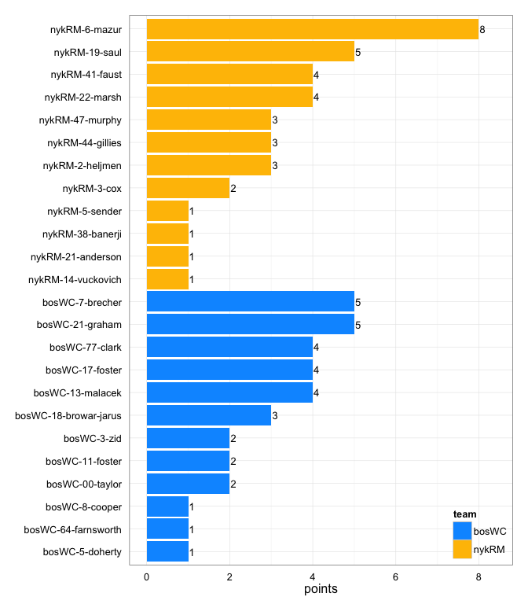
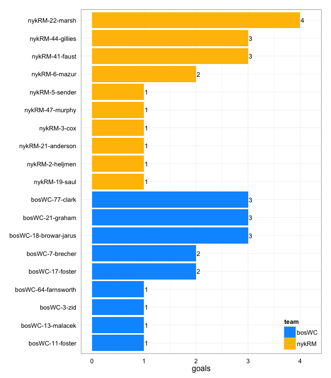
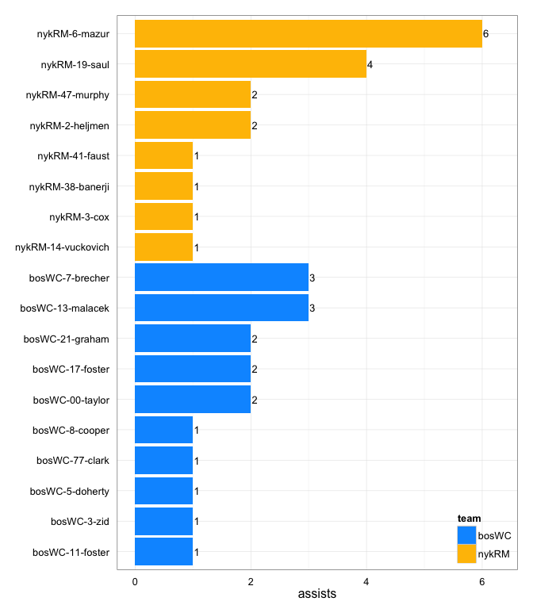
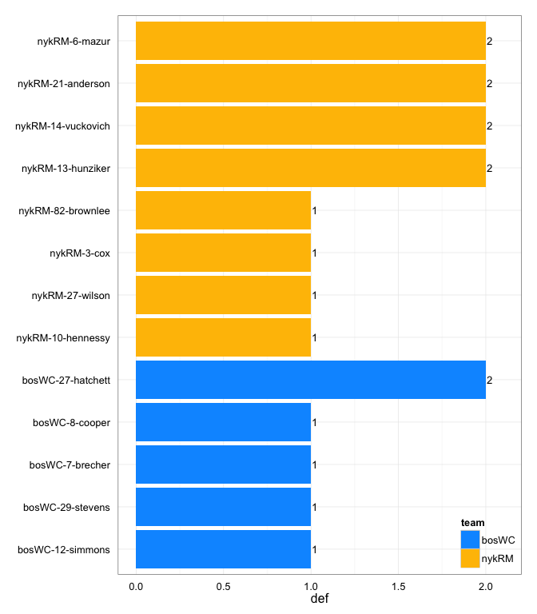

# bosWC at nykRM 2014-05-03

# bosWC 17
# nykRM 18
## game is complete

Go to ...  
  * [Scoring progression](#scoringProgression)  
  * [Player stats via figures](#pl_figs)  
  * [Player stats for bosWC](#away)  
  * [Player stats for nykRM](#home)  
  * [Data on goals, assists, D's](#selectData)  
  * [Full raw data](#rawData)  

## Scoring progression:

| point|period |begin    |end     |pt_duration |desc                                      |bosWC |nykRM |
|-----:|:------|:--------|:-------|:-----------|:-----------------------------------------|:-----|:-----|
|    39|4      |0:22:00  |0:00:00 |00:22       |- no goal -                               |17    |18    |
|    38|4      |NA       |0:22:00 |???         |bosWC-5-doherty to bosWC-77-clark         |17    |18    |
|    37|4      |0:46:00  |0:30:00 |00:16       |nykRM-2-heljmen to nykRM-22-marsh         |16    |18    |
|    36|4      |1:42:00  |0:46:00 |00:56       |bosWC-7-brecher to bosWC-17-foster        |16    |17    |
|    35|4      |NA       |NA      |???         |bosWC-21-graham to bosWC-77-clark         |15    |17    |
|    34|4      |3:30:00  |NA      |???         |nykRM-6-mazur to nykRM-22-marsh           |14    |17    |
|    33|4      |5:58:00  |3:30:00 |02:28       |bosWC-13-malacek to bosWC-21-graham       |14    |16    |
|    32|4      |6:10:00  |5:58:00 |00:12       |bosWC-17-foster to bosWC-11-foster        |13    |16    |
|    31|4      |8:18:00  |6:31:00 |01:47       |nykRM-6-mazur to nykRM-3-cox              |12    |16    |
|    30|4      |8:37:00  |8:18:00 |00:19       |nykRM-14-vuckovich to nykRM-44-gillies    |12    |15    |
|    29|4      |8:57:00  |8:30:00 |00:27       |bosWC-77-clark to bosWC-17-foster         |12    |14    |
|    28|4      |9:49:00  |8:57:00 |00:52       |nykRM-47-murphy to nykRM-2-heljmen        |11    |14    |
|    27|4      |10:00:00 |9:49:00 |00:11       |bosWC-17-foster to bosWC-77-clark         |11    |13    |
|    26|3      |NA       |0:00:00 |???         |- no goal -                               |10    |13    |
|    25|3      |1:15:00  |NA      |???         |bosWC-21-graham to bosWC-18-browar-jarus  |10    |13    |
|    24|3      |NA       |NA      |???         |nykRM-19-saul to nykRM-6-mazur            |9     |13    |
|    23|3      |NA       |NA      |???         |bosWC-8-cooper to bosWC-3-zid             |9     |12    |
|    22|3      |NA       |NA      |???         |nykRM-3-cox to nykRM-41-faust             |8     |12    |
|    21|3      |NA       |NA      |???         |nykRM-41-faust to nykRM-22-marsh          |8     |11    |
|    20|3      |NA       |NA      |???         |bosWC-7-brecher to bosWC-18-browar-jarus  |8     |10    |
|    19|3      |NA       |NA      |???         |nykRM-6-mazur to nykRM-44-gillies         |7     |10    |
|    18|3      |NA       |NA      |???         |bosWC-13-malacek to bosWC-18-browar-jarus |7     |9     |
|    17|3      |8:12:00  |NA      |???         |nykRM-38-banerji to nykRM-5-sender        |6     |9     |
|    16|3      |10:00:00 |8:12:00 |01:48       |nykRM-19-saul to nykRM-41-faust           |6     |8     |
|    15|2      |0:05:00  |0:00:00 |00:05       |- no goal -                               |6     |7     |
|    14|2      |0:56:00  |0:05:00 |00:51       |nykRM-47-murphy to nykRM-6-mazur          |6     |7     |
|    13|2      |1:49:00  |0:56:00 |00:53       |bosWC-7-brecher to bosWC-21-graham        |6     |6     |
|    12|2      |2:50:00  |1:49:00 |01:01       |nykRM-19-saul to nykRM-41-faust           |5     |6     |
|    11|2      |9:00:00  |2:50:00 |06:10       |nykRM-6-mazur to nykRM-21-anderson        |5     |5     |
|    10|2      |10:00:00 |9:00:00 |01:00       |bosWC-00-taylor to bosWC-7-brecher        |5     |4     |
|     9|1      |0:02:00  |0:00:00 |00:02       |- no goal -                               |4     |4     |
|     8|1      |0:22:00  |0:02:00 |00:20       |nykRM-2-heljmen to nykRM-44-gillies       |4     |4     |
|     7|1      |0:43:00  |0:22:00 |00:21       |bosWC-00-taylor to bosWC-13-malacek       |4     |3     |
|     6|1      |2:58:00  |0:43:00 |02:15       |nykRM-6-mazur to nykRM-19-saul            |3     |3     |
|     5|1      |3:52:00  |2:58:00 |00:54       |bosWC-11-foster to bosWC-64-farnsworth    |3     |2     |
|     4|1      |6:59:00  |3:52:00 |03:07       |bosWC-13-malacek to bosWC-7-brecher       |2     |2     |
|     3|1      |7:44:00  |6:59:00 |00:45       |nykRM-19-saul to nykRM-47-murphy          |1     |2     |
|     2|1      |9:34:00  |7:44:00 |01:50       |bosWC-3-zid to bosWC-21-graham            |1     |1     |
|     1|1      |10:00:00 |9:34:00 |00:26       |nykRM-6-mazur to nykRM-22-marsh           |0     |1     |

## Player stats via figures:

### Points = goals + assists

 

### Goals

 

### Assists

 

### D's
 

## Player stats for bosWC :

points = goals + assists  
tables sorted in decreasing order based on points (then goals, assists, Ds)  
Ds = total of plain ol' D's + interceptions (D), hand blocks (HB), and foot blocks (FB)  
stats are cumulative for this game

|   |player   |last              | points| comp_pct| goals| assists| throws| completions| catches| def| drop|
|:--|:--------|:-----------------|------:|--------:|-----:|-------:|------:|-----------:|-------:|---:|----:|
|1  |bosWC-21 |graham            |      5|     1.00|     3|       2|     27|          27|      32|   0|    0|
|2  |bosWC-7  |brecher           |      5|     0.96|     2|       3|     27|          26|      19|   1|    0|
|3  |bosWC-77 |clark             |      4|     0.86|     3|       1|     14|          12|      16|   0|    0|
|4  |bosWC-17 |foster            |      4|     1.00|     2|       2|      3|           3|       5|   0|    0|
|5  |bosWC-13 |malacek           |      4|     0.78|     1|       3|     32|          25|      25|   0|    1|
|6  |bosWC-18 |browar-jarus      |      3|     0.86|     3|       0|      7|           6|      10|   0|    1|
|7  |bosWC-11 |foster            |      2|     0.80|     1|       1|      5|           4|       6|   0|    0|
|8  |bosWC-3  |zid               |      2|     1.00|     1|       1|     11|          11|      12|   0|    0|
|9  |bosWC-00 |taylor            |      2|     1.00|     0|       2|     21|          21|      11|   0|    0|
|10 |bosWC-64 |farnsworth        |      1|       NA|     1|       0|      0|           0|       1|   0|    0|
|11 |bosWC-8  |cooper            |      1|     0.71|     0|       1|      7|           5|       6|   1|    0|
|12 |bosWC-5  |doherty           |      1|     1.00|     0|       1|      4|           4|       4|   0|    0|
|13 |bosWC-27 |hatchett          |      0|     1.00|     0|       0|      3|           3|       4|   2|    0|
|14 |bosWC-12 |simmons           |      0|     1.00|     0|       0|      8|           8|       5|   1|    0|
|15 |bosWC-29 |stevens           |      0|       NA|     0|       0|      0|           0|       0|   1|    0|
|16 |bosWC-1  |markette          |      0|     1.00|     0|       0|      1|           1|       1|   0|    0|
|17 |bosWC-10 |ingold-smith      |      0|     0.78|     0|       0|      9|           7|       6|   0|    1|
|18 |bosWC-14 |montgomery-butler |      0|     0.88|     0|       0|      8|           7|       5|   0|    0|
|19 |bosWC-25 |mcdonnell         |      0|     1.00|     0|       0|      2|           2|       2|   0|    0|
|20 |bosWC-28 |trahey            |      0|     1.00|     0|       0|      2|           2|       2|   0|    0|
|21 |bosWC-43 |hirschberger      |      0|     0.50|     0|       0|      2|           1|       2|   0|    0|
|22 |bosWC-93 |smart             |      0|       NA|     0|       0|      0|           0|       1|   0|    0|

## Player stats for nykRM :

points = goals + assists  
tables sorted in decreasing order based on points (then goals, assists, Ds)  
Ds = total of plain ol' D's + interceptions (D), hand blocks (HB), and foot blocks (FB)  
stats are cumulative for this game

|   |player   |last      | points| comp_pct| goals| assists| throws| completions| catches| def| drop|
|:--|:--------|:---------|------:|--------:|-----:|-------:|------:|-----------:|-------:|---:|----:|
|23 |nykRM-6  |mazur     |      8|     0.93|     2|       6|     43|          40|      33|   2|    0|
|24 |nykRM-19 |saul      |      5|     0.95|     1|       4|     42|          40|      33|   0|    0|
|25 |nykRM-22 |marsh     |      4|     0.76|     4|       0|     17|          13|      21|   0|    2|
|26 |nykRM-41 |faust     |      4|     0.93|     3|       1|     15|          14|      18|   0|    0|
|27 |nykRM-44 |gillies   |      3|     1.00|     3|       0|      5|           5|       8|   0|    0|
|28 |nykRM-2  |heljmen   |      3|     0.92|     1|       2|     12|          11|      12|   0|    0|
|29 |nykRM-47 |murphy    |      3|     1.00|     1|       2|     15|          15|      11|   0|    0|
|30 |nykRM-3  |cox       |      2|     1.00|     1|       1|      4|           4|       5|   1|    0|
|31 |nykRM-21 |anderson  |      1|     0.83|     1|       0|      6|           5|       5|   2|    0|
|32 |nykRM-5  |sender    |      1|     1.00|     1|       0|      5|           5|       5|   0|    0|
|33 |nykRM-14 |vuckovich |      1|     0.87|     0|       1|     15|          13|      14|   2|    0|
|34 |nykRM-38 |banerji   |      1|     0.92|     0|       1|     12|          11|      14|   0|    0|
|35 |nykRM-13 |hunziker  |      0|     0.00|     0|       0|      1|           0|       2|   2|    0|
|36 |nykRM-10 |hennessy  |      0|     1.00|     0|       0|      9|           9|       5|   1|    0|
|37 |nykRM-27 |wilson    |      0|     1.00|     0|       0|      1|           1|       1|   1|    0|
|38 |nykRM-82 |brownlee  |      0|       NA|     0|       0|      0|           0|       0|   1|    0|
|39 |nykRM-   |?name?    |      0|       NA|     0|       0|      0|           0|       0|   0|    0|
|40 |nykRM-1  |kuzmowycz |      0|     1.00|     0|       0|      2|           2|       2|   0|    0|
|41 |nykRM-15 |baum      |      0|     1.00|     0|       0|      5|           5|       3|   0|    0|
|42 |nykRM-18 |yz        |      0|     1.00|     0|       0|      2|           2|       2|   0|    0|
|43 |nykRM-81 |murray    |      0|     0.86|     0|       0|      7|           6|       7|   0|    0|

## Raw data on select events (goals, assists, D's):

| point| period|pull_team | event| poss_abs| poss_rel|poss_team |pl_team |pl_pnum |pl_code |pl_lname     |player                | bosWC| nykRM|
|-----:|------:|:---------|-----:|--------:|--------:|:---------|:-------|:-------|:-------|:------------|:---------------------|-----:|-----:|
|     1|      1|bosWC     |     8|        1|        1|nykRM     |nykRM   |6       |A       |mazur        |nykRM-6-mazur         |     0|     1|
|     1|      1|bosWC     |     9|        1|        1|nykRM     |nykRM   |22      |LG      |marsh        |nykRM-22-marsh        |     0|     1|
|     2|      1|nykRM     |     9|        2|        1|bosWC     |nykRM   |21      |D       |anderson     |nykRM-21-anderson     |     1|     1|
|     2|      1|nykRM     |    24|        4|        3|bosWC     |bosWC   |3       |A       |zid          |bosWC-3-zid           |     1|     1|
|     2|      1|nykRM     |    25|        4|        3|bosWC     |bosWC   |21      |G       |graham       |bosWC-21-graham       |     1|     1|
|     3|      1|bosWC     |     9|        5|        1|nykRM     |nykRM   |19      |A       |saul         |nykRM-19-saul         |     1|     2|
|     3|      1|bosWC     |    10|        5|        1|nykRM     |nykRM   |47      |G       |murphy       |nykRM-47-murphy       |     1|     2|
|     4|      1|nykRM     |     8|        6|        1|bosWC     |nykRM   |3       |D       |cox          |nykRM-3-cox           |     2|     2|
|     4|      1|nykRM     |    20|        8|        3|bosWC     |nykRM   |13      |D       |hunziker     |nykRM-13-hunziker     |     2|     2|
|     4|      1|nykRM     |    34|       10|        5|bosWC     |bosWC   |13      |A       |malacek      |bosWC-13-malacek      |     2|     2|
|     4|      1|nykRM     |    35|       10|        5|bosWC     |bosWC   |7       |G       |brecher      |bosWC-7-brecher       |     2|     2|
|     5|      1|bosWC     |    10|       12|        2|bosWC     |bosWC   |11      |A       |foster       |bosWC-11-foster       |     3|     2|
|     5|      1|bosWC     |    12|       12|        2|bosWC     |bosWC   |64      |G       |farnsworth   |bosWC-64-farnsworth   |     3|     2|
|     6|      1|bosWC     |    21|       14|        2|bosWC     |nykRM   |14      |D       |vuckovich    |nykRM-14-vuckovich    |     3|     3|
|     6|      1|bosWC     |    27|       15|        3|nykRM     |nykRM   |6       |A       |mazur        |nykRM-6-mazur         |     3|     3|
|     6|      1|bosWC     |    28|       15|        3|nykRM     |nykRM   |19      |G       |saul         |nykRM-19-saul         |     3|     3|
|     7|      1|nykRM     |     7|       16|        1|bosWC     |bosWC   |00      |A       |taylor       |bosWC-00-taylor       |     4|     3|
|     7|      1|nykRM     |     8|       16|        1|bosWC     |bosWC   |13      |LG      |malacek      |bosWC-13-malacek      |     4|     3|
|     8|      1|bosWC     |     6|       17|        1|nykRM     |nykRM   |2       |A       |heljmen      |nykRM-2-heljmen       |     4|     4|
|     8|      1|bosWC     |     7|       17|        1|nykRM     |nykRM   |44      |G       |gillies      |nykRM-44-gillies      |     4|     4|
|     9|      1|nykRM     |    NA|       NA|       NA|NA        |NA      |NA      |NA      |NA           |NA-NA-NA              |     4|     4|
|    10|      2|nykRM     |    15|       19|        1|bosWC     |bosWC   |00      |A       |taylor       |bosWC-00-taylor       |     5|     4|
|    10|      2|nykRM     |    16|       19|        1|bosWC     |bosWC   |7       |G       |brecher      |bosWC-7-brecher       |     5|     4|
|    11|      2|bosWC     |     8|       20|        1|nykRM     |bosWC   |29      |D       |stevens      |bosWC-29-stevens      |     5|     5|
|    11|      2|bosWC     |    40|       25|        6|bosWC     |nykRM   |6       |D       |mazur        |nykRM-6-mazur         |     5|     5|
|    11|      2|bosWC     |    43|       26|        7|nykRM     |bosWC   |8       |D       |cooper       |bosWC-8-cooper        |     5|     5|
|    11|      2|bosWC     |    47|       27|        8|bosWC     |nykRM   |21      |D       |anderson     |nykRM-21-anderson     |     5|     5|
|    11|      2|bosWC     |    53|       28|        9|nykRM     |nykRM   |6       |A       |mazur        |nykRM-6-mazur         |     5|     5|
|    11|      2|bosWC     |    54|       28|        9|nykRM     |nykRM   |21      |G       |anderson     |nykRM-21-anderson     |     5|     5|
|    12|      2|nykRM     |     6|       29|        1|bosWC     |nykRM   |27      |D       |wilson       |nykRM-27-wilson       |     5|     6|
|    12|      2|nykRM     |    11|       30|        2|nykRM     |nykRM   |19      |PUA     |saul         |nykRM-19-saul         |     5|     6|
|    12|      2|nykRM     |    12|       30|        2|nykRM     |nykRM   |41      |G       |faust        |nykRM-41-faust        |     5|     6|
|    13|      2|nykRM     |    11|       33|        3|bosWC     |bosWC   |7       |PUA     |brecher      |bosWC-7-brecher       |     6|     6|
|    13|      2|nykRM     |    12|       33|        3|bosWC     |bosWC   |21      |G       |graham       |bosWC-21-graham       |     6|     6|
|    14|      2|bosWC     |    15|       34|        1|nykRM     |nykRM   |47      |A       |murphy       |nykRM-47-murphy       |     6|     7|
|    14|      2|bosWC     |    16|       34|        1|nykRM     |nykRM   |6       |G       |mazur        |nykRM-6-mazur         |     6|     7|
|    15|      2|nykRM     |     4|       35|        1|bosWC     |nykRM   |82      |D       |brownlee     |nykRM-82-brownlee     |     6|     7|
|    16|      3|bosWC     |    17|       38|        3|nykRM     |nykRM   |19      |PUA     |saul         |nykRM-19-saul         |     6|     8|
|    16|      3|bosWC     |    18|       38|        3|nykRM     |nykRM   |41      |G       |faust        |nykRM-41-faust        |     6|     8|
|    17|      3|nykRM     |    17|       40|        2|nykRM     |nykRM   |38      |A       |banerji      |nykRM-38-banerji      |     6|     9|
|    17|      3|nykRM     |    18|       40|        2|nykRM     |nykRM   |5       |G       |sender       |nykRM-5-sender        |     6|     9|
|    18|      3|nykRM     |     8|       41|        1|bosWC     |bosWC   |13      |A       |malacek      |bosWC-13-malacek      |     7|     9|
|    18|      3|nykRM     |     9|       41|        1|bosWC     |bosWC   |18      |LG      |browar-jarus |bosWC-18-browar-jarus |     7|     9|
|    19|      3|bosWC     |     4|       42|        1|nykRM     |nykRM   |6       |A       |mazur        |nykRM-6-mazur         |     7|    10|
|    19|      3|bosWC     |     5|       42|        1|nykRM     |nykRM   |44      |LG      |gillies      |nykRM-44-gillies      |     7|    10|
|    20|      3|nykRM     |     6|       43|        1|bosWC     |bosWC   |7       |A       |brecher      |bosWC-7-brecher       |     8|    10|
|    20|      3|nykRM     |     7|       43|        1|bosWC     |bosWC   |18      |LG      |browar-jarus |bosWC-18-browar-jarus |     8|    10|
|    21|      3|bosWC     |     7|       44|        1|nykRM     |nykRM   |41      |A       |faust        |nykRM-41-faust        |     8|    11|
|    21|      3|bosWC     |     8|       44|        1|nykRM     |nykRM   |22      |LG      |marsh        |nykRM-22-marsh        |     8|    11|
|    22|      3|nykRM     |     9|       46|        2|nykRM     |nykRM   |3       |A       |cox          |nykRM-3-cox           |     8|    12|
|    22|      3|nykRM     |    10|       46|        2|nykRM     |nykRM   |41      |G       |faust        |nykRM-41-faust        |     8|    12|
|    23|      3|nykRM     |    11|       47|        1|bosWC     |bosWC   |8       |A       |cooper       |bosWC-8-cooper        |     9|    12|
|    23|      3|nykRM     |    12|       47|        1|bosWC     |bosWC   |3       |G       |zid          |bosWC-3-zid           |     9|    12|
|    24|      3|bosWC     |    18|       50|        3|nykRM     |nykRM   |19      |A       |saul         |nykRM-19-saul         |     9|    13|
|    24|      3|bosWC     |    19|       50|        3|nykRM     |nykRM   |6       |G       |mazur        |nykRM-6-mazur         |     9|    13|
|    25|      3|nykRM     |    18|       51|        1|bosWC     |bosWC   |21      |A       |graham       |bosWC-21-graham       |    10|    13|
|    25|      3|nykRM     |    19|       51|        1|bosWC     |bosWC   |18      |G       |browar-jarus |bosWC-18-browar-jarus |    10|    13|
|    26|      3|bosWC     |     5|       52|        1|nykRM     |bosWC   |27      |D       |hatchett     |bosWC-27-hatchett     |    10|    13|
|    27|      4|nykRM     |     4|       53|        1|bosWC     |bosWC   |17      |A       |foster       |bosWC-17-foster       |    11|    13|
|    27|      4|nykRM     |     5|       53|        1|bosWC     |bosWC   |77      |LG      |clark        |bosWC-77-clark        |    11|    13|
|    28|      4|bosWC     |    13|       54|        1|nykRM     |nykRM   |47      |A       |murphy       |nykRM-47-murphy       |    11|    14|
|    28|      4|bosWC     |    14|       54|        1|nykRM     |nykRM   |2       |G       |heljmen      |nykRM-2-heljmen       |    11|    14|
|    29|      4|nykRM     |     6|       55|        1|bosWC     |bosWC   |77      |LA      |clark        |bosWC-77-clark        |    12|    14|
|    29|      4|nykRM     |     7|       55|        1|bosWC     |bosWC   |17      |G       |foster       |bosWC-17-foster       |    12|    14|
|    30|      4|bosWC     |     4|       56|        1|nykRM     |nykRM   |14      |A       |vuckovich    |nykRM-14-vuckovich    |    12|    15|
|    30|      4|bosWC     |     5|       56|        1|nykRM     |nykRM   |44      |LG      |gillies      |nykRM-44-gillies      |    12|    15|
|    31|      4|nykRM     |     4|       57|        1|bosWC     |nykRM   |13      |D       |hunziker     |nykRM-13-hunziker     |    12|    16|
|    31|      4|nykRM     |    23|       61|        5|bosWC     |nykRM   |10      |D       |hennessy     |nykRM-10-hennessy     |    12|    16|
|    31|      4|nykRM     |    24|       62|        6|nykRM     |nykRM   |6       |PUA     |mazur        |nykRM-6-mazur         |    12|    16|
|    31|      4|nykRM     |    25|       62|        6|nykRM     |nykRM   |3       |LG      |cox          |nykRM-3-cox           |    12|    16|
|    32|      4|nykRM     |     4|       63|        1|bosWC     |bosWC   |17      |A       |foster       |bosWC-17-foster       |    13|    16|
|    32|      4|nykRM     |     5|       63|        1|bosWC     |bosWC   |11      |LG      |foster       |bosWC-11-foster       |    13|    16|
|    33|      4|bosWC     |    22|       65|        2|bosWC     |nykRM   |14      |D       |vuckovich    |nykRM-14-vuckovich    |    14|    16|
|    33|      4|bosWC     |    30|       66|        3|nykRM     |bosWC   |27      |D       |hatchett     |bosWC-27-hatchett     |    14|    16|
|    33|      4|bosWC     |    38|       67|        4|bosWC     |bosWC   |13      |A       |malacek      |bosWC-13-malacek      |    14|    16|
|    33|      4|bosWC     |    39|       67|        4|bosWC     |bosWC   |21      |G       |graham       |bosWC-21-graham       |    14|    16|
|    34|      4|bosWC     |     7|       68|        1|nykRM     |bosWC   |12      |D       |simmons      |bosWC-12-simmons      |    14|    17|
|    34|      4|bosWC     |    12|       69|        2|bosWC     |nykRM   |6       |D       |mazur        |nykRM-6-mazur         |    14|    17|
|    34|      4|bosWC     |    19|       70|        3|nykRM     |nykRM   |6       |A       |mazur        |nykRM-6-mazur         |    14|    17|
|    34|      4|bosWC     |    20|       70|        3|nykRM     |nykRM   |22      |G       |marsh        |nykRM-22-marsh        |    14|    17|
|    35|      4|nykRM     |     4|       71|        1|bosWC     |bosWC   |21      |A       |graham       |bosWC-21-graham       |    15|    17|
|    35|      4|nykRM     |     5|       71|        1|bosWC     |bosWC   |77      |LG      |clark        |bosWC-77-clark        |    15|    17|
|    36|      4|bosWC     |    12|       74|        3|nykRM     |bosWC   |7       |HB      |brecher      |bosWC-7-brecher       |    16|    17|
|    36|      4|bosWC     |    13|       75|        4|bosWC     |bosWC   |7       |PUA     |brecher      |bosWC-7-brecher       |    16|    17|
|    36|      4|bosWC     |    14|       75|        4|bosWC     |bosWC   |17      |G       |foster       |bosWC-17-foster       |    16|    17|
|    37|      4|bosWC     |     7|       76|        1|nykRM     |nykRM   |2       |A       |heljmen      |nykRM-2-heljmen       |    16|    18|
|    37|      4|bosWC     |     8|       76|        1|nykRM     |nykRM   |22      |G       |marsh        |nykRM-22-marsh        |    16|    18|
|    38|      4|nykRM     |     3|       77|        1|bosWC     |bosWC   |5       |LA      |doherty      |bosWC-5-doherty       |    17|    18|
|    38|      4|nykRM     |     4|       77|        1|bosWC     |bosWC   |77      |G       |clark        |bosWC-77-clark        |    17|    18|
|    39|      4|bosWC     |    NA|       NA|       NA|NA        |NA      |NA      |NA      |NA           |NA-NA-NA              |    17|    18|

## Full raw data:

__Note: just for display purposes.__ Raw data in more useful forms can be found in the [GitHub repository](https://github.com/jennybc/vanNH). Find the game you're interested in in the `games` subdirectory.

| period| point|pull_team | event| poss_abs| poss_rel|poss_team |pl_team |pl_pnum |pl_code |
|------:|-----:|:---------|-----:|--------:|--------:|:---------|:-------|:-------|:-------|
|      1|     1|bosWC     |     1|        1|        1|nykRM     |bosWC   |11      |P       |
|      1|     1|bosWC     |     2|        1|        1|nykRM     |nykRM   |19      |PU      |
|      1|     1|bosWC     |     3|        1|        1|nykRM     |nykRM   |6       |        |
|      1|     1|bosWC     |     4|        1|        1|nykRM     |nykRM   |19      |        |
|      1|     1|bosWC     |     5|        1|        1|nykRM     |nykRM   |22      |        |
|      1|     1|bosWC     |     6|        1|        1|nykRM     |nykRM   |19      |        |
|      1|     1|bosWC     |     7|        1|        1|nykRM     |nykRM   |44      |        |
|      1|     1|bosWC     |     8|        1|        1|nykRM     |nykRM   |6       |A       |
|      1|     1|bosWC     |     9|        1|        1|nykRM     |nykRM   |22      |LG      |
|      1|     2|nykRM     |     1|        2|        1|bosWC     |nykRM   |81      |P       |
|      1|     2|nykRM     |     2|        2|        1|bosWC     |bosWC   |00      |PU      |
|      1|     2|nykRM     |     3|        2|        1|bosWC     |bosWC   |13      |        |
|      1|     2|nykRM     |     4|        2|        1|bosWC     |bosWC   |77      |        |
|      1|     2|nykRM     |     5|        2|        1|bosWC     |bosWC   |21      |        |
|      1|     2|nykRM     |     6|        2|        1|bosWC     |bosWC   |00      |        |
|      1|     2|nykRM     |     7|        2|        1|bosWC     |bosWC   |7       |        |
|      1|     2|nykRM     |     8|        2|        1|bosWC     |bosWC   |77      |        |
|      1|     2|nykRM     |     9|        2|        1|bosWC     |nykRM   |21      |D       |
|      1|     2|nykRM     |    10|        3|        2|nykRM     |nykRM   |21      |PU      |
|      1|     2|nykRM     |    11|        3|        2|nykRM     |nykRM   |5       |        |
|      1|     2|nykRM     |    12|        3|        2|nykRM     |nykRM   |81      |        |
|      1|     2|nykRM     |    13|        3|        2|nykRM     |nykRM   |21      |        |
|      1|     2|nykRM     |    14|        3|        2|nykRM     |nykRM   |5       |        |
|      1|     2|nykRM     |    15|        3|        2|nykRM     |nykRM   |13      |        |
|      1|     2|nykRM     |    16|        4|        3|bosWC     |bosWC   |13      |PU      |
|      1|     2|nykRM     |    17|        4|        3|bosWC     |bosWC   |3       |        |
|      1|     2|nykRM     |    18|        4|        3|bosWC     |bosWC   |21      |        |
|      1|     2|nykRM     |    19|        4|        3|bosWC     |bosWC   |00      |        |
|      1|     2|nykRM     |    20|        4|        3|bosWC     |bosWC   |13      |        |
|      1|     2|nykRM     |    21|        4|        3|bosWC     |bosWC   |77      |        |
|      1|     2|nykRM     |    22|        4|        3|bosWC     |bosWC   |21      |        |
|      1|     2|nykRM     |    23|        4|        3|bosWC     |bosWC   |00      |        |
|      1|     2|nykRM     |    24|        4|        3|bosWC     |bosWC   |3       |A       |
|      1|     2|nykRM     |    25|        4|        3|bosWC     |bosWC   |21      |G       |
|      1|     3|bosWC     |     1|        5|        1|nykRM     |bosWC   |43      |P       |
|      1|     3|bosWC     |     2|        5|        1|nykRM     |nykRM   |19      |PU      |
|      1|     3|bosWC     |     3|        5|        1|nykRM     |nykRM   |6       |        |
|      1|     3|bosWC     |     4|        5|        1|nykRM     |nykRM   |2       |        |
|      1|     3|bosWC     |     5|        5|        1|nykRM     |nykRM   |41      |        |
|      1|     3|bosWC     |     6|        5|        1|nykRM     |nykRM   |14      |        |
|      1|     3|bosWC     |     7|        5|        1|nykRM     |bosWC   |10      |F       |
|      1|     3|bosWC     |     8|        5|        1|nykRM     |nykRM   |6       |PU      |
|      1|     3|bosWC     |     9|        5|        1|nykRM     |nykRM   |19      |A       |
|      1|     3|bosWC     |    10|        5|        1|nykRM     |nykRM   |47      |G       |
|      1|     4|nykRM     |     1|        6|        1|bosWC     |nykRM   |81      |OBP     |
|      1|     4|nykRM     |     2|        6|        1|bosWC     |bosWC   |13      |PU      |
|      1|     4|nykRM     |     3|        6|        1|bosWC     |bosWC   |18      |        |
|      1|     4|nykRM     |     4|        6|        1|bosWC     |bosWC   |7       |        |
|      1|     4|nykRM     |     5|        6|        1|bosWC     |bosWC   |21      |        |
|      1|     4|nykRM     |     6|        6|        1|bosWC     |bosWC   |7       |        |
|      1|     4|nykRM     |     7|        6|        1|bosWC     |bosWC   |77      |        |
|      1|     4|nykRM     |     8|        6|        1|bosWC     |nykRM   |3       |D       |
|      1|     4|nykRM     |     9|        7|        2|nykRM     |nykRM   |21      |PU      |
|      1|     4|nykRM     |    10|        7|        2|nykRM     |nykRM   |38      |        |
|      1|     4|nykRM     |    11|        7|        2|nykRM     |nykRM   |10      |        |
|      1|     4|nykRM     |    12|        7|        2|nykRM     |nykRM   |21      |        |
|      1|     4|nykRM     |    13|        7|        2|nykRM     |nykRM   |81      |        |
|      1|     4|nykRM     |    14|        7|        2|nykRM     |nykRM   |10      |        |
|      1|     4|nykRM     |    15|        7|        2|nykRM     |nykRM   |38      |VST     |
|      1|     4|nykRM     |    16|        8|        3|bosWC     |bosWC   |7       |PU      |
|      1|     4|nykRM     |    17|        8|        3|bosWC     |bosWC   |18      |        |
|      1|     4|nykRM     |    18|        8|        3|bosWC     |bosWC   |21      |        |
|      1|     4|nykRM     |    19|        8|        3|bosWC     |bosWC   |13      |        |
|      1|     4|nykRM     |    20|        8|        3|bosWC     |nykRM   |13      |D       |
|      1|     4|nykRM     |    21|        9|        4|nykRM     |nykRM   |10      |PU      |
|      1|     4|nykRM     |    22|        9|        4|nykRM     |nykRM   |15      |        |
|      1|     4|nykRM     |    23|        9|        4|nykRM     |nykRM   |38      |        |
|      1|     4|nykRM     |    24|        9|        4|nykRM     |nykRM   |3       |        |
|      1|     4|nykRM     |    25|        9|        4|nykRM     |nykRM   |15      |        |
|      1|     4|nykRM     |    26|        9|        4|nykRM     |nykRM   |10      |        |
|      1|     4|nykRM     |    27|        9|        4|nykRM     |nykRM   |15      |        |
|      1|     4|nykRM     |    28|        9|        4|nykRM     |nykRM   |81      |        |
|      1|     4|nykRM     |    29|        9|        4|nykRM     |nykRM   |3       |        |
|      1|     4|nykRM     |    30|        9|        4|nykRM     |nykRM   |38      |VTT     |
|      1|     4|nykRM     |    31|       10|        5|bosWC     |bosWC   |13      |PU      |
|      1|     4|nykRM     |    32|       10|        5|bosWC     |bosWC   |77      |        |
|      1|     4|nykRM     |    33|       10|        5|bosWC     |bosWC   |3       |        |
|      1|     4|nykRM     |    34|       10|        5|bosWC     |bosWC   |13      |A       |
|      1|     4|nykRM     |    35|       10|        5|bosWC     |bosWC   |7       |G       |
|      1|     5|bosWC     |     1|       11|        1|nykRM     |bosWC   |11      |P       |
|      1|     5|bosWC     |     2|       11|        1|nykRM     |nykRM   |6       |PU      |
|      1|     5|bosWC     |     3|       11|        1|nykRM     |nykRM   |19      |        |
|      1|     5|bosWC     |     4|       11|        1|nykRM     |nykRM   |22      |        |
|      1|     5|bosWC     |     5|       11|        1|nykRM     |nykRM   |19      |        |
|      1|     5|bosWC     |     6|       11|        1|nykRM     |nykRM   |14      |        |
|      1|     5|bosWC     |     7|       11|        1|nykRM     |nykRM   |22      |        |
|      1|     5|bosWC     |     8|       11|        1|nykRM     |nykRM   |44      |TD      |
|      1|     5|bosWC     |     9|       12|        2|bosWC     |bosWC   |14      |PU      |
|      1|     5|bosWC     |    10|       12|        2|bosWC     |bosWC   |11      |A       |
|      1|     5|bosWC     |    11|       12|        2|bosWC     |nykRM   |14      |F       |
|      1|     5|bosWC     |    12|       12|        2|bosWC     |bosWC   |64      |G       |
|      1|     6|bosWC     |     1|       13|        1|nykRM     |bosWC   |43      |P       |
|      1|     6|bosWC     |     2|       13|        1|nykRM     |nykRM   |47      |PU      |
|      1|     6|bosWC     |     3|       13|        1|nykRM     |nykRM   |19      |        |
|      1|     6|bosWC     |     4|       13|        1|nykRM     |nykRM   |6       |        |
|      1|     6|bosWC     |     5|       13|        1|nykRM     |nykRM   |19      |        |
|      1|     6|bosWC     |     6|       13|        1|nykRM     |nykRM   |47      |        |
|      1|     6|bosWC     |     7|       13|        1|nykRM     |nykRM   |14      |        |
|      1|     6|bosWC     |     8|       13|        1|nykRM     |nykRM   |47      |        |
|      1|     6|bosWC     |     9|       13|        1|nykRM     |nykRM   |19      |        |
|      1|     6|bosWC     |    10|       13|        1|nykRM     |nykRM   |47      |        |
|      1|     6|bosWC     |    11|       13|        1|nykRM     |nykRM   |6       |        |
|      1|     6|bosWC     |    12|       13|        1|nykRM     |nykRM   |41      |        |
|      1|     6|bosWC     |    13|       13|        1|nykRM     |nykRM   |19      |        |
|      1|     6|bosWC     |    14|       14|        2|bosWC     |bosWC   |10      |PU      |
|      1|     6|bosWC     |    15|       14|        2|bosWC     |bosWC   |28      |        |
|      1|     6|bosWC     |    16|       14|        2|bosWC     |bosWC   |10      |        |
|      1|     6|bosWC     |    17|       14|        2|bosWC     |bosWC   |12      |        |
|      1|     6|bosWC     |    18|       14|        2|bosWC     |bosWC   |10      |        |
|      1|     6|bosWC     |    19|       14|        2|bosWC     |bosWC   |5       |        |
|      1|     6|bosWC     |    20|       14|        2|bosWC     |bosWC   |10      |        |
|      1|     6|bosWC     |    21|       14|        2|bosWC     |nykRM   |14      |D       |
|      1|     6|bosWC     |    22|       15|        3|nykRM     |nykRM   |6       |PU      |
|      1|     6|bosWC     |    23|       15|        3|nykRM     |nykRM   |41      |        |
|      1|     6|bosWC     |    24|       15|        3|nykRM     |nykRM   |2       |        |
|      1|     6|bosWC     |    25|       15|        3|nykRM     |nykRM   |14      |        |
|      1|     6|bosWC     |    26|       15|        3|nykRM     |nykRM   |41      |        |
|      1|     6|bosWC     |    27|       15|        3|nykRM     |nykRM   |6       |A       |
|      1|     6|bosWC     |    28|       15|        3|nykRM     |nykRM   |19      |G       |
|      1|     7|nykRM     |     1|       16|        1|bosWC     |nykRM   |27      |P       |
|      1|     7|nykRM     |     2|       16|        1|bosWC     |bosWC   |00      |PU      |
|      1|     7|nykRM     |     3|       16|        1|bosWC     |bosWC   |7       |        |
|      1|     7|nykRM     |     4|       16|        1|bosWC     |bosWC   |00      |        |
|      1|     7|nykRM     |     5|       16|        1|bosWC     |bosWC   |7       |        |
|      1|     7|nykRM     |     6|       16|        1|bosWC     |bosWC   |21      |        |
|      1|     7|nykRM     |     7|       16|        1|bosWC     |bosWC   |00      |A       |
|      1|     7|nykRM     |     8|       16|        1|bosWC     |bosWC   |13      |LG      |
|      1|     8|bosWC     |     1|       17|        1|nykRM     |bosWC   |43      |P       |
|      1|     8|bosWC     |     2|       17|        1|nykRM     |nykRM   |47      |PU      |
|      1|     8|bosWC     |     3|       17|        1|nykRM     |nykRM   |19      |        |
|      1|     8|bosWC     |     4|       17|        1|nykRM     |nykRM   |6       |        |
|      1|     8|bosWC     |     5|       17|        1|nykRM     |nykRM   |19      |        |
|      1|     8|bosWC     |     6|       17|        1|nykRM     |nykRM   |2       |A       |
|      1|     8|bosWC     |     7|       17|        1|nykRM     |nykRM   |44      |G       |
|      1|     9|nykRM     |     1|       18|        1|bosWC     |nykRM   |13      |P       |
|      1|     9|nykRM     |     2|       18|        1|bosWC     |bosWC   |13      |PU      |
|      1|     9|nykRM     |     3|       18|        1|bosWC     |bosWC   |43      |L       |
|      2|    10|nykRM     |     1|       19|        1|bosWC     |nykRM   |81      |P       |
|      2|    10|nykRM     |     2|       19|        1|bosWC     |bosWC   |7       |PU      |
|      2|    10|nykRM     |     3|       19|        1|bosWC     |bosWC   |00      |        |
|      2|    10|nykRM     |     4|       19|        1|bosWC     |bosWC   |3       |        |
|      2|    10|nykRM     |     5|       19|        1|bosWC     |bosWC   |00      |        |
|      2|    10|nykRM     |     6|       19|        1|bosWC     |bosWC   |21      |        |
|      2|    10|nykRM     |     7|       19|        1|bosWC     |bosWC   |7       |        |
|      2|    10|nykRM     |     8|       19|        1|bosWC     |bosWC   |21      |        |
|      2|    10|nykRM     |     9|       19|        1|bosWC     |bosWC   |13      |        |
|      2|    10|nykRM     |    10|       19|        1|bosWC     |bosWC   |17      |        |
|      2|    10|nykRM     |    11|       19|        1|bosWC     |bosWC   |3       |        |
|      2|    10|nykRM     |    12|       19|        1|bosWC     |bosWC   |00      |        |
|      2|    10|nykRM     |    13|       19|        1|bosWC     |bosWC   |21      |        |
|      2|    10|nykRM     |    14|       19|        1|bosWC     |bosWC   |77      |        |
|      2|    10|nykRM     |    15|       19|        1|bosWC     |bosWC   |00      |A       |
|      2|    10|nykRM     |    16|       19|        1|bosWC     |bosWC   |7       |G       |
|      2|    11|bosWC     |     1|       20|        1|nykRM     |bosWC   |11      |P       |
|      2|    11|bosWC     |     2|       20|        1|nykRM     |nykRM   |47      |PU      |
|      2|    11|bosWC     |     3|       20|        1|nykRM     |nykRM   |19      |        |
|      2|    11|bosWC     |     4|       20|        1|nykRM     |nykRM   |14      |        |
|      2|    11|bosWC     |     5|       20|        1|nykRM     |bosWC   |11      |F       |
|      2|    11|bosWC     |     6|       20|        1|nykRM     |nykRM   |22      |        |
|      2|    11|bosWC     |     7|       20|        1|nykRM     |nykRM   |41      |        |
|      2|    11|bosWC     |     8|       20|        1|nykRM     |bosWC   |29      |D       |
|      2|    11|bosWC     |     9|       21|        2|bosWC     |bosWC   |14      |PU      |
|      2|    11|bosWC     |    10|       21|        2|bosWC     |bosWC   |27      |        |
|      2|    11|bosWC     |    11|       21|        2|bosWC     |bosWC   |14      |        |
|      2|    11|bosWC     |    12|       21|        2|bosWC     |bosWC   |93      |        |
|      2|    11|bosWC     |    13|       21|        2|bosWC     |bosWC   |7       |PU      |
|      2|    11|bosWC     |    14|       21|        2|bosWC     |bosWC   |8       |        |
|      2|    11|bosWC     |    15|       21|        2|bosWC     |bosWC   |21      |        |
|      2|    11|bosWC     |    16|       21|        2|bosWC     |bosWC   |13      |VST     |
|      2|    11|bosWC     |    17|       22|        3|nykRM     |nykRM   |6       |PU      |
|      2|    11|bosWC     |    18|       23|        4|bosWC     |bosWC   |13      |PU      |
|      2|    11|bosWC     |    19|       23|        4|bosWC     |bosWC   |21      |        |
|      2|    11|bosWC     |    20|       23|        4|bosWC     |bosWC   |18      |        |
|      2|    11|bosWC     |    21|       23|        4|bosWC     |bosWC   |8       |        |
|      2|    11|bosWC     |    22|       23|        4|bosWC     |bosWC   |21      |VTT     |
|      2|    11|bosWC     |    23|       23|        4|bosWC     |nykRM   |6       |F       |
|      2|    11|bosWC     |    24|       24|        5|nykRM     |nykRM   |14      |PU      |
|      2|    11|bosWC     |    25|       24|        5|nykRM     |nykRM   |6       |        |
|      2|    11|bosWC     |    26|       24|        5|nykRM     |nykRM   |22      |        |
|      2|    11|bosWC     |    27|       24|        5|nykRM     |nykRM   |14      |        |
|      2|    11|bosWC     |    28|       24|        5|nykRM     |nykRM   |38      |        |
|      2|    11|bosWC     |    29|       24|        5|nykRM     |nykRM   |21      |        |
|      2|    11|bosWC     |    30|       25|        6|bosWC     |bosWC   |13      |PU      |
|      2|    11|bosWC     |    31|       25|        6|bosWC     |bosWC   |21      |        |
|      2|    11|bosWC     |    32|       25|        6|bosWC     |bosWC   |13      |        |
|      2|    11|bosWC     |    33|       25|        6|bosWC     |bosWC   |21      |        |
|      2|    11|bosWC     |    34|       25|        6|bosWC     |bosWC   |3       |        |
|      2|    11|bosWC     |    35|       25|        6|bosWC     |bosWC   |7       |        |
|      2|    11|bosWC     |    36|       25|        6|bosWC     |bosWC   |21      |        |
|      2|    11|bosWC     |    37|       25|        6|bosWC     |bosWC   |13      |        |
|      2|    11|bosWC     |    38|       25|        6|bosWC     |bosWC   |18      |        |
|      2|    11|bosWC     |    39|       25|        6|bosWC     |bosWC   |8       |        |
|      2|    11|bosWC     |    40|       25|        6|bosWC     |nykRM   |6       |D       |
|      2|    11|bosWC     |    41|       26|        7|nykRM     |nykRM   |14      |PU      |
|      2|    11|bosWC     |    42|       26|        7|nykRM     |nykRM   |22      |        |
|      2|    11|bosWC     |    43|       26|        7|nykRM     |bosWC   |8       |D       |
|      2|    11|bosWC     |    44|       27|        8|bosWC     |bosWC   |7       |PU      |
|      2|    11|bosWC     |    45|       27|        8|bosWC     |bosWC   |8       |        |
|      2|    11|bosWC     |    46|       27|        8|bosWC     |bosWC   |7       |        |
|      2|    11|bosWC     |    47|       27|        8|bosWC     |nykRM   |21      |D       |
|      2|    11|bosWC     |    48|       28|        9|nykRM     |nykRM   |21      |PU      |
|      2|    11|bosWC     |    49|       28|        9|nykRM     |nykRM   |19      |        |
|      2|    11|bosWC     |    50|       28|        9|nykRM     |nykRM   |22      |        |
|      2|    11|bosWC     |    51|       28|        9|nykRM     |nykRM   |38      |        |
|      2|    11|bosWC     |    52|       28|        9|nykRM     |nykRM   |14      |        |
|      2|    11|bosWC     |    53|       28|        9|nykRM     |nykRM   |6       |A       |
|      2|    11|bosWC     |    54|       28|        9|nykRM     |nykRM   |21      |G       |
|      2|    12|nykRM     |     1|       29|        1|bosWC     |nykRM   |81      |P       |
|      2|    12|nykRM     |     2|       29|        1|bosWC     |bosWC   |77      |PU      |
|      2|    12|nykRM     |     3|       29|        1|bosWC     |bosWC   |14      |        |
|      2|    12|nykRM     |     4|       29|        1|bosWC     |bosWC   |11      |        |
|      2|    12|nykRM     |     5|       29|        1|bosWC     |bosWC   |13      |        |
|      2|    12|nykRM     |     6|       29|        1|bosWC     |nykRM   |27      |D       |
|      2|    12|nykRM     |     7|       30|        2|nykRM     |nykRM   |5       |PU      |
|      2|    12|nykRM     |     8|       30|        2|nykRM     |nykRM   |81      |        |
|      2|    12|nykRM     |     9|       30|        2|nykRM     |nykRM   |13      |L       |
|      2|    12|nykRM     |    10|       30|        2|nykRM     |nykRM   |        |TO      |
|      2|    12|nykRM     |    11|       30|        2|nykRM     |nykRM   |19      |PUA     |
|      2|    12|nykRM     |    12|       30|        2|nykRM     |nykRM   |41      |G       |
|      2|    13|nykRM     |     1|       31|        1|bosWC     |nykRM   |81      |P       |
|      2|    13|nykRM     |     2|       31|        1|bosWC     |bosWC   |00      |PU      |
|      2|    13|nykRM     |     3|       31|        1|bosWC     |bosWC   |13      |        |
|      2|    13|nykRM     |     4|       31|        1|bosWC     |bosWC   |21      |        |
|      2|    13|nykRM     |     5|       31|        1|bosWC     |bosWC   |7       |        |
|      2|    13|nykRM     |     6|       31|        1|bosWC     |bosWC   |21      |        |
|      2|    13|nykRM     |     7|       31|        1|bosWC     |bosWC   |18      |        |
|      2|    13|nykRM     |     8|       31|        1|bosWC     |bosWC   |27      |TD      |
|      2|    13|nykRM     |     9|       32|        2|nykRM     |nykRM   |15      |PU      |
|      2|    13|nykRM     |    10|       32|        2|nykRM     |nykRM   |15      |VST     |
|      2|    13|nykRM     |    11|       33|        3|bosWC     |bosWC   |7       |PUA     |
|      2|    13|nykRM     |    12|       33|        3|bosWC     |bosWC   |21      |G       |
|      2|    14|bosWC     |     1|       34|        1|nykRM     |bosWC   |11      |P       |
|      2|    14|bosWC     |     2|       34|        1|nykRM     |nykRM   |19      |PU      |
|      2|    14|bosWC     |     3|       34|        1|nykRM     |nykRM   |6       |        |
|      2|    14|bosWC     |     4|       34|        1|nykRM     |nykRM   |22      |        |
|      2|    14|bosWC     |     5|       34|        1|nykRM     |nykRM   |6       |        |
|      2|    14|bosWC     |     6|       34|        1|nykRM     |nykRM   |19      |        |
|      2|    14|bosWC     |     7|       34|        1|nykRM     |nykRM   |44      |        |
|      2|    14|bosWC     |     8|       34|        1|nykRM     |nykRM   |6       |        |
|      2|    14|bosWC     |     9|       34|        1|nykRM     |nykRM   |47      |        |
|      2|    14|bosWC     |    10|       34|        1|nykRM     |nykRM   |19      |        |
|      2|    14|bosWC     |    11|       34|        1|nykRM     |nykRM   |47      |        |
|      2|    14|bosWC     |    12|       34|        1|nykRM     |nykRM   |19      |        |
|      2|    14|bosWC     |    13|       34|        1|nykRM     |nykRM   |44      |        |
|      2|    14|bosWC     |    14|       34|        1|nykRM     |nykRM   |19      |        |
|      2|    14|bosWC     |    15|       34|        1|nykRM     |nykRM   |47      |A       |
|      2|    14|bosWC     |    16|       34|        1|nykRM     |nykRM   |6       |G       |
|      2|    15|nykRM     |     1|       35|        1|bosWC     |nykRM   |81      |P       |
|      2|    15|nykRM     |     2|       35|        1|bosWC     |bosWC   |00      |PU      |
|      2|    15|nykRM     |     3|       35|        1|bosWC     |bosWC   |13      |        |
|      2|    15|nykRM     |     4|       35|        1|bosWC     |nykRM   |82      |D       |
|      3|    16|bosWC     |     1|       36|        1|nykRM     |bosWC   |11      |P       |
|      3|    16|bosWC     |     2|       36|        1|nykRM     |nykRM   |47      |PU      |
|      3|    16|bosWC     |     3|       36|        1|nykRM     |nykRM   |19      |        |
|      3|    16|bosWC     |     4|       36|        1|nykRM     |nykRM   |22      |        |
|      3|    16|bosWC     |     5|       36|        1|nykRM     |nykRM   |19      |        |
|      3|    16|bosWC     |     6|       36|        1|nykRM     |nykRM   |22      |        |
|      3|    16|bosWC     |     7|       36|        1|nykRM     |nykRM   |19      |        |
|      3|    16|bosWC     |     8|       36|        1|nykRM     |nykRM   |22      |        |
|      3|    16|bosWC     |     9|       36|        1|nykRM     |nykRM   |6       |        |
|      3|    16|bosWC     |    10|       36|        1|nykRM     |nykRM   |41      |        |
|      3|    16|bosWC     |    11|       36|        1|nykRM     |nykRM   |14      |        |
|      3|    16|bosWC     |    12|       36|        1|nykRM     |nykRM   |41      |        |
|      3|    16|bosWC     |    13|       36|        1|nykRM     |nykRM   |22      |        |
|      3|    16|bosWC     |    14|       36|        1|nykRM     |nykRM   |6       |TD      |
|      3|    16|bosWC     |    15|       37|        2|bosWC     |bosWC   |14      |PU      |
|      3|    16|bosWC     |    16|       37|        2|bosWC     |bosWC   |27      |VST     |
|      3|    16|bosWC     |    17|       38|        3|nykRM     |nykRM   |19      |PUA     |
|      3|    16|bosWC     |    18|       38|        3|nykRM     |nykRM   |41      |G       |
|      3|    17|nykRM     |     1|       39|        1|bosWC     |nykRM   |81      |P       |
|      3|    17|nykRM     |     2|       39|        1|bosWC     |bosWC   |00      |PU      |
|      3|    17|nykRM     |     3|       39|        1|bosWC     |bosWC   |13      |        |
|      3|    17|nykRM     |     4|       39|        1|bosWC     |nykRM   |5       |F       |
|      3|    17|nykRM     |     5|       39|        1|bosWC     |bosWC   |21      |VST     |
|      3|    17|nykRM     |     6|       40|        2|nykRM     |nykRM   |10      |PU      |
|      3|    17|nykRM     |     7|       40|        2|nykRM     |nykRM   |38      |        |
|      3|    17|nykRM     |     8|       40|        2|nykRM     |nykRM   |5       |        |
|      3|    17|nykRM     |     9|       40|        2|nykRM     |nykRM   |10      |        |
|      3|    17|nykRM     |    10|       40|        2|nykRM     |nykRM   |21      |        |
|      3|    17|nykRM     |    11|       40|        2|nykRM     |bosWC   |5       |F       |
|      3|    17|nykRM     |    12|       40|        2|nykRM     |nykRM   |10      |PU      |
|      3|    17|nykRM     |    13|       40|        2|nykRM     |nykRM   |5       |        |
|      3|    17|nykRM     |    14|       40|        2|nykRM     |nykRM   |38      |        |
|      3|    17|nykRM     |    15|       40|        2|nykRM     |nykRM   |3       |        |
|      3|    17|nykRM     |    16|       40|        2|nykRM     |nykRM   |10      |        |
|      3|    17|nykRM     |    17|       40|        2|nykRM     |nykRM   |38      |A       |
|      3|    17|nykRM     |    18|       40|        2|nykRM     |nykRM   |5       |G       |
|      3|    18|nykRM     |     1|       41|        1|bosWC     |nykRM   |81      |P       |
|      3|    18|nykRM     |     2|       41|        1|bosWC     |bosWC   |12      |PU      |
|      3|    18|nykRM     |     3|       41|        1|bosWC     |bosWC   |13      |        |
|      3|    18|nykRM     |     4|       41|        1|bosWC     |bosWC   |12      |        |
|      3|    18|nykRM     |     5|       41|        1|bosWC     |bosWC   |21      |        |
|      3|    18|nykRM     |     6|       41|        1|bosWC     |bosWC   |12      |        |
|      3|    18|nykRM     |     7|       41|        1|bosWC     |bosWC   |7       |        |
|      3|    18|nykRM     |     8|       41|        1|bosWC     |bosWC   |13      |A       |
|      3|    18|nykRM     |     9|       41|        1|bosWC     |bosWC   |18      |LG      |
|      3|    19|bosWC     |     1|       42|        1|nykRM     |bosWC   |43      |P       |
|      3|    19|bosWC     |     2|       42|        1|nykRM     |nykRM   |6       |PU      |
|      3|    19|bosWC     |     3|       42|        1|nykRM     |nykRM   |19      |        |
|      3|    19|bosWC     |     4|       42|        1|nykRM     |nykRM   |6       |A       |
|      3|    19|bosWC     |     5|       42|        1|nykRM     |nykRM   |44      |LG      |
|      3|    20|nykRM     |     1|       43|        1|bosWC     |nykRM   |13      |P       |
|      3|    20|nykRM     |     2|       43|        1|bosWC     |bosWC   |00      |PU      |
|      3|    20|nykRM     |     3|       43|        1|bosWC     |bosWC   |13      |        |
|      3|    20|nykRM     |     4|       43|        1|bosWC     |bosWC   |21      |        |
|      3|    20|nykRM     |     5|       43|        1|bosWC     |bosWC   |77      |        |
|      3|    20|nykRM     |     6|       43|        1|bosWC     |bosWC   |7       |A       |
|      3|    20|nykRM     |     7|       43|        1|bosWC     |bosWC   |18      |LG      |
|      3|    21|bosWC     |     1|       44|        1|nykRM     |bosWC   |11      |P       |
|      3|    21|bosWC     |     2|       44|        1|nykRM     |nykRM   |47      |PU      |
|      3|    21|bosWC     |     3|       44|        1|nykRM     |nykRM   |6       |        |
|      3|    21|bosWC     |     4|       44|        1|nykRM     |nykRM   |19      |        |
|      3|    21|bosWC     |     5|       44|        1|nykRM     |nykRM   |6       |        |
|      3|    21|bosWC     |     6|       44|        1|nykRM     |nykRM   |18      |        |
|      3|    21|bosWC     |     7|       44|        1|nykRM     |nykRM   |41      |A       |
|      3|    21|bosWC     |     8|       44|        1|nykRM     |nykRM   |22      |LG      |
|      3|    22|nykRM     |     1|       45|        1|bosWC     |nykRM   |81      |P       |
|      3|    22|nykRM     |     2|       45|        1|bosWC     |bosWC   |7       |PU      |
|      3|    22|nykRM     |     3|       45|        1|bosWC     |bosWC   |13      |        |
|      3|    22|nykRM     |     4|       46|        2|nykRM     |nykRM   |15      |PU      |
|      3|    22|nykRM     |     5|       46|        2|nykRM     |nykRM   |38      |        |
|      3|    22|nykRM     |     6|       46|        2|nykRM     |nykRM   |27      |        |
|      3|    22|nykRM     |     7|       46|        2|nykRM     |nykRM   |81      |        |
|      3|    22|nykRM     |     8|       46|        2|nykRM     |nykRM   |38      |        |
|      3|    22|nykRM     |     9|       46|        2|nykRM     |nykRM   |3       |A       |
|      3|    22|nykRM     |    10|       46|        2|nykRM     |nykRM   |41      |G       |
|      3|    23|nykRM     |     1|       47|        1|bosWC     |nykRM   |82      |P       |
|      3|    23|nykRM     |     2|       47|        1|bosWC     |bosWC   |12      |PU      |
|      3|    23|nykRM     |     3|       47|        1|bosWC     |bosWC   |00      |        |
|      3|    23|nykRM     |     4|       47|        1|bosWC     |bosWC   |12      |        |
|      3|    23|nykRM     |     5|       47|        1|bosWC     |bosWC   |21      |        |
|      3|    23|nykRM     |     6|       47|        1|bosWC     |nykRM   |13      |F       |
|      3|    23|nykRM     |     7|       47|        1|bosWC     |bosWC   |11      |        |
|      3|    23|nykRM     |     8|       47|        1|bosWC     |bosWC   |21      |        |
|      3|    23|nykRM     |     9|       47|        1|bosWC     |bosWC   |3       |        |
|      3|    23|nykRM     |    10|       47|        1|bosWC     |bosWC   |11      |        |
|      3|    23|nykRM     |    11|       47|        1|bosWC     |bosWC   |8       |A       |
|      3|    23|nykRM     |    12|       47|        1|bosWC     |bosWC   |3       |G       |
|      3|    24|bosWC     |     1|       48|        1|nykRM     |bosWC   |43      |P       |
|      3|    24|bosWC     |     2|       48|        1|nykRM     |nykRM   |6       |PU      |
|      3|    24|bosWC     |     3|       48|        1|nykRM     |nykRM   |19      |        |
|      3|    24|bosWC     |     4|       48|        1|nykRM     |nykRM   |6       |        |
|      3|    24|bosWC     |     5|       48|        1|nykRM     |nykRM   |19      |        |
|      3|    24|bosWC     |     6|       49|        2|bosWC     |bosWC   |12      |PU      |
|      3|    24|bosWC     |     7|       49|        2|bosWC     |bosWC   |10      |        |
|      3|    24|bosWC     |     8|       49|        2|bosWC     |bosWC   |28      |        |
|      3|    24|bosWC     |     9|       49|        2|bosWC     |bosWC   |12      |        |
|      3|    24|bosWC     |    10|       49|        2|bosWC     |bosWC   |10      |        |
|      3|    24|bosWC     |    11|       49|        2|bosWC     |bosWC   |43      |TD      |
|      3|    24|bosWC     |    12|       50|        3|nykRM     |nykRM   |19      |PU      |
|      3|    24|bosWC     |    13|       50|        3|nykRM     |nykRM   |6       |        |
|      3|    24|bosWC     |    14|       50|        3|nykRM     |nykRM   |2       |        |
|      3|    24|bosWC     |    15|       50|        3|nykRM     |nykRM   |47      |        |
|      3|    24|bosWC     |    16|       50|        3|nykRM     |nykRM   |14      |        |
|      3|    24|bosWC     |    17|       50|        3|nykRM     |nykRM   |44      |        |
|      3|    24|bosWC     |    18|       50|        3|nykRM     |nykRM   |19      |A       |
|      3|    24|bosWC     |    19|       50|        3|nykRM     |nykRM   |6       |G       |
|      3|    25|nykRM     |     1|       51|        1|bosWC     |nykRM   |13      |P       |
|      3|    25|nykRM     |     2|       51|        1|bosWC     |bosWC   |00      |PU      |
|      3|    25|nykRM     |     3|       51|        1|bosWC     |bosWC   |13      |        |
|      3|    25|nykRM     |     4|       51|        1|bosWC     |bosWC   |3       |        |
|      3|    25|nykRM     |     5|       51|        1|bosWC     |bosWC   |7       |        |
|      3|    25|nykRM     |     6|       51|        1|bosWC     |bosWC   |77      |        |
|      3|    25|nykRM     |     7|       51|        1|bosWC     |bosWC   |7       |        |
|      3|    25|nykRM     |     8|       51|        1|bosWC     |bosWC   |21      |        |
|      3|    25|nykRM     |     9|       51|        1|bosWC     |bosWC   |7       |        |
|      3|    25|nykRM     |    10|       51|        1|bosWC     |bosWC   |21      |        |
|      3|    25|nykRM     |    11|       51|        1|bosWC     |bosWC   |3       |        |
|      3|    25|nykRM     |    12|       51|        1|bosWC     |bosWC   |7       |        |
|      3|    25|nykRM     |    13|       51|        1|bosWC     |bosWC   |77      |        |
|      3|    25|nykRM     |    14|       51|        1|bosWC     |bosWC   |21      |        |
|      3|    25|nykRM     |    15|       51|        1|bosWC     |bosWC   |3       |        |
|      3|    25|nykRM     |    16|       51|        1|bosWC     |bosWC   |18      |        |
|      3|    25|nykRM     |    17|       51|        1|bosWC     |bosWC   |77      |        |
|      3|    25|nykRM     |    18|       51|        1|bosWC     |bosWC   |21      |A       |
|      3|    25|nykRM     |    19|       51|        1|bosWC     |bosWC   |18      |G       |
|      3|    26|bosWC     |     1|       52|        1|nykRM     |bosWC   |43      |P       |
|      3|    26|bosWC     |     2|       52|        1|nykRM     |nykRM   |15      |PU      |
|      3|    26|bosWC     |     3|       52|        1|nykRM     |nykRM   |19      |        |
|      3|    26|bosWC     |     4|       52|        1|nykRM     |nykRM   |6       |        |
|      3|    26|bosWC     |     5|       52|        1|nykRM     |bosWC   |27      |D       |
|      4|    27|nykRM     |     1|       53|        1|bosWC     |nykRM   |13      |P       |
|      4|    27|nykRM     |     2|       53|        1|bosWC     |bosWC   |00      |PU      |
|      4|    27|nykRM     |     3|       53|        1|bosWC     |bosWC   |13      |        |
|      4|    27|nykRM     |     4|       53|        1|bosWC     |bosWC   |17      |A       |
|      4|    27|nykRM     |     5|       53|        1|bosWC     |bosWC   |77      |LG      |
|      4|    28|bosWC     |     1|       54|        1|nykRM     |bosWC   |11      |P       |
|      4|    28|bosWC     |     2|       54|        1|nykRM     |nykRM   |6       |PU      |
|      4|    28|bosWC     |     3|       54|        1|nykRM     |nykRM   |19      |        |
|      4|    28|bosWC     |     4|       54|        1|nykRM     |nykRM   |2       |        |
|      4|    28|bosWC     |     5|       54|        1|nykRM     |nykRM   |41      |        |
|      4|    28|bosWC     |     6|       54|        1|nykRM     |nykRM   |22      |        |
|      4|    28|bosWC     |     7|       54|        1|nykRM     |nykRM   |19      |        |
|      4|    28|bosWC     |     8|       54|        1|nykRM     |nykRM   |6       |        |
|      4|    28|bosWC     |     9|       54|        1|nykRM     |nykRM   |14      |        |
|      4|    28|bosWC     |    10|       54|        1|nykRM     |nykRM   |6       |        |
|      4|    28|bosWC     |    11|       54|        1|nykRM     |nykRM   |41      |        |
|      4|    28|bosWC     |    12|       54|        1|nykRM     |nykRM   |6       |        |
|      4|    28|bosWC     |    13|       54|        1|nykRM     |nykRM   |47      |A       |
|      4|    28|bosWC     |    14|       54|        1|nykRM     |nykRM   |2       |G       |
|      4|    29|nykRM     |     1|       55|        1|bosWC     |nykRM   |81      |P       |
|      4|    29|nykRM     |     2|       55|        1|bosWC     |bosWC   |00      |PU      |
|      4|    29|nykRM     |     3|       55|        1|bosWC     |bosWC   |13      |        |
|      4|    29|nykRM     |     4|       55|        1|bosWC     |bosWC   |7       |        |
|      4|    29|nykRM     |     5|       55|        1|bosWC     |bosWC   |21      |        |
|      4|    29|nykRM     |     6|       55|        1|bosWC     |bosWC   |77      |LA      |
|      4|    29|nykRM     |     7|       55|        1|bosWC     |bosWC   |17      |G       |
|      4|    30|bosWC     |     1|       56|        1|nykRM     |bosWC   |43      |P       |
|      4|    30|bosWC     |     2|       56|        1|nykRM     |nykRM   |19      |PU      |
|      4|    30|bosWC     |     3|       56|        1|nykRM     |nykRM   |6       |        |
|      4|    30|bosWC     |     4|       56|        1|nykRM     |nykRM   |14      |A       |
|      4|    30|bosWC     |     5|       56|        1|nykRM     |nykRM   |44      |LG      |
|      4|    31|nykRM     |     1|       57|        1|bosWC     |nykRM   |81      |P       |
|      4|    31|nykRM     |     2|       57|        1|bosWC     |bosWC   |00      |PU      |
|      4|    31|nykRM     |     3|       57|        1|bosWC     |bosWC   |13      |        |
|      4|    31|nykRM     |     4|       57|        1|bosWC     |nykRM   |13      |D       |
|      4|    31|nykRM     |     5|       58|        2|nykRM     |nykRM   |13      |SO      |
|      4|    31|nykRM     |     6|       58|        2|nykRM     |nykRM   |6       |SI      |
|      4|    31|nykRM     |     7|       58|        2|nykRM     |nykRM   |10      |PU      |
|      4|    31|nykRM     |     8|       58|        2|nykRM     |nykRM   |38      |        |
|      4|    31|nykRM     |     9|       58|        2|nykRM     |nykRM   |81      |        |
|      4|    31|nykRM     |    10|       58|        2|nykRM     |nykRM   |38      |        |
|      4|    31|nykRM     |    11|       58|        2|nykRM     |bosWC   |13      |F       |
|      4|    31|nykRM     |    12|       59|        3|bosWC     |bosWC   |13      |PU      |
|      4|    31|nykRM     |    13|       59|        3|bosWC     |bosWC   |00      |        |
|      4|    31|nykRM     |    14|       59|        3|bosWC     |bosWC   |3       |        |
|      4|    31|nykRM     |    15|       59|        3|bosWC     |bosWC   |13      |        |
|      4|    31|nykRM     |    16|       59|        3|bosWC     |bosWC   |00      |TD      |
|      4|    31|nykRM     |    17|       60|        4|nykRM     |nykRM   |6       |PU      |
|      4|    31|nykRM     |    18|       60|        4|nykRM     |nykRM   |38      |VTT     |
|      4|    31|nykRM     |    19|       61|        5|bosWC     |bosWC   |00      |SO      |
|      4|    31|nykRM     |    20|       61|        5|bosWC     |bosWC   |8       |SI      |
|      4|    31|nykRM     |    21|       61|        5|bosWC     |bosWC   |7       |PU      |
|      4|    31|nykRM     |    22|       61|        5|bosWC     |bosWC   |8       |        |
|      4|    31|nykRM     |    23|       61|        5|bosWC     |nykRM   |10      |D       |
|      4|    31|nykRM     |    24|       62|        6|nykRM     |nykRM   |6       |PUA     |
|      4|    31|nykRM     |    25|       62|        6|nykRM     |nykRM   |3       |LG      |
|      4|    32|nykRM     |     1|       63|        1|bosWC     |nykRM   |82      |P       |
|      4|    32|nykRM     |     2|       63|        1|bosWC     |bosWC   |7       |PU      |
|      4|    32|nykRM     |     3|       63|        1|bosWC     |bosWC   |13      |        |
|      4|    32|nykRM     |     4|       63|        1|bosWC     |bosWC   |17      |A       |
|      4|    32|nykRM     |     5|       63|        1|bosWC     |bosWC   |11      |LG      |
|      4|    33|bosWC     |     1|       64|        1|nykRM     |bosWC   |43      |P       |
|      4|    33|bosWC     |     2|       64|        1|nykRM     |nykRM   |6       |PU      |
|      4|    33|bosWC     |     3|       64|        1|nykRM     |nykRM   |19      |        |
|      4|    33|bosWC     |     4|       64|        1|nykRM     |nykRM   |47      |        |
|      4|    33|bosWC     |     5|       64|        1|nykRM     |nykRM   |41      |        |
|      4|    33|bosWC     |     6|       64|        1|nykRM     |nykRM   |6       |        |
|      4|    33|bosWC     |     7|       64|        1|nykRM     |nykRM   |19      |        |
|      4|    33|bosWC     |     8|       64|        1|nykRM     |nykRM   |22      |        |
|      4|    33|bosWC     |     9|       64|        1|nykRM     |nykRM   |14      |        |
|      4|    33|bosWC     |    10|       64|        1|nykRM     |nykRM   |6       |        |
|      4|    33|bosWC     |    11|       65|        2|bosWC     |bosWC   |10      |PU      |
|      4|    33|bosWC     |    12|       65|        2|bosWC     |bosWC   |27      |        |
|      4|    33|bosWC     |    13|       65|        2|bosWC     |bosWC   |14      |        |
|      4|    33|bosWC     |    14|       65|        2|bosWC     |bosWC   |27      |        |
|      4|    33|bosWC     |    15|       65|        2|bosWC     |bosWC   |25      |        |
|      4|    33|bosWC     |    16|       65|        2|bosWC     |bosWC   |43      |        |
|      4|    33|bosWC     |    17|       65|        2|bosWC     |bosWC   |25      |        |
|      4|    33|bosWC     |    18|       65|        2|bosWC     |bosWC   |14      |        |
|      4|    33|bosWC     |    19|       65|        2|bosWC     |bosWC   |5       |        |
|      4|    33|bosWC     |    20|       65|        2|bosWC     |bosWC   |10      |        |
|      4|    33|bosWC     |    21|       65|        2|bosWC     |bosWC   |14      |        |
|      4|    33|bosWC     |    22|       65|        2|bosWC     |nykRM   |14      |D       |
|      4|    33|bosWC     |    23|       66|        3|nykRM     |nykRM   |19      |PU      |
|      4|    33|bosWC     |    24|       66|        3|nykRM     |nykRM   |6       |        |
|      4|    33|bosWC     |    25|       66|        3|nykRM     |nykRM   |41      |        |
|      4|    33|bosWC     |    26|       66|        3|nykRM     |nykRM   |19      |        |
|      4|    33|bosWC     |    27|       66|        3|nykRM     |nykRM   |41      |        |
|      4|    33|bosWC     |    28|       66|        3|nykRM     |nykRM   |1       |        |
|      4|    33|bosWC     |    29|       66|        3|nykRM     |nykRM   |22      |        |
|      4|    33|bosWC     |    30|       66|        3|nykRM     |bosWC   |27      |D       |
|      4|    33|bosWC     |    31|       67|        4|bosWC     |bosWC   |10      |TO      |
|      4|    33|bosWC     |    32|       67|        4|bosWC     |bosWC   |13      |PU      |
|      4|    33|bosWC     |    33|       67|        4|bosWC     |bosWC   |18      |        |
|      4|    33|bosWC     |    34|       67|        4|bosWC     |bosWC   |77      |        |
|      4|    33|bosWC     |    35|       67|        4|bosWC     |bosWC   |21      |        |
|      4|    33|bosWC     |    36|       67|        4|bosWC     |bosWC   |7       |        |
|      4|    33|bosWC     |    37|       67|        4|bosWC     |bosWC   |77      |        |
|      4|    33|bosWC     |    38|       67|        4|bosWC     |bosWC   |13      |A       |
|      4|    33|bosWC     |    39|       67|        4|bosWC     |bosWC   |21      |G       |
|      4|    34|bosWC     |     1|       68|        1|nykRM     |bosWC   |43      |P       |
|      4|    34|bosWC     |     2|       68|        1|nykRM     |nykRM   |6       |PU      |
|      4|    34|bosWC     |     3|       68|        1|nykRM     |nykRM   |18      |        |
|      4|    34|bosWC     |     4|       68|        1|nykRM     |nykRM   |2       |        |
|      4|    34|bosWC     |     5|       68|        1|nykRM     |nykRM   |22      |        |
|      4|    34|bosWC     |     6|       68|        1|nykRM     |nykRM   |2       |        |
|      4|    34|bosWC     |     7|       68|        1|nykRM     |bosWC   |12      |D       |
|      4|    34|bosWC     |     8|       69|        2|bosWC     |bosWC   |10      |PU      |
|      4|    34|bosWC     |     9|       69|        2|bosWC     |bosWC   |1       |        |
|      4|    34|bosWC     |    10|       69|        2|bosWC     |bosWC   |5       |        |
|      4|    34|bosWC     |    11|       69|        2|bosWC     |bosWC   |11      |        |
|      4|    34|bosWC     |    12|       69|        2|bosWC     |nykRM   |6       |D       |
|      4|    34|bosWC     |    13|       70|        3|nykRM     |nykRM   |19      |PU      |
|      4|    34|bosWC     |    14|       70|        3|nykRM     |nykRM   |6       |        |
|      4|    34|bosWC     |    15|       70|        3|nykRM     |nykRM   |47      |        |
|      4|    34|bosWC     |    16|       70|        3|nykRM     |nykRM   |2       |        |
|      4|    34|bosWC     |    17|       70|        3|nykRM     |nykRM   |6       |        |
|      4|    34|bosWC     |    18|       70|        3|nykRM     |nykRM   |2       |        |
|      4|    34|bosWC     |    19|       70|        3|nykRM     |nykRM   |6       |A       |
|      4|    34|bosWC     |    20|       70|        3|nykRM     |nykRM   |22      |G       |
|      4|    35|nykRM     |     1|       71|        1|bosWC     |nykRM   |81      |P       |
|      4|    35|nykRM     |     2|       71|        1|bosWC     |bosWC   |8       |PU      |
|      4|    35|nykRM     |     3|       71|        1|bosWC     |bosWC   |13      |        |
|      4|    35|nykRM     |     4|       71|        1|bosWC     |bosWC   |21      |A       |
|      4|    35|nykRM     |     5|       71|        1|bosWC     |bosWC   |77      |LG      |
|      4|    36|bosWC     |     1|       72|        1|nykRM     |bosWC   |43      |P       |
|      4|    36|bosWC     |     2|       72|        1|nykRM     |nykRM   |2       |PU      |
|      4|    36|bosWC     |     3|       72|        1|nykRM     |nykRM   |6       |        |
|      4|    36|bosWC     |     4|       72|        1|nykRM     |nykRM   |19      |        |
|      4|    36|bosWC     |     5|       72|        1|nykRM     |nykRM   |41      |        |
|      4|    36|bosWC     |     6|       72|        1|nykRM     |nykRM   |1       |        |
|      4|    36|bosWC     |     7|       72|        1|nykRM     |nykRM   |14      |        |
|      4|    36|bosWC     |     8|       73|        2|bosWC     |bosWC   |12      |TO      |
|      4|    36|bosWC     |     9|       73|        2|bosWC     |bosWC   |13      |PU      |
|      4|    36|bosWC     |    10|       74|        3|nykRM     |nykRM   |38      |PU      |
|      4|    36|bosWC     |    11|       74|        3|nykRM     |nykRM   |81      |        |
|      4|    36|bosWC     |    12|       74|        3|nykRM     |bosWC   |7       |HB      |
|      4|    36|bosWC     |    13|       75|        4|bosWC     |bosWC   |7       |PUA     |
|      4|    36|bosWC     |    14|       75|        4|bosWC     |bosWC   |17      |G       |
|      4|    37|bosWC     |     1|       76|        1|nykRM     |bosWC   |43      |P       |
|      4|    37|bosWC     |     2|       76|        1|nykRM     |nykRM   |19      |PU      |
|      4|    37|bosWC     |     3|       76|        1|nykRM     |nykRM   |6       |        |
|      4|    37|bosWC     |     4|       76|        1|nykRM     |nykRM   |22      |        |
|      4|    37|bosWC     |     5|       76|        1|nykRM     |nykRM   |2       |L       |
|      4|    37|bosWC     |     6|       76|        1|nykRM     |nykRM   |41      |        |
|      4|    37|bosWC     |     7|       76|        1|nykRM     |nykRM   |2       |A       |
|      4|    37|bosWC     |     8|       76|        1|nykRM     |nykRM   |22      |G       |
|      4|    38|nykRM     |     1|       77|        1|bosWC     |nykRM   |82      |OBP     |
|      4|    38|nykRM     |     2|       77|        1|bosWC     |bosWC   |7       |PU      |
|      4|    38|nykRM     |     3|       77|        1|bosWC     |bosWC   |5       |LA      |
|      4|    38|nykRM     |     4|       77|        1|bosWC     |bosWC   |77      |G       |
|      4|    39|bosWC     |     1|       78|        1|nykRM     |bosWC   |43      |P       |
|      4|    39|bosWC     |     2|       78|        1|nykRM     |nykRM   |6       |TO      |
|      4|    39|bosWC     |     3|       78|        1|nykRM     |nykRM   |6       |PU      |
|      4|    39|bosWC     |     4|       78|        1|nykRM     |nykRM   |44      |        |
|      4|    39|bosWC     |     5|       78|        1|nykRM     |nykRM   |14      |TO      |
|      4|    39|bosWC     |     6|       78|        1|nykRM     |nykRM   |14      |PU      |

