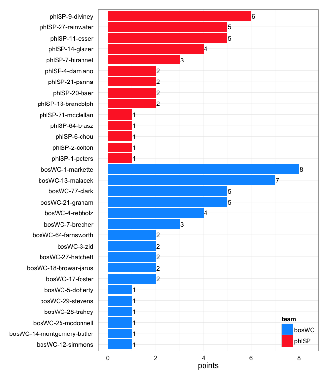
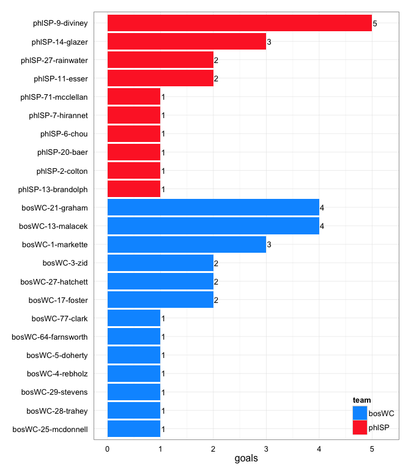
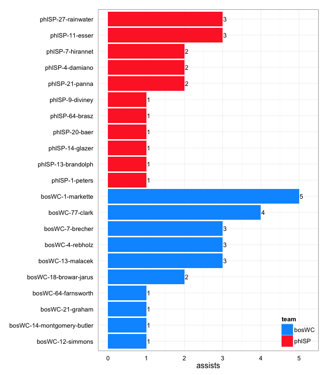
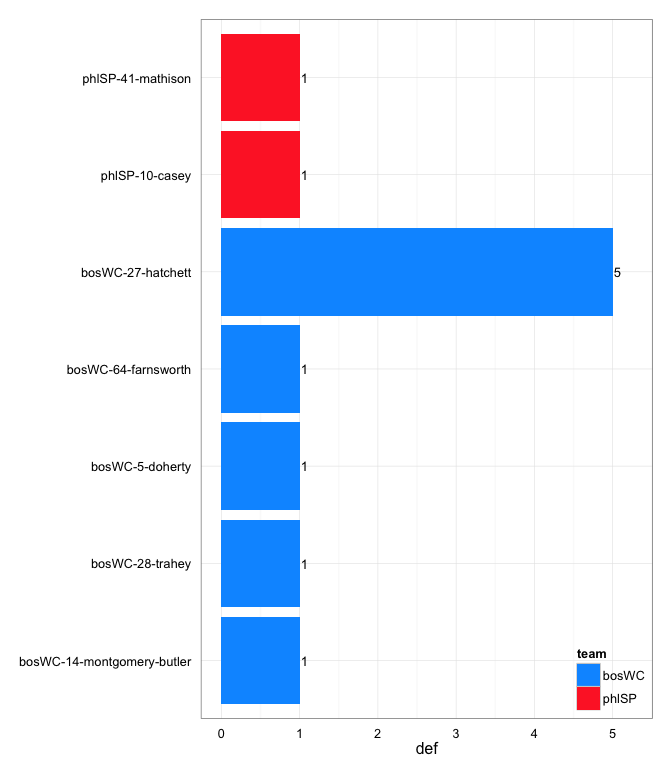

---
output:
  html_document:
    theme: readable
    includes:
      before_body: 08_before-body-back-to-index-href.txt
---

# phlSP at bosWC 2014-05-10

# phlSP 18
# bosWC 24
## game is complete

Go to ...  
  * [Scoring progression](#scoringProgression)  
  * [Player stats via figures](#pl_figs)  
  * [Player stats for phlSP](#away)  
  * [Player stats for bosWC](#home)  
  * [Data on goals, assists, D's](#selectData)  
  * [Full raw data](#rawData)  

## Scoring progression:

| point|period |begin    |end     |pt_duration |desc                                            |phlSP |bosWC |
|-----:|:------|:--------|:-------|:-----------|:-----------------------------------------------|:-----|:-----|
|    46|4      |0:05:00  |0:00:00 |00:14       |- no goal -                                     |18    |24    |
|    45|4      |0:45:00  |0:05:00 |01:42       |bosWC-77-clark to bosWC-13-malacek              |18    |24    |
|    44|4      |1:42:00  |0:45:00 |00:31       |phlSP-11-esser to phlSP-9-diviney               |18    |23    |
|    43|4      |1:56:00  |1:42:00 |00:52       |bosWC-4-rebholz to bosWC-21-graham              |17    |23    |
|    42|4      |3:38:00  |1:56:00 |01:36       |phlSP-7-hirannet to phlSP-71-mcclellan          |17    |22    |
|    41|4      |4:09:00  |3:38:00 |01:31       |bosWC-77-clark to bosWC-21-graham               |16    |22    |
|    40|4      |5:01:00  |4:09:00 |00:34       |phlSP-9-diviney to phlSP-14-glazer              |16    |21    |
|    39|4      |6:37:00  |5:01:00 |01:18       |bosWC-21-graham to bosWC-1-markette             |15    |21    |
|    38|4      |8:08:00  |6:37:00 |00:06       |phlSP-21-panna to phlSP-6-chou                  |15    |20    |
|    37|4      |8:42:00  |8:08:00 |00:33       |phlSP-13-brandolph to phlSP-14-glazer           |14    |20    |
|    36|4      |10:00:00 |8:42:00 |01:05       |bosWC-13-malacek to bosWC-21-graham             |13    |20    |
|    35|3      |0:06:00  |0:00:00 |01:02       |- no goal -                                     |13    |19    |
|    34|3      |0:39:00  |0:06:00 |03:09       |phlSP-27-rainwater to phlSP-14-glazer           |13    |19    |
|    33|3      |1:44:00  |0:39:00 |00:43       |bosWC-1-markette to bosWC-21-graham             |12    |19    |
|    32|3      |2:46:00  |1:44:00 |00:46       |phlSP-21-panna to phlSP-11-esser                |12    |18    |
|    31|3      |5:55:00  |2:46:00 |00:25       |phlSP-11-esser to phlSP-13-brandolph            |11    |18    |
|    30|3      |6:38:00  |5:55:00 |01:39       |bosWC-1-markette to bosWC-77-clark              |10    |18    |
|    29|3      |7:24:00  |6:38:00 |00:32       |phlSP-7-hirannet to phlSP-27-rainwater          |10    |17    |
|    28|3      |7:49:00  |7:24:00 |00:13       |bosWC-1-markette to bosWC-13-malacek            |9     |17    |
|    27|3      |9:28:00  |7:49:00 |02:28       |phlSP-11-esser to phlSP-27-rainwater            |9     |16    |
|    26|3      |10:00:00 |9:28:00 |00:28       |phlSP-14-glazer to phlSP-20-baer                |8     |16    |
|    25|2      |0:13:00  |0:00:00 |00:57       |- no goal -                                     |7     |16    |
|    24|2      |2:41:00  |0:13:00 |00:36       |bosWC-18-browar-jarus to bosWC-27-hatchett      |7     |16    |
|    23|2      |3:09:00  |2:41:00 |01:45       |bosWC-7-brecher to bosWC-28-trahey              |7     |15    |
|    22|2      |4:06:00  |3:09:00 |00:54       |bosWC-77-clark to bosWC-17-foster               |7     |14    |
|    21|2      |4:42:00  |4:06:00 |00:20       |bosWC-64-farnsworth to bosWC-29-stevens         |7     |13    |
|    20|2      |6:27:00  |4:42:00 |00:11       |bosWC-7-brecher to bosWC-5-doherty              |7     |12    |
|    19|2      |7:21:00  |6:27:00 |00:34       |bosWC-4-rebholz to bosWC-13-malacek             |7     |11    |
|    18|2      |7:41:00  |7:21:00 |01:00       |phlSP-4-damiano to phlSP-9-diviney              |7     |10    |
|    17|2      |7:52:00  |7:41:00 |00:34       |bosWC-77-clark to bosWC-3-zid                   |6     |10    |
|    16|2      |8:26:00  |7:52:00 |NA:NA       |phlSP-27-rainwater to phlSP-11-esser            |6     |9     |
|    15|2      |9:26:00  |8:26:00 |NA:NA       |bosWC-1-markette to bosWC-17-foster             |5     |9     |
|    14|2      |10:00:00 |9:26:00 |NA:NA       |bosWC-4-rebholz to bosWC-13-malacek             |5     |8     |
|    13|1      |NA       |0:00:00 |???         |- no goal -                                     |5     |7     |
|    12|1      |NA       |NA      |???         |bosWC-7-brecher to bosWC-1-markette             |5     |7     |
|    11|1      |2:19:00  |NA      |???         |phlSP-1-peters to phlSP-2-colton                |5     |6     |
|    10|1      |2:54:00  |2:19:00 |00:35       |phlSP-4-damiano to phlSP-9-diviney              |4     |6     |
|     9|1      |2:57:00  |2:54:00 |00:03       |bosWC-13-malacek to bosWC-1-markette            |3     |6     |
|     8|1      |3:37:00  |2:57:00 |00:40       |phlSP-27-rainwater to phlSP-7-hirannet          |3     |5     |
|     7|1      |4:11:00  |3:37:00 |00:34       |bosWC-13-malacek to bosWC-3-zid                 |2     |5     |
|     6|1      |4:14:00  |4:11:00 |00:03       |phlSP-64-brasz to phlSP-9-diviney               |2     |4     |
|     5|1      |4:59:00  |4:14:00 |00:45       |bosWC-14-montgomery-butler to bosWC-27-hatchett |1     |4     |
|     4|1      |6:02:00  |4:59:00 |01:03       |bosWC-12-simmons to bosWC-25-mcdonnell          |1     |3     |
|     3|1      |8:53:00  |6:02:00 |02:51       |bosWC-18-browar-jarus to bosWC-64-farnsworth    |1     |2     |
|     2|1      |9:42:00  |8:53:00 |00:49       |bosWC-1-markette to bosWC-4-rebholz             |1     |1     |
|     1|1      |10:00:00 |9:42:00 |00:18       |phlSP-20-baer to phlSP-9-diviney                |1     |0     |

## Player stats via figures:

### Points = goals + assists

### Goals

### Assists

### D's

## Player stats for phlSP :

points = goals + assists  
tables sorted in decreasing order based on points (then goals, assists, Ds)  
Ds = total of plain ol' D's + interceptions (D), hand blocks (HB), and foot blocks (FB)  
stats are cumulative for this game

|   |player   |last      | points| comp_pct| goals| assists| throws| completions| catches| def| drop|
|:--|:--------|:---------|------:|--------:|-----:|-------:|------:|-----------:|-------:|---:|----:|
|25 |phlSP-9  |diviney   |      6|     0.91|     5|       1|     11|          10|      15|   0|    0|
|26 |phlSP-11 |esser     |      5|     1.00|     2|       3|     19|          19|      20|   0|    0|
|27 |phlSP-27 |rainwater |      5|     0.92|     2|       3|     24|          22|      25|   0|    0|
|28 |phlSP-14 |glazer    |      4|     0.95|     3|       1|     20|          19|      23|   0|    0|
|29 |phlSP-7  |hirannet  |      3|     0.95|     1|       2|     39|          37|      32|   0|    1|
|30 |phlSP-13 |brandolph |      2|     0.92|     1|       1|     13|          12|      11|   0|    0|
|31 |phlSP-20 |baer      |      2|     0.94|     1|       1|     34|          32|      23|   0|    0|
|32 |phlSP-21 |panna     |      2|     0.90|     0|       2|     10|           9|       7|   0|    0|
|33 |phlSP-4  |damiano   |      2|     0.93|     0|       2|     15|          14|      14|   0|    0|
|34 |phlSP-2  |colton    |      1|     0.75|     1|       0|      4|           3|       4|   0|    0|
|35 |phlSP-6  |chou      |      1|     1.00|     1|       0|      3|           3|       4|   0|    0|
|36 |phlSP-71 |mcclellan |      1|     0.69|     1|       0|     13|           9|      10|   0|    0|
|37 |phlSP-1  |peters    |      1|     0.87|     0|       1|     15|          13|      15|   0|    0|
|38 |phlSP-64 |brasz     |      1|     1.00|     0|       1|      9|           9|       9|   0|    0|
|39 |phlSP-10 |casey     |      0|     1.00|     0|       0|      1|           1|       1|   1|    0|
|40 |phlSP-41 |mathison  |      0|     1.00|     0|       0|      1|           1|       0|   1|    0|
|41 |phlSP-12 |zumbrum   |      0|     0.50|     0|       0|      4|           2|       3|   0|    0|
|42 |phlSP-16 |shull     |      0|     0.89|     0|       0|      9|           8|       8|   0|    0|
|43 |phlSP-28 |baer      |      0|     1.00|     0|       0|      1|           1|       0|   0|    0|
|44 |phlSP-31 |lindsey   |      0|     1.00|     0|       0|      1|           1|       1|   0|    0|
|45 |phlSP-33 |ward      |      0|     1.00|     0|       0|      2|           2|       2|   0|    0|

## Player stats for bosWC :

points = goals + assists  
tables sorted in decreasing order based on points (then goals, assists, Ds)  
Ds = total of plain ol' D's + interceptions (D), hand blocks (HB), and foot blocks (FB)  
stats are cumulative for this game

|   |player   |last              | points| comp_pct| goals| assists| throws| completions| catches| def| drop|
|:--|:--------|:-----------------|------:|--------:|-----:|-------:|------:|-----------:|-------:|---:|----:|
|1  |bosWC-1  |markette          |      8|     0.96|     3|       5|     24|          23|      25|   0|    0|
|2  |bosWC-13 |malacek           |      7|     0.97|     4|       3|     39|          38|      33|   0|    0|
|3  |bosWC-21 |graham            |      5|     1.00|     4|       1|     25|          25|      25|   0|    0|
|4  |bosWC-77 |clark             |      5|     0.92|     1|       4|     12|          11|      13|   0|    0|
|5  |bosWC-4  |rebholz           |      4|     0.92|     1|       3|     36|          33|      30|   0|    2|
|6  |bosWC-7  |brecher           |      3|     0.91|     0|       3|     11|          10|       8|   0|    1|
|7  |bosWC-27 |hatchett          |      2|     0.80|     2|       0|      5|           4|       7|   5|    1|
|8  |bosWC-17 |foster            |      2|     1.00|     2|       0|      6|           6|       8|   0|    0|
|9  |bosWC-3  |zid               |      2|     1.00|     2|       0|      5|           5|       6|   0|    0|
|10 |bosWC-64 |farnsworth        |      2|     1.00|     1|       1|      2|           2|       3|   1|    0|
|11 |bosWC-18 |browar-jarus      |      2|     0.80|     0|       2|      5|           4|       4|   0|    0|
|12 |bosWC-28 |trahey            |      1|     1.00|     1|       0|      4|           4|       5|   1|    0|
|13 |bosWC-5  |doherty           |      1|     0.83|     1|       0|      6|           5|       7|   1|    0|
|14 |bosWC-25 |mcdonnell         |      1|     0.50|     1|       0|      2|           1|       3|   0|    0|
|15 |bosWC-29 |stevens           |      1|     1.00|     1|       0|      2|           2|       4|   0|    0|
|16 |bosWC-14 |montgomery-butler |      1|     1.00|     0|       1|      7|           7|       2|   1|    0|
|17 |bosWC-12 |simmons           |      1|     0.90|     0|       1|     10|           9|       8|   0|    0|
|18 |bosWC-10 |ingold-smith      |      0|     1.00|     0|       0|      9|           9|       6|   0|    0|
|19 |bosWC-2  |reinhardt         |      0|     1.00|     0|       0|      1|           1|       1|   0|    0|
|20 |bosWC-37 |?name?            |      0|     1.00|     0|       0|      1|           1|       1|   0|    0|
|21 |bosWC-43 |hirschberger      |      0|     1.00|     0|       0|      1|           1|       1|   0|    0|
|22 |bosWC-6  |roth              |      0|     1.00|     0|       0|      2|           2|       3|   0|    0|
|23 |bosWC-8  |cooper            |      0|     0.86|     0|       0|      7|           6|       6|   0|    0|
|24 |bosWC-9  |nixon             |      0|     1.00|     0|       0|     10|          10|      10|   0|    0|

## Raw data on select events (goals, assists, D's):

| point| period|pull_team | event| poss_abs| poss_rel|poss_team |pl_team |pl_pnum |pl_code |pl_lname          |player                     | bosWC| phlSP|
|-----:|------:|:---------|-----:|--------:|--------:|:---------|:-------|:-------|:-------|:-----------------|:--------------------------|-----:|-----:|
|     1|      1|bosWC     |     5|        1|        1|phlSP     |phlSP   |20      |A       |baer              |phlSP-20-baer              |     0|     1|
|     1|      1|bosWC     |     6|        1|        1|phlSP     |phlSP   |9       |LG      |diviney           |phlSP-9-diviney            |     0|     1|
|     2|      1|phlSP     |    21|        2|        1|bosWC     |bosWC   |1       |A       |markette          |bosWC-1-markette           |     1|     1|
|     2|      1|phlSP     |    22|        2|        1|bosWC     |bosWC   |4       |G       |rebholz           |bosWC-4-rebholz            |     1|     1|
|     3|      1|bosWC     |     4|        3|        1|phlSP     |bosWC   |27      |D       |hatchett          |bosWC-27-hatchett          |     2|     1|
|     3|      1|bosWC     |    14|        5|        3|phlSP     |bosWC   |28      |D       |trahey            |bosWC-28-trahey            |     2|     1|
|     3|      1|bosWC     |    23|        6|        4|bosWC     |bosWC   |18      |A       |browar-jarus      |bosWC-18-browar-jarus      |     2|     1|
|     3|      1|bosWC     |    24|        6|        4|bosWC     |bosWC   |64      |G       |farnsworth        |bosWC-64-farnsworth        |     2|     1|
|     4|      1|bosWC     |    15|        7|        1|phlSP     |bosWC   |5       |D       |doherty           |bosWC-5-doherty            |     3|     1|
|     4|      1|bosWC     |    17|        8|        2|bosWC     |bosWC   |12      |LA      |simmons           |bosWC-12-simmons           |     3|     1|
|     4|      1|bosWC     |    18|        8|        2|bosWC     |bosWC   |25      |G       |mcdonnell         |bosWC-25-mcdonnell         |     3|     1|
|     5|      1|bosWC     |     6|        9|        1|phlSP     |bosWC   |14      |D       |montgomery-butler |bosWC-14-montgomery-butler |     4|     1|
|     5|      1|bosWC     |     9|       10|        2|bosWC     |bosWC   |14      |PUA     |montgomery-butler |bosWC-14-montgomery-butler |     4|     1|
|     5|      1|bosWC     |    10|       10|        2|bosWC     |bosWC   |27      |G       |hatchett          |bosWC-27-hatchett          |     4|     1|
|     6|      1|bosWC     |     6|       11|        1|phlSP     |phlSP   |64      |A       |brasz             |phlSP-64-brasz             |     4|     2|
|     6|      1|bosWC     |     7|       11|        1|phlSP     |phlSP   |9       |LG      |diviney           |phlSP-9-diviney            |     4|     2|
|     7|      1|phlSP     |     9|       12|        1|bosWC     |bosWC   |13      |A       |malacek           |bosWC-13-malacek           |     5|     2|
|     7|      1|phlSP     |    10|       12|        1|bosWC     |bosWC   |3       |G       |zid               |bosWC-3-zid                |     5|     2|
|     8|      1|bosWC     |    12|       13|        1|phlSP     |phlSP   |27      |A       |rainwater         |phlSP-27-rainwater         |     5|     3|
|     8|      1|bosWC     |    13|       13|        1|phlSP     |phlSP   |7       |G       |hirannet          |phlSP-7-hirannet           |     5|     3|
|     9|      1|phlSP     |     8|       14|        1|bosWC     |bosWC   |13      |A       |malacek           |bosWC-13-malacek           |     6|     3|
|     9|      1|phlSP     |     9|       14|        1|bosWC     |bosWC   |1       |G       |markette          |bosWC-1-markette           |     6|     3|
|    10|      1|bosWC     |    15|       15|        1|phlSP     |phlSP   |4       |A       |damiano           |phlSP-4-damiano            |     6|     4|
|    10|      1|bosWC     |    16|       15|        1|phlSP     |phlSP   |9       |G       |diviney           |phlSP-9-diviney            |     6|     4|
|    11|      1|phlSP     |    10|       17|        2|phlSP     |phlSP   |1       |A       |peters            |phlSP-1-peters             |     6|     5|
|    11|      1|phlSP     |    11|       17|        2|phlSP     |phlSP   |2       |LG      |colton            |phlSP-2-colton             |     6|     5|
|    12|      1|phlSP     |     9|       18|        1|bosWC     |bosWC   |7       |A       |brecher           |bosWC-7-brecher            |     7|     5|
|    12|      1|phlSP     |    10|       18|        1|bosWC     |bosWC   |1       |LG      |markette          |bosWC-1-markette           |     7|     5|
|    13|      1|bosWC     |    NA|       NA|       NA|NA        |NA      |NA      |NA      |NA                |NA-NA-NA                   |     7|     5|
|    14|      2|phlSP     |    13|       20|        1|bosWC     |bosWC   |4       |A       |rebholz           |bosWC-4-rebholz            |     8|     5|
|    14|      2|phlSP     |    14|       20|        1|bosWC     |bosWC   |13      |G       |malacek           |bosWC-13-malacek           |     8|     5|
|    15|      2|bosWC     |     4|       21|        1|phlSP     |bosWC   |27      |D       |hatchett          |bosWC-27-hatchett          |     9|     5|
|    15|      2|bosWC     |    10|       22|        2|bosWC     |bosWC   |1       |A       |markette          |bosWC-1-markette           |     9|     5|
|    15|      2|bosWC     |    11|       22|        2|bosWC     |bosWC   |17      |G       |foster            |bosWC-17-foster            |     9|     5|
|    16|      2|bosWC     |    12|       23|        1|phlSP     |phlSP   |27      |A       |rainwater         |phlSP-27-rainwater         |     9|     6|
|    16|      2|bosWC     |    13|       23|        1|phlSP     |phlSP   |11      |G       |esser             |phlSP-11-esser             |     9|     6|
|    17|      2|phlSP     |     3|       24|        1|bosWC     |bosWC   |77      |A       |clark             |bosWC-77-clark             |    10|     6|
|    17|      2|phlSP     |     4|       24|        1|bosWC     |bosWC   |3       |G       |zid               |bosWC-3-zid                |    10|     6|
|    18|      2|bosWC     |     7|       25|        1|phlSP     |phlSP   |4       |A       |damiano           |phlSP-4-damiano            |    10|     7|
|    18|      2|bosWC     |     8|       25|        1|phlSP     |phlSP   |9       |LG      |diviney           |phlSP-9-diviney            |    10|     7|
|    19|      2|phlSP     |    10|       26|        1|bosWC     |bosWC   |4       |A       |rebholz           |bosWC-4-rebholz            |    11|     7|
|    19|      2|phlSP     |    11|       26|        1|bosWC     |bosWC   |13      |G       |malacek           |bosWC-13-malacek           |    11|     7|
|    20|      2|bosWC     |    19|       30|        4|bosWC     |bosWC   |7       |A       |brecher           |bosWC-7-brecher            |    12|     7|
|    20|      2|bosWC     |    20|       30|        4|bosWC     |bosWC   |5       |G       |doherty           |bosWC-5-doherty            |    12|     7|
|    21|      2|bosWC     |     7|       32|        2|bosWC     |bosWC   |64      |LA      |farnsworth        |bosWC-64-farnsworth        |    13|     7|
|    21|      2|bosWC     |     8|       32|        2|bosWC     |bosWC   |29      |G       |stevens           |bosWC-29-stevens           |    13|     7|
|    22|      2|bosWC     |    12|       34|        2|bosWC     |bosWC   |77      |A       |clark             |bosWC-77-clark             |    14|     7|
|    22|      2|bosWC     |    13|       34|        2|bosWC     |bosWC   |17      |G       |foster            |bosWC-17-foster            |    14|     7|
|    23|      2|bosWC     |     7|       36|        2|bosWC     |bosWC   |7       |A       |brecher           |bosWC-7-brecher            |    15|     7|
|    23|      2|bosWC     |     8|       36|        2|bosWC     |bosWC   |28      |G       |trahey            |bosWC-28-trahey            |    15|     7|
|    24|      2|bosWC     |    25|       39|        3|phlSP     |bosWC   |64      |D       |farnsworth        |bosWC-64-farnsworth        |    16|     7|
|    24|      2|bosWC     |    26|       40|        4|bosWC     |bosWC   |18      |PUA     |browar-jarus      |bosWC-18-browar-jarus      |    16|     7|
|    24|      2|bosWC     |    27|       40|        4|bosWC     |bosWC   |27      |LG      |hatchett          |bosWC-27-hatchett          |    16|     7|
|    25|      2|bosWC     |    NA|       NA|       NA|NA        |NA      |NA      |NA      |NA                |NA-NA-NA                   |    16|     7|
|    26|      3|bosWC     |     8|       42|        1|phlSP     |phlSP   |14      |LA      |glazer            |phlSP-14-glazer            |    16|     8|
|    26|      3|bosWC     |     9|       42|        1|phlSP     |phlSP   |20      |G       |baer              |phlSP-20-baer              |    16|     8|
|    27|      3|phlSP     |    12|       44|        2|phlSP     |bosWC   |27      |D       |hatchett          |bosWC-27-hatchett          |    16|     9|
|    27|      3|phlSP     |    19|       46|        4|phlSP     |phlSP   |11      |A       |esser             |phlSP-11-esser             |    16|     9|
|    27|      3|phlSP     |    21|       46|        4|phlSP     |phlSP   |27      |G       |rainwater         |phlSP-27-rainwater         |    16|     9|
|    28|      3|phlSP     |     8|       47|        1|bosWC     |bosWC   |1       |A       |markette          |bosWC-1-markette           |    17|     9|
|    28|      3|phlSP     |     9|       47|        1|bosWC     |bosWC   |13      |G       |malacek           |bosWC-13-malacek           |    17|     9|
|    29|      3|bosWC     |    14|       48|        1|phlSP     |phlSP   |7       |A       |hirannet          |phlSP-7-hirannet           |    17|    10|
|    29|      3|bosWC     |    15|       48|        1|phlSP     |phlSP   |27      |G       |rainwater         |phlSP-27-rainwater         |    17|    10|
|    30|      3|phlSP     |    13|       49|        1|bosWC     |bosWC   |1       |A       |markette          |bosWC-1-markette           |    18|    10|
|    30|      3|phlSP     |    14|       49|        1|bosWC     |bosWC   |77      |G       |clark             |bosWC-77-clark             |    18|    10|
|    31|      3|bosWC     |     5|       50|        1|phlSP     |bosWC   |27      |D       |hatchett          |bosWC-27-hatchett          |    18|    11|
|    31|      3|bosWC     |    36|       54|        5|phlSP     |phlSP   |11      |A       |esser             |phlSP-11-esser             |    18|    11|
|    31|      3|bosWC     |    37|       54|        5|phlSP     |phlSP   |13      |G       |brandolph         |phlSP-13-brandolph         |    18|    11|
|    32|      3|phlSP     |    16|       56|        2|phlSP     |phlSP   |21      |A       |panna             |phlSP-21-panna             |    18|    12|
|    32|      3|phlSP     |    17|       56|        2|phlSP     |phlSP   |11      |LG      |esser             |phlSP-11-esser             |    18|    12|
|    33|      3|phlSP     |    16|       57|        1|bosWC     |bosWC   |1       |A       |markette          |bosWC-1-markette           |    19|    12|
|    33|      3|phlSP     |    17|       57|        1|bosWC     |bosWC   |21      |G       |graham            |bosWC-21-graham            |    19|    12|
|    34|      3|bosWC     |    14|       58|        1|phlSP     |phlSP   |27      |PUA     |rainwater         |phlSP-27-rainwater         |    19|    13|
|    34|      3|bosWC     |    15|       58|        1|phlSP     |phlSP   |14      |G       |glazer            |phlSP-14-glazer            |    19|    13|
|    35|      3|phlSP     |     4|       59|        1|bosWC     |phlSP   |41      |D       |mathison          |phlSP-41-mathison          |    19|    13|
|    36|      4|phlSP     |    18|       61|        2|phlSP     |bosWC   |27      |D       |hatchett          |bosWC-27-hatchett          |    20|    13|
|    36|      4|phlSP     |    23|       62|        3|bosWC     |bosWC   |13      |A       |malacek           |bosWC-13-malacek           |    20|    13|
|    36|      4|phlSP     |    24|       62|        3|bosWC     |bosWC   |21      |G       |graham            |bosWC-21-graham            |    20|    13|
|    37|      4|bosWC     |    11|       63|        1|phlSP     |phlSP   |13      |A       |brandolph         |phlSP-13-brandolph         |    20|    14|
|    37|      4|bosWC     |    12|       63|        1|phlSP     |phlSP   |14      |G       |glazer            |phlSP-14-glazer            |    20|    14|
|    38|      4|phlSP     |     9|       64|        1|bosWC     |phlSP   |10      |D       |casey             |phlSP-10-casey             |    20|    15|
|    38|      4|phlSP     |    22|       65|        2|phlSP     |phlSP   |21      |A       |panna             |phlSP-21-panna             |    20|    15|
|    38|      4|phlSP     |    23|       65|        2|phlSP     |phlSP   |6       |G       |chou              |phlSP-6-chou               |    20|    15|
|    39|      4|phlSP     |    18|       68|        3|bosWC     |bosWC   |21      |A       |graham            |bosWC-21-graham            |    21|    15|
|    39|      4|phlSP     |    19|       68|        3|bosWC     |bosWC   |1       |G       |markette          |bosWC-1-markette           |    21|    15|
|    40|      4|bosWC     |    13|       69|        1|phlSP     |phlSP   |9       |A       |diviney           |phlSP-9-diviney            |    21|    16|
|    40|      4|bosWC     |    14|       69|        1|phlSP     |phlSP   |14      |G       |glazer            |phlSP-14-glazer            |    21|    16|
|    41|      4|phlSP     |     5|       70|        1|bosWC     |bosWC   |77      |A       |clark             |bosWC-77-clark             |    22|    16|
|    41|      4|phlSP     |     7|       70|        1|bosWC     |bosWC   |21      |G       |graham            |bosWC-21-graham            |    22|    16|
|    42|      4|bosWC     |    16|       73|        3|phlSP     |phlSP   |7       |A       |hirannet          |phlSP-7-hirannet           |    22|    17|
|    42|      4|bosWC     |    17|       73|        3|phlSP     |phlSP   |71      |G       |mcclellan         |phlSP-71-mcclellan         |    22|    17|
|    43|      4|phlSP     |     3|       74|        1|bosWC     |bosWC   |4       |A       |rebholz           |bosWC-4-rebholz            |    23|    17|
|    43|      4|phlSP     |     4|       74|        1|bosWC     |bosWC   |21      |LG      |graham            |bosWC-21-graham            |    23|    17|
|    44|      4|bosWC     |    11|       75|        1|phlSP     |phlSP   |11      |A       |esser             |phlSP-11-esser             |    23|    18|
|    44|      4|bosWC     |    12|       75|        1|phlSP     |phlSP   |9       |LG      |diviney           |phlSP-9-diviney            |    23|    18|
|    45|      4|phlSP     |    11|       76|        1|bosWC     |bosWC   |77      |A       |clark             |bosWC-77-clark             |    24|    18|
|    45|      4|phlSP     |    12|       76|        1|bosWC     |bosWC   |13      |G       |malacek           |bosWC-13-malacek           |    24|    18|
|    46|      4|bosWC     |    NA|       NA|       NA|NA        |NA      |NA      |NA      |NA                |NA-NA-NA                   |    24|    18|

## Full raw data:

__Note: just for display purposes.__ Raw data in more useful forms can be found in the [GitHub repository](https://github.com/jennybc/vanNH). Find the game you're interested in in the `games` subdirectory.

| period| point|pull_team | event| poss_abs| poss_rel|poss_team |pl_team |pl_pnum |pl_code |
|------:|-----:|:---------|-----:|--------:|--------:|:---------|:-------|:-------|:-------|
|      1|     1|bosWC     |     1|        1|        1|phlSP     |bosWC   |18      |P       |
|      1|     1|bosWC     |     2|        1|        1|phlSP     |phlSP   |20      |PU      |
|      1|     1|bosWC     |     3|        1|        1|phlSP     |phlSP   |7       |        |
|      1|     1|bosWC     |     4|        1|        1|phlSP     |phlSP   |27      |        |
|      1|     1|bosWC     |     5|        1|        1|phlSP     |phlSP   |20      |A       |
|      1|     1|bosWC     |     6|        1|        1|phlSP     |phlSP   |9       |LG      |
|      1|     2|phlSP     |     1|        2|        1|bosWC     |phlSP   |1       |P       |
|      1|     2|phlSP     |     2|        2|        1|bosWC     |bosWC   |13      |PU      |
|      1|     2|phlSP     |     3|        2|        1|bosWC     |bosWC   |4       |        |
|      1|     2|phlSP     |     4|        2|        1|bosWC     |bosWC   |1       |        |
|      1|     2|phlSP     |     5|        2|        1|bosWC     |bosWC   |4       |        |
|      1|     2|phlSP     |     6|        2|        1|bosWC     |bosWC   |17      |        |
|      1|     2|phlSP     |     7|        2|        1|bosWC     |bosWC   |13      |        |
|      1|     2|phlSP     |     8|        2|        1|bosWC     |bosWC   |21      |        |
|      1|     2|phlSP     |     9|        2|        1|bosWC     |bosWC   |1       |        |
|      1|     2|phlSP     |    10|        2|        1|bosWC     |bosWC   |9       |        |
|      1|     2|phlSP     |    11|        2|        1|bosWC     |bosWC   |4       |        |
|      1|     2|phlSP     |    12|        2|        1|bosWC     |bosWC   |13      |        |
|      1|     2|phlSP     |    13|        2|        1|bosWC     |bosWC   |1       |        |
|      1|     2|phlSP     |    14|        2|        1|bosWC     |bosWC   |13      |        |
|      1|     2|phlSP     |    15|        2|        1|bosWC     |bosWC   |4       |        |
|      1|     2|phlSP     |    16|        2|        1|bosWC     |bosWC   |21      |        |
|      1|     2|phlSP     |    17|        2|        1|bosWC     |bosWC   |4       |        |
|      1|     2|phlSP     |    18|        2|        1|bosWC     |bosWC   |77      |        |
|      1|     2|phlSP     |    19|        2|        1|bosWC     |bosWC   |13      |        |
|      1|     2|phlSP     |    20|        2|        1|bosWC     |bosWC   |21      |        |
|      1|     2|phlSP     |    21|        2|        1|bosWC     |bosWC   |1       |A       |
|      1|     2|phlSP     |    22|        2|        1|bosWC     |bosWC   |4       |G       |
|      1|     3|bosWC     |     1|        3|        1|phlSP     |bosWC   |18      |P       |
|      1|     3|bosWC     |     2|        3|        1|phlSP     |phlSP   |7       |PU      |
|      1|     3|bosWC     |     3|        3|        1|phlSP     |phlSP   |27      |        |
|      1|     3|bosWC     |     4|        3|        1|phlSP     |bosWC   |27      |D       |
|      1|     3|bosWC     |     5|        4|        2|bosWC     |bosWC   |14      |PU      |
|      1|     3|bosWC     |     6|        4|        2|bosWC     |bosWC   |18      |        |
|      1|     3|bosWC     |     7|        5|        3|phlSP     |phlSP   |11      |PU      |
|      1|     3|bosWC     |     8|        5|        3|phlSP     |phlSP   |27      |        |
|      1|     3|bosWC     |     9|        5|        3|phlSP     |phlSP   |11      |        |
|      1|     3|bosWC     |    10|        5|        3|phlSP     |phlSP   |13      |        |
|      1|     3|bosWC     |    11|        5|        3|phlSP     |phlSP   |71      |        |
|      1|     3|bosWC     |    12|        5|        3|phlSP     |phlSP   |14      |        |
|      1|     3|bosWC     |    13|        5|        3|phlSP     |phlSP   |12      |        |
|      1|     3|bosWC     |    14|        5|        3|phlSP     |bosWC   |28      |D       |
|      1|     3|bosWC     |    15|        6|        4|bosWC     |bosWC   |14      |PU      |
|      1|     3|bosWC     |    16|        6|        4|bosWC     |bosWC   |8       |        |
|      1|     3|bosWC     |    17|        6|        4|bosWC     |bosWC   |27      |        |
|      1|     3|bosWC     |    18|        6|        4|bosWC     |bosWC   |64      |        |
|      1|     3|bosWC     |    19|        6|        4|bosWC     |bosWC   |8       |        |
|      1|     3|bosWC     |    20|        6|        4|bosWC     |bosWC   |14      |        |
|      1|     3|bosWC     |    21|        6|        4|bosWC     |bosWC   |8       |        |
|      1|     3|bosWC     |    22|        6|        4|bosWC     |bosWC   |28      |        |
|      1|     3|bosWC     |    23|        6|        4|bosWC     |bosWC   |18      |A       |
|      1|     3|bosWC     |    24|        6|        4|bosWC     |bosWC   |64      |G       |
|      1|     4|bosWC     |     1|        7|        1|phlSP     |bosWC   |43      |P       |
|      1|     4|bosWC     |     2|        7|        1|phlSP     |phlSP   |4       |PU      |
|      1|     4|bosWC     |     3|        7|        1|phlSP     |phlSP   |1       |        |
|      1|     4|bosWC     |     4|        7|        1|phlSP     |phlSP   |20      |        |
|      1|     4|bosWC     |     5|        7|        1|phlSP     |phlSP   |1       |        |
|      1|     4|bosWC     |     6|        7|        1|phlSP     |phlSP   |64      |        |
|      1|     4|bosWC     |     7|        7|        1|phlSP     |phlSP   |20      |        |
|      1|     4|bosWC     |     8|        7|        1|phlSP     |phlSP   |1       |        |
|      1|     4|bosWC     |     9|        7|        1|phlSP     |phlSP   |21      |        |
|      1|     4|bosWC     |    10|        7|        1|phlSP     |phlSP   |9       |        |
|      1|     4|bosWC     |    11|        7|        1|phlSP     |phlSP   |16      |        |
|      1|     4|bosWC     |    12|        7|        1|phlSP     |phlSP   |4       |        |
|      1|     4|bosWC     |    13|        7|        1|phlSP     |phlSP   |1       |        |
|      1|     4|bosWC     |    14|        7|        1|phlSP     |phlSP   |21      |        |
|      1|     4|bosWC     |    15|        7|        1|phlSP     |bosWC   |5       |D       |
|      1|     4|bosWC     |    16|        8|        2|bosWC     |bosWC   |10      |PU      |
|      1|     4|bosWC     |    17|        8|        2|bosWC     |bosWC   |12      |LA      |
|      1|     4|bosWC     |    18|        8|        2|bosWC     |bosWC   |25      |G       |
|      1|     5|bosWC     |     1|        9|        1|phlSP     |bosWC   |18      |P       |
|      1|     5|bosWC     |     2|        9|        1|phlSP     |phlSP   |7       |PU      |
|      1|     5|bosWC     |     3|        9|        1|phlSP     |phlSP   |71      |        |
|      1|     5|bosWC     |     4|        9|        1|phlSP     |phlSP   |7       |        |
|      1|     5|bosWC     |     5|        9|        1|phlSP     |phlSP   |12      |        |
|      1|     5|bosWC     |     6|        9|        1|phlSP     |bosWC   |14      |D       |
|      1|     5|bosWC     |     7|       10|        2|bosWC     |bosWC   |8       |PU      |
|      1|     5|bosWC     |     8|       10|        2|bosWC     |phlSP   |7       |F       |
|      1|     5|bosWC     |     9|       10|        2|bosWC     |bosWC   |14      |PUA     |
|      1|     5|bosWC     |    10|       10|        2|bosWC     |bosWC   |27      |G       |
|      1|     6|bosWC     |     1|       11|        1|phlSP     |bosWC   |43      |P       |
|      1|     6|bosWC     |     2|       11|        1|phlSP     |phlSP   |20      |PU      |
|      1|     6|bosWC     |     3|       11|        1|phlSP     |phlSP   |21      |        |
|      1|     6|bosWC     |     4|       11|        1|phlSP     |phlSP   |1       |        |
|      1|     6|bosWC     |     5|       11|        1|phlSP     |phlSP   |16      |        |
|      1|     6|bosWC     |     6|       11|        1|phlSP     |phlSP   |64      |A       |
|      1|     6|bosWC     |     7|       11|        1|phlSP     |phlSP   |9       |LG      |
|      1|     7|phlSP     |     1|       12|        1|bosWC     |phlSP   |11      |P       |
|      1|     7|phlSP     |     2|       12|        1|bosWC     |bosWC   |4       |PU      |
|      1|     7|phlSP     |     3|       12|        1|bosWC     |bosWC   |13      |        |
|      1|     7|phlSP     |     4|       12|        1|bosWC     |bosWC   |1       |        |
|      1|     7|phlSP     |     5|       12|        1|bosWC     |bosWC   |77      |        |
|      1|     7|phlSP     |     6|       12|        1|bosWC     |bosWC   |4       |        |
|      1|     7|phlSP     |     7|       12|        1|bosWC     |bosWC   |9       |        |
|      1|     7|phlSP     |     8|       12|        1|bosWC     |bosWC   |21      |        |
|      1|     7|phlSP     |     9|       12|        1|bosWC     |bosWC   |13      |A       |
|      1|     7|phlSP     |    10|       12|        1|bosWC     |bosWC   |3       |G       |
|      1|     8|bosWC     |     1|       13|        1|phlSP     |bosWC   |18      |P       |
|      1|     8|bosWC     |     2|       13|        1|phlSP     |phlSP   |13      |PU      |
|      1|     8|bosWC     |     3|       13|        1|phlSP     |phlSP   |7       |        |
|      1|     8|bosWC     |     4|       13|        1|phlSP     |phlSP   |4       |        |
|      1|     8|bosWC     |     5|       13|        1|phlSP     |phlSP   |7       |        |
|      1|     8|bosWC     |     6|       13|        1|phlSP     |phlSP   |20      |        |
|      1|     8|bosWC     |     7|       13|        1|phlSP     |phlSP   |4       |        |
|      1|     8|bosWC     |     8|       13|        1|phlSP     |phlSP   |14      |        |
|      1|     8|bosWC     |     9|       13|        1|phlSP     |phlSP   |20      |        |
|      1|     8|bosWC     |    10|       13|        1|phlSP     |phlSP   |14      |        |
|      1|     8|bosWC     |    11|       13|        1|phlSP     |phlSP   |20      |        |
|      1|     8|bosWC     |    12|       13|        1|phlSP     |phlSP   |27      |A       |
|      1|     8|bosWC     |    13|       13|        1|phlSP     |phlSP   |7       |G       |
|      1|     9|phlSP     |     1|       14|        1|bosWC     |phlSP   |64      |P       |
|      1|     9|phlSP     |     2|       14|        1|bosWC     |bosWC   |13      |PU      |
|      1|     9|phlSP     |     3|       14|        1|bosWC     |bosWC   |4       |        |
|      1|     9|phlSP     |     4|       14|        1|bosWC     |bosWC   |9       |        |
|      1|     9|phlSP     |     5|       14|        1|bosWC     |bosWC   |21      |        |
|      1|     9|phlSP     |     6|       14|        1|bosWC     |bosWC   |77      |        |
|      1|     9|phlSP     |     7|       14|        1|bosWC     |bosWC   |9       |        |
|      1|     9|phlSP     |     8|       14|        1|bosWC     |bosWC   |13      |A       |
|      1|     9|phlSP     |     9|       14|        1|bosWC     |bosWC   |1       |G       |
|      1|    10|bosWC     |     1|       15|        1|phlSP     |bosWC   |43      |P       |
|      1|    10|bosWC     |     2|       15|        1|phlSP     |phlSP   |20      |PU      |
|      1|    10|bosWC     |     3|       15|        1|phlSP     |phlSP   |7       |        |
|      1|    10|bosWC     |     4|       15|        1|phlSP     |phlSP   |27      |        |
|      1|    10|bosWC     |     5|       15|        1|phlSP     |phlSP   |7       |        |
|      1|    10|bosWC     |     6|       15|        1|phlSP     |phlSP   |4       |        |
|      1|    10|bosWC     |     7|       15|        1|phlSP     |phlSP   |14      |        |
|      1|    10|bosWC     |     8|       15|        1|phlSP     |phlSP   |7       |        |
|      1|    10|bosWC     |     9|       15|        1|phlSP     |phlSP   |9       |        |
|      1|    10|bosWC     |    10|       15|        1|phlSP     |phlSP   |20      |        |
|      1|    10|bosWC     |    11|       15|        1|phlSP     |phlSP   |27      |        |
|      1|    10|bosWC     |    12|       15|        1|phlSP     |phlSP   |20      |        |
|      1|    10|bosWC     |    13|       15|        1|phlSP     |phlSP   |11      |        |
|      1|    10|bosWC     |    14|       15|        1|phlSP     |phlSP   |27      |        |
|      1|    10|bosWC     |    15|       15|        1|phlSP     |phlSP   |4       |A       |
|      1|    10|bosWC     |    16|       15|        1|phlSP     |phlSP   |9       |G       |
|      1|    11|phlSP     |     1|       16|        1|bosWC     |phlSP   |1       |P       |
|      1|    11|phlSP     |     2|       16|        1|bosWC     |bosWC   |13      |PU      |
|      1|    11|phlSP     |     3|       16|        1|bosWC     |bosWC   |4       |        |
|      1|    11|phlSP     |     4|       16|        1|bosWC     |bosWC   |13      |        |
|      1|    11|phlSP     |     5|       16|        1|bosWC     |bosWC   |3       |        |
|      1|    11|phlSP     |     6|       16|        1|bosWC     |bosWC   |9       |        |
|      1|    11|phlSP     |     7|       16|        1|bosWC     |bosWC   |4       |        |
|      1|    11|phlSP     |     8|       16|        1|bosWC     |bosWC   |17      |TD      |
|      1|    11|phlSP     |     9|       17|        2|phlSP     |phlSP   |41      |PU      |
|      1|    11|phlSP     |    10|       17|        2|phlSP     |phlSP   |1       |A       |
|      1|    11|phlSP     |    11|       17|        2|phlSP     |phlSP   |2       |LG      |
|      1|    12|phlSP     |     1|       18|        1|bosWC     |phlSP   |64      |P       |
|      1|    12|phlSP     |     2|       18|        1|bosWC     |bosWC   |13      |PU      |
|      1|    12|phlSP     |     3|       18|        1|bosWC     |bosWC   |4       |        |
|      1|    12|phlSP     |     4|       18|        1|bosWC     |bosWC   |13      |        |
|      1|    12|phlSP     |     5|       18|        1|bosWC     |bosWC   |4       |        |
|      1|    12|phlSP     |     6|       18|        1|bosWC     |bosWC   |13      |        |
|      1|    12|phlSP     |     7|       18|        1|bosWC     |bosWC   |1       |        |
|      1|    12|phlSP     |     8|       18|        1|bosWC     |bosWC   |4       |        |
|      1|    12|phlSP     |     9|       18|        1|bosWC     |bosWC   |7       |A       |
|      1|    12|phlSP     |    10|       18|        1|bosWC     |bosWC   |1       |LG      |
|      1|    13|bosWC     |     1|       19|        1|phlSP     |bosWC   |43      |P       |
|      1|    13|bosWC     |     2|       19|        1|phlSP     |phlSP   |20      |PU      |
|      1|    13|bosWC     |     3|       19|        1|phlSP     |phlSP   |7       |        |
|      1|    13|bosWC     |     4|       19|        1|phlSP     |phlSP   |20      |        |
|      1|    13|bosWC     |     5|       19|        1|phlSP     |phlSP   |13      |        |
|      1|    13|bosWC     |     6|       19|        1|phlSP     |phlSP   |9       |        |
|      1|    13|bosWC     |     7|       19|        1|phlSP     |phlSP   |13      |        |
|      2|    14|phlSP     |     1|       20|        1|bosWC     |phlSP   |1       |P       |
|      2|    14|phlSP     |     2|       20|        1|bosWC     |bosWC   |13      |PU      |
|      2|    14|phlSP     |     3|       20|        1|bosWC     |bosWC   |4       |        |
|      2|    14|phlSP     |     4|       20|        1|bosWC     |bosWC   |13      |        |
|      2|    14|phlSP     |     5|       20|        1|bosWC     |bosWC   |4       |        |
|      2|    14|phlSP     |     6|       20|        1|bosWC     |bosWC   |21      |        |
|      2|    14|phlSP     |     7|       20|        1|bosWC     |bosWC   |4       |        |
|      2|    14|phlSP     |     8|       20|        1|bosWC     |bosWC   |21      |        |
|      2|    14|phlSP     |     9|       20|        1|bosWC     |bosWC   |13      |        |
|      2|    14|phlSP     |    10|       20|        1|bosWC     |bosWC   |1       |        |
|      2|    14|phlSP     |    11|       20|        1|bosWC     |bosWC   |4       |        |
|      2|    14|phlSP     |    12|       20|        1|bosWC     |bosWC   |77      |        |
|      2|    14|phlSP     |    13|       20|        1|bosWC     |bosWC   |4       |A       |
|      2|    14|phlSP     |    14|       20|        1|bosWC     |bosWC   |13      |G       |
|      2|    15|bosWC     |     1|       21|        1|phlSP     |bosWC   |18      |P       |
|      2|    15|bosWC     |     2|       21|        1|phlSP     |phlSP   |7       |PU      |
|      2|    15|bosWC     |     3|       21|        1|phlSP     |phlSP   |20      |        |
|      2|    15|bosWC     |     4|       21|        1|phlSP     |bosWC   |27      |D       |
|      2|    15|bosWC     |     5|       22|        2|bosWC     |bosWC   |14      |PU      |
|      2|    15|bosWC     |     6|       22|        2|bosWC     |bosWC   |28      |        |
|      2|    15|bosWC     |     7|       22|        2|bosWC     |bosWC   |8       |        |
|      2|    15|bosWC     |     8|       22|        2|bosWC     |bosWC   |29      |TO      |
|      2|    15|bosWC     |     9|       22|        2|bosWC     |bosWC   |13      |PU      |
|      2|    15|bosWC     |    10|       22|        2|bosWC     |bosWC   |1       |A       |
|      2|    15|bosWC     |    11|       22|        2|bosWC     |bosWC   |17      |G       |
|      2|    16|bosWC     |     1|       23|        1|phlSP     |bosWC   |43      |P       |
|      2|    16|bosWC     |     2|       23|        1|phlSP     |phlSP   |20      |PU      |
|      2|    16|bosWC     |     3|       23|        1|phlSP     |phlSP   |4       |        |
|      2|    16|bosWC     |     4|       23|        1|phlSP     |phlSP   |20      |        |
|      2|    16|bosWC     |     5|       23|        1|phlSP     |phlSP   |27      |        |
|      2|    16|bosWC     |     6|       23|        1|phlSP     |phlSP   |10      |        |
|      2|    16|bosWC     |     7|       23|        1|phlSP     |phlSP   |14      |        |
|      2|    16|bosWC     |     8|       23|        1|phlSP     |phlSP   |9       |        |
|      2|    16|bosWC     |     9|       23|        1|phlSP     |phlSP   |27      |        |
|      2|    16|bosWC     |    10|       23|        1|phlSP     |phlSP   |9       |        |
|      2|    16|bosWC     |    11|       23|        1|phlSP     |phlSP   |20      |        |
|      2|    16|bosWC     |    12|       23|        1|phlSP     |phlSP   |27      |A       |
|      2|    16|bosWC     |    13|       23|        1|phlSP     |phlSP   |11      |G       |
|      2|    17|phlSP     |     1|       24|        1|bosWC     |phlSP   |1       |OBP     |
|      2|    17|phlSP     |     2|       24|        1|bosWC     |bosWC   |13      |PU      |
|      2|    17|phlSP     |     3|       24|        1|bosWC     |bosWC   |77      |A       |
|      2|    17|phlSP     |     4|       24|        1|bosWC     |bosWC   |3       |G       |
|      2|    18|bosWC     |     1|       25|        1|phlSP     |bosWC   |18      |P       |
|      2|    18|bosWC     |     2|       25|        1|phlSP     |phlSP   |13      |PU      |
|      2|    18|bosWC     |     3|       25|        1|phlSP     |phlSP   |7       |        |
|      2|    18|bosWC     |     4|       25|        1|phlSP     |phlSP   |11      |        |
|      2|    18|bosWC     |     5|       25|        1|phlSP     |phlSP   |13      |        |
|      2|    18|bosWC     |     6|       25|        1|phlSP     |phlSP   |11      |        |
|      2|    18|bosWC     |     7|       25|        1|phlSP     |phlSP   |4       |A       |
|      2|    18|bosWC     |     8|       25|        1|phlSP     |phlSP   |9       |LG      |
|      2|    19|phlSP     |     1|       26|        1|bosWC     |phlSP   |1       |P       |
|      2|    19|phlSP     |     2|       26|        1|bosWC     |bosWC   |4       |PU      |
|      2|    19|phlSP     |     3|       26|        1|bosWC     |bosWC   |13      |        |
|      2|    19|phlSP     |     4|       26|        1|bosWC     |bosWC   |77      |        |
|      2|    19|phlSP     |     5|       26|        1|bosWC     |bosWC   |1       |        |
|      2|    19|phlSP     |     6|       26|        1|bosWC     |bosWC   |21      |        |
|      2|    19|phlSP     |     7|       26|        1|bosWC     |bosWC   |21      |        |
|      2|    19|phlSP     |     8|       26|        1|bosWC     |bosWC   |1       |        |
|      2|    19|phlSP     |     9|       26|        1|bosWC     |bosWC   |9       |        |
|      2|    19|phlSP     |    10|       26|        1|bosWC     |bosWC   |4       |A       |
|      2|    19|phlSP     |    11|       26|        1|bosWC     |bosWC   |13      |G       |
|      2|    20|bosWC     |     1|       27|        1|phlSP     |bosWC   |43      |OBP     |
|      2|    20|bosWC     |     2|       27|        1|phlSP     |phlSP   |7       |PU      |
|      2|    20|bosWC     |     3|       27|        1|phlSP     |phlSP   |27      |        |
|      2|    20|bosWC     |     4|       27|        1|phlSP     |phlSP   |7       |        |
|      2|    20|bosWC     |     5|       27|        1|phlSP     |phlSP   |71      |        |
|      2|    20|bosWC     |     6|       28|        2|bosWC     |bosWC   |7       |PU      |
|      2|    20|bosWC     |     7|       28|        2|bosWC     |bosWC   |10      |        |
|      2|    20|bosWC     |     8|       28|        2|bosWC     |bosWC   |5       |        |
|      2|    20|bosWC     |     9|       28|        2|bosWC     |bosWC   |10      |        |
|      2|    20|bosWC     |    10|       28|        2|bosWC     |bosWC   |37      |        |
|      2|    20|bosWC     |    11|       28|        2|bosWC     |bosWC   |2       |        |
|      2|    20|bosWC     |    12|       28|        2|bosWC     |bosWC   |5       |        |
|      2|    20|bosWC     |    13|       28|        2|bosWC     |bosWC   |5       |F       |
|      2|    20|bosWC     |    14|       29|        3|phlSP     |phlSP   |7       |PU      |
|      2|    20|bosWC     |    15|       29|        3|phlSP     |phlSP   |14      |TD      |
|      2|    20|bosWC     |    16|       30|        4|bosWC     |bosWC   |12      |PU      |
|      2|    20|bosWC     |    17|       30|        4|bosWC     |bosWC   |7       |        |
|      2|    20|bosWC     |    18|       30|        4|bosWC     |bosWC   |43      |        |
|      2|    20|bosWC     |    19|       30|        4|bosWC     |bosWC   |7       |A       |
|      2|    20|bosWC     |    20|       30|        4|bosWC     |bosWC   |5       |G       |
|      2|    21|bosWC     |     1|       31|        1|phlSP     |bosWC   |18      |OBP     |
|      2|    21|bosWC     |     2|       31|        1|phlSP     |phlSP   |21      |PU      |
|      2|    21|bosWC     |     3|       31|        1|phlSP     |phlSP   |64      |        |
|      2|    21|bosWC     |     4|       31|        1|phlSP     |phlSP   |16      |        |
|      2|    21|bosWC     |     5|       32|        2|bosWC     |bosWC   |8       |PU      |
|      2|    21|bosWC     |     6|       32|        2|bosWC     |bosWC   |14      |        |
|      2|    21|bosWC     |     7|       32|        2|bosWC     |bosWC   |64      |LA      |
|      2|    21|bosWC     |     8|       32|        2|bosWC     |bosWC   |29      |G       |
|      2|    22|bosWC     |     1|       33|        1|phlSP     |bosWC   |43      |P       |
|      2|    22|bosWC     |     2|       33|        1|phlSP     |phlSP   |20      |PU      |
|      2|    22|bosWC     |     3|       33|        1|phlSP     |phlSP   |7       |        |
|      2|    22|bosWC     |     4|       33|        1|phlSP     |phlSP   |11      |        |
|      2|    22|bosWC     |     5|       33|        1|phlSP     |phlSP   |7       |        |
|      2|    22|bosWC     |     6|       33|        1|phlSP     |phlSP   |4       |        |
|      2|    22|bosWC     |     7|       34|        2|bosWC     |bosWC   |12      |TO      |
|      2|    22|bosWC     |     8|       34|        2|bosWC     |bosWC   |13      |PU      |
|      2|    22|bosWC     |     9|       34|        2|bosWC     |bosWC   |4       |        |
|      2|    22|bosWC     |    10|       34|        2|bosWC     |bosWC   |13      |        |
|      2|    22|bosWC     |    11|       34|        2|bosWC     |bosWC   |1       |        |
|      2|    22|bosWC     |    12|       34|        2|bosWC     |bosWC   |77      |A       |
|      2|    22|bosWC     |    13|       34|        2|bosWC     |bosWC   |17      |G       |
|      2|    23|bosWC     |     1|       35|        1|phlSP     |bosWC   |18      |OBP     |
|      2|    23|bosWC     |     2|       35|        1|phlSP     |phlSP   |20      |PU      |
|      2|    23|bosWC     |     3|       35|        1|phlSP     |phlSP   |11      |        |
|      2|    23|bosWC     |     4|       35|        1|phlSP     |phlSP   |14      |        |
|      2|    23|bosWC     |     5|       36|        2|bosWC     |bosWC   |14      |PU      |
|      2|    23|bosWC     |     6|       36|        2|bosWC     |bosWC   |8       |        |
|      2|    23|bosWC     |     7|       36|        2|bosWC     |bosWC   |7       |A       |
|      2|    23|bosWC     |     8|       36|        2|bosWC     |bosWC   |28      |G       |
|      2|    24|bosWC     |     1|       37|        1|phlSP     |bosWC   |43      |P       |
|      2|    24|bosWC     |     2|       37|        1|phlSP     |phlSP   |71      |PU      |
|      2|    24|bosWC     |     3|       37|        1|phlSP     |phlSP   |1       |        |
|      2|    24|bosWC     |     4|       38|        2|bosWC     |bosWC   |12      |PU      |
|      2|    24|bosWC     |     5|       38|        2|bosWC     |bosWC   |10      |        |
|      2|    24|bosWC     |     6|       38|        2|bosWC     |bosWC   |5       |        |
|      2|    24|bosWC     |     7|       38|        2|bosWC     |bosWC   |6       |        |
|      2|    24|bosWC     |     8|       38|        2|bosWC     |bosWC   |12      |        |
|      2|    24|bosWC     |     9|       38|        2|bosWC     |bosWC   |5       |        |
|      2|    24|bosWC     |    10|       38|        2|bosWC     |bosWC   |12      |        |
|      2|    24|bosWC     |    11|       38|        2|bosWC     |phlSP   |16      |F       |
|      2|    24|bosWC     |    12|       38|        2|bosWC     |bosWC   |5       |        |
|      2|    24|bosWC     |    13|       38|        2|bosWC     |bosWC   |12      |        |
|      2|    24|bosWC     |    14|       38|        2|bosWC     |bosWC   |10      |        |
|      2|    24|bosWC     |    15|       38|        2|bosWC     |bosWC   |6       |        |
|      2|    24|bosWC     |    16|       38|        2|bosWC     |bosWC   |10      |        |
|      2|    24|bosWC     |    17|       38|        2|bosWC     |bosWC   |25      |        |
|      2|    24|bosWC     |    18|       39|        3|phlSP     |phlSP   |1       |TO      |
|      2|    24|bosWC     |    19|       39|        3|phlSP     |phlSP   |20      |PU      |
|      2|    24|bosWC     |    20|       39|        3|phlSP     |phlSP   |11      |        |
|      2|    24|bosWC     |    21|       39|        3|phlSP     |phlSP   |13      |        |
|      2|    24|bosWC     |    22|       39|        3|phlSP     |phlSP   |20      |        |
|      2|    24|bosWC     |    23|       39|        3|phlSP     |phlSP   |13      |        |
|      2|    24|bosWC     |    24|       39|        3|phlSP     |phlSP   |20      |        |
|      2|    24|bosWC     |    25|       39|        3|phlSP     |bosWC   |64      |D       |
|      2|    24|bosWC     |    26|       40|        4|bosWC     |bosWC   |18      |PUA     |
|      2|    24|bosWC     |    27|       40|        4|bosWC     |bosWC   |27      |LG      |
|      2|    25|bosWC     |     1|       41|        1|phlSP     |bosWC   |43      |P       |
|      2|    25|bosWC     |     2|       41|        1|phlSP     |phlSP   |16      |PU      |
|      2|    25|bosWC     |     3|       41|        1|phlSP     |phlSP   |1       |        |
|      2|    25|bosWC     |     4|       41|        1|phlSP     |phlSP   |71      |        |
|      2|    25|bosWC     |     5|       41|        1|phlSP     |phlSP   |27      |        |
|      3|    26|bosWC     |     1|       42|        1|phlSP     |bosWC   |43      |P       |
|      3|    26|bosWC     |     2|       42|        1|phlSP     |phlSP   |7       |PU      |
|      3|    26|bosWC     |     3|       42|        1|phlSP     |phlSP   |20      |        |
|      3|    26|bosWC     |     4|       42|        1|phlSP     |phlSP   |27      |        |
|      3|    26|bosWC     |     5|       42|        1|phlSP     |phlSP   |14      |        |
|      3|    26|bosWC     |     6|       42|        1|phlSP     |phlSP   |27      |        |
|      3|    26|bosWC     |     7|       42|        1|phlSP     |phlSP   |11      |        |
|      3|    26|bosWC     |     8|       42|        1|phlSP     |phlSP   |14      |LA      |
|      3|    26|bosWC     |     9|       42|        1|phlSP     |phlSP   |20      |G       |
|      3|    27|phlSP     |     1|       43|        1|bosWC     |phlSP   |1       |P       |
|      3|    27|phlSP     |     2|       43|        1|bosWC     |bosWC   |4       |PU      |
|      3|    27|phlSP     |     3|       43|        1|bosWC     |bosWC   |21      |        |
|      3|    27|phlSP     |     4|       43|        1|bosWC     |bosWC   |4       |        |
|      3|    27|phlSP     |     5|       43|        1|bosWC     |bosWC   |17      |        |
|      3|    27|phlSP     |     6|       43|        1|bosWC     |bosWC   |9       |        |
|      3|    27|phlSP     |     7|       43|        1|bosWC     |bosWC   |77      |        |
|      3|    27|phlSP     |     8|       44|        2|phlSP     |phlSP   |21      |PU      |
|      3|    27|phlSP     |     9|       44|        2|phlSP     |phlSP   |1       |TO      |
|      3|    27|phlSP     |    10|       44|        2|phlSP     |bosWC   |13      |F       |
|      3|    27|phlSP     |    11|       44|        2|phlSP     |phlSP   |71      |PU      |
|      3|    27|phlSP     |    12|       44|        2|phlSP     |bosWC   |27      |D       |
|      3|    27|phlSP     |    13|       45|        3|bosWC     |bosWC   |7       |PU      |
|      3|    27|phlSP     |    14|       45|        3|bosWC     |bosWC   |27      |        |
|      3|    27|phlSP     |    15|       45|        3|bosWC     |bosWC   |8       |        |
|      3|    27|phlSP     |    16|       46|        4|phlSP     |phlSP   |9       |PU      |
|      3|    27|phlSP     |    17|       46|        4|phlSP     |phlSP   |27      |        |
|      3|    27|phlSP     |    18|       46|        4|phlSP     |phlSP   |71      |        |
|      3|    27|phlSP     |    19|       46|        4|phlSP     |phlSP   |11      |A       |
|      3|    27|phlSP     |    20|       46|        4|phlSP     |bosWC   |8       |F       |
|      3|    27|phlSP     |    21|       46|        4|phlSP     |phlSP   |27      |G       |
|      3|    28|phlSP     |     1|       47|        1|bosWC     |phlSP   |64      |P       |
|      3|    28|phlSP     |     2|       47|        1|bosWC     |bosWC   |4       |PU      |
|      3|    28|phlSP     |     3|       47|        1|bosWC     |bosWC   |13      |        |
|      3|    28|phlSP     |     4|       47|        1|bosWC     |bosWC   |1       |        |
|      3|    28|phlSP     |     5|       47|        1|bosWC     |bosWC   |77      |        |
|      3|    28|phlSP     |     6|       47|        1|bosWC     |bosWC   |21      |        |
|      3|    28|phlSP     |     7|       47|        1|bosWC     |bosWC   |4       |        |
|      3|    28|phlSP     |     8|       47|        1|bosWC     |bosWC   |1       |A       |
|      3|    28|phlSP     |     9|       47|        1|bosWC     |bosWC   |13      |G       |
|      3|    29|bosWC     |     1|       48|        1|phlSP     |bosWC   |43      |P       |
|      3|    29|bosWC     |     2|       48|        1|phlSP     |phlSP   |20      |PU      |
|      3|    29|bosWC     |     3|       48|        1|phlSP     |phlSP   |7       |        |
|      3|    29|bosWC     |     4|       48|        1|phlSP     |phlSP   |14      |        |
|      3|    29|bosWC     |     5|       48|        1|phlSP     |phlSP   |7       |        |
|      3|    29|bosWC     |     6|       48|        1|phlSP     |phlSP   |27      |        |
|      3|    29|bosWC     |     7|       48|        1|phlSP     |phlSP   |14      |        |
|      3|    29|bosWC     |     8|       48|        1|phlSP     |phlSP   |20      |        |
|      3|    29|bosWC     |     9|       48|        1|phlSP     |phlSP   |9       |        |
|      3|    29|bosWC     |    10|       48|        1|phlSP     |phlSP   |14      |        |
|      3|    29|bosWC     |    11|       48|        1|phlSP     |phlSP   |27      |        |
|      3|    29|bosWC     |    12|       48|        1|phlSP     |phlSP   |11      |TO      |
|      3|    29|bosWC     |    13|       48|        1|phlSP     |phlSP   |20      |PU      |
|      3|    29|bosWC     |    14|       48|        1|phlSP     |phlSP   |7       |A       |
|      3|    29|bosWC     |    15|       48|        1|phlSP     |phlSP   |27      |G       |
|      3|    30|phlSP     |     1|       49|        1|bosWC     |phlSP   |1       |P       |
|      3|    30|phlSP     |     2|       49|        1|bosWC     |bosWC   |21      |PU      |
|      3|    30|phlSP     |     3|       49|        1|bosWC     |bosWC   |4       |        |
|      3|    30|phlSP     |     4|       49|        1|bosWC     |bosWC   |21      |        |
|      3|    30|phlSP     |     5|       49|        1|bosWC     |bosWC   |17      |        |
|      3|    30|phlSP     |     6|       49|        1|bosWC     |bosWC   |21      |        |
|      3|    30|phlSP     |     7|       49|        1|bosWC     |bosWC   |1       |        |
|      3|    30|phlSP     |     8|       49|        1|bosWC     |bosWC   |13      |        |
|      3|    30|phlSP     |     9|       49|        1|bosWC     |bosWC   |21      |        |
|      3|    30|phlSP     |    10|       49|        1|bosWC     |bosWC   |17      |        |
|      3|    30|phlSP     |    11|       49|        1|bosWC     |bosWC   |3       |        |
|      3|    30|phlSP     |    12|       49|        1|bosWC     |bosWC   |13      |        |
|      3|    30|phlSP     |    13|       49|        1|bosWC     |bosWC   |1       |A       |
|      3|    30|phlSP     |    14|       49|        1|bosWC     |bosWC   |77      |G       |
|      3|    31|bosWC     |     1|       50|        1|phlSP     |bosWC   |18      |P       |
|      3|    31|bosWC     |     2|       50|        1|phlSP     |phlSP   |13      |PU      |
|      3|    31|bosWC     |     3|       50|        1|phlSP     |phlSP   |7       |        |
|      3|    31|bosWC     |     4|       50|        1|phlSP     |phlSP   |9       |        |
|      3|    31|bosWC     |     5|       50|        1|phlSP     |bosWC   |27      |D       |
|      3|    31|bosWC     |     6|       51|        2|bosWC     |bosWC   |7       |PU      |
|      3|    31|bosWC     |     7|       51|        2|bosWC     |bosWC   |28      |        |
|      3|    31|bosWC     |     8|       51|        2|bosWC     |bosWC   |29      |        |
|      3|    31|bosWC     |     9|       51|        2|bosWC     |bosWC   |7       |        |
|      3|    31|bosWC     |    10|       51|        2|bosWC     |bosWC   |18      |        |
|      3|    31|bosWC     |    11|       51|        2|bosWC     |bosWC   |27      |        |
|      3|    31|bosWC     |    12|       51|        2|bosWC     |bosWC   |18      |        |
|      3|    31|bosWC     |    13|       51|        2|bosWC     |bosWC   |28      |        |
|      3|    31|bosWC     |    14|       51|        2|bosWC     |bosWC   |7       |        |
|      3|    31|bosWC     |    15|       51|        2|bosWC     |bosWC   |27      |TD      |
|      3|    31|bosWC     |    16|       52|        3|phlSP     |phlSP   |7       |PU      |
|      3|    31|bosWC     |    17|       52|        3|phlSP     |phlSP   |13      |        |
|      3|    31|bosWC     |    18|       52|        3|phlSP     |bosWC   |8       |F       |
|      3|    31|bosWC     |    19|       52|        3|phlSP     |phlSP   |7       |        |
|      3|    31|bosWC     |    20|       52|        3|phlSP     |bosWC   |7       |F       |
|      3|    31|bosWC     |    21|       52|        3|phlSP     |phlSP   |11      |F       |
|      3|    31|bosWC     |    22|       53|        4|bosWC     |bosWC   |7       |PU      |
|      3|    31|bosWC     |    23|       53|        4|bosWC     |bosWC   |29      |        |
|      3|    31|bosWC     |    24|       53|        4|bosWC     |bosWC   |27      |        |
|      3|    31|bosWC     |    25|       53|        4|bosWC     |bosWC   |64      |TD      |
|      3|    31|bosWC     |    26|       54|        5|phlSP     |phlSP   |7       |PU      |
|      3|    31|bosWC     |    27|       54|        5|phlSP     |phlSP   |11      |        |
|      3|    31|bosWC     |    28|       54|        5|phlSP     |phlSP   |27      |        |
|      3|    31|bosWC     |    29|       54|        5|phlSP     |phlSP   |11      |        |
|      3|    31|bosWC     |    30|       54|        5|phlSP     |phlSP   |7       |        |
|      3|    31|bosWC     |    31|       54|        5|phlSP     |phlSP   |27      |        |
|      3|    31|bosWC     |    32|       54|        5|phlSP     |phlSP   |13      |        |
|      3|    31|bosWC     |    33|       54|        5|phlSP     |phlSP   |14      |        |
|      3|    31|bosWC     |    34|       54|        5|phlSP     |phlSP   |7       |        |
|      3|    31|bosWC     |    35|       54|        5|phlSP     |phlSP   |4       |        |
|      3|    31|bosWC     |    36|       54|        5|phlSP     |phlSP   |11      |A       |
|      3|    31|bosWC     |    37|       54|        5|phlSP     |phlSP   |13      |G       |
|      3|    32|phlSP     |     1|       55|        1|bosWC     |phlSP   |1       |P       |
|      3|    32|phlSP     |     2|       55|        1|bosWC     |bosWC   |4       |PU      |
|      3|    32|phlSP     |     3|       55|        1|bosWC     |bosWC   |13      |        |
|      3|    32|phlSP     |     4|       55|        1|bosWC     |bosWC   |4       |        |
|      3|    32|phlSP     |     5|       56|        2|phlSP     |phlSP   |2       |PU      |
|      3|    32|phlSP     |     6|       56|        2|phlSP     |phlSP   |1       |        |
|      3|    32|phlSP     |     7|       56|        2|phlSP     |phlSP   |16      |        |
|      3|    32|phlSP     |     8|       56|        2|phlSP     |phlSP   |1       |        |
|      3|    32|phlSP     |     9|       56|        2|phlSP     |phlSP   |64      |        |
|      3|    32|phlSP     |    10|       56|        2|phlSP     |phlSP   |1       |        |
|      3|    32|phlSP     |    11|       56|        2|phlSP     |phlSP   |64      |        |
|      3|    32|phlSP     |    12|       56|        2|phlSP     |phlSP   |16      |        |
|      3|    32|phlSP     |    13|       56|        2|phlSP     |phlSP   |64      |        |
|      3|    32|phlSP     |    14|       56|        2|phlSP     |phlSP   |16      |        |
|      3|    32|phlSP     |    15|       56|        2|phlSP     |phlSP   |64      |        |
|      3|    32|phlSP     |    16|       56|        2|phlSP     |phlSP   |21      |A       |
|      3|    32|phlSP     |    17|       56|        2|phlSP     |phlSP   |11      |LG      |
|      3|    33|phlSP     |     1|       57|        1|bosWC     |phlSP   |11      |P       |
|      3|    33|phlSP     |     2|       57|        1|bosWC     |bosWC   |1       |PU      |
|      3|    33|phlSP     |     3|       57|        1|bosWC     |bosWC   |13      |        |
|      3|    33|phlSP     |     4|       57|        1|bosWC     |bosWC   |7       |        |
|      3|    33|phlSP     |     5|       57|        1|bosWC     |phlSP   |21      |F       |
|      3|    33|phlSP     |     6|       57|        1|bosWC     |bosWC   |3       |PU      |
|      3|    33|phlSP     |     7|       57|        1|bosWC     |bosWC   |13      |        |
|      3|    33|phlSP     |     8|       57|        1|bosWC     |bosWC   |1       |        |
|      3|    33|phlSP     |     9|       57|        1|bosWC     |bosWC   |21      |        |
|      3|    33|phlSP     |    10|       57|        1|bosWC     |bosWC   |13      |        |
|      3|    33|phlSP     |    11|       57|        1|bosWC     |bosWC   |21      |        |
|      3|    33|phlSP     |    12|       57|        1|bosWC     |bosWC   |9       |        |
|      3|    33|phlSP     |    13|       57|        1|bosWC     |bosWC   |1       |        |
|      3|    33|phlSP     |    14|       57|        1|bosWC     |bosWC   |3       |        |
|      3|    33|phlSP     |    15|       57|        1|bosWC     |bosWC   |7       |        |
|      3|    33|phlSP     |    16|       57|        1|bosWC     |bosWC   |1       |A       |
|      3|    33|phlSP     |    17|       57|        1|bosWC     |bosWC   |21      |G       |
|      3|    34|bosWC     |     1|       58|        1|phlSP     |bosWC   |43      |P       |
|      3|    34|bosWC     |     2|       58|        1|phlSP     |phlSP   |13      |PU      |
|      3|    34|bosWC     |     3|       58|        1|phlSP     |phlSP   |2       |        |
|      3|    34|bosWC     |     4|       58|        1|phlSP     |phlSP   |7       |        |
|      3|    34|bosWC     |     5|       58|        1|phlSP     |phlSP   |20      |        |
|      3|    34|bosWC     |     6|       58|        1|phlSP     |phlSP   |7       |        |
|      3|    34|bosWC     |     7|       58|        1|phlSP     |phlSP   |4       |        |
|      3|    34|bosWC     |     8|       58|        1|phlSP     |phlSP   |7       |        |
|      3|    34|bosWC     |     9|       58|        1|phlSP     |phlSP   |20      |        |
|      3|    34|bosWC     |    10|       58|        1|phlSP     |phlSP   |7       |        |
|      3|    34|bosWC     |    11|       58|        1|phlSP     |phlSP   |14      |        |
|      3|    34|bosWC     |    12|       58|        1|phlSP     |phlSP   |13      |        |
|      3|    34|bosWC     |    13|       58|        1|phlSP     |bosWC   |43      |F       |
|      3|    34|bosWC     |    14|       58|        1|phlSP     |phlSP   |27      |PUA     |
|      3|    34|bosWC     |    15|       58|        1|phlSP     |phlSP   |14      |G       |
|      3|    35|phlSP     |     1|       59|        1|bosWC     |phlSP   |88      |P       |
|      3|    35|phlSP     |     2|       59|        1|bosWC     |bosWC   |13      |PU      |
|      3|    35|phlSP     |     3|       59|        1|bosWC     |bosWC   |1       |        |
|      3|    35|phlSP     |     4|       59|        1|bosWC     |phlSP   |41      |D       |
|      4|    36|phlSP     |     1|       60|        1|bosWC     |phlSP   |1       |P       |
|      4|    36|phlSP     |     2|       60|        1|bosWC     |bosWC   |21      |PU      |
|      4|    36|phlSP     |     3|       60|        1|bosWC     |bosWC   |4       |        |
|      4|    36|phlSP     |     4|       60|        1|bosWC     |bosWC   |13      |        |
|      4|    36|phlSP     |     5|       60|        1|bosWC     |bosWC   |3       |        |
|      4|    36|phlSP     |     6|       60|        1|bosWC     |bosWC   |4       |        |
|      4|    36|phlSP     |     7|       60|        1|bosWC     |bosWC   |9       |TD      |
|      4|    36|phlSP     |     8|       61|        2|phlSP     |phlSP   |2       |SO      |
|      4|    36|phlSP     |     9|       61|        2|phlSP     |bosWC   |9       |SO      |
|      4|    36|phlSP     |    10|       61|        2|phlSP     |phlSP   |7       |SI      |
|      4|    36|phlSP     |    11|       61|        2|phlSP     |bosWC   |27      |SI      |
|      4|    36|phlSP     |    12|       61|        2|phlSP     |phlSP   |1       |PU      |
|      4|    36|phlSP     |    13|       61|        2|phlSP     |phlSP   |7       |        |
|      4|    36|phlSP     |    14|       61|        2|phlSP     |phlSP   |16      |        |
|      4|    36|phlSP     |    15|       61|        2|phlSP     |phlSP   |7       |        |
|      4|    36|phlSP     |    16|       61|        2|phlSP     |phlSP   |64      |        |
|      4|    36|phlSP     |    17|       61|        2|phlSP     |phlSP   |1       |        |
|      4|    36|phlSP     |    18|       61|        2|phlSP     |bosWC   |27      |D       |
|      4|    36|phlSP     |    19|       62|        3|bosWC     |bosWC   |1       |PU      |
|      4|    36|phlSP     |    20|       62|        3|bosWC     |bosWC   |13      |        |
|      4|    36|phlSP     |    21|       62|        3|bosWC     |bosWC   |27      |        |
|      4|    36|phlSP     |    22|       62|        3|bosWC     |bosWC   |21      |        |
|      4|    36|phlSP     |    23|       62|        3|bosWC     |bosWC   |13      |A       |
|      4|    36|phlSP     |    24|       62|        3|bosWC     |bosWC   |21      |G       |
|      4|    37|bosWC     |     1|       63|        1|phlSP     |bosWC   |18      |P       |
|      4|    37|bosWC     |     2|       63|        1|phlSP     |phlSP   |71      |PU      |
|      4|    37|bosWC     |     3|       63|        1|phlSP     |phlSP   |20      |        |
|      4|    37|bosWC     |     4|       63|        1|phlSP     |phlSP   |27      |        |
|      4|    37|bosWC     |     5|       63|        1|phlSP     |phlSP   |14      |        |
|      4|    37|bosWC     |     6|       63|        1|phlSP     |phlSP   |71      |        |
|      4|    37|bosWC     |     7|       63|        1|phlSP     |phlSP   |27      |        |
|      4|    37|bosWC     |     8|       63|        1|phlSP     |phlSP   |4       |        |
|      4|    37|bosWC     |     9|       63|        1|phlSP     |phlSP   |20      |        |
|      4|    37|bosWC     |    10|       63|        1|phlSP     |phlSP   |4       |        |
|      4|    37|bosWC     |    11|       63|        1|phlSP     |phlSP   |13      |A       |
|      4|    37|bosWC     |    12|       63|        1|phlSP     |phlSP   |14      |G       |
|      4|    38|phlSP     |     1|       64|        1|bosWC     |phlSP   |1       |P       |
|      4|    38|phlSP     |     2|       64|        1|bosWC     |bosWC   |4       |PU      |
|      4|    38|phlSP     |     3|       64|        1|bosWC     |bosWC   |13      |        |
|      4|    38|phlSP     |     4|       64|        1|bosWC     |bosWC   |4       |        |
|      4|    38|phlSP     |     5|       64|        1|bosWC     |bosWC   |1       |        |
|      4|    38|phlSP     |     6|       64|        1|bosWC     |bosWC   |9       |        |
|      4|    38|phlSP     |     7|       64|        1|bosWC     |bosWC   |21      |        |
|      4|    38|phlSP     |     8|       64|        1|bosWC     |bosWC   |13      |        |
|      4|    38|phlSP     |     9|       64|        1|bosWC     |phlSP   |10      |D       |
|      4|    38|phlSP     |    10|       65|        2|phlSP     |phlSP   |21      |PU      |
|      4|    38|phlSP     |    11|       65|        2|phlSP     |phlSP   |6       |        |
|      4|    38|phlSP     |    12|       65|        2|phlSP     |phlSP   |11      |        |
|      4|    38|phlSP     |    13|       65|        2|phlSP     |phlSP   |6       |        |
|      4|    38|phlSP     |    14|       65|        2|phlSP     |phlSP   |16      |        |
|      4|    38|phlSP     |    15|       65|        2|phlSP     |phlSP   |1       |        |
|      4|    38|phlSP     |    16|       65|        2|phlSP     |phlSP   |6       |        |
|      4|    38|phlSP     |    17|       65|        2|phlSP     |phlSP   |21      |        |
|      4|    38|phlSP     |    18|       65|        2|phlSP     |phlSP   |31      |        |
|      4|    38|phlSP     |    19|       65|        2|phlSP     |phlSP   |21      |        |
|      4|    38|phlSP     |    20|       65|        2|phlSP     |phlSP   |1       |        |
|      4|    38|phlSP     |    21|       65|        2|phlSP     |phlSP   |11      |        |
|      4|    38|phlSP     |    22|       65|        2|phlSP     |phlSP   |21      |A       |
|      4|    38|phlSP     |    23|       65|        2|phlSP     |phlSP   |6       |G       |
|      4|    39|phlSP     |     1|       66|        1|bosWC     |phlSP   |88      |P       |
|      4|    39|phlSP     |     2|       66|        1|bosWC     |bosWC   |10      |PU      |
|      4|    39|phlSP     |     3|       66|        1|bosWC     |bosWC   |12      |        |
|      4|    39|phlSP     |     4|       66|        1|bosWC     |bosWC   |10      |        |
|      4|    39|phlSP     |     5|       66|        1|bosWC     |bosWC   |12      |        |
|      4|    39|phlSP     |     6|       66|        1|bosWC     |bosWC   |25      |        |
|      4|    39|phlSP     |     7|       66|        1|bosWC     |bosWC   |12      |        |
|      4|    39|phlSP     |     8|       67|        2|phlSP     |phlSP   |28      |PU      |
|      4|    39|phlSP     |     9|       67|        2|phlSP     |phlSP   |2       |        |
|      4|    39|phlSP     |    10|       67|        2|phlSP     |phlSP   |64      |        |
|      4|    39|phlSP     |    11|       67|        2|phlSP     |phlSP   |2       |        |
|      4|    39|phlSP     |    12|       68|        3|bosWC     |bosWC   |10      |TO      |
|      4|    39|phlSP     |    13|       68|        3|bosWC     |bosWC   |4       |PU      |
|      4|    39|phlSP     |    14|       68|        3|bosWC     |bosWC   |13      |        |
|      4|    39|phlSP     |    15|       68|        3|bosWC     |bosWC   |21      |        |
|      4|    39|phlSP     |    16|       68|        3|bosWC     |bosWC   |1       |        |
|      4|    39|phlSP     |    17|       68|        3|bosWC     |phlSP   |21      |F       |
|      4|    39|phlSP     |    18|       68|        3|bosWC     |bosWC   |21      |A       |
|      4|    39|phlSP     |    19|       68|        3|bosWC     |bosWC   |1       |G       |
|      4|    40|bosWC     |     1|       69|        1|phlSP     |bosWC   |18      |P       |
|      4|    40|bosWC     |     2|       69|        1|phlSP     |phlSP   |20      |PU      |
|      4|    40|bosWC     |     3|       69|        1|phlSP     |phlSP   |9       |        |
|      4|    40|bosWC     |     4|       69|        1|phlSP     |phlSP   |14      |        |
|      4|    40|bosWC     |     5|       69|        1|phlSP     |phlSP   |20      |        |
|      4|    40|bosWC     |     6|       69|        1|phlSP     |phlSP   |27      |        |
|      4|    40|bosWC     |     7|       69|        1|phlSP     |phlSP   |14      |        |
|      4|    40|bosWC     |     8|       69|        1|phlSP     |phlSP   |27      |        |
|      4|    40|bosWC     |     9|       69|        1|phlSP     |phlSP   |14      |        |
|      4|    40|bosWC     |    10|       69|        1|phlSP     |phlSP   |11      |        |
|      4|    40|bosWC     |    11|       69|        1|phlSP     |phlSP   |20      |        |
|      4|    40|bosWC     |    12|       69|        1|phlSP     |phlSP   |11      |        |
|      4|    40|bosWC     |    13|       69|        1|phlSP     |phlSP   |9       |A       |
|      4|    40|bosWC     |    14|       69|        1|phlSP     |phlSP   |14      |G       |
|      4|    41|phlSP     |     1|       70|        1|bosWC     |phlSP   |1       |P       |
|      4|    41|phlSP     |     2|       70|        1|bosWC     |bosWC   |21      |PU      |
|      4|    41|phlSP     |     3|       70|        1|bosWC     |bosWC   |4       |        |
|      4|    41|phlSP     |     4|       70|        1|bosWC     |bosWC   |17      |        |
|      4|    41|phlSP     |     5|       70|        1|bosWC     |bosWC   |77      |A       |
|      4|    41|phlSP     |     6|       70|        1|bosWC     |phlSP   |22      |F       |
|      4|    41|phlSP     |     7|       70|        1|bosWC     |bosWC   |21      |G       |
|      4|    42|bosWC     |     1|       71|        1|phlSP     |bosWC   |43      |P       |
|      4|    42|bosWC     |     2|       71|        1|phlSP     |phlSP   |71      |PU      |
|      4|    42|bosWC     |     3|       71|        1|phlSP     |phlSP   |7       |        |
|      4|    42|bosWC     |     4|       71|        1|phlSP     |phlSP   |14      |        |
|      4|    42|bosWC     |     5|       71|        1|phlSP     |phlSP   |71      |        |
|      4|    42|bosWC     |     6|       71|        1|phlSP     |phlSP   |7       |        |
|      4|    42|bosWC     |     7|       71|        1|phlSP     |phlSP   |14      |        |
|      4|    42|bosWC     |     8|       71|        1|phlSP     |phlSP   |7       |        |
|      4|    42|bosWC     |     9|       71|        1|phlSP     |phlSP   |4       |        |
|      4|    42|bosWC     |    10|       71|        1|phlSP     |phlSP   |71      |        |
|      4|    42|bosWC     |    11|       72|        2|bosWC     |bosWC   |10      |PU      |
|      4|    42|bosWC     |    12|       72|        2|bosWC     |bosWC   |12      |        |
|      4|    42|bosWC     |    13|       72|        2|bosWC     |bosWC   |5       |        |
|      4|    42|bosWC     |    14|       72|        2|bosWC     |bosWC   |6       |VST     |
|      4|    42|bosWC     |    15|       73|        3|phlSP     |phlSP   |20      |PU      |
|      4|    42|bosWC     |    16|       73|        3|phlSP     |phlSP   |7       |A       |
|      4|    42|bosWC     |    17|       73|        3|phlSP     |phlSP   |71      |G       |
|      4|    43|phlSP     |     1|       74|        1|bosWC     |phlSP   |1       |OBP     |
|      4|    43|phlSP     |     2|       74|        1|bosWC     |bosWC   |13      |PU      |
|      4|    43|phlSP     |     3|       74|        1|bosWC     |bosWC   |4       |A       |
|      4|    43|phlSP     |     4|       74|        1|bosWC     |bosWC   |21      |LG      |
|      4|    44|bosWC     |     1|       75|        1|phlSP     |bosWC   |18      |P       |
|      4|    44|bosWC     |     2|       75|        1|phlSP     |phlSP   |11      |PU      |
|      4|    44|bosWC     |     3|       75|        1|phlSP     |phlSP   |33      |        |
|      4|    44|bosWC     |     4|       75|        1|phlSP     |phlSP   |7       |        |
|      4|    44|bosWC     |     5|       75|        1|phlSP     |phlSP   |9       |        |
|      4|    44|bosWC     |     6|       75|        1|phlSP     |phlSP   |14      |        |
|      4|    44|bosWC     |     7|       75|        1|phlSP     |phlSP   |33      |        |
|      4|    44|bosWC     |     8|       75|        1|phlSP     |phlSP   |12      |        |
|      4|    44|bosWC     |     9|       75|        1|phlSP     |phlSP   |4       |        |
|      4|    44|bosWC     |    10|       75|        1|phlSP     |phlSP   |7       |        |
|      4|    44|bosWC     |    11|       75|        1|phlSP     |phlSP   |11      |A       |
|      4|    44|bosWC     |    12|       75|        1|phlSP     |phlSP   |9       |LG      |
|      4|    45|phlSP     |     1|       76|        1|bosWC     |phlSP   |1       |P       |
|      4|    45|phlSP     |     2|       76|        1|bosWC     |bosWC   |21      |PU      |
|      4|    45|phlSP     |     3|       76|        1|bosWC     |bosWC   |13      |        |
|      4|    45|phlSP     |     4|       76|        1|bosWC     |bosWC   |17      |        |
|      4|    45|phlSP     |     5|       76|        1|bosWC     |bosWC   |9       |        |
|      4|    45|phlSP     |     6|       76|        1|bosWC     |bosWC   |77      |        |
|      4|    45|phlSP     |     7|       76|        1|bosWC     |bosWC   |21      |        |
|      4|    45|phlSP     |     8|       76|        1|bosWC     |bosWC   |13      |        |
|      4|    45|phlSP     |     9|       76|        1|bosWC     |bosWC   |1       |        |
|      4|    45|phlSP     |    10|       76|        1|bosWC     |bosWC   |4       |        |
|      4|    45|phlSP     |    11|       76|        1|bosWC     |bosWC   |77      |A       |
|      4|    45|phlSP     |    12|       76|        1|bosWC     |bosWC   |13      |G       |
|      4|    46|bosWC     |     1|       77|        1|phlSP     |bosWC   |43      |P       |
|      4|    46|bosWC     |     2|       77|        1|phlSP     |phlSP   |12      |PU      |
|      4|    46|bosWC     |     3|       77|        1|phlSP     |phlSP   |71      |        |

