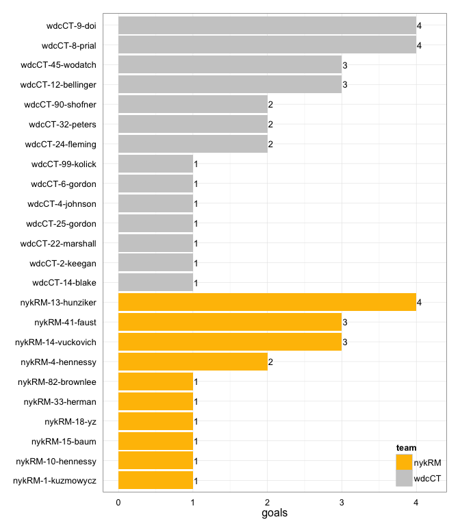
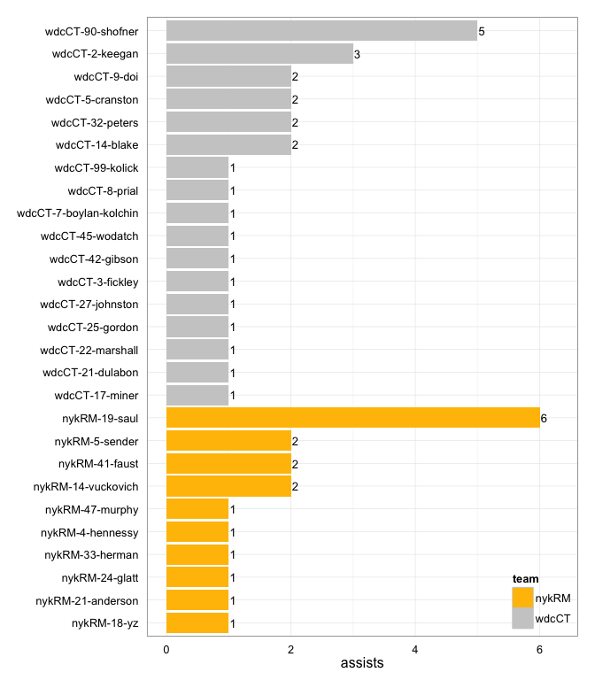
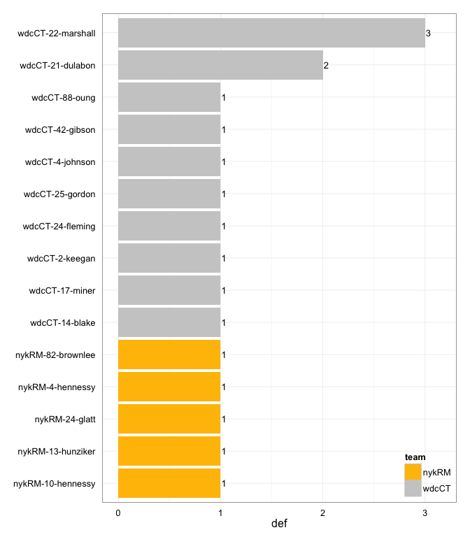

# wdcCT at nykRM 2014-05-17

# wdcCT 27
# nykRM 18
## game is complete

Go to ...  
  * [Scoring progression](#scoringProgression)  
  * [Player stats via figures](#pl_figs)  
  * [Player stats for wdcCT](#away)  
  * [Player stats for nykRM](#home)  
  * [Data on goals, assists, D's](#selectData)  
  * [Full raw data](#rawData)  

## Scoring progression:

| point|period |begin    |end     |pt_duration |desc                                      |wdcCT |nykRM |
|-----:|:------|:--------|:-------|:-----------|:-----------------------------------------|:-----|:-----|
|    49|4      |NA       |0:00:00 |???         |- no goal -                               |27    |18    |
|    48|4      |NA       |NA      |???         |wdcCT-45-wodatch to wdcCT-8-prial         |27    |18    |
|    47|4      |NA       |NA      |???         |nykRM-18-yz to nykRM-41-faust             |26    |18    |
|    46|4      |NA       |NA      |???         |wdcCT-2-keegan to wdcCT-90-shofner        |26    |17    |
|    45|4      |NA       |NA      |???         |nykRM-19-saul to nykRM-1-kuzmowycz        |25    |17    |
|    44|4      |NA       |NA      |???         |wdcCT-2-keegan to wdcCT-8-prial           |25    |16    |
|    43|4      |NA       |NA      |???         |nykRM-47-murphy to nykRM-15-baum          |24    |16    |
|    42|4      |NA       |NA      |???         |wdcCT-42-gibson to wdcCT-12-bellinger     |24    |15    |
|    41|4      |NA       |NA      |???         |wdcCT-5-cranston to wdcCT-8-prial         |23    |15    |
|    40|4      |NA       |NA      |???         |nykRM-5-sender to nykRM-10-hennessy       |22    |15    |
|    39|3      |NA       |NA      |???         |- no goal -                               |22    |14    |
|    38|3      |1:10:00  |NA      |???         |wdcCT-9-doi to wdcCT-32-peters            |22    |14    |
|    37|3      |NA       |NA      |???         |nykRM-14-vuckovich to nykRM-18-yz         |21    |14    |
|    36|3      |NA       |NA      |???         |wdcCT-90-shofner to wdcCT-2-keegan        |21    |13    |
|    35|3      |NA       |NA      |???         |nykRM-4-hennessy to nykRM-33-herman       |20    |13    |
|    34|3      |NA       |NA      |???         |wdcCT-90-shofner to wdcCT-32-peters       |20    |12    |
|    33|3      |NA       |NA      |???         |nykRM-19-saul to nykRM-14-vuckovich       |19    |12    |
|    32|3      |NA       |NA      |???         |wdcCT-32-peters to wdcCT-45-wodatch       |19    |11    |
|    31|3      |5:28:00  |NA      |???         |nykRM-19-saul to nykRM-13-hunziker        |18    |11    |
|    30|3      |NA       |NA      |???         |wdcCT-14-blake to wdcCT-45-wodatch        |18    |10    |
|    29|3      |NA       |NA      |???         |nykRM-24-glatt to nykRM-14-vuckovich      |17    |10    |
|    28|3      |NA       |NA      |???         |wdcCT-27-johnston to wdcCT-22-marshall    |17    |9     |
|    27|3      |NA       |NA      |???         |wdcCT-99-kolick to wdcCT-9-doi            |16    |9     |
|    26|3      |NA       |NA      |???         |nykRM-41-faust to nykRM-13-hunziker       |15    |9     |
|    25|3      |NA       |NA      |???         |wdcCT-90-shofner to wdcCT-9-doi           |15    |8     |
|    24|3      |10:00:00 |NA      |???         |nykRM-41-faust to nykRM-13-hunziker       |14    |8     |
|    23|2      |7:00:00  |0:00:00 |07:00       |- no goal -                               |14    |7     |
|    22|2      |NA       |7:00:00 |???         |wdcCT-7-boylan-kolchin to wdcCT-25-gordon |14    |7     |
|    21|2      |NA       |NA      |???         |nykRM-19-saul to nykRM-41-faust           |13    |7     |
|    20|2      |NA       |NA      |???         |wdcCT-90-shofner to wdcCT-45-wodatch      |13    |6     |
|    19|2      |NA       |NA      |???         |nykRM-14-vuckovich to nykRM-4-hennessy    |12    |6     |
|    18|2      |NA       |NA      |???         |wdcCT-8-prial to wdcCT-9-doi              |12    |5     |
|    17|2      |NA       |NA      |???         |nykRM-33-herman to nykRM-4-hennessy       |11    |5     |
|    16|2      |NA       |NA      |???         |wdcCT-32-peters to wdcCT-90-shofner       |11    |4     |
|    15|2      |7:00:00  |NA      |???         |nykRM-19-saul to nykRM-14-vuckovich       |10    |4     |
|    14|2      |NA       |7:00:00 |???         |wdcCT-2-keegan to wdcCT-9-doi             |10    |3     |
|    13|2      |NA       |NA      |???         |wdcCT-25-gordon to wdcCT-4-johnson        |9     |3     |
|    12|2      |NA       |NA      |???         |wdcCT-22-marshall to wdcCT-6-gordon       |8     |3     |
|    11|2      |NA       |NA      |???         |wdcCT-5-cranston to wdcCT-12-bellinger    |7     |3     |
|    10|2      |NA       |NA      |???         |wdcCT-17-miner to wdcCT-24-fleming        |6     |3     |
|     9|2      |10:00:00 |NA      |???         |wdcCT-14-blake to wdcCT-99-kolick         |5     |3     |
|     8|1      |NA       |NA      |???         |- no goal -                               |4     |3     |
|     7|1      |NA       |NA      |???         |wdcCT-90-shofner to wdcCT-14-blake        |4     |3     |
|     6|1      |NA       |NA      |???         |nykRM-21-anderson to nykRM-82-brownlee    |3     |3     |
|     5|1      |NA       |NA      |???         |nykRM-19-saul to nykRM-41-faust           |3     |2     |
|     4|1      |NA       |NA      |???         |wdcCT-9-doi to wdcCT-8-prial              |3     |1     |
|     3|1      |NA       |NA      |???         |nykRM-5-sender to nykRM-13-hunziker       |2     |1     |
|     2|1      |NA       |NA      |???         |wdcCT-21-dulabon to wdcCT-24-fleming      |2     |0     |
|     1|1      |10:00:00 |NA      |???         |wdcCT-3-fickley to wdcCT-12-bellinger     |1     |0     |

## Player stats via figures:

### Points = goals + assists

 

### Goals

 

### Assists

 

### D's
 

## Player stats for wdcCT :

points = goals + assists  
tables sorted in decreasing order based on points (then goals, assists, Ds)  
Ds = total of plain ol' D's + interceptions (D), hand blocks (HB), and foot blocks (FB)  
stats are cumulative for this game

|   |player   |last           | points| comp_pct| goals| assists| throws| completions| catches| def| drop|
|:--|:--------|:--------------|------:|--------:|-----:|-------:|------:|-----------:|-------:|---:|----:|
|20 |wdcCT-90 |shofner        |      7|     0.92|     2|       5|     12|          11|      13|   0|    0|
|21 |wdcCT-9  |doi            |      6|     0.90|     4|       2|     10|           9|      14|   0|    0|
|22 |wdcCT-8  |prial          |      5|     0.94|     4|       1|     16|          15|      17|   0|    1|
|23 |wdcCT-45 |wodatch        |      4|     1.00|     3|       1|      9|           9|      12|   0|    0|
|24 |wdcCT-32 |peters         |      4|     0.91|     2|       2|     11|          10|      12|   0|    0|
|25 |wdcCT-2  |keegan         |      4|     0.93|     1|       3|     27|          25|      24|   1|    0|
|26 |wdcCT-12 |bellinger      |      3|     1.00|     3|       0|     11|          11|      11|   0|    0|
|27 |wdcCT-14 |blake          |      3|     1.00|     1|       2|     21|          21|      13|   1|    0|
|28 |wdcCT-24 |fleming        |      2|     1.00|     2|       0|      1|           1|       3|   1|    0|
|29 |wdcCT-22 |marshall       |      2|     0.71|     1|       1|      7|           5|       5|   3|    0|
|30 |wdcCT-25 |gordon         |      2|     0.83|     1|       1|      6|           5|       7|   1|    0|
|31 |wdcCT-99 |kolick         |      2|     0.96|     1|       1|     23|          22|      20|   0|    0|
|32 |wdcCT-5  |cranston       |      2|     1.00|     0|       2|     13|          13|      10|   0|    0|
|33 |wdcCT-4  |johnson        |      1|     1.00|     1|       0|      6|           6|       6|   1|    0|
|34 |wdcCT-6  |gordon         |      1|     0.67|     1|       0|      3|           2|       3|   0|    0|
|35 |wdcCT-21 |dulabon        |      1|     1.00|     0|       1|      5|           5|       4|   2|    0|
|36 |wdcCT-17 |miner          |      1|     1.00|     0|       1|      2|           2|       2|   1|    0|
|37 |wdcCT-42 |gibson         |      1|     1.00|     0|       1|      4|           4|       3|   1|    0|
|38 |wdcCT-27 |johnston       |      1|     1.00|     0|       1|      9|           9|       7|   0|    0|
|39 |wdcCT-3  |fickley        |      1|     0.82|     0|       1|     11|           9|       9|   0|    2|
|40 |wdcCT-7  |boylan-kolchin |      1|     0.88|     0|       1|      8|           7|       8|   0|    1|
|41 |wdcCT-88 |oung           |      0|     0.89|     0|       0|     18|          16|      13|   1|    1|
|42 |wdcCT-1  |kantor         |      0|     1.00|     0|       0|      4|           4|       4|   0|    0|
|43 |wdcCT-20 |poole          |      0|     0.67|     0|       0|      3|           2|       1|   0|    1|
|44 |wdcCT-31 |cobb           |      0|     0.75|     0|       0|      8|           6|       8|   0|    0|
|45 |wdcCT-82 |?name?         |      0|     1.00|     0|       0|      1|           1|       1|   0|    0|

## Player stats for nykRM :

points = goals + assists  
tables sorted in decreasing order based on points (then goals, assists, Ds)  
Ds = total of plain ol' D's + interceptions (D), hand blocks (HB), and foot blocks (FB)  
stats are cumulative for this game

|   |player   |last      | points| comp_pct| goals| assists| throws| completions| catches| def| drop|
|:--|:--------|:---------|------:|--------:|-----:|-------:|------:|-----------:|-------:|---:|----:|
|1  |nykRM-19 |saul      |      6|     0.90|     0|       6|     40|          36|      37|   0|    1|
|2  |nykRM-14 |vuckovich |      5|     0.90|     3|       2|     29|          26|      32|   0|    0|
|3  |nykRM-41 |faust     |      5|     0.88|     3|       2|     24|          21|      26|   0|    0|
|4  |nykRM-13 |hunziker  |      4|     1.00|     4|       0|      4|           4|       7|   1|    0|
|5  |nykRM-4  |hennessy  |      3|     0.91|     2|       1|     45|          41|      33|   1|    2|
|6  |nykRM-18 |yz        |      2|     1.00|     1|       1|      9|           9|      10|   0|    0|
|7  |nykRM-33 |herman    |      2|     1.00|     1|       1|      9|           9|      10|   0|    0|
|8  |nykRM-5  |sender    |      2|     1.00|     0|       2|     13|          13|       9|   0|    0|
|9  |nykRM-10 |hennessy  |      1|     0.82|     1|       0|     11|           9|      12|   1|    0|
|10 |nykRM-82 |brownlee  |      1|     0.50|     1|       0|      4|           2|       3|   1|    0|
|11 |nykRM-1  |kuzmowycz |      1|     0.86|     1|       0|      7|           6|       8|   0|    0|
|12 |nykRM-15 |baum      |      1|     0.83|     1|       0|      6|           5|       6|   0|    1|
|13 |nykRM-24 |glatt     |      1|     1.00|     0|       1|      9|           9|       5|   1|    0|
|14 |nykRM-21 |anderson  |      1|     0.80|     0|       1|     10|           8|       9|   0|    1|
|15 |nykRM-47 |murphy    |      1|     0.89|     0|       1|     19|          17|      15|   0|    0|
|16 |nykRM-26 |bosco     |      0|     0.92|     0|       0|     25|          23|      16|   0|    0|
|17 |nykRM-27 |wilson    |      0|     0.80|     0|       0|      5|           4|       4|   0|    0|
|18 |nykRM-8  |raymond   |      0|     1.00|     0|       0|      2|           2|       2|   0|    0|
|19 |nykRM-81 |murray    |      0|     1.00|     0|       0|      1|           1|       1|   0|    0|

## Raw data on select events (goals, assists, D's):

| point| period|pull_team | event| poss_abs| poss_rel|poss_team |pl_team |pl_pnum |pl_code |pl_lname       |player                 | nykRM| wdcCT|
|-----:|------:|:---------|-----:|--------:|--------:|:---------|:-------|:-------|:-------|:--------------|:----------------------|-----:|-----:|
|     1|      1|wdcCT     |    57|        8|        8|wdcCT     |wdcCT   |3       |A       |fickley        |wdcCT-3-fickley        |     0|     1|
|     1|      1|wdcCT     |    58|        8|        8|wdcCT     |wdcCT   |12      |LG      |bellinger      |wdcCT-12-bellinger     |     0|     1|
|     2|      1|wdcCT     |    15|        9|        1|nykRM     |wdcCT   |22      |D       |marshall       |wdcCT-22-marshall      |     0|     2|
|     2|      1|wdcCT     |    23|       10|        2|wdcCT     |wdcCT   |21      |A       |dulabon        |wdcCT-21-dulabon       |     0|     2|
|     2|      1|wdcCT     |    24|       10|        2|wdcCT     |wdcCT   |24      |G       |fleming        |wdcCT-24-fleming       |     0|     2|
|     3|      1|wdcCT     |     9|       11|        1|nykRM     |nykRM   |5       |A       |sender         |nykRM-5-sender         |     1|     2|
|     3|      1|wdcCT     |    10|       11|        1|nykRM     |nykRM   |13      |G       |hunziker       |nykRM-13-hunziker      |     1|     2|
|     4|      1|nykRM     |    11|       12|        1|wdcCT     |wdcCT   |9       |A       |doi            |wdcCT-9-doi            |     1|     3|
|     4|      1|nykRM     |    12|       12|        1|wdcCT     |wdcCT   |8       |G       |prial          |wdcCT-8-prial          |     1|     3|
|     5|      1|wdcCT     |    11|       13|        1|nykRM     |nykRM   |19      |A       |saul           |nykRM-19-saul          |     2|     3|
|     5|      1|wdcCT     |    12|       13|        1|nykRM     |nykRM   |41      |LG      |faust          |nykRM-41-faust         |     2|     3|
|     6|      1|nykRM     |     7|       14|        1|wdcCT     |nykRM   |82      |D       |brownlee       |nykRM-82-brownlee      |     3|     3|
|     6|      1|nykRM     |    11|       15|        2|nykRM     |nykRM   |21      |A       |anderson       |nykRM-21-anderson      |     3|     3|
|     6|      1|nykRM     |    12|       15|        2|nykRM     |nykRM   |82      |G       |brownlee       |nykRM-82-brownlee      |     3|     3|
|     7|      1|nykRM     |     7|       16|        1|wdcCT     |wdcCT   |90      |A       |shofner        |wdcCT-90-shofner       |     3|     4|
|     7|      1|nykRM     |     8|       16|        1|wdcCT     |wdcCT   |14      |LG      |blake          |wdcCT-14-blake         |     3|     4|
|     8|      1|wdcCT     |    NA|       NA|       NA|NA        |NA      |NA      |NA      |NA             |NA-NA-NA               |     3|     4|
|     9|      2|nykRM     |     6|       19|        1|wdcCT     |wdcCT   |14      |A       |blake          |wdcCT-14-blake         |     3|     5|
|     9|      2|nykRM     |     7|       19|        1|wdcCT     |wdcCT   |99      |G       |kolick         |wdcCT-99-kolick        |     3|     5|
|    10|      2|wdcCT     |     4|       20|        1|nykRM     |wdcCT   |17      |D       |miner          |wdcCT-17-miner         |     3|     6|
|    10|      2|wdcCT     |     8|       21|        2|wdcCT     |wdcCT   |17      |A       |miner          |wdcCT-17-miner         |     3|     6|
|    10|      2|wdcCT     |     9|       21|        2|wdcCT     |wdcCT   |24      |G       |fleming        |wdcCT-24-fleming       |     3|     6|
|    11|      2|wdcCT     |     4|       22|        1|nykRM     |wdcCT   |42      |D       |gibson         |wdcCT-42-gibson        |     3|     7|
|    11|      2|wdcCT     |     7|       23|        2|wdcCT     |wdcCT   |5       |A       |cranston       |wdcCT-5-cranston       |     3|     7|
|    11|      2|wdcCT     |     8|       23|        2|wdcCT     |wdcCT   |12      |G       |bellinger      |wdcCT-12-bellinger     |     3|     7|
|    12|      2|wdcCT     |     7|       24|        1|nykRM     |wdcCT   |22      |D       |marshall       |wdcCT-22-marshall      |     3|     8|
|    12|      2|wdcCT     |    11|       27|        4|wdcCT     |wdcCT   |22      |PUA     |marshall       |wdcCT-22-marshall      |     3|     8|
|    12|      2|wdcCT     |    12|       27|        4|wdcCT     |wdcCT   |6       |G       |gordon         |wdcCT-6-gordon         |     3|     8|
|    13|      2|wdcCT     |     4|       28|        1|nykRM     |wdcCT   |4       |D       |johnson        |wdcCT-4-johnson        |     3|     9|
|    13|      2|wdcCT     |     7|       29|        2|wdcCT     |wdcCT   |25      |A       |gordon         |wdcCT-25-gordon        |     3|     9|
|    13|      2|wdcCT     |     8|       29|        2|wdcCT     |wdcCT   |4       |G       |johnson        |wdcCT-4-johnson        |     3|     9|
|    14|      2|wdcCT     |    10|       31|        2|wdcCT     |nykRM   |4       |D       |hennessy       |nykRM-4-hennessy       |     3|    10|
|    14|      2|wdcCT     |    13|       32|        3|nykRM     |wdcCT   |22      |D       |marshall       |wdcCT-22-marshall      |     3|    10|
|    14|      2|wdcCT     |    17|       33|        4|wdcCT     |nykRM   |13      |D       |hunziker       |nykRM-13-hunziker      |     3|    10|
|    14|      2|wdcCT     |    21|       35|        6|wdcCT     |wdcCT   |2       |A       |keegan         |wdcCT-2-keegan         |     3|    10|
|    14|      2|wdcCT     |    22|       35|        6|wdcCT     |wdcCT   |9       |LG      |doi            |wdcCT-9-doi            |     3|    10|
|    15|      2|wdcCT     |     3|       36|        1|nykRM     |nykRM   |19      |A       |saul           |nykRM-19-saul          |     4|    10|
|    15|      2|wdcCT     |     4|       36|        1|nykRM     |nykRM   |14      |LG      |vuckovich      |nykRM-14-vuckovich     |     4|    10|
|    16|      2|nykRM     |     7|       37|        1|wdcCT     |wdcCT   |32      |A       |peters         |wdcCT-32-peters        |     4|    11|
|    16|      2|nykRM     |     8|       37|        1|wdcCT     |wdcCT   |90      |G       |shofner        |wdcCT-90-shofner       |     4|    11|
|    17|      2|wdcCT     |    14|       40|        3|nykRM     |nykRM   |33      |A       |herman         |nykRM-33-herman        |     5|    11|
|    17|      2|wdcCT     |    15|       40|        3|nykRM     |nykRM   |4       |G       |hennessy       |nykRM-4-hennessy       |     5|    11|
|    18|      2|nykRM     |     6|       41|        1|wdcCT     |nykRM   |10      |D       |hennessy       |nykRM-10-hennessy      |     5|    12|
|    18|      2|nykRM     |    19|       44|        4|nykRM     |wdcCT   |14      |D       |blake          |wdcCT-14-blake         |     5|    12|
|    18|      2|nykRM     |    26|       45|        5|wdcCT     |wdcCT   |8       |A       |prial          |wdcCT-8-prial          |     5|    12|
|    18|      2|nykRM     |    27|       45|        5|wdcCT     |wdcCT   |9       |G       |doi            |wdcCT-9-doi            |     5|    12|
|    19|      2|wdcCT     |     5|       46|        1|nykRM     |nykRM   |14      |A       |vuckovich      |nykRM-14-vuckovich     |     6|    12|
|    19|      2|wdcCT     |     6|       46|        1|nykRM     |nykRM   |4       |LG      |hennessy       |nykRM-4-hennessy       |     6|    12|
|    20|      2|nykRM     |    15|       49|        3|wdcCT     |wdcCT   |90      |A       |shofner        |wdcCT-90-shofner       |     6|    13|
|    20|      2|nykRM     |    16|       49|        3|wdcCT     |wdcCT   |45      |LG      |wodatch        |wdcCT-45-wodatch       |     6|    13|
|    21|      2|wdcCT     |     3|       50|        1|nykRM     |nykRM   |19      |A       |saul           |nykRM-19-saul          |     7|    13|
|    21|      2|wdcCT     |     4|       50|        1|nykRM     |nykRM   |41      |LG      |faust          |nykRM-41-faust         |     7|    13|
|    22|      2|nykRM     |    17|       53|        3|wdcCT     |wdcCT   |7       |A       |boylan-kolchin |wdcCT-7-boylan-kolchin |     7|    14|
|    22|      2|nykRM     |    18|       53|        3|wdcCT     |wdcCT   |25      |G       |gordon         |wdcCT-25-gordon        |     7|    14|
|    23|      2|wdcCT     |     3|       54|        1|nykRM     |wdcCT   |21      |D       |dulabon        |wdcCT-21-dulabon       |     7|    14|
|    24|      3|wdcCT     |     8|       55|        1|nykRM     |nykRM   |41      |A       |faust          |nykRM-41-faust         |     8|    14|
|    24|      3|wdcCT     |     9|       55|        1|nykRM     |nykRM   |13      |LG      |hunziker       |nykRM-13-hunziker      |     8|    14|
|    25|      3|nykRM     |     9|       56|        1|wdcCT     |wdcCT   |90      |A       |shofner        |wdcCT-90-shofner       |     8|    15|
|    25|      3|nykRM     |    10|       56|        1|wdcCT     |wdcCT   |9       |LG      |doi            |wdcCT-9-doi            |     8|    15|
|    26|      3|wdcCT     |     7|       57|        1|nykRM     |nykRM   |41      |A       |faust          |nykRM-41-faust         |     9|    15|
|    26|      3|wdcCT     |     8|       57|        1|nykRM     |nykRM   |13      |G       |hunziker       |nykRM-13-hunziker      |     9|    15|
|    27|      3|nykRM     |    10|       58|        1|wdcCT     |wdcCT   |99      |A       |kolick         |wdcCT-99-kolick        |     9|    16|
|    27|      3|nykRM     |    11|       58|        1|wdcCT     |wdcCT   |9       |G       |doi            |wdcCT-9-doi            |     9|    16|
|    28|      3|wdcCT     |     4|       59|        1|nykRM     |wdcCT   |24      |D       |fleming        |wdcCT-24-fleming       |     9|    17|
|    28|      3|wdcCT     |    14|       60|        2|wdcCT     |wdcCT   |27      |A       |johnston       |wdcCT-27-johnston      |     9|    17|
|    28|      3|wdcCT     |    15|       60|        2|wdcCT     |wdcCT   |22      |G       |marshall       |wdcCT-22-marshall      |     9|    17|
|    29|      3|wdcCT     |    11|       63|        3|nykRM     |nykRM   |24      |PUA     |glatt          |nykRM-24-glatt         |    10|    17|
|    29|      3|wdcCT     |    12|       63|        3|nykRM     |nykRM   |14      |G       |vuckovich      |nykRM-14-vuckovich     |    10|    17|
|    30|      3|nykRM     |     8|       64|        1|wdcCT     |wdcCT   |14      |A       |blake          |wdcCT-14-blake         |    10|    18|
|    30|      3|nykRM     |     9|       64|        1|wdcCT     |wdcCT   |45      |G       |wodatch        |wdcCT-45-wodatch       |    10|    18|
|    31|      3|wdcCT     |    14|       65|        1|nykRM     |nykRM   |19      |A       |saul           |nykRM-19-saul          |    11|    18|
|    31|      3|wdcCT     |    15|       65|        1|nykRM     |nykRM   |13      |G       |hunziker       |nykRM-13-hunziker      |    11|    18|
|    32|      3|nykRM     |     4|       66|        1|wdcCT     |wdcCT   |32      |A       |peters         |wdcCT-32-peters        |    11|    19|
|    32|      3|nykRM     |     5|       66|        1|wdcCT     |wdcCT   |45      |LG      |wodatch        |wdcCT-45-wodatch       |    11|    19|
|    33|      3|wdcCT     |     8|       67|        1|nykRM     |nykRM   |19      |A       |saul           |nykRM-19-saul          |    12|    19|
|    33|      3|wdcCT     |     9|       67|        1|nykRM     |nykRM   |14      |LG      |vuckovich      |nykRM-14-vuckovich     |    12|    19|
|    34|      3|nykRM     |     6|       68|        1|wdcCT     |nykRM   |24      |D       |glatt          |nykRM-24-glatt         |    12|    20|
|    34|      3|nykRM     |    13|       69|        2|nykRM     |wdcCT   |2       |D       |keegan         |wdcCT-2-keegan         |    12|    20|
|    34|      3|nykRM     |    15|       70|        3|wdcCT     |wdcCT   |90      |A       |shofner        |wdcCT-90-shofner       |    12|    20|
|    34|      3|nykRM     |    16|       70|        3|wdcCT     |wdcCT   |32      |G       |peters         |wdcCT-32-peters        |    12|    20|
|    35|      3|wdcCT     |    12|       71|        1|nykRM     |nykRM   |4       |A       |hennessy       |nykRM-4-hennessy       |    13|    20|
|    35|      3|wdcCT     |    13|       71|        1|nykRM     |nykRM   |33      |G       |herman         |nykRM-33-herman        |    13|    20|
|    36|      3|nykRM     |     5|       72|        1|wdcCT     |wdcCT   |90      |A       |shofner        |wdcCT-90-shofner       |    13|    21|
|    36|      3|nykRM     |     6|       72|        1|wdcCT     |wdcCT   |2       |LG      |keegan         |wdcCT-2-keegan         |    13|    21|
|    37|      3|wdcCT     |     9|       73|        1|nykRM     |nykRM   |14      |A       |vuckovich      |nykRM-14-vuckovich     |    14|    21|
|    37|      3|wdcCT     |    11|       73|        1|nykRM     |nykRM   |18      |G       |yz             |nykRM-18-yz            |    14|    21|
|    38|      3|nykRM     |    13|       74|        1|wdcCT     |wdcCT   |9       |A       |doi            |wdcCT-9-doi            |    14|    22|
|    38|      3|nykRM     |    14|       74|        1|wdcCT     |wdcCT   |32      |G       |peters         |wdcCT-32-peters        |    14|    22|
|    39|      3|wdcCT     |    NA|       NA|       NA|NA        |NA      |NA      |NA      |NA             |NA-NA-NA               |    14|    22|
|    40|      4|nykRM     |    19|       78|        2|nykRM     |nykRM   |5       |A       |sender         |nykRM-5-sender         |    15|    22|
|    40|      4|nykRM     |    20|       78|        2|nykRM     |nykRM   |10      |G       |hennessy       |nykRM-10-hennessy      |    15|    22|
|    41|      4|nykRM     |    12|       80|        2|nykRM     |wdcCT   |88      |D       |oung           |wdcCT-88-oung          |    15|    23|
|    41|      4|nykRM     |    15|       81|        3|wdcCT     |wdcCT   |5       |A       |cranston       |wdcCT-5-cranston       |    15|    23|
|    41|      4|nykRM     |    16|       81|        3|wdcCT     |wdcCT   |8       |G       |prial          |wdcCT-8-prial          |    15|    23|
|    42|      4|wdcCT     |     5|       82|        1|nykRM     |wdcCT   |21      |D       |dulabon        |wdcCT-21-dulabon       |    15|    24|
|    42|      4|wdcCT     |    17|       83|        2|wdcCT     |wdcCT   |42      |A       |gibson         |wdcCT-42-gibson        |    15|    24|
|    42|      4|wdcCT     |    18|       83|        2|wdcCT     |wdcCT   |12      |G       |bellinger      |wdcCT-12-bellinger     |    15|    24|
|    43|      4|wdcCT     |    23|       84|        1|nykRM     |nykRM   |47      |A       |murphy         |nykRM-47-murphy        |    16|    24|
|    43|      4|wdcCT     |    24|       84|        1|nykRM     |nykRM   |15      |G       |baum           |nykRM-15-baum          |    16|    24|
|    44|      4|nykRM     |     9|       85|        1|wdcCT     |wdcCT   |2       |A       |keegan         |wdcCT-2-keegan         |    16|    25|
|    44|      4|nykRM     |    10|       85|        1|wdcCT     |wdcCT   |8       |LG      |prial          |wdcCT-8-prial          |    16|    25|
|    45|      4|wdcCT     |     8|       86|        1|nykRM     |nykRM   |19      |A       |saul           |nykRM-19-saul          |    17|    25|
|    45|      4|wdcCT     |    12|       86|        1|nykRM     |nykRM   |1       |G       |kuzmowycz      |nykRM-1-kuzmowycz      |    17|    25|
|    46|      4|nykRM     |     7|       87|        1|wdcCT     |wdcCT   |2       |A       |keegan         |wdcCT-2-keegan         |    17|    26|
|    46|      4|nykRM     |     8|       87|        1|wdcCT     |wdcCT   |90      |G       |shofner        |wdcCT-90-shofner       |    17|    26|
|    47|      4|wdcCT     |    11|       88|        1|nykRM     |nykRM   |18      |A       |yz             |nykRM-18-yz            |    18|    26|
|    47|      4|wdcCT     |    12|       88|        1|nykRM     |nykRM   |41      |G       |faust          |nykRM-41-faust         |    18|    26|
|    48|      4|nykRM     |     7|       89|        1|wdcCT     |wdcCT   |45      |A       |wodatch        |wdcCT-45-wodatch       |    18|    27|
|    48|      4|nykRM     |     8|       89|        1|wdcCT     |wdcCT   |8       |G       |prial          |wdcCT-8-prial          |    18|    27|
|    49|      4|wdcCT     |    27|       92|        3|nykRM     |wdcCT   |25      |D       |gordon         |wdcCT-25-gordon        |    18|    27|

## Full raw data:

__Note: just for display purposes.__ Raw data in more useful forms can be found in the [GitHub repository](https://github.com/jennybc/vanNH). Find the game you're interested in in the `games` subdirectory.

| period| point|pull_team | event| poss_abs| poss_rel|poss_team |pl_team |pl_pnum |pl_code |
|------:|-----:|:---------|-----:|--------:|--------:|:---------|:-------|:-------|:-------|
|      1|     1|wdcCT     |     1|        1|        1|nykRM     |wdcCT   |12      |P       |
|      1|     1|wdcCT     |     2|        1|        1|nykRM     |nykRM   |41      |PU      |
|      1|     1|wdcCT     |     3|        1|        1|nykRM     |nykRM   |19      |        |
|      1|     1|wdcCT     |     4|        1|        1|nykRM     |nykRM   |41      |        |
|      1|     1|wdcCT     |     5|        1|        1|nykRM     |nykRM   |14      |        |
|      1|     1|wdcCT     |     6|        1|        1|nykRM     |nykRM   |47      |        |
|      1|     1|wdcCT     |     7|        1|        1|nykRM     |nykRM   |41      |        |
|      1|     1|wdcCT     |     8|        1|        1|nykRM     |nykRM   |18      |        |
|      1|     1|wdcCT     |     9|        1|        1|nykRM     |nykRM   |4       |        |
|      1|     1|wdcCT     |    10|        1|        1|nykRM     |nykRM   |19      |        |
|      1|     1|wdcCT     |    11|        1|        1|nykRM     |nykRM   |14      |        |
|      1|     1|wdcCT     |    12|        1|        1|nykRM     |nykRM   |19      |        |
|      1|     1|wdcCT     |    13|        1|        1|nykRM     |nykRM   |18      |        |
|      1|     1|wdcCT     |    14|        1|        1|nykRM     |nykRM   |19      |        |
|      1|     1|wdcCT     |    15|        1|        1|nykRM     |nykRM   |47      |        |
|      1|     1|wdcCT     |    16|        2|        2|wdcCT     |wdcCT   |25      |PU      |
|      1|     1|wdcCT     |    17|        3|        3|nykRM     |nykRM   |19      |PU      |
|      1|     1|wdcCT     |    18|        3|        3|nykRM     |nykRM   |4       |        |
|      1|     1|wdcCT     |    19|        3|        3|nykRM     |nykRM   |19      |        |
|      1|     1|wdcCT     |    20|        3|        3|nykRM     |nykRM   |18      |TD      |
|      1|     1|wdcCT     |    21|        4|        4|wdcCT     |wdcCT   |12      |PU      |
|      1|     1|wdcCT     |    22|        4|        4|wdcCT     |wdcCT   |5       |        |
|      1|     1|wdcCT     |    23|        4|        4|wdcCT     |wdcCT   |31      |        |
|      1|     1|wdcCT     |    24|        4|        4|wdcCT     |wdcCT   |3       |        |
|      1|     1|wdcCT     |    25|        4|        4|wdcCT     |wdcCT   |12      |        |
|      1|     1|wdcCT     |    26|        4|        4|wdcCT     |wdcCT   |4       |        |
|      1|     1|wdcCT     |    27|        4|        4|wdcCT     |wdcCT   |5       |        |
|      1|     1|wdcCT     |    28|        4|        4|wdcCT     |wdcCT   |12      |        |
|      1|     1|wdcCT     |    29|        4|        4|wdcCT     |wdcCT   |3       |        |
|      1|     1|wdcCT     |    30|        4|        4|wdcCT     |wdcCT   |5       |TD      |
|      1|     1|wdcCT     |    31|        5|        5|nykRM     |nykRM   |19      |PU      |
|      1|     1|wdcCT     |    32|        5|        5|nykRM     |nykRM   |4       |        |
|      1|     1|wdcCT     |    33|        5|        5|nykRM     |nykRM   |47      |        |
|      1|     1|wdcCT     |    34|        5|        5|nykRM     |nykRM   |33      |        |
|      1|     1|wdcCT     |    35|        5|        5|nykRM     |nykRM   |19      |        |
|      1|     1|wdcCT     |    36|        5|        5|nykRM     |nykRM   |47      |        |
|      1|     1|wdcCT     |    37|        5|        5|nykRM     |nykRM   |19      |        |
|      1|     1|wdcCT     |    38|        5|        5|nykRM     |nykRM   |41      |        |
|      1|     1|wdcCT     |    39|        5|        5|nykRM     |nykRM   |33      |        |
|      1|     1|wdcCT     |    40|        5|        5|nykRM     |nykRM   |14      |        |
|      1|     1|wdcCT     |    41|        5|        5|nykRM     |nykRM   |41      |        |
|      1|     1|wdcCT     |    42|        6|        6|wdcCT     |wdcCT   |3       |PU      |
|      1|     1|wdcCT     |    43|        6|        6|wdcCT     |wdcCT   |5       |        |
|      1|     1|wdcCT     |    44|        6|        6|wdcCT     |wdcCT   |31      |        |
|      1|     1|wdcCT     |    45|        6|        6|wdcCT     |wdcCT   |5       |        |
|      1|     1|wdcCT     |    46|        6|        6|wdcCT     |wdcCT   |25      |        |
|      1|     1|wdcCT     |    47|        6|        6|wdcCT     |wdcCT   |4       |        |
|      1|     1|wdcCT     |    48|        6|        6|wdcCT     |wdcCT   |25      |VTT     |
|      1|     1|wdcCT     |    49|        7|        7|nykRM     |nykRM   |19      |PU      |
|      1|     1|wdcCT     |    50|        7|        7|nykRM     |nykRM   |41      |        |
|      1|     1|wdcCT     |    51|        7|        7|nykRM     |nykRM   |4       |        |
|      1|     1|wdcCT     |    52|        7|        7|nykRM     |nykRM   |41      |        |
|      1|     1|wdcCT     |    53|        7|        7|nykRM     |nykRM   |18      |        |
|      1|     1|wdcCT     |    54|        7|        7|nykRM     |nykRM   |41      |VTT     |
|      1|     1|wdcCT     |    55|        8|        8|wdcCT     |wdcCT   |5       |PU      |
|      1|     1|wdcCT     |    56|        8|        8|wdcCT     |wdcCT   |4       |        |
|      1|     1|wdcCT     |    57|        8|        8|wdcCT     |wdcCT   |3       |A       |
|      1|     1|wdcCT     |    58|        8|        8|wdcCT     |wdcCT   |12      |LG      |
|      1|     2|wdcCT     |     1|        9|        1|nykRM     |wdcCT   |22      |P       |
|      1|     2|wdcCT     |     2|        9|        1|nykRM     |nykRM   |26      |PU      |
|      1|     2|wdcCT     |     3|        9|        1|nykRM     |nykRM   |41      |        |
|      1|     2|wdcCT     |     4|        9|        1|nykRM     |nykRM   |14      |        |
|      1|     2|wdcCT     |     5|        9|        1|nykRM     |nykRM   |4       |        |
|      1|     2|wdcCT     |     6|        9|        1|nykRM     |nykRM   |1       |        |
|      1|     2|wdcCT     |     7|        9|        1|nykRM     |nykRM   |81      |        |
|      1|     2|wdcCT     |     8|        9|        1|nykRM     |nykRM   |14      |        |
|      1|     2|wdcCT     |     9|        9|        1|nykRM     |nykRM   |4       |        |
|      1|     2|wdcCT     |    10|        9|        1|nykRM     |wdcCT   |1       |F       |
|      1|     2|wdcCT     |    11|        9|        1|nykRM     |nykRM   |26      |        |
|      1|     2|wdcCT     |    12|        9|        1|nykRM     |nykRM   |4       |        |
|      1|     2|wdcCT     |    13|        9|        1|nykRM     |nykRM   |26      |        |
|      1|     2|wdcCT     |    14|        9|        1|nykRM     |nykRM   |47      |        |
|      1|     2|wdcCT     |    15|        9|        1|nykRM     |wdcCT   |22      |D       |
|      1|     2|wdcCT     |    16|       10|        2|wdcCT     |wdcCT   |22      |PU      |
|      1|     2|wdcCT     |    17|       10|        2|wdcCT     |wdcCT   |1       |        |
|      1|     2|wdcCT     |    18|       10|        2|wdcCT     |wdcCT   |27      |        |
|      1|     2|wdcCT     |    19|       10|        2|wdcCT     |wdcCT   |22      |        |
|      1|     2|wdcCT     |    20|       10|        2|wdcCT     |wdcCT   |24      |        |
|      1|     2|wdcCT     |    21|       10|        2|wdcCT     |wdcCT   |22      |        |
|      1|     2|wdcCT     |    22|       10|        2|wdcCT     |wdcCT   |27      |        |
|      1|     2|wdcCT     |    23|       10|        2|wdcCT     |wdcCT   |21      |A       |
|      1|     2|wdcCT     |    24|       10|        2|wdcCT     |wdcCT   |24      |G       |
|      1|     3|wdcCT     |     1|       11|        1|nykRM     |wdcCT   |12      |P       |
|      1|     3|wdcCT     |     2|       11|        1|nykRM     |nykRM   |13      |PU      |
|      1|     3|wdcCT     |     3|       11|        1|nykRM     |nykRM   |10      |        |
|      1|     3|wdcCT     |     4|       11|        1|nykRM     |nykRM   |21      |        |
|      1|     3|wdcCT     |     5|       11|        1|nykRM     |nykRM   |13      |        |
|      1|     3|wdcCT     |     6|       11|        1|nykRM     |nykRM   |10      |        |
|      1|     3|wdcCT     |     7|       11|        1|nykRM     |nykRM   |24      |        |
|      1|     3|wdcCT     |     8|       11|        1|nykRM     |nykRM   |10      |        |
|      1|     3|wdcCT     |     9|       11|        1|nykRM     |nykRM   |5       |A       |
|      1|     3|wdcCT     |    10|       11|        1|nykRM     |nykRM   |13      |G       |
|      1|     4|nykRM     |     1|       12|        1|wdcCT     |nykRM   |13      |P       |
|      1|     4|nykRM     |     2|       12|        1|wdcCT     |wdcCT   |8       |PU      |
|      1|     4|nykRM     |     3|       12|        1|wdcCT     |wdcCT   |88      |        |
|      1|     4|nykRM     |     4|       12|        1|wdcCT     |wdcCT   |45      |        |
|      1|     4|nykRM     |     5|       12|        1|wdcCT     |wdcCT   |8       |        |
|      1|     4|nykRM     |     6|       12|        1|wdcCT     |wdcCT   |2       |        |
|      1|     4|nykRM     |     7|       12|        1|wdcCT     |wdcCT   |99      |        |
|      1|     4|nykRM     |     8|       12|        1|wdcCT     |wdcCT   |88      |        |
|      1|     4|nykRM     |     9|       12|        1|wdcCT     |wdcCT   |9       |        |
|      1|     4|nykRM     |    10|       12|        1|wdcCT     |wdcCT   |99      |        |
|      1|     4|nykRM     |    11|       12|        1|wdcCT     |wdcCT   |9       |A       |
|      1|     4|nykRM     |    12|       12|        1|wdcCT     |wdcCT   |8       |G       |
|      1|     5|wdcCT     |     1|       13|        1|nykRM     |wdcCT   |22      |P       |
|      1|     5|wdcCT     |     2|       13|        1|nykRM     |nykRM   |26      |PU      |
|      1|     5|wdcCT     |     3|       13|        1|nykRM     |nykRM   |19      |        |
|      1|     5|wdcCT     |     4|       13|        1|nykRM     |nykRM   |4       |        |
|      1|     5|wdcCT     |     5|       13|        1|nykRM     |nykRM   |26      |        |
|      1|     5|wdcCT     |     6|       13|        1|nykRM     |nykRM   |41      |        |
|      1|     5|wdcCT     |     7|       13|        1|nykRM     |nykRM   |14      |        |
|      1|     5|wdcCT     |     8|       13|        1|nykRM     |nykRM   |4       |        |
|      1|     5|wdcCT     |     9|       13|        1|nykRM     |nykRM   |14      |        |
|      1|     5|wdcCT     |    10|       13|        1|nykRM     |nykRM   |4       |        |
|      1|     5|wdcCT     |    11|       13|        1|nykRM     |nykRM   |19      |A       |
|      1|     5|wdcCT     |    12|       13|        1|nykRM     |nykRM   |41      |LG      |
|      1|     6|nykRM     |     1|       14|        1|wdcCT     |nykRM   |13      |P       |
|      1|     6|nykRM     |     2|       14|        1|wdcCT     |wdcCT   |2       |PU      |
|      1|     6|nykRM     |     3|       14|        1|wdcCT     |wdcCT   |99      |        |
|      1|     6|nykRM     |     4|       14|        1|wdcCT     |wdcCT   |8       |        |
|      1|     6|nykRM     |     5|       14|        1|wdcCT     |wdcCT   |45      |        |
|      1|     6|nykRM     |     6|       14|        1|wdcCT     |wdcCT   |88      |        |
|      1|     6|nykRM     |     7|       14|        1|wdcCT     |nykRM   |82      |D       |
|      1|     6|nykRM     |     8|       15|        2|nykRM     |nykRM   |82      |PU      |
|      1|     6|nykRM     |     9|       15|        2|nykRM     |nykRM   |21      |        |
|      1|     6|nykRM     |    10|       15|        2|nykRM     |nykRM   |10      |        |
|      1|     6|nykRM     |    11|       15|        2|nykRM     |nykRM   |21      |A       |
|      1|     6|nykRM     |    12|       15|        2|nykRM     |nykRM   |82      |G       |
|      1|     7|nykRM     |     1|       16|        1|wdcCT     |nykRM   |27      |P       |
|      1|     7|nykRM     |     2|       16|        1|wdcCT     |wdcCT   |14      |PU      |
|      1|     7|nykRM     |     3|       16|        1|wdcCT     |wdcCT   |2       |        |
|      1|     7|nykRM     |     4|       16|        1|wdcCT     |wdcCT   |14      |        |
|      1|     7|nykRM     |     5|       16|        1|wdcCT     |wdcCT   |8       |        |
|      1|     7|nykRM     |     6|       16|        1|wdcCT     |wdcCT   |45      |        |
|      1|     7|nykRM     |     7|       16|        1|wdcCT     |wdcCT   |90      |A       |
|      1|     7|nykRM     |     8|       16|        1|wdcCT     |wdcCT   |14      |LG      |
|      1|     8|wdcCT     |     1|       17|        1|nykRM     |wdcCT   |12      |P       |
|      1|     8|wdcCT     |     2|       17|        1|nykRM     |nykRM   |4       |PU      |
|      1|     8|wdcCT     |     3|       17|        1|nykRM     |nykRM   |19      |        |
|      1|     8|wdcCT     |     4|       17|        1|nykRM     |nykRM   |4       |        |
|      1|     8|wdcCT     |     5|       17|        1|nykRM     |nykRM   |1       |        |
|      1|     8|wdcCT     |     6|       17|        1|nykRM     |nykRM   |33      |        |
|      1|     8|wdcCT     |     7|       17|        1|nykRM     |nykRM   |41      |        |
|      1|     8|wdcCT     |     8|       17|        1|nykRM     |nykRM   |4       |        |
|      1|     8|wdcCT     |     9|       17|        1|nykRM     |wdcCT   |3       |F       |
|      1|     8|wdcCT     |    10|       17|        1|nykRM     |nykRM   |41      |TD      |
|      1|     8|wdcCT     |    11|       18|        2|wdcCT     |wdcCT   |12      |PU      |
|      1|     8|wdcCT     |    12|       18|        2|wdcCT     |wdcCT   |3       |        |
|      1|     8|wdcCT     |    13|       18|        2|wdcCT     |wdcCT   |12      |        |
|      1|     8|wdcCT     |    14|       18|        2|wdcCT     |wdcCT   |5       |        |
|      1|     8|wdcCT     |    15|       18|        2|wdcCT     |wdcCT   |3       |        |
|      1|     8|wdcCT     |    16|       18|        2|wdcCT     |wdcCT   |12      |        |
|      1|     8|wdcCT     |    17|       18|        2|wdcCT     |wdcCT   |7       |        |
|      1|     8|wdcCT     |    18|       18|        2|wdcCT     |wdcCT   |42      |        |
|      1|     8|wdcCT     |    19|       18|        2|wdcCT     |wdcCT   |25      |        |
|      1|     8|wdcCT     |    20|       18|        2|wdcCT     |wdcCT   |12      |        |
|      1|     8|wdcCT     |    21|       18|        2|wdcCT     |wdcCT   |3       |        |
|      1|     8|wdcCT     |    22|       18|        2|wdcCT     |wdcCT   |5       |        |
|      1|     8|wdcCT     |    23|       18|        2|wdcCT     |wdcCT   |31      |        |
|      2|     9|nykRM     |     1|       19|        1|wdcCT     |nykRM   |21      |P       |
|      2|     9|nykRM     |     2|       19|        1|wdcCT     |wdcCT   |14      |PU      |
|      2|     9|nykRM     |     3|       19|        1|wdcCT     |wdcCT   |99      |        |
|      2|     9|nykRM     |     4|       19|        1|wdcCT     |wdcCT   |9       |L       |
|      2|     9|nykRM     |     5|       19|        1|wdcCT     |wdcCT   |99      |        |
|      2|     9|nykRM     |     6|       19|        1|wdcCT     |wdcCT   |14      |A       |
|      2|     9|nykRM     |     7|       19|        1|wdcCT     |wdcCT   |99      |G       |
|      2|    10|wdcCT     |     1|       20|        1|nykRM     |wdcCT   |21      |P       |
|      2|    10|wdcCT     |     2|       20|        1|nykRM     |nykRM   |4       |PU      |
|      2|    10|wdcCT     |     3|       20|        1|nykRM     |nykRM   |19      |        |
|      2|    10|wdcCT     |     4|       20|        1|nykRM     |wdcCT   |17      |D       |
|      2|    10|wdcCT     |     5|       21|        2|wdcCT     |wdcCT   |20      |PU      |
|      2|    10|wdcCT     |     6|       21|        2|wdcCT     |wdcCT   |27      |        |
|      2|    10|wdcCT     |     7|       21|        2|wdcCT     |wdcCT   |20      |        |
|      2|    10|wdcCT     |     8|       21|        2|wdcCT     |wdcCT   |17      |A       |
|      2|    10|wdcCT     |     9|       21|        2|wdcCT     |wdcCT   |24      |G       |
|      2|    11|wdcCT     |     1|       22|        1|nykRM     |wdcCT   |12      |P       |
|      2|    11|wdcCT     |     2|       22|        1|nykRM     |nykRM   |27      |PU      |
|      2|    11|wdcCT     |     3|       22|        1|nykRM     |nykRM   |4       |        |
|      2|    11|wdcCT     |     4|       22|        1|nykRM     |wdcCT   |42      |D       |
|      2|    11|wdcCT     |     5|       23|        2|wdcCT     |wdcCT   |42      |PU      |
|      2|    11|wdcCT     |     6|       23|        2|wdcCT     |wdcCT   |4       |        |
|      2|    11|wdcCT     |     7|       23|        2|wdcCT     |wdcCT   |5       |A       |
|      2|    11|wdcCT     |     8|       23|        2|wdcCT     |wdcCT   |12      |G       |
|      2|    12|wdcCT     |     1|       24|        1|nykRM     |wdcCT   |22      |P       |
|      2|    12|wdcCT     |     2|       24|        1|nykRM     |nykRM   |15      |PU      |
|      2|    12|wdcCT     |     3|       24|        1|nykRM     |nykRM   |24      |        |
|      2|    12|wdcCT     |     4|       24|        1|nykRM     |nykRM   |10      |        |
|      2|    12|wdcCT     |     5|       24|        1|nykRM     |nykRM   |15      |        |
|      2|    12|wdcCT     |     6|       24|        1|nykRM     |nykRM   |82      |        |
|      2|    12|wdcCT     |     7|       24|        1|nykRM     |wdcCT   |22      |D       |
|      2|    12|wdcCT     |     8|       25|        2|wdcCT     |wdcCT   |6       |PU      |
|      2|    12|wdcCT     |     9|       26|        3|nykRM     |nykRM   |82      |PU      |
|      2|    12|wdcCT     |    10|       26|        3|nykRM     |wdcCT   |17      |F       |
|      2|    12|wdcCT     |    11|       27|        4|wdcCT     |wdcCT   |22      |PUA     |
|      2|    12|wdcCT     |    12|       27|        4|wdcCT     |wdcCT   |6       |G       |
|      2|    13|wdcCT     |     1|       28|        1|nykRM     |wdcCT   |12      |P       |
|      2|    13|wdcCT     |     2|       28|        1|nykRM     |nykRM   |4       |PU      |
|      2|    13|wdcCT     |     3|       28|        1|nykRM     |nykRM   |19      |        |
|      2|    13|wdcCT     |     4|       28|        1|nykRM     |wdcCT   |4       |D       |
|      2|    13|wdcCT     |     5|       29|        2|wdcCT     |wdcCT   |4       |PU      |
|      2|    13|wdcCT     |     6|       29|        2|wdcCT     |wdcCT   |3       |        |
|      2|    13|wdcCT     |     7|       29|        2|wdcCT     |wdcCT   |25      |A       |
|      2|    13|wdcCT     |     8|       29|        2|wdcCT     |wdcCT   |4       |G       |
|      2|    14|wdcCT     |     1|       30|        1|nykRM     |wdcCT   |22      |P       |
|      2|    14|wdcCT     |     2|       30|        1|nykRM     |nykRM   |26      |PU      |
|      2|    14|wdcCT     |     3|       30|        1|nykRM     |nykRM   |4       |        |
|      2|    14|wdcCT     |     4|       30|        1|nykRM     |nykRM   |14      |        |
|      2|    14|wdcCT     |     5|       30|        1|nykRM     |nykRM   |41      |        |
|      2|    14|wdcCT     |     6|       30|        1|nykRM     |nykRM   |26      |        |
|      2|    14|wdcCT     |     7|       30|        1|nykRM     |nykRM   |4       |        |
|      2|    14|wdcCT     |     8|       30|        1|nykRM     |nykRM   |1       |TD      |
|      2|    14|wdcCT     |     9|       31|        2|wdcCT     |wdcCT   |22      |PU      |
|      2|    14|wdcCT     |    10|       31|        2|wdcCT     |nykRM   |4       |D       |
|      2|    14|wdcCT     |    11|       32|        3|nykRM     |nykRM   |47      |PU      |
|      2|    14|wdcCT     |    12|       32|        3|nykRM     |nykRM   |4       |        |
|      2|    14|wdcCT     |    13|       32|        3|nykRM     |wdcCT   |22      |D       |
|      2|    14|wdcCT     |    14|       33|        4|wdcCT     |wdcCT   |        |TO      |
|      2|    14|wdcCT     |    15|       33|        4|wdcCT     |wdcCT   |99      |PU      |
|      2|    14|wdcCT     |    16|       33|        4|wdcCT     |wdcCT   |2       |        |
|      2|    14|wdcCT     |    17|       33|        4|wdcCT     |nykRM   |13      |D       |
|      2|    14|wdcCT     |    18|       34|        5|nykRM     |nykRM   |21      |PU      |
|      2|    14|wdcCT     |    19|       35|        6|wdcCT     |wdcCT   |99      |PU      |
|      2|    14|wdcCT     |    20|       35|        6|wdcCT     |wdcCT   |14      |        |
|      2|    14|wdcCT     |    21|       35|        6|wdcCT     |wdcCT   |2       |A       |
|      2|    14|wdcCT     |    22|       35|        6|wdcCT     |wdcCT   |9       |LG      |
|      2|    15|wdcCT     |     1|       36|        1|nykRM     |wdcCT   |12      |P       |
|      2|    15|wdcCT     |     2|       36|        1|nykRM     |nykRM   |4       |PU      |
|      2|    15|wdcCT     |     3|       36|        1|nykRM     |nykRM   |19      |A       |
|      2|    15|wdcCT     |     4|       36|        1|nykRM     |nykRM   |14      |LG      |
|      2|    16|nykRM     |     1|       37|        1|wdcCT     |nykRM   |13      |P       |
|      2|    16|nykRM     |     2|       37|        1|wdcCT     |wdcCT   |14      |PU      |
|      2|    16|nykRM     |     3|       37|        1|wdcCT     |wdcCT   |99      |        |
|      2|    16|nykRM     |     4|       37|        1|wdcCT     |wdcCT   |14      |        |
|      2|    16|nykRM     |     5|       37|        1|wdcCT     |wdcCT   |32      |        |
|      2|    16|nykRM     |     6|       37|        1|wdcCT     |wdcCT   |14      |        |
|      2|    16|nykRM     |     7|       37|        1|wdcCT     |wdcCT   |32      |A       |
|      2|    16|nykRM     |     8|       37|        1|wdcCT     |wdcCT   |90      |G       |
|      2|    17|wdcCT     |     1|       38|        1|nykRM     |wdcCT   |22      |P       |
|      2|    17|wdcCT     |     2|       38|        1|nykRM     |nykRM   |47      |PU      |
|      2|    17|wdcCT     |     3|       38|        1|nykRM     |nykRM   |4       |        |
|      2|    17|wdcCT     |     4|       38|        1|nykRM     |nykRM   |26      |        |
|      2|    17|wdcCT     |     5|       39|        2|wdcCT     |wdcCT   |20      |PU      |
|      2|    17|wdcCT     |     6|       39|        2|wdcCT     |wdcCT   |1       |TD      |
|      2|    17|wdcCT     |     7|       40|        3|nykRM     |nykRM   |4       |PU      |
|      2|    17|wdcCT     |     8|       40|        3|nykRM     |nykRM   |26      |        |
|      2|    17|wdcCT     |     9|       40|        3|nykRM     |nykRM   |33      |        |
|      2|    17|wdcCT     |    10|       40|        3|nykRM     |nykRM   |47      |        |
|      2|    17|wdcCT     |    11|       40|        3|nykRM     |nykRM   |26      |        |
|      2|    17|wdcCT     |    12|       40|        3|nykRM     |nykRM   |14      |        |
|      2|    17|wdcCT     |    13|       40|        3|nykRM     |nykRM   |1       |        |
|      2|    17|wdcCT     |    14|       40|        3|nykRM     |nykRM   |33      |A       |
|      2|    17|wdcCT     |    15|       40|        3|nykRM     |nykRM   |4       |G       |
|      2|    18|nykRM     |     1|       41|        1|wdcCT     |nykRM   |13      |P       |
|      2|    18|nykRM     |     2|       41|        1|wdcCT     |wdcCT   |14      |PU      |
|      2|    18|nykRM     |     3|       41|        1|wdcCT     |wdcCT   |2       |        |
|      2|    18|nykRM     |     4|       41|        1|wdcCT     |wdcCT   |88      |        |
|      2|    18|nykRM     |     5|       41|        1|wdcCT     |wdcCT   |2       |        |
|      2|    18|nykRM     |     6|       41|        1|wdcCT     |nykRM   |10      |D       |
|      2|    18|nykRM     |     7|       42|        2|nykRM     |nykRM   |5       |PU      |
|      2|    18|nykRM     |     8|       42|        2|nykRM     |nykRM   |27      |        |
|      2|    18|nykRM     |     9|       42|        2|nykRM     |nykRM   |10      |        |
|      2|    18|nykRM     |    10|       43|        3|wdcCT     |wdcCT   |8       |PU      |
|      2|    18|nykRM     |    11|       43|        3|wdcCT     |wdcCT   |14      |        |
|      2|    18|nykRM     |    12|       43|        3|wdcCT     |wdcCT   |32      |        |
|      2|    18|nykRM     |    13|       43|        3|wdcCT     |wdcCT   |2       |        |
|      2|    18|nykRM     |    14|       43|        3|wdcCT     |wdcCT   |9       |        |
|      2|    18|nykRM     |    15|       43|        3|wdcCT     |wdcCT   |8       |        |
|      2|    18|nykRM     |    16|       43|        3|wdcCT     |wdcCT   |88      |TD      |
|      2|    18|nykRM     |    17|       44|        4|nykRM     |nykRM   |5       |PU      |
|      2|    18|nykRM     |    18|       44|        4|nykRM     |nykRM   |27      |        |
|      2|    18|nykRM     |    19|       44|        4|nykRM     |wdcCT   |14      |D       |
|      2|    18|nykRM     |    20|       45|        5|wdcCT     |wdcCT   |8       |PU      |
|      2|    18|nykRM     |    21|       45|        5|wdcCT     |wdcCT   |32      |        |
|      2|    18|nykRM     |    22|       45|        5|wdcCT     |wdcCT   |14      |        |
|      2|    18|nykRM     |    23|       45|        5|wdcCT     |wdcCT   |82      |        |
|      2|    18|nykRM     |    24|       45|        5|wdcCT     |wdcCT   |90      |        |
|      2|    18|nykRM     |    25|       45|        5|wdcCT     |wdcCT   |2       |        |
|      2|    18|nykRM     |    26|       45|        5|wdcCT     |wdcCT   |8       |A       |
|      2|    18|nykRM     |    27|       45|        5|wdcCT     |wdcCT   |9       |G       |
|      2|    19|wdcCT     |     1|       46|        1|nykRM     |wdcCT   |12      |P       |
|      2|    19|wdcCT     |     2|       46|        1|nykRM     |nykRM   |4       |PU      |
|      2|    19|wdcCT     |     3|       46|        1|nykRM     |nykRM   |19      |        |
|      2|    19|wdcCT     |     4|       46|        1|nykRM     |nykRM   |47      |        |
|      2|    19|wdcCT     |     5|       46|        1|nykRM     |nykRM   |14      |A       |
|      2|    19|wdcCT     |     6|       46|        1|nykRM     |nykRM   |4       |LG      |
|      2|    20|nykRM     |     1|       47|        1|wdcCT     |nykRM   |27      |P       |
|      2|    20|nykRM     |     2|       47|        1|wdcCT     |wdcCT   |2       |PU      |
|      2|    20|nykRM     |     3|       47|        1|wdcCT     |wdcCT   |88      |        |
|      2|    20|nykRM     |     4|       47|        1|wdcCT     |wdcCT   |2       |        |
|      2|    20|nykRM     |     5|       47|        1|wdcCT     |wdcCT   |90      |        |
|      2|    20|nykRM     |     6|       48|        2|nykRM     |nykRM   |5       |PU      |
|      2|    20|nykRM     |     7|       48|        2|nykRM     |nykRM   |24      |        |
|      2|    20|nykRM     |     8|       48|        2|nykRM     |nykRM   |5       |        |
|      2|    20|nykRM     |     9|       48|        2|nykRM     |nykRM   |10      |        |
|      2|    20|nykRM     |    10|       48|        2|nykRM     |nykRM   |21      |        |
|      2|    20|nykRM     |    11|       48|        2|nykRM     |nykRM   |15      |        |
|      2|    20|nykRM     |    12|       48|        2|nykRM     |nykRM   |4       |TD      |
|      2|    20|nykRM     |    13|       49|        3|wdcCT     |wdcCT   |90      |PU      |
|      2|    20|nykRM     |    14|       49|        3|wdcCT     |wdcCT   |8       |        |
|      2|    20|nykRM     |    15|       49|        3|wdcCT     |wdcCT   |90      |A       |
|      2|    20|nykRM     |    16|       49|        3|wdcCT     |wdcCT   |45      |LG      |
|      2|    21|wdcCT     |     1|       50|        1|nykRM     |wdcCT   |22      |P       |
|      2|    21|wdcCT     |     2|       50|        1|nykRM     |nykRM   |26      |PU      |
|      2|    21|wdcCT     |     3|       50|        1|nykRM     |nykRM   |19      |A       |
|      2|    21|wdcCT     |     4|       50|        1|nykRM     |nykRM   |41      |LG      |
|      2|    22|nykRM     |     1|       51|        1|wdcCT     |nykRM   |13      |P       |
|      2|    22|nykRM     |     2|       51|        1|wdcCT     |wdcCT   |14      |PU      |
|      2|    22|nykRM     |     3|       51|        1|wdcCT     |wdcCT   |2       |        |
|      2|    22|nykRM     |     4|       51|        1|wdcCT     |wdcCT   |99      |        |
|      2|    22|nykRM     |     5|       52|        2|nykRM     |nykRM   |        |TO      |
|      2|    22|nykRM     |     6|       52|        2|nykRM     |nykRM   |4       |PU      |
|      2|    22|nykRM     |     7|       52|        2|nykRM     |nykRM   |19      |        |
|      2|    22|nykRM     |     8|       52|        2|nykRM     |nykRM   |14      |        |
|      2|    22|nykRM     |     9|       52|        2|nykRM     |nykRM   |18      |        |
|      2|    22|nykRM     |    10|       52|        2|nykRM     |nykRM   |19      |        |
|      2|    22|nykRM     |    11|       52|        2|nykRM     |nykRM   |14      |        |
|      2|    22|nykRM     |    12|       53|        3|wdcCT     |wdcCT   |3       |PU      |
|      2|    22|nykRM     |    13|       53|        3|wdcCT     |wdcCT   |5       |        |
|      2|    22|nykRM     |    14|       53|        3|wdcCT     |wdcCT   |3       |        |
|      2|    22|nykRM     |    15|       53|        3|wdcCT     |wdcCT   |31      |        |
|      2|    22|nykRM     |    16|       53|        3|wdcCT     |wdcCT   |25      |        |
|      2|    22|nykRM     |    17|       53|        3|wdcCT     |wdcCT   |7       |A       |
|      2|    22|nykRM     |    18|       53|        3|wdcCT     |wdcCT   |25      |G       |
|      2|    23|wdcCT     |     1|       54|        1|nykRM     |wdcCT   |20      |P       |
|      2|    23|wdcCT     |     2|       54|        1|nykRM     |nykRM   |41      |PU      |
|      2|    23|wdcCT     |     3|       54|        1|nykRM     |wdcCT   |21      |D       |
|      3|    24|wdcCT     |     1|       55|        1|nykRM     |wdcCT   |22      |P       |
|      3|    24|wdcCT     |     2|       55|        1|nykRM     |nykRM   |4       |PU      |
|      3|    24|wdcCT     |     3|       55|        1|nykRM     |nykRM   |19      |        |
|      3|    24|wdcCT     |     4|       55|        1|nykRM     |nykRM   |41      |        |
|      3|    24|wdcCT     |     5|       55|        1|nykRM     |nykRM   |4       |        |
|      3|    24|wdcCT     |     6|       55|        1|nykRM     |nykRM   |13      |        |
|      3|    24|wdcCT     |     7|       55|        1|nykRM     |nykRM   |4       |        |
|      3|    24|wdcCT     |     8|       55|        1|nykRM     |nykRM   |41      |A       |
|      3|    24|wdcCT     |     9|       55|        1|nykRM     |nykRM   |13      |LG      |
|      3|    25|nykRM     |     1|       56|        1|wdcCT     |nykRM   |18      |P       |
|      3|    25|nykRM     |     2|       56|        1|wdcCT     |wdcCT   |2       |PU      |
|      3|    25|nykRM     |     3|       56|        1|wdcCT     |wdcCT   |99      |        |
|      3|    25|nykRM     |     4|       56|        1|wdcCT     |wdcCT   |88      |        |
|      3|    25|nykRM     |     5|       56|        1|wdcCT     |wdcCT   |8       |        |
|      3|    25|nykRM     |     6|       56|        1|wdcCT     |wdcCT   |99      |        |
|      3|    25|nykRM     |     7|       56|        1|wdcCT     |wdcCT   |2       |        |
|      3|    25|nykRM     |     8|       56|        1|wdcCT     |wdcCT   |88      |        |
|      3|    25|nykRM     |     9|       56|        1|wdcCT     |wdcCT   |90      |A       |
|      3|    25|nykRM     |    10|       56|        1|wdcCT     |wdcCT   |9       |LG      |
|      3|    26|wdcCT     |     1|       57|        1|nykRM     |wdcCT   |12      |P       |
|      3|    26|wdcCT     |     2|       57|        1|nykRM     |nykRM   |4       |PU      |
|      3|    26|wdcCT     |     3|       57|        1|nykRM     |nykRM   |19      |        |
|      3|    26|wdcCT     |     4|       57|        1|nykRM     |nykRM   |41      |        |
|      3|    26|wdcCT     |     5|       57|        1|nykRM     |nykRM   |4       |        |
|      3|    26|wdcCT     |     6|       57|        1|nykRM     |nykRM   |47      |        |
|      3|    26|wdcCT     |     7|       57|        1|nykRM     |nykRM   |41      |A       |
|      3|    26|wdcCT     |     8|       57|        1|nykRM     |nykRM   |13      |G       |
|      3|    27|nykRM     |     1|       58|        1|wdcCT     |nykRM   |27      |P       |
|      3|    27|nykRM     |     2|       58|        1|wdcCT     |wdcCT   |88      |PU      |
|      3|    27|nykRM     |     3|       58|        1|wdcCT     |wdcCT   |99      |        |
|      3|    27|nykRM     |     4|       58|        1|wdcCT     |wdcCT   |2       |        |
|      3|    27|nykRM     |     5|       58|        1|wdcCT     |wdcCT   |8       |        |
|      3|    27|nykRM     |     6|       58|        1|wdcCT     |wdcCT   |9       |        |
|      3|    27|nykRM     |     7|       58|        1|wdcCT     |wdcCT   |88      |        |
|      3|    27|nykRM     |     8|       58|        1|wdcCT     |wdcCT   |2       |        |
|      3|    27|nykRM     |     9|       58|        1|wdcCT     |wdcCT   |45      |        |
|      3|    27|nykRM     |    10|       58|        1|wdcCT     |wdcCT   |99      |A       |
|      3|    27|nykRM     |    11|       58|        1|wdcCT     |wdcCT   |9       |G       |
|      3|    28|wdcCT     |     1|       59|        1|nykRM     |wdcCT   |22      |P       |
|      3|    28|wdcCT     |     2|       59|        1|nykRM     |nykRM   |4       |PU      |
|      3|    28|wdcCT     |     3|       59|        1|nykRM     |nykRM   |19      |        |
|      3|    28|wdcCT     |     4|       59|        1|nykRM     |wdcCT   |24      |D       |
|      3|    28|wdcCT     |     5|       60|        2|wdcCT     |wdcCT   |27      |PU      |
|      3|    28|wdcCT     |     6|       60|        2|wdcCT     |wdcCT   |17      |        |
|      3|    28|wdcCT     |     7|       60|        2|wdcCT     |wdcCT   |21      |        |
|      3|    28|wdcCT     |     8|       60|        2|wdcCT     |wdcCT   |22      |        |
|      3|    28|wdcCT     |     9|       60|        2|wdcCT     |wdcCT   |1       |        |
|      3|    28|wdcCT     |    10|       60|        2|wdcCT     |wdcCT   |21      |        |
|      3|    28|wdcCT     |    11|       60|        2|wdcCT     |wdcCT   |1       |        |
|      3|    28|wdcCT     |    12|       60|        2|wdcCT     |wdcCT   |21      |        |
|      3|    28|wdcCT     |    13|       60|        2|wdcCT     |wdcCT   |1       |        |
|      3|    28|wdcCT     |    14|       60|        2|wdcCT     |wdcCT   |27      |A       |
|      3|    28|wdcCT     |    15|       60|        2|wdcCT     |wdcCT   |22      |G       |
|      3|    29|wdcCT     |     1|       61|        1|nykRM     |wdcCT   |12      |P       |
|      3|    29|wdcCT     |     2|       61|        1|nykRM     |nykRM   |24      |PU      |
|      3|    29|wdcCT     |     3|       61|        1|nykRM     |nykRM   |10      |        |
|      3|    29|wdcCT     |     4|       61|        1|nykRM     |nykRM   |14      |        |
|      3|    29|wdcCT     |     5|       61|        1|nykRM     |nykRM   |21      |        |
|      3|    29|wdcCT     |     6|       61|        1|nykRM     |nykRM   |8       |TD      |
|      3|    29|wdcCT     |     7|       62|        2|wdcCT     |wdcCT   |12      |PU      |
|      3|    29|wdcCT     |     8|       62|        2|wdcCT     |wdcCT   |42      |        |
|      3|    29|wdcCT     |     9|       62|        2|wdcCT     |wdcCT   |3       |        |
|      3|    29|wdcCT     |    10|       62|        2|wdcCT     |wdcCT   |5       |TD      |
|      3|    29|wdcCT     |    11|       63|        3|nykRM     |nykRM   |24      |PUA     |
|      3|    29|wdcCT     |    12|       63|        3|nykRM     |nykRM   |14      |G       |
|      3|    30|nykRM     |     1|       64|        1|wdcCT     |nykRM   |81      |P       |
|      3|    30|nykRM     |     2|       64|        1|wdcCT     |wdcCT   |32      |PU      |
|      3|    30|nykRM     |     3|       64|        1|wdcCT     |wdcCT   |99      |        |
|      3|    30|nykRM     |     4|       64|        1|wdcCT     |wdcCT   |14      |        |
|      3|    30|nykRM     |     5|       64|        1|wdcCT     |wdcCT   |8       |        |
|      3|    30|nykRM     |     6|       64|        1|wdcCT     |wdcCT   |2       |        |
|      3|    30|nykRM     |     7|       64|        1|wdcCT     |wdcCT   |8       |        |
|      3|    30|nykRM     |     8|       64|        1|wdcCT     |wdcCT   |14      |A       |
|      3|    30|nykRM     |     9|       64|        1|wdcCT     |wdcCT   |45      |G       |
|      3|    31|wdcCT     |     1|       65|        1|nykRM     |wdcCT   |22      |P       |
|      3|    31|wdcCT     |     2|       65|        1|nykRM     |nykRM   |4       |PU      |
|      3|    31|wdcCT     |     3|       65|        1|nykRM     |nykRM   |14      |        |
|      3|    31|wdcCT     |     4|       65|        1|nykRM     |nykRM   |41      |        |
|      3|    31|wdcCT     |     5|       65|        1|nykRM     |nykRM   |13      |        |
|      3|    31|wdcCT     |     6|       65|        1|nykRM     |nykRM   |4       |        |
|      3|    31|wdcCT     |     7|       65|        1|nykRM     |nykRM   |26      |        |
|      3|    31|wdcCT     |     8|       65|        1|nykRM     |nykRM   |4       |        |
|      3|    31|wdcCT     |     9|       65|        1|nykRM     |nykRM   |26      |        |
|      3|    31|wdcCT     |    10|       65|        1|nykRM     |nykRM   |4       |        |
|      3|    31|wdcCT     |    11|       65|        1|nykRM     |nykRM   |14      |        |
|      3|    31|wdcCT     |    12|       65|        1|nykRM     |nykRM   |19      |        |
|      3|    31|wdcCT     |    13|       65|        1|nykRM     |nykRM   |4       |        |
|      3|    31|wdcCT     |    14|       65|        1|nykRM     |nykRM   |19      |A       |
|      3|    31|wdcCT     |    15|       65|        1|nykRM     |nykRM   |13      |G       |
|      3|    32|nykRM     |     1|       66|        1|wdcCT     |nykRM   |27      |P       |
|      3|    32|nykRM     |     2|       66|        1|wdcCT     |wdcCT   |99      |PU      |
|      3|    32|nykRM     |     3|       66|        1|wdcCT     |wdcCT   |14      |        |
|      3|    32|nykRM     |     4|       66|        1|wdcCT     |wdcCT   |32      |A       |
|      3|    32|nykRM     |     5|       66|        1|wdcCT     |wdcCT   |45      |LG      |
|      3|    33|wdcCT     |     1|       67|        1|nykRM     |wdcCT   |12      |P       |
|      3|    33|wdcCT     |     2|       67|        1|nykRM     |nykRM   |4       |PU      |
|      3|    33|wdcCT     |     3|       67|        1|nykRM     |nykRM   |19      |        |
|      3|    33|wdcCT     |     4|       67|        1|nykRM     |nykRM   |41      |        |
|      3|    33|wdcCT     |     5|       67|        1|nykRM     |nykRM   |14      |        |
|      3|    33|wdcCT     |     6|       67|        1|nykRM     |nykRM   |18      |        |
|      3|    33|wdcCT     |     7|       67|        1|nykRM     |nykRM   |4       |        |
|      3|    33|wdcCT     |     8|       67|        1|nykRM     |nykRM   |19      |A       |
|      3|    33|wdcCT     |     9|       67|        1|nykRM     |nykRM   |14      |LG      |
|      3|    34|nykRM     |     1|       68|        1|wdcCT     |nykRM   |27      |P       |
|      3|    34|nykRM     |     2|       68|        1|wdcCT     |wdcCT   |14      |PU      |
|      3|    34|nykRM     |     3|       68|        1|wdcCT     |wdcCT   |99      |        |
|      3|    34|nykRM     |     4|       68|        1|wdcCT     |wdcCT   |88      |        |
|      3|    34|nykRM     |     5|       68|        1|wdcCT     |wdcCT   |9       |        |
|      3|    34|nykRM     |     6|       68|        1|wdcCT     |nykRM   |24      |D       |
|      3|    34|nykRM     |     7|       69|        2|nykRM     |nykRM   |24      |PU      |
|      3|    34|nykRM     |     8|       69|        2|nykRM     |nykRM   |27      |        |
|      3|    34|nykRM     |     9|       69|        2|nykRM     |nykRM   |21      |        |
|      3|    34|nykRM     |    10|       69|        2|nykRM     |nykRM   |27      |        |
|      3|    34|nykRM     |    11|       69|        2|nykRM     |nykRM   |1       |        |
|      3|    34|nykRM     |    12|       69|        2|nykRM     |nykRM   |10      |        |
|      3|    34|nykRM     |    13|       69|        2|nykRM     |wdcCT   |2       |D       |
|      3|    34|nykRM     |    14|       70|        3|wdcCT     |wdcCT   |88      |PU      |
|      3|    34|nykRM     |    15|       70|        3|wdcCT     |wdcCT   |90      |A       |
|      3|    34|nykRM     |    16|       70|        3|wdcCT     |wdcCT   |32      |G       |
|      3|    35|wdcCT     |     1|       71|        1|nykRM     |wdcCT   |22      |P       |
|      3|    35|wdcCT     |     2|       71|        1|nykRM     |nykRM   |26      |PU      |
|      3|    35|wdcCT     |     3|       71|        1|nykRM     |nykRM   |41      |        |
|      3|    35|wdcCT     |     4|       71|        1|nykRM     |nykRM   |14      |        |
|      3|    35|wdcCT     |     5|       71|        1|nykRM     |nykRM   |33      |        |
|      3|    35|wdcCT     |     6|       71|        1|nykRM     |nykRM   |4       |        |
|      3|    35|wdcCT     |     7|       71|        1|nykRM     |nykRM   |41      |        |
|      3|    35|wdcCT     |     8|       71|        1|nykRM     |nykRM   |4       |        |
|      3|    35|wdcCT     |     9|       71|        1|nykRM     |nykRM   |14      |        |
|      3|    35|wdcCT     |    10|       71|        1|nykRM     |nykRM   |4       |        |
|      3|    35|wdcCT     |    11|       71|        1|nykRM     |nykRM   |41      |        |
|      3|    35|wdcCT     |    12|       71|        1|nykRM     |nykRM   |4       |A       |
|      3|    35|wdcCT     |    13|       71|        1|nykRM     |nykRM   |33      |G       |
|      3|    36|nykRM     |     1|       72|        1|wdcCT     |nykRM   |82      |OBP     |
|      3|    36|nykRM     |     2|       72|        1|wdcCT     |wdcCT   |88      |PU      |
|      3|    36|nykRM     |     3|       72|        1|wdcCT     |wdcCT   |2       |        |
|      3|    36|nykRM     |     4|       72|        1|wdcCT     |wdcCT   |88      |        |
|      3|    36|nykRM     |     5|       72|        1|wdcCT     |wdcCT   |90      |A       |
|      3|    36|nykRM     |     6|       72|        1|wdcCT     |wdcCT   |2       |LG      |
|      3|    37|wdcCT     |     1|       73|        1|nykRM     |wdcCT   |12      |P       |
|      3|    37|wdcCT     |     2|       73|        1|nykRM     |nykRM   |4       |PU      |
|      3|    37|wdcCT     |     3|       73|        1|nykRM     |nykRM   |19      |        |
|      3|    37|wdcCT     |     4|       73|        1|nykRM     |nykRM   |18      |        |
|      3|    37|wdcCT     |     5|       73|        1|nykRM     |nykRM   |14      |        |
|      3|    37|wdcCT     |     6|       73|        1|nykRM     |nykRM   |4       |        |
|      3|    37|wdcCT     |     7|       73|        1|nykRM     |nykRM   |26      |        |
|      3|    37|wdcCT     |     8|       73|        1|nykRM     |nykRM   |1       |        |
|      3|    37|wdcCT     |     9|       73|        1|nykRM     |nykRM   |14      |A       |
|      3|    37|wdcCT     |    10|       73|        1|nykRM     |wdcCT   |25      |F       |
|      3|    37|wdcCT     |    11|       73|        1|nykRM     |nykRM   |18      |G       |
|      3|    38|nykRM     |     1|       74|        1|wdcCT     |nykRM   |82      |P       |
|      3|    38|nykRM     |     2|       74|        1|wdcCT     |wdcCT   |14      |PU      |
|      3|    38|nykRM     |     3|       74|        1|wdcCT     |wdcCT   |88      |        |
|      3|    38|nykRM     |     4|       74|        1|wdcCT     |wdcCT   |99      |        |
|      3|    38|nykRM     |     5|       74|        1|wdcCT     |wdcCT   |9       |        |
|      3|    38|nykRM     |     6|       74|        1|wdcCT     |wdcCT   |99      |        |
|      3|    38|nykRM     |     7|       74|        1|wdcCT     |wdcCT   |14      |        |
|      3|    38|nykRM     |     8|       74|        1|wdcCT     |wdcCT   |8       |        |
|      3|    38|nykRM     |     9|       74|        1|wdcCT     |wdcCT   |45      |        |
|      3|    38|nykRM     |    10|       74|        1|wdcCT     |wdcCT   |99      |        |
|      3|    38|nykRM     |    11|       74|        1|wdcCT     |wdcCT   |8       |        |
|      3|    38|nykRM     |    12|       74|        1|wdcCT     |wdcCT   |45      |        |
|      3|    38|nykRM     |    13|       74|        1|wdcCT     |wdcCT   |9       |A       |
|      3|    38|nykRM     |    14|       74|        1|wdcCT     |wdcCT   |32      |G       |
|      3|    39|wdcCT     |     1|       75|        1|nykRM     |wdcCT   |22      |P       |
|      3|    39|wdcCT     |     2|       75|        1|nykRM     |nykRM   |26      |PU      |
|      3|    39|wdcCT     |     3|       75|        1|nykRM     |nykRM   |19      |        |
|      3|    39|wdcCT     |     4|       75|        1|nykRM     |nykRM   |14      |        |
|      3|    39|wdcCT     |     5|       76|        2|wdcCT     |wdcCT   |27      |PU      |
|      3|    39|wdcCT     |     6|       76|        2|wdcCT     |wdcCT   |6       |        |
|      3|    39|wdcCT     |     7|       76|        2|wdcCT     |wdcCT   |27      |        |
|      3|    39|wdcCT     |     8|       76|        2|wdcCT     |wdcCT   |6       |        |
|      3|    39|wdcCT     |     9|       76|        2|wdcCT     |wdcCT   |27      |        |
|      3|    39|wdcCT     |    10|       76|        2|wdcCT     |wdcCT   |22      |        |
|      4|    40|nykRM     |     1|       77|        1|wdcCT     |nykRM   |81      |P       |
|      4|    40|nykRM     |     2|       77|        1|wdcCT     |wdcCT   |14      |PU      |
|      4|    40|nykRM     |     3|       77|        1|wdcCT     |wdcCT   |99      |        |
|      4|    40|nykRM     |     4|       77|        1|wdcCT     |wdcCT   |2       |        |
|      4|    40|nykRM     |     5|       77|        1|wdcCT     |wdcCT   |9       |        |
|      4|    40|nykRM     |     6|       77|        1|wdcCT     |wdcCT   |2       |        |
|      4|    40|nykRM     |     7|       77|        1|wdcCT     |wdcCT   |99      |        |
|      4|    40|nykRM     |     8|       77|        1|wdcCT     |wdcCT   |90      |        |
|      4|    40|nykRM     |     9|       77|        1|wdcCT     |wdcCT   |32      |        |
|      4|    40|nykRM     |    10|       77|        1|wdcCT     |wdcCT   |8       |        |
|      4|    40|nykRM     |    11|       77|        1|wdcCT     |wdcCT   |90      |        |
|      4|    40|nykRM     |    12|       77|        1|wdcCT     |wdcCT   |32      |        |
|      4|    40|nykRM     |    13|       78|        2|nykRM     |nykRM   |24      |PU      |
|      4|    40|nykRM     |    14|       78|        2|nykRM     |nykRM   |21      |        |
|      4|    40|nykRM     |    15|       78|        2|nykRM     |nykRM   |82      |L       |
|      4|    40|nykRM     |    16|       78|        2|nykRM     |nykRM   |10      |        |
|      4|    40|nykRM     |    17|       78|        2|nykRM     |nykRM   |5       |        |
|      4|    40|nykRM     |    18|       78|        2|nykRM     |nykRM   |10      |        |
|      4|    40|nykRM     |    19|       78|        2|nykRM     |nykRM   |5       |A       |
|      4|    40|nykRM     |    20|       78|        2|nykRM     |nykRM   |10      |G       |
|      4|    41|nykRM     |     1|       79|        1|wdcCT     |nykRM   |82      |P       |
|      4|    41|nykRM     |     2|       79|        1|wdcCT     |wdcCT   |88      |PU      |
|      4|    41|nykRM     |     3|       79|        1|wdcCT     |wdcCT   |2       |        |
|      4|    41|nykRM     |     4|       79|        1|wdcCT     |wdcCT   |88      |        |
|      4|    41|nykRM     |     5|       79|        1|wdcCT     |wdcCT   |2       |TD      |
|      4|    41|nykRM     |     6|       80|        2|nykRM     |nykRM   |4       |PU      |
|      4|    41|nykRM     |     7|       80|        2|nykRM     |nykRM   |47      |        |
|      4|    41|nykRM     |     8|       80|        2|nykRM     |nykRM   |4       |        |
|      4|    41|nykRM     |     9|       80|        2|nykRM     |nykRM   |1       |        |
|      4|    41|nykRM     |    10|       80|        2|nykRM     |nykRM   |33      |        |
|      4|    41|nykRM     |    11|       80|        2|nykRM     |nykRM   |1       |        |
|      4|    41|nykRM     |    12|       80|        2|nykRM     |wdcCT   |88      |D       |
|      4|    41|nykRM     |    13|       81|        3|wdcCT     |wdcCT   |88      |        |
|      4|    41|nykRM     |    14|       81|        3|wdcCT     |wdcCT   |45      |L       |
|      4|    41|nykRM     |    15|       81|        3|wdcCT     |wdcCT   |5       |A       |
|      4|    41|nykRM     |    16|       81|        3|wdcCT     |wdcCT   |8       |G       |
|      4|    42|wdcCT     |     1|       82|        1|nykRM     |wdcCT   |12      |P       |
|      4|    42|wdcCT     |     2|       82|        1|nykRM     |nykRM   |26      |PU      |
|      4|    42|wdcCT     |     3|       82|        1|nykRM     |nykRM   |19      |        |
|      4|    42|wdcCT     |     4|       82|        1|nykRM     |nykRM   |41      |        |
|      4|    42|wdcCT     |     5|       82|        1|nykRM     |wdcCT   |21      |D       |
|      4|    42|wdcCT     |     6|       83|        2|wdcCT     |wdcCT   |21      |PU      |
|      4|    42|wdcCT     |     7|       83|        2|wdcCT     |wdcCT   |7       |        |
|      4|    42|wdcCT     |     8|       83|        2|wdcCT     |wdcCT   |12      |        |
|      4|    42|wdcCT     |     9|       83|        2|wdcCT     |wdcCT   |7       |        |
|      4|    42|wdcCT     |    10|       83|        2|wdcCT     |wdcCT   |4       |        |
|      4|    42|wdcCT     |    11|       83|        2|wdcCT     |wdcCT   |7       |        |
|      4|    42|wdcCT     |    12|       83|        2|wdcCT     |wdcCT   |31      |        |
|      4|    42|wdcCT     |    13|       83|        2|wdcCT     |wdcCT   |12      |        |
|      4|    42|wdcCT     |    14|       83|        2|wdcCT     |wdcCT   |7       |        |
|      4|    42|wdcCT     |    15|       83|        2|wdcCT     |wdcCT   |12      |        |
|      4|    42|wdcCT     |    16|       83|        2|wdcCT     |wdcCT   |31      |        |
|      4|    42|wdcCT     |    17|       83|        2|wdcCT     |wdcCT   |42      |A       |
|      4|    42|wdcCT     |    18|       83|        2|wdcCT     |wdcCT   |12      |G       |
|      4|    43|wdcCT     |     1|       84|        1|nykRM     |wdcCT   |22      |P       |
|      4|    43|wdcCT     |     2|       84|        1|nykRM     |nykRM   |5       |PU      |
|      4|    43|wdcCT     |     3|       84|        1|nykRM     |nykRM   |47      |        |
|      4|    43|wdcCT     |     4|       84|        1|nykRM     |nykRM   |5       |        |
|      4|    43|wdcCT     |     5|       84|        1|nykRM     |nykRM   |21      |        |
|      4|    43|wdcCT     |     6|       84|        1|nykRM     |nykRM   |8       |        |
|      4|    43|wdcCT     |     7|       84|        1|nykRM     |nykRM   |15      |        |
|      4|    43|wdcCT     |     8|       84|        1|nykRM     |nykRM   |5       |        |
|      4|    43|wdcCT     |     9|       84|        1|nykRM     |nykRM   |14      |        |
|      4|    43|wdcCT     |    10|       84|        1|nykRM     |nykRM   |21      |        |
|      4|    43|wdcCT     |    11|       84|        1|nykRM     |nykRM   |8       |        |
|      4|    43|wdcCT     |    12|       84|        1|nykRM     |nykRM   |15      |        |
|      4|    43|wdcCT     |    13|       84|        1|nykRM     |nykRM   |5       |        |
|      4|    43|wdcCT     |    14|       84|        1|nykRM     |nykRM   |15      |        |
|      4|    43|wdcCT     |    15|       84|        1|nykRM     |nykRM   |14      |        |
|      4|    43|wdcCT     |    16|       84|        1|nykRM     |nykRM   |24      |        |
|      4|    43|wdcCT     |    17|       84|        1|nykRM     |nykRM   |14      |        |
|      4|    43|wdcCT     |    18|       84|        1|nykRM     |nykRM   |5       |        |
|      4|    43|wdcCT     |    19|       84|        1|nykRM     |nykRM   |47      |        |
|      4|    43|wdcCT     |    20|       84|        1|nykRM     |nykRM   |5       |        |
|      4|    43|wdcCT     |    21|       84|        1|nykRM     |nykRM   |14      |        |
|      4|    43|wdcCT     |    22|       84|        1|nykRM     |nykRM   |24      |        |
|      4|    43|wdcCT     |    23|       84|        1|nykRM     |nykRM   |47      |A       |
|      4|    43|wdcCT     |    24|       84|        1|nykRM     |nykRM   |15      |G       |
|      4|    44|nykRM     |     1|       85|        1|wdcCT     |nykRM   |82      |P       |
|      4|    44|nykRM     |     2|       85|        1|wdcCT     |wdcCT   |14      |PU      |
|      4|    44|nykRM     |     3|       85|        1|wdcCT     |wdcCT   |2       |        |
|      4|    44|nykRM     |     4|       85|        1|wdcCT     |wdcCT   |27      |        |
|      4|    44|nykRM     |     5|       85|        1|wdcCT     |wdcCT   |2       |        |
|      4|    44|nykRM     |     6|       85|        1|wdcCT     |wdcCT   |90      |        |
|      4|    44|nykRM     |     7|       85|        1|wdcCT     |wdcCT   |14      |        |
|      4|    44|nykRM     |     8|       85|        1|wdcCT     |wdcCT   |90      |        |
|      4|    44|nykRM     |     9|       85|        1|wdcCT     |wdcCT   |2       |A       |
|      4|    44|nykRM     |    10|       85|        1|wdcCT     |wdcCT   |8       |LG      |
|      4|    45|wdcCT     |     1|       86|        1|nykRM     |wdcCT   |12      |P       |
|      4|    45|wdcCT     |     2|       86|        1|nykRM     |nykRM   |47      |PU      |
|      4|    45|wdcCT     |     3|       86|        1|nykRM     |nykRM   |19      |        |
|      4|    45|wdcCT     |     4|       86|        1|nykRM     |nykRM   |18      |        |
|      4|    45|wdcCT     |     5|       86|        1|nykRM     |nykRM   |41      |        |
|      4|    45|wdcCT     |     6|       86|        1|nykRM     |nykRM   |19      |        |
|      4|    45|wdcCT     |     7|       86|        1|nykRM     |nykRM   |47      |        |
|      4|    45|wdcCT     |     8|       86|        1|nykRM     |nykRM   |19      |A       |
|      4|    45|wdcCT     |     9|       86|        1|nykRM     |wdcCT   |12      |F       |
|      4|    45|wdcCT     |    10|       86|        1|nykRM     |wdcCT   |25      |SO      |
|      4|    45|wdcCT     |    11|       86|        1|nykRM     |wdcCT   |6       |SI      |
|      4|    45|wdcCT     |    12|       86|        1|nykRM     |nykRM   |1       |G       |
|      4|    46|nykRM     |     1|       87|        1|wdcCT     |nykRM   |82      |P       |
|      4|    46|nykRM     |     2|       87|        1|wdcCT     |wdcCT   |99      |PU      |
|      4|    46|nykRM     |     3|       87|        1|wdcCT     |wdcCT   |88      |        |
|      4|    46|nykRM     |     4|       87|        1|wdcCT     |wdcCT   |32      |        |
|      4|    46|nykRM     |     5|       87|        1|wdcCT     |wdcCT   |9       |        |
|      4|    46|nykRM     |     6|       87|        1|wdcCT     |wdcCT   |32      |        |
|      4|    46|nykRM     |     7|       87|        1|wdcCT     |wdcCT   |2       |A       |
|      4|    46|nykRM     |     8|       87|        1|wdcCT     |wdcCT   |90      |G       |
|      4|    47|wdcCT     |     1|       88|        1|nykRM     |wdcCT   |22      |P       |
|      4|    47|wdcCT     |     2|       88|        1|nykRM     |nykRM   |26      |PU      |
|      4|    47|wdcCT     |     3|       88|        1|nykRM     |nykRM   |19      |        |
|      4|    47|wdcCT     |     4|       88|        1|nykRM     |nykRM   |41      |        |
|      4|    47|wdcCT     |     5|       88|        1|nykRM     |nykRM   |19      |        |
|      4|    47|wdcCT     |     6|       88|        1|nykRM     |nykRM   |26      |        |
|      4|    47|wdcCT     |     7|       88|        1|nykRM     |nykRM   |19      |        |
|      4|    47|wdcCT     |     8|       88|        1|nykRM     |nykRM   |47      |        |
|      4|    47|wdcCT     |     9|       88|        1|nykRM     |nykRM   |33      |        |
|      4|    47|wdcCT     |    10|       88|        1|nykRM     |wdcCT   |6       |F       |
|      4|    47|wdcCT     |    11|       88|        1|nykRM     |nykRM   |18      |A       |
|      4|    47|wdcCT     |    12|       88|        1|nykRM     |nykRM   |41      |G       |
|      4|    48|nykRM     |     1|       89|        1|wdcCT     |nykRM   |82      |P       |
|      4|    48|nykRM     |     2|       89|        1|wdcCT     |wdcCT   |2       |PU      |
|      4|    48|nykRM     |     3|       89|        1|wdcCT     |wdcCT   |99      |        |
|      4|    48|nykRM     |     4|       89|        1|wdcCT     |wdcCT   |2       |        |
|      4|    48|nykRM     |     5|       89|        1|wdcCT     |wdcCT   |45      |L       |
|      4|    48|nykRM     |     6|       89|        1|wdcCT     |wdcCT   |32      |        |
|      4|    48|nykRM     |     7|       89|        1|wdcCT     |wdcCT   |45      |A       |
|      4|    48|nykRM     |     8|       89|        1|wdcCT     |wdcCT   |8       |G       |
|      4|    49|wdcCT     |     1|       90|        1|nykRM     |wdcCT   |7       |P       |
|      4|    49|wdcCT     |     2|       90|        1|nykRM     |nykRM   |26      |PU      |
|      4|    49|wdcCT     |     3|       90|        1|nykRM     |nykRM   |19      |        |
|      4|    49|wdcCT     |     4|       90|        1|nykRM     |nykRM   |14      |        |
|      4|    49|wdcCT     |     5|       90|        1|nykRM     |wdcCT   |25      |F       |
|      4|    49|wdcCT     |     6|       91|        2|wdcCT     |wdcCT   |5       |PU      |
|      4|    49|wdcCT     |     7|       91|        2|wdcCT     |wdcCT   |31      |        |
|      4|    49|wdcCT     |     8|       91|        2|wdcCT     |wdcCT   |7       |        |
|      4|    49|wdcCT     |     9|       91|        2|wdcCT     |wdcCT   |25      |TD      |
|      4|    49|wdcCT     |    10|       92|        3|nykRM     |nykRM   |47      |PU      |
|      4|    49|wdcCT     |    11|       92|        3|nykRM     |nykRM   |19      |        |
|      4|    49|wdcCT     |    12|       92|        3|nykRM     |nykRM   |18      |        |
|      4|    49|wdcCT     |    13|       92|        3|nykRM     |nykRM   |19      |        |
|      4|    49|wdcCT     |    14|       92|        3|nykRM     |nykRM   |26      |        |
|      4|    49|wdcCT     |    15|       92|        3|nykRM     |nykRM   |19      |        |
|      4|    49|wdcCT     |    16|       92|        3|nykRM     |nykRM   |33      |        |
|      4|    49|wdcCT     |    17|       92|        3|nykRM     |nykRM   |14      |        |
|      4|    49|wdcCT     |    18|       92|        3|nykRM     |nykRM   |26      |        |
|      4|    49|wdcCT     |    19|       92|        3|nykRM     |nykRM   |47      |        |
|      4|    49|wdcCT     |    20|       92|        3|nykRM     |nykRM   |26      |        |
|      4|    49|wdcCT     |    21|       92|        3|nykRM     |wdcCT   |5       |F       |
|      4|    49|wdcCT     |    22|       92|        3|nykRM     |nykRM   |14      |        |
|      4|    49|wdcCT     |    23|       92|        3|nykRM     |nykRM   |26      |        |
|      4|    49|wdcCT     |    24|       92|        3|nykRM     |nykRM   |14      |        |
|      4|    49|wdcCT     |    25|       92|        3|nykRM     |wdcCT   |4       |F       |
|      4|    49|wdcCT     |    26|       92|        3|nykRM     |nykRM   |26      |        |
|      4|    49|wdcCT     |    27|       92|        3|nykRM     |wdcCT   |25      |D       |
|      4|    49|wdcCT     |    28|       93|        4|wdcCT     |wdcCT   |5       |PU      |
|      4|    49|wdcCT     |    29|       93|        4|wdcCT     |wdcCT   |25      |        |
|      4|    49|wdcCT     |    30|       93|        4|wdcCT     |wdcCT   |7       |        |
|      4|    49|wdcCT     |    31|       93|        4|wdcCT     |wdcCT   |5       |        |
|      4|    49|wdcCT     |    32|       93|        4|wdcCT     |wdcCT   |31      |        |

