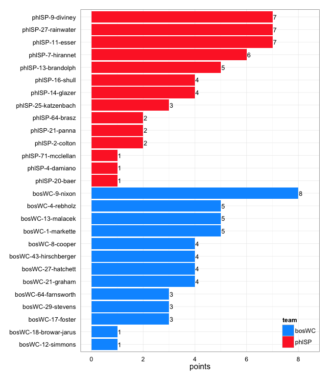
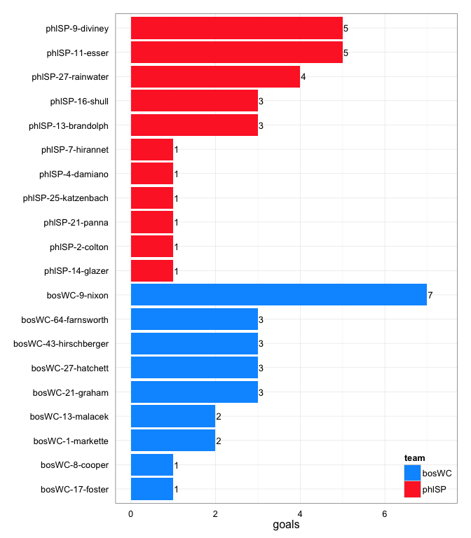
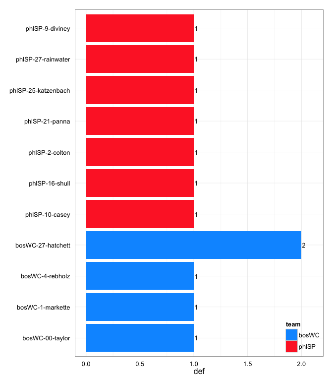

# bosWC at phlSP 2014-05-18

# bosWC 25
# phlSP 26
## game is complete

Go to ...  
  * [Scoring progression](#scoringProgression)  
  * [Player stats via figures](#pl_figs)  
  * [Player stats for bosWC](#away)  
  * [Player stats for phlSP](#home)  
  * [Data on goals, assists, D's](#selectData)  
  * [Full raw data](#rawData)  

## Scoring progression:

| point|period |begin    |end     |pt_duration |desc                                       |bosWC |phlSP |
|-----:|:------|:--------|:-------|:-----------|:------------------------------------------|:-----|:-----|
|    55|4      |0:16:00  |0:00:00 |00:16       |- no goal -                                |25    |26    |
|    54|4      |0:30:00  |0:16:00 |00:14       |bosWC-1-markette to bosWC-64-farnsworth    |25    |26    |
|    53|4      |1:41:00  |0:30:00 |01:11       |phlSP-16-shull to phlSP-13-brandolph       |24    |26    |
|    52|4      |1:49:00  |1:41:00 |00:08       |bosWC-13-malacek to bosWC-17-foster        |24    |25    |
|    51|4      |2:25:00  |1:49:00 |00:36       |phlSP-13-brandolph to phlSP-14-glazer      |23    |25    |
|    50|4      |2:51:00  |2:25:00 |00:26       |bosWC-13-malacek to bosWC-9-nixon          |23    |24    |
|    49|4      |3:55:00  |2:51:00 |01:04       |phlSP-7-hirannet to phlSP-13-brandolph     |22    |24    |
|    48|4      |4:23:00  |3:55:00 |00:28       |bosWC-9-nixon to bosWC-1-markette          |22    |23    |
|    47|4      |5:01:00  |4:23:00 |00:38       |phlSP-7-hirannet to phlSP-27-rainwater     |21    |23    |
|    46|4      |7:01:00  |5:01:00 |02:00       |bosWC-4-rebholz to bosWC-9-nixon           |21    |22    |
|    45|4      |7:20:00  |7:01:00 |00:19       |phlSP-14-glazer to phlSP-11-esser          |20    |22    |
|    44|4      |7:50:00  |7:20:00 |00:30       |bosWC-8-cooper to bosWC-9-nixon            |20    |21    |
|    43|4      |10:00:00 |7:50:00 |02:10       |phlSP-11-esser to phlSP-9-diviney          |19    |21    |
|    42|3      |0:17:00  |0:00:00 |00:17       |- no goal -                                |19    |20    |
|    41|3      |1:47:00  |0:17:00 |01:30       |phlSP-14-glazer to phlSP-11-esser          |19    |20    |
|    40|3      |2:08:00  |1:47:00 |00:21       |phlSP-25-katzenbach to phlSP-9-diviney     |19    |19    |
|    39|3      |2:37:00  |2:08:00 |00:29       |bosWC-4-rebholz to bosWC-43-hirschberger   |19    |18    |
|    38|3      |3:17:00  |2:37:00 |00:40       |phlSP-20-baer to phlSP-16-shull            |18    |18    |
|    37|3      |4:24:00  |3:17:00 |01:07       |bosWC-17-foster to bosWC-43-hirschberger   |18    |17    |
|    36|3      |4:50:00  |4:24:00 |00:26       |bosWC-29-stevens to bosWC-64-farnsworth    |17    |17    |
|    35|3      |5:51:00  |4:50:00 |01:01       |phlSP-64-brasz to phlSP-16-shull           |16    |17    |
|    34|3      |6:19:00  |5:51:00 |00:28       |phlSP-27-rainwater to phlSP-9-diviney      |16    |16    |
|    33|3      |6:33:00  |6:19:00 |00:14       |bosWC-17-foster to bosWC-27-hatchett       |16    |15    |
|    32|3      |7:23:00  |6:33:00 |00:50       |phlSP-71-mcclellan to phlSP-21-panna       |15    |15    |
|    31|3      |9:04:00  |7:23:00 |01:41       |bosWC-4-rebholz to bosWC-21-graham         |15    |14    |
|    30|3      |9:26:00  |9:04:00 |00:22       |bosWC-1-markette to bosWC-8-cooper         |14    |14    |
|    29|3      |10:00:00 |9:26:00 |00:34       |phlSP-64-brasz to phlSP-2-colton           |13    |14    |
|    28|2      |1:12:00  |0:00:00 |01:12       |- no goal -                                |13    |13    |
|    27|2      |2:08:00  |1:12:00 |00:56       |bosWC-4-rebholz to bosWC-9-nixon           |13    |13    |
|    26|2      |3:25:00  |2:08:00 |01:17       |phlSP-2-colton to phlSP-16-shull           |12    |13    |
|    25|2      |4:42:00  |3:25:00 |01:17       |phlSP-7-hirannet to phlSP-13-brandolph     |12    |12    |
|    24|2      |7:10:00  |4:42:00 |02:28       |bosWC-8-cooper to bosWC-13-malacek         |12    |11    |
|    23|2      |7:42:00  |7:10:00 |00:32       |phlSP-21-panna to phlSP-27-rainwater       |11    |11    |
|    22|2      |8:15:00  |7:42:00 |00:33       |phlSP-11-esser to phlSP-27-rainwater       |11    |10    |
|    21|2      |8:42:00  |8:15:00 |00:27       |bosWC-4-rebholz to bosWC-21-graham         |11    |9     |
|    20|2      |10:00:00 |8:42:00 |01:18       |phlSP-27-rainwater to phlSP-25-katzenbach  |10    |9     |
|    19|1      |0:06:00  |0:00:00 |00:06       |- no goal -                                |10    |8     |
|    18|1      |0:18:00  |0:06:00 |00:12       |phlSP-7-hirannet to phlSP-27-rainwater     |10    |8     |
|    17|1      |1:03:00  |0:18:00 |00:45       |bosWC-43-hirschberger to bosWC-21-graham   |10    |7     |
|    16|1      |1:37:00  |1:03:00 |00:34       |phlSP-25-katzenbach to phlSP-7-hirannet    |9     |7     |
|    15|1      |2:06:00  |1:37:00 |00:29       |bosWC-27-hatchett to bosWC-43-hirschberger |9     |6     |
|    14|1      |2:29:00  |2:06:00 |00:23       |phlSP-14-glazer to phlSP-11-esser          |8     |6     |
|    13|1      |2:56:00  |2:29:00 |00:27       |bosWC-21-graham to bosWC-27-hatchett       |8     |5     |
|    12|1      |4:06:00  |2:56:00 |01:10       |phlSP-9-diviney to phlSP-11-esser          |7     |5     |
|    11|1      |4:20:00  |4:06:00 |00:14       |bosWC-1-markette to bosWC-9-nixon          |7     |4     |
|    10|1      |5:18:00  |4:20:00 |00:58       |bosWC-12-simmons to bosWC-27-hatchett      |6     |4     |
|     9|1      |5:49:00  |5:18:00 |00:31       |bosWC-29-stevens to bosWC-64-farnsworth    |5     |4     |
|     8|1      |6:49:00  |5:49:00 |01:00       |phlSP-27-rainwater to phlSP-11-esser       |4     |4     |
|     7|1      |7:12:00  |6:49:00 |00:23       |bosWC-13-malacek to bosWC-9-nixon          |4     |3     |
|     6|1      |7:41:00  |7:12:00 |00:29       |phlSP-9-diviney to phlSP-4-damiano         |3     |3     |
|     5|1      |8:03:00  |7:41:00 |00:22       |bosWC-29-stevens to bosWC-13-malacek       |3     |2     |
|     4|1      |8:17:00  |8:03:00 |00:14       |phlSP-7-hirannet to phlSP-9-diviney        |2     |2     |
|     3|1      |9:05:00  |8:17:00 |00:48       |bosWC-18-browar-jarus to bosWC-9-nixon     |2     |1     |
|     2|1      |9:34:00  |9:05:00 |00:29       |phlSP-13-brandolph to phlSP-9-diviney      |1     |1     |
|     1|1      |10:00:00 |9:34:00 |00:26       |bosWC-8-cooper to bosWC-1-markette         |1     |0     |

## Player stats via figures:

### Points = goals + assists

 

### Goals

 

### Assists

 

### D's
 

## Player stats for bosWC :

points = goals + assists  
tables sorted in decreasing order based on points (then goals, assists, Ds)  
Ds = total of plain ol' D's + interceptions (D), hand blocks (HB), and foot blocks (FB)  
stats are cumulative for this game

|   |player   |last         | points| comp_pct| goals| assists| throws| completions| catches| def| drop|
|:--|:--------|:------------|------:|--------:|-----:|-------:|------:|-----------:|-------:|---:|----:|
|1  |bosWC-9  |nixon        |      8|     0.83|     7|       1|      6|           5|      14|   0|    1|
|2  |bosWC-1  |markette     |      5|     0.94|     2|       3|     16|          15|      16|   1|    0|
|3  |bosWC-13 |malacek      |      5|     0.89|     2|       3|     28|          25|      22|   0|    1|
|4  |bosWC-4  |rebholz      |      5|     0.94|     0|       5|     34|          32|      24|   1|    0|
|5  |bosWC-27 |hatchett     |      4|     0.86|     3|       1|      7|           6|      10|   2|    0|
|6  |bosWC-21 |graham       |      4|     0.91|     3|       1|     22|          20|      22|   0|    0|
|7  |bosWC-43 |hirschberger |      4|     0.92|     3|       1|     13|          12|      16|   0|    0|
|8  |bosWC-8  |cooper       |      4|     1.00|     1|       3|     15|          15|      12|   0|    0|
|9  |bosWC-64 |farnsworth   |      3|     1.00|     3|       0|      1|           1|       4|   0|    0|
|10 |bosWC-17 |foster       |      3|     0.92|     1|       2|     12|          11|      13|   0|    0|
|11 |bosWC-29 |stevens      |      3|     1.00|     0|       3|      5|           5|       5|   0|    0|
|12 |bosWC-12 |simmons      |      1|     1.00|     0|       1|      2|           2|       2|   0|    0|
|13 |bosWC-18 |browar-jarus |      1|     0.71|     0|       1|      7|           5|       6|   0|    1|
|14 |bosWC-00 |taylor       |      0|     1.00|     0|       0|     18|          18|       8|   1|    0|
|15 |bosWC-   |?name?       |      0|       NA|     0|       0|      0|           0|       0|   0|    0|
|16 |bosWC-10 |ingold-smith |      0|     0.96|     0|       0|     23|          22|      20|   0|    0|
|17 |bosWC-2  |reinhardt    |      0|     1.00|     0|       0|      1|           1|       1|   0|    0|
|18 |bosWC-3  |zid          |      0|     1.00|     0|       0|      5|           5|       5|   0|    0|

## Player stats for phlSP :

points = goals + assists  
tables sorted in decreasing order based on points (then goals, assists, Ds)  
Ds = total of plain ol' D's + interceptions (D), hand blocks (HB), and foot blocks (FB)  
stats are cumulative for this game

|   |player   |last       | points| comp_pct| goals| assists| throws| completions| catches| def| drop|
|:--|:--------|:----------|------:|--------:|-----:|-------:|------:|-----------:|-------:|---:|----:|
|19 |phlSP-9  |diviney    |      7|     0.82|     5|       2|     11|           9|      15|   1|    0|
|20 |phlSP-11 |esser      |      7|     1.00|     5|       2|     14|          14|      19|   0|    0|
|21 |phlSP-27 |rainwater  |      7|     0.97|     4|       3|     33|          32|      37|   1|    0|
|22 |phlSP-7  |hirannet   |      6|     0.97|     1|       5|     66|          64|      60|   0|    0|
|23 |phlSP-13 |brandolph  |      5|     1.00|     3|       2|     47|          47|      39|   0|    0|
|24 |phlSP-16 |shull      |      4|     0.88|     3|       1|      8|           7|      11|   1|    1|
|25 |phlSP-14 |glazer     |      4|     0.97|     1|       3|     33|          32|      34|   0|    0|
|26 |phlSP-25 |katzenbach |      3|     1.00|     1|       2|     33|          33|      28|   1|    0|
|27 |phlSP-2  |colton     |      2|     0.92|     1|       1|     12|          11|      12|   1|    0|
|28 |phlSP-21 |panna      |      2|     0.87|     1|       1|     15|          13|      15|   1|    0|
|29 |phlSP-64 |brasz      |      2|     1.00|     0|       2|     19|          19|      16|   0|    0|
|30 |phlSP-4  |damiano    |      1|     0.92|     1|       0|     13|          12|      13|   0|    1|
|31 |phlSP-20 |baer       |      1|     0.94|     0|       1|     18|          17|      12|   0|    0|
|32 |phlSP-71 |mcclellan  |      1|     0.90|     0|       1|     10|           9|      10|   0|    0|
|33 |phlSP-10 |casey      |      0|     1.00|     0|       0|      3|           3|       2|   1|    0|
|34 |phlSP-1  |peters     |      0|     1.00|     0|       0|      4|           4|       5|   0|    0|
|35 |phlSP-12 |zumbrum    |      0|     1.00|     0|       0|      1|           1|       1|   0|    0|
|36 |phlSP-22 |paparone   |      0|     1.00|     0|       0|      2|           2|       2|   0|    0|
|37 |phlSP-28 |baer       |      0|     1.00|     0|       0|      2|           2|       1|   0|    0|
|38 |phlSP-31 |lindsey    |      0|     1.00|     0|       0|      4|           4|       4|   0|    0|
|39 |phlSP-33 |ward       |      0|     1.00|     0|       0|      3|           3|       3|   0|    0|
|40 |phlSP-77 |li         |      0|     1.00|     0|       0|      4|           4|       3|   0|    0|

## Raw data on select events (goals, assists, D's):

| point| period|pull_team | event| poss_abs| poss_rel|poss_team |pl_team |pl_pnum |pl_code |pl_lname     |player                | bosWC| phlSP|
|-----:|------:|:---------|-----:|--------:|--------:|:---------|:-------|:-------|:-------|:------------|:---------------------|-----:|-----:|
|     1|      1|phlSP     |     6|        1|        1|bosWC     |bosWC   |8       |A       |cooper       |bosWC-8-cooper        |     1|     0|
|     1|      1|phlSP     |     7|        1|        1|bosWC     |bosWC   |1       |G       |markette     |bosWC-1-markette      |     1|     0|
|     2|      1|bosWC     |    13|        2|        1|phlSP     |phlSP   |13      |A       |brandolph    |phlSP-13-brandolph    |     1|     1|
|     2|      1|bosWC     |    14|        2|        1|phlSP     |phlSP   |9       |G       |diviney      |phlSP-9-diviney       |     1|     1|
|     3|      1|phlSP     |    11|        3|        1|bosWC     |bosWC   |18      |A       |browar-jarus |bosWC-18-browar-jarus |     2|     1|
|     3|      1|phlSP     |    12|        3|        1|bosWC     |bosWC   |9       |G       |nixon        |bosWC-9-nixon         |     2|     1|
|     4|      1|bosWC     |     4|        4|        1|phlSP     |phlSP   |7       |A       |hirannet     |phlSP-7-hirannet      |     2|     2|
|     4|      1|bosWC     |     5|        4|        1|phlSP     |phlSP   |9       |LG      |diviney      |phlSP-9-diviney       |     2|     2|
|     5|      1|phlSP     |     7|        5|        1|bosWC     |bosWC   |29      |A       |stevens      |bosWC-29-stevens      |     3|     2|
|     5|      1|phlSP     |     8|        5|        1|bosWC     |bosWC   |13      |LG      |malacek      |bosWC-13-malacek      |     3|     2|
|     6|      1|bosWC     |     8|        6|        1|phlSP     |phlSP   |9       |LA      |diviney      |phlSP-9-diviney       |     3|     3|
|     6|      1|bosWC     |     9|        6|        1|phlSP     |phlSP   |4       |G       |damiano      |phlSP-4-damiano       |     3|     3|
|     7|      1|phlSP     |     6|        7|        1|bosWC     |bosWC   |13      |A       |malacek      |bosWC-13-malacek      |     4|     3|
|     7|      1|phlSP     |     7|        7|        1|bosWC     |bosWC   |9       |LG      |nixon        |bosWC-9-nixon         |     4|     3|
|     8|      1|bosWC     |    15|        8|        1|phlSP     |phlSP   |27      |A       |rainwater    |phlSP-27-rainwater    |     4|     4|
|     8|      1|bosWC     |    16|        8|        1|phlSP     |phlSP   |11      |G       |esser        |phlSP-11-esser        |     4|     4|
|     9|      1|phlSP     |     8|        9|        1|bosWC     |bosWC   |29      |A       |stevens      |bosWC-29-stevens      |     5|     4|
|     9|      1|phlSP     |     9|        9|        1|bosWC     |bosWC   |64      |G       |farnsworth   |bosWC-64-farnsworth   |     5|     4|
|    10|      1|bosWC     |    15|       10|        1|phlSP     |bosWC   |4       |D       |rebholz      |bosWC-4-rebholz       |     6|     4|
|    10|      1|bosWC     |    18|       11|        2|bosWC     |bosWC   |12      |A       |simmons      |bosWC-12-simmons      |     6|     4|
|    10|      1|bosWC     |    19|       11|        2|bosWC     |bosWC   |27      |G       |hatchett     |bosWC-27-hatchett     |     6|     4|
|    11|      1|bosWC     |     3|       12|        1|phlSP     |bosWC   |00      |D       |taylor       |bosWC-00-taylor       |     7|     4|
|    11|      1|bosWC     |     8|       13|        2|bosWC     |bosWC   |1       |A       |markette     |bosWC-1-markette      |     7|     4|
|    11|      1|bosWC     |     9|       13|        2|bosWC     |bosWC   |9       |G       |nixon        |bosWC-9-nixon         |     7|     4|
|    12|      1|bosWC     |    15|       16|        3|phlSP     |phlSP   |9       |A       |diviney      |phlSP-9-diviney       |     7|     5|
|    12|      1|bosWC     |    16|       16|        3|phlSP     |phlSP   |11      |G       |esser        |phlSP-11-esser        |     7|     5|
|    13|      1|phlSP     |     4|       17|        1|bosWC     |bosWC   |21      |LA      |graham       |bosWC-21-graham       |     8|     5|
|    13|      1|phlSP     |     5|       17|        1|bosWC     |bosWC   |27      |G       |hatchett     |bosWC-27-hatchett     |     8|     5|
|    14|      1|bosWC     |     8|       18|        1|phlSP     |phlSP   |14      |A       |glazer       |phlSP-14-glazer       |     8|     6|
|    14|      1|bosWC     |     9|       18|        1|phlSP     |phlSP   |11      |LG      |esser        |phlSP-11-esser        |     8|     6|
|    15|      1|phlSP     |     7|       19|        1|bosWC     |bosWC   |27      |A       |hatchett     |bosWC-27-hatchett     |     9|     6|
|    15|      1|phlSP     |     8|       19|        1|bosWC     |bosWC   |43      |G       |hirschberger |bosWC-43-hirschberger |     9|     6|
|    16|      1|bosWC     |    11|       20|        1|phlSP     |phlSP   |25      |A       |katzenbach   |phlSP-25-katzenbach   |     9|     7|
|    16|      1|bosWC     |    12|       20|        1|phlSP     |phlSP   |7       |G       |hirannet     |phlSP-7-hirannet      |     9|     7|
|    17|      1|phlSP     |    12|       21|        1|bosWC     |bosWC   |43      |A       |hirschberger |bosWC-43-hirschberger |    10|     7|
|    17|      1|phlSP     |    13|       21|        1|bosWC     |bosWC   |21      |G       |graham       |bosWC-21-graham       |    10|     7|
|    18|      1|bosWC     |     5|       22|        1|phlSP     |phlSP   |7       |A       |hirannet     |phlSP-7-hirannet      |    10|     8|
|    18|      1|bosWC     |     6|       22|        1|phlSP     |phlSP   |27      |LG      |rainwater    |phlSP-27-rainwater    |    10|     8|
|    19|      1|phlSP     |     5|       23|        1|bosWC     |phlSP   |25      |D       |katzenbach   |phlSP-25-katzenbach   |    10|     8|
|    20|      2|bosWC     |    23|       24|        1|phlSP     |phlSP   |27      |A       |rainwater    |phlSP-27-rainwater    |    10|     9|
|    20|      2|bosWC     |    24|       24|        1|phlSP     |phlSP   |25      |G       |katzenbach   |phlSP-25-katzenbach   |    10|     9|
|    21|      2|phlSP     |     8|       25|        1|bosWC     |bosWC   |4       |A       |rebholz      |bosWC-4-rebholz       |    11|     9|
|    21|      2|phlSP     |     9|       25|        1|bosWC     |bosWC   |21      |LG      |graham       |bosWC-21-graham       |    11|     9|
|    22|      2|bosWC     |    10|       26|        1|phlSP     |phlSP   |11      |A       |esser        |phlSP-11-esser        |    11|    10|
|    22|      2|bosWC     |    11|       26|        1|phlSP     |phlSP   |27      |G       |rainwater    |phlSP-27-rainwater    |    11|    10|
|    23|      2|phlSP     |    11|       28|        2|phlSP     |phlSP   |21      |A       |panna        |phlSP-21-panna        |    11|    11|
|    23|      2|phlSP     |    12|       28|        2|phlSP     |phlSP   |27      |G       |rainwater    |phlSP-27-rainwater    |    11|    11|
|    24|      2|phlSP     |    24|       30|        2|phlSP     |bosWC   |1       |HB      |markette     |bosWC-1-markette      |    12|    11|
|    24|      2|phlSP     |    36|       31|        3|bosWC     |bosWC   |8       |PUA     |cooper       |bosWC-8-cooper        |    12|    11|
|    24|      2|phlSP     |    37|       31|        3|bosWC     |bosWC   |13      |G       |malacek      |bosWC-13-malacek      |    12|    11|
|    25|      2|bosWC     |    24|       32|        1|phlSP     |phlSP   |7       |A       |hirannet     |phlSP-7-hirannet      |    12|    12|
|    25|      2|bosWC     |    25|       32|        1|phlSP     |phlSP   |13      |G       |brandolph    |phlSP-13-brandolph    |    12|    12|
|    26|      2|phlSP     |     4|       33|        1|bosWC     |phlSP   |2       |D       |colton       |phlSP-2-colton        |    12|    13|
|    26|      2|phlSP     |    19|       34|        2|phlSP     |phlSP   |2       |A       |colton       |phlSP-2-colton        |    12|    13|
|    26|      2|phlSP     |    20|       34|        2|phlSP     |phlSP   |16      |G       |shull        |phlSP-16-shull        |    12|    13|
|    27|      2|phlSP     |    14|       35|        1|bosWC     |bosWC   |4       |A       |rebholz      |bosWC-4-rebholz       |    13|    13|
|    27|      2|phlSP     |    15|       35|        1|bosWC     |bosWC   |9       |LG      |nixon        |bosWC-9-nixon         |    13|    13|
|    28|      2|bosWC     |    14|       37|        2|bosWC     |phlSP   |9       |D       |diviney      |phlSP-9-diviney       |    13|    13|
|    29|      3|phlSP     |     5|       39|        1|bosWC     |phlSP   |21      |D       |panna        |phlSP-21-panna        |    13|    14|
|    29|      3|phlSP     |    11|       40|        2|phlSP     |phlSP   |64      |A       |brasz        |phlSP-64-brasz        |    13|    14|
|    29|      3|phlSP     |    12|       40|        2|phlSP     |phlSP   |2       |G       |colton       |phlSP-2-colton        |    13|    14|
|    30|      3|phlSP     |     5|       41|        1|bosWC     |bosWC   |1       |A       |markette     |bosWC-1-markette      |    14|    14|
|    30|      3|phlSP     |     6|       41|        1|bosWC     |bosWC   |8       |G       |cooper       |bosWC-8-cooper        |    14|    14|
|    31|      3|bosWC     |    17|       43|        2|bosWC     |bosWC   |4       |A       |rebholz      |bosWC-4-rebholz       |    15|    14|
|    31|      3|bosWC     |    18|       43|        2|bosWC     |bosWC   |21      |LG      |graham       |bosWC-21-graham       |    15|    14|
|    32|      3|bosWC     |    14|       44|        1|phlSP     |phlSP   |71      |A       |mcclellan    |phlSP-71-mcclellan    |    15|    15|
|    32|      3|bosWC     |    15|       44|        1|phlSP     |phlSP   |21      |G       |panna        |phlSP-21-panna        |    15|    15|
|    33|      3|phlSP     |     4|       45|        1|bosWC     |bosWC   |17      |A       |foster       |bosWC-17-foster       |    16|    15|
|    33|      3|phlSP     |     5|       45|        1|bosWC     |bosWC   |27      |LG      |hatchett     |bosWC-27-hatchett     |    16|    15|
|    34|      3|bosWC     |     9|       46|        1|phlSP     |phlSP   |27      |A       |rainwater    |phlSP-27-rainwater    |    16|    16|
|    34|      3|bosWC     |    10|       46|        1|phlSP     |phlSP   |9       |LG      |diviney      |phlSP-9-diviney       |    16|    16|
|    35|      3|phlSP     |     4|       47|        1|bosWC     |phlSP   |16      |D       |shull        |phlSP-16-shull        |    16|    17|
|    35|      3|phlSP     |    18|       48|        2|phlSP     |phlSP   |64      |A       |brasz        |phlSP-64-brasz        |    16|    17|
|    35|      3|phlSP     |    19|       48|        2|phlSP     |phlSP   |16      |G       |shull        |phlSP-16-shull        |    16|    17|
|    36|      3|phlSP     |     6|       49|        1|bosWC     |bosWC   |29      |A       |stevens      |bosWC-29-stevens      |    17|    17|
|    36|      3|phlSP     |     7|       49|        1|bosWC     |bosWC   |64      |LG      |farnsworth   |bosWC-64-farnsworth   |    17|    17|
|    37|      3|bosWC     |    17|       51|        2|bosWC     |bosWC   |17      |A       |foster       |bosWC-17-foster       |    18|    17|
|    37|      3|bosWC     |    18|       51|        2|bosWC     |bosWC   |43      |G       |hirschberger |bosWC-43-hirschberger |    18|    17|
|    38|      3|bosWC     |    13|       52|        1|phlSP     |phlSP   |20      |A       |baer         |phlSP-20-baer         |    18|    18|
|    38|      3|bosWC     |    14|       52|        1|phlSP     |phlSP   |16      |G       |shull        |phlSP-16-shull        |    18|    18|
|    39|      3|phlSP     |     8|       53|        1|bosWC     |bosWC   |4       |A       |rebholz      |bosWC-4-rebholz       |    19|    18|
|    39|      3|phlSP     |     9|       53|        1|bosWC     |bosWC   |43      |G       |hirschberger |bosWC-43-hirschberger |    19|    18|
|    40|      3|bosWC     |     8|       54|        1|phlSP     |phlSP   |25      |A       |katzenbach   |phlSP-25-katzenbach   |    19|    19|
|    40|      3|bosWC     |     9|       54|        1|phlSP     |phlSP   |9       |G       |diviney      |phlSP-9-diviney       |    19|    19|
|    41|      3|phlSP     |    15|       56|        2|phlSP     |bosWC   |27      |D       |hatchett     |bosWC-27-hatchett     |    19|    20|
|    41|      3|phlSP     |    22|       57|        3|bosWC     |phlSP   |10      |D       |casey        |phlSP-10-casey        |    19|    20|
|    41|      3|phlSP     |    28|       58|        4|phlSP     |phlSP   |14      |A       |glazer       |phlSP-14-glazer       |    19|    20|
|    41|      3|phlSP     |    29|       58|        4|phlSP     |phlSP   |11      |G       |esser        |phlSP-11-esser        |    19|    20|
|    42|      3|phlSP     |    NA|       NA|       NA|NA        |NA      |NA      |NA      |NA           |NA-NA-NA              |    19|    20|
|    43|      4|bosWC     |    12|       60|        1|phlSP     |bosWC   |27      |D       |hatchett     |bosWC-27-hatchett     |    19|    21|
|    43|      4|bosWC     |    27|       62|        3|phlSP     |phlSP   |11      |A       |esser        |phlSP-11-esser        |    19|    21|
|    43|      4|bosWC     |    28|       62|        3|phlSP     |phlSP   |9       |G       |diviney      |phlSP-9-diviney       |    19|    21|
|    44|      4|phlSP     |     8|       63|        1|bosWC     |bosWC   |8       |A       |cooper       |bosWC-8-cooper        |    20|    21|
|    44|      4|phlSP     |     9|       63|        1|bosWC     |bosWC   |9       |G       |nixon        |bosWC-9-nixon         |    20|    21|
|    45|      4|bosWC     |     5|       64|        1|phlSP     |phlSP   |14      |A       |glazer       |phlSP-14-glazer       |    20|    22|
|    45|      4|bosWC     |     6|       64|        1|phlSP     |phlSP   |11      |G       |esser        |phlSP-11-esser        |    20|    22|
|    46|      4|phlSP     |    22|       69|        5|bosWC     |bosWC   |4       |A       |rebholz      |bosWC-4-rebholz       |    21|    22|
|    46|      4|phlSP     |    23|       69|        5|bosWC     |bosWC   |9       |G       |nixon        |bosWC-9-nixon         |    21|    22|
|    47|      4|bosWC     |     8|       70|        1|phlSP     |phlSP   |7       |A       |hirannet     |phlSP-7-hirannet      |    21|    23|
|    47|      4|bosWC     |     9|       70|        1|phlSP     |phlSP   |27      |G       |rainwater    |phlSP-27-rainwater    |    21|    23|
|    48|      4|phlSP     |     9|       71|        1|bosWC     |bosWC   |9       |A       |nixon        |bosWC-9-nixon         |    22|    23|
|    48|      4|phlSP     |    10|       71|        1|bosWC     |bosWC   |1       |G       |markette     |bosWC-1-markette      |    22|    23|
|    49|      4|bosWC     |    20|       72|        1|phlSP     |phlSP   |7       |A       |hirannet     |phlSP-7-hirannet      |    22|    24|
|    49|      4|bosWC     |    21|       72|        1|phlSP     |phlSP   |13      |G       |brandolph    |phlSP-13-brandolph    |    22|    24|
|    50|      4|phlSP     |     7|       73|        1|bosWC     |bosWC   |13      |A       |malacek      |bosWC-13-malacek      |    23|    24|
|    50|      4|phlSP     |     8|       73|        1|bosWC     |bosWC   |9       |G       |nixon        |bosWC-9-nixon         |    23|    24|
|    51|      4|bosWC     |    10|       74|        1|phlSP     |phlSP   |13      |A       |brandolph    |phlSP-13-brandolph    |    23|    25|
|    51|      4|bosWC     |    11|       74|        1|phlSP     |phlSP   |14      |G       |glazer       |phlSP-14-glazer       |    23|    25|
|    52|      4|phlSP     |     2|       75|        1|bosWC     |bosWC   |13      |PUA     |malacek      |bosWC-13-malacek      |    24|    25|
|    52|      4|phlSP     |     3|       75|        1|bosWC     |bosWC   |17      |LG      |foster       |bosWC-17-foster       |    24|    25|
|    53|      4|bosWC     |    26|       76|        1|phlSP     |phlSP   |16      |A       |shull        |phlSP-16-shull        |    24|    26|
|    53|      4|bosWC     |    27|       76|        1|phlSP     |phlSP   |13      |G       |brandolph    |phlSP-13-brandolph    |    24|    26|
|    54|      4|phlSP     |     5|       77|        1|bosWC     |bosWC   |1       |A       |markette     |bosWC-1-markette      |    25|    26|
|    54|      4|phlSP     |     6|       77|        1|bosWC     |bosWC   |64      |G       |farnsworth   |bosWC-64-farnsworth   |    25|    26|
|    55|      4|bosWC     |    11|       79|        2|bosWC     |phlSP   |27      |D       |rainwater    |phlSP-27-rainwater    |    25|    26|

## Full raw data:

__Note: just for display purposes.__ Raw data in more useful forms can be found in the [GitHub repository](https://github.com/jennybc/vanNH). Find the game you're interested in in the `games` subdirectory.

| period| point|pull_team | event| poss_abs| poss_rel|poss_team |pl_team |pl_pnum |pl_code |
|------:|-----:|:---------|-----:|--------:|--------:|:---------|:-------|:-------|:-------|
|      1|     1|phlSP     |     1|        1|        1|bosWC     |phlSP   |1       |P       |
|      1|     1|phlSP     |     2|        1|        1|bosWC     |bosWC   |00      |PU      |
|      1|     1|phlSP     |     3|        1|        1|bosWC     |bosWC   |13      |        |
|      1|     1|phlSP     |     4|        1|        1|bosWC     |bosWC   |1       |        |
|      1|     1|phlSP     |     5|        1|        1|bosWC     |bosWC   |18      |        |
|      1|     1|phlSP     |     6|        1|        1|bosWC     |bosWC   |8       |A       |
|      1|     1|phlSP     |     7|        1|        1|bosWC     |bosWC   |1       |G       |
|      1|     2|bosWC     |     1|        2|        1|phlSP     |bosWC   |43      |P       |
|      1|     2|bosWC     |     2|        2|        1|phlSP     |phlSP   |7       |PU      |
|      1|     2|bosWC     |     3|        2|        1|phlSP     |phlSP   |27      |        |
|      1|     2|bosWC     |     4|        2|        1|phlSP     |phlSP   |7       |        |
|      1|     2|bosWC     |     5|        2|        1|phlSP     |phlSP   |13      |        |
|      1|     2|bosWC     |     6|        2|        1|phlSP     |phlSP   |14      |        |
|      1|     2|bosWC     |     7|        2|        1|phlSP     |phlSP   |25      |        |
|      1|     2|bosWC     |     8|        2|        1|phlSP     |phlSP   |27      |        |
|      1|     2|bosWC     |     9|        2|        1|phlSP     |phlSP   |25      |        |
|      1|     2|bosWC     |    10|        2|        1|phlSP     |phlSP   |13      |        |
|      1|     2|bosWC     |    11|        2|        1|phlSP     |phlSP   |14      |        |
|      1|     2|bosWC     |    12|        2|        1|phlSP     |phlSP   |7       |        |
|      1|     2|bosWC     |    13|        2|        1|phlSP     |phlSP   |13      |A       |
|      1|     2|bosWC     |    14|        2|        1|phlSP     |phlSP   |9       |G       |
|      1|     3|phlSP     |     1|        3|        1|bosWC     |phlSP   |1       |OBP     |
|      1|     3|phlSP     |     2|        3|        1|bosWC     |bosWC   |13      |PU      |
|      1|     3|phlSP     |     3|        3|        1|bosWC     |bosWC   |8       |        |
|      1|     3|phlSP     |     4|        3|        1|bosWC     |bosWC   |13      |        |
|      1|     3|phlSP     |     5|        3|        1|bosWC     |bosWC   |1       |        |
|      1|     3|phlSP     |     6|        3|        1|bosWC     |bosWC   |8       |        |
|      1|     3|phlSP     |     7|        3|        1|bosWC     |bosWC   |13      |        |
|      1|     3|phlSP     |     8|        3|        1|bosWC     |bosWC   |64      |        |
|      1|     3|phlSP     |     9|        3|        1|bosWC     |bosWC   |00      |        |
|      1|     3|phlSP     |    10|        3|        1|bosWC     |bosWC   |13      |        |
|      1|     3|phlSP     |    11|        3|        1|bosWC     |bosWC   |18      |A       |
|      1|     3|phlSP     |    12|        3|        1|bosWC     |bosWC   |9       |G       |
|      1|     4|bosWC     |     1|        4|        1|phlSP     |bosWC   |43      |P       |
|      1|     4|bosWC     |     2|        4|        1|phlSP     |phlSP   |25      |PU      |
|      1|     4|bosWC     |     3|        4|        1|phlSP     |phlSP   |13      |        |
|      1|     4|bosWC     |     4|        4|        1|phlSP     |phlSP   |7       |A       |
|      1|     4|bosWC     |     5|        4|        1|phlSP     |phlSP   |9       |LG      |
|      1|     5|phlSP     |     1|        5|        1|bosWC     |phlSP   |20      |P       |
|      1|     5|phlSP     |     2|        5|        1|bosWC     |bosWC   |13      |PU      |
|      1|     5|phlSP     |     3|        5|        1|bosWC     |bosWC   |8       |        |
|      1|     5|phlSP     |     4|        5|        1|bosWC     |bosWC   |1       |        |
|      1|     5|phlSP     |     5|        5|        1|bosWC     |bosWC   |9       |        |
|      1|     5|phlSP     |     6|        5|        1|bosWC     |bosWC   |3       |        |
|      1|     5|phlSP     |     7|        5|        1|bosWC     |bosWC   |29      |A       |
|      1|     5|phlSP     |     8|        5|        1|bosWC     |bosWC   |13      |LG      |
|      1|     6|bosWC     |     1|        6|        1|phlSP     |bosWC   |43      |P       |
|      1|     6|bosWC     |     2|        6|        1|phlSP     |phlSP   |25      |PU      |
|      1|     6|bosWC     |     3|        6|        1|phlSP     |phlSP   |13      |        |
|      1|     6|bosWC     |     4|        6|        1|phlSP     |phlSP   |25      |        |
|      1|     6|bosWC     |     5|        6|        1|phlSP     |phlSP   |4       |        |
|      1|     6|bosWC     |     6|        6|        1|phlSP     |phlSP   |14      |        |
|      1|     6|bosWC     |     7|        6|        1|phlSP     |phlSP   |27      |        |
|      1|     6|bosWC     |     8|        6|        1|phlSP     |phlSP   |9       |LA      |
|      1|     6|bosWC     |     9|        6|        1|phlSP     |phlSP   |4       |G       |
|      1|     7|phlSP     |     1|        7|        1|bosWC     |phlSP   |1       |P       |
|      1|     7|phlSP     |     2|        7|        1|bosWC     |bosWC   |00      |PU      |
|      1|     7|phlSP     |     3|        7|        1|bosWC     |bosWC   |13      |        |
|      1|     7|phlSP     |     4|        7|        1|bosWC     |bosWC   |00      |        |
|      1|     7|phlSP     |     5|        7|        1|bosWC     |bosWC   |8       |        |
|      1|     7|phlSP     |     6|        7|        1|bosWC     |bosWC   |13      |A       |
|      1|     7|phlSP     |     7|        7|        1|bosWC     |bosWC   |9       |LG      |
|      1|     8|bosWC     |     1|        8|        1|phlSP     |bosWC   |43      |P       |
|      1|     8|bosWC     |     2|        8|        1|phlSP     |phlSP   |20      |PU      |
|      1|     8|bosWC     |     3|        8|        1|phlSP     |phlSP   |7       |        |
|      1|     8|bosWC     |     4|        8|        1|phlSP     |phlSP   |27      |        |
|      1|     8|bosWC     |     5|        8|        1|phlSP     |phlSP   |25      |        |
|      1|     8|bosWC     |     6|        8|        1|phlSP     |phlSP   |7       |        |
|      1|     8|bosWC     |     7|        8|        1|phlSP     |bosWC   |10      |F       |
|      1|     8|bosWC     |     8|        8|        1|phlSP     |phlSP   |25      |        |
|      1|     8|bosWC     |     9|        8|        1|phlSP     |phlSP   |20      |        |
|      1|     8|bosWC     |    10|        8|        1|phlSP     |phlSP   |7       |        |
|      1|     8|bosWC     |    11|        8|        1|phlSP     |phlSP   |20      |        |
|      1|     8|bosWC     |    12|        8|        1|phlSP     |phlSP   |11      |        |
|      1|     8|bosWC     |    13|        8|        1|phlSP     |phlSP   |14      |        |
|      1|     8|bosWC     |    14|        8|        1|phlSP     |phlSP   |25      |        |
|      1|     8|bosWC     |    15|        8|        1|phlSP     |phlSP   |27      |A       |
|      1|     8|bosWC     |    16|        8|        1|phlSP     |phlSP   |11      |G       |
|      1|     9|phlSP     |     1|        9|        1|bosWC     |phlSP   |28      |P       |
|      1|     9|phlSP     |     2|        9|        1|bosWC     |bosWC   |00      |PU      |
|      1|     9|phlSP     |     3|        9|        1|bosWC     |bosWC   |13      |        |
|      1|     9|phlSP     |     4|        9|        1|bosWC     |bosWC   |9       |        |
|      1|     9|phlSP     |     5|        9|        1|bosWC     |bosWC   |12      |        |
|      1|     9|phlSP     |     6|        9|        1|bosWC     |bosWC   |00      |        |
|      1|     9|phlSP     |     7|        9|        1|bosWC     |bosWC   |13      |        |
|      1|     9|phlSP     |     8|        9|        1|bosWC     |bosWC   |29      |A       |
|      1|     9|phlSP     |     9|        9|        1|bosWC     |bosWC   |64      |G       |
|      1|    10|bosWC     |     1|       10|        1|phlSP     |bosWC   |43      |P       |
|      1|    10|bosWC     |     2|       10|        1|phlSP     |phlSP   |13      |PU      |
|      1|    10|bosWC     |     3|       10|        1|phlSP     |phlSP   |7       |        |
|      1|    10|bosWC     |     4|       10|        1|phlSP     |phlSP   |13      |        |
|      1|    10|bosWC     |     5|       10|        1|phlSP     |phlSP   |7       |        |
|      1|    10|bosWC     |     6|       10|        1|phlSP     |phlSP   |27      |        |
|      1|    10|bosWC     |     7|       10|        1|phlSP     |phlSP   |71      |        |
|      1|    10|bosWC     |     8|       10|        1|phlSP     |phlSP   |13      |        |
|      1|    10|bosWC     |     9|       10|        1|phlSP     |phlSP   |71      |        |
|      1|    10|bosWC     |    10|       10|        1|phlSP     |phlSP   |11      |        |
|      1|    10|bosWC     |    11|       10|        1|phlSP     |phlSP   |7       |        |
|      1|    10|bosWC     |    12|       10|        1|phlSP     |phlSP   |13      |        |
|      1|    10|bosWC     |    13|       10|        1|phlSP     |phlSP   |25      |        |
|      1|    10|bosWC     |    14|       10|        1|phlSP     |phlSP   |14      |        |
|      1|    10|bosWC     |    15|       10|        1|phlSP     |bosWC   |4       |D       |
|      1|    10|bosWC     |    16|       11|        2|bosWC     |bosWC   |4       |PU      |
|      1|    10|bosWC     |    17|       11|        2|bosWC     |bosWC   |10      |        |
|      1|    10|bosWC     |    18|       11|        2|bosWC     |bosWC   |12      |A       |
|      1|    10|bosWC     |    19|       11|        2|bosWC     |bosWC   |27      |G       |
|      1|    11|bosWC     |     1|       12|        1|phlSP     |bosWC   |18      |P       |
|      1|    11|bosWC     |     2|       12|        1|phlSP     |phlSP   |20      |PU      |
|      1|    11|bosWC     |     3|       12|        1|phlSP     |bosWC   |00      |D       |
|      1|    11|bosWC     |     4|       13|        2|bosWC     |bosWC   |00      |PU      |
|      1|    11|bosWC     |     5|       13|        2|bosWC     |bosWC   |8       |        |
|      1|    11|bosWC     |     6|       13|        2|bosWC     |bosWC   |00      |        |
|      1|    11|bosWC     |     7|       13|        2|bosWC     |bosWC   |8       |        |
|      1|    11|bosWC     |     8|       13|        2|bosWC     |bosWC   |1       |A       |
|      1|    11|bosWC     |     9|       13|        2|bosWC     |bosWC   |9       |G       |
|      1|    12|bosWC     |     1|       14|        1|phlSP     |bosWC   |18      |P       |
|      1|    12|bosWC     |     2|       14|        1|phlSP     |phlSP   |13      |PU      |
|      1|    12|bosWC     |     3|       14|        1|phlSP     |phlSP   |7       |        |
|      1|    12|bosWC     |     4|       14|        1|phlSP     |phlSP   |27      |        |
|      1|    12|bosWC     |     5|       14|        1|phlSP     |phlSP   |11      |        |
|      1|    12|bosWC     |     6|       14|        1|phlSP     |phlSP   |27      |        |
|      1|    12|bosWC     |     7|       14|        1|phlSP     |phlSP   |7       |        |
|      1|    12|bosWC     |     8|       14|        1|phlSP     |phlSP   |9       |        |
|      1|    12|bosWC     |     9|       15|        2|bosWC     |bosWC   |00      |PU      |
|      1|    12|bosWC     |    10|       15|        2|bosWC     |bosWC   |18      |        |
|      1|    12|bosWC     |    11|       15|        2|bosWC     |bosWC   |29      |TD      |
|      1|    12|bosWC     |    12|       16|        3|phlSP     |phlSP   |25      |PU      |
|      1|    12|bosWC     |    13|       16|        3|phlSP     |phlSP   |7       |        |
|      1|    12|bosWC     |    14|       16|        3|phlSP     |phlSP   |11      |        |
|      1|    12|bosWC     |    15|       16|        3|phlSP     |phlSP   |9       |A       |
|      1|    12|bosWC     |    16|       16|        3|phlSP     |phlSP   |11      |G       |
|      1|    13|phlSP     |     1|       17|        1|bosWC     |phlSP   |1       |P       |
|      1|    13|phlSP     |     2|       17|        1|bosWC     |bosWC   |21      |PU      |
|      1|    13|phlSP     |     3|       17|        1|bosWC     |bosWC   |4       |        |
|      1|    13|phlSP     |     4|       17|        1|bosWC     |bosWC   |21      |LA      |
|      1|    13|phlSP     |     5|       17|        1|bosWC     |bosWC   |27      |G       |
|      1|    13|phlSP     |     6|       17|        1|bosWC     |phlSP   |64      |F       |
|      1|    14|bosWC     |     1|       18|        1|phlSP     |bosWC   |18      |P       |
|      1|    14|bosWC     |     2|       18|        1|phlSP     |phlSP   |25      |PU      |
|      1|    14|bosWC     |     3|       18|        1|phlSP     |phlSP   |13      |        |
|      1|    14|bosWC     |     4|       18|        1|phlSP     |phlSP   |7       |        |
|      1|    14|bosWC     |     5|       18|        1|phlSP     |phlSP   |13      |        |
|      1|    14|bosWC     |     6|       18|        1|phlSP     |phlSP   |4       |        |
|      1|    14|bosWC     |     7|       18|        1|phlSP     |phlSP   |25      |        |
|      1|    14|bosWC     |     8|       18|        1|phlSP     |phlSP   |14      |A       |
|      1|    14|bosWC     |     9|       18|        1|phlSP     |phlSP   |11      |LG      |
|      1|    15|phlSP     |     1|       19|        1|bosWC     |phlSP   |20      |P       |
|      1|    15|phlSP     |     2|       19|        1|bosWC     |bosWC   |10      |PU      |
|      1|    15|phlSP     |     3|       19|        1|bosWC     |bosWC   |4       |        |
|      1|    15|phlSP     |     4|       19|        1|bosWC     |bosWC   |21      |        |
|      1|    15|phlSP     |     5|       19|        1|bosWC     |bosWC   |17      |        |
|      1|    15|phlSP     |     6|       19|        1|bosWC     |bosWC   |21      |        |
|      1|    15|phlSP     |     7|       19|        1|bosWC     |bosWC   |27      |A       |
|      1|    15|phlSP     |     8|       19|        1|bosWC     |bosWC   |43      |G       |
|      1|    16|bosWC     |     1|       20|        1|phlSP     |bosWC   |18      |P       |
|      1|    16|bosWC     |     2|       20|        1|phlSP     |phlSP   |13      |PU      |
|      1|    16|bosWC     |     3|       20|        1|phlSP     |phlSP   |7       |        |
|      1|    16|bosWC     |     4|       20|        1|phlSP     |phlSP   |13      |        |
|      1|    16|bosWC     |     5|       20|        1|phlSP     |phlSP   |14      |        |
|      1|    16|bosWC     |     6|       20|        1|phlSP     |phlSP   |7       |        |
|      1|    16|bosWC     |     7|       20|        1|phlSP     |phlSP   |13      |        |
|      1|    16|bosWC     |     8|       20|        1|phlSP     |phlSP   |14      |        |
|      1|    16|bosWC     |     9|       20|        1|phlSP     |phlSP   |13      |        |
|      1|    16|bosWC     |    10|       20|        1|phlSP     |phlSP   |27      |        |
|      1|    16|bosWC     |    11|       20|        1|phlSP     |phlSP   |25      |A       |
|      1|    16|bosWC     |    12|       20|        1|phlSP     |phlSP   |7       |G       |
|      1|    17|phlSP     |     1|       21|        1|bosWC     |phlSP   |1       |OBP     |
|      1|    17|phlSP     |     2|       21|        1|bosWC     |bosWC   |4       |PU      |
|      1|    17|phlSP     |     3|       21|        1|bosWC     |bosWC   |21      |        |
|      1|    17|phlSP     |     4|       21|        1|bosWC     |bosWC   |10      |        |
|      1|    17|phlSP     |     5|       21|        1|bosWC     |bosWC   |43      |        |
|      1|    17|phlSP     |     6|       21|        1|bosWC     |bosWC   |4       |        |
|      1|    17|phlSP     |     7|       21|        1|bosWC     |phlSP   |21      |F       |
|      1|    17|phlSP     |     8|       21|        1|bosWC     |bosWC   |10      |        |
|      1|    17|phlSP     |     9|       21|        1|bosWC     |bosWC   |4       |        |
|      1|    17|phlSP     |    10|       21|        1|bosWC     |bosWC   |17      |        |
|      1|    17|phlSP     |    11|       21|        1|bosWC     |bosWC   |10      |        |
|      1|    17|phlSP     |    12|       21|        1|bosWC     |bosWC   |43      |A       |
|      1|    17|phlSP     |    13|       21|        1|bosWC     |bosWC   |21      |G       |
|      1|    18|bosWC     |     1|       22|        1|phlSP     |bosWC   |18      |P       |
|      1|    18|bosWC     |     2|       22|        1|phlSP     |phlSP   |25      |PU      |
|      1|    18|bosWC     |     3|       22|        1|phlSP     |phlSP   |7       |        |
|      1|    18|bosWC     |     4|       22|        1|phlSP     |phlSP   |71      |        |
|      1|    18|bosWC     |     5|       22|        1|phlSP     |phlSP   |7       |A       |
|      1|    18|bosWC     |     6|       22|        1|phlSP     |phlSP   |27      |LG      |
|      1|    19|phlSP     |     1|       23|        1|bosWC     |phlSP   |11      |P       |
|      1|    19|phlSP     |     2|       23|        1|bosWC     |bosWC   |21      |PU      |
|      1|    19|phlSP     |     3|       23|        1|bosWC     |bosWC   |43      |        |
|      1|    19|phlSP     |     4|       23|        1|bosWC     |bosWC   |4       |        |
|      1|    19|phlSP     |     5|       23|        1|bosWC     |phlSP   |25      |D       |
|      2|    20|bosWC     |     1|       24|        1|phlSP     |bosWC   |18      |P       |
|      2|    20|bosWC     |     2|       24|        1|phlSP     |phlSP   |13      |PU      |
|      2|    20|bosWC     |     3|       24|        1|phlSP     |phlSP   |7       |        |
|      2|    20|bosWC     |     4|       24|        1|phlSP     |phlSP   |13      |        |
|      2|    20|bosWC     |     5|       24|        1|phlSP     |phlSP   |14      |        |
|      2|    20|bosWC     |     6|       24|        1|phlSP     |phlSP   |7       |        |
|      2|    20|bosWC     |     7|       24|        1|phlSP     |phlSP   |13      |        |
|      2|    20|bosWC     |     8|       24|        1|phlSP     |phlSP   |14      |        |
|      2|    20|bosWC     |     9|       24|        1|phlSP     |phlSP   |13      |        |
|      2|    20|bosWC     |    10|       24|        1|phlSP     |phlSP   |7       |        |
|      2|    20|bosWC     |    11|       24|        1|phlSP     |phlSP   |13      |        |
|      2|    20|bosWC     |    12|       24|        1|phlSP     |bosWC   |13      |F       |
|      2|    20|bosWC     |    13|       24|        1|phlSP     |phlSP   |7       |        |
|      2|    20|bosWC     |    14|       24|        1|phlSP     |phlSP   |27      |        |
|      2|    20|bosWC     |    15|       24|        1|phlSP     |phlSP   |7       |        |
|      2|    20|bosWC     |    16|       24|        1|phlSP     |phlSP   |27      |        |
|      2|    20|bosWC     |    17|       24|        1|phlSP     |phlSP   |25      |        |
|      2|    20|bosWC     |    18|       24|        1|phlSP     |phlSP   |27      |        |
|      2|    20|bosWC     |    19|       24|        1|phlSP     |phlSP   |14      |        |
|      2|    20|bosWC     |    20|       24|        1|phlSP     |phlSP   |27      |        |
|      2|    20|bosWC     |    21|       24|        1|phlSP     |phlSP   |14      |        |
|      2|    20|bosWC     |    22|       24|        1|phlSP     |phlSP   |7       |        |
|      2|    20|bosWC     |    23|       24|        1|phlSP     |phlSP   |27      |A       |
|      2|    20|bosWC     |    24|       24|        1|phlSP     |phlSP   |25      |G       |
|      2|    21|phlSP     |     1|       25|        1|bosWC     |phlSP   |1       |P       |
|      2|    21|phlSP     |     2|       25|        1|bosWC     |bosWC   |4       |PU      |
|      2|    21|phlSP     |     3|       25|        1|bosWC     |bosWC   |10      |        |
|      2|    21|phlSP     |     4|       25|        1|bosWC     |bosWC   |4       |        |
|      2|    21|phlSP     |     5|       25|        1|bosWC     |bosWC   |10      |        |
|      2|    21|phlSP     |     6|       25|        1|bosWC     |bosWC   |3       |        |
|      2|    21|phlSP     |     7|       25|        1|bosWC     |bosWC   |43      |        |
|      2|    21|phlSP     |     8|       25|        1|bosWC     |bosWC   |4       |A       |
|      2|    21|phlSP     |     9|       25|        1|bosWC     |bosWC   |21      |LG      |
|      2|    22|bosWC     |     1|       26|        1|phlSP     |bosWC   |18      |P       |
|      2|    22|bosWC     |     2|       26|        1|phlSP     |phlSP   |25      |PU      |
|      2|    22|bosWC     |     3|       26|        1|phlSP     |phlSP   |13      |        |
|      2|    22|bosWC     |     4|       26|        1|phlSP     |phlSP   |7       |        |
|      2|    22|bosWC     |     5|       26|        1|phlSP     |phlSP   |13      |        |
|      2|    22|bosWC     |     6|       26|        1|phlSP     |phlSP   |9       |        |
|      2|    22|bosWC     |     7|       26|        1|phlSP     |phlSP   |14      |        |
|      2|    22|bosWC     |     8|       26|        1|phlSP     |phlSP   |13      |        |
|      2|    22|bosWC     |     9|       26|        1|phlSP     |phlSP   |9       |        |
|      2|    22|bosWC     |    10|       26|        1|phlSP     |phlSP   |11      |A       |
|      2|    22|bosWC     |    11|       26|        1|phlSP     |phlSP   |27      |G       |
|      2|    23|phlSP     |     1|       27|        1|bosWC     |phlSP   |20      |P       |
|      2|    23|phlSP     |     2|       27|        1|bosWC     |bosWC   |10      |PU      |
|      2|    23|phlSP     |     3|       27|        1|bosWC     |bosWC   |4       |        |
|      2|    23|phlSP     |     4|       27|        1|bosWC     |bosWC   |21      |        |
|      2|    23|phlSP     |     5|       27|        1|bosWC     |bosWC   |4       |        |
|      2|    23|phlSP     |     6|       28|        2|phlSP     |phlSP   |64      |PU      |
|      2|    23|phlSP     |     7|       28|        2|phlSP     |phlSP   |20      |        |
|      2|    23|phlSP     |     8|       28|        2|phlSP     |phlSP   |64      |        |
|      2|    23|phlSP     |     9|       28|        2|phlSP     |phlSP   |21      |        |
|      2|    23|phlSP     |    10|       28|        2|phlSP     |phlSP   |28      |        |
|      2|    23|phlSP     |    11|       28|        2|phlSP     |phlSP   |21      |A       |
|      2|    23|phlSP     |    12|       28|        2|phlSP     |phlSP   |27      |G       |
|      2|    24|phlSP     |     1|       29|        1|bosWC     |phlSP   |16      |P       |
|      2|    24|phlSP     |     2|       29|        1|bosWC     |bosWC   |00      |PU      |
|      2|    24|phlSP     |     3|       29|        1|bosWC     |bosWC   |13      |        |
|      2|    24|phlSP     |     4|       29|        1|bosWC     |bosWC   |1       |        |
|      2|    24|phlSP     |     5|       29|        1|bosWC     |bosWC   |29      |        |
|      2|    24|phlSP     |     6|       29|        1|bosWC     |bosWC   |9       |        |
|      2|    24|phlSP     |     7|       29|        1|bosWC     |bosWC   |18      |TD      |
|      2|    24|phlSP     |     8|       30|        2|phlSP     |phlSP   |77      |PU      |
|      2|    24|phlSP     |     9|       30|        2|phlSP     |phlSP   |16      |        |
|      2|    24|phlSP     |    10|       30|        2|phlSP     |phlSP   |33      |        |
|      2|    24|phlSP     |    11|       30|        2|phlSP     |phlSP   |2       |        |
|      2|    24|phlSP     |    12|       30|        2|phlSP     |phlSP   |12      |        |
|      2|    24|phlSP     |    13|       30|        2|phlSP     |phlSP   |33      |        |
|      2|    24|phlSP     |    14|       30|        2|phlSP     |phlSP   |77      |        |
|      2|    24|phlSP     |    15|       30|        2|phlSP     |phlSP   |4       |        |
|      2|    24|phlSP     |    16|       30|        2|phlSP     |phlSP   |16      |        |
|      2|    24|phlSP     |    17|       30|        2|phlSP     |phlSP   |2       |        |
|      2|    24|phlSP     |    18|       30|        2|phlSP     |phlSP   |77      |        |
|      2|    24|phlSP     |    19|       30|        2|phlSP     |phlSP   |33      |        |
|      2|    24|phlSP     |    20|       30|        2|phlSP     |phlSP   |22      |        |
|      2|    24|phlSP     |    21|       30|        2|phlSP     |phlSP   |4       |        |
|      2|    24|phlSP     |    22|       30|        2|phlSP     |phlSP   |77      |        |
|      2|    24|phlSP     |    23|       30|        2|phlSP     |phlSP   |2       |        |
|      2|    24|phlSP     |    24|       30|        2|phlSP     |bosWC   |1       |HB      |
|      2|    24|phlSP     |    25|       31|        3|bosWC     |bosWC   |00      |TO      |
|      2|    24|phlSP     |    26|       31|        3|bosWC     |bosWC   |4       |PU      |
|      2|    24|phlSP     |    27|       31|        3|bosWC     |bosWC   |1       |        |
|      2|    24|phlSP     |    28|       31|        3|bosWC     |bosWC   |4       |        |
|      2|    24|phlSP     |    29|       31|        3|bosWC     |bosWC   |21      |        |
|      2|    24|phlSP     |    30|       31|        3|bosWC     |phlSP   |10      |F       |
|      2|    24|phlSP     |    31|       31|        3|bosWC     |bosWC   |27      |        |
|      2|    24|phlSP     |    32|       31|        3|bosWC     |bosWC   |17      |        |
|      2|    24|phlSP     |    33|       31|        3|bosWC     |bosWC   |4       |        |
|      2|    24|phlSP     |    34|       31|        3|bosWC     |bosWC   |4       |SO      |
|      2|    24|phlSP     |    35|       31|        3|bosWC     |bosWC   |8       |SI      |
|      2|    24|phlSP     |    36|       31|        3|bosWC     |bosWC   |8       |PUA     |
|      2|    24|phlSP     |    37|       31|        3|bosWC     |bosWC   |13      |G       |
|      2|    25|bosWC     |     1|       32|        1|phlSP     |bosWC   |43      |P       |
|      2|    25|bosWC     |     2|       32|        1|phlSP     |phlSP   |13      |PU      |
|      2|    25|bosWC     |     3|       32|        1|phlSP     |phlSP   |7       |        |
|      2|    25|bosWC     |     4|       32|        1|phlSP     |phlSP   |13      |        |
|      2|    25|bosWC     |     5|       32|        1|phlSP     |phlSP   |14      |        |
|      2|    25|bosWC     |     6|       32|        1|phlSP     |phlSP   |7       |        |
|      2|    25|bosWC     |     7|       32|        1|phlSP     |phlSP   |27      |        |
|      2|    25|bosWC     |     8|       32|        1|phlSP     |phlSP   |7       |        |
|      2|    25|bosWC     |     9|       32|        1|phlSP     |phlSP   |13      |        |
|      2|    25|bosWC     |    10|       32|        1|phlSP     |phlSP   |25      |        |
|      2|    25|bosWC     |    11|       32|        1|phlSP     |phlSP   |7       |        |
|      2|    25|bosWC     |    12|       32|        1|phlSP     |phlSP   |13      |        |
|      2|    25|bosWC     |    13|       32|        1|phlSP     |phlSP   |14      |        |
|      2|    25|bosWC     |    14|       32|        1|phlSP     |phlSP   |25      |        |
|      2|    25|bosWC     |    15|       32|        1|phlSP     |phlSP   |7       |        |
|      2|    25|bosWC     |    16|       32|        1|phlSP     |phlSP   |9       |        |
|      2|    25|bosWC     |    17|       32|        1|phlSP     |phlSP   |14      |        |
|      2|    25|bosWC     |    18|       32|        1|phlSP     |phlSP   |7       |        |
|      2|    25|bosWC     |    19|       32|        1|phlSP     |phlSP   |13      |        |
|      2|    25|bosWC     |    20|       32|        1|phlSP     |phlSP   |7       |        |
|      2|    25|bosWC     |    21|       32|        1|phlSP     |phlSP   |25      |        |
|      2|    25|bosWC     |    22|       32|        1|phlSP     |phlSP   |27      |        |
|      2|    25|bosWC     |    23|       32|        1|phlSP     |phlSP   |13      |        |
|      2|    25|bosWC     |    24|       32|        1|phlSP     |phlSP   |7       |A       |
|      2|    25|bosWC     |    25|       32|        1|phlSP     |phlSP   |13      |G       |
|      2|    26|phlSP     |     1|       33|        1|bosWC     |phlSP   |1       |P       |
|      2|    26|phlSP     |     2|       33|        1|bosWC     |bosWC   |00      |PU      |
|      2|    26|phlSP     |     3|       33|        1|bosWC     |bosWC   |13      |        |
|      2|    26|phlSP     |     4|       33|        1|bosWC     |phlSP   |2       |D       |
|      2|    26|phlSP     |     5|       34|        2|phlSP     |phlSP   |2       |PU      |
|      2|    26|phlSP     |     6|       34|        2|phlSP     |phlSP   |1       |        |
|      2|    26|phlSP     |     7|       34|        2|phlSP     |phlSP   |21      |        |
|      2|    26|phlSP     |     8|       34|        2|phlSP     |phlSP   |1       |        |
|      2|    26|phlSP     |     9|       34|        2|phlSP     |phlSP   |64      |        |
|      2|    26|phlSP     |    10|       34|        2|phlSP     |phlSP   |21      |        |
|      2|    26|phlSP     |    11|       34|        2|phlSP     |phlSP   |16      |        |
|      2|    26|phlSP     |    12|       34|        2|phlSP     |phlSP   |22      |        |
|      2|    26|phlSP     |    13|       34|        2|phlSP     |phlSP   |2       |        |
|      2|    26|phlSP     |    14|       34|        2|phlSP     |phlSP   |64      |        |
|      2|    26|phlSP     |    15|       34|        2|phlSP     |bosWC   |17      |F       |
|      2|    26|phlSP     |    16|       34|        2|phlSP     |phlSP   |21      |        |
|      2|    26|phlSP     |    17|       34|        2|phlSP     |phlSP   |64      |        |
|      2|    26|phlSP     |    18|       34|        2|phlSP     |phlSP   |21      |        |
|      2|    26|phlSP     |    19|       34|        2|phlSP     |phlSP   |2       |A       |
|      2|    26|phlSP     |    20|       34|        2|phlSP     |phlSP   |16      |G       |
|      2|    27|phlSP     |     1|       35|        1|bosWC     |phlSP   |11      |P       |
|      2|    27|phlSP     |     2|       35|        1|bosWC     |bosWC   |8       |PU      |
|      2|    27|phlSP     |     3|       35|        1|bosWC     |bosWC   |4       |        |
|      2|    27|phlSP     |     4|       35|        1|bosWC     |bosWC   |10      |        |
|      2|    27|phlSP     |     5|       35|        1|bosWC     |bosWC   |4       |        |
|      2|    27|phlSP     |     6|       35|        1|bosWC     |bosWC   |10      |        |
|      2|    27|phlSP     |     7|       35|        1|bosWC     |bosWC   |8       |        |
|      2|    27|phlSP     |     8|       35|        1|bosWC     |bosWC   |10      |        |
|      2|    27|phlSP     |     9|       35|        1|bosWC     |bosWC   |43      |        |
|      2|    27|phlSP     |    10|       35|        1|bosWC     |bosWC   |10      |        |
|      2|    27|phlSP     |    11|       35|        1|bosWC     |bosWC   |9       |        |
|      2|    27|phlSP     |    12|       35|        1|bosWC     |bosWC   |10      |        |
|      2|    27|phlSP     |    13|       35|        1|bosWC     |bosWC   |8       |        |
|      2|    27|phlSP     |    14|       35|        1|bosWC     |bosWC   |4       |A       |
|      2|    27|phlSP     |    15|       35|        1|bosWC     |bosWC   |9       |LG      |
|      2|    28|bosWC     |     1|       36|        1|phlSP     |bosWC   |18      |P       |
|      2|    28|bosWC     |     2|       36|        1|phlSP     |phlSP   |20      |PU      |
|      2|    28|bosWC     |     3|       36|        1|phlSP     |phlSP   |7       |        |
|      2|    28|bosWC     |     4|       36|        1|phlSP     |phlSP   |71      |        |
|      2|    28|bosWC     |     5|       36|        1|phlSP     |phlSP   |27      |        |
|      2|    28|bosWC     |     6|       36|        1|phlSP     |phlSP   |9       |        |
|      2|    28|bosWC     |     7|       36|        1|phlSP     |phlSP   |27      |        |
|      2|    28|bosWC     |     8|       36|        1|phlSP     |phlSP   |7       |        |
|      2|    28|bosWC     |     9|       36|        1|phlSP     |phlSP   |9       |        |
|      2|    28|bosWC     |    10|       36|        1|phlSP     |bosWC   |17      |F       |
|      2|    28|bosWC     |    11|       37|        2|bosWC     |bosWC   |13      |PU      |
|      2|    28|bosWC     |    12|       37|        2|bosWC     |bosWC   |21      |        |
|      2|    28|bosWC     |    13|       37|        2|bosWC     |bosWC   |18      |        |
|      2|    28|bosWC     |    14|       37|        2|bosWC     |phlSP   |9       |D       |
|      2|    28|bosWC     |    15|       38|        3|phlSP     |phlSP   |9       |PU      |
|      2|    28|bosWC     |    16|       38|        3|phlSP     |phlSP   |25      |        |
|      2|    28|bosWC     |    17|       38|        3|phlSP     |phlSP   |20      |        |
|      2|    28|bosWC     |    18|       38|        3|phlSP     |phlSP   |27      |        |
|      2|    28|bosWC     |    19|       38|        3|phlSP     |phlSP   |71      |        |
|      3|    29|phlSP     |     1|       39|        1|bosWC     |phlSP   |1       |P       |
|      3|    29|phlSP     |     2|       39|        1|bosWC     |bosWC   |10      |PU      |
|      3|    29|phlSP     |     3|       39|        1|bosWC     |bosWC   |4       |        |
|      3|    29|phlSP     |     4|       39|        1|bosWC     |bosWC   |21      |        |
|      3|    29|phlSP     |     5|       39|        1|bosWC     |phlSP   |21      |D       |
|      3|    29|phlSP     |     6|       40|        2|phlSP     |phlSP   |64      |PU      |
|      3|    29|phlSP     |     7|       40|        2|phlSP     |phlSP   |21      |        |
|      3|    29|phlSP     |     8|       40|        2|phlSP     |phlSP   |64      |        |
|      3|    29|phlSP     |     9|       40|        2|phlSP     |phlSP   |21      |        |
|      3|    29|phlSP     |    10|       40|        2|phlSP     |phlSP   |2       |        |
|      3|    29|phlSP     |    11|       40|        2|phlSP     |phlSP   |64      |A       |
|      3|    29|phlSP     |    12|       40|        2|phlSP     |phlSP   |2       |G       |
|      3|    30|phlSP     |     1|       41|        1|bosWC     |phlSP   |20      |P       |
|      3|    30|phlSP     |     2|       41|        1|bosWC     |bosWC   |00      |PU      |
|      3|    30|phlSP     |     3|       41|        1|bosWC     |bosWC   |13      |        |
|      3|    30|phlSP     |     4|       41|        1|bosWC     |bosWC   |18      |        |
|      3|    30|phlSP     |     5|       41|        1|bosWC     |bosWC   |1       |A       |
|      3|    30|phlSP     |     6|       41|        1|bosWC     |bosWC   |8       |G       |
|      3|    31|bosWC     |     1|       42|        1|phlSP     |bosWC   |43      |P       |
|      3|    31|bosWC     |     2|       42|        1|phlSP     |phlSP   |4       |PU      |
|      3|    31|bosWC     |     3|       42|        1|phlSP     |phlSP   |13      |        |
|      3|    31|bosWC     |     4|       42|        1|phlSP     |phlSP   |27      |        |
|      3|    31|bosWC     |     5|       42|        1|phlSP     |phlSP   |14      |        |
|      3|    31|bosWC     |     6|       42|        1|phlSP     |phlSP   |7       |        |
|      3|    31|bosWC     |     7|       42|        1|phlSP     |phlSP   |27      |        |
|      3|    31|bosWC     |     8|       42|        1|phlSP     |phlSP   |14      |        |
|      3|    31|bosWC     |     9|       42|        1|phlSP     |phlSP   |7       |        |
|      3|    31|bosWC     |    10|       43|        2|bosWC     |bosWC   |4       |PU      |
|      3|    31|bosWC     |    11|       43|        2|bosWC     |bosWC   |21      |        |
|      3|    31|bosWC     |    12|       43|        2|bosWC     |bosWC   |43      |        |
|      3|    31|bosWC     |    13|       43|        2|bosWC     |bosWC   |21      |        |
|      3|    31|bosWC     |    14|       43|        2|bosWC     |bosWC   |10      |        |
|      3|    31|bosWC     |    15|       43|        2|bosWC     |bosWC   |4       |        |
|      3|    31|bosWC     |    16|       43|        2|bosWC     |bosWC   |43      |        |
|      3|    31|bosWC     |    17|       43|        2|bosWC     |bosWC   |4       |A       |
|      3|    31|bosWC     |    18|       43|        2|bosWC     |bosWC   |21      |LG      |
|      3|    32|bosWC     |     1|       44|        1|phlSP     |bosWC   |13      |P       |
|      3|    32|bosWC     |     2|       44|        1|phlSP     |phlSP   |20      |PU      |
|      3|    32|bosWC     |     3|       44|        1|phlSP     |phlSP   |71      |        |
|      3|    32|bosWC     |     4|       44|        1|phlSP     |phlSP   |1       |        |
|      3|    32|bosWC     |     5|       44|        1|phlSP     |phlSP   |71      |        |
|      3|    32|bosWC     |     6|       44|        1|phlSP     |phlSP   |21      |        |
|      3|    32|bosWC     |     7|       44|        1|phlSP     |phlSP   |64      |        |
|      3|    32|bosWC     |     8|       44|        1|phlSP     |phlSP   |11      |        |
|      3|    32|bosWC     |     9|       44|        1|phlSP     |phlSP   |16      |        |
|      3|    32|bosWC     |    10|       44|        1|phlSP     |phlSP   |21      |        |
|      3|    32|bosWC     |    11|       44|        1|phlSP     |phlSP   |11      |        |
|      3|    32|bosWC     |    12|       44|        1|phlSP     |phlSP   |64      |        |
|      3|    32|bosWC     |    13|       44|        1|phlSP     |phlSP   |20      |        |
|      3|    32|bosWC     |    14|       44|        1|phlSP     |phlSP   |71      |A       |
|      3|    32|bosWC     |    15|       44|        1|phlSP     |phlSP   |21      |G       |
|      3|    33|phlSP     |     1|       45|        1|bosWC     |phlSP   |28      |P       |
|      3|    33|phlSP     |     2|       45|        1|bosWC     |bosWC   |4       |PU      |
|      3|    33|phlSP     |     3|       45|        1|bosWC     |bosWC   |10      |        |
|      3|    33|phlSP     |     4|       45|        1|bosWC     |bosWC   |17      |A       |
|      3|    33|phlSP     |     5|       45|        1|bosWC     |bosWC   |27      |LG      |
|      3|    34|bosWC     |     1|       46|        1|phlSP     |bosWC   |18      |OBP     |
|      3|    34|bosWC     |     2|       46|        1|phlSP     |phlSP   |7       |PU      |
|      3|    34|bosWC     |     3|       46|        1|phlSP     |phlSP   |25      |        |
|      3|    34|bosWC     |     4|       46|        1|phlSP     |phlSP   |11      |        |
|      3|    34|bosWC     |     5|       46|        1|phlSP     |phlSP   |9       |        |
|      3|    34|bosWC     |     6|       46|        1|phlSP     |phlSP   |11      |        |
|      3|    34|bosWC     |     7|       46|        1|phlSP     |phlSP   |14      |        |
|      3|    34|bosWC     |     8|       46|        1|phlSP     |phlSP   |7       |        |
|      3|    34|bosWC     |     9|       46|        1|phlSP     |phlSP   |27      |A       |
|      3|    34|bosWC     |    10|       46|        1|phlSP     |phlSP   |9       |LG      |
|      3|    35|phlSP     |     1|       47|        1|bosWC     |phlSP   |20      |OBP     |
|      3|    35|phlSP     |     2|       47|        1|bosWC     |bosWC   |4       |PU      |
|      3|    35|phlSP     |     3|       47|        1|bosWC     |bosWC   |27      |        |
|      3|    35|phlSP     |     4|       47|        1|bosWC     |phlSP   |16      |D       |
|      3|    35|phlSP     |     5|       48|        2|phlSP     |phlSP   |28      |PU      |
|      3|    35|phlSP     |     6|       48|        2|phlSP     |phlSP   |20      |        |
|      3|    35|phlSP     |     7|       48|        2|phlSP     |phlSP   |2       |        |
|      3|    35|phlSP     |     8|       48|        2|phlSP     |phlSP   |20      |        |
|      3|    35|phlSP     |     9|       48|        2|phlSP     |phlSP   |64      |        |
|      3|    35|phlSP     |    10|       48|        2|phlSP     |phlSP   |31      |        |
|      3|    35|phlSP     |    11|       48|        2|phlSP     |phlSP   |64      |        |
|      3|    35|phlSP     |    12|       48|        2|phlSP     |phlSP   |10      |        |
|      3|    35|phlSP     |    13|       48|        2|phlSP     |phlSP   |2       |        |
|      3|    35|phlSP     |    14|       48|        2|phlSP     |phlSP   |20      |        |
|      3|    35|phlSP     |    15|       48|        2|phlSP     |phlSP   |10      |        |
|      3|    35|phlSP     |    16|       48|        2|phlSP     |phlSP   |64      |        |
|      3|    35|phlSP     |    17|       48|        2|phlSP     |phlSP   |31      |        |
|      3|    35|phlSP     |    18|       48|        2|phlSP     |phlSP   |64      |A       |
|      3|    35|phlSP     |    19|       48|        2|phlSP     |phlSP   |16      |G       |
|      3|    36|phlSP     |     1|       49|        1|bosWC     |phlSP   |1       |P       |
|      3|    36|phlSP     |     2|       49|        1|bosWC     |bosWC   |8       |PU      |
|      3|    36|phlSP     |     3|       49|        1|bosWC     |bosWC   |00      |        |
|      3|    36|phlSP     |     4|       49|        1|bosWC     |bosWC   |29      |        |
|      3|    36|phlSP     |     5|       49|        1|bosWC     |bosWC   |1       |        |
|      3|    36|phlSP     |     6|       49|        1|bosWC     |bosWC   |29      |A       |
|      3|    36|phlSP     |     7|       49|        1|bosWC     |bosWC   |64      |LG      |
|      3|    37|bosWC     |     1|       50|        1|phlSP     |bosWC   |43      |P       |
|      3|    37|bosWC     |     2|       50|        1|phlSP     |phlSP   |25      |PU      |
|      3|    37|bosWC     |     3|       50|        1|phlSP     |phlSP   |14      |        |
|      3|    37|bosWC     |     4|       50|        1|phlSP     |phlSP   |11      |        |
|      3|    37|bosWC     |     5|       50|        1|phlSP     |phlSP   |14      |        |
|      3|    37|bosWC     |     6|       50|        1|phlSP     |phlSP   |7       |        |
|      3|    37|bosWC     |     7|       50|        1|phlSP     |phlSP   |11      |        |
|      3|    37|bosWC     |     8|       50|        1|phlSP     |phlSP   |13      |        |
|      3|    37|bosWC     |     9|       50|        1|phlSP     |phlSP   |7       |        |
|      3|    37|bosWC     |    10|       51|        2|bosWC     |bosWC   |4       |PU      |
|      3|    37|bosWC     |    11|       51|        2|bosWC     |bosWC   |10      |        |
|      3|    37|bosWC     |    12|       51|        2|bosWC     |bosWC   |27      |        |
|      3|    37|bosWC     |    13|       51|        2|bosWC     |bosWC   |21      |        |
|      3|    37|bosWC     |    14|       51|        2|bosWC     |bosWC   |10      |        |
|      3|    37|bosWC     |    15|       51|        2|bosWC     |bosWC   |21      |        |
|      3|    37|bosWC     |    16|       51|        2|bosWC     |bosWC   |10      |        |
|      3|    37|bosWC     |    17|       51|        2|bosWC     |bosWC   |17      |A       |
|      3|    37|bosWC     |    18|       51|        2|bosWC     |bosWC   |43      |G       |
|      3|    38|bosWC     |     1|       52|        1|phlSP     |bosWC   |13      |P       |
|      3|    38|bosWC     |     2|       52|        1|phlSP     |phlSP   |20      |PU      |
|      3|    38|bosWC     |     3|       52|        1|phlSP     |phlSP   |71      |        |
|      3|    38|bosWC     |     4|       52|        1|phlSP     |phlSP   |20      |        |
|      3|    38|bosWC     |     5|       52|        1|phlSP     |phlSP   |16      |        |
|      3|    38|bosWC     |     6|       52|        1|phlSP     |phlSP   |71      |        |
|      3|    38|bosWC     |     7|       52|        1|phlSP     |phlSP   |1       |        |
|      3|    38|bosWC     |     8|       52|        1|phlSP     |phlSP   |20      |        |
|      3|    38|bosWC     |     9|       52|        1|phlSP     |phlSP   |64      |        |
|      3|    38|bosWC     |    10|       52|        1|phlSP     |phlSP   |21      |        |
|      3|    38|bosWC     |    11|       52|        1|phlSP     |phlSP   |20      |        |
|      3|    38|bosWC     |    12|       52|        1|phlSP     |phlSP   |4       |        |
|      3|    38|bosWC     |    13|       52|        1|phlSP     |phlSP   |20      |A       |
|      3|    38|bosWC     |    14|       52|        1|phlSP     |phlSP   |16      |G       |
|      3|    39|phlSP     |     1|       53|        1|bosWC     |phlSP   |11      |P       |
|      3|    39|phlSP     |     2|       53|        1|bosWC     |bosWC   |10      |PU      |
|      3|    39|phlSP     |     3|       53|        1|bosWC     |bosWC   |4       |        |
|      3|    39|phlSP     |     4|       53|        1|bosWC     |bosWC   |43      |        |
|      3|    39|phlSP     |     5|       53|        1|bosWC     |bosWC   |10      |        |
|      3|    39|phlSP     |     6|       53|        1|bosWC     |bosWC   |27      |        |
|      3|    39|phlSP     |     7|       53|        1|bosWC     |bosWC   |21      |        |
|      3|    39|phlSP     |     8|       53|        1|bosWC     |bosWC   |4       |A       |
|      3|    39|phlSP     |     9|       53|        1|bosWC     |bosWC   |43      |G       |
|      3|    40|bosWC     |     1|       54|        1|phlSP     |bosWC   |18      |OBP     |
|      3|    40|bosWC     |     2|       54|        1|phlSP     |phlSP   |7       |PU      |
|      3|    40|bosWC     |     3|       54|        1|phlSP     |phlSP   |13      |        |
|      3|    40|bosWC     |     4|       54|        1|phlSP     |phlSP   |4       |        |
|      3|    40|bosWC     |     5|       54|        1|phlSP     |phlSP   |7       |        |
|      3|    40|bosWC     |     6|       54|        1|phlSP     |phlSP   |13      |        |
|      3|    40|bosWC     |     7|       54|        1|phlSP     |phlSP   |4       |        |
|      3|    40|bosWC     |     8|       54|        1|phlSP     |phlSP   |25      |A       |
|      3|    40|bosWC     |     9|       54|        1|phlSP     |phlSP   |9       |G       |
|      3|    41|phlSP     |     1|       55|        1|bosWC     |phlSP   |1       |P       |
|      3|    41|phlSP     |     2|       55|        1|bosWC     |bosWC   |4       |PU      |
|      3|    41|phlSP     |     3|       55|        1|bosWC     |bosWC   |10      |        |
|      3|    41|phlSP     |     4|       56|        2|phlSP     |phlSP   |64      |PU      |
|      3|    41|phlSP     |     5|       56|        2|phlSP     |phlSP   |2       |        |
|      3|    41|phlSP     |     6|       56|        2|phlSP     |phlSP   |64      |        |
|      3|    41|phlSP     |     7|       56|        2|phlSP     |phlSP   |21      |        |
|      3|    41|phlSP     |     8|       56|        2|phlSP     |phlSP   |31      |        |
|      3|    41|phlSP     |     9|       56|        2|phlSP     |phlSP   |64      |        |
|      3|    41|phlSP     |    10|       56|        2|phlSP     |phlSP   |2       |        |
|      3|    41|phlSP     |    11|       56|        2|phlSP     |phlSP   |64      |        |
|      3|    41|phlSP     |    12|       56|        2|phlSP     |phlSP   |21      |        |
|      3|    41|phlSP     |    13|       56|        2|phlSP     |phlSP   |16      |        |
|      3|    41|phlSP     |    14|       56|        2|phlSP     |phlSP   |21      |        |
|      3|    41|phlSP     |    15|       56|        2|phlSP     |bosWC   |27      |D       |
|      3|    41|phlSP     |    16|       57|        3|bosWC     |bosWC   |21      |PU      |
|      3|    41|phlSP     |    17|       57|        3|bosWC     |bosWC   |3       |        |
|      3|    41|phlSP     |    18|       57|        3|bosWC     |bosWC   |10      |        |
|      3|    41|phlSP     |    19|       57|        3|bosWC     |bosWC   |3       |        |
|      3|    41|phlSP     |    20|       57|        3|bosWC     |bosWC   |43      |        |
|      3|    41|phlSP     |    21|       57|        3|bosWC     |bosWC   |21      |        |
|      3|    41|phlSP     |    22|       57|        3|bosWC     |phlSP   |10      |D       |
|      3|    41|phlSP     |    23|       58|        4|phlSP     |phlSP   |10      |PU      |
|      3|    41|phlSP     |    24|       58|        4|phlSP     |phlSP   |1       |        |
|      3|    41|phlSP     |    25|       58|        4|phlSP     |phlSP   |1       |TO      |
|      3|    41|phlSP     |    26|       58|        4|phlSP     |phlSP   |7       |PU      |
|      3|    41|phlSP     |    27|       58|        4|phlSP     |phlSP   |27      |        |
|      3|    41|phlSP     |    28|       58|        4|phlSP     |phlSP   |14      |A       |
|      3|    41|phlSP     |    29|       58|        4|phlSP     |phlSP   |11      |G       |
|      3|    42|phlSP     |     1|       59|        1|bosWC     |phlSP   |1       |P       |
|      3|    42|phlSP     |     2|       59|        1|bosWC     |bosWC   |13      |PU      |
|      3|    42|phlSP     |     3|       59|        1|bosWC     |bosWC   |4       |        |
|      3|    42|phlSP     |     4|       59|        1|bosWC     |bosWC   |21      |        |
|      3|    42|phlSP     |     5|       59|        1|bosWC     |bosWC   |17      |        |
|      3|    42|phlSP     |     6|       59|        1|bosWC     |bosWC   |21      |        |
|      3|    42|phlSP     |     7|       59|        1|bosWC     |bosWC   |13      |        |
|      3|    42|phlSP     |     8|       59|        1|bosWC     |bosWC   |21      |        |
|      3|    42|phlSP     |     9|       59|        1|bosWC     |bosWC   |17      |        |
|      4|    43|bosWC     |     1|       60|        1|phlSP     |bosWC   |43      |OBP     |
|      4|    43|bosWC     |     2|       60|        1|phlSP     |phlSP   |13      |PU      |
|      4|    43|bosWC     |     3|       60|        1|phlSP     |phlSP   |25      |        |
|      4|    43|bosWC     |     4|       60|        1|phlSP     |phlSP   |27      |        |
|      4|    43|bosWC     |     5|       60|        1|phlSP     |phlSP   |14      |        |
|      4|    43|bosWC     |     6|       60|        1|phlSP     |phlSP   |7       |        |
|      4|    43|bosWC     |     7|       60|        1|phlSP     |phlSP   |7       |F       |
|      4|    43|bosWC     |     8|       60|        1|phlSP     |phlSP   |13      |        |
|      4|    43|bosWC     |     9|       60|        1|phlSP     |phlSP   |7       |        |
|      4|    43|bosWC     |    10|       60|        1|phlSP     |phlSP   |13      |        |
|      4|    43|bosWC     |    11|       60|        1|phlSP     |phlSP   |27      |        |
|      4|    43|bosWC     |    12|       60|        1|phlSP     |bosWC   |27      |D       |
|      4|    43|bosWC     |    13|       61|        2|bosWC     |bosWC   |4       |PU      |
|      4|    43|bosWC     |    14|       61|        2|bosWC     |bosWC   |2       |        |
|      4|    43|bosWC     |    15|       61|        2|bosWC     |bosWC   |43      |        |
|      4|    43|bosWC     |    16|       61|        2|bosWC     |bosWC   |4       |        |
|      4|    43|bosWC     |    17|       61|        2|bosWC     |bosWC   |27      |        |
|      4|    43|bosWC     |    18|       61|        2|bosWC     |bosWC   |17      |        |
|      4|    43|bosWC     |    19|       61|        2|bosWC     |bosWC   |4       |        |
|      4|    43|bosWC     |    20|       61|        2|bosWC     |bosWC   |43      |        |
|      4|    43|bosWC     |    21|       61|        2|bosWC     |bosWC   |17      |        |
|      4|    43|bosWC     |    22|       61|        2|bosWC     |bosWC   |27      |        |
|      4|    43|bosWC     |    23|       61|        2|bosWC     |bosWC   |43      |        |
|      4|    43|bosWC     |    24|       62|        3|phlSP     |phlSP   |7       |PU      |
|      4|    43|bosWC     |    25|       62|        3|phlSP     |phlSP   |25      |        |
|      4|    43|bosWC     |    26|       62|        3|phlSP     |phlSP   |27      |        |
|      4|    43|bosWC     |    27|       62|        3|phlSP     |phlSP   |11      |A       |
|      4|    43|bosWC     |    28|       62|        3|phlSP     |phlSP   |9       |G       |
|      4|    44|phlSP     |     1|       63|        1|bosWC     |phlSP   |1       |P       |
|      4|    44|phlSP     |     2|       63|        1|bosWC     |bosWC   |00      |PU      |
|      4|    44|phlSP     |     3|       63|        1|bosWC     |bosWC   |13      |        |
|      4|    44|phlSP     |     4|       63|        1|bosWC     |bosWC   |1       |        |
|      4|    44|phlSP     |     5|       63|        1|bosWC     |bosWC   |00      |        |
|      4|    44|phlSP     |     6|       63|        1|bosWC     |bosWC   |18      |        |
|      4|    44|phlSP     |     7|       63|        1|bosWC     |bosWC   |00      |        |
|      4|    44|phlSP     |     8|       63|        1|bosWC     |bosWC   |8       |A       |
|      4|    44|phlSP     |     9|       63|        1|bosWC     |bosWC   |9       |G       |
|      4|    45|bosWC     |     1|       64|        1|phlSP     |bosWC   |43      |P       |
|      4|    45|bosWC     |     2|       64|        1|phlSP     |phlSP   |13      |PU      |
|      4|    45|bosWC     |     3|       64|        1|phlSP     |phlSP   |7       |        |
|      4|    45|bosWC     |     4|       64|        1|phlSP     |phlSP   |25      |L       |
|      4|    45|bosWC     |     5|       64|        1|phlSP     |phlSP   |14      |A       |
|      4|    45|bosWC     |     6|       64|        1|phlSP     |phlSP   |11      |G       |
|      4|    46|phlSP     |     1|       65|        1|bosWC     |phlSP   |20      |P       |
|      4|    46|phlSP     |     2|       65|        1|bosWC     |bosWC   |8       |PU      |
|      4|    46|phlSP     |     3|       65|        1|bosWC     |bosWC   |13      |        |
|      4|    46|phlSP     |     4|       65|        1|bosWC     |bosWC   |00      |TD      |
|      4|    46|phlSP     |     5|       66|        2|phlSP     |phlSP   |20      |PU      |
|      4|    46|phlSP     |     6|       66|        2|phlSP     |phlSP   |2       |        |
|      4|    46|phlSP     |     7|       66|        2|phlSP     |phlSP   |31      |        |
|      4|    46|phlSP     |     8|       66|        2|phlSP     |phlSP   |16      |        |
|      4|    46|phlSP     |     9|       66|        2|phlSP     |phlSP   |10      |TD      |
|      4|    46|phlSP     |    10|       67|        3|bosWC     |bosWC   |13      |PU      |
|      4|    46|phlSP     |    11|       68|        4|phlSP     |phlSP   |21      |PU      |
|      4|    46|phlSP     |    12|       69|        5|bosWC     |bosWC   |18      |PU      |
|      4|    46|phlSP     |    13|       69|        5|bosWC     |bosWC   |13      |        |
|      4|    46|phlSP     |    14|       69|        5|bosWC     |bosWC   |1       |        |
|      4|    46|phlSP     |    15|       69|        5|bosWC     |bosWC   |9       |        |
|      4|    46|phlSP     |    16|       69|        5|bosWC     |bosWC   |        |TO      |
|      4|    46|phlSP     |    17|       69|        5|bosWC     |bosWC   |1       |PU      |
|      4|    46|phlSP     |    18|       69|        5|bosWC     |bosWC   |21      |        |
|      4|    46|phlSP     |    19|       69|        5|bosWC     |bosWC   |1       |        |
|      4|    46|phlSP     |    20|       69|        5|bosWC     |bosWC   |4       |        |
|      4|    46|phlSP     |    21|       69|        5|bosWC     |bosWC   |1       |        |
|      4|    46|phlSP     |    22|       69|        5|bosWC     |bosWC   |4       |A       |
|      4|    46|phlSP     |    23|       69|        5|bosWC     |bosWC   |9       |G       |
|      4|    47|bosWC     |     1|       70|        1|phlSP     |bosWC   |43      |P       |
|      4|    47|bosWC     |     2|       70|        1|phlSP     |phlSP   |13      |PU      |
|      4|    47|bosWC     |     3|       70|        1|phlSP     |phlSP   |7       |        |
|      4|    47|bosWC     |     4|       70|        1|phlSP     |phlSP   |27      |        |
|      4|    47|bosWC     |     5|       70|        1|phlSP     |phlSP   |14      |        |
|      4|    47|bosWC     |     6|       70|        1|phlSP     |phlSP   |9       |        |
|      4|    47|bosWC     |     7|       70|        1|phlSP     |bosWC   |2       |F       |
|      4|    47|bosWC     |     8|       70|        1|phlSP     |phlSP   |7       |A       |
|      4|    47|bosWC     |     9|       70|        1|phlSP     |phlSP   |27      |G       |
|      4|    48|phlSP     |     1|       71|        1|bosWC     |phlSP   |1       |P       |
|      4|    48|phlSP     |     2|       71|        1|bosWC     |bosWC   |13      |PU      |
|      4|    48|phlSP     |     3|       71|        1|bosWC     |bosWC   |21      |        |
|      4|    48|phlSP     |     4|       71|        1|bosWC     |bosWC   |13      |        |
|      4|    48|phlSP     |     5|       71|        1|bosWC     |bosWC   |3       |        |
|      4|    48|phlSP     |     6|       71|        1|bosWC     |bosWC   |1       |        |
|      4|    48|phlSP     |     7|       71|        1|bosWC     |bosWC   |17      |        |
|      4|    48|phlSP     |     8|       71|        1|bosWC     |bosWC   |13      |        |
|      4|    48|phlSP     |     9|       71|        1|bosWC     |bosWC   |9       |A       |
|      4|    48|phlSP     |    10|       71|        1|bosWC     |bosWC   |1       |G       |
|      4|    49|bosWC     |     1|       72|        1|phlSP     |bosWC   |43      |P       |
|      4|    49|bosWC     |     2|       72|        1|phlSP     |phlSP   |13      |PU      |
|      4|    49|bosWC     |     3|       72|        1|phlSP     |phlSP   |7       |        |
|      4|    49|bosWC     |     4|       72|        1|phlSP     |phlSP   |14      |        |
|      4|    49|bosWC     |     5|       72|        1|phlSP     |phlSP   |27      |        |
|      4|    49|bosWC     |     6|       72|        1|phlSP     |phlSP   |7       |        |
|      4|    49|bosWC     |     7|       72|        1|phlSP     |phlSP   |25      |        |
|      4|    49|bosWC     |     8|       72|        1|phlSP     |phlSP   |7       |        |
|      4|    49|bosWC     |     9|       72|        1|phlSP     |phlSP   |4       |        |
|      4|    49|bosWC     |    10|       72|        1|phlSP     |phlSP   |14      |        |
|      4|    49|bosWC     |    11|       72|        1|phlSP     |phlSP   |27      |        |
|      4|    49|bosWC     |    12|       72|        1|phlSP     |phlSP   |25      |        |
|      4|    49|bosWC     |    13|       72|        1|phlSP     |phlSP   |13      |        |
|      4|    49|bosWC     |    14|       72|        1|phlSP     |phlSP   |7       |        |
|      4|    49|bosWC     |    15|       72|        1|phlSP     |phlSP   |14      |        |
|      4|    49|bosWC     |    16|       72|        1|phlSP     |phlSP   |25      |        |
|      4|    49|bosWC     |    17|       72|        1|phlSP     |phlSP   |27      |        |
|      4|    49|bosWC     |    18|       72|        1|phlSP     |phlSP   |14      |        |
|      4|    49|bosWC     |    19|       72|        1|phlSP     |phlSP   |27      |        |
|      4|    49|bosWC     |    20|       72|        1|phlSP     |phlSP   |7       |A       |
|      4|    49|bosWC     |    21|       72|        1|phlSP     |phlSP   |13      |G       |
|      4|    50|phlSP     |     1|       73|        1|bosWC     |phlSP   |20      |P       |
|      4|    50|phlSP     |     2|       73|        1|bosWC     |bosWC   |00      |PU      |
|      4|    50|phlSP     |     3|       73|        1|bosWC     |bosWC   |13      |        |
|      4|    50|phlSP     |     4|       73|        1|bosWC     |bosWC   |00      |        |
|      4|    50|phlSP     |     5|       73|        1|bosWC     |bosWC   |13      |        |
|      4|    50|phlSP     |     6|       73|        1|bosWC     |bosWC   |17      |        |
|      4|    50|phlSP     |     7|       73|        1|bosWC     |bosWC   |13      |A       |
|      4|    50|phlSP     |     8|       73|        1|bosWC     |bosWC   |9       |G       |
|      4|    51|bosWC     |     1|       74|        1|phlSP     |bosWC   |43      |P       |
|      4|    51|bosWC     |     2|       74|        1|phlSP     |phlSP   |13      |PU      |
|      4|    51|bosWC     |     3|       74|        1|phlSP     |phlSP   |7       |        |
|      4|    51|bosWC     |     4|       74|        1|phlSP     |phlSP   |4       |        |
|      4|    51|bosWC     |     5|       74|        1|phlSP     |phlSP   |14      |        |
|      4|    51|bosWC     |     6|       74|        1|phlSP     |phlSP   |25      |        |
|      4|    51|bosWC     |     7|       74|        1|phlSP     |phlSP   |14      |        |
|      4|    51|bosWC     |     8|       74|        1|phlSP     |phlSP   |7       |        |
|      4|    51|bosWC     |     9|       74|        1|phlSP     |phlSP   |27      |        |
|      4|    51|bosWC     |    10|       74|        1|phlSP     |phlSP   |13      |A       |
|      4|    51|bosWC     |    11|       74|        1|phlSP     |phlSP   |14      |G       |
|      4|    52|phlSP     |     1|       75|        1|bosWC     |phlSP   |16      |OBP     |
|      4|    52|phlSP     |     2|       75|        1|bosWC     |bosWC   |13      |PUA     |
|      4|    52|phlSP     |     3|       75|        1|bosWC     |bosWC   |17      |LG      |
|      4|    53|bosWC     |     1|       76|        1|phlSP     |bosWC   |43      |P       |
|      4|    53|bosWC     |     2|       76|        1|phlSP     |phlSP   |13      |PU      |
|      4|    53|bosWC     |     3|       76|        1|phlSP     |phlSP   |7       |        |
|      4|    53|bosWC     |     4|       76|        1|phlSP     |phlSP   |13      |        |
|      4|    53|bosWC     |     5|       76|        1|phlSP     |phlSP   |7       |        |
|      4|    53|bosWC     |     6|       76|        1|phlSP     |phlSP   |11      |        |
|      4|    53|bosWC     |     7|       76|        1|phlSP     |phlSP   |7       |        |
|      4|    53|bosWC     |     8|       76|        1|phlSP     |phlSP   |4       |        |
|      4|    53|bosWC     |     9|       76|        1|phlSP     |phlSP   |7       |        |
|      4|    53|bosWC     |    10|       76|        1|phlSP     |phlSP   |14      |        |
|      4|    53|bosWC     |    11|       76|        1|phlSP     |phlSP   |7       |        |
|      4|    53|bosWC     |    12|       76|        1|phlSP     |phlSP   |27      |        |
|      4|    53|bosWC     |    13|       76|        1|phlSP     |phlSP   |7       |        |
|      4|    53|bosWC     |    14|       76|        1|phlSP     |phlSP   |4       |        |
|      4|    53|bosWC     |    15|       76|        1|phlSP     |phlSP   |25      |TO      |
|      4|    53|bosWC     |    16|       76|        1|phlSP     |phlSP   |7       |PU      |
|      4|    53|bosWC     |    17|       76|        1|phlSP     |bosWC   |13      |F       |
|      4|    53|bosWC     |    18|       76|        1|phlSP     |phlSP   |25      |        |
|      4|    53|bosWC     |    19|       76|        1|phlSP     |phlSP   |11      |        |
|      4|    53|bosWC     |    20|       76|        1|phlSP     |phlSP   |25      |        |
|      4|    53|bosWC     |    21|       76|        1|phlSP     |phlSP   |7       |        |
|      4|    53|bosWC     |    22|       76|        1|phlSP     |phlSP   |13      |        |
|      4|    53|bosWC     |    23|       76|        1|phlSP     |phlSP   |25      |        |
|      4|    53|bosWC     |    24|       76|        1|phlSP     |phlSP   |13      |        |
|      4|    53|bosWC     |    25|       76|        1|phlSP     |phlSP   |14      |        |
|      4|    53|bosWC     |    26|       76|        1|phlSP     |phlSP   |16      |A       |
|      4|    53|bosWC     |    27|       76|        1|phlSP     |phlSP   |13      |G       |
|      4|    54|phlSP     |     1|       77|        1|bosWC     |phlSP   |1       |P       |
|      4|    54|phlSP     |     2|       77|        1|bosWC     |bosWC   |4       |PU      |
|      4|    54|phlSP     |     3|       77|        1|bosWC     |bosWC   |17      |        |
|      4|    54|phlSP     |     4|       77|        1|bosWC     |bosWC   |9       |        |
|      4|    54|phlSP     |     5|       77|        1|bosWC     |bosWC   |1       |A       |
|      4|    54|phlSP     |     6|       77|        1|bosWC     |bosWC   |64      |G       |
|      4|    55|bosWC     |     1|       78|        1|phlSP     |bosWC   |13      |OBP     |
|      4|    55|bosWC     |     2|       78|        1|phlSP     |phlSP   |7       |PU      |
|      4|    55|bosWC     |     3|       78|        1|phlSP     |phlSP   |4       |        |
|      4|    55|bosWC     |     4|       78|        1|phlSP     |phlSP   |13      |TD      |
|      4|    55|bosWC     |     5|       79|        2|bosWC     |bosWC   |13      |PU      |
|      4|    55|bosWC     |     6|       79|        2|bosWC     |bosWC   |8       |        |
|      4|    55|bosWC     |     7|       79|        2|bosWC     |bosWC   |43      |        |
|      4|    55|bosWC     |     8|       79|        2|bosWC     |bosWC   |10      |        |
|      4|    55|bosWC     |     9|       79|        2|bosWC     |bosWC   |        |TO      |
|      4|    55|bosWC     |    10|       79|        2|bosWC     |bosWC   |1       |PU      |
|      4|    55|bosWC     |    11|       79|        2|bosWC     |phlSP   |27      |D       |

