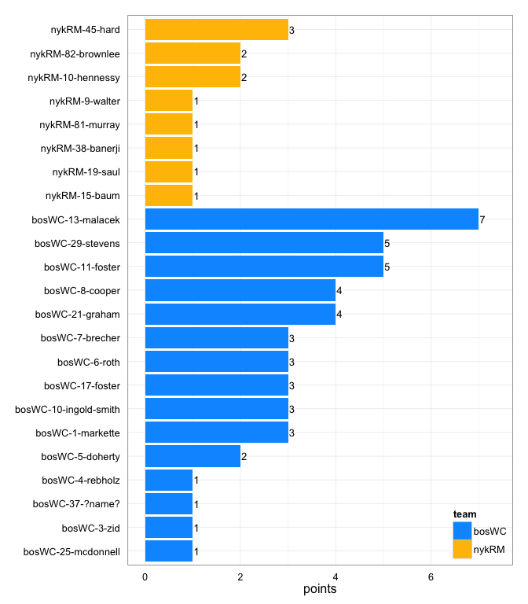
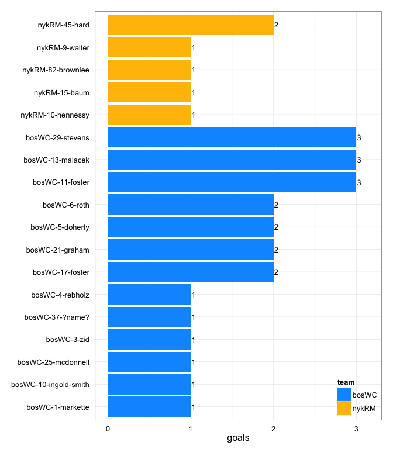
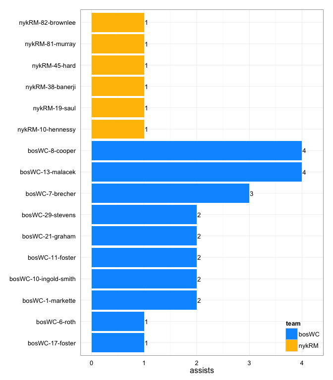
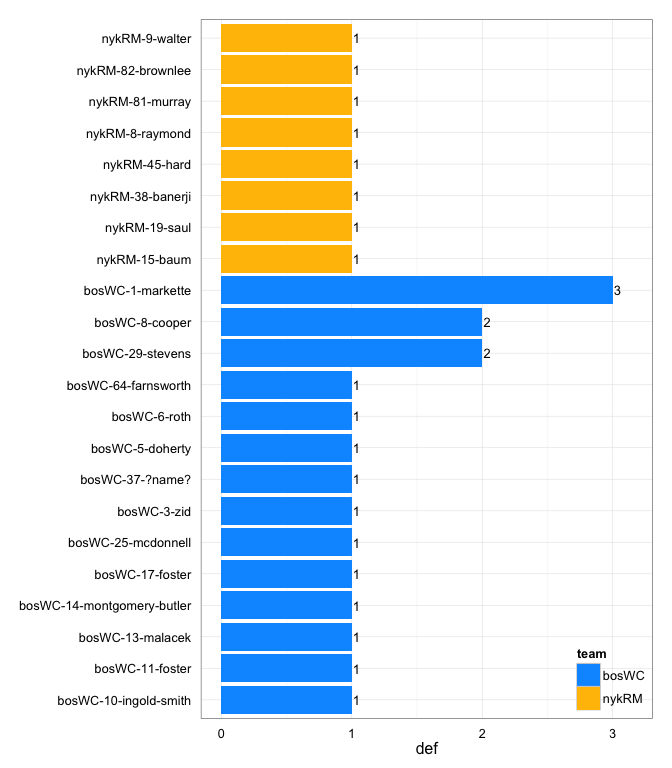

# nykRM at bosWC 2014-05-24

# nykRM 6
# bosWC 23
## game is complete

Go to ...  
  * [Scoring progression](#scoringProgression)  
  * [Player stats via figures](#pl_figs)  
  * [Player stats for nykRM](#away)  
  * [Player stats for bosWC](#home)  
  * [Data on goals, assists, D's](#selectData)  
  * [Full raw data](#rawData)  

## Scoring progression:

| point|period |begin    |end     |pt_duration |desc                                     |nykRM |bosWC |
|-----:|:------|:--------|:-------|:-----------|:----------------------------------------|:-----|:-----|
|    32|4      |0:12:00  |0:00:00 |00:12       |- no goal -                              |6     |23    |
|    31|4      |1:01:00  |0:12:00 |00:49       |bosWC-8-cooper to bosWC-1-markette       |6     |23    |
|    30|4      |1:54:00  |1:01:00 |00:53       |bosWC-11-foster to bosWC-37-?name?       |6     |22    |
|    29|4      |3:16:00  |1:54:00 |01:22       |bosWC-1-markette to bosWC-13-malacek     |6     |21    |
|    28|4      |4:04:00  |3:16:00 |00:48       |bosWC-7-brecher to bosWC-10-ingold-smith |6     |20    |
|    27|4      |5:52:00  |4:04:00 |01:48       |bosWC-17-foster to bosWC-25-mcdonnell    |6     |19    |
|    26|4      |7:57:00  |5:52:00 |02:05       |bosWC-10-ingold-smith to bosWC-11-foster |6     |18    |
|    25|4      |10:00:00 |7:57:00 |02:03       |bosWC-29-stevens to bosWC-17-foster      |6     |17    |
|    24|3      |2:06:00  |0:00:00 |02:06       |- no goal -                              |6     |16    |
|    23|3      |3:29:00  |2:06:00 |01:23       |bosWC-1-markette to bosWC-5-doherty      |6     |16    |
|    22|3      |5:27:00  |3:29:00 |01:58       |nykRM-45-hard to nykRM-15-baum           |6     |15    |
|    21|3      |6:28:00  |5:27:00 |01:01       |bosWC-8-cooper to bosWC-11-foster        |5     |15    |
|    20|3      |7:46:00  |6:28:00 |01:18       |bosWC-13-malacek to bosWC-17-foster      |5     |14    |
|    19|3      |10:00:00 |7:46:00 |02:14       |nykRM-81-murray to nykRM-82-brownlee     |5     |13    |
|    18|2      |0:08:00  |0:00:00 |00:08       |bosWC-11-foster to bosWC-29-stevens      |4     |13    |
|    17|2      |4:01:00  |0:08:00 |03:53       |nykRM-10-hennessy to nykRM-45-hard       |4     |12    |
|    16|2      |6:01:00  |4:01:00 |02:00       |bosWC-7-brecher to bosWC-21-graham       |3     |12    |
|    15|2      |6:38:00  |6:01:00 |00:37       |bosWC-13-malacek to bosWC-5-doherty      |3     |11    |
|    14|2      |7:12:00  |6:38:00 |00:34       |nykRM-38-banerji to nykRM-45-hard        |3     |10    |
|    13|2      |8:14:00  |7:12:00 |01:02       |bosWC-8-cooper to bosWC-13-malacek       |2     |10    |
|    12|2      |8:37:00  |8:14:00 |00:23       |nykRM-82-brownlee to nykRM-10-hennessy   |2     |9     |
|    11|2      |9:17:00  |8:37:00 |00:40       |bosWC-10-ingold-smith to bosWC-6-roth    |1     |9     |
|    10|2      |10:00:00 |9:17:00 |00:43       |bosWC-13-malacek to bosWC-21-graham      |1     |8     |
|     9|1      |0:04:00  |0:00:00 |00:04       |- no goal -                              |1     |7     |
|     8|1      |0:23:00  |0:04:00 |00:19       |bosWC-7-brecher to bosWC-29-stevens      |1     |7     |
|     7|1      |1:29:00  |0:23:00 |01:06       |nykRM-19-saul to nykRM-9-walter          |1     |6     |
|     6|1      |3:48:00  |1:29:00 |02:19       |bosWC-21-graham to bosWC-4-rebholz       |0     |6     |
|     5|1      |6:32:00  |3:48:00 |02:44       |bosWC-13-malacek to bosWC-3-zid          |0     |5     |
|     4|1      |7:38:00  |6:32:00 |01:06       |bosWC-21-graham to bosWC-11-foster       |0     |4     |
|     3|1      |8:47:00  |7:38:00 |01:09       |bosWC-8-cooper to bosWC-13-malacek       |0     |3     |
|     2|1      |9:34:00  |8:47:00 |00:47       |bosWC-6-roth to bosWC-29-stevens         |0     |2     |
|     1|1      |10:00:00 |9:34:00 |00:26       |bosWC-29-stevens to bosWC-6-roth         |0     |1     |

## Player stats via figures:

### Points = goals + assists

 

### Goals

 

### Assists

 

### D's
 

## Player stats for nykRM :

points = goals + assists  
tables sorted in decreasing order based on points (then goals, assists, Ds)  
Ds = total of plain ol' D's + interceptions (D), hand blocks (HB), and foot blocks (FB)  
stats are cumulative for this game

|   |player   |last     | points| comp_pct| goals| assists| throws| completions| catches| def| drop|
|:--|:--------|:--------|------:|--------:|-----:|-------:|------:|-----------:|-------:|---:|----:|
|21 |nykRM-45 |hard     |      3|     0.91|     2|       1|     11|          10|      12|   1|    0|
|22 |nykRM-82 |brownlee |      2|     0.92|     1|       1|     12|          11|       9|   1|    0|
|23 |nykRM-10 |hennessy |      2|     0.95|     1|       1|     22|          21|      20|   0|    0|
|24 |nykRM-15 |baum     |      1|     0.56|     1|       0|     16|           9|       9|   1|    2|
|25 |nykRM-9  |walter   |      1|     0.83|     1|       0|     12|          10|      11|   1|    1|
|26 |nykRM-19 |saul     |      1|     0.86|     0|       1|     28|          24|      19|   1|    2|
|27 |nykRM-38 |banerji  |      1|     0.68|     0|       1|     19|          13|      18|   1|    2|
|28 |nykRM-81 |murray   |      1|     1.00|     0|       1|      3|           3|       4|   1|    0|
|29 |nykRM-8  |raymond  |      0|     1.00|     0|       0|      5|           5|       5|   1|    0|
|30 |nykRM-2  |heljmen  |      0|     0.44|     0|       0|      9|           4|       9|   0|    3|
|31 |nykRM-26 |bosco    |      0|     0.77|     0|       0|     13|          10|       8|   0|    1|
|32 |nykRM-33 |herman   |      0|     0.57|     0|       0|      7|           4|       7|   0|    1|
|33 |nykRM-4  |hennessy |      0|     1.00|     0|       0|     14|          14|      12|   0|    0|
|34 |nykRM-47 |murphy   |      0|     0.91|     0|       0|     22|          20|      15|   0|    1|
|35 |nykRM-6  |mazur    |      0|     0.83|     0|       0|     24|          20|      20|   0|    1|

## Player stats for bosWC :

points = goals + assists  
tables sorted in decreasing order based on points (then goals, assists, Ds)  
Ds = total of plain ol' D's + interceptions (D), hand blocks (HB), and foot blocks (FB)  
stats are cumulative for this game

|   |player   |last              | points| comp_pct| goals| assists| throws| completions| catches| def| drop|
|:--|:--------|:-----------------|------:|--------:|-----:|-------:|------:|-----------:|-------:|---:|----:|
|1  |bosWC-13 |malacek           |      7|     0.90|     3|       4|     30|          27|      22|   1|    1|
|2  |bosWC-29 |stevens           |      5|     0.89|     3|       2|      9|           8|      12|   2|    0|
|3  |bosWC-11 |foster            |      5|     0.91|     3|       2|     11|          10|      12|   1|    1|
|4  |bosWC-21 |graham            |      4|     1.00|     2|       2|      8|           8|      10|   0|    0|
|5  |bosWC-8  |cooper            |      4|     0.95|     0|       4|     19|          18|      14|   2|    0|
|6  |bosWC-17 |foster            |      3|     1.00|     2|       1|      8|           8|       9|   1|    0|
|7  |bosWC-6  |roth              |      3|     0.80|     2|       1|      5|           4|       7|   1|    1|
|8  |bosWC-1  |markette          |      3|     0.80|     1|       2|     15|          12|      13|   3|    2|
|9  |bosWC-10 |ingold-smith      |      3|     0.83|     1|       2|     23|          19|      18|   1|    1|
|10 |bosWC-7  |brecher           |      3|     0.94|     0|       3|     33|          31|      27|   0|    0|
|11 |bosWC-5  |doherty           |      2|     1.00|     2|       0|      8|           8|      10|   1|    0|
|12 |bosWC-25 |mcdonnell         |      1|     0.75|     1|       0|      4|           3|       5|   1|    0|
|13 |bosWC-3  |zid               |      1|     1.00|     1|       0|      7|           7|       8|   1|    0|
|14 |bosWC-37 |?name?            |      1|     0.80|     1|       0|      5|           4|       5|   1|    0|
|15 |bosWC-4  |rebholz           |      1|     0.89|     1|       0|     28|          25|      23|   0|    1|
|16 |bosWC-14 |montgomery-butler |      0|     0.92|     0|       0|     12|          11|       8|   1|    0|
|17 |bosWC-64 |farnsworth        |      0|     1.00|     0|       0|      7|           7|       7|   1|    0|
|18 |bosWC-   |?name?            |      0|       NA|     0|       0|      0|           0|       0|   0|    0|
|19 |bosWC-27 |hatchett          |      0|     1.00|     0|       0|      2|           2|       2|   0|    0|
|20 |bosWC-28 |trahey            |      0|     0.89|     0|       0|      9|           8|       8|   0|    0|

## Raw data on select events (goals, assists, D's):

| point| period|pull_team | event| poss_abs| poss_rel|poss_team |pl_team |pl_pnum |pl_code |pl_lname          |player                     | bosWC| nykRM|
|-----:|------:|:---------|-----:|--------:|--------:|:---------|:-------|:-------|:-------|:-----------------|:--------------------------|-----:|-----:|
|     1|      1|bosWC     |     7|        2|        2|bosWC     |bosWC   |29      |A       |stevens           |bosWC-29-stevens           |     1|     0|
|     1|      1|bosWC     |     8|        2|        2|bosWC     |bosWC   |6       |G       |roth              |bosWC-6-roth               |     1|     0|
|     2|      1|bosWC     |    11|        4|        2|bosWC     |bosWC   |6       |A       |roth              |bosWC-6-roth               |     2|     0|
|     2|      1|bosWC     |    12|        4|        2|bosWC     |bosWC   |29      |G       |stevens           |bosWC-29-stevens           |     2|     0|
|     3|      1|bosWC     |     8|        5|        1|nykRM     |bosWC   |13      |D       |malacek           |bosWC-13-malacek           |     3|     0|
|     3|      1|bosWC     |    11|        7|        3|nykRM     |bosWC   |1       |D       |markette          |bosWC-1-markette           |     3|     0|
|     3|      1|bosWC     |    14|        8|        4|bosWC     |bosWC   |8       |A       |cooper            |bosWC-8-cooper             |     3|     0|
|     3|      1|bosWC     |    15|        8|        4|bosWC     |bosWC   |13      |G       |malacek           |bosWC-13-malacek           |     3|     0|
|     4|      1|bosWC     |    10|        9|        1|nykRM     |bosWC   |25      |HB      |mcdonnell         |bosWC-25-mcdonnell         |     4|     0|
|     4|      1|bosWC     |    13|       10|        2|bosWC     |bosWC   |21      |A       |graham            |bosWC-21-graham            |     4|     0|
|     4|      1|bosWC     |    14|       10|        2|bosWC     |bosWC   |11      |G       |foster            |bosWC-11-foster            |     4|     0|
|     5|      1|bosWC     |     8|       11|        1|nykRM     |bosWC   |3       |D       |zid               |bosWC-3-zid                |     5|     0|
|     5|      1|bosWC     |    26|       14|        4|bosWC     |bosWC   |13      |A       |malacek           |bosWC-13-malacek           |     5|     0|
|     5|      1|bosWC     |    27|       14|        4|bosWC     |bosWC   |3       |G       |zid               |bosWC-3-zid                |     5|     0|
|     6|      1|bosWC     |    30|       18|        4|bosWC     |bosWC   |21      |A       |graham            |bosWC-21-graham            |     6|     0|
|     6|      1|bosWC     |    31|       18|        4|bosWC     |bosWC   |4       |G       |rebholz           |bosWC-4-rebholz            |     6|     0|
|     7|      1|bosWC     |     8|       19|        1|nykRM     |bosWC   |1       |D       |markette          |bosWC-1-markette           |     6|     1|
|     7|      1|bosWC     |    12|       20|        2|bosWC     |nykRM   |19      |D       |saul              |nykRM-19-saul              |     6|     1|
|     7|      1|bosWC     |    15|       21|        3|nykRM     |nykRM   |19      |A       |saul              |nykRM-19-saul              |     6|     1|
|     7|      1|bosWC     |    16|       21|        3|nykRM     |nykRM   |9       |G       |walter            |nykRM-9-walter             |     6|     1|
|     8|      1|nykRM     |     7|       22|        1|bosWC     |bosWC   |7       |A       |brecher           |bosWC-7-brecher            |     7|     1|
|     8|      1|nykRM     |     8|       22|        1|bosWC     |bosWC   |29      |LG      |stevens           |bosWC-29-stevens           |     7|     1|
|     9|      1|bosWC     |     4|       23|        1|nykRM     |bosWC   |14      |D       |montgomery-butler |bosWC-14-montgomery-butler |     7|     1|
|    10|      2|nykRM     |     7|       24|        1|bosWC     |nykRM   |82      |D       |brownlee          |nykRM-82-brownlee          |     8|     1|
|    10|      2|nykRM     |    12|       26|        3|bosWC     |bosWC   |13      |A       |malacek           |bosWC-13-malacek           |     8|     1|
|    10|      2|nykRM     |    13|       26|        3|bosWC     |bosWC   |21      |G       |graham            |bosWC-21-graham            |     8|     1|
|    11|      2|bosWC     |     8|       27|        1|nykRM     |bosWC   |8       |D       |cooper            |bosWC-8-cooper             |     9|     1|
|    11|      2|bosWC     |    11|       28|        2|bosWC     |bosWC   |10      |A       |ingold-smith      |bosWC-10-ingold-smith      |     9|     1|
|    11|      2|bosWC     |    12|       28|        2|bosWC     |bosWC   |6       |LG      |roth              |bosWC-6-roth               |     9|     1|
|    12|      2|bosWC     |    10|       29|        1|nykRM     |nykRM   |82      |A       |brownlee          |nykRM-82-brownlee          |     9|     2|
|    12|      2|bosWC     |    11|       29|        1|nykRM     |nykRM   |10      |G       |hennessy          |nykRM-10-hennessy          |     9|     2|
|    13|      2|nykRM     |    16|       32|        3|bosWC     |bosWC   |8       |PUA     |cooper            |bosWC-8-cooper             |    10|     2|
|    13|      2|nykRM     |    17|       32|        3|bosWC     |bosWC   |13      |G       |malacek           |bosWC-13-malacek           |    10|     2|
|    14|      2|bosWC     |     8|       33|        1|nykRM     |nykRM   |38      |A       |banerji           |nykRM-38-banerji           |    10|     3|
|    14|      2|bosWC     |     9|       33|        1|nykRM     |nykRM   |45      |LG      |hard              |nykRM-45-hard              |    10|     3|
|    15|      2|nykRM     |     9|       34|        1|bosWC     |bosWC   |13      |A       |malacek           |bosWC-13-malacek           |    11|     3|
|    15|      2|nykRM     |    10|       34|        1|bosWC     |bosWC   |5       |G       |doherty           |bosWC-5-doherty            |    11|     3|
|    16|      2|bosWC     |    17|       36|        2|bosWC     |nykRM   |45      |D       |hard              |nykRM-45-hard              |    12|     3|
|    16|      2|bosWC     |    21|       37|        3|nykRM     |bosWC   |11      |D       |foster            |bosWC-11-foster            |    12|     3|
|    16|      2|bosWC     |    28|       38|        4|bosWC     |bosWC   |7       |A       |brecher           |bosWC-7-brecher            |    12|     3|
|    16|      2|bosWC     |    29|       38|        4|bosWC     |bosWC   |21      |G       |graham            |bosWC-21-graham            |    12|     3|
|    17|      2|bosWC     |    15|       40|        2|bosWC     |nykRM   |81      |D       |murray            |nykRM-81-murray            |    12|     4|
|    17|      2|bosWC     |    32|       43|        5|nykRM     |bosWC   |29      |D       |stevens           |bosWC-29-stevens           |    12|     4|
|    17|      2|bosWC     |    45|       46|        8|bosWC     |nykRM   |9       |D       |walter            |nykRM-9-walter             |    12|     4|
|    17|      2|bosWC     |    52|       47|        9|nykRM     |nykRM   |10      |A       |hennessy          |nykRM-10-hennessy          |    12|     4|
|    17|      2|bosWC     |    53|       47|        9|nykRM     |nykRM   |45      |G       |hard              |nykRM-45-hard              |    12|     4|
|    18|      2|nykRM     |     4|       48|        1|bosWC     |bosWC   |11      |A       |foster            |bosWC-11-foster            |    13|     4|
|    18|      2|nykRM     |     5|       48|        1|bosWC     |bosWC   |29      |LG      |stevens           |bosWC-29-stevens           |    13|     4|
|    19|      3|bosWC     |    27|       53|        5|nykRM     |nykRM   |81      |A       |murray            |nykRM-81-murray            |    13|     5|
|    19|      3|bosWC     |    28|       53|        5|nykRM     |nykRM   |82      |LG      |brownlee          |nykRM-82-brownlee          |    13|     5|
|    20|      3|nykRM     |    17|       55|        2|nykRM     |bosWC   |17      |D       |foster            |bosWC-17-foster            |    14|     5|
|    20|      3|nykRM     |    20|       56|        3|bosWC     |bosWC   |13      |A       |malacek           |bosWC-13-malacek           |    14|     5|
|    20|      3|nykRM     |    21|       56|        3|bosWC     |bosWC   |17      |G       |foster            |bosWC-17-foster            |    14|     5|
|    21|      3|bosWC     |    10|       57|        1|nykRM     |bosWC   |10      |D       |ingold-smith      |bosWC-10-ingold-smith      |    15|     5|
|    21|      3|bosWC     |    20|       58|        2|bosWC     |bosWC   |8       |A       |cooper            |bosWC-8-cooper             |    15|     5|
|    21|      3|bosWC     |    21|       58|        2|bosWC     |bosWC   |11      |G       |foster            |bosWC-11-foster            |    15|     5|
|    22|      3|bosWC     |    21|       60|        2|bosWC     |nykRM   |38      |D       |banerji           |nykRM-38-banerji           |    15|     6|
|    22|      3|bosWC     |    26|       61|        3|nykRM     |nykRM   |45      |A       |hard              |nykRM-45-hard              |    15|     6|
|    22|      3|bosWC     |    27|       61|        3|nykRM     |nykRM   |15      |G       |baum              |nykRM-15-baum              |    15|     6|
|    23|      3|nykRM     |    10|       63|        2|nykRM     |bosWC   |64      |D       |farnsworth        |bosWC-64-farnsworth        |    16|     6|
|    23|      3|nykRM     |    17|       64|        3|bosWC     |bosWC   |1       |A       |markette          |bosWC-1-markette           |    16|     6|
|    23|      3|nykRM     |    18|       64|        3|bosWC     |bosWC   |5       |G       |doherty           |bosWC-5-doherty            |    16|     6|
|    24|      3|bosWC     |     7|       65|        1|nykRM     |bosWC   |29      |D       |stevens           |bosWC-29-stevens           |    16|     6|
|    24|      3|bosWC     |    35|       68|        4|bosWC     |nykRM   |15      |D       |baum              |nykRM-15-baum              |    16|     6|
|    25|      4|nykRM     |    29|       72|        3|bosWC     |bosWC   |29      |A       |stevens           |bosWC-29-stevens           |    17|     6|
|    25|      4|nykRM     |    30|       72|        3|bosWC     |bosWC   |17      |G       |foster            |bosWC-17-foster            |    17|     6|
|    26|      4|bosWC     |     7|       73|        1|nykRM     |bosWC   |8       |D       |cooper            |bosWC-8-cooper             |    18|     6|
|    26|      4|bosWC     |    23|       76|        4|bosWC     |bosWC   |10      |LA      |ingold-smith      |bosWC-10-ingold-smith      |    18|     6|
|    26|      4|bosWC     |    24|       76|        4|bosWC     |bosWC   |11      |G       |foster            |bosWC-11-foster            |    18|     6|
|    27|      4|bosWC     |    12|       78|        2|bosWC     |nykRM   |8       |D       |raymond           |nykRM-8-raymond            |    19|     6|
|    27|      4|bosWC     |    22|       80|        4|bosWC     |bosWC   |17      |A       |foster            |bosWC-17-foster            |    19|     6|
|    27|      4|bosWC     |    23|       80|        4|bosWC     |bosWC   |25      |G       |mcdonnell         |bosWC-25-mcdonnell         |    19|     6|
|    28|      4|bosWC     |     6|       82|        2|bosWC     |bosWC   |7       |A       |brecher           |bosWC-7-brecher            |    20|     6|
|    28|      4|bosWC     |     7|       82|        2|bosWC     |bosWC   |10      |G       |ingold-smith      |bosWC-10-ingold-smith      |    20|     6|
|    29|      4|bosWC     |     8|       83|        1|nykRM     |bosWC   |1       |D       |markette          |bosWC-1-markette           |    21|     6|
|    29|      4|bosWC     |    20|       86|        4|bosWC     |bosWC   |1       |PUA     |markette          |bosWC-1-markette           |    21|     6|
|    29|      4|bosWC     |    21|       86|        4|bosWC     |bosWC   |13      |G       |malacek           |bosWC-13-malacek           |    21|     6|
|    30|      4|bosWC     |     8|       87|        1|nykRM     |bosWC   |5       |D       |doherty           |bosWC-5-doherty            |    22|     6|
|    30|      4|bosWC     |    14|       88|        2|bosWC     |bosWC   |11      |A       |foster            |bosWC-11-foster            |    22|     6|
|    30|      4|bosWC     |    15|       88|        2|bosWC     |bosWC   |37      |G       |?name?            |bosWC-37-?name?            |    22|     6|
|    31|      4|bosWC     |     6|       89|        1|nykRM     |bosWC   |6       |D       |roth              |bosWC-6-roth               |    23|     6|
|    31|      4|bosWC     |    11|       90|        2|bosWC     |bosWC   |8       |A       |cooper            |bosWC-8-cooper             |    23|     6|
|    31|      4|bosWC     |    12|       90|        2|bosWC     |bosWC   |1       |LG      |markette          |bosWC-1-markette           |    23|     6|
|    32|      4|bosWC     |     8|       91|        1|nykRM     |bosWC   |37      |D       |?name?            |bosWC-37-?name?            |    23|     6|

## Full raw data:

__Note: just for display purposes.__ Raw data in more useful forms can be found in the [GitHub repository](https://github.com/jennybc/vanNH). Find the game you're interested in in the `games` subdirectory.

| period| point|pull_team | event| poss_abs| poss_rel|poss_team |pl_team |pl_pnum |pl_code |
|------:|-----:|:---------|-----:|--------:|--------:|:---------|:-------|:-------|:-------|
|      1|     1|bosWC     |     1|        1|        1|nykRM     |bosWC   |11      |P       |
|      1|     1|bosWC     |     2|        1|        1|nykRM     |nykRM   |19      |PU      |
|      1|     1|bosWC     |     3|        1|        1|nykRM     |nykRM   |6       |        |
|      1|     1|bosWC     |     4|        1|        1|nykRM     |nykRM   |2       |        |
|      1|     1|bosWC     |     5|        1|        1|nykRM     |nykRM   |47      |TD      |
|      1|     1|bosWC     |     6|        2|        2|bosWC     |bosWC   |8       |PU      |
|      1|     1|bosWC     |     7|        2|        2|bosWC     |bosWC   |29      |A       |
|      1|     1|bosWC     |     8|        2|        2|bosWC     |bosWC   |6       |G       |
|      1|     2|bosWC     |     1|        3|        1|nykRM     |bosWC   |11      |P       |
|      1|     2|bosWC     |     2|        3|        1|nykRM     |nykRM   |6       |PU      |
|      1|     2|bosWC     |     3|        3|        1|nykRM     |nykRM   |19      |        |
|      1|     2|bosWC     |     4|        3|        1|nykRM     |nykRM   |33      |        |
|      1|     2|bosWC     |     5|        3|        1|nykRM     |nykRM   |6       |        |
|      1|     2|bosWC     |     6|        3|        1|nykRM     |nykRM   |47      |        |
|      1|     2|bosWC     |     7|        3|        1|nykRM     |nykRM   |2       |        |
|      1|     2|bosWC     |     8|        3|        1|nykRM     |nykRM   |81      |TD      |
|      1|     2|bosWC     |     9|        4|        2|bosWC     |bosWC   |14      |PU      |
|      1|     2|bosWC     |    10|        4|        2|bosWC     |bosWC   |8       |        |
|      1|     2|bosWC     |    11|        4|        2|bosWC     |bosWC   |6       |A       |
|      1|     2|bosWC     |    12|        4|        2|bosWC     |bosWC   |29      |G       |
|      1|     3|bosWC     |     1|        5|        1|nykRM     |bosWC   |13      |P       |
|      1|     3|bosWC     |     2|        5|        1|nykRM     |nykRM   |15      |PU      |
|      1|     3|bosWC     |     3|        5|        1|nykRM     |nykRM   |6       |        |
|      1|     3|bosWC     |     4|        5|        1|nykRM     |nykRM   |38      |        |
|      1|     3|bosWC     |     5|        5|        1|nykRM     |nykRM   |82      |        |
|      1|     3|bosWC     |     6|        5|        1|nykRM     |nykRM   |10      |        |
|      1|     3|bosWC     |     7|        5|        1|nykRM     |nykRM   |38      |        |
|      1|     3|bosWC     |     8|        5|        1|nykRM     |bosWC   |13      |D       |
|      1|     3|bosWC     |     9|        6|        2|bosWC     |bosWC   |13      |PU      |
|      1|     3|bosWC     |    10|        7|        3|nykRM     |nykRM   |15      |PU      |
|      1|     3|bosWC     |    11|        7|        3|nykRM     |bosWC   |1       |D       |
|      1|     3|bosWC     |    12|        8|        4|bosWC     |bosWC   |1       |PU      |
|      1|     3|bosWC     |    13|        8|        4|bosWC     |bosWC   |10      |        |
|      1|     3|bosWC     |    14|        8|        4|bosWC     |bosWC   |8       |A       |
|      1|     3|bosWC     |    15|        8|        4|bosWC     |bosWC   |13      |G       |
|      1|     4|bosWC     |     1|        9|        1|nykRM     |bosWC   |11      |P       |
|      1|     4|bosWC     |     2|        9|        1|nykRM     |nykRM   |26      |PU      |
|      1|     4|bosWC     |     3|        9|        1|nykRM     |nykRM   |19      |        |
|      1|     4|bosWC     |     4|        9|        1|nykRM     |nykRM   |4       |        |
|      1|     4|bosWC     |     5|        9|        1|nykRM     |nykRM   |45      |        |
|      1|     4|bosWC     |     6|        9|        1|nykRM     |nykRM   |19      |        |
|      1|     4|bosWC     |     7|        9|        1|nykRM     |nykRM   |4       |        |
|      1|     4|bosWC     |     8|        9|        1|nykRM     |nykRM   |45      |        |
|      1|     4|bosWC     |     9|        9|        1|nykRM     |nykRM   |33      |        |
|      1|     4|bosWC     |    10|        9|        1|nykRM     |bosWC   |25      |HB      |
|      1|     4|bosWC     |    11|       10|        2|bosWC     |bosWC   |7       |PU      |
|      1|     4|bosWC     |    12|       10|        2|bosWC     |bosWC   |11      |L       |
|      1|     4|bosWC     |    13|       10|        2|bosWC     |bosWC   |21      |A       |
|      1|     4|bosWC     |    14|       10|        2|bosWC     |bosWC   |11      |G       |
|      1|     5|bosWC     |     1|       11|        1|nykRM     |bosWC   |13      |P       |
|      1|     5|bosWC     |     2|       11|        1|nykRM     |nykRM   |9       |PU      |
|      1|     5|bosWC     |     3|       11|        1|nykRM     |nykRM   |4       |        |
|      1|     5|bosWC     |     4|       11|        1|nykRM     |nykRM   |6       |        |
|      1|     5|bosWC     |     5|       11|        1|nykRM     |bosWC   |5       |F       |
|      1|     5|bosWC     |     6|       11|        1|nykRM     |nykRM   |10      |PU      |
|      1|     5|bosWC     |     7|       11|        1|nykRM     |nykRM   |6       |        |
|      1|     5|bosWC     |     8|       11|        1|nykRM     |bosWC   |3       |D       |
|      1|     5|bosWC     |     9|       12|        2|bosWC     |bosWC   |28      |PU      |
|      1|     5|bosWC     |    10|       12|        2|bosWC     |bosWC   |10      |        |
|      1|     5|bosWC     |    11|       12|        2|bosWC     |bosWC   |28      |        |
|      1|     5|bosWC     |    12|       12|        2|bosWC     |bosWC   |13      |        |
|      1|     5|bosWC     |    13|       12|        2|bosWC     |bosWC   |5       |        |
|      1|     5|bosWC     |    14|       12|        2|bosWC     |bosWC   |13      |        |
|      1|     5|bosWC     |    15|       12|        2|bosWC     |bosWC   |3       |        |
|      1|     5|bosWC     |    16|       12|        2|bosWC     |bosWC   |1       |        |
|      1|     5|bosWC     |    17|       12|        2|bosWC     |bosWC   |28      |        |
|      1|     5|bosWC     |    18|       12|        2|bosWC     |bosWC   |10      |        |
|      1|     5|bosWC     |    19|       12|        2|bosWC     |bosWC   |13      |        |
|      1|     5|bosWC     |    20|       12|        2|bosWC     |bosWC   |5       |        |
|      1|     5|bosWC     |    21|       12|        2|bosWC     |bosWC   |10      |        |
|      1|     5|bosWC     |    22|       13|        3|nykRM     |nykRM   |4       |PU      |
|      1|     5|bosWC     |    23|       13|        3|nykRM     |nykRM   |6       |        |
|      1|     5|bosWC     |    24|       13|        3|nykRM     |nykRM   |38      |TD      |
|      1|     5|bosWC     |    25|       14|        4|bosWC     |bosWC   |10      |PU      |
|      1|     5|bosWC     |    26|       14|        4|bosWC     |bosWC   |13      |A       |
|      1|     5|bosWC     |    27|       14|        4|bosWC     |bosWC   |3       |G       |
|      1|     6|bosWC     |     1|       15|        1|nykRM     |bosWC   |11      |OBP     |
|      1|     6|bosWC     |     2|       15|        1|nykRM     |nykRM   |19      |PU      |
|      1|     6|bosWC     |     3|       15|        1|nykRM     |nykRM   |33      |        |
|      1|     6|bosWC     |     4|       15|        1|nykRM     |nykRM   |2       |        |
|      1|     6|bosWC     |     5|       15|        1|nykRM     |nykRM   |19      |        |
|      1|     6|bosWC     |     6|       15|        1|nykRM     |nykRM   |6       |        |
|      1|     6|bosWC     |     7|       15|        1|nykRM     |nykRM   |26      |        |
|      1|     6|bosWC     |     8|       15|        1|nykRM     |nykRM   |6       |TD      |
|      1|     6|bosWC     |     9|       16|        2|bosWC     |bosWC   |4       |PU      |
|      1|     6|bosWC     |    10|       16|        2|bosWC     |bosWC   |7       |        |
|      1|     6|bosWC     |    11|       16|        2|bosWC     |bosWC   |25      |        |
|      1|     6|bosWC     |    12|       16|        2|bosWC     |bosWC   |29      |        |
|      1|     6|bosWC     |    13|       16|        2|bosWC     |bosWC   |7       |        |
|      1|     6|bosWC     |    14|       16|        2|bosWC     |bosWC   |37      |        |
|      1|     6|bosWC     |    15|       16|        2|bosWC     |bosWC   |4       |        |
|      1|     6|bosWC     |    16|       16|        2|bosWC     |bosWC   |11      |        |
|      1|     6|bosWC     |    17|       16|        2|bosWC     |bosWC   |7       |        |
|      1|     6|bosWC     |    18|       16|        2|bosWC     |bosWC   |21      |        |
|      1|     6|bosWC     |    19|       16|        2|bosWC     |bosWC   |4       |        |
|      1|     6|bosWC     |    20|       16|        2|bosWC     |bosWC   |11      |        |
|      1|     6|bosWC     |    21|       16|        2|bosWC     |bosWC   |7       |        |
|      1|     6|bosWC     |    22|       16|        2|bosWC     |bosWC   |4       |        |
|      1|     6|bosWC     |    23|       17|        3|nykRM     |nykRM   |19      |PU      |
|      1|     6|bosWC     |    24|       17|        3|nykRM     |nykRM   |26      |        |
|      1|     6|bosWC     |    25|       17|        3|nykRM     |nykRM   |33      |        |
|      1|     6|bosWC     |    26|       17|        3|nykRM     |nykRM   |81      |TD      |
|      1|     6|bosWC     |    27|       18|        4|bosWC     |bosWC   |7       |PU      |
|      1|     6|bosWC     |    28|       18|        4|bosWC     |bosWC   |29      |        |
|      1|     6|bosWC     |    29|       18|        4|bosWC     |bosWC   |7       |        |
|      1|     6|bosWC     |    30|       18|        4|bosWC     |bosWC   |21      |A       |
|      1|     6|bosWC     |    31|       18|        4|bosWC     |bosWC   |4       |G       |
|      1|     7|bosWC     |     1|       19|        1|nykRM     |bosWC   |13      |P       |
|      1|     7|bosWC     |     2|       19|        1|nykRM     |nykRM   |4       |PU      |
|      1|     7|bosWC     |     3|       19|        1|nykRM     |nykRM   |19      |        |
|      1|     7|bosWC     |     4|       19|        1|nykRM     |nykRM   |10      |        |
|      1|     7|bosWC     |     5|       19|        1|nykRM     |nykRM   |38      |        |
|      1|     7|bosWC     |     6|       19|        1|nykRM     |nykRM   |9       |        |
|      1|     7|bosWC     |     7|       19|        1|nykRM     |nykRM   |10      |        |
|      1|     7|bosWC     |     8|       19|        1|nykRM     |bosWC   |1       |D       |
|      1|     7|bosWC     |     9|       20|        2|bosWC     |bosWC   |13      |PU      |
|      1|     7|bosWC     |    10|       20|        2|bosWC     |bosWC   |14      |        |
|      1|     7|bosWC     |    11|       20|        2|bosWC     |bosWC   |8       |        |
|      1|     7|bosWC     |    12|       20|        2|bosWC     |nykRM   |19      |D       |
|      1|     7|bosWC     |    13|       21|        3|nykRM     |nykRM   |19      |PU      |
|      1|     7|bosWC     |    14|       21|        3|nykRM     |nykRM   |38      |        |
|      1|     7|bosWC     |    15|       21|        3|nykRM     |nykRM   |19      |A       |
|      1|     7|bosWC     |    16|       21|        3|nykRM     |nykRM   |9       |G       |
|      1|     8|nykRM     |     1|       22|        1|bosWC     |nykRM   |6       |P       |
|      1|     8|nykRM     |     2|       22|        1|bosWC     |bosWC   |7       |PU      |
|      1|     8|nykRM     |     3|       22|        1|bosWC     |bosWC   |4       |        |
|      1|     8|nykRM     |     4|       22|        1|bosWC     |bosWC   |21      |        |
|      1|     8|nykRM     |     5|       22|        1|bosWC     |bosWC   |7       |        |
|      1|     8|nykRM     |     6|       22|        1|bosWC     |bosWC   |4       |        |
|      1|     8|nykRM     |     7|       22|        1|bosWC     |bosWC   |7       |A       |
|      1|     8|nykRM     |     8|       22|        1|bosWC     |bosWC   |29      |LG      |
|      1|     9|bosWC     |     1|       23|        1|nykRM     |bosWC   |13      |P       |
|      1|     9|bosWC     |     2|       23|        1|nykRM     |nykRM   |15      |PU      |
|      1|     9|bosWC     |     3|       23|        1|nykRM     |nykRM   |19      |        |
|      1|     9|bosWC     |     4|       23|        1|nykRM     |bosWC   |14      |D       |
|      2|    10|nykRM     |     1|       24|        1|bosWC     |nykRM   |82      |P       |
|      2|    10|nykRM     |     2|       24|        1|bosWC     |bosWC   |4       |PU      |
|      2|    10|nykRM     |     3|       24|        1|bosWC     |bosWC   |13      |        |
|      2|    10|nykRM     |     4|       24|        1|bosWC     |bosWC   |1       |        |
|      2|    10|nykRM     |     5|       24|        1|bosWC     |bosWC   |64      |        |
|      2|    10|nykRM     |     6|       24|        1|bosWC     |bosWC   |7       |        |
|      2|    10|nykRM     |     7|       24|        1|bosWC     |nykRM   |82      |D       |
|      2|    10|nykRM     |     8|       25|        2|nykRM     |nykRM   |82      |PU      |
|      2|    10|nykRM     |     9|       25|        2|nykRM     |nykRM   |47      |        |
|      2|    10|nykRM     |    10|       25|        2|nykRM     |nykRM   |10      |TD      |
|      2|    10|nykRM     |    11|       26|        3|bosWC     |bosWC   |7       |PU      |
|      2|    10|nykRM     |    12|       26|        3|bosWC     |bosWC   |13      |A       |
|      2|    10|nykRM     |    13|       26|        3|bosWC     |bosWC   |21      |G       |
|      2|    11|bosWC     |     1|       27|        1|nykRM     |bosWC   |11      |P       |
|      2|    11|bosWC     |     2|       27|        1|nykRM     |nykRM   |26      |PU      |
|      2|    11|bosWC     |     3|       27|        1|nykRM     |nykRM   |19      |        |
|      2|    11|bosWC     |     4|       27|        1|nykRM     |nykRM   |6       |        |
|      2|    11|bosWC     |     5|       27|        1|nykRM     |nykRM   |4       |        |
|      2|    11|bosWC     |     6|       27|        1|nykRM     |nykRM   |2       |        |
|      2|    11|bosWC     |     7|       27|        1|nykRM     |nykRM   |26      |        |
|      2|    11|bosWC     |     8|       27|        1|nykRM     |bosWC   |8       |D       |
|      2|    11|bosWC     |     9|       28|        2|bosWC     |bosWC   |8       |PU      |
|      2|    11|bosWC     |    10|       28|        2|bosWC     |bosWC   |28      |        |
|      2|    11|bosWC     |    11|       28|        2|bosWC     |bosWC   |10      |A       |
|      2|    11|bosWC     |    12|       28|        2|bosWC     |bosWC   |6       |LG      |
|      2|    12|bosWC     |     1|       29|        1|nykRM     |bosWC   |7       |OBP     |
|      2|    12|bosWC     |     2|       29|        1|nykRM     |nykRM   |82      |PU      |
|      2|    12|bosWC     |     3|       29|        1|nykRM     |nykRM   |38      |        |
|      2|    12|bosWC     |     4|       29|        1|nykRM     |nykRM   |9       |        |
|      2|    12|bosWC     |     5|       29|        1|nykRM     |nykRM   |45      |        |
|      2|    12|bosWC     |     6|       29|        1|nykRM     |nykRM   |10      |        |
|      2|    12|bosWC     |     7|       29|        1|nykRM     |nykRM   |8       |        |
|      2|    12|bosWC     |     8|       29|        1|nykRM     |nykRM   |47      |        |
|      2|    12|bosWC     |     9|       29|        1|nykRM     |nykRM   |10      |        |
|      2|    12|bosWC     |    10|       29|        1|nykRM     |nykRM   |82      |A       |
|      2|    12|bosWC     |    11|       29|        1|nykRM     |nykRM   |10      |G       |
|      2|    13|nykRM     |     1|       30|        1|bosWC     |nykRM   |6       |P       |
|      2|    13|nykRM     |     2|       30|        1|bosWC     |bosWC   |14      |PU      |
|      2|    13|nykRM     |     3|       30|        1|bosWC     |bosWC   |13      |        |
|      2|    13|nykRM     |     4|       30|        1|bosWC     |bosWC   |64      |        |
|      2|    13|nykRM     |     5|       30|        1|bosWC     |nykRM   |4       |SO      |
|      2|    13|nykRM     |     6|       30|        1|bosWC     |nykRM   |10      |SI      |
|      2|    13|nykRM     |     7|       30|        1|bosWC     |bosWC   |1       |        |
|      2|    13|nykRM     |     8|       30|        1|bosWC     |bosWC   |5       |        |
|      2|    13|nykRM     |     9|       30|        1|bosWC     |bosWC   |3       |        |
|      2|    13|nykRM     |    10|       30|        1|bosWC     |bosWC   |8       |        |
|      2|    13|nykRM     |    11|       30|        1|bosWC     |bosWC   |14      |        |
|      2|    13|nykRM     |    12|       31|        2|nykRM     |nykRM   |19      |PU      |
|      2|    13|nykRM     |    13|       31|        2|nykRM     |nykRM   |6       |        |
|      2|    13|nykRM     |    14|       31|        2|nykRM     |nykRM   |2       |        |
|      2|    13|nykRM     |    15|       31|        2|nykRM     |nykRM   |19      |TD      |
|      2|    13|nykRM     |    16|       32|        3|bosWC     |bosWC   |8       |PUA     |
|      2|    13|nykRM     |    17|       32|        3|bosWC     |bosWC   |13      |G       |
|      2|    14|bosWC     |     1|       33|        1|nykRM     |bosWC   |11      |OBP     |
|      2|    14|bosWC     |     2|       33|        1|nykRM     |nykRM   |15      |PU      |
|      2|    14|bosWC     |     3|       33|        1|nykRM     |nykRM   |38      |        |
|      2|    14|bosWC     |     4|       33|        1|nykRM     |nykRM   |45      |        |
|      2|    14|bosWC     |     5|       33|        1|nykRM     |nykRM   |10      |        |
|      2|    14|bosWC     |     6|       33|        1|nykRM     |nykRM   |47      |        |
|      2|    14|bosWC     |     7|       33|        1|nykRM     |nykRM   |10      |        |
|      2|    14|bosWC     |     8|       33|        1|nykRM     |nykRM   |38      |A       |
|      2|    14|bosWC     |     9|       33|        1|nykRM     |nykRM   |45      |LG      |
|      2|    15|nykRM     |     1|       34|        1|bosWC     |nykRM   |6       |P       |
|      2|    15|nykRM     |     2|       34|        1|bosWC     |bosWC   |8       |PU      |
|      2|    15|nykRM     |     3|       34|        1|bosWC     |bosWC   |13      |        |
|      2|    15|nykRM     |     4|       34|        1|bosWC     |bosWC   |5       |        |
|      2|    15|nykRM     |     5|       34|        1|bosWC     |bosWC   |1       |        |
|      2|    15|nykRM     |     6|       34|        1|bosWC     |bosWC   |5       |        |
|      2|    15|nykRM     |     7|       34|        1|bosWC     |bosWC   |28      |        |
|      2|    15|nykRM     |     8|       34|        1|bosWC     |bosWC   |3       |        |
|      2|    15|nykRM     |     9|       34|        1|bosWC     |bosWC   |13      |A       |
|      2|    15|nykRM     |    10|       34|        1|bosWC     |bosWC   |5       |G       |
|      2|    16|bosWC     |     1|       35|        1|nykRM     |bosWC   |11      |P       |
|      2|    16|bosWC     |     2|       35|        1|nykRM     |nykRM   |15      |PU      |
|      2|    16|bosWC     |     3|       35|        1|nykRM     |nykRM   |47      |        |
|      2|    16|bosWC     |     4|       35|        1|nykRM     |nykRM   |9       |        |
|      2|    16|bosWC     |     5|       35|        1|nykRM     |nykRM   |8       |        |
|      2|    16|bosWC     |     6|       35|        1|nykRM     |nykRM   |47      |        |
|      2|    16|bosWC     |     7|       35|        1|nykRM     |nykRM   |15      |        |
|      2|    16|bosWC     |     8|       35|        1|nykRM     |nykRM   |10      |        |
|      2|    16|bosWC     |     9|       35|        1|nykRM     |nykRM   |38      |        |
|      2|    16|bosWC     |    10|       35|        1|nykRM     |nykRM   |10      |        |
|      2|    16|bosWC     |    11|       35|        1|nykRM     |nykRM   |15      |        |
|      2|    16|bosWC     |    12|       35|        1|nykRM     |nykRM   |8       |TD      |
|      2|    16|bosWC     |    13|       36|        2|bosWC     |bosWC   |7       |PU      |
|      2|    16|bosWC     |    14|       36|        2|bosWC     |bosWC   |27      |        |
|      2|    16|bosWC     |    15|       36|        2|bosWC     |bosWC   |10      |        |
|      2|    16|bosWC     |    16|       36|        2|bosWC     |bosWC   |4       |        |
|      2|    16|bosWC     |    17|       36|        2|bosWC     |nykRM   |45      |D       |
|      2|    16|bosWC     |    18|       37|        3|nykRM     |nykRM   |15      |PU      |
|      2|    16|bosWC     |    19|       37|        3|nykRM     |nykRM   |10      |        |
|      2|    16|bosWC     |    20|       37|        3|nykRM     |nykRM   |38      |        |
|      2|    16|bosWC     |    21|       37|        3|nykRM     |bosWC   |11      |D       |
|      2|    16|bosWC     |    22|       38|        4|bosWC     |bosWC   |11      |PU      |
|      2|    16|bosWC     |    23|       38|        4|bosWC     |bosWC   |7       |        |
|      2|    16|bosWC     |    24|       38|        4|bosWC     |bosWC   |        |TO      |
|      2|    16|bosWC     |    25|       38|        4|bosWC     |bosWC   |13      |PU      |
|      2|    16|bosWC     |    26|       38|        4|bosWC     |bosWC   |7       |        |
|      2|    16|bosWC     |    27|       38|        4|bosWC     |bosWC   |13      |        |
|      2|    16|bosWC     |    28|       38|        4|bosWC     |bosWC   |7       |A       |
|      2|    16|bosWC     |    29|       38|        4|bosWC     |bosWC   |21      |G       |
|      2|    17|bosWC     |     1|       39|        1|nykRM     |bosWC   |10      |P       |
|      2|    17|bosWC     |     2|       39|        1|nykRM     |nykRM   |26      |PU      |
|      2|    17|bosWC     |     3|       39|        1|nykRM     |nykRM   |82      |        |
|      2|    17|bosWC     |     4|       39|        1|nykRM     |nykRM   |4       |        |
|      2|    17|bosWC     |     5|       39|        1|nykRM     |nykRM   |82      |        |
|      2|    17|bosWC     |     6|       39|        1|nykRM     |nykRM   |2       |        |
|      2|    17|bosWC     |     7|       39|        1|nykRM     |nykRM   |82      |        |
|      2|    17|bosWC     |     8|       39|        1|nykRM     |nykRM   |26      |        |
|      2|    17|bosWC     |     9|       39|        1|nykRM     |nykRM   |2       |        |
|      2|    17|bosWC     |    10|       40|        2|bosWC     |bosWC   |10      |PU      |
|      2|    17|bosWC     |    11|       40|        2|bosWC     |bosWC   |8       |        |
|      2|    17|bosWC     |    12|       40|        2|bosWC     |bosWC   |28      |        |
|      2|    17|bosWC     |    13|       40|        2|bosWC     |bosWC   |29      |        |
|      2|    17|bosWC     |    14|       40|        2|bosWC     |bosWC   |25      |        |
|      2|    17|bosWC     |    15|       40|        2|bosWC     |nykRM   |81      |D       |
|      2|    17|bosWC     |    16|       41|        3|nykRM     |nykRM   |82      |PU      |
|      2|    17|bosWC     |    17|       41|        3|nykRM     |nykRM   |4       |        |
|      2|    17|bosWC     |    18|       41|        3|nykRM     |nykRM   |2       |        |
|      2|    17|bosWC     |    19|       41|        3|nykRM     |nykRM   |81      |L       |
|      2|    17|bosWC     |    20|       41|        3|nykRM     |nykRM   |81      |VST     |
|      2|    17|bosWC     |    21|       42|        4|bosWC     |bosWC   |10      |PU      |
|      2|    17|bosWC     |    22|       42|        4|bosWC     |bosWC   |8       |        |
|      2|    17|bosWC     |    23|       42|        4|bosWC     |bosWC   |10      |        |
|      2|    17|bosWC     |    24|       42|        4|bosWC     |bosWC   |28      |        |
|      2|    17|bosWC     |    25|       42|        4|bosWC     |bosWC   |10      |        |
|      2|    17|bosWC     |    26|       42|        4|bosWC     |bosWC   |5       |        |
|      2|    17|bosWC     |    27|       42|        4|bosWC     |bosWC   |29      |        |
|      2|    17|bosWC     |    28|       43|        5|nykRM     |nykRM   |82      |PU      |
|      2|    17|bosWC     |    29|       43|        5|nykRM     |nykRM   |6       |        |
|      2|    17|bosWC     |    30|       43|        5|nykRM     |nykRM   |4       |        |
|      2|    17|bosWC     |    31|       43|        5|nykRM     |nykRM   |2       |        |
|      2|    17|bosWC     |    32|       43|        5|nykRM     |bosWC   |29      |D       |
|      2|    17|bosWC     |    33|       44|        6|bosWC     |bosWC   |10      |PU      |
|      2|    17|bosWC     |    34|       44|        6|bosWC     |bosWC   |8       |        |
|      2|    17|bosWC     |    35|       44|        6|bosWC     |bosWC   |        |TO      |
|      2|    17|bosWC     |    36|       44|        6|bosWC     |bosWC   |13      |PU      |
|      2|    17|bosWC     |    37|       44|        6|bosWC     |bosWC   |17      |        |
|      2|    17|bosWC     |    38|       44|        6|bosWC     |bosWC   |1       |        |
|      2|    17|bosWC     |    39|       44|        6|bosWC     |bosWC   |17      |TD      |
|      2|    17|bosWC     |    40|       45|        7|nykRM     |nykRM   |47      |PU      |
|      2|    17|bosWC     |    41|       45|        7|nykRM     |nykRM   |15      |        |
|      2|    17|bosWC     |    42|       45|        7|nykRM     |nykRM   |8       |TD      |
|      2|    17|bosWC     |    43|       46|        8|bosWC     |bosWC   |13      |PU      |
|      2|    17|bosWC     |    44|       46|        8|bosWC     |bosWC   |1       |        |
|      2|    17|bosWC     |    45|       46|        8|bosWC     |nykRM   |9       |D       |
|      2|    17|bosWC     |    46|       47|        9|nykRM     |nykRM   |47      |PU      |
|      2|    17|bosWC     |    47|       47|        9|nykRM     |nykRM   |10      |        |
|      2|    17|bosWC     |    48|       47|        9|nykRM     |nykRM   |47      |        |
|      2|    17|bosWC     |    49|       47|        9|nykRM     |nykRM   |10      |        |
|      2|    17|bosWC     |    50|       47|        9|nykRM     |nykRM   |38      |PU      |
|      2|    17|bosWC     |    51|       47|        9|nykRM     |bosWC   |7       |F       |
|      2|    17|bosWC     |    52|       47|        9|nykRM     |nykRM   |10      |A       |
|      2|    17|bosWC     |    53|       47|        9|nykRM     |nykRM   |45      |G       |
|      2|    18|nykRM     |     1|       48|        1|bosWC     |nykRM   |6       |P       |
|      2|    18|nykRM     |     2|       48|        1|bosWC     |bosWC   |10      |PU      |
|      2|    18|nykRM     |     3|       48|        1|bosWC     |bosWC   |21      |        |
|      2|    18|nykRM     |     4|       48|        1|bosWC     |bosWC   |11      |A       |
|      2|    18|nykRM     |     5|       48|        1|bosWC     |bosWC   |29      |LG      |
|      3|    19|bosWC     |     1|       49|        1|nykRM     |bosWC   |11      |P       |
|      3|    19|bosWC     |     2|       49|        1|nykRM     |nykRM   |19      |PU      |
|      3|    19|bosWC     |     3|       49|        1|nykRM     |nykRM   |6       |        |
|      3|    19|bosWC     |     4|       49|        1|nykRM     |nykRM   |19      |        |
|      3|    19|bosWC     |     5|       49|        1|nykRM     |nykRM   |82      |TD      |
|      3|    19|bosWC     |     6|       50|        2|bosWC     |bosWC   |11      |PU      |
|      3|    19|bosWC     |     7|       50|        2|bosWC     |bosWC   |10      |        |
|      3|    19|bosWC     |     8|       50|        2|bosWC     |bosWC   |11      |TD      |
|      3|    19|bosWC     |     9|       51|        3|nykRM     |nykRM   |19      |PU      |
|      3|    19|bosWC     |    10|       51|        3|nykRM     |nykRM   |6       |        |
|      3|    19|bosWC     |    11|       51|        3|nykRM     |nykRM   |19      |        |
|      3|    19|bosWC     |    12|       51|        3|nykRM     |nykRM   |26      |        |
|      3|    19|bosWC     |    13|       51|        3|nykRM     |nykRM   |81      |        |
|      3|    19|bosWC     |    14|       51|        3|nykRM     |nykRM   |19      |        |
|      3|    19|bosWC     |    15|       51|        3|nykRM     |bosWC   |11      |F       |
|      3|    19|bosWC     |    16|       51|        3|nykRM     |nykRM   |33      |        |
|      3|    19|bosWC     |    17|       51|        3|nykRM     |nykRM   |6       |        |
|      3|    19|bosWC     |    18|       51|        3|nykRM     |nykRM   |4       |        |
|      3|    19|bosWC     |    19|       51|        3|nykRM     |nykRM   |82      |        |
|      3|    19|bosWC     |    20|       52|        4|bosWC     |bosWC   |10      |PU      |
|      3|    19|bosWC     |    21|       52|        4|bosWC     |bosWC   |14      |        |
|      3|    19|bosWC     |    22|       52|        4|bosWC     |bosWC   |11      |        |
|      3|    19|bosWC     |    23|       52|        4|bosWC     |bosWC   |25      |L       |
|      3|    19|bosWC     |    24|       52|        4|bosWC     |bosWC   |6       |        |
|      3|    19|bosWC     |    25|       52|        4|bosWC     |bosWC   |28      |TD      |
|      3|    19|bosWC     |    26|       53|        5|nykRM     |nykRM   |6       |PU      |
|      3|    19|bosWC     |    27|       53|        5|nykRM     |nykRM   |81      |A       |
|      3|    19|bosWC     |    28|       53|        5|nykRM     |nykRM   |82      |LG      |
|      3|    20|nykRM     |     1|       54|        1|bosWC     |nykRM   |19      |P       |
|      3|    20|nykRM     |     2|       54|        1|bosWC     |bosWC   |4       |PU      |
|      3|    20|nykRM     |     3|       54|        1|bosWC     |bosWC   |7       |        |
|      3|    20|nykRM     |     4|       54|        1|bosWC     |bosWC   |4       |        |
|      3|    20|nykRM     |     5|       54|        1|bosWC     |bosWC   |7       |        |
|      3|    20|nykRM     |     6|       54|        1|bosWC     |bosWC   |4       |        |
|      3|    20|nykRM     |     7|       54|        1|bosWC     |bosWC   |7       |        |
|      3|    20|nykRM     |     8|       54|        1|bosWC     |bosWC   |17      |        |
|      3|    20|nykRM     |     9|       54|        1|bosWC     |bosWC   |21      |        |
|      3|    20|nykRM     |    10|       54|        1|bosWC     |bosWC   |7       |        |
|      3|    20|nykRM     |    11|       54|        1|bosWC     |bosWC   |1       |        |
|      3|    20|nykRM     |    12|       54|        1|bosWC     |bosWC   |13      |        |
|      3|    20|nykRM     |    13|       54|        1|bosWC     |bosWC   |4       |        |
|      3|    20|nykRM     |    14|       54|        1|bosWC     |bosWC   |7       |TD      |
|      3|    20|nykRM     |    15|       55|        2|nykRM     |nykRM   |15      |PU      |
|      3|    20|nykRM     |    16|       55|        2|nykRM     |nykRM   |47      |        |
|      3|    20|nykRM     |    17|       55|        2|nykRM     |bosWC   |17      |D       |
|      3|    20|nykRM     |    18|       56|        3|bosWC     |bosWC   |7       |PU      |
|      3|    20|nykRM     |    19|       56|        3|bosWC     |bosWC   |4       |        |
|      3|    20|nykRM     |    20|       56|        3|bosWC     |bosWC   |13      |A       |
|      3|    20|nykRM     |    21|       56|        3|bosWC     |bosWC   |17      |G       |
|      3|    21|bosWC     |     1|       57|        1|nykRM     |bosWC   |11      |P       |
|      3|    21|bosWC     |     2|       57|        1|nykRM     |nykRM   |6       |PU      |
|      3|    21|bosWC     |     3|       57|        1|nykRM     |nykRM   |19      |        |
|      3|    21|bosWC     |     4|       57|        1|nykRM     |nykRM   |4       |        |
|      3|    21|bosWC     |     5|       57|        1|nykRM     |nykRM   |6       |        |
|      3|    21|bosWC     |     6|       57|        1|nykRM     |nykRM   |4       |        |
|      3|    21|bosWC     |     7|       57|        1|nykRM     |nykRM   |82      |        |
|      3|    21|bosWC     |     8|       57|        1|nykRM     |nykRM   |4       |        |
|      3|    21|bosWC     |     9|       57|        1|nykRM     |nykRM   |19      |        |
|      3|    21|bosWC     |    10|       57|        1|nykRM     |bosWC   |10      |D       |
|      3|    21|bosWC     |    11|       58|        2|bosWC     |bosWC   |10      |SO      |
|      3|    21|bosWC     |    12|       58|        2|bosWC     |bosWC   |?       |SI      |
|      3|    21|bosWC     |    13|       58|        2|bosWC     |bosWC   |13      |PU      |
|      3|    21|bosWC     |    14|       58|        2|bosWC     |bosWC   |8       |        |
|      3|    21|bosWC     |    15|       58|        2|bosWC     |bosWC   |13      |        |
|      3|    21|bosWC     |    16|       58|        2|bosWC     |bosWC   |37      |        |
|      3|    21|bosWC     |    17|       58|        2|bosWC     |bosWC   |13      |        |
|      3|    21|bosWC     |    18|       58|        2|bosWC     |bosWC   |6       |        |
|      3|    21|bosWC     |    19|       58|        2|bosWC     |bosWC   |37      |        |
|      3|    21|bosWC     |    20|       58|        2|bosWC     |bosWC   |8       |A       |
|      3|    21|bosWC     |    21|       58|        2|bosWC     |bosWC   |11      |G       |
|      3|    22|bosWC     |     1|       59|        1|nykRM     |bosWC   |7       |P       |
|      3|    22|bosWC     |     2|       59|        1|nykRM     |nykRM   |45      |PU      |
|      3|    22|bosWC     |     3|       59|        1|nykRM     |nykRM   |47      |        |
|      3|    22|bosWC     |     4|       59|        1|nykRM     |nykRM   |10      |        |
|      3|    22|bosWC     |     5|       59|        1|nykRM     |nykRM   |38      |        |
|      3|    22|bosWC     |     6|       59|        1|nykRM     |nykRM   |45      |        |
|      3|    22|bosWC     |     7|       59|        1|nykRM     |nykRM   |15      |        |
|      3|    22|bosWC     |     8|       60|        2|bosWC     |bosWC   |14      |PU      |
|      3|    22|bosWC     |     9|       60|        2|bosWC     |bosWC   |28      |        |
|      3|    22|bosWC     |    10|       60|        2|bosWC     |bosWC   |14      |        |
|      3|    22|bosWC     |    11|       60|        2|bosWC     |bosWC   |7       |        |
|      3|    22|bosWC     |    12|       60|        2|bosWC     |bosWC   |4       |        |
|      3|    22|bosWC     |    13|       60|        2|bosWC     |bosWC   |7       |        |
|      3|    22|bosWC     |    14|       60|        2|bosWC     |bosWC   |4       |        |
|      3|    22|bosWC     |    15|       60|        2|bosWC     |bosWC   |7       |        |
|      3|    22|bosWC     |    16|       60|        2|bosWC     |bosWC   |4       |        |
|      3|    22|bosWC     |    17|       60|        2|bosWC     |bosWC   |14      |        |
|      3|    22|bosWC     |    18|       60|        2|bosWC     |bosWC   |7       |        |
|      3|    22|bosWC     |    19|       60|        2|bosWC     |bosWC   |4       |        |
|      3|    22|bosWC     |    20|       60|        2|bosWC     |bosWC   |7       |        |
|      3|    22|bosWC     |    21|       60|        2|bosWC     |nykRM   |38      |D       |
|      3|    22|bosWC     |    22|       61|        3|nykRM     |nykRM   |47      |PU      |
|      3|    22|bosWC     |    23|       61|        3|nykRM     |nykRM   |45      |        |
|      3|    22|bosWC     |    24|       61|        3|nykRM     |nykRM   |15      |        |
|      3|    22|bosWC     |    25|       61|        3|nykRM     |nykRM   |8       |        |
|      3|    22|bosWC     |    26|       61|        3|nykRM     |nykRM   |45      |A       |
|      3|    22|bosWC     |    27|       61|        3|nykRM     |nykRM   |15      |G       |
|      3|    23|nykRM     |     1|       62|        1|bosWC     |nykRM   |6       |P       |
|      3|    23|nykRM     |     2|       62|        1|bosWC     |bosWC   |8       |PU      |
|      3|    23|nykRM     |     3|       62|        1|bosWC     |bosWC   |13      |        |
|      3|    23|nykRM     |     4|       62|        1|bosWC     |bosWC   |8       |        |
|      3|    23|nykRM     |     5|       62|        1|bosWC     |bosWC   |64      |        |
|      3|    23|nykRM     |     6|       62|        1|bosWC     |bosWC   |1       |        |
|      3|    23|nykRM     |     7|       62|        1|bosWC     |bosWC   |6       |TD      |
|      3|    23|nykRM     |     8|       63|        2|nykRM     |nykRM   |19      |PU      |
|      3|    23|nykRM     |     9|       63|        2|nykRM     |nykRM   |26      |        |
|      3|    23|nykRM     |    10|       63|        2|nykRM     |bosWC   |64      |D       |
|      3|    23|nykRM     |    11|       64|        3|bosWC     |bosWC   |13      |PU      |
|      3|    23|nykRM     |    12|       64|        3|bosWC     |bosWC   |1       |        |
|      3|    23|nykRM     |    13|       64|        3|bosWC     |bosWC   |3       |        |
|      3|    23|nykRM     |    14|       64|        3|bosWC     |bosWC   |64      |        |
|      3|    23|nykRM     |    15|       64|        3|bosWC     |nykRM   |6       |F       |
|      3|    23|nykRM     |    16|       64|        3|bosWC     |bosWC   |8       |        |
|      3|    23|nykRM     |    17|       64|        3|bosWC     |bosWC   |1       |A       |
|      3|    23|nykRM     |    18|       64|        3|bosWC     |bosWC   |5       |G       |
|      3|    24|bosWC     |     1|       65|        1|nykRM     |bosWC   |11      |P       |
|      3|    24|bosWC     |     2|       65|        1|nykRM     |nykRM   |9       |PU      |
|      3|    24|bosWC     |     3|       65|        1|nykRM     |nykRM   |47      |        |
|      3|    24|bosWC     |     4|       65|        1|nykRM     |nykRM   |9       |        |
|      3|    24|bosWC     |     5|       65|        1|nykRM     |nykRM   |38      |        |
|      3|    24|bosWC     |     6|       65|        1|nykRM     |nykRM   |15      |        |
|      3|    24|bosWC     |     7|       65|        1|nykRM     |bosWC   |29      |D       |
|      3|    24|bosWC     |     8|       66|        2|bosWC     |bosWC   |4       |PU      |
|      3|    24|bosWC     |     9|       66|        2|bosWC     |bosWC   |10      |        |
|      3|    24|bosWC     |    10|       66|        2|bosWC     |bosWC   |21      |        |
|      3|    24|bosWC     |    11|       66|        2|bosWC     |bosWC   |4       |        |
|      3|    24|bosWC     |    12|       66|        2|bosWC     |bosWC   |11      |        |
|      3|    24|bosWC     |    13|       66|        2|bosWC     |bosWC   |4       |        |
|      3|    24|bosWC     |    14|       66|        2|bosWC     |bosWC   |27      |        |
|      3|    24|bosWC     |    15|       66|        2|bosWC     |bosWC   |10      |        |
|      3|    24|bosWC     |    16|       66|        2|bosWC     |bosWC   |21      |        |
|      3|    24|bosWC     |    17|       66|        2|bosWC     |bosWC   |10      |        |
|      3|    24|bosWC     |    18|       66|        2|bosWC     |bosWC   |4       |        |
|      3|    24|bosWC     |    19|       66|        2|bosWC     |bosWC   |11      |        |
|      3|    24|bosWC     |    20|       66|        2|bosWC     |bosWC   |29      |TD      |
|      3|    24|bosWC     |    21|       67|        3|nykRM     |nykRM   |47      |PU      |
|      3|    24|bosWC     |    22|       67|        3|nykRM     |nykRM   |10      |        |
|      3|    24|bosWC     |    23|       67|        3|nykRM     |nykRM   |8       |        |
|      3|    24|bosWC     |    24|       67|        3|nykRM     |nykRM   |38      |        |
|      3|    24|bosWC     |    25|       67|        3|nykRM     |nykRM   |10      |        |
|      3|    24|bosWC     |    26|       67|        3|nykRM     |nykRM   |47      |        |
|      3|    24|bosWC     |    27|       67|        3|nykRM     |nykRM   |45      |        |
|      3|    24|bosWC     |    28|       67|        3|nykRM     |nykRM   |47      |        |
|      3|    24|bosWC     |    29|       67|        3|nykRM     |nykRM   |8       |        |
|      3|    24|bosWC     |    30|       67|        3|nykRM     |nykRM   |10      |        |
|      3|    24|bosWC     |    31|       67|        3|nykRM     |nykRM   |15      |        |
|      3|    24|bosWC     |    32|       67|        3|nykRM     |nykRM   |38      |F       |
|      3|    24|bosWC     |    33|       68|        4|bosWC     |bosWC   |4       |PU      |
|      3|    24|bosWC     |    34|       68|        4|bosWC     |bosWC   |10      |        |
|      3|    24|bosWC     |    35|       68|        4|bosWC     |nykRM   |15      |D       |
|      3|    24|bosWC     |    36|       69|        5|nykRM     |nykRM   |15      |PU      |
|      4|    25|nykRM     |     1|       70|        1|bosWC     |nykRM   |6       |P       |
|      4|    25|nykRM     |     2|       70|        1|bosWC     |bosWC   |13      |PU      |
|      4|    25|nykRM     |     3|       70|        1|bosWC     |bosWC   |4       |        |
|      4|    25|nykRM     |     4|       70|        1|bosWC     |bosWC   |7       |        |
|      4|    25|nykRM     |     5|       70|        1|bosWC     |bosWC   |4       |        |
|      4|    25|nykRM     |     6|       70|        1|bosWC     |bosWC   |17      |        |
|      4|    25|nykRM     |     7|       70|        1|bosWC     |bosWC   |4       |        |
|      4|    25|nykRM     |     8|       70|        1|bosWC     |bosWC   |13      |        |
|      4|    25|nykRM     |     9|       70|        1|bosWC     |bosWC   |7       |        |
|      4|    25|nykRM     |    10|       70|        1|bosWC     |bosWC   |4       |        |
|      4|    25|nykRM     |    11|       70|        1|bosWC     |bosWC   |64      |        |
|      4|    25|nykRM     |    12|       70|        1|bosWC     |bosWC   |4       |        |
|      4|    25|nykRM     |    13|       70|        1|bosWC     |bosWC   |7       |        |
|      4|    25|nykRM     |    14|       70|        1|bosWC     |bosWC   |13      |        |
|      4|    25|nykRM     |    15|       70|        1|bosWC     |bosWC   |4       |TD      |
|      4|    25|nykRM     |    16|       71|        2|nykRM     |nykRM   |10      |PU      |
|      4|    25|nykRM     |    17|       71|        2|nykRM     |nykRM   |38      |        |
|      4|    25|nykRM     |    18|       71|        2|nykRM     |nykRM   |10      |        |
|      4|    25|nykRM     |    19|       71|        2|nykRM     |nykRM   |38      |        |
|      4|    25|nykRM     |    20|       72|        3|bosWC     |bosWC   |13      |PU      |
|      4|    25|nykRM     |    21|       72|        3|bosWC     |bosWC   |7       |        |
|      4|    25|nykRM     |    22|       72|        3|bosWC     |bosWC   |17      |        |
|      4|    25|nykRM     |    23|       72|        3|bosWC     |bosWC   |1       |        |
|      4|    25|nykRM     |    24|       72|        3|bosWC     |bosWC   |29      |        |
|      4|    25|nykRM     |    25|       72|        3|bosWC     |bosWC   |64      |        |
|      4|    25|nykRM     |    26|       72|        3|bosWC     |bosWC   |29      |        |
|      4|    25|nykRM     |    27|       72|        3|bosWC     |bosWC   |7       |        |
|      4|    25|nykRM     |    28|       72|        3|bosWC     |bosWC   |64      |        |
|      4|    25|nykRM     |    29|       72|        3|bosWC     |bosWC   |29      |A       |
|      4|    25|nykRM     |    30|       72|        3|bosWC     |bosWC   |17      |G       |
|      4|    26|bosWC     |     1|       73|        1|nykRM     |bosWC   |11      |P       |
|      4|    26|bosWC     |     2|       73|        1|nykRM     |nykRM   |26      |PU      |
|      4|    26|bosWC     |     3|       73|        1|nykRM     |nykRM   |6       |        |
|      4|    26|bosWC     |     4|       73|        1|nykRM     |nykRM   |4       |        |
|      4|    26|bosWC     |     5|       73|        1|nykRM     |nykRM   |19      |        |
|      4|    26|bosWC     |     6|       73|        1|nykRM     |nykRM   |6       |        |
|      4|    26|bosWC     |     7|       73|        1|nykRM     |bosWC   |8       |D       |
|      4|    26|bosWC     |     8|       74|        2|bosWC     |bosWC   |8       |PU      |
|      4|    26|bosWC     |     9|       74|        2|bosWC     |bosWC   |10      |        |
|      4|    26|bosWC     |    10|       74|        2|bosWC     |bosWC   |14      |        |
|      4|    26|bosWC     |    11|       74|        2|bosWC     |bosWC   |10      |        |
|      4|    26|bosWC     |    12|       74|        2|bosWC     |nykRM   |6       |F       |
|      4|    26|bosWC     |    13|       74|        2|bosWC     |bosWC   |8       |        |
|      4|    26|bosWC     |    14|       74|        2|bosWC     |bosWC   |6       |        |
|      4|    26|bosWC     |    15|       74|        2|bosWC     |bosWC   |14      |        |
|      4|    26|bosWC     |    16|       74|        2|bosWC     |bosWC   |10      |        |
|      4|    26|bosWC     |    17|       75|        3|nykRM     |nykRM   |6       |PU      |
|      4|    26|bosWC     |    18|       75|        3|nykRM     |nykRM   |19      |        |
|      4|    26|bosWC     |    19|       75|        3|nykRM     |nykRM   |6       |        |
|      4|    26|bosWC     |    20|       75|        3|nykRM     |nykRM   |19      |        |
|      4|    26|bosWC     |    21|       75|        3|nykRM     |nykRM   |81      |TD      |
|      4|    26|bosWC     |    22|       76|        4|bosWC     |bosWC   |14      |PU      |
|      4|    26|bosWC     |    23|       76|        4|bosWC     |bosWC   |10      |LA      |
|      4|    26|bosWC     |    24|       76|        4|bosWC     |bosWC   |11      |G       |
|      4|    27|bosWC     |     1|       77|        1|nykRM     |bosWC   |13      |P       |
|      4|    27|bosWC     |     2|       77|        1|nykRM     |nykRM   |10      |PU      |
|      4|    27|bosWC     |     3|       77|        1|nykRM     |nykRM   |47      |        |
|      4|    27|bosWC     |     4|       77|        1|nykRM     |nykRM   |9       |        |
|      4|    27|bosWC     |     5|       77|        1|nykRM     |nykRM   |45      |        |
|      4|    27|bosWC     |     6|       77|        1|nykRM     |nykRM   |38      |        |
|      4|    27|bosWC     |     7|       77|        1|nykRM     |nykRM   |9       |TD      |
|      4|    27|bosWC     |     8|       78|        2|bosWC     |bosWC   |17      |PU      |
|      4|    27|bosWC     |     9|       78|        2|bosWC     |bosWC   |3       |        |
|      4|    27|bosWC     |    10|       78|        2|bosWC     |bosWC   |37      |        |
|      4|    27|bosWC     |    11|       78|        2|bosWC     |bosWC   |13      |        |
|      4|    27|bosWC     |    12|       78|        2|bosWC     |nykRM   |8       |D       |
|      4|    27|bosWC     |    13|       79|        3|nykRM     |nykRM   |10      |PU      |
|      4|    27|bosWC     |    14|       79|        3|nykRM     |nykRM   |47      |        |
|      4|    27|bosWC     |    15|       79|        3|nykRM     |nykRM   |15      |        |
|      4|    27|bosWC     |    16|       79|        3|nykRM     |nykRM   |9       |        |
|      4|    27|bosWC     |    17|       79|        3|nykRM     |nykRM   |38      |        |
|      4|    27|bosWC     |    18|       79|        3|nykRM     |nykRM   |9       |        |
|      4|    27|bosWC     |    19|       79|        3|nykRM     |nykRM   |10      |TD      |
|      4|    27|bosWC     |    20|       80|        4|bosWC     |bosWC   |13      |PU      |
|      4|    27|bosWC     |    21|       80|        4|bosWC     |bosWC   |25      |L       |
|      4|    27|bosWC     |    22|       80|        4|bosWC     |bosWC   |17      |A       |
|      4|    27|bosWC     |    23|       80|        4|bosWC     |bosWC   |25      |G       |
|      4|    28|bosWC     |     1|       81|        1|nykRM     |bosWC   |11      |P       |
|      4|    28|bosWC     |     2|       81|        1|nykRM     |nykRM   |19      |PU      |
|      4|    28|bosWC     |     3|       81|        1|nykRM     |nykRM   |6       |        |
|      4|    28|bosWC     |     4|       82|        2|bosWC     |bosWC   |4       |PU      |
|      4|    28|bosWC     |     5|       82|        2|bosWC     |bosWC   |5       |        |
|      4|    28|bosWC     |     6|       82|        2|bosWC     |bosWC   |7       |A       |
|      4|    28|bosWC     |     7|       82|        2|bosWC     |bosWC   |10      |G       |
|      4|    29|bosWC     |     1|       83|        1|nykRM     |bosWC   |13      |P       |
|      4|    29|bosWC     |     2|       83|        1|nykRM     |nykRM   |47      |PU      |
|      4|    29|bosWC     |     3|       83|        1|nykRM     |nykRM   |19      |        |
|      4|    29|bosWC     |     4|       83|        1|nykRM     |nykRM   |47      |        |
|      4|    29|bosWC     |     5|       83|        1|nykRM     |nykRM   |19      |        |
|      4|    29|bosWC     |     6|       83|        1|nykRM     |nykRM   |10      |        |
|      4|    29|bosWC     |     7|       83|        1|nykRM     |nykRM   |45      |        |
|      4|    29|bosWC     |     8|       83|        1|nykRM     |bosWC   |1       |D       |
|      4|    29|bosWC     |     9|       84|        2|bosWC     |bosWC   |1       |PU      |
|      4|    29|bosWC     |    10|       84|        2|bosWC     |bosWC   |17      |        |
|      4|    29|bosWC     |    11|       84|        2|bosWC     |bosWC   |14      |        |
|      4|    29|bosWC     |    12|       84|        2|bosWC     |bosWC   |6       |        |
|      4|    29|bosWC     |    13|       84|        2|bosWC     |bosWC   |3       |        |
|      4|    29|bosWC     |    14|       84|        2|bosWC     |bosWC   |13      |        |
|      4|    29|bosWC     |    15|       84|        2|bosWC     |bosWC   |17      |        |
|      4|    29|bosWC     |    16|       84|        2|bosWC     |bosWC   |28      |        |
|      4|    29|bosWC     |    17|       85|        3|nykRM     |nykRM   |47      |PU      |
|      4|    29|bosWC     |    18|       85|        3|nykRM     |nykRM   |38      |        |
|      4|    29|bosWC     |    19|       85|        3|nykRM     |nykRM   |47      |TD      |
|      4|    29|bosWC     |    20|       86|        4|bosWC     |bosWC   |1       |PUA     |
|      4|    29|bosWC     |    21|       86|        4|bosWC     |bosWC   |13      |G       |
|      4|    30|bosWC     |     1|       87|        1|nykRM     |bosWC   |14      |P       |
|      4|    30|bosWC     |     2|       87|        1|nykRM     |nykRM   |26      |PU      |
|      4|    30|bosWC     |     3|       87|        1|nykRM     |nykRM   |6       |        |
|      4|    30|bosWC     |     4|       87|        1|nykRM     |nykRM   |82      |        |
|      4|    30|bosWC     |     5|       87|        1|nykRM     |nykRM   |6       |        |
|      4|    30|bosWC     |     6|       87|        1|nykRM     |nykRM   |81      |        |
|      4|    30|bosWC     |     7|       87|        1|nykRM     |nykRM   |33      |        |
|      4|    30|bosWC     |     8|       87|        1|nykRM     |bosWC   |5       |D       |
|      4|    30|bosWC     |     9|       88|        2|bosWC     |bosWC   |7       |PU      |
|      4|    30|bosWC     |    10|       88|        2|bosWC     |bosWC   |29      |        |
|      4|    30|bosWC     |    11|       88|        2|bosWC     |bosWC   |11      |        |
|      4|    30|bosWC     |    12|       88|        2|bosWC     |bosWC   |7       |        |
|      4|    30|bosWC     |    13|       88|        2|bosWC     |bosWC   |5       |        |
|      4|    30|bosWC     |    14|       88|        2|bosWC     |bosWC   |11      |A       |
|      4|    30|bosWC     |    15|       88|        2|bosWC     |bosWC   |37      |G       |
|      4|    31|bosWC     |     1|       89|        1|nykRM     |bosWC   |13      |P       |
|      4|    31|bosWC     |     2|       89|        1|nykRM     |nykRM   |6       |PU      |
|      4|    31|bosWC     |     3|       89|        1|nykRM     |nykRM   |19      |        |
|      4|    31|bosWC     |     4|       89|        1|nykRM     |nykRM   |9       |        |
|      4|    31|bosWC     |     5|       89|        1|nykRM     |nykRM   |38      |        |
|      4|    31|bosWC     |     6|       89|        1|nykRM     |bosWC   |6       |D       |
|      4|    31|bosWC     |     7|       90|        2|bosWC     |bosWC   |13      |PU      |
|      4|    31|bosWC     |     8|       90|        2|bosWC     |bosWC   |8       |        |
|      4|    31|bosWC     |     9|       90|        2|bosWC     |bosWC   |1       |        |
|      4|    31|bosWC     |    10|       90|        2|bosWC     |bosWC   |3       |        |
|      4|    31|bosWC     |    11|       90|        2|bosWC     |bosWC   |8       |A       |
|      4|    31|bosWC     |    12|       90|        2|bosWC     |bosWC   |1       |LG      |
|      4|    32|bosWC     |     1|       91|        1|nykRM     |bosWC   |7       |P       |
|      4|    32|bosWC     |     2|       91|        1|nykRM     |nykRM   |47      |PU      |
|      4|    32|bosWC     |     3|       91|        1|nykRM     |nykRM   |26      |        |
|      4|    32|bosWC     |     4|       91|        1|nykRM     |nykRM   |33      |        |
|      4|    32|bosWC     |     5|       91|        1|nykRM     |nykRM   |9       |        |
|      4|    32|bosWC     |     6|       91|        1|nykRM     |nykRM   |26      |        |
|      4|    32|bosWC     |     7|       91|        1|nykRM     |nykRM   |9       |        |
|      4|    32|bosWC     |     8|       91|        1|nykRM     |bosWC   |37      |D       |
|      4|    32|bosWC     |     9|       92|        2|bosWC     |bosWC   |37      |PU      |

