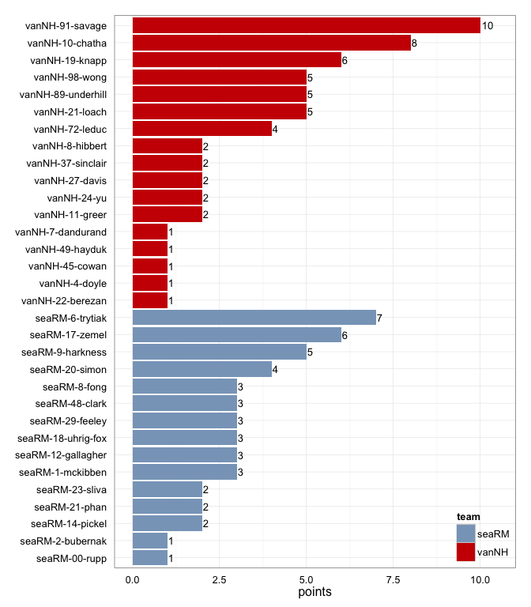
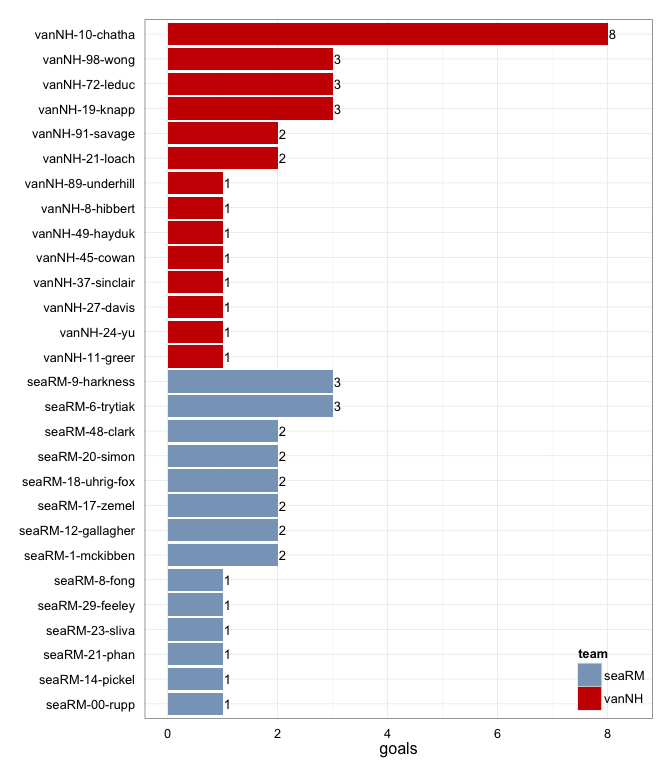
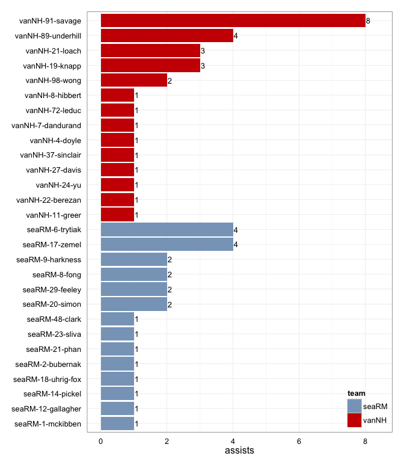
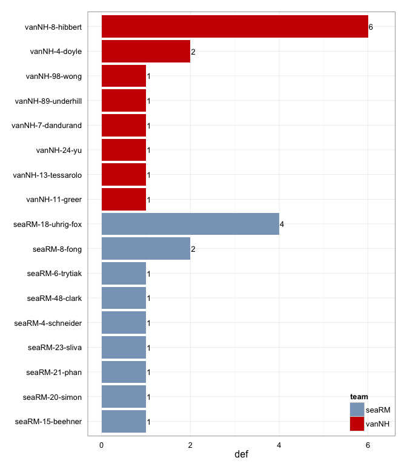

# vanNH at seaRM 2014-05-31

# vanNH 29
# seaRM 24
## game is complete

Go to ...  
  * [Scoring progression](#scoringProgression)  
  * [Player stats via figures](#pl_figs)  
  * [Player stats for vanNH](#away)  
  * [Player stats for seaRM](#home)  
  * [Data on goals, assists, D's](#selectData)  
  * [Full raw data](#rawData)  

## Scoring progression:

| point|period |begin    |end     |pt_duration |desc                                   |vanNH |seaRM |
|-----:|:------|:--------|:-------|:-----------|:--------------------------------------|:-----|:-----|
|    58|6      |0:10:08  |0:00:00 |00:10       |vanNH-37-sinclair to vanNH-49-hayduk   |29    |24    |
|    57|6      |1:24:00  |0:10:08 |01:14       |vanNH-4-doyle to vanNH-45-cowan        |28    |24    |
|    56|6      |3:10:00  |1:24:00 |01:46       |vanNH-11-greer to vanNH-8-hibbert      |27    |24    |
|    55|6      |4:08:00  |3:10:00 |00:58       |vanNH-91-savage to vanNH-10-chatha     |26    |24    |
|    54|6      |5:00:00  |4:08:00 |00:52       |vanNH-98-wong to vanNH-91-savage       |25    |24    |
|    53|5      |0:02:08  |0:00:00 |00:02       |- no goal -                            |24    |24    |
|    52|5      |2:17:00  |0:02:08 |02:15       |vanNH-19-knapp to vanNH-10-chatha      |24    |24    |
|    51|5      |2:40:00  |2:17:00 |00:23       |seaRM-9-harkness to seaRM-17-zemel     |23    |24    |
|    50|5      |4:32:00  |2:40:00 |01:52       |vanNH-19-knapp to vanNH-98-wong        |23    |23    |
|    49|5      |5:00:00  |4:32:00 |00:28       |seaRM-20-simon to seaRM-6-trytiak      |22    |23    |
|    48|4      |0:29:08  |0:00:00 |00:29       |- no goal -                            |22    |22    |
|    47|4      |1:04:00  |0:29:08 |00:35       |vanNH-91-savage to vanNH-89-underhill  |22    |22    |
|    46|4      |1:23:00  |1:04:00 |00:19       |seaRM-9-harkness to seaRM-48-clark     |21    |22    |
|    45|4      |1:47:00  |1:23:00 |00:24       |vanNH-21-loach to vanNH-91-savage      |21    |21    |
|    44|4      |2:15:00  |1:47:00 |00:28       |seaRM-14-pickel to seaRM-20-simon      |20    |21    |
|    43|4      |4:45:00  |2:15:00 |02:30       |vanNH-27-davis to vanNH-24-yu          |20    |20    |
|    42|4      |5:54:00  |4:45:00 |01:09       |seaRM-8-fong to seaRM-6-trytiak        |19    |20    |
|    41|4      |8:00:00  |5:54:00 |02:06       |vanNH-91-savage to vanNH-19-knapp      |19    |19    |
|    40|4      |9:34:00  |8:00:00 |01:34       |vanNH-91-savage to vanNH-10-chatha     |18    |19    |
|    39|4      |10:00:00 |9:34:00 |00:26       |seaRM-17-zemel to seaRM-9-harkness     |17    |19    |
|    38|3      |0:36:03  |0:00:00 |00:36       |- no goal -                            |17    |18    |
|    37|3      |1:55:00  |0:36:03 |01:19       |vanNH-89-underhill to vanNH-21-loach   |17    |18    |
|    36|3      |2:20:00  |1:55:00 |00:25       |seaRM-21-phan to seaRM-12-gallagher    |16    |18    |
|    35|3      |4:10:00  |2:20:00 |01:50       |seaRM-17-zemel to seaRM-1-mckibben     |16    |17    |
|    34|3      |5:38:00  |4:10:00 |01:28       |vanNH-89-underhill to vanNH-10-chatha  |16    |16    |
|    33|3      |6:02:00  |5:38:00 |00:24       |vanNH-98-wong to vanNH-72-leduc        |15    |16    |
|    32|3      |6:29:00  |6:02:00 |00:27       |seaRM-6-trytiak to seaRM-9-harkness    |14    |16    |
|    31|3      |6:54:00  |6:29:00 |00:25       |vanNH-19-knapp to vanNH-98-wong        |14    |15    |
|    30|3      |7:29:00  |6:54:00 |00:35       |seaRM-23-sliva to seaRM-18-uhrig-fox   |13    |15    |
|    29|3      |7:53:00  |7:29:00 |00:24       |seaRM-6-trytiak to seaRM-48-clark      |13    |14    |
|    28|3      |8:27:00  |7:53:00 |00:34       |vanNH-21-loach to vanNH-72-leduc       |13    |13    |
|    27|3      |10:00:00 |8:27:00 |01:33       |seaRM-12-gallagher to seaRM-21-phan    |12    |13    |
|    26|2      |0:08:04  |0:00:00 |00:08       |- no goal -                            |12    |12    |
|    25|2      |0:20:01  |0:08:04 |00:12       |vanNH-21-loach to vanNH-10-chatha      |12    |12    |
|    24|2      |0:45:01  |0:20:01 |00:25       |seaRM-17-zemel to seaRM-14-pickel      |11    |12    |
|    23|2      |2:04:00  |0:45:01 |01:19       |vanNH-91-savage to vanNH-21-loach      |11    |11    |
|    22|2      |3:40:00  |2:04:00 |01:36       |vanNH-7-dandurand to vanNH-27-davis    |10    |11    |
|    21|2      |3:59:00  |3:40:00 |00:19       |seaRM-8-fong to seaRM-17-zemel         |9     |11    |
|    20|2      |4:48:00  |3:59:00 |00:49       |vanNH-89-underhill to vanNH-10-chatha  |9     |10    |
|    19|2      |6:39:00  |4:48:00 |01:51       |seaRM-17-zemel to seaRM-6-trytiak      |8     |10    |
|    18|2      |7:01:00  |6:39:00 |00:22       |vanNH-72-leduc to vanNH-19-knapp       |8     |9     |
|    17|2      |8:15:00  |7:01:00 |01:14       |seaRM-18-uhrig-fox to seaRM-29-feeley  |7     |9     |
|    16|2      |9:21:00  |8:15:00 |01:06       |seaRM-29-feeley to seaRM-23-sliva      |7     |8     |
|    15|2      |10:00:00 |9:21:00 |00:39       |seaRM-1-mckibben to seaRM-00-rupp      |7     |7     |
|    14|1      |0:09:04  |0:00:00 |00:09       |- no goal -                            |7     |6     |
|    13|1      |1:16:00  |0:09:04 |01:07       |vanNH-91-savage to vanNH-19-knapp      |7     |6     |
|    12|1      |1:44:00  |1:16:00 |00:28       |seaRM-20-simon to seaRM-9-harkness     |6     |6     |
|    11|1      |2:08:00  |1:44:00 |00:24       |vanNH-89-underhill to vanNH-98-wong    |6     |5     |
|    10|1      |3:22:00  |2:08:00 |01:14       |seaRM-29-feeley to seaRM-18-uhrig-fox  |5     |5     |
|     9|1      |3:49:00  |3:22:00 |00:27       |seaRM-48-clark to seaRM-20-simon       |5     |4     |
|     8|1      |5:02:00  |3:49:00 |01:13       |vanNH-24-yu to vanNH-37-sinclair       |5     |3     |
|     7|1      |7:00:00  |5:02:00 |01:58       |vanNH-8-hibbert to vanNH-11-greer      |4     |3     |
|     6|1      |7:18:00  |7:00:00 |00:18       |vanNH-22-berezan to vanNH-10-chatha    |3     |3     |
|     5|1      |8:05:00  |7:18:00 |00:47       |seaRM-6-trytiak to seaRM-1-mckibben    |2     |3     |
|     4|1      |8:22:00  |8:05:00 |00:17       |vanNH-91-savage to vanNH-72-leduc      |2     |2     |
|     3|1      |9:09:00  |8:22:00 |00:47       |seaRM-2-bubernak to seaRM-12-gallagher |1     |2     |
|     2|1      |9:19:00  |9:09:00 |00:10       |seaRM-6-trytiak to seaRM-8-fong        |1     |1     |
|     1|1      |10:00:00 |9:19:00 |00:41       |vanNH-91-savage to vanNH-10-chatha     |1     |0     |

## Player stats via figures:

### Points = goals + assists

 

### Goals

 

### Assists

 

### D's
 

## Player stats for vanNH :

points = goals + assists  
tables sorted in decreasing order based on points (then goals, assists, Ds)  
Ds = total of plain ol' D's + interceptions (D), hand blocks (HB), and foot blocks (FB)  
stats are cumulative for this game

|   |player   |last       | points| comp_pct| goals| assists| throws| completions| catches| def| drop|
|:--|:--------|:----------|------:|--------:|-----:|-------:|------:|-----------:|-------:|---:|----:|
|22 |vanNH-91 |savage     |     10|     0.95|     2|       8|     58|          55|      52|   0|    0|
|23 |vanNH-10 |chatha     |      8|     0.86|     8|       0|     22|          19|      30|   0|    0|
|24 |vanNH-19 |knapp      |      6|     0.98|     3|       3|     50|          49|      41|   0|    1|
|25 |vanNH-98 |wong       |      5|     0.92|     3|       2|     25|          23|      28|   1|    0|
|26 |vanNH-21 |loach      |      5|     0.96|     2|       3|     25|          24|      27|   0|    0|
|27 |vanNH-89 |underhill  |      5|     0.95|     1|       4|     62|          59|      44|   1|    1|
|28 |vanNH-72 |leduc      |      4|     1.00|     3|       1|      3|           3|       6|   0|    0|
|29 |vanNH-8  |hibbert    |      2|     0.77|     1|       1|     13|          10|      11|   6|    0|
|30 |vanNH-11 |greer      |      2|     0.83|     1|       1|      6|           5|       6|   1|    0|
|31 |vanNH-24 |yu         |      2|     0.57|     1|       1|      7|           4|       3|   1|    0|
|32 |vanNH-27 |davis      |      2|     1.00|     1|       1|      3|           3|       4|   0|    0|
|33 |vanNH-37 |sinclair   |      2|     1.00|     1|       1|      3|           3|       4|   0|    0|
|34 |vanNH-45 |cowan      |      1|     1.00|     1|       0|      8|           8|       8|   0|    0|
|35 |vanNH-49 |hayduk     |      1|       NA|     1|       0|      0|           0|       1|   0|    0|
|36 |vanNH-4  |doyle      |      1|     1.00|     0|       1|      4|           4|       3|   2|    0|
|37 |vanNH-7  |dandurand  |      1|     1.00|     0|       1|      2|           2|       1|   1|    0|
|38 |vanNH-22 |berezan    |      1|     0.91|     0|       1|     23|          21|      23|   0|    0|
|39 |vanNH-13 |tessarolo  |      0|       NA|     0|       0|      0|           0|       0|   1|    0|
|40 |vanNH-   |?name?     |      0|       NA|     0|       0|      0|           0|       0|   0|    0|
|41 |vanNH-31 |saito      |      0|     0.33|     0|       0|      3|           1|       2|   0|    0|
|42 |vanNH-75 |bellavance |      0|     0.50|     0|       0|      2|           1|       0|   0|    0|
|43 |vanNH-81 |tejpar     |      0|     1.00|     0|       0|      1|           1|       1|   0|    0|

## Player stats for seaRM :

points = goals + assists  
tables sorted in decreasing order based on points (then goals, assists, Ds)  
Ds = total of plain ol' D's + interceptions (D), hand blocks (HB), and foot blocks (FB)  
stats are cumulative for this game

|   |player   |last      | points| comp_pct| goals| assists| throws| completions| catches| def| drop|
|:--|:--------|:---------|------:|--------:|-----:|-------:|------:|-----------:|-------:|---:|----:|
|1  |seaRM-6  |trytiak   |      7|     0.75|     3|       4|     24|          18|      27|   1|    1|
|2  |seaRM-17 |zemel     |      6|     0.91|     2|       4|     23|          21|      24|   0|    0|
|3  |seaRM-9  |harkness  |      5|     0.94|     3|       2|     16|          15|      19|   0|    0|
|4  |seaRM-20 |simon     |      4|     0.94|     2|       2|     33|          31|      29|   1|    0|
|5  |seaRM-18 |uhrig-fox |      3|     1.00|     2|       1|      5|           5|       7|   4|    0|
|6  |seaRM-48 |clark     |      3|     0.60|     2|       1|     10|           6|      11|   1|    0|
|7  |seaRM-1  |mckibben  |      3|     0.94|     2|       1|     51|          48|      41|   0|    0|
|8  |seaRM-12 |gallagher |      3|     1.00|     2|       1|      5|           5|       7|   0|    0|
|9  |seaRM-8  |fong      |      3|     0.82|     1|       2|     11|           9|      11|   2|    1|
|10 |seaRM-29 |feeley    |      3|     0.83|     1|       2|     30|          25|      18|   0|    0|
|11 |seaRM-21 |phan      |      2|     1.00|     1|       1|     13|          13|      14|   1|    0|
|12 |seaRM-23 |sliva     |      2|     1.00|     1|       1|      5|           5|       5|   1|    0|
|13 |seaRM-14 |pickel    |      2|     0.94|     1|       1|     18|          17|      15|   0|    0|
|14 |seaRM-00 |rupp      |      1|     0.96|     1|       0|     49|          47|      35|   0|    0|
|15 |seaRM-2  |bubernak  |      1|     1.00|     0|       1|      4|           4|       5|   0|    0|
|16 |seaRM-15 |beehner   |      0|     0.67|     0|       0|      3|           2|       3|   1|    0|
|17 |seaRM-4  |schneider |      0|     0.67|     0|       0|      3|           2|       2|   1|    0|
|18 |seaRM-   |?name?    |      0|       NA|     0|       0|      0|           0|       0|   0|    0|
|19 |seaRM-24 |duffel    |      0|     1.00|     0|       0|      2|           2|       2|   0|    0|
|20 |seaRM-51 |entz      |      0|     1.00|     0|       0|      3|           3|       3|   0|    0|
|21 |seaRM-77 |trotter   |      0|     1.00|     0|       0|      1|           1|       1|   0|    0|

## Raw data on select events (goals, assists, D's):

| point| period|pull_team | event| poss_abs| poss_rel|poss_team |pl_team |pl_pnum |pl_code |pl_lname  |player             | seaRM| vanNH|
|-----:|------:|:---------|-----:|--------:|--------:|:---------|:-------|:-------|:-------|:---------|:------------------|-----:|-----:|
|     1|      1|seaRM     |    10|        1|        1|vanNH     |vanNH   |91      |A       |savage    |vanNH-91-savage    |     0|     1|
|     1|      1|seaRM     |    11|        1|        1|vanNH     |vanNH   |10      |LG      |chatha    |vanNH-10-chatha    |     0|     1|
|     2|      1|vanNH     |     3|        2|        1|seaRM     |seaRM   |6       |A       |trytiak   |seaRM-6-trytiak    |     1|     1|
|     2|      1|vanNH     |     4|        2|        1|seaRM     |seaRM   |8       |LG      |fong      |seaRM-8-fong       |     1|     1|
|     3|      1|seaRM     |     6|        3|        1|vanNH     |seaRM   |18      |D       |uhrig-fox |seaRM-18-uhrig-fox |     2|     1|
|     3|      1|seaRM     |    11|        4|        2|seaRM     |seaRM   |2       |A       |bubernak  |seaRM-2-bubernak   |     2|     1|
|     3|      1|seaRM     |    13|        4|        2|seaRM     |seaRM   |12      |G       |gallagher |seaRM-12-gallagher |     2|     1|
|     4|      1|seaRM     |     5|        5|        1|vanNH     |vanNH   |91      |A       |savage    |vanNH-91-savage    |     2|     2|
|     4|      1|seaRM     |     6|        5|        1|vanNH     |vanNH   |72      |LG      |leduc     |vanNH-72-leduc     |     2|     2|
|     5|      1|vanNH     |    12|        6|        1|seaRM     |seaRM   |6       |A       |trytiak   |seaRM-6-trytiak    |     3|     2|
|     5|      1|vanNH     |    13|        6|        1|seaRM     |seaRM   |1       |G       |mckibben  |seaRM-1-mckibben   |     3|     2|
|     6|      1|seaRM     |     5|        7|        1|vanNH     |vanNH   |22      |A       |berezan   |vanNH-22-berezan   |     3|     3|
|     6|      1|seaRM     |     6|        7|        1|vanNH     |vanNH   |10      |LG      |chatha    |vanNH-10-chatha    |     3|     3|
|     7|      1|vanNH     |    24|        9|        2|vanNH     |vanNH   |8       |A       |hibbert   |vanNH-8-hibbert    |     3|     4|
|     7|      1|vanNH     |    25|        9|        2|vanNH     |vanNH   |11      |G       |greer     |vanNH-11-greer     |     3|     4|
|     8|      1|vanNH     |    13|       13|        4|vanNH     |vanNH   |24      |PUA     |yu        |vanNH-24-yu        |     3|     5|
|     8|      1|vanNH     |    14|       13|        4|vanNH     |vanNH   |37      |G       |sinclair  |vanNH-37-sinclair  |     3|     5|
|     9|      1|vanNH     |    11|       14|        1|seaRM     |seaRM   |48      |A       |clark     |seaRM-48-clark     |     4|     5|
|     9|      1|vanNH     |    12|       14|        1|seaRM     |seaRM   |20      |G       |simon     |seaRM-20-simon     |     4|     5|
|    10|      1|seaRM     |    13|       15|        1|vanNH     |seaRM   |18      |D       |uhrig-fox |seaRM-18-uhrig-fox |     5|     5|
|    10|      1|seaRM     |    19|       16|        2|seaRM     |seaRM   |29      |A       |feeley    |seaRM-29-feeley    |     5|     5|
|    10|      1|seaRM     |    20|       16|        2|seaRM     |seaRM   |18      |G       |uhrig-fox |seaRM-18-uhrig-fox |     5|     5|
|    11|      1|seaRM     |     8|       17|        1|vanNH     |vanNH   |89      |LA      |underhill |vanNH-89-underhill |     5|     6|
|    11|      1|seaRM     |     9|       17|        1|vanNH     |vanNH   |98      |G       |wong      |vanNH-98-wong      |     5|     6|
|    12|      1|vanNH     |     7|       18|        1|seaRM     |seaRM   |20      |A       |simon     |seaRM-20-simon     |     6|     6|
|    12|      1|vanNH     |     8|       18|        1|seaRM     |seaRM   |9       |LG      |harkness  |seaRM-9-harkness   |     6|     6|
|    13|      1|seaRM     |    15|       21|        3|vanNH     |vanNH   |91      |A       |savage    |vanNH-91-savage    |     6|     7|
|    13|      1|seaRM     |    16|       21|        3|vanNH     |vanNH   |19      |G       |knapp     |vanNH-19-knapp     |     6|     7|
|    14|      1|vanNH     |     5|       22|        1|seaRM     |vanNH   |8       |D       |hibbert   |vanNH-8-hibbert    |     6|     7|
|    15|      2|vanNH     |    10|       23|        1|seaRM     |seaRM   |1       |LA      |mckibben  |seaRM-1-mckibben   |     7|     7|
|    15|      2|vanNH     |    11|       23|        1|seaRM     |seaRM   |00      |G       |rupp      |seaRM-00-rupp      |     7|     7|
|    16|      2|seaRM     |    11|       25|        2|seaRM     |seaRM   |29      |A       |feeley    |seaRM-29-feeley    |     8|     7|
|    16|      2|seaRM     |    12|       25|        2|seaRM     |seaRM   |23      |G       |sliva     |seaRM-23-sliva     |     8|     7|
|    17|      2|seaRM     |    14|       27|        2|seaRM     |seaRM   |18      |A       |uhrig-fox |seaRM-18-uhrig-fox |     9|     7|
|    17|      2|seaRM     |    15|       27|        2|seaRM     |seaRM   |29      |G       |feeley    |seaRM-29-feeley    |     9|     7|
|    18|      2|seaRM     |     8|       28|        1|vanNH     |vanNH   |72      |A       |leduc     |vanNH-72-leduc     |     9|     8|
|    18|      2|seaRM     |     9|       28|        1|vanNH     |vanNH   |19      |G       |knapp     |vanNH-19-knapp     |     9|     8|
|    19|      2|vanNH     |    19|       31|        3|seaRM     |seaRM   |17      |A       |zemel     |seaRM-17-zemel     |    10|     8|
|    19|      2|vanNH     |    20|       31|        3|seaRM     |seaRM   |6       |G       |trytiak   |seaRM-6-trytiak    |    10|     8|
|    20|      2|seaRM     |    13|       32|        1|vanNH     |vanNH   |89      |A       |underhill |vanNH-89-underhill |    10|     9|
|    20|      2|seaRM     |    14|       32|        1|vanNH     |vanNH   |10      |G       |chatha    |vanNH-10-chatha    |    10|     9|
|    21|      2|vanNH     |     5|       33|        1|seaRM     |seaRM   |8       |A       |fong      |seaRM-8-fong       |    11|     9|
|    21|      2|vanNH     |     6|       33|        1|seaRM     |seaRM   |17      |G       |zemel     |seaRM-17-zemel     |    11|     9|
|    22|      2|seaRM     |    23|       36|        3|vanNH     |vanNH   |7       |A       |dandurand |vanNH-7-dandurand  |    11|    10|
|    22|      2|seaRM     |    24|       36|        3|vanNH     |vanNH   |27      |G       |davis     |vanNH-27-davis     |    11|    10|
|    23|      2|vanNH     |     7|       37|        1|seaRM     |vanNH   |4       |D       |doyle     |vanNH-4-doyle      |    11|    11|
|    23|      2|vanNH     |    18|       38|        2|vanNH     |vanNH   |91      |A       |savage    |vanNH-91-savage    |    11|    11|
|    23|      2|vanNH     |    19|       38|        2|vanNH     |vanNH   |21      |G       |loach     |vanNH-21-loach     |    11|    11|
|    24|      2|vanNH     |     8|       39|        1|seaRM     |seaRM   |17      |A       |zemel     |seaRM-17-zemel     |    12|    11|
|    24|      2|vanNH     |     9|       39|        1|seaRM     |seaRM   |14      |G       |pickel    |seaRM-14-pickel    |    12|    11|
|    25|      2|seaRM     |     4|       40|        1|vanNH     |vanNH   |21      |A       |loach     |vanNH-21-loach     |    12|    12|
|    25|      2|seaRM     |     5|       40|        1|vanNH     |vanNH   |10      |LG      |chatha    |vanNH-10-chatha    |    12|    12|
|    26|      2|vanNH     |     5|       41|        1|seaRM     |vanNH   |8       |D       |hibbert   |vanNH-8-hibbert    |    12|    12|
|    27|      3|seaRM     |    13|       42|        1|vanNH     |seaRM   |15      |D       |beehner   |seaRM-15-beehner   |    13|    12|
|    27|      3|seaRM     |    21|       43|        2|seaRM     |seaRM   |12      |A       |gallagher |seaRM-12-gallagher |    13|    12|
|    27|      3|seaRM     |    22|       43|        2|seaRM     |seaRM   |21      |G       |phan      |seaRM-21-phan      |    13|    12|
|    28|      3|seaRM     |     8|       44|        1|vanNH     |vanNH   |21      |A       |loach     |vanNH-21-loach     |    13|    13|
|    28|      3|seaRM     |     9|       44|        1|vanNH     |vanNH   |72      |LG      |leduc     |vanNH-72-leduc     |    13|    13|
|    29|      3|vanNH     |     8|       45|        1|seaRM     |seaRM   |6       |A       |trytiak   |seaRM-6-trytiak    |    14|    13|
|    29|      3|vanNH     |     9|       45|        1|seaRM     |seaRM   |48      |LG      |clark     |seaRM-48-clark     |    14|    13|
|    30|      3|seaRM     |     6|       46|        1|vanNH     |seaRM   |18      |D       |uhrig-fox |seaRM-18-uhrig-fox |    15|    13|
|    30|      3|seaRM     |    10|       47|        2|seaRM     |seaRM   |23      |LA      |sliva     |seaRM-23-sliva     |    15|    13|
|    30|      3|seaRM     |    11|       47|        2|seaRM     |seaRM   |18      |G       |uhrig-fox |seaRM-18-uhrig-fox |    15|    13|
|    31|      3|seaRM     |     7|       48|        1|vanNH     |vanNH   |19      |A       |knapp     |vanNH-19-knapp     |    15|    14|
|    31|      3|seaRM     |     8|       48|        1|vanNH     |vanNH   |98      |G       |wong      |vanNH-98-wong      |    15|    14|
|    32|      3|vanNH     |     8|       49|        1|seaRM     |seaRM   |6       |LA      |trytiak   |seaRM-6-trytiak    |    16|    14|
|    32|      3|vanNH     |     9|       49|        1|seaRM     |seaRM   |9       |G       |harkness  |seaRM-9-harkness   |    16|    14|
|    33|      3|seaRM     |     8|       50|        1|vanNH     |vanNH   |98      |A       |wong      |vanNH-98-wong      |    16|    15|
|    33|      3|seaRM     |     9|       50|        1|vanNH     |vanNH   |72      |G       |leduc     |vanNH-72-leduc     |    16|    15|
|    34|      3|vanNH     |     7|       51|        1|seaRM     |vanNH   |13      |D       |tessarolo |vanNH-13-tessarolo |    16|    16|
|    34|      3|vanNH     |    21|       54|        4|vanNH     |vanNH   |89      |A       |underhill |vanNH-89-underhill |    16|    16|
|    34|      3|vanNH     |    22|       54|        4|vanNH     |vanNH   |10      |G       |chatha    |vanNH-10-chatha    |    16|    16|
|    35|      3|vanNH     |    15|       56|        2|vanNH     |seaRM   |4       |D       |schneider |seaRM-4-schneider  |    17|    16|
|    35|      3|vanNH     |    21|       57|        3|seaRM     |seaRM   |17      |A       |zemel     |seaRM-17-zemel     |    17|    16|
|    35|      3|vanNH     |    22|       57|        3|seaRM     |seaRM   |1       |G       |mckibben  |seaRM-1-mckibben   |    17|    16|
|    36|      3|seaRM     |     4|       58|        1|vanNH     |seaRM   |23      |D       |sliva     |seaRM-23-sliva     |    18|    16|
|    36|      3|seaRM     |     8|       59|        2|seaRM     |seaRM   |21      |A       |phan      |seaRM-21-phan      |    18|    16|
|    36|      3|seaRM     |     9|       59|        2|seaRM     |seaRM   |12      |G       |gallagher |seaRM-12-gallagher |    18|    16|
|    37|      3|seaRM     |    12|       61|        2|seaRM     |vanNH   |98      |D       |wong      |vanNH-98-wong      |    18|    17|
|    37|      3|seaRM     |    20|       62|        3|vanNH     |vanNH   |89      |A       |underhill |vanNH-89-underhill |    18|    17|
|    37|      3|seaRM     |    21|       62|        3|vanNH     |vanNH   |21      |G       |loach     |vanNH-21-loach     |    18|    17|
|    38|      3|vanNH     |     9|       63|        1|seaRM     |vanNH   |8       |D       |hibbert   |vanNH-8-hibbert    |    18|    17|
|    38|      3|vanNH     |    11|       64|        2|vanNH     |seaRM   |8       |HB      |fong      |seaRM-8-fong       |    18|    17|
|    39|      4|vanNH     |     9|       65|        1|seaRM     |seaRM   |17      |A       |zemel     |seaRM-17-zemel     |    19|    17|
|    39|      4|vanNH     |    10|       65|        1|seaRM     |seaRM   |9       |LG      |harkness  |seaRM-9-harkness   |    19|    17|
|    40|      4|seaRM     |    11|       66|        1|vanNH     |seaRM   |18      |D       |uhrig-fox |seaRM-18-uhrig-fox |    19|    18|
|    40|      4|seaRM     |    25|       68|        3|vanNH     |vanNH   |91      |A       |savage    |vanNH-91-savage    |    19|    18|
|    40|      4|seaRM     |    26|       68|        3|vanNH     |vanNH   |10      |G       |chatha    |vanNH-10-chatha    |    19|    18|
|    41|      4|vanNH     |     7|       69|        1|seaRM     |vanNH   |8       |D       |hibbert   |vanNH-8-hibbert    |    19|    19|
|    41|      4|vanNH     |    17|       71|        3|seaRM     |vanNH   |8       |D       |hibbert   |vanNH-8-hibbert    |    19|    19|
|    41|      4|vanNH     |    28|       72|        4|vanNH     |vanNH   |91      |A       |savage    |vanNH-91-savage    |    19|    19|
|    41|      4|vanNH     |    29|       72|        4|vanNH     |vanNH   |19      |G       |knapp     |vanNH-19-knapp     |    19|    19|
|    42|      4|vanNH     |    12|       73|        1|seaRM     |vanNH   |11      |D       |greer     |vanNH-11-greer     |    20|    19|
|    42|      4|vanNH     |    16|       74|        2|vanNH     |seaRM   |8       |D       |fong      |seaRM-8-fong       |    20|    19|
|    42|      4|vanNH     |    17|       75|        3|seaRM     |seaRM   |8       |PUA     |fong      |seaRM-8-fong       |    20|    19|
|    42|      4|vanNH     |    18|       75|        3|seaRM     |seaRM   |6       |G       |trytiak   |seaRM-6-trytiak    |    20|    19|
|    43|      4|seaRM     |    23|       78|        3|vanNH     |vanNH   |27      |A       |davis     |vanNH-27-davis     |    20|    20|
|    43|      4|seaRM     |    24|       78|        3|vanNH     |vanNH   |24      |G       |yu        |vanNH-24-yu        |    20|    20|
|    44|      4|vanNH     |    10|       79|        1|seaRM     |seaRM   |14      |A       |pickel    |seaRM-14-pickel    |    21|    20|
|    44|      4|vanNH     |    11|       79|        1|seaRM     |seaRM   |20      |LG      |simon     |seaRM-20-simon     |    21|    20|
|    45|      4|seaRM     |     4|       80|        1|vanNH     |vanNH   |21      |A       |loach     |vanNH-21-loach     |    21|    21|
|    45|      4|seaRM     |     5|       80|        1|vanNH     |vanNH   |91      |LG      |savage    |vanNH-91-savage    |    21|    21|
|    46|      4|vanNH     |     8|       81|        1|seaRM     |seaRM   |9       |A       |harkness  |seaRM-9-harkness   |    22|    21|
|    46|      4|vanNH     |     9|       81|        1|seaRM     |seaRM   |48      |G       |clark     |seaRM-48-clark     |    22|    21|
|    47|      4|seaRM     |    13|       82|        1|vanNH     |vanNH   |91      |A       |savage    |vanNH-91-savage    |    22|    22|
|    47|      4|seaRM     |    14|       82|        1|vanNH     |vanNH   |89      |G       |underhill |vanNH-89-underhill |    22|    22|
|    48|      4|vanNH     |     9|       83|        1|seaRM     |vanNH   |8       |D       |hibbert   |vanNH-8-hibbert    |    22|    22|
|    48|      4|vanNH     |    11|       84|        2|vanNH     |seaRM   |6       |D       |trytiak   |seaRM-6-trytiak    |    22|    22|
|    49|      5|vanNH     |     6|       85|        1|seaRM     |seaRM   |20      |A       |simon     |seaRM-20-simon     |    23|    22|
|    49|      5|vanNH     |     7|       85|        1|seaRM     |seaRM   |6       |G       |trytiak   |seaRM-6-trytiak    |    23|    22|
|    50|      5|seaRM     |    10|       86|        1|vanNH     |seaRM   |21      |D       |phan      |seaRM-21-phan      |    23|    23|
|    50|      5|seaRM     |    14|       87|        2|seaRM     |vanNH   |89      |D       |underhill |vanNH-89-underhill |    23|    23|
|    50|      5|seaRM     |    24|       88|        3|vanNH     |vanNH   |19      |A       |knapp     |vanNH-19-knapp     |    23|    23|
|    50|      5|seaRM     |    25|       88|        3|vanNH     |vanNH   |98      |G       |wong      |vanNH-98-wong      |    23|    23|
|    51|      5|vanNH     |     6|       89|        1|seaRM     |seaRM   |9       |A       |harkness  |seaRM-9-harkness   |    24|    23|
|    51|      5|vanNH     |     7|       89|        1|seaRM     |seaRM   |17      |G       |zemel     |seaRM-17-zemel     |    24|    23|
|    52|      5|seaRM     |    40|       92|        3|vanNH     |vanNH   |19      |A       |knapp     |vanNH-19-knapp     |    24|    24|
|    52|      5|seaRM     |    41|       92|        3|vanNH     |vanNH   |10      |G       |chatha    |vanNH-10-chatha    |    24|    24|
|    53|      5|vanNH     |    NA|       NA|       NA|NA        |NA      |NA      |NA      |NA        |NA-NA-NA           |    24|    24|
|    54|      6|seaRM     |    13|       94|        1|vanNH     |vanNH   |98      |A       |wong      |vanNH-98-wong      |    24|    25|
|    54|      6|seaRM     |    14|       94|        1|vanNH     |vanNH   |91      |G       |savage    |vanNH-91-savage    |    24|    25|
|    55|      6|vanNH     |     8|       95|        1|seaRM     |vanNH   |24      |D       |yu        |vanNH-24-yu        |    24|    26|
|    55|      6|vanNH     |    13|       96|        2|vanNH     |vanNH   |91      |A       |savage    |vanNH-91-savage    |    24|    26|
|    55|      6|vanNH     |    14|       96|        2|vanNH     |vanNH   |10      |G       |chatha    |vanNH-10-chatha    |    24|    26|
|    56|      6|vanNH     |     9|       98|        2|vanNH     |seaRM   |48      |D       |clark     |seaRM-48-clark     |    24|    27|
|    56|      6|vanNH     |    14|       99|        3|seaRM     |vanNH   |4       |D       |doyle     |vanNH-4-doyle      |    24|    27|
|    56|      6|vanNH     |    19|      100|        4|vanNH     |seaRM   |20      |D       |simon     |seaRM-20-simon     |    24|    27|
|    56|      6|vanNH     |    21|      101|        5|seaRM     |vanNH   |7       |D       |dandurand |vanNH-7-dandurand  |    24|    27|
|    56|      6|vanNH     |    23|      102|        6|vanNH     |vanNH   |11      |A       |greer     |vanNH-11-greer     |    24|    27|
|    56|      6|vanNH     |    24|      102|        6|vanNH     |vanNH   |8       |G       |hibbert   |vanNH-8-hibbert    |    24|    27|
|    57|      6|vanNH     |    18|      106|        4|vanNH     |vanNH   |4       |A       |doyle     |vanNH-4-doyle      |    24|    28|
|    57|      6|vanNH     |    19|      106|        4|vanNH     |vanNH   |45      |G       |cowan     |vanNH-45-cowan     |    24|    28|
|    58|      6|vanNH     |     5|      108|        2|vanNH     |vanNH   |37      |A       |sinclair  |vanNH-37-sinclair  |    24|    29|
|    58|      6|vanNH     |     6|      108|        2|vanNH     |vanNH   |49      |G       |hayduk    |vanNH-49-hayduk    |    24|    29|

## Full raw data:

__Note: just for display purposes.__ Raw data in more useful forms can be found in the [GitHub repository](https://github.com/jennybc/vanNH). Find the game you're interested in in the `games` subdirectory.

| period| point|pull_team | event| poss_abs| poss_rel|poss_team |pl_team |pl_pnum |pl_code |
|------:|-----:|:---------|-----:|--------:|--------:|:---------|:-------|:-------|:-------|
|      1|     1|seaRM     |     1|        1|        1|vanNH     |seaRM   |18      |P       |
|      1|     1|seaRM     |     2|        1|        1|vanNH     |vanNH   |19      |PU      |
|      1|     1|seaRM     |     3|        1|        1|vanNH     |vanNH   |89      |        |
|      1|     1|seaRM     |     4|        1|        1|vanNH     |vanNH   |21      |        |
|      1|     1|seaRM     |     5|        1|        1|vanNH     |vanNH   |89      |        |
|      1|     1|seaRM     |     6|        1|        1|vanNH     |vanNH   |91      |        |
|      1|     1|seaRM     |     7|        1|        1|vanNH     |vanNH   |89      |        |
|      1|     1|seaRM     |     8|        1|        1|vanNH     |vanNH   |21      |        |
|      1|     1|seaRM     |     9|        1|        1|vanNH     |vanNH   |98      |        |
|      1|     1|seaRM     |    10|        1|        1|vanNH     |vanNH   |91      |A       |
|      1|     1|seaRM     |    11|        1|        1|vanNH     |vanNH   |10      |LG      |
|      1|     2|vanNH     |     1|        2|        1|seaRM     |vanNH   |8       |OBP     |
|      1|     2|vanNH     |     2|        2|        1|seaRM     |seaRM   |1       |PU      |
|      1|     2|vanNH     |     3|        2|        1|seaRM     |seaRM   |6       |A       |
|      1|     2|vanNH     |     4|        2|        1|seaRM     |seaRM   |8       |LG      |
|      1|     3|seaRM     |     1|        3|        1|vanNH     |seaRM   |18      |P       |
|      1|     3|seaRM     |     2|        3|        1|vanNH     |vanNH   |19      |PU      |
|      1|     3|seaRM     |     3|        3|        1|vanNH     |vanNH   |91      |        |
|      1|     3|seaRM     |     4|        3|        1|vanNH     |vanNH   |19      |        |
|      1|     3|seaRM     |     5|        3|        1|vanNH     |vanNH   |22      |        |
|      1|     3|seaRM     |     6|        3|        1|vanNH     |seaRM   |18      |D       |
|      1|     3|seaRM     |     7|        4|        2|seaRM     |seaRM   |29      |PU      |
|      1|     3|seaRM     |     8|        4|        2|seaRM     |seaRM   |21      |        |
|      1|     3|seaRM     |     9|        4|        2|seaRM     |seaRM   |29      |        |
|      1|     3|seaRM     |    10|        4|        2|seaRM     |seaRM   |21      |        |
|      1|     3|seaRM     |    11|        4|        2|seaRM     |seaRM   |2       |A       |
|      1|     3|seaRM     |    12|        4|        2|seaRM     |vanNH   |89      |F       |
|      1|     3|seaRM     |    13|        4|        2|seaRM     |seaRM   |12      |G       |
|      1|     4|seaRM     |     1|        5|        1|vanNH     |seaRM   |24      |P       |
|      1|     4|seaRM     |     2|        5|        1|vanNH     |vanNH   |19      |PU      |
|      1|     4|seaRM     |     3|        5|        1|vanNH     |vanNH   |89      |        |
|      1|     4|seaRM     |     4|        5|        1|vanNH     |vanNH   |21      |        |
|      1|     4|seaRM     |     5|        5|        1|vanNH     |vanNH   |91      |A       |
|      1|     4|seaRM     |     6|        5|        1|vanNH     |vanNH   |72      |LG      |
|      1|     5|vanNH     |     1|        6|        1|seaRM     |vanNH   |8       |P       |
|      1|     5|vanNH     |     2|        6|        1|seaRM     |seaRM   |00      |PU      |
|      1|     5|vanNH     |     3|        6|        1|seaRM     |seaRM   |1       |        |
|      1|     5|vanNH     |     4|        6|        1|seaRM     |seaRM   |6       |        |
|      1|     5|vanNH     |     5|        6|        1|seaRM     |seaRM   |00      |        |
|      1|     5|vanNH     |     6|        6|        1|seaRM     |seaRM   |17      |        |
|      1|     5|vanNH     |     7|        6|        1|seaRM     |seaRM   |14      |        |
|      1|     5|vanNH     |     8|        6|        1|seaRM     |seaRM   |00      |        |
|      1|     5|vanNH     |     9|        6|        1|seaRM     |seaRM   |17      |        |
|      1|     5|vanNH     |    10|        6|        1|seaRM     |seaRM   |6       |L       |
|      1|     5|vanNH     |    11|        6|        1|seaRM     |seaRM   |8       |        |
|      1|     5|vanNH     |    12|        6|        1|seaRM     |seaRM   |6       |A       |
|      1|     5|vanNH     |    13|        6|        1|seaRM     |seaRM   |1       |G       |
|      1|     6|seaRM     |     1|        7|        1|vanNH     |seaRM   |18      |P       |
|      1|     6|seaRM     |     2|        7|        1|vanNH     |vanNH   |89      |PU      |
|      1|     6|seaRM     |     3|        7|        1|vanNH     |vanNH   |91      |        |
|      1|     6|seaRM     |     4|        7|        1|vanNH     |vanNH   |98      |        |
|      1|     6|seaRM     |     5|        7|        1|vanNH     |vanNH   |22      |A       |
|      1|     6|seaRM     |     6|        7|        1|vanNH     |vanNH   |10      |LG      |
|      1|     7|vanNH     |     1|        8|        1|seaRM     |vanNH   |8       |P       |
|      1|     7|vanNH     |     2|        8|        1|seaRM     |seaRM   |00      |PU      |
|      1|     7|vanNH     |     3|        8|        1|seaRM     |seaRM   |20      |        |
|      1|     7|vanNH     |     4|        8|        1|seaRM     |seaRM   |48      |        |
|      1|     7|vanNH     |     5|        8|        1|seaRM     |seaRM   |20      |        |
|      1|     7|vanNH     |     6|        8|        1|seaRM     |seaRM   |00      |        |
|      1|     7|vanNH     |     7|        8|        1|seaRM     |seaRM   |1       |        |
|      1|     7|vanNH     |     8|        8|        1|seaRM     |seaRM   |20      |        |
|      1|     7|vanNH     |     9|        8|        1|seaRM     |seaRM   |1       |        |
|      1|     7|vanNH     |    10|        8|        1|seaRM     |seaRM   |00      |        |
|      1|     7|vanNH     |    11|        8|        1|seaRM     |seaRM   |17      |        |
|      1|     7|vanNH     |    12|        8|        1|seaRM     |seaRM   |00      |        |
|      1|     7|vanNH     |    13|        8|        1|seaRM     |seaRM   |6       |        |
|      1|     7|vanNH     |    14|        8|        1|seaRM     |seaRM   |48      |TD      |
|      1|     7|vanNH     |    15|        9|        2|vanNH     |vanNH   |24      |PU      |
|      1|     7|vanNH     |    16|        9|        2|vanNH     |vanNH   |8       |        |
|      1|     7|vanNH     |    17|        9|        2|vanNH     |vanNH   |27      |        |
|      1|     7|vanNH     |    18|        9|        2|vanNH     |vanNH   |11      |        |
|      1|     7|vanNH     |    19|        9|        2|vanNH     |vanNH   |8       |        |
|      1|     7|vanNH     |    20|        9|        2|vanNH     |vanNH   |4       |        |
|      1|     7|vanNH     |    21|        9|        2|vanNH     |vanNH   |45      |        |
|      1|     7|vanNH     |    22|        9|        2|vanNH     |vanNH   |27      |        |
|      1|     7|vanNH     |    23|        9|        2|vanNH     |vanNH   |45      |        |
|      1|     7|vanNH     |    24|        9|        2|vanNH     |vanNH   |8       |A       |
|      1|     7|vanNH     |    25|        9|        2|vanNH     |vanNH   |11      |G       |
|      1|     8|vanNH     |     1|       10|        1|seaRM     |vanNH   |37      |P       |
|      1|     8|vanNH     |     2|       10|        1|seaRM     |seaRM   |00      |PU      |
|      1|     8|vanNH     |     3|       10|        1|seaRM     |seaRM   |1       |        |
|      1|     8|vanNH     |     4|       10|        1|seaRM     |seaRM   |14      |        |
|      1|     8|vanNH     |     5|       10|        1|seaRM     |seaRM   |00      |        |
|      1|     8|vanNH     |     6|       10|        1|seaRM     |seaRM   |17      |        |
|      1|     8|vanNH     |     7|       10|        1|seaRM     |seaRM   |8       |        |
|      1|     8|vanNH     |     8|       11|        2|vanNH     |vanNH   |75      |PU      |
|      1|     8|vanNH     |     9|       11|        2|vanNH     |vanNH   |37      |        |
|      1|     8|vanNH     |    10|       11|        2|vanNH     |vanNH   |24      |        |
|      1|     8|vanNH     |    11|       12|        3|seaRM     |seaRM   |17      |PU      |
|      1|     8|vanNH     |    12|       12|        3|seaRM     |seaRM   |14      |        |
|      1|     8|vanNH     |    13|       13|        4|vanNH     |vanNH   |24      |PUA     |
|      1|     8|vanNH     |    14|       13|        4|vanNH     |vanNH   |37      |G       |
|      1|     9|vanNH     |     1|       14|        1|seaRM     |vanNH   |8       |P       |
|      1|     9|vanNH     |     2|       14|        1|seaRM     |seaRM   |00      |PU      |
|      1|     9|vanNH     |     3|       14|        1|seaRM     |seaRM   |17      |        |
|      1|     9|vanNH     |     4|       14|        1|seaRM     |seaRM   |00      |        |
|      1|     9|vanNH     |     5|       14|        1|seaRM     |seaRM   |6       |        |
|      1|     9|vanNH     |     6|       14|        1|seaRM     |seaRM   |00      |        |
|      1|     9|vanNH     |     7|       14|        1|seaRM     |seaRM   |6       |        |
|      1|     9|vanNH     |     8|       14|        1|seaRM     |seaRM   |20      |        |
|      1|     9|vanNH     |     9|       14|        1|seaRM     |seaRM   |17      |        |
|      1|     9|vanNH     |    10|       14|        1|seaRM     |seaRM   |00      |        |
|      1|     9|vanNH     |    11|       14|        1|seaRM     |seaRM   |48      |A       |
|      1|     9|vanNH     |    12|       14|        1|seaRM     |seaRM   |20      |G       |
|      1|    10|seaRM     |     1|       15|        1|vanNH     |seaRM   |18      |OBP     |
|      1|    10|seaRM     |     2|       15|        1|vanNH     |vanNH   |91      |PU      |
|      1|    10|seaRM     |     3|       15|        1|vanNH     |vanNH   |19      |        |
|      1|    10|seaRM     |     4|       15|        1|vanNH     |vanNH   |19      |F       |
|      1|    10|seaRM     |     5|       15|        1|vanNH     |vanNH   |89      |        |
|      1|    10|seaRM     |     6|       15|        1|vanNH     |vanNH   |19      |        |
|      1|    10|seaRM     |     7|       15|        1|vanNH     |vanNH   |91      |        |
|      1|    10|seaRM     |     8|       15|        1|vanNH     |vanNH   |19      |        |
|      1|    10|seaRM     |     9|       15|        1|vanNH     |vanNH   |21      |        |
|      1|    10|seaRM     |    10|       15|        1|vanNH     |vanNH   |22      |        |
|      1|    10|seaRM     |    11|       15|        1|vanNH     |vanNH   |89      |        |
|      1|    10|seaRM     |    12|       15|        1|vanNH     |vanNH   |91      |        |
|      1|    10|seaRM     |    13|       15|        1|vanNH     |seaRM   |18      |D       |
|      1|    10|seaRM     |    14|       16|        2|seaRM     |seaRM   |23      |PU      |
|      1|    10|seaRM     |    15|       16|        2|seaRM     |seaRM   |15      |        |
|      1|    10|seaRM     |    16|       16|        2|seaRM     |seaRM   |29      |        |
|      1|    10|seaRM     |    17|       16|        2|seaRM     |seaRM   |18      |        |
|      1|    10|seaRM     |    18|       16|        2|seaRM     |seaRM   |2       |L       |
|      1|    10|seaRM     |    19|       16|        2|seaRM     |seaRM   |29      |A       |
|      1|    10|seaRM     |    20|       16|        2|seaRM     |seaRM   |18      |G       |
|      1|    11|seaRM     |     1|       17|        1|vanNH     |seaRM   |24      |P       |
|      1|    11|seaRM     |     2|       17|        1|vanNH     |vanNH   |19      |PU      |
|      1|    11|seaRM     |     3|       17|        1|vanNH     |vanNH   |91      |        |
|      1|    11|seaRM     |     4|       17|        1|vanNH     |vanNH   |22      |        |
|      1|    11|seaRM     |     5|       17|        1|vanNH     |vanNH   |89      |        |
|      1|    11|seaRM     |     6|       17|        1|vanNH     |vanNH   |21      |        |
|      1|    11|seaRM     |     7|       17|        1|vanNH     |vanNH   |10      |        |
|      1|    11|seaRM     |     8|       17|        1|vanNH     |vanNH   |89      |LA      |
|      1|    11|seaRM     |     9|       17|        1|vanNH     |vanNH   |98      |G       |
|      1|    12|vanNH     |     1|       18|        1|seaRM     |vanNH   |8       |OBP     |
|      1|    12|vanNH     |     2|       18|        1|seaRM     |seaRM   |20      |PU      |
|      1|    12|vanNH     |     3|       18|        1|seaRM     |seaRM   |00      |        |
|      1|    12|vanNH     |     4|       18|        1|seaRM     |seaRM   |8       |        |
|      1|    12|vanNH     |     5|       18|        1|seaRM     |seaRM   |20      |        |
|      1|    12|vanNH     |     6|       18|        1|seaRM     |seaRM   |00      |        |
|      1|    12|vanNH     |     7|       18|        1|seaRM     |seaRM   |20      |A       |
|      1|    12|vanNH     |     8|       18|        1|seaRM     |seaRM   |9       |LG      |
|      1|    13|seaRM     |     1|       19|        1|vanNH     |seaRM   |18      |P       |
|      1|    13|seaRM     |     2|       19|        1|vanNH     |vanNH   |89      |PU      |
|      1|    13|seaRM     |     3|       19|        1|vanNH     |vanNH   |19      |        |
|      1|    13|seaRM     |     4|       19|        1|vanNH     |vanNH   |21      |TD      |
|      1|    13|seaRM     |     5|       20|        2|seaRM     |seaRM   |29      |PU      |
|      1|    13|seaRM     |     6|       21|        3|vanNH     |vanNH   |91      |PU      |
|      1|    13|seaRM     |     7|       21|        3|vanNH     |vanNH   |89      |        |
|      1|    13|seaRM     |     8|       21|        3|vanNH     |vanNH   |19      |        |
|      1|    13|seaRM     |     9|       21|        3|vanNH     |vanNH   |21      |        |
|      1|    13|seaRM     |    10|       21|        3|vanNH     |vanNH   |98      |        |
|      1|    13|seaRM     |    11|       21|        3|vanNH     |vanNH   |22      |        |
|      1|    13|seaRM     |    12|       21|        3|vanNH     |vanNH   |89      |        |
|      1|    13|seaRM     |    13|       21|        3|vanNH     |vanNH   |19      |        |
|      1|    13|seaRM     |    14|       21|        3|vanNH     |vanNH   |89      |        |
|      1|    13|seaRM     |    15|       21|        3|vanNH     |vanNH   |91      |A       |
|      1|    13|seaRM     |    16|       21|        3|vanNH     |vanNH   |19      |G       |
|      1|    14|vanNH     |     1|       22|        1|seaRM     |vanNH   |8       |P       |
|      1|    14|vanNH     |     2|       22|        1|seaRM     |seaRM   |14      |PU      |
|      1|    14|vanNH     |     3|       22|        1|seaRM     |seaRM   |1       |        |
|      1|    14|vanNH     |     4|       22|        1|seaRM     |seaRM   |6       |        |
|      1|    14|vanNH     |     5|       22|        1|seaRM     |vanNH   |8       |D       |
|      2|    15|vanNH     |     1|       23|        1|seaRM     |vanNH   |8       |P       |
|      2|    15|vanNH     |     2|       23|        1|seaRM     |seaRM   |00      |PU      |
|      2|    15|vanNH     |     3|       23|        1|seaRM     |seaRM   |1       |        |
|      2|    15|vanNH     |     4|       23|        1|seaRM     |seaRM   |9       |        |
|      2|    15|vanNH     |     5|       23|        1|seaRM     |seaRM   |1       |        |
|      2|    15|vanNH     |     6|       23|        1|seaRM     |seaRM   |20      |        |
|      2|    15|vanNH     |     7|       23|        1|seaRM     |seaRM   |00      |        |
|      2|    15|vanNH     |     8|       23|        1|seaRM     |seaRM   |9       |        |
|      2|    15|vanNH     |     9|       23|        1|seaRM     |seaRM   |6       |        |
|      2|    15|vanNH     |    10|       23|        1|seaRM     |seaRM   |1       |LA      |
|      2|    15|vanNH     |    11|       23|        1|seaRM     |seaRM   |00      |G       |
|      2|    16|seaRM     |     1|       24|        1|vanNH     |seaRM   |29      |P       |
|      2|    16|seaRM     |     2|       24|        1|vanNH     |vanNH   |89      |PU      |
|      2|    16|seaRM     |     3|       24|        1|vanNH     |vanNH   |91      |        |
|      2|    16|seaRM     |     4|       24|        1|vanNH     |vanNH   |10      |        |
|      2|    16|seaRM     |     5|       25|        2|seaRM     |seaRM   |29      |PU      |
|      2|    16|seaRM     |     6|       25|        2|seaRM     |seaRM   |21      |        |
|      2|    16|seaRM     |     7|       25|        2|seaRM     |seaRM   |29      |        |
|      2|    16|seaRM     |     8|       25|        2|seaRM     |seaRM   |21      |        |
|      2|    16|seaRM     |     9|       25|        2|seaRM     |seaRM   |24      |        |
|      2|    16|seaRM     |    10|       25|        2|seaRM     |vanNH   |21      |F       |
|      2|    16|seaRM     |    11|       25|        2|seaRM     |seaRM   |29      |A       |
|      2|    16|seaRM     |    12|       25|        2|seaRM     |seaRM   |23      |G       |
|      2|    17|seaRM     |     1|       26|        1|vanNH     |seaRM   |29      |P       |
|      2|    17|seaRM     |     2|       26|        1|vanNH     |vanNH   |91      |PU      |
|      2|    17|seaRM     |     3|       26|        1|vanNH     |vanNH   |98      |        |
|      2|    17|seaRM     |     4|       26|        1|vanNH     |vanNH   |91      |        |
|      2|    17|seaRM     |     5|       26|        1|vanNH     |vanNH   |19      |        |
|      2|    17|seaRM     |     6|       26|        1|vanNH     |vanNH   |89      |        |
|      2|    17|seaRM     |     7|       27|        2|seaRM     |seaRM   |29      |PU      |
|      2|    17|seaRM     |     8|       27|        2|seaRM     |seaRM   |12      |        |
|      2|    17|seaRM     |     9|       27|        2|seaRM     |seaRM   |15      |        |
|      2|    17|seaRM     |    10|       27|        2|seaRM     |seaRM   |23      |        |
|      2|    17|seaRM     |    11|       27|        2|seaRM     |seaRM   |77      |        |
|      2|    17|seaRM     |    12|       27|        2|seaRM     |seaRM   |29      |        |
|      2|    17|seaRM     |    13|       27|        2|seaRM     |seaRM   |2       |L       |
|      2|    17|seaRM     |    14|       27|        2|seaRM     |seaRM   |18      |A       |
|      2|    17|seaRM     |    15|       27|        2|seaRM     |seaRM   |29      |G       |
|      2|    18|seaRM     |     1|       28|        1|vanNH     |seaRM   |24      |P       |
|      2|    18|seaRM     |     2|       28|        1|vanNH     |vanNH   |89      |PU      |
|      2|    18|seaRM     |     3|       28|        1|vanNH     |vanNH   |91      |        |
|      2|    18|seaRM     |     4|       28|        1|vanNH     |vanNH   |19      |        |
|      2|    18|seaRM     |     5|       28|        1|vanNH     |vanNH   |72      |        |
|      2|    18|seaRM     |     6|       28|        1|vanNH     |vanNH   |22      |        |
|      2|    18|seaRM     |     7|       28|        1|vanNH     |vanNH   |89      |        |
|      2|    18|seaRM     |     8|       28|        1|vanNH     |vanNH   |72      |A       |
|      2|    18|seaRM     |     9|       28|        1|vanNH     |vanNH   |19      |G       |
|      2|    19|vanNH     |     1|       29|        1|seaRM     |vanNH   |8       |P       |
|      2|    19|vanNH     |     2|       29|        1|seaRM     |seaRM   |14      |PU      |
|      2|    19|vanNH     |     3|       29|        1|seaRM     |seaRM   |1       |        |
|      2|    19|vanNH     |     4|       29|        1|seaRM     |seaRM   |14      |        |
|      2|    19|vanNH     |     5|       29|        1|seaRM     |seaRM   |1       |        |
|      2|    19|vanNH     |     6|       29|        1|seaRM     |seaRM   |00      |        |
|      2|    19|vanNH     |     7|       29|        1|seaRM     |seaRM   |6       |        |
|      2|    19|vanNH     |     8|       29|        1|seaRM     |seaRM   |51      |        |
|      2|    19|vanNH     |     9|       29|        1|seaRM     |seaRM   |17      |        |
|      2|    19|vanNH     |    10|       29|        1|seaRM     |seaRM   |14      |        |
|      2|    19|vanNH     |    11|       29|        1|seaRM     |seaRM   |6       |        |
|      2|    19|vanNH     |    12|       30|        2|vanNH     |vanNH   |75      |PU      |
|      2|    19|vanNH     |    13|       31|        3|seaRM     |seaRM   |00      |PU      |
|      2|    19|vanNH     |    14|       31|        3|seaRM     |seaRM   |1       |        |
|      2|    19|vanNH     |    15|       31|        3|seaRM     |seaRM   |51      |        |
|      2|    19|vanNH     |    16|       31|        3|seaRM     |seaRM   |00      |        |
|      2|    19|vanNH     |    17|       31|        3|seaRM     |seaRM   |1       |        |
|      2|    19|vanNH     |    18|       31|        3|seaRM     |seaRM   |00      |        |
|      2|    19|vanNH     |    19|       31|        3|seaRM     |seaRM   |17      |A       |
|      2|    19|vanNH     |    20|       31|        3|seaRM     |seaRM   |6       |G       |
|      2|    20|seaRM     |     1|       32|        1|vanNH     |seaRM   |29      |P       |
|      2|    20|seaRM     |     2|       32|        1|vanNH     |vanNH   |89      |PU      |
|      2|    20|seaRM     |     3|       32|        1|vanNH     |vanNH   |19      |        |
|      2|    20|seaRM     |     4|       32|        1|vanNH     |vanNH   |21      |        |
|      2|    20|seaRM     |     5|       32|        1|vanNH     |vanNH   |91      |        |
|      2|    20|seaRM     |     6|       32|        1|vanNH     |vanNH   |21      |        |
|      2|    20|seaRM     |     7|       32|        1|vanNH     |vanNH   |19      |        |
|      2|    20|seaRM     |     8|       32|        1|vanNH     |vanNH   |98      |        |
|      2|    20|seaRM     |     9|       32|        1|vanNH     |vanNH   |91      |        |
|      2|    20|seaRM     |    10|       32|        1|vanNH     |vanNH   |89      |        |
|      2|    20|seaRM     |    11|       32|        1|vanNH     |vanNH   |91      |        |
|      2|    20|seaRM     |    12|       32|        1|vanNH     |vanNH   |21      |        |
|      2|    20|seaRM     |    13|       32|        1|vanNH     |vanNH   |89      |A       |
|      2|    20|seaRM     |    14|       32|        1|vanNH     |vanNH   |10      |G       |
|      2|    21|vanNH     |     1|       33|        1|seaRM     |vanNH   |37      |P       |
|      2|    21|vanNH     |     2|       33|        1|seaRM     |seaRM   |00      |PU      |
|      2|    21|vanNH     |     3|       33|        1|seaRM     |seaRM   |20      |        |
|      2|    21|vanNH     |     4|       33|        1|seaRM     |seaRM   |48      |L       |
|      2|    21|vanNH     |     5|       33|        1|seaRM     |seaRM   |8       |A       |
|      2|    21|vanNH     |     6|       33|        1|seaRM     |seaRM   |17      |G       |
|      2|    22|seaRM     |     1|       34|        1|vanNH     |seaRM   |29      |P       |
|      2|    22|seaRM     |     2|       34|        1|vanNH     |vanNH   |89      |PU      |
|      2|    22|seaRM     |     3|       34|        1|vanNH     |vanNH   |19      |        |
|      2|    22|seaRM     |     4|       34|        1|vanNH     |vanNH   |89      |        |
|      2|    22|seaRM     |     5|       34|        1|vanNH     |vanNH   |10      |        |
|      2|    22|seaRM     |     6|       34|        1|vanNH     |vanNH   |22      |        |
|      2|    22|seaRM     |     7|       34|        1|vanNH     |vanNH   |21      |        |
|      2|    22|seaRM     |     8|       34|        1|vanNH     |vanNH   |22      |        |
|      2|    22|seaRM     |     9|       34|        1|vanNH     |vanNH   |91      |        |
|      2|    22|seaRM     |    10|       34|        1|vanNH     |vanNH   |89      |        |
|      2|    22|seaRM     |    11|       34|        1|vanNH     |vanNH   |91      |        |
|      2|    22|seaRM     |    12|       35|        2|seaRM     |seaRM   |29      |TO      |
|      2|    22|seaRM     |    13|       35|        2|seaRM     |seaRM   |1       |PU      |
|      2|    22|seaRM     |    14|       35|        2|seaRM     |seaRM   |9       |        |
|      2|    22|seaRM     |    15|       35|        2|seaRM     |seaRM   |1       |        |
|      2|    22|seaRM     |    16|       35|        2|seaRM     |seaRM   |14      |        |
|      2|    22|seaRM     |    17|       35|        2|seaRM     |seaRM   |17      |        |
|      2|    22|seaRM     |    18|       36|        3|vanNH     |vanNH   |8       |PU      |
|      2|    22|seaRM     |    19|       36|        3|vanNH     |vanNH   |31      |        |
|      2|    22|seaRM     |    20|       36|        3|vanNH     |vanNH   |45      |        |
|      2|    22|seaRM     |    21|       36|        3|vanNH     |vanNH   |8       |        |
|      2|    22|seaRM     |    22|       36|        3|vanNH     |vanNH   |45      |        |
|      2|    22|seaRM     |    23|       36|        3|vanNH     |vanNH   |7       |A       |
|      2|    22|seaRM     |    24|       36|        3|vanNH     |vanNH   |27      |G       |
|      2|    23|vanNH     |     1|       37|        1|seaRM     |vanNH   |8       |P       |
|      2|    23|vanNH     |     2|       37|        1|seaRM     |seaRM   |00      |PU      |
|      2|    23|vanNH     |     3|       37|        1|seaRM     |seaRM   |1       |        |
|      2|    23|vanNH     |     4|       37|        1|seaRM     |seaRM   |17      |        |
|      2|    23|vanNH     |     5|       37|        1|seaRM     |seaRM   |6       |        |
|      2|    23|vanNH     |     6|       37|        1|seaRM     |seaRM   |17      |        |
|      2|    23|vanNH     |     7|       37|        1|seaRM     |vanNH   |4       |D       |
|      2|    23|vanNH     |     8|       38|        2|vanNH     |vanNH   |8       |PU      |
|      2|    23|vanNH     |     9|       38|        2|vanNH     |vanNH   |        |TO      |
|      2|    23|vanNH     |    10|       38|        2|vanNH     |vanNH   |89      |PU      |
|      2|    23|vanNH     |    11|       38|        2|vanNH     |vanNH   |22      |        |
|      2|    23|vanNH     |    12|       38|        2|vanNH     |vanNH   |21      |        |
|      2|    23|vanNH     |    13|       38|        2|vanNH     |vanNH   |89      |        |
|      2|    23|vanNH     |    14|       38|        2|vanNH     |vanNH   |91      |        |
|      2|    23|vanNH     |    15|       38|        2|vanNH     |vanNH   |19      |        |
|      2|    23|vanNH     |    16|       38|        2|vanNH     |vanNH   |98      |        |
|      2|    23|vanNH     |    17|       38|        2|vanNH     |vanNH   |19      |        |
|      2|    23|vanNH     |    18|       38|        2|vanNH     |vanNH   |91      |A       |
|      2|    23|vanNH     |    19|       38|        2|vanNH     |vanNH   |21      |G       |
|      2|    24|vanNH     |     1|       39|        1|seaRM     |vanNH   |8       |P       |
|      2|    24|vanNH     |     2|       39|        1|seaRM     |seaRM   |14      |PU      |
|      2|    24|vanNH     |     3|       39|        1|seaRM     |seaRM   |1       |        |
|      2|    24|vanNH     |     4|       39|        1|seaRM     |seaRM   |00      |        |
|      2|    24|vanNH     |     5|       39|        1|seaRM     |seaRM   |1       |        |
|      2|    24|vanNH     |     6|       39|        1|seaRM     |seaRM   |14      |        |
|      2|    24|vanNH     |     7|       39|        1|seaRM     |seaRM   |6       |        |
|      2|    24|vanNH     |     8|       39|        1|seaRM     |seaRM   |17      |A       |
|      2|    24|vanNH     |     9|       39|        1|seaRM     |seaRM   |14      |G       |
|      2|    25|seaRM     |     1|       40|        1|vanNH     |seaRM   |29      |P       |
|      2|    25|seaRM     |     2|       40|        1|vanNH     |vanNH   |19      |PU      |
|      2|    25|seaRM     |     3|       40|        1|vanNH     |vanNH   |81      |        |
|      2|    25|seaRM     |     4|       40|        1|vanNH     |vanNH   |21      |A       |
|      2|    25|seaRM     |     5|       40|        1|vanNH     |vanNH   |10      |LG      |
|      2|    26|vanNH     |     1|       41|        1|seaRM     |vanNH   |8       |P       |
|      2|    26|vanNH     |     2|       41|        1|seaRM     |seaRM   |1       |PU      |
|      2|    26|vanNH     |     3|       41|        1|seaRM     |seaRM   |20      |        |
|      2|    26|vanNH     |     4|       41|        1|seaRM     |seaRM   |1       |        |
|      2|    26|vanNH     |     5|       41|        1|seaRM     |vanNH   |8       |D       |
|      3|    27|seaRM     |     1|       42|        1|vanNH     |seaRM   |29      |P       |
|      3|    27|seaRM     |     2|       42|        1|vanNH     |vanNH   |19      |PU      |
|      3|    27|seaRM     |     3|       42|        1|vanNH     |vanNH   |89      |        |
|      3|    27|seaRM     |     4|       42|        1|vanNH     |vanNH   |10      |        |
|      3|    27|seaRM     |     5|       42|        1|vanNH     |vanNH   |22      |        |
|      3|    27|seaRM     |     6|       42|        1|vanNH     |vanNH   |21      |        |
|      3|    27|seaRM     |     7|       42|        1|vanNH     |vanNH   |98      |        |
|      3|    27|seaRM     |     8|       42|        1|vanNH     |vanNH   |19      |        |
|      3|    27|seaRM     |     9|       42|        1|vanNH     |vanNH   |89      |        |
|      3|    27|seaRM     |    10|       42|        1|vanNH     |vanNH   |19      |        |
|      3|    27|seaRM     |    11|       42|        1|vanNH     |vanNH   |91      |        |
|      3|    27|seaRM     |    12|       42|        1|vanNH     |vanNH   |21      |        |
|      3|    27|seaRM     |    13|       42|        1|vanNH     |seaRM   |15      |D       |
|      3|    27|seaRM     |    14|       43|        2|seaRM     |seaRM   |29      |PU      |
|      3|    27|seaRM     |    15|       43|        2|seaRM     |seaRM   |21      |        |
|      3|    27|seaRM     |    16|       43|        2|seaRM     |seaRM   |18      |        |
|      3|    27|seaRM     |    17|       43|        2|seaRM     |seaRM   |21      |        |
|      3|    27|seaRM     |    18|       43|        2|seaRM     |seaRM   |29      |        |
|      3|    27|seaRM     |    19|       43|        2|seaRM     |seaRM   |23      |L       |
|      3|    27|seaRM     |    20|       43|        2|seaRM     |seaRM   |21      |        |
|      3|    27|seaRM     |    21|       43|        2|seaRM     |seaRM   |12      |A       |
|      3|    27|seaRM     |    22|       43|        2|seaRM     |seaRM   |21      |G       |
|      3|    28|seaRM     |     1|       44|        1|vanNH     |seaRM   |24      |P       |
|      3|    28|seaRM     |     2|       44|        1|vanNH     |vanNH   |89      |PU      |
|      3|    28|seaRM     |     3|       44|        1|vanNH     |vanNH   |91      |        |
|      3|    28|seaRM     |     4|       44|        1|vanNH     |vanNH   |89      |        |
|      3|    28|seaRM     |     5|       44|        1|vanNH     |vanNH   |10      |        |
|      3|    28|seaRM     |     6|       44|        1|vanNH     |vanNH   |91      |        |
|      3|    28|seaRM     |     7|       44|        1|vanNH     |vanNH   |89      |        |
|      3|    28|seaRM     |     8|       44|        1|vanNH     |vanNH   |21      |A       |
|      3|    28|seaRM     |     9|       44|        1|vanNH     |vanNH   |72      |LG      |
|      3|    29|vanNH     |     1|       45|        1|seaRM     |vanNH   |8       |P       |
|      3|    29|vanNH     |     2|       45|        1|seaRM     |seaRM   |1       |PU      |
|      3|    29|vanNH     |     3|       45|        1|seaRM     |seaRM   |20      |        |
|      3|    29|vanNH     |     4|       45|        1|seaRM     |seaRM   |1       |        |
|      3|    29|vanNH     |     5|       45|        1|seaRM     |seaRM   |20      |        |
|      3|    29|vanNH     |     6|       45|        1|seaRM     |seaRM   |00      |        |
|      3|    29|vanNH     |     7|       45|        1|seaRM     |seaRM   |17      |        |
|      3|    29|vanNH     |     8|       45|        1|seaRM     |seaRM   |6       |A       |
|      3|    29|vanNH     |     9|       45|        1|seaRM     |seaRM   |48      |LG      |
|      3|    30|seaRM     |     1|       46|        1|vanNH     |seaRM   |29      |P       |
|      3|    30|seaRM     |     2|       46|        1|vanNH     |vanNH   |89      |PU      |
|      3|    30|seaRM     |     3|       46|        1|vanNH     |vanNH   |19      |        |
|      3|    30|seaRM     |     4|       46|        1|vanNH     |vanNH   |21      |        |
|      3|    30|seaRM     |     5|       46|        1|vanNH     |vanNH   |22      |        |
|      3|    30|seaRM     |     6|       46|        1|vanNH     |seaRM   |18      |D       |
|      3|    30|seaRM     |     7|       47|        2|seaRM     |seaRM   |29      |PU      |
|      3|    30|seaRM     |     8|       47|        2|seaRM     |seaRM   |18      |        |
|      3|    30|seaRM     |     9|       47|        2|seaRM     |seaRM   |21      |        |
|      3|    30|seaRM     |    10|       47|        2|seaRM     |seaRM   |23      |LA      |
|      3|    30|seaRM     |    11|       47|        2|seaRM     |seaRM   |18      |G       |
|      3|    31|seaRM     |     1|       48|        1|vanNH     |seaRM   |29      |P       |
|      3|    31|seaRM     |     2|       48|        1|vanNH     |vanNH   |19      |PU      |
|      3|    31|seaRM     |     3|       48|        1|vanNH     |vanNH   |91      |        |
|      3|    31|seaRM     |     4|       48|        1|vanNH     |vanNH   |10      |        |
|      3|    31|seaRM     |     5|       48|        1|vanNH     |vanNH   |98      |        |
|      3|    31|seaRM     |     6|       48|        1|vanNH     |vanNH   |22      |        |
|      3|    31|seaRM     |     7|       48|        1|vanNH     |vanNH   |19      |A       |
|      3|    31|seaRM     |     8|       48|        1|vanNH     |vanNH   |98      |G       |
|      3|    32|vanNH     |     1|       49|        1|seaRM     |vanNH   |8       |P       |
|      3|    32|vanNH     |     2|       49|        1|seaRM     |seaRM   |00      |PU      |
|      3|    32|vanNH     |     3|       49|        1|seaRM     |seaRM   |1       |        |
|      3|    32|vanNH     |     4|       49|        1|seaRM     |seaRM   |9       |        |
|      3|    32|vanNH     |     5|       49|        1|seaRM     |seaRM   |14      |        |
|      3|    32|vanNH     |     6|       49|        1|seaRM     |seaRM   |1       |        |
|      3|    32|vanNH     |     7|       49|        1|seaRM     |seaRM   |17      |        |
|      3|    32|vanNH     |     8|       49|        1|seaRM     |seaRM   |6       |LA      |
|      3|    32|vanNH     |     9|       49|        1|seaRM     |seaRM   |9       |G       |
|      3|    33|seaRM     |     1|       50|        1|vanNH     |seaRM   |29      |P       |
|      3|    33|seaRM     |     2|       50|        1|vanNH     |vanNH   |91      |PU      |
|      3|    33|seaRM     |     3|       50|        1|vanNH     |vanNH   |19      |        |
|      3|    33|seaRM     |     4|       50|        1|vanNH     |vanNH   |91      |        |
|      3|    33|seaRM     |     5|       50|        1|vanNH     |vanNH   |22      |        |
|      3|    33|seaRM     |     6|       50|        1|vanNH     |vanNH   |19      |        |
|      3|    33|seaRM     |     7|       50|        1|vanNH     |vanNH   |10      |        |
|      3|    33|seaRM     |     8|       50|        1|vanNH     |vanNH   |98      |A       |
|      3|    33|seaRM     |     9|       50|        1|vanNH     |vanNH   |72      |G       |
|      3|    34|vanNH     |     1|       51|        1|seaRM     |vanNH   |8       |P       |
|      3|    34|vanNH     |     2|       51|        1|seaRM     |seaRM   |00      |PU      |
|      3|    34|vanNH     |     3|       51|        1|seaRM     |seaRM   |1       |        |
|      3|    34|vanNH     |     4|       51|        1|seaRM     |seaRM   |00      |        |
|      3|    34|vanNH     |     5|       51|        1|seaRM     |seaRM   |6       |        |
|      3|    34|vanNH     |     6|       51|        1|seaRM     |seaRM   |48      |        |
|      3|    34|vanNH     |     7|       51|        1|seaRM     |vanNH   |13      |D       |
|      3|    34|vanNH     |     8|       52|        2|vanNH     |vanNH   |89      |PU      |
|      3|    34|vanNH     |     9|       52|        2|vanNH     |vanNH   |98      |        |
|      3|    34|vanNH     |    10|       52|        2|vanNH     |vanNH   |10      |        |
|      3|    34|vanNH     |    11|       53|        3|seaRM     |seaRM   |29      |PU      |
|      3|    34|vanNH     |    12|       53|        3|seaRM     |seaRM   |4       |        |
|      3|    34|vanNH     |    13|       53|        3|seaRM     |seaRM   |29      |        |
|      3|    34|vanNH     |    14|       53|        3|seaRM     |seaRM   |4       |        |
|      3|    34|vanNH     |    15|       53|        3|seaRM     |seaRM   |29      |        |
|      3|    34|vanNH     |    16|       53|        3|seaRM     |seaRM   |21      |        |
|      3|    34|vanNH     |    17|       53|        3|seaRM     |seaRM   |29      |        |
|      3|    34|vanNH     |    18|       53|        3|seaRM     |seaRM   |15      |        |
|      3|    34|vanNH     |    19|       54|        4|vanNH     |vanNH   |91      |PU      |
|      3|    34|vanNH     |    20|       54|        4|vanNH     |vanNH   |19      |        |
|      3|    34|vanNH     |    21|       54|        4|vanNH     |vanNH   |89      |A       |
|      3|    34|vanNH     |    22|       54|        4|vanNH     |vanNH   |10      |G       |
|      3|    35|vanNH     |     1|       55|        1|seaRM     |vanNH   |8       |P       |
|      3|    35|vanNH     |     2|       55|        1|seaRM     |seaRM   |00      |PU      |
|      3|    35|vanNH     |     3|       55|        1|seaRM     |seaRM   |1       |        |
|      3|    35|vanNH     |     4|       55|        1|seaRM     |seaRM   |00      |        |
|      3|    35|vanNH     |     5|       55|        1|seaRM     |seaRM   |14      |        |
|      3|    35|vanNH     |     6|       55|        1|seaRM     |seaRM   |51      |        |
|      3|    35|vanNH     |     7|       55|        1|seaRM     |seaRM   |00      |        |
|      3|    35|vanNH     |     8|       55|        1|seaRM     |seaRM   |14      |        |
|      3|    35|vanNH     |     9|       55|        1|seaRM     |seaRM   |00      |        |
|      3|    35|vanNH     |    10|       55|        1|seaRM     |vanNH   |45      |F       |
|      3|    35|vanNH     |    11|       56|        2|vanNH     |vanNH   |11      |PU      |
|      3|    35|vanNH     |    12|       56|        2|vanNH     |vanNH   |4       |        |
|      3|    35|vanNH     |    13|       56|        2|vanNH     |vanNH   |45      |        |
|      3|    35|vanNH     |    14|       56|        2|vanNH     |vanNH   |24      |        |
|      3|    35|vanNH     |    15|       56|        2|vanNH     |seaRM   |4       |D       |
|      3|    35|vanNH     |    16|       57|        3|seaRM     |seaRM   |1       |PU      |
|      3|    35|vanNH     |    17|       57|        3|seaRM     |seaRM   |8       |        |
|      3|    35|vanNH     |    18|       57|        3|seaRM     |seaRM   |9       |L       |
|      3|    35|vanNH     |    19|       57|        3|seaRM     |seaRM   |17      |        |
|      3|    35|vanNH     |    20|       57|        3|seaRM     |seaRM   |14      |        |
|      3|    35|vanNH     |    21|       57|        3|seaRM     |seaRM   |17      |A       |
|      3|    35|vanNH     |    22|       57|        3|seaRM     |seaRM   |1       |G       |
|      3|    36|seaRM     |     1|       58|        1|vanNH     |seaRM   |29      |P       |
|      3|    36|seaRM     |     2|       58|        1|vanNH     |vanNH   |89      |PU      |
|      3|    36|seaRM     |     3|       58|        1|vanNH     |vanNH   |91      |        |
|      3|    36|seaRM     |     4|       58|        1|vanNH     |seaRM   |23      |D       |
|      3|    36|seaRM     |     5|       59|        2|seaRM     |seaRM   |29      |PU      |
|      3|    36|seaRM     |     6|       59|        2|seaRM     |seaRM   |18      |        |
|      3|    36|seaRM     |     7|       59|        2|seaRM     |seaRM   |23      |        |
|      3|    36|seaRM     |     8|       59|        2|seaRM     |seaRM   |21      |A       |
|      3|    36|seaRM     |     9|       59|        2|seaRM     |seaRM   |12      |G       |
|      3|    37|seaRM     |     1|       60|        1|vanNH     |seaRM   |29      |P       |
|      3|    37|seaRM     |     2|       60|        1|vanNH     |vanNH   |19      |PU      |
|      3|    37|seaRM     |     3|       60|        1|vanNH     |vanNH   |89      |        |
|      3|    37|seaRM     |     4|       60|        1|vanNH     |vanNH   |21      |        |
|      3|    37|seaRM     |     5|       60|        1|vanNH     |vanNH   |19      |        |
|      3|    37|seaRM     |     6|       60|        1|vanNH     |vanNH   |98      |        |
|      3|    37|seaRM     |     7|       60|        1|vanNH     |vanNH   |22      |        |
|      3|    37|seaRM     |     8|       60|        1|vanNH     |vanNH   |89      |        |
|      3|    37|seaRM     |     9|       60|        1|vanNH     |vanNH   |10      |        |
|      3|    37|seaRM     |    10|       60|        1|vanNH     |vanNH   |98      |        |
|      3|    37|seaRM     |    11|       61|        2|seaRM     |seaRM   |4       |PU      |
|      3|    37|seaRM     |    12|       61|        2|seaRM     |vanNH   |98      |D       |
|      3|    37|seaRM     |    13|       62|        3|vanNH     |vanNH   |89      |PU      |
|      3|    37|seaRM     |    14|       62|        3|vanNH     |vanNH   |10      |        |
|      3|    37|seaRM     |    15|       62|        3|vanNH     |vanNH   |22      |        |
|      3|    37|seaRM     |    16|       62|        3|vanNH     |vanNH   |98      |        |
|      3|    37|seaRM     |    17|       62|        3|vanNH     |vanNH   |91      |        |
|      3|    37|seaRM     |    18|       62|        3|vanNH     |vanNH   |19      |        |
|      3|    37|seaRM     |    19|       62|        3|vanNH     |vanNH   |10      |        |
|      3|    37|seaRM     |    20|       62|        3|vanNH     |vanNH   |89      |A       |
|      3|    37|seaRM     |    21|       62|        3|vanNH     |vanNH   |21      |G       |
|      3|    38|vanNH     |     1|       63|        1|seaRM     |vanNH   |8       |P       |
|      3|    38|vanNH     |     2|       63|        1|seaRM     |seaRM   |1       |PU      |
|      3|    38|vanNH     |     3|       63|        1|seaRM     |seaRM   |20      |        |
|      3|    38|vanNH     |     4|       63|        1|seaRM     |seaRM   |1       |        |
|      3|    38|vanNH     |     5|       63|        1|seaRM     |seaRM   |20      |        |
|      3|    38|vanNH     |     6|       63|        1|seaRM     |seaRM   |8       |        |
|      3|    38|vanNH     |     7|       63|        1|seaRM     |seaRM   |00      |        |
|      3|    38|vanNH     |     8|       63|        1|seaRM     |seaRM   |6       |        |
|      3|    38|vanNH     |     9|       63|        1|seaRM     |vanNH   |8       |D       |
|      3|    38|vanNH     |    10|       64|        2|vanNH     |vanNH   |8       |PU      |
|      3|    38|vanNH     |    11|       64|        2|vanNH     |seaRM   |8       |HB      |
|      4|    39|vanNH     |     1|       65|        1|seaRM     |vanNH   |8       |P       |
|      4|    39|vanNH     |     2|       65|        1|seaRM     |seaRM   |14      |PU      |
|      4|    39|vanNH     |     3|       65|        1|seaRM     |seaRM   |1       |        |
|      4|    39|vanNH     |     4|       65|        1|seaRM     |seaRM   |00      |        |
|      4|    39|vanNH     |     5|       65|        1|seaRM     |seaRM   |1       |        |
|      4|    39|vanNH     |     6|       65|        1|seaRM     |seaRM   |00      |        |
|      4|    39|vanNH     |     7|       65|        1|seaRM     |seaRM   |9       |        |
|      4|    39|vanNH     |     8|       65|        1|seaRM     |seaRM   |8       |        |
|      4|    39|vanNH     |     9|       65|        1|seaRM     |seaRM   |17      |A       |
|      4|    39|vanNH     |    10|       65|        1|seaRM     |seaRM   |9       |LG      |
|      4|    40|seaRM     |     1|       66|        1|vanNH     |seaRM   |18      |P       |
|      4|    40|seaRM     |     2|       66|        1|vanNH     |vanNH   |19      |PU      |
|      4|    40|seaRM     |     3|       66|        1|vanNH     |vanNH   |89      |        |
|      4|    40|seaRM     |     4|       66|        1|vanNH     |vanNH   |91      |        |
|      4|    40|seaRM     |     5|       66|        1|vanNH     |vanNH   |19      |        |
|      4|    40|seaRM     |     6|       66|        1|vanNH     |vanNH   |91      |        |
|      4|    40|seaRM     |     7|       66|        1|vanNH     |vanNH   |22      |        |
|      4|    40|seaRM     |     8|       66|        1|vanNH     |vanNH   |10      |        |
|      4|    40|seaRM     |     9|       66|        1|vanNH     |vanNH   |22      |        |
|      4|    40|seaRM     |    10|       66|        1|vanNH     |vanNH   |10      |        |
|      4|    40|seaRM     |    11|       66|        1|vanNH     |seaRM   |18      |D       |
|      4|    40|seaRM     |    12|       67|        2|seaRM     |seaRM   |18      |SO      |
|      4|    40|seaRM     |    13|       67|        2|seaRM     |vanNH   |21      |SO      |
|      4|    40|seaRM     |    14|       67|        2|seaRM     |seaRM   |17      |SI      |
|      4|    40|seaRM     |    15|       67|        2|seaRM     |vanNH   |8       |SI      |
|      4|    40|seaRM     |    16|       67|        2|seaRM     |seaRM   |29      |PU      |
|      4|    40|seaRM     |    17|       67|        2|seaRM     |seaRM   |12      |        |
|      4|    40|seaRM     |    18|       67|        2|seaRM     |seaRM   |29      |        |
|      4|    40|seaRM     |    19|       68|        3|vanNH     |vanNH   |91      |PU      |
|      4|    40|seaRM     |    20|       68|        3|vanNH     |vanNH   |89      |        |
|      4|    40|seaRM     |    21|       68|        3|vanNH     |vanNH   |8       |        |
|      4|    40|seaRM     |    22|       68|        3|vanNH     |vanNH   |10      |        |
|      4|    40|seaRM     |    23|       68|        3|vanNH     |vanNH   |22      |        |
|      4|    40|seaRM     |    24|       68|        3|vanNH     |vanNH   |98      |        |
|      4|    40|seaRM     |    25|       68|        3|vanNH     |vanNH   |91      |A       |
|      4|    40|seaRM     |    26|       68|        3|vanNH     |vanNH   |10      |G       |
|      4|    41|vanNH     |     1|       69|        1|seaRM     |vanNH   |8       |P       |
|      4|    41|vanNH     |     2|       69|        1|seaRM     |seaRM   |1       |PU      |
|      4|    41|vanNH     |     3|       69|        1|seaRM     |seaRM   |20      |        |
|      4|    41|vanNH     |     4|       69|        1|seaRM     |seaRM   |00      |        |
|      4|    41|vanNH     |     5|       69|        1|seaRM     |seaRM   |20      |        |
|      4|    41|vanNH     |     6|       69|        1|seaRM     |seaRM   |48      |        |
|      4|    41|vanNH     |     7|       69|        1|seaRM     |vanNH   |8       |D       |
|      4|    41|vanNH     |     8|       70|        2|vanNH     |vanNH   |8       |PU      |
|      4|    41|vanNH     |     9|       70|        2|vanNH     |vanNH   |45      |        |
|      4|    41|vanNH     |    10|       70|        2|vanNH     |vanNH   |31      |        |
|      4|    41|vanNH     |    11|       71|        3|seaRM     |seaRM   |20      |PU      |
|      4|    41|vanNH     |    12|       71|        3|seaRM     |seaRM   |1       |        |
|      4|    41|vanNH     |    13|       71|        3|seaRM     |seaRM   |6       |        |
|      4|    41|vanNH     |    14|       71|        3|seaRM     |seaRM   |1       |        |
|      4|    41|vanNH     |    15|       71|        3|seaRM     |seaRM   |20      |        |
|      4|    41|vanNH     |    16|       71|        3|seaRM     |seaRM   |48      |        |
|      4|    41|vanNH     |    17|       71|        3|seaRM     |vanNH   |8       |D       |
|      4|    41|vanNH     |    18|       72|        4|vanNH     |vanNH   |        |TO      |
|      4|    41|vanNH     |    19|       72|        4|vanNH     |vanNH   |89      |PU      |
|      4|    41|vanNH     |    20|       72|        4|vanNH     |vanNH   |22      |        |
|      4|    41|vanNH     |    21|       72|        4|vanNH     |vanNH   |89      |        |
|      4|    41|vanNH     |    22|       72|        4|vanNH     |vanNH   |19      |        |
|      4|    41|vanNH     |    23|       72|        4|vanNH     |vanNH   |91      |        |
|      4|    41|vanNH     |    24|       72|        4|vanNH     |vanNH   |19      |        |
|      4|    41|vanNH     |    25|       72|        4|vanNH     |vanNH   |72      |        |
|      4|    41|vanNH     |    26|       72|        4|vanNH     |vanNH   |10      |        |
|      4|    41|vanNH     |    27|       72|        4|vanNH     |vanNH   |89      |        |
|      4|    41|vanNH     |    28|       72|        4|vanNH     |vanNH   |91      |A       |
|      4|    41|vanNH     |    29|       72|        4|vanNH     |vanNH   |19      |G       |
|      4|    42|vanNH     |     1|       73|        1|seaRM     |vanNH   |8       |OBP     |
|      4|    42|vanNH     |     2|       73|        1|seaRM     |seaRM   |1       |PU      |
|      4|    42|vanNH     |     3|       73|        1|seaRM     |seaRM   |00      |        |
|      4|    42|vanNH     |     4|       73|        1|seaRM     |seaRM   |1       |        |
|      4|    42|vanNH     |     5|       73|        1|seaRM     |seaRM   |00      |        |
|      4|    42|vanNH     |     6|       73|        1|seaRM     |seaRM   |1       |        |
|      4|    42|vanNH     |     7|       73|        1|seaRM     |seaRM   |8       |        |
|      4|    42|vanNH     |     8|       73|        1|seaRM     |seaRM   |9       |        |
|      4|    42|vanNH     |     9|       73|        1|seaRM     |seaRM   |1       |        |
|      4|    42|vanNH     |    10|       73|        1|seaRM     |seaRM   |00      |        |
|      4|    42|vanNH     |    11|       73|        1|seaRM     |seaRM   |6       |        |
|      4|    42|vanNH     |    12|       73|        1|seaRM     |vanNH   |11      |D       |
|      4|    42|vanNH     |    13|       74|        2|vanNH     |vanNH   |24      |PU      |
|      4|    42|vanNH     |    14|       74|        2|vanNH     |vanNH   |91      |        |
|      4|    42|vanNH     |    15|       74|        2|vanNH     |vanNH   |8       |        |
|      4|    42|vanNH     |    16|       74|        2|vanNH     |seaRM   |8       |D       |
|      4|    42|vanNH     |    17|       75|        3|seaRM     |seaRM   |8       |PUA     |
|      4|    42|vanNH     |    18|       75|        3|seaRM     |seaRM   |6       |G       |
|      4|    43|seaRM     |     1|       76|        1|vanNH     |seaRM   |29      |P       |
|      4|    43|seaRM     |     2|       76|        1|vanNH     |vanNH   |89      |PU      |
|      4|    43|seaRM     |     3|       76|        1|vanNH     |vanNH   |91      |        |
|      4|    43|seaRM     |     4|       76|        1|vanNH     |vanNH   |98      |        |
|      4|    43|seaRM     |     5|       76|        1|vanNH     |vanNH   |91      |        |
|      4|    43|seaRM     |     6|       76|        1|vanNH     |vanNH   |89      |        |
|      4|    43|seaRM     |     7|       76|        1|vanNH     |vanNH   |21      |        |
|      4|    43|seaRM     |     8|       76|        1|vanNH     |vanNH   |10      |        |
|      4|    43|seaRM     |     9|       76|        1|vanNH     |vanNH   |98      |        |
|      4|    43|seaRM     |    10|       77|        2|seaRM     |seaRM   |29      |PU      |
|      4|    43|seaRM     |    11|       77|        2|seaRM     |seaRM   |2       |TO      |
|      4|    43|seaRM     |    12|       77|        2|seaRM     |seaRM   |1       |PU      |
|      4|    43|seaRM     |    13|       77|        2|seaRM     |seaRM   |20      |        |
|      4|    43|seaRM     |    14|       77|        2|seaRM     |seaRM   |1       |        |
|      4|    43|seaRM     |    15|       77|        2|seaRM     |seaRM   |48      |        |
|      4|    43|seaRM     |    16|       77|        2|seaRM     |seaRM   |9       |        |
|      4|    43|seaRM     |    17|       77|        2|seaRM     |seaRM   |1       |        |
|      4|    43|seaRM     |    18|       77|        2|seaRM     |seaRM   |00      |        |
|      4|    43|seaRM     |    19|       77|        2|seaRM     |seaRM   |17      |        |
|      4|    43|seaRM     |    20|       77|        2|seaRM     |seaRM   |48      |        |
|      4|    43|seaRM     |    21|       78|        3|vanNH     |vanNH   |4       |PU      |
|      4|    43|seaRM     |    22|       78|        3|vanNH     |vanNH   |8       |        |
|      4|    43|seaRM     |    23|       78|        3|vanNH     |vanNH   |27      |A       |
|      4|    43|seaRM     |    24|       78|        3|vanNH     |vanNH   |24      |G       |
|      4|    44|vanNH     |     1|       79|        1|seaRM     |vanNH   |8       |P       |
|      4|    44|vanNH     |     2|       79|        1|seaRM     |seaRM   |1       |PU      |
|      4|    44|vanNH     |     3|       79|        1|seaRM     |seaRM   |20      |        |
|      4|    44|vanNH     |     4|       79|        1|seaRM     |seaRM   |14      |        |
|      4|    44|vanNH     |     5|       79|        1|seaRM     |seaRM   |1       |        |
|      4|    44|vanNH     |     6|       79|        1|seaRM     |seaRM   |14      |        |
|      4|    44|vanNH     |     7|       79|        1|seaRM     |seaRM   |9       |        |
|      4|    44|vanNH     |     8|       79|        1|seaRM     |seaRM   |6       |        |
|      4|    44|vanNH     |     9|       79|        1|seaRM     |seaRM   |1       |        |
|      4|    44|vanNH     |    10|       79|        1|seaRM     |seaRM   |14      |A       |
|      4|    44|vanNH     |    11|       79|        1|seaRM     |seaRM   |20      |LG      |
|      4|    45|seaRM     |     1|       80|        1|vanNH     |seaRM   |29      |P       |
|      4|    45|seaRM     |     2|       80|        1|vanNH     |vanNH   |89      |PU      |
|      4|    45|seaRM     |     3|       80|        1|vanNH     |vanNH   |19      |        |
|      4|    45|seaRM     |     4|       80|        1|vanNH     |vanNH   |21      |A       |
|      4|    45|seaRM     |     5|       80|        1|vanNH     |vanNH   |91      |LG      |
|      4|    46|vanNH     |     1|       81|        1|seaRM     |vanNH   |8       |P       |
|      4|    46|vanNH     |     2|       81|        1|seaRM     |seaRM   |00      |PU      |
|      4|    46|vanNH     |     3|       81|        1|seaRM     |seaRM   |20      |        |
|      4|    46|vanNH     |     4|       81|        1|seaRM     |seaRM   |9       |        |
|      4|    46|vanNH     |     5|       81|        1|seaRM     |seaRM   |00      |        |
|      4|    46|vanNH     |     6|       81|        1|seaRM     |seaRM   |9       |        |
|      4|    46|vanNH     |     7|       81|        1|seaRM     |seaRM   |6       |        |
|      4|    46|vanNH     |     8|       81|        1|seaRM     |seaRM   |9       |A       |
|      4|    46|vanNH     |     9|       81|        1|seaRM     |seaRM   |48      |G       |
|      4|    47|seaRM     |     1|       82|        1|vanNH     |seaRM   |24      |P       |
|      4|    47|seaRM     |     2|       82|        1|vanNH     |vanNH   |89      |PU      |
|      4|    47|seaRM     |     3|       82|        1|vanNH     |vanNH   |91      |        |
|      4|    47|seaRM     |     4|       82|        1|vanNH     |vanNH   |19      |        |
|      4|    47|seaRM     |     5|       82|        1|vanNH     |vanNH   |21      |        |
|      4|    47|seaRM     |     6|       82|        1|vanNH     |vanNH   |22      |        |
|      4|    47|seaRM     |     7|       82|        1|vanNH     |vanNH   |10      |        |
|      4|    47|seaRM     |     8|       82|        1|vanNH     |vanNH   |89      |        |
|      4|    47|seaRM     |     9|       82|        1|vanNH     |vanNH   |91      |        |
|      4|    47|seaRM     |    10|       82|        1|vanNH     |seaRM   |23      |SO      |
|      4|    47|seaRM     |    11|       82|        1|vanNH     |seaRM   |7       |SI      |
|      4|    47|seaRM     |    12|       82|        1|vanNH     |vanNH   |98      |        |
|      4|    47|seaRM     |    13|       82|        1|vanNH     |vanNH   |91      |A       |
|      4|    47|seaRM     |    14|       82|        1|vanNH     |vanNH   |89      |G       |
|      4|    48|vanNH     |     1|       83|        1|seaRM     |vanNH   |8       |P       |
|      4|    48|vanNH     |     2|       83|        1|seaRM     |seaRM   |00      |PU      |
|      4|    48|vanNH     |     3|       83|        1|seaRM     |seaRM   |20      |        |
|      4|    48|vanNH     |     4|       83|        1|seaRM     |seaRM   |9       |        |
|      4|    48|vanNH     |     5|       83|        1|seaRM     |seaRM   |00      |        |
|      4|    48|vanNH     |     6|       83|        1|seaRM     |seaRM   |1       |        |
|      4|    48|vanNH     |     7|       83|        1|seaRM     |seaRM   |6       |        |
|      4|    48|vanNH     |     8|       83|        1|seaRM     |seaRM   |9       |        |
|      4|    48|vanNH     |     9|       83|        1|seaRM     |vanNH   |8       |D       |
|      4|    48|vanNH     |    10|       84|        2|vanNH     |vanNH   |31      |PU      |
|      4|    48|vanNH     |    11|       84|        2|vanNH     |seaRM   |6       |D       |
|      5|    49|vanNH     |     1|       85|        1|seaRM     |vanNH   |8       |P       |
|      5|    49|vanNH     |     2|       85|        1|seaRM     |seaRM   |1       |PU      |
|      5|    49|vanNH     |     3|       85|        1|seaRM     |seaRM   |00      |        |
|      5|    49|vanNH     |     4|       85|        1|seaRM     |seaRM   |20      |        |
|      5|    49|vanNH     |     5|       85|        1|seaRM     |seaRM   |48      |        |
|      5|    49|vanNH     |     6|       85|        1|seaRM     |seaRM   |20      |A       |
|      5|    49|vanNH     |     7|       85|        1|seaRM     |seaRM   |6       |G       |
|      5|    50|seaRM     |     1|       86|        1|vanNH     |seaRM   |29      |P       |
|      5|    50|seaRM     |     2|       86|        1|vanNH     |vanNH   |19      |PU      |
|      5|    50|seaRM     |     3|       86|        1|vanNH     |vanNH   |89      |        |
|      5|    50|seaRM     |     4|       86|        1|vanNH     |vanNH   |22      |        |
|      5|    50|seaRM     |     5|       86|        1|vanNH     |vanNH   |98      |        |
|      5|    50|seaRM     |     6|       86|        1|vanNH     |vanNH   |89      |        |
|      5|    50|seaRM     |     7|       86|        1|vanNH     |vanNH   |19      |        |
|      5|    50|seaRM     |     8|       86|        1|vanNH     |vanNH   |10      |        |
|      5|    50|seaRM     |     9|       86|        1|vanNH     |vanNH   |89      |        |
|      5|    50|seaRM     |    10|       86|        1|vanNH     |seaRM   |21      |D       |
|      5|    50|seaRM     |    11|       87|        2|seaRM     |seaRM   |29      |PU      |
|      5|    50|seaRM     |    12|       87|        2|seaRM     |seaRM   |12      |        |
|      5|    50|seaRM     |    13|       87|        2|seaRM     |seaRM   |29      |        |
|      5|    50|seaRM     |    14|       87|        2|seaRM     |vanNH   |89      |D       |
|      5|    50|seaRM     |    15|       88|        3|vanNH     |vanNH   |91      |PU      |
|      5|    50|seaRM     |    16|       88|        3|vanNH     |vanNH   |98      |        |
|      5|    50|seaRM     |    17|       88|        3|vanNH     |vanNH   |91      |        |
|      5|    50|seaRM     |    18|       88|        3|vanNH     |vanNH   |89      |        |
|      5|    50|seaRM     |    19|       88|        3|vanNH     |vanNH   |91      |        |
|      5|    50|seaRM     |    20|       88|        3|vanNH     |vanNH   |21      |        |
|      5|    50|seaRM     |    21|       88|        3|vanNH     |vanNH   |91      |        |
|      5|    50|seaRM     |    22|       88|        3|vanNH     |vanNH   |10      |        |
|      5|    50|seaRM     |    23|       88|        3|vanNH     |vanNH   |91      |        |
|      5|    50|seaRM     |    24|       88|        3|vanNH     |vanNH   |19      |A       |
|      5|    50|seaRM     |    25|       88|        3|vanNH     |vanNH   |98      |G       |
|      5|    51|vanNH     |     1|       89|        1|seaRM     |vanNH   |8       |P       |
|      5|    51|vanNH     |     2|       89|        1|seaRM     |seaRM   |20      |PU      |
|      5|    51|vanNH     |     3|       89|        1|seaRM     |seaRM   |1       |        |
|      5|    51|vanNH     |     4|       89|        1|seaRM     |seaRM   |17      |        |
|      5|    51|vanNH     |     5|       89|        1|seaRM     |seaRM   |8       |        |
|      5|    51|vanNH     |     6|       89|        1|seaRM     |seaRM   |9       |A       |
|      5|    51|vanNH     |     7|       89|        1|seaRM     |seaRM   |17      |G       |
|      5|    52|seaRM     |     1|       90|        1|vanNH     |seaRM   |29      |P       |
|      5|    52|seaRM     |     2|       90|        1|vanNH     |vanNH   |89      |PU      |
|      5|    52|seaRM     |     3|       90|        1|vanNH     |vanNH   |19      |        |
|      5|    52|seaRM     |     4|       90|        1|vanNH     |vanNH   |89      |        |
|      5|    52|seaRM     |     5|       90|        1|vanNH     |vanNH   |19      |        |
|      5|    52|seaRM     |     6|       90|        1|vanNH     |vanNH   |89      |        |
|      5|    52|seaRM     |     7|       90|        1|vanNH     |vanNH   |22      |        |
|      5|    52|seaRM     |     8|       90|        1|vanNH     |vanNH   |19      |        |
|      5|    52|seaRM     |     9|       90|        1|vanNH     |vanNH   |91      |        |
|      5|    52|seaRM     |    10|       90|        1|vanNH     |vanNH   |21      |        |
|      5|    52|seaRM     |    11|       90|        1|vanNH     |vanNH   |19      |        |
|      5|    52|seaRM     |    12|       90|        1|vanNH     |vanNH   |91      |        |
|      5|    52|seaRM     |    13|       90|        1|vanNH     |vanNH   |21      |        |
|      5|    52|seaRM     |    14|       90|        1|vanNH     |vanNH   |89      |        |
|      5|    52|seaRM     |    15|       90|        1|vanNH     |vanNH   |10      |TD      |
|      5|    52|seaRM     |    16|       91|        2|seaRM     |seaRM   |29      |PU      |
|      5|    52|seaRM     |    17|       91|        2|seaRM     |seaRM   |21      |        |
|      5|    52|seaRM     |    18|       91|        2|seaRM     |seaRM   |29      |        |
|      5|    52|seaRM     |    19|       91|        2|seaRM     |seaRM   |21      |        |
|      5|    52|seaRM     |    20|       91|        2|seaRM     |seaRM   |29      |        |
|      5|    52|seaRM     |    21|       91|        2|seaRM     |seaRM   |        |TO      |
|      5|    52|seaRM     |    22|       91|        2|seaRM     |seaRM   |20      |PU      |
|      5|    52|seaRM     |    23|       91|        2|seaRM     |seaRM   |9       |        |
|      5|    52|seaRM     |    24|       91|        2|seaRM     |seaRM   |17      |        |
|      5|    52|seaRM     |    25|       91|        2|seaRM     |seaRM   |1       |        |
|      5|    52|seaRM     |    26|       92|        3|vanNH     |vanNH   |        |TO      |
|      5|    52|seaRM     |    27|       92|        3|vanNH     |vanNH   |91      |PU      |
|      5|    52|seaRM     |    28|       92|        3|vanNH     |vanNH   |10      |        |
|      5|    52|seaRM     |    29|       92|        3|vanNH     |vanNH   |98      |        |
|      5|    52|seaRM     |    30|       92|        3|vanNH     |vanNH   |91      |        |
|      5|    52|seaRM     |    31|       92|        3|vanNH     |vanNH   |19      |        |
|      5|    52|seaRM     |    32|       92|        3|vanNH     |vanNH   |22      |        |
|      5|    52|seaRM     |    33|       92|        3|vanNH     |vanNH   |10      |        |
|      5|    52|seaRM     |    34|       92|        3|vanNH     |vanNH   |98      |        |
|      5|    52|seaRM     |    35|       92|        3|vanNH     |vanNH   |91      |        |
|      5|    52|seaRM     |    36|       92|        3|vanNH     |vanNH   |89      |        |
|      5|    52|seaRM     |    37|       92|        3|vanNH     |vanNH   |91      |        |
|      5|    52|seaRM     |    38|       92|        3|vanNH     |vanNH   |98      |        |
|      5|    52|seaRM     |    39|       92|        3|vanNH     |vanNH   |91      |        |
|      5|    52|seaRM     |    40|       92|        3|vanNH     |vanNH   |19      |A       |
|      5|    52|seaRM     |    41|       92|        3|vanNH     |vanNH   |10      |G       |
|      5|    53|vanNH     |     1|       93|        1|seaRM     |vanNH   |8       |P       |
|      5|    53|vanNH     |     2|       93|        1|seaRM     |seaRM   |20      |PU      |
|      5|    53|vanNH     |     3|       93|        1|seaRM     |seaRM   |1       |        |
|      5|    53|vanNH     |     4|       93|        1|seaRM     |seaRM   |20      |        |
|      6|    54|seaRM     |     1|       94|        1|vanNH     |seaRM   |29      |P       |
|      6|    54|seaRM     |     2|       94|        1|vanNH     |vanNH   |19      |PU      |
|      6|    54|seaRM     |     3|       94|        1|vanNH     |vanNH   |89      |        |
|      6|    54|seaRM     |     4|       94|        1|vanNH     |vanNH   |10      |        |
|      6|    54|seaRM     |     5|       94|        1|vanNH     |vanNH   |98      |        |
|      6|    54|seaRM     |     6|       94|        1|vanNH     |vanNH   |21      |        |
|      6|    54|seaRM     |     7|       94|        1|vanNH     |vanNH   |91      |        |
|      6|    54|seaRM     |     8|       94|        1|vanNH     |vanNH   |98      |        |
|      6|    54|seaRM     |     9|       94|        1|vanNH     |vanNH   |19      |        |
|      6|    54|seaRM     |    10|       94|        1|vanNH     |vanNH   |89      |        |
|      6|    54|seaRM     |    11|       94|        1|vanNH     |vanNH   |19      |        |
|      6|    54|seaRM     |    12|       94|        1|vanNH     |vanNH   |91      |        |
|      6|    54|seaRM     |    13|       94|        1|vanNH     |vanNH   |98      |A       |
|      6|    54|seaRM     |    14|       94|        1|vanNH     |vanNH   |91      |G       |
|      6|    55|vanNH     |     1|       95|        1|seaRM     |vanNH   |8       |P       |
|      6|    55|vanNH     |     2|       95|        1|seaRM     |seaRM   |1       |PU      |
|      6|    55|vanNH     |     3|       95|        1|seaRM     |seaRM   |20      |        |
|      6|    55|vanNH     |     4|       95|        1|seaRM     |seaRM   |17      |        |
|      6|    55|vanNH     |     5|       95|        1|seaRM     |seaRM   |20      |        |
|      6|    55|vanNH     |     6|       95|        1|seaRM     |seaRM   |00      |        |
|      6|    55|vanNH     |     7|       95|        1|seaRM     |seaRM   |20      |        |
|      6|    55|vanNH     |     8|       95|        1|seaRM     |vanNH   |24      |D       |
|      6|    55|vanNH     |     9|       96|        2|vanNH     |vanNH   |        |TO      |
|      6|    55|vanNH     |    10|       96|        2|vanNH     |vanNH   |19      |PU      |
|      6|    55|vanNH     |    11|       96|        2|vanNH     |vanNH   |21      |        |
|      6|    55|vanNH     |    12|       96|        2|vanNH     |vanNH   |89      |        |
|      6|    55|vanNH     |    13|       96|        2|vanNH     |vanNH   |91      |A       |
|      6|    55|vanNH     |    14|       96|        2|vanNH     |vanNH   |10      |G       |
|      6|    56|vanNH     |     1|       97|        1|seaRM     |vanNH   |8       |P       |
|      6|    56|vanNH     |     2|       97|        1|seaRM     |seaRM   |00      |PU      |
|      6|    56|vanNH     |     3|       97|        1|seaRM     |seaRM   |20      |        |
|      6|    56|vanNH     |     4|       97|        1|seaRM     |seaRM   |17      |        |
|      6|    56|vanNH     |     5|       97|        1|seaRM     |seaRM   |8       |        |
|      6|    56|vanNH     |     6|       97|        1|seaRM     |vanNH   |11      |F       |
|      6|    56|vanNH     |     7|       97|        1|seaRM     |seaRM   |00      |TD      |
|      6|    56|vanNH     |     8|       98|        2|vanNH     |vanNH   |24      |PU      |
|      6|    56|vanNH     |     9|       98|        2|vanNH     |seaRM   |48      |D       |
|      6|    56|vanNH     |    10|       99|        3|seaRM     |seaRM   |48      |PU      |
|      6|    56|vanNH     |    11|       99|        3|seaRM     |seaRM   |6       |        |
|      6|    56|vanNH     |    12|       99|        3|seaRM     |seaRM   |00      |        |
|      6|    56|vanNH     |    13|       99|        3|seaRM     |seaRM   |6       |        |
|      6|    56|vanNH     |    14|       99|        3|seaRM     |vanNH   |4       |D       |
|      6|    56|vanNH     |    15|      100|        4|vanNH     |vanNH   |7       |PU      |
|      6|    56|vanNH     |    16|      100|        4|vanNH     |vanNH   |45      |        |
|      6|    56|vanNH     |    17|      100|        4|vanNH     |vanNH   |8       |        |
|      6|    56|vanNH     |    18|      100|        4|vanNH     |vanNH   |11      |        |
|      6|    56|vanNH     |    19|      100|        4|vanNH     |seaRM   |20      |D       |
|      6|    56|vanNH     |    20|      101|        5|seaRM     |seaRM   |00      |PU      |
|      6|    56|vanNH     |    21|      101|        5|seaRM     |vanNH   |7       |D       |
|      6|    56|vanNH     |    22|      102|        6|vanNH     |vanNH   |24      |PU      |
|      6|    56|vanNH     |    23|      102|        6|vanNH     |vanNH   |11      |A       |
|      6|    56|vanNH     |    24|      102|        6|vanNH     |vanNH   |8       |G       |
|      6|    57|vanNH     |     1|      103|        1|seaRM     |vanNH   |8       |P       |
|      6|    57|vanNH     |     2|      103|        1|seaRM     |seaRM   |29      |PU      |
|      6|    57|vanNH     |     3|      103|        1|seaRM     |seaRM   |21      |        |
|      6|    57|vanNH     |     4|      103|        1|seaRM     |seaRM   |29      |        |
|      6|    57|vanNH     |     5|      103|        1|seaRM     |seaRM   |2       |        |
|      6|    57|vanNH     |     6|      103|        1|seaRM     |seaRM   |24      |        |
|      6|    57|vanNH     |     7|      103|        1|seaRM     |seaRM   |29      |        |
|      6|    57|vanNH     |     8|      103|        1|seaRM     |seaRM   |12      |        |
|      6|    57|vanNH     |     9|      103|        1|seaRM     |seaRM   |29      |        |
|      6|    57|vanNH     |    10|      104|        2|vanNH     |vanNH   |45      |PU      |
|      6|    57|vanNH     |    11|      104|        2|vanNH     |vanNH   |37      |        |
|      6|    57|vanNH     |    12|      104|        2|vanNH     |vanNH   |8       |        |
|      6|    57|vanNH     |    13|      105|        3|seaRM     |seaRM   |29      |PU      |
|      6|    57|vanNH     |    14|      106|        4|vanNH     |vanNH   |89      |PU      |
|      6|    57|vanNH     |    15|      106|        4|vanNH     |vanNH   |11      |        |
|      6|    57|vanNH     |    16|      106|        4|vanNH     |vanNH   |8       |        |
|      6|    57|vanNH     |    17|      106|        4|vanNH     |vanNH   |11      |        |
|      6|    57|vanNH     |    18|      106|        4|vanNH     |vanNH   |4       |A       |
|      6|    57|vanNH     |    19|      106|        4|vanNH     |vanNH   |45      |G       |
|      6|    58|vanNH     |     1|      107|        1|seaRM     |vanNH   |8       |P       |
|      6|    58|vanNH     |     2|      107|        1|seaRM     |seaRM   |20      |PU      |
|      6|    58|vanNH     |     3|      107|        1|seaRM     |seaRM   |1       |        |
|      6|    58|vanNH     |     4|      108|        2|vanNH     |vanNH   |89      |PU      |
|      6|    58|vanNH     |     5|      108|        2|vanNH     |vanNH   |37      |A       |
|      6|    58|vanNH     |     6|      108|        2|vanNH     |vanNH   |49      |G       |

