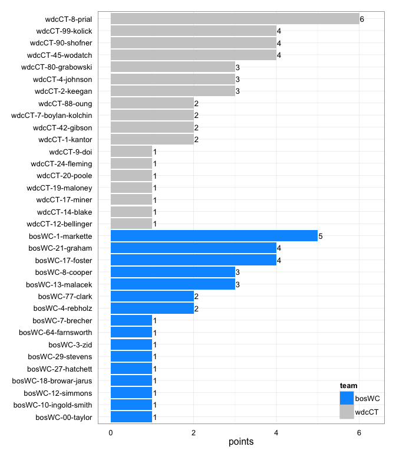

# wdcCT at bosWC 2014-06-07

# wdcCT 21
# bosWC 16
## game is complete

Go to ...  
  * [Scoring progression](#scoringProgression)  
  * [Player stats via figures](#pl_figs)  
  * [Player stats for wdcCT](#away)  
  * [Player stats for bosWC](#home)  
  * [Data on goals, assists, D's](#selectData)  
  * [Full raw data](#rawData)  

## Scoring progression:

| point|period |begin    |end     |pt_duration |desc                                         |wdcCT |bosWC |
|-----:|:------|:--------|:-------|:-----------|:--------------------------------------------|:-----|:-----|
|    41|4      |0:09:00  |0:00:00 |00:09       |- no goal -                                  |21    |16    |
|    40|4      |1:38:00  |0:09:00 |01:29       |bosWC-17-foster to bosWC-64-farnsworth       |21    |16    |
|    39|4      |1:56:00  |1:38:00 |00:18       |wdcCT-45-wodatch to wdcCT-80-grabowski       |21    |15    |
|    38|4      |2:18:00  |1:56:00 |00:22       |bosWC-1-markette to bosWC-17-foster          |20    |15    |
|    37|4      |2:29:00  |2:18:00 |00:11       |wdcCT-80-grabowski to wdcCT-45-wodatch       |20    |14    |
|    36|4      |3:37:00  |2:29:00 |01:08       |bosWC-18-browar-jarus to bosWC-8-cooper      |19    |14    |
|    35|4      |5:51:00  |3:37:00 |02:14       |bosWC-1-markette to bosWC-4-rebholz          |19    |13    |
|    34|4      |9:15:00  |5:51:00 |03:24       |wdcCT-8-prial to wdcCT-2-keegan              |19    |12    |
|    33|4      |10:00:00 |9:15:00 |00:45       |bosWC-1-markette to bosWC-00-taylor          |18    |12    |
|    32|3      |0:23:00  |0:00:00 |00:23       |- no goal -                                  |18    |11    |
|    31|3      |0:59:00  |0:23:00 |00:36       |wdcCT-80-grabowski to wdcCT-8-prial          |18    |11    |
|    30|3      |1:55:00  |0:59:00 |00:56       |bosWC-13-malacek to bosWC-21-graham          |17    |11    |
|    29|3      |2:46:00  |1:55:00 |00:51       |wdcCT-99-kolick to wdcCT-90-shofner          |17    |10    |
|    28|3      |3:50:00  |2:46:00 |01:04       |bosWC-8-cooper to bosWC-21-graham            |16    |10    |
|    27|3      |5:30:00  |3:50:00 |01:40       |wdcCT-24-fleming to wdcCT-20-poole           |16    |9     |
|    26|3      |5:42:00  |5:30:00 |00:12       |wdcCT-90-shofner to wdcCT-45-wodatch         |15    |9     |
|    25|3      |6:09:00  |5:42:00 |00:27       |bosWC-13-malacek to bosWC-21-graham          |14    |9     |
|    24|3      |6:26:00  |6:09:00 |00:17       |wdcCT-99-kolick to wdcCT-8-prial             |14    |8     |
|    23|3      |7:01:00  |6:26:00 |00:35       |bosWC-1-markette to bosWC-3-zid              |13    |8     |
|    22|3      |7:42:00  |7:01:00 |00:41       |wdcCT-8-prial to wdcCT-2-keegan              |13    |7     |
|    21|3      |10:00:00 |7:42:00 |02:18       |bosWC-8-cooper to bosWC-29-stevens           |12    |7     |
|    20|2      |0:05:00  |0:00:00 |00:05       |- no goal -                                  |12    |6     |
|    19|2      |0:26:00  |0:05:00 |00:21       |wdcCT-19-maloney to wdcCT-42-gibson          |12    |6     |
|    18|2      |0:56:00  |0:26:00 |00:30       |wdcCT-99-kolick to wdcCT-8-prial             |11    |6     |
|    17|2      |1:17:00  |0:56:00 |00:21       |bosWC-1-markette to bosWC-77-clark           |10    |6     |
|    16|2      |1:42:00  |1:17:00 |00:25       |wdcCT-9-doi to wdcCT-45-wodatch              |10    |5     |
|    15|2      |2:16:00  |1:42:00 |00:34       |bosWC-4-rebholz to bosWC-21-graham           |9     |5     |
|    14|2      |6:08:00  |2:16:00 |03:52       |wdcCT-88-oung to wdcCT-14-blake              |9     |4     |
|    13|2      |6:56:00  |6:08:00 |00:48       |bosWC-10-ingold-smith to bosWC-27-hatchett   |8     |4     |
|    12|2      |7:34:00  |6:56:00 |00:38       |wdcCT-4-johnson to wdcCT-1-kantor            |8     |3     |
|    11|2      |8:35:00  |7:34:00 |01:01       |wdcCT-42-gibson to wdcCT-7-boylan-kolchin    |7     |3     |
|    10|2      |9:30:00  |8:35:00 |00:55       |wdcCT-99-kolick to wdcCT-90-shofner          |6     |3     |
|     9|2      |10:00:00 |9:30:00 |00:30       |bosWC-13-malacek to bosWC-17-foster          |5     |3     |
|     8|1      |1:53:00  |0:00:00 |01:53       |- no goal -                                  |5     |2     |
|     7|1      |2:50:00  |1:53:00 |00:57       |bosWC-12-simmons to bosWC-17-foster          |5     |2     |
|     6|1      |4:05:00  |2:50:00 |01:15       |wdcCT-1-kantor to wdcCT-4-johnson            |5     |1     |
|     5|1      |5:08:00  |4:05:00 |01:03       |wdcCT-8-prial to wdcCT-2-keegan              |4     |1     |
|     4|1      |6:40:00  |5:08:00 |01:32       |bosWC-7-brecher to bosWC-77-clark            |3     |1     |
|     3|1      |NA       |6:40:00 |???         |wdcCT-4-johnson to wdcCT-17-miner            |3     |0     |
|     2|1      |NA       |NA      |???         |wdcCT-12-bellinger to wdcCT-7-boylan-kolchin |2     |0     |
|     1|1      |10:00:00 |NA      |???         |wdcCT-90-shofner to wdcCT-88-oung            |1     |0     |

## Player stats via figures:

### Points = goals + assists

 

### Goals

 

### Assists

 

### D's
 

## Player stats for wdcCT :

points = goals + assists  
tables sorted in decreasing order based on points (then goals, assists, Ds)  
Ds = total of plain ol' D's + interceptions (D), hand blocks (HB), and foot blocks (FB)  
stats are cumulative for this game

|   |player   |last           | points| comp_pct| goals| assists| throws| completions| catches| def| drop|
|:--|:--------|:--------------|------:|--------:|-----:|-------:|------:|-----------:|-------:|---:|----:|
|24 |wdcCT-8  |prial          |      6|     0.96|     3|       3|     27|          26|      31|   0|    0|
|25 |wdcCT-45 |wodatch        |      4|     1.00|     3|       1|      9|           9|      12|   0|    0|
|26 |wdcCT-90 |shofner        |      4|     0.88|     2|       2|     16|          14|      18|   1|    0|
|27 |wdcCT-99 |kolick         |      4|     0.95|     0|       4|     38|          36|      33|   0|    0|
|28 |wdcCT-2  |keegan         |      3|     0.91|     3|       0|     23|          21|      20|   0|    0|
|29 |wdcCT-4  |johnson        |      3|     1.00|     1|       2|      8|           8|       9|   0|    0|
|30 |wdcCT-80 |grabowski      |      3|     1.00|     1|       2|      3|           3|       4|   0|    0|
|31 |wdcCT-7  |boylan-kolchin |      2|     1.00|     2|       0|      1|           1|       3|   0|    0|
|32 |wdcCT-42 |gibson         |      2|     1.00|     1|       1|      3|           3|       2|   2|    0|
|33 |wdcCT-88 |oung           |      2|     1.00|     1|       1|     15|          15|      12|   1|    0|
|34 |wdcCT-1  |kantor         |      2|     0.75|     1|       1|      4|           3|       5|   0|    0|
|35 |wdcCT-14 |blake          |      1|     0.95|     1|       0|     21|          20|      15|   0|    0|
|36 |wdcCT-17 |miner          |      1|     1.00|     1|       0|      4|           4|       5|   0|    0|
|37 |wdcCT-20 |poole          |      1|     1.00|     1|       0|      1|           1|       2|   0|    0|
|38 |wdcCT-12 |bellinger      |      1|     1.00|     0|       1|      7|           7|       6|   1|    0|
|39 |wdcCT-19 |maloney        |      1|     0.75|     0|       1|      4|           3|       4|   0|    0|
|40 |wdcCT-24 |fleming        |      1|     1.00|     0|       1|      1|           1|       1|   0|    0|
|41 |wdcCT-9  |doi            |      1|     1.00|     0|       1|     13|          13|      13|   0|    0|
|42 |wdcCT-31 |cobb           |      0|       NA|     0|       0|      0|           0|       0|   2|    0|
|43 |wdcCT-   |?name?         |      0|       NA|     0|       0|      0|           0|       0|   0|    0|
|44 |wdcCT-21 |dulabon        |      0|     1.00|     0|       0|      1|           1|       1|   0|    0|
|45 |wdcCT-27 |johnston       |      0|     1.00|     0|       0|     11|          11|       5|   0|    0|
|46 |wdcCT-32 |peters         |      0|     1.00|     0|       0|      5|           5|       4|   0|    0|
|47 |wdcCT-5  |cranston       |      0|     0.80|     0|       0|      5|           4|       5|   0|    0|
|48 |wdcCT-61 |salmi          |      0|     1.00|     0|       0|      5|           5|       4|   0|    0|

## Player stats for bosWC :

points = goals + assists  
tables sorted in decreasing order based on points (then goals, assists, Ds)  
Ds = total of plain ol' D's + interceptions (D), hand blocks (HB), and foot blocks (FB)  
stats are cumulative for this game

|   |player   |last              | points| comp_pct| goals| assists| throws| completions| catches| def| drop|
|:--|:--------|:-----------------|------:|--------:|-----:|-------:|------:|-----------:|-------:|---:|----:|
|1  |bosWC-1  |markette          |      5|     0.94|     0|       5|     17|          16|      16|   0|    0|
|2  |bosWC-21 |graham            |      4|     1.00|     4|       0|     12|          12|      15|   0|    0|
|3  |bosWC-17 |foster            |      4|     0.89|     3|       1|      9|           8|      12|   0|    0|
|4  |bosWC-8  |cooper            |      3|     0.92|     1|       2|     13|          12|      10|   0|    0|
|5  |bosWC-13 |malacek           |      3|     0.91|     0|       3|     33|          30|      21|   0|    1|
|6  |bosWC-77 |clark             |      2|     0.93|     2|       0|     15|          14|      17|   0|    0|
|7  |bosWC-4  |rebholz           |      2|     0.94|     1|       1|     33|          31|      29|   1|    0|
|8  |bosWC-00 |taylor            |      1|     0.77|     1|       0|     13|          10|      12|   0|    1|
|9  |bosWC-27 |hatchett          |      1|     1.00|     1|       0|      3|           3|       4|   0|    0|
|10 |bosWC-29 |stevens           |      1|     1.00|     1|       0|      7|           7|       8|   0|    0|
|11 |bosWC-3  |zid               |      1|     1.00|     1|       0|     10|          10|      11|   0|    0|
|12 |bosWC-64 |farnsworth        |      1|     1.00|     1|       0|      3|           3|       4|   0|    0|
|13 |bosWC-18 |browar-jarus      |      1|     0.88|     0|       1|      8|           7|       8|   1|    0|
|14 |bosWC-10 |ingold-smith      |      1|     0.89|     0|       1|      9|           8|       9|   0|    0|
|15 |bosWC-12 |simmons           |      1|     0.80|     0|       1|     10|           8|       9|   0|    0|
|16 |bosWC-7  |brecher           |      1|     0.96|     0|       1|     23|          22|      20|   0|    0|
|17 |bosWC-11 |foster            |      0|     0.83|     0|       0|      6|           5|       6|   1|    0|
|18 |bosWC-43 |hirschberger      |      0|     1.00|     0|       0|      3|           3|       2|   1|    0|
|19 |bosWC-14 |montgomery-butler |      0|     1.00|     0|       0|      9|           9|       6|   0|    0|
|20 |bosWC-2  |reinhardt         |      0|     1.00|     0|       0|      1|           1|       1|   0|    0|
|21 |bosWC-25 |mcdonnell         |      0|     1.00|     0|       0|      3|           3|       3|   0|    0|
|22 |bosWC-6  |roth              |      0|     1.00|     0|       0|      2|           2|       2|   0|    0|
|23 |bosWC-88 |meyers            |      0|     1.00|     0|       0|      7|           7|       6|   0|    0|

## Raw data on select events (goals, assists, D's):

| point| period|pull_team | event| poss_abs| poss_rel|poss_team |pl_team |pl_pnum |pl_code |pl_lname       |player                 | bosWC| wdcCT|
|-----:|------:|:---------|-----:|--------:|--------:|:---------|:-------|:-------|:-------|:--------------|:----------------------|-----:|-----:|
|     1|      1|bosWC     |     6|        1|        1|wdcCT     |wdcCT   |90      |A       |shofner        |wdcCT-90-shofner       |     0|     1|
|     1|      1|bosWC     |     7|        1|        1|wdcCT     |wdcCT   |88      |LG      |oung           |wdcCT-88-oung          |     0|     1|
|     2|      1|wdcCT     |     7|        2|        1|bosWC     |wdcCT   |42      |D       |gibson         |wdcCT-42-gibson        |     0|     2|
|     2|      1|wdcCT     |    13|        3|        2|wdcCT     |wdcCT   |12      |A       |bellinger      |wdcCT-12-bellinger     |     0|     2|
|     2|      1|wdcCT     |    14|        3|        2|wdcCT     |wdcCT   |7       |G       |boylan-kolchin |wdcCT-7-boylan-kolchin |     0|     2|
|     3|      1|wdcCT     |    14|        6|        3|bosWC     |wdcCT   |31      |D       |cobb           |wdcCT-31-cobb          |     0|     3|
|     3|      1|wdcCT     |    25|        7|        4|wdcCT     |wdcCT   |4       |A       |johnson        |wdcCT-4-johnson        |     0|     3|
|     3|      1|wdcCT     |    26|        7|        4|wdcCT     |wdcCT   |17      |G       |miner          |wdcCT-17-miner         |     0|     3|
|     4|      1|wdcCT     |    16|       10|        3|bosWC     |bosWC   |7       |A       |brecher        |bosWC-7-brecher        |     1|     3|
|     4|      1|wdcCT     |    17|       10|        3|bosWC     |bosWC   |77      |G       |clark          |bosWC-77-clark         |     1|     3|
|     5|      1|bosWC     |    17|       11|        1|wdcCT     |wdcCT   |8       |A       |prial          |wdcCT-8-prial          |     1|     4|
|     5|      1|bosWC     |    18|       11|        1|wdcCT     |wdcCT   |2       |G       |keegan         |wdcCT-2-keegan         |     1|     4|
|     6|      1|wdcCT     |    17|       13|        2|wdcCT     |wdcCT   |1       |A       |kantor         |wdcCT-1-kantor         |     1|     5|
|     6|      1|wdcCT     |    18|       13|        2|wdcCT     |wdcCT   |4       |G       |johnson        |wdcCT-4-johnson        |     1|     5|
|     7|      1|wdcCT     |    12|       14|        1|bosWC     |bosWC   |12      |A       |simmons        |bosWC-12-simmons       |     2|     5|
|     7|      1|wdcCT     |    13|       14|        1|bosWC     |bosWC   |17      |G       |foster         |bosWC-17-foster        |     2|     5|
|     8|      1|bosWC     |    NA|       NA|       NA|NA        |NA      |NA      |NA      |NA             |NA-NA-NA               |     2|     5|
|     9|      2|wdcCT     |     9|       19|        1|bosWC     |bosWC   |13      |A       |malacek        |bosWC-13-malacek       |     3|     5|
|     9|      2|wdcCT     |    10|       19|        1|bosWC     |bosWC   |17      |G       |foster         |bosWC-17-foster        |     3|     5|
|    10|      2|bosWC     |    15|       20|        1|wdcCT     |wdcCT   |99      |A       |kolick         |wdcCT-99-kolick        |     3|     6|
|    10|      2|bosWC     |    16|       20|        1|wdcCT     |wdcCT   |90      |G       |shofner        |wdcCT-90-shofner       |     3|     6|
|    11|      2|wdcCT     |     4|       21|        1|bosWC     |wdcCT   |42      |D       |gibson         |wdcCT-42-gibson        |     3|     7|
|    11|      2|wdcCT     |    11|       22|        2|wdcCT     |wdcCT   |42      |A       |gibson         |wdcCT-42-gibson        |     3|     7|
|    11|      2|wdcCT     |    12|       22|        2|wdcCT     |wdcCT   |7       |G       |boylan-kolchin |wdcCT-7-boylan-kolchin |     3|     7|
|    12|      2|wdcCT     |     7|       24|        2|wdcCT     |wdcCT   |4       |A       |johnson        |wdcCT-4-johnson        |     3|     8|
|    12|      2|wdcCT     |     8|       24|        2|wdcCT     |wdcCT   |1       |G       |kantor         |wdcCT-1-kantor         |     3|     8|
|    13|      2|wdcCT     |    13|       25|        1|bosWC     |bosWC   |10      |A       |ingold-smith   |bosWC-10-ingold-smith  |     4|     8|
|    13|      2|wdcCT     |    14|       25|        1|bosWC     |bosWC   |27      |G       |hatchett       |bosWC-27-hatchett      |     4|     8|
|    14|      2|bosWC     |    12|       26|        1|wdcCT     |bosWC   |18      |D       |browar-jarus   |bosWC-18-browar-jarus  |     4|     9|
|    14|      2|bosWC     |    19|       27|        2|bosWC     |wdcCT   |31      |D       |cobb           |wdcCT-31-cobb          |     4|     9|
|    14|      2|bosWC     |    29|       29|        4|bosWC     |wdcCT   |88      |D       |oung           |wdcCT-88-oung          |     4|     9|
|    14|      2|bosWC     |    35|       30|        5|wdcCT     |bosWC   |43      |D       |hirschberger   |bosWC-43-hirschberger  |     4|     9|
|    14|      2|bosWC     |    43|       31|        6|bosWC     |wdcCT   |90      |D       |shofner        |wdcCT-90-shofner       |     4|     9|
|    14|      2|bosWC     |    50|       32|        7|wdcCT     |wdcCT   |88      |LA      |oung           |wdcCT-88-oung          |     4|     9|
|    14|      2|bosWC     |    51|       32|        7|wdcCT     |wdcCT   |14      |G       |blake          |wdcCT-14-blake         |     4|     9|
|    15|      2|wdcCT     |     8|       33|        1|bosWC     |bosWC   |4       |LA      |rebholz        |bosWC-4-rebholz        |     5|     9|
|    15|      2|wdcCT     |     9|       33|        1|bosWC     |bosWC   |21      |G       |graham         |bosWC-21-graham        |     5|     9|
|    16|      2|bosWC     |     8|       34|        1|wdcCT     |wdcCT   |9       |A       |doi            |wdcCT-9-doi            |     5|    10|
|    16|      2|bosWC     |     9|       34|        1|wdcCT     |wdcCT   |45      |G       |wodatch        |wdcCT-45-wodatch       |     5|    10|
|    17|      2|wdcCT     |     5|       35|        1|bosWC     |bosWC   |1       |LA      |markette       |bosWC-1-markette       |     6|    10|
|    17|      2|wdcCT     |     6|       35|        1|bosWC     |bosWC   |77      |G       |clark          |bosWC-77-clark         |     6|    10|
|    18|      2|bosWC     |    11|       36|        1|wdcCT     |wdcCT   |99      |A       |kolick         |wdcCT-99-kolick        |     6|    11|
|    18|      2|bosWC     |    12|       36|        1|wdcCT     |wdcCT   |8       |G       |prial          |wdcCT-8-prial          |     6|    11|
|    19|      2|wdcCT     |     5|       38|        2|wdcCT     |wdcCT   |19      |A       |maloney        |wdcCT-19-maloney       |     6|    12|
|    19|      2|wdcCT     |     6|       38|        2|wdcCT     |wdcCT   |42      |G       |gibson         |wdcCT-42-gibson        |     6|    12|
|    20|      2|wdcCT     |    NA|       NA|       NA|NA        |NA      |NA      |NA      |NA             |NA-NA-NA               |     6|    12|
|    21|      3|bosWC     |    22|       41|        2|bosWC     |bosWC   |8       |A       |cooper         |bosWC-8-cooper         |     7|    12|
|    21|      3|bosWC     |    23|       41|        2|bosWC     |bosWC   |29      |G       |stevens        |bosWC-29-stevens       |     7|    12|
|    22|      3|bosWC     |    12|       42|        1|wdcCT     |wdcCT   |8       |A       |prial          |wdcCT-8-prial          |     7|    13|
|    22|      3|bosWC     |    13|       42|        1|wdcCT     |wdcCT   |2       |G       |keegan         |wdcCT-2-keegan         |     7|    13|
|    23|      3|wdcCT     |     6|       43|        1|bosWC     |bosWC   |1       |A       |markette       |bosWC-1-markette       |     8|    13|
|    23|      3|wdcCT     |     7|       43|        1|bosWC     |bosWC   |3       |G       |zid            |bosWC-3-zid            |     8|    13|
|    24|      3|bosWC     |     6|       44|        1|wdcCT     |wdcCT   |99      |A       |kolick         |wdcCT-99-kolick        |     8|    14|
|    24|      3|bosWC     |     7|       44|        1|wdcCT     |wdcCT   |8       |G       |prial          |wdcCT-8-prial          |     8|    14|
|    25|      3|wdcCT     |     6|       45|        1|bosWC     |bosWC   |13      |LA      |malacek        |bosWC-13-malacek       |     9|    14|
|    25|      3|wdcCT     |     7|       45|        1|bosWC     |bosWC   |21      |G       |graham         |bosWC-21-graham        |     9|    14|
|    26|      3|bosWC     |     4|       46|        1|wdcCT     |wdcCT   |90      |LA      |shofner        |wdcCT-90-shofner       |     9|    15|
|    26|      3|bosWC     |     5|       46|        1|wdcCT     |wdcCT   |45      |G       |wodatch        |wdcCT-45-wodatch       |     9|    15|
|    27|      3|wdcCT     |    13|       48|        2|wdcCT     |wdcCT   |24      |A       |fleming        |wdcCT-24-fleming       |     9|    16|
|    27|      3|wdcCT     |    14|       48|        2|wdcCT     |wdcCT   |20      |G       |poole          |wdcCT-20-poole         |     9|    16|
|    28|      3|wdcCT     |    19|       49|        1|bosWC     |bosWC   |8       |A       |cooper         |bosWC-8-cooper         |    10|    16|
|    28|      3|wdcCT     |    20|       49|        1|bosWC     |bosWC   |21      |G       |graham         |bosWC-21-graham        |    10|    16|
|    29|      3|bosWC     |    17|       50|        1|wdcCT     |wdcCT   |99      |A       |kolick         |wdcCT-99-kolick        |    10|    17|
|    29|      3|bosWC     |    18|       50|        1|wdcCT     |wdcCT   |90      |G       |shofner        |wdcCT-90-shofner       |    10|    17|
|    30|      3|wdcCT     |    13|       51|        1|bosWC     |bosWC   |13      |A       |malacek        |bosWC-13-malacek       |    11|    17|
|    30|      3|wdcCT     |    14|       51|        1|bosWC     |bosWC   |21      |G       |graham         |bosWC-21-graham        |    11|    17|
|    31|      3|bosWC     |    12|       52|        1|wdcCT     |wdcCT   |80      |A       |grabowski      |wdcCT-80-grabowski     |    11|    18|
|    31|      3|bosWC     |    13|       52|        1|wdcCT     |wdcCT   |8       |G       |prial          |wdcCT-8-prial          |    11|    18|
|    32|      3|wdcCT     |     8|       53|        1|bosWC     |wdcCT   |12      |D       |bellinger      |wdcCT-12-bellinger     |    11|    18|
|    33|      4|wdcCT     |    13|       54|        1|bosWC     |bosWC   |1       |A       |markette       |bosWC-1-markette       |    12|    18|
|    33|      4|wdcCT     |    14|       54|        1|bosWC     |bosWC   |00      |G       |taylor         |bosWC-00-taylor        |    12|    18|
|    34|      4|bosWC     |    31|       57|        3|wdcCT     |wdcCT   |8       |LA      |prial          |wdcCT-8-prial          |    12|    19|
|    34|      4|bosWC     |    32|       57|        3|wdcCT     |wdcCT   |2       |G       |keegan         |wdcCT-2-keegan         |    12|    19|
|    35|      4|wdcCT     |    23|       59|        2|wdcCT     |bosWC   |4       |D       |rebholz        |bosWC-4-rebholz        |    13|    19|
|    35|      4|wdcCT     |    34|       60|        3|bosWC     |bosWC   |1       |A       |markette       |bosWC-1-markette       |    13|    19|
|    35|      4|wdcCT     |    35|       60|        3|bosWC     |bosWC   |4       |G       |rebholz        |bosWC-4-rebholz        |    13|    19|
|    36|      4|bosWC     |    11|       61|        1|wdcCT     |bosWC   |11      |D       |foster         |bosWC-11-foster        |    14|    19|
|    36|      4|bosWC     |    18|       62|        2|bosWC     |bosWC   |18      |A       |browar-jarus   |bosWC-18-browar-jarus  |    14|    19|
|    36|      4|bosWC     |    19|       62|        2|bosWC     |bosWC   |8       |G       |cooper         |bosWC-8-cooper         |    14|    19|
|    37|      4|bosWC     |     3|       63|        1|wdcCT     |wdcCT   |80      |A       |grabowski      |wdcCT-80-grabowski     |    14|    20|
|    37|      4|bosWC     |     4|       63|        1|wdcCT     |wdcCT   |45      |G       |wodatch        |wdcCT-45-wodatch       |    14|    20|
|    38|      4|wdcCT     |     8|       64|        1|bosWC     |bosWC   |1       |A       |markette       |bosWC-1-markette       |    15|    20|
|    38|      4|wdcCT     |     9|       64|        1|bosWC     |bosWC   |17      |G       |foster         |bosWC-17-foster        |    15|    20|
|    39|      4|bosWC     |     7|       65|        1|wdcCT     |wdcCT   |45      |A       |wodatch        |wdcCT-45-wodatch       |    15|    21|
|    39|      4|bosWC     |     8|       65|        1|wdcCT     |wdcCT   |80      |G       |grabowski      |wdcCT-80-grabowski     |    15|    21|
|    40|      4|wdcCT     |    24|       68|        3|bosWC     |bosWC   |17      |A       |foster         |bosWC-17-foster        |    16|    21|
|    40|      4|wdcCT     |    25|       68|        3|bosWC     |bosWC   |64      |G       |farnsworth     |bosWC-64-farnsworth    |    16|    21|
|    41|      4|bosWC     |    NA|       NA|       NA|NA        |NA      |NA      |NA      |NA             |NA-NA-NA               |    16|    21|

## Full raw data:

__Note: just for display purposes.__ Raw data in more useful forms can be found in the [GitHub repository](https://github.com/jennybc/vanNH). Find the game you're interested in in the `games` subdirectory.

| period| point|pull_team | event| poss_abs| poss_rel|poss_team |pl_team |pl_pnum |pl_code |
|------:|-----:|:---------|-----:|--------:|--------:|:---------|:-------|:-------|:-------|
|      1|     1|bosWC     |     1|        1|        1|wdcCT     |bosWC   |43      |P       |
|      1|     1|bosWC     |     2|        1|        1|wdcCT     |wdcCT   |2       |PU      |
|      1|     1|bosWC     |     3|        1|        1|wdcCT     |wdcCT   |99      |        |
|      1|     1|bosWC     |     4|        1|        1|wdcCT     |wdcCT   |2       |        |
|      1|     1|bosWC     |     5|        1|        1|wdcCT     |wdcCT   |8       |        |
|      1|     1|bosWC     |     6|        1|        1|wdcCT     |wdcCT   |90      |A       |
|      1|     1|bosWC     |     7|        1|        1|wdcCT     |wdcCT   |88      |LG      |
|      1|     2|wdcCT     |     1|        2|        1|bosWC     |wdcCT   |81      |P       |
|      1|     2|wdcCT     |     2|        2|        1|bosWC     |bosWC   |13      |PU      |
|      1|     2|wdcCT     |     3|        2|        1|bosWC     |bosWC   |4       |        |
|      1|     2|wdcCT     |     4|        2|        1|bosWC     |bosWC   |77      |        |
|      1|     2|wdcCT     |     5|        2|        1|bosWC     |bosWC   |4       |        |
|      1|     2|wdcCT     |     6|        2|        1|bosWC     |bosWC   |77      |        |
|      1|     2|wdcCT     |     7|        2|        1|bosWC     |wdcCT   |42      |D       |
|      1|     2|wdcCT     |     8|        3|        2|wdcCT     |wdcCT   |42      |PU      |
|      1|     2|wdcCT     |     9|        3|        2|wdcCT     |wdcCT   |12      |        |
|      1|     2|wdcCT     |    10|        3|        2|wdcCT     |wdcCT   |61      |        |
|      1|     2|wdcCT     |    11|        3|        2|wdcCT     |wdcCT   |12      |        |
|      1|     2|wdcCT     |    12|        3|        2|wdcCT     |wdcCT   |32      |        |
|      1|     2|wdcCT     |    13|        3|        2|wdcCT     |wdcCT   |12      |A       |
|      1|     2|wdcCT     |    14|        3|        2|wdcCT     |wdcCT   |7       |G       |
|      1|     3|wdcCT     |     1|        4|        1|bosWC     |wdcCT   |21      |P       |
|      1|     3|wdcCT     |     2|        4|        1|bosWC     |bosWC   |4       |PU      |
|      1|     3|wdcCT     |     3|        4|        1|bosWC     |bosWC   |13      |L       |
|      1|     3|wdcCT     |     4|        5|        2|wdcCT     |wdcCT   |27      |PU      |
|      1|     3|wdcCT     |     5|        5|        2|wdcCT     |wdcCT   |1       |        |
|      1|     3|wdcCT     |     6|        5|        2|wdcCT     |wdcCT   |17      |        |
|      1|     3|wdcCT     |     7|        5|        2|wdcCT     |wdcCT   |1       |L       |
|      1|     3|wdcCT     |     8|        6|        3|bosWC     |bosWC   |4       |PU      |
|      1|     3|wdcCT     |     9|        6|        3|bosWC     |bosWC   |1       |        |
|      1|     3|wdcCT     |    10|        6|        3|bosWC     |bosWC   |4       |        |
|      1|     3|wdcCT     |    11|        6|        3|bosWC     |bosWC   |21      |        |
|      1|     3|wdcCT     |    12|        6|        3|bosWC     |bosWC   |13      |        |
|      1|     3|wdcCT     |    13|        6|        3|bosWC     |bosWC   |7       |        |
|      1|     3|wdcCT     |    14|        6|        3|bosWC     |wdcCT   |31      |D       |
|      1|     3|wdcCT     |    15|        7|        4|wdcCT     |wdcCT   |31      |SO      |
|      1|     3|wdcCT     |    16|        7|        4|wdcCT     |wdcCT   |99      |SI      |
|      1|     3|wdcCT     |    17|        7|        4|wdcCT     |wdcCT   |27      |PU      |
|      1|     3|wdcCT     |    18|        7|        4|wdcCT     |wdcCT   |17      |        |
|      1|     3|wdcCT     |    19|        7|        4|wdcCT     |bosWC   |13      |F       |
|      1|     3|wdcCT     |    20|        7|        4|wdcCT     |wdcCT   |27      |        |
|      1|     3|wdcCT     |    21|        7|        4|wdcCT     |wdcCT   |4       |        |
|      1|     3|wdcCT     |    22|        7|        4|wdcCT     |wdcCT   |17      |        |
|      1|     3|wdcCT     |    23|        7|        4|wdcCT     |wdcCT   |27      |        |
|      1|     3|wdcCT     |    24|        7|        4|wdcCT     |wdcCT   |21      |        |
|      1|     3|wdcCT     |    25|        7|        4|wdcCT     |wdcCT   |4       |A       |
|      1|     3|wdcCT     |    26|        7|        4|wdcCT     |wdcCT   |17      |G       |
|      1|     4|wdcCT     |     1|        8|        1|bosWC     |wdcCT   |81      |P       |
|      1|     4|wdcCT     |     2|        8|        1|bosWC     |bosWC   |00      |PU      |
|      1|     4|wdcCT     |     3|        8|        1|bosWC     |bosWC   |13      |        |
|      1|     4|wdcCT     |     4|        8|        1|bosWC     |bosWC   |?       |VP      |
|      1|     4|wdcCT     |     5|        8|        1|bosWC     |bosWC   |77      |        |
|      1|     4|wdcCT     |     6|        8|        1|bosWC     |bosWC   |1       |        |
|      1|     4|wdcCT     |     7|        8|        1|bosWC     |bosWC   |21      |        |
|      1|     4|wdcCT     |     8|        8|        1|bosWC     |bosWC   |7       |        |
|      1|     4|wdcCT     |     9|        8|        1|bosWC     |bosWC   |1       |        |
|      1|     4|wdcCT     |    10|        9|        2|wdcCT     |wdcCT   |32      |PU      |
|      1|     4|wdcCT     |    11|        9|        2|wdcCT     |wdcCT   |32      |VST     |
|      1|     4|wdcCT     |    12|       10|        3|bosWC     |bosWC   |7       |PU      |
|      1|     4|wdcCT     |    13|       10|        3|bosWC     |bosWC   |1       |        |
|      1|     4|wdcCT     |    14|       10|        3|bosWC     |bosWC   |77      |        |
|      1|     4|wdcCT     |    15|       10|        3|bosWC     |bosWC   |1       |        |
|      1|     4|wdcCT     |    16|       10|        3|bosWC     |bosWC   |7       |A       |
|      1|     4|wdcCT     |    17|       10|        3|bosWC     |bosWC   |77      |G       |
|      1|     4|wdcCT     |    18|       10|        3|bosWC     |wdcCT   |32      |F       |
|      1|     5|bosWC     |     1|       11|        1|wdcCT     |bosWC   |11      |P       |
|      1|     5|bosWC     |     2|       11|        1|wdcCT     |wdcCT   |2       |PU      |
|      1|     5|bosWC     |     3|       11|        1|wdcCT     |wdcCT   |99      |        |
|      1|     5|bosWC     |     4|       11|        1|wdcCT     |wdcCT   |2       |        |
|      1|     5|bosWC     |     5|       11|        1|wdcCT     |wdcCT   |90      |        |
|      1|     5|bosWC     |     6|       11|        1|wdcCT     |wdcCT   |99      |        |
|      1|     5|bosWC     |     7|       11|        1|wdcCT     |wdcCT   |8       |        |
|      1|     5|bosWC     |     8|       11|        1|wdcCT     |wdcCT   |99      |        |
|      1|     5|bosWC     |     9|       11|        1|wdcCT     |wdcCT   |90      |        |
|      1|     5|bosWC     |    10|       11|        1|wdcCT     |wdcCT   |8       |        |
|      1|     5|bosWC     |    11|       11|        1|wdcCT     |bosWC   |8       |F       |
|      1|     5|bosWC     |    12|       11|        1|wdcCT     |wdcCT   |88      |        |
|      1|     5|bosWC     |    13|       11|        1|wdcCT     |wdcCT   |8       |        |
|      1|     5|bosWC     |    14|       11|        1|wdcCT     |wdcCT   |99      |        |
|      1|     5|bosWC     |    15|       11|        1|wdcCT     |wdcCT   |45      |        |
|      1|     5|bosWC     |    16|       11|        1|wdcCT     |wdcCT   |9       |        |
|      1|     5|bosWC     |    17|       11|        1|wdcCT     |wdcCT   |8       |A       |
|      1|     5|bosWC     |    18|       11|        1|wdcCT     |wdcCT   |2       |G       |
|      1|     6|wdcCT     |     1|       12|        1|bosWC     |wdcCT   |21      |P       |
|      1|     6|wdcCT     |     2|       12|        1|bosWC     |bosWC   |13      |PU      |
|      1|     6|wdcCT     |     3|       12|        1|bosWC     |bosWC   |4       |        |
|      1|     6|wdcCT     |     4|       12|        1|bosWC     |bosWC   |64      |        |
|      1|     6|wdcCT     |     5|       12|        1|bosWC     |bosWC   |21      |        |
|      1|     6|wdcCT     |     6|       12|        1|bosWC     |bosWC   |00      |        |
|      1|     6|wdcCT     |     7|       12|        1|bosWC     |bosWC   |13      |        |
|      1|     6|wdcCT     |     8|       12|        1|bosWC     |bosWC   |4       |        |
|      1|     6|wdcCT     |     9|       12|        1|bosWC     |bosWC   |00      |        |
|      1|     6|wdcCT     |    10|       12|        1|bosWC     |bosWC   |1       |TD      |
|      1|     6|wdcCT     |    11|       13|        2|wdcCT     |wdcCT   |27      |PU      |
|      1|     6|wdcCT     |    12|       13|        2|wdcCT     |wdcCT   |1       |        |
|      1|     6|wdcCT     |    13|       13|        2|wdcCT     |wdcCT   |20      |        |
|      1|     6|wdcCT     |    14|       13|        2|wdcCT     |wdcCT   |27      |        |
|      1|     6|wdcCT     |    15|       13|        2|wdcCT     |wdcCT   |4       |        |
|      1|     6|wdcCT     |    16|       13|        2|wdcCT     |wdcCT   |27      |        |
|      1|     6|wdcCT     |    17|       13|        2|wdcCT     |wdcCT   |1       |A       |
|      1|     6|wdcCT     |    18|       13|        2|wdcCT     |wdcCT   |4       |G       |
|      1|     7|wdcCT     |     1|       14|        1|bosWC     |wdcCT   |61      |P       |
|      1|     7|wdcCT     |     2|       14|        1|bosWC     |bosWC   |8       |PU      |
|      1|     7|wdcCT     |     3|       14|        1|bosWC     |bosWC   |7       |        |
|      1|     7|wdcCT     |     4|       14|        1|bosWC     |bosWC   |18      |        |
|      1|     7|wdcCT     |     5|       14|        1|bosWC     |bosWC   |77      |        |
|      1|     7|wdcCT     |     6|       14|        1|bosWC     |bosWC   |12      |        |
|      1|     7|wdcCT     |     7|       14|        1|bosWC     |bosWC   |7       |        |
|      1|     7|wdcCT     |     8|       14|        1|bosWC     |bosWC   |77      |L       |
|      1|     7|wdcCT     |     9|       14|        1|bosWC     |wdcCT   |?       |F       |
|      1|     7|wdcCT     |    10|       14|        1|bosWC     |bosWC   |12      |        |
|      1|     7|wdcCT     |    11|       14|        1|bosWC     |bosWC   |7       |        |
|      1|     7|wdcCT     |    12|       14|        1|bosWC     |bosWC   |12      |A       |
|      1|     7|wdcCT     |    13|       14|        1|bosWC     |bosWC   |17      |G       |
|      1|     8|bosWC     |     1|       15|        1|wdcCT     |bosWC   |43      |P       |
|      1|     8|bosWC     |     2|       15|        1|wdcCT     |wdcCT   |14      |PU      |
|      1|     8|bosWC     |     3|       15|        1|wdcCT     |wdcCT   |99      |        |
|      1|     8|bosWC     |     4|       15|        1|wdcCT     |wdcCT   |14      |        |
|      1|     8|bosWC     |     5|       15|        1|wdcCT     |wdcCT   |90      |        |
|      1|     8|bosWC     |     6|       15|        1|wdcCT     |wdcCT   |14      |        |
|      1|     8|bosWC     |     7|       15|        1|wdcCT     |wdcCT   |99      |        |
|      1|     8|bosWC     |     8|       15|        1|wdcCT     |wdcCT   |8       |        |
|      1|     8|bosWC     |     9|       16|        2|bosWC     |bosWC   |14      |PU      |
|      1|     8|bosWC     |    10|       16|        2|bosWC     |bosWC   |10      |        |
|      1|     8|bosWC     |    11|       16|        2|bosWC     |bosWC   |88      |        |
|      1|     8|bosWC     |    12|       16|        2|bosWC     |bosWC   |11      |        |
|      1|     8|bosWC     |    13|       16|        2|bosWC     |bosWC   |88      |        |
|      1|     8|bosWC     |    14|       16|        2|bosWC     |bosWC   |11      |        |
|      1|     8|bosWC     |    15|       17|        3|wdcCT     |wdcCT   |99      |PU      |
|      1|     8|bosWC     |    16|       17|        3|wdcCT     |wdcCT   |14      |        |
|      1|     8|bosWC     |    17|       17|        3|wdcCT     |wdcCT   |8       |        |
|      1|     8|bosWC     |    18|       17|        3|wdcCT     |wdcCT   |99      |        |
|      1|     8|bosWC     |    19|       17|        3|wdcCT     |bosWC   |10      |F       |
|      1|     8|bosWC     |    20|       17|        3|wdcCT     |wdcCT   |90      |        |
|      1|     8|bosWC     |    21|       18|        4|bosWC     |bosWC   |88      |PU      |
|      1|     8|bosWC     |    22|       18|        4|bosWC     |bosWC   |10      |        |
|      1|     8|bosWC     |    23|       18|        4|bosWC     |bosWC   |29      |        |
|      1|     8|bosWC     |    24|       18|        4|bosWC     |bosWC   |11      |        |
|      1|     8|bosWC     |    25|       18|        4|bosWC     |bosWC   |29      |        |
|      1|     8|bosWC     |    26|       18|        4|bosWC     |bosWC   |88      |        |
|      1|     8|bosWC     |    27|       18|        4|bosWC     |wdcCT   |99      |F       |
|      1|     8|bosWC     |    28|       18|        4|bosWC     |bosWC   |10      |        |
|      2|     9|wdcCT     |     1|       19|        1|bosWC     |wdcCT   |21      |P       |
|      2|     9|wdcCT     |     2|       19|        1|bosWC     |bosWC   |4       |PU      |
|      2|     9|wdcCT     |     3|       19|        1|bosWC     |bosWC   |13      |        |
|      2|     9|wdcCT     |     4|       19|        1|bosWC     |bosWC   |3       |        |
|      2|     9|wdcCT     |     5|       19|        1|bosWC     |bosWC   |13      |        |
|      2|     9|wdcCT     |     6|       19|        1|bosWC     |bosWC   |7       |        |
|      2|     9|wdcCT     |     7|       19|        1|bosWC     |bosWC   |77      |        |
|      2|     9|wdcCT     |     8|       19|        1|bosWC     |bosWC   |4       |        |
|      2|     9|wdcCT     |     9|       19|        1|bosWC     |bosWC   |13      |A       |
|      2|     9|wdcCT     |    10|       19|        1|bosWC     |bosWC   |17      |G       |
|      2|    10|bosWC     |     1|       20|        1|wdcCT     |bosWC   |18      |P       |
|      2|    10|bosWC     |     2|       20|        1|wdcCT     |wdcCT   |88      |PU      |
|      2|    10|bosWC     |     3|       20|        1|wdcCT     |wdcCT   |99      |        |
|      2|    10|bosWC     |     4|       20|        1|wdcCT     |wdcCT   |8       |        |
|      2|    10|bosWC     |     5|       20|        1|wdcCT     |wdcCT   |99      |        |
|      2|    10|bosWC     |     6|       20|        1|wdcCT     |wdcCT   |88      |        |
|      2|    10|bosWC     |     7|       20|        1|wdcCT     |wdcCT   |9       |        |
|      2|    10|bosWC     |     8|       20|        1|wdcCT     |wdcCT   |90      |        |
|      2|    10|bosWC     |     9|       20|        1|wdcCT     |wdcCT   |9       |        |
|      2|    10|bosWC     |    10|       20|        1|wdcCT     |wdcCT   |8       |        |
|      2|    10|bosWC     |    11|       20|        1|wdcCT     |wdcCT   |99      |        |
|      2|    10|bosWC     |    12|       20|        1|wdcCT     |wdcCT   |8       |        |
|      2|    10|bosWC     |    13|       20|        1|wdcCT     |wdcCT   |88      |        |
|      2|    10|bosWC     |    14|       20|        1|wdcCT     |wdcCT   |9       |        |
|      2|    10|bosWC     |    15|       20|        1|wdcCT     |wdcCT   |99      |A       |
|      2|    10|bosWC     |    16|       20|        1|wdcCT     |wdcCT   |90      |G       |
|      2|    11|wdcCT     |     1|       21|        1|bosWC     |wdcCT   |81      |P       |
|      2|    11|wdcCT     |     2|       21|        1|bosWC     |bosWC   |7       |PU      |
|      2|    11|wdcCT     |     3|       21|        1|bosWC     |bosWC   |4       |        |
|      2|    11|wdcCT     |     4|       21|        1|bosWC     |wdcCT   |42      |D       |
|      2|    11|wdcCT     |     5|       22|        2|wdcCT     |wdcCT   |42      |PU      |
|      2|    11|wdcCT     |     6|       22|        2|wdcCT     |wdcCT   |12      |        |
|      2|    11|wdcCT     |     7|       22|        2|wdcCT     |wdcCT   |12      |F       |
|      2|    11|wdcCT     |     8|       22|        2|wdcCT     |wdcCT   |19      |        |
|      2|    11|wdcCT     |     9|       22|        2|wdcCT     |wdcCT   |12      |        |
|      2|    11|wdcCT     |    10|       22|        2|wdcCT     |wdcCT   |61      |        |
|      2|    11|wdcCT     |    11|       22|        2|wdcCT     |wdcCT   |42      |A       |
|      2|    11|wdcCT     |    12|       22|        2|wdcCT     |wdcCT   |7       |G       |
|      2|    12|wdcCT     |     1|       23|        1|bosWC     |wdcCT   |4       |P       |
|      2|    12|wdcCT     |     2|       23|        1|bosWC     |bosWC   |7       |PU      |
|      2|    12|wdcCT     |     3|       23|        1|bosWC     |bosWC   |13      |        |
|      2|    12|wdcCT     |     4|       23|        1|bosWC     |bosWC   |21      |        |
|      2|    12|wdcCT     |     5|       23|        1|bosWC     |bosWC   |7       |VST     |
|      2|    12|wdcCT     |     6|       24|        2|wdcCT     |wdcCT   |27      |PU      |
|      2|    12|wdcCT     |     7|       24|        2|wdcCT     |wdcCT   |4       |A       |
|      2|    12|wdcCT     |     8|       24|        2|wdcCT     |wdcCT   |1       |G       |
|      2|    13|wdcCT     |     1|       25|        1|bosWC     |wdcCT   |81      |P       |
|      2|    13|wdcCT     |     2|       25|        1|bosWC     |bosWC   |14      |PU      |
|      2|    13|wdcCT     |     3|       25|        1|bosWC     |bosWC   |10      |        |
|      2|    13|wdcCT     |     4|       25|        1|bosWC     |bosWC   |12      |        |
|      2|    13|wdcCT     |     5|       25|        1|bosWC     |bosWC   |43      |        |
|      2|    13|wdcCT     |     6|       25|        1|bosWC     |bosWC   |27      |        |
|      2|    13|wdcCT     |     7|       25|        1|bosWC     |bosWC   |14      |        |
|      2|    13|wdcCT     |     8|       25|        1|bosWC     |bosWC   |10      |        |
|      2|    13|wdcCT     |     9|       25|        1|bosWC     |bosWC   |12      |        |
|      2|    13|wdcCT     |    10|       25|        1|bosWC     |bosWC   |43      |        |
|      2|    13|wdcCT     |    11|       25|        1|bosWC     |bosWC   |25      |        |
|      2|    13|wdcCT     |    12|       25|        1|bosWC     |bosWC   |12      |        |
|      2|    13|wdcCT     |    13|       25|        1|bosWC     |bosWC   |10      |A       |
|      2|    13|wdcCT     |    14|       25|        1|bosWC     |bosWC   |27      |G       |
|      2|    14|bosWC     |     1|       26|        1|wdcCT     |bosWC   |18      |P       |
|      2|    14|bosWC     |     2|       26|        1|wdcCT     |wdcCT   |2       |PU      |
|      2|    14|bosWC     |     3|       26|        1|wdcCT     |wdcCT   |99      |        |
|      2|    14|bosWC     |     4|       26|        1|wdcCT     |wdcCT   |2       |        |
|      2|    14|bosWC     |     5|       26|        1|wdcCT     |wdcCT   |90      |        |
|      2|    14|bosWC     |     6|       26|        1|wdcCT     |wdcCT   |2       |        |
|      2|    14|bosWC     |     7|       26|        1|wdcCT     |wdcCT   |9       |        |
|      2|    14|bosWC     |     8|       26|        1|wdcCT     |wdcCT   |8       |        |
|      2|    14|bosWC     |     9|       26|        1|wdcCT     |wdcCT   |88      |        |
|      2|    14|bosWC     |    10|       26|        1|wdcCT     |wdcCT   |9       |        |
|      2|    14|bosWC     |    11|       26|        1|wdcCT     |wdcCT   |99      |        |
|      2|    14|bosWC     |    12|       26|        1|wdcCT     |bosWC   |18      |D       |
|      2|    14|bosWC     |    13|       27|        2|bosWC     |bosWC   |        |TO      |
|      2|    14|bosWC     |    14|       27|        2|bosWC     |bosWC   |13      |PU      |
|      2|    14|bosWC     |    15|       27|        2|bosWC     |bosWC   |00      |        |
|      2|    14|bosWC     |    16|       27|        2|bosWC     |bosWC   |21      |        |
|      2|    14|bosWC     |    17|       27|        2|bosWC     |bosWC   |13      |        |
|      2|    14|bosWC     |    18|       27|        2|bosWC     |bosWC   |17      |        |
|      2|    14|bosWC     |    19|       27|        2|bosWC     |wdcCT   |31      |D       |
|      2|    14|bosWC     |    20|       28|        3|wdcCT     |wdcCT   |        |TO      |
|      2|    14|bosWC     |    21|       28|        3|wdcCT     |wdcCT   |99      |PU      |
|      2|    14|bosWC     |    22|       29|        4|bosWC     |bosWC   |12      |PU      |
|      2|    14|bosWC     |    23|       29|        4|bosWC     |bosWC   |88      |        |
|      2|    14|bosWC     |    24|       29|        4|bosWC     |bosWC   |10      |        |
|      2|    14|bosWC     |    25|       29|        4|bosWC     |bosWC   |12      |        |
|      2|    14|bosWC     |    26|       29|        4|bosWC     |bosWC   |6       |        |
|      2|    14|bosWC     |    27|       29|        4|bosWC     |bosWC   |11      |        |
|      2|    14|bosWC     |    28|       29|        4|bosWC     |bosWC   |12      |        |
|      2|    14|bosWC     |    29|       29|        4|bosWC     |wdcCT   |88      |D       |
|      2|    14|bosWC     |    30|       30|        5|wdcCT     |wdcCT   |88      |PU      |
|      2|    14|bosWC     |    31|       30|        5|wdcCT     |wdcCT   |8       |        |
|      2|    14|bosWC     |    32|       30|        5|wdcCT     |wdcCT   |45      |        |
|      2|    14|bosWC     |    33|       30|        5|wdcCT     |wdcCT   |8       |        |
|      2|    14|bosWC     |    34|       30|        5|wdcCT     |wdcCT   |90      |        |
|      2|    14|bosWC     |    35|       30|        5|wdcCT     |bosWC   |43      |D       |
|      2|    14|bosWC     |    36|       31|        6|bosWC     |bosWC   |43      |PU      |
|      2|    14|bosWC     |    37|       31|        6|bosWC     |bosWC   |88      |        |
|      2|    14|bosWC     |    38|       31|        6|bosWC     |bosWC   |10      |        |
|      2|    14|bosWC     |    39|       31|        6|bosWC     |bosWC   |88      |        |
|      2|    14|bosWC     |    40|       31|        6|bosWC     |bosWC   |10      |        |
|      2|    14|bosWC     |    41|       31|        6|bosWC     |bosWC   |6       |        |
|      2|    14|bosWC     |    42|       31|        6|bosWC     |bosWC   |12      |        |
|      2|    14|bosWC     |    43|       31|        6|bosWC     |wdcCT   |90      |D       |
|      2|    14|bosWC     |    44|       32|        7|wdcCT     |wdcCT   |        |TO      |
|      2|    14|bosWC     |    45|       32|        7|wdcCT     |wdcCT   |2       |PU      |
|      2|    14|bosWC     |    46|       32|        7|wdcCT     |wdcCT   |8       |        |
|      2|    14|bosWC     |    47|       32|        7|wdcCT     |wdcCT   |2       |        |
|      2|    14|bosWC     |    48|       32|        7|wdcCT     |wdcCT   |45      |        |
|      2|    14|bosWC     |    49|       32|        7|wdcCT     |wdcCT   |9       |        |
|      2|    14|bosWC     |    50|       32|        7|wdcCT     |wdcCT   |88      |LA      |
|      2|    14|bosWC     |    51|       32|        7|wdcCT     |wdcCT   |14      |G       |
|      2|    15|wdcCT     |     1|       33|        1|bosWC     |wdcCT   |81      |P       |
|      2|    15|wdcCT     |     2|       33|        1|bosWC     |bosWC   |13      |PU      |
|      2|    15|wdcCT     |     3|       33|        1|bosWC     |bosWC   |4       |        |
|      2|    15|wdcCT     |     4|       33|        1|bosWC     |bosWC   |21      |        |
|      2|    15|wdcCT     |     5|       33|        1|bosWC     |bosWC   |4       |        |
|      2|    15|wdcCT     |     6|       33|        1|bosWC     |bosWC   |13      |        |
|      2|    15|wdcCT     |     7|       33|        1|bosWC     |bosWC   |17      |        |
|      2|    15|wdcCT     |     8|       33|        1|bosWC     |bosWC   |4       |LA      |
|      2|    15|wdcCT     |     9|       33|        1|bosWC     |bosWC   |21      |G       |
|      2|    16|bosWC     |     1|       34|        1|wdcCT     |bosWC   |11      |P       |
|      2|    16|bosWC     |     2|       34|        1|wdcCT     |wdcCT   |14      |PU      |
|      2|    16|bosWC     |     3|       34|        1|wdcCT     |wdcCT   |99      |        |
|      2|    16|bosWC     |     4|       34|        1|wdcCT     |wdcCT   |2       |        |
|      2|    16|bosWC     |     5|       34|        1|wdcCT     |wdcCT   |14      |        |
|      2|    16|bosWC     |     6|       34|        1|wdcCT     |wdcCT   |2       |        |
|      2|    16|bosWC     |     7|       34|        1|wdcCT     |wdcCT   |99      |        |
|      2|    16|bosWC     |     8|       34|        1|wdcCT     |wdcCT   |9       |A       |
|      2|    16|bosWC     |     9|       34|        1|wdcCT     |wdcCT   |45      |G       |
|      2|    17|wdcCT     |     1|       35|        1|bosWC     |wdcCT   |21      |OBP     |
|      2|    17|wdcCT     |     2|       35|        1|bosWC     |bosWC   |7       |PU      |
|      2|    17|wdcCT     |     3|       35|        1|bosWC     |bosWC   |13      |        |
|      2|    17|wdcCT     |     4|       35|        1|bosWC     |bosWC   |4       |        |
|      2|    17|wdcCT     |     5|       35|        1|bosWC     |bosWC   |1       |LA      |
|      2|    17|wdcCT     |     6|       35|        1|bosWC     |bosWC   |77      |G       |
|      2|    18|bosWC     |     1|       36|        1|wdcCT     |bosWC   |18      |P       |
|      2|    18|bosWC     |     2|       36|        1|wdcCT     |wdcCT   |14      |PU      |
|      2|    18|bosWC     |     3|       36|        1|wdcCT     |wdcCT   |99      |        |
|      2|    18|bosWC     |     4|       36|        1|wdcCT     |wdcCT   |14      |        |
|      2|    18|bosWC     |     5|       36|        1|wdcCT     |wdcCT   |8       |        |
|      2|    18|bosWC     |     6|       36|        1|wdcCT     |wdcCT   |99      |        |
|      2|    18|bosWC     |     7|       36|        1|wdcCT     |wdcCT   |9       |        |
|      2|    18|bosWC     |     8|       36|        1|wdcCT     |wdcCT   |14      |        |
|      2|    18|bosWC     |     9|       36|        1|wdcCT     |wdcCT   |80      |        |
|      2|    18|bosWC     |    10|       36|        1|wdcCT     |wdcCT   |8       |        |
|      2|    18|bosWC     |    11|       36|        1|wdcCT     |wdcCT   |99      |A       |
|      2|    18|bosWC     |    12|       36|        1|wdcCT     |wdcCT   |8       |G       |
|      2|    19|wdcCT     |     1|       37|        1|bosWC     |wdcCT   |12      |P       |
|      2|    19|wdcCT     |     2|       37|        1|bosWC     |bosWC   |4       |PU      |
|      2|    19|wdcCT     |     3|       37|        1|bosWC     |bosWC   |13      |        |
|      2|    19|wdcCT     |     4|       38|        2|wdcCT     |wdcCT   |61      |PU      |
|      2|    19|wdcCT     |     5|       38|        2|wdcCT     |wdcCT   |19      |A       |
|      2|    19|wdcCT     |     6|       38|        2|wdcCT     |wdcCT   |42      |G       |
|      2|    20|wdcCT     |     1|       39|        1|bosWC     |wdcCT   |45      |P       |
|      2|    20|wdcCT     |     2|       39|        1|bosWC     |bosWC   |21      |PU      |
|      2|    20|wdcCT     |     3|       39|        1|bosWC     |bosWC   |18      |        |
|      3|    21|bosWC     |     1|       40|        1|wdcCT     |bosWC   |18      |OBP     |
|      3|    21|bosWC     |     2|       40|        1|wdcCT     |wdcCT   |99      |PU      |
|      3|    21|bosWC     |     3|       40|        1|wdcCT     |wdcCT   |2       |        |
|      3|    21|bosWC     |     4|       40|        1|wdcCT     |wdcCT   |88      |        |
|      3|    21|bosWC     |     5|       40|        1|wdcCT     |wdcCT   |9       |        |
|      3|    21|bosWC     |     6|       40|        1|wdcCT     |wdcCT   |2       |        |
|      3|    21|bosWC     |     7|       41|        2|bosWC     |bosWC   |8       |PU      |
|      3|    21|bosWC     |     8|       41|        2|bosWC     |bosWC   |18      |        |
|      3|    21|bosWC     |     9|       41|        2|bosWC     |bosWC   |14      |        |
|      3|    21|bosWC     |    10|       41|        2|bosWC     |bosWC   |8       |        |
|      3|    21|bosWC     |    11|       41|        2|bosWC     |bosWC   |18      |        |
|      3|    21|bosWC     |    12|       41|        2|bosWC     |bosWC   |27      |        |
|      3|    21|bosWC     |    13|       41|        2|bosWC     |bosWC   |11      |        |
|      3|    21|bosWC     |    14|       41|        2|bosWC     |bosWC   |?       |VP      |
|      3|    21|bosWC     |    15|       41|        2|bosWC     |bosWC   |8       |        |
|      3|    21|bosWC     |    16|       41|        2|bosWC     |bosWC   |25      |        |
|      3|    21|bosWC     |    17|       41|        2|bosWC     |bosWC   |8       |        |
|      3|    21|bosWC     |    18|       41|        2|bosWC     |bosWC   |29      |        |
|      3|    21|bosWC     |    19|       41|        2|bosWC     |bosWC   |14      |L       |
|      3|    21|bosWC     |    20|       41|        2|bosWC     |wdcCT   |99      |F       |
|      3|    21|bosWC     |    21|       41|        2|bosWC     |bosWC   |27      |        |
|      3|    21|bosWC     |    22|       41|        2|bosWC     |bosWC   |8       |A       |
|      3|    21|bosWC     |    23|       41|        2|bosWC     |bosWC   |29      |G       |
|      3|    22|bosWC     |     1|       42|        1|wdcCT     |bosWC   |43      |P       |
|      3|    22|bosWC     |     2|       42|        1|wdcCT     |wdcCT   |14      |PU      |
|      3|    22|bosWC     |     3|       42|        1|wdcCT     |wdcCT   |2       |        |
|      3|    22|bosWC     |     4|       42|        1|wdcCT     |wdcCT   |8       |        |
|      3|    22|bosWC     |     5|       42|        1|wdcCT     |wdcCT   |9       |        |
|      3|    22|bosWC     |     6|       42|        1|wdcCT     |wdcCT   |45      |        |
|      3|    22|bosWC     |     7|       42|        1|wdcCT     |wdcCT   |99      |        |
|      3|    22|bosWC     |     8|       42|        1|wdcCT     |wdcCT   |14      |        |
|      3|    22|bosWC     |     9|       42|        1|wdcCT     |wdcCT   |99      |        |
|      3|    22|bosWC     |    10|       42|        1|wdcCT     |wdcCT   |14      |        |
|      3|    22|bosWC     |    11|       42|        1|wdcCT     |wdcCT   |45      |        |
|      3|    22|bosWC     |    12|       42|        1|wdcCT     |wdcCT   |8       |A       |
|      3|    22|bosWC     |    13|       42|        1|wdcCT     |wdcCT   |2       |G       |
|      3|    23|wdcCT     |     1|       43|        1|bosWC     |wdcCT   |21      |P       |
|      3|    23|wdcCT     |     2|       43|        1|bosWC     |bosWC   |13      |PU      |
|      3|    23|wdcCT     |     3|       43|        1|bosWC     |wdcCT   |4       |F       |
|      3|    23|wdcCT     |     4|       43|        1|bosWC     |bosWC   |7       |        |
|      3|    23|wdcCT     |     5|       43|        1|bosWC     |bosWC   |21      |        |
|      3|    23|wdcCT     |     6|       43|        1|bosWC     |bosWC   |1       |A       |
|      3|    23|wdcCT     |     7|       43|        1|bosWC     |bosWC   |3       |G       |
|      3|    24|bosWC     |     1|       44|        1|wdcCT     |bosWC   |18      |P       |
|      3|    24|bosWC     |     2|       44|        1|wdcCT     |wdcCT   |99      |PU      |
|      3|    24|bosWC     |     3|       44|        1|wdcCT     |wdcCT   |2       |        |
|      3|    24|bosWC     |     4|       44|        1|wdcCT     |wdcCT   |45      |        |
|      3|    24|bosWC     |     5|       44|        1|wdcCT     |wdcCT   |2       |        |
|      3|    24|bosWC     |     6|       44|        1|wdcCT     |wdcCT   |99      |A       |
|      3|    24|bosWC     |     7|       44|        1|wdcCT     |wdcCT   |8       |G       |
|      3|    25|wdcCT     |     1|       45|        1|bosWC     |wdcCT   |21      |P       |
|      3|    25|wdcCT     |     2|       45|        1|bosWC     |bosWC   |13      |PU      |
|      3|    25|wdcCT     |     3|       45|        1|bosWC     |bosWC   |4       |        |
|      3|    25|wdcCT     |     4|       45|        1|bosWC     |bosWC   |21      |        |
|      3|    25|wdcCT     |     5|       45|        1|bosWC     |bosWC   |4       |        |
|      3|    25|wdcCT     |     6|       45|        1|bosWC     |bosWC   |13      |LA      |
|      3|    25|wdcCT     |     7|       45|        1|bosWC     |bosWC   |21      |G       |
|      3|    26|bosWC     |     1|       46|        1|wdcCT     |bosWC   |43      |P       |
|      3|    26|bosWC     |     2|       46|        1|wdcCT     |wdcCT   |88      |PU      |
|      3|    26|bosWC     |     3|       46|        1|wdcCT     |wdcCT   |99      |        |
|      3|    26|bosWC     |     4|       46|        1|wdcCT     |wdcCT   |90      |LA      |
|      3|    26|bosWC     |     5|       46|        1|wdcCT     |wdcCT   |45      |G       |
|      3|    27|wdcCT     |     1|       47|        1|bosWC     |wdcCT   |21      |P       |
|      3|    27|wdcCT     |     2|       47|        1|bosWC     |bosWC   |4       |PU      |
|      3|    27|wdcCT     |     3|       47|        1|bosWC     |bosWC   |1       |        |
|      3|    27|wdcCT     |     4|       47|        1|bosWC     |bosWC   |17      |        |
|      3|    27|wdcCT     |     5|       47|        1|bosWC     |bosWC   |00      |        |
|      3|    27|wdcCT     |     6|       48|        2|wdcCT     |wdcCT   |27      |PU      |
|      3|    27|wdcCT     |     7|       48|        2|wdcCT     |wdcCT   |4       |        |
|      3|    27|wdcCT     |     8|       48|        2|wdcCT     |wdcCT   |2       |        |
|      3|    27|wdcCT     |     9|       48|        2|wdcCT     |wdcCT   |17      |        |
|      3|    27|wdcCT     |    10|       48|        2|wdcCT     |wdcCT   |4       |        |
|      3|    27|wdcCT     |    11|       48|        2|wdcCT     |wdcCT   |?       |VP      |
|      3|    27|wdcCT     |    12|       48|        2|wdcCT     |wdcCT   |27      |        |
|      3|    27|wdcCT     |    13|       48|        2|wdcCT     |wdcCT   |24      |A       |
|      3|    27|wdcCT     |    14|       48|        2|wdcCT     |wdcCT   |20      |G       |
|      3|    28|wdcCT     |     1|       49|        1|bosWC     |wdcCT   |61      |P       |
|      3|    28|wdcCT     |     2|       49|        1|bosWC     |bosWC   |8       |PU      |
|      3|    28|wdcCT     |     3|       49|        1|bosWC     |bosWC   |7       |        |
|      3|    28|wdcCT     |     4|       49|        1|bosWC     |bosWC   |8       |        |
|      3|    28|wdcCT     |     5|       49|        1|bosWC     |bosWC   |3       |        |
|      3|    28|wdcCT     |     6|       49|        1|bosWC     |bosWC   |18      |        |
|      3|    28|wdcCT     |     7|       49|        1|bosWC     |bosWC   |7       |        |
|      3|    28|wdcCT     |     8|       49|        1|bosWC     |bosWC   |3       |        |
|      3|    28|wdcCT     |     9|       49|        1|bosWC     |bosWC   |7       |        |
|      3|    28|wdcCT     |    10|       49|        1|bosWC     |bosWC   |21      |        |
|      3|    28|wdcCT     |    11|       49|        1|bosWC     |bosWC   |77      |        |
|      3|    28|wdcCT     |    12|       49|        1|bosWC     |bosWC   |7       |        |
|      3|    28|wdcCT     |    13|       49|        1|bosWC     |bosWC   |2       |        |
|      3|    28|wdcCT     |    14|       49|        1|bosWC     |bosWC   |8       |        |
|      3|    28|wdcCT     |    15|       49|        1|bosWC     |bosWC   |3       |        |
|      3|    28|wdcCT     |    16|       49|        1|bosWC     |bosWC   |7       |        |
|      3|    28|wdcCT     |    17|       49|        1|bosWC     |bosWC   |3       |        |
|      3|    28|wdcCT     |    18|       49|        1|bosWC     |bosWC   |21      |        |
|      3|    28|wdcCT     |    19|       49|        1|bosWC     |bosWC   |8       |A       |
|      3|    28|wdcCT     |    20|       49|        1|bosWC     |bosWC   |21      |G       |
|      3|    29|bosWC     |     1|       50|        1|wdcCT     |bosWC   |43      |P       |
|      3|    29|bosWC     |     2|       50|        1|wdcCT     |wdcCT   |88      |PU      |
|      3|    29|bosWC     |     3|       50|        1|wdcCT     |wdcCT   |99      |        |
|      3|    29|bosWC     |     4|       50|        1|wdcCT     |wdcCT   |90      |        |
|      3|    29|bosWC     |     5|       50|        1|wdcCT     |wdcCT   |99      |        |
|      3|    29|bosWC     |     6|       50|        1|wdcCT     |wdcCT   |90      |        |
|      3|    29|bosWC     |     7|       50|        1|wdcCT     |wdcCT   |2       |        |
|      3|    29|bosWC     |     8|       50|        1|wdcCT     |wdcCT   |90      |        |
|      3|    29|bosWC     |     9|       50|        1|wdcCT     |wdcCT   |88      |        |
|      3|    29|bosWC     |    10|       50|        1|wdcCT     |wdcCT   |9       |        |
|      3|    29|bosWC     |    11|       50|        1|wdcCT     |wdcCT   |2       |        |
|      3|    29|bosWC     |    12|       50|        1|wdcCT     |wdcCT   |2       |SO      |
|      3|    29|bosWC     |    13|       50|        1|wdcCT     |wdcCT   |27      |SI      |
|      3|    29|bosWC     |    14|       50|        1|wdcCT     |wdcCT   |27      |PU      |
|      3|    29|bosWC     |    15|       50|        1|wdcCT     |wdcCT   |9       |        |
|      3|    29|bosWC     |    16|       50|        1|wdcCT     |wdcCT   |8       |        |
|      3|    29|bosWC     |    17|       50|        1|wdcCT     |wdcCT   |99      |A       |
|      3|    29|bosWC     |    18|       50|        1|wdcCT     |wdcCT   |90      |G       |
|      3|    30|wdcCT     |     1|       51|        1|bosWC     |wdcCT   |21      |P       |
|      3|    30|wdcCT     |     2|       51|        1|bosWC     |bosWC   |13      |PU      |
|      3|    30|wdcCT     |     3|       51|        1|bosWC     |bosWC   |7       |        |
|      3|    30|wdcCT     |     4|       51|        1|bosWC     |bosWC   |4       |        |
|      3|    30|wdcCT     |     5|       51|        1|bosWC     |bosWC   |7       |        |
|      3|    30|wdcCT     |     6|       51|        1|bosWC     |bosWC   |64      |        |
|      3|    30|wdcCT     |     7|       51|        1|bosWC     |bosWC   |77      |        |
|      3|    30|wdcCT     |     8|       51|        1|bosWC     |bosWC   |7       |        |
|      3|    30|wdcCT     |     9|       51|        1|bosWC     |bosWC   |4       |        |
|      3|    30|wdcCT     |    10|       51|        1|bosWC     |bosWC   |21      |        |
|      3|    30|wdcCT     |    11|       51|        1|bosWC     |bosWC   |13      |        |
|      3|    30|wdcCT     |    12|       51|        1|bosWC     |bosWC   |4       |        |
|      3|    30|wdcCT     |    13|       51|        1|bosWC     |bosWC   |13      |A       |
|      3|    30|wdcCT     |    14|       51|        1|bosWC     |bosWC   |21      |G       |
|      3|    31|bosWC     |     1|       52|        1|wdcCT     |bosWC   |43      |P       |
|      3|    31|bosWC     |     2|       52|        1|wdcCT     |wdcCT   |14      |PU      |
|      3|    31|bosWC     |     3|       52|        1|wdcCT     |wdcCT   |99      |        |
|      3|    31|bosWC     |     4|       52|        1|wdcCT     |wdcCT   |14      |        |
|      3|    31|bosWC     |     5|       52|        1|wdcCT     |wdcCT   |4       |        |
|      3|    31|bosWC     |     6|       52|        1|wdcCT     |wdcCT   |88      |        |
|      3|    31|bosWC     |     7|       52|        1|wdcCT     |wdcCT   |8       |        |
|      3|    31|bosWC     |     8|       52|        1|wdcCT     |wdcCT   |88      |        |
|      3|    31|bosWC     |     9|       52|        1|wdcCT     |wdcCT   |14      |        |
|      3|    31|bosWC     |    10|       52|        1|wdcCT     |wdcCT   |45      |        |
|      3|    31|bosWC     |    11|       52|        1|wdcCT     |wdcCT   |90      |        |
|      3|    31|bosWC     |    12|       52|        1|wdcCT     |wdcCT   |80      |A       |
|      3|    31|bosWC     |    13|       52|        1|wdcCT     |wdcCT   |8       |G       |
|      3|    32|wdcCT     |     1|       53|        1|bosWC     |wdcCT   |61      |P       |
|      3|    32|wdcCT     |     2|       53|        1|bosWC     |bosWC   |13      |PU      |
|      3|    32|wdcCT     |     3|       53|        1|bosWC     |bosWC   |00      |        |
|      3|    32|wdcCT     |     4|       53|        1|bosWC     |bosWC   |7       |        |
|      3|    32|wdcCT     |     5|       53|        1|bosWC     |bosWC   |00      |        |
|      3|    32|wdcCT     |     6|       53|        1|bosWC     |bosWC   |7       |        |
|      3|    32|wdcCT     |     7|       53|        1|bosWC     |bosWC   |00      |        |
|      3|    32|wdcCT     |     8|       53|        1|bosWC     |wdcCT   |12      |D       |
|      4|    33|wdcCT     |     1|       54|        1|bosWC     |wdcCT   |21      |P       |
|      4|    33|wdcCT     |     2|       54|        1|bosWC     |bosWC   |00      |PU      |
|      4|    33|wdcCT     |     3|       54|        1|bosWC     |bosWC   |4       |        |
|      4|    33|wdcCT     |     4|       54|        1|bosWC     |bosWC   |1       |        |
|      4|    33|wdcCT     |     5|       54|        1|bosWC     |bosWC   |17      |        |
|      4|    33|wdcCT     |     6|       54|        1|bosWC     |bosWC   |00      |        |
|      4|    33|wdcCT     |     7|       54|        1|bosWC     |bosWC   |7       |        |
|      4|    33|wdcCT     |     8|       54|        1|bosWC     |bosWC   |4       |        |
|      4|    33|wdcCT     |     9|       54|        1|bosWC     |bosWC   |77      |        |
|      4|    33|wdcCT     |    10|       54|        1|bosWC     |bosWC   |64      |        |
|      4|    33|wdcCT     |    11|       54|        1|bosWC     |bosWC   |4       |        |
|      4|    33|wdcCT     |    12|       54|        1|bosWC     |bosWC   |77      |        |
|      4|    33|wdcCT     |    13|       54|        1|bosWC     |bosWC   |1       |A       |
|      4|    33|wdcCT     |    14|       54|        1|bosWC     |bosWC   |00      |G       |
|      4|    34|bosWC     |     1|       55|        1|wdcCT     |bosWC   |18      |P       |
|      4|    34|bosWC     |     2|       55|        1|wdcCT     |wdcCT   |14      |PU      |
|      4|    34|bosWC     |     3|       55|        1|wdcCT     |wdcCT   |99      |        |
|      4|    34|bosWC     |     4|       55|        1|wdcCT     |wdcCT   |8       |        |
|      4|    34|bosWC     |     5|       55|        1|wdcCT     |wdcCT   |14      |        |
|      4|    34|bosWC     |     6|       55|        1|wdcCT     |wdcCT   |4       |        |
|      4|    34|bosWC     |     7|       55|        1|wdcCT     |wdcCT   |8       |VST     |
|      4|    34|bosWC     |     8|       56|        2|bosWC     |bosWC   |14      |PU      |
|      4|    34|bosWC     |     9|       56|        2|bosWC     |bosWC   |8       |        |
|      4|    34|bosWC     |    10|       56|        2|bosWC     |bosWC   |29      |        |
|      4|    34|bosWC     |    11|       56|        2|bosWC     |bosWC   |18      |        |
|      4|    34|bosWC     |    12|       56|        2|bosWC     |bosWC   |11      |        |
|      4|    34|bosWC     |    13|       56|        2|bosWC     |bosWC   |14      |        |
|      4|    34|bosWC     |    14|       56|        2|bosWC     |bosWC   |25      |        |
|      4|    34|bosWC     |    15|       56|        2|bosWC     |bosWC   |14      |        |
|      4|    34|bosWC     |    16|       56|        2|bosWC     |bosWC   |8       |        |
|      4|    34|bosWC     |    17|       57|        3|wdcCT     |wdcCT   |99      |PU      |
|      4|    34|bosWC     |    18|       57|        3|wdcCT     |wdcCT   |        |TO      |
|      4|    34|bosWC     |    19|       57|        3|wdcCT     |wdcCT   |2       |PU      |
|      4|    34|bosWC     |    20|       57|        3|wdcCT     |wdcCT   |99      |        |
|      4|    34|bosWC     |    21|       57|        3|wdcCT     |wdcCT   |8       |        |
|      4|    34|bosWC     |    22|       57|        3|wdcCT     |wdcCT   |99      |        |
|      4|    34|bosWC     |    23|       57|        3|wdcCT     |wdcCT   |90      |        |
|      4|    34|bosWC     |    24|       57|        3|wdcCT     |bosWC   |12      |F       |
|      4|    34|bosWC     |    25|       57|        3|wdcCT     |wdcCT   |8       |        |
|      4|    34|bosWC     |    26|       57|        3|wdcCT     |wdcCT   |14      |        |
|      4|    34|bosWC     |    27|       57|        3|wdcCT     |wdcCT   |8       |        |
|      4|    34|bosWC     |    28|       57|        3|wdcCT     |bosWC   |21      |F       |
|      4|    34|bosWC     |    29|       57|        3|wdcCT     |wdcCT   |?       |VP      |
|      4|    34|bosWC     |    30|       57|        3|wdcCT     |wdcCT   |14      |        |
|      4|    34|bosWC     |    31|       57|        3|wdcCT     |wdcCT   |8       |LA      |
|      4|    34|bosWC     |    32|       57|        3|wdcCT     |wdcCT   |2       |G       |
|      4|    35|wdcCT     |     1|       58|        1|bosWC     |wdcCT   |61      |P       |
|      4|    35|wdcCT     |     2|       58|        1|bosWC     |bosWC   |13      |PU      |
|      4|    35|wdcCT     |     3|       58|        1|bosWC     |bosWC   |4       |        |
|      4|    35|wdcCT     |     4|       58|        1|bosWC     |bosWC   |3       |        |
|      4|    35|wdcCT     |     5|       58|        1|bosWC     |bosWC   |13      |        |
|      4|    35|wdcCT     |     6|       58|        1|bosWC     |bosWC   |17      |        |
|      4|    35|wdcCT     |     7|       58|        1|bosWC     |bosWC   |4       |        |
|      4|    35|wdcCT     |     8|       58|        1|bosWC     |bosWC   |3       |        |
|      4|    35|wdcCT     |     9|       58|        1|bosWC     |bosWC   |4       |        |
|      4|    35|wdcCT     |    10|       58|        1|bosWC     |bosWC   |13      |        |
|      4|    35|wdcCT     |    11|       58|        1|bosWC     |bosWC   |4       |        |
|      4|    35|wdcCT     |    12|       58|        1|bosWC     |bosWC   |1       |        |
|      4|    35|wdcCT     |    13|       58|        1|bosWC     |bosWC   |00      |        |
|      4|    35|wdcCT     |    14|       58|        1|bosWC     |bosWC   |13      |        |
|      4|    35|wdcCT     |    15|       58|        1|bosWC     |bosWC   |77      |TD      |
|      4|    35|wdcCT     |    16|       59|        2|wdcCT     |wdcCT   |12      |PU      |
|      4|    35|wdcCT     |    17|       59|        2|wdcCT     |wdcCT   |5       |        |
|      4|    35|wdcCT     |    18|       59|        2|wdcCT     |wdcCT   |12      |        |
|      4|    35|wdcCT     |    19|       59|        2|wdcCT     |wdcCT   |32      |        |
|      4|    35|wdcCT     |    20|       59|        2|wdcCT     |wdcCT   |5       |        |
|      4|    35|wdcCT     |    21|       59|        2|wdcCT     |wdcCT   |19      |        |
|      4|    35|wdcCT     |    22|       59|        2|wdcCT     |bosWC   |00      |F       |
|      4|    35|wdcCT     |    23|       59|        2|wdcCT     |bosWC   |4       |D       |
|      4|    35|wdcCT     |    24|       60|        3|bosWC     |bosWC   |13      |PU      |
|      4|    35|wdcCT     |    25|       60|        3|bosWC     |bosWC   |4       |        |
|      4|    35|wdcCT     |    26|       60|        3|bosWC     |bosWC   |3       |        |
|      4|    35|wdcCT     |    27|       60|        3|bosWC     |bosWC   |77      |        |
|      4|    35|wdcCT     |    28|       60|        3|bosWC     |bosWC   |1       |        |
|      4|    35|wdcCT     |    29|       60|        3|bosWC     |bosWC   |17      |        |
|      4|    35|wdcCT     |    30|       60|        3|bosWC     |bosWC   |3       |        |
|      4|    35|wdcCT     |    31|       60|        3|bosWC     |bosWC   |00      |        |
|      4|    35|wdcCT     |    32|       60|        3|bosWC     |bosWC   |4       |        |
|      4|    35|wdcCT     |    33|       60|        3|bosWC     |bosWC   |13      |        |
|      4|    35|wdcCT     |    34|       60|        3|bosWC     |bosWC   |1       |A       |
|      4|    35|wdcCT     |    35|       60|        3|bosWC     |bosWC   |4       |G       |
|      4|    36|bosWC     |     1|       61|        1|wdcCT     |bosWC   |18      |P       |
|      4|    36|bosWC     |     2|       61|        1|wdcCT     |wdcCT   |14      |PU      |
|      4|    36|bosWC     |     3|       61|        1|wdcCT     |wdcCT   |99      |        |
|      4|    36|bosWC     |     4|       61|        1|wdcCT     |wdcCT   |88      |        |
|      4|    36|bosWC     |     5|       61|        1|wdcCT     |wdcCT   |45      |        |
|      4|    36|bosWC     |     6|       61|        1|wdcCT     |wdcCT   |88      |        |
|      4|    36|bosWC     |     7|       61|        1|wdcCT     |wdcCT   |2       |        |
|      4|    36|bosWC     |     8|       61|        1|wdcCT     |wdcCT   |99      |        |
|      4|    36|bosWC     |     9|       61|        1|wdcCT     |wdcCT   |8       |        |
|      4|    36|bosWC     |    10|       61|        1|wdcCT     |wdcCT   |2       |        |
|      4|    36|bosWC     |    11|       61|        1|wdcCT     |bosWC   |11      |D       |
|      4|    36|bosWC     |    12|       62|        2|bosWC     |bosWC   |8       |PU      |
|      4|    36|bosWC     |    13|       62|        2|bosWC     |bosWC   |29      |        |
|      4|    36|bosWC     |    14|       62|        2|bosWC     |bosWC   |18      |        |
|      4|    36|bosWC     |    15|       62|        2|bosWC     |bosWC   |29      |        |
|      4|    36|bosWC     |    16|       62|        2|bosWC     |bosWC   |14      |        |
|      4|    36|bosWC     |    17|       62|        2|bosWC     |bosWC   |29      |        |
|      4|    36|bosWC     |    18|       62|        2|bosWC     |bosWC   |18      |A       |
|      4|    36|bosWC     |    19|       62|        2|bosWC     |bosWC   |8       |G       |
|      4|    37|bosWC     |     1|       63|        1|wdcCT     |bosWC   |43      |P       |
|      4|    37|bosWC     |     2|       63|        1|wdcCT     |wdcCT   |2       |PU      |
|      4|    37|bosWC     |     3|       63|        1|wdcCT     |wdcCT   |80      |A       |
|      4|    37|bosWC     |     4|       63|        1|wdcCT     |wdcCT   |45      |G       |
|      4|    38|wdcCT     |     1|       64|        1|bosWC     |wdcCT   |4       |P       |
|      4|    38|wdcCT     |     2|       64|        1|bosWC     |bosWC   |13      |PU      |
|      4|    38|wdcCT     |     3|       64|        1|bosWC     |bosWC   |4       |        |
|      4|    38|wdcCT     |     4|       64|        1|bosWC     |bosWC   |13      |        |
|      4|    38|wdcCT     |     5|       64|        1|bosWC     |bosWC   |17      |        |
|      4|    38|wdcCT     |     6|       64|        1|bosWC     |bosWC   |1       |        |
|      4|    38|wdcCT     |     7|       64|        1|bosWC     |bosWC   |3       |        |
|      4|    38|wdcCT     |     8|       64|        1|bosWC     |bosWC   |1       |A       |
|      4|    38|wdcCT     |     9|       64|        1|bosWC     |bosWC   |17      |G       |
|      4|    39|bosWC     |     1|       65|        1|wdcCT     |bosWC   |18      |P       |
|      4|    39|bosWC     |     2|       65|        1|wdcCT     |wdcCT   |99      |PU      |
|      4|    39|bosWC     |     3|       65|        1|wdcCT     |wdcCT   |90      |        |
|      4|    39|bosWC     |     4|       65|        1|wdcCT     |wdcCT   |99      |        |
|      4|    39|bosWC     |     5|       65|        1|wdcCT     |wdcCT   |90      |        |
|      4|    39|bosWC     |     6|       65|        1|wdcCT     |wdcCT   |8       |        |
|      4|    39|bosWC     |     7|       65|        1|wdcCT     |wdcCT   |45      |A       |
|      4|    39|bosWC     |     8|       65|        1|wdcCT     |wdcCT   |80      |G       |
|      4|    40|wdcCT     |     1|       66|        1|bosWC     |wdcCT   |61      |P       |
|      4|    40|wdcCT     |     2|       66|        1|bosWC     |bosWC   |13      |PU      |
|      4|    40|wdcCT     |     3|       66|        1|bosWC     |bosWC   |4       |        |
|      4|    40|wdcCT     |     4|       66|        1|bosWC     |bosWC   |00      |        |
|      4|    40|wdcCT     |     5|       66|        1|bosWC     |bosWC   |77      |        |
|      4|    40|wdcCT     |     6|       66|        1|bosWC     |bosWC   |1       |        |
|      4|    40|wdcCT     |     7|       66|        1|bosWC     |bosWC   |77      |        |
|      4|    40|wdcCT     |     8|       66|        1|bosWC     |bosWC   |4       |        |
|      4|    40|wdcCT     |     9|       67|        2|wdcCT     |wdcCT   |32      |PU      |
|      4|    40|wdcCT     |    10|       67|        2|wdcCT     |wdcCT   |5       |        |
|      4|    40|wdcCT     |    11|       67|        2|wdcCT     |wdcCT   |32      |        |
|      4|    40|wdcCT     |    12|       67|        2|wdcCT     |wdcCT   |61      |        |
|      4|    40|wdcCT     |    13|       67|        2|wdcCT     |wdcCT   |32      |        |
|      4|    40|wdcCT     |    14|       67|        2|wdcCT     |wdcCT   |61      |        |
|      4|    40|wdcCT     |    15|       67|        2|wdcCT     |wdcCT   |5       |        |
|      4|    40|wdcCT     |    16|       67|        2|wdcCT     |wdcCT   |19      |        |
|      4|    40|wdcCT     |    17|       67|        2|wdcCT     |wdcCT   |7       |        |
|      4|    40|wdcCT     |    18|       67|        2|wdcCT     |wdcCT   |5       |        |
|      4|    40|wdcCT     |    19|       67|        2|wdcCT     |wdcCT   |19      |F       |
|      4|    40|wdcCT     |    20|       68|        3|bosWC     |bosWC   |1       |PU      |
|      4|    40|wdcCT     |    21|       68|        3|bosWC     |bosWC   |77      |        |
|      4|    40|wdcCT     |    22|       68|        3|bosWC     |bosWC   |17      |        |
|      4|    40|wdcCT     |    23|       68|        3|bosWC     |bosWC   |13      |        |
|      4|    40|wdcCT     |    24|       68|        3|bosWC     |bosWC   |17      |A       |
|      4|    40|wdcCT     |    25|       68|        3|bosWC     |bosWC   |64      |G       |
|      4|    41|bosWC     |     1|       69|        1|wdcCT     |bosWC   |43      |P       |
|      4|    41|bosWC     |     2|       69|        1|wdcCT     |wdcCT   |2       |PU      |
|      4|    41|bosWC     |     3|       69|        1|wdcCT     |wdcCT   |14      |        |

