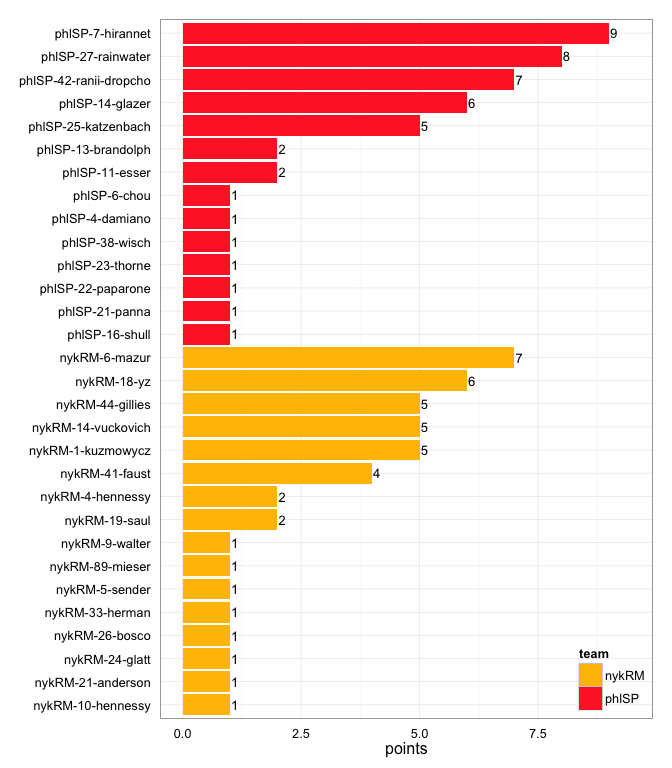
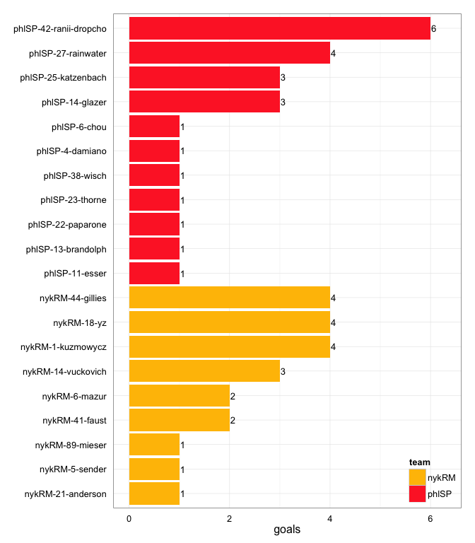
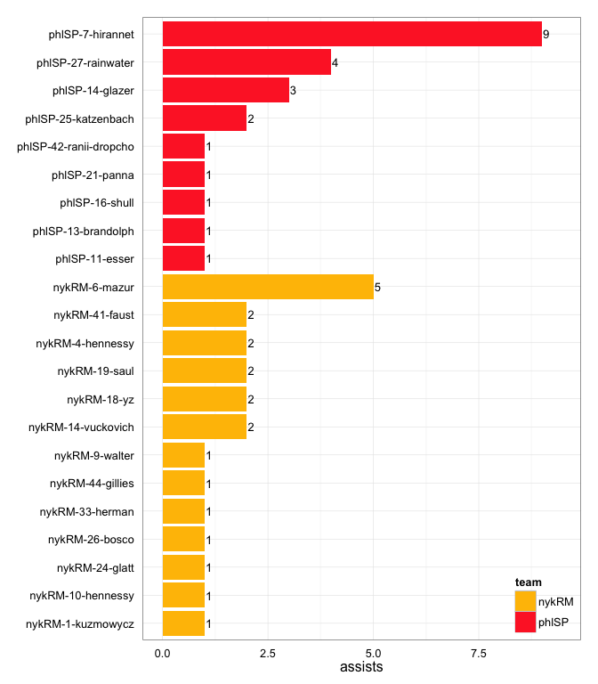
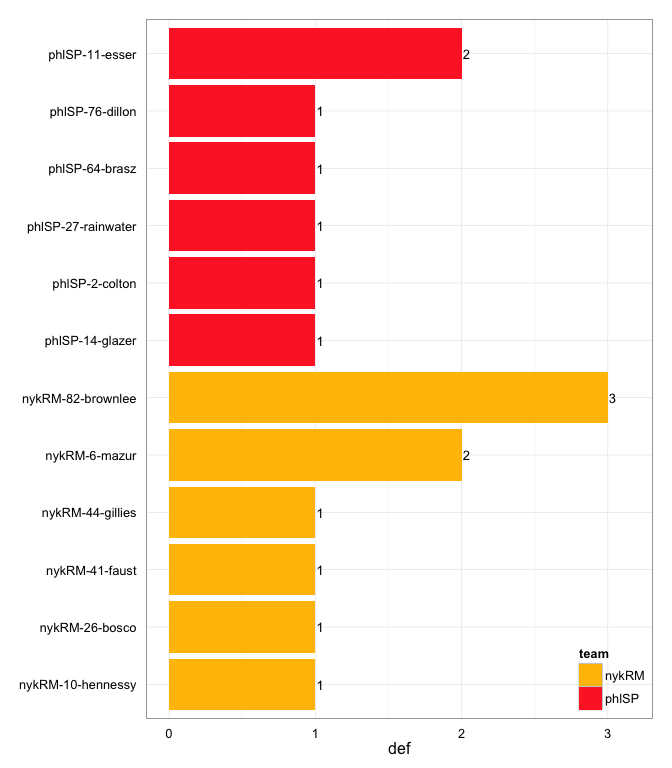

# phlSP at nykRM 2014-06-08

# phlSP 23
# nykRM 22
## game is complete

Go to ...  
  * [Scoring progression](#scoringProgression)  
  * [Player stats via figures](#pl_figs)  
  * [Player stats for phlSP](#away)  
  * [Player stats for nykRM](#home)  
  * [Data on goals, assists, D's](#selectData)  
  * [Full raw data](#rawData)  

## Scoring progression:

| point|period |begin    |end |pt_duration |desc                                          |phlSP |nykRM |
|-----:|:------|:--------|:---|:-----------|:---------------------------------------------|:-----|:-----|
|    49|4      |NA       |NA  |???         |- no goal -                                   |23    |22    |
|    48|4      |NA       |NA  |???         |phlSP-27-rainwater to phlSP-42-ranii-dropcho  |23    |22    |
|    47|4      |NA       |NA  |???         |nykRM-18-yz to nykRM-44-gillies               |22    |22    |
|    46|4      |NA       |NA  |???         |phlSP-13-brandolph to phlSP-42-ranii-dropcho  |22    |21    |
|    45|4      |NA       |NA  |???         |nykRM-14-vuckovich to nykRM-18-yz             |21    |21    |
|    44|4      |NA       |NA  |???         |phlSP-7-hirannet to phlSP-25-katzenbach       |21    |20    |
|    43|4      |NA       |NA  |???         |nykRM-18-yz to nykRM-14-vuckovich             |20    |20    |
|    42|4      |NA       |NA  |???         |phlSP-7-hirannet to phlSP-14-glazer           |20    |19    |
|    41|4      |6:57:00  |NA  |???         |nykRM-26-bosco to nykRM-14-vuckovich          |19    |19    |
|    40|4      |NA       |NA  |???         |phlSP-14-glazer to phlSP-42-ranii-dropcho     |19    |18    |
|    39|4      |NA       |NA  |???         |nykRM-6-mazur to nykRM-18-yz                  |18    |18    |
|    38|4      |NA       |NA  |???         |phlSP-16-shull to phlSP-6-chou                |18    |17    |
|    37|3      |NA       |NA  |???         |- no goal -                                   |17    |17    |
|    36|3      |NA       |NA  |???         |phlSP-25-katzenbach to phlSP-42-ranii-dropcho |17    |17    |
|    35|3      |NA       |NA  |???         |nykRM-19-saul to nykRM-44-gillies             |16    |17    |
|    34|3      |NA       |NA  |???         |phlSP-25-katzenbach to phlSP-13-brandolph     |16    |16    |
|    33|3      |3:38:00  |NA  |???         |nykRM-41-faust to nykRM-6-mazur               |15    |16    |
|    32|3      |NA       |NA  |???         |phlSP-27-rainwater to phlSP-25-katzenbach     |15    |15    |
|    31|3      |NA       |NA  |???         |nykRM-1-kuzmowycz to nykRM-44-gillies         |14    |15    |
|    30|3      |NA       |NA  |???         |nykRM-19-saul to nykRM-1-kuzmowycz            |14    |14    |
|    29|3      |NA       |NA  |???         |phlSP-7-hirannet to phlSP-14-glazer           |14    |13    |
|    28|3      |NA       |NA  |???         |nykRM-6-mazur to nykRM-44-gillies             |13    |13    |
|    27|3      |NA       |NA  |???         |phlSP-14-glazer to phlSP-27-rainwater         |13    |12    |
|    26|3      |NA       |NA  |???         |nykRM-41-faust to nykRM-18-yz                 |12    |12    |
|    25|3      |NA       |NA  |???         |phlSP-7-hirannet to phlSP-42-ranii-dropcho    |12    |11    |
|    24|3      |NA       |NA  |???         |nykRM-6-mazur to nykRM-18-yz                  |11    |11    |
|    23|3      |NA       |NA  |???         |phlSP-27-rainwater to phlSP-25-katzenbach     |11    |10    |
|    22|3      |NA       |NA  |???         |nykRM-14-vuckovich to nykRM-6-mazur           |10    |10    |
|    21|3      |NA       |NA  |???         |phlSP-42-ranii-dropcho to phlSP-14-glazer     |10    |9     |
|    20|3      |NA       |NA  |???         |nykRM-24-glatt to nykRM-89-mieser             |9     |9     |
|    19|2      |NA       |NA  |???         |- no goal -                                   |9     |8     |
|    18|2      |NA       |NA  |???         |nykRM-6-mazur to nykRM-14-vuckovich           |9     |8     |
|    17|2      |NA       |NA  |???         |phlSP-7-hirannet to phlSP-27-rainwater        |9     |7     |
|    16|2      |NA       |NA  |???         |nykRM-6-mazur to nykRM-1-kuzmowycz            |8     |7     |
|    15|2      |NA       |NA  |???         |phlSP-7-hirannet to phlSP-22-paparone         |8     |6     |
|    14|2      |NA       |NA  |???         |phlSP-21-panna to phlSP-11-esser              |7     |6     |
|    13|2      |NA       |NA  |???         |phlSP-7-hirannet to phlSP-23-thorne           |6     |6     |
|    12|2      |NA       |NA  |???         |nykRM-33-herman to nykRM-1-kuzmowycz          |5     |6     |
|    11|2      |NA       |NA  |???         |phlSP-7-hirannet to phlSP-38-wisch            |5     |5     |
|    10|2      |NA       |NA  |???         |nykRM-10-hennessy to nykRM-5-sender           |4     |5     |
|     9|2      |NA       |NA  |???         |nykRM-4-hennessy to nykRM-41-faust            |4     |4     |
|     8|1      |NA       |NA  |???         |- no goal -                                   |4     |3     |
|     7|1      |NA       |NA  |???         |phlSP-27-rainwater to phlSP-42-ranii-dropcho  |4     |3     |
|     6|1      |NA       |NA  |???         |nykRM-44-gillies to nykRM-1-kuzmowycz         |3     |3     |
|     5|1      |NA       |NA  |???         |phlSP-14-glazer to phlSP-27-rainwater         |3     |2     |
|     4|1      |NA       |NA  |???         |phlSP-11-esser to phlSP-4-damiano             |2     |2     |
|     3|1      |NA       |NA  |???         |nykRM-9-walter to nykRM-21-anderson           |1     |2     |
|     2|1      |NA       |NA  |???         |nykRM-4-hennessy to nykRM-41-faust            |1     |1     |
|     1|1      |10:00:00 |NA  |???         |phlSP-7-hirannet to phlSP-27-rainwater        |1     |0     |

## Player stats via figures:

### Points = goals + assists

 

### Goals

 

### Assists

 

### D's
 

## Player stats for phlSP :

points = goals + assists  
tables sorted in decreasing order based on points (then goals, assists, Ds)  
Ds = total of plain ol' D's + interceptions (D), hand blocks (HB), and foot blocks (FB)  
stats are cumulative for this game

|   |player   |last          | points| comp_pct| goals| assists| throws| completions| catches| def| drop|
|:--|:--------|:-------------|------:|--------:|-----:|-------:|------:|-----------:|-------:|---:|----:|
|22 |phlSP-7  |hirannet      |      9|     0.95|     0|       9|     58|          55|      49|   0|    0|
|23 |phlSP-27 |rainwater     |      8|     1.00|     4|       4|     29|          29|      33|   1|    0|
|24 |phlSP-42 |ranii-dropcho |      7|     0.90|     6|       1|     21|          19|      27|   0|    0|
|25 |phlSP-14 |glazer        |      6|     0.95|     3|       3|     20|          19|      22|   1|    0|
|26 |phlSP-25 |katzenbach    |      5|     1.00|     3|       2|     34|          34|      34|   0|    0|
|27 |phlSP-11 |esser         |      2|     0.83|     1|       1|      6|           5|       7|   2|    0|
|28 |phlSP-13 |brandolph     |      2|     0.98|     1|       1|     48|          47|      38|   0|    0|
|29 |phlSP-22 |paparone      |      1|     1.00|     1|       0|      1|           1|       2|   0|    0|
|30 |phlSP-23 |thorne        |      1|     0.94|     1|       0|     17|          16|      16|   0|    0|
|31 |phlSP-38 |wisch         |      1|     1.00|     1|       0|      3|           3|       4|   0|    0|
|32 |phlSP-4  |damiano       |      1|     0.83|     1|       0|      6|           5|       6|   0|    0|
|33 |phlSP-6  |chou          |      1|     0.67|     1|       0|      3|           2|       5|   0|    0|
|34 |phlSP-16 |shull         |      1|     1.00|     0|       1|      4|           4|       4|   0|    0|
|35 |phlSP-21 |panna         |      1|     1.00|     0|       1|      9|           9|       6|   0|    0|
|36 |phlSP-2  |colton        |      0|     0.88|     0|       0|      8|           7|       3|   1|    0|
|37 |phlSP-64 |brasz         |      0|     0.90|     0|       0|     10|           9|       8|   1|    0|
|38 |phlSP-76 |dillon        |      0|     0.33|     0|       0|      3|           1|       3|   1|    1|
|39 |phlSP-   |?name?        |      0|       NA|     0|       0|      0|           0|       0|   0|    0|
|40 |phlSP-1  |peters        |      0|     0.50|     0|       0|      6|           3|       5|   0|    1|
|41 |phlSP-10 |casey         |      0|       NA|     0|       0|      0|           0|       0|   0|    0|
|42 |phlSP-20 |baer          |      0|     1.00|     0|       0|     15|          15|      10|   0|    0|
|43 |phlSP-28 |baer          |      0|     1.00|     0|       0|      3|           3|       1|   0|    0|
|44 |phlSP-3  |earles        |      0|     0.67|     0|       0|      6|           4|       6|   0|    0|
|45 |phlSP-31 |lindsey       |      0|     1.00|     0|       0|      2|           2|       2|   0|    0|
|46 |phlSP-33 |ward          |      0|     1.00|     0|       0|      1|           1|       1|   0|    0|
|47 |phlSP-9  |diviney       |      0|       NA|     0|       0|      0|           0|       1|   0|    0|

## Player stats for nykRM :

points = goals + assists  
tables sorted in decreasing order based on points (then goals, assists, Ds)  
Ds = total of plain ol' D's + interceptions (D), hand blocks (HB), and foot blocks (FB)  
stats are cumulative for this game

|   |player   |last      | points| comp_pct| goals| assists| throws| completions| catches| def| drop|
|:--|:--------|:---------|------:|--------:|-----:|-------:|------:|-----------:|-------:|---:|----:|
|1  |nykRM-6  |mazur     |      7|     0.93|     2|       5|     29|          27|      24|   2|    2|
|2  |nykRM-18 |yz        |      6|     1.00|     4|       2|      6|           6|      10|   0|    0|
|3  |nykRM-44 |gillies   |      5|     1.00|     4|       1|     10|          10|      13|   1|    0|
|4  |nykRM-1  |kuzmowycz |      5|     0.89|     4|       1|      9|           8|      13|   0|    0|
|5  |nykRM-14 |vuckovich |      5|     0.82|     3|       2|     17|          14|      20|   0|    1|
|6  |nykRM-41 |faust     |      4|     0.83|     2|       2|     12|          10|      13|   1|    0|
|7  |nykRM-19 |saul      |      2|     0.88|     0|       2|     25|          22|      20|   0|    2|
|8  |nykRM-4  |hennessy  |      2|     0.93|     0|       2|     30|          28|      19|   0|    0|
|9  |nykRM-21 |anderson  |      1|     0.60|     1|       0|      5|           3|       6|   0|    0|
|10 |nykRM-5  |sender    |      1|     0.89|     1|       0|      9|           8|       7|   0|    0|
|11 |nykRM-89 |mieser    |      1|     1.00|     1|       0|      2|           2|       3|   0|    0|
|12 |nykRM-10 |hennessy  |      1|     1.00|     0|       1|      3|           3|       2|   1|    0|
|13 |nykRM-26 |bosco     |      1|     1.00|     0|       1|     13|          13|       7|   1|    0|
|14 |nykRM-24 |glatt     |      1|     0.80|     0|       1|      5|           4|       2|   0|    0|
|15 |nykRM-33 |herman    |      1|     1.00|     0|       1|      4|           4|       3|   0|    0|
|16 |nykRM-9  |walter    |      1|     1.00|     0|       1|      4|           4|       4|   0|    0|
|17 |nykRM-82 |brownlee  |      0|     0.33|     0|       0|      3|           1|       3|   3|    0|
|18 |nykRM-   |?name?    |      0|       NA|     0|       0|      0|           0|       0|   0|    0|
|19 |nykRM-27 |wilson    |      0|     1.00|     0|       0|      4|           4|       4|   0|    0|
|20 |nykRM-47 |murphy    |      0|     1.00|     0|       0|      7|           7|       5|   0|    0|
|21 |nykRM-81 |murray    |      0|     1.00|     0|       0|      3|           3|       3|   0|    0|

## Raw data on select events (goals, assists, D's):

| point| period|pull_team | event| poss_abs| poss_rel|poss_team |pl_team |pl_pnum |pl_code |pl_lname      |player                 | nykRM| phlSP|
|-----:|------:|:---------|-----:|--------:|--------:|:---------|:-------|:-------|:-------|:-------------|:----------------------|-----:|-----:|
|     1|      1|nykRM     |    17|        1|        1|phlSP     |phlSP   |7       |A       |hirannet      |phlSP-7-hirannet       |     0|     1|
|     1|      1|nykRM     |    18|        1|        1|phlSP     |phlSP   |27      |G       |rainwater     |phlSP-27-rainwater     |     0|     1|
|     2|      1|phlSP     |     5|        2|        1|nykRM     |nykRM   |4       |A       |hennessy      |nykRM-4-hennessy       |     1|     1|
|     2|      1|phlSP     |     6|        2|        1|nykRM     |nykRM   |41      |LG      |faust         |nykRM-41-faust         |     1|     1|
|     3|      1|nykRM     |    34|        6|        4|nykRM     |nykRM   |9       |A       |walter        |nykRM-9-walter         |     2|     1|
|     3|      1|nykRM     |    35|        6|        4|nykRM     |nykRM   |21      |G       |anderson      |nykRM-21-anderson      |     2|     1|
|     4|      1|nykRM     |     4|        7|        1|phlSP     |phlSP   |11      |A       |esser         |phlSP-11-esser         |     2|     2|
|     4|      1|nykRM     |     5|        7|        1|phlSP     |phlSP   |4       |G       |damiano       |phlSP-4-damiano        |     2|     2|
|     5|      1|phlSP     |    10|        9|        2|phlSP     |nykRM   |41      |D       |faust         |nykRM-41-faust         |     2|     3|
|     5|      1|phlSP     |    17|       11|        4|phlSP     |nykRM   |6       |D       |mazur         |nykRM-6-mazur          |     2|     3|
|     5|      1|phlSP     |    31|       12|        5|nykRM     |phlSP   |2       |D       |colton        |phlSP-2-colton         |     2|     3|
|     5|      1|phlSP     |    47|       13|        6|phlSP     |phlSP   |14      |A       |glazer        |phlSP-14-glazer        |     2|     3|
|     5|      1|phlSP     |    48|       13|        6|phlSP     |phlSP   |27      |G       |rainwater     |phlSP-27-rainwater     |     2|     3|
|     6|      1|phlSP     |     7|       14|        1|nykRM     |nykRM   |44      |A       |gillies       |nykRM-44-gillies       |     3|     3|
|     6|      1|phlSP     |     8|       14|        1|nykRM     |nykRM   |1       |G       |kuzmowycz     |nykRM-1-kuzmowycz      |     3|     3|
|     7|      1|nykRM     |     6|       15|        1|phlSP     |phlSP   |27      |LA      |rainwater     |phlSP-27-rainwater     |     3|     4|
|     7|      1|nykRM     |     7|       15|        1|phlSP     |phlSP   |42      |G       |ranii-dropcho |phlSP-42-ranii-dropcho |     3|     4|
|     8|      1|phlSP     |    11|       16|        1|nykRM     |phlSP   |11      |D       |esser         |phlSP-11-esser         |     3|     4|
|     9|      2|phlSP     |     8|       18|        1|nykRM     |nykRM   |4       |A       |hennessy      |nykRM-4-hennessy       |     4|     4|
|     9|      2|phlSP     |     9|       18|        1|nykRM     |nykRM   |41      |G       |faust         |nykRM-41-faust         |     4|     4|
|    10|      2|nykRM     |     8|       19|        1|phlSP     |nykRM   |82      |D       |brownlee      |nykRM-82-brownlee      |     5|     4|
|    10|      2|nykRM     |    13|       20|        2|nykRM     |nykRM   |10      |A       |hennessy      |nykRM-10-hennessy      |     5|     4|
|    10|      2|nykRM     |    14|       20|        2|nykRM     |nykRM   |5       |G       |sender        |nykRM-5-sender         |     5|     4|
|    11|      2|nykRM     |    12|       23|        3|phlSP     |phlSP   |7       |PUA     |hirannet      |phlSP-7-hirannet       |     5|     5|
|    11|      2|nykRM     |    13|       23|        3|phlSP     |phlSP   |38      |G       |wisch         |phlSP-38-wisch         |     5|     5|
|    12|      2|phlSP     |     9|       24|        1|nykRM     |nykRM   |33      |A       |herman        |nykRM-33-herman        |     6|     5|
|    12|      2|phlSP     |    10|       24|        1|nykRM     |nykRM   |1       |G       |kuzmowycz     |nykRM-1-kuzmowycz      |     6|     5|
|    13|      2|nykRM     |    15|       25|        1|phlSP     |phlSP   |7       |A       |hirannet      |phlSP-7-hirannet       |     6|     6|
|    13|      2|nykRM     |    16|       25|        1|phlSP     |phlSP   |23      |G       |thorne        |phlSP-23-thorne        |     6|     6|
|    14|      2|phlSP     |     4|       26|        1|nykRM     |phlSP   |11      |D       |esser         |phlSP-11-esser         |     6|     7|
|    14|      2|phlSP     |    18|       27|        2|phlSP     |phlSP   |21      |A       |panna         |phlSP-21-panna         |     6|     7|
|    14|      2|phlSP     |    20|       27|        2|phlSP     |phlSP   |11      |G       |esser         |phlSP-11-esser         |     6|     7|
|    15|      2|phlSP     |    17|       29|        2|phlSP     |phlSP   |7       |A       |hirannet      |phlSP-7-hirannet       |     6|     8|
|    15|      2|phlSP     |    18|       29|        2|phlSP     |phlSP   |22      |G       |paparone      |phlSP-22-paparone      |     6|     8|
|    16|      2|phlSP     |     6|       30|        1|nykRM     |nykRM   |6       |A       |mazur         |nykRM-6-mazur          |     7|     8|
|    16|      2|phlSP     |     7|       30|        1|nykRM     |nykRM   |1       |G       |kuzmowycz     |nykRM-1-kuzmowycz      |     7|     8|
|    17|      2|nykRM     |    20|       32|        2|nykRM     |phlSP   |27      |D       |rainwater     |phlSP-27-rainwater     |     7|     9|
|    17|      2|nykRM     |    32|       33|        3|phlSP     |phlSP   |7       |A       |hirannet      |phlSP-7-hirannet       |     7|     9|
|    17|      2|nykRM     |    33|       33|        3|phlSP     |phlSP   |27      |G       |rainwater     |phlSP-27-rainwater     |     7|     9|
|    18|      2|phlSP     |     9|       36|        3|nykRM     |nykRM   |6       |A       |mazur         |nykRM-6-mazur          |     8|     9|
|    18|      2|phlSP     |    10|       36|        3|nykRM     |nykRM   |14      |G       |vuckovich     |nykRM-14-vuckovich     |     8|     9|
|    19|      2|nykRM     |    NA|       NA|       NA|NA        |NA      |NA      |NA      |NA            |NA-NA-NA               |     8|     9|
|    20|      3|nykRM     |    10|       38|        1|phlSP     |nykRM   |10      |D       |hennessy      |nykRM-10-hennessy      |     9|     9|
|    20|      3|nykRM     |    12|       39|        2|nykRM     |nykRM   |24      |A       |glatt         |nykRM-24-glatt         |     9|     9|
|    20|      3|nykRM     |    13|       39|        2|nykRM     |nykRM   |89      |G       |mieser        |nykRM-89-mieser        |     9|     9|
|    21|      3|nykRM     |     9|       40|        1|phlSP     |phlSP   |42      |A       |ranii-dropcho |phlSP-42-ranii-dropcho |     9|    10|
|    21|      3|nykRM     |    10|       40|        1|phlSP     |phlSP   |14      |G       |glazer        |phlSP-14-glazer        |     9|    10|
|    22|      3|phlSP     |     4|       41|        1|nykRM     |nykRM   |14      |A       |vuckovich     |nykRM-14-vuckovich     |    10|    10|
|    22|      3|phlSP     |     5|       41|        1|nykRM     |nykRM   |6       |G       |mazur         |nykRM-6-mazur          |    10|    10|
|    23|      3|nykRM     |     4|       42|        1|phlSP     |phlSP   |27      |A       |rainwater     |phlSP-27-rainwater     |    10|    11|
|    23|      3|nykRM     |     5|       42|        1|phlSP     |phlSP   |25      |LG      |katzenbach    |phlSP-25-katzenbach    |    10|    11|
|    24|      3|phlSP     |     2|       43|        1|nykRM     |nykRM   |6       |PUA     |mazur         |nykRM-6-mazur          |    11|    11|
|    24|      3|phlSP     |     3|       43|        1|nykRM     |nykRM   |18      |LG      |yz            |nykRM-18-yz            |    11|    11|
|    25|      3|nykRM     |    15|       44|        1|phlSP     |phlSP   |7       |A       |hirannet      |phlSP-7-hirannet       |    11|    12|
|    25|      3|nykRM     |    16|       44|        1|phlSP     |phlSP   |42      |G       |ranii-dropcho |phlSP-42-ranii-dropcho |    11|    12|
|    26|      3|phlSP     |     5|       45|        1|nykRM     |nykRM   |41      |A       |faust         |nykRM-41-faust         |    12|    12|
|    26|      3|phlSP     |     6|       45|        1|nykRM     |nykRM   |18      |G       |yz            |nykRM-18-yz            |    12|    12|
|    27|      3|nykRM     |    12|       46|        1|phlSP     |phlSP   |14      |A       |glazer        |phlSP-14-glazer        |    12|    13|
|    27|      3|nykRM     |    13|       46|        1|phlSP     |phlSP   |27      |G       |rainwater     |phlSP-27-rainwater     |    12|    13|
|    28|      3|phlSP     |     6|       47|        1|nykRM     |nykRM   |6       |A       |mazur         |nykRM-6-mazur          |    13|    13|
|    28|      3|phlSP     |     7|       47|        1|nykRM     |nykRM   |44      |G       |gillies       |nykRM-44-gillies       |    13|    13|
|    29|      3|nykRM     |     9|       48|        1|phlSP     |phlSP   |7       |A       |hirannet      |phlSP-7-hirannet       |    13|    14|
|    29|      3|nykRM     |    10|       48|        1|phlSP     |phlSP   |14      |G       |glazer        |phlSP-14-glazer        |    13|    14|
|    30|      3|phlSP     |    11|       49|        1|nykRM     |nykRM   |19      |A       |saul          |nykRM-19-saul          |    14|    14|
|    30|      3|phlSP     |    12|       49|        1|nykRM     |nykRM   |1       |G       |kuzmowycz     |nykRM-1-kuzmowycz      |    14|    14|
|    31|      3|nykRM     |    15|       50|        1|phlSP     |nykRM   |82      |D       |brownlee      |nykRM-82-brownlee      |    15|    14|
|    31|      3|nykRM     |    20|       51|        2|nykRM     |nykRM   |1       |A       |kuzmowycz     |nykRM-1-kuzmowycz      |    15|    14|
|    31|      3|nykRM     |    21|       51|        2|nykRM     |nykRM   |44      |LG      |gillies       |nykRM-44-gillies       |    15|    14|
|    32|      3|nykRM     |     6|       52|        1|phlSP     |phlSP   |27      |A       |rainwater     |phlSP-27-rainwater     |    15|    15|
|    32|      3|nykRM     |     7|       52|        1|phlSP     |phlSP   |25      |LG      |katzenbach    |phlSP-25-katzenbach    |    15|    15|
|    33|      3|phlSP     |    11|       53|        1|nykRM     |nykRM   |41      |A       |faust         |nykRM-41-faust         |    16|    15|
|    33|      3|phlSP     |    12|       53|        1|nykRM     |nykRM   |6       |G       |mazur         |nykRM-6-mazur          |    16|    15|
|    34|      3|nykRM     |    11|       54|        1|phlSP     |phlSP   |25      |A       |katzenbach    |phlSP-25-katzenbach    |    16|    16|
|    34|      3|nykRM     |    12|       54|        1|phlSP     |phlSP   |13      |G       |brandolph     |phlSP-13-brandolph     |    16|    16|
|    35|      3|phlSP     |    19|       57|        3|nykRM     |nykRM   |19      |A       |saul          |nykRM-19-saul          |    17|    16|
|    35|      3|phlSP     |    20|       57|        3|nykRM     |nykRM   |44      |G       |gillies       |nykRM-44-gillies       |    17|    16|
|    36|      3|nykRM     |    14|       58|        1|phlSP     |phlSP   |25      |A       |katzenbach    |phlSP-25-katzenbach    |    17|    17|
|    36|      3|nykRM     |    15|       58|        1|phlSP     |phlSP   |42      |G       |ranii-dropcho |phlSP-42-ranii-dropcho |    17|    17|
|    37|      3|phlSP     |    10|       60|        2|phlSP     |nykRM   |6       |D       |mazur         |nykRM-6-mazur          |    17|    17|
|    38|      4|phlSP     |     9|       62|        2|phlSP     |phlSP   |16      |A       |shull         |phlSP-16-shull         |    17|    18|
|    38|      4|phlSP     |    10|       62|        2|phlSP     |phlSP   |6       |LG      |chou          |phlSP-6-chou           |    17|    18|
|    39|      4|phlSP     |     3|       63|        1|nykRM     |phlSP   |76      |D       |dillon        |phlSP-76-dillon        |    18|    18|
|    39|      4|phlSP     |     6|       64|        2|phlSP     |nykRM   |82      |D       |brownlee      |nykRM-82-brownlee      |    18|    18|
|    39|      4|phlSP     |    13|       65|        3|nykRM     |nykRM   |6       |A       |mazur         |nykRM-6-mazur          |    18|    18|
|    39|      4|phlSP     |    14|       65|        3|nykRM     |nykRM   |18      |G       |yz            |nykRM-18-yz            |    18|    18|
|    40|      4|nykRM     |    17|       68|        3|phlSP     |phlSP   |14      |A       |glazer        |phlSP-14-glazer        |    18|    19|
|    40|      4|nykRM     |    18|       68|        3|phlSP     |phlSP   |42      |G       |ranii-dropcho |phlSP-42-ranii-dropcho |    18|    19|
|    41|      4|phlSP     |    10|       70|        2|phlSP     |nykRM   |26      |D       |bosco         |nykRM-26-bosco         |    19|    19|
|    41|      4|phlSP     |    12|       71|        3|nykRM     |nykRM   |26      |A       |bosco         |nykRM-26-bosco         |    19|    19|
|    41|      4|phlSP     |    13|       71|        3|nykRM     |nykRM   |14      |LG      |vuckovich     |nykRM-14-vuckovich     |    19|    19|
|    42|      4|nykRM     |    11|       72|        1|phlSP     |phlSP   |7       |A       |hirannet      |phlSP-7-hirannet       |    19|    20|
|    42|      4|nykRM     |    12|       72|        1|phlSP     |phlSP   |14      |G       |glazer        |phlSP-14-glazer        |    19|    20|
|    43|      4|phlSP     |    13|       73|        1|nykRM     |nykRM   |18      |A       |yz            |nykRM-18-yz            |    20|    20|
|    43|      4|phlSP     |    14|       73|        1|nykRM     |nykRM   |14      |G       |vuckovich     |nykRM-14-vuckovich     |    20|    20|
|    44|      4|nykRM     |    12|       75|        2|nykRM     |phlSP   |14      |D       |glazer        |phlSP-14-glazer        |    20|    21|
|    44|      4|nykRM     |    14|       76|        3|phlSP     |phlSP   |7       |A       |hirannet      |phlSP-7-hirannet       |    20|    21|
|    44|      4|nykRM     |    15|       76|        3|phlSP     |phlSP   |25      |G       |katzenbach    |phlSP-25-katzenbach    |    20|    21|
|    45|      4|phlSP     |     5|       77|        1|nykRM     |nykRM   |14      |A       |vuckovich     |nykRM-14-vuckovich     |    21|    21|
|    45|      4|phlSP     |     7|       77|        1|nykRM     |nykRM   |18      |LG      |yz            |nykRM-18-yz            |    21|    21|
|    46|      4|nykRM     |     6|       78|        1|phlSP     |phlSP   |13      |A       |brandolph     |phlSP-13-brandolph     |    21|    22|
|    46|      4|nykRM     |     7|       78|        1|phlSP     |phlSP   |42      |G       |ranii-dropcho |phlSP-42-ranii-dropcho |    21|    22|
|    47|      4|phlSP     |     5|       79|        1|nykRM     |phlSP   |64      |D       |brasz         |phlSP-64-brasz         |    22|    22|
|    47|      4|phlSP     |     7|       80|        2|phlSP     |nykRM   |44      |D       |gillies       |nykRM-44-gillies       |    22|    22|
|    47|      4|phlSP     |    13|       81|        3|nykRM     |nykRM   |18      |A       |yz            |nykRM-18-yz            |    22|    22|
|    47|      4|phlSP     |    14|       81|        3|nykRM     |nykRM   |44      |G       |gillies       |nykRM-44-gillies       |    22|    22|
|    48|      4|nykRM     |    17|       82|        1|phlSP     |phlSP   |27      |A       |rainwater     |phlSP-27-rainwater     |    22|    23|
|    48|      4|nykRM     |    18|       82|        1|phlSP     |phlSP   |42      |G       |ranii-dropcho |phlSP-42-ranii-dropcho |    22|    23|
|    49|      4|phlSP     |    NA|       NA|       NA|NA        |NA      |NA      |NA      |NA            |NA-NA-NA               |    22|    23|

## Full raw data:

__Note: just for display purposes.__ Raw data in more useful forms can be found in the [GitHub repository](https://github.com/jennybc/vanNH). Find the game you're interested in in the `games` subdirectory.

| period| point|pull_team | event| poss_abs| poss_rel|poss_team |pl_team |pl_pnum |pl_code |
|------:|-----:|:---------|-----:|--------:|--------:|:---------|:-------|:-------|:-------|
|      1|     1|nykRM     |     1|        1|        1|phlSP     |nykRM   |47      |P       |
|      1|     1|nykRM     |     2|        1|        1|phlSP     |phlSP   |25      |PU      |
|      1|     1|nykRM     |     3|        1|        1|phlSP     |phlSP   |14      |        |
|      1|     1|nykRM     |     4|        1|        1|phlSP     |phlSP   |25      |        |
|      1|     1|nykRM     |     5|        1|        1|phlSP     |phlSP   |13      |        |
|      1|     1|nykRM     |     6|        1|        1|phlSP     |phlSP   |27      |        |
|      1|     1|nykRM     |     7|        1|        1|phlSP     |phlSP   |7       |        |
|      1|     1|nykRM     |     8|        1|        1|phlSP     |phlSP   |42      |        |
|      1|     1|nykRM     |     9|        1|        1|phlSP     |nykRM   |10      |F       |
|      1|     1|nykRM     |    10|        1|        1|phlSP     |phlSP   |10      |SO      |
|      1|     1|nykRM     |    11|        1|        1|phlSP     |phlSP   |9       |SI      |
|      1|     1|nykRM     |    12|        1|        1|phlSP     |phlSP   |7       |        |
|      1|     1|nykRM     |    13|        1|        1|phlSP     |phlSP   |27      |        |
|      1|     1|nykRM     |    14|        1|        1|phlSP     |phlSP   |13      |        |
|      1|     1|nykRM     |    15|        1|        1|phlSP     |phlSP   |42      |        |
|      1|     1|nykRM     |    16|        1|        1|phlSP     |phlSP   |25      |        |
|      1|     1|nykRM     |    17|        1|        1|phlSP     |phlSP   |7       |A       |
|      1|     1|nykRM     |    18|        1|        1|phlSP     |phlSP   |27      |G       |
|      1|     2|phlSP     |     1|        2|        1|nykRM     |phlSP   |64      |P       |
|      1|     2|phlSP     |     2|        2|        1|nykRM     |nykRM   |4       |PU      |
|      1|     2|phlSP     |     3|        2|        1|nykRM     |nykRM   |6       |        |
|      1|     2|phlSP     |     4|        2|        1|nykRM     |nykRM   |44      |        |
|      1|     2|phlSP     |     5|        2|        1|nykRM     |nykRM   |4       |A       |
|      1|     2|phlSP     |     6|        2|        1|nykRM     |nykRM   |41      |LG      |
|      1|     3|nykRM     |     1|        3|        1|phlSP     |nykRM   |81      |P       |
|      1|     3|nykRM     |     2|        3|        1|phlSP     |phlSP   |7       |PU      |
|      1|     3|nykRM     |     3|        3|        1|phlSP     |phlSP   |13      |        |
|      1|     3|nykRM     |     4|        3|        1|phlSP     |phlSP   |7       |        |
|      1|     3|nykRM     |     5|        3|        1|phlSP     |phlSP   |13      |        |
|      1|     3|nykRM     |     6|        3|        1|phlSP     |phlSP   |25      |        |
|      1|     3|nykRM     |     7|        3|        1|phlSP     |phlSP   |42      |        |
|      1|     3|nykRM     |     8|        3|        1|phlSP     |phlSP   |27      |        |
|      1|     3|nykRM     |     9|        3|        1|phlSP     |phlSP   |9       |        |
|      1|     3|nykRM     |    10|        3|        1|phlSP     |phlSP   |9       |SO      |
|      1|     3|nykRM     |    11|        3|        1|phlSP     |phlSP   |23      |SI      |
|      1|     3|nykRM     |    12|        3|        1|phlSP     |phlSP   |23      |PU      |
|      1|     3|nykRM     |    13|        3|        1|phlSP     |phlSP   |7       |        |
|      1|     3|nykRM     |    14|        3|        1|phlSP     |phlSP   |14      |        |
|      1|     3|nykRM     |    15|        3|        1|phlSP     |phlSP   |7       |        |
|      1|     3|nykRM     |    16|        3|        1|phlSP     |phlSP   |23      |        |
|      1|     3|nykRM     |    17|        3|        1|phlSP     |phlSP   |42      |        |
|      1|     3|nykRM     |    18|        3|        1|phlSP     |phlSP   |27      |        |
|      1|     3|nykRM     |    19|        3|        1|phlSP     |phlSP   |13      |        |
|      1|     3|nykRM     |    20|        3|        1|phlSP     |phlSP   |7       |        |
|      1|     3|nykRM     |    21|        4|        2|nykRM     |nykRM   |24      |PU      |
|      1|     3|nykRM     |    22|        4|        2|nykRM     |nykRM   |21      |        |
|      1|     3|nykRM     |    23|        4|        2|nykRM     |nykRM   |27      |        |
|      1|     3|nykRM     |    24|        4|        2|nykRM     |nykRM   |82      |        |
|      1|     3|nykRM     |    25|        5|        3|phlSP     |phlSP   |7       |PU      |
|      1|     3|nykRM     |    26|        5|        3|phlSP     |phlSP   |14      |        |
|      1|     3|nykRM     |    27|        5|        3|phlSP     |phlSP   |27      |        |
|      1|     3|nykRM     |    28|        5|        3|phlSP     |phlSP   |23      |        |
|      1|     3|nykRM     |    29|        6|        4|nykRM     |nykRM   |24      |PU      |
|      1|     3|nykRM     |    30|        6|        4|nykRM     |nykRM   |47      |        |
|      1|     3|nykRM     |    31|        6|        4|nykRM     |nykRM   |27      |        |
|      1|     3|nykRM     |    32|        6|        4|nykRM     |nykRM   |82      |        |
|      1|     3|nykRM     |    33|        6|        4|nykRM     |nykRM   |81      |        |
|      1|     3|nykRM     |    34|        6|        4|nykRM     |nykRM   |9       |A       |
|      1|     3|nykRM     |    35|        6|        4|nykRM     |nykRM   |21      |G       |
|      1|     4|nykRM     |     1|        7|        1|phlSP     |nykRM   |82      |OBP     |
|      1|     4|nykRM     |     2|        7|        1|phlSP     |phlSP   |20      |PU      |
|      1|     4|nykRM     |     3|        7|        1|phlSP     |nykRM   |9       |F       |
|      1|     4|nykRM     |     4|        7|        1|phlSP     |phlSP   |11      |A       |
|      1|     4|nykRM     |     5|        7|        1|phlSP     |phlSP   |4       |G       |
|      1|     5|phlSP     |     1|        8|        1|nykRM     |phlSP   |1       |P       |
|      1|     5|phlSP     |     2|        8|        1|nykRM     |nykRM   |6       |PU      |
|      1|     5|phlSP     |     3|        8|        1|nykRM     |nykRM   |41      |TD      |
|      1|     5|phlSP     |     4|        9|        2|phlSP     |phlSP   |2       |PU      |
|      1|     5|phlSP     |     5|        9|        2|phlSP     |phlSP   |21      |        |
|      1|     5|phlSP     |     6|        9|        2|phlSP     |phlSP   |2       |        |
|      1|     5|phlSP     |     7|        9|        2|phlSP     |phlSP   |64      |        |
|      1|     5|phlSP     |     8|        9|        2|phlSP     |phlSP   |1       |        |
|      1|     5|phlSP     |     9|        9|        2|phlSP     |phlSP   |6       |        |
|      1|     5|phlSP     |    10|        9|        2|phlSP     |nykRM   |41      |D       |
|      1|     5|phlSP     |    11|       10|        3|nykRM     |nykRM   |41      |PU      |
|      1|     5|phlSP     |    12|       10|        3|nykRM     |nykRM   |4       |        |
|      1|     5|phlSP     |    13|       10|        3|nykRM     |nykRM   |41      |        |
|      1|     5|phlSP     |    14|       11|        4|phlSP     |phlSP   |21      |PU      |
|      1|     5|phlSP     |    15|       11|        4|phlSP     |phlSP   |2       |        |
|      1|     5|phlSP     |    16|       11|        4|phlSP     |phlSP   |1       |        |
|      1|     5|phlSP     |    17|       11|        4|phlSP     |nykRM   |6       |D       |
|      1|     5|phlSP     |    18|       12|        5|nykRM     |nykRM   |6       |PU      |
|      1|     5|phlSP     |    19|       12|        5|nykRM     |nykRM   |4       |        |
|      1|     5|phlSP     |    20|       12|        5|nykRM     |nykRM   |41      |        |
|      1|     5|phlSP     |    21|       12|        5|nykRM     |nykRM   |4       |        |
|      1|     5|phlSP     |    22|       12|        5|nykRM     |nykRM   |33      |        |
|      1|     5|phlSP     |    23|       12|        5|nykRM     |phlSP   |2       |F       |
|      1|     5|phlSP     |    24|       12|        5|nykRM     |nykRM   |4       |        |
|      1|     5|phlSP     |    25|       12|        5|nykRM     |nykRM   |18      |        |
|      1|     5|phlSP     |    26|       12|        5|nykRM     |nykRM   |4       |        |
|      1|     5|phlSP     |    27|       12|        5|nykRM     |nykRM   |6       |        |
|      1|     5|phlSP     |    28|       12|        5|nykRM     |nykRM   |41      |        |
|      1|     5|phlSP     |    29|       12|        5|nykRM     |nykRM   |26      |        |
|      1|     5|phlSP     |    30|       12|        5|nykRM     |nykRM   |4       |        |
|      1|     5|phlSP     |    31|       12|        5|nykRM     |phlSP   |2       |D       |
|      1|     5|phlSP     |    32|       13|        6|phlSP     |phlSP   |21      |PU      |
|      1|     5|phlSP     |    33|       13|        6|phlSP     |phlSP   |1       |        |
|      1|     5|phlSP     |    34|       13|        6|phlSP     |phlSP   |6       |        |
|      1|     5|phlSP     |    35|       13|        6|phlSP     |phlSP   |64      |        |
|      1|     5|phlSP     |    36|       13|        6|phlSP     |phlSP   |21      |        |
|      1|     5|phlSP     |    37|       13|        6|phlSP     |phlSP   |64      |        |
|      1|     5|phlSP     |    38|       13|        6|phlSP     |phlSP   |21      |        |
|      1|     5|phlSP     |    39|       13|        6|phlSP     |phlSP   |6       |        |
|      1|     5|phlSP     |    40|       13|        6|phlSP     |phlSP   |        |TO      |
|      1|     5|phlSP     |    41|       13|        6|phlSP     |phlSP   |13      |PU      |
|      1|     5|phlSP     |    42|       13|        6|phlSP     |phlSP   |25      |        |
|      1|     5|phlSP     |    43|       13|        6|phlSP     |phlSP   |23      |        |
|      1|     5|phlSP     |    44|       13|        6|phlSP     |phlSP   |13      |        |
|      1|     5|phlSP     |    45|       13|        6|phlSP     |phlSP   |7       |        |
|      1|     5|phlSP     |    46|       13|        6|phlSP     |phlSP   |23      |        |
|      1|     5|phlSP     |    47|       13|        6|phlSP     |phlSP   |14      |A       |
|      1|     5|phlSP     |    48|       13|        6|phlSP     |phlSP   |27      |G       |
|      1|     6|phlSP     |     1|       14|        1|nykRM     |phlSP   |16      |P       |
|      1|     6|phlSP     |     2|       14|        1|nykRM     |nykRM   |6       |PU      |
|      1|     6|phlSP     |     3|       14|        1|nykRM     |nykRM   |44      |        |
|      1|     6|phlSP     |     4|       14|        1|nykRM     |nykRM   |41      |        |
|      1|     6|phlSP     |     5|       14|        1|nykRM     |nykRM   |1       |        |
|      1|     6|phlSP     |     6|       14|        1|nykRM     |nykRM   |14      |        |
|      1|     6|phlSP     |     7|       14|        1|nykRM     |nykRM   |44      |A       |
|      1|     6|phlSP     |     8|       14|        1|nykRM     |nykRM   |1       |G       |
|      1|     7|nykRM     |     1|       15|        1|phlSP     |nykRM   |47      |P       |
|      1|     7|nykRM     |     2|       15|        1|phlSP     |phlSP   |25      |PU      |
|      1|     7|nykRM     |     3|       15|        1|phlSP     |phlSP   |7       |        |
|      1|     7|nykRM     |     4|       15|        1|phlSP     |phlSP   |25      |        |
|      1|     7|nykRM     |     5|       15|        1|phlSP     |phlSP   |7       |        |
|      1|     7|nykRM     |     6|       15|        1|phlSP     |phlSP   |27      |LA      |
|      1|     7|nykRM     |     7|       15|        1|phlSP     |phlSP   |42      |G       |
|      1|     8|phlSP     |     1|       16|        1|nykRM     |phlSP   |1       |P       |
|      1|     8|phlSP     |     2|       16|        1|nykRM     |nykRM   |26      |PU      |
|      1|     8|phlSP     |     3|       16|        1|nykRM     |nykRM   |19      |        |
|      1|     8|phlSP     |     4|       16|        1|nykRM     |nykRM   |14      |        |
|      1|     8|phlSP     |     5|       16|        1|nykRM     |nykRM   |1       |        |
|      1|     8|phlSP     |     6|       16|        1|nykRM     |nykRM   |4       |        |
|      1|     8|phlSP     |     7|       16|        1|nykRM     |nykRM   |26      |        |
|      1|     8|phlSP     |     8|       16|        1|nykRM     |nykRM   |19      |        |
|      1|     8|phlSP     |     9|       16|        1|nykRM     |nykRM   |1       |        |
|      1|     8|phlSP     |    10|       16|        1|nykRM     |nykRM   |4       |        |
|      1|     8|phlSP     |    11|       16|        1|nykRM     |phlSP   |11      |D       |
|      1|     8|phlSP     |    12|       17|        2|phlSP     |phlSP   |2       |PU      |
|      1|     8|phlSP     |    13|       17|        2|phlSP     |phlSP   |64      |        |
|      1|     8|phlSP     |    14|       17|        2|phlSP     |phlSP   |1       |        |
|      1|     8|phlSP     |    15|       17|        2|phlSP     |phlSP   |10      |TD      |
|      2|     9|phlSP     |     1|       18|        1|nykRM     |phlSP   |3       |P       |
|      2|     9|phlSP     |     2|       18|        1|nykRM     |nykRM   |4       |PU      |
|      2|     9|phlSP     |     3|       18|        1|nykRM     |nykRM   |19      |        |
|      2|     9|phlSP     |     4|       18|        1|nykRM     |nykRM   |18      |        |
|      2|     9|phlSP     |     5|       18|        1|nykRM     |nykRM   |14      |        |
|      2|     9|phlSP     |     6|       18|        1|nykRM     |nykRM   |41      |        |
|      2|     9|phlSP     |     7|       18|        1|nykRM     |nykRM   |6       |        |
|      2|     9|phlSP     |     8|       18|        1|nykRM     |nykRM   |4       |A       |
|      2|     9|phlSP     |     9|       18|        1|nykRM     |nykRM   |41      |G       |
|      2|    10|nykRM     |     1|       19|        1|phlSP     |nykRM   |47      |P       |
|      2|    10|nykRM     |     2|       19|        1|phlSP     |phlSP   |13      |PU      |
|      2|    10|nykRM     |     3|       19|        1|phlSP     |phlSP   |7       |        |
|      2|    10|nykRM     |     4|       19|        1|phlSP     |phlSP   |13      |        |
|      2|    10|nykRM     |     5|       19|        1|phlSP     |phlSP   |27      |        |
|      2|    10|nykRM     |     6|       19|        1|phlSP     |phlSP   |13      |        |
|      2|    10|nykRM     |     7|       19|        1|phlSP     |phlSP   |14      |        |
|      2|    10|nykRM     |     8|       19|        1|phlSP     |nykRM   |82      |D       |
|      2|    10|nykRM     |     9|       20|        2|nykRM     |nykRM   |5       |PU      |
|      2|    10|nykRM     |    10|       20|        2|nykRM     |nykRM   |10      |        |
|      2|    10|nykRM     |    11|       20|        2|nykRM     |nykRM   |5       |        |
|      2|    10|nykRM     |    12|       20|        2|nykRM     |phlSP   |7       |F       |
|      2|    10|nykRM     |    13|       20|        2|nykRM     |nykRM   |10      |A       |
|      2|    10|nykRM     |    14|       20|        2|nykRM     |nykRM   |5       |G       |
|      2|    11|nykRM     |     1|       21|        1|phlSP     |nykRM   |81      |P       |
|      2|    11|nykRM     |     2|       21|        1|phlSP     |phlSP   |20      |PU      |
|      2|    11|nykRM     |     3|       21|        1|phlSP     |phlSP   |42      |        |
|      2|    11|nykRM     |     4|       21|        1|phlSP     |phlSP   |20      |        |
|      2|    11|nykRM     |     5|       21|        1|phlSP     |phlSP   |38      |        |
|      2|    11|nykRM     |     6|       21|        1|phlSP     |phlSP   |42      |        |
|      2|    11|nykRM     |     7|       21|        1|phlSP     |phlSP   |38      |        |
|      2|    11|nykRM     |     8|       21|        1|phlSP     |phlSP   |3       |        |
|      2|    11|nykRM     |     9|       22|        2|nykRM     |nykRM   |24      |PU      |
|      2|    11|nykRM     |    10|       23|        3|phlSP     |phlSP   |25      |PU      |
|      2|    11|nykRM     |    11|       23|        3|phlSP     |phlSP   |        |TO      |
|      2|    11|nykRM     |    12|       23|        3|phlSP     |phlSP   |7       |PUA     |
|      2|    11|nykRM     |    13|       23|        3|phlSP     |phlSP   |38      |G       |
|      2|    12|phlSP     |     1|       24|        1|nykRM     |phlSP   |1       |P       |
|      2|    12|phlSP     |     2|       24|        1|nykRM     |nykRM   |26      |PU      |
|      2|    12|phlSP     |     3|       24|        1|nykRM     |nykRM   |4       |        |
|      2|    12|phlSP     |     4|       24|        1|nykRM     |nykRM   |44      |        |
|      2|    12|phlSP     |     5|       24|        1|nykRM     |nykRM   |4       |        |
|      2|    12|phlSP     |     6|       24|        1|nykRM     |nykRM   |14      |        |
|      2|    12|phlSP     |     7|       24|        1|nykRM     |phlSP   |22      |F       |
|      2|    12|phlSP     |     8|       24|        1|nykRM     |nykRM   |26      |        |
|      2|    12|phlSP     |     9|       24|        1|nykRM     |nykRM   |33      |A       |
|      2|    12|phlSP     |    10|       24|        1|nykRM     |nykRM   |1       |G       |
|      2|    13|nykRM     |     1|       25|        1|phlSP     |nykRM   |47      |P       |
|      2|    13|nykRM     |     2|       25|        1|phlSP     |phlSP   |13      |PU      |
|      2|    13|nykRM     |     3|       25|        1|phlSP     |phlSP   |7       |        |
|      2|    13|nykRM     |     4|       25|        1|phlSP     |phlSP   |27      |        |
|      2|    13|nykRM     |     5|       25|        1|phlSP     |phlSP   |7       |        |
|      2|    13|nykRM     |     6|       25|        1|phlSP     |phlSP   |25      |        |
|      2|    13|nykRM     |     7|       25|        1|phlSP     |phlSP   |7       |        |
|      2|    13|nykRM     |     8|       25|        1|phlSP     |phlSP   |13      |        |
|      2|    13|nykRM     |     9|       25|        1|phlSP     |phlSP   |27      |        |
|      2|    13|nykRM     |    10|       25|        1|phlSP     |phlSP   |13      |        |
|      2|    13|nykRM     |    11|       25|        1|phlSP     |phlSP   |25      |        |
|      2|    13|nykRM     |    12|       25|        1|phlSP     |phlSP   |23      |        |
|      2|    13|nykRM     |    13|       25|        1|phlSP     |phlSP   |25      |        |
|      2|    13|nykRM     |    14|       25|        1|phlSP     |phlSP   |13      |        |
|      2|    13|nykRM     |    15|       25|        1|phlSP     |phlSP   |7       |A       |
|      2|    13|nykRM     |    16|       25|        1|phlSP     |phlSP   |23      |G       |
|      2|    14|phlSP     |     1|       26|        1|nykRM     |phlSP   |16      |P       |
|      2|    14|phlSP     |     2|       26|        1|nykRM     |nykRM   |19      |PU      |
|      2|    14|phlSP     |     3|       26|        1|nykRM     |nykRM   |41      |        |
|      2|    14|phlSP     |     4|       26|        1|nykRM     |phlSP   |11      |D       |
|      2|    14|phlSP     |     5|       27|        2|phlSP     |phlSP   |28      |PU      |
|      2|    14|phlSP     |     6|       27|        2|phlSP     |phlSP   |16      |        |
|      2|    14|phlSP     |     7|       27|        2|phlSP     |phlSP   |64      |        |
|      2|    14|phlSP     |     8|       27|        2|phlSP     |phlSP   |28      |        |
|      2|    14|phlSP     |     9|       27|        2|phlSP     |phlSP   |11      |        |
|      2|    14|phlSP     |    10|       27|        2|phlSP     |phlSP   |64      |        |
|      2|    14|phlSP     |    11|       27|        2|phlSP     |phlSP   |11      |        |
|      2|    14|phlSP     |    12|       27|        2|phlSP     |phlSP   |16      |        |
|      2|    14|phlSP     |    13|       27|        2|phlSP     |phlSP   |11      |        |
|      2|    14|phlSP     |    14|       27|        2|phlSP     |phlSP   |64      |        |
|      2|    14|phlSP     |    15|       27|        2|phlSP     |phlSP   |21      |        |
|      2|    14|phlSP     |    16|       27|        2|phlSP     |phlSP   |64      |        |
|      2|    14|phlSP     |    17|       27|        2|phlSP     |phlSP   |16      |        |
|      2|    14|phlSP     |    18|       27|        2|phlSP     |phlSP   |21      |A       |
|      2|    14|phlSP     |    19|       27|        2|phlSP     |nykRM   |19      |F       |
|      2|    14|phlSP     |    20|       27|        2|phlSP     |phlSP   |11      |G       |
|      2|    15|phlSP     |     1|       28|        1|nykRM     |phlSP   |3       |P       |
|      2|    15|phlSP     |     2|       28|        1|nykRM     |nykRM   |47      |PU      |
|      2|    15|phlSP     |     3|       28|        1|nykRM     |nykRM   |24      |        |
|      2|    15|phlSP     |     4|       28|        1|nykRM     |nykRM   |14      |        |
|      2|    15|phlSP     |     5|       28|        1|nykRM     |nykRM   |81      |        |
|      2|    15|phlSP     |     6|       28|        1|nykRM     |nykRM   |21      |        |
|      2|    15|phlSP     |     7|       29|        2|phlSP     |phlSP   |2       |PU      |
|      2|    15|phlSP     |     8|       29|        2|phlSP     |phlSP   |33      |        |
|      2|    15|phlSP     |     9|       29|        2|phlSP     |nykRM   |47      |F       |
|      2|    15|phlSP     |    10|       29|        2|phlSP     |phlSP   |38      |        |
|      2|    15|phlSP     |    11|       29|        2|phlSP     |phlSP   |3       |        |
|      2|    15|phlSP     |    12|       29|        2|phlSP     |phlSP   |6       |        |
|      2|    15|phlSP     |    13|       29|        2|phlSP     |phlSP   |3       |        |
|      2|    15|phlSP     |    14|       29|        2|phlSP     |phlSP   |22      |        |
|      2|    15|phlSP     |    15|       29|        2|phlSP     |phlSP   |3       |        |
|      2|    15|phlSP     |    16|       29|        2|phlSP     |nykRM   |14      |F       |
|      2|    15|phlSP     |    17|       29|        2|phlSP     |phlSP   |7       |A       |
|      2|    15|phlSP     |    18|       29|        2|phlSP     |phlSP   |22      |G       |
|      2|    16|phlSP     |     1|       30|        1|nykRM     |phlSP   |1       |P       |
|      2|    16|phlSP     |     2|       30|        1|nykRM     |nykRM   |4       |PU      |
|      2|    16|phlSP     |     3|       30|        1|nykRM     |nykRM   |6       |        |
|      2|    16|phlSP     |     4|       30|        1|nykRM     |nykRM   |44      |        |
|      2|    16|phlSP     |     5|       30|        1|nykRM     |phlSP   |31      |F       |
|      2|    16|phlSP     |     6|       30|        1|nykRM     |nykRM   |6       |A       |
|      2|    16|phlSP     |     7|       30|        1|nykRM     |nykRM   |1       |G       |
|      2|    17|nykRM     |     1|       31|        1|phlSP     |nykRM   |47      |P       |
|      2|    17|nykRM     |     2|       31|        1|phlSP     |phlSP   |20      |PU      |
|      2|    17|nykRM     |     3|       31|        1|phlSP     |phlSP   |7       |        |
|      2|    17|nykRM     |     4|       31|        1|phlSP     |phlSP   |25      |        |
|      2|    17|nykRM     |     5|       31|        1|phlSP     |phlSP   |7       |        |
|      2|    17|nykRM     |     6|       31|        1|phlSP     |phlSP   |20      |        |
|      2|    17|nykRM     |     7|       31|        1|phlSP     |phlSP   |42      |        |
|      2|    17|nykRM     |     8|       32|        2|nykRM     |nykRM   |5       |PU      |
|      2|    17|nykRM     |     9|       32|        2|nykRM     |nykRM   |89      |        |
|      2|    17|nykRM     |    10|       32|        2|nykRM     |nykRM   |5       |        |
|      2|    17|nykRM     |    11|       32|        2|nykRM     |nykRM   |47      |        |
|      2|    17|nykRM     |    12|       32|        2|nykRM     |nykRM   |9       |        |
|      2|    17|nykRM     |    13|       32|        2|nykRM     |nykRM   |5       |        |
|      2|    17|nykRM     |    14|       32|        2|nykRM     |nykRM   |47      |        |
|      2|    17|nykRM     |    15|       32|        2|nykRM     |nykRM   |9       |        |
|      2|    17|nykRM     |    16|       32|        2|nykRM     |nykRM   |21      |        |
|      2|    17|nykRM     |    17|       32|        2|nykRM     |nykRM   |47      |        |
|      2|    17|nykRM     |    18|       32|        2|nykRM     |nykRM   |5       |        |
|      2|    17|nykRM     |    19|       32|        2|nykRM     |nykRM   |21      |        |
|      2|    17|nykRM     |    20|       32|        2|nykRM     |phlSP   |27      |D       |
|      2|    17|nykRM     |    21|       33|        3|phlSP     |phlSP   |14      |PU      |
|      2|    17|nykRM     |    22|       33|        3|phlSP     |phlSP   |25      |        |
|      2|    17|nykRM     |    23|       33|        3|phlSP     |phlSP   |7       |        |
|      2|    17|nykRM     |    24|       33|        3|phlSP     |phlSP   |20      |        |
|      2|    17|nykRM     |    25|       33|        3|phlSP     |phlSP   |23      |        |
|      2|    17|nykRM     |    26|       33|        3|phlSP     |phlSP   |20      |        |
|      2|    17|nykRM     |    27|       33|        3|phlSP     |phlSP   |42      |        |
|      2|    17|nykRM     |    28|       33|        3|phlSP     |phlSP   |25      |        |
|      2|    17|nykRM     |    29|       33|        3|phlSP     |phlSP   |20      |        |
|      2|    17|nykRM     |    30|       33|        3|phlSP     |phlSP   |7       |        |
|      2|    17|nykRM     |    31|       33|        3|phlSP     |phlSP   |23      |        |
|      2|    17|nykRM     |    32|       33|        3|phlSP     |phlSP   |7       |A       |
|      2|    17|nykRM     |    33|       33|        3|phlSP     |phlSP   |27      |G       |
|      2|    18|phlSP     |     1|       34|        1|nykRM     |phlSP   |16      |P       |
|      2|    18|phlSP     |     2|       34|        1|nykRM     |nykRM   |26      |PU      |
|      2|    18|phlSP     |     3|       34|        1|nykRM     |nykRM   |6       |        |
|      2|    18|phlSP     |     4|       34|        1|nykRM     |nykRM   |14      |        |
|      2|    18|phlSP     |     5|       34|        1|nykRM     |nykRM   |6       |        |
|      2|    18|phlSP     |     6|       34|        1|nykRM     |nykRM   |44      |TD      |
|      2|    18|phlSP     |     7|       35|        2|phlSP     |phlSP   |2       |PU      |
|      2|    18|phlSP     |     8|       36|        3|nykRM     |nykRM   |33      |PU      |
|      2|    18|phlSP     |     9|       36|        3|nykRM     |nykRM   |6       |A       |
|      2|    18|phlSP     |    10|       36|        3|nykRM     |nykRM   |14      |G       |
|      2|    19|nykRM     |     1|       37|        1|phlSP     |nykRM   |81      |P       |
|      2|    19|nykRM     |     2|       37|        1|phlSP     |phlSP   |13      |PU      |
|      2|    19|nykRM     |     3|       37|        1|phlSP     |phlSP   |7       |        |
|      2|    19|nykRM     |     4|       37|        1|phlSP     |phlSP   |13      |        |
|      2|    19|nykRM     |     5|       37|        1|phlSP     |phlSP   |14      |        |
|      2|    19|nykRM     |     6|       37|        1|phlSP     |phlSP   |42      |        |
|      2|    19|nykRM     |     7|       37|        1|phlSP     |phlSP   |4       |        |
|      2|    19|nykRM     |     8|       37|        1|phlSP     |phlSP   |27      |        |
|      2|    19|nykRM     |     9|       37|        1|phlSP     |phlSP   |7       |        |
|      2|    19|nykRM     |    10|       37|        1|phlSP     |phlSP   |4       |        |
|      3|    20|nykRM     |     1|       38|        1|phlSP     |nykRM   |47      |P       |
|      3|    20|nykRM     |     2|       38|        1|phlSP     |phlSP   |25      |PU      |
|      3|    20|nykRM     |     3|       38|        1|phlSP     |phlSP   |7       |        |
|      3|    20|nykRM     |     4|       38|        1|phlSP     |phlSP   |13      |        |
|      3|    20|nykRM     |     5|       38|        1|phlSP     |phlSP   |25      |        |
|      3|    20|nykRM     |     6|       38|        1|phlSP     |phlSP   |13      |        |
|      3|    20|nykRM     |     7|       38|        1|phlSP     |phlSP   |27      |        |
|      3|    20|nykRM     |     8|       38|        1|phlSP     |phlSP   |11      |        |
|      3|    20|nykRM     |     9|       38|        1|phlSP     |phlSP   |11      |VP      |
|      3|    20|nykRM     |    10|       38|        1|phlSP     |nykRM   |10      |D       |
|      3|    20|nykRM     |    11|       39|        2|nykRM     |nykRM   |10      |PU      |
|      3|    20|nykRM     |    12|       39|        2|nykRM     |nykRM   |24      |A       |
|      3|    20|nykRM     |    13|       39|        2|nykRM     |nykRM   |89      |G       |
|      3|    21|nykRM     |     1|       40|        1|phlSP     |nykRM   |81      |P       |
|      3|    21|nykRM     |     2|       40|        1|phlSP     |phlSP   |20      |PU      |
|      3|    21|nykRM     |     3|       40|        1|phlSP     |phlSP   |7       |        |
|      3|    21|nykRM     |     4|       40|        1|phlSP     |phlSP   |42      |        |
|      3|    21|nykRM     |     5|       40|        1|phlSP     |phlSP   |14      |        |
|      3|    21|nykRM     |     6|       40|        1|phlSP     |phlSP   |20      |        |
|      3|    21|nykRM     |     7|       40|        1|phlSP     |phlSP   |3       |        |
|      3|    21|nykRM     |     8|       40|        1|phlSP     |phlSP   |23      |        |
|      3|    21|nykRM     |     9|       40|        1|phlSP     |phlSP   |42      |A       |
|      3|    21|nykRM     |    10|       40|        1|phlSP     |phlSP   |14      |G       |
|      3|    22|phlSP     |     1|       41|        1|nykRM     |phlSP   |16      |P       |
|      3|    22|phlSP     |     2|       41|        1|nykRM     |nykRM   |4       |PU      |
|      3|    22|phlSP     |     3|       41|        1|nykRM     |nykRM   |41      |        |
|      3|    22|phlSP     |     4|       41|        1|nykRM     |nykRM   |14      |A       |
|      3|    22|phlSP     |     5|       41|        1|nykRM     |nykRM   |6       |G       |
|      3|    23|nykRM     |     1|       42|        1|phlSP     |nykRM   |47      |P       |
|      3|    23|nykRM     |     2|       42|        1|phlSP     |phlSP   |7       |PU      |
|      3|    23|nykRM     |     3|       42|        1|phlSP     |phlSP   |13      |        |
|      3|    23|nykRM     |     4|       42|        1|phlSP     |phlSP   |27      |A       |
|      3|    23|nykRM     |     5|       42|        1|phlSP     |phlSP   |25      |LG      |
|      3|    24|phlSP     |     1|       43|        1|nykRM     |phlSP   |1       |P       |
|      3|    24|phlSP     |     2|       43|        1|nykRM     |nykRM   |6       |PUA     |
|      3|    24|phlSP     |     3|       43|        1|nykRM     |nykRM   |18      |LG      |
|      3|    25|nykRM     |     1|       44|        1|phlSP     |nykRM   |81      |P       |
|      3|    25|nykRM     |     2|       44|        1|phlSP     |phlSP   |7       |PU      |
|      3|    25|nykRM     |     3|       44|        1|phlSP     |phlSP   |13      |        |
|      3|    25|nykRM     |     4|       44|        1|phlSP     |phlSP   |7       |        |
|      3|    25|nykRM     |     5|       44|        1|phlSP     |phlSP   |42      |        |
|      3|    25|nykRM     |     6|       44|        1|phlSP     |phlSP   |25      |        |
|      3|    25|nykRM     |     7|       44|        1|phlSP     |phlSP   |14      |        |
|      3|    25|nykRM     |     8|       44|        1|phlSP     |phlSP   |42      |        |
|      3|    25|nykRM     |     9|       44|        1|phlSP     |phlSP   |27      |        |
|      3|    25|nykRM     |    10|       44|        1|phlSP     |phlSP   |13      |        |
|      3|    25|nykRM     |    11|       44|        1|phlSP     |phlSP   |7       |        |
|      3|    25|nykRM     |    12|       44|        1|phlSP     |phlSP   |42      |        |
|      3|    25|nykRM     |    13|       44|        1|phlSP     |phlSP   |7       |        |
|      3|    25|nykRM     |    14|       44|        1|phlSP     |phlSP   |42      |        |
|      3|    25|nykRM     |    15|       44|        1|phlSP     |phlSP   |7       |A       |
|      3|    25|nykRM     |    16|       44|        1|phlSP     |phlSP   |42      |G       |
|      3|    26|phlSP     |     1|       45|        1|nykRM     |phlSP   |3       |P       |
|      3|    26|phlSP     |     2|       45|        1|nykRM     |nykRM   |26      |PU      |
|      3|    26|phlSP     |     3|       45|        1|nykRM     |nykRM   |19      |        |
|      3|    26|phlSP     |     4|       45|        1|nykRM     |nykRM   |14      |        |
|      3|    26|phlSP     |     5|       45|        1|nykRM     |nykRM   |41      |A       |
|      3|    26|phlSP     |     6|       45|        1|nykRM     |nykRM   |18      |G       |
|      3|    27|nykRM     |     1|       46|        1|phlSP     |nykRM   |47      |OBP     |
|      3|    27|nykRM     |     2|       46|        1|phlSP     |phlSP   |13      |PU      |
|      3|    27|nykRM     |     3|       46|        1|phlSP     |phlSP   |25      |        |
|      3|    27|nykRM     |     4|       46|        1|phlSP     |phlSP   |14      |        |
|      3|    27|nykRM     |     5|       46|        1|phlSP     |phlSP   |13      |        |
|      3|    27|nykRM     |     6|       46|        1|phlSP     |phlSP   |23      |        |
|      3|    27|nykRM     |     7|       46|        1|phlSP     |phlSP   |27      |        |
|      3|    27|nykRM     |     8|       46|        1|phlSP     |phlSP   |13      |        |
|      3|    27|nykRM     |     9|       46|        1|phlSP     |phlSP   |25      |        |
|      3|    27|nykRM     |    10|       46|        1|phlSP     |phlSP   |13      |        |
|      3|    27|nykRM     |    11|       46|        1|phlSP     |phlSP   |25      |        |
|      3|    27|nykRM     |    12|       46|        1|phlSP     |phlSP   |14      |A       |
|      3|    27|nykRM     |    13|       46|        1|phlSP     |phlSP   |27      |G       |
|      3|    28|phlSP     |     1|       47|        1|nykRM     |phlSP   |64      |OBP     |
|      3|    28|phlSP     |     2|       47|        1|nykRM     |nykRM   |6       |PU      |
|      3|    28|phlSP     |     3|       47|        1|nykRM     |nykRM   |4       |        |
|      3|    28|phlSP     |     4|       47|        1|nykRM     |nykRM   |44      |        |
|      3|    28|phlSP     |     5|       47|        1|nykRM     |phlSP   |1       |F       |
|      3|    28|phlSP     |     6|       47|        1|nykRM     |nykRM   |6       |A       |
|      3|    28|phlSP     |     7|       47|        1|nykRM     |nykRM   |44      |G       |
|      3|    29|nykRM     |     1|       48|        1|phlSP     |nykRM   |81      |P       |
|      3|    29|nykRM     |     2|       48|        1|phlSP     |phlSP   |13      |PU      |
|      3|    29|nykRM     |     3|       48|        1|phlSP     |phlSP   |25      |        |
|      3|    29|nykRM     |     4|       48|        1|phlSP     |phlSP   |27      |        |
|      3|    29|nykRM     |     5|       48|        1|phlSP     |phlSP   |14      |        |
|      3|    29|nykRM     |     6|       48|        1|phlSP     |phlSP   |7       |        |
|      3|    29|nykRM     |     7|       48|        1|phlSP     |phlSP   |4       |        |
|      3|    29|nykRM     |     8|       48|        1|phlSP     |phlSP   |42      |        |
|      3|    29|nykRM     |     9|       48|        1|phlSP     |phlSP   |7       |A       |
|      3|    29|nykRM     |    10|       48|        1|phlSP     |phlSP   |14      |G       |
|      3|    30|phlSP     |     1|       49|        1|nykRM     |phlSP   |3       |P       |
|      3|    30|phlSP     |     2|       49|        1|nykRM     |nykRM   |26      |PU      |
|      3|    30|phlSP     |     3|       49|        1|nykRM     |nykRM   |19      |        |
|      3|    30|phlSP     |     4|       49|        1|nykRM     |nykRM   |6       |        |
|      3|    30|phlSP     |     5|       49|        1|nykRM     |nykRM   |26      |        |
|      3|    30|phlSP     |     6|       49|        1|nykRM     |nykRM   |6       |        |
|      3|    30|phlSP     |     7|       49|        1|nykRM     |nykRM   |19      |        |
|      3|    30|phlSP     |     8|       49|        1|nykRM     |nykRM   |1       |        |
|      3|    30|phlSP     |     9|       49|        1|nykRM     |nykRM   |26      |        |
|      3|    30|phlSP     |    10|       49|        1|nykRM     |nykRM   |6       |        |
|      3|    30|phlSP     |    11|       49|        1|nykRM     |nykRM   |19      |A       |
|      3|    30|phlSP     |    12|       49|        1|nykRM     |nykRM   |1       |G       |
|      3|    31|nykRM     |     1|       50|        1|phlSP     |nykRM   |81      |P       |
|      3|    31|nykRM     |     2|       50|        1|phlSP     |phlSP   |13      |PU      |
|      3|    31|nykRM     |     3|       50|        1|phlSP     |phlSP   |25      |        |
|      3|    31|nykRM     |     4|       50|        1|phlSP     |phlSP   |27      |        |
|      3|    31|nykRM     |     5|       50|        1|phlSP     |phlSP   |13      |        |
|      3|    31|nykRM     |     6|       50|        1|phlSP     |phlSP   |7       |        |
|      3|    31|nykRM     |     7|       50|        1|phlSP     |phlSP   |23      |        |
|      3|    31|nykRM     |     8|       50|        1|phlSP     |phlSP   |14      |        |
|      3|    31|nykRM     |     9|       50|        1|phlSP     |phlSP   |13      |        |
|      3|    31|nykRM     |    10|       50|        1|phlSP     |phlSP   |7       |        |
|      3|    31|nykRM     |    11|       50|        1|phlSP     |phlSP   |25      |        |
|      3|    31|nykRM     |    12|       50|        1|phlSP     |phlSP   |7       |        |
|      3|    31|nykRM     |    13|       50|        1|phlSP     |phlSP   |25      |        |
|      3|    31|nykRM     |    14|       50|        1|phlSP     |phlSP   |7       |        |
|      3|    31|nykRM     |    15|       50|        1|phlSP     |nykRM   |82      |D       |
|      3|    31|nykRM     |    16|       51|        2|nykRM     |nykRM   |21      |PU      |
|      3|    31|nykRM     |    17|       51|        2|nykRM     |nykRM   |        |TO      |
|      3|    31|nykRM     |    18|       51|        2|nykRM     |nykRM   |19      |PU      |
|      3|    31|nykRM     |    19|       51|        2|nykRM     |nykRM   |14      |        |
|      3|    31|nykRM     |    20|       51|        2|nykRM     |nykRM   |1       |A       |
|      3|    31|nykRM     |    21|       51|        2|nykRM     |nykRM   |44      |LG      |
|      3|    32|nykRM     |     1|       52|        1|phlSP     |nykRM   |81      |P       |
|      3|    32|nykRM     |     2|       52|        1|phlSP     |phlSP   |4       |PU      |
|      3|    32|nykRM     |     3|       52|        1|phlSP     |phlSP   |20      |        |
|      3|    32|nykRM     |     4|       52|        1|phlSP     |phlSP   |27      |        |
|      3|    32|nykRM     |     5|       52|        1|phlSP     |phlSP   |7       |        |
|      3|    32|nykRM     |     6|       52|        1|phlSP     |phlSP   |27      |A       |
|      3|    32|nykRM     |     7|       52|        1|phlSP     |phlSP   |25      |LG      |
|      3|    33|phlSP     |     1|       53|        1|nykRM     |phlSP   |1       |P       |
|      3|    33|phlSP     |     2|       53|        1|nykRM     |nykRM   |4       |PU      |
|      3|    33|phlSP     |     3|       53|        1|nykRM     |nykRM   |19      |        |
|      3|    33|phlSP     |     4|       53|        1|nykRM     |nykRM   |14      |        |
|      3|    33|phlSP     |     5|       53|        1|nykRM     |nykRM   |33      |        |
|      3|    33|phlSP     |     6|       53|        1|nykRM     |nykRM   |18      |        |
|      3|    33|phlSP     |     7|       53|        1|nykRM     |nykRM   |19      |        |
|      3|    33|phlSP     |     8|       53|        1|nykRM     |nykRM   |6       |        |
|      3|    33|phlSP     |     9|       53|        1|nykRM     |nykRM   |19      |        |
|      3|    33|phlSP     |    10|       53|        1|nykRM     |nykRM   |18      |        |
|      3|    33|phlSP     |    11|       53|        1|nykRM     |nykRM   |41      |A       |
|      3|    33|phlSP     |    12|       53|        1|nykRM     |nykRM   |6       |G       |
|      3|    34|nykRM     |     1|       54|        1|phlSP     |nykRM   |21      |P       |
|      3|    34|nykRM     |     2|       54|        1|phlSP     |phlSP   |7       |PU      |
|      3|    34|nykRM     |     3|       54|        1|phlSP     |phlSP   |23      |        |
|      3|    34|nykRM     |     4|       54|        1|phlSP     |phlSP   |13      |        |
|      3|    34|nykRM     |     5|       54|        1|phlSP     |phlSP   |27      |        |
|      3|    34|nykRM     |     6|       54|        1|phlSP     |phlSP   |23      |        |
|      3|    34|nykRM     |     7|       54|        1|phlSP     |phlSP   |27      |        |
|      3|    34|nykRM     |     8|       54|        1|phlSP     |phlSP   |13      |        |
|      3|    34|nykRM     |     9|       54|        1|phlSP     |phlSP   |25      |        |
|      3|    34|nykRM     |    10|       54|        1|phlSP     |phlSP   |13      |        |
|      3|    34|nykRM     |    11|       54|        1|phlSP     |phlSP   |25      |A       |
|      3|    34|nykRM     |    12|       54|        1|phlSP     |phlSP   |13      |G       |
|      3|    35|phlSP     |     1|       55|        1|nykRM     |phlSP   |16      |P       |
|      3|    35|phlSP     |     2|       55|        1|nykRM     |nykRM   |4       |PU      |
|      3|    35|phlSP     |     3|       55|        1|nykRM     |nykRM   |19      |        |
|      3|    35|phlSP     |     4|       55|        1|nykRM     |nykRM   |14      |        |
|      3|    35|phlSP     |     5|       55|        1|nykRM     |nykRM   |44      |        |
|      3|    35|phlSP     |     6|       55|        1|nykRM     |nykRM   |19      |        |
|      3|    35|phlSP     |     7|       55|        1|nykRM     |nykRM   |26      |        |
|      3|    35|phlSP     |     8|       55|        1|nykRM     |nykRM   |19      |        |
|      3|    35|phlSP     |     9|       55|        1|nykRM     |nykRM   |14      |        |
|      3|    35|phlSP     |    10|       56|        2|phlSP     |phlSP   |64      |PU      |
|      3|    35|phlSP     |    11|       56|        2|phlSP     |phlSP   |21      |        |
|      3|    35|phlSP     |    12|       56|        2|phlSP     |phlSP   |11      |        |
|      3|    35|phlSP     |    13|       56|        2|phlSP     |phlSP   |31      |        |
|      3|    35|phlSP     |    14|       56|        2|phlSP     |phlSP   |76      |        |
|      3|    35|phlSP     |    15|       56|        2|phlSP     |phlSP   |16      |TD      |
|      3|    35|phlSP     |    16|       57|        3|nykRM     |nykRM   |19      |PU      |
|      3|    35|phlSP     |    17|       57|        3|nykRM     |nykRM   |44      |        |
|      3|    35|phlSP     |    18|       57|        3|nykRM     |nykRM   |14      |        |
|      3|    35|phlSP     |    19|       57|        3|nykRM     |nykRM   |19      |A       |
|      3|    35|phlSP     |    20|       57|        3|nykRM     |nykRM   |44      |G       |
|      3|    36|nykRM     |     1|       58|        1|phlSP     |nykRM   |81      |P       |
|      3|    36|nykRM     |     2|       58|        1|phlSP     |phlSP   |23      |PU      |
|      3|    36|nykRM     |     3|       58|        1|phlSP     |phlSP   |13      |        |
|      3|    36|nykRM     |     4|       58|        1|phlSP     |phlSP   |7       |        |
|      3|    36|nykRM     |     5|       58|        1|phlSP     |phlSP   |27      |        |
|      3|    36|nykRM     |     6|       58|        1|phlSP     |phlSP   |7       |        |
|      3|    36|nykRM     |     7|       58|        1|phlSP     |phlSP   |14      |        |
|      3|    36|nykRM     |     8|       58|        1|phlSP     |phlSP   |42      |        |
|      3|    36|nykRM     |     9|       58|        1|phlSP     |phlSP   |27      |        |
|      3|    36|nykRM     |    10|       58|        1|phlSP     |phlSP   |25      |        |
|      3|    36|nykRM     |    11|       58|        1|phlSP     |phlSP   |27      |        |
|      3|    36|nykRM     |    12|       58|        1|phlSP     |phlSP   |23      |        |
|      3|    36|nykRM     |    13|       58|        1|phlSP     |phlSP   |14      |        |
|      3|    36|nykRM     |    14|       58|        1|phlSP     |phlSP   |25      |A       |
|      3|    36|nykRM     |    15|       58|        1|phlSP     |phlSP   |42      |G       |
|      3|    37|phlSP     |     1|       59|        1|nykRM     |phlSP   |3       |P       |
|      3|    37|phlSP     |     2|       59|        1|nykRM     |nykRM   |4       |PU      |
|      3|    37|phlSP     |     3|       59|        1|nykRM     |nykRM   |19      |        |
|      3|    37|phlSP     |     4|       59|        1|nykRM     |nykRM   |6       |        |
|      3|    37|phlSP     |     5|       59|        1|nykRM     |nykRM   |19      |        |
|      3|    37|phlSP     |     6|       59|        1|nykRM     |nykRM   |44      |TD      |
|      3|    37|phlSP     |     7|       60|        2|phlSP     |phlSP   |1       |PU      |
|      3|    37|phlSP     |     8|       60|        2|phlSP     |phlSP   |25      |        |
|      3|    37|phlSP     |     9|       60|        2|phlSP     |phlSP   |1       |        |
|      3|    37|phlSP     |    10|       60|        2|phlSP     |nykRM   |6       |D       |
|      4|    38|phlSP     |     1|       61|        1|nykRM     |phlSP   |16      |P       |
|      4|    38|phlSP     |     2|       61|        1|nykRM     |nykRM   |19      |PU      |
|      4|    38|phlSP     |     3|       61|        1|nykRM     |nykRM   |6       |        |
|      4|    38|phlSP     |     4|       61|        1|nykRM     |nykRM   |4       |        |
|      4|    38|phlSP     |     5|       61|        1|nykRM     |nykRM   |41      |        |
|      4|    38|phlSP     |     6|       61|        1|nykRM     |nykRM   |1       |        |
|      4|    38|phlSP     |     7|       62|        2|phlSP     |phlSP   |21      |PU      |
|      4|    38|phlSP     |     8|       62|        2|phlSP     |phlSP   |2       |        |
|      4|    38|phlSP     |     9|       62|        2|phlSP     |phlSP   |16      |A       |
|      4|    38|phlSP     |    10|       62|        2|phlSP     |phlSP   |6       |LG      |
|      4|    39|phlSP     |     1|       63|        1|nykRM     |phlSP   |1       |P       |
|      4|    39|phlSP     |     2|       63|        1|nykRM     |nykRM   |19      |PU      |
|      4|    39|phlSP     |     3|       63|        1|nykRM     |phlSP   |76      |D       |
|      4|    39|phlSP     |     4|       64|        2|phlSP     |phlSP   |2       |PU      |
|      4|    39|phlSP     |     5|       64|        2|phlSP     |phlSP   |76      |        |
|      4|    39|phlSP     |     6|       64|        2|phlSP     |nykRM   |82      |D       |
|      4|    39|phlSP     |     7|       65|        3|nykRM     |nykRM   |6       |PU      |
|      4|    39|phlSP     |     8|       65|        3|nykRM     |nykRM   |47      |        |
|      4|    39|phlSP     |     9|       65|        3|nykRM     |nykRM   |19      |        |
|      4|    39|phlSP     |    10|       65|        3|nykRM     |nykRM   |21      |        |
|      4|    39|phlSP     |    11|       65|        3|nykRM     |nykRM   |89      |        |
|      4|    39|phlSP     |    12|       65|        3|nykRM     |nykRM   |19      |        |
|      4|    39|phlSP     |    13|       65|        3|nykRM     |nykRM   |6       |A       |
|      4|    39|phlSP     |    14|       65|        3|nykRM     |nykRM   |18      |G       |
|      4|    40|nykRM     |     1|       66|        1|phlSP     |nykRM   |81      |P       |
|      4|    40|nykRM     |     2|       66|        1|phlSP     |phlSP   |13      |PU      |
|      4|    40|nykRM     |     3|       66|        1|phlSP     |phlSP   |7       |        |
|      4|    40|nykRM     |     4|       66|        1|phlSP     |phlSP   |13      |        |
|      4|    40|nykRM     |     5|       66|        1|phlSP     |nykRM   |27      |F       |
|      4|    40|nykRM     |     6|       67|        2|nykRM     |nykRM   |47      |PU      |
|      4|    40|nykRM     |     7|       67|        2|nykRM     |nykRM   |27      |        |
|      4|    40|nykRM     |     8|       67|        2|nykRM     |nykRM   |5       |        |
|      4|    40|nykRM     |     9|       67|        2|nykRM     |nykRM   |9       |        |
|      4|    40|nykRM     |    10|       67|        2|nykRM     |nykRM   |5       |        |
|      4|    40|nykRM     |    11|       67|        2|nykRM     |nykRM   |27      |        |
|      4|    40|nykRM     |    12|       67|        2|nykRM     |nykRM   |81      |        |
|      4|    40|nykRM     |    13|       67|        2|nykRM     |nykRM   |82      |        |
|      4|    40|nykRM     |    14|       68|        3|phlSP     |phlSP   |25      |PU      |
|      4|    40|nykRM     |    15|       68|        3|phlSP     |phlSP   |7       |        |
|      4|    40|nykRM     |    16|       68|        3|phlSP     |phlSP   |13      |        |
|      4|    40|nykRM     |    17|       68|        3|phlSP     |phlSP   |14      |A       |
|      4|    40|nykRM     |    18|       68|        3|phlSP     |phlSP   |42      |G       |
|      4|    41|phlSP     |     1|       69|        1|nykRM     |phlSP   |64      |P       |
|      4|    41|phlSP     |     2|       69|        1|nykRM     |nykRM   |4       |PU      |
|      4|    41|phlSP     |     3|       69|        1|nykRM     |nykRM   |6       |        |
|      4|    41|phlSP     |     4|       69|        1|nykRM     |nykRM   |14      |        |
|      4|    41|phlSP     |     5|       69|        1|nykRM     |nykRM   |44      |TD      |
|      4|    41|phlSP     |     6|       70|        2|phlSP     |phlSP   |28      |PU      |
|      4|    41|phlSP     |     7|       70|        2|phlSP     |phlSP   |31      |        |
|      4|    41|phlSP     |     8|       70|        2|phlSP     |phlSP   |76      |        |
|      4|    41|phlSP     |     9|       70|        2|phlSP     |phlSP   |3       |        |
|      4|    41|phlSP     |    10|       70|        2|phlSP     |nykRM   |26      |D       |
|      4|    41|phlSP     |    11|       71|        3|nykRM     |nykRM   |6       |PU      |
|      4|    41|phlSP     |    12|       71|        3|nykRM     |nykRM   |26      |A       |
|      4|    41|phlSP     |    13|       71|        3|nykRM     |nykRM   |14      |LG      |
|      4|    42|nykRM     |     1|       72|        1|phlSP     |nykRM   |81      |P       |
|      4|    42|nykRM     |     2|       72|        1|phlSP     |phlSP   |20      |PU      |
|      4|    42|nykRM     |     3|       72|        1|phlSP     |phlSP   |25      |        |
|      4|    42|nykRM     |     4|       72|        1|phlSP     |phlSP   |20      |        |
|      4|    42|nykRM     |     5|       72|        1|phlSP     |phlSP   |25      |        |
|      4|    42|nykRM     |     6|       72|        1|phlSP     |phlSP   |20      |        |
|      4|    42|nykRM     |     7|       72|        1|phlSP     |phlSP   |7       |        |
|      4|    42|nykRM     |     8|       72|        1|phlSP     |phlSP   |4       |        |
|      4|    42|nykRM     |     9|       72|        1|phlSP     |phlSP   |14      |        |
|      4|    42|nykRM     |    10|       72|        1|phlSP     |phlSP   |4       |        |
|      4|    42|nykRM     |    11|       72|        1|phlSP     |phlSP   |7       |A       |
|      4|    42|nykRM     |    12|       72|        1|phlSP     |phlSP   |14      |G       |
|      4|    43|phlSP     |     1|       73|        1|nykRM     |phlSP   |1       |P       |
|      4|    43|phlSP     |     2|       73|        1|nykRM     |nykRM   |4       |PU      |
|      4|    43|phlSP     |     3|       73|        1|nykRM     |nykRM   |6       |        |
|      4|    43|phlSP     |     4|       73|        1|nykRM     |nykRM   |1       |        |
|      4|    43|phlSP     |     5|       73|        1|nykRM     |nykRM   |4       |        |
|      4|    43|phlSP     |     6|       73|        1|nykRM     |nykRM   |6       |        |
|      4|    43|phlSP     |     7|       73|        1|nykRM     |nykRM   |14      |        |
|      4|    43|phlSP     |     8|       73|        1|nykRM     |nykRM   |1       |        |
|      4|    43|phlSP     |     9|       73|        1|nykRM     |nykRM   |6       |        |
|      4|    43|phlSP     |    10|       73|        1|nykRM     |nykRM   |4       |        |
|      4|    43|phlSP     |    11|       73|        1|nykRM     |nykRM   |1       |        |
|      4|    43|phlSP     |    12|       73|        1|nykRM     |nykRM   |4       |        |
|      4|    43|phlSP     |    13|       73|        1|nykRM     |nykRM   |18      |A       |
|      4|    43|phlSP     |    14|       73|        1|nykRM     |nykRM   |14      |G       |
|      4|    44|nykRM     |     1|       74|        1|phlSP     |nykRM   |81      |P       |
|      4|    44|nykRM     |     2|       74|        1|phlSP     |phlSP   |13      |PU      |
|      4|    44|nykRM     |     3|       74|        1|phlSP     |phlSP   |25      |        |
|      4|    44|nykRM     |     4|       74|        1|phlSP     |phlSP   |27      |        |
|      4|    44|nykRM     |     5|       74|        1|phlSP     |phlSP   |13      |        |
|      4|    44|nykRM     |     6|       74|        1|phlSP     |phlSP   |27      |        |
|      4|    44|nykRM     |     7|       74|        1|phlSP     |phlSP   |42      |        |
|      4|    44|nykRM     |     8|       74|        1|phlSP     |phlSP   |13      |        |
|      4|    44|nykRM     |     9|       74|        1|phlSP     |phlSP   |14      |        |
|      4|    44|nykRM     |    10|       74|        1|phlSP     |phlSP   |42      |        |
|      4|    44|nykRM     |    11|       75|        2|nykRM     |nykRM   |5       |PU      |
|      4|    44|nykRM     |    12|       75|        2|nykRM     |phlSP   |14      |D       |
|      4|    44|nykRM     |    13|       76|        3|phlSP     |phlSP   |13      |PU      |
|      4|    44|nykRM     |    14|       76|        3|phlSP     |phlSP   |7       |A       |
|      4|    44|nykRM     |    15|       76|        3|phlSP     |phlSP   |25      |G       |
|      4|    45|phlSP     |     1|       77|        1|nykRM     |phlSP   |16      |P       |
|      4|    45|phlSP     |     2|       77|        1|nykRM     |nykRM   |26      |PU      |
|      4|    45|phlSP     |     3|       77|        1|nykRM     |nykRM   |6       |        |
|      4|    45|phlSP     |     4|       77|        1|nykRM     |nykRM   |44      |        |
|      4|    45|phlSP     |     5|       77|        1|nykRM     |nykRM   |14      |A       |
|      4|    45|phlSP     |     6|       77|        1|nykRM     |phlSP   |18      |VP      |
|      4|    45|phlSP     |     7|       77|        1|nykRM     |nykRM   |18      |LG      |
|      4|    46|nykRM     |     1|       78|        1|phlSP     |nykRM   |47      |P       |
|      4|    46|nykRM     |     2|       78|        1|phlSP     |phlSP   |7       |PU      |
|      4|    46|nykRM     |     3|       78|        1|phlSP     |phlSP   |27      |        |
|      4|    46|nykRM     |     4|       78|        1|phlSP     |phlSP   |42      |        |
|      4|    46|nykRM     |     5|       78|        1|phlSP     |phlSP   |27      |        |
|      4|    46|nykRM     |     6|       78|        1|phlSP     |phlSP   |13      |A       |
|      4|    46|nykRM     |     7|       78|        1|phlSP     |phlSP   |42      |G       |
|      4|    47|phlSP     |     1|       79|        1|nykRM     |phlSP   |1       |P       |
|      4|    47|phlSP     |     2|       79|        1|nykRM     |nykRM   |4       |PU      |
|      4|    47|phlSP     |     3|       79|        1|nykRM     |nykRM   |6       |        |
|      4|    47|phlSP     |     4|       79|        1|nykRM     |nykRM   |14      |        |
|      4|    47|phlSP     |     5|       79|        1|nykRM     |phlSP   |64      |D       |
|      4|    47|phlSP     |     6|       80|        2|phlSP     |phlSP   |64      |PU      |
|      4|    47|phlSP     |     7|       80|        2|phlSP     |nykRM   |44      |D       |
|      4|    47|phlSP     |     8|       81|        3|nykRM     |nykRM   |44      |PU      |
|      4|    47|phlSP     |     9|       81|        3|nykRM     |nykRM   |19      |        |
|      4|    47|phlSP     |    10|       81|        3|nykRM     |nykRM   |4       |        |
|      4|    47|phlSP     |    11|       81|        3|nykRM     |nykRM   |41      |        |
|      4|    47|phlSP     |    12|       81|        3|nykRM     |nykRM   |4       |        |
|      4|    47|phlSP     |    13|       81|        3|nykRM     |nykRM   |18      |A       |
|      4|    47|phlSP     |    14|       81|        3|nykRM     |nykRM   |44      |G       |
|      4|    48|nykRM     |     1|       82|        1|phlSP     |nykRM   |81      |P       |
|      4|    48|nykRM     |     2|       82|        1|phlSP     |phlSP   |13      |PU      |
|      4|    48|nykRM     |     3|       82|        1|phlSP     |phlSP   |25      |        |
|      4|    48|nykRM     |     4|       82|        1|phlSP     |phlSP   |        |TO      |
|      4|    48|nykRM     |     5|       82|        1|phlSP     |phlSP   |7       |PU      |
|      4|    48|nykRM     |     6|       82|        1|phlSP     |phlSP   |25      |        |
|      4|    48|nykRM     |     7|       82|        1|phlSP     |phlSP   |27      |        |
|      4|    48|nykRM     |     8|       82|        1|phlSP     |phlSP   |13      |        |
|      4|    48|nykRM     |     9|       82|        1|phlSP     |phlSP   |14      |        |
|      4|    48|nykRM     |    10|       82|        1|phlSP     |phlSP   |42      |        |
|      4|    48|nykRM     |    11|       82|        1|phlSP     |phlSP   |23      |        |
|      4|    48|nykRM     |    12|       82|        1|phlSP     |phlSP   |25      |        |
|      4|    48|nykRM     |    13|       82|        1|phlSP     |phlSP   |23      |        |
|      4|    48|nykRM     |    14|       82|        1|phlSP     |phlSP   |14      |        |
|      4|    48|nykRM     |    15|       82|        1|phlSP     |phlSP   |13      |        |
|      4|    48|nykRM     |    16|       82|        1|phlSP     |phlSP   |7       |        |
|      4|    48|nykRM     |    17|       82|        1|phlSP     |phlSP   |27      |A       |
|      4|    48|nykRM     |    18|       82|        1|phlSP     |phlSP   |42      |G       |
|      4|    49|phlSP     |     1|       83|        1|nykRM     |phlSP   |64      |P       |
|      4|    49|phlSP     |     2|       83|        1|nykRM     |nykRM   |4       |PU      |
|      4|    49|phlSP     |     3|       83|        1|nykRM     |nykRM   |19      |        |
|      4|    49|phlSP     |     4|       83|        1|nykRM     |nykRM   |1       |TD      |
|      4|    49|phlSP     |     5|       84|        2|phlSP     |phlSP   |2       |PU      |
|      4|    49|phlSP     |     6|       84|        2|phlSP     |phlSP   |        |TO      |
|      4|    49|phlSP     |     7|       84|        2|phlSP     |phlSP   |7       |PU      |
|      4|    49|phlSP     |     8|       84|        2|phlSP     |phlSP   |20      |        |
|      4|    49|phlSP     |     9|       84|        2|phlSP     |phlSP   |7       |        |
|      4|    49|phlSP     |    10|       84|        2|phlSP     |phlSP   |13      |        |
|      4|    49|phlSP     |    11|       84|        2|phlSP     |phlSP   |7       |        |
|      4|    49|phlSP     |    12|       84|        2|phlSP     |phlSP   |13      |        |
|      4|    49|phlSP     |    13|       84|        2|phlSP     |phlSP   |7       |        |
|      4|    49|phlSP     |    14|       84|        2|phlSP     |phlSP   |13      |        |
|      4|    49|phlSP     |    15|       84|        2|phlSP     |phlSP   |7       |        |
|      4|    49|phlSP     |    16|       84|        2|phlSP     |phlSP   |13      |        |
|      4|    49|phlSP     |    17|       84|        2|phlSP     |phlSP   |7       |        |
|      4|    49|phlSP     |    18|       84|        2|phlSP     |nykRM   |6       |F       |

