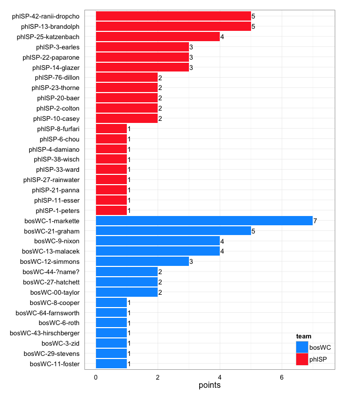
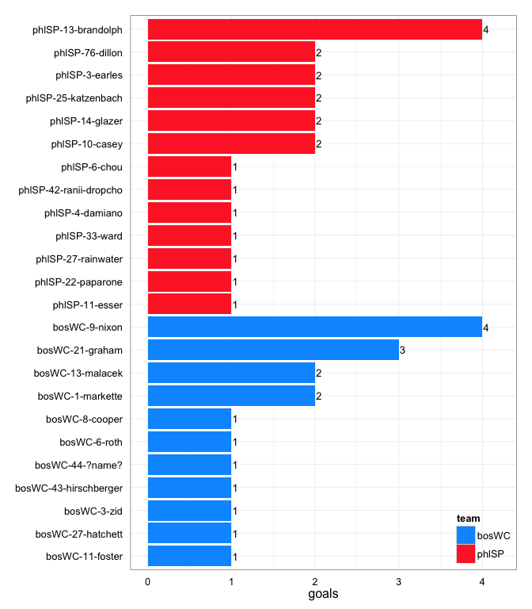
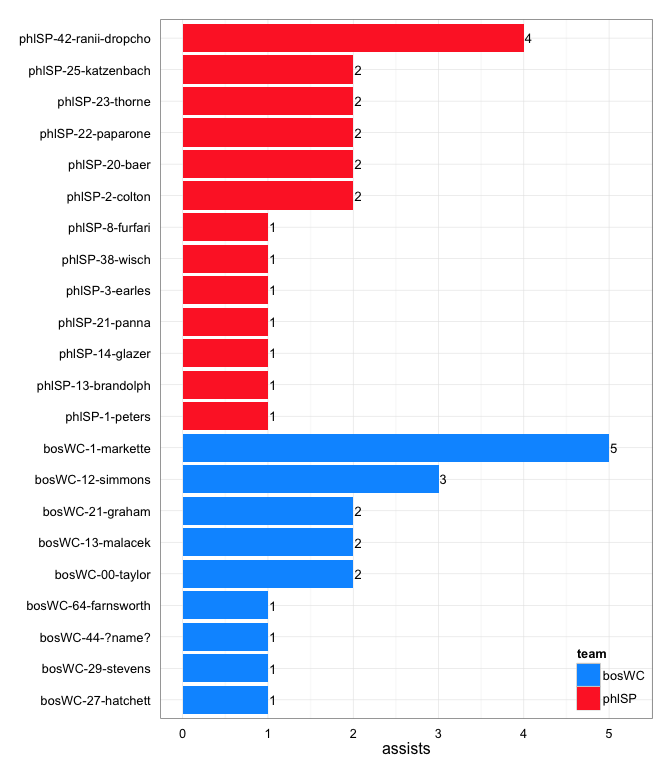
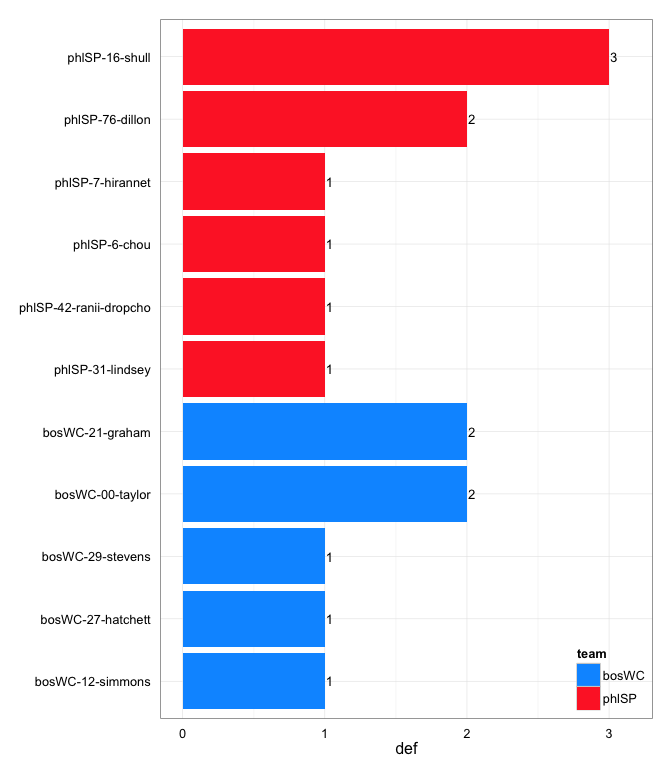

# bosWC at phlSP 2014-06-15

# bosWC 18
# phlSP 21
## game is complete

Go to ...  
  * [Scoring progression](#scoringProgression)  
  * [Player stats via figures](#pl_figs)  
  * [Player stats for bosWC](#away)  
  * [Player stats for phlSP](#home)  
  * [Data on goals, assists, D's](#selectData)  
  * [Full raw data](#rawData)  

## Scoring progression:

| point|period |begin    |end     |pt_duration |desc                                          |bosWC |phlSP |
|-----:|:------|:--------|:-------|:-----------|:---------------------------------------------|:-----|:-----|
|    43|4      |0:48:00  |0:00:00 |00:48       |- no goal -                                   |18    |21    |
|    42|4      |2:22:00  |0:48:00 |01:34       |phlSP-8-furfari to phlSP-22-paparone          |18    |21    |
|    41|4      |3:40:00  |2:22:00 |01:18       |phlSP-2-colton to phlSP-10-casey              |18    |20    |
|    40|4      |5:55:00  |3:40:00 |02:15       |bosWC-21-graham to bosWC-8-cooper             |18    |19    |
|    39|4      |6:21:00  |5:55:00 |00:26       |phlSP-25-katzenbach to phlSP-13-brandolph     |17    |19    |
|    38|4      |6:34:00  |6:21:00 |00:13       |bosWC-12-simmons to bosWC-21-graham           |17    |18    |
|    37|4      |8:07:00  |6:34:00 |01:33       |bosWC-1-markette to bosWC-9-nixon             |16    |18    |
|    36|4      |9:25:00  |8:07:00 |01:18       |bosWC-64-farnsworth to bosWC-13-malacek       |15    |18    |
|    35|4      |10:00:00 |9:25:00 |00:35       |phlSP-14-glazer to phlSP-42-ranii-dropcho     |14    |18    |
|    34|3      |0:03:00  |0:00:00 |00:03       |- no goal -                                   |14    |17    |
|    33|3      |3:01:00  |0:03:00 |02:58       |bosWC-1-markette to bosWC-11-foster           |14    |17    |
|    32|3      |4:43:00  |3:01:00 |01:42       |phlSP-23-thorne to phlSP-13-brandolph         |13    |17    |
|    31|3      |5:38:00  |4:43:00 |00:55       |bosWC-27-hatchett to bosWC-13-malacek         |13    |16    |
|    30|3      |6:35:00  |5:38:00 |00:57       |phlSP-2-colton to phlSP-76-dillon             |12    |16    |
|    29|3      |7:08:00  |6:35:00 |00:33       |phlSP-3-earles to phlSP-10-casey              |12    |15    |
|    28|3      |8:54:00  |7:08:00 |01:46       |phlSP-1-peters to phlSP-6-chou                |12    |14    |
|    27|3      |9:44:00  |8:54:00 |00:50       |phlSP-42-ranii-dropcho to phlSP-14-glazer     |12    |13    |
|    26|3      |10:00:00 |9:44:00 |00:16       |bosWC-21-graham to bosWC-1-markette           |12    |12    |
|    25|2      |0:16:00  |0:00:00 |00:16       |- no goal -                                   |11    |12    |
|    24|2      |0:44:00  |0:16:00 |00:28       |phlSP-42-ranii-dropcho to phlSP-25-katzenbach |11    |12    |
|    23|2      |1:17:00  |0:44:00 |00:33       |bosWC-00-taylor to bosWC-3-zid                |11    |11    |
|    22|2      |2:42:00  |1:17:00 |01:25       |phlSP-22-paparone to phlSP-76-dillon          |10    |11    |
|    21|2      |4:44:00  |2:42:00 |02:02       |phlSP-21-panna to phlSP-3-earles              |10    |10    |
|    20|2      |5:36:00  |4:44:00 |00:52       |phlSP-22-paparone to phlSP-11-esser           |10    |9     |
|    19|2      |6:33:00  |5:36:00 |00:57       |phlSP-38-wisch to phlSP-33-ward               |10    |8     |
|    18|2      |7:40:00  |6:33:00 |01:07       |bosWC-12-simmons to bosWC-43-hirschberger     |10    |7     |
|    17|2      |8:19:00  |7:40:00 |00:39       |bosWC-00-taylor to bosWC-9-nixon              |9     |7     |
|    16|2      |10:00:00 |8:19:00 |01:41       |phlSP-20-baer to phlSP-13-brandolph           |8     |7     |
|    15|1      |0:41:00  |0:00:00 |00:41       |- no goal -                                   |8     |6     |
|    14|1      |1:29:00  |0:41:00 |00:48       |phlSP-20-baer to phlSP-25-katzenbach          |8     |6     |
|    13|1      |1:54:00  |1:29:00 |00:25       |bosWC-1-markette to bosWC-44-?name?           |8     |5     |
|    12|1      |2:56:00  |1:54:00 |01:02       |phlSP-23-thorne to phlSP-14-glazer            |7     |5     |
|    11|1      |3:35:00  |2:56:00 |00:39       |bosWC-44-?name? to bosWC-1-markette           |7     |4     |
|    10|1      |4:07:00  |3:35:00 |00:32       |phlSP-13-brandolph to phlSP-27-rainwater      |6     |4     |
|     9|1      |5:01:00  |4:07:00 |00:54       |bosWC-13-malacek to bosWC-21-graham           |6     |3     |
|     8|1      |5:32:00  |5:01:00 |00:31       |phlSP-42-ranii-dropcho to phlSP-3-earles      |5     |3     |
|     7|1      |6:20:00  |5:32:00 |00:48       |bosWC-12-simmons to bosWC-6-roth              |5     |2     |
|     6|1      |6:48:00  |6:20:00 |00:28       |bosWC-1-markette to bosWC-9-nixon             |4     |2     |
|     5|1      |7:43:00  |6:48:00 |00:55       |phlSP-25-katzenbach to phlSP-13-brandolph     |3     |2     |
|     4|1      |7:54:00  |7:43:00 |00:11       |bosWC-13-malacek to bosWC-21-graham           |3     |1     |
|     3|1      |8:23:00  |7:54:00 |00:29       |phlSP-42-ranii-dropcho to phlSP-4-damiano     |2     |1     |
|     2|1      |9:38:00  |8:23:00 |01:15       |bosWC-29-stevens to bosWC-27-hatchett         |2     |0     |
|     1|1      |10:00:00 |9:38:00 |00:22       |bosWC-1-markette to bosWC-9-nixon             |1     |0     |

## Player stats via figures:

### Points = goals + assists

 

### Goals

 

### Assists

 

### D's
 

## Player stats for bosWC :

points = goals + assists  
tables sorted in decreasing order based on points (then goals, assists, Ds)  
Ds = total of plain ol' D's + interceptions (D), hand blocks (HB), and foot blocks (FB)  
stats are cumulative for this game

|   |player   |last              | points| comp_pct| goals| assists| throws| completions| catches| def| drop|
|:--|:--------|:-----------------|------:|--------:|-----:|-------:|------:|-----------:|-------:|---:|----:|
|1  |bosWC-1  |markette          |      7|     0.91|     2|       5|     23|          21|      23|   0|    0|
|2  |bosWC-21 |graham            |      5|     0.94|     3|       2|     18|          17|      20|   2|    1|
|3  |bosWC-9  |nixon             |      4|     1.00|     4|       0|      6|           6|      10|   0|    0|
|4  |bosWC-13 |malacek           |      4|     0.85|     2|       2|     39|          33|      35|   0|    0|
|5  |bosWC-12 |simmons           |      3|     1.00|     0|       3|     14|          14|       5|   1|    0|
|6  |bosWC-27 |hatchett          |      2|     1.00|     1|       1|      5|           5|       6|   1|    0|
|7  |bosWC-44 |?name?            |      2|     1.00|     1|       1|      9|           9|       7|   0|    0|
|8  |bosWC-00 |taylor            |      2|     0.88|     0|       2|     24|          21|      12|   2|    1|
|9  |bosWC-11 |foster            |      1|     0.75|     1|       0|      4|           3|       5|   0|    0|
|10 |bosWC-3  |zid               |      1|     0.50|     1|       0|      6|           3|       7|   0|    0|
|11 |bosWC-43 |hirschberger      |      1|     1.00|     1|       0|      1|           1|       2|   0|    0|
|12 |bosWC-6  |roth              |      1|     1.00|     1|       0|      1|           1|       2|   0|    0|
|13 |bosWC-8  |cooper            |      1|     0.82|     1|       0|     11|           9|       7|   0|    1|
|14 |bosWC-29 |stevens           |      1|     1.00|     0|       1|      2|           2|       2|   1|    0|
|15 |bosWC-64 |farnsworth        |      1|     1.00|     0|       1|     10|          10|      10|   0|    0|
|16 |bosWC-   |?name?            |      0|       NA|     0|       0|      0|           0|       0|   0|    0|
|17 |bosWC-14 |montgomery-butler |      0|     0.83|     0|       0|      6|           5|       5|   0|    0|
|18 |bosWC-18 |browar-jarus      |      0|     0.40|     0|       0|      5|           2|       5|   0|    0|
|19 |bosWC-5  |doherty           |      0|     1.00|     0|       0|      2|           2|       2|   0|    0|
|20 |bosWC-88 |meyers            |      0|     1.00|     0|       0|      1|           1|       0|   0|    0|

## Player stats for phlSP :

points = goals + assists  
tables sorted in decreasing order based on points (then goals, assists, Ds)  
Ds = total of plain ol' D's + interceptions (D), hand blocks (HB), and foot blocks (FB)  
stats are cumulative for this game

|   |player   |last          | points| comp_pct| goals| assists| throws| completions| catches| def| drop|
|:--|:--------|:-------------|------:|--------:|-----:|-------:|------:|-----------:|-------:|---:|----:|
|21 |phlSP-13 |brandolph     |      5|     0.92|     4|       1|     39|          36|      35|   0|    1|
|22 |phlSP-42 |ranii-dropcho |      5|     0.93|     1|       4|     14|          13|      15|   1|    0|
|23 |phlSP-25 |katzenbach    |      4|     0.92|     2|       2|     24|          22|      26|   0|    0|
|24 |phlSP-14 |glazer        |      3|     1.00|     2|       1|     13|          13|      15|   0|    0|
|25 |phlSP-3  |earles        |      3|     1.00|     2|       1|      8|           8|      10|   0|    0|
|26 |phlSP-22 |paparone      |      3|     1.00|     1|       2|      7|           7|       7|   0|    0|
|27 |phlSP-76 |dillon        |      2|     1.00|     2|       0|      9|           9|      11|   2|    0|
|28 |phlSP-10 |casey         |      2|     0.75|     2|       0|      4|           3|       4|   0|    0|
|29 |phlSP-2  |colton        |      2|     1.00|     0|       2|      9|           9|       6|   0|    0|
|30 |phlSP-20 |baer          |      2|     1.00|     0|       2|     44|          44|      35|   0|    0|
|31 |phlSP-23 |thorne        |      2|     1.00|     0|       2|     18|          18|      18|   0|    0|
|32 |phlSP-6  |chou          |      1|     1.00|     1|       0|      7|           7|       7|   1|    0|
|33 |phlSP-11 |esser         |      1|     1.00|     1|       0|      1|           1|       2|   0|    0|
|34 |phlSP-27 |rainwater     |      1|     0.88|     1|       0|     24|          21|      25|   0|    1|
|35 |phlSP-33 |ward          |      1|     1.00|     1|       0|      4|           4|       4|   0|    0|
|36 |phlSP-4  |damiano       |      1|     0.50|     1|       0|      2|           1|       2|   0|    0|
|37 |phlSP-1  |peters        |      1|     0.80|     0|       1|     10|           8|       5|   0|    0|
|38 |phlSP-21 |panna         |      1|     0.78|     0|       1|      9|           7|       7|   0|    0|
|39 |phlSP-38 |wisch         |      1|     0.92|     0|       1|     13|          12|      10|   0|    0|
|40 |phlSP-8  |furfari       |      1|     1.00|     0|       1|      2|           2|       2|   0|    0|
|41 |phlSP-16 |shull         |      0|     1.00|     0|       0|      9|           9|       9|   3|    0|
|42 |phlSP-31 |lindsey       |      0|     0.83|     0|       0|      6|           5|       6|   1|    1|
|43 |phlSP-7  |hirannet      |      0|     0.90|     0|       0|     21|          19|      16|   1|    0|
|44 |phlSP-   |?name?        |      0|       NA|     0|       0|      0|           0|       0|   0|    0|
|45 |phlSP-28 |baer          |      0|     0.80|     0|       0|      5|           4|       5|   0|    0|

## Raw data on select events (goals, assists, D's):

| point| period|pull_team | event| poss_abs| poss_rel|poss_team |pl_team |pl_pnum |pl_code |pl_lname      |player                 | bosWC| phlSP|
|-----:|------:|:---------|-----:|--------:|--------:|:---------|:-------|:-------|:-------|:-------------|:----------------------|-----:|-----:|
|     1|      1|phlSP     |     8|        1|        1|bosWC     |bosWC   |1       |A       |markette      |bosWC-1-markette       |     1|     0|
|     1|      1|phlSP     |     9|        1|        1|bosWC     |bosWC   |9       |G       |nixon         |bosWC-9-nixon          |     1|     0|
|     2|      1|bosWC     |    15|        3|        2|bosWC     |bosWC   |29      |A       |stevens       |bosWC-29-stevens       |     2|     0|
|     2|      1|bosWC     |    16|        3|        2|bosWC     |bosWC   |27      |G       |hatchett      |bosWC-27-hatchett      |     2|     0|
|     3|      1|bosWC     |    10|        4|        1|phlSP     |phlSP   |42      |A       |ranii-dropcho |phlSP-42-ranii-dropcho |     2|     1|
|     3|      1|bosWC     |    11|        4|        1|phlSP     |phlSP   |4       |G       |damiano       |phlSP-4-damiano        |     2|     1|
|     4|      1|phlSP     |     3|        5|        1|bosWC     |bosWC   |13      |A       |malacek       |bosWC-13-malacek       |     3|     1|
|     4|      1|phlSP     |     4|        5|        1|bosWC     |bosWC   |21      |LG      |graham        |bosWC-21-graham        |     3|     1|
|     5|      1|bosWC     |    11|        6|        1|phlSP     |phlSP   |25      |A       |katzenbach    |phlSP-25-katzenbach    |     3|     2|
|     5|      1|bosWC     |    12|        6|        1|phlSP     |phlSP   |13      |G       |brandolph     |phlSP-13-brandolph     |     3|     2|
|     6|      1|phlSP     |     7|        7|        1|bosWC     |bosWC   |1       |A       |markette      |bosWC-1-markette       |     4|     2|
|     6|      1|phlSP     |     8|        7|        1|bosWC     |bosWC   |9       |G       |nixon         |bosWC-9-nixon          |     4|     2|
|     7|      1|bosWC     |    11|        8|        1|phlSP     |bosWC   |12      |D       |simmons       |bosWC-12-simmons       |     5|     2|
|     7|      1|bosWC     |    12|        9|        2|bosWC     |bosWC   |12      |PUA     |simmons       |bosWC-12-simmons       |     5|     2|
|     7|      1|bosWC     |    13|        9|        2|bosWC     |bosWC   |6       |G       |roth          |bosWC-6-roth           |     5|     2|
|     8|      1|bosWC     |    10|       10|        1|phlSP     |phlSP   |42      |A       |ranii-dropcho |phlSP-42-ranii-dropcho |     5|     3|
|     8|      1|bosWC     |    11|       10|        1|phlSP     |phlSP   |3       |G       |earles        |phlSP-3-earles         |     5|     3|
|     9|      1|phlSP     |    11|       11|        1|bosWC     |bosWC   |13      |A       |malacek       |bosWC-13-malacek       |     6|     3|
|     9|      1|phlSP     |    13|       11|        1|bosWC     |bosWC   |21      |G       |graham        |bosWC-21-graham        |     6|     3|
|    10|      1|bosWC     |     7|       12|        1|phlSP     |phlSP   |13      |A       |brandolph     |phlSP-13-brandolph     |     6|     4|
|    10|      1|bosWC     |     8|       12|        1|phlSP     |phlSP   |27      |LG      |rainwater     |phlSP-27-rainwater     |     6|     4|
|    11|      1|phlSP     |    11|       13|        1|bosWC     |bosWC   |44      |A       |?name?        |bosWC-44-?name?        |     7|     4|
|    11|      1|phlSP     |    12|       13|        1|bosWC     |bosWC   |1       |G       |markette      |bosWC-1-markette       |     7|     4|
|    12|      1|bosWC     |    16|       16|        3|phlSP     |phlSP   |23      |LA      |thorne        |phlSP-23-thorne        |     7|     5|
|    12|      1|bosWC     |    17|       16|        3|phlSP     |phlSP   |14      |G       |glazer        |phlSP-14-glazer        |     7|     5|
|    13|      1|phlSP     |     6|       17|        1|bosWC     |bosWC   |1       |A       |markette      |bosWC-1-markette       |     8|     5|
|    13|      1|phlSP     |     7|       17|        1|bosWC     |bosWC   |44      |G       |?name?        |bosWC-44-?name?        |     8|     5|
|    14|      1|bosWC     |    17|       18|        1|phlSP     |phlSP   |20      |A       |baer          |phlSP-20-baer          |     8|     6|
|    14|      1|bosWC     |    18|       18|        1|phlSP     |phlSP   |25      |G       |katzenbach    |phlSP-25-katzenbach    |     8|     6|
|    15|      1|phlSP     |    12|       21|        3|bosWC     |phlSP   |31      |D       |lindsey       |phlSP-31-lindsey       |     8|     6|
|    16|      2|bosWC     |    28|       22|        1|phlSP     |phlSP   |20      |A       |baer          |phlSP-20-baer          |     8|     7|
|    16|      2|bosWC     |    29|       22|        1|phlSP     |phlSP   |13      |G       |brandolph     |phlSP-13-brandolph     |     8|     7|
|    17|      2|phlSP     |     8|       23|        1|bosWC     |bosWC   |00      |A       |taylor        |bosWC-00-taylor        |     9|     7|
|    17|      2|phlSP     |     9|       23|        1|bosWC     |bosWC   |9       |G       |nixon         |bosWC-9-nixon          |     9|     7|
|    18|      2|bosWC     |    15|       25|        2|bosWC     |bosWC   |12      |A       |simmons       |bosWC-12-simmons       |    10|     7|
|    18|      2|bosWC     |    16|       25|        2|bosWC     |bosWC   |43      |G       |hirschberger  |bosWC-43-hirschberger  |    10|     7|
|    19|      2|bosWC     |    14|       26|        1|phlSP     |phlSP   |38      |A       |wisch         |phlSP-38-wisch         |    10|     8|
|    19|      2|bosWC     |    15|       26|        1|phlSP     |phlSP   |33      |G       |ward          |phlSP-33-ward          |    10|     8|
|    20|      2|phlSP     |     7|       27|        1|bosWC     |phlSP   |76      |D       |dillon        |phlSP-76-dillon        |    10|     9|
|    20|      2|phlSP     |    10|       28|        2|phlSP     |phlSP   |22      |A       |paparone      |phlSP-22-paparone      |    10|     9|
|    20|      2|phlSP     |    11|       28|        2|phlSP     |phlSP   |11      |LG      |esser         |phlSP-11-esser         |    10|     9|
|    21|      2|phlSP     |    10|       30|        2|phlSP     |bosWC   |21      |D       |graham        |bosWC-21-graham        |    10|    10|
|    21|      2|phlSP     |    26|       32|        4|phlSP     |phlSP   |21      |A       |panna         |phlSP-21-panna         |    10|    10|
|    21|      2|phlSP     |    27|       32|        4|phlSP     |phlSP   |3       |G       |earles        |phlSP-3-earles         |    10|    10|
|    22|      2|phlSP     |    22|       36|        4|phlSP     |phlSP   |22      |A       |paparone      |phlSP-22-paparone      |    10|    11|
|    22|      2|phlSP     |    23|       36|        4|phlSP     |phlSP   |76      |G       |dillon        |phlSP-76-dillon        |    10|    11|
|    23|      2|phlSP     |     7|       38|        2|phlSP     |bosWC   |00      |D       |taylor        |bosWC-00-taylor        |    11|    11|
|    23|      2|phlSP     |     8|       39|        3|bosWC     |bosWC   |00      |PUA     |taylor        |bosWC-00-taylor        |    11|    11|
|    23|      2|phlSP     |     9|       39|        3|bosWC     |bosWC   |3       |G       |zid           |bosWC-3-zid            |    11|    11|
|    24|      2|bosWC     |     9|       40|        1|phlSP     |phlSP   |42      |A       |ranii-dropcho |phlSP-42-ranii-dropcho |    11|    12|
|    24|      2|bosWC     |    10|       40|        1|phlSP     |phlSP   |25      |G       |katzenbach    |phlSP-25-katzenbach    |    11|    12|
|    25|      2|phlSP     |    NA|       NA|       NA|NA        |NA      |NA      |NA      |NA            |NA-NA-NA               |    11|    12|
|    26|      3|phlSP     |     5|       43|        1|bosWC     |bosWC   |21      |A       |graham        |bosWC-21-graham        |    12|    12|
|    26|      3|phlSP     |     6|       43|        1|bosWC     |bosWC   |1       |LG      |markette      |bosWC-1-markette       |    12|    12|
|    27|      3|bosWC     |    16|       44|        1|phlSP     |phlSP   |42      |A       |ranii-dropcho |phlSP-42-ranii-dropcho |    12|    13|
|    27|      3|bosWC     |    17|       44|        1|phlSP     |phlSP   |14      |G       |glazer        |phlSP-14-glazer        |    12|    13|
|    28|      3|phlSP     |     8|       45|        1|bosWC     |phlSP   |16      |D       |shull         |phlSP-16-shull         |    12|    14|
|    28|      3|phlSP     |    19|       46|        2|phlSP     |phlSP   |1       |A       |peters        |phlSP-1-peters         |    12|    14|
|    28|      3|phlSP     |    21|       46|        2|phlSP     |phlSP   |6       |G       |chou          |phlSP-6-chou           |    12|    14|
|    29|      3|phlSP     |     6|       48|        2|phlSP     |phlSP   |3       |A       |earles        |phlSP-3-earles         |    12|    15|
|    29|      3|phlSP     |     7|       48|        2|phlSP     |phlSP   |10      |LG      |casey         |phlSP-10-casey         |    12|    15|
|    30|      3|phlSP     |     3|       49|        1|bosWC     |phlSP   |16      |D       |shull         |phlSP-16-shull         |    12|    16|
|    30|      3|phlSP     |    12|       51|        3|bosWC     |phlSP   |76      |D       |dillon        |phlSP-76-dillon        |    12|    16|
|    30|      3|phlSP     |    13|       52|        4|phlSP     |phlSP   |2       |PUA     |colton        |phlSP-2-colton         |    12|    16|
|    30|      3|phlSP     |    14|       52|        4|phlSP     |phlSP   |76      |LG      |dillon        |phlSP-76-dillon        |    12|    16|
|    31|      3|phlSP     |    15|       53|        1|bosWC     |bosWC   |27      |A       |hatchett      |bosWC-27-hatchett      |    13|    16|
|    31|      3|phlSP     |    16|       53|        1|bosWC     |bosWC   |13      |G       |malacek       |bosWC-13-malacek       |    13|    16|
|    32|      3|bosWC     |     4|       54|        1|phlSP     |bosWC   |29      |D       |stevens       |bosWC-29-stevens       |    13|    17|
|    32|      3|bosWC     |    10|       55|        2|bosWC     |phlSP   |42      |D       |ranii-dropcho |phlSP-42-ranii-dropcho |    13|    17|
|    32|      3|bosWC     |    26|       56|        3|phlSP     |phlSP   |23      |A       |thorne        |phlSP-23-thorne        |    13|    17|
|    32|      3|bosWC     |    27|       56|        3|phlSP     |phlSP   |13      |G       |brandolph     |phlSP-13-brandolph     |    13|    17|
|    33|      3|phlSP     |    10|       57|        1|bosWC     |phlSP   |16      |D       |shull         |phlSP-16-shull         |    14|    17|
|    33|      3|phlSP     |    32|       58|        2|phlSP     |bosWC   |00      |D       |taylor        |bosWC-00-taylor        |    14|    17|
|    33|      3|phlSP     |    37|       59|        3|bosWC     |bosWC   |1       |A       |markette      |bosWC-1-markette       |    14|    17|
|    33|      3|phlSP     |    38|       59|        3|bosWC     |bosWC   |11      |G       |foster        |bosWC-11-foster        |    14|    17|
|    34|      3|bosWC     |    NA|       NA|       NA|NA        |NA      |NA      |NA      |NA            |NA-NA-NA               |    14|    17|
|    35|      4|bosWC     |    11|       61|        1|phlSP     |phlSP   |14      |A       |glazer        |phlSP-14-glazer        |    14|    18|
|    35|      4|bosWC     |    12|       61|        1|phlSP     |phlSP   |42      |G       |ranii-dropcho |phlSP-42-ranii-dropcho |    14|    18|
|    36|      4|phlSP     |    18|       64|        3|bosWC     |bosWC   |64      |A       |farnsworth    |bosWC-64-farnsworth    |    15|    18|
|    36|      4|phlSP     |    19|       64|        3|bosWC     |bosWC   |13      |LG      |malacek       |bosWC-13-malacek       |    15|    18|
|    37|      4|bosWC     |    23|       66|        2|bosWC     |bosWC   |1       |A       |markette      |bosWC-1-markette       |    16|    18|
|    37|      4|bosWC     |    24|       66|        2|bosWC     |bosWC   |9       |G       |nixon         |bosWC-9-nixon          |    16|    18|
|    38|      4|bosWC     |     5|       68|        2|bosWC     |bosWC   |12      |A       |simmons       |bosWC-12-simmons       |    17|    18|
|    38|      4|bosWC     |     6|       68|        2|bosWC     |bosWC   |21      |G       |graham        |bosWC-21-graham        |    17|    18|
|    39|      4|bosWC     |    10|       69|        1|phlSP     |phlSP   |25      |A       |katzenbach    |phlSP-25-katzenbach    |    17|    19|
|    39|      4|bosWC     |    11|       69|        1|phlSP     |phlSP   |13      |G       |brandolph     |phlSP-13-brandolph     |    17|    19|
|    40|      4|phlSP     |    18|       72|        3|bosWC     |bosWC   |21      |A       |graham        |bosWC-21-graham        |    18|    19|
|    40|      4|phlSP     |    19|       72|        3|bosWC     |bosWC   |8       |G       |cooper        |bosWC-8-cooper         |    18|    19|
|    41|      4|bosWC     |    13|       73|        1|phlSP     |bosWC   |27      |D       |hatchett      |bosWC-27-hatchett      |    18|    20|
|    41|      4|bosWC     |    20|       74|        2|bosWC     |phlSP   |6       |D       |chou          |phlSP-6-chou           |    18|    20|
|    41|      4|bosWC     |    24|       75|        3|phlSP     |phlSP   |2       |A       |colton        |phlSP-2-colton         |    18|    20|
|    41|      4|bosWC     |    25|       75|        3|phlSP     |phlSP   |10      |G       |casey         |phlSP-10-casey         |    18|    20|
|    42|      4|phlSP     |     7|       77|        2|phlSP     |bosWC   |21      |D       |graham        |bosWC-21-graham        |    18|    21|
|    42|      4|phlSP     |    10|       78|        3|bosWC     |phlSP   |7       |D       |hirannet      |phlSP-7-hirannet       |    18|    21|
|    42|      4|phlSP     |    22|       81|        6|phlSP     |phlSP   |8       |A       |furfari       |phlSP-8-furfari        |    18|    21|
|    42|      4|phlSP     |    23|       81|        6|phlSP     |phlSP   |22      |G       |paparone      |phlSP-22-paparone      |    18|    21|
|    43|      4|phlSP     |    NA|       NA|       NA|NA        |NA      |NA      |NA      |NA            |NA-NA-NA               |    18|    21|

## Full raw data:

__Note: just for display purposes.__ Raw data in more useful forms can be found in the [GitHub repository](https://github.com/jennybc/vanNH). Find the game you're interested in in the `games` subdirectory.

| period| point|pull_team | event| poss_abs| poss_rel|poss_team |pl_team |pl_pnum |pl_code |
|------:|-----:|:---------|-----:|--------:|--------:|:---------|:-------|:-------|:-------|
|      1|     1|phlSP     |     1|        1|        1|bosWC     |phlSP   |1       |P       |
|      1|     1|phlSP     |     2|        1|        1|bosWC     |bosWC   |00      |PU      |
|      1|     1|phlSP     |     3|        1|        1|bosWC     |bosWC   |13      |        |
|      1|     1|phlSP     |     4|        1|        1|bosWC     |bosWC   |1       |        |
|      1|     1|phlSP     |     5|        1|        1|bosWC     |bosWC   |64      |        |
|      1|     1|phlSP     |     6|        1|        1|bosWC     |bosWC   |13      |        |
|      1|     1|phlSP     |     7|        1|        1|bosWC     |bosWC   |9       |        |
|      1|     1|phlSP     |     8|        1|        1|bosWC     |bosWC   |1       |A       |
|      1|     1|phlSP     |     9|        1|        1|bosWC     |bosWC   |9       |G       |
|      1|     2|bosWC     |     1|        2|        1|phlSP     |bosWC   |43      |P       |
|      1|     2|bosWC     |     2|        2|        1|phlSP     |phlSP   |13      |PU      |
|      1|     2|bosWC     |     3|        2|        1|phlSP     |phlSP   |7       |        |
|      1|     2|bosWC     |     4|        2|        1|phlSP     |phlSP   |42      |        |
|      1|     2|bosWC     |     5|        2|        1|phlSP     |phlSP   |7       |        |
|      1|     2|bosWC     |     6|        2|        1|phlSP     |phlSP   |13      |        |
|      1|     2|bosWC     |     7|        2|        1|phlSP     |phlSP   |7       |        |
|      1|     2|bosWC     |     8|        2|        1|phlSP     |phlSP   |13      |        |
|      1|     2|bosWC     |     9|        2|        1|phlSP     |phlSP   |27      |        |
|      1|     2|bosWC     |    10|        3|        2|bosWC     |bosWC   |12      |PU      |
|      1|     2|bosWC     |    11|        3|        2|bosWC     |bosWC   |14      |        |
|      1|     2|bosWC     |    12|        3|        2|bosWC     |bosWC   |27      |        |
|      1|     2|bosWC     |    13|        3|        2|bosWC     |bosWC   |29      |        |
|      1|     2|bosWC     |    14|        3|        2|bosWC     |bosWC   |43      |        |
|      1|     2|bosWC     |    15|        3|        2|bosWC     |bosWC   |29      |A       |
|      1|     2|bosWC     |    16|        3|        2|bosWC     |bosWC   |27      |G       |
|      1|     3|bosWC     |     1|        4|        1|phlSP     |bosWC   |18      |P       |
|      1|     3|bosWC     |     2|        4|        1|phlSP     |phlSP   |4       |PU      |
|      1|     3|bosWC     |     3|        4|        1|phlSP     |phlSP   |38      |        |
|      1|     3|bosWC     |     4|        4|        1|phlSP     |phlSP   |20      |        |
|      1|     3|bosWC     |     5|        4|        1|phlSP     |phlSP   |42      |        |
|      1|     3|bosWC     |     6|        4|        1|phlSP     |phlSP   |25      |        |
|      1|     3|bosWC     |     7|        4|        1|phlSP     |phlSP   |38      |        |
|      1|     3|bosWC     |     8|        4|        1|phlSP     |phlSP   |20      |        |
|      1|     3|bosWC     |     9|        4|        1|phlSP     |phlSP   |3       |        |
|      1|     3|bosWC     |    10|        4|        1|phlSP     |phlSP   |42      |A       |
|      1|     3|bosWC     |    11|        4|        1|phlSP     |phlSP   |4       |G       |
|      1|     4|phlSP     |     1|        5|        1|bosWC     |phlSP   |1       |P       |
|      1|     4|phlSP     |     2|        5|        1|bosWC     |bosWC   |44      |PU      |
|      1|     4|phlSP     |     3|        5|        1|bosWC     |bosWC   |13      |A       |
|      1|     4|phlSP     |     4|        5|        1|bosWC     |bosWC   |21      |LG      |
|      1|     5|bosWC     |     1|        6|        1|phlSP     |bosWC   |43      |P       |
|      1|     5|bosWC     |     2|        6|        1|phlSP     |phlSP   |7       |PU      |
|      1|     5|bosWC     |     3|        6|        1|phlSP     |phlSP   |13      |        |
|      1|     5|bosWC     |     4|        6|        1|phlSP     |phlSP   |23      |        |
|      1|     5|bosWC     |     5|        6|        1|phlSP     |phlSP   |27      |        |
|      1|     5|bosWC     |     6|        6|        1|phlSP     |phlSP   |25      |        |
|      1|     5|bosWC     |     7|        6|        1|phlSP     |phlSP   |14      |        |
|      1|     5|bosWC     |     8|        6|        1|phlSP     |phlSP   |25      |        |
|      1|     5|bosWC     |     9|        6|        1|phlSP     |phlSP   |        |TO      |
|      1|     5|bosWC     |    10|        6|        1|phlSP     |phlSP   |7       |PU      |
|      1|     5|bosWC     |    11|        6|        1|phlSP     |phlSP   |25      |A       |
|      1|     5|bosWC     |    12|        6|        1|phlSP     |phlSP   |13      |G       |
|      1|     6|phlSP     |     1|        7|        1|bosWC     |phlSP   |20      |P       |
|      1|     6|phlSP     |     2|        7|        1|bosWC     |bosWC   |00      |PU      |
|      1|     6|phlSP     |     3|        7|        1|bosWC     |bosWC   |13      |        |
|      1|     6|phlSP     |     4|        7|        1|bosWC     |bosWC   |1       |        |
|      1|     6|phlSP     |     5|        7|        1|bosWC     |bosWC   |21      |        |
|      1|     6|phlSP     |     6|        7|        1|bosWC     |bosWC   |13      |        |
|      1|     6|phlSP     |     7|        7|        1|bosWC     |bosWC   |1       |A       |
|      1|     6|phlSP     |     8|        7|        1|bosWC     |bosWC   |9       |G       |
|      1|     7|bosWC     |     1|        8|        1|phlSP     |bosWC   |18      |P       |
|      1|     7|bosWC     |     2|        8|        1|phlSP     |phlSP   |7       |PU      |
|      1|     7|bosWC     |     3|        8|        1|phlSP     |phlSP   |13      |        |
|      1|     7|bosWC     |     4|        8|        1|phlSP     |phlSP   |27      |        |
|      1|     7|bosWC     |     5|        8|        1|phlSP     |phlSP   |13      |        |
|      1|     7|bosWC     |     6|        8|        1|phlSP     |phlSP   |25      |        |
|      1|     7|bosWC     |     7|        8|        1|phlSP     |phlSP   |7       |        |
|      1|     7|bosWC     |     8|        8|        1|phlSP     |phlSP   |25      |        |
|      1|     7|bosWC     |     9|        8|        1|phlSP     |phlSP   |23      |        |
|      1|     7|bosWC     |    10|        8|        1|phlSP     |phlSP   |7       |        |
|      1|     7|bosWC     |    11|        8|        1|phlSP     |bosWC   |12      |D       |
|      1|     7|bosWC     |    12|        9|        2|bosWC     |bosWC   |12      |PUA     |
|      1|     7|bosWC     |    13|        9|        2|bosWC     |bosWC   |6       |G       |
|      1|     8|bosWC     |     1|       10|        1|phlSP     |bosWC   |43      |P       |
|      1|     8|bosWC     |     2|       10|        1|phlSP     |phlSP   |33      |PU      |
|      1|     8|bosWC     |     3|       10|        1|phlSP     |phlSP   |38      |        |
|      1|     8|bosWC     |     4|       10|        1|phlSP     |phlSP   |33      |        |
|      1|     8|bosWC     |     5|       10|        1|phlSP     |phlSP   |42      |        |
|      1|     8|bosWC     |     6|       10|        1|phlSP     |phlSP   |38      |        |
|      1|     8|bosWC     |     7|       10|        1|phlSP     |phlSP   |33      |        |
|      1|     8|bosWC     |     8|       10|        1|phlSP     |phlSP   |23      |        |
|      1|     8|bosWC     |     9|       10|        1|phlSP     |phlSP   |38      |        |
|      1|     8|bosWC     |    10|       10|        1|phlSP     |phlSP   |42      |A       |
|      1|     8|bosWC     |    11|       10|        1|phlSP     |phlSP   |3       |G       |
|      1|     9|phlSP     |     1|       11|        1|bosWC     |phlSP   |6       |P       |
|      1|     9|phlSP     |     2|       11|        1|bosWC     |bosWC   |44      |PU      |
|      1|     9|phlSP     |     3|       11|        1|bosWC     |bosWC   |13      |        |
|      1|     9|phlSP     |     4|       11|        1|bosWC     |bosWC   |00      |        |
|      1|     9|phlSP     |     5|       11|        1|bosWC     |bosWC   |21      |        |
|      1|     9|phlSP     |     6|       11|        1|bosWC     |bosWC   |00      |        |
|      1|     9|phlSP     |     7|       11|        1|bosWC     |bosWC   |13      |        |
|      1|     9|phlSP     |     8|       11|        1|bosWC     |bosWC   |00      |        |
|      1|     9|phlSP     |     9|       11|        1|bosWC     |bosWC   |21      |        |
|      1|     9|phlSP     |    10|       11|        1|bosWC     |bosWC   |1       |        |
|      1|     9|phlSP     |    11|       11|        1|bosWC     |bosWC   |13      |A       |
|      1|     9|phlSP     |    12|       11|        1|bosWC     |phlSP   |21      |F       |
|      1|     9|phlSP     |    13|       11|        1|bosWC     |bosWC   |21      |G       |
|      1|    10|bosWC     |     1|       12|        1|phlSP     |bosWC   |43      |P       |
|      1|    10|bosWC     |     2|       12|        1|phlSP     |phlSP   |7       |PU      |
|      1|    10|bosWC     |     3|       12|        1|phlSP     |phlSP   |13      |        |
|      1|    10|bosWC     |     4|       12|        1|phlSP     |phlSP   |7       |        |
|      1|    10|bosWC     |     5|       12|        1|phlSP     |bosWC   |25      |F       |
|      1|    10|bosWC     |     6|       12|        1|phlSP     |phlSP   |25      |        |
|      1|    10|bosWC     |     7|       12|        1|phlSP     |phlSP   |13      |A       |
|      1|    10|bosWC     |     8|       12|        1|phlSP     |phlSP   |27      |LG      |
|      1|    11|phlSP     |     1|       13|        1|bosWC     |phlSP   |20      |P       |
|      1|    11|phlSP     |     2|       13|        1|bosWC     |bosWC   |00      |PU      |
|      1|    11|phlSP     |     3|       13|        1|bosWC     |bosWC   |13      |        |
|      1|    11|phlSP     |     4|       13|        1|bosWC     |bosWC   |1       |        |
|      1|    11|phlSP     |     5|       13|        1|bosWC     |bosWC   |21      |        |
|      1|    11|phlSP     |     6|       13|        1|bosWC     |bosWC   |00      |        |
|      1|    11|phlSP     |     7|       13|        1|bosWC     |bosWC   |44      |        |
|      1|    11|phlSP     |     8|       13|        1|bosWC     |bosWC   |21      |        |
|      1|    11|phlSP     |     9|       13|        1|bosWC     |bosWC   |13      |        |
|      1|    11|phlSP     |    10|       13|        1|bosWC     |bosWC   |00      |        |
|      1|    11|phlSP     |    11|       13|        1|bosWC     |bosWC   |44      |A       |
|      1|    11|phlSP     |    12|       13|        1|bosWC     |bosWC   |1       |G       |
|      1|    12|bosWC     |     1|       14|        1|phlSP     |bosWC   |18      |P       |
|      1|    12|bosWC     |     2|       14|        1|phlSP     |phlSP   |13      |PU      |
|      1|    12|bosWC     |     3|       14|        1|phlSP     |phlSP   |7       |        |
|      1|    12|bosWC     |     4|       14|        1|phlSP     |phlSP   |25      |        |
|      1|    12|bosWC     |     5|       14|        1|phlSP     |phlSP   |27      |        |
|      1|    12|bosWC     |     6|       14|        1|phlSP     |phlSP   |42      |        |
|      1|    12|bosWC     |     7|       14|        1|phlSP     |phlSP   |27      |        |
|      1|    12|bosWC     |     8|       14|        1|phlSP     |phlSP   |23      |TD      |
|      1|    12|bosWC     |     9|       15|        2|bosWC     |bosWC   |12      |PU      |
|      1|    12|bosWC     |    10|       15|        2|bosWC     |bosWC   |11      |        |
|      1|    12|bosWC     |    11|       15|        2|bosWC     |bosWC   |18      |        |
|      1|    12|bosWC     |    12|       16|        3|phlSP     |phlSP   |25      |PU      |
|      1|    12|bosWC     |    13|       16|        3|phlSP     |phlSP   |13      |        |
|      1|    12|bosWC     |    14|       16|        3|phlSP     |phlSP   |7       |        |
|      1|    12|bosWC     |    15|       16|        3|phlSP     |phlSP   |27      |        |
|      1|    12|bosWC     |    16|       16|        3|phlSP     |phlSP   |23      |LA      |
|      1|    12|bosWC     |    17|       16|        3|phlSP     |phlSP   |14      |G       |
|      1|    13|phlSP     |     1|       17|        1|bosWC     |phlSP   |1       |P       |
|      1|    13|phlSP     |     2|       17|        1|bosWC     |bosWC   |00      |PU      |
|      1|    13|phlSP     |     3|       17|        1|bosWC     |bosWC   |13      |        |
|      1|    13|phlSP     |     4|       17|        1|bosWC     |bosWC   |1       |L       |
|      1|    13|phlSP     |     5|       17|        1|bosWC     |bosWC   |44      |        |
|      1|    13|phlSP     |     6|       17|        1|bosWC     |bosWC   |1       |A       |
|      1|    13|phlSP     |     7|       17|        1|bosWC     |bosWC   |44      |G       |
|      1|    14|bosWC     |     1|       18|        1|phlSP     |bosWC   |43      |P       |
|      1|    14|bosWC     |     2|       18|        1|phlSP     |phlSP   |20      |PU      |
|      1|    14|bosWC     |     3|       18|        1|phlSP     |phlSP   |7       |        |
|      1|    14|bosWC     |     4|       18|        1|phlSP     |phlSP   |25      |        |
|      1|    14|bosWC     |     5|       18|        1|phlSP     |phlSP   |27      |        |
|      1|    14|bosWC     |     6|       18|        1|phlSP     |phlSP   |14      |        |
|      1|    14|bosWC     |     7|       18|        1|phlSP     |phlSP   |27      |        |
|      1|    14|bosWC     |     8|       18|        1|phlSP     |phlSP   |7       |        |
|      1|    14|bosWC     |     9|       18|        1|phlSP     |phlSP   |20      |        |
|      1|    14|bosWC     |    10|       18|        1|phlSP     |phlSP   |7       |        |
|      1|    14|bosWC     |    11|       18|        1|phlSP     |phlSP   |20      |        |
|      1|    14|bosWC     |    12|       18|        1|phlSP     |phlSP   |23      |        |
|      1|    14|bosWC     |    13|       18|        1|phlSP     |phlSP   |20      |        |
|      1|    14|bosWC     |    14|       18|        1|phlSP     |phlSP   |7       |        |
|      1|    14|bosWC     |    15|       18|        1|phlSP     |phlSP   |14      |        |
|      1|    14|bosWC     |    16|       18|        1|phlSP     |phlSP   |27      |        |
|      1|    14|bosWC     |    17|       18|        1|phlSP     |phlSP   |20      |A       |
|      1|    14|bosWC     |    18|       18|        1|phlSP     |phlSP   |25      |G       |
|      1|    15|phlSP     |     1|       19|        1|bosWC     |phlSP   |3       |P       |
|      1|    15|phlSP     |     2|       19|        1|bosWC     |bosWC   |00      |PU      |
|      1|    15|phlSP     |     3|       19|        1|bosWC     |bosWC   |13      |        |
|      1|    15|phlSP     |     4|       19|        1|bosWC     |bosWC   |1       |        |
|      1|    15|phlSP     |     5|       20|        2|phlSP     |phlSP   |        |TO      |
|      1|    15|phlSP     |     6|       20|        2|phlSP     |phlSP   |13      |PU      |
|      1|    15|phlSP     |     7|       20|        2|phlSP     |phlSP   |25      |        |
|      1|    15|phlSP     |     8|       21|        3|bosWC     |bosWC   |        |TO      |
|      1|    15|phlSP     |     9|       21|        3|bosWC     |bosWC   |13      |PU      |
|      1|    15|phlSP     |    10|       21|        3|bosWC     |bosWC   |1       |        |
|      1|    15|phlSP     |    11|       21|        3|bosWC     |bosWC   |00      |        |
|      1|    15|phlSP     |    12|       21|        3|bosWC     |phlSP   |31      |D       |
|      2|    16|bosWC     |     1|       22|        1|phlSP     |bosWC   |18      |P       |
|      2|    16|bosWC     |     2|       22|        1|phlSP     |phlSP   |7       |PU      |
|      2|    16|bosWC     |     3|       22|        1|phlSP     |phlSP   |13      |        |
|      2|    16|bosWC     |     4|       22|        1|phlSP     |phlSP   |27      |        |
|      2|    16|bosWC     |     5|       22|        1|phlSP     |phlSP   |7       |        |
|      2|    16|bosWC     |     6|       22|        1|phlSP     |phlSP   |14      |        |
|      2|    16|bosWC     |     7|       22|        1|phlSP     |phlSP   |42      |        |
|      2|    16|bosWC     |     8|       22|        1|phlSP     |phlSP   |8       |        |
|      2|    16|bosWC     |     9|       22|        1|phlSP     |phlSP   |7       |        |
|      2|    16|bosWC     |    10|       22|        1|phlSP     |phlSP   |13      |        |
|      2|    16|bosWC     |    11|       22|        1|phlSP     |phlSP   |42      |        |
|      2|    16|bosWC     |    12|       22|        1|phlSP     |phlSP   |13      |        |
|      2|    16|bosWC     |    13|       22|        1|phlSP     |bosWC   |88      |F       |
|      2|    16|bosWC     |    14|       22|        1|phlSP     |phlSP   |7       |        |
|      2|    16|bosWC     |    15|       22|        1|phlSP     |phlSP   |7       |SO      |
|      2|    16|bosWC     |    16|       22|        1|phlSP     |phlSP   |20      |SI      |
|      2|    16|bosWC     |    17|       22|        1|phlSP     |phlSP   |20      |PU      |
|      2|    16|bosWC     |    18|       22|        1|phlSP     |phlSP   |14      |        |
|      2|    16|bosWC     |    19|       22|        1|phlSP     |phlSP   |20      |        |
|      2|    16|bosWC     |    20|       22|        1|phlSP     |phlSP   |25      |        |
|      2|    16|bosWC     |    21|       22|        1|phlSP     |phlSP   |23      |        |
|      2|    16|bosWC     |    22|       22|        1|phlSP     |phlSP   |25      |        |
|      2|    16|bosWC     |    23|       22|        1|phlSP     |phlSP   |20      |        |
|      2|    16|bosWC     |    24|       22|        1|phlSP     |phlSP   |42      |        |
|      2|    16|bosWC     |    25|       22|        1|phlSP     |phlSP   |20      |        |
|      2|    16|bosWC     |    26|       22|        1|phlSP     |phlSP   |14      |        |
|      2|    16|bosWC     |    27|       22|        1|phlSP     |phlSP   |42      |        |
|      2|    16|bosWC     |    28|       22|        1|phlSP     |phlSP   |20      |A       |
|      2|    16|bosWC     |    29|       22|        1|phlSP     |phlSP   |13      |G       |
|      2|    17|phlSP     |     1|       23|        1|bosWC     |phlSP   |1       |P       |
|      2|    17|phlSP     |     2|       23|        1|bosWC     |bosWC   |00      |PU      |
|      2|    17|phlSP     |     3|       23|        1|bosWC     |bosWC   |13      |        |
|      2|    17|phlSP     |     4|       23|        1|bosWC     |bosWC   |21      |        |
|      2|    17|phlSP     |     5|       23|        1|bosWC     |bosWC   |9       |        |
|      2|    17|phlSP     |     6|       23|        1|bosWC     |bosWC   |3       |        |
|      2|    17|phlSP     |     7|       23|        1|bosWC     |phlSP   |31      |F       |
|      2|    17|phlSP     |     8|       23|        1|bosWC     |bosWC   |00      |A       |
|      2|    17|phlSP     |     9|       23|        1|bosWC     |bosWC   |9       |G       |
|      2|    18|bosWC     |     1|       24|        1|phlSP     |bosWC   |43      |P       |
|      2|    18|bosWC     |     2|       24|        1|phlSP     |phlSP   |20      |PU      |
|      2|    18|bosWC     |     3|       24|        1|phlSP     |phlSP   |13      |        |
|      2|    18|bosWC     |     4|       24|        1|phlSP     |phlSP   |20      |        |
|      2|    18|bosWC     |     5|       24|        1|phlSP     |phlSP   |13      |        |
|      2|    18|bosWC     |     6|       24|        1|phlSP     |phlSP   |20      |        |
|      2|    18|bosWC     |     7|       24|        1|phlSP     |phlSP   |25      |        |
|      2|    18|bosWC     |     8|       24|        1|phlSP     |phlSP   |20      |        |
|      2|    18|bosWC     |     9|       24|        1|phlSP     |phlSP   |27      |        |
|      2|    18|bosWC     |    10|       24|        1|phlSP     |phlSP   |4       |        |
|      2|    18|bosWC     |    11|       25|        2|bosWC     |bosWC   |14      |PU      |
|      2|    18|bosWC     |    12|       25|        2|bosWC     |bosWC   |12      |        |
|      2|    18|bosWC     |    13|       25|        2|bosWC     |bosWC   |5       |        |
|      2|    18|bosWC     |    14|       25|        2|bosWC     |bosWC   |27      |        |
|      2|    18|bosWC     |    15|       25|        2|bosWC     |bosWC   |12      |A       |
|      2|    18|bosWC     |    16|       25|        2|bosWC     |bosWC   |43      |G       |
|      2|    19|bosWC     |     1|       26|        1|phlSP     |bosWC   |18      |P       |
|      2|    19|bosWC     |     2|       26|        1|phlSP     |phlSP   |38      |PU      |
|      2|    19|bosWC     |     3|       26|        1|phlSP     |phlSP   |23      |        |
|      2|    19|bosWC     |     4|       26|        1|phlSP     |phlSP   |20      |        |
|      2|    19|bosWC     |     5|       26|        1|phlSP     |phlSP   |16      |        |
|      2|    19|bosWC     |     6|       26|        1|phlSP     |phlSP   |33      |        |
|      2|    19|bosWC     |     7|       26|        1|phlSP     |phlSP   |23      |        |
|      2|    19|bosWC     |     8|       26|        1|phlSP     |phlSP   |20      |        |
|      2|    19|bosWC     |     9|       26|        1|phlSP     |phlSP   |38      |        |
|      2|    19|bosWC     |    10|       26|        1|phlSP     |phlSP   |20      |        |
|      2|    19|bosWC     |    11|       26|        1|phlSP     |phlSP   |3       |        |
|      2|    19|bosWC     |    12|       26|        1|phlSP     |phlSP   |16      |        |
|      2|    19|bosWC     |    13|       26|        1|phlSP     |phlSP   |20      |        |
|      2|    19|bosWC     |    14|       26|        1|phlSP     |phlSP   |38      |A       |
|      2|    19|bosWC     |    15|       26|        1|phlSP     |phlSP   |33      |G       |
|      2|    20|phlSP     |     1|       27|        1|bosWC     |phlSP   |1       |P       |
|      2|    20|phlSP     |     2|       27|        1|bosWC     |bosWC   |00      |PU      |
|      2|    20|phlSP     |     3|       27|        1|bosWC     |bosWC   |13      |        |
|      2|    20|phlSP     |     4|       27|        1|bosWC     |bosWC   |21      |        |
|      2|    20|phlSP     |     5|       27|        1|bosWC     |bosWC   |9       |        |
|      2|    20|phlSP     |     6|       27|        1|bosWC     |bosWC   |1       |        |
|      2|    20|phlSP     |     7|       27|        1|bosWC     |phlSP   |76      |D       |
|      2|    20|phlSP     |     8|       28|        2|phlSP     |phlSP   |1       |PU      |
|      2|    20|phlSP     |     9|       28|        2|phlSP     |phlSP   |76      |        |
|      2|    20|phlSP     |    10|       28|        2|phlSP     |phlSP   |22      |A       |
|      2|    20|phlSP     |    11|       28|        2|phlSP     |phlSP   |11      |LG      |
|      2|    21|phlSP     |     1|       29|        1|bosWC     |phlSP   |3       |P       |
|      2|    21|phlSP     |     2|       29|        1|bosWC     |bosWC   |00      |PU      |
|      2|    21|phlSP     |     3|       29|        1|bosWC     |bosWC   |13      |        |
|      2|    21|phlSP     |     4|       29|        1|bosWC     |bosWC   |1       |        |
|      2|    21|phlSP     |     5|       29|        1|bosWC     |bosWC   |64      |        |
|      2|    21|phlSP     |     6|       29|        1|bosWC     |bosWC   |13      |VTT     |
|      2|    21|phlSP     |     7|       30|        2|phlSP     |phlSP   |10      |PU      |
|      2|    21|phlSP     |     8|       30|        2|phlSP     |phlSP   |3       |        |
|      2|    21|phlSP     |     9|       30|        2|phlSP     |phlSP   |21      |        |
|      2|    21|phlSP     |    10|       30|        2|phlSP     |bosWC   |21      |D       |
|      2|    21|phlSP     |    11|       31|        3|bosWC     |bosWC   |13      |PU      |
|      2|    21|phlSP     |    12|       31|        3|bosWC     |bosWC   |00      |        |
|      2|    21|phlSP     |    13|       31|        3|bosWC     |bosWC   |21      |TD      |
|      2|    21|phlSP     |    14|       32|        4|phlSP     |phlSP   |38      |PU      |
|      2|    21|phlSP     |    15|       32|        4|phlSP     |phlSP   |28      |        |
|      2|    21|phlSP     |    16|       32|        4|phlSP     |phlSP   |16      |        |
|      2|    21|phlSP     |    17|       32|        4|phlSP     |phlSP   |38      |        |
|      2|    21|phlSP     |    18|       32|        4|phlSP     |phlSP   |28      |        |
|      2|    21|phlSP     |    19|       32|        4|phlSP     |phlSP   |3       |        |
|      2|    21|phlSP     |    20|       32|        4|phlSP     |phlSP   |28      |        |
|      2|    21|phlSP     |    21|       32|        4|phlSP     |phlSP   |3       |        |
|      2|    21|phlSP     |    22|       32|        4|phlSP     |phlSP   |10      |        |
|      2|    21|phlSP     |    23|       32|        4|phlSP     |phlSP   |38      |        |
|      2|    21|phlSP     |    24|       32|        4|phlSP     |phlSP   |16      |        |
|      2|    21|phlSP     |    25|       32|        4|phlSP     |phlSP   |28      |        |
|      2|    21|phlSP     |    26|       32|        4|phlSP     |phlSP   |21      |A       |
|      2|    21|phlSP     |    27|       32|        4|phlSP     |phlSP   |3       |G       |
|      2|    22|phlSP     |     1|       33|        1|bosWC     |phlSP   |1       |P       |
|      2|    22|phlSP     |     2|       33|        1|bosWC     |bosWC   |12      |PU      |
|      2|    22|phlSP     |     3|       33|        1|bosWC     |bosWC   |8       |        |
|      2|    22|phlSP     |     4|       33|        1|bosWC     |bosWC   |12      |        |
|      2|    22|phlSP     |     5|       33|        1|bosWC     |bosWC   |8       |        |
|      2|    22|phlSP     |     6|       33|        1|bosWC     |bosWC   |44      |        |
|      2|    22|phlSP     |     7|       33|        1|bosWC     |bosWC   |8       |        |
|      2|    22|phlSP     |     8|       33|        1|bosWC     |bosWC   |9       |TD      |
|      2|    22|phlSP     |     9|       34|        2|phlSP     |phlSP   |1       |PU      |
|      2|    22|phlSP     |    10|       34|        2|phlSP     |phlSP   |6       |        |
|      2|    22|phlSP     |    11|       34|        2|phlSP     |phlSP   |22      |        |
|      2|    22|phlSP     |    12|       34|        2|phlSP     |phlSP   |6       |        |
|      2|    22|phlSP     |    13|       34|        2|phlSP     |phlSP   |2       |        |
|      2|    22|phlSP     |    14|       34|        2|phlSP     |phlSP   |11      |        |
|      2|    22|phlSP     |    15|       34|        2|phlSP     |phlSP   |31      |        |
|      2|    22|phlSP     |    16|       34|        2|phlSP     |phlSP   |76      |TD      |
|      2|    22|phlSP     |    17|       35|        3|bosWC     |bosWC   |12      |PU      |
|      2|    22|phlSP     |    18|       35|        3|bosWC     |bosWC   |18      |L       |
|      2|    22|phlSP     |    19|       36|        4|phlSP     |phlSP   |1       |PU      |
|      2|    22|phlSP     |    20|       36|        4|phlSP     |phlSP   |6       |        |
|      2|    22|phlSP     |    21|       36|        4|phlSP     |phlSP   |76      |L       |
|      2|    22|phlSP     |    22|       36|        4|phlSP     |phlSP   |22      |A       |
|      2|    22|phlSP     |    23|       36|        4|phlSP     |phlSP   |76      |G       |
|      2|    23|phlSP     |     1|       37|        1|bosWC     |phlSP   |20      |P       |
|      2|    23|phlSP     |     2|       37|        1|bosWC     |bosWC   |00      |PU      |
|      2|    23|phlSP     |     3|       37|        1|bosWC     |bosWC   |13      |        |
|      2|    23|phlSP     |     4|       38|        2|phlSP     |phlSP   |10      |PU      |
|      2|    23|phlSP     |     5|       38|        2|phlSP     |phlSP   |21      |        |
|      2|    23|phlSP     |     6|       38|        2|phlSP     |phlSP   |10      |        |
|      2|    23|phlSP     |     7|       38|        2|phlSP     |bosWC   |00      |D       |
|      2|    23|phlSP     |     8|       39|        3|bosWC     |bosWC   |00      |PUA     |
|      2|    23|phlSP     |     9|       39|        3|bosWC     |bosWC   |3       |G       |
|      2|    24|bosWC     |     1|       40|        1|phlSP     |bosWC   |43      |P       |
|      2|    24|bosWC     |     2|       40|        1|phlSP     |phlSP   |20      |PU      |
|      2|    24|bosWC     |     3|       40|        1|phlSP     |phlSP   |13      |        |
|      2|    24|bosWC     |     4|       40|        1|phlSP     |phlSP   |27      |        |
|      2|    24|bosWC     |     5|       40|        1|phlSP     |phlSP   |42      |        |
|      2|    24|bosWC     |     6|       40|        1|phlSP     |phlSP   |14      |        |
|      2|    24|bosWC     |     7|       40|        1|phlSP     |phlSP   |13      |        |
|      2|    24|bosWC     |     8|       40|        1|phlSP     |phlSP   |23      |        |
|      2|    24|bosWC     |     9|       40|        1|phlSP     |phlSP   |42      |A       |
|      2|    24|bosWC     |    10|       40|        1|phlSP     |phlSP   |25      |G       |
|      2|    25|phlSP     |     1|       41|        1|bosWC     |phlSP   |1       |P       |
|      2|    25|phlSP     |     2|       41|        1|bosWC     |bosWC   |44      |PU      |
|      2|    25|phlSP     |     3|       41|        1|bosWC     |bosWC   |13      |        |
|      2|    25|phlSP     |     4|       42|        2|phlSP     |phlSP   |1       |PU      |
|      2|    25|phlSP     |     5|       42|        2|phlSP     |phlSP   |25      |        |
|      3|    26|phlSP     |     1|       43|        1|bosWC     |phlSP   |1       |P       |
|      3|    26|phlSP     |     2|       43|        1|bosWC     |bosWC   |00      |PU      |
|      3|    26|phlSP     |     3|       43|        1|bosWC     |bosWC   |13      |        |
|      3|    26|phlSP     |     4|       43|        1|bosWC     |bosWC   |44      |        |
|      3|    26|phlSP     |     5|       43|        1|bosWC     |bosWC   |21      |A       |
|      3|    26|phlSP     |     6|       43|        1|bosWC     |bosWC   |1       |LG      |
|      3|    27|bosWC     |     1|       44|        1|phlSP     |bosWC   |27      |P       |
|      3|    27|bosWC     |     2|       44|        1|phlSP     |phlSP   |20      |PU      |
|      3|    27|bosWC     |     3|       44|        1|phlSP     |phlSP   |13      |        |
|      3|    27|bosWC     |     4|       44|        1|phlSP     |phlSP   |25      |        |
|      3|    27|bosWC     |     5|       44|        1|phlSP     |phlSP   |13      |        |
|      3|    27|bosWC     |     6|       44|        1|phlSP     |phlSP   |20      |        |
|      3|    27|bosWC     |     7|       44|        1|phlSP     |phlSP   |13      |        |
|      3|    27|bosWC     |     8|       44|        1|phlSP     |phlSP   |20      |        |
|      3|    27|bosWC     |     9|       44|        1|phlSP     |phlSP   |14      |        |
|      3|    27|bosWC     |    10|       44|        1|phlSP     |phlSP   |23      |        |
|      3|    27|bosWC     |    11|       44|        1|phlSP     |phlSP   |20      |        |
|      3|    27|bosWC     |    12|       44|        1|phlSP     |phlSP   |27      |        |
|      3|    27|bosWC     |    13|       44|        1|phlSP     |phlSP   |20      |        |
|      3|    27|bosWC     |    14|       44|        1|phlSP     |phlSP   |13      |        |
|      3|    27|bosWC     |    15|       44|        1|phlSP     |phlSP   |20      |        |
|      3|    27|bosWC     |    16|       44|        1|phlSP     |phlSP   |42      |A       |
|      3|    27|bosWC     |    17|       44|        1|phlSP     |phlSP   |14      |G       |
|      3|    28|phlSP     |     1|       45|        1|bosWC     |phlSP   |1       |P       |
|      3|    28|phlSP     |     2|       45|        1|bosWC     |bosWC   |00      |PU      |
|      3|    28|phlSP     |     3|       45|        1|bosWC     |bosWC   |13      |        |
|      3|    28|phlSP     |     4|       45|        1|bosWC     |bosWC   |64      |        |
|      3|    28|phlSP     |     5|       45|        1|bosWC     |bosWC   |13      |        |
|      3|    28|phlSP     |     6|       45|        1|bosWC     |bosWC   |9       |        |
|      3|    28|phlSP     |     7|       45|        1|bosWC     |bosWC   |13      |        |
|      3|    28|phlSP     |     8|       45|        1|bosWC     |phlSP   |16      |D       |
|      3|    28|phlSP     |     9|       46|        2|phlSP     |phlSP   |2       |PU      |
|      3|    28|phlSP     |    10|       46|        2|phlSP     |phlSP   |31      |        |
|      3|    28|phlSP     |    11|       46|        2|phlSP     |phlSP   |22      |        |
|      3|    28|phlSP     |    12|       46|        2|phlSP     |phlSP   |2       |        |
|      3|    28|phlSP     |    13|       46|        2|phlSP     |phlSP   |6       |        |
|      3|    28|phlSP     |    14|       46|        2|phlSP     |bosWC   |13      |F       |
|      3|    28|phlSP     |    15|       46|        2|phlSP     |phlSP   |76      |        |
|      3|    28|phlSP     |    16|       46|        2|phlSP     |phlSP   |31      |        |
|      3|    28|phlSP     |    17|       46|        2|phlSP     |phlSP   |76      |        |
|      3|    28|phlSP     |    18|       46|        2|phlSP     |phlSP   |6       |        |
|      3|    28|phlSP     |    19|       46|        2|phlSP     |phlSP   |1       |A       |
|      3|    28|phlSP     |    20|       46|        2|phlSP     |bosWC   |13      |F       |
|      3|    28|phlSP     |    21|       46|        2|phlSP     |phlSP   |6       |G       |
|      3|    29|phlSP     |     1|       47|        1|bosWC     |phlSP   |3       |P       |
|      3|    29|phlSP     |     2|       47|        1|bosWC     |bosWC   |12      |PU      |
|      3|    29|phlSP     |     3|       47|        1|bosWC     |bosWC   |14      |        |
|      3|    29|phlSP     |     4|       47|        1|bosWC     |bosWC   |11      |        |
|      3|    29|phlSP     |     5|       48|        2|phlSP     |phlSP   |21      |PU      |
|      3|    29|phlSP     |     6|       48|        2|phlSP     |phlSP   |3       |A       |
|      3|    29|phlSP     |     7|       48|        2|phlSP     |phlSP   |10      |LG      |
|      3|    30|phlSP     |     1|       49|        1|bosWC     |phlSP   |1       |OBP     |
|      3|    30|phlSP     |     2|       49|        1|bosWC     |bosWC   |8       |PU      |
|      3|    30|phlSP     |     3|       49|        1|bosWC     |phlSP   |16      |D       |
|      3|    30|phlSP     |     4|       50|        2|phlSP     |phlSP   |2       |PU      |
|      3|    30|phlSP     |     5|       50|        2|phlSP     |phlSP   |76      |        |
|      3|    30|phlSP     |     6|       50|        2|phlSP     |phlSP   |28      |        |
|      3|    30|phlSP     |     7|       51|        3|bosWC     |bosWC   |8       |PU      |
|      3|    30|phlSP     |     8|       51|        3|bosWC     |bosWC   |44      |        |
|      3|    30|phlSP     |     9|       51|        3|bosWC     |bosWC   |64      |        |
|      3|    30|phlSP     |    10|       51|        3|bosWC     |bosWC   |18      |        |
|      3|    30|phlSP     |    11|       51|        3|bosWC     |bosWC   |3       |        |
|      3|    30|phlSP     |    12|       51|        3|bosWC     |phlSP   |76      |D       |
|      3|    30|phlSP     |    13|       52|        4|phlSP     |phlSP   |2       |PUA     |
|      3|    30|phlSP     |    14|       52|        4|phlSP     |phlSP   |76      |LG      |
|      3|    31|phlSP     |     1|       53|        1|bosWC     |phlSP   |3       |P       |
|      3|    31|phlSP     |     2|       53|        1|bosWC     |bosWC   |12      |PU      |
|      3|    31|phlSP     |     3|       53|        1|bosWC     |bosWC   |13      |        |
|      3|    31|phlSP     |     4|       53|        1|bosWC     |bosWC   |12      |        |
|      3|    31|phlSP     |     5|       53|        1|bosWC     |bosWC   |21      |        |
|      3|    31|phlSP     |     6|       53|        1|bosWC     |bosWC   |14      |        |
|      3|    31|phlSP     |     7|       53|        1|bosWC     |bosWC   |11      |        |
|      3|    31|phlSP     |     8|       53|        1|bosWC     |bosWC   |27      |        |
|      3|    31|phlSP     |     9|       53|        1|bosWC     |bosWC   |13      |        |
|      3|    31|phlSP     |    10|       53|        1|bosWC     |bosWC   |21      |        |
|      3|    31|phlSP     |    11|       53|        1|bosWC     |bosWC   |14      |        |
|      3|    31|phlSP     |    12|       53|        1|bosWC     |bosWC   |13      |        |
|      3|    31|phlSP     |    13|       53|        1|bosWC     |bosWC   |27      |        |
|      3|    31|phlSP     |    14|       53|        1|bosWC     |bosWC   |11      |        |
|      3|    31|phlSP     |    15|       53|        1|bosWC     |bosWC   |27      |A       |
|      3|    31|phlSP     |    16|       53|        1|bosWC     |bosWC   |13      |G       |
|      3|    32|bosWC     |     1|       54|        1|phlSP     |bosWC   |18      |P       |
|      3|    32|bosWC     |     2|       54|        1|phlSP     |phlSP   |20      |PU      |
|      3|    32|bosWC     |     3|       54|        1|phlSP     |phlSP   |13      |        |
|      3|    32|bosWC     |     4|       54|        1|phlSP     |bosWC   |29      |D       |
|      3|    32|bosWC     |     5|       55|        2|bosWC     |bosWC   |12      |PU      |
|      3|    32|bosWC     |     6|       55|        2|bosWC     |bosWC   |5       |        |
|      3|    32|bosWC     |     7|       55|        2|bosWC     |bosWC   |18      |        |
|      3|    32|bosWC     |     8|       55|        2|bosWC     |bosWC   |8       |        |
|      3|    32|bosWC     |     9|       55|        2|bosWC     |bosWC   |18      |        |
|      3|    32|bosWC     |    10|       55|        2|bosWC     |phlSP   |42      |D       |
|      3|    32|bosWC     |    11|       56|        3|phlSP     |phlSP   |25      |PU      |
|      3|    32|bosWC     |    12|       56|        3|phlSP     |phlSP   |27      |        |
|      3|    32|bosWC     |    13|       56|        3|phlSP     |phlSP   |23      |        |
|      3|    32|bosWC     |    14|       56|        3|phlSP     |phlSP   |14      |        |
|      3|    32|bosWC     |    15|       56|        3|phlSP     |phlSP   |23      |        |
|      3|    32|bosWC     |    16|       56|        3|phlSP     |phlSP   |27      |        |
|      3|    32|bosWC     |    17|       56|        3|phlSP     |phlSP   |25      |        |
|      3|    32|bosWC     |    18|       56|        3|phlSP     |phlSP   |13      |        |
|      3|    32|bosWC     |    19|       56|        3|phlSP     |phlSP   |25      |        |
|      3|    32|bosWC     |    20|       56|        3|phlSP     |phlSP   |        |TO      |
|      3|    32|bosWC     |    21|       56|        3|phlSP     |phlSP   |13      |PU      |
|      3|    32|bosWC     |    22|       56|        3|phlSP     |phlSP   |20      |        |
|      3|    32|bosWC     |    23|       56|        3|phlSP     |phlSP   |25      |        |
|      3|    32|bosWC     |    24|       56|        3|phlSP     |phlSP   |20      |        |
|      3|    32|bosWC     |    25|       56|        3|phlSP     |phlSP   |27      |        |
|      3|    32|bosWC     |    26|       56|        3|phlSP     |phlSP   |23      |A       |
|      3|    32|bosWC     |    27|       56|        3|phlSP     |phlSP   |13      |G       |
|      3|    33|phlSP     |     1|       57|        1|bosWC     |phlSP   |1       |P       |
|      3|    33|phlSP     |     2|       57|        1|bosWC     |bosWC   |13      |PU      |
|      3|    33|phlSP     |     3|       57|        1|bosWC     |bosWC   |21      |        |
|      3|    33|phlSP     |     4|       57|        1|bosWC     |bosWC   |3       |        |
|      3|    33|phlSP     |     5|       57|        1|bosWC     |bosWC   |13      |        |
|      3|    33|phlSP     |     6|       57|        1|bosWC     |bosWC   |1       |        |
|      3|    33|phlSP     |     7|       57|        1|bosWC     |bosWC   |00      |        |
|      3|    33|phlSP     |     8|       57|        1|bosWC     |bosWC   |9       |        |
|      3|    33|phlSP     |     9|       57|        1|bosWC     |bosWC   |13      |        |
|      3|    33|phlSP     |    10|       57|        1|bosWC     |phlSP   |16      |D       |
|      3|    33|phlSP     |    11|       58|        2|phlSP     |bosWC   |9       |SO      |
|      3|    33|phlSP     |    12|       58|        2|phlSP     |bosWC   |27      |SI      |
|      3|    33|phlSP     |    13|       58|        2|phlSP     |phlSP   |20      |PU      |
|      3|    33|phlSP     |    14|       58|        2|phlSP     |phlSP   |1       |        |
|      3|    33|phlSP     |    15|       58|        2|phlSP     |phlSP   |21      |        |
|      3|    33|phlSP     |    16|       58|        2|phlSP     |phlSP   |76      |        |
|      3|    33|phlSP     |    17|       58|        2|phlSP     |phlSP   |20      |        |
|      3|    33|phlSP     |    18|       58|        2|phlSP     |phlSP   |76      |        |
|      3|    33|phlSP     |    19|       58|        2|phlSP     |phlSP   |16      |        |
|      3|    33|phlSP     |    20|       58|        2|phlSP     |phlSP   |31      |        |
|      3|    33|phlSP     |    21|       58|        2|phlSP     |phlSP   |76      |        |
|      3|    33|phlSP     |    22|       58|        2|phlSP     |phlSP   |1       |        |
|      3|    33|phlSP     |    23|       58|        2|phlSP     |phlSP   |76      |        |
|      3|    33|phlSP     |    24|       58|        2|phlSP     |phlSP   |16      |        |
|      3|    33|phlSP     |    25|       58|        2|phlSP     |phlSP   |22      |        |
|      3|    33|phlSP     |    26|       58|        2|phlSP     |phlSP   |21      |        |
|      3|    33|phlSP     |    27|       58|        2|phlSP     |phlSP   |20      |        |
|      3|    33|phlSP     |    28|       58|        2|phlSP     |phlSP   |16      |        |
|      3|    33|phlSP     |    29|       58|        2|phlSP     |phlSP   |31      |        |
|      3|    33|phlSP     |    30|       58|        2|phlSP     |phlSP   |20      |        |
|      3|    33|phlSP     |    31|       58|        2|phlSP     |phlSP   |21      |        |
|      3|    33|phlSP     |    32|       58|        2|phlSP     |bosWC   |00      |D       |
|      3|    33|phlSP     |    33|       59|        3|bosWC     |bosWC   |13      |PU      |
|      3|    33|phlSP     |    34|       59|        3|bosWC     |bosWC   |1       |        |
|      3|    33|phlSP     |    35|       59|        3|bosWC     |bosWC   |64      |        |
|      3|    33|phlSP     |    36|       59|        3|bosWC     |phlSP   |31      |F       |
|      3|    33|phlSP     |    37|       59|        3|bosWC     |bosWC   |1       |A       |
|      3|    33|phlSP     |    38|       59|        3|bosWC     |bosWC   |11      |G       |
|      3|    34|bosWC     |     1|       60|        1|phlSP     |bosWC   |18      |P       |
|      3|    34|bosWC     |     2|       60|        1|phlSP     |phlSP   |13      |PU      |
|      3|    34|bosWC     |     3|       60|        1|phlSP     |phlSP   |42      |        |
|      4|    35|bosWC     |     1|       61|        1|phlSP     |bosWC   |43      |P       |
|      4|    35|bosWC     |     2|       61|        1|phlSP     |phlSP   |20      |PU      |
|      4|    35|bosWC     |     3|       61|        1|phlSP     |phlSP   |13      |        |
|      4|    35|bosWC     |     4|       61|        1|phlSP     |phlSP   |25      |        |
|      4|    35|bosWC     |     5|       61|        1|phlSP     |phlSP   |13      |        |
|      4|    35|bosWC     |     6|       61|        1|phlSP     |phlSP   |20      |        |
|      4|    35|bosWC     |     7|       61|        1|phlSP     |phlSP   |13      |        |
|      4|    35|bosWC     |     8|       61|        1|phlSP     |phlSP   |20      |        |
|      4|    35|bosWC     |     9|       61|        1|phlSP     |phlSP   |23      |        |
|      4|    35|bosWC     |    10|       61|        1|phlSP     |phlSP   |20      |        |
|      4|    35|bosWC     |    11|       61|        1|phlSP     |phlSP   |14      |A       |
|      4|    35|bosWC     |    12|       61|        1|phlSP     |phlSP   |42      |G       |
|      4|    36|phlSP     |     1|       62|        1|bosWC     |phlSP   |1       |P       |
|      4|    36|phlSP     |     2|       62|        1|bosWC     |bosWC   |13      |PU      |
|      4|    36|phlSP     |     3|       62|        1|bosWC     |bosWC   |00      |        |
|      4|    36|phlSP     |     4|       62|        1|bosWC     |bosWC   |21      |        |
|      4|    36|phlSP     |     5|       62|        1|bosWC     |bosWC   |64      |        |
|      4|    36|phlSP     |     6|       62|        1|bosWC     |bosWC   |9       |        |
|      4|    36|phlSP     |     7|       62|        1|bosWC     |bosWC   |1       |        |
|      4|    36|phlSP     |     8|       62|        1|bosWC     |phlSP   |2       |F       |
|      4|    36|phlSP     |     9|       62|        1|bosWC     |bosWC   |00      |        |
|      4|    36|phlSP     |    10|       63|        2|phlSP     |phlSP   |22      |PU      |
|      4|    36|phlSP     |    11|       63|        2|phlSP     |phlSP   |1       |        |
|      4|    36|phlSP     |    12|       64|        3|bosWC     |phlSP   |22      |SO      |
|      4|    36|phlSP     |    13|       64|        3|bosWC     |phlSP   |11      |SI      |
|      4|    36|phlSP     |    14|       64|        3|bosWC     |bosWC   |13      |PU      |
|      4|    36|phlSP     |    15|       64|        3|bosWC     |bosWC   |21      |        |
|      4|    36|phlSP     |    16|       64|        3|bosWC     |bosWC   |00      |        |
|      4|    36|phlSP     |    17|       64|        3|bosWC     |bosWC   |3       |        |
|      4|    36|phlSP     |    18|       64|        3|bosWC     |bosWC   |64      |A       |
|      4|    36|phlSP     |    19|       64|        3|bosWC     |bosWC   |13      |LG      |
|      4|    37|bosWC     |     1|       65|        1|phlSP     |bosWC   |18      |P       |
|      4|    37|bosWC     |     2|       65|        1|phlSP     |phlSP   |13      |PU      |
|      4|    37|bosWC     |     3|       65|        1|phlSP     |phlSP   |20      |        |
|      4|    37|bosWC     |     4|       65|        1|phlSP     |phlSP   |27      |        |
|      4|    37|bosWC     |     5|       65|        1|phlSP     |phlSP   |20      |        |
|      4|    37|bosWC     |     6|       65|        1|phlSP     |phlSP   |13      |        |
|      4|    37|bosWC     |     7|       65|        1|phlSP     |phlSP   |20      |        |
|      4|    37|bosWC     |     8|       65|        1|phlSP     |phlSP   |23      |        |
|      4|    37|bosWC     |     9|       65|        1|phlSP     |phlSP   |14      |        |
|      4|    37|bosWC     |    10|       65|        1|phlSP     |phlSP   |13      |        |
|      4|    37|bosWC     |    11|       65|        1|phlSP     |phlSP   |27      |        |
|      4|    37|bosWC     |    12|       65|        1|phlSP     |phlSP   |13      |        |
|      4|    37|bosWC     |    13|       65|        1|phlSP     |phlSP   |25      |        |
|      4|    37|bosWC     |    14|       65|        1|phlSP     |phlSP   |20      |        |
|      4|    37|bosWC     |    15|       65|        1|phlSP     |phlSP   |27      |        |
|      4|    37|bosWC     |    16|       65|        1|phlSP     |phlSP   |20      |        |
|      4|    37|bosWC     |    17|       65|        1|phlSP     |phlSP   |13      |        |
|      4|    37|bosWC     |    18|       66|        2|bosWC     |bosWC   |        |TO      |
|      4|    37|bosWC     |    19|       66|        2|bosWC     |bosWC   |1       |PU      |
|      4|    37|bosWC     |    20|       66|        2|bosWC     |bosWC   |13      |        |
|      4|    37|bosWC     |    21|       66|        2|bosWC     |bosWC   |21      |        |
|      4|    37|bosWC     |    22|       66|        2|bosWC     |bosWC   |64      |L       |
|      4|    37|bosWC     |    23|       66|        2|bosWC     |bosWC   |1       |A       |
|      4|    37|bosWC     |    24|       66|        2|bosWC     |bosWC   |9       |G       |
|      4|    38|bosWC     |     1|       67|        1|phlSP     |bosWC   |43      |OBP     |
|      4|    38|bosWC     |     2|       67|        1|phlSP     |phlSP   |13      |PU      |
|      4|    38|bosWC     |     3|       67|        1|phlSP     |phlSP   |20      |TD      |
|      4|    38|bosWC     |     4|       68|        2|bosWC     |bosWC   |88      |PU      |
|      4|    38|bosWC     |     5|       68|        2|bosWC     |bosWC   |12      |A       |
|      4|    38|bosWC     |     6|       68|        2|bosWC     |bosWC   |21      |G       |
|      4|    39|bosWC     |     1|       69|        1|phlSP     |bosWC   |43      |P       |
|      4|    39|bosWC     |     2|       69|        1|phlSP     |phlSP   |20      |PU      |
|      4|    39|bosWC     |     3|       69|        1|phlSP     |phlSP   |23      |        |
|      4|    39|bosWC     |     4|       69|        1|phlSP     |phlSP   |25      |        |
|      4|    39|bosWC     |     5|       69|        1|phlSP     |phlSP   |27      |        |
|      4|    39|bosWC     |     6|       69|        1|phlSP     |phlSP   |14      |        |
|      4|    39|bosWC     |     7|       69|        1|phlSP     |phlSP   |27      |        |
|      4|    39|bosWC     |     8|       69|        1|phlSP     |phlSP   |13      |        |
|      4|    39|bosWC     |     9|       69|        1|phlSP     |phlSP   |27      |        |
|      4|    39|bosWC     |    10|       69|        1|phlSP     |phlSP   |25      |A       |
|      4|    39|bosWC     |    11|       69|        1|phlSP     |phlSP   |13      |G       |
|      4|    40|phlSP     |     1|       70|        1|bosWC     |phlSP   |1       |P       |
|      4|    40|phlSP     |     2|       70|        1|bosWC     |bosWC   |8       |PU      |
|      4|    40|phlSP     |     3|       70|        1|bosWC     |bosWC   |13      |        |
|      4|    40|phlSP     |     4|       70|        1|bosWC     |bosWC   |1       |        |
|      4|    40|phlSP     |     5|       70|        1|bosWC     |bosWC   |8       |        |
|      4|    40|phlSP     |     6|       70|        1|bosWC     |bosWC   |21      |        |
|      4|    40|phlSP     |     7|       70|        1|bosWC     |bosWC   |1       |        |
|      4|    40|phlSP     |     8|       70|        1|bosWC     |bosWC   |64      |        |
|      4|    40|phlSP     |     9|       70|        1|bosWC     |bosWC   |6       |        |
|      4|    40|phlSP     |    10|       70|        1|bosWC     |bosWC   |13      |        |
|      4|    40|phlSP     |    11|       71|        2|phlSP     |phlSP   |3       |PU      |
|      4|    40|phlSP     |    12|       71|        2|phlSP     |bosWC   |21      |F       |
|      4|    40|phlSP     |    13|       71|        2|phlSP     |phlSP   |2       |        |
|      4|    40|phlSP     |    14|       71|        2|phlSP     |bosWC   |21      |F       |
|      4|    40|phlSP     |    15|       71|        2|phlSP     |phlSP   |3       |VTT     |
|      4|    40|phlSP     |    16|       72|        3|bosWC     |bosWC   |1       |PU      |
|      4|    40|phlSP     |    17|       72|        3|bosWC     |bosWC   |8       |        |
|      4|    40|phlSP     |    18|       72|        3|bosWC     |bosWC   |21      |A       |
|      4|    40|phlSP     |    19|       72|        3|bosWC     |bosWC   |8       |G       |
|      4|    41|bosWC     |     1|       73|        1|phlSP     |bosWC   |18      |OBP     |
|      4|    41|bosWC     |     2|       73|        1|phlSP     |phlSP   |13      |PU      |
|      4|    41|bosWC     |     3|       73|        1|phlSP     |phlSP   |27      |        |
|      4|    41|bosWC     |     4|       73|        1|phlSP     |phlSP   |23      |        |
|      4|    41|bosWC     |     5|       73|        1|phlSP     |bosWC   |25      |F       |
|      4|    41|bosWC     |     6|       73|        1|phlSP     |phlSP   |25      |        |
|      4|    41|bosWC     |     7|       73|        1|phlSP     |phlSP   |13      |        |
|      4|    41|bosWC     |     8|       73|        1|phlSP     |phlSP   |14      |        |
|      4|    41|bosWC     |     9|       73|        1|phlSP     |phlSP   |13      |        |
|      4|    41|bosWC     |    10|       73|        1|phlSP     |phlSP   |25      |        |
|      4|    41|bosWC     |    11|       73|        1|phlSP     |phlSP   |23      |        |
|      4|    41|bosWC     |    12|       73|        1|phlSP     |phlSP   |27      |        |
|      4|    41|bosWC     |    13|       73|        1|phlSP     |bosWC   |27      |D       |
|      4|    41|bosWC     |    14|       74|        2|bosWC     |bosWC   |14      |PU      |
|      4|    41|bosWC     |    15|       74|        2|bosWC     |bosWC   |        |TO      |
|      4|    41|bosWC     |    16|       74|        2|bosWC     |bosWC   |13      |PU      |
|      4|    41|bosWC     |    17|       74|        2|bosWC     |bosWC   |1       |        |
|      4|    41|bosWC     |    18|       74|        2|bosWC     |bosWC   |64      |        |
|      4|    41|bosWC     |    19|       74|        2|bosWC     |bosWC   |3       |        |
|      4|    41|bosWC     |    20|       74|        2|bosWC     |phlSP   |6       |D       |
|      4|    41|bosWC     |    21|       75|        3|phlSP     |phlSP   |6       |PU      |
|      4|    41|bosWC     |    22|       75|        3|phlSP     |phlSP   |16      |        |
|      4|    41|bosWC     |    23|       75|        3|phlSP     |phlSP   |31      |        |
|      4|    41|bosWC     |    24|       75|        3|phlSP     |phlSP   |2       |A       |
|      4|    41|bosWC     |    25|       75|        3|phlSP     |phlSP   |10      |G       |
|      4|    42|phlSP     |     1|       76|        1|bosWC     |phlSP   |3       |P       |
|      4|    42|phlSP     |     2|       76|        1|bosWC     |bosWC   |8       |PU      |
|      4|    42|phlSP     |     3|       76|        1|bosWC     |bosWC   |13      |        |
|      4|    42|phlSP     |     4|       76|        1|bosWC     |bosWC   |21      |        |
|      4|    42|phlSP     |     5|       76|        1|bosWC     |bosWC   |43      |TD      |
|      4|    42|phlSP     |     6|       77|        2|phlSP     |phlSP   |7       |PU      |
|      4|    42|phlSP     |     7|       77|        2|phlSP     |bosWC   |21      |D       |
|      4|    42|phlSP     |     8|       78|        3|bosWC     |bosWC   |21      |PU      |
|      4|    42|phlSP     |     9|       78|        3|bosWC     |bosWC   |13      |        |
|      4|    42|phlSP     |    10|       78|        3|bosWC     |phlSP   |7       |D       |
|      4|    42|phlSP     |    11|       79|        4|phlSP     |phlSP   |38      |PU      |
|      4|    42|phlSP     |    12|       79|        4|phlSP     |phlSP   |7       |        |
|      4|    42|phlSP     |    13|       79|        4|phlSP     |phlSP   |22      |        |
|      4|    42|phlSP     |    14|       79|        4|phlSP     |phlSP   |38      |        |
|      4|    42|phlSP     |    15|       80|        5|bosWC     |bosWC   |8       |PU      |
|      4|    42|phlSP     |    16|       80|        5|bosWC     |bosWC   |13      |        |
|      4|    42|phlSP     |    17|       80|        5|bosWC     |bosWC   |1       |        |
|      4|    42|phlSP     |    18|       80|        5|bosWC     |bosWC   |3       |        |
|      4|    42|phlSP     |    19|       81|        6|phlSP     |phlSP   |21      |PU      |
|      4|    42|phlSP     |    20|       81|        6|phlSP     |phlSP   |3       |        |
|      4|    42|phlSP     |    21|       81|        6|phlSP     |phlSP   |21      |L       |
|      4|    42|phlSP     |    22|       81|        6|phlSP     |phlSP   |8       |A       |
|      4|    42|phlSP     |    23|       81|        6|phlSP     |phlSP   |22      |G       |
|      4|    43|phlSP     |     1|       82|        1|bosWC     |phlSP   |1       |P       |
|      4|    43|phlSP     |     2|       82|        1|bosWC     |bosWC   |12      |PU      |
|      4|    43|phlSP     |     3|       82|        1|bosWC     |bosWC   |14      |        |
|      4|    43|phlSP     |     4|       83|        2|phlSP     |phlSP   |1       |PU      |
|      4|    43|phlSP     |     5|       83|        2|phlSP     |phlSP   |2       |        |
|      4|    43|phlSP     |     6|       83|        2|phlSP     |phlSP   |6       |        |
|      4|    43|phlSP     |     7|       83|        2|phlSP     |phlSP   |16      |        |
|      4|    43|phlSP     |     8|       83|        2|phlSP     |phlSP   |2       |        |
|      4|    43|phlSP     |     9|       83|        2|phlSP     |phlSP   |1       |        |

