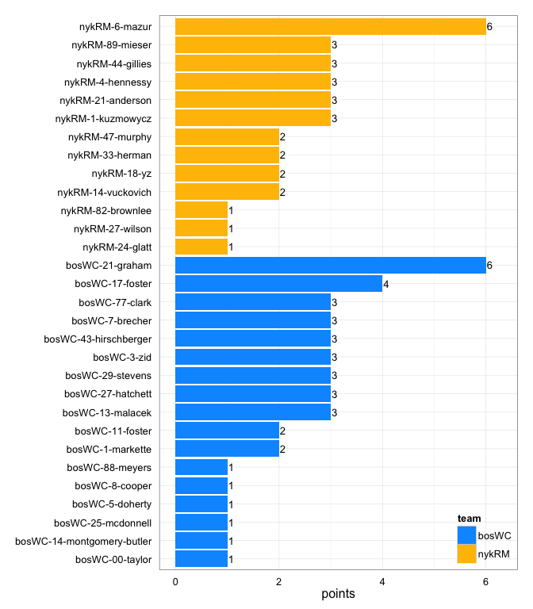
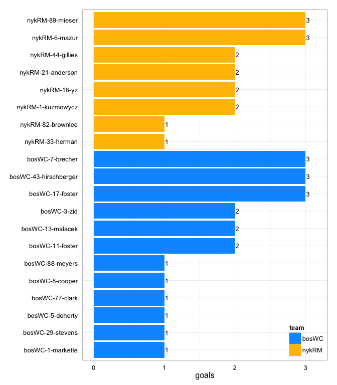
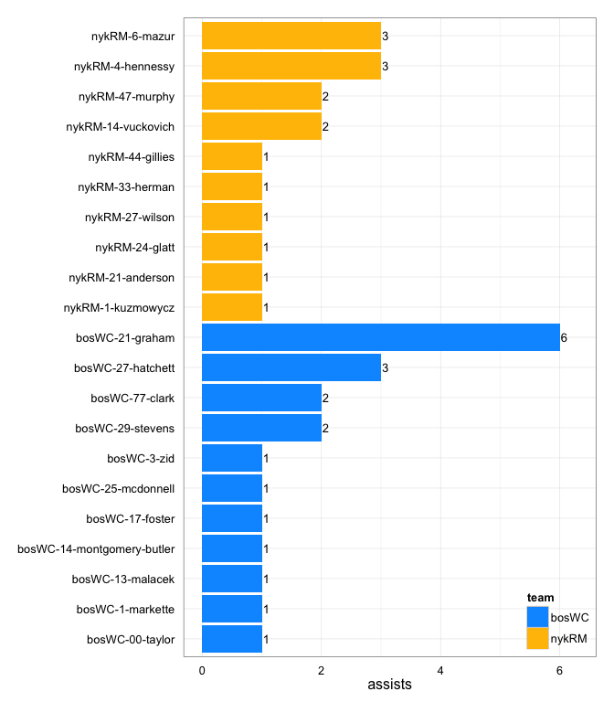
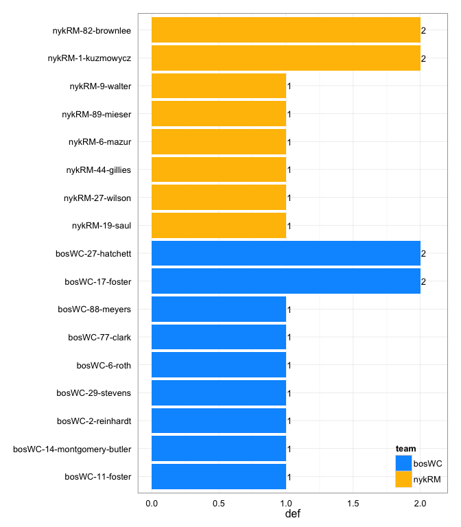

# bosWC at nykRM 2014-06-21

# bosWC 21
# nykRM 16
## game is complete

Go to ...  
  * [Scoring progression](#scoringProgression)  
  * [Player stats via figures](#pl_figs)  
  * [Player stats for bosWC](#away)  
  * [Player stats for nykRM](#home)  
  * [Data on goals, assists, D's](#selectData)  
  * [Full raw data](#rawData)  

## Scoring progression:

| point|period |begin    |end     |pt_duration |desc                                          |bosWC |nykRM |
|-----:|:------|:--------|:-------|:-----------|:---------------------------------------------|:-----|:-----|
|    40|4      |0:10:00  |0:00:00 |00:10       |nykRM-14-vuckovich to nykRM-44-gillies        |21    |16    |
|    39|4      |2:01:00  |0:10:00 |01:51       |bosWC-25-mcdonnell to bosWC-43-hirschberger   |21    |15    |
|    38|4      |3:28:00  |2:01:00 |01:27       |bosWC-27-hatchett to bosWC-29-stevens         |20    |15    |
|    37|4      |3:45:00  |3:28:00 |00:17       |bosWC-21-graham to bosWC-77-clark             |19    |15    |
|    36|4      |5:25:00  |3:45:00 |01:40       |nykRM-6-mazur to nykRM-33-herman              |18    |15    |
|    35|4      |8:05:00  |5:25:00 |02:40       |bosWC-77-clark to bosWC-17-foster             |18    |14    |
|    34|4      |9:07:00  |8:05:00 |01:02       |nykRM-4-hennessy to nykRM-1-kuzmowycz         |17    |14    |
|    33|4      |10:00:00 |9:07:00 |00:53       |bosWC-1-markette to bosWC-7-brecher           |17    |13    |
|    32|3      |0:08:00  |0:00:00 |00:08       |- no goal -                                   |16    |13    |
|    31|3      |1:42:00  |0:08:00 |01:34       |bosWC-29-stevens to bosWC-88-meyers           |16    |13    |
|    30|3      |2:05:00  |1:42:00 |00:23       |bosWC-3-zid to bosWC-13-malacek               |15    |13    |
|    29|3      |2:18:00  |2:05:00 |00:13       |nykRM-14-vuckovich to nykRM-18-yz             |14    |13    |
|    28|3      |2:55:00  |2:18:00 |00:37       |bosWC-17-foster to bosWC-13-malacek           |14    |12    |
|    27|3      |3:19:00  |2:55:00 |00:24       |nykRM-33-herman to nykRM-6-mazur              |13    |12    |
|    26|3      |4:05:00  |3:19:00 |00:46       |bosWC-27-hatchett to bosWC-43-hirschberger    |13    |11    |
|    25|3      |5:16:00  |4:05:00 |01:11       |nykRM-24-glatt to nykRM-89-mieser             |12    |11    |
|    24|3      |5:38:00  |5:16:00 |00:22       |nykRM-27-wilson to nykRM-21-anderson          |12    |10    |
|    23|3      |6:20:00  |5:38:00 |00:42       |NA to bosWC-17-foster                         |12    |9     |
|    22|3      |6:40:00  |6:20:00 |00:20       |nykRM-4-hennessy to nykRM-1-kuzmowycz         |11    |9     |
|    21|3      |8:40:00  |6:40:00 |02:00       |bosWC-21-graham to bosWC-7-brecher            |11    |8     |
|    20|3      |8:59:00  |8:40:00 |00:19       |nykRM-6-mazur to nykRM-89-mieser              |10    |8     |
|    19|3      |10:00:00 |8:59:00 |01:01       |bosWC-27-hatchett to bosWC-11-foster          |10    |7     |
|    18|2      |0:03:00  |0:00:00 |00:03       |- no goal -                                   |9     |7     |
|    17|2      |0:45:00  |0:03:00 |00:42       |bosWC-29-stevens to bosWC-5-doherty           |9     |7     |
|    16|2      |2:56:00  |0:45:00 |02:11       |bosWC-21-graham to bosWC-3-zid                |8     |7     |
|    15|2      |3:14:00  |2:56:00 |00:18       |nykRM-6-mazur to nykRM-18-yz                  |7     |7     |
|    14|2      |3:47:00  |3:14:00 |00:33       |bosWC-21-graham to bosWC-1-markette           |7     |6     |
|    13|2      |4:02:00  |3:47:00 |00:15       |nykRM-1-kuzmowycz to nykRM-44-gillies         |6     |6     |
|    12|2      |4:31:00  |4:02:00 |00:29       |bosWC-21-graham to bosWC-8-cooper             |6     |5     |
|    11|2      |6:47:00  |4:31:00 |02:16       |nykRM-21-anderson to nykRM-82-brownlee        |5     |5     |
|    10|2      |9:32:00  |6:47:00 |02:45       |bosWC-14-montgomery-butler to bosWC-11-foster |5     |4     |
|     9|2      |10:00:00 |9:32:00 |00:28       |bosWC-77-clark to bosWC-3-zid                 |4     |4     |
|     8|1      |0:01:00  |0:00:00 |00:01       |- no goal -                                   |3     |4     |
|     7|1      |0:24:00  |0:01:00 |00:23       |bosWC-21-graham to bosWC-43-hirschberger      |3     |4     |
|     6|1      |5:13:00  |0:24:00 |04:49       |nykRM-47-murphy to nykRM-21-anderson          |2     |4     |
|     5|1      |5:43:00  |5:13:00 |00:30       |bosWC-00-taylor to bosWC-17-foster            |2     |3     |
|     4|1      |6:02:00  |5:43:00 |00:19       |nykRM-47-murphy to nykRM-89-mieser            |1     |3     |
|     3|1      |6:35:00  |6:02:00 |00:33       |nykRM-4-hennessy to nykRM-6-mazur             |1     |2     |
|     2|1      |9:31:00  |6:35:00 |02:56       |bosWC-13-malacek to bosWC-7-brecher           |1     |1     |
|     1|1      |10:00:00 |9:31:00 |00:29       |nykRM-44-gillies to nykRM-6-mazur             |0     |1     |

## Player stats via figures:

### Points = goals + assists

 

### Goals

 

### Assists

 

### D's
 

## Player stats for bosWC :

points = goals + assists  
tables sorted in decreasing order based on points (then goals, assists, Ds)  
Ds = total of plain ol' D's + interceptions (D), hand blocks (HB), and foot blocks (FB)  
stats are cumulative for this game

|   |player   |last              | points| comp_pct| goals| assists| throws| completions| catches| def| drop|
|:--|:--------|:-----------------|------:|--------:|-----:|-------:|------:|-----------:|-------:|---:|----:|
|1  |bosWC-21 |graham            |      6|     0.96|     0|       6|     28|          27|      27|   0|    1|
|2  |bosWC-17 |foster            |      4|     1.00|     3|       1|     11|          11|      12|   2|    0|
|3  |bosWC-43 |hirschberger      |      3|     0.75|     3|       0|      4|           3|       5|   0|    0|
|4  |bosWC-7  |brecher           |      3|     0.96|     3|       0|     26|          25|      20|   0|    0|
|5  |bosWC-13 |malacek           |      3|     0.86|     2|       1|     28|          24|      22|   0|    3|
|6  |bosWC-3  |zid               |      3|     1.00|     2|       1|      2|           2|       4|   0|    0|
|7  |bosWC-29 |stevens           |      3|     0.88|     1|       2|      8|           7|       9|   1|    0|
|8  |bosWC-77 |clark             |      3|     0.92|     1|       2|     13|          12|      14|   1|    0|
|9  |bosWC-27 |hatchett          |      3|     1.00|     0|       3|      9|           9|       8|   2|    0|
|10 |bosWC-11 |foster            |      2|     0.78|     2|       0|      9|           7|      11|   1|    1|
|11 |bosWC-1  |markette          |      2|     0.81|     1|       1|     21|          17|      20|   0|    1|
|12 |bosWC-88 |meyers            |      1|     0.92|     1|       0|     12|          11|      13|   1|    0|
|13 |bosWC-5  |doherty           |      1|     0.33|     1|       0|      3|           1|       4|   0|    0|
|14 |bosWC-8  |cooper            |      1|     1.00|     1|       0|     12|          12|      10|   0|    0|
|15 |bosWC-14 |montgomery-butler |      1|     1.00|     0|       1|     14|          14|       4|   1|    0|
|16 |bosWC-00 |taylor            |      1|     1.00|     0|       1|      4|           4|       2|   0|    0|
|17 |bosWC-25 |mcdonnell         |      1|     1.00|     0|       1|      4|           4|       4|   0|    0|
|18 |bosWC-2  |reinhardt         |      0|     1.00|     0|       0|      2|           2|       2|   1|    0|
|19 |bosWC-6  |roth              |      0|     0.60|     0|       0|      5|           3|       4|   1|    0|
|20 |bosWC-   |?name?            |      0|       NA|     0|       0|      0|           0|       0|   0|    0|
|21 |bosWC-10 |ingold-smith      |      0|     0.90|     0|       0|     10|           9|      10|   0|    0|
|22 |bosWC-12 |simmons           |      0|     1.00|     0|       0|     14|          14|      13|   0|    0|
|23 |bosWC-64 |farnsworth        |      0|     1.00|     0|       0|      7|           7|       7|   0|    0|

## Player stats for nykRM :

points = goals + assists  
tables sorted in decreasing order based on points (then goals, assists, Ds)  
Ds = total of plain ol' D's + interceptions (D), hand blocks (HB), and foot blocks (FB)  
stats are cumulative for this game

|   |player   |last      | points| comp_pct| goals| assists| throws| completions| catches| def| drop|
|:--|:--------|:---------|------:|--------:|-----:|-------:|------:|-----------:|-------:|---:|----:|
|24 |nykRM-6  |mazur     |      6|     1.00|     3|       3|     28|          28|      22|   1|    0|
|25 |nykRM-89 |mieser    |      3|     1.00|     3|       0|      4|           4|       7|   1|    0|
|26 |nykRM-1  |kuzmowycz |      3|     0.92|     2|       1|     13|          12|      14|   2|    0|
|27 |nykRM-44 |gillies   |      3|     0.78|     2|       1|      9|           7|       9|   1|    0|
|28 |nykRM-21 |anderson  |      3|     0.71|     2|       1|      7|           5|       8|   0|    2|
|29 |nykRM-4  |hennessy  |      3|     1.00|     0|       3|     23|          23|      16|   0|    0|
|30 |nykRM-18 |yz        |      2|     0.75|     2|       0|     12|           9|      14|   0|    0|
|31 |nykRM-33 |herman    |      2|     1.00|     1|       1|      7|           7|      10|   0|    0|
|32 |nykRM-14 |vuckovich |      2|     0.94|     0|       2|     16|          15|      16|   0|    0|
|33 |nykRM-47 |murphy    |      2|     0.92|     0|       2|     24|          22|      19|   0|    1|
|34 |nykRM-82 |brownlee  |      1|     0.33|     1|       0|      3|           1|       4|   2|    0|
|35 |nykRM-27 |wilson    |      1|     0.80|     0|       1|      5|           4|       4|   1|    0|
|36 |nykRM-24 |glatt     |      1|     1.00|     0|       1|      8|           8|       7|   0|    0|
|37 |nykRM-19 |saul      |      0|     0.65|     0|       0|     23|          15|      14|   1|    2|
|38 |nykRM-9  |walter    |      0|     1.00|     0|       0|      3|           3|       2|   1|    0|
|39 |nykRM-   |?name?    |      0|       NA|     0|       0|      0|           0|       0|   0|    0|
|40 |nykRM-10 |hennessy  |      0|     1.00|     0|       0|      6|           6|       5|   0|    0|
|41 |nykRM-15 |baum      |      0|     1.00|     0|       0|     10|          10|       8|   0|    0|
|42 |nykRM-26 |bosco     |      0|     0.81|     0|       0|     16|          13|      11|   0|    1|
|43 |nykRM-45 |hard      |      0|     1.00|     0|       0|      3|           3|       4|   0|    0|
|44 |nykRM-5  |sender    |      0|     1.00|     0|       0|      2|           2|       2|   0|    0|
|45 |nykRM-81 |murray    |      0|     0.67|     0|       0|      3|           2|       3|   0|    0|

## Raw data on select events (goals, assists, D's):

| point| period|pull_team | event| poss_abs| poss_rel|poss_team |pl_team |pl_pnum |pl_code |pl_lname          |player                     | bosWC| nykRM|
|-----:|------:|:---------|-----:|--------:|--------:|:---------|:-------|:-------|:-------|:-----------------|:--------------------------|-----:|-----:|
|     1|      1|bosWC     |     7|        1|        1|nykRM     |nykRM   |44      |A       |gillies           |nykRM-44-gillies           |     0|     1|
|     1|      1|bosWC     |     8|        1|        1|nykRM     |nykRM   |6       |G       |mazur             |nykRM-6-mazur              |     0|     1|
|     2|      1|nykRM     |     7|        2|        1|bosWC     |nykRM   |82      |D       |brownlee          |nykRM-82-brownlee          |     1|     1|
|     2|      1|nykRM     |    29|        4|        3|bosWC     |bosWC   |13      |A       |malacek           |bosWC-13-malacek           |     1|     1|
|     2|      1|nykRM     |    30|        4|        3|bosWC     |bosWC   |7       |G       |brecher           |bosWC-7-brecher            |     1|     1|
|     3|      1|bosWC     |     9|        5|        1|nykRM     |nykRM   |4       |A       |hennessy          |nykRM-4-hennessy           |     1|     2|
|     3|      1|bosWC     |    10|        5|        1|nykRM     |nykRM   |6       |G       |mazur             |nykRM-6-mazur              |     1|     2|
|     4|      1|nykRM     |     7|        7|        2|nykRM     |nykRM   |47      |A       |murphy            |nykRM-47-murphy            |     1|     3|
|     4|      1|nykRM     |     8|        7|        2|nykRM     |nykRM   |89      |G       |mieser            |nykRM-89-mieser            |     1|     3|
|     5|      1|nykRM     |     9|        8|        1|bosWC     |bosWC   |00      |A       |taylor            |bosWC-00-taylor            |     2|     3|
|     5|      1|nykRM     |    10|        8|        1|bosWC     |bosWC   |17      |G       |foster            |bosWC-17-foster            |     2|     3|
|     6|      1|bosWC     |     7|        9|        1|nykRM     |bosWC   |11      |D       |foster            |bosWC-11-foster            |     2|     4|
|     6|      1|bosWC     |    24|       12|        4|bosWC     |nykRM   |6       |D       |mazur             |nykRM-6-mazur              |     2|     4|
|     6|      1|bosWC     |    35|       14|        6|bosWC     |nykRM   |19      |D       |saul              |nykRM-19-saul              |     2|     4|
|     6|      1|bosWC     |    51|       16|        8|bosWC     |nykRM   |1       |D       |kuzmowycz         |nykRM-1-kuzmowycz          |     2|     4|
|     6|      1|bosWC     |    61|       19|       11|nykRM     |nykRM   |47      |PUA     |murphy            |nykRM-47-murphy            |     2|     4|
|     6|      1|bosWC     |    62|       19|       11|nykRM     |nykRM   |21      |G       |anderson          |nykRM-21-anderson          |     2|     4|
|     7|      1|nykRM     |     7|       20|        1|bosWC     |bosWC   |21      |A       |graham            |bosWC-21-graham            |     3|     4|
|     7|      1|nykRM     |     8|       20|        1|bosWC     |bosWC   |43      |G       |hirschberger      |bosWC-43-hirschberger      |     3|     4|
|     8|      1|bosWC     |    NA|       NA|       NA|NA        |NA      |NA      |NA      |NA                |NA-NA-NA                   |     3|     4|
|     9|      2|nykRM     |     6|       22|        1|bosWC     |bosWC   |77      |LA      |clark             |bosWC-77-clark             |     4|     4|
|     9|      2|nykRM     |     7|       22|        1|bosWC     |bosWC   |3       |G       |zid               |bosWC-3-zid                |     4|     4|
|    10|      2|bosWC     |    22|       25|        3|nykRM     |bosWC   |14      |D       |montgomery-butler |bosWC-14-montgomery-butler |     5|     4|
|    10|      2|bosWC     |    27|       27|        5|nykRM     |bosWC   |27      |D       |hatchett          |bosWC-27-hatchett          |     5|     4|
|    10|      2|bosWC     |    28|       28|        6|bosWC     |bosWC   |14      |PUA     |montgomery-butler |bosWC-14-montgomery-butler |     5|     4|
|    10|      2|bosWC     |    29|       28|        6|bosWC     |bosWC   |11      |LG      |foster            |bosWC-11-foster            |     5|     4|
|    11|      2|bosWC     |     9|       30|        2|bosWC     |nykRM   |1       |D       |kuzmowycz         |nykRM-1-kuzmowycz          |     5|     5|
|    11|      2|bosWC     |    11|       31|        3|nykRM     |bosWC   |17      |D       |foster            |bosWC-17-foster            |     5|     5|
|    11|      2|bosWC     |    25|       33|        5|nykRM     |nykRM   |21      |A       |anderson          |nykRM-21-anderson          |     5|     5|
|    11|      2|bosWC     |    26|       33|        5|nykRM     |nykRM   |82      |LG      |brownlee          |nykRM-82-brownlee          |     5|     5|
|    12|      2|nykRM     |     8|       34|        1|bosWC     |bosWC   |21      |A       |graham            |bosWC-21-graham            |     6|     5|
|    12|      2|nykRM     |     9|       34|        1|bosWC     |bosWC   |8       |G       |cooper            |bosWC-8-cooper             |     6|     5|
|    13|      2|bosWC     |     3|       35|        1|nykRM     |nykRM   |1       |A       |kuzmowycz         |nykRM-1-kuzmowycz          |     6|     6|
|    13|      2|bosWC     |     5|       35|        1|nykRM     |nykRM   |44      |G       |gillies           |nykRM-44-gillies           |     6|     6|
|    14|      2|nykRM     |     9|       36|        1|bosWC     |bosWC   |21      |LA      |graham            |bosWC-21-graham            |     7|     6|
|    14|      2|nykRM     |    10|       36|        1|bosWC     |bosWC   |1       |G       |markette          |bosWC-1-markette           |     7|     6|
|    15|      2|bosWC     |     2|       37|        1|nykRM     |nykRM   |6       |PUA     |mazur             |nykRM-6-mazur              |     7|     7|
|    15|      2|bosWC     |     3|       37|        1|nykRM     |nykRM   |18      |G       |yz                |nykRM-18-yz                |     7|     7|
|    16|      2|nykRM     |     8|       38|        1|bosWC     |nykRM   |27      |D       |wilson            |nykRM-27-wilson            |     8|     7|
|    16|      2|nykRM     |    27|       42|        5|bosWC     |bosWC   |21      |A       |graham            |bosWC-21-graham            |     8|     7|
|    16|      2|nykRM     |    28|       42|        5|bosWC     |bosWC   |3       |G       |zid               |bosWC-3-zid                |     8|     7|
|    17|      2|bosWC     |    16|       44|        2|bosWC     |bosWC   |29      |LA      |stevens           |bosWC-29-stevens           |     9|     7|
|    17|      2|bosWC     |    17|       44|        2|bosWC     |bosWC   |5       |G       |doherty           |bosWC-5-doherty            |     9|     7|
|    18|      2|bosWC     |     8|       45|        1|nykRM     |bosWC   |77      |D       |clark             |bosWC-77-clark             |     9|     7|
|    19|      3|bosWC     |    10|       47|        2|bosWC     |bosWC   |27      |A       |hatchett          |bosWC-27-hatchett          |    10|     7|
|    19|      3|bosWC     |    11|       47|        2|bosWC     |bosWC   |11      |G       |foster            |bosWC-11-foster            |    10|     7|
|    20|      3|bosWC     |     5|       48|        1|nykRM     |nykRM   |6       |A       |mazur             |nykRM-6-mazur              |    10|     8|
|    20|      3|bosWC     |     6|       48|        1|nykRM     |nykRM   |89      |G       |mieser            |nykRM-89-mieser            |    10|     8|
|    21|      3|nykRM     |    29|       51|        3|bosWC     |bosWC   |21      |A       |graham            |bosWC-21-graham            |    11|     8|
|    21|      3|nykRM     |    30|       51|        3|bosWC     |bosWC   |7       |G       |brecher           |bosWC-7-brecher            |    11|     8|
|    22|      3|bosWC     |     7|       52|        1|nykRM     |nykRM   |4       |A       |hennessy          |nykRM-4-hennessy           |    11|     9|
|    22|      3|bosWC     |     8|       52|        1|nykRM     |nykRM   |1       |G       |kuzmowycz         |nykRM-1-kuzmowycz          |    11|     9|
|    23|      3|nykRM     |     6|       54|        2|nykRM     |bosWC   |17      |D       |foster            |bosWC-17-foster            |    12|     9|
|    23|      3|nykRM     |     7|       55|        3|bosWC     |bosWC   |17      |CG      |foster            |bosWC-17-foster            |    12|     9|
|    24|      3|nykRM     |     6|       56|        1|bosWC     |nykRM   |82      |D       |brownlee          |nykRM-82-brownlee          |    12|    10|
|    24|      3|nykRM     |     7|       57|        2|nykRM     |nykRM   |27      |PUA     |wilson            |nykRM-27-wilson            |    12|    10|
|    24|      3|nykRM     |     8|       57|        2|nykRM     |nykRM   |21      |LG      |anderson          |nykRM-21-anderson          |    12|    10|
|    25|      3|nykRM     |     4|       58|        1|bosWC     |nykRM   |9       |D       |walter            |nykRM-9-walter             |    12|    11|
|    25|      3|nykRM     |    21|       59|        2|nykRM     |nykRM   |24      |A       |glatt             |nykRM-24-glatt             |    12|    11|
|    25|      3|nykRM     |    22|       59|        2|nykRM     |nykRM   |89      |G       |mieser            |nykRM-89-mieser            |    12|    11|
|    26|      3|nykRM     |    16|       60|        1|bosWC     |bosWC   |27      |A       |hatchett          |bosWC-27-hatchett          |    13|    11|
|    26|      3|nykRM     |    17|       60|        1|bosWC     |bosWC   |43      |G       |hirschberger      |bosWC-43-hirschberger      |    13|    11|
|    27|      3|bosWC     |     5|       61|        1|nykRM     |nykRM   |33      |LA      |herman            |nykRM-33-herman            |    13|    12|
|    27|      3|bosWC     |     6|       61|        1|nykRM     |nykRM   |6       |G       |mazur             |nykRM-6-mazur              |    13|    12|
|    28|      3|nykRM     |    11|       62|        1|bosWC     |bosWC   |17      |A       |foster            |bosWC-17-foster            |    14|    12|
|    28|      3|nykRM     |    12|       62|        1|bosWC     |bosWC   |13      |G       |malacek           |bosWC-13-malacek           |    14|    12|
|    29|      3|bosWC     |     5|       63|        1|nykRM     |nykRM   |14      |A       |vuckovich         |nykRM-14-vuckovich         |    14|    13|
|    29|      3|bosWC     |     6|       63|        1|nykRM     |nykRM   |18      |LG      |yz                |nykRM-18-yz                |    14|    13|
|    30|      3|nykRM     |     7|       64|        1|bosWC     |bosWC   |3       |LA      |zid               |bosWC-3-zid                |    15|    13|
|    30|      3|nykRM     |     8|       64|        1|bosWC     |bosWC   |13      |G       |malacek           |bosWC-13-malacek           |    15|    13|
|    31|      3|bosWC     |    10|       65|        1|nykRM     |bosWC   |27      |D       |hatchett          |bosWC-27-hatchett          |    16|    13|
|    31|      3|bosWC     |    15|       66|        2|bosWC     |nykRM   |44      |D       |gillies           |nykRM-44-gillies           |    16|    13|
|    31|      3|bosWC     |    26|       68|        4|bosWC     |bosWC   |29      |A       |stevens           |bosWC-29-stevens           |    16|    13|
|    31|      3|bosWC     |    27|       68|        4|bosWC     |bosWC   |88      |G       |meyers            |bosWC-88-meyers            |    16|    13|
|    32|      3|bosWC     |    NA|       NA|       NA|NA        |NA      |NA      |NA      |NA                |NA-NA-NA                   |    16|    13|
|    33|      4|nykRM     |    14|       70|        1|bosWC     |bosWC   |1       |A       |markette          |bosWC-1-markette           |    17|    13|
|    33|      4|nykRM     |    15|       70|        1|bosWC     |bosWC   |7       |G       |brecher           |bosWC-7-brecher            |    17|    13|
|    34|      4|bosWC     |    13|       71|        1|nykRM     |nykRM   |4       |A       |hennessy          |nykRM-4-hennessy           |    17|    14|
|    34|      4|bosWC     |    14|       71|        1|nykRM     |nykRM   |1       |G       |kuzmowycz         |nykRM-1-kuzmowycz          |    17|    14|
|    35|      4|nykRM     |    10|       72|        1|bosWC     |nykRM   |89      |D       |mieser            |nykRM-89-mieser            |    18|    14|
|    35|      4|nykRM     |    26|       73|        2|nykRM     |bosWC   |29      |D       |stevens           |bosWC-29-stevens           |    18|    14|
|    35|      4|nykRM     |    40|       74|        3|bosWC     |bosWC   |77      |A       |clark             |bosWC-77-clark             |    18|    14|
|    35|      4|nykRM     |    41|       74|        3|bosWC     |bosWC   |17      |G       |foster            |bosWC-17-foster            |    18|    14|
|    36|      4|bosWC     |    13|       77|        3|nykRM     |bosWC   |6       |D       |roth              |bosWC-6-roth               |    18|    15|
|    36|      4|bosWC     |    23|       79|        5|nykRM     |nykRM   |6       |A       |mazur             |nykRM-6-mazur              |    18|    15|
|    36|      4|bosWC     |    24|       79|        5|nykRM     |nykRM   |33      |G       |herman            |nykRM-33-herman            |    18|    15|
|    37|      4|nykRM     |     4|       80|        1|bosWC     |bosWC   |21      |A       |graham            |bosWC-21-graham            |    19|    15|
|    37|      4|nykRM     |     5|       80|        1|bosWC     |bosWC   |77      |LG      |clark             |bosWC-77-clark             |    19|    15|
|    38|      4|bosWC     |    11|       81|        1|nykRM     |bosWC   |88      |D       |meyers            |bosWC-88-meyers            |    20|    15|
|    38|      4|bosWC     |    17|       82|        2|bosWC     |bosWC   |27      |A       |hatchett          |bosWC-27-hatchett          |    20|    15|
|    38|      4|bosWC     |    18|       82|        2|bosWC     |bosWC   |29      |G       |stevens           |bosWC-29-stevens           |    20|    15|
|    39|      4|bosWC     |     7|       83|        1|nykRM     |bosWC   |2       |D       |reinhardt         |bosWC-2-reinhardt          |    21|    15|
|    39|      4|bosWC     |    28|       84|        2|bosWC     |bosWC   |25      |A       |mcdonnell         |bosWC-25-mcdonnell         |    21|    15|
|    39|      4|bosWC     |    29|       84|        2|bosWC     |bosWC   |43      |G       |hirschberger      |bosWC-43-hirschberger      |    21|    15|
|    40|      4|bosWC     |     5|       85|        1|nykRM     |nykRM   |14      |A       |vuckovich         |nykRM-14-vuckovich         |    21|    16|
|    40|      4|bosWC     |     6|       85|        1|nykRM     |nykRM   |44      |G       |gillies           |nykRM-44-gillies           |    21|    16|

## Full raw data:

__Note: just for display purposes.__ Raw data in more useful forms can be found in the [GitHub repository](https://github.com/jennybc/vanNH). Find the game you're interested in in the `games` subdirectory.

| period| point|pull_team | event| poss_abs| poss_rel|poss_team |pl_team |pl_pnum |pl_code |
|------:|-----:|:---------|-----:|--------:|--------:|:---------|:-------|:-------|:-------|
|      1|     1|bosWC     |     1|        1|        1|nykRM     |bosWC   |11      |P       |
|      1|     1|bosWC     |     2|        1|        1|nykRM     |nykRM   |6       |PU      |
|      1|     1|bosWC     |     3|        1|        1|nykRM     |nykRM   |14      |        |
|      1|     1|bosWC     |     4|        1|        1|nykRM     |nykRM   |18      |        |
|      1|     1|bosWC     |     5|        1|        1|nykRM     |nykRM   |4       |        |
|      1|     1|bosWC     |     6|        1|        1|nykRM     |nykRM   |14      |        |
|      1|     1|bosWC     |     7|        1|        1|nykRM     |nykRM   |44      |A       |
|      1|     1|bosWC     |     8|        1|        1|nykRM     |nykRM   |6       |G       |
|      1|     2|nykRM     |     1|        2|        1|bosWC     |nykRM   |81      |P       |
|      1|     2|nykRM     |     2|        2|        1|bosWC     |bosWC   |00      |PU      |
|      1|     2|nykRM     |     3|        2|        1|bosWC     |bosWC   |13      |        |
|      1|     2|nykRM     |     4|        2|        1|bosWC     |bosWC   |7       |        |
|      1|     2|nykRM     |     5|        2|        1|bosWC     |bosWC   |21      |        |
|      1|     2|nykRM     |     6|        2|        1|bosWC     |bosWC   |1       |        |
|      1|     2|nykRM     |     7|        2|        1|bosWC     |nykRM   |82      |D       |
|      1|     2|nykRM     |     8|        3|        2|nykRM     |nykRM   |24      |PU      |
|      1|     2|nykRM     |     9|        3|        2|nykRM     |nykRM   |47      |        |
|      1|     2|nykRM     |    10|        3|        2|nykRM     |nykRM   |24      |        |
|      1|     2|nykRM     |    11|        3|        2|nykRM     |nykRM   |47      |        |
|      1|     2|nykRM     |    12|        3|        2|nykRM     |nykRM   |5       |        |
|      1|     2|nykRM     |    13|        3|        2|nykRM     |nykRM   |24      |        |
|      1|     2|nykRM     |    14|        3|        2|nykRM     |nykRM   |27      |        |
|      1|     2|nykRM     |    15|        3|        2|nykRM     |nykRM   |21      |        |
|      1|     2|nykRM     |    16|        3|        2|nykRM     |nykRM   |81      |        |
|      1|     2|nykRM     |    17|        3|        2|nykRM     |bosWC   |77      |F       |
|      1|     2|nykRM     |    18|        3|        2|nykRM     |nykRM   |5       |        |
|      1|     2|nykRM     |    19|        3|        2|nykRM     |nykRM   |47      |        |
|      1|     2|nykRM     |    20|        3|        2|nykRM     |nykRM   |82      |        |
|      1|     2|nykRM     |    21|        4|        3|bosWC     |bosWC   |7       |PU      |
|      1|     2|nykRM     |    22|        4|        3|bosWC     |bosWC   |13      |        |
|      1|     2|nykRM     |    23|        4|        3|bosWC     |bosWC   |64      |        |
|      1|     2|nykRM     |    24|        4|        3|bosWC     |bosWC   |21      |        |
|      1|     2|nykRM     |    25|        4|        3|bosWC     |bosWC   |77      |L       |
|      1|     2|nykRM     |    26|        4|        3|bosWC     |nykRM   |27      |F       |
|      1|     2|nykRM     |    27|        4|        3|bosWC     |bosWC   |7       |        |
|      1|     2|nykRM     |    28|        4|        3|bosWC     |bosWC   |1       |        |
|      1|     2|nykRM     |    29|        4|        3|bosWC     |bosWC   |13      |A       |
|      1|     2|nykRM     |    30|        4|        3|bosWC     |bosWC   |7       |G       |
|      1|     3|bosWC     |     1|        5|        1|nykRM     |bosWC   |43      |P       |
|      1|     3|bosWC     |     2|        5|        1|nykRM     |nykRM   |4       |PU      |
|      1|     3|bosWC     |     3|        5|        1|nykRM     |nykRM   |6       |        |
|      1|     3|bosWC     |     4|        5|        1|nykRM     |nykRM   |33      |        |
|      1|     3|bosWC     |     5|        5|        1|nykRM     |nykRM   |18      |        |
|      1|     3|bosWC     |     6|        5|        1|nykRM     |nykRM   |6       |        |
|      1|     3|bosWC     |     7|        5|        1|nykRM     |nykRM   |18      |        |
|      1|     3|bosWC     |     8|        5|        1|nykRM     |nykRM   |6       |        |
|      1|     3|bosWC     |     9|        5|        1|nykRM     |nykRM   |4       |A       |
|      1|     3|bosWC     |    10|        5|        1|nykRM     |nykRM   |6       |G       |
|      1|     4|nykRM     |     1|        6|        1|bosWC     |nykRM   |27      |P       |
|      1|     4|nykRM     |     2|        6|        1|bosWC     |bosWC   |7       |PU      |
|      1|     4|nykRM     |     3|        6|        1|bosWC     |bosWC   |13      |        |
|      1|     4|nykRM     |     4|        6|        1|bosWC     |bosWC   |21      |TD      |
|      1|     4|nykRM     |     5|        7|        2|nykRM     |nykRM   |47      |PU      |
|      1|     4|nykRM     |     6|        7|        2|nykRM     |nykRM   |9       |        |
|      1|     4|nykRM     |     7|        7|        2|nykRM     |nykRM   |47      |A       |
|      1|     4|nykRM     |     8|        7|        2|nykRM     |nykRM   |89      |G       |
|      1|     5|nykRM     |     1|        8|        1|bosWC     |nykRM   |82      |OBP     |
|      1|     5|nykRM     |     2|        8|        1|bosWC     |bosWC   |00      |PU      |
|      1|     5|nykRM     |     3|        8|        1|bosWC     |bosWC   |13      |        |
|      1|     5|nykRM     |     4|        8|        1|bosWC     |bosWC   |64      |        |
|      1|     5|nykRM     |     5|        8|        1|bosWC     |bosWC   |1       |        |
|      1|     5|nykRM     |     6|        8|        1|bosWC     |bosWC   |00      |        |
|      1|     5|nykRM     |     7|        8|        1|bosWC     |bosWC   |17      |        |
|      1|     5|nykRM     |     8|        8|        1|bosWC     |bosWC   |21      |        |
|      1|     5|nykRM     |     9|        8|        1|bosWC     |bosWC   |00      |A       |
|      1|     5|nykRM     |    10|        8|        1|bosWC     |bosWC   |17      |G       |
|      1|     6|bosWC     |     1|        9|        1|nykRM     |bosWC   |11      |P       |
|      1|     6|bosWC     |     2|        9|        1|nykRM     |nykRM   |6       |PU      |
|      1|     6|bosWC     |     3|        9|        1|nykRM     |nykRM   |14      |        |
|      1|     6|bosWC     |     4|        9|        1|nykRM     |nykRM   |19      |        |
|      1|     6|bosWC     |     5|        9|        1|nykRM     |nykRM   |1       |        |
|      1|     6|bosWC     |     6|        9|        1|nykRM     |nykRM   |19      |        |
|      1|     6|bosWC     |     7|        9|        1|nykRM     |bosWC   |11      |D       |
|      1|     6|bosWC     |     8|       10|        2|bosWC     |bosWC   |14      |PU      |
|      1|     6|bosWC     |     9|       10|        2|bosWC     |bosWC   |10      |        |
|      1|     6|bosWC     |    10|       10|        2|bosWC     |bosWC   |11      |        |
|      1|     6|bosWC     |    11|       10|        2|bosWC     |bosWC   |29      |        |
|      1|     6|bosWC     |    12|       10|        2|bosWC     |bosWC   |88      |        |
|      1|     6|bosWC     |    13|       11|        3|nykRM     |nykRM   |19      |PU      |
|      1|     6|bosWC     |    14|       11|        3|nykRM     |nykRM   |6       |        |
|      1|     6|bosWC     |    15|       11|        3|nykRM     |nykRM   |26      |        |
|      1|     6|bosWC     |    16|       11|        3|nykRM     |nykRM   |6       |        |
|      1|     6|bosWC     |    17|       11|        3|nykRM     |nykRM   |19      |        |
|      1|     6|bosWC     |    18|       12|        4|bosWC     |bosWC   |14      |PU      |
|      1|     6|bosWC     |    19|       12|        4|bosWC     |bosWC   |88      |        |
|      1|     6|bosWC     |    20|       12|        4|bosWC     |bosWC   |14      |        |
|      1|     6|bosWC     |    21|       12|        4|bosWC     |bosWC   |27      |        |
|      1|     6|bosWC     |    22|       12|        4|bosWC     |bosWC   |5       |        |
|      1|     6|bosWC     |    23|       12|        4|bosWC     |bosWC   |10      |        |
|      1|     6|bosWC     |    24|       12|        4|bosWC     |nykRM   |6       |D       |
|      1|     6|bosWC     |    25|       13|        5|nykRM     |nykRM   |6       |PU      |
|      1|     6|bosWC     |    26|       13|        5|nykRM     |nykRM   |19      |        |
|      1|     6|bosWC     |    27|       13|        5|nykRM     |nykRM   |26      |        |
|      1|     6|bosWC     |    28|       13|        5|nykRM     |nykRM   |14      |        |
|      1|     6|bosWC     |    29|       13|        5|nykRM     |nykRM   |26      |        |
|      1|     6|bosWC     |    30|       13|        5|nykRM     |nykRM   |14      |TD      |
|      1|     6|bosWC     |    31|       14|        6|bosWC     |bosWC   |14      |PU      |
|      1|     6|bosWC     |    32|       14|        6|bosWC     |bosWC   |11      |        |
|      1|     6|bosWC     |    33|       14|        6|bosWC     |bosWC   |88      |        |
|      1|     6|bosWC     |    34|       14|        6|bosWC     |bosWC   |5       |        |
|      1|     6|bosWC     |    35|       14|        6|bosWC     |nykRM   |19      |D       |
|      1|     6|bosWC     |    36|       15|        7|nykRM     |nykRM   |19      |PU      |
|      1|     6|bosWC     |    37|       15|        7|nykRM     |nykRM   |33      |        |
|      1|     6|bosWC     |    38|       15|        7|nykRM     |nykRM   |        |TO      |
|      1|     6|bosWC     |    39|       15|        7|nykRM     |nykRM   |6       |PU      |
|      1|     6|bosWC     |    40|       15|        7|nykRM     |nykRM   |14      |        |
|      1|     6|bosWC     |    41|       15|        7|nykRM     |nykRM   |18      |        |
|      1|     6|bosWC     |    42|       15|        7|nykRM     |nykRM   |1       |        |
|      1|     6|bosWC     |    43|       15|        7|nykRM     |nykRM   |26      |        |
|      1|     6|bosWC     |    44|       15|        7|nykRM     |nykRM   |14      |        |
|      1|     6|bosWC     |    45|       15|        7|nykRM     |nykRM   |1       |        |
|      1|     6|bosWC     |    46|       16|        8|bosWC     |bosWC   |43      |PU      |
|      1|     6|bosWC     |    47|       16|        8|bosWC     |bosWC   |25      |        |
|      1|     6|bosWC     |    48|       16|        8|bosWC     |bosWC   |8       |        |
|      1|     6|bosWC     |    49|       16|        8|bosWC     |bosWC   |25      |        |
|      1|     6|bosWC     |    50|       16|        8|bosWC     |bosWC   |6       |        |
|      1|     6|bosWC     |    51|       16|        8|bosWC     |nykRM   |1       |D       |
|      1|     6|bosWC     |    52|       17|        9|nykRM     |nykRM   |1       |PU      |
|      1|     6|bosWC     |    53|       17|        9|nykRM     |nykRM   |4       |        |
|      1|     6|bosWC     |    54|       17|        9|nykRM     |nykRM   |14      |        |
|      1|     6|bosWC     |    55|       17|        9|nykRM     |nykRM   |26      |        |
|      1|     6|bosWC     |    56|       17|        9|nykRM     |nykRM   |1       |        |
|      1|     6|bosWC     |    57|       17|        9|nykRM     |nykRM   |18      |        |
|      1|     6|bosWC     |    58|       18|       10|bosWC     |bosWC   |        |TO      |
|      1|     6|bosWC     |    59|       18|       10|bosWC     |bosWC   |13      |PU      |
|      1|     6|bosWC     |    60|       18|       10|bosWC     |bosWC   |3       |TD      |
|      1|     6|bosWC     |    61|       19|       11|nykRM     |nykRM   |47      |PUA     |
|      1|     6|bosWC     |    62|       19|       11|nykRM     |nykRM   |21      |G       |
|      1|     7|nykRM     |     1|       20|        1|bosWC     |nykRM   |81      |P       |
|      1|     7|nykRM     |     2|       20|        1|bosWC     |bosWC   |17      |PU      |
|      1|     7|nykRM     |     3|       20|        1|bosWC     |bosWC   |13      |        |
|      1|     7|nykRM     |     4|       20|        1|bosWC     |bosWC   |21      |        |
|      1|     7|nykRM     |     5|       20|        1|bosWC     |bosWC   |77      |        |
|      1|     7|nykRM     |     6|       20|        1|bosWC     |bosWC   |1       |        |
|      1|     7|nykRM     |     7|       20|        1|bosWC     |bosWC   |21      |A       |
|      1|     7|nykRM     |     8|       20|        1|bosWC     |bosWC   |43      |G       |
|      1|     8|bosWC     |     1|       21|        1|nykRM     |bosWC   |11      |P       |
|      1|     8|bosWC     |     2|       21|        1|nykRM     |nykRM   |19      |PU      |
|      2|     9|nykRM     |     1|       22|        1|bosWC     |nykRM   |81      |P       |
|      2|     9|nykRM     |     2|       22|        1|bosWC     |bosWC   |13      |PU      |
|      2|     9|nykRM     |     3|       22|        1|bosWC     |bosWC   |7       |        |
|      2|     9|nykRM     |     4|       22|        1|bosWC     |bosWC   |21      |        |
|      2|     9|nykRM     |     5|       22|        1|bosWC     |nykRM   |27      |F       |
|      2|     9|nykRM     |     6|       22|        1|bosWC     |bosWC   |77      |LA      |
|      2|     9|nykRM     |     7|       22|        1|bosWC     |bosWC   |3       |G       |
|      2|    10|bosWC     |     1|       23|        1|nykRM     |bosWC   |11      |P       |
|      2|    10|bosWC     |     2|       23|        1|nykRM     |nykRM   |4       |PU      |
|      2|    10|bosWC     |     3|       23|        1|nykRM     |nykRM   |6       |        |
|      2|    10|bosWC     |     4|       23|        1|nykRM     |nykRM   |19      |        |
|      2|    10|bosWC     |     5|       23|        1|nykRM     |nykRM   |18      |        |
|      2|    10|bosWC     |     6|       23|        1|nykRM     |nykRM   |19      |        |
|      2|    10|bosWC     |     7|       23|        1|nykRM     |nykRM   |44      |        |
|      2|    10|bosWC     |     8|       23|        1|nykRM     |nykRM   |33      |VTT     |
|      2|    10|bosWC     |     9|       24|        2|bosWC     |bosWC   |10      |PU      |
|      2|    10|bosWC     |    10|       24|        2|bosWC     |bosWC   |14      |        |
|      2|    10|bosWC     |    11|       24|        2|bosWC     |bosWC   |88      |        |
|      2|    10|bosWC     |    12|       24|        2|bosWC     |bosWC   |14      |        |
|      2|    10|bosWC     |    13|       24|        2|bosWC     |bosWC   |10      |        |
|      2|    10|bosWC     |    14|       24|        2|bosWC     |bosWC   |11      |        |
|      2|    10|bosWC     |    15|       24|        2|bosWC     |bosWC   |10      |        |
|      2|    10|bosWC     |    16|       24|        2|bosWC     |bosWC   |29      |        |
|      2|    10|bosWC     |    17|       24|        2|bosWC     |bosWC   |11      |        |
|      2|    10|bosWC     |    18|       24|        2|bosWC     |bosWC   |88      |TD      |
|      2|    10|bosWC     |    19|       25|        3|nykRM     |nykRM   |19      |PU      |
|      2|    10|bosWC     |    20|       25|        3|nykRM     |nykRM   |4       |        |
|      2|    10|bosWC     |    21|       25|        3|nykRM     |nykRM   |44      |        |
|      2|    10|bosWC     |    22|       25|        3|nykRM     |bosWC   |14      |D       |
|      2|    10|bosWC     |    23|       26|        4|bosWC     |bosWC   |14      |PU      |
|      2|    10|bosWC     |    24|       26|        4|bosWC     |bosWC   |27      |        |
|      2|    10|bosWC     |    25|       26|        4|bosWC     |bosWC   |11      |        |
|      2|    10|bosWC     |    26|       27|        5|nykRM     |nykRM   |19      |PU      |
|      2|    10|bosWC     |    27|       27|        5|nykRM     |bosWC   |27      |D       |
|      2|    10|bosWC     |    28|       28|        6|bosWC     |bosWC   |14      |PUA     |
|      2|    10|bosWC     |    29|       28|        6|bosWC     |bosWC   |11      |LG      |
|      2|    11|bosWC     |     1|       29|        1|nykRM     |bosWC   |43      |P       |
|      2|    11|bosWC     |     2|       29|        1|nykRM     |nykRM   |26      |PU      |
|      2|    11|bosWC     |     3|       29|        1|nykRM     |nykRM   |47      |        |
|      2|    11|bosWC     |     4|       29|        1|nykRM     |nykRM   |1       |        |
|      2|    11|bosWC     |     5|       29|        1|nykRM     |nykRM   |47      |        |
|      2|    11|bosWC     |     6|       29|        1|nykRM     |nykRM   |21      |        |
|      2|    11|bosWC     |     7|       29|        1|nykRM     |nykRM   |27      |TD      |
|      2|    11|bosWC     |     8|       30|        2|bosWC     |bosWC   |43      |PU      |
|      2|    11|bosWC     |     9|       30|        2|bosWC     |nykRM   |1       |D       |
|      2|    11|bosWC     |    10|       31|        3|nykRM     |nykRM   |47      |PU      |
|      2|    11|bosWC     |    11|       31|        3|nykRM     |bosWC   |17      |D       |
|      2|    11|bosWC     |    12|       32|        4|bosWC     |bosWC   |        |TO      |
|      2|    11|bosWC     |    13|       32|        4|bosWC     |bosWC   |7       |PU      |
|      2|    11|bosWC     |    14|       32|        4|bosWC     |bosWC   |1       |        |
|      2|    11|bosWC     |    15|       32|        4|bosWC     |bosWC   |7       |        |
|      2|    11|bosWC     |    16|       32|        4|bosWC     |bosWC   |1       |        |
|      2|    11|bosWC     |    17|       32|        4|bosWC     |bosWC   |13      |        |
|      2|    11|bosWC     |    18|       32|        4|bosWC     |bosWC   |21      |        |
|      2|    11|bosWC     |    19|       32|        4|bosWC     |bosWC   |1       |        |
|      2|    11|bosWC     |    20|       32|        4|bosWC     |bosWC   |21      |TD      |
|      2|    11|bosWC     |    21|       33|        5|nykRM     |nykRM   |47      |PU      |
|      2|    11|bosWC     |    22|       33|        5|nykRM     |nykRM   |21      |        |
|      2|    11|bosWC     |    23|       33|        5|nykRM     |nykRM   |82      |        |
|      2|    11|bosWC     |    24|       33|        5|nykRM     |nykRM   |27      |        |
|      2|    11|bosWC     |    25|       33|        5|nykRM     |nykRM   |21      |A       |
|      2|    11|bosWC     |    26|       33|        5|nykRM     |nykRM   |82      |LG      |
|      2|    12|nykRM     |     1|       34|        1|bosWC     |nykRM   |81      |P       |
|      2|    12|nykRM     |     2|       34|        1|bosWC     |bosWC   |8       |PU      |
|      2|    12|nykRM     |     3|       34|        1|bosWC     |bosWC   |13      |        |
|      2|    12|nykRM     |     4|       34|        1|bosWC     |bosWC   |12      |        |
|      2|    12|nykRM     |     5|       34|        1|bosWC     |bosWC   |17      |        |
|      2|    12|nykRM     |     6|       34|        1|bosWC     |bosWC   |21      |        |
|      2|    12|nykRM     |     7|       34|        1|bosWC     |bosWC   |17      |        |
|      2|    12|nykRM     |     8|       34|        1|bosWC     |bosWC   |21      |A       |
|      2|    12|nykRM     |     9|       34|        1|bosWC     |bosWC   |8       |G       |
|      2|    13|bosWC     |     1|       35|        1|nykRM     |bosWC   |11      |P       |
|      2|    13|bosWC     |     2|       35|        1|nykRM     |nykRM   |6       |PU      |
|      2|    13|bosWC     |     3|       35|        1|nykRM     |nykRM   |1       |A       |
|      2|    13|bosWC     |     4|       35|        1|nykRM     |bosWC   |9       |F       |
|      2|    13|bosWC     |     5|       35|        1|nykRM     |nykRM   |44      |G       |
|      2|    14|nykRM     |     1|       36|        1|bosWC     |nykRM   |21      |P       |
|      2|    14|nykRM     |     2|       36|        1|bosWC     |bosWC   |1       |PU      |
|      2|    14|nykRM     |     3|       36|        1|bosWC     |bosWC   |13      |        |
|      2|    14|nykRM     |     4|       36|        1|bosWC     |bosWC   |17      |        |
|      2|    14|nykRM     |     5|       36|        1|bosWC     |bosWC   |13      |        |
|      2|    14|nykRM     |     6|       36|        1|bosWC     |bosWC   |1       |        |
|      2|    14|nykRM     |     7|       36|        1|bosWC     |bosWC   |21      |        |
|      2|    14|nykRM     |     8|       36|        1|bosWC     |bosWC   |7       |        |
|      2|    14|nykRM     |     9|       36|        1|bosWC     |bosWC   |21      |LA      |
|      2|    14|nykRM     |    10|       36|        1|bosWC     |bosWC   |1       |G       |
|      2|    15|bosWC     |     1|       37|        1|nykRM     |bosWC   |43      |P       |
|      2|    15|bosWC     |     2|       37|        1|nykRM     |nykRM   |6       |PUA     |
|      2|    15|bosWC     |     3|       37|        1|nykRM     |nykRM   |18      |G       |
|      2|    16|nykRM     |     1|       38|        1|bosWC     |nykRM   |81      |P       |
|      2|    16|nykRM     |     2|       38|        1|bosWC     |bosWC   |13      |PU      |
|      2|    16|nykRM     |     3|       38|        1|bosWC     |bosWC   |7       |        |
|      2|    16|nykRM     |     4|       38|        1|bosWC     |bosWC   |21      |        |
|      2|    16|nykRM     |     5|       38|        1|bosWC     |bosWC   |13      |        |
|      2|    16|nykRM     |     6|       38|        1|bosWC     |bosWC   |21      |        |
|      2|    16|nykRM     |     7|       38|        1|bosWC     |bosWC   |1       |        |
|      2|    16|nykRM     |     8|       38|        1|bosWC     |nykRM   |27      |D       |
|      2|    16|nykRM     |     9|       39|        2|nykRM     |nykRM   |10      |PU      |
|      2|    16|nykRM     |    10|       39|        2|nykRM     |nykRM   |15      |        |
|      2|    16|nykRM     |    11|       39|        2|nykRM     |nykRM   |47      |        |
|      2|    16|nykRM     |    12|       39|        2|nykRM     |nykRM   |81      |        |
|      2|    16|nykRM     |    13|       40|        3|bosWC     |bosWC   |13      |PU      |
|      2|    16|nykRM     |    14|       40|        3|bosWC     |bosWC   |21      |        |
|      2|    16|nykRM     |    15|       40|        3|bosWC     |bosWC   |1       |        |
|      2|    16|nykRM     |    16|       40|        3|bosWC     |bosWC   |7       |        |
|      2|    16|nykRM     |    17|       40|        3|bosWC     |bosWC   |17      |L       |
|      2|    16|nykRM     |    18|       40|        3|bosWC     |bosWC   |13      |        |
|      2|    16|nykRM     |    19|       40|        3|bosWC     |bosWC   |77      |TD      |
|      2|    16|nykRM     |    20|       41|        4|nykRM     |nykRM   |15      |PU      |
|      2|    16|nykRM     |    21|       41|        4|nykRM     |nykRM   |47      |        |
|      2|    16|nykRM     |    22|       41|        4|nykRM     |nykRM   |21      |        |
|      2|    16|nykRM     |    23|       41|        4|nykRM     |nykRM   |81      |TD      |
|      2|    16|nykRM     |    24|       42|        5|bosWC     |bosWC   |21      |PU      |
|      2|    16|nykRM     |    25|       42|        5|bosWC     |bosWC   |77      |        |
|      2|    16|nykRM     |    26|       42|        5|bosWC     |bosWC   |17      |        |
|      2|    16|nykRM     |    27|       42|        5|bosWC     |bosWC   |21      |A       |
|      2|    16|nykRM     |    28|       42|        5|bosWC     |bosWC   |3       |G       |
|      2|    17|bosWC     |     1|       43|        1|nykRM     |bosWC   |11      |P       |
|      2|    17|bosWC     |     2|       43|        1|nykRM     |nykRM   |19      |PU      |
|      2|    17|bosWC     |     3|       43|        1|nykRM     |nykRM   |33      |        |
|      2|    17|bosWC     |     4|       43|        1|nykRM     |nykRM   |19      |        |
|      2|    17|bosWC     |     5|       43|        1|nykRM     |nykRM   |1       |        |
|      2|    17|bosWC     |     6|       43|        1|nykRM     |nykRM   |18      |        |
|      2|    17|bosWC     |     7|       43|        1|nykRM     |nykRM   |19      |        |
|      2|    17|bosWC     |     8|       43|        1|nykRM     |nykRM   |33      |        |
|      2|    17|bosWC     |     9|       43|        1|nykRM     |nykRM   |19      |        |
|      2|    17|bosWC     |    10|       43|        1|nykRM     |nykRM   |18      |TD      |
|      2|    17|bosWC     |    11|       44|        2|bosWC     |bosWC   |27      |SO      |
|      2|    17|bosWC     |    12|       44|        2|bosWC     |nykRM   |33      |SO      |
|      2|    17|bosWC     |    13|       44|        2|bosWC     |bosWC   |21      |SI      |
|      2|    17|bosWC     |    14|       44|        2|bosWC     |nykRM   |21      |SI      |
|      2|    17|bosWC     |    15|       44|        2|bosWC     |bosWC   |14      |PU      |
|      2|    17|bosWC     |    16|       44|        2|bosWC     |bosWC   |29      |LA      |
|      2|    17|bosWC     |    17|       44|        2|bosWC     |bosWC   |5       |G       |
|      2|    18|bosWC     |     1|       45|        1|nykRM     |bosWC   |43      |P       |
|      2|    18|bosWC     |     2|       45|        1|nykRM     |nykRM   |19      |PU      |
|      2|    18|bosWC     |     3|       45|        1|nykRM     |nykRM   |6       |        |
|      2|    18|bosWC     |     4|       45|        1|nykRM     |bosWC   |14      |F       |
|      2|    18|bosWC     |     5|       45|        1|nykRM     |nykRM   |19      |        |
|      2|    18|bosWC     |     6|       45|        1|nykRM     |nykRM   |6       |        |
|      2|    18|bosWC     |     7|       45|        1|nykRM     |nykRM   |19      |        |
|      2|    18|bosWC     |     8|       45|        1|nykRM     |bosWC   |77      |D       |
|      3|    19|bosWC     |     1|       46|        1|nykRM     |bosWC   |11      |P       |
|      3|    19|bosWC     |     2|       46|        1|nykRM     |nykRM   |4       |PU      |
|      3|    19|bosWC     |     3|       46|        1|nykRM     |nykRM   |6       |        |
|      3|    19|bosWC     |     4|       46|        1|nykRM     |nykRM   |4       |        |
|      3|    19|bosWC     |     5|       46|        1|nykRM     |nykRM   |14      |        |
|      3|    19|bosWC     |     6|       46|        1|nykRM     |nykRM   |26      |        |
|      3|    19|bosWC     |     7|       47|        2|bosWC     |bosWC   |14      |PU      |
|      3|    19|bosWC     |     8|       47|        2|bosWC     |bosWC   |29      |        |
|      3|    19|bosWC     |     9|       47|        2|bosWC     |bosWC   |88      |        |
|      3|    19|bosWC     |    10|       47|        2|bosWC     |bosWC   |27      |A       |
|      3|    19|bosWC     |    11|       47|        2|bosWC     |bosWC   |11      |G       |
|      3|    20|bosWC     |     1|       48|        1|nykRM     |bosWC   |43      |P       |
|      3|    20|bosWC     |     2|       48|        1|nykRM     |nykRM   |6       |PU      |
|      3|    20|bosWC     |     3|       48|        1|nykRM     |nykRM   |81      |        |
|      3|    20|bosWC     |     4|       48|        1|nykRM     |nykRM   |89      |        |
|      3|    20|bosWC     |     5|       48|        1|nykRM     |nykRM   |6       |A       |
|      3|    20|bosWC     |     6|       48|        1|nykRM     |nykRM   |89      |G       |
|      3|    21|nykRM     |     1|       49|        1|bosWC     |nykRM   |47      |P       |
|      3|    21|nykRM     |     2|       49|        1|bosWC     |bosWC   |13      |PU      |
|      3|    21|nykRM     |     3|       49|        1|bosWC     |bosWC   |7       |        |
|      3|    21|nykRM     |     4|       49|        1|bosWC     |bosWC   |13      |        |
|      3|    21|nykRM     |     5|       49|        1|bosWC     |bosWC   |7       |        |
|      3|    21|nykRM     |     6|       49|        1|bosWC     |bosWC   |77      |        |
|      3|    21|nykRM     |     7|       49|        1|bosWC     |bosWC   |21      |        |
|      3|    21|nykRM     |     8|       49|        1|bosWC     |bosWC   |13      |TD      |
|      3|    21|nykRM     |     9|       50|        2|nykRM     |nykRM   |21      |PU      |
|      3|    21|nykRM     |    10|       50|        2|nykRM     |nykRM   |47      |        |
|      3|    21|nykRM     |    11|       50|        2|nykRM     |nykRM   |89      |        |
|      3|    21|nykRM     |    12|       50|        2|nykRM     |nykRM   |47      |        |
|      3|    21|nykRM     |    13|       50|        2|nykRM     |nykRM   |89      |        |
|      3|    21|nykRM     |    14|       50|        2|nykRM     |nykRM   |21      |        |
|      3|    21|nykRM     |    15|       50|        2|nykRM     |bosWC   |13      |F       |
|      3|    21|nykRM     |    16|       50|        2|nykRM     |nykRM   |24      |        |
|      3|    21|nykRM     |    17|       50|        2|nykRM     |nykRM   |47      |        |
|      3|    21|nykRM     |    18|       50|        2|nykRM     |nykRM   |24      |        |
|      3|    21|nykRM     |    19|       50|        2|nykRM     |nykRM   |27      |        |
|      3|    21|nykRM     |    20|       50|        2|nykRM     |nykRM   |47      |        |
|      3|    21|nykRM     |    21|       50|        2|nykRM     |nykRM   |89      |TD      |
|      3|    21|nykRM     |    22|       51|        3|bosWC     |bosWC   |7       |PU      |
|      3|    21|nykRM     |    23|       51|        3|bosWC     |bosWC   |77      |        |
|      3|    21|nykRM     |    24|       51|        3|bosWC     |bosWC   |21      |        |
|      3|    21|nykRM     |    25|       51|        3|bosWC     |bosWC   |77      |        |
|      3|    21|nykRM     |    26|       51|        3|bosWC     |bosWC   |21      |        |
|      3|    21|nykRM     |    27|       51|        3|bosWC     |bosWC   |1       |        |
|      3|    21|nykRM     |    28|       51|        3|bosWC     |bosWC   |64      |        |
|      3|    21|nykRM     |    29|       51|        3|bosWC     |bosWC   |21      |A       |
|      3|    21|nykRM     |    30|       51|        3|bosWC     |bosWC   |7       |G       |
|      3|    22|bosWC     |     1|       52|        1|nykRM     |bosWC   |11      |P       |
|      3|    22|bosWC     |     2|       52|        1|nykRM     |nykRM   |26      |PU      |
|      3|    22|bosWC     |     3|       52|        1|nykRM     |nykRM   |6       |        |
|      3|    22|bosWC     |     4|       52|        1|nykRM     |nykRM   |18      |        |
|      3|    22|bosWC     |     5|       52|        1|nykRM     |nykRM   |1       |        |
|      3|    22|bosWC     |     6|       52|        1|nykRM     |nykRM   |14      |        |
|      3|    22|bosWC     |     7|       52|        1|nykRM     |nykRM   |4       |A       |
|      3|    22|bosWC     |     8|       52|        1|nykRM     |nykRM   |1       |G       |
|      3|    23|nykRM     |     1|       53|        1|bosWC     |nykRM   |81      |P       |
|      3|    23|nykRM     |     2|       53|        1|bosWC     |bosWC   |7       |PU      |
|      3|    23|nykRM     |     3|       53|        1|bosWC     |bosWC   |13      |        |
|      3|    23|nykRM     |     4|       54|        2|nykRM     |nykRM   |15      |PU      |
|      3|    23|nykRM     |     5|       54|        2|nykRM     |nykRM   |27      |        |
|      3|    23|nykRM     |     6|       54|        2|nykRM     |bosWC   |17      |D       |
|      3|    23|nykRM     |     7|       55|        3|bosWC     |bosWC   |17      |CG      |
|      3|    24|nykRM     |     1|       56|        1|bosWC     |nykRM   |81      |P       |
|      3|    24|nykRM     |     2|       56|        1|bosWC     |bosWC   |7       |PU      |
|      3|    24|nykRM     |     3|       56|        1|bosWC     |bosWC   |13      |        |
|      3|    24|nykRM     |     4|       56|        1|bosWC     |bosWC   |21      |        |
|      3|    24|nykRM     |     5|       56|        1|bosWC     |bosWC   |77      |        |
|      3|    24|nykRM     |     6|       56|        1|bosWC     |nykRM   |82      |D       |
|      3|    24|nykRM     |     7|       57|        2|nykRM     |nykRM   |27      |PUA     |
|      3|    24|nykRM     |     8|       57|        2|nykRM     |nykRM   |21      |LG      |
|      3|    25|nykRM     |     1|       58|        1|bosWC     |nykRM   |45      |P       |
|      3|    25|nykRM     |     2|       58|        1|bosWC     |bosWC   |13      |PU      |
|      3|    25|nykRM     |     3|       58|        1|bosWC     |bosWC   |7       |        |
|      3|    25|nykRM     |     4|       58|        1|bosWC     |nykRM   |9       |D       |
|      3|    25|nykRM     |     5|       59|        2|nykRM     |nykRM   |9       |PU      |
|      3|    25|nykRM     |     6|       59|        2|nykRM     |nykRM   |10      |        |
|      3|    25|nykRM     |     7|       59|        2|nykRM     |nykRM   |15      |        |
|      3|    25|nykRM     |     8|       59|        2|nykRM     |nykRM   |10      |        |
|      3|    25|nykRM     |     9|       59|        2|nykRM     |nykRM   |45      |        |
|      3|    25|nykRM     |    10|       59|        2|nykRM     |nykRM   |15      |        |
|      3|    25|nykRM     |    11|       59|        2|nykRM     |nykRM   |10      |        |
|      3|    25|nykRM     |    12|       59|        2|nykRM     |nykRM   |24      |        |
|      3|    25|nykRM     |    13|       59|        2|nykRM     |bosWC   |13      |F       |
|      3|    25|nykRM     |    14|       59|        2|nykRM     |nykRM   |47      |        |
|      3|    25|nykRM     |    15|       59|        2|nykRM     |nykRM   |10      |        |
|      3|    25|nykRM     |    16|       59|        2|nykRM     |nykRM   |15      |        |
|      3|    25|nykRM     |    17|       59|        2|nykRM     |nykRM   |47      |        |
|      3|    25|nykRM     |    18|       59|        2|nykRM     |nykRM   |10      |        |
|      3|    25|nykRM     |    19|       59|        2|nykRM     |nykRM   |47      |        |
|      3|    25|nykRM     |    20|       59|        2|nykRM     |nykRM   |9       |        |
|      3|    25|nykRM     |    21|       59|        2|nykRM     |nykRM   |24      |A       |
|      3|    25|nykRM     |    22|       59|        2|nykRM     |nykRM   |89      |G       |
|      3|    26|nykRM     |     1|       60|        1|bosWC     |nykRM   |45      |P       |
|      3|    26|nykRM     |     2|       60|        1|bosWC     |bosWC   |12      |PU      |
|      3|    26|nykRM     |     3|       60|        1|bosWC     |bosWC   |10      |        |
|      3|    26|nykRM     |     4|       60|        1|bosWC     |bosWC   |8       |        |
|      3|    26|nykRM     |     5|       60|        1|bosWC     |bosWC   |43      |        |
|      3|    26|nykRM     |     6|       60|        1|bosWC     |bosWC   |8       |        |
|      3|    26|nykRM     |     7|       60|        1|bosWC     |bosWC   |10      |        |
|      3|    26|nykRM     |     8|       60|        1|bosWC     |bosWC   |12      |        |
|      3|    26|nykRM     |     9|       60|        1|bosWC     |bosWC   |27      |        |
|      3|    26|nykRM     |    10|       60|        1|bosWC     |bosWC   |12      |        |
|      3|    26|nykRM     |    11|       60|        1|bosWC     |bosWC   |8       |        |
|      3|    26|nykRM     |    12|       60|        1|bosWC     |bosWC   |10      |        |
|      3|    26|nykRM     |    13|       60|        1|bosWC     |bosWC   |29      |        |
|      3|    26|nykRM     |    14|       60|        1|bosWC     |bosWC   |12      |        |
|      3|    26|nykRM     |    15|       60|        1|bosWC     |bosWC   |11      |        |
|      3|    26|nykRM     |    16|       60|        1|bosWC     |bosWC   |27      |A       |
|      3|    26|nykRM     |    17|       60|        1|bosWC     |bosWC   |43      |G       |
|      3|    27|bosWC     |     1|       61|        1|nykRM     |bosWC   |11      |P       |
|      3|    27|bosWC     |     2|       61|        1|nykRM     |nykRM   |4       |PU      |
|      3|    27|bosWC     |     3|       61|        1|nykRM     |nykRM   |14      |        |
|      3|    27|bosWC     |     4|       61|        1|nykRM     |nykRM   |4       |        |
|      3|    27|bosWC     |     5|       61|        1|nykRM     |nykRM   |33      |LA      |
|      3|    27|bosWC     |     6|       61|        1|nykRM     |nykRM   |6       |G       |
|      3|    28|nykRM     |     1|       62|        1|bosWC     |nykRM   |81      |P       |
|      3|    28|nykRM     |     2|       62|        1|bosWC     |bosWC   |7       |PU      |
|      3|    28|nykRM     |     3|       62|        1|bosWC     |bosWC   |13      |        |
|      3|    28|nykRM     |     4|       62|        1|bosWC     |bosWC   |64      |        |
|      3|    28|nykRM     |     5|       62|        1|bosWC     |bosWC   |77      |        |
|      3|    28|nykRM     |     6|       62|        1|bosWC     |bosWC   |1       |        |
|      3|    28|nykRM     |     7|       62|        1|bosWC     |bosWC   |7       |        |
|      3|    28|nykRM     |     8|       62|        1|bosWC     |bosWC   |21      |        |
|      3|    28|nykRM     |     9|       62|        1|bosWC     |bosWC   |1       |        |
|      3|    28|nykRM     |    10|       62|        1|bosWC     |bosWC   |64      |        |
|      3|    28|nykRM     |    11|       62|        1|bosWC     |bosWC   |17      |A       |
|      3|    28|nykRM     |    12|       62|        1|bosWC     |bosWC   |13      |G       |
|      3|    29|bosWC     |     1|       63|        1|nykRM     |bosWC   |43      |P       |
|      3|    29|bosWC     |     2|       63|        1|nykRM     |nykRM   |26      |PU      |
|      3|    29|bosWC     |     3|       63|        1|nykRM     |nykRM   |6       |        |
|      3|    29|bosWC     |     4|       63|        1|nykRM     |nykRM   |1       |        |
|      3|    29|bosWC     |     5|       63|        1|nykRM     |nykRM   |14      |A       |
|      3|    29|bosWC     |     6|       63|        1|nykRM     |nykRM   |18      |LG      |
|      3|    30|nykRM     |     1|       64|        1|bosWC     |nykRM   |81      |P       |
|      3|    30|nykRM     |     2|       64|        1|bosWC     |bosWC   |13      |PU      |
|      3|    30|nykRM     |     3|       64|        1|bosWC     |bosWC   |7       |        |
|      3|    30|nykRM     |     4|       64|        1|bosWC     |bosWC   |1       |        |
|      3|    30|nykRM     |     5|       64|        1|bosWC     |bosWC   |17      |        |
|      3|    30|nykRM     |     6|       64|        1|bosWC     |bosWC   |64      |        |
|      3|    30|nykRM     |     7|       64|        1|bosWC     |bosWC   |3       |LA      |
|      3|    30|nykRM     |     8|       64|        1|bosWC     |bosWC   |13      |G       |
|      3|    31|bosWC     |     1|       65|        1|nykRM     |bosWC   |11      |P       |
|      3|    31|bosWC     |     2|       65|        1|nykRM     |nykRM   |4       |PU      |
|      3|    31|bosWC     |     3|       65|        1|nykRM     |nykRM   |19      |        |
|      3|    31|bosWC     |     4|       65|        1|nykRM     |nykRM   |4       |        |
|      3|    31|bosWC     |     5|       65|        1|nykRM     |nykRM   |14      |        |
|      3|    31|bosWC     |     6|       65|        1|nykRM     |bosWC   |5       |F       |
|      3|    31|bosWC     |     7|       65|        1|nykRM     |nykRM   |4       |        |
|      3|    31|bosWC     |     8|       65|        1|nykRM     |nykRM   |44      |        |
|      3|    31|bosWC     |     9|       65|        1|nykRM     |nykRM   |14      |        |
|      3|    31|bosWC     |    10|       65|        1|nykRM     |bosWC   |27      |D       |
|      3|    31|bosWC     |    11|       66|        2|bosWC     |bosWC   |27      |        |
|      3|    31|bosWC     |    12|       66|        2|bosWC     |bosWC   |10      |        |
|      3|    31|bosWC     |    13|       66|        2|bosWC     |bosWC   |27      |        |
|      3|    31|bosWC     |    14|       66|        2|bosWC     |bosWC   |5       |        |
|      3|    31|bosWC     |    15|       66|        2|bosWC     |nykRM   |44      |D       |
|      3|    31|bosWC     |    16|       67|        3|nykRM     |nykRM   |44      |PU      |
|      3|    31|bosWC     |    17|       67|        3|nykRM     |nykRM   |18      |        |
|      3|    31|bosWC     |    18|       67|        3|nykRM     |nykRM   |1       |        |
|      3|    31|bosWC     |    19|       67|        3|nykRM     |nykRM   |14      |        |
|      3|    31|bosWC     |    20|       67|        3|nykRM     |nykRM   |19      |        |
|      3|    31|bosWC     |    21|       67|        3|nykRM     |nykRM   |4       |TD      |
|      3|    31|bosWC     |    22|       68|        4|bosWC     |bosWC   |14      |PU      |
|      3|    31|bosWC     |    23|       68|        4|bosWC     |bosWC   |11      |        |
|      3|    31|bosWC     |    24|       68|        4|bosWC     |bosWC   |88      |        |
|      3|    31|bosWC     |    25|       68|        4|bosWC     |bosWC   |11      |        |
|      3|    31|bosWC     |    26|       68|        4|bosWC     |bosWC   |29      |A       |
|      3|    31|bosWC     |    27|       68|        4|bosWC     |bosWC   |88      |G       |
|      3|    32|bosWC     |     1|       69|        1|nykRM     |bosWC   |43      |P       |
|      3|    32|bosWC     |     2|       69|        1|nykRM     |nykRM   |26      |PU      |
|      3|    32|bosWC     |     3|       69|        1|nykRM     |nykRM   |47      |        |
|      3|    32|bosWC     |     4|       69|        1|nykRM     |nykRM   |26      |        |
|      3|    32|bosWC     |     5|       69|        1|nykRM     |nykRM   |82      |        |
|      4|    33|nykRM     |     1|       70|        1|bosWC     |nykRM   |81      |P       |
|      4|    33|nykRM     |     2|       70|        1|bosWC     |bosWC   |13      |PU      |
|      4|    33|nykRM     |     3|       70|        1|bosWC     |bosWC   |7       |        |
|      4|    33|nykRM     |     4|       70|        1|bosWC     |bosWC   |1       |        |
|      4|    33|nykRM     |     5|       70|        1|bosWC     |bosWC   |17      |        |
|      4|    33|nykRM     |     6|       70|        1|bosWC     |bosWC   |77      |        |
|      4|    33|nykRM     |     7|       70|        1|bosWC     |bosWC   |21      |        |
|      4|    33|nykRM     |     8|       70|        1|bosWC     |bosWC   |7       |        |
|      4|    33|nykRM     |     9|       70|        1|bosWC     |bosWC   |77      |        |
|      4|    33|nykRM     |    10|       70|        1|bosWC     |bosWC   |3       |        |
|      4|    33|nykRM     |    11|       70|        1|bosWC     |bosWC   |13      |        |
|      4|    33|nykRM     |    12|       70|        1|bosWC     |bosWC   |7       |        |
|      4|    33|nykRM     |    13|       70|        1|bosWC     |bosWC   |21      |        |
|      4|    33|nykRM     |    14|       70|        1|bosWC     |bosWC   |1       |A       |
|      4|    33|nykRM     |    15|       70|        1|bosWC     |bosWC   |7       |G       |
|      4|    34|bosWC     |     1|       71|        1|nykRM     |bosWC   |11      |P       |
|      4|    34|bosWC     |     2|       71|        1|nykRM     |nykRM   |4       |PU      |
|      4|    34|bosWC     |     3|       71|        1|nykRM     |nykRM   |6       |        |
|      4|    34|bosWC     |     4|       71|        1|nykRM     |nykRM   |44      |        |
|      4|    34|bosWC     |     5|       71|        1|nykRM     |nykRM   |6       |        |
|      4|    34|bosWC     |     6|       71|        1|nykRM     |nykRM   |1       |        |
|      4|    34|bosWC     |     7|       71|        1|nykRM     |nykRM   |4       |        |
|      4|    34|bosWC     |     8|       71|        1|nykRM     |nykRM   |26      |        |
|      4|    34|bosWC     |     9|       71|        1|nykRM     |nykRM   |4       |        |
|      4|    34|bosWC     |    10|       71|        1|nykRM     |nykRM   |6       |        |
|      4|    34|bosWC     |    11|       71|        1|nykRM     |bosWC   |11      |F       |
|      4|    34|bosWC     |    12|       71|        1|nykRM     |nykRM   |1       |        |
|      4|    34|bosWC     |    13|       71|        1|nykRM     |nykRM   |4       |A       |
|      4|    34|bosWC     |    14|       71|        1|nykRM     |nykRM   |1       |G       |
|      4|    35|nykRM     |     1|       72|        1|bosWC     |nykRM   |47      |P       |
|      4|    35|nykRM     |     2|       72|        1|bosWC     |bosWC   |7       |PU      |
|      4|    35|nykRM     |     3|       72|        1|bosWC     |bosWC   |13      |        |
|      4|    35|nykRM     |     4|       72|        1|bosWC     |bosWC   |21      |        |
|      4|    35|nykRM     |     5|       72|        1|bosWC     |bosWC   |7       |        |
|      4|    35|nykRM     |     6|       72|        1|bosWC     |bosWC   |1       |        |
|      4|    35|nykRM     |     7|       72|        1|bosWC     |bosWC   |13      |        |
|      4|    35|nykRM     |     8|       72|        1|bosWC     |bosWC   |64      |        |
|      4|    35|nykRM     |     9|       72|        1|bosWC     |bosWC   |1       |        |
|      4|    35|nykRM     |    10|       72|        1|bosWC     |nykRM   |89      |D       |
|      4|    35|nykRM     |    11|       73|        2|nykRM     |nykRM   |47      |PU      |
|      4|    35|nykRM     |    12|       73|        2|nykRM     |nykRM   |24      |        |
|      4|    35|nykRM     |    13|       73|        2|nykRM     |nykRM   |47      |        |
|      4|    35|nykRM     |    14|       73|        2|nykRM     |nykRM   |15      |        |
|      4|    35|nykRM     |    15|       73|        2|nykRM     |nykRM   |45      |        |
|      4|    35|nykRM     |    16|       73|        2|nykRM     |nykRM   |15      |        |
|      4|    35|nykRM     |    17|       73|        2|nykRM     |nykRM   |47      |        |
|      4|    35|nykRM     |    18|       73|        2|nykRM     |nykRM   |15      |        |
|      4|    35|nykRM     |    19|       73|        2|nykRM     |nykRM   |89      |        |
|      4|    35|nykRM     |    20|       73|        2|nykRM     |nykRM   |15      |        |
|      4|    35|nykRM     |    21|       73|        2|nykRM     |nykRM   |45      |        |
|      4|    35|nykRM     |    22|       73|        2|nykRM     |nykRM   |        |TO      |
|      4|    35|nykRM     |    23|       73|        2|nykRM     |nykRM   |19      |PU      |
|      4|    35|nykRM     |    24|       73|        2|nykRM     |nykRM   |4       |        |
|      4|    35|nykRM     |    25|       73|        2|nykRM     |nykRM   |18      |        |
|      4|    35|nykRM     |    26|       73|        2|nykRM     |bosWC   |29      |D       |
|      4|    35|nykRM     |    27|       74|        3|bosWC     |bosWC   |14      |PU      |
|      4|    35|nykRM     |    28|       74|        3|bosWC     |bosWC   |88      |        |
|      4|    35|nykRM     |    29|       74|        3|bosWC     |bosWC   |14      |        |
|      4|    35|nykRM     |    30|       74|        3|bosWC     |bosWC   |27      |        |
|      4|    35|nykRM     |    31|       74|        3|bosWC     |bosWC   |10      |        |
|      4|    35|nykRM     |    32|       74|        3|bosWC     |bosWC   |        |TO      |
|      4|    35|nykRM     |    33|       74|        3|bosWC     |bosWC   |1       |PU      |
|      4|    35|nykRM     |    34|       74|        3|bosWC     |bosWC   |7       |        |
|      4|    35|nykRM     |    35|       74|        3|bosWC     |bosWC   |21      |        |
|      4|    35|nykRM     |    36|       74|        3|bosWC     |bosWC   |77      |        |
|      4|    35|nykRM     |    37|       74|        3|bosWC     |bosWC   |17      |        |
|      4|    35|nykRM     |    38|       74|        3|bosWC     |bosWC   |1       |        |
|      4|    35|nykRM     |    39|       74|        3|bosWC     |bosWC   |21      |        |
|      4|    35|nykRM     |    40|       74|        3|bosWC     |bosWC   |77      |A       |
|      4|    35|nykRM     |    41|       74|        3|bosWC     |bosWC   |17      |G       |
|      4|    36|bosWC     |     1|       75|        1|nykRM     |bosWC   |43      |P       |
|      4|    36|bosWC     |     2|       75|        1|nykRM     |nykRM   |26      |PU      |
|      4|    36|bosWC     |     3|       75|        1|nykRM     |nykRM   |6       |        |
|      4|    36|bosWC     |     4|       75|        1|nykRM     |nykRM   |33      |        |
|      4|    36|bosWC     |     5|       75|        1|nykRM     |nykRM   |6       |        |
|      4|    36|bosWC     |     6|       75|        1|nykRM     |nykRM   |4       |        |
|      4|    36|bosWC     |     7|       75|        1|nykRM     |nykRM   |18      |        |
|      4|    36|bosWC     |     8|       76|        2|bosWC     |bosWC   |8       |PU      |
|      4|    36|bosWC     |     9|       76|        2|bosWC     |bosWC   |12      |        |
|      4|    36|bosWC     |    10|       76|        2|bosWC     |bosWC   |8       |        |
|      4|    36|bosWC     |    11|       76|        2|bosWC     |bosWC   |6       |        |
|      4|    36|bosWC     |    12|       77|        3|nykRM     |nykRM   |44      |PU      |
|      4|    36|bosWC     |    13|       77|        3|nykRM     |bosWC   |6       |D       |
|      4|    36|bosWC     |    14|       78|        4|bosWC     |bosWC   |6       |PU      |
|      4|    36|bosWC     |    15|       78|        4|bosWC     |bosWC   |12      |        |
|      4|    36|bosWC     |    16|       78|        4|bosWC     |bosWC   |8       |        |
|      4|    36|bosWC     |    17|       78|        4|bosWC     |bosWC   |12      |        |
|      4|    36|bosWC     |    18|       78|        4|bosWC     |bosWC   |29      |        |
|      4|    36|bosWC     |    19|       78|        4|bosWC     |bosWC   |2       |F       |
|      4|    36|bosWC     |    20|       79|        5|nykRM     |nykRM   |6       |PU      |
|      4|    36|bosWC     |    21|       79|        5|nykRM     |nykRM   |33      |        |
|      4|    36|bosWC     |    22|       79|        5|nykRM     |nykRM   |44      |        |
|      4|    36|bosWC     |    23|       79|        5|nykRM     |nykRM   |6       |A       |
|      4|    36|bosWC     |    24|       79|        5|nykRM     |nykRM   |33      |G       |
|      4|    37|nykRM     |     1|       80|        1|bosWC     |nykRM   |81      |P       |
|      4|    37|nykRM     |     2|       80|        1|bosWC     |bosWC   |7       |PU      |
|      4|    37|nykRM     |     3|       80|        1|bosWC     |bosWC   |13      |        |
|      4|    37|nykRM     |     4|       80|        1|bosWC     |bosWC   |21      |A       |
|      4|    37|nykRM     |     5|       80|        1|bosWC     |bosWC   |77      |LG      |
|      4|    38|bosWC     |     1|       81|        1|nykRM     |bosWC   |11      |P       |
|      4|    38|bosWC     |     2|       81|        1|nykRM     |nykRM   |4       |PU      |
|      4|    38|bosWC     |     3|       81|        1|nykRM     |nykRM   |6       |        |
|      4|    38|bosWC     |     4|       81|        1|nykRM     |nykRM   |4       |        |
|      4|    38|bosWC     |     5|       81|        1|nykRM     |nykRM   |44      |        |
|      4|    38|bosWC     |     6|       81|        1|nykRM     |nykRM   |26      |        |
|      4|    38|bosWC     |     7|       81|        1|nykRM     |nykRM   |4       |        |
|      4|    38|bosWC     |     8|       81|        1|nykRM     |nykRM   |33      |        |
|      4|    38|bosWC     |     9|       81|        1|nykRM     |nykRM   |26      |        |
|      4|    38|bosWC     |    10|       81|        1|nykRM     |bosWC   |14      |F       |
|      4|    38|bosWC     |    11|       81|        1|nykRM     |bosWC   |88      |D       |
|      4|    38|bosWC     |    12|       82|        2|bosWC     |bosWC   |14      |PU      |
|      4|    38|bosWC     |    13|       82|        2|bosWC     |bosWC   |10      |        |
|      4|    38|bosWC     |    14|       82|        2|bosWC     |bosWC   |29      |        |
|      4|    38|bosWC     |    15|       82|        2|bosWC     |bosWC   |11      |        |
|      4|    38|bosWC     |    16|       82|        2|bosWC     |bosWC   |88      |        |
|      4|    38|bosWC     |    17|       82|        2|bosWC     |bosWC   |27      |A       |
|      4|    38|bosWC     |    18|       82|        2|bosWC     |bosWC   |29      |G       |
|      4|    39|bosWC     |     1|       83|        1|nykRM     |bosWC   |43      |P       |
|      4|    39|bosWC     |     2|       83|        1|nykRM     |nykRM   |19      |PU      |
|      4|    39|bosWC     |     3|       83|        1|nykRM     |nykRM   |47      |        |
|      4|    39|bosWC     |     4|       83|        1|nykRM     |nykRM   |18      |        |
|      4|    39|bosWC     |     5|       83|        1|nykRM     |nykRM   |45      |        |
|      4|    39|bosWC     |     6|       83|        1|nykRM     |nykRM   |19      |        |
|      4|    39|bosWC     |     7|       83|        1|nykRM     |bosWC   |2       |D       |
|      4|    39|bosWC     |     8|       84|        2|bosWC     |bosWC   |8       |PU      |
|      4|    39|bosWC     |     9|       84|        2|bosWC     |bosWC   |12      |        |
|      4|    39|bosWC     |    10|       84|        2|bosWC     |bosWC   |8       |        |
|      4|    39|bosWC     |    11|       84|        2|bosWC     |bosWC   |43      |        |
|      4|    39|bosWC     |    12|       84|        2|bosWC     |bosWC   |12      |        |
|      4|    39|bosWC     |    13|       84|        2|bosWC     |bosWC   |88      |        |
|      4|    39|bosWC     |    14|       84|        2|bosWC     |bosWC   |2       |        |
|      4|    39|bosWC     |    15|       84|        2|bosWC     |bosWC   |88      |        |
|      4|    39|bosWC     |    16|       84|        2|bosWC     |bosWC   |6       |        |
|      4|    39|bosWC     |    17|       84|        2|bosWC     |bosWC   |12      |        |
|      4|    39|bosWC     |    18|       84|        2|bosWC     |bosWC   |88      |        |
|      4|    39|bosWC     |    19|       84|        2|bosWC     |bosWC   |25      |        |
|      4|    39|bosWC     |    20|       84|        2|bosWC     |bosWC   |6       |        |
|      4|    39|bosWC     |    21|       84|        2|bosWC     |bosWC   |12      |        |
|      4|    39|bosWC     |    22|       84|        2|bosWC     |bosWC   |8       |        |
|      4|    39|bosWC     |    23|       84|        2|bosWC     |bosWC   |12      |        |
|      4|    39|bosWC     |    24|       84|        2|bosWC     |bosWC   |8       |        |
|      4|    39|bosWC     |    25|       84|        2|bosWC     |bosWC   |12      |        |
|      4|    39|bosWC     |    26|       84|        2|bosWC     |bosWC   |88      |        |
|      4|    39|bosWC     |    27|       84|        2|bosWC     |bosWC   |2       |        |
|      4|    39|bosWC     |    28|       84|        2|bosWC     |bosWC   |25      |A       |
|      4|    39|bosWC     |    29|       84|        2|bosWC     |bosWC   |43      |G       |
|      4|    40|bosWC     |     1|       85|        1|nykRM     |bosWC   |27      |OBP     |
|      4|    40|bosWC     |     2|       85|        1|nykRM     |nykRM   |6       |PU      |
|      4|    40|bosWC     |     3|       85|        1|nykRM     |nykRM   |14      |        |
|      4|    40|bosWC     |     4|       85|        1|nykRM     |nykRM   |26      |        |
|      4|    40|bosWC     |     5|       85|        1|nykRM     |nykRM   |14      |A       |
|      4|    40|bosWC     |     6|       85|        1|nykRM     |nykRM   |44      |G       |

