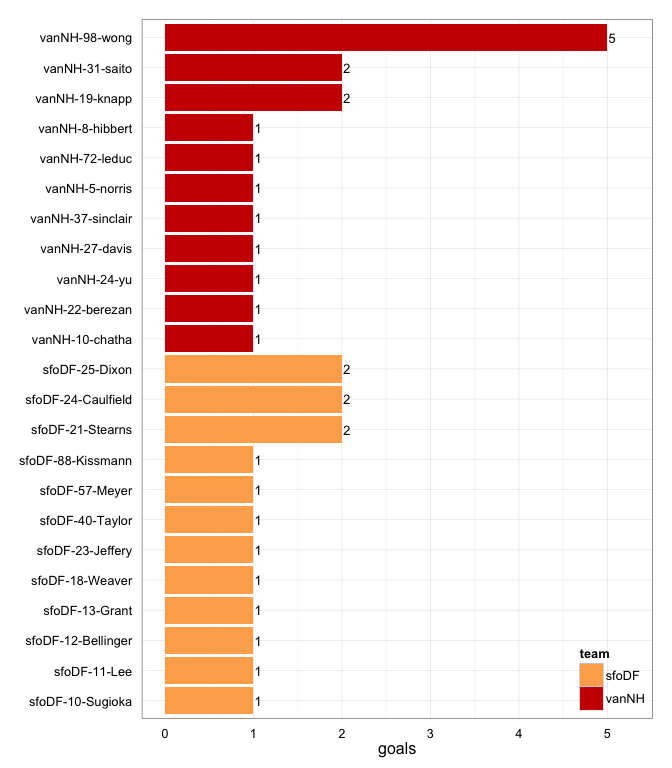

# vanNH at sfoDF 2014-06-21

# vanNH 17
# sfoDF 15
## game is complete

Go to ...  
  * [Scoring progression](#scoringProgression)  
  * [Player stats via figures](#pl_figs)  
  * [Player stats for vanNH](#away)  
  * [Player stats for sfoDF](#home)  
  * [Data on goals, assists, D's](#selectData)  
  * [Full raw data](#rawData)  

## Scoring progression:

| point|period |begin    |end     |pt_duration |desc                                         |vanNH |sfoDF |
|-----:|:------|:--------|:-------|:-----------|:--------------------------------------------|:-----|:-----|
|    36|4      |0:47:00  |0:00:00 |00:47       |- no goal -                                  |17    |15    |
|    35|4      |1:25:00  |0:47:00 |00:38       |vanNH-5-norris to vanNH-98-wong              |17    |15    |
|    34|4      |2:11:00  |1:25:00 |00:46       |sfoDF-16-Yeager to sfoDF-18-Weaver           |16    |15    |
|    33|4      |2:41:00  |2:11:00 |00:30       |sfoDF-11-Lee to sfoDF-88-Kissmann            |16    |14    |
|    32|4      |3:15:00  |2:41:00 |00:34       |vanNH-13-tessarolo to vanNH-22-berezan       |16    |13    |
|    31|4      |7:27:00  |3:15:00 |04:12       |vanNH-98-wong to vanNH-8-hibbert             |15    |13    |
|    30|4      |7:51:00  |7:27:00 |00:24       |vanNH-19-knapp to vanNH-72-leduc             |14    |13    |
|    29|4      |8:25:00  |7:51:00 |00:34       |sfoDF-21-Stearns to sfoDF-24-Caulfield       |13    |13    |
|    28|4      |10:00:00 |8:25:00 |01:35       |vanNH-5-norris to vanNH-98-wong              |13    |12    |
|    27|3      |0:36:00  |0:00:00 |00:36       |- no goal -                                  |12    |12    |
|    26|3      |0:59:00  |0:36:00 |00:23       |vanNH-98-wong to vanNH-10-chatha             |12    |12    |
|    25|3      |1:26:00  |0:59:00 |00:27       |sfoDF-17-Boyd-Meredith to sfoDF-23-Jeffery   |11    |12    |
|    24|3      |3:40:00  |1:26:00 |02:14       |vanNH-89-underhill to vanNH-19-knapp         |11    |11    |
|    23|3      |4:08:00  |3:40:00 |00:28       |sfoDF-40-Taylor to sfoDF-21-Stearns          |10    |11    |
|    22|3      |4:38:00  |4:08:00 |00:30       |vanNH-8-hibbert to vanNH-31-saito            |10    |10    |
|    21|3      |6:08:00  |4:38:00 |01:30       |vanNH-5-norris to vanNH-19-knapp             |9     |10    |
|    20|3      |8:33:00  |6:08:00 |02:25       |sfoDF-23-Jeffery to sfoDF-13-Grant           |8     |10    |
|    19|3      |8:57:00  |8:33:00 |00:24       |sfoDF-85-Brydon to sfoDF-25-Dixon            |8     |9     |
|    18|3      |10:00:00 |8:57:00 |01:03       |vanNH-24-yu to vanNH-31-saito                |8     |8     |
|    17|2      |0:01:00  |0:00:00 |00:01       |- no goal -                                  |7     |8     |
|    16|2      |0:23:00  |0:01:00 |00:22       |vanNH-5-norris to vanNH-98-wong              |7     |8     |
|    15|2      |2:05:00  |0:23:00 |01:42       |vanNH-5-norris to vanNH-98-wong              |6     |8     |
|    14|2      |4:43:00  |2:05:00 |02:38       |sfoDF-8-Pollard to sfoDF-24-Caulfield        |5     |8     |
|    13|2      |5:26:00  |4:43:00 |00:43       |sfoDF-16-Yeager to sfoDF-10-Sugioka          |5     |7     |
|    12|2      |9:02:00  |5:26:00 |03:36       |sfoDF-88-Kissmann to sfoDF-40-Taylor         |5     |6     |
|    11|2      |10:00:00 |9:02:00 |00:58       |sfoDF-85-Brydon to sfoDF-57-Meyer            |5     |5     |
|    10|1      |0:02:00  |0:00:00 |00:02       |- no goal -                                  |5     |4     |
|     9|1      |2:30:00  |0:02:00 |02:28       |vanNH-22-berezan to vanNH-98-wong            |5     |4     |
|     8|1      |3:06:00  |2:30:00 |00:36       |sfoDF-10-Sugioka to sfoDF-25-Dixon           |4     |4     |
|     7|1      |4:05:00  |3:06:00 |00:59       |sfoDF-23-Jeffery to sfoDF-21-Stearns         |4     |3     |
|     6|1      |4:22:00  |4:05:00 |00:17       |vanNH-13-tessarolo to vanNH-5-norris         |4     |2     |
|     5|1      |4:56:00  |4:22:00 |00:34       |sfoDF-22-Rivera to sfoDF-11-Lee              |3     |2     |
|     4|1      |6:51:00  |4:56:00 |01:55       |sfoDF-17-Boyd-Meredith to sfoDF-12-Bellinger |3     |1     |
|     3|1      |8:24:00  |6:51:00 |01:33       |vanNH-13-tessarolo to vanNH-27-davis         |3     |0     |
|     2|1      |9:24:00  |8:24:00 |01:00       |vanNH-39-seraglia to vanNH-37-sinclair       |2     |0     |
|     1|1      |10:00:00 |9:24:00 |00:36       |vanNH-45-cowan to vanNH-24-yu                |1     |0     |

## Player stats via figures:

### Points = goals + assists

 

### Goals

 

### Assists

 

### D's
 

## Player stats for vanNH :

points = goals + assists  
tables sorted in decreasing order based on points (then goals, assists, Ds)  
Ds = total of plain ol' D's + interceptions (D), hand blocks (HB), and foot blocks (FB)  
stats are cumulative for this game

|   |player   |last      | points| comp_pct| goals| assists| throws| completions| catches| def| drop|
|:--|:--------|:---------|------:|--------:|-----:|-------:|------:|-----------:|-------:|---:|----:|
|25 |vanNH-98 |wong      |      7|     0.88|     5|       2|     17|          15|      21|   1|    0|
|26 |vanNH-5  |norris    |      6|     0.82|     1|       5|     40|          33|      23|   0|    2|
|27 |vanNH-19 |knapp     |      3|     1.00|     2|       1|     18|          18|      17|   0|    0|
|28 |vanNH-13 |tessarolo |      3|     1.00|     0|       3|      3|           3|       2|   2|    0|
|29 |vanNH-31 |saito     |      2|       NA|     2|       0|      0|           0|       2|   3|    0|
|30 |vanNH-22 |berezan   |      2|     0.85|     1|       1|     13|          11|      14|   2|    1|
|31 |vanNH-24 |yu        |      2|     0.71|     1|       1|      7|           5|       3|   0|    0|
|32 |vanNH-8  |hibbert   |      2|     0.57|     1|       1|      7|           4|       7|   0|    1|
|33 |vanNH-72 |leduc     |      1|     0.71|     1|       0|      7|           5|       8|   1|    1|
|34 |vanNH-10 |chatha    |      1|     0.80|     1|       0|     15|          12|      15|   0|    1|
|35 |vanNH-27 |davis     |      1|     1.00|     1|       0|      3|           3|       3|   0|    0|
|36 |vanNH-37 |sinclair  |      1|     0.00|     1|       0|      1|           0|       1|   0|    1|
|37 |vanNH-39 |seraglia  |      1|     1.00|     0|       1|      3|           3|       3|   1|    0|
|38 |vanNH-45 |cowan     |      1|     0.71|     0|       1|      7|           5|       2|   0|    0|
|39 |vanNH-89 |underhill |      1|     0.74|     0|       1|     34|          25|      18|   0|    5|
|40 |vanNH-4  |doyle     |      0|     1.00|     0|       0|      2|           2|       2|   1|    0|
|41 |vanNH-7  |dandurand |      0|     0.50|     0|       0|      2|           1|       2|   1|    0|
|42 |vanNH-?  |?name?    |      0|       NA|     0|       0|      0|           0|       3|   0|    0|
|43 |vanNH-11 |greer     |      0|     0.75|     0|       0|      4|           3|       2|   0|    0|
|44 |vanNH-14 |eyrich    |      0|     1.00|     0|       0|      1|           1|       1|   0|    0|
|45 |vanNH-17 |?name?    |      0|     1.00|     0|       0|      1|           1|       0|   0|    0|
|46 |vanNH-21 |loach     |      0|     0.78|     0|       0|      9|           7|       8|   0|    0|
|47 |vanNH-6  |gailits   |      0|     1.00|     0|       0|      2|           2|       2|   0|    0|

## Player stats for sfoDF :

points = goals + assists  
tables sorted in decreasing order based on points (then goals, assists, Ds)  
Ds = total of plain ol' D's + interceptions (D), hand blocks (HB), and foot blocks (FB)  
stats are cumulative for this game

|   |player   |last          | points| comp_pct| goals| assists| throws| completions| catches| def| drop|
|:--|:--------|:-------------|------:|--------:|-----:|-------:|------:|-----------:|-------:|---:|----:|
|1  |sfoDF-21 |Stearns       |      3|     0.83|     2|       1|      6|           5|       8|   1|    0|
|2  |sfoDF-23 |Jeffery       |      3|     0.73|     1|       2|     30|          22|      22|   2|    1|
|3  |sfoDF-24 |Caulfield     |      2|     1.00|     2|       0|      2|           2|       4|   0|    0|
|4  |sfoDF-25 |Dixon         |      2|     1.00|     2|       0|      4|           4|       3|   0|    0|
|5  |sfoDF-10 |Sugioka       |      2|     1.00|     1|       1|      2|           2|       3|   2|    0|
|6  |sfoDF-40 |Taylor        |      2|     0.85|     1|       1|     13|          11|      11|   1|    0|
|7  |sfoDF-11 |Lee           |      2|     1.00|     1|       1|      4|           4|       5|   0|    0|
|8  |sfoDF-88 |Kissmann      |      2|     0.86|     1|       1|     21|          18|      20|   0|    0|
|9  |sfoDF-17 |Boyd-Meredith |      2|     0.88|     0|       2|      8|           7|       5|   1|    0|
|10 |sfoDF-16 |Yeager        |      2|     0.62|     0|       2|     13|           8|       4|   0|    1|
|11 |sfoDF-85 |Brydon        |      2|     1.00|     0|       2|      3|           3|       3|   0|    0|
|12 |sfoDF-13 |Grant         |      1|     0.95|     1|       0|     38|          36|      31|   1|    1|
|13 |sfoDF-12 |Bellinger     |      1|     0.40|     1|       0|      5|           2|       5|   0|    1|
|14 |sfoDF-18 |Weaver        |      1|     1.00|     1|       0|      4|           4|       5|   0|    0|
|15 |sfoDF-57 |Meyer         |      1|     0.60|     1|       0|     10|           6|       6|   0|    0|
|16 |sfoDF-22 |Rivera        |      1|     1.00|     0|       1|      2|           2|       2|   0|    0|
|17 |sfoDF-8  |Pollard       |      1|     0.90|     0|       1|     29|          26|      20|   0|    0|
|18 |sfoDF-5  |Cascino       |      0|     0.50|     0|       0|      8|           4|       4|   1|    3|
|19 |sfoDF-7  |Sheridan      |      0|       NA|     0|       0|      0|           0|       0|   1|    0|
|20 |sfoDF-?  |?name?        |      0|       NA|     0|       0|      0|           0|       2|   0|    0|
|21 |sfoDF-14 |Hurst         |      0|     0.00|     0|       0|      1|           0|       1|   0|    1|
|22 |sfoDF-19 |Weiss         |      0|     0.50|     0|       0|      2|           1|       2|   0|    0|
|23 |sfoDF-46 |McCarty       |      0|     1.00|     0|       0|      1|           1|       1|   0|    0|
|24 |sfoDF-83 |Husak         |      0|     0.67|     0|       0|      3|           2|       3|   0|    0|

## Raw data on select events (goals, assists, D's):

| point| period|pull_team | event| poss_abs| poss_rel|poss_team |pl_team |pl_pnum |pl_code |pl_lname      |player                 | sfoDF| vanNH|
|-----:|------:|:---------|-----:|--------:|--------:|:---------|:-------|:-------|:-------|:-------------|:----------------------|-----:|-----:|
|     1|      1|vanNH     |    11|        1|        1|sfoDF     |vanNH   |31      |D       |saito         |vanNH-31-saito         |     0|     1|
|     1|      1|vanNH     |    16|        2|        2|vanNH     |vanNH   |45      |A       |cowan         |vanNH-45-cowan         |     0|     1|
|     1|      1|vanNH     |    17|        2|        2|vanNH     |vanNH   |24      |G       |yu            |vanNH-24-yu            |     0|     1|
|     2|      1|vanNH     |     4|        3|        1|sfoDF     |vanNH   |7       |D       |dandurand     |vanNH-7-dandurand      |     0|     2|
|     2|      1|vanNH     |    14|        6|        4|vanNH     |vanNH   |39      |A       |seraglia      |vanNH-39-seraglia      |     0|     2|
|     2|      1|vanNH     |    15|        6|        4|vanNH     |vanNH   |37      |G       |sinclair      |vanNH-37-sinclair      |     0|     2|
|     3|      1|vanNH     |    14|        7|        1|sfoDF     |vanNH   |31      |D       |saito         |vanNH-31-saito         |     0|     3|
|     3|      1|vanNH     |    20|        9|        3|sfoDF     |vanNH   |4       |HB      |doyle         |vanNH-4-doyle          |     0|     3|
|     3|      1|vanNH     |    23|       10|        4|vanNH     |vanNH   |13      |A       |tessarolo     |vanNH-13-tessarolo     |     0|     3|
|     3|      1|vanNH     |    24|       10|        4|vanNH     |vanNH   |27      |G       |davis         |vanNH-27-davis         |     0|     3|
|     4|      1|vanNH     |     8|       12|        2|vanNH     |sfoDF   |17      |D       |Boyd-Meredith |sfoDF-17-Boyd-Meredith |     1|     3|
|     4|      1|vanNH     |    11|       14|        4|vanNH     |sfoDF   |10      |D       |Sugioka       |sfoDF-10-Sugioka       |     1|     3|
|     4|      1|vanNH     |    15|       15|        5|sfoDF     |sfoDF   |17      |A       |Boyd-Meredith |sfoDF-17-Boyd-Meredith |     1|     3|
|     4|      1|vanNH     |    16|       15|        5|sfoDF     |sfoDF   |12      |G       |Bellinger     |sfoDF-12-Bellinger     |     1|     3|
|     5|      1|sfoDF     |     9|       17|        2|sfoDF     |sfoDF   |22      |LA      |Rivera        |sfoDF-22-Rivera        |     2|     3|
|     5|      1|sfoDF     |    10|       17|        2|sfoDF     |sfoDF   |11      |G       |Lee           |sfoDF-11-Lee           |     2|     3|
|     6|      1|sfoDF     |     5|       18|        1|vanNH     |vanNH   |13      |A       |tessarolo     |vanNH-13-tessarolo     |     2|     4|
|     6|      1|sfoDF     |     6|       18|        1|vanNH     |vanNH   |5       |G       |norris        |vanNH-5-norris         |     2|     4|
|     7|      1|vanNH     |    17|       19|        1|sfoDF     |sfoDF   |23      |A       |Jeffery       |sfoDF-23-Jeffery       |     3|     4|
|     7|      1|vanNH     |    18|       19|        1|sfoDF     |sfoDF   |21      |LG      |Stearns       |sfoDF-21-Stearns       |     3|     4|
|     8|      1|sfoDF     |     9|       21|        2|sfoDF     |sfoDF   |10      |A       |Sugioka       |sfoDF-10-Sugioka       |     4|     4|
|     8|      1|sfoDF     |    10|       21|        2|sfoDF     |sfoDF   |25      |G       |Dixon         |sfoDF-25-Dixon         |     4|     4|
|     9|      1|sfoDF     |    11|       26|        5|vanNH     |sfoDF   |13      |HB      |Grant         |sfoDF-13-Grant         |     4|     5|
|     9|      1|sfoDF     |    14|       27|        6|sfoDF     |vanNH   |22      |D       |berezan       |vanNH-22-berezan       |     4|     5|
|     9|      1|sfoDF     |    19|       28|        7|vanNH     |vanNH   |22      |A       |berezan       |vanNH-22-berezan       |     4|     5|
|     9|      1|sfoDF     |    20|       28|        7|vanNH     |vanNH   |98      |G       |wong          |vanNH-98-wong          |     4|     5|
|    10|      1|vanNH     |    NA|       NA|       NA|NA        |NA      |NA      |NA      |NA            |NA-NA-NA               |     4|     5|
|    11|      2|sfoDF     |    18|       31|        2|sfoDF     |sfoDF   |85      |A       |Brydon        |sfoDF-85-Brydon        |     5|     5|
|    11|      2|sfoDF     |    19|       31|        2|sfoDF     |sfoDF   |57      |G       |Meyer         |sfoDF-57-Meyer         |     5|     5|
|    12|      2|sfoDF     |     3|       32|        1|vanNH     |sfoDF   |21      |D       |Stearns       |sfoDF-21-Stearns       |     6|     5|
|    12|      2|sfoDF     |    23|       37|        6|sfoDF     |vanNH   |72      |HB      |leduc         |vanNH-72-leduc         |     6|     5|
|    12|      2|sfoDF     |    27|       39|        8|sfoDF     |vanNH   |98      |D       |wong          |vanNH-98-wong          |     6|     5|
|    12|      2|sfoDF     |    40|       43|       12|sfoDF     |sfoDF   |88      |A       |Kissmann      |sfoDF-88-Kissmann      |     6|     5|
|    12|      2|sfoDF     |    41|       43|       12|sfoDF     |sfoDF   |40      |G       |Taylor        |sfoDF-40-Taylor        |     6|     5|
|    13|      2|sfoDF     |     6|       45|        2|sfoDF     |sfoDF   |16      |PUA     |Yeager        |sfoDF-16-Yeager        |     7|     5|
|    13|      2|sfoDF     |     7|       45|        2|sfoDF     |sfoDF   |10      |G       |Sugioka       |sfoDF-10-Sugioka       |     7|     5|
|    14|      2|sfoDF     |    16|       50|        5|vanNH     |sfoDF   |40      |D       |Taylor        |sfoDF-40-Taylor        |     8|     5|
|    14|      2|sfoDF     |    22|       52|        7|vanNH     |sfoDF   |23      |D       |Jeffery       |sfoDF-23-Jeffery       |     8|     5|
|    14|      2|sfoDF     |    23|       53|        8|sfoDF     |sfoDF   |8       |PUA     |Pollard       |sfoDF-8-Pollard        |     8|     5|
|    14|      2|sfoDF     |    24|       53|        8|sfoDF     |sfoDF   |24      |G       |Caulfield     |sfoDF-24-Caulfield     |     8|     5|
|    15|      2|sfoDF     |     4|       54|        1|vanNH     |sfoDF   |7       |D       |Sheridan      |sfoDF-7-Sheridan       |     8|     6|
|    15|      2|sfoDF     |    19|       58|        5|vanNH     |vanNH   |5       |PUA     |norris        |vanNH-5-norris         |     8|     6|
|    15|      2|sfoDF     |    20|       58|        5|vanNH     |vanNH   |98      |G       |wong          |vanNH-98-wong          |     8|     6|
|    16|      2|vanNH     |     7|       60|        2|vanNH     |vanNH   |5       |PUA     |norris        |vanNH-5-norris         |     8|     7|
|    16|      2|vanNH     |     8|       60|        2|vanNH     |vanNH   |98      |G       |wong          |vanNH-98-wong          |     8|     7|
|    17|      2|vanNH     |     3|       61|        1|sfoDF     |vanNH   |13      |D       |tessarolo     |vanNH-13-tessarolo     |     8|     7|
|    18|      3|vanNH     |    11|       62|        1|sfoDF     |vanNH   |31      |D       |saito         |vanNH-31-saito         |     8|     8|
|    18|      3|vanNH     |    15|       63|        2|vanNH     |vanNH   |24      |A       |yu            |vanNH-24-yu            |     8|     8|
|    18|      3|vanNH     |    16|       63|        2|vanNH     |vanNH   |31      |G       |saito         |vanNH-31-saito         |     8|     8|
|    19|      3|vanNH     |     6|       64|        1|sfoDF     |sfoDF   |85      |LA      |Brydon        |sfoDF-85-Brydon        |     9|     8|
|    19|      3|vanNH     |     7|       64|        1|sfoDF     |sfoDF   |25      |G       |Dixon         |sfoDF-25-Dixon         |     9|     8|
|    20|      3|sfoDF     |    17|       68|        4|sfoDF     |vanNH   |22      |HB      |berezan       |vanNH-22-berezan       |    10|     8|
|    20|      3|sfoDF     |    27|       70|        6|sfoDF     |sfoDF   |23      |A       |Jeffery       |sfoDF-23-Jeffery       |    10|     8|
|    20|      3|sfoDF     |    28|       70|        6|sfoDF     |sfoDF   |13      |G       |Grant         |sfoDF-13-Grant         |    10|     8|
|    21|      3|sfoDF     |    10|       73|        3|vanNH     |sfoDF   |5       |D       |Cascino       |sfoDF-5-Cascino        |    10|     9|
|    21|      3|sfoDF     |    18|       75|        5|vanNH     |vanNH   |5       |A       |norris        |vanNH-5-norris         |    10|     9|
|    21|      3|sfoDF     |    19|       75|        5|vanNH     |vanNH   |19      |G       |knapp         |vanNH-19-knapp         |    10|     9|
|    22|      3|vanNH     |     4|       77|        2|vanNH     |vanNH   |8       |A       |hibbert       |vanNH-8-hibbert        |    10|    10|
|    22|      3|vanNH     |     5|       77|        2|vanNH     |vanNH   |31      |G       |saito         |vanNH-31-saito         |    10|    10|
|    23|      3|vanNH     |     8|       78|        1|sfoDF     |sfoDF   |40      |A       |Taylor        |sfoDF-40-Taylor        |    11|    10|
|    23|      3|vanNH     |     9|       78|        1|sfoDF     |sfoDF   |21      |LG      |Stearns       |sfoDF-21-Stearns       |    11|    10|
|    24|      3|sfoDF     |    20|       85|        7|vanNH     |vanNH   |89      |PUA     |underhill     |vanNH-89-underhill     |    11|    11|
|    24|      3|sfoDF     |    21|       85|        7|vanNH     |vanNH   |19      |G       |knapp         |vanNH-19-knapp         |    11|    11|
|    25|      3|vanNH     |     8|       86|        1|sfoDF     |sfoDF   |17      |A       |Boyd-Meredith |sfoDF-17-Boyd-Meredith |    12|    11|
|    25|      3|vanNH     |     9|       86|        1|sfoDF     |sfoDF   |23      |G       |Jeffery       |sfoDF-23-Jeffery       |    12|    11|
|    26|      3|sfoDF     |     7|       87|        1|vanNH     |vanNH   |98      |A       |wong          |vanNH-98-wong          |    12|    12|
|    26|      3|sfoDF     |     8|       87|        1|vanNH     |vanNH   |10      |G       |chatha        |vanNH-10-chatha        |    12|    12|
|    27|      3|vanNH     |    NA|       NA|       NA|NA        |NA      |NA      |NA      |NA            |NA-NA-NA               |    12|    12|
|    28|      4|sfoDF     |    18|       92|        3|vanNH     |vanNH   |5       |A       |norris        |vanNH-5-norris         |    12|    13|
|    28|      4|sfoDF     |    19|       92|        3|vanNH     |vanNH   |98      |G       |wong          |vanNH-98-wong          |    12|    13|
|    29|      4|vanNH     |    12|       93|        1|sfoDF     |sfoDF   |21      |A       |Stearns       |sfoDF-21-Stearns       |    13|    13|
|    29|      4|vanNH     |    13|       93|        1|sfoDF     |sfoDF   |24      |LG      |Caulfield     |sfoDF-24-Caulfield     |    13|    13|
|    30|      4|sfoDF     |     7|       94|        1|vanNH     |vanNH   |19      |A       |knapp         |vanNH-19-knapp         |    13|    14|
|    30|      4|sfoDF     |     8|       94|        1|vanNH     |vanNH   |72      |LG      |leduc         |vanNH-72-leduc         |    13|    14|
|    31|      4|vanNH     |    25|       99|        5|sfoDF     |vanNH   |39      |D       |seraglia      |vanNH-39-seraglia      |    13|    15|
|    31|      4|vanNH     |    27|      100|        6|vanNH     |sfoDF   |23      |D       |Jeffery       |sfoDF-23-Jeffery       |    13|    15|
|    31|      4|vanNH     |    31|      101|        7|sfoDF     |vanNH   |13      |D       |tessarolo     |vanNH-13-tessarolo     |    13|    15|
|    31|      4|vanNH     |    40|      102|        8|vanNH     |sfoDF   |10      |D       |Sugioka       |sfoDF-10-Sugioka       |    13|    15|
|    31|      4|vanNH     |    46|      104|       10|vanNH     |vanNH   |98      |A       |wong          |vanNH-98-wong          |    13|    15|
|    31|      4|vanNH     |    47|      104|       10|vanNH     |vanNH   |8       |G       |hibbert       |vanNH-8-hibbert        |    13|    15|
|    32|      4|vanNH     |     3|      106|        2|vanNH     |vanNH   |13      |PUA     |tessarolo     |vanNH-13-tessarolo     |    13|    16|
|    32|      4|vanNH     |     4|      106|        2|vanNH     |vanNH   |22      |G       |berezan       |vanNH-22-berezan       |    13|    16|
|    33|      4|vanNH     |     7|      107|        1|sfoDF     |sfoDF   |11      |A       |Lee           |sfoDF-11-Lee           |    14|    16|
|    33|      4|vanNH     |     8|      107|        1|sfoDF     |sfoDF   |88      |LG      |Kissmann      |sfoDF-88-Kissmann      |    14|    16|
|    34|      4|sfoDF     |    14|      109|        2|sfoDF     |sfoDF   |16      |A       |Yeager        |sfoDF-16-Yeager        |    15|    16|
|    34|      4|sfoDF     |    15|      109|        2|sfoDF     |sfoDF   |18      |LG      |Weaver        |sfoDF-18-Weaver        |    15|    16|
|    35|      4|sfoDF     |    10|      110|        1|vanNH     |vanNH   |5       |A       |norris        |vanNH-5-norris         |    15|    17|
|    35|      4|sfoDF     |    11|      110|        1|vanNH     |vanNH   |98      |G       |wong          |vanNH-98-wong          |    15|    17|
|    36|      4|vanNH     |    NA|       NA|       NA|NA        |NA      |NA      |NA      |NA            |NA-NA-NA               |    15|    17|

## Full raw data:

__Note: just for display purposes.__ Raw data in more useful forms can be found in the [GitHub repository](https://github.com/jennybc/vanNH). Find the game you're interested in in the `games` subdirectory.

| period| point|pull_team | event| poss_abs| poss_rel|poss_team |pl_team |pl_pnum |pl_code |
|------:|-----:|:---------|-----:|--------:|--------:|:---------|:-------|:-------|:-------|
|      1|     1|vanNH     |     1|        1|        1|sfoDF     |vanNH   |8       |P       |
|      1|     1|vanNH     |     2|        1|        1|sfoDF     |sfoDF   |8       |PU      |
|      1|     1|vanNH     |     3|        1|        1|sfoDF     |sfoDF   |13      |        |
|      1|     1|vanNH     |     4|        1|        1|sfoDF     |sfoDF   |8       |        |
|      1|     1|vanNH     |     5|        1|        1|sfoDF     |sfoDF   |13      |        |
|      1|     1|vanNH     |     6|        1|        1|sfoDF     |sfoDF   |8       |        |
|      1|     1|vanNH     |     7|        1|        1|sfoDF     |sfoDF   |40      |        |
|      1|     1|vanNH     |     8|        1|        1|sfoDF     |sfoDF   |8       |        |
|      1|     1|vanNH     |     9|        1|        1|sfoDF     |sfoDF   |40      |        |
|      1|     1|vanNH     |    10|        1|        1|sfoDF     |sfoDF   |8       |        |
|      1|     1|vanNH     |    11|        1|        1|sfoDF     |vanNH   |31      |D       |
|      1|     1|vanNH     |    12|        2|        2|vanNH     |vanNH   |27      |PU      |
|      1|     1|vanNH     |    13|        2|        2|vanNH     |vanNH   |8       |        |
|      1|     1|vanNH     |    14|        2|        2|vanNH     |vanNH   |27      |        |
|      1|     1|vanNH     |    15|        2|        2|vanNH     |vanNH   |11      |        |
|      1|     1|vanNH     |    16|        2|        2|vanNH     |vanNH   |45      |A       |
|      1|     1|vanNH     |    17|        2|        2|vanNH     |vanNH   |24      |G       |
|      1|     2|vanNH     |     1|        3|        1|sfoDF     |vanNH   |8       |P       |
|      1|     2|vanNH     |     2|        3|        1|sfoDF     |sfoDF   |25      |PU      |
|      1|     2|vanNH     |     3|        3|        1|sfoDF     |sfoDF   |16      |        |
|      1|     2|vanNH     |     4|        3|        1|sfoDF     |vanNH   |7       |D       |
|      1|     2|vanNH     |     5|        4|        2|vanNH     |vanNH   |24      |PU      |
|      1|     2|vanNH     |     6|        4|        2|vanNH     |vanNH   |14      |        |
|      1|     2|vanNH     |     7|        4|        2|vanNH     |vanNH   |8       |        |
|      1|     2|vanNH     |     8|        4|        2|vanNH     |vanNH   |39      |        |
|      1|     2|vanNH     |     9|        4|        2|vanNH     |vanNH   |8       |        |
|      1|     2|vanNH     |    10|        4|        2|vanNH     |vanNH   |13      |TD      |
|      1|     2|vanNH     |    11|        5|        3|sfoDF     |sfoDF   |12      |PU      |
|      1|     2|vanNH     |    12|        6|        4|vanNH     |vanNH   |17      |PU      |
|      1|     2|vanNH     |    13|        6|        4|vanNH     |vanNH   |7       |        |
|      1|     2|vanNH     |    14|        6|        4|vanNH     |vanNH   |39      |A       |
|      1|     2|vanNH     |    15|        6|        4|vanNH     |vanNH   |37      |G       |
|      1|     3|vanNH     |     1|        7|        1|sfoDF     |vanNH   |11      |P       |
|      1|     3|vanNH     |     2|        7|        1|sfoDF     |sfoDF   |13      |PU      |
|      1|     3|vanNH     |     3|        7|        1|sfoDF     |sfoDF   |88      |        |
|      1|     3|vanNH     |     4|        7|        1|sfoDF     |sfoDF   |8       |        |
|      1|     3|vanNH     |     5|        7|        1|sfoDF     |sfoDF   |88      |        |
|      1|     3|vanNH     |     6|        7|        1|sfoDF     |sfoDF   |13      |        |
|      1|     3|vanNH     |     7|        7|        1|sfoDF     |sfoDF   |40      |        |
|      1|     3|vanNH     |     8|        7|        1|sfoDF     |sfoDF   |13      |        |
|      1|     3|vanNH     |     9|        7|        1|sfoDF     |sfoDF   |24      |        |
|      1|     3|vanNH     |    10|        7|        1|sfoDF     |sfoDF   |8       |        |
|      1|     3|vanNH     |    11|        7|        1|sfoDF     |sfoDF   |21      |        |
|      1|     3|vanNH     |    12|        7|        1|sfoDF     |sfoDF   |8       |        |
|      1|     3|vanNH     |    13|        7|        1|sfoDF     |sfoDF   |88      |        |
|      1|     3|vanNH     |    14|        7|        1|sfoDF     |vanNH   |31      |D       |
|      1|     3|vanNH     |    15|        8|        2|vanNH     |vanNH   |11      |PU      |
|      1|     3|vanNH     |    16|        8|        2|vanNH     |vanNH   |27      |        |
|      1|     3|vanNH     |    17|        8|        2|vanNH     |vanNH   |7       |        |
|      1|     3|vanNH     |    18|        9|        3|sfoDF     |sfoDF   |13      |PU      |
|      1|     3|vanNH     |    19|        9|        3|sfoDF     |sfoDF   |21      |        |
|      1|     3|vanNH     |    20|        9|        3|sfoDF     |vanNH   |4       |HB      |
|      1|     3|vanNH     |    21|       10|        4|vanNH     |vanNH   |45      |PU      |
|      1|     3|vanNH     |    22|       10|        4|vanNH     |vanNH   |4       |        |
|      1|     3|vanNH     |    23|       10|        4|vanNH     |vanNH   |13      |A       |
|      1|     3|vanNH     |    24|       10|        4|vanNH     |vanNH   |27      |G       |
|      1|     4|vanNH     |     1|       11|        1|sfoDF     |vanNH   |39      |P       |
|      1|     4|vanNH     |     2|       11|        1|sfoDF     |sfoDF   |17      |PU      |
|      1|     4|vanNH     |     3|       11|        1|sfoDF     |sfoDF   |5       |        |
|      1|     4|vanNH     |     4|       11|        1|sfoDF     |sfoDF   |17      |        |
|      1|     4|vanNH     |     5|       11|        1|sfoDF     |sfoDF   |5       |        |
|      1|     4|vanNH     |     6|       11|        1|sfoDF     |sfoDF   |85      |TD      |
|      1|     4|vanNH     |     7|       12|        2|vanNH     |vanNH   |89      |PU      |
|      1|     4|vanNH     |     8|       12|        2|vanNH     |sfoDF   |17      |D       |
|      1|     4|vanNH     |     9|       13|        3|sfoDF     |sfoDF   |17      |PU      |
|      1|     4|vanNH     |    10|       14|        4|vanNH     |vanNH   |5       |PU      |
|      1|     4|vanNH     |    11|       14|        4|vanNH     |sfoDF   |10      |D       |
|      1|     4|vanNH     |    12|       15|        5|sfoDF     |sfoDF   |5       |PU      |
|      1|     4|vanNH     |    13|       15|        5|sfoDF     |sfoDF   |17      |        |
|      1|     4|vanNH     |    14|       15|        5|sfoDF     |sfoDF   |18      |        |
|      1|     4|vanNH     |    15|       15|        5|sfoDF     |sfoDF   |17      |A       |
|      1|     4|vanNH     |    16|       15|        5|sfoDF     |sfoDF   |12      |G       |
|      1|     5|sfoDF     |     1|       16|        1|vanNH     |sfoDF   |23      |P       |
|      1|     5|sfoDF     |     2|       16|        1|vanNH     |vanNH   |89      |PU      |
|      1|     5|sfoDF     |     3|       16|        1|vanNH     |vanNH   |5       |        |
|      1|     5|sfoDF     |     4|       16|        1|vanNH     |vanNH   |22      |        |
|      1|     5|sfoDF     |     5|       16|        1|vanNH     |vanNH   |10      |        |
|      1|     5|sfoDF     |     6|       16|        1|vanNH     |vanNH   |22      |TD      |
|      1|     5|sfoDF     |     7|       17|        2|sfoDF     |sfoDF   |23      |PU      |
|      1|     5|sfoDF     |     8|       17|        2|sfoDF     |sfoDF   |13      |        |
|      1|     5|sfoDF     |     9|       17|        2|sfoDF     |sfoDF   |22      |LA      |
|      1|     5|sfoDF     |    10|       17|        2|sfoDF     |sfoDF   |11      |G       |
|      1|     6|sfoDF     |     1|       18|        1|vanNH     |sfoDF   |16      |P       |
|      1|     6|sfoDF     |     2|       18|        1|vanNH     |vanNH   |89      |PU      |
|      1|     6|sfoDF     |     3|       18|        1|vanNH     |vanNH   |19      |        |
|      1|     6|sfoDF     |     4|       18|        1|vanNH     |vanNH   |21      |        |
|      1|     6|sfoDF     |     5|       18|        1|vanNH     |vanNH   |13      |A       |
|      1|     6|sfoDF     |     6|       18|        1|vanNH     |vanNH   |5       |G       |
|      1|     7|vanNH     |     1|       19|        1|sfoDF     |vanNH   |8       |P       |
|      1|     7|vanNH     |     2|       19|        1|sfoDF     |sfoDF   |8       |PU      |
|      1|     7|vanNH     |     3|       19|        1|sfoDF     |sfoDF   |13      |        |
|      1|     7|vanNH     |     4|       19|        1|sfoDF     |sfoDF   |8       |        |
|      1|     7|vanNH     |     5|       19|        1|sfoDF     |sfoDF   |88      |        |
|      1|     7|vanNH     |     6|       19|        1|sfoDF     |sfoDF   |8       |        |
|      1|     7|vanNH     |     7|       19|        1|sfoDF     |sfoDF   |88      |        |
|      1|     7|vanNH     |     8|       19|        1|sfoDF     |sfoDF   |8       |        |
|      1|     7|vanNH     |     9|       19|        1|sfoDF     |sfoDF   |88      |        |
|      1|     7|vanNH     |    10|       19|        1|sfoDF     |sfoDF   |8       |        |
|      1|     7|vanNH     |    11|       19|        1|sfoDF     |sfoDF   |13      |        |
|      1|     7|vanNH     |    12|       19|        1|sfoDF     |sfoDF   |8       |        |
|      1|     7|vanNH     |    13|       19|        1|sfoDF     |sfoDF   |13      |        |
|      1|     7|vanNH     |    14|       19|        1|sfoDF     |sfoDF   |40      |        |
|      1|     7|vanNH     |    15|       19|        1|sfoDF     |sfoDF   |88      |        |
|      1|     7|vanNH     |    16|       19|        1|sfoDF     |sfoDF   |13      |        |
|      1|     7|vanNH     |    17|       19|        1|sfoDF     |sfoDF   |23      |A       |
|      1|     7|vanNH     |    18|       19|        1|sfoDF     |sfoDF   |21      |LG      |
|      1|     8|sfoDF     |     1|       20|        1|vanNH     |sfoDF   |16      |P       |
|      1|     8|sfoDF     |     2|       20|        1|vanNH     |vanNH   |5       |PU      |
|      1|     8|sfoDF     |     3|       20|        1|vanNH     |vanNH   |89      |        |
|      1|     8|sfoDF     |     4|       20|        1|vanNH     |vanNH   |22      |        |
|      1|     8|sfoDF     |     5|       20|        1|vanNH     |vanNH   |72      |        |
|      1|     8|sfoDF     |     6|       20|        1|vanNH     |vanNH   |5       |TD      |
|      1|     8|sfoDF     |     7|       21|        2|sfoDF     |sfoDF   |16      |PU      |
|      1|     8|sfoDF     |     8|       21|        2|sfoDF     |sfoDF   |18      |L       |
|      1|     8|sfoDF     |     9|       21|        2|sfoDF     |sfoDF   |10      |A       |
|      1|     8|sfoDF     |    10|       21|        2|sfoDF     |sfoDF   |25      |G       |
|      1|     9|sfoDF     |     1|       22|        1|vanNH     |sfoDF   |23      |P       |
|      1|     9|sfoDF     |     2|       22|        1|vanNH     |vanNH   |5       |PU      |
|      1|     9|sfoDF     |     3|       22|        1|vanNH     |vanNH   |22      |TD      |
|      1|     9|sfoDF     |     4|       23|        2|sfoDF     |sfoDF   |83      |PU      |
|      1|     9|sfoDF     |     5|       23|        2|sfoDF     |sfoDF   |83      |VTT     |
|      1|     9|sfoDF     |     6|       24|        3|vanNH     |vanNH   |89      |PU      |
|      1|     9|sfoDF     |     7|       25|        4|sfoDF     |sfoDF   |23      |PU      |
|      1|     9|sfoDF     |     8|       25|        4|sfoDF     |sfoDF   |83      |        |
|      1|     9|sfoDF     |     9|       25|        4|sfoDF     |sfoDF   |23      |        |
|      1|     9|sfoDF     |    10|       26|        5|vanNH     |vanNH   |5       |PU      |
|      1|     9|sfoDF     |    11|       26|        5|vanNH     |sfoDF   |13      |HB      |
|      1|     9|sfoDF     |    12|       27|        6|sfoDF     |sfoDF   |23      |PU      |
|      1|     9|sfoDF     |    13|       27|        6|sfoDF     |sfoDF   |83      |        |
|      1|     9|sfoDF     |    14|       27|        6|sfoDF     |vanNH   |22      |D       |
|      1|     9|sfoDF     |    15|       28|        7|vanNH     |vanNH   |89      |PU      |
|      1|     9|sfoDF     |    16|       28|        7|vanNH     |vanNH   |10      |        |
|      1|     9|sfoDF     |    17|       28|        7|vanNH     |vanNH   |19      |        |
|      1|     9|sfoDF     |    18|       28|        7|vanNH     |vanNH   |98      |        |
|      1|     9|sfoDF     |    19|       28|        7|vanNH     |vanNH   |22      |A       |
|      1|     9|sfoDF     |    20|       28|        7|vanNH     |vanNH   |98      |G       |
|      1|    10|vanNH     |     1|       29|        1|sfoDF     |vanNH   |8       |P       |
|      1|    10|vanNH     |     2|       29|        1|sfoDF     |sfoDF   |16      |PU      |
|      2|    11|sfoDF     |     1|       30|        1|vanNH     |sfoDF   |12      |P       |
|      2|    11|sfoDF     |     2|       30|        1|vanNH     |vanNH   |89      |PU      |
|      2|    11|sfoDF     |     3|       30|        1|vanNH     |vanNH   |19      |        |
|      2|    11|sfoDF     |     4|       30|        1|vanNH     |vanNH   |98      |        |
|      2|    11|sfoDF     |     5|       30|        1|vanNH     |vanNH   |19      |        |
|      2|    11|sfoDF     |     6|       30|        1|vanNH     |vanNH   |22      |        |
|      2|    11|sfoDF     |     7|       30|        1|vanNH     |vanNH   |19      |        |
|      2|    11|sfoDF     |     8|       30|        1|vanNH     |vanNH   |89      |        |
|      2|    11|sfoDF     |     9|       30|        1|vanNH     |vanNH   |19      |        |
|      2|    11|sfoDF     |    10|       30|        1|vanNH     |vanNH   |89      |        |
|      2|    11|sfoDF     |    11|       30|        1|vanNH     |vanNH   |5       |        |
|      2|    11|sfoDF     |    12|       30|        1|vanNH     |vanNH   |19      |        |
|      2|    11|sfoDF     |    13|       30|        1|vanNH     |vanNH   |22      |        |
|      2|    11|sfoDF     |    14|       30|        1|vanNH     |vanNH   |21      |TD      |
|      2|    11|sfoDF     |    15|       31|        2|sfoDF     |sfoDF   |5       |PU      |
|      2|    11|sfoDF     |    16|       31|        2|sfoDF     |sfoDF   |18      |        |
|      2|    11|sfoDF     |    17|       31|        2|sfoDF     |sfoDF   |5       |        |
|      2|    11|sfoDF     |    18|       31|        2|sfoDF     |sfoDF   |85      |A       |
|      2|    11|sfoDF     |    19|       31|        2|sfoDF     |sfoDF   |57      |G       |
|      2|    12|sfoDF     |     1|       32|        1|vanNH     |sfoDF   |13      |P       |
|      2|    12|sfoDF     |     2|       32|        1|vanNH     |vanNH   |5       |PU      |
|      2|    12|sfoDF     |     3|       32|        1|vanNH     |sfoDF   |21      |D       |
|      2|    12|sfoDF     |     4|       33|        2|sfoDF     |sfoDF   |13      |PU      |
|      2|    12|sfoDF     |     5|       33|        2|sfoDF     |sfoDF   |8       |TD      |
|      2|    12|sfoDF     |     6|       34|        3|vanNH     |vanNH   |19      |PU      |
|      2|    12|sfoDF     |     7|       34|        3|vanNH     |vanNH   |98      |        |
|      2|    12|sfoDF     |     8|       34|        3|vanNH     |vanNH   |22      |        |
|      2|    12|sfoDF     |     9|       34|        3|vanNH     |vanNH   |5       |        |
|      2|    12|sfoDF     |    10|       34|        3|vanNH     |vanNH   |10      |        |
|      2|    12|sfoDF     |    11|       34|        3|vanNH     |vanNH   |98      |        |
|      2|    12|sfoDF     |    12|       34|        3|vanNH     |vanNH   |5       |        |
|      2|    12|sfoDF     |    13|       34|        3|vanNH     |vanNH   |72      |TD      |
|      2|    12|sfoDF     |    14|       35|        4|sfoDF     |sfoDF   |23      |PU      |
|      2|    12|sfoDF     |    15|       36|        5|vanNH     |vanNH   |5       |PU      |
|      2|    12|sfoDF     |    16|       36|        5|vanNH     |vanNH   |89      |        |
|      2|    12|sfoDF     |    17|       36|        5|vanNH     |sfoDF   |88      |F       |
|      2|    12|sfoDF     |    18|       36|        5|vanNH     |vanNH   |5       |        |
|      2|    12|sfoDF     |    19|       37|        6|sfoDF     |sfoDF   |13      |PU      |
|      2|    12|sfoDF     |    20|       37|        6|sfoDF     |sfoDF   |8       |        |
|      2|    12|sfoDF     |    21|       37|        6|sfoDF     |sfoDF   |13      |        |
|      2|    12|sfoDF     |    22|       37|        6|sfoDF     |sfoDF   |40      |        |
|      2|    12|sfoDF     |    23|       37|        6|sfoDF     |vanNH   |72      |HB      |
|      2|    12|sfoDF     |    24|       38|        7|vanNH     |vanNH   |10      |PU      |
|      2|    12|sfoDF     |    25|       38|        7|vanNH     |vanNH   |89      |VTT     |
|      2|    12|sfoDF     |    26|       39|        8|sfoDF     |sfoDF   |23      |PU      |
|      2|    12|sfoDF     |    27|       39|        8|sfoDF     |vanNH   |98      |D       |
|      2|    12|sfoDF     |    28|       40|        9|vanNH     |vanNH   |98      |        |
|      2|    12|sfoDF     |    29|       41|       10|sfoDF     |sfoDF   |8       |PU      |
|      2|    12|sfoDF     |    30|       41|       10|sfoDF     |sfoDF   |13      |        |
|      2|    12|sfoDF     |    31|       41|       10|sfoDF     |sfoDF   |40      |        |
|      2|    12|sfoDF     |    32|       41|       10|sfoDF     |sfoDF   |23      |        |
|      2|    12|sfoDF     |    33|       42|       11|vanNH     |vanNH   |5       |PU      |
|      2|    12|sfoDF     |    34|       42|       11|vanNH     |vanNH   |89      |        |
|      2|    12|sfoDF     |    35|       42|       11|vanNH     |vanNH   |22      |TD      |
|      2|    12|sfoDF     |    36|       43|       12|sfoDF     |sfoDF   |8       |PU      |
|      2|    12|sfoDF     |    37|       43|       12|sfoDF     |sfoDF   |?       |TO      |
|      2|    12|sfoDF     |    38|       43|       12|sfoDF     |sfoDF   |8       |PU      |
|      2|    12|sfoDF     |    39|       43|       12|sfoDF     |sfoDF   |13      |        |
|      2|    12|sfoDF     |    40|       43|       12|sfoDF     |sfoDF   |88      |A       |
|      2|    12|sfoDF     |    41|       43|       12|sfoDF     |sfoDF   |40      |G       |
|      2|    13|sfoDF     |     1|       44|        1|vanNH     |sfoDF   |16      |P       |
|      2|    13|sfoDF     |     2|       44|        1|vanNH     |vanNH   |19      |PU      |
|      2|    13|sfoDF     |     3|       44|        1|vanNH     |vanNH   |5       |        |
|      2|    13|sfoDF     |     4|       44|        1|vanNH     |vanNH   |89      |        |
|      2|    13|sfoDF     |     5|       44|        1|vanNH     |vanNH   |10      |TD      |
|      2|    13|sfoDF     |     6|       45|        2|sfoDF     |sfoDF   |16      |PUA     |
|      2|    13|sfoDF     |     7|       45|        2|sfoDF     |sfoDF   |10      |G       |
|      2|    14|sfoDF     |     1|       46|        1|vanNH     |sfoDF   |8       |P       |
|      2|    14|sfoDF     |     2|       46|        1|vanNH     |vanNH   |24      |PU      |
|      2|    14|sfoDF     |     3|       47|        2|sfoDF     |sfoDF   |57      |PU      |
|      2|    14|sfoDF     |     4|       48|        3|vanNH     |vanNH   |37      |PU      |
|      2|    14|sfoDF     |     5|       48|        3|vanNH     |vanNH   |45      |TD      |
|      2|    14|sfoDF     |     6|       49|        4|sfoDF     |sfoDF   |8       |PU      |
|      2|    14|sfoDF     |     7|       49|        4|sfoDF     |sfoDF   |21      |        |
|      2|    14|sfoDF     |     8|       49|        4|sfoDF     |sfoDF   |19      |        |
|      2|    14|sfoDF     |     9|       49|        4|sfoDF     |sfoDF   |8       |        |
|      2|    14|sfoDF     |    10|       49|        4|sfoDF     |sfoDF   |21      |        |
|      2|    14|sfoDF     |    11|       49|        4|sfoDF     |sfoDF   |?       |TO      |
|      2|    14|sfoDF     |    12|       49|        4|sfoDF     |sfoDF   |23      |PU      |
|      2|    14|sfoDF     |    13|       50|        5|vanNH     |vanNH   |24      |PU      |
|      2|    14|sfoDF     |    14|       50|        5|vanNH     |vanNH   |39      |        |
|      2|    14|sfoDF     |    15|       50|        5|vanNH     |vanNH   |24      |        |
|      2|    14|sfoDF     |    16|       50|        5|vanNH     |sfoDF   |40      |D       |
|      2|    14|sfoDF     |    17|       51|        6|sfoDF     |sfoDF   |40      |PU      |
|      2|    14|sfoDF     |    18|       51|        6|sfoDF     |sfoDF   |8       |        |
|      2|    14|sfoDF     |    19|       51|        6|sfoDF     |sfoDF   |23      |        |
|      2|    14|sfoDF     |    20|       51|        6|sfoDF     |sfoDF   |88      |        |
|      2|    14|sfoDF     |    21|       52|        7|vanNH     |vanNH   |45      |PU      |
|      2|    14|sfoDF     |    22|       52|        7|vanNH     |sfoDF   |23      |D       |
|      2|    14|sfoDF     |    23|       53|        8|sfoDF     |sfoDF   |8       |PUA     |
|      2|    14|sfoDF     |    24|       53|        8|sfoDF     |sfoDF   |24      |G       |
|      2|    15|sfoDF     |     1|       54|        1|vanNH     |sfoDF   |16      |P       |
|      2|    15|sfoDF     |     2|       54|        1|vanNH     |vanNH   |5       |PU      |
|      2|    15|sfoDF     |     3|       54|        1|vanNH     |vanNH   |22      |        |
|      2|    15|sfoDF     |     4|       54|        1|vanNH     |sfoDF   |7       |D       |
|      2|    15|sfoDF     |     5|       55|        2|sfoDF     |sfoDF   |16      |PU      |
|      2|    15|sfoDF     |     6|       55|        2|sfoDF     |sfoDF   |85      |        |
|      2|    15|sfoDF     |     7|       55|        2|sfoDF     |sfoDF   |83      |        |
|      2|    15|sfoDF     |     8|       55|        2|sfoDF     |sfoDF   |18      |        |
|      2|    15|sfoDF     |     9|       55|        2|sfoDF     |sfoDF   |14      |        |
|      2|    15|sfoDF     |    10|       55|        2|sfoDF     |sfoDF   |18      |TD      |
|      2|    15|sfoDF     |    11|       56|        3|vanNH     |vanNH   |11      |PU      |
|      2|    15|sfoDF     |    12|       57|        4|sfoDF     |sfoDF   |16      |PU      |
|      2|    15|sfoDF     |    13|       58|        5|vanNH     |vanNH   |89      |PU      |
|      2|    15|sfoDF     |    14|       58|        5|vanNH     |vanNH   |22      |        |
|      2|    15|sfoDF     |    15|       58|        5|vanNH     |vanNH   |98      |        |
|      2|    15|sfoDF     |    16|       58|        5|vanNH     |vanNH   |22      |        |
|      2|    15|sfoDF     |    17|       58|        5|vanNH     |vanNH   |11      |L       |
|      2|    15|sfoDF     |    18|       58|        5|vanNH     |vanNH   |?       |TO      |
|      2|    15|sfoDF     |    19|       58|        5|vanNH     |vanNH   |5       |PUA     |
|      2|    15|sfoDF     |    20|       58|        5|vanNH     |vanNH   |98      |G       |
|      2|    16|vanNH     |     1|       59|        1|sfoDF     |vanNH   |8       |P       |
|      2|    16|vanNH     |     2|       59|        1|sfoDF     |sfoDF   |8       |PU      |
|      2|    16|vanNH     |     3|       59|        1|sfoDF     |sfoDF   |13      |        |
|      2|    16|vanNH     |     4|       59|        1|sfoDF     |sfoDF   |8       |        |
|      2|    16|vanNH     |     5|       60|        2|vanNH     |vanNH   |24      |PU      |
|      2|    16|vanNH     |     6|       60|        2|vanNH     |vanNH   |?       |TO      |
|      2|    16|vanNH     |     7|       60|        2|vanNH     |vanNH   |5       |PUA     |
|      2|    16|vanNH     |     8|       60|        2|vanNH     |vanNH   |98      |G       |
|      2|    17|vanNH     |     1|       61|        1|sfoDF     |vanNH   |8       |P       |
|      2|    17|vanNH     |     2|       61|        1|sfoDF     |sfoDF   |88      |PU      |
|      2|    17|vanNH     |     3|       61|        1|sfoDF     |vanNH   |13      |D       |
|      3|    18|vanNH     |     1|       62|        1|sfoDF     |vanNH   |8       |P       |
|      3|    18|vanNH     |     2|       62|        1|sfoDF     |sfoDF   |8       |PU      |
|      3|    18|vanNH     |     3|       62|        1|sfoDF     |sfoDF   |13      |        |
|      3|    18|vanNH     |     4|       62|        1|sfoDF     |sfoDF   |23      |        |
|      3|    18|vanNH     |     5|       62|        1|sfoDF     |sfoDF   |40      |        |
|      3|    18|vanNH     |     6|       62|        1|sfoDF     |sfoDF   |23      |        |
|      3|    18|vanNH     |     7|       62|        1|sfoDF     |sfoDF   |24      |        |
|      3|    18|vanNH     |     8|       62|        1|sfoDF     |sfoDF   |23      |        |
|      3|    18|vanNH     |     9|       62|        1|sfoDF     |sfoDF   |40      |        |
|      3|    18|vanNH     |    10|       62|        1|sfoDF     |sfoDF   |23      |        |
|      3|    18|vanNH     |    11|       62|        1|sfoDF     |vanNH   |31      |D       |
|      3|    18|vanNH     |    12|       63|        2|vanNH     |vanNH   |24      |PU      |
|      3|    18|vanNH     |    13|       63|        2|vanNH     |vanNH   |45      |        |
|      3|    18|vanNH     |    14|       63|        2|vanNH     |vanNH   |8       |        |
|      3|    18|vanNH     |    15|       63|        2|vanNH     |vanNH   |24      |A       |
|      3|    18|vanNH     |    16|       63|        2|vanNH     |vanNH   |31      |G       |
|      3|    19|vanNH     |     1|       64|        1|sfoDF     |vanNH   |8       |P       |
|      3|    19|vanNH     |     2|       64|        1|sfoDF     |sfoDF   |16      |PU      |
|      3|    19|vanNH     |     3|       64|        1|sfoDF     |sfoDF   |46      |        |
|      3|    19|vanNH     |     4|       64|        1|sfoDF     |sfoDF   |25      |        |
|      3|    19|vanNH     |     5|       64|        1|sfoDF     |sfoDF   |12      |        |
|      3|    19|vanNH     |     6|       64|        1|sfoDF     |sfoDF   |85      |LA      |
|      3|    19|vanNH     |     7|       64|        1|sfoDF     |sfoDF   |25      |G       |
|      3|    20|sfoDF     |     1|       65|        1|vanNH     |sfoDF   |23      |P       |
|      3|    20|sfoDF     |     2|       65|        1|vanNH     |vanNH   |89      |PU      |
|      3|    20|sfoDF     |     3|       65|        1|vanNH     |vanNH   |10      |TD      |
|      3|    20|sfoDF     |     4|       66|        2|sfoDF     |sfoDF   |23      |PU      |
|      3|    20|sfoDF     |     5|       67|        3|vanNH     |vanNH   |5       |PU      |
|      3|    20|sfoDF     |     6|       67|        3|vanNH     |vanNH   |89      |        |
|      3|    20|sfoDF     |     7|       67|        3|vanNH     |vanNH   |22      |        |
|      3|    20|sfoDF     |     8|       67|        3|vanNH     |vanNH   |19      |        |
|      3|    20|sfoDF     |     9|       67|        3|vanNH     |vanNH   |10      |        |
|      3|    20|sfoDF     |    10|       67|        3|vanNH     |vanNH   |72      |        |
|      3|    20|sfoDF     |    11|       67|        3|vanNH     |vanNH   |10      |        |
|      3|    20|sfoDF     |    12|       68|        4|sfoDF     |sfoDF   |13      |PU      |
|      3|    20|sfoDF     |    13|       68|        4|sfoDF     |sfoDF   |22      |        |
|      3|    20|sfoDF     |    14|       68|        4|sfoDF     |sfoDF   |23      |        |
|      3|    20|sfoDF     |    15|       68|        4|sfoDF     |sfoDF   |13      |        |
|      3|    20|sfoDF     |    16|       68|        4|sfoDF     |sfoDF   |19      |        |
|      3|    20|sfoDF     |    17|       68|        4|sfoDF     |vanNH   |22      |HB      |
|      3|    20|sfoDF     |    18|       69|        5|vanNH     |vanNH   |89      |PU      |
|      3|    20|sfoDF     |    19|       69|        5|vanNH     |vanNH   |22      |TD      |
|      3|    20|sfoDF     |    20|       70|        6|sfoDF     |sfoDF   |23      |PU      |
|      3|    20|sfoDF     |    21|       70|        6|sfoDF     |sfoDF   |57      |        |
|      3|    20|sfoDF     |    22|       70|        6|sfoDF     |sfoDF   |23      |L       |
|      3|    20|sfoDF     |    23|       70|        6|sfoDF     |sfoDF   |88      |        |
|      3|    20|sfoDF     |    24|       70|        6|sfoDF     |sfoDF   |13      |        |
|      3|    20|sfoDF     |    25|       70|        6|sfoDF     |sfoDF   |88      |        |
|      3|    20|sfoDF     |    26|       70|        6|sfoDF     |sfoDF   |13      |        |
|      3|    20|sfoDF     |    27|       70|        6|sfoDF     |sfoDF   |23      |A       |
|      3|    20|sfoDF     |    28|       70|        6|sfoDF     |sfoDF   |13      |G       |
|      3|    21|sfoDF     |     1|       71|        1|vanNH     |sfoDF   |16      |P       |
|      3|    21|sfoDF     |     2|       71|        1|vanNH     |vanNH   |5       |PU      |
|      3|    21|sfoDF     |     3|       71|        1|vanNH     |vanNH   |89      |        |
|      3|    21|sfoDF     |     4|       71|        1|vanNH     |vanNH   |5       |        |
|      3|    21|sfoDF     |     5|       71|        1|vanNH     |vanNH   |89      |        |
|      3|    21|sfoDF     |     6|       72|        2|sfoDF     |sfoDF   |16      |PU      |
|      3|    21|sfoDF     |     7|       73|        3|vanNH     |vanNH   |89      |PU      |
|      3|    21|sfoDF     |     8|       73|        3|vanNH     |vanNH   |6       |        |
|      3|    21|sfoDF     |     9|       73|        3|vanNH     |vanNH   |10      |        |
|      3|    21|sfoDF     |    10|       73|        3|vanNH     |sfoDF   |5       |D       |
|      3|    21|sfoDF     |    11|       74|        4|sfoDF     |sfoDF   |5       |PU      |
|      3|    21|sfoDF     |    12|       75|        5|vanNH     |vanNH   |5       |PU      |
|      3|    21|sfoDF     |    13|       75|        5|vanNH     |vanNH   |19      |        |
|      3|    21|sfoDF     |    14|       75|        5|vanNH     |vanNH   |10      |        |
|      3|    21|sfoDF     |    15|       75|        5|vanNH     |vanNH   |5       |        |
|      3|    21|sfoDF     |    16|       75|        5|vanNH     |vanNH   |98      |L       |
|      3|    21|sfoDF     |    17|       75|        5|vanNH     |vanNH   |6       |        |
|      3|    21|sfoDF     |    18|       75|        5|vanNH     |vanNH   |5       |A       |
|      3|    21|sfoDF     |    19|       75|        5|vanNH     |vanNH   |19      |G       |
|      3|    22|vanNH     |     1|       76|        1|sfoDF     |vanNH   |8       |P       |
|      3|    22|vanNH     |     2|       76|        1|sfoDF     |sfoDF   |40      |PU      |
|      3|    22|vanNH     |     3|       77|        2|vanNH     |vanNH   |45      |PU      |
|      3|    22|vanNH     |     4|       77|        2|vanNH     |vanNH   |8       |A       |
|      3|    22|vanNH     |     5|       77|        2|vanNH     |vanNH   |31      |G       |
|      3|    23|vanNH     |     1|       78|        1|sfoDF     |vanNH   |8       |P       |
|      3|    23|vanNH     |     2|       78|        1|sfoDF     |sfoDF   |88      |PU      |
|      3|    23|vanNH     |     3|       78|        1|sfoDF     |sfoDF   |23      |        |
|      3|    23|vanNH     |     4|       78|        1|sfoDF     |sfoDF   |88      |        |
|      3|    23|vanNH     |     5|       78|        1|sfoDF     |sfoDF   |23      |        |
|      3|    23|vanNH     |     6|       78|        1|sfoDF     |sfoDF   |88      |        |
|      3|    23|vanNH     |     7|       78|        1|sfoDF     |sfoDF   |23      |        |
|      3|    23|vanNH     |     8|       78|        1|sfoDF     |sfoDF   |40      |A       |
|      3|    23|vanNH     |     9|       78|        1|sfoDF     |sfoDF   |21      |LG      |
|      3|    24|sfoDF     |     1|       79|        1|vanNH     |sfoDF   |12      |P       |
|      3|    24|sfoDF     |     2|       79|        1|vanNH     |vanNH   |5       |PU      |
|      3|    24|sfoDF     |     3|       79|        1|vanNH     |vanNH   |98      |        |
|      3|    24|sfoDF     |     4|       79|        1|vanNH     |vanNH   |5       |VTT     |
|      3|    24|sfoDF     |     5|       80|        2|sfoDF     |sfoDF   |57      |PU      |
|      3|    24|sfoDF     |     6|       81|        3|vanNH     |vanNH   |89      |PU      |
|      3|    24|sfoDF     |     7|       81|        3|vanNH     |vanNH   |98      |        |
|      3|    24|sfoDF     |     8|       81|        3|vanNH     |vanNH   |19      |        |
|      3|    24|sfoDF     |     9|       81|        3|vanNH     |vanNH   |10      |        |
|      3|    24|sfoDF     |    10|       81|        3|vanNH     |vanNH   |98      |        |
|      3|    24|sfoDF     |    11|       81|        3|vanNH     |vanNH   |89      |        |
|      3|    24|sfoDF     |    12|       81|        3|vanNH     |vanNH   |98      |TD      |
|      3|    24|sfoDF     |    13|       82|        4|sfoDF     |sfoDF   |57      |PU      |
|      3|    24|sfoDF     |    14|       82|        4|sfoDF     |sfoDF   |5       |        |
|      3|    24|sfoDF     |    15|       82|        4|sfoDF     |sfoDF   |83      |TD      |
|      3|    24|sfoDF     |    16|       83|        5|vanNH     |vanNH   |89      |PU      |
|      3|    24|sfoDF     |    17|       83|        5|vanNH     |vanNH   |5       |        |
|      3|    24|sfoDF     |    18|       84|        6|sfoDF     |sfoDF   |5       |PU      |
|      3|    24|sfoDF     |    19|       84|        6|sfoDF     |sfoDF   |12      |TD      |
|      3|    24|sfoDF     |    20|       85|        7|vanNH     |vanNH   |89      |PUA     |
|      3|    24|sfoDF     |    21|       85|        7|vanNH     |vanNH   |19      |G       |
|      3|    25|vanNH     |     1|       86|        1|sfoDF     |vanNH   |8       |P       |
|      3|    25|vanNH     |     2|       86|        1|sfoDF     |sfoDF   |17      |PU      |
|      3|    25|vanNH     |     3|       86|        1|sfoDF     |sfoDF   |16      |        |
|      3|    25|vanNH     |     4|       86|        1|sfoDF     |sfoDF   |23      |L       |
|      3|    25|vanNH     |     5|       86|        1|sfoDF     |sfoDF   |88      |        |
|      3|    25|vanNH     |     6|       86|        1|sfoDF     |sfoDF   |17      |        |
|      3|    25|vanNH     |     7|       86|        1|sfoDF     |sfoDF   |10      |        |
|      3|    25|vanNH     |     8|       86|        1|sfoDF     |sfoDF   |17      |A       |
|      3|    25|vanNH     |     9|       86|        1|sfoDF     |sfoDF   |23      |G       |
|      3|    26|sfoDF     |     1|       87|        1|vanNH     |sfoDF   |22      |P       |
|      3|    26|sfoDF     |     2|       87|        1|vanNH     |vanNH   |5       |PU      |
|      3|    26|sfoDF     |     3|       87|        1|vanNH     |vanNH   |98      |        |
|      3|    26|sfoDF     |     4|       87|        1|vanNH     |vanNH   |10      |        |
|      3|    26|sfoDF     |     5|       87|        1|vanNH     |vanNH   |98      |        |
|      3|    26|sfoDF     |     6|       87|        1|vanNH     |vanNH   |10      |        |
|      3|    26|sfoDF     |     7|       87|        1|vanNH     |vanNH   |98      |A       |
|      3|    26|sfoDF     |     8|       87|        1|vanNH     |vanNH   |10      |G       |
|      3|    27|vanNH     |     1|       88|        1|sfoDF     |vanNH   |8       |P       |
|      3|    27|vanNH     |     2|       88|        1|sfoDF     |sfoDF   |16      |PU      |
|      3|    27|vanNH     |     3|       88|        1|sfoDF     |sfoDF   |18      |TD      |
|      3|    27|vanNH     |     4|       89|        2|vanNH     |vanNH   |?       |TO      |
|      3|    27|vanNH     |     5|       89|        2|vanNH     |vanNH   |5       |PU      |
|      3|    27|vanNH     |     6|       89|        2|vanNH     |vanNH   |89      |        |
|      3|    27|vanNH     |     7|       89|        2|vanNH     |vanNH   |5       |        |
|      3|    27|vanNH     |     8|       89|        2|vanNH     |vanNH   |89      |        |
|      3|    27|vanNH     |     9|       89|        2|vanNH     |vanNH   |5       |        |
|      3|    27|vanNH     |    10|       89|        2|vanNH     |vanNH   |72      |        |
|      4|    28|sfoDF     |     1|       90|        1|vanNH     |sfoDF   |12      |P       |
|      4|    28|sfoDF     |     2|       90|        1|vanNH     |vanNH   |5       |PU      |
|      4|    28|sfoDF     |     3|       90|        1|vanNH     |vanNH   |89      |        |
|      4|    28|sfoDF     |     4|       90|        1|vanNH     |vanNH   |5       |        |
|      4|    28|sfoDF     |     5|       90|        1|vanNH     |vanNH   |72      |        |
|      4|    28|sfoDF     |     6|       90|        1|vanNH     |vanNH   |22      |        |
|      4|    28|sfoDF     |     7|       90|        1|vanNH     |vanNH   |21      |        |
|      4|    28|sfoDF     |     8|       91|        2|sfoDF     |sfoDF   |16      |PU      |
|      4|    28|sfoDF     |     9|       91|        2|sfoDF     |sfoDF   |12      |        |
|      4|    28|sfoDF     |    10|       92|        3|vanNH     |vanNH   |89      |PU      |
|      4|    28|sfoDF     |    11|       92|        3|vanNH     |vanNH   |21      |        |
|      4|    28|sfoDF     |    12|       92|        3|vanNH     |vanNH   |22      |        |
|      4|    28|sfoDF     |    13|       92|        3|vanNH     |vanNH   |72      |        |
|      4|    28|sfoDF     |    14|       92|        3|vanNH     |vanNH   |21      |        |
|      4|    28|sfoDF     |    15|       92|        3|vanNH     |vanNH   |72      |        |
|      4|    28|sfoDF     |    16|       92|        3|vanNH     |vanNH   |19      |        |
|      4|    28|sfoDF     |    17|       92|        3|vanNH     |vanNH   |89      |        |
|      4|    28|sfoDF     |    18|       92|        3|vanNH     |vanNH   |5       |A       |
|      4|    28|sfoDF     |    19|       92|        3|vanNH     |vanNH   |98      |G       |
|      4|    29|vanNH     |     1|       93|        1|sfoDF     |vanNH   |8       |P       |
|      4|    29|vanNH     |     2|       93|        1|sfoDF     |sfoDF   |13      |PU      |
|      4|    29|vanNH     |     3|       93|        1|sfoDF     |sfoDF   |8       |        |
|      4|    29|vanNH     |     4|       93|        1|sfoDF     |sfoDF   |88      |        |
|      4|    29|vanNH     |     5|       93|        1|sfoDF     |sfoDF   |8       |        |
|      4|    29|vanNH     |     6|       93|        1|sfoDF     |sfoDF   |13      |        |
|      4|    29|vanNH     |     7|       93|        1|sfoDF     |sfoDF   |8       |        |
|      4|    29|vanNH     |     8|       93|        1|sfoDF     |sfoDF   |13      |        |
|      4|    29|vanNH     |     9|       93|        1|sfoDF     |sfoDF   |40      |        |
|      4|    29|vanNH     |    10|       93|        1|sfoDF     |sfoDF   |13      |        |
|      4|    29|vanNH     |    11|       93|        1|sfoDF     |sfoDF   |23      |        |
|      4|    29|vanNH     |    12|       93|        1|sfoDF     |sfoDF   |21      |A       |
|      4|    29|vanNH     |    13|       93|        1|sfoDF     |sfoDF   |24      |LG      |
|      4|    30|sfoDF     |     1|       94|        1|vanNH     |sfoDF   |16      |P       |
|      4|    30|sfoDF     |     2|       94|        1|vanNH     |vanNH   |5       |PU      |
|      4|    30|sfoDF     |     3|       94|        1|vanNH     |vanNH   |19      |        |
|      4|    30|sfoDF     |     4|       94|        1|vanNH     |vanNH   |5       |        |
|      4|    30|sfoDF     |     5|       94|        1|vanNH     |vanNH   |10      |        |
|      4|    30|sfoDF     |     6|       94|        1|vanNH     |vanNH   |72      |        |
|      4|    30|sfoDF     |     7|       94|        1|vanNH     |vanNH   |19      |A       |
|      4|    30|sfoDF     |     8|       94|        1|vanNH     |vanNH   |72      |LG      |
|      4|    31|vanNH     |     1|       95|        1|sfoDF     |vanNH   |8       |P       |
|      4|    31|vanNH     |     2|       95|        1|sfoDF     |sfoDF   |13      |PU      |
|      4|    31|vanNH     |     3|       95|        1|sfoDF     |sfoDF   |88      |        |
|      4|    31|vanNH     |     4|       95|        1|sfoDF     |sfoDF   |13      |        |
|      4|    31|vanNH     |     5|       95|        1|sfoDF     |sfoDF   |57      |        |
|      4|    31|vanNH     |     6|       95|        1|sfoDF     |sfoDF   |23      |        |
|      4|    31|vanNH     |     7|       95|        1|sfoDF     |sfoDF   |11      |        |
|      4|    31|vanNH     |     8|       95|        1|sfoDF     |sfoDF   |23      |        |
|      4|    31|vanNH     |     9|       95|        1|sfoDF     |sfoDF   |57      |TD      |
|      4|    31|vanNH     |    10|       96|        2|vanNH     |vanNH   |8       |PU      |
|      4|    31|vanNH     |    11|       97|        3|sfoDF     |sfoDF   |13      |PU      |
|      4|    31|vanNH     |    12|       97|        3|sfoDF     |sfoDF   |23      |        |
|      4|    31|vanNH     |    13|       97|        3|sfoDF     |sfoDF   |88      |        |
|      4|    31|vanNH     |    14|       97|        3|sfoDF     |sfoDF   |13      |        |
|      4|    31|vanNH     |    15|       97|        3|sfoDF     |sfoDF   |23      |        |
|      4|    31|vanNH     |    16|       97|        3|sfoDF     |sfoDF   |13      |        |
|      4|    31|vanNH     |    17|       97|        3|sfoDF     |sfoDF   |11      |        |
|      4|    31|vanNH     |    18|       97|        3|sfoDF     |sfoDF   |57      |        |
|      4|    31|vanNH     |    19|       97|        3|sfoDF     |sfoDF   |88      |        |
|      4|    31|vanNH     |    20|       97|        3|sfoDF     |sfoDF   |13      |        |
|      4|    31|vanNH     |    21|       97|        3|sfoDF     |sfoDF   |11      |        |
|      4|    31|vanNH     |    22|       97|        3|sfoDF     |sfoDF   |13      |VST     |
|      4|    31|vanNH     |    23|       98|        4|vanNH     |vanNH   |45      |PU      |
|      4|    31|vanNH     |    24|       99|        5|sfoDF     |sfoDF   |57      |PU      |
|      4|    31|vanNH     |    25|       99|        5|sfoDF     |vanNH   |39      |D       |
|      4|    31|vanNH     |    26|      100|        6|vanNH     |vanNH   |89      |PU      |
|      4|    31|vanNH     |    27|      100|        6|vanNH     |sfoDF   |23      |D       |
|      4|    31|vanNH     |    28|      101|        7|sfoDF     |sfoDF   |23      |PU      |
|      4|    31|vanNH     |    29|      101|        7|sfoDF     |sfoDF   |13      |        |
|      4|    31|vanNH     |    30|      101|        7|sfoDF     |sfoDF   |57      |        |
|      4|    31|vanNH     |    31|      101|        7|sfoDF     |vanNH   |13      |D       |
|      4|    31|vanNH     |    32|      102|        8|vanNH     |vanNH   |89      |PU      |
|      4|    31|vanNH     |    33|      102|        8|vanNH     |vanNH   |?       |TO      |
|      4|    31|vanNH     |    34|      102|        8|vanNH     |vanNH   |21      |PU      |
|      4|    31|vanNH     |    35|      102|        8|vanNH     |vanNH   |89      |        |
|      4|    31|vanNH     |    36|      102|        8|vanNH     |vanNH   |21      |        |
|      4|    31|vanNH     |    37|      102|        8|vanNH     |vanNH   |89      |        |
|      4|    31|vanNH     |    38|      102|        8|vanNH     |vanNH   |10      |        |
|      4|    31|vanNH     |    39|      102|        8|vanNH     |vanNH   |21      |        |
|      4|    31|vanNH     |    40|      102|        8|vanNH     |sfoDF   |10      |D       |
|      4|    31|vanNH     |    41|      103|        9|sfoDF     |sfoDF   |25      |PU      |
|      4|    31|vanNH     |    42|      103|        9|sfoDF     |sfoDF   |12      |        |
|      4|    31|vanNH     |    43|      103|        9|sfoDF     |sfoDF   |85      |TD      |
|      4|    31|vanNH     |    44|      104|       10|vanNH     |vanNH   |89      |PU      |
|      4|    31|vanNH     |    45|      104|       10|vanNH     |vanNH   |5       |        |
|      4|    31|vanNH     |    46|      104|       10|vanNH     |vanNH   |98      |A       |
|      4|    31|vanNH     |    47|      104|       10|vanNH     |vanNH   |8       |G       |
|      4|    32|vanNH     |     1|      105|        1|sfoDF     |vanNH   |8       |P       |
|      4|    32|vanNH     |     2|      105|        1|sfoDF     |sfoDF   |13      |PU      |
|      4|    32|vanNH     |     3|      106|        2|vanNH     |vanNH   |13      |PUA     |
|      4|    32|vanNH     |     4|      106|        2|vanNH     |vanNH   |22      |G       |
|      4|    33|vanNH     |     1|      107|        1|sfoDF     |vanNH   |8       |P       |
|      4|    33|vanNH     |     2|      107|        1|sfoDF     |sfoDF   |57      |PU      |
|      4|    33|vanNH     |     3|      107|        1|sfoDF     |sfoDF   |13      |        |
|      4|    33|vanNH     |     4|      107|        1|sfoDF     |sfoDF   |57      |        |
|      4|    33|vanNH     |     5|      107|        1|sfoDF     |sfoDF   |13      |        |
|      4|    33|vanNH     |     6|      107|        1|sfoDF     |sfoDF   |23      |        |
|      4|    33|vanNH     |     7|      107|        1|sfoDF     |sfoDF   |11      |A       |
|      4|    33|vanNH     |     8|      107|        1|sfoDF     |sfoDF   |88      |LG      |
|      4|    34|sfoDF     |     1|      108|        1|vanNH     |sfoDF   |12      |P       |
|      4|    34|sfoDF     |     2|      108|        1|vanNH     |vanNH   |5       |PU      |
|      4|    34|sfoDF     |     3|      108|        1|vanNH     |vanNH   |89      |        |
|      4|    34|sfoDF     |     4|      108|        1|vanNH     |vanNH   |5       |        |
|      4|    34|sfoDF     |     5|      108|        1|vanNH     |vanNH   |19      |        |
|      4|    34|sfoDF     |     6|      108|        1|vanNH     |vanNH   |21      |        |
|      4|    34|sfoDF     |     7|      108|        1|vanNH     |vanNH   |22      |        |
|      4|    34|sfoDF     |     8|      108|        1|vanNH     |vanNH   |98      |        |
|      4|    34|sfoDF     |     9|      108|        1|vanNH     |vanNH   |5       |        |
|      4|    34|sfoDF     |    10|      108|        1|vanNH     |vanNH   |98      |        |
|      4|    34|sfoDF     |    11|      109|        2|sfoDF     |sfoDF   |25      |PU      |
|      4|    34|sfoDF     |    12|      109|        2|sfoDF     |sfoDF   |16      |        |
|      4|    34|sfoDF     |    13|      109|        2|sfoDF     |sfoDF   |12      |        |
|      4|    34|sfoDF     |    14|      109|        2|sfoDF     |sfoDF   |16      |A       |
|      4|    34|sfoDF     |    15|      109|        2|sfoDF     |sfoDF   |18      |LG      |
|      4|    35|sfoDF     |     1|      110|        1|vanNH     |sfoDF   |12      |P       |
|      4|    35|sfoDF     |     2|      110|        1|vanNH     |vanNH   |19      |PU      |
|      4|    35|sfoDF     |     3|      110|        1|vanNH     |vanNH   |5       |        |
|      4|    35|sfoDF     |     4|      110|        1|vanNH     |vanNH   |10      |        |
|      4|    35|sfoDF     |     5|      110|        1|vanNH     |vanNH   |98      |        |
|      4|    35|sfoDF     |     6|      110|        1|vanNH     |vanNH   |5       |        |
|      4|    35|sfoDF     |     7|      110|        1|vanNH     |vanNH   |10      |        |
|      4|    35|sfoDF     |     8|      110|        1|vanNH     |vanNH   |21      |        |
|      4|    35|sfoDF     |     9|      110|        1|vanNH     |vanNH   |19      |        |
|      4|    35|sfoDF     |    10|      110|        1|vanNH     |vanNH   |5       |A       |
|      4|    35|sfoDF     |    11|      110|        1|vanNH     |vanNH   |98      |G       |
|      4|    36|vanNH     |     1|      111|        1|sfoDF     |vanNH   |8       |P       |
|      4|    36|vanNH     |     2|      111|        1|sfoDF     |sfoDF   |40      |PU      |
|      4|    36|vanNH     |     3|      111|        1|sfoDF     |sfoDF   |88      |        |
|      4|    36|vanNH     |     4|      111|        1|sfoDF     |sfoDF   |13      |        |
|      4|    36|vanNH     |     5|      111|        1|sfoDF     |sfoDF   |21      |        |
|      4|    36|vanNH     |     6|      111|        1|sfoDF     |sfoDF   |13      |        |
|      4|    36|vanNH     |     7|      111|        1|sfoDF     |sfoDF   |8       |        |
|      4|    36|vanNH     |     8|      112|        2|vanNH     |vanNH   |45      |PU      |
|      4|    36|vanNH     |     9|      112|        2|vanNH     |vanNH   |4       |        |
|      4|    36|vanNH     |    10|      112|        2|vanNH     |vanNH   |8       |        |

