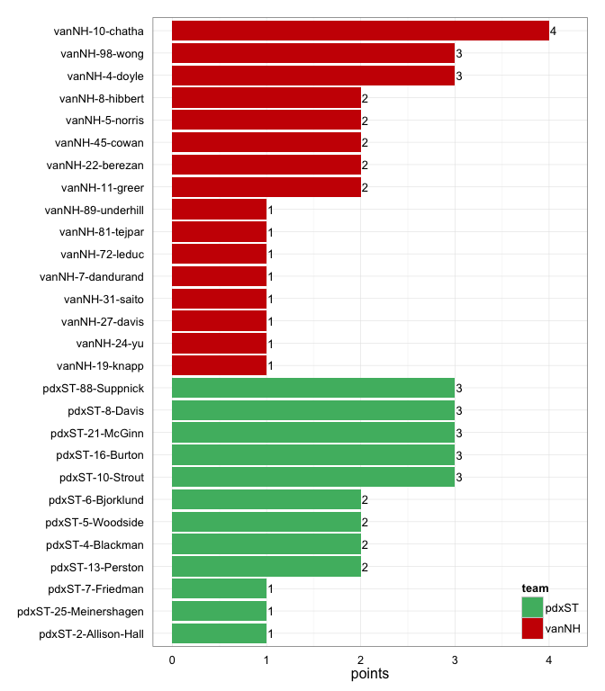
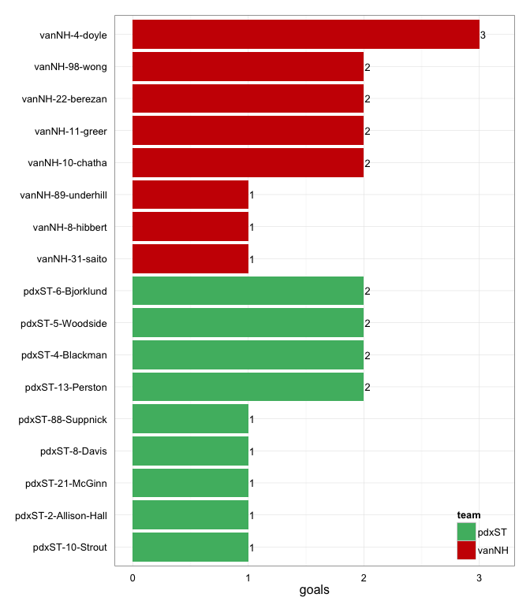
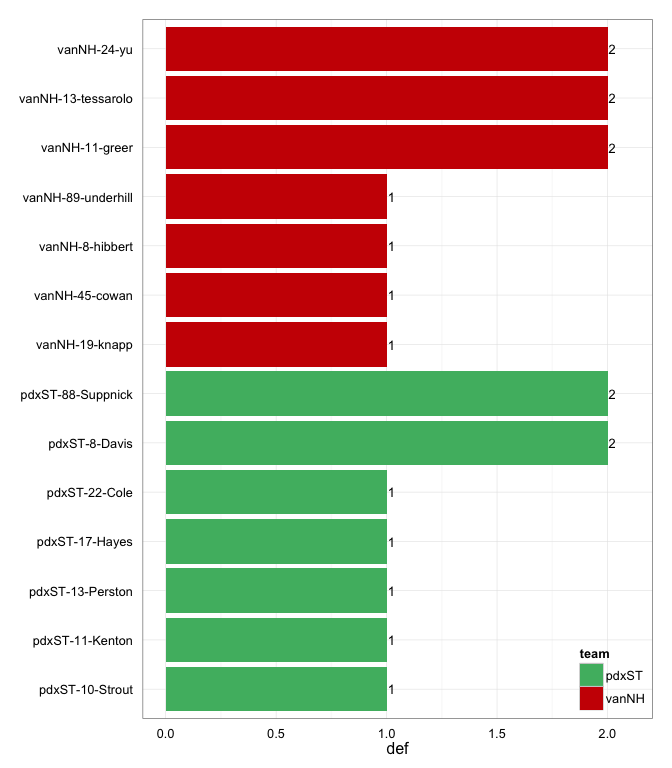

# vanNH at pdxST 2014-06-28

# vanNH 14
# pdxST 13
## game is complete

Go to ...  
  * [Scoring progression](#scoringProgression)  
  * [Player stats via figures](#pl_figs)  
  * [Player stats for vanNH](#away)  
  * [Player stats for pdxST](#home)  
  * [Data on goals, assists, D's](#selectData)  
  * [Full raw data](#rawData)  

## Scoring progression:

| point|period |begin    |end     |pt_duration |desc                                      |vanNH |pdxST |
|-----:|:------|:--------|:-------|:-----------|:-----------------------------------------|:-----|:-----|
|    31|4      |0:49:00  |0:00:00 |00:49       |- no goal -                               |14    |13    |
|    30|4      |1:34:00  |0:49:00 |00:45       |vanNH-5-norris to vanNH-89-underhill      |14    |13    |
|    29|4      |1:52:00  |1:34:00 |00:18       |vanNH-5-norris to vanNH-22-berezan        |13    |13    |
|    28|4      |4:36:00  |1:52:00 |02:44       |pdxST-8-Davis to pdxST-13-Perston         |12    |13    |
|    27|4      |6:33:00  |4:36:00 |01:57       |pdxST-8-Davis to pdxST-21-McGinn          |12    |12    |
|    26|4      |7:38:00  |6:33:00 |01:05       |vanNH-27-davis to vanNH-11-greer          |12    |11    |
|    25|4      |10:00:00 |7:38:00 |02:22       |pdxST-7-Friedman to pdxST-4-Blackman      |11    |11    |
|    24|3      |1:03:00  |0:00:00 |01:03       |- no goal -                               |11    |10    |
|    23|3      |1:40:00  |1:03:00 |00:37       |pdxST-16-Burton to pdxST-88-Suppnick      |11    |10    |
|    22|3      |3:19:00  |1:40:00 |01:39       |vanNH-8-hibbert to vanNH-11-greer         |11    |9     |
|    21|3      |3:54:00  |3:19:00 |00:35       |vanNH-24-yu to vanNH-4-doyle              |10    |9     |
|    20|3      |7:19:00  |3:54:00 |03:25       |vanNH-19-knapp to vanNH-10-chatha         |9     |9     |
|    19|3      |8:38:00  |7:19:00 |01:19       |pdxST-10-Strout to pdxST-6-Bjorklund      |8     |9     |
|    18|3      |9:09:00  |8:38:00 |00:31       |vanNH-10-chatha to vanNH-98-wong          |8     |8     |
|    17|3      |9:49:00  |9:09:00 |00:40       |pdxST-88-Suppnick to pdxST-5-Woodside     |7     |8     |
|    16|3      |10:00:00 |9:49:00 |00:11       |pdxST-16-Burton to pdxST-13-Perston       |7     |7     |
|    15|2      |0:05:00  |0:00:00 |00:05       |- no goal -                               |7     |6     |
|    14|2      |1:15:00  |0:05:00 |01:10       |pdxST-88-Suppnick to pdxST-10-Strout      |7     |6     |
|    13|2      |2:06:00  |1:15:00 |00:51       |vanNH-10-chatha to vanNH-98-wong          |7     |5     |
|    12|2      |4:58:00  |2:06:00 |02:52       |pdxST-16-Burton to pdxST-6-Bjorklund      |6     |5     |
|    11|2      |5:30:00  |4:58:00 |00:32       |vanNH-45-cowan to vanNH-8-hibbert         |6     |4     |
|    10|2      |6:49:00  |5:30:00 |01:19       |vanNH-81-tejpar to vanNH-4-doyle          |5     |4     |
|     9|2      |7:10:00  |6:49:00 |00:21       |pdxST-21-McGinn to pdxST-5-Woodside       |4     |4     |
|     8|2      |7:48:00  |7:10:00 |00:38       |pdxST-25-Meinershagen to pdxST-4-Blackman |4     |3     |
|     7|2      |8:16:00  |7:48:00 |00:28       |pdxST-21-McGinn to pdxST-8-Davis          |4     |2     |
|     6|2      |9:28:00  |8:16:00 |01:12       |pdxST-10-Strout to pdxST-2-Allison-Hall   |4     |1     |
|     5|2      |10:00:00 |9:28:00 |00:32       |vanNH-98-wong to vanNH-10-chatha          |4     |0     |
|     4|1      |1:43:00  |0:00:00 |01:43       |- no goal -                               |3     |0     |
|     3|1      |7:36:00  |1:43:00 |05:53       |vanNH-72-leduc to vanNH-22-berezan        |3     |0     |
|     2|1      |9:30:00  |7:36:00 |01:54       |vanNH-7-dandurand to vanNH-4-doyle        |2     |0     |
|     1|1      |10:00:00 |9:30:00 |00:30       |vanNH-45-cowan to vanNH-31-saito          |1     |0     |

## Player stats via figures:

### Points = goals + assists

 

### Goals

 

### Assists

 

### D's
 

## Player stats for vanNH :

points = goals + assists  
tables sorted in decreasing order based on points (then goals, assists, Ds)  
Ds = total of plain ol' D's + interceptions (D), hand blocks (HB), and foot blocks (FB)  
stats are cumulative for this game

|   |player   |last      | points| comp_pct| goals| assists| throws| completions| catches| def| drop|
|:--|:--------|:---------|------:|--------:|-----:|-------:|------:|-----------:|-------:|---:|----:|
|20 |vanNH-10 |chatha    |      4|     0.80|     2|       2|     15|          12|      17|   0|    1|
|21 |vanNH-4  |doyle     |      3|     1.00|     3|       0|      1|           1|       4|   0|    0|
|22 |vanNH-98 |wong      |      3|     0.85|     2|       1|     13|          11|      15|   0|    0|
|23 |vanNH-11 |greer     |      2|     1.00|     2|       0|     11|          11|      12|   2|    0|
|24 |vanNH-22 |berezan   |      2|     1.00|     2|       0|     10|          10|      12|   0|    0|
|25 |vanNH-8  |hibbert   |      2|     0.72|     1|       1|     18|          13|      19|   1|    0|
|26 |vanNH-45 |cowan     |      2|     0.90|     0|       2|     10|           9|       5|   1|    0|
|27 |vanNH-5  |norris    |      2|     0.81|     0|       2|     21|          17|      16|   0|    0|
|28 |vanNH-89 |underhill |      1|     0.97|     1|       0|     37|          36|      32|   1|    0|
|29 |vanNH-31 |saito     |      1|     1.00|     1|       0|      2|           2|       3|   0|    0|
|30 |vanNH-24 |yu        |      1|     0.77|     0|       1|     13|          10|       7|   2|    1|
|31 |vanNH-19 |knapp     |      1|     0.89|     0|       1|     28|          25|      15|   1|    1|
|32 |vanNH-27 |davis     |      1|     1.00|     0|       1|      4|           4|       4|   0|    0|
|33 |vanNH-7  |dandurand |      1|     1.00|     0|       1|      4|           4|       4|   0|    0|
|34 |vanNH-72 |leduc     |      1|     1.00|     0|       1|      2|           2|       2|   0|    0|
|35 |vanNH-81 |tejpar    |      1|     1.00|     0|       1|      8|           8|       6|   0|    0|
|36 |vanNH-13 |tessarolo |      0|     0.00|     0|       0|      1|           0|       1|   2|    0|
|37 |vanNH-   |?name?    |      0|       NA|     0|       0|      0|           0|       0|   0|    0|
|38 |vanNH-?  |?name?    |      0|       NA|     0|       0|      0|           0|       1|   0|    0|
|39 |vanNH-17 |?name?    |      0|     1.00|     0|       0|      1|           1|       0|   0|    0|
|40 |vanNH-18 |menzies   |      0|     1.00|     0|       0|      4|           4|       4|   0|    0|
|41 |vanNH-21 |loach     |      0|     0.50|     0|       0|      2|           1|       2|   0|    0|
|42 |vanNH-33 |collins   |      0|     1.00|     0|       0|      2|           2|       1|   0|    0|
|43 |vanNH-37 |sinclair  |      0|     1.00|     0|       0|      2|           2|       2|   0|    0|
|44 |vanNH-6  |gailits   |      0|     0.80|     0|       0|      5|           4|       5|   0|    0|

## Player stats for pdxST :

points = goals + assists  
tables sorted in decreasing order based on points (then goals, assists, Ds)  
Ds = total of plain ol' D's + interceptions (D), hand blocks (HB), and foot blocks (FB)  
stats are cumulative for this game

|   |player   |last         | points| comp_pct| goals| assists| throws| completions| catches| def| drop|
|:--|:--------|:------------|------:|--------:|-----:|-------:|------:|-----------:|-------:|---:|----:|
|1  |pdxST-8  |Davis        |      3|     0.96|     1|       2|     26|          25|      22|   2|    0|
|2  |pdxST-88 |Suppnick     |      3|     0.90|     1|       2|     29|          26|      22|   2|    0|
|3  |pdxST-10 |Strout       |      3|     0.97|     1|       2|     34|          33|      33|   1|    0|
|4  |pdxST-21 |McGinn       |      3|     0.92|     1|       2|     12|          11|      10|   0|    1|
|5  |pdxST-16 |Burton       |      3|     0.86|     0|       3|     14|          12|      14|   0|    0|
|6  |pdxST-13 |Perston      |      2|     0.80|     2|       0|      5|           4|       6|   1|    0|
|7  |pdxST-4  |Blackman     |      2|     1.00|     2|       0|      3|           3|       5|   0|    0|
|8  |pdxST-5  |Woodside     |      2|     0.60|     2|       0|      5|           3|       6|   0|    0|
|9  |pdxST-6  |Bjorklund    |      2|     0.88|     2|       0|     16|          14|      18|   0|    0|
|10 |pdxST-2  |Allison-Hall |      1|     1.00|     1|       0|     10|          10|      11|   0|    0|
|11 |pdxST-25 |Meinershagen |      1|     1.00|     0|       1|      6|           6|       6|   0|    0|
|12 |pdxST-7  |Friedman     |      1|     0.95|     0|       1|     41|          39|      35|   0|    0|
|13 |pdxST-11 |Kenton       |      0|     0.87|     0|       0|     38|          33|      30|   1|    3|
|14 |pdxST-17 |Hayes        |      0|       NA|     0|       0|      0|           0|       0|   1|    0|
|15 |pdxST-22 |Cole         |      0|     0.83|     0|       0|      6|           5|       6|   1|    1|
|16 |pdxST-?  |?name?       |      0|       NA|     0|       0|      0|           0|       2|   0|    0|
|17 |pdxST-24 |Norden       |      0|     0.89|     0|       0|     37|          33|      29|   0|    1|
|18 |pdxST-73 |King         |      0|     0.80|     0|       0|      5|           4|       5|   0|    0|
|19 |pdxST-9  |Hancock      |      0|     0.80|     0|       0|      5|           4|       5|   0|    0|

## Raw data on select events (goals, assists, D's):

| point| period|pull_team | event| poss_abs| poss_rel|poss_team |pl_team |pl_pnum |pl_code |pl_lname     |player                | pdxST| vanNH|
|-----:|------:|:---------|-----:|--------:|--------:|:---------|:-------|:-------|:-------|:------------|:---------------------|-----:|-----:|
|     1|      1|vanNH     |    12|        2|        2|vanNH     |vanNH   |45      |A       |cowan        |vanNH-45-cowan        |     0|     1|
|     1|      1|vanNH     |    13|        2|        2|vanNH     |vanNH   |31      |G       |saito        |vanNH-31-saito        |     0|     1|
|     2|      1|vanNH     |    29|        4|        2|vanNH     |vanNH   |7       |A       |dandurand    |vanNH-7-dandurand     |     0|     2|
|     2|      1|vanNH     |    30|        4|        2|vanNH     |vanNH   |4       |G       |doyle        |vanNH-4-doyle         |     0|     2|
|     3|      1|vanNH     |    19|        5|        1|pdxST     |vanNH   |13      |D       |tessarolo    |vanNH-13-tessarolo    |     0|     3|
|     3|      1|vanNH     |    40|        8|        4|vanNH     |pdxST   |17      |D       |Hayes        |pdxST-17-Hayes        |     0|     3|
|     3|      1|vanNH     |    48|       10|        6|vanNH     |pdxST   |88      |D       |Suppnick     |pdxST-88-Suppnick     |     0|     3|
|     3|      1|vanNH     |    53|       11|        7|pdxST     |vanNH   |89      |D       |underhill    |vanNH-89-underhill    |     0|     3|
|     3|      1|vanNH     |    64|       13|        9|pdxST     |vanNH   |19      |D       |knapp        |vanNH-19-knapp        |     0|     3|
|     3|      1|vanNH     |    73|       14|       10|vanNH     |vanNH   |72      |A       |leduc        |vanNH-72-leduc        |     0|     3|
|     3|      1|vanNH     |    74|       14|       10|vanNH     |vanNH   |22      |G       |berezan      |vanNH-22-berezan      |     0|     3|
|     4|      1|vanNH     |    11|       16|        2|vanNH     |pdxST   |10      |D       |Strout       |pdxST-10-Strout       |     0|     3|
|     4|      1|vanNH     |    14|       17|        3|pdxST     |vanNH   |11      |D       |greer        |vanNH-11-greer        |     0|     3|
|     4|      1|vanNH     |    18|       18|        4|vanNH     |pdxST   |11      |D       |Kenton       |pdxST-11-Kenton       |     0|     3|
|     4|      1|vanNH     |    20|       19|        5|pdxST     |vanNH   |45      |D       |cowan        |vanNH-45-cowan        |     0|     3|
|     4|      1|vanNH     |    22|       20|        6|vanNH     |pdxST   |13      |D       |Perston      |pdxST-13-Perston      |     0|     3|
|     4|      1|vanNH     |    24|       21|        7|pdxST     |vanNH   |24      |D       |yu           |vanNH-24-yu           |     0|     3|
|     5|      2|pdxST     |     7|       23|        1|vanNH     |vanNH   |98      |A       |wong         |vanNH-98-wong         |     0|     4|
|     5|      2|pdxST     |     8|       23|        1|vanNH     |vanNH   |10      |G       |chatha       |vanNH-10-chatha       |     0|     4|
|     6|      2|vanNH     |    21|       24|        1|pdxST     |pdxST   |10      |A       |Strout       |pdxST-10-Strout       |     1|     4|
|     6|      2|vanNH     |    22|       24|        1|pdxST     |pdxST   |2       |LG      |Allison-Hall |pdxST-2-Allison-Hall  |     1|     4|
|     7|      2|pdxST     |     6|       25|        1|vanNH     |pdxST   |88      |D       |Suppnick     |pdxST-88-Suppnick     |     2|     4|
|     7|      2|pdxST     |     9|       26|        2|pdxST     |pdxST   |21      |A       |McGinn       |pdxST-21-McGinn       |     2|     4|
|     7|      2|pdxST     |    10|       26|        2|pdxST     |pdxST   |8       |LG      |Davis        |pdxST-8-Davis         |     2|     4|
|     8|      2|pdxST     |     9|       27|        1|vanNH     |pdxST   |8       |D       |Davis        |pdxST-8-Davis         |     3|     4|
|     8|      2|pdxST     |    13|       28|        2|pdxST     |pdxST   |25      |LA      |Meinershagen |pdxST-25-Meinershagen |     3|     4|
|     8|      2|pdxST     |    14|       28|        2|pdxST     |pdxST   |4       |G       |Blackman     |pdxST-4-Blackman      |     3|     4|
|     9|      2|pdxST     |     5|       30|        2|pdxST     |pdxST   |21      |PUA     |McGinn       |pdxST-21-McGinn       |     4|     4|
|     9|      2|pdxST     |     6|       30|        2|pdxST     |pdxST   |5       |G       |Woodside     |pdxST-5-Woodside      |     4|     4|
|    10|      2|pdxST     |    21|       33|        3|vanNH     |vanNH   |81      |A       |tejpar       |vanNH-81-tejpar       |     4|     5|
|    10|      2|pdxST     |    22|       33|        3|vanNH     |vanNH   |4       |G       |doyle        |vanNH-4-doyle         |     4|     5|
|    11|      2|vanNH     |    11|       35|        2|vanNH     |vanNH   |45      |PUA     |cowan        |vanNH-45-cowan        |     4|     6|
|    11|      2|vanNH     |    12|       35|        2|vanNH     |vanNH   |8       |G       |hibbert      |vanNH-8-hibbert       |     4|     6|
|    12|      2|vanNH     |    28|       37|        2|vanNH     |pdxST   |8       |D       |Davis        |pdxST-8-Davis         |     5|     6|
|    12|      2|vanNH     |    35|       38|        3|pdxST     |pdxST   |16      |A       |Burton       |pdxST-16-Burton       |     5|     6|
|    12|      2|vanNH     |    36|       38|        3|pdxST     |pdxST   |6       |G       |Bjorklund    |pdxST-6-Bjorklund     |     5|     6|
|    13|      2|pdxST     |    10|       39|        1|vanNH     |vanNH   |10      |LA      |chatha       |vanNH-10-chatha       |     5|     7|
|    13|      2|pdxST     |    11|       39|        1|vanNH     |vanNH   |98      |G       |wong         |vanNH-98-wong         |     5|     7|
|    14|      2|vanNH     |    29|       40|        1|pdxST     |pdxST   |88      |A       |Suppnick     |pdxST-88-Suppnick     |     6|     7|
|    14|      2|vanNH     |    31|       40|        1|pdxST     |pdxST   |10      |G       |Strout       |pdxST-10-Strout       |     6|     7|
|    15|      2|pdxST     |    NA|       NA|       NA|NA        |NA      |NA      |NA      |NA           |NA-NA-NA              |     6|     7|
|    16|      3|vanNH     |     5|       43|        1|pdxST     |pdxST   |16      |A       |Burton       |pdxST-16-Burton       |     7|     7|
|    16|      3|vanNH     |     6|       43|        1|pdxST     |pdxST   |13      |LG      |Perston      |pdxST-13-Perston      |     7|     7|
|    17|      3|pdxST     |     9|       45|        2|pdxST     |pdxST   |88      |A       |Suppnick     |pdxST-88-Suppnick     |     8|     7|
|    17|      3|pdxST     |    10|       45|        2|pdxST     |pdxST   |5       |LG      |Woodside     |pdxST-5-Woodside      |     8|     7|
|    18|      3|pdxST     |    10|       46|        1|vanNH     |vanNH   |10      |A       |chatha       |vanNH-10-chatha       |     8|     8|
|    18|      3|pdxST     |    11|       46|        1|vanNH     |vanNH   |98      |G       |wong         |vanNH-98-wong         |     8|     8|
|    19|      3|vanNH     |    12|       47|        1|pdxST     |vanNH   |8       |D       |hibbert      |vanNH-8-hibbert       |     9|     8|
|    19|      3|vanNH     |    20|       49|        3|pdxST     |pdxST   |10      |A       |Strout       |pdxST-10-Strout       |     9|     8|
|    19|      3|vanNH     |    21|       49|        3|pdxST     |pdxST   |6       |G       |Bjorklund    |pdxST-6-Bjorklund     |     9|     8|
|    20|      3|pdxST     |    36|       54|        5|vanNH     |vanNH   |19      |A       |knapp        |vanNH-19-knapp        |     9|     9|
|    20|      3|pdxST     |    37|       54|        5|vanNH     |vanNH   |10      |G       |chatha       |vanNH-10-chatha       |     9|     9|
|    21|      3|vanNH     |    11|       57|        3|pdxST     |vanNH   |24      |D       |yu           |vanNH-24-yu           |     9|    10|
|    21|      3|vanNH     |    12|       58|        4|vanNH     |vanNH   |24      |A       |yu           |vanNH-24-yu           |     9|    10|
|    21|      3|vanNH     |    13|       58|        4|vanNH     |vanNH   |4       |G       |doyle        |vanNH-4-doyle         |     9|    10|
|    22|      3|vanNH     |    19|       60|        2|vanNH     |vanNH   |8       |A       |hibbert      |vanNH-8-hibbert       |     9|    11|
|    22|      3|vanNH     |    20|       60|        2|vanNH     |vanNH   |11      |G       |greer        |vanNH-11-greer        |     9|    11|
|    23|      3|vanNH     |    10|       61|        1|pdxST     |pdxST   |16      |A       |Burton       |pdxST-16-Burton       |    10|    11|
|    23|      3|vanNH     |    11|       61|        1|pdxST     |pdxST   |88      |G       |Suppnick     |pdxST-88-Suppnick     |    10|    11|
|    24|      3|pdxST     |    16|       63|        2|pdxST     |vanNH   |13      |D       |tessarolo    |vanNH-13-tessarolo    |    10|    11|
|    25|      4|pdxST     |    28|       66|        3|vanNH     |pdxST   |22      |D       |Cole         |pdxST-22-Cole         |    11|    11|
|    25|      4|pdxST     |    31|       67|        4|pdxST     |pdxST   |7       |LA      |Friedman     |pdxST-7-Friedman      |    11|    11|
|    25|      4|pdxST     |    32|       67|        4|pdxST     |pdxST   |4       |G       |Blackman     |pdxST-4-Blackman      |    11|    11|
|    26|      4|pdxST     |    14|       70|        3|vanNH     |vanNH   |27      |A       |davis        |vanNH-27-davis        |    11|    12|
|    26|      4|pdxST     |    15|       70|        3|vanNH     |vanNH   |11      |G       |greer        |vanNH-11-greer        |    11|    12|
|    27|      4|vanNH     |    29|       73|        3|pdxST     |pdxST   |8       |A       |Davis        |pdxST-8-Davis         |    12|    12|
|    27|      4|vanNH     |    30|       73|        3|pdxST     |pdxST   |21      |G       |McGinn       |pdxST-21-McGinn       |    12|    12|
|    28|      4|pdxST     |    34|       75|        2|pdxST     |pdxST   |8       |A       |Davis        |pdxST-8-Davis         |    13|    12|
|    28|      4|pdxST     |    35|       75|        2|pdxST     |pdxST   |13      |G       |Perston      |pdxST-13-Perston      |    13|    12|
|    29|      4|pdxST     |     6|       76|        1|vanNH     |vanNH   |5       |A       |norris       |vanNH-5-norris        |    13|    13|
|    29|      4|pdxST     |     7|       76|        1|vanNH     |vanNH   |22      |LG      |berezan      |vanNH-22-berezan      |    13|    13|
|    30|      4|vanNH     |    14|       77|        1|pdxST     |vanNH   |11      |D       |greer        |vanNH-11-greer        |    13|    14|
|    30|      4|vanNH     |    15|       78|        2|vanNH     |vanNH   |5       |PUA     |norris       |vanNH-5-norris        |    13|    14|
|    30|      4|vanNH     |    16|       78|        2|vanNH     |vanNH   |89      |G       |underhill    |vanNH-89-underhill    |    13|    14|
|    31|      4|vanNH     |    NA|       NA|       NA|NA        |NA      |NA      |NA      |NA           |NA-NA-NA              |    13|    14|

## Full raw data:

__Note: just for display purposes.__ Raw data in more useful forms can be found in the [GitHub repository](https://github.com/jennybc/vanNH). Find the game you're interested in in the `games` subdirectory.

| period| point|pull_team | event| poss_abs| poss_rel|poss_team |pl_team |pl_pnum |pl_code |
|------:|-----:|:---------|-----:|--------:|--------:|:---------|:-------|:-------|:-------|
|      1|     1|vanNH     |     1|        1|        1|pdxST     |vanNH   |8       |P       |
|      1|     1|vanNH     |     2|        1|        1|pdxST     |pdxST   |11      |PU      |
|      1|     1|vanNH     |     3|        1|        1|pdxST     |pdxST   |24      |        |
|      1|     1|vanNH     |     4|        1|        1|pdxST     |pdxST   |10      |        |
|      1|     1|vanNH     |     5|        1|        1|pdxST     |pdxST   |2       |        |
|      1|     1|vanNH     |     6|        1|        1|pdxST     |pdxST   |11      |        |
|      1|     1|vanNH     |     7|        1|        1|pdxST     |pdxST   |7       |        |
|      1|     1|vanNH     |     8|        1|        1|pdxST     |pdxST   |13      |        |
|      1|     1|vanNH     |     9|        1|        1|pdxST     |pdxST   |11      |        |
|      1|     1|vanNH     |    10|        1|        1|pdxST     |pdxST   |10      |TD      |
|      1|     1|vanNH     |    11|        2|        2|vanNH     |vanNH   |24      |PU      |
|      1|     1|vanNH     |    12|        2|        2|vanNH     |vanNH   |45      |A       |
|      1|     1|vanNH     |    13|        2|        2|vanNH     |vanNH   |31      |G       |
|      1|     2|vanNH     |     1|        3|        1|pdxST     |vanNH   |8       |P       |
|      1|     2|vanNH     |     2|        3|        1|pdxST     |pdxST   |10      |PU      |
|      1|     2|vanNH     |     3|        3|        1|pdxST     |pdxST   |24      |        |
|      1|     2|vanNH     |     4|        3|        1|pdxST     |pdxST   |10      |        |
|      1|     2|vanNH     |     5|        3|        1|pdxST     |pdxST   |2       |        |
|      1|     2|vanNH     |     6|        3|        1|pdxST     |pdxST   |13      |        |
|      1|     2|vanNH     |     7|        3|        1|pdxST     |pdxST   |24      |        |
|      1|     2|vanNH     |     8|        3|        1|pdxST     |pdxST   |7       |        |
|      1|     2|vanNH     |     9|        3|        1|pdxST     |pdxST   |24      |        |
|      1|     2|vanNH     |    10|        3|        1|pdxST     |pdxST   |10      |        |
|      1|     2|vanNH     |    11|        3|        1|pdxST     |pdxST   |24      |        |
|      1|     2|vanNH     |    12|        3|        1|pdxST     |pdxST   |11      |        |
|      1|     2|vanNH     |    13|        3|        1|pdxST     |pdxST   |2       |        |
|      1|     2|vanNH     |    14|        3|        1|pdxST     |pdxST   |7       |        |
|      1|     2|vanNH     |    15|        3|        1|pdxST     |pdxST   |24      |        |
|      1|     2|vanNH     |    16|        3|        1|pdxST     |pdxST   |7       |        |
|      1|     2|vanNH     |    17|        3|        1|pdxST     |pdxST   |24      |        |
|      1|     2|vanNH     |    18|        3|        1|pdxST     |pdxST   |7       |        |
|      1|     2|vanNH     |    19|        3|        1|pdxST     |pdxST   |13      |        |
|      1|     2|vanNH     |    20|        3|        1|pdxST     |pdxST   |6       |        |
|      1|     2|vanNH     |    21|        3|        1|pdxST     |pdxST   |7       |        |
|      1|     2|vanNH     |    22|        3|        1|pdxST     |pdxST   |24      |        |
|      1|     2|vanNH     |    23|        3|        1|pdxST     |pdxST   |6       |        |
|      1|     2|vanNH     |    24|        4|        2|vanNH     |vanNH   |17      |PU      |
|      1|     2|vanNH     |    25|        4|        2|vanNH     |vanNH   |11      |        |
|      1|     2|vanNH     |    26|        4|        2|vanNH     |vanNH   |18      |        |
|      1|     2|vanNH     |    27|        4|        2|vanNH     |vanNH   |8       |        |
|      1|     2|vanNH     |    28|        4|        2|vanNH     |vanNH   |11      |        |
|      1|     2|vanNH     |    29|        4|        2|vanNH     |vanNH   |7       |A       |
|      1|     2|vanNH     |    30|        4|        2|vanNH     |vanNH   |4       |G       |
|      1|     3|vanNH     |     1|        5|        1|pdxST     |vanNH   |33      |P       |
|      1|     3|vanNH     |     2|        5|        1|pdxST     |pdxST   |11      |PU      |
|      1|     3|vanNH     |     3|        5|        1|pdxST     |pdxST   |7       |        |
|      1|     3|vanNH     |     4|        5|        1|pdxST     |pdxST   |73      |        |
|      1|     3|vanNH     |     5|        5|        1|pdxST     |pdxST   |7       |        |
|      1|     3|vanNH     |     6|        5|        1|pdxST     |pdxST   |6       |        |
|      1|     3|vanNH     |     7|        5|        1|pdxST     |pdxST   |7       |        |
|      1|     3|vanNH     |     8|        5|        1|pdxST     |pdxST   |16      |        |
|      1|     3|vanNH     |     9|        5|        1|pdxST     |pdxST   |7       |        |
|      1|     3|vanNH     |    10|        5|        1|pdxST     |pdxST   |8       |        |
|      1|     3|vanNH     |    11|        5|        1|pdxST     |pdxST   |11      |        |
|      1|     3|vanNH     |    12|        5|        1|pdxST     |pdxST   |8       |        |
|      1|     3|vanNH     |    13|        5|        1|pdxST     |pdxST   |7       |        |
|      1|     3|vanNH     |    14|        5|        1|pdxST     |pdxST   |8       |        |
|      1|     3|vanNH     |    15|        5|        1|pdxST     |pdxST   |16      |        |
|      1|     3|vanNH     |    16|        5|        1|pdxST     |pdxST   |8       |        |
|      1|     3|vanNH     |    17|        5|        1|pdxST     |pdxST   |11      |        |
|      1|     3|vanNH     |    18|        5|        1|pdxST     |pdxST   |88      |        |
|      1|     3|vanNH     |    19|        5|        1|pdxST     |vanNH   |13      |D       |
|      1|     3|vanNH     |    20|        6|        2|vanNH     |vanNH   |45      |PU      |
|      1|     3|vanNH     |    21|        6|        2|vanNH     |vanNH   |31      |        |
|      1|     3|vanNH     |    22|        6|        2|vanNH     |vanNH   |13      |        |
|      1|     3|vanNH     |    23|        7|        3|pdxST     |pdxST   |7       |PU      |
|      1|     3|vanNH     |    24|        7|        3|pdxST     |pdxST   |11      |        |
|      1|     3|vanNH     |    25|        7|        3|pdxST     |pdxST   |6       |        |
|      1|     3|vanNH     |    26|        7|        3|pdxST     |pdxST   |11      |        |
|      1|     3|vanNH     |    27|        7|        3|pdxST     |pdxST   |7       |        |
|      1|     3|vanNH     |    28|        8|        4|vanNH     |vanNH   |33      |PU      |
|      1|     3|vanNH     |    29|        8|        4|vanNH     |vanNH   |31      |        |
|      1|     3|vanNH     |    30|        8|        4|vanNH     |vanNH   |45      |        |
|      1|     3|vanNH     |    31|        8|        4|vanNH     |vanNH   |        |TO      |
|      1|     3|vanNH     |    32|        8|        4|vanNH     |vanNH   |89      |PU      |
|      1|     3|vanNH     |    33|        8|        4|vanNH     |vanNH   |22      |        |
|      1|     3|vanNH     |    34|        8|        4|vanNH     |vanNH   |21      |        |
|      1|     3|vanNH     |    35|        8|        4|vanNH     |vanNH   |98      |        |
|      1|     3|vanNH     |    36|        8|        4|vanNH     |vanNH   |89      |        |
|      1|     3|vanNH     |    37|        8|        4|vanNH     |vanNH   |19      |        |
|      1|     3|vanNH     |    38|        8|        4|vanNH     |vanNH   |89      |        |
|      1|     3|vanNH     |    39|        8|        4|vanNH     |vanNH   |5       |        |
|      1|     3|vanNH     |    40|        8|        4|vanNH     |pdxST   |17      |D       |
|      1|     3|vanNH     |    41|        9|        5|pdxST     |pdxST   |21      |PU      |
|      1|     3|vanNH     |    42|        9|        5|pdxST     |pdxST   |16      |        |
|      1|     3|vanNH     |    43|       10|        6|vanNH     |vanNH   |19      |PU      |
|      1|     3|vanNH     |    44|       10|        6|vanNH     |vanNH   |98      |        |
|      1|     3|vanNH     |    45|       10|        6|vanNH     |vanNH   |89      |        |
|      1|     3|vanNH     |    46|       10|        6|vanNH     |vanNH   |22      |        |
|      1|     3|vanNH     |    47|       10|        6|vanNH     |vanNH   |5       |        |
|      1|     3|vanNH     |    48|       10|        6|vanNH     |pdxST   |88      |D       |
|      1|     3|vanNH     |    49|       11|        7|pdxST     |pdxST   |88      |        |
|      1|     3|vanNH     |    50|       11|        7|pdxST     |pdxST   |8       |        |
|      1|     3|vanNH     |    51|       11|        7|pdxST     |pdxST   |88      |        |
|      1|     3|vanNH     |    52|       11|        7|pdxST     |pdxST   |5       |L       |
|      1|     3|vanNH     |    53|       11|        7|pdxST     |vanNH   |89      |D       |
|      1|     3|vanNH     |    54|       12|        8|vanNH     |vanNH   |89      |        |
|      1|     3|vanNH     |    55|       12|        8|vanNH     |vanNH   |98      |        |
|      1|     3|vanNH     |    56|       12|        8|vanNH     |vanNH   |19      |        |
|      1|     3|vanNH     |    57|       12|        8|vanNH     |vanNH   |21      |F       |
|      1|     3|vanNH     |    58|       13|        9|pdxST     |pdxST   |88      |PU      |
|      1|     3|vanNH     |    59|       13|        9|pdxST     |pdxST   |21      |        |
|      1|     3|vanNH     |    60|       13|        9|pdxST     |pdxST   |88      |        |
|      1|     3|vanNH     |    61|       13|        9|pdxST     |pdxST   |8       |        |
|      1|     3|vanNH     |    62|       13|        9|pdxST     |pdxST   |22      |        |
|      1|     3|vanNH     |    63|       13|        9|pdxST     |pdxST   |8       |        |
|      1|     3|vanNH     |    64|       13|        9|pdxST     |vanNH   |19      |D       |
|      1|     3|vanNH     |    65|       14|       10|vanNH     |vanNH   |19      |PU      |
|      1|     3|vanNH     |    66|       14|       10|vanNH     |vanNH   |89      |        |
|      1|     3|vanNH     |    67|       14|       10|vanNH     |vanNH   |22      |        |
|      1|     3|vanNH     |    68|       14|       10|vanNH     |vanNH   |72      |        |
|      1|     3|vanNH     |    69|       14|       10|vanNH     |vanNH   |22      |        |
|      1|     3|vanNH     |    70|       14|       10|vanNH     |vanNH   |98      |        |
|      1|     3|vanNH     |    71|       14|       10|vanNH     |vanNH   |22      |        |
|      1|     3|vanNH     |    72|       14|       10|vanNH     |vanNH   |5       |        |
|      1|     3|vanNH     |    73|       14|       10|vanNH     |vanNH   |72      |A       |
|      1|     3|vanNH     |    74|       14|       10|vanNH     |vanNH   |22      |G       |
|      1|     4|vanNH     |     1|       15|        1|pdxST     |vanNH   |8       |P       |
|      1|     4|vanNH     |     2|       15|        1|pdxST     |pdxST   |24      |PU      |
|      1|     4|vanNH     |     3|       15|        1|pdxST     |pdxST   |2       |        |
|      1|     4|vanNH     |     4|       15|        1|pdxST     |pdxST   |11      |        |
|      1|     4|vanNH     |     5|       15|        1|pdxST     |pdxST   |24      |        |
|      1|     4|vanNH     |     6|       16|        2|vanNH     |vanNH   |24      |PU      |
|      1|     4|vanNH     |     7|       16|        2|vanNH     |vanNH   |11      |        |
|      1|     4|vanNH     |     8|       16|        2|vanNH     |vanNH   |8       |        |
|      1|     4|vanNH     |     9|       16|        2|vanNH     |vanNH   |81      |L       |
|      1|     4|vanNH     |    10|       16|        2|vanNH     |vanNH   |6       |        |
|      1|     4|vanNH     |    11|       16|        2|vanNH     |pdxST   |10      |D       |
|      1|     4|vanNH     |    12|       17|        3|pdxST     |pdxST   |7       |PU      |
|      1|     4|vanNH     |    13|       17|        3|pdxST     |pdxST   |24      |        |
|      1|     4|vanNH     |    14|       17|        3|pdxST     |vanNH   |11      |D       |
|      1|     4|vanNH     |    15|       18|        4|vanNH     |vanNH   |45      |PU      |
|      1|     4|vanNH     |    16|       18|        4|vanNH     |vanNH   |11      |        |
|      1|     4|vanNH     |    17|       18|        4|vanNH     |vanNH   |8       |        |
|      1|     4|vanNH     |    18|       18|        4|vanNH     |pdxST   |11      |D       |
|      1|     4|vanNH     |    19|       19|        5|pdxST     |pdxST   |11      |PU      |
|      1|     4|vanNH     |    20|       19|        5|pdxST     |vanNH   |45      |D       |
|      1|     4|vanNH     |    21|       20|        6|vanNH     |vanNH   |45      |        |
|      1|     4|vanNH     |    22|       20|        6|vanNH     |pdxST   |13      |D       |
|      1|     4|vanNH     |    23|       21|        7|pdxST     |pdxST   |13      |        |
|      1|     4|vanNH     |    24|       21|        7|pdxST     |vanNH   |24      |D       |
|      1|     4|vanNH     |    25|       22|        8|vanNH     |vanNH   |24      |        |
|      2|     5|pdxST     |     1|       23|        1|vanNH     |pdxST   |88      |P       |
|      2|     5|pdxST     |     2|       23|        1|vanNH     |vanNH   |5       |PU      |
|      2|     5|pdxST     |     3|       23|        1|vanNH     |vanNH   |22      |        |
|      2|     5|pdxST     |     4|       23|        1|vanNH     |vanNH   |89      |        |
|      2|     5|pdxST     |     5|       23|        1|vanNH     |pdxST   |22      |F       |
|      2|     5|pdxST     |     6|       23|        1|vanNH     |vanNH   |8       |        |
|      2|     5|pdxST     |     7|       23|        1|vanNH     |vanNH   |98      |A       |
|      2|     5|pdxST     |     8|       23|        1|vanNH     |vanNH   |10      |G       |
|      2|     6|vanNH     |     1|       24|        1|pdxST     |vanNH   |8       |P       |
|      2|     6|vanNH     |     2|       24|        1|pdxST     |pdxST   |10      |PU      |
|      2|     6|vanNH     |     3|       24|        1|pdxST     |pdxST   |24      |        |
|      2|     6|vanNH     |     4|       24|        1|pdxST     |pdxST   |7       |        |
|      2|     6|vanNH     |     5|       24|        1|pdxST     |pdxST   |11      |        |
|      2|     6|vanNH     |     6|       24|        1|pdxST     |pdxST   |6       |        |
|      2|     6|vanNH     |     7|       24|        1|pdxST     |pdxST   |10      |        |
|      2|     6|vanNH     |     8|       24|        1|pdxST     |pdxST   |7       |        |
|      2|     6|vanNH     |     9|       24|        1|pdxST     |pdxST   |2       |        |
|      2|     6|vanNH     |    10|       24|        1|pdxST     |pdxST   |24      |        |
|      2|     6|vanNH     |    11|       24|        1|pdxST     |pdxST   |10      |        |
|      2|     6|vanNH     |    12|       24|        1|pdxST     |pdxST   |11      |        |
|      2|     6|vanNH     |    13|       24|        1|pdxST     |pdxST   |10      |        |
|      2|     6|vanNH     |    14|       24|        1|pdxST     |pdxST   |24      |        |
|      2|     6|vanNH     |    15|       24|        1|pdxST     |pdxST   |10      |        |
|      2|     6|vanNH     |    16|       24|        1|pdxST     |pdxST   |24      |        |
|      2|     6|vanNH     |    17|       24|        1|pdxST     |pdxST   |6       |        |
|      2|     6|vanNH     |    18|       24|        1|pdxST     |pdxST   |24      |        |
|      2|     6|vanNH     |    19|       24|        1|pdxST     |pdxST   |10      |        |
|      2|     6|vanNH     |    20|       24|        1|pdxST     |pdxST   |7       |        |
|      2|     6|vanNH     |    21|       24|        1|pdxST     |pdxST   |10      |A       |
|      2|     6|vanNH     |    22|       24|        1|pdxST     |pdxST   |2       |LG      |
|      2|     7|pdxST     |     1|       25|        1|vanNH     |pdxST   |88      |P       |
|      2|     7|pdxST     |     2|       25|        1|vanNH     |vanNH   |89      |PU      |
|      2|     7|pdxST     |     3|       25|        1|vanNH     |vanNH   |5       |        |
|      2|     7|pdxST     |     4|       25|        1|vanNH     |vanNH   |89      |        |
|      2|     7|pdxST     |     5|       25|        1|vanNH     |vanNH   |10      |        |
|      2|     7|pdxST     |     6|       25|        1|vanNH     |pdxST   |88      |D       |
|      2|     7|pdxST     |     7|       26|        2|pdxST     |pdxST   |88      |        |
|      2|     7|pdxST     |     8|       26|        2|pdxST     |pdxST   |16      |        |
|      2|     7|pdxST     |     9|       26|        2|pdxST     |pdxST   |21      |A       |
|      2|     7|pdxST     |    10|       26|        2|pdxST     |pdxST   |8       |LG      |
|      2|     8|pdxST     |     1|       27|        1|vanNH     |pdxST   |88      |P       |
|      2|     8|pdxST     |     2|       27|        1|vanNH     |vanNH   |19      |PU      |
|      2|     8|pdxST     |     3|       27|        1|vanNH     |vanNH   |89      |        |
|      2|     8|pdxST     |     4|       27|        1|vanNH     |vanNH   |19      |        |
|      2|     8|pdxST     |     5|       27|        1|vanNH     |vanNH   |98      |        |
|      2|     8|pdxST     |     6|       27|        1|vanNH     |vanNH   |89      |        |
|      2|     8|pdxST     |     7|       27|        1|vanNH     |vanNH   |98      |        |
|      2|     8|pdxST     |     8|       27|        1|vanNH     |vanNH   |89      |        |
|      2|     8|pdxST     |     9|       27|        1|vanNH     |pdxST   |8       |D       |
|      2|     8|pdxST     |    10|       28|        2|pdxST     |pdxST   |8       |        |
|      2|     8|pdxST     |    11|       28|        2|pdxST     |pdxST   |4       |        |
|      2|     8|pdxST     |    12|       28|        2|pdxST     |pdxST   |88      |        |
|      2|     8|pdxST     |    13|       28|        2|pdxST     |pdxST   |25      |LA      |
|      2|     8|pdxST     |    14|       28|        2|pdxST     |pdxST   |4       |G       |
|      2|     9|pdxST     |     1|       29|        1|vanNH     |pdxST   |88      |P       |
|      2|     9|pdxST     |     2|       29|        1|vanNH     |vanNH   |19      |PU      |
|      2|     9|pdxST     |     3|       29|        1|vanNH     |vanNH   |5       |        |
|      2|     9|pdxST     |     4|       29|        1|vanNH     |vanNH   |8       |        |
|      2|     9|pdxST     |     5|       30|        2|pdxST     |pdxST   |21      |PUA     |
|      2|     9|pdxST     |     6|       30|        2|pdxST     |pdxST   |5       |G       |
|      2|    10|pdxST     |     1|       31|        1|vanNH     |pdxST   |88      |P       |
|      2|    10|pdxST     |     2|       31|        1|vanNH     |vanNH   |89      |PU      |
|      2|    10|pdxST     |     3|       31|        1|vanNH     |vanNH   |5       |        |
|      2|    10|pdxST     |     4|       31|        1|vanNH     |vanNH   |89      |        |
|      2|    10|pdxST     |     5|       31|        1|vanNH     |vanNH   |22      |        |
|      2|    10|pdxST     |     6|       31|        1|vanNH     |vanNH   |21      |        |
|      2|    10|pdxST     |     7|       32|        2|pdxST     |pdxST   |7       |PU      |
|      2|    10|pdxST     |     8|       32|        2|pdxST     |pdxST   |88      |        |
|      2|    10|pdxST     |     9|       32|        2|pdxST     |pdxST   |8       |        |
|      2|    10|pdxST     |    10|       32|        2|pdxST     |pdxST   |?       |TO      |
|      2|    10|pdxST     |    11|       32|        2|pdxST     |pdxST   |24      |PU      |
|      2|    10|pdxST     |    12|       32|        2|pdxST     |pdxST   |2       |TD      |
|      2|    10|pdxST     |    13|       33|        3|vanNH     |vanNH   |24      |PU      |
|      2|    10|pdxST     |    14|       33|        3|vanNH     |vanNH   |11      |        |
|      2|    10|pdxST     |    15|       33|        3|vanNH     |vanNH   |8       |        |
|      2|    10|pdxST     |    16|       33|        3|vanNH     |vanNH   |7       |        |
|      2|    10|pdxST     |    17|       33|        3|vanNH     |vanNH   |24      |        |
|      2|    10|pdxST     |    18|       33|        3|vanNH     |vanNH   |7       |        |
|      2|    10|pdxST     |    19|       33|        3|vanNH     |vanNH   |24      |        |
|      2|    10|pdxST     |    20|       33|        3|vanNH     |vanNH   |8       |        |
|      2|    10|pdxST     |    21|       33|        3|vanNH     |vanNH   |81      |A       |
|      2|    10|pdxST     |    22|       33|        3|vanNH     |vanNH   |4       |G       |
|      2|    11|vanNH     |     1|       34|        1|pdxST     |vanNH   |8       |P       |
|      2|    11|vanNH     |     2|       34|        1|pdxST     |pdxST   |24      |PU      |
|      2|    11|vanNH     |     3|       34|        1|pdxST     |pdxST   |10      |        |
|      2|    11|vanNH     |     4|       34|        1|pdxST     |pdxST   |11      |        |
|      2|    11|vanNH     |     5|       34|        1|pdxST     |pdxST   |10      |        |
|      2|    11|vanNH     |     6|       34|        1|pdxST     |pdxST   |11      |        |
|      2|    11|vanNH     |     7|       34|        1|pdxST     |pdxST   |6       |        |
|      2|    11|vanNH     |     8|       34|        1|pdxST     |pdxST   |11      |        |
|      2|    11|vanNH     |     9|       34|        1|pdxST     |pdxST   |6       |        |
|      2|    11|vanNH     |    10|       34|        1|pdxST     |pdxST   |7       |        |
|      2|    11|vanNH     |    11|       35|        2|vanNH     |vanNH   |45      |PUA     |
|      2|    11|vanNH     |    12|       35|        2|vanNH     |vanNH   |8       |G       |
|      2|    12|vanNH     |     1|       36|        1|pdxST     |vanNH   |8       |OBP     |
|      2|    12|vanNH     |     2|       36|        1|pdxST     |pdxST   |88      |PU      |
|      2|    12|vanNH     |     3|       36|        1|pdxST     |pdxST   |73      |        |
|      2|    12|vanNH     |     4|       36|        1|pdxST     |pdxST   |6       |        |
|      2|    12|vanNH     |     5|       36|        1|pdxST     |pdxST   |73      |        |
|      2|    12|vanNH     |     6|       36|        1|pdxST     |pdxST   |88      |        |
|      2|    12|vanNH     |     7|       36|        1|pdxST     |pdxST   |9       |        |
|      2|    12|vanNH     |     8|       36|        1|pdxST     |pdxST   |16      |        |
|      2|    12|vanNH     |     9|       36|        1|pdxST     |vanNH   |8       |F       |
|      2|    12|vanNH     |    10|       36|        1|pdxST     |pdxST   |9       |        |
|      2|    12|vanNH     |    11|       36|        1|pdxST     |pdxST   |88      |        |
|      2|    12|vanNH     |    12|       36|        1|pdxST     |pdxST   |73      |        |
|      2|    12|vanNH     |    13|       36|        1|pdxST     |pdxST   |9       |        |
|      2|    12|vanNH     |    14|       36|        1|pdxST     |pdxST   |73      |        |
|      2|    12|vanNH     |    15|       37|        2|vanNH     |vanNH   |45      |PU      |
|      2|    12|vanNH     |    16|       37|        2|vanNH     |vanNH   |81      |        |
|      2|    12|vanNH     |    17|       37|        2|vanNH     |vanNH   |45      |        |
|      2|    12|vanNH     |    18|       37|        2|vanNH     |vanNH   |37      |        |
|      2|    12|vanNH     |    19|       37|        2|vanNH     |vanNH   |33      |        |
|      2|    12|vanNH     |    20|       37|        2|vanNH     |vanNH   |8       |        |
|      2|    12|vanNH     |    21|       37|        2|vanNH     |vanNH   |27      |        |
|      2|    12|vanNH     |    22|       37|        2|vanNH     |pdxST   |9       |F       |
|      2|    12|vanNH     |    23|       37|        2|vanNH     |vanNH   |45      |        |
|      2|    12|vanNH     |    24|       37|        2|vanNH     |vanNH   |37      |        |
|      2|    12|vanNH     |    25|       37|        2|vanNH     |vanNH   |81      |        |
|      2|    12|vanNH     |    26|       37|        2|vanNH     |vanNH   |27      |        |
|      2|    12|vanNH     |    27|       37|        2|vanNH     |vanNH   |8       |        |
|      2|    12|vanNH     |    28|       37|        2|vanNH     |pdxST   |8       |D       |
|      2|    12|vanNH     |    29|       38|        3|pdxST     |pdxST   |8       |        |
|      2|    12|vanNH     |    30|       38|        3|pdxST     |pdxST   |6       |        |
|      2|    12|vanNH     |    31|       38|        3|pdxST     |pdxST   |88      |        |
|      2|    12|vanNH     |    32|       38|        3|pdxST     |pdxST   |16      |        |
|      2|    12|vanNH     |    33|       38|        3|pdxST     |pdxST   |8       |        |
|      2|    12|vanNH     |    34|       38|        3|pdxST     |pdxST   |22      |        |
|      2|    12|vanNH     |    35|       38|        3|pdxST     |pdxST   |16      |A       |
|      2|    12|vanNH     |    36|       38|        3|pdxST     |pdxST   |6       |G       |
|      2|    13|pdxST     |     1|       39|        1|vanNH     |pdxST   |7       |P       |
|      2|    13|pdxST     |     2|       39|        1|vanNH     |vanNH   |5       |PU      |
|      2|    13|pdxST     |     3|       39|        1|vanNH     |vanNH   |89      |        |
|      2|    13|pdxST     |     4|       39|        1|vanNH     |vanNH   |22      |        |
|      2|    13|pdxST     |     5|       39|        1|vanNH     |vanNH   |?       |VP      |
|      2|    13|pdxST     |     6|       39|        1|vanNH     |vanNH   |22      |PU      |
|      2|    13|pdxST     |     7|       39|        1|vanNH     |vanNH   |10      |        |
|      2|    13|pdxST     |     8|       39|        1|vanNH     |vanNH   |89      |        |
|      2|    13|pdxST     |     9|       39|        1|vanNH     |vanNH   |5       |        |
|      2|    13|pdxST     |    10|       39|        1|vanNH     |vanNH   |10      |LA      |
|      2|    13|pdxST     |    11|       39|        1|vanNH     |vanNH   |98      |G       |
|      2|    14|vanNH     |     1|       40|        1|pdxST     |vanNH   |8       |P       |
|      2|    14|vanNH     |     2|       40|        1|pdxST     |pdxST   |24      |PU      |
|      2|    14|vanNH     |     3|       40|        1|pdxST     |pdxST   |10      |        |
|      2|    14|vanNH     |     4|       40|        1|pdxST     |pdxST   |88      |        |
|      2|    14|vanNH     |     5|       40|        1|pdxST     |pdxST   |10      |        |
|      2|    14|vanNH     |     6|       40|        1|pdxST     |pdxST   |24      |        |
|      2|    14|vanNH     |     7|       40|        1|pdxST     |pdxST   |7       |        |
|      2|    14|vanNH     |     8|       40|        1|pdxST     |pdxST   |24      |        |
|      2|    14|vanNH     |     9|       40|        1|pdxST     |pdxST   |7       |        |
|      2|    14|vanNH     |    10|       40|        1|pdxST     |pdxST   |24      |        |
|      2|    14|vanNH     |    11|       40|        1|pdxST     |pdxST   |2       |        |
|      2|    14|vanNH     |    12|       40|        1|pdxST     |pdxST   |88      |        |
|      2|    14|vanNH     |    13|       40|        1|pdxST     |pdxST   |24      |        |
|      2|    14|vanNH     |    14|       40|        1|pdxST     |pdxST   |11      |        |
|      2|    14|vanNH     |    15|       40|        1|pdxST     |pdxST   |24      |        |
|      2|    14|vanNH     |    16|       40|        1|pdxST     |pdxST   |11      |        |
|      2|    14|vanNH     |    17|       40|        1|pdxST     |pdxST   |2       |        |
|      2|    14|vanNH     |    18|       40|        1|pdxST     |pdxST   |24      |        |
|      2|    14|vanNH     |    19|       40|        1|pdxST     |pdxST   |11      |        |
|      2|    14|vanNH     |    20|       40|        1|pdxST     |pdxST   |2       |        |
|      2|    14|vanNH     |    21|       40|        1|pdxST     |pdxST   |7       |        |
|      2|    14|vanNH     |    22|       40|        1|pdxST     |pdxST   |11      |        |
|      2|    14|vanNH     |    23|       40|        1|pdxST     |pdxST   |7       |        |
|      2|    14|vanNH     |    24|       40|        1|pdxST     |pdxST   |24      |        |
|      2|    14|vanNH     |    25|       40|        1|pdxST     |pdxST   |6       |        |
|      2|    14|vanNH     |    26|       40|        1|pdxST     |vanNH   |8       |F       |
|      2|    14|vanNH     |    27|       40|        1|pdxST     |pdxST   |24      |        |
|      2|    14|vanNH     |    28|       40|        1|pdxST     |pdxST   |11      |        |
|      2|    14|vanNH     |    29|       40|        1|pdxST     |pdxST   |88      |A       |
|      2|    14|vanNH     |    30|       40|        1|pdxST     |vanNH   |45      |F       |
|      2|    14|vanNH     |    31|       40|        1|pdxST     |pdxST   |10      |G       |
|      2|    15|pdxST     |     1|       41|        1|vanNH     |pdxST   |88      |P       |
|      2|    15|pdxST     |     2|       41|        1|vanNH     |vanNH   |19      |PU      |
|      2|    15|pdxST     |     3|       41|        1|vanNH     |vanNH   |5       |        |
|      2|    15|pdxST     |     4|       42|        2|pdxST     |pdxST   |5       |PU      |
|      3|    16|vanNH     |     1|       43|        1|pdxST     |vanNH   |8       |P       |
|      3|    16|vanNH     |     2|       43|        1|pdxST     |pdxST   |11      |PU      |
|      3|    16|vanNH     |     3|       43|        1|pdxST     |pdxST   |10      |        |
|      3|    16|vanNH     |     4|       43|        1|pdxST     |pdxST   |11      |        |
|      3|    16|vanNH     |     5|       43|        1|pdxST     |pdxST   |16      |A       |
|      3|    16|vanNH     |     6|       43|        1|pdxST     |pdxST   |13      |LG      |
|      3|    17|pdxST     |     1|       44|        1|vanNH     |pdxST   |88      |P       |
|      3|    17|pdxST     |     2|       44|        1|vanNH     |vanNH   |19      |PU      |
|      3|    17|pdxST     |     3|       44|        1|vanNH     |vanNH   |5       |        |
|      3|    17|pdxST     |     4|       44|        1|vanNH     |vanNH   |19      |        |
|      3|    17|pdxST     |     5|       44|        1|vanNH     |vanNH   |10      |        |
|      3|    17|pdxST     |     6|       45|        2|pdxST     |pdxST   |8       |PU      |
|      3|    17|pdxST     |     7|       45|        2|pdxST     |pdxST   |88      |        |
|      3|    17|pdxST     |     8|       45|        2|pdxST     |pdxST   |4       |        |
|      3|    17|pdxST     |     9|       45|        2|pdxST     |pdxST   |88      |A       |
|      3|    17|pdxST     |    10|       45|        2|pdxST     |pdxST   |5       |LG      |
|      3|    18|pdxST     |     1|       46|        1|vanNH     |pdxST   |88      |P       |
|      3|    18|pdxST     |     2|       46|        1|vanNH     |vanNH   |19      |PU      |
|      3|    18|pdxST     |     3|       46|        1|vanNH     |vanNH   |89      |        |
|      3|    18|pdxST     |     4|       46|        1|vanNH     |vanNH   |5       |        |
|      3|    18|pdxST     |     5|       46|        1|vanNH     |vanNH   |98      |        |
|      3|    18|pdxST     |     6|       46|        1|vanNH     |vanNH   |5       |        |
|      3|    18|pdxST     |     7|       46|        1|vanNH     |vanNH   |10      |        |
|      3|    18|pdxST     |     8|       46|        1|vanNH     |vanNH   |89      |        |
|      3|    18|pdxST     |     9|       46|        1|vanNH     |vanNH   |6       |        |
|      3|    18|pdxST     |    10|       46|        1|vanNH     |vanNH   |10      |A       |
|      3|    18|pdxST     |    11|       46|        1|vanNH     |vanNH   |98      |G       |
|      3|    19|vanNH     |     1|       47|        1|pdxST     |vanNH   |8       |P       |
|      3|    19|vanNH     |     2|       47|        1|pdxST     |pdxST   |11      |PU      |
|      3|    19|vanNH     |     3|       47|        1|pdxST     |pdxST   |10      |        |
|      3|    19|vanNH     |     4|       47|        1|pdxST     |pdxST   |24      |        |
|      3|    19|vanNH     |     5|       47|        1|pdxST     |pdxST   |10      |        |
|      3|    19|vanNH     |     6|       47|        1|pdxST     |pdxST   |24      |        |
|      3|    19|vanNH     |     7|       47|        1|pdxST     |pdxST   |7       |        |
|      3|    19|vanNH     |     8|       47|        1|pdxST     |pdxST   |2       |        |
|      3|    19|vanNH     |     9|       47|        1|pdxST     |pdxST   |24      |        |
|      3|    19|vanNH     |    10|       47|        1|pdxST     |pdxST   |11      |        |
|      3|    19|vanNH     |    11|       47|        1|pdxST     |pdxST   |24      |        |
|      3|    19|vanNH     |    12|       47|        1|pdxST     |vanNH   |8       |D       |
|      3|    19|vanNH     |    13|       48|        2|vanNH     |vanNH   |81      |PU      |
|      3|    19|vanNH     |    14|       48|        2|vanNH     |vanNH   |24      |        |
|      3|    19|vanNH     |    15|       48|        2|vanNH     |vanNH   |8       |        |
|      3|    19|vanNH     |    16|       48|        2|vanNH     |vanNH   |11      |        |
|      3|    19|vanNH     |    17|       48|        2|vanNH     |vanNH   |24      |        |
|      3|    19|vanNH     |    18|       48|        2|vanNH     |vanNH   |11      |TD      |
|      3|    19|vanNH     |    19|       49|        3|pdxST     |pdxST   |24      |PU      |
|      3|    19|vanNH     |    20|       49|        3|pdxST     |pdxST   |10      |A       |
|      3|    19|vanNH     |    21|       49|        3|pdxST     |pdxST   |6       |G       |
|      3|    20|pdxST     |     1|       50|        1|vanNH     |pdxST   |88      |P       |
|      3|    20|pdxST     |     2|       50|        1|vanNH     |vanNH   |5       |PU      |
|      3|    20|pdxST     |     3|       50|        1|vanNH     |vanNH   |89      |        |
|      3|    20|pdxST     |     4|       50|        1|vanNH     |vanNH   |5       |        |
|      3|    20|pdxST     |     5|       50|        1|vanNH     |vanNH   |10      |        |
|      3|    20|pdxST     |     6|       50|        1|vanNH     |vanNH   |6       |        |
|      3|    20|pdxST     |     7|       50|        1|vanNH     |vanNH   |89      |        |
|      3|    20|pdxST     |     8|       50|        1|vanNH     |vanNH   |22      |        |
|      3|    20|pdxST     |     9|       50|        1|vanNH     |vanNH   |19      |        |
|      3|    20|pdxST     |    10|       50|        1|vanNH     |vanNH   |98      |        |
|      3|    20|pdxST     |    11|       51|        2|pdxST     |pdxST   |88      |PU      |
|      3|    20|pdxST     |    12|       51|        2|pdxST     |pdxST   |8       |        |
|      3|    20|pdxST     |    13|       51|        2|pdxST     |pdxST   |5       |L       |
|      3|    20|pdxST     |    14|       51|        2|pdxST     |pdxST   |21      |        |
|      3|    20|pdxST     |    15|       51|        2|pdxST     |pdxST   |22      |TD      |
|      3|    20|pdxST     |    16|       52|        3|vanNH     |vanNH   |5       |PU      |
|      3|    20|pdxST     |    17|       53|        4|pdxST     |pdxST   |88      |PU      |
|      3|    20|pdxST     |    18|       53|        4|pdxST     |pdxST   |25      |        |
|      3|    20|pdxST     |    19|       53|        4|pdxST     |pdxST   |8       |        |
|      3|    20|pdxST     |    20|       53|        4|pdxST     |pdxST   |16      |        |
|      3|    20|pdxST     |    21|       53|        4|pdxST     |pdxST   |22      |        |
|      3|    20|pdxST     |    22|       53|        4|pdxST     |pdxST   |25      |        |
|      3|    20|pdxST     |    23|       53|        4|pdxST     |pdxST   |8       |        |
|      3|    20|pdxST     |    24|       53|        4|pdxST     |pdxST   |88      |        |
|      3|    20|pdxST     |    25|       53|        4|pdxST     |pdxST   |21      |        |
|      3|    20|pdxST     |    26|       53|        4|pdxST     |pdxST   |88      |        |
|      3|    20|pdxST     |    27|       54|        5|vanNH     |vanNH   |89      |PU      |
|      3|    20|pdxST     |    28|       54|        5|vanNH     |vanNH   |98      |        |
|      3|    20|pdxST     |    29|       54|        5|vanNH     |vanNH   |10      |        |
|      3|    20|pdxST     |    30|       54|        5|vanNH     |vanNH   |89      |        |
|      3|    20|pdxST     |    31|       54|        5|vanNH     |vanNH   |6       |        |
|      3|    20|pdxST     |    32|       54|        5|vanNH     |vanNH   |89      |        |
|      3|    20|pdxST     |    33|       54|        5|vanNH     |vanNH   |19      |        |
|      3|    20|pdxST     |    34|       54|        5|vanNH     |vanNH   |5       |        |
|      3|    20|pdxST     |    35|       54|        5|vanNH     |vanNH   |89      |        |
|      3|    20|pdxST     |    36|       54|        5|vanNH     |vanNH   |19      |A       |
|      3|    20|pdxST     |    37|       54|        5|vanNH     |vanNH   |10      |G       |
|      3|    21|vanNH     |     1|       55|        1|pdxST     |vanNH   |8       |P       |
|      3|    21|vanNH     |     2|       55|        1|pdxST     |pdxST   |24      |PU      |
|      3|    21|vanNH     |     3|       55|        1|pdxST     |pdxST   |10      |        |
|      3|    21|vanNH     |     4|       55|        1|pdxST     |pdxST   |11      |        |
|      3|    21|vanNH     |     5|       55|        1|pdxST     |pdxST   |24      |TD      |
|      3|    21|vanNH     |     6|       56|        2|vanNH     |vanNH   |24      |PU      |
|      3|    21|vanNH     |     7|       56|        2|vanNH     |vanNH   |8       |        |
|      3|    21|vanNH     |     8|       57|        3|pdxST     |pdxST   |11      |PU      |
|      3|    21|vanNH     |     9|       57|        3|pdxST     |pdxST   |10      |        |
|      3|    21|vanNH     |    10|       57|        3|pdxST     |pdxST   |6       |        |
|      3|    21|vanNH     |    11|       57|        3|pdxST     |vanNH   |24      |D       |
|      3|    21|vanNH     |    12|       58|        4|vanNH     |vanNH   |24      |A       |
|      3|    21|vanNH     |    13|       58|        4|vanNH     |vanNH   |4       |G       |
|      3|    22|vanNH     |     1|       59|        1|pdxST     |vanNH   |8       |P       |
|      3|    22|vanNH     |     2|       59|        1|pdxST     |pdxST   |11      |PU      |
|      3|    22|vanNH     |     3|       59|        1|pdxST     |pdxST   |10      |        |
|      3|    22|vanNH     |     4|       59|        1|pdxST     |pdxST   |11      |        |
|      3|    22|vanNH     |     5|       59|        1|pdxST     |pdxST   |7       |        |
|      3|    22|vanNH     |     6|       59|        1|pdxST     |pdxST   |11      |        |
|      3|    22|vanNH     |     7|       59|        1|pdxST     |pdxST   |10      |        |
|      3|    22|vanNH     |     8|       59|        1|pdxST     |pdxST   |9       |        |
|      3|    22|vanNH     |     9|       60|        2|vanNH     |vanNH   |11      |PU      |
|      3|    22|vanNH     |    10|       60|        2|vanNH     |vanNH   |27      |        |
|      3|    22|vanNH     |    11|       60|        2|vanNH     |vanNH   |7       |        |
|      3|    22|vanNH     |    12|       60|        2|vanNH     |vanNH   |8       |        |
|      3|    22|vanNH     |    13|       60|        2|vanNH     |vanNH   |81      |        |
|      3|    22|vanNH     |    14|       60|        2|vanNH     |pdxST   |13      |F       |
|      3|    22|vanNH     |    15|       60|        2|vanNH     |vanNH   |11      |        |
|      3|    22|vanNH     |    16|       60|        2|vanNH     |vanNH   |8       |        |
|      3|    22|vanNH     |    17|       60|        2|vanNH     |pdxST   |13      |F       |
|      3|    22|vanNH     |    18|       60|        2|vanNH     |vanNH   |11      |        |
|      3|    22|vanNH     |    19|       60|        2|vanNH     |vanNH   |8       |A       |
|      3|    22|vanNH     |    20|       60|        2|vanNH     |vanNH   |11      |G       |
|      3|    23|vanNH     |     1|       61|        1|pdxST     |vanNH   |8       |P       |
|      3|    23|vanNH     |     2|       61|        1|pdxST     |pdxST   |7       |PU      |
|      3|    23|vanNH     |     3|       61|        1|pdxST     |pdxST   |11      |        |
|      3|    23|vanNH     |     4|       61|        1|pdxST     |pdxST   |88      |        |
|      3|    23|vanNH     |     5|       61|        1|pdxST     |pdxST   |16      |        |
|      3|    23|vanNH     |     6|       61|        1|pdxST     |pdxST   |25      |        |
|      3|    23|vanNH     |     7|       61|        1|pdxST     |pdxST   |11      |        |
|      3|    23|vanNH     |     8|       61|        1|pdxST     |pdxST   |16      |        |
|      3|    23|vanNH     |     9|       61|        1|pdxST     |pdxST   |25      |        |
|      3|    23|vanNH     |    10|       61|        1|pdxST     |pdxST   |16      |A       |
|      3|    23|vanNH     |    11|       61|        1|pdxST     |pdxST   |88      |G       |
|      3|    24|pdxST     |     1|       62|        1|vanNH     |pdxST   |88      |P       |
|      3|    24|pdxST     |     2|       62|        1|vanNH     |vanNH   |19      |PU      |
|      3|    24|pdxST     |     3|       62|        1|vanNH     |vanNH   |89      |        |
|      3|    24|pdxST     |     4|       62|        1|vanNH     |vanNH   |10      |        |
|      3|    24|pdxST     |     5|       62|        1|vanNH     |vanNH   |98      |TD      |
|      3|    24|pdxST     |     6|       63|        2|pdxST     |pdxST   |8       |PU      |
|      3|    24|pdxST     |     7|       63|        2|pdxST     |pdxST   |88      |        |
|      3|    24|pdxST     |     8|       63|        2|pdxST     |pdxST   |8       |        |
|      3|    24|pdxST     |     9|       63|        2|pdxST     |pdxST   |5       |        |
|      3|    24|pdxST     |    10|       63|        2|pdxST     |pdxST   |?       |TO      |
|      3|    24|pdxST     |    11|       63|        2|pdxST     |pdxST   |88      |PU      |
|      3|    24|pdxST     |    12|       63|        2|pdxST     |pdxST   |8       |        |
|      3|    24|pdxST     |    13|       63|        2|pdxST     |pdxST   |21      |        |
|      3|    24|pdxST     |    14|       63|        2|pdxST     |pdxST   |8       |        |
|      3|    24|pdxST     |    15|       63|        2|pdxST     |pdxST   |88      |        |
|      3|    24|pdxST     |    16|       63|        2|pdxST     |vanNH   |13      |D       |
|      4|    25|pdxST     |     1|       64|        1|vanNH     |pdxST   |88      |P       |
|      4|    25|pdxST     |     2|       64|        1|vanNH     |vanNH   |19      |PU      |
|      4|    25|pdxST     |     3|       64|        1|vanNH     |vanNH   |89      |        |
|      4|    25|pdxST     |     4|       64|        1|vanNH     |vanNH   |10      |        |
|      4|    25|pdxST     |     5|       64|        1|vanNH     |vanNH   |89      |        |
|      4|    25|pdxST     |     6|       64|        1|vanNH     |vanNH   |19      |        |
|      4|    25|pdxST     |     7|       64|        1|vanNH     |vanNH   |72      |TD      |
|      4|    25|pdxST     |     8|       65|        2|pdxST     |pdxST   |7       |PU      |
|      4|    25|pdxST     |     9|       65|        2|pdxST     |pdxST   |88      |        |
|      4|    25|pdxST     |    10|       65|        2|pdxST     |pdxST   |7       |        |
|      4|    25|pdxST     |    11|       65|        2|pdxST     |pdxST   |4       |        |
|      4|    25|pdxST     |    12|       65|        2|pdxST     |pdxST   |7       |        |
|      4|    25|pdxST     |    13|       65|        2|pdxST     |pdxST   |25      |        |
|      4|    25|pdxST     |    14|       65|        2|pdxST     |pdxST   |7       |        |
|      4|    25|pdxST     |    15|       65|        2|pdxST     |pdxST   |8       |        |
|      4|    25|pdxST     |    16|       65|        2|pdxST     |pdxST   |7       |        |
|      4|    25|pdxST     |    17|       65|        2|pdxST     |pdxST   |22      |        |
|      4|    25|pdxST     |    18|       65|        2|pdxST     |pdxST   |25      |TD      |
|      4|    25|pdxST     |    19|       66|        3|vanNH     |vanNH   |89      |PU      |
|      4|    25|pdxST     |    20|       66|        3|vanNH     |vanNH   |10      |        |
|      4|    25|pdxST     |    21|       66|        3|vanNH     |pdxST   |25      |F       |
|      4|    25|pdxST     |    22|       66|        3|vanNH     |vanNH   |19      |        |
|      4|    25|pdxST     |    23|       66|        3|vanNH     |vanNH   |5       |        |
|      4|    25|pdxST     |    24|       66|        3|vanNH     |vanNH   |89      |        |
|      4|    25|pdxST     |    25|       66|        3|vanNH     |vanNH   |19      |        |
|      4|    25|pdxST     |    26|       66|        3|vanNH     |vanNH   |22      |        |
|      4|    25|pdxST     |    27|       66|        3|vanNH     |vanNH   |98      |        |
|      4|    25|pdxST     |    28|       66|        3|vanNH     |pdxST   |22      |D       |
|      4|    25|pdxST     |    29|       67|        4|pdxST     |pdxST   |88      |PU      |
|      4|    25|pdxST     |    30|       67|        4|pdxST     |pdxST   |21      |        |
|      4|    25|pdxST     |    31|       67|        4|pdxST     |pdxST   |7       |LA      |
|      4|    25|pdxST     |    32|       67|        4|pdxST     |pdxST   |4       |G       |
|      4|    26|pdxST     |     1|       68|        1|vanNH     |pdxST   |8       |P       |
|      4|    26|pdxST     |     2|       68|        1|vanNH     |vanNH   |19      |PU      |
|      4|    26|pdxST     |     3|       68|        1|vanNH     |vanNH   |89      |        |
|      4|    26|pdxST     |     4|       68|        1|vanNH     |vanNH   |10      |        |
|      4|    26|pdxST     |     5|       68|        1|vanNH     |vanNH   |11      |        |
|      4|    26|pdxST     |     6|       68|        1|vanNH     |vanNH   |8       |        |
|      4|    26|pdxST     |     7|       69|        2|pdxST     |pdxST   |21      |PU      |
|      4|    26|pdxST     |     8|       69|        2|pdxST     |pdxST   |9       |        |
|      4|    26|pdxST     |     9|       69|        2|pdxST     |pdxST   |16      |        |
|      4|    26|pdxST     |    10|       70|        3|vanNH     |vanNH   |19      |PU      |
|      4|    26|pdxST     |    11|       70|        3|vanNH     |vanNH   |89      |        |
|      4|    26|pdxST     |    12|       70|        3|vanNH     |vanNH   |8       |        |
|      4|    26|pdxST     |    13|       70|        3|vanNH     |vanNH   |89      |        |
|      4|    26|pdxST     |    14|       70|        3|vanNH     |vanNH   |27      |A       |
|      4|    26|pdxST     |    15|       70|        3|vanNH     |vanNH   |11      |G       |
|      4|    27|vanNH     |     1|       71|        1|pdxST     |vanNH   |8       |P       |
|      4|    27|vanNH     |     2|       71|        1|pdxST     |pdxST   |11      |PU      |
|      4|    27|vanNH     |     3|       71|        1|pdxST     |pdxST   |10      |        |
|      4|    27|vanNH     |     4|       71|        1|pdxST     |pdxST   |88      |        |
|      4|    27|vanNH     |     5|       71|        1|pdxST     |pdxST   |11      |        |
|      4|    27|vanNH     |     6|       71|        1|pdxST     |pdxST   |7       |TD      |
|      4|    27|vanNH     |     7|       72|        2|vanNH     |vanNH   |45      |PU      |
|      4|    27|vanNH     |     8|       72|        2|vanNH     |vanNH   |18      |        |
|      4|    27|vanNH     |     9|       72|        2|vanNH     |vanNH   |4       |        |
|      4|    27|vanNH     |    10|       72|        2|vanNH     |vanNH   |45      |        |
|      4|    27|vanNH     |    11|       72|        2|vanNH     |vanNH   |18      |        |
|      4|    27|vanNH     |    12|       72|        2|vanNH     |vanNH   |24      |        |
|      4|    27|vanNH     |    13|       72|        2|vanNH     |vanNH   |18      |        |
|      4|    27|vanNH     |    14|       72|        2|vanNH     |vanNH   |8       |        |
|      4|    27|vanNH     |    15|       72|        2|vanNH     |vanNH   |81      |        |
|      4|    27|vanNH     |    16|       72|        2|vanNH     |vanNH   |?       |TO      |
|      4|    27|vanNH     |    17|       72|        2|vanNH     |vanNH   |89      |PU      |
|      4|    27|vanNH     |    18|       72|        2|vanNH     |vanNH   |98      |        |
|      4|    27|vanNH     |    19|       72|        2|vanNH     |vanNH   |19      |        |
|      4|    27|vanNH     |    20|       72|        2|vanNH     |vanNH   |89      |        |
|      4|    27|vanNH     |    21|       72|        2|vanNH     |vanNH   |10      |        |
|      4|    27|vanNH     |    22|       72|        2|vanNH     |vanNH   |19      |        |
|      4|    27|vanNH     |    23|       72|        2|vanNH     |vanNH   |89      |VTT     |
|      4|    27|vanNH     |    24|       73|        3|pdxST     |pdxST   |8       |PU      |
|      4|    27|vanNH     |    25|       73|        3|pdxST     |pdxST   |88      |        |
|      4|    27|vanNH     |    26|       73|        3|pdxST     |pdxST   |5       |L       |
|      4|    27|vanNH     |    27|       73|        3|pdxST     |pdxST   |6       |        |
|      4|    27|vanNH     |    28|       73|        3|pdxST     |pdxST   |22      |        |
|      4|    27|vanNH     |    29|       73|        3|pdxST     |pdxST   |8       |A       |
|      4|    27|vanNH     |    30|       73|        3|pdxST     |pdxST   |21      |G       |
|      4|    28|pdxST     |     1|       74|        1|vanNH     |pdxST   |8       |P       |
|      4|    28|pdxST     |     2|       74|        1|vanNH     |vanNH   |19      |PU      |
|      4|    28|pdxST     |     3|       74|        1|vanNH     |vanNH   |89      |        |
|      4|    28|pdxST     |     4|       74|        1|vanNH     |vanNH   |10      |        |
|      4|    28|pdxST     |     5|       74|        1|vanNH     |vanNH   |89      |        |
|      4|    28|pdxST     |     6|       74|        1|vanNH     |vanNH   |8       |        |
|      4|    28|pdxST     |     7|       74|        1|vanNH     |vanNH   |19      |        |
|      4|    28|pdxST     |     8|       74|        1|vanNH     |vanNH   |10      |        |
|      4|    28|pdxST     |     9|       74|        1|vanNH     |vanNH   |19      |        |
|      4|    28|pdxST     |    10|       74|        1|vanNH     |vanNH   |89      |        |
|      4|    28|pdxST     |    11|       74|        1|vanNH     |vanNH   |19      |        |
|      4|    28|pdxST     |    12|       75|        2|pdxST     |pdxST   |7       |PU      |
|      4|    28|pdxST     |    13|       75|        2|pdxST     |pdxST   |10      |        |
|      4|    28|pdxST     |    14|       75|        2|pdxST     |pdxST   |7       |        |
|      4|    28|pdxST     |    15|       75|        2|pdxST     |pdxST   |8       |        |
|      4|    28|pdxST     |    16|       75|        2|pdxST     |pdxST   |21      |        |
|      4|    28|pdxST     |    17|       75|        2|pdxST     |pdxST   |13      |        |
|      4|    28|pdxST     |    18|       75|        2|pdxST     |pdxST   |21      |        |
|      4|    28|pdxST     |    19|       75|        2|pdxST     |pdxST   |8       |        |
|      4|    28|pdxST     |    20|       75|        2|pdxST     |pdxST   |16      |        |
|      4|    28|pdxST     |    21|       75|        2|pdxST     |pdxST   |7       |        |
|      4|    28|pdxST     |    22|       75|        2|pdxST     |pdxST   |10      |        |
|      4|    28|pdxST     |    23|       75|        2|pdxST     |vanNH   |19      |F       |
|      4|    28|pdxST     |    24|       75|        2|pdxST     |pdxST   |7       |        |
|      4|    28|pdxST     |    25|       75|        2|pdxST     |pdxST   |10      |        |
|      4|    28|pdxST     |    26|       75|        2|pdxST     |vanNH   |19      |F       |
|      4|    28|pdxST     |    27|       75|        2|pdxST     |pdxST   |7       |        |
|      4|    28|pdxST     |    28|       75|        2|pdxST     |pdxST   |21      |        |
|      4|    28|pdxST     |    29|       75|        2|pdxST     |pdxST   |7       |        |
|      4|    28|pdxST     |    30|       75|        2|pdxST     |pdxST   |10      |        |
|      4|    28|pdxST     |    31|       75|        2|pdxST     |pdxST   |8       |        |
|      4|    28|pdxST     |    32|       75|        2|pdxST     |pdxST   |22      |        |
|      4|    28|pdxST     |    33|       75|        2|pdxST     |pdxST   |10      |        |
|      4|    28|pdxST     |    34|       75|        2|pdxST     |pdxST   |8       |A       |
|      4|    28|pdxST     |    35|       75|        2|pdxST     |pdxST   |13      |G       |
|      4|    29|pdxST     |     1|       76|        1|vanNH     |pdxST   |88      |P       |
|      4|    29|pdxST     |     2|       76|        1|vanNH     |vanNH   |19      |PU      |
|      4|    29|pdxST     |     3|       76|        1|vanNH     |vanNH   |5       |        |
|      4|    29|pdxST     |     4|       76|        1|vanNH     |vanNH   |98      |        |
|      4|    29|pdxST     |     5|       76|        1|vanNH     |vanNH   |6       |        |
|      4|    29|pdxST     |     6|       76|        1|vanNH     |vanNH   |5       |A       |
|      4|    29|pdxST     |     7|       76|        1|vanNH     |vanNH   |22      |LG      |
|      4|    30|vanNH     |     1|       77|        1|pdxST     |vanNH   |8       |P       |
|      4|    30|vanNH     |     2|       77|        1|pdxST     |pdxST   |24      |PU      |
|      4|    30|vanNH     |     3|       77|        1|pdxST     |pdxST   |10      |        |
|      4|    30|vanNH     |     4|       77|        1|pdxST     |pdxST   |11      |        |
|      4|    30|vanNH     |     5|       77|        1|pdxST     |pdxST   |7       |        |
|      4|    30|vanNH     |     6|       77|        1|pdxST     |pdxST   |6       |        |
|      4|    30|vanNH     |     7|       77|        1|pdxST     |pdxST   |7       |        |
|      4|    30|vanNH     |     8|       77|        1|pdxST     |pdxST   |6       |        |
|      4|    30|vanNH     |     9|       77|        1|pdxST     |pdxST   |2       |        |
|      4|    30|vanNH     |    10|       77|        1|pdxST     |pdxST   |7       |        |
|      4|    30|vanNH     |    11|       77|        1|pdxST     |pdxST   |11      |        |
|      4|    30|vanNH     |    12|       77|        1|pdxST     |pdxST   |24      |        |
|      4|    30|vanNH     |    13|       77|        1|pdxST     |pdxST   |11      |        |
|      4|    30|vanNH     |    14|       77|        1|pdxST     |vanNH   |11      |D       |
|      4|    30|vanNH     |    15|       78|        2|vanNH     |vanNH   |5       |PUA     |
|      4|    30|vanNH     |    16|       78|        2|vanNH     |vanNH   |89      |G       |
|      4|    31|vanNH     |     1|       79|        1|pdxST     |vanNH   |8       |P       |
|      4|    31|vanNH     |     2|       79|        1|pdxST     |pdxST   |24      |PU      |
|      4|    31|vanNH     |     3|       79|        1|pdxST     |pdxST   |10      |        |
|      4|    31|vanNH     |     4|       79|        1|pdxST     |pdxST   |11      |        |
|      4|    31|vanNH     |     5|       79|        1|pdxST     |pdxST   |10      |        |
|      4|    31|vanNH     |     6|       79|        1|pdxST     |pdxST   |24      |        |
|      4|    31|vanNH     |     7|       79|        1|pdxST     |pdxST   |10      |        |
|      4|    31|vanNH     |     8|       79|        1|pdxST     |pdxST   |6       |        |
|      4|    31|vanNH     |     9|       79|        1|pdxST     |pdxST   |10      |        |
|      4|    31|vanNH     |    10|       80|        2|vanNH     |vanNH   |81      |PU      |
|      4|    31|vanNH     |    11|       80|        2|vanNH     |vanNH   |24      |        |
|      4|    31|vanNH     |    12|       80|        2|vanNH     |vanNH   |11      |        |
|      4|    31|vanNH     |    13|       80|        2|vanNH     |vanNH   |24      |        |

