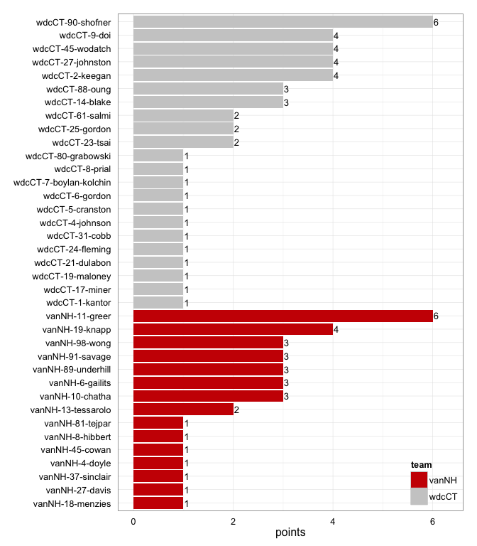
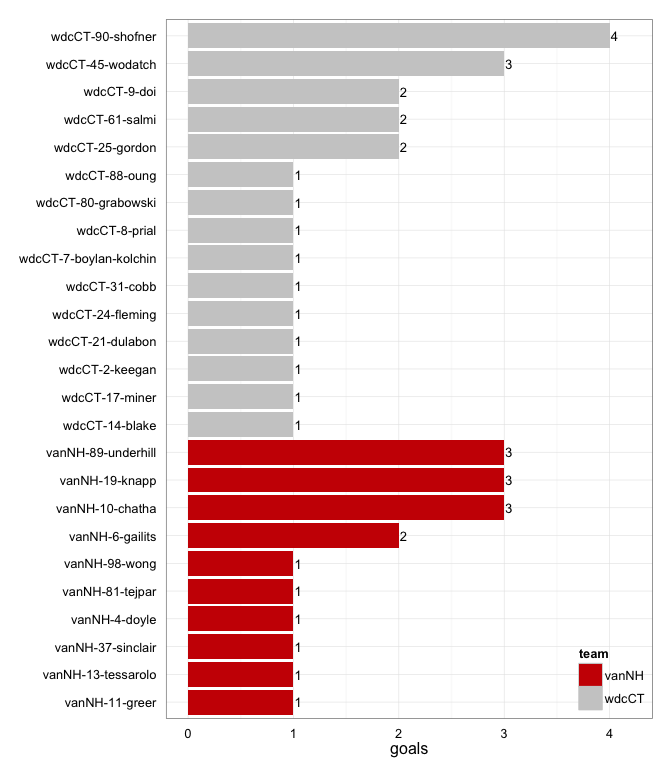
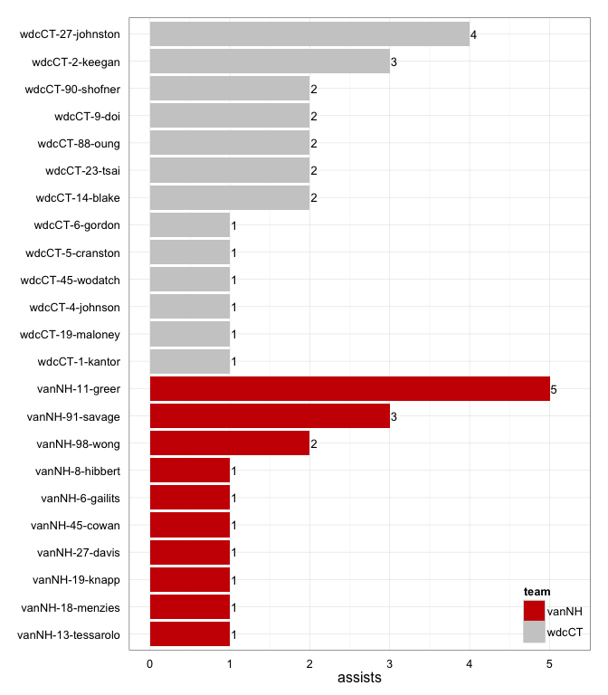
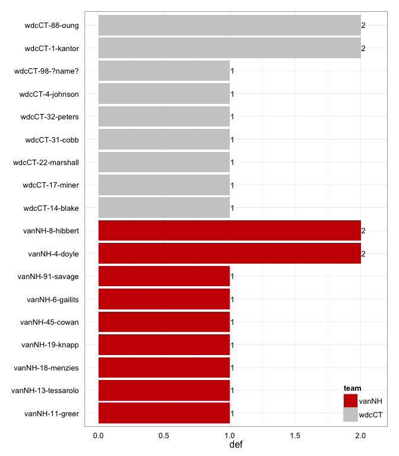

---
output:
  html_document:
    theme: readable
    includes:
      before_body: 08_before-body-back-to-index-href.txt
---

# vanNH at wdcCT 2014-07-19

#### last update Sat Jul 19 17:59:14 2014
# vanNH 17
# wdcCT 23
## game is complete

Go to ...  
  * [Scoring progression](#scoringProgression)  
  * [Player stats via figures](#pl_figs)  
  * [Player stats for vanNH](#away)  
  * [Player stats for wdcCT](#home)  
  * [Data on goals, assists, D's](#selectData)  
  * [Full raw data](#rawData)  

## Scoring progression:

| point|period |begin    |end     |pt_duration |desc                                     |vanNH |wdcCT |
|-----:|:------|:--------|:-------|:-----------|:----------------------------------------|:-----|:-----|
|    43|4      |0:06:00  |0:00:00 |00:06       |- no goal -                              |17    |23    |
|    42|4      |1:06:00  |0:07:00 |00:59       |wdcCT-23-tsai to wdcCT-24-fleming        |17    |23    |
|    41|4      |1:25:00  |1:06:00 |00:19       |wdcCT-27-johnston to wdcCT-9-doi         |17    |22    |
|    40|4      |1:43:00  |1:25:00 |00:18       |vanNH-11-greer to vanNH-10-chatha        |17    |21    |
|    39|4      |3:46:00  |1:43:00 |02:03       |wdcCT-14-blake to wdcCT-45-wodatch       |16    |21    |
|    38|4      |4:06:00  |3:46:00 |00:20       |vanNH-98-wong to vanNH-89-underhill      |16    |20    |
|    37|4      |4:44:00  |4:06:00 |00:38       |wdcCT-9-doi to wdcCT-90-shofner          |15    |20    |
|    36|4      |5:12:00  |4:44:00 |00:28       |vanNH-45-cowan to vanNH-37-sinclair      |15    |19    |
|    35|4      |6:09:00  |5:12:00 |00:57       |vanNH-19-knapp to vanNH-89-underhill     |14    |19    |
|    34|4      |7:13:00  |6:09:00 |01:04       |wdcCT-19-maloney to wdcCT-61-salmi       |13    |19    |
|    33|4      |10:00:00 |7:13:00 |02:47       |wdcCT-5-cranston to wdcCT-90-shofner     |13    |18    |
|    32|3      |0:05:00  |0:00:00 |00:05       |vanNH-11-greer to vanNH-89-underhill     |13    |17    |
|    31|3      |0:45:00  |0:05:00 |00:40       |wdcCT-14-blake to wdcCT-2-keegan         |12    |17    |
|    30|3      |1:25:00  |0:45:00 |00:40       |vanNH-11-greer to vanNH-81-tejpar        |12    |16    |
|    29|3      |2:12:00  |1:25:00 |00:47       |vanNH-91-savage to vanNH-19-knapp        |11    |16    |
|    28|3      |3:00:00  |2:12:00 |00:48       |wdcCT-90-shofner to wdcCT-88-oung        |10    |16    |
|    27|3      |4:12:00  |3:00:00 |01:12       |vanNH-27-davis to vanNH-13-tessarolo     |10    |15    |
|    26|3      |5:42:00  |4:12:00 |01:30       |vanNH-18-menzies to vanNH-11-greer       |9     |15    |
|    25|3      |6:59:00  |5:42:00 |01:17       |vanNH-13-tessarolo to vanNH-4-doyle      |8     |15    |
|    24|3      |7:40:00  |6:59:00 |00:41       |vanNH-91-savage to vanNH-19-knapp        |7     |15    |
|    23|3      |7:58:00  |7:40:00 |00:18       |wdcCT-88-oung to wdcCT-9-doi             |6     |15    |
|    22|3      |9:01:00  |7:58:00 |01:03       |vanNH-11-greer to vanNH-19-knapp         |6     |14    |
|    21|3      |9:18:00  |9:01:00 |00:17       |wdcCT-9-doi to wdcCT-90-shofner          |5     |14    |
|    20|3      |10:00:00 |9:18:00 |00:42       |vanNH-11-greer to vanNH-6-gailits        |5     |13    |
|    19|2      |0:58:00  |0:00:00 |00:58       |- no goal -                              |4     |13    |
|    18|2      |1:55:00  |0:58:00 |00:57       |wdcCT-27-johnston to wdcCT-25-gordon     |4     |13    |
|    17|2      |3:36:00  |1:55:00 |01:41       |wdcCT-88-oung to wdcCT-45-wodatch        |4     |12    |
|    16|2      |4:05:00  |3:36:00 |00:29       |vanNH-91-savage to vanNH-10-chatha       |4     |11    |
|    15|2      |6:06:00  |4:05:00 |02:01       |wdcCT-45-wodatch to wdcCT-80-grabowski   |3     |11    |
|    14|2      |7:28:00  |6:06:00 |01:22       |vanNH-98-wong to vanNH-6-gailits         |3     |10    |
|    13|2      |9:47:00  |7:28:00 |02:19       |wdcCT-2-keegan to wdcCT-14-blake         |2     |10    |
|    12|2      |10:00:00 |9:47:00 |00:13       |wdcCT-2-keegan to wdcCT-45-wodatch       |2     |9     |
|    11|1      |0:05:00  |0:00:00 |00:05       |- no goal -                              |2     |8     |
|    10|1      |0:51:00  |0:05:00 |00:46       |wdcCT-1-kantor to wdcCT-31-cobb          |2     |8     |
|     9|1      |1:13:00  |0:51:00 |00:22       |wdcCT-90-shofner to wdcCT-8-prial        |2     |7     |
|     8|1      |1:47:00  |1:13:00 |00:34       |vanNH-6-gailits to vanNH-98-wong         |2     |6     |
|     7|1      |2:26:00  |1:47:00 |00:39       |wdcCT-27-johnston to wdcCT-21-dulabon    |1     |6     |
|     6|1      |4:34:00  |2:26:00 |02:08       |wdcCT-23-tsai to wdcCT-61-salmi          |1     |5     |
|     5|1      |5:42:00  |4:34:00 |01:08       |wdcCT-27-johnston to wdcCT-17-miner      |1     |4     |
|     4|1      |6:41:00  |5:42:00 |00:59       |wdcCT-2-keegan to wdcCT-90-shofner       |1     |3     |
|     3|1      |7:50:00  |6:41:00 |01:09       |vanNH-8-hibbert to vanNH-10-chatha       |1     |2     |
|     2|1      |9:07:00  |7:50:00 |01:17       |wdcCT-4-johnson to wdcCT-25-gordon       |0     |2     |
|     1|1      |10:00:00 |9:07:00 |00:53       |wdcCT-6-gordon to wdcCT-7-boylan-kolchin |0     |1     |

## Player stats via figures:

### Points = goals + assists

### Goals

### Assists

### D's

## Player stats for vanNH :

points = goals + assists  
tables sorted in decreasing order based on points (then goals, assists, Ds)  
Ds = total of plain ol' D's + interceptions (D), hand blocks (HB), and foot blocks (FB)  
stats are cumulative for this game

|   |player   |last      | points| comp_pct| goals| assists| throws| completions| catches| def| drop|
|:--|:--------|:---------|------:|--------:|-----:|-------:|------:|-----------:|-------:|---:|----:|
|1  |vanNH-11 |greer     |      6|     0.81|     1|       5|     16|          13|      17|   1|    1|
|2  |vanNH-19 |knapp     |      4|     0.93|     3|       1|     29|          27|      21|   1|    0|
|3  |vanNH-10 |chatha    |      3|     0.93|     3|       0|     14|          13|      18|   0|    0|
|4  |vanNH-89 |underhill |      3|     0.84|     3|       0|     25|          21|      21|   0|    1|
|5  |vanNH-6  |gailits   |      3|     1.00|     2|       1|     10|          10|      12|   1|    0|
|6  |vanNH-98 |wong      |      3|     1.00|     1|       2|     11|          11|      12|   0|    0|
|7  |vanNH-91 |savage    |      3|     0.78|     0|       3|     23|          18|      16|   1|    1|
|8  |vanNH-13 |tessarolo |      2|     1.00|     1|       1|      3|           3|       4|   1|    0|
|9  |vanNH-4  |doyle     |      1|     0.80|     1|       0|      5|           4|       2|   2|    0|
|10 |vanNH-37 |sinclair  |      1|     1.00|     1|       0|      3|           3|       3|   0|    0|
|11 |vanNH-81 |tejpar    |      1|     1.00|     1|       0|      2|           2|       2|   0|    0|
|12 |vanNH-8  |hibbert   |      1|     0.70|     0|       1|     10|           7|       9|   2|    1|
|13 |vanNH-18 |menzies   |      1|     1.00|     0|       1|      9|           9|       6|   1|    0|
|14 |vanNH-45 |cowan     |      1|     0.90|     0|       1|     10|           9|       8|   1|    0|
|15 |vanNH-27 |davis     |      1|     1.00|     0|       1|      4|           4|       4|   0|    0|
|16 |vanNH-?  |?name?    |      0|     0.00|     0|       0|      1|           0|       0|   0|    0|
|17 |vanNH-14 |eyrich    |      0|     0.00|     0|       0|      1|           0|       1|   0|    1|
|18 |vanNH-21 |loach     |      0|     1.00|     0|       0|      1|           1|       0|   0|    0|
|19 |vanNH-22 |berezan   |      0|     1.00|     0|       0|      2|           2|       2|   0|    0|
|20 |vanNH-24 |yu        |      0|     1.00|     0|       0|      9|           9|       9|   0|    0|
|21 |vanNH-31 |saito     |      0|     1.00|     0|       0|      2|           2|       1|   0|    0|
|22 |vanNH-33 |collins   |      0|     0.50|     0|       0|      4|           2|       3|   0|    0|
|23 |vanNH-5  |norris    |      0|     0.92|     0|       0|     12|          11|      10|   0|    0|
|24 |vanNH-62 |?name?    |      0|     1.00|     0|       0|      1|           1|       1|   0|    0|
|25 |vanNH-72 |leduc     |      0|     1.00|     0|       0|      1|           1|       1|   0|    0|

## Player stats for wdcCT :

points = goals + assists  
tables sorted in decreasing order based on points (then goals, assists, Ds)  
Ds = total of plain ol' D's + interceptions (D), hand blocks (HB), and foot blocks (FB)  
stats are cumulative for this game

|   |player   |last           | points| comp_pct| goals| assists| throws| completions| catches| def| drop|
|:--|:--------|:--------------|------:|--------:|-----:|-------:|------:|-----------:|-------:|---:|----:|
|26 |wdcCT-90 |shofner        |      6|     0.82|     4|       2|     11|           9|      13|   0|    0|
|27 |wdcCT-45 |wodatch        |      4|     0.90|     3|       1|     10|           9|      13|   0|    0|
|28 |wdcCT-9  |doi            |      4|     0.85|     2|       2|     13|          11|      15|   0|    0|
|29 |wdcCT-2  |keegan         |      4|     0.86|     1|       3|     29|          25|      26|   0|    0|
|30 |wdcCT-27 |johnston       |      4|     0.86|     0|       4|     14|          12|      12|   0|    1|
|31 |wdcCT-88 |oung           |      3|     0.97|     1|       2|     31|          30|      23|   2|    0|
|32 |wdcCT-14 |blake          |      3|     1.00|     1|       2|     23|          23|      13|   1|    0|
|33 |wdcCT-25 |gordon         |      2|     0.75|     2|       0|      4|           3|       6|   0|    1|
|34 |wdcCT-61 |salmi          |      2|     1.00|     2|       0|      7|           7|       6|   0|    0|
|35 |wdcCT-23 |tsai           |      2|     0.88|     0|       2|      8|           7|       7|   0|    0|
|36 |wdcCT-17 |miner          |      1|     1.00|     1|       0|      3|           3|       3|   1|    0|
|37 |wdcCT-31 |cobb           |      1|     1.00|     1|       0|      1|           1|       2|   1|    0|
|38 |wdcCT-21 |dulabon        |      1|     1.00|     1|       0|      2|           2|       2|   0|    0|
|39 |wdcCT-24 |fleming        |      1|     1.00|     1|       0|      2|           2|       3|   0|    0|
|40 |wdcCT-7  |boylan-kolchin |      1|     1.00|     1|       0|      7|           7|       8|   0|    0|
|41 |wdcCT-8  |prial          |      1|     1.00|     1|       0|      4|           4|       5|   0|    0|
|42 |wdcCT-80 |grabowski      |      1|     1.00|     1|       0|      2|           2|       3|   0|    0|
|43 |wdcCT-1  |kantor         |      1|     1.00|     0|       1|      7|           7|       4|   2|    0|
|44 |wdcCT-4  |johnson        |      1|     0.88|     0|       1|      8|           7|       6|   1|    0|
|45 |wdcCT-19 |maloney        |      1|     1.00|     0|       1|      4|           4|       4|   0|    0|
|46 |wdcCT-5  |cranston       |      1|     0.75|     0|       1|      8|           6|       9|   0|    0|
|47 |wdcCT-6  |gordon         |      1|     1.00|     0|       1|      6|           6|       6|   0|    0|
|48 |wdcCT-22 |marshall       |      0|     0.75|     0|       0|      8|           6|       7|   1|    0|
|49 |wdcCT-32 |peters         |      0|     1.00|     0|       0|     10|          10|       8|   1|    0|
|50 |wdcCT-98 |?name?         |      0|       NA|     0|       0|      0|           0|       0|   1|    0|
|51 |wdcCT-   |?name?         |      0|     1.00|     0|       0|      1|           1|       1|   0|    0|
|52 |wdcCT-18 |?name?         |      0|     1.00|     0|       0|      1|           1|       1|   0|    0|
|53 |wdcCT-42 |gibson         |      0|     1.00|     0|       0|      3|           3|       3|   0|    0|
|54 |wdcCT-43 |?name?         |      0|     1.00|     0|       0|      1|           1|       1|   0|    0|
|55 |wdcCT-81 |?name?         |      0|     1.00|     0|       0|      1|           1|       0|   0|    0|

## Raw data on select events (goals, assists, D's):

| point| period|pull_team | event| poss_abs| poss_rel|poss_team |pl_team |pl_pnum |pl_code |pl_lname       |player                 | vanNH| wdcCT|
|-----:|------:|:---------|-----:|--------:|--------:|:---------|:-------|:-------|:-------|:--------------|:----------------------|-----:|-----:|
|     1|      1|wdcCT     |    11|        2|        2|wdcCT     |wdcCT   |6       |A       |gordon         |wdcCT-6-gordon         |     0|     1|
|     1|      1|wdcCT     |    12|        2|        2|wdcCT     |wdcCT   |7       |G       |boylan-kolchin |wdcCT-7-boylan-kolchin |     0|     1|
|     2|      1|wdcCT     |    15|        4|        2|wdcCT     |wdcCT   |4       |A       |johnson        |wdcCT-4-johnson        |     0|     2|
|     2|      1|wdcCT     |    16|        4|        2|wdcCT     |wdcCT   |25      |G       |gordon         |wdcCT-25-gordon        |     0|     2|
|     3|      1|wdcCT     |    12|        5|        1|vanNH     |vanNH   |8       |A       |hibbert        |vanNH-8-hibbert        |     1|     2|
|     3|      1|wdcCT     |    13|        5|        1|vanNH     |vanNH   |10      |G       |chatha         |vanNH-10-chatha        |     1|     2|
|     4|      1|vanNH     |    13|        6|        1|wdcCT     |wdcCT   |2       |A       |keegan         |wdcCT-2-keegan         |     1|     3|
|     4|      1|vanNH     |    14|        6|        1|wdcCT     |wdcCT   |90      |G       |shofner        |wdcCT-90-shofner       |     1|     3|
|     5|      1|wdcCT     |     8|        7|        1|vanNH     |wdcCT   |1       |D       |kantor         |wdcCT-1-kantor         |     1|     4|
|     5|      1|wdcCT     |    15|        8|        2|wdcCT     |wdcCT   |27      |A       |johnston       |wdcCT-27-johnston      |     1|     4|
|     5|      1|wdcCT     |    16|        8|        2|wdcCT     |wdcCT   |17      |G       |miner          |wdcCT-17-miner         |     1|     4|
|     6|      1|wdcCT     |    20|       10|        2|wdcCT     |wdcCT   |23      |A       |tsai           |wdcCT-23-tsai          |     1|     5|
|     6|      1|wdcCT     |    21|       10|        2|wdcCT     |wdcCT   |61      |G       |salmi          |wdcCT-61-salmi         |     1|     5|
|     7|      1|wdcCT     |     9|       11|        1|vanNH     |wdcCT   |1       |D       |kantor         |wdcCT-1-kantor         |     1|     6|
|     7|      1|wdcCT     |    11|       12|        2|wdcCT     |wdcCT   |27      |A       |johnston       |wdcCT-27-johnston      |     1|     6|
|     7|      1|wdcCT     |    12|       12|        2|wdcCT     |wdcCT   |21      |G       |dulabon        |wdcCT-21-dulabon       |     1|     6|
|     8|      1|wdcCT     |     8|       13|        1|vanNH     |vanNH   |6       |LA      |gailits        |vanNH-6-gailits        |     2|     6|
|     8|      1|wdcCT     |     9|       13|        1|vanNH     |vanNH   |98      |G       |wong           |vanNH-98-wong          |     2|     6|
|     9|      1|vanNH     |     6|       14|        1|wdcCT     |wdcCT   |90      |A       |shofner        |wdcCT-90-shofner       |     2|     7|
|     9|      1|vanNH     |     7|       14|        1|wdcCT     |wdcCT   |8       |LG      |prial          |wdcCT-8-prial          |     2|     7|
|    10|      1|wdcCT     |     6|       15|        1|vanNH     |wdcCT   |4       |D       |johnson        |wdcCT-4-johnson        |     2|     8|
|    10|      1|wdcCT     |    11|       16|        2|wdcCT     |wdcCT   |1       |A       |kantor         |wdcCT-1-kantor         |     2|     8|
|    10|      1|wdcCT     |    12|       16|        2|wdcCT     |wdcCT   |31      |LG      |cobb           |wdcCT-31-cobb          |     2|     8|
|    11|      1|wdcCT     |    NA|       NA|       NA|NA        |NA      |NA      |NA      |NA             |NA-NA-NA               |     2|     8|
|    12|      2|vanNH     |     4|       18|        1|wdcCT     |wdcCT   |2       |A       |keegan         |wdcCT-2-keegan         |     2|     9|
|    12|      2|vanNH     |     5|       18|        1|wdcCT     |wdcCT   |45      |LG      |wodatch        |wdcCT-45-wodatch       |     2|     9|
|    13|      2|wdcCT     |    14|       20|        2|wdcCT     |vanNH   |91      |D       |savage         |vanNH-91-savage        |     2|    10|
|    13|      2|wdcCT     |    23|       22|        4|wdcCT     |vanNH   |11      |D       |greer          |vanNH-11-greer         |     2|    10|
|    13|      2|wdcCT     |    27|       24|        6|wdcCT     |wdcCT   |2       |PUA     |keegan         |wdcCT-2-keegan         |     2|    10|
|    13|      2|wdcCT     |    28|       24|        6|wdcCT     |wdcCT   |14      |G       |blake          |wdcCT-14-blake         |     2|    10|
|    14|      2|wdcCT     |     9|       25|        1|vanNH     |wdcCT   |17      |D       |miner          |wdcCT-17-miner         |     3|    10|
|    14|      2|wdcCT     |    17|       27|        3|vanNH     |vanNH   |98      |A       |wong           |vanNH-98-wong          |     3|    10|
|    14|      2|wdcCT     |    18|       27|        3|vanNH     |vanNH   |6       |LG      |gailits        |vanNH-6-gailits        |     3|    10|
|    15|      2|vanNH     |    21|       30|        3|wdcCT     |wdcCT   |45      |A       |wodatch        |wdcCT-45-wodatch       |     3|    11|
|    15|      2|vanNH     |    22|       30|        3|wdcCT     |wdcCT   |80      |G       |grabowski      |wdcCT-80-grabowski     |     3|    11|
|    16|      2|wdcCT     |     9|       31|        1|vanNH     |vanNH   |91      |A       |savage         |vanNH-91-savage        |     4|    11|
|    16|      2|wdcCT     |    10|       31|        1|vanNH     |vanNH   |10      |LG      |chatha         |vanNH-10-chatha        |     4|    11|
|    17|      2|vanNH     |     9|       33|        2|vanNH     |wdcCT   |88      |D       |oung           |wdcCT-88-oung          |     4|    12|
|    17|      2|vanNH     |    15|       34|        3|wdcCT     |wdcCT   |88      |A       |oung           |wdcCT-88-oung          |     4|    12|
|    17|      2|vanNH     |    16|       34|        3|wdcCT     |wdcCT   |45      |G       |wodatch        |wdcCT-45-wodatch       |     4|    12|
|    18|      2|wdcCT     |     4|       35|        1|vanNH     |wdcCT   |22      |D       |marshall       |wdcCT-22-marshall      |     4|    13|
|    18|      2|wdcCT     |    15|       36|        2|wdcCT     |wdcCT   |27      |A       |johnston       |wdcCT-27-johnston      |     4|    13|
|    18|      2|wdcCT     |    16|       36|        2|wdcCT     |wdcCT   |25      |G       |gordon         |wdcCT-25-gordon        |     4|    13|
|    19|      2|wdcCT     |    13|       38|        2|wdcCT     |vanNH   |18      |D       |menzies        |vanNH-18-menzies       |     4|    13|
|    20|      3|wdcCT     |    11|       39|        1|vanNH     |vanNH   |11      |A       |greer          |vanNH-11-greer         |     5|    13|
|    20|      3|wdcCT     |    12|       39|        1|vanNH     |vanNH   |6       |G       |gailits        |vanNH-6-gailits        |     5|    13|
|    21|      3|vanNH     |     4|       40|        1|wdcCT     |wdcCT   |9       |LA      |doi            |wdcCT-9-doi            |     5|    14|
|    21|      3|vanNH     |     5|       40|        1|wdcCT     |wdcCT   |90      |G       |shofner        |wdcCT-90-shofner       |     5|    14|
|    22|      3|wdcCT     |     8|       42|        2|wdcCT     |vanNH   |6       |HB      |gailits        |vanNH-6-gailits        |     6|    14|
|    22|      3|wdcCT     |    14|       43|        3|vanNH     |vanNH   |11      |A       |greer          |vanNH-11-greer         |     6|    14|
|    22|      3|wdcCT     |    15|       43|        3|vanNH     |vanNH   |19      |G       |knapp          |vanNH-19-knapp         |     6|    14|
|    23|      3|vanNH     |     6|       44|        1|wdcCT     |wdcCT   |88      |A       |oung           |wdcCT-88-oung          |     6|    15|
|    23|      3|vanNH     |     7|       44|        1|wdcCT     |wdcCT   |9       |G       |doi            |wdcCT-9-doi            |     6|    15|
|    24|      3|wdcCT     |     8|       45|        1|vanNH     |vanNH   |91      |A       |savage         |vanNH-91-savage        |     7|    15|
|    24|      3|wdcCT     |     9|       45|        1|vanNH     |vanNH   |19      |G       |knapp          |vanNH-19-knapp         |     7|    15|
|    25|      3|vanNH     |     5|       46|        1|wdcCT     |vanNH   |4       |D       |doyle          |vanNH-4-doyle          |     8|    15|
|    25|      3|vanNH     |    14|       47|        2|vanNH     |vanNH   |13      |A       |tessarolo      |vanNH-13-tessarolo     |     8|    15|
|    25|      3|vanNH     |    15|       47|        2|vanNH     |vanNH   |4       |G       |doyle          |vanNH-4-doyle          |     8|    15|
|    26|      3|vanNH     |    19|       49|        2|vanNH     |vanNH   |18      |A       |menzies        |vanNH-18-menzies       |     9|    15|
|    26|      3|vanNH     |    20|       49|        2|vanNH     |vanNH   |11      |G       |greer          |vanNH-11-greer         |     9|    15|
|    27|      3|vanNH     |    19|       53|        4|vanNH     |vanNH   |27      |A       |davis          |vanNH-27-davis         |    10|    15|
|    27|      3|vanNH     |    20|       53|        4|vanNH     |vanNH   |13      |G       |tessarolo      |vanNH-13-tessarolo     |    10|    15|
|    28|      3|vanNH     |    10|       56|        3|wdcCT     |wdcCT   |90      |PUA     |shofner        |wdcCT-90-shofner       |    10|    16|
|    28|      3|vanNH     |    11|       56|        3|wdcCT     |wdcCT   |88      |G       |oung           |wdcCT-88-oung          |    10|    16|
|    29|      3|wdcCT     |     7|       58|        2|wdcCT     |vanNH   |19      |HB      |knapp          |vanNH-19-knapp         |    11|    16|
|    29|      3|wdcCT     |    13|       59|        3|vanNH     |vanNH   |91      |A       |savage         |vanNH-91-savage        |    11|    16|
|    29|      3|wdcCT     |    14|       59|        3|vanNH     |vanNH   |19      |G       |knapp          |vanNH-19-knapp         |    11|    16|
|    30|      3|vanNH     |     4|       60|        1|wdcCT     |vanNH   |8       |D       |hibbert        |vanNH-8-hibbert        |    12|    16|
|    30|      3|vanNH     |    13|       61|        2|vanNH     |vanNH   |11      |A       |greer          |vanNH-11-greer         |    12|    16|
|    30|      3|vanNH     |    14|       61|        2|vanNH     |vanNH   |81      |G       |tejpar         |vanNH-81-tejpar        |    12|    16|
|    31|      3|vanNH     |    13|       62|        1|wdcCT     |wdcCT   |14      |A       |blake          |wdcCT-14-blake         |    12|    17|
|    31|      3|vanNH     |    14|       62|        1|wdcCT     |wdcCT   |2       |G       |keegan         |wdcCT-2-keegan         |    12|    17|
|    32|      3|wdcCT     |     3|       63|        1|vanNH     |vanNH   |11      |A       |greer          |vanNH-11-greer         |    13|    17|
|    32|      3|wdcCT     |     4|       63|        1|vanNH     |vanNH   |89      |LG      |underhill      |vanNH-89-underhill     |    13|    17|
|    33|      4|vanNH     |     9|       64|        1|wdcCT     |vanNH   |4       |D       |doyle          |vanNH-4-doyle          |    13|    18|
|    33|      4|vanNH     |    18|       65|        2|vanNH     |wdcCT   |88      |D       |oung           |wdcCT-88-oung          |    13|    18|
|    33|      4|vanNH     |    22|       66|        3|wdcCT     |vanNH   |45      |D       |cowan          |vanNH-45-cowan         |    13|    18|
|    33|      4|vanNH     |    26|       67|        4|vanNH     |wdcCT   |14      |D       |blake          |wdcCT-14-blake         |    13|    18|
|    33|      4|vanNH     |    35|       68|        5|wdcCT     |wdcCT   |5       |A       |cranston       |wdcCT-5-cranston       |    13|    18|
|    33|      4|vanNH     |    37|       68|        5|wdcCT     |wdcCT   |90      |G       |shofner        |wdcCT-90-shofner       |    13|    18|
|    34|      4|wdcCT     |    13|       70|        2|wdcCT     |wdcCT   |19      |A       |maloney        |wdcCT-19-maloney       |    13|    19|
|    34|      4|wdcCT     |    14|       70|        2|wdcCT     |wdcCT   |61      |G       |salmi          |wdcCT-61-salmi         |    13|    19|
|    35|      4|wdcCT     |    13|       73|        3|vanNH     |vanNH   |19      |A       |knapp          |vanNH-19-knapp         |    14|    19|
|    35|      4|wdcCT     |    14|       73|        3|vanNH     |vanNH   |89      |G       |underhill      |vanNH-89-underhill     |    14|    19|
|    36|      4|vanNH     |     4|       74|        1|wdcCT     |vanNH   |13      |D       |tessarolo      |vanNH-13-tessarolo     |    15|    19|
|    36|      4|vanNH     |     8|       75|        2|vanNH     |vanNH   |45      |A       |cowan          |vanNH-45-cowan         |    15|    19|
|    36|      4|vanNH     |     9|       75|        2|vanNH     |vanNH   |37      |G       |sinclair       |vanNH-37-sinclair      |    15|    19|
|    37|      4|vanNH     |    10|       76|        1|wdcCT     |wdcCT   |9       |A       |doi            |wdcCT-9-doi            |    15|    20|
|    37|      4|vanNH     |    11|       76|        1|wdcCT     |wdcCT   |90      |G       |shofner        |wdcCT-90-shofner       |    15|    20|
|    38|      4|wdcCT     |     5|       77|        1|vanNH     |vanNH   |98      |LA      |wong           |vanNH-98-wong          |    16|    20|
|    38|      4|wdcCT     |     6|       77|        1|vanNH     |vanNH   |89      |G       |underhill      |vanNH-89-underhill     |    16|    20|
|    39|      4|vanNH     |    14|       78|        1|wdcCT     |vanNH   |8       |D       |hibbert        |vanNH-8-hibbert        |    16|    21|
|    39|      4|vanNH     |    17|       79|        2|vanNH     |wdcCT   |32      |D       |peters         |wdcCT-32-peters        |    16|    21|
|    39|      4|vanNH     |    24|       80|        3|wdcCT     |wdcCT   |14      |A       |blake          |wdcCT-14-blake         |    16|    21|
|    39|      4|vanNH     |    25|       80|        3|wdcCT     |wdcCT   |45      |G       |wodatch        |wdcCT-45-wodatch       |    16|    21|
|    40|      4|wdcCT     |     4|       81|        1|vanNH     |vanNH   |11      |A       |greer          |vanNH-11-greer         |    17|    21|
|    40|      4|wdcCT     |     5|       81|        1|vanNH     |vanNH   |10      |G       |chatha         |vanNH-10-chatha        |    17|    21|
|    41|      4|vanNH     |     6|       82|        1|wdcCT     |wdcCT   |27      |A       |johnston       |wdcCT-27-johnston      |    17|    22|
|    41|      4|vanNH     |     7|       82|        1|wdcCT     |wdcCT   |9       |G       |doi            |wdcCT-9-doi            |    17|    22|
|    42|      4|wdcCT     |     4|       83|        1|vanNH     |wdcCT   |98      |D       |?name?         |wdcCT-98-?name?        |    17|    23|
|    42|      4|wdcCT     |    16|       84|        2|wdcCT     |wdcCT   |23      |A       |tsai           |wdcCT-23-tsai          |    17|    23|
|    42|      4|wdcCT     |    17|       84|        2|wdcCT     |wdcCT   |24      |G       |fleming        |wdcCT-24-fleming       |    17|    23|
|    43|      4|wdcCT     |     3|       85|        1|vanNH     |wdcCT   |31      |D       |cobb           |wdcCT-31-cobb          |    17|    23|

## Full raw data:

__Note: just for display purposes.__ Raw data in more useful forms can be found in the [GitHub repository](https://github.com/jennybc/vanNH). Find the game you're interested in in the `games` subdirectory.

| period| point|pull_team | event| poss_abs| poss_rel|poss_team |pl_team |pl_pnum |pl_code |
|------:|-----:|:---------|-----:|--------:|--------:|:---------|:-------|:-------|:-------|
|      1|     1|wdcCT     |     1|        1|        1|vanNH     |wdcCT   |61      |P       |
|      1|     1|wdcCT     |     2|        1|        1|vanNH     |vanNH   |19      |PU      |
|      1|     1|wdcCT     |     3|        1|        1|vanNH     |vanNH   |89      |        |
|      1|     1|wdcCT     |     4|        2|        2|wdcCT     |wdcCT   |61      |PU      |
|      1|     1|wdcCT     |     5|        2|        2|wdcCT     |wdcCT   |7       |        |
|      1|     1|wdcCT     |     6|        2|        2|wdcCT     |wdcCT   |5       |        |
|      1|     1|wdcCT     |     7|        2|        2|wdcCT     |wdcCT   |19      |        |
|      1|     1|wdcCT     |     8|        2|        2|wdcCT     |wdcCT   |43      |        |
|      1|     1|wdcCT     |     9|        2|        2|wdcCT     |wdcCT   |19      |        |
|      1|     1|wdcCT     |    10|        2|        2|wdcCT     |wdcCT   |32      |        |
|      1|     1|wdcCT     |    11|        2|        2|wdcCT     |wdcCT   |6       |A       |
|      1|     1|wdcCT     |    12|        2|        2|wdcCT     |wdcCT   |7       |G       |
|      1|     2|wdcCT     |     1|        3|        1|vanNH     |wdcCT   |22      |P       |
|      1|     2|wdcCT     |     2|        3|        1|vanNH     |vanNH   |8       |PU      |
|      1|     2|wdcCT     |     3|        3|        1|vanNH     |vanNH   |91      |        |
|      1|     2|wdcCT     |     4|        3|        1|vanNH     |vanNH   |5       |        |
|      1|     2|wdcCT     |     5|        3|        1|vanNH     |vanNH   |10      |        |
|      1|     2|wdcCT     |     6|        3|        1|vanNH     |vanNH   |98      |        |
|      1|     2|wdcCT     |     7|        3|        1|vanNH     |vanNH   |11      |        |
|      1|     2|wdcCT     |     8|        3|        1|vanNH     |vanNH   |5       |VST     |
|      1|     2|wdcCT     |     9|        4|        2|wdcCT     |wdcCT   |27      |PU      |
|      1|     2|wdcCT     |    10|        4|        2|wdcCT     |vanNH   |89      |F       |
|      1|     2|wdcCT     |    11|        4|        2|wdcCT     |wdcCT   |6       |        |
|      1|     2|wdcCT     |    12|        4|        2|wdcCT     |wdcCT   |27      |        |
|      1|     2|wdcCT     |    13|        4|        2|wdcCT     |wdcCT   |4       |        |
|      1|     2|wdcCT     |    14|        4|        2|wdcCT     |wdcCT   |22      |        |
|      1|     2|wdcCT     |    15|        4|        2|wdcCT     |wdcCT   |4       |A       |
|      1|     2|wdcCT     |    16|        4|        2|wdcCT     |wdcCT   |25      |G       |
|      1|     3|wdcCT     |     1|        5|        1|vanNH     |wdcCT   |32      |P       |
|      1|     3|wdcCT     |     2|        5|        1|vanNH     |vanNH   |19      |PU      |
|      1|     3|wdcCT     |     3|        5|        1|vanNH     |vanNH   |89      |        |
|      1|     3|wdcCT     |     4|        5|        1|vanNH     |vanNH   |10      |        |
|      1|     3|wdcCT     |     5|        5|        1|vanNH     |vanNH   |89      |        |
|      1|     3|wdcCT     |     6|        5|        1|vanNH     |vanNH   |19      |        |
|      1|     3|wdcCT     |     7|        5|        1|vanNH     |vanNH   |10      |        |
|      1|     3|wdcCT     |     8|        5|        1|vanNH     |wdcCT   |23      |F       |
|      1|     3|wdcCT     |     9|        5|        1|vanNH     |vanNH   |89      |        |
|      1|     3|wdcCT     |    10|        5|        1|vanNH     |vanNH   |19      |        |
|      1|     3|wdcCT     |    11|        5|        1|vanNH     |vanNH   |11      |        |
|      1|     3|wdcCT     |    12|        5|        1|vanNH     |vanNH   |8       |A       |
|      1|     3|wdcCT     |    13|        5|        1|vanNH     |vanNH   |10      |G       |
|      1|     4|vanNH     |     1|        6|        1|wdcCT     |vanNH   |8       |P       |
|      1|     4|vanNH     |     2|        6|        1|wdcCT     |wdcCT   |88      |PU      |
|      1|     4|vanNH     |     3|        6|        1|wdcCT     |wdcCT   |2       |        |
|      1|     4|vanNH     |     4|        6|        1|wdcCT     |wdcCT   |90      |        |
|      1|     4|vanNH     |     5|        6|        1|wdcCT     |wdcCT   |88      |        |
|      1|     4|vanNH     |     6|        6|        1|wdcCT     |wdcCT   |8       |        |
|      1|     4|vanNH     |     7|        6|        1|wdcCT     |wdcCT   |9       |        |
|      1|     4|vanNH     |     8|        6|        1|wdcCT     |wdcCT   |45      |        |
|      1|     4|vanNH     |     9|        6|        1|wdcCT     |wdcCT   |8       |        |
|      1|     4|vanNH     |    10|        6|        1|wdcCT     |wdcCT   |88      |        |
|      1|     4|vanNH     |    11|        6|        1|wdcCT     |wdcCT   |2       |        |
|      1|     4|vanNH     |    12|        6|        1|wdcCT     |wdcCT   |9       |        |
|      1|     4|vanNH     |    13|        6|        1|wdcCT     |wdcCT   |2       |A       |
|      1|     4|vanNH     |    14|        6|        1|wdcCT     |wdcCT   |90      |G       |
|      1|     5|wdcCT     |     1|        7|        1|vanNH     |wdcCT   |22      |P       |
|      1|     5|wdcCT     |     2|        7|        1|vanNH     |vanNH   |19      |PU      |
|      1|     5|wdcCT     |     3|        7|        1|vanNH     |vanNH   |5       |        |
|      1|     5|wdcCT     |     4|        7|        1|vanNH     |vanNH   |19      |        |
|      1|     5|wdcCT     |     5|        7|        1|vanNH     |vanNH   |5       |        |
|      1|     5|wdcCT     |     6|        7|        1|vanNH     |vanNH   |98      |        |
|      1|     5|wdcCT     |     7|        7|        1|vanNH     |vanNH   |10      |        |
|      1|     5|wdcCT     |     8|        7|        1|vanNH     |wdcCT   |1       |D       |
|      1|     5|wdcCT     |     9|        8|        2|wdcCT     |wdcCT   |1       |PU      |
|      1|     5|wdcCT     |    10|        8|        2|wdcCT     |wdcCT   |22      |        |
|      1|     5|wdcCT     |    11|        8|        2|wdcCT     |wdcCT   |17      |        |
|      1|     5|wdcCT     |    12|        8|        2|wdcCT     |wdcCT   |22      |        |
|      1|     5|wdcCT     |    13|        8|        2|wdcCT     |wdcCT   |25      |        |
|      1|     5|wdcCT     |    14|        8|        2|wdcCT     |wdcCT   |21      |        |
|      1|     5|wdcCT     |    15|        8|        2|wdcCT     |wdcCT   |27      |A       |
|      1|     5|wdcCT     |    16|        8|        2|wdcCT     |wdcCT   |17      |G       |
|      1|     6|wdcCT     |     1|        9|        1|vanNH     |wdcCT   |61      |P       |
|      1|     6|wdcCT     |     2|        9|        1|vanNH     |vanNH   |19      |PU      |
|      1|     6|wdcCT     |     3|        9|        1|vanNH     |vanNH   |91      |        |
|      1|     6|wdcCT     |     4|        9|        1|vanNH     |vanNH   |62      |        |
|      1|     6|wdcCT     |     5|        9|        1|vanNH     |vanNH   |6       |        |
|      1|     6|wdcCT     |     6|        9|        1|vanNH     |vanNH   |98      |        |
|      1|     6|wdcCT     |     7|        9|        1|vanNH     |vanNH   |10      |        |
|      1|     6|wdcCT     |     8|        9|        1|vanNH     |vanNH   |5       |        |
|      1|     6|wdcCT     |     9|        9|        1|vanNH     |vanNH   |6       |        |
|      1|     6|wdcCT     |    10|        9|        1|vanNH     |vanNH   |10      |        |
|      1|     6|wdcCT     |    11|        9|        1|vanNH     |vanNH   |19      |        |
|      1|     6|wdcCT     |    12|        9|        1|vanNH     |wdcCT   |23      |F       |
|      1|     6|wdcCT     |    13|       10|        2|wdcCT     |wdcCT   |32      |PU      |
|      1|     6|wdcCT     |    14|       10|        2|wdcCT     |wdcCT   |23      |        |
|      1|     6|wdcCT     |    15|       10|        2|wdcCT     |wdcCT   |32      |        |
|      1|     6|wdcCT     |    16|       10|        2|wdcCT     |wdcCT   |61      |        |
|      1|     6|wdcCT     |    17|       10|        2|wdcCT     |wdcCT   |32      |        |
|      1|     6|wdcCT     |    18|       10|        2|wdcCT     |vanNH   |?       |F       |
|      1|     6|wdcCT     |    19|       10|        2|wdcCT     |wdcCT   |5       |        |
|      1|     6|wdcCT     |    20|       10|        2|wdcCT     |wdcCT   |23      |A       |
|      1|     6|wdcCT     |    21|       10|        2|wdcCT     |wdcCT   |61      |G       |
|      1|     7|wdcCT     |     1|       11|        1|vanNH     |wdcCT   |4       |P       |
|      1|     7|wdcCT     |     2|       11|        1|vanNH     |vanNH   |5       |PU      |
|      1|     7|wdcCT     |     3|       11|        1|vanNH     |vanNH   |89      |        |
|      1|     7|wdcCT     |     4|       11|        1|vanNH     |vanNH   |5       |        |
|      1|     7|wdcCT     |     5|       11|        1|vanNH     |vanNH   |89      |        |
|      1|     7|wdcCT     |     6|       11|        1|vanNH     |vanNH   |22      |        |
|      1|     7|wdcCT     |     7|       11|        1|vanNH     |vanNH   |5       |        |
|      1|     7|wdcCT     |     8|       11|        1|vanNH     |vanNH   |89      |        |
|      1|     7|wdcCT     |     9|       11|        1|vanNH     |wdcCT   |1       |D       |
|      1|     7|wdcCT     |    10|       12|        2|wdcCT     |wdcCT   |1       |PU      |
|      1|     7|wdcCT     |    11|       12|        2|wdcCT     |wdcCT   |27      |A       |
|      1|     7|wdcCT     |    12|       12|        2|wdcCT     |wdcCT   |21      |G       |
|      1|     8|wdcCT     |     1|       13|        1|vanNH     |wdcCT   |61      |P       |
|      1|     8|wdcCT     |     2|       13|        1|vanNH     |vanNH   |91      |PU      |
|      1|     8|wdcCT     |     3|       13|        1|vanNH     |vanNH   |18      |        |
|      1|     8|wdcCT     |     4|       13|        1|vanNH     |vanNH   |98      |        |
|      1|     8|wdcCT     |     5|       13|        1|vanNH     |vanNH   |91      |        |
|      1|     8|wdcCT     |     6|       13|        1|vanNH     |vanNH   |19      |        |
|      1|     8|wdcCT     |     7|       13|        1|vanNH     |vanNH   |91      |        |
|      1|     8|wdcCT     |     8|       13|        1|vanNH     |vanNH   |6       |LA      |
|      1|     8|wdcCT     |     9|       13|        1|vanNH     |vanNH   |98      |G       |
|      1|     9|vanNH     |     1|       14|        1|wdcCT     |vanNH   |8       |P       |
|      1|     9|vanNH     |     2|       14|        1|wdcCT     |wdcCT   |14      |PU      |
|      1|     9|vanNH     |     3|       14|        1|wdcCT     |wdcCT   |88      |        |
|      1|     9|vanNH     |     4|       14|        1|wdcCT     |wdcCT   |2       |        |
|      1|     9|vanNH     |     5|       14|        1|wdcCT     |wdcCT   |88      |        |
|      1|     9|vanNH     |     6|       14|        1|wdcCT     |wdcCT   |90      |A       |
|      1|     9|vanNH     |     7|       14|        1|wdcCT     |wdcCT   |8       |LG      |
|      1|    10|wdcCT     |     1|       15|        1|vanNH     |wdcCT   |22      |P       |
|      1|    10|wdcCT     |     2|       15|        1|vanNH     |vanNH   |19      |PU      |
|      1|    10|wdcCT     |     3|       15|        1|vanNH     |vanNH   |89      |        |
|      1|    10|wdcCT     |     4|       15|        1|vanNH     |vanNH   |10      |        |
|      1|    10|wdcCT     |     5|       15|        1|vanNH     |vanNH   |91      |        |
|      1|    10|wdcCT     |     6|       15|        1|vanNH     |wdcCT   |4       |D       |
|      1|    10|wdcCT     |     7|       16|        2|wdcCT     |wdcCT   |4       |PU      |
|      1|    10|wdcCT     |     8|       16|        2|wdcCT     |wdcCT   |31      |        |
|      1|    10|wdcCT     |     9|       16|        2|wdcCT     |wdcCT   |4       |        |
|      1|    10|wdcCT     |    10|       16|        2|wdcCT     |wdcCT   |6       |        |
|      1|    10|wdcCT     |    11|       16|        2|wdcCT     |wdcCT   |1       |A       |
|      1|    10|wdcCT     |    12|       16|        2|wdcCT     |wdcCT   |31      |LG      |
|      1|    11|wdcCT     |     1|       17|        1|vanNH     |wdcCT   |5       |P       |
|      1|    11|wdcCT     |     2|       17|        1|vanNH     |vanNH   |33      |PU      |
|      2|    12|vanNH     |     1|       18|        1|wdcCT     |vanNH   |8       |P       |
|      2|    12|vanNH     |     2|       18|        1|wdcCT     |wdcCT   |14      |PU      |
|      2|    12|vanNH     |     3|       18|        1|wdcCT     |wdcCT   |88      |        |
|      2|    12|vanNH     |     4|       18|        1|wdcCT     |wdcCT   |2       |A       |
|      2|    12|vanNH     |     5|       18|        1|wdcCT     |wdcCT   |45      |LG      |
|      2|    13|wdcCT     |     1|       19|        1|vanNH     |wdcCT   |32      |P       |
|      2|    13|wdcCT     |     2|       19|        1|vanNH     |vanNH   |91      |PU      |
|      2|    13|wdcCT     |     3|       19|        1|vanNH     |vanNH   |89      |        |
|      2|    13|wdcCT     |     4|       19|        1|vanNH     |vanNH   |91      |        |
|      2|    13|wdcCT     |     5|       19|        1|vanNH     |vanNH   |6       |        |
|      2|    13|wdcCT     |     6|       19|        1|vanNH     |vanNH   |10      |        |
|      2|    13|wdcCT     |     7|       19|        1|vanNH     |vanNH   |98      |        |
|      2|    13|wdcCT     |     8|       19|        1|vanNH     |vanNH   |6       |        |
|      2|    13|wdcCT     |     9|       19|        1|vanNH     |vanNH   |89      |        |
|      2|    13|wdcCT     |    10|       19|        1|vanNH     |vanNH   |91      |        |
|      2|    13|wdcCT     |    11|       19|        1|vanNH     |vanNH   |10      |TD      |
|      2|    13|wdcCT     |    12|       20|        2|wdcCT     |wdcCT   |21      |PU      |
|      2|    13|wdcCT     |    13|       20|        2|wdcCT     |wdcCT   |5       |        |
|      2|    13|wdcCT     |    14|       20|        2|wdcCT     |vanNH   |91      |D       |
|      2|    13|wdcCT     |    15|       21|        3|vanNH     |vanNH   |19      |        |
|      2|    13|wdcCT     |    16|       21|        3|vanNH     |wdcCT   |23      |F       |
|      2|    13|wdcCT     |    17|       21|        3|vanNH     |vanNH   |89      |        |
|      2|    13|wdcCT     |    18|       21|        3|vanNH     |vanNH   |19      |        |
|      2|    13|wdcCT     |    19|       21|        3|vanNH     |vanNH   |10      |        |
|      2|    13|wdcCT     |    20|       21|        3|vanNH     |vanNH   |?       |PU      |
|      2|    13|wdcCT     |    21|       22|        4|wdcCT     |wdcCT   |        |TO      |
|      2|    13|wdcCT     |    22|       22|        4|wdcCT     |wdcCT   |2       |PU      |
|      2|    13|wdcCT     |    23|       22|        4|wdcCT     |vanNH   |11      |D       |
|      2|    13|wdcCT     |    24|       23|        5|vanNH     |vanNH   |4       |        |
|      2|    13|wdcCT     |    25|       23|        5|vanNH     |vanNH   |14      |        |
|      2|    13|wdcCT     |    26|       23|        5|vanNH     |vanNH   |45      |TD      |
|      2|    13|wdcCT     |    27|       24|        6|wdcCT     |wdcCT   |2       |PUA     |
|      2|    13|wdcCT     |    28|       24|        6|wdcCT     |wdcCT   |14      |G       |
|      2|    14|wdcCT     |     1|       25|        1|vanNH     |wdcCT   |22      |P       |
|      2|    14|wdcCT     |     2|       25|        1|vanNH     |vanNH   |89      |PU      |
|      2|    14|wdcCT     |     3|       25|        1|vanNH     |vanNH   |19      |        |
|      2|    14|wdcCT     |     4|       25|        1|vanNH     |vanNH   |10      |        |
|      2|    14|wdcCT     |     5|       25|        1|vanNH     |vanNH   |6       |        |
|      2|    14|wdcCT     |     6|       25|        1|vanNH     |vanNH   |91      |        |
|      2|    14|wdcCT     |     7|       25|        1|vanNH     |vanNH   |89      |        |
|      2|    14|wdcCT     |     8|       25|        1|vanNH     |vanNH   |91      |        |
|      2|    14|wdcCT     |     9|       25|        1|vanNH     |wdcCT   |17      |D       |
|      2|    14|wdcCT     |    10|       26|        2|wdcCT     |wdcCT   |27      |PU      |
|      2|    14|wdcCT     |    11|       26|        2|wdcCT     |wdcCT   |6       |        |
|      2|    14|wdcCT     |    12|       26|        2|wdcCT     |wdcCT   |25      |        |
|      2|    14|wdcCT     |    13|       26|        2|wdcCT     |wdcCT   |27      |        |
|      2|    14|wdcCT     |    14|       26|        2|wdcCT     |wdcCT   |22      |TD      |
|      2|    14|wdcCT     |    15|       27|        3|vanNH     |vanNH   |19      |PU      |
|      2|    14|wdcCT     |    16|       27|        3|vanNH     |vanNH   |72      |        |
|      2|    14|wdcCT     |    17|       27|        3|vanNH     |vanNH   |98      |A       |
|      2|    14|wdcCT     |    18|       27|        3|vanNH     |vanNH   |6       |LG      |
|      2|    15|vanNH     |     1|       28|        1|wdcCT     |vanNH   |8       |P       |
|      2|    15|vanNH     |     2|       28|        1|wdcCT     |wdcCT   |88      |PU      |
|      2|    15|vanNH     |     3|       28|        1|wdcCT     |wdcCT   |90      |        |
|      2|    15|vanNH     |     4|       28|        1|wdcCT     |wdcCT   |2       |        |
|      2|    15|vanNH     |     5|       28|        1|wdcCT     |wdcCT   |90      |        |
|      2|    15|vanNH     |     6|       28|        1|wdcCT     |wdcCT   |2       |        |
|      2|    15|vanNH     |     7|       28|        1|wdcCT     |wdcCT   |90      |        |
|      2|    15|vanNH     |     8|       28|        1|wdcCT     |wdcCT   |9       |        |
|      2|    15|vanNH     |     9|       28|        1|wdcCT     |wdcCT   |88      |        |
|      2|    15|vanNH     |    10|       28|        1|wdcCT     |wdcCT   |45      |        |
|      2|    15|vanNH     |    11|       28|        1|wdcCT     |wdcCT   |9       |        |
|      2|    15|vanNH     |    12|       29|        2|vanNH     |vanNH   |18      |PU      |
|      2|    15|vanNH     |    13|       29|        2|vanNH     |vanNH   |33      |        |
|      2|    15|vanNH     |    14|       29|        2|vanNH     |vanNH   |18      |        |
|      2|    15|vanNH     |    15|       29|        2|vanNH     |vanNH   |24      |        |
|      2|    15|vanNH     |    16|       29|        2|vanNH     |vanNH   |18      |        |
|      2|    15|vanNH     |    17|       29|        2|vanNH     |vanNH   |8       |        |
|      2|    15|vanNH     |    18|       29|        2|vanNH     |vanNH   |11      |        |
|      2|    15|vanNH     |    19|       30|        3|wdcCT     |wdcCT   |90      |PU      |
|      2|    15|vanNH     |    20|       30|        3|wdcCT     |wdcCT   |80      |L       |
|      2|    15|vanNH     |    21|       30|        3|wdcCT     |wdcCT   |45      |A       |
|      2|    15|vanNH     |    22|       30|        3|wdcCT     |wdcCT   |80      |G       |
|      2|    16|wdcCT     |     1|       31|        1|vanNH     |wdcCT   |61      |P       |
|      2|    16|wdcCT     |     2|       31|        1|vanNH     |vanNH   |89      |PU      |
|      2|    16|wdcCT     |     3|       31|        1|vanNH     |vanNH   |91      |        |
|      2|    16|wdcCT     |     4|       31|        1|vanNH     |vanNH   |6       |        |
|      2|    16|wdcCT     |     5|       31|        1|vanNH     |vanNH   |19      |        |
|      2|    16|wdcCT     |     6|       31|        1|vanNH     |vanNH   |91      |        |
|      2|    16|wdcCT     |     7|       31|        1|vanNH     |vanNH   |89      |        |
|      2|    16|wdcCT     |     8|       31|        1|vanNH     |vanNH   |19      |        |
|      2|    16|wdcCT     |     9|       31|        1|vanNH     |vanNH   |91      |A       |
|      2|    16|wdcCT     |    10|       31|        1|vanNH     |vanNH   |10      |LG      |
|      2|    17|vanNH     |     1|       32|        1|wdcCT     |vanNH   |8       |P       |
|      2|    17|vanNH     |     2|       32|        1|wdcCT     |wdcCT   |14      |PU      |
|      2|    17|vanNH     |     3|       32|        1|wdcCT     |wdcCT   |2       |        |
|      2|    17|vanNH     |     4|       32|        1|wdcCT     |wdcCT   |88      |        |
|      2|    17|vanNH     |     5|       32|        1|wdcCT     |wdcCT   |2       |        |
|      2|    17|vanNH     |     6|       32|        1|wdcCT     |wdcCT   |90      |        |
|      2|    17|vanNH     |     7|       33|        2|vanNH     |vanNH   |45      |PU      |
|      2|    17|vanNH     |     8|       33|        2|vanNH     |vanNH   |8       |        |
|      2|    17|vanNH     |     9|       33|        2|vanNH     |wdcCT   |88      |D       |
|      2|    17|vanNH     |    10|       34|        3|wdcCT     |wdcCT   |88      |PU      |
|      2|    17|vanNH     |    11|       34|        3|wdcCT     |wdcCT   |2       |        |
|      2|    17|vanNH     |    12|       34|        3|wdcCT     |wdcCT   |90      |        |
|      2|    17|vanNH     |    13|       34|        3|wdcCT     |wdcCT   |88      |        |
|      2|    17|vanNH     |    14|       34|        3|wdcCT     |wdcCT   |8       |        |
|      2|    17|vanNH     |    15|       34|        3|wdcCT     |wdcCT   |88      |A       |
|      2|    17|vanNH     |    16|       34|        3|wdcCT     |wdcCT   |45      |G       |
|      2|    18|wdcCT     |     1|       35|        1|vanNH     |wdcCT   |22      |P       |
|      2|    18|wdcCT     |     2|       35|        1|vanNH     |vanNH   |89      |PU      |
|      2|    18|wdcCT     |     3|       35|        1|vanNH     |vanNH   |91      |        |
|      2|    18|wdcCT     |     4|       35|        1|vanNH     |wdcCT   |22      |D       |
|      2|    18|wdcCT     |     5|       36|        2|wdcCT     |wdcCT   |17      |PU      |
|      2|    18|wdcCT     |     6|       36|        2|wdcCT     |wdcCT   |22      |        |
|      2|    18|wdcCT     |     7|       36|        2|wdcCT     |wdcCT   |25      |        |
|      2|    18|wdcCT     |     8|       36|        2|wdcCT     |wdcCT   |4       |        |
|      2|    18|wdcCT     |     9|       36|        2|wdcCT     |wdcCT   |22      |        |
|      2|    18|wdcCT     |    10|       36|        2|wdcCT     |wdcCT   |17      |        |
|      2|    18|wdcCT     |    11|       36|        2|wdcCT     |wdcCT   |4       |        |
|      2|    18|wdcCT     |    12|       36|        2|wdcCT     |wdcCT   |1       |        |
|      2|    18|wdcCT     |    13|       36|        2|wdcCT     |wdcCT   |27      |        |
|      2|    18|wdcCT     |    14|       36|        2|wdcCT     |wdcCT   |1       |        |
|      2|    18|wdcCT     |    15|       36|        2|wdcCT     |wdcCT   |27      |A       |
|      2|    18|wdcCT     |    16|       36|        2|wdcCT     |wdcCT   |25      |G       |
|      2|    19|wdcCT     |     1|       37|        1|vanNH     |wdcCT   |32      |P       |
|      2|    19|wdcCT     |     2|       37|        1|vanNH     |vanNH   |5       |PU      |
|      2|    19|wdcCT     |     3|       37|        1|vanNH     |vanNH   |18      |        |
|      2|    19|wdcCT     |     4|       37|        1|vanNH     |vanNH   |5       |        |
|      2|    19|wdcCT     |     5|       38|        2|wdcCT     |wdcCT   |32      |PU      |
|      2|    19|wdcCT     |     6|       38|        2|wdcCT     |wdcCT   |5       |        |
|      2|    19|wdcCT     |     7|       38|        2|wdcCT     |wdcCT   |42      |        |
|      2|    19|wdcCT     |     8|       38|        2|wdcCT     |wdcCT   |5       |        |
|      2|    19|wdcCT     |     9|       38|        2|wdcCT     |wdcCT   |23      |        |
|      2|    19|wdcCT     |    10|       38|        2|wdcCT     |wdcCT   |32      |        |
|      2|    19|wdcCT     |    11|       38|        2|wdcCT     |wdcCT   |42      |        |
|      2|    19|wdcCT     |    12|       38|        2|wdcCT     |wdcCT   |5       |        |
|      2|    19|wdcCT     |    13|       38|        2|wdcCT     |vanNH   |18      |D       |
|      3|    20|wdcCT     |     1|       39|        1|vanNH     |wdcCT   |22      |P       |
|      3|    20|wdcCT     |     2|       39|        1|vanNH     |vanNH   |21      |PU      |
|      3|    20|wdcCT     |     3|       39|        1|vanNH     |vanNH   |89      |        |
|      3|    20|wdcCT     |     4|       39|        1|vanNH     |vanNH   |19      |        |
|      3|    20|wdcCT     |     5|       39|        1|vanNH     |vanNH   |98      |        |
|      3|    20|wdcCT     |     6|       39|        1|vanNH     |vanNH   |11      |        |
|      3|    20|wdcCT     |     7|       39|        1|vanNH     |wdcCT   |22      |F       |
|      3|    20|wdcCT     |     8|       39|        1|vanNH     |vanNH   |10      |        |
|      3|    20|wdcCT     |     9|       39|        1|vanNH     |vanNH   |89      |        |
|      3|    20|wdcCT     |    10|       39|        1|vanNH     |vanNH   |19      |        |
|      3|    20|wdcCT     |    11|       39|        1|vanNH     |vanNH   |11      |A       |
|      3|    20|wdcCT     |    12|       39|        1|vanNH     |vanNH   |6       |G       |
|      3|    21|vanNH     |     1|       40|        1|wdcCT     |vanNH   |8       |P       |
|      3|    21|vanNH     |     2|       40|        1|wdcCT     |wdcCT   |14      |PU      |
|      3|    21|vanNH     |     3|       40|        1|wdcCT     |wdcCT   |2       |        |
|      3|    21|vanNH     |     4|       40|        1|wdcCT     |wdcCT   |9       |LA      |
|      3|    21|vanNH     |     5|       40|        1|wdcCT     |wdcCT   |90      |G       |
|      3|    22|wdcCT     |     1|       41|        1|vanNH     |wdcCT   |61      |P       |
|      3|    22|wdcCT     |     2|       41|        1|vanNH     |vanNH   |19      |PU      |
|      3|    22|wdcCT     |     3|       41|        1|vanNH     |vanNH   |89      |        |
|      3|    22|wdcCT     |     4|       41|        1|vanNH     |vanNH   |11      |TD      |
|      3|    22|wdcCT     |     5|       42|        2|wdcCT     |wdcCT   |61      |PU      |
|      3|    22|wdcCT     |     6|       42|        2|wdcCT     |wdcCT   |7       |        |
|      3|    22|wdcCT     |     7|       42|        2|wdcCT     |wdcCT   |23      |        |
|      3|    22|wdcCT     |     8|       42|        2|wdcCT     |vanNH   |6       |HB      |
|      3|    22|wdcCT     |     9|       43|        3|vanNH     |vanNH   |91      |PU      |
|      3|    22|wdcCT     |    10|       43|        3|vanNH     |vanNH   |89      |        |
|      3|    22|wdcCT     |    11|       43|        3|vanNH     |vanNH   |19      |        |
|      3|    22|wdcCT     |    12|       43|        3|vanNH     |vanNH   |10      |        |
|      3|    22|wdcCT     |    13|       43|        3|vanNH     |vanNH   |98      |        |
|      3|    22|wdcCT     |    14|       43|        3|vanNH     |vanNH   |11      |A       |
|      3|    22|wdcCT     |    15|       43|        3|vanNH     |vanNH   |19      |G       |
|      3|    23|vanNH     |     1|       44|        1|wdcCT     |vanNH   |8       |P       |
|      3|    23|vanNH     |     2|       44|        1|wdcCT     |wdcCT   |14      |PU      |
|      3|    23|vanNH     |     3|       44|        1|wdcCT     |wdcCT   |88      |        |
|      3|    23|vanNH     |     4|       44|        1|wdcCT     |wdcCT   |14      |        |
|      3|    23|vanNH     |     5|       44|        1|wdcCT     |wdcCT   |8       |        |
|      3|    23|vanNH     |     6|       44|        1|wdcCT     |wdcCT   |88      |A       |
|      3|    23|vanNH     |     7|       44|        1|wdcCT     |wdcCT   |9       |G       |
|      3|    24|wdcCT     |     1|       45|        1|vanNH     |wdcCT   |22      |P       |
|      3|    24|wdcCT     |     2|       45|        1|vanNH     |vanNH   |19      |PU      |
|      3|    24|wdcCT     |     3|       45|        1|vanNH     |vanNH   |10      |        |
|      3|    24|wdcCT     |     4|       45|        1|vanNH     |vanNH   |98      |        |
|      3|    24|wdcCT     |     5|       45|        1|vanNH     |vanNH   |11      |        |
|      3|    24|wdcCT     |     6|       45|        1|vanNH     |wdcCT   |22      |F       |
|      3|    24|wdcCT     |     7|       45|        1|vanNH     |vanNH   |19      |        |
|      3|    24|wdcCT     |     8|       45|        1|vanNH     |vanNH   |91      |A       |
|      3|    24|wdcCT     |     9|       45|        1|vanNH     |vanNH   |19      |G       |
|      3|    25|vanNH     |     1|       46|        1|wdcCT     |vanNH   |8       |P       |
|      3|    25|vanNH     |     2|       46|        1|wdcCT     |wdcCT   |14      |PU      |
|      3|    25|vanNH     |     3|       46|        1|wdcCT     |wdcCT   |88      |        |
|      3|    25|vanNH     |     4|       46|        1|wdcCT     |wdcCT   |2       |        |
|      3|    25|vanNH     |     5|       46|        1|wdcCT     |vanNH   |4       |D       |
|      3|    25|vanNH     |     6|       47|        2|vanNH     |vanNH   |31      |        |
|      3|    25|vanNH     |     7|       47|        2|vanNH     |vanNH   |24      |        |
|      3|    25|vanNH     |     8|       47|        2|vanNH     |wdcCT   |88      |F       |
|      3|    25|vanNH     |     9|       47|        2|vanNH     |vanNH   |13      |        |
|      3|    25|vanNH     |    10|       47|        2|vanNH     |vanNH   |24      |        |
|      3|    25|vanNH     |    11|       47|        2|vanNH     |vanNH   |45      |        |
|      3|    25|vanNH     |    12|       47|        2|vanNH     |vanNH   |27      |        |
|      3|    25|vanNH     |    13|       47|        2|vanNH     |vanNH   |45      |        |
|      3|    25|vanNH     |    14|       47|        2|vanNH     |vanNH   |13      |A       |
|      3|    25|vanNH     |    15|       47|        2|vanNH     |vanNH   |4       |G       |
|      3|    26|vanNH     |     1|       48|        1|wdcCT     |vanNH   |8       |P       |
|      3|    26|vanNH     |     2|       48|        1|wdcCT     |wdcCT   |14      |PU      |
|      3|    26|vanNH     |     3|       48|        1|wdcCT     |wdcCT   |2       |        |
|      3|    26|vanNH     |     4|       48|        1|wdcCT     |wdcCT   |14      |        |
|      3|    26|vanNH     |     5|       48|        1|wdcCT     |wdcCT   |2       |        |
|      3|    26|vanNH     |     6|       49|        2|vanNH     |vanNH   |18      |PU      |
|      3|    26|vanNH     |     7|       49|        2|vanNH     |vanNH   |81      |        |
|      3|    26|vanNH     |     8|       49|        2|vanNH     |vanNH   |8       |        |
|      3|    26|vanNH     |     9|       49|        2|vanNH     |vanNH   |33      |        |
|      3|    26|vanNH     |    10|       49|        2|vanNH     |vanNH   |37      |        |
|      3|    26|vanNH     |    11|       49|        2|vanNH     |vanNH   |8       |        |
|      3|    26|vanNH     |    12|       49|        2|vanNH     |wdcCT   |8       |SO      |
|      3|    26|vanNH     |    13|       49|        2|vanNH     |wdcCT   |5       |SI      |
|      3|    26|vanNH     |    14|       49|        2|vanNH     |vanNH   |11      |        |
|      3|    26|vanNH     |    15|       49|        2|vanNH     |vanNH   |18      |        |
|      3|    26|vanNH     |    16|       49|        2|vanNH     |vanNH   |37      |        |
|      3|    26|vanNH     |    17|       49|        2|vanNH     |vanNH   |6       |        |
|      3|    26|vanNH     |    18|       49|        2|vanNH     |vanNH   |11      |        |
|      3|    26|vanNH     |    19|       49|        2|vanNH     |vanNH   |18      |A       |
|      3|    26|vanNH     |    20|       49|        2|vanNH     |vanNH   |11      |G       |
|      3|    27|vanNH     |     1|       50|        1|wdcCT     |vanNH   |8       |P       |
|      3|    27|vanNH     |     2|       50|        1|wdcCT     |wdcCT   |81      |PU      |
|      3|    27|vanNH     |     3|       50|        1|wdcCT     |wdcCT   |1       |        |
|      3|    27|vanNH     |     4|       50|        1|wdcCT     |wdcCT   |22      |        |
|      3|    27|vanNH     |     5|       51|        2|vanNH     |vanNH   |4       |        |
|      3|    27|vanNH     |     6|       51|        2|vanNH     |vanNH   |24      |        |
|      3|    27|vanNH     |     7|       51|        2|vanNH     |vanNH   |45      |        |
|      3|    27|vanNH     |     8|       51|        2|vanNH     |vanNH   |8       |        |
|      3|    27|vanNH     |     9|       51|        2|vanNH     |vanNH   |31      |TD      |
|      3|    27|vanNH     |    10|       52|        3|wdcCT     |wdcCT   |1       |PU      |
|      3|    27|vanNH     |    11|       52|        3|wdcCT     |wdcCT   |22      |        |
|      3|    27|vanNH     |    12|       52|        3|wdcCT     |wdcCT   |6       |        |
|      3|    27|vanNH     |    13|       52|        3|wdcCT     |wdcCT   |4       |        |
|      3|    27|vanNH     |    14|       53|        4|vanNH     |vanNH   |4       |PU      |
|      3|    27|vanNH     |    15|       53|        4|vanNH     |vanNH   |24      |        |
|      3|    27|vanNH     |    16|       53|        4|vanNH     |vanNH   |27      |        |
|      3|    27|vanNH     |    17|       53|        4|vanNH     |vanNH   |31      |        |
|      3|    27|vanNH     |    18|       53|        4|vanNH     |vanNH   |8       |        |
|      3|    27|vanNH     |    19|       53|        4|vanNH     |vanNH   |27      |A       |
|      3|    27|vanNH     |    20|       53|        4|vanNH     |vanNH   |13      |G       |
|      3|    28|vanNH     |     1|       54|        1|wdcCT     |vanNH   |33      |P       |
|      3|    28|vanNH     |     2|       54|        1|wdcCT     |wdcCT   |14      |PU      |
|      3|    28|vanNH     |     3|       54|        1|wdcCT     |wdcCT   |88      |        |
|      3|    28|vanNH     |     4|       54|        1|wdcCT     |wdcCT   |14      |        |
|      3|    28|vanNH     |     5|       54|        1|wdcCT     |wdcCT   |45      |        |
|      3|    28|vanNH     |     6|       54|        1|wdcCT     |wdcCT   |14      |        |
|      3|    28|vanNH     |     7|       54|        1|wdcCT     |wdcCT   |88      |        |
|      3|    28|vanNH     |     8|       55|        2|vanNH     |vanNH   |81      |PU      |
|      3|    28|vanNH     |     9|       55|        2|vanNH     |vanNH   |33      |        |
|      3|    28|vanNH     |    10|       56|        3|wdcCT     |wdcCT   |90      |PUA     |
|      3|    28|vanNH     |    11|       56|        3|wdcCT     |wdcCT   |88      |G       |
|      3|    29|wdcCT     |     1|       57|        1|vanNH     |wdcCT   |81      |P       |
|      3|    29|wdcCT     |     2|       57|        1|vanNH     |vanNH   |89      |PU      |
|      3|    29|wdcCT     |     3|       57|        1|vanNH     |vanNH   |19      |        |
|      3|    29|wdcCT     |     4|       57|        1|vanNH     |vanNH   |11      |        |
|      3|    29|wdcCT     |     5|       57|        1|vanNH     |vanNH   |19      |TD      |
|      3|    29|wdcCT     |     6|       58|        2|wdcCT     |wdcCT   |22      |PU      |
|      3|    29|wdcCT     |     7|       58|        2|wdcCT     |vanNH   |19      |HB      |
|      3|    29|wdcCT     |     8|       59|        3|vanNH     |vanNH   |91      |PU      |
|      3|    29|wdcCT     |     9|       59|        3|vanNH     |vanNH   |6       |        |
|      3|    29|wdcCT     |    10|       59|        3|vanNH     |vanNH   |19      |        |
|      3|    29|wdcCT     |    11|       59|        3|vanNH     |vanNH   |6       |        |
|      3|    29|wdcCT     |    12|       59|        3|vanNH     |vanNH   |98      |        |
|      3|    29|wdcCT     |    13|       59|        3|vanNH     |vanNH   |91      |A       |
|      3|    29|wdcCT     |    14|       59|        3|vanNH     |vanNH   |19      |G       |
|      3|    30|vanNH     |     1|       60|        1|wdcCT     |vanNH   |8       |P       |
|      3|    30|vanNH     |     2|       60|        1|wdcCT     |wdcCT   |88      |PU      |
|      3|    30|vanNH     |     3|       60|        1|wdcCT     |wdcCT   |90      |        |
|      3|    30|vanNH     |     4|       60|        1|wdcCT     |vanNH   |8       |D       |
|      3|    30|vanNH     |     5|       61|        2|vanNH     |vanNH   |8       |SO      |
|      3|    30|vanNH     |     6|       61|        2|vanNH     |vanNH   |11      |SI      |
|      3|    30|vanNH     |     7|       61|        2|vanNH     |vanNH   |4       |PU      |
|      3|    30|vanNH     |     8|       61|        2|vanNH     |vanNH   |11      |        |
|      3|    30|vanNH     |     9|       61|        2|vanNH     |vanNH   |24      |        |
|      3|    30|vanNH     |    10|       61|        2|vanNH     |vanNH   |11      |        |
|      3|    30|vanNH     |    11|       61|        2|vanNH     |vanNH   |45      |        |
|      3|    30|vanNH     |    12|       61|        2|vanNH     |vanNH   |27      |        |
|      3|    30|vanNH     |    13|       61|        2|vanNH     |vanNH   |11      |A       |
|      3|    30|vanNH     |    14|       61|        2|vanNH     |vanNH   |81      |G       |
|      3|    31|vanNH     |     1|       62|        1|wdcCT     |vanNH   |8       |P       |
|      3|    31|vanNH     |     2|       62|        1|wdcCT     |wdcCT   |88      |PU      |
|      3|    31|vanNH     |     3|       62|        1|wdcCT     |wdcCT   |14      |        |
|      3|    31|vanNH     |     4|       62|        1|wdcCT     |wdcCT   |        |        |
|      3|    31|vanNH     |     5|       62|        1|wdcCT     |wdcCT   |14      |        |
|      3|    31|vanNH     |     6|       62|        1|wdcCT     |wdcCT   |2       |        |
|      3|    31|vanNH     |     7|       62|        1|wdcCT     |wdcCT   |27      |        |
|      3|    31|vanNH     |     8|       62|        1|wdcCT     |wdcCT   |9       |        |
|      3|    31|vanNH     |     9|       62|        1|wdcCT     |wdcCT   |2       |        |
|      3|    31|vanNH     |    10|       62|        1|wdcCT     |wdcCT   |14      |        |
|      3|    31|vanNH     |    11|       62|        1|wdcCT     |wdcCT   |45      |        |
|      3|    31|vanNH     |    12|       62|        1|wdcCT     |wdcCT   |27      |        |
|      3|    31|vanNH     |    13|       62|        1|wdcCT     |wdcCT   |14      |A       |
|      3|    31|vanNH     |    14|       62|        1|wdcCT     |wdcCT   |2       |G       |
|      3|    32|wdcCT     |     1|       63|        1|vanNH     |wdcCT   |22      |P       |
|      3|    32|wdcCT     |     2|       63|        1|vanNH     |vanNH   |91      |PU      |
|      3|    32|wdcCT     |     3|       63|        1|vanNH     |vanNH   |11      |A       |
|      3|    32|wdcCT     |     4|       63|        1|vanNH     |vanNH   |89      |LG      |
|      4|    33|vanNH     |     1|       64|        1|wdcCT     |vanNH   |8       |P       |
|      4|    33|vanNH     |     2|       64|        1|wdcCT     |wdcCT   |88      |PU      |
|      4|    33|vanNH     |     3|       64|        1|wdcCT     |wdcCT   |2       |        |
|      4|    33|vanNH     |     4|       64|        1|wdcCT     |wdcCT   |14      |        |
|      4|    33|vanNH     |     5|       64|        1|wdcCT     |wdcCT   |45      |        |
|      4|    33|vanNH     |     6|       64|        1|wdcCT     |wdcCT   |88      |        |
|      4|    33|vanNH     |     7|       64|        1|wdcCT     |wdcCT   |9       |        |
|      4|    33|vanNH     |     8|       64|        1|wdcCT     |wdcCT   |45      |        |
|      4|    33|vanNH     |     9|       64|        1|wdcCT     |vanNH   |4       |D       |
|      4|    33|vanNH     |    10|       65|        2|vanNH     |vanNH   |18      |PU      |
|      4|    33|vanNH     |    11|       65|        2|vanNH     |wdcCT   |2       |SO      |
|      4|    33|vanNH     |    12|       65|        2|vanNH     |wdcCT   |5       |SI      |
|      4|    33|vanNH     |    13|       65|        2|vanNH     |vanNH   |24      |        |
|      4|    33|vanNH     |    14|       65|        2|vanNH     |vanNH   |45      |        |
|      4|    33|vanNH     |    15|       65|        2|vanNH     |vanNH   |24      |        |
|      4|    33|vanNH     |    16|       65|        2|vanNH     |vanNH   |45      |        |
|      4|    33|vanNH     |    17|       65|        2|vanNH     |vanNH   |4       |        |
|      4|    33|vanNH     |    18|       65|        2|vanNH     |wdcCT   |88      |D       |
|      4|    33|vanNH     |    19|       66|        3|wdcCT     |wdcCT   |14      |PU      |
|      4|    33|vanNH     |    20|       66|        3|wdcCT     |wdcCT   |6       |L       |
|      4|    33|vanNH     |    21|       66|        3|wdcCT     |wdcCT   |9       |        |
|      4|    33|vanNH     |    22|       66|        3|wdcCT     |vanNH   |45      |D       |
|      4|    33|vanNH     |    23|       67|        4|vanNH     |vanNH   |19      |PU      |
|      4|    33|vanNH     |    24|       67|        4|vanNH     |vanNH   |24      |        |
|      4|    33|vanNH     |    25|       67|        4|vanNH     |vanNH   |45      |        |
|      4|    33|vanNH     |    26|       67|        4|vanNH     |wdcCT   |14      |D       |
|      4|    33|vanNH     |    27|       68|        5|wdcCT     |wdcCT   |14      |        |
|      4|    33|vanNH     |    28|       68|        5|wdcCT     |wdcCT   |5       |        |
|      4|    33|vanNH     |    29|       68|        5|wdcCT     |wdcCT   |        |TO      |
|      4|    33|vanNH     |    30|       68|        5|wdcCT     |wdcCT   |2       |PU      |
|      4|    33|vanNH     |    31|       68|        5|wdcCT     |wdcCT   |88      |        |
|      4|    33|vanNH     |    32|       68|        5|wdcCT     |wdcCT   |2       |        |
|      4|    33|vanNH     |    33|       68|        5|wdcCT     |wdcCT   |5       |        |
|      4|    33|vanNH     |    34|       68|        5|wdcCT     |wdcCT   |88      |        |
|      4|    33|vanNH     |    35|       68|        5|wdcCT     |wdcCT   |5       |A       |
|      4|    33|vanNH     |    36|       68|        5|wdcCT     |vanNH   |8       |F       |
|      4|    33|vanNH     |    37|       68|        5|wdcCT     |wdcCT   |90      |G       |
|      4|    34|wdcCT     |     1|       69|        1|vanNH     |wdcCT   |61      |P       |
|      4|    34|wdcCT     |     2|       69|        1|vanNH     |vanNH   |91      |PU      |
|      4|    34|wdcCT     |     3|       69|        1|vanNH     |vanNH   |89      |        |
|      4|    34|wdcCT     |     4|       70|        2|wdcCT     |wdcCT   |23      |PU      |
|      4|    34|wdcCT     |     5|       70|        2|wdcCT     |wdcCT   |7       |        |
|      4|    34|wdcCT     |     6|       70|        2|wdcCT     |wdcCT   |42      |        |
|      4|    34|wdcCT     |     7|       70|        2|wdcCT     |wdcCT   |7       |        |
|      4|    34|wdcCT     |     8|       70|        2|wdcCT     |wdcCT   |61      |        |
|      4|    34|wdcCT     |     9|       70|        2|wdcCT     |wdcCT   |32      |        |
|      4|    34|wdcCT     |    10|       70|        2|wdcCT     |wdcCT   |23      |        |
|      4|    34|wdcCT     |    11|       70|        2|wdcCT     |wdcCT   |7       |        |
|      4|    34|wdcCT     |    12|       70|        2|wdcCT     |wdcCT   |32      |        |
|      4|    34|wdcCT     |    13|       70|        2|wdcCT     |wdcCT   |19      |A       |
|      4|    34|wdcCT     |    14|       70|        2|wdcCT     |wdcCT   |61      |G       |
|      4|    35|wdcCT     |     1|       71|        1|vanNH     |wdcCT   |22      |P       |
|      4|    35|wdcCT     |     2|       71|        1|vanNH     |vanNH   |5       |PU      |
|      4|    35|wdcCT     |     3|       71|        1|vanNH     |vanNH   |19      |        |
|      4|    35|wdcCT     |     4|       72|        2|wdcCT     |wdcCT   |4       |PU      |
|      4|    35|wdcCT     |     5|       72|        2|wdcCT     |wdcCT   |27      |        |
|      4|    35|wdcCT     |     6|       72|        2|wdcCT     |wdcCT   |25      |        |
|      4|    35|wdcCT     |     7|       72|        2|wdcCT     |wdcCT   |4       |TD      |
|      4|    35|wdcCT     |     8|       73|        3|vanNH     |vanNH   |89      |PU      |
|      4|    35|wdcCT     |     9|       73|        3|vanNH     |vanNH   |5       |        |
|      4|    35|wdcCT     |    10|       73|        3|vanNH     |vanNH   |22      |        |
|      4|    35|wdcCT     |    11|       73|        3|vanNH     |vanNH   |10      |        |
|      4|    35|wdcCT     |    12|       73|        3|vanNH     |vanNH   |5       |        |
|      4|    35|wdcCT     |    13|       73|        3|vanNH     |vanNH   |19      |A       |
|      4|    35|wdcCT     |    14|       73|        3|vanNH     |vanNH   |89      |G       |
|      4|    36|vanNH     |     1|       74|        1|wdcCT     |vanNH   |8       |P       |
|      4|    36|vanNH     |     2|       74|        1|wdcCT     |wdcCT   |14      |PU      |
|      4|    36|vanNH     |     3|       74|        1|wdcCT     |wdcCT   |2       |        |
|      4|    36|vanNH     |     4|       74|        1|wdcCT     |vanNH   |13      |D       |
|      4|    36|vanNH     |     5|       75|        2|vanNH     |vanNH   |37      |        |
|      4|    36|vanNH     |     6|       75|        2|vanNH     |vanNH   |8       |        |
|      4|    36|vanNH     |     7|       75|        2|vanNH     |vanNH   |13      |        |
|      4|    36|vanNH     |     8|       75|        2|vanNH     |vanNH   |45      |A       |
|      4|    36|vanNH     |     9|       75|        2|vanNH     |vanNH   |37      |G       |
|      4|    37|vanNH     |     1|       76|        1|wdcCT     |vanNH   |33      |P       |
|      4|    37|vanNH     |     2|       76|        1|wdcCT     |wdcCT   |2       |PU      |
|      4|    37|vanNH     |     3|       76|        1|wdcCT     |wdcCT   |88      |        |
|      4|    37|vanNH     |     4|       76|        1|wdcCT     |wdcCT   |32      |        |
|      4|    37|vanNH     |     5|       76|        1|wdcCT     |wdcCT   |88      |        |
|      4|    37|vanNH     |     6|       76|        1|wdcCT     |wdcCT   |45      |        |
|      4|    37|vanNH     |     7|       76|        1|wdcCT     |wdcCT   |32      |        |
|      4|    37|vanNH     |     8|       76|        1|wdcCT     |wdcCT   |9       |        |
|      4|    37|vanNH     |     9|       76|        1|wdcCT     |wdcCT   |2       |        |
|      4|    37|vanNH     |    10|       76|        1|wdcCT     |wdcCT   |9       |A       |
|      4|    37|vanNH     |    11|       76|        1|wdcCT     |wdcCT   |90      |G       |
|      4|    38|wdcCT     |     1|       77|        1|vanNH     |wdcCT   |61      |P       |
|      4|    38|wdcCT     |     2|       77|        1|vanNH     |vanNH   |89      |PU      |
|      4|    38|wdcCT     |     3|       77|        1|vanNH     |vanNH   |19      |        |
|      4|    38|wdcCT     |     4|       77|        1|vanNH     |vanNH   |10      |        |
|      4|    38|wdcCT     |     5|       77|        1|vanNH     |vanNH   |98      |LA      |
|      4|    38|wdcCT     |     6|       77|        1|vanNH     |vanNH   |89      |G       |
|      4|    39|vanNH     |     1|       78|        1|wdcCT     |vanNH   |8       |P       |
|      4|    39|vanNH     |     2|       78|        1|wdcCT     |wdcCT   |88      |PU      |
|      4|    39|vanNH     |     3|       78|        1|wdcCT     |wdcCT   |2       |        |
|      4|    39|vanNH     |     4|       78|        1|wdcCT     |wdcCT   |9       |        |
|      4|    39|vanNH     |     5|       78|        1|wdcCT     |wdcCT   |2       |        |
|      4|    39|vanNH     |     6|       78|        1|wdcCT     |wdcCT   |27      |        |
|      4|    39|vanNH     |     7|       78|        1|wdcCT     |wdcCT   |45      |        |
|      4|    39|vanNH     |     8|       78|        1|wdcCT     |wdcCT   |88      |        |
|      4|    39|vanNH     |     9|       78|        1|wdcCT     |wdcCT   |9       |        |
|      4|    39|vanNH     |    10|       78|        1|wdcCT     |wdcCT   |88      |        |
|      4|    39|vanNH     |    11|       78|        1|wdcCT     |wdcCT   |14      |        |
|      4|    39|vanNH     |    12|       78|        1|wdcCT     |wdcCT   |88      |        |
|      4|    39|vanNH     |    13|       78|        1|wdcCT     |wdcCT   |27      |        |
|      4|    39|vanNH     |    14|       78|        1|wdcCT     |vanNH   |8       |D       |
|      4|    39|vanNH     |    15|       79|        2|vanNH     |vanNH   |45      |PU      |
|      4|    39|vanNH     |    16|       79|        2|vanNH     |vanNH   |8       |        |
|      4|    39|vanNH     |    17|       79|        2|vanNH     |wdcCT   |32      |D       |
|      4|    39|vanNH     |    18|       80|        3|wdcCT     |wdcCT   |88      |PU      |
|      4|    39|vanNH     |    19|       80|        3|wdcCT     |wdcCT   |14      |        |
|      4|    39|vanNH     |    20|       80|        3|wdcCT     |wdcCT   |2       |        |
|      4|    39|vanNH     |    21|       80|        3|wdcCT     |wdcCT   |45      |        |
|      4|    39|vanNH     |    22|       80|        3|wdcCT     |wdcCT   |2       |        |
|      4|    39|vanNH     |    23|       80|        3|wdcCT     |wdcCT   |9       |        |
|      4|    39|vanNH     |    24|       80|        3|wdcCT     |wdcCT   |14      |A       |
|      4|    39|vanNH     |    25|       80|        3|wdcCT     |wdcCT   |45      |G       |
|      4|    40|wdcCT     |     1|       81|        1|vanNH     |wdcCT   |22      |P       |
|      4|    40|wdcCT     |     2|       81|        1|vanNH     |vanNH   |19      |PU      |
|      4|    40|wdcCT     |     3|       81|        1|vanNH     |vanNH   |91      |        |
|      4|    40|wdcCT     |     4|       81|        1|vanNH     |vanNH   |11      |A       |
|      4|    40|wdcCT     |     5|       81|        1|vanNH     |vanNH   |10      |G       |
|      4|    41|vanNH     |     1|       82|        1|wdcCT     |vanNH   |8       |P       |
|      4|    41|vanNH     |     2|       82|        1|wdcCT     |wdcCT   |88      |PU      |
|      4|    41|vanNH     |     3|       82|        1|wdcCT     |wdcCT   |2       |        |
|      4|    41|vanNH     |     4|       82|        1|wdcCT     |wdcCT   |90      |        |
|      4|    41|vanNH     |     5|       82|        1|wdcCT     |wdcCT   |80      |L       |
|      4|    41|vanNH     |     6|       82|        1|wdcCT     |wdcCT   |27      |A       |
|      4|    41|vanNH     |     7|       82|        1|wdcCT     |wdcCT   |9       |G       |
|      4|    42|wdcCT     |     1|       83|        1|vanNH     |wdcCT   |24      |P       |
|      4|    42|wdcCT     |     2|       83|        1|vanNH     |vanNH   |89      |PU      |
|      4|    42|wdcCT     |     3|       83|        1|vanNH     |vanNH   |11      |        |
|      4|    42|wdcCT     |     4|       83|        1|vanNH     |wdcCT   |98      |D       |
|      4|    42|wdcCT     |     5|       84|        2|wdcCT     |wdcCT   |61      |PU      |
|      4|    42|wdcCT     |     6|       84|        2|wdcCT     |wdcCT   |24      |        |
|      4|    42|wdcCT     |     7|       84|        2|wdcCT     |wdcCT   |61      |        |
|      4|    42|wdcCT     |     8|       84|        2|wdcCT     |wdcCT   |18      |        |
|      4|    42|wdcCT     |     9|       84|        2|wdcCT     |wdcCT   |7       |        |
|      4|    42|wdcCT     |    10|       84|        2|wdcCT     |wdcCT   |23      |        |
|      4|    42|wdcCT     |    11|       84|        2|wdcCT     |wdcCT   |7       |        |
|      4|    42|wdcCT     |    12|       84|        2|wdcCT     |wdcCT   |61      |        |
|      4|    42|wdcCT     |    13|       84|        2|wdcCT     |wdcCT   |24      |        |
|      4|    42|wdcCT     |    14|       84|        2|wdcCT     |wdcCT   |19      |        |
|      4|    42|wdcCT     |    15|       84|        2|wdcCT     |vanNH   |89      |F       |
|      4|    42|wdcCT     |    16|       84|        2|wdcCT     |wdcCT   |23      |A       |
|      4|    42|wdcCT     |    17|       84|        2|wdcCT     |wdcCT   |24      |G       |
|      4|    43|wdcCT     |     1|       85|        1|vanNH     |wdcCT   |22      |P       |
|      4|    43|wdcCT     |     2|       85|        1|vanNH     |vanNH   |91      |PU      |
|      4|    43|wdcCT     |     3|       85|        1|vanNH     |wdcCT   |31      |D       |

