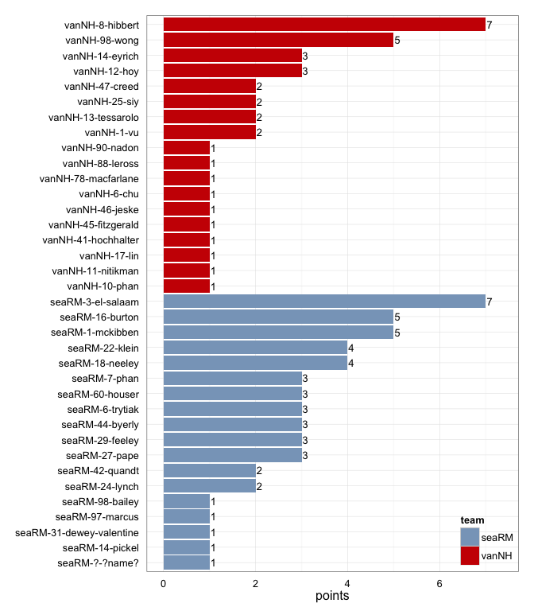
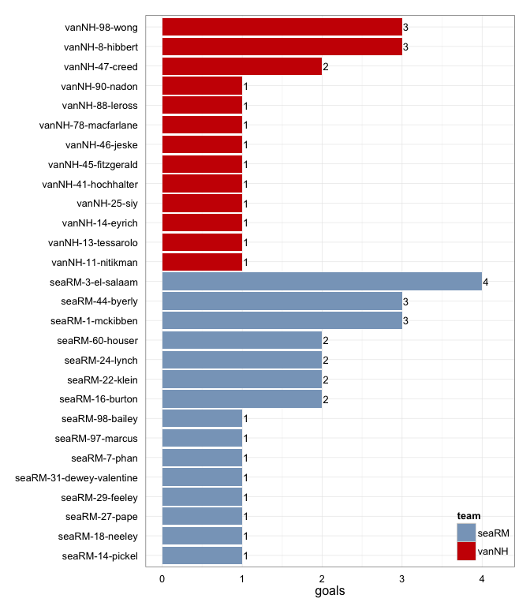
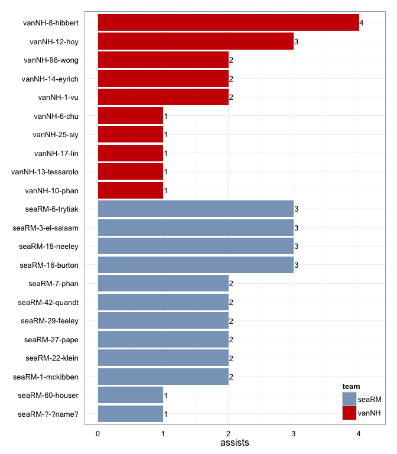
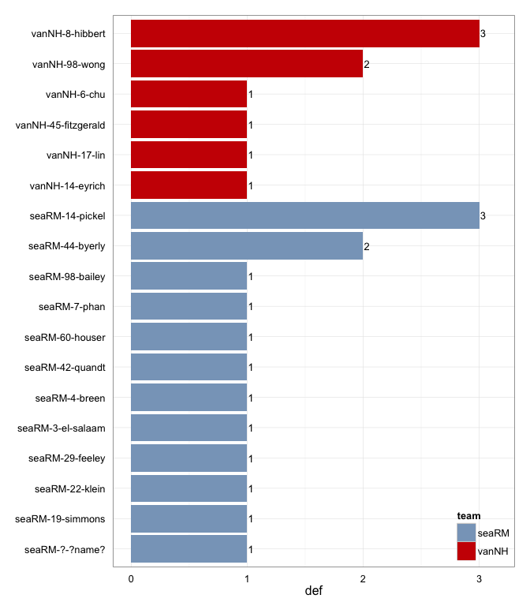

# seaRM at vanNH 2015-05-23

# seaRM 26
# vanNH 18
## game is complete

Go to ...  
  * [Scoring progression](#scoringProgression)  
  * [Player stats via figures](#pl_figs)  
  * [Player stats for seaRM](#away)  
  * [Player stats for vanNH](#home)  
  * [Data on goals, assists, D's](#selectData)  
  * [Full raw data](#rawData)  

## Scoring progression:

 point  period   begin      end       pt_duration   desc                                         seaRM   vanNH 
------  -------  ---------  --------  ------------  -------------------------------------------  ------  ------
    48  4        1:53:00    0:00:00   01:53         - no goal -                                  26      18    
    47  4        3:25:00    1:53:00   01:32         seaRM-18-neeley to seaRM-29-feeley           26      18    
    46  4        4:08:00    3:25:00   00:43         vanNH-1-vu to vanNH-88-leross                25      18    
    45  4        4:39:00    4:08:00   00:31         vanNH-10-phan to vanNH-46-jeske              25      17    
    44  4        4:57:00    4:39:00   00:18         seaRM-3-el-salaam to seaRM-24-lynch          25      16    
    43  4        5:37:00    4:57:00   00:40         vanNH-25-siy to vanNH-90-nadon               24      16    
    42  4        8:37:00    5:37:00   03:00         seaRM-7-phan to seaRM-98-bailey              24      15    
    41  4        8:37:00    8:37:00   00:00         seaRM-22-klein to seaRM-44-byerly            23      15    
    40  4        9:01:00    8:37:00   00:24         seaRM-27-pape to seaRM-16-burton             22      15    
    39  4        10:00:00   9:01:00   00:59         vanNH-98-wong to vanNH-14-eyrich             21      15    
    38  3        0:23:00    0:00:00   00:23         - no goal -                                  21      14    
    37  3        0:57:00    0:23:00   00:34         vanNH-14-eyrich to vanNH-8-hibbert           21      14    
    36  3        1:19:00    0:57:00   00:22         vanNH-12-hoy to vanNH-98-wong                21      13    
    35  3        2:27:00    1:19:00   01:08         seaRM-16-burton to seaRM-60-houser           21      12    
    34  3        2:39:00    2:27:00   00:12         vanNH-1-vu to vanNH-25-siy                   20      12    
    33  3        3:04:00    2:39:00   00:25         vanNH-98-wong to vanNH-41-hochhalter         20      11    
    32  3        5:29:00    3:04:00   02:25         seaRM-7-phan to seaRM-22-klein               20      10    
    31  3        7:29:00    5:29:00   02:00         seaRM-18-neeley to seaRM-14-pickel           19      10    
    30  3        7:53:00    7:29:00   00:24         seaRM-16-burton to seaRM-3-el-salaam         18      10    
    29  3        8:43:00    7:53:00   00:50         vanNH-8-hibbert to vanNH-11-nitikman         17      10    
    28  3        9:16:00    8:43:00   00:33         vanNH-12-hoy to vanNH-8-hibbert              17      9     
    27  3        10:00:00   9:16:00   00:44         seaRM-16-burton to seaRM-3-el-salaam         17      8     
    26  2        1:27:00    0:00:00   01:27         - no goal -                                  16      8     
    25  2        2:14:00    1:27:00   00:47         seaRM-42-quandt to seaRM-44-byerly           16      8     
    24  2        2:38:00    2:14:00   00:24         seaRM-29-feeley to seaRM-22-klein            15      8     
    23  2        3:28:00    2:38:00   00:50         seaRM-1-mckibben to seaRM-27-pape            14      8     
    22  2        3:53:00    3:28:00   00:25         vanNH-14-eyrich to vanNH-13-tessarolo        13      8     
    21  2        4:12:00    3:53:00   00:19         seaRM-27-pape to seaRM-97-marcus             13      7     
    20  2        4:29:00    4:12:00   00:17         vanNH-6-chu to vanNH-45-fitzgerald           12      7     
    19  2        5:31:00    4:29:00   01:02         seaRM-42-quandt to seaRM-44-byerly           12      6     
    18  2        5:59:00    5:31:00   00:28         seaRM-?-?name? to seaRM-18-neeley            11      6     
    17  2        6:27:00    5:59:00   00:28         seaRM-3-el-salaam to seaRM-1-mckibben        10      6     
    16  2        7:35:00    6:27:00   01:08         vanNH-8-hibbert to vanNH-98-wong             9       6     
    15  2        7:57:00    7:35:00   00:22         seaRM-1-mckibben to seaRM-3-el-salaam        9       5     
    14  2        8:32:00    7:57:00   00:35         vanNH-13-tessarolo to vanNH-78-macfarlane    8       5     
    13  2        8:56:00    8:32:00   00:24         seaRM-60-houser to seaRM-1-mckibben          8       4     
    12  2        10:00:00   8:56:00   01:04         vanNH-12-hoy to vanNH-8-hibbert              7       4     
    11  1        1:49:00    0:00:00   01:49         - no goal -                                  7       3     
    10  1        3:12:00    1:49:00   01:23         seaRM-29-feeley to seaRM-16-burton           7       3     
     9  1        3:31:00    3:12:00   00:19         seaRM-6-trytiak to seaRM-3-el-salaam         6       3     
     8  1        5:04:00    3:31:00   01:33         vanNH-17-lin to vanNH-47-creed               5       3     
     7  1        5:37:00    5:04:00   00:33         seaRM-22-klein to seaRM-31-dewey-valentine   5       2     
     6  1        5:43:00    5:37:00   00:06         seaRM-6-trytiak to seaRM-24-lynch            4       2     
     5  1        6:53:00    5:43:00   01:10         vanNH-8-hibbert to vanNH-47-creed            3       2     
     4  1        7:12:00    6:53:00   00:19         seaRM-3-el-salaam to seaRM-1-mckibben        3       1     
     3  1        7:51:00    7:12:00   00:39         vanNH-8-hibbert to vanNH-98-wong             2       1     
     2  1        8:44:00    7:51:00   00:53         seaRM-18-neeley to seaRM-7-phan              2       0     
     1  1        10:00:00   8:44:00   01:16         seaRM-6-trytiak to seaRM-60-houser           1       0     

## Player stats via figures:

### Points = goals + assists

 

### Goals

 

### Assists

 

### D's
 

## Player stats for seaRM :

points = goals + assists  
tables sorted in decreasing order based on points (then goals, assists, Ds)  
Ds = total of plain ol' D's + interceptions (D), hand blocks (HB), and foot blocks (FB)  
stats are cumulative for this game

     player     last               points   comp_pct   goals   assists   throws   completions   catches   def   drop
---  ---------  ----------------  -------  ---------  ------  --------  -------  ------------  --------  ----  -----
1    seaRM-3    el-salaam               7       0.82       4         3       11             9        14     1      0
2    seaRM-1    mckibben                5       0.96       3         2       24            23        17     0      0
3    seaRM-16   burton                  5       1.00       2         3       17            17        18     0      0
4    seaRM-22   klein                   4       0.67       2         2        6             4         8     1      0
5    seaRM-18   neeley                  4       1.00       1         3        6             6         7     0      0
6    seaRM-44   byerly                  3       0.67       3         0        3             2         6     2      0
7    seaRM-60   houser                  3       1.00       2         1        8             8        10     1      0
8    seaRM-29   feeley                  3       0.88       1         2       25            22        18     1      1
9    seaRM-7    phan                    3       0.86       1         2       14            12         8     1      0
10   seaRM-27   pape                    3       0.93       1         2       15            14        10     0      0
11   seaRM-6    trytiak                 3       0.90       0         3       31            28        27     0      0
12   seaRM-24   lynch                   2       1.00       2         0       10            10        12     0      0
13   seaRM-42   quandt                  2       1.00       0         2        7             7         6     1      0
14   seaRM-14   pickel                  1       0.85       1         0       13            11        11     3      0
15   seaRM-98   bailey                  1       0.83       1         0        6             5         7     1      0
16   seaRM-31   dewey-valentine         1       1.00       1         0        7             7         8     0      0
17   seaRM-97   marcus                  1         NA       1         0        0             0         1     0      0
18   seaRM-?    ?name?                  1       1.00       0         1        6             6         4     1      0
19   seaRM-19   simons                  0       0.75       0         0        4             3         3     1      0
20   seaRM-4    breen                   0       1.00       0         0        2             2         2     1      0
21   seaRM-0    rupp                    0       0.91       0         0       11            10         9     0      0
22   seaRM-10   laws                    0       1.00       0         0        1             1         1     0      0
23   seaRM-17   bender                  0       1.00       0         0        1             1         1     0      0
24   seaRM-51   entz                    0       1.00       0         0        1             1         1     0      0

## Player stats for vanNH :

points = goals + assists  
tables sorted in decreasing order based on points (then goals, assists, Ds)  
Ds = total of plain ol' D's + interceptions (D), hand blocks (HB), and foot blocks (FB)  
stats are cumulative for this game

     player     last          points   comp_pct   goals   assists   throws   completions   catches   def   drop
---  ---------  -----------  -------  ---------  ------  --------  -------  ------------  --------  ----  -----
25   vanNH-8    hibbert            7       0.93       3         4       28            26        30     3      0
26   vanNH-98   wong               5       0.87       3         2       15            13        17     2      0
27   vanNH-14   eyrich             3       0.73       1         2       15            11        13     1      1
28   vanNH-12   hoy                3       0.95       0         3       40            38        27     0      0
29   vanNH-47   creed              2       0.85       2         0       40            34        29     0      2
30   vanNH-13   tessarolo          2       0.83       1         1       12            10        12     0      0
31   vanNH-25   siy                2       1.00       1         1        4             4         5     0      0
32   vanNH-1    vu                 2       0.92       0         2       12            11        10     0      0
33   vanNH-45   fitzgerald         1       0.67       1         0       12             8        10     1      0
34   vanNH-11   nitikman           1       1.00       1         0        9             9         9     0      0
35   vanNH-41   hochhalter         1       0.67       1         0        3             2         3     0      0
36   vanNH-46   jeske              1       1.00       1         0        3             3         4     0      0
37   vanNH-78   macfarlane         1       0.92       1         0       12            11        13     0      0
38   vanNH-88   leross             1         NA       1         0        0             0         1     0      0
39   vanNH-90   nadon              1       1.00       1         0        7             7         5     0      0
40   vanNH-17   lin                1       0.88       0         1        8             7         6     1      0
41   vanNH-6    chu                1       0.86       0         1        7             6         7     1      0
42   vanNH-10   phan               1       1.00       0         1        1             1         1     0      0
43   vanNH-21   loach              0       0.86       0         0        7             6         3     0      0
44   vanNH-32   yi                 0       1.00       0         0        1             1         0     0      0
45   vanNH-40   davidson           0       1.00       0         0        1             1         1     0      0
46   vanNH-49   hayduk             0       0.62       0         0       13             8        10     0      1
47   vanNH-66   aponte             0       0.75       0         0        4             3         4     0      1

## Raw data on select events (goals, assists, D's):

 point   period  pull_team    event   poss_abs   poss_rel  poss_team   pl_team   pl_pnum   pl_code   pl_lname          player                      seaRM   vanNH
------  -------  ----------  ------  ---------  ---------  ----------  --------  --------  --------  ----------------  -------------------------  ------  ------
     1        1  vanNH           18          1          1  seaRM       seaRM     6         A         trytiak           seaRM-6-trytiak                 1       0
     1        1  vanNH           19          1          1  seaRM       seaRM     60        G         houser            seaRM-60-houser                 1       0
     2        1  seaRM            8          2          1  vanNH       seaRM     ?         D         ?name?            seaRM-?-?name?                  2       0
     2        1  seaRM           12          3          2  seaRM       seaRM     18        A         neeley            seaRM-18-neeley                 2       0
     2        1  seaRM           13          3          2  seaRM       seaRM     7         G         phan              seaRM-7-phan                    2       0
     3        1  seaRM            9          4          1  vanNH       vanNH     8         A         hibbert           vanNH-8-hibbert                 2       1
     3        1  seaRM           11          4          1  vanNH       vanNH     98        G         wong              vanNH-98-wong                   2       1
     4        1  vanNH            5          5          1  seaRM       seaRM     3         LA        el-salaam         seaRM-3-el-salaam               3       1
     4        1  vanNH            6          5          1  seaRM       seaRM     1         G         mckibben          seaRM-1-mckibben                3       1
     5        1  seaRM            6          6          1  vanNH       seaRM     44        D         byerly            seaRM-44-byerly                 3       2
     5        1  seaRM           11          8          3  vanNH       vanNH     8         A         hibbert           vanNH-8-hibbert                 3       2
     5        1  seaRM           12          8          3  vanNH       vanNH     47        G         creed             vanNH-47-creed                  3       2
     6        1  vanNH            3          9          1  seaRM       seaRM     6         A         trytiak           seaRM-6-trytiak                 4       2
     6        1  vanNH            4          9          1  seaRM       seaRM     24        G         lynch             seaRM-24-lynch                  4       2
     7        1  seaRM           10         11          2  seaRM       seaRM     22        A         klein             seaRM-22-klein                  5       2
     7        1  seaRM           11         11          2  seaRM       seaRM     31        G         dewey-valentine   seaRM-31-dewey-valentine        5       2
     8        1  seaRM           14         14          3  vanNH       vanNH     17        A         lin               vanNH-17-lin                    5       3
     8        1  seaRM           15         14          3  vanNH       vanNH     47        G         creed             vanNH-47-creed                  5       3
     9        1  vanNH            6         15          1  seaRM       seaRM     6         A         trytiak           seaRM-6-trytiak                 6       3
     9        1  vanNH            7         15          1  seaRM       seaRM     3         G         el-salaam         seaRM-3-el-salaam               6       3
    10        1  seaRM           16         19          4  seaRM       seaRM     29        A         feeley            seaRM-29-feeley                 7       3
    10        1  seaRM           17         19          4  seaRM       seaRM     16        G         burton            seaRM-16-burton                 7       3
    11        1  seaRM            7         21          2  seaRM       vanNH     14        D         eyrich            vanNH-14-eyrich                 7       3
    11        1  seaRM           13         22          3  vanNH       seaRM     7         D         phan              seaRM-7-phan                    7       3
    11        1  seaRM           16         23          4  seaRM       vanNH     98        D         wong              vanNH-98-wong                   7       3
    11        1  seaRM           21         24          5  vanNH       seaRM     14        D         pickel            seaRM-14-pickel                 7       3
    12        2  seaRM            4         25          1  vanNH       seaRM     14        D         pickel            seaRM-14-pickel                 7       4
    12        2  seaRM            7         26          2  seaRM       vanNH     98        D         wong              vanNH-98-wong                   7       4
    12        2  seaRM           13         27          3  vanNH       vanNH     12        A         hoy               vanNH-12-hoy                    7       4
    12        2  seaRM           14         27          3  vanNH       vanNH     8         G         hibbert           vanNH-8-hibbert                 7       4
    13        2  vanNH            6         28          1  seaRM       seaRM     60        A         houser            seaRM-60-houser                 8       4
    13        2  vanNH            7         28          1  seaRM       seaRM     1         G         mckibben          seaRM-1-mckibben                8       4
    14        2  seaRM           10         29          1  vanNH       vanNH     13        A         tessarolo         vanNH-13-tessarolo              8       5
    14        2  seaRM           11         29          1  vanNH       vanNH     78        G         macfarlane        vanNH-78-macfarlane             8       5
    15        2  vanNH            5         30          1  seaRM       seaRM     1         A         mckibben          seaRM-1-mckibben                9       5
    15        2  vanNH            6         30          1  seaRM       seaRM     3         G         el-salaam         seaRM-3-el-salaam               9       5
    16        2  seaRM           18         31          1  vanNH       vanNH     8         A         hibbert           vanNH-8-hibbert                 9       6
    16        2  seaRM           19         31          1  vanNH       vanNH     98        G         wong              vanNH-98-wong                   9       6
    17        2  vanNH            3         32          1  seaRM       vanNH     8         D         hibbert           vanNH-8-hibbert                10       6
    17        2  vanNH            7         33          2  vanNH       seaRM     3         D         el-salaam         seaRM-3-el-salaam              10       6
    17        2  vanNH            8         34          3  seaRM       seaRM     3         PUA       el-salaam         seaRM-3-el-salaam              10       6
    17        2  vanNH            9         34          3  seaRM       seaRM     1         G         mckibben          seaRM-1-mckibben               10       6
    18        2  seaRM            7         36          2  seaRM       seaRM     ?         A         ?name?            seaRM-?-?name?                 11       6
    18        2  seaRM            8         36          2  seaRM       seaRM     18        G         neeley            seaRM-18-neeley                11       6
    19        2  seaRM            9         37          1  vanNH       seaRM     19        D         simons            seaRM-19-simons                12       6
    19        2  seaRM           15         38          2  seaRM       seaRM     42        A         quandt            seaRM-42-quandt                12       6
    19        2  seaRM           16         38          2  seaRM       seaRM     44        G         byerly            seaRM-44-byerly                12       6
    20        2  seaRM            6         39          1  vanNH       vanNH     6         A         chu               vanNH-6-chu                    12       7
    20        2  seaRM            7         39          1  vanNH       vanNH     45        G         fitzgerald        vanNH-45-fitzgerald            12       7
    21        2  vanNH            5         40          1  seaRM       seaRM     27        A         pape              seaRM-27-pape                  13       7
    21        2  vanNH            6         40          1  seaRM       seaRM     97        G         marcus            seaRM-97-marcus                13       7
    22        2  seaRM            6         41          1  vanNH       vanNH     14        A         eyrich            vanNH-14-eyrich                13       8
    22        2  seaRM            7         41          1  vanNH       vanNH     13        G         tessarolo         vanNH-13-tessarolo             13       8
    23        2  vanNH           10         42          1  seaRM       seaRM     1         A         mckibben          seaRM-1-mckibben               14       8
    23        2  vanNH           11         42          1  seaRM       seaRM     27        G         pape              seaRM-27-pape                  14       8
    24        2  seaRM            4         43          1  vanNH       seaRM     22        D         klein             seaRM-22-klein                 15       8
    24        2  seaRM            6         44          2  seaRM       seaRM     29        PUA       feeley            seaRM-29-feeley                15       8
    24        2  seaRM            7         44          2  seaRM       seaRM     22        G         klein             seaRM-22-klein                 15       8
    25        2  seaRM           10         46          2  seaRM       seaRM     42        A         quandt            seaRM-42-quandt                16       8
    25        2  seaRM           11         46          2  seaRM       seaRM     44        G         byerly            seaRM-44-byerly                16       8
    26        2  seaRM           NA         NA         NA  NA          NA        NA        NA        NA                NA-NA-NA                       16       8
    27        3  vanNH            9         50          1  seaRM       seaRM     16        A         burton            seaRM-16-burton                17       8
    27        3  vanNH           10         50          1  seaRM       seaRM     3         G         el-salaam         seaRM-3-el-salaam              17       8
    28        3  seaRM            9         51          1  vanNH       vanNH     12        A         hoy               vanNH-12-hoy                   17       9
    28        3  seaRM           10         51          1  vanNH       vanNH     8         G         hibbert           vanNH-8-hibbert                17       9
    29        3  vanNH            3         52          1  seaRM       vanNH     17        D         lin               vanNH-17-lin                   17      10
    29        3  vanNH           12         53          2  vanNH       seaRM     44        D         byerly            seaRM-44-byerly                17      10
    29        3  vanNH           14         55          4  vanNH       vanNH     8         PUA       hibbert           vanNH-8-hibbert                17      10
    29        3  vanNH           15         55          4  vanNH       vanNH     11        G         nitikman          vanNH-11-nitikman              17      10
    30        3  vanNH            6         56          1  seaRM       seaRM     16        A         burton            seaRM-16-burton                18      10
    30        3  vanNH            7         56          1  seaRM       seaRM     3         G         el-salaam         seaRM-3-el-salaam              18      10
    31        3  seaRM           15         58          2  seaRM       vanNH     8         D         hibbert           vanNH-8-hibbert                19      10
    31        3  seaRM           19         59          3  vanNH       seaRM     29        D         feeley            seaRM-29-feeley                19      10
    31        3  seaRM           24         60          4  seaRM       seaRM     18        A         neeley            seaRM-18-neeley                19      10
    31        3  seaRM           26         60          4  seaRM       seaRM     14        G         pickel            seaRM-14-pickel                19      10
    32        3  seaRM           11         61          1  vanNH       seaRM     14        D         pickel            seaRM-14-pickel                20      10
    32        3  seaRM           39         64          4  seaRM       seaRM     7         A         phan              seaRM-7-phan                   20      10
    32        3  seaRM           40         64          4  seaRM       seaRM     22        G         klein             seaRM-22-klein                 20      10
    33        3  seaRM            8         65          1  vanNH       vanNH     98        A         wong              vanNH-98-wong                  20      11
    33        3  seaRM            9         65          1  vanNH       vanNH     41        G         hochhalter        vanNH-41-hochhalter            20      11
    34        3  vanNH            3         66          1  seaRM       vanNH     6         D         chu               vanNH-6-chu                    20      12
    34        3  vanNH            4         67          2  vanNH       vanNH     1         A         vu                vanNH-1-vu                     20      12
    34        3  vanNH            5         67          2  vanNH       vanNH     25        G         siy               vanNH-25-siy                   20      12
    35        3  vanNH           22         68          1  seaRM       seaRM     16        A         burton            seaRM-16-burton                21      12
    35        3  vanNH           23         68          1  seaRM       seaRM     60        G         houser            seaRM-60-houser                21      12
    36        3  seaRM            8         69          1  vanNH       vanNH     12        A         hoy               vanNH-12-hoy                   21      13
    36        3  seaRM            9         69          1  vanNH       vanNH     98        G         wong              vanNH-98-wong                  21      13
    37        3  vanNH            7         70          1  seaRM       vanNH     45        D         fitzgerald        vanNH-45-fitzgerald            21      14
    37        3  vanNH           10         71          2  vanNH       vanNH     14        A         eyrich            vanNH-14-eyrich                21      14
    37        3  vanNH           11         71          2  vanNH       vanNH     8         G         hibbert           vanNH-8-hibbert                21      14
    38        3  vanNH            8         72          1  seaRM       vanNH     8         D         hibbert           vanNH-8-hibbert                21      14
    39        4  seaRM           16         73          1  vanNH       vanNH     98        A         wong              vanNH-98-wong                  21      15
    39        4  seaRM           17         73          1  vanNH       vanNH     14        G         eyrich            vanNH-14-eyrich                21      15
    40        4  vanNH            9         74          1  seaRM       seaRM     27        A         pape              seaRM-27-pape                  22      15
    40        4  vanNH           10         74          1  seaRM       seaRM     16        G         burton            seaRM-16-burton                22      15
    41        4  seaRM            6         75          1  vanNH       seaRM     42        D         quandt            seaRM-42-quandt                23      15
    41        4  seaRM           16         76          2  seaRM       seaRM     22        A         klein             seaRM-22-klein                 23      15
    41        4  seaRM           17         76          2  seaRM       seaRM     44        G         byerly            seaRM-44-byerly                23      15
    42        4  seaRM            5         77          1  vanNH       seaRM     98        D         bailey            seaRM-98-bailey                24      15
    42        4  seaRM           26         80          4  seaRM       seaRM     7         A         phan              seaRM-7-phan                   24      15
    42        4  seaRM           27         80          4  seaRM       seaRM     98        G         bailey            seaRM-98-bailey                24      15
    43        4  seaRM           12         81          1  vanNH       vanNH     25        A         siy               vanNH-25-siy                   24      16
    43        4  seaRM           13         81          1  vanNH       vanNH     90        G         nadon             vanNH-90-nadon                 24      16
    44        4  vanNH            4         82          1  seaRM       seaRM     3         A         el-salaam         seaRM-3-el-salaam              25      16
    44        4  vanNH            5         82          1  seaRM       seaRM     24        G         lynch             seaRM-24-lynch                 25      16
    45        4  seaRM            9         83          1  vanNH       vanNH     10        A         phan              vanNH-10-phan                  25      17
    45        4  seaRM           10         83          1  vanNH       vanNH     46        G         jeske             vanNH-46-jeske                 25      17
    46        4  vanNH            8         85          2  vanNH       vanNH     1         A         vu                vanNH-1-vu                     25      18
    46        4  vanNH            9         85          2  vanNH       vanNH     88        G         leross            vanNH-88-leross                25      18
    47        4  vanNH           11         87          2  vanNH       seaRM     60        D         houser            seaRM-60-houser                26      18
    47        4  vanNH           14         88          3  seaRM       seaRM     18        A         neeley            seaRM-18-neeley                26      18
    47        4  vanNH           16         88          3  seaRM       seaRM     29        G         feeley            seaRM-29-feeley                26      18
    48        4  seaRM           19         91          3  vanNH       seaRM     4         D         breen             seaRM-4-breen                  26      18

## Full raw data:

__Note: just for display purposes.__ Raw data in more useful forms can be found in the [GitHub repository](https://github.com/jennybc/vanNH). Find the game you're interested in in the `games` subdirectory.

 period   point  pull_team    event   poss_abs   poss_rel  poss_team   pl_team   pl_pnum   pl_code 
-------  ------  ----------  ------  ---------  ---------  ----------  --------  --------  --------
      1       1  vanNH            1          1          1  seaRM       vanNH     41        P       
      1       1  vanNH            2          1          1  seaRM       seaRM     ?         PU      
      1       1  vanNH            3          1          1  seaRM       seaRM     6                 
      1       1  vanNH            4          1          1  seaRM       seaRM     27                
      1       1  vanNH            5          1          1  seaRM       seaRM     60                
      1       1  vanNH            6          1          1  seaRM       seaRM     6                 
      1       1  vanNH            7          1          1  seaRM       seaRM     1                 
      1       1  vanNH            8          1          1  seaRM       seaRM     60                
      1       1  vanNH            9          1          1  seaRM       seaRM     27                
      1       1  vanNH           10          1          1  seaRM       seaRM     1                 
      1       1  vanNH           11          1          1  seaRM       seaRM     6                 
      1       1  vanNH           12          1          1  seaRM       seaRM     16                
      1       1  vanNH           13          1          1  seaRM       seaRM     27                
      1       1  vanNH           14          1          1  seaRM       seaRM     16                
      1       1  vanNH           15          1          1  seaRM       seaRM     60                
      1       1  vanNH           16          1          1  seaRM       seaRM     6                 
      1       1  vanNH           17          1          1  seaRM       seaRM     16                
      1       1  vanNH           18          1          1  seaRM       seaRM     6         A       
      1       1  vanNH           19          1          1  seaRM       seaRM     60        G       
      1       2  seaRM            1          2          1  vanNH       seaRM     90        P       
      1       2  seaRM            2          2          1  vanNH       vanNH     47        PU      
      1       2  seaRM            3          2          1  vanNH       vanNH     12                
      1       2  seaRM            4          2          1  vanNH       vanNH     8                 
      1       2  seaRM            5          2          1  vanNH       vanNH     12                
      1       2  seaRM            6          2          1  vanNH       vanNH     21                
      1       2  seaRM            7          2          1  vanNH       vanNH     14                
      1       2  seaRM            8          2          1  vanNH       seaRM     ?         D       
      1       2  seaRM            9          3          2  seaRM       seaRM     ?         PU      
      1       2  seaRM           10          3          2  seaRM       seaRM     22                
      1       2  seaRM           11          3          2  seaRM       seaRM     44                
      1       2  seaRM           12          3          2  seaRM       seaRM     18        A       
      1       2  seaRM           13          3          2  seaRM       seaRM     7         G       
      1       3  seaRM            1          4          1  vanNH       seaRM     22        P       
      1       3  seaRM            2          4          1  vanNH       vanNH     21        PU      
      1       3  seaRM            3          4          1  vanNH       vanNH     12                
      1       3  seaRM            4          4          1  vanNH       vanNH     47                
      1       3  seaRM            5          4          1  vanNH       vanNH     13                
      1       3  seaRM            6          4          1  vanNH       vanNH     17                
      1       3  seaRM            7          4          1  vanNH       vanNH     98                
      1       3  seaRM            8          4          1  vanNH       vanNH     12                
      1       3  seaRM            9          4          1  vanNH       vanNH     8         A       
      1       3  seaRM           10          4          1  vanNH       seaRM     22        F       
      1       3  seaRM           11          4          1  vanNH       vanNH     98        G       
      1       4  vanNH            1          5          1  seaRM       vanNH     41        P       
      1       4  vanNH            2          5          1  seaRM       seaRM     1         PU      
      1       4  vanNH            3          5          1  seaRM       seaRM     6                 
      1       4  vanNH            4          5          1  seaRM       seaRM     16                
      1       4  vanNH            5          5          1  seaRM       seaRM     3         LA      
      1       4  vanNH            6          5          1  seaRM       seaRM     1         G       
      1       5  seaRM            1          6          1  vanNH       seaRM     44        P       
      1       5  seaRM            2          6          1  vanNH       vanNH     12        PU      
      1       5  seaRM            3          6          1  vanNH       vanNH     21                
      1       5  seaRM            4          6          1  vanNH       vanNH     12                
      1       5  seaRM            5          6          1  vanNH       vanNH     8                 
      1       5  seaRM            6          6          1  vanNH       seaRM     44        D       
      1       5  seaRM            7          6          1  vanNH       vanNH     47                
      1       5  seaRM            8          7          2  seaRM       seaRM     14        PU      
      1       5  seaRM            9          7          2  seaRM       seaRM     98                
      1       5  seaRM           10          8          3  vanNH       vanNH     21        PU      
      1       5  seaRM           11          8          3  vanNH       vanNH     8         A       
      1       5  seaRM           12          8          3  vanNH       vanNH     47        G       
      1       6  vanNH            1          9          1  seaRM       vanNH     45        P       
      1       6  vanNH            2          9          1  seaRM       seaRM     1         PU      
      1       6  vanNH            3          9          1  seaRM       seaRM     6         A       
      1       6  vanNH            4          9          1  seaRM       seaRM     24        G       
      1       7  seaRM            1         10          1  vanNH       seaRM     42        P       
      1       7  seaRM            2         10          1  vanNH       vanNH     12        PU      
      1       7  seaRM            3         10          1  vanNH       vanNH     49                
      1       7  seaRM            4         10          1  vanNH       vanNH     8         TD      
      1       7  seaRM            5         11          2  seaRM       seaRM     7         PU      
      1       7  seaRM            6         11          2  seaRM       seaRM     1                 
      1       7  seaRM            7         11          2  seaRM       seaRM     7                 
      1       7  seaRM            8         11          2  seaRM       seaRM     ?                 
      1       7  seaRM            9         11          2  seaRM       seaRM     31                
      1       7  seaRM           10         11          2  seaRM       seaRM     22        A       
      1       7  seaRM           11         11          2  seaRM       seaRM     31        G       
      1       8  seaRM            1         12          1  vanNH       seaRM     98        P       
      1       8  seaRM            2         12          1  vanNH       vanNH     12        PU      
      1       8  seaRM            3         12          1  vanNH       vanNH     21                
      1       8  seaRM            4         12          1  vanNH       vanNH     12                
      1       8  seaRM            5         12          1  vanNH       vanNH     8                 
      1       8  seaRM            6         12          1  vanNH       vanNH     17                
      1       8  seaRM            7         12          1  vanNH       vanNH     14                
      1       8  seaRM            8         12          1  vanNH       vanNH     13        TD      
      1       8  seaRM            9         13          2  seaRM       seaRM     7         PU      
      1       8  seaRM           10         13          2  seaRM       seaRM     14        VST     
      1       8  seaRM           11         14          3  vanNH       vanNH     21        PU      
      1       8  seaRM           12         14          3  vanNH       vanNH     12                
      1       8  seaRM           13         14          3  vanNH       vanNH     8                 
      1       8  seaRM           14         14          3  vanNH       vanNH     17        A       
      1       8  seaRM           15         14          3  vanNH       vanNH     47        G       
      1       9  vanNH            1         15          1  seaRM       vanNH     41        P       
      1       9  vanNH            2         15          1  seaRM       seaRM     1         PU      
      1       9  vanNH            3         15          1  seaRM       seaRM     6                 
      1       9  vanNH            4         15          1  seaRM       seaRM     24                
      1       9  vanNH            5         15          1  seaRM       seaRM     16                
      1       9  vanNH            6         15          1  seaRM       seaRM     6         A       
      1       9  vanNH            7         15          1  seaRM       seaRM     3         G       
      1      10  seaRM            1         16          1  vanNH       seaRM     42        P       
      1      10  seaRM            2         16          1  vanNH       vanNH     21        PU      
      1      10  seaRM            3         17          2  seaRM       seaRM     29        PU      
      1      10  seaRM            4         17          2  seaRM       seaRM     31                
      1      10  seaRM            5         17          2  seaRM       seaRM     29                
      1      10  seaRM            6         17          2  seaRM       seaRM     31                
      1      10  seaRM            7         17          2  seaRM       seaRM     14                
      1      10  seaRM            8         17          2  seaRM       seaRM     22                
      1      10  seaRM            9         18          3  vanNH       vanNH     47        PU      
      1      10  seaRM           10         18          3  vanNH       vanNH     98        TD      
      1      10  seaRM           11         19          4  seaRM       seaRM     29        PU      
      1      10  seaRM           12         19          4  seaRM       seaRM     31        TO      
      1      10  seaRM           13         19          4  seaRM       seaRM     6         PU      
      1      10  seaRM           14         19          4  seaRM       seaRM     29                
      1      10  seaRM           15         19          4  seaRM       seaRM     16                
      1      10  seaRM           16         19          4  seaRM       seaRM     29        A       
      1      10  seaRM           17         19          4  seaRM       seaRM     16        G       
      1      11  seaRM            1         20          1  vanNH       seaRM     50        P       
      1      11  seaRM            2         20          1  vanNH       vanNH     47        PU      
      1      11  seaRM            3         20          1  vanNH       vanNH     49                
      1      11  seaRM            4         21          2  seaRM       seaRM     7         PU      
      1      11  seaRM            5         21          2  seaRM       seaRM     31                
      1      11  seaRM            6         21          2  seaRM       seaRM     19                
      1      11  seaRM            7         21          2  seaRM       vanNH     14        D       
      1      11  seaRM            8         22          3  vanNH       vanNH     14        PU      
      1      11  seaRM            9         22          3  vanNH       vanNH     47                
      1      11  seaRM           10         22          3  vanNH       vanNH     12                
      1      11  seaRM           11         22          3  vanNH       vanNH     49                
      1      11  seaRM           12         22          3  vanNH       vanNH     98                
      1      11  seaRM           13         22          3  vanNH       seaRM     7         D       
      1      11  seaRM           14         22          3  vanNH       vanNH     14                
      1      11  seaRM           15         23          4  seaRM       seaRM     7         PU      
      1      11  seaRM           16         23          4  seaRM       vanNH     98        D       
      1      11  seaRM           17         24          5  vanNH       vanNH     98        PU      
      1      11  seaRM           18         24          5  vanNH       vanNH     78                
      1      11  seaRM           19         24          5  vanNH       vanNH     98                
      1      11  seaRM           20         24          5  vanNH       vanNH     49                
      1      11  seaRM           21         24          5  vanNH       seaRM     14        D       
      1      11  seaRM           22         24          5  vanNH       vanNH     14                
      2      12  seaRM            1         25          1  vanNH       seaRM     44        P       
      2      12  seaRM            2         25          1  vanNH       vanNH     12        PU      
      2      12  seaRM            3         25          1  vanNH       vanNH     47                
      2      12  seaRM            4         25          1  vanNH       seaRM     14        D       
      2      12  seaRM            5         25          1  vanNH       vanNH     8                 
      2      12  seaRM            6         26          2  seaRM       seaRM     14        PU      
      2      12  seaRM            7         26          2  seaRM       vanNH     98        D       
      2      12  seaRM            8         27          3  vanNH       vanNH     12        PU      
      2      12  seaRM            9         27          3  vanNH       vanNH     47                
      2      12  seaRM           10         27          3  vanNH       vanNH     8                 
      2      12  seaRM           11         27          3  vanNH       vanNH     14                
      2      12  seaRM           12         27          3  vanNH       vanNH     98                
      2      12  seaRM           13         27          3  vanNH       vanNH     12        A       
      2      12  seaRM           14         27          3  vanNH       vanNH     8         G       
      2      13  vanNH            1         28          1  seaRM       vanNH     41        P       
      2      13  vanNH            2         28          1  seaRM       seaRM     27        PU      
      2      13  vanNH            3         28          1  seaRM       seaRM     6                 
      2      13  vanNH            4         28          1  seaRM       seaRM     24                
      2      13  vanNH            5         28          1  seaRM       seaRM     16                
      2      13  vanNH            6         28          1  seaRM       seaRM     60        A       
      2      13  vanNH            7         28          1  seaRM       seaRM     1         G       
      2      14  seaRM            1         29          1  vanNH       seaRM     90        P       
      2      14  seaRM            2         29          1  vanNH       vanNH     12        PU      
      2      14  seaRM            3         29          1  vanNH       vanNH     47                
      2      14  seaRM            4         29          1  vanNH       vanNH     12                
      2      14  seaRM            5         29          1  vanNH       vanNH     8                 
      2      14  seaRM            6         29          1  vanNH       vanNH     13                
      2      14  seaRM            7         29          1  vanNH       vanNH     47                
      2      14  seaRM            8         29          1  vanNH       vanNH     98                
      2      14  seaRM            9         29          1  vanNH       vanNH     47                
      2      14  seaRM           10         29          1  vanNH       vanNH     13        A       
      2      14  seaRM           11         29          1  vanNH       vanNH     78        G       
      2      15  vanNH            1         30          1  seaRM       vanNH     41        P       
      2      15  vanNH            2         30          1  seaRM       seaRM     1         PU      
      2      15  vanNH            3         30          1  seaRM       seaRM     3                 
      2      15  vanNH            4         30          1  seaRM       seaRM     24                
      2      15  vanNH            5         30          1  seaRM       seaRM     1         A       
      2      15  vanNH            6         30          1  seaRM       seaRM     3         G       
      2      16  seaRM            1         31          1  vanNH       seaRM     42        P       
      2      16  seaRM            2         31          1  vanNH       vanNH     47        PU      
      2      16  seaRM            3         31          1  vanNH       vanNH     12                
      2      16  seaRM            4         31          1  vanNH       vanNH     8                 
      2      16  seaRM            5         31          1  vanNH       vanNH     98                
      2      16  seaRM            6         31          1  vanNH       vanNH     13                
      2      16  seaRM            7         31          1  vanNH       vanNH     8                 
      2      16  seaRM            8         31          1  vanNH       vanNH     98                
      2      16  seaRM            9         31          1  vanNH       vanNH     78                
      2      16  seaRM           10         31          1  vanNH       vanNH     8                 
      2      16  seaRM           11         31          1  vanNH       vanNH     14                
      2      16  seaRM           12         31          1  vanNH       vanNH     47                
      2      16  seaRM           13         31          1  vanNH       vanNH     12                
      2      16  seaRM           14         31          1  vanNH       vanNH     98                
      2      16  seaRM           15         31          1  vanNH       vanNH     12                
      2      16  seaRM           16         31          1  vanNH       vanNH     8                 
      2      16  seaRM           17         31          1  vanNH       vanNH     12                
      2      16  seaRM           18         31          1  vanNH       vanNH     8         A       
      2      16  seaRM           19         31          1  vanNH       vanNH     98        G       
      2      17  vanNH            1         32          1  seaRM       vanNH     45        P       
      2      17  vanNH            2         32          1  seaRM       seaRM     1         PU      
      2      17  vanNH            3         32          1  seaRM       vanNH     8         D       
      2      17  vanNH            4         32          1  seaRM       seaRM     6                 
      2      17  vanNH            5         33          2  vanNH       vanNH     45        PU      
      2      17  vanNH            6         33          2  vanNH       vanNH     41                
      2      17  vanNH            7         33          2  vanNH       seaRM     3         D       
      2      17  vanNH            8         34          3  seaRM       seaRM     3         PUA     
      2      17  vanNH            9         34          3  seaRM       seaRM     1         G       
      2      18  seaRM            1         35          1  vanNH       seaRM     98        P       
      2      18  seaRM            2         35          1  vanNH       vanNH     47        PU      
      2      18  seaRM            3         35          1  vanNH       vanNH     12                
      2      18  seaRM            4         35          1  vanNH       vanNH     47                
      2      18  seaRM            5         35          1  vanNH       vanNH     13        TD      
      2      18  seaRM            6         36          2  seaRM       seaRM     29        PU      
      2      18  seaRM            7         36          2  seaRM       seaRM     ?         A       
      2      18  seaRM            8         36          2  seaRM       seaRM     18        G       
      2      19  seaRM            1         37          1  vanNH       seaRM     42        P       
      2      19  seaRM            2         37          1  vanNH       vanNH     47        PU      
      2      19  seaRM            3         37          1  vanNH       vanNH     12                
      2      19  seaRM            4         37          1  vanNH       seaRM     29        F       
      2      19  seaRM            5         37          1  vanNH       vanNH     98                
      2      19  seaRM            6         37          1  vanNH       vanNH     8                 
      2      19  seaRM            7         37          1  vanNH       vanNH     17                
      2      19  seaRM            8         37          1  vanNH       vanNH     12                
      2      19  seaRM            9         37          1  vanNH       seaRM     19        D       
      2      19  seaRM           10         37          1  vanNH       vanNH     17                
      2      19  seaRM           11         38          2  seaRM       seaRM     7         PU      
      2      19  seaRM           12         38          2  seaRM       seaRM     29                
      2      19  seaRM           13         38          2  seaRM       seaRM     19                
      2      19  seaRM           14         38          2  seaRM       seaRM     7                 
      2      19  seaRM           15         38          2  seaRM       seaRM     42        A       
      2      19  seaRM           16         38          2  seaRM       seaRM     44        G       
      2      20  seaRM            1         39          1  vanNH       seaRM     6         P       
      2      20  seaRM            2         39          1  vanNH       vanNH     12        PU      
      2      20  seaRM            3         39          1  vanNH       vanNH     47                
      2      20  seaRM            4         39          1  vanNH       vanNH     13                
      2      20  seaRM            5         39          1  vanNH       vanNH     78                
      2      20  seaRM            6         39          1  vanNH       vanNH     6         A       
      2      20  seaRM            7         39          1  vanNH       vanNH     45        G       
      2      21  vanNH            1         40          1  seaRM       vanNH     8         P       
      2      21  vanNH            2         40          1  seaRM       seaRM     27        PU      
      2      21  vanNH            3         40          1  seaRM       seaRM     24                
      2      21  vanNH            4         40          1  seaRM       seaRM     1                 
      2      21  vanNH            5         40          1  seaRM       seaRM     27        A       
      2      21  vanNH            6         40          1  seaRM       seaRM     97        G       
      2      22  seaRM            1         41          1  vanNH       seaRM     42        P       
      2      22  seaRM            2         41          1  vanNH       vanNH     12        PU      
      2      22  seaRM            3         41          1  vanNH       vanNH     14                
      2      22  seaRM            4         41          1  vanNH       vanNH     47                
      2      22  seaRM            5         41          1  vanNH       vanNH     78                
      2      22  seaRM            6         41          1  vanNH       vanNH     14        A       
      2      22  seaRM            7         41          1  vanNH       vanNH     13        G       
      2      23  vanNH            1         42          1  seaRM       vanNH     8         P       
      2      23  vanNH            2         42          1  seaRM       seaRM     27        PU      
      2      23  vanNH            3         42          1  seaRM       seaRM     6                 
      2      23  vanNH            4         42          1  seaRM       seaRM     16                
      2      23  vanNH            5         42          1  seaRM       seaRM     60                
      2      23  vanNH            6         42          1  seaRM       vanNH     ?         F       
      2      23  vanNH            7         42          1  seaRM       seaRM     6                 
      2      23  vanNH            8         42          1  seaRM       seaRM     60                
      2      23  vanNH            9         42          1  seaRM       seaRM     6                 
      2      23  vanNH           10         42          1  seaRM       seaRM     1         A       
      2      23  vanNH           11         42          1  seaRM       seaRM     27        G       
      2      24  seaRM            1         43          1  vanNH       seaRM     98        P       
      2      24  seaRM            2         43          1  vanNH       vanNH     45        PU      
      2      24  seaRM            3         43          1  vanNH       vanNH     47                
      2      24  seaRM            4         43          1  vanNH       seaRM     22        D       
      2      24  seaRM            5         43          1  vanNH       vanNH     13                
      2      24  seaRM            6         44          2  seaRM       seaRM     29        PUA     
      2      24  seaRM            7         44          2  seaRM       seaRM     22        G       
      2      25  seaRM            1         45          1  vanNH       seaRM     42        P       
      2      25  seaRM            2         45          1  vanNH       vanNH     47        PU      
      2      25  seaRM            3         45          1  vanNH       vanNH     12                
      2      25  seaRM            4         46          2  seaRM       seaRM     14        PU      
      2      25  seaRM            5         46          2  seaRM       seaRM     42                
      2      25  seaRM            6         46          2  seaRM       seaRM     31                
      2      25  seaRM            7         46          2  seaRM       seaRM     18                
      2      25  seaRM            8         46          2  seaRM       seaRM     14                
      2      25  seaRM            9         46          2  seaRM       seaRM     ?                 
      2      25  seaRM           10         46          2  seaRM       seaRM     42        A       
      2      25  seaRM           11         46          2  seaRM       seaRM     44        G       
      2      26  seaRM            1         47          1  vanNH       seaRM     98        P       
      2      26  seaRM            2         47          1  vanNH       vanNH     90        PU      
      2      26  seaRM            3         47          1  vanNH       vanNH     1                 
      2      26  seaRM            4         47          1  vanNH       vanNH     78                
      2      26  seaRM            5         47          1  vanNH       vanNH     90                
      2      26  seaRM            6         47          1  vanNH       vanNH     11                
      2      26  seaRM            7         47          1  vanNH       vanNH     1                 
      2      26  seaRM            8         47          1  vanNH       vanNH     78                
      2      26  seaRM            9         47          1  vanNH       vanNH     66                
      2      26  seaRM           10         47          1  vanNH       vanNH     46        TD      
      2      26  seaRM           11         48          2  seaRM       seaRM     7         PU      
      2      26  seaRM           12         48          2  seaRM       seaRM     29                
      2      26  seaRM           13         48          2  seaRM       seaRM     22                
      2      26  seaRM           14         49          3  vanNH       vanNH     90        PU      
      2      26  seaRM           15         49          3  vanNH       vanNH     8                 
      2      26  seaRM           16         49          3  vanNH       vanNH     1                 
      2      26  seaRM           17         49          3  vanNH       vanNH     8                 
      2      26  seaRM           18         49          3  vanNH       vanNH     1                 
      2      26  seaRM           19         49          3  vanNH       vanNH     8                 
      2      26  seaRM           20         49          3  vanNH       vanNH     66                
      2      26  seaRM           21         49          3  vanNH       vanNH     11                
      2      26  seaRM           22         49          3  vanNH       vanNH     90                
      2      26  seaRM           23         49          3  vanNH       vanNH     11                
      2      26  seaRM           24         49          3  vanNH       vanNH     1                 
      3      27  vanNH            1         50          1  seaRM       vanNH     8         P       
      3      27  vanNH            2         50          1  seaRM       seaRM     27        PU      
      3      27  vanNH            3         50          1  seaRM       seaRM     16                
      3      27  vanNH            4         50          1  seaRM       seaRM     1                 
      3      27  vanNH            5         50          1  seaRM       seaRM     6                 
      3      27  vanNH            6         50          1  seaRM       seaRM     1                 
      3      27  vanNH            7         50          1  seaRM       seaRM     27                
      3      27  vanNH            8         50          1  seaRM       seaRM     1                 
      3      27  vanNH            9         50          1  seaRM       seaRM     16        A       
      3      27  vanNH           10         50          1  seaRM       seaRM     3         G       
      3      28  seaRM            1         51          1  vanNH       seaRM     98        P       
      3      28  seaRM            2         51          1  vanNH       vanNH     47        PU      
      3      28  seaRM            3         51          1  vanNH       vanNH     12                
      3      28  seaRM            4         51          1  vanNH       seaRM     ?         F       
      3      28  seaRM            5         51          1  vanNH       vanNH     98                
      3      28  seaRM            6         51          1  vanNH       vanNH     12                
      3      28  seaRM            7         51          1  vanNH       vanNH     14                
      3      28  seaRM            8         51          1  vanNH       vanNH     78                
      3      28  seaRM            9         51          1  vanNH       vanNH     12        A       
      3      28  seaRM           10         51          1  vanNH       vanNH     8         G       
      3      29  vanNH            1         52          1  seaRM       vanNH     8         P       
      3      29  vanNH            2         52          1  seaRM       seaRM     6         PU      
      3      29  vanNH            3         52          1  seaRM       vanNH     17        D       
      3      29  vanNH            4         53          2  vanNH       vanNH     17                
      3      29  vanNH            5         53          2  vanNH       vanNH     45                
      3      29  vanNH            6         53          2  vanNH       vanNH     8         TO      
      3      29  vanNH            7         53          2  vanNH       vanNH     12        PU      
      3      29  vanNH            8         53          2  vanNH       vanNH     8                 
      3      29  vanNH            9         53          2  vanNH       vanNH     17                
      3      29  vanNH           10         53          2  vanNH       vanNH     45                
      3      29  vanNH           11         53          2  vanNH       vanNH     47                
      3      29  vanNH           12         53          2  vanNH       seaRM     44        D       
      3      29  vanNH           13         54          3  seaRM       seaRM     44        PU      
      3      29  vanNH           14         55          4  vanNH       vanNH     8         PUA     
      3      29  vanNH           15         55          4  vanNH       vanNH     11        G       
      3      30  vanNH            1         56          1  seaRM       vanNH     8         P       
      3      30  vanNH            2         56          1  seaRM       seaRM     1         PU      
      3      30  vanNH            3         56          1  seaRM       seaRM     6                 
      3      30  vanNH            4         56          1  seaRM       seaRM     24                
      3      30  vanNH            5         56          1  seaRM       seaRM     3                 
      3      30  vanNH            6         56          1  seaRM       seaRM     16        A       
      3      30  vanNH            7         56          1  seaRM       seaRM     3         G       
      3      31  seaRM            1         57          1  vanNH       seaRM     98        P       
      3      31  seaRM            2         57          1  vanNH       vanNH     12        PU      
      3      31  seaRM            3         57          1  vanNH       vanNH     47                
      3      31  seaRM            4         57          1  vanNH       vanNH     8                 
      3      31  seaRM            5         57          1  vanNH       vanNH     98                
      3      31  seaRM            6         58          2  seaRM       seaRM     29        PU      
      3      31  seaRM            7         58          2  seaRM       seaRM     14                
      3      31  seaRM            8         58          2  seaRM       seaRM     29                
      3      31  seaRM            9         58          2  seaRM       seaRM     14                
      3      31  seaRM           10         58          2  seaRM       seaRM     29                
      3      31  seaRM           11         58          2  seaRM       seaRM     17                
      3      31  seaRM           12         58          2  seaRM       seaRM     4                 
      3      31  seaRM           13         58          2  seaRM       seaRM     0                 
      3      31  seaRM           14         58          2  seaRM       seaRM     29                
      3      31  seaRM           15         58          2  seaRM       vanNH     8         D       
      3      31  seaRM           16         59          3  vanNH       vanNH     41                
      3      31  seaRM           17         59          3  vanNH       vanNH     78                
      3      31  seaRM           18         59          3  vanNH       vanNH     13                
      3      31  seaRM           19         59          3  vanNH       seaRM     29        D       
      3      31  seaRM           20         60          4  seaRM       seaRM     31        PU      
      3      31  seaRM           21         60          4  seaRM       seaRM     14                
      3      31  seaRM           22         60          4  seaRM       seaRM     ?                 
      3      31  seaRM           23         60          4  seaRM       seaRM     29                
      3      31  seaRM           24         60          4  seaRM       seaRM     18        A       
      3      31  seaRM           25         60          4  seaRM       vanNH     8         F       
      3      31  seaRM           26         60          4  seaRM       seaRM     14        G       
      3      32  seaRM            1         61          1  vanNH       seaRM     42        P       
      3      32  seaRM            2         61          1  vanNH       vanNH     47        PU      
      3      32  seaRM            3         61          1  vanNH       vanNH     45                
      3      32  seaRM            4         61          1  vanNH       vanNH     47                
      3      32  seaRM            5         61          1  vanNH       vanNH     6                 
      3      32  seaRM            6         61          1  vanNH       vanNH     45                
      3      32  seaRM            7         61          1  vanNH       vanNH     8                 
      3      32  seaRM            8         61          1  vanNH       vanNH     45                
      3      32  seaRM            9         61          1  vanNH       vanNH     14                
      3      32  seaRM           10         61          1  vanNH       vanNH     45                
      3      32  seaRM           11         61          1  vanNH       seaRM     14        D       
      3      32  seaRM           12         62          2  seaRM       seaRM     19                
      3      32  seaRM           13         62          2  seaRM       seaRM     44                
      3      32  seaRM           14         62          2  seaRM       seaRM     19                
      3      32  seaRM           15         62          2  seaRM       seaRM     14                
      3      32  seaRM           16         63          3  vanNH       vanNH     1         PU      
      3      32  seaRM           17         63          3  vanNH       vanNH     47                
      3      32  seaRM           18         63          3  vanNH       vanNH     6                 
      3      32  seaRM           19         63          3  vanNH       vanNH     14                
      3      32  seaRM           20         63          3  vanNH       vanNH     1                 
      3      32  seaRM           21         63          3  vanNH       vanNH     8                 
      3      32  seaRM           22         63          3  vanNH       vanNH     17                
      3      32  seaRM           23         63          3  vanNH       vanNH     6                 
      3      32  seaRM           24         63          3  vanNH       vanNH     8                 
      3      32  seaRM           25         63          3  vanNH       vanNH     45                
      3      32  seaRM           26         63          3  vanNH       vanNH     47                
      3      32  seaRM           27         63          3  vanNH       vanNH     45                
      3      32  seaRM           28         64          4  seaRM       seaRM     14        PU      
      3      32  seaRM           29         64          4  seaRM       seaRM     44                
      3      32  seaRM           30         64          4  seaRM       vanNH     45        F       
      3      32  seaRM           31         64          4  seaRM       seaRM     44        SO      
      3      32  seaRM           32         64          4  seaRM       seaRM     16        SI      
      3      32  seaRM           33         64          4  seaRM       seaRM     16        PU      
      3      32  seaRM           34         64          4  seaRM       seaRM     14                
      3      32  seaRM           35         64          4  seaRM       seaRM     16                
      3      32  seaRM           36         64          4  seaRM       seaRM     14                
      3      32  seaRM           37         64          4  seaRM       seaRM     31                
      3      32  seaRM           38         64          4  seaRM       seaRM     42                
      3      32  seaRM           39         64          4  seaRM       seaRM     7         A       
      3      32  seaRM           40         64          4  seaRM       seaRM     22        G       
      3      33  seaRM            1         65          1  vanNH       seaRM     98        P       
      3      33  seaRM            2         65          1  vanNH       vanNH     49        PU      
      3      33  seaRM            3         65          1  vanNH       vanNH     12                
      3      33  seaRM            4         65          1  vanNH       vanNH     66                
      3      33  seaRM            5         65          1  vanNH       vanNH     49                
      3      33  seaRM            6         65          1  vanNH       vanNH     78                
      3      33  seaRM            7         65          1  vanNH       vanNH     66                
      3      33  seaRM            8         65          1  vanNH       vanNH     98        A       
      3      33  seaRM            9         65          1  vanNH       vanNH     41        G       
      3      34  vanNH            1         66          1  seaRM       vanNH     8         P       
      3      34  vanNH            2         66          1  seaRM       seaRM     27        PU      
      3      34  vanNH            3         66          1  seaRM       vanNH     6         D       
      3      34  vanNH            4         67          2  vanNH       vanNH     1         A       
      3      34  vanNH            5         67          2  vanNH       vanNH     25        G       
      3      35  vanNH            1         68          1  seaRM       vanNH     8         P       
      3      35  vanNH            2         68          1  seaRM       seaRM     0         PU      
      3      35  vanNH            3         68          1  seaRM       seaRM     6                 
      3      35  vanNH            4         68          1  seaRM       seaRM     0                 
      3      35  vanNH            5         68          1  seaRM       seaRM     6                 
      3      35  vanNH            6         68          1  seaRM       seaRM     1                 
      3      35  vanNH            7         68          1  seaRM       seaRM     6                 
      3      35  vanNH            8         68          1  seaRM       seaRM     1                 
      3      35  vanNH            9         68          1  seaRM       seaRM     6                 
      3      35  vanNH           10         68          1  seaRM       seaRM     1                 
      3      35  vanNH           11         68          1  seaRM       seaRM     0                 
      3      35  vanNH           12         68          1  seaRM       seaRM     6                 
      3      35  vanNH           13         68          1  seaRM       seaRM     16                
      3      35  vanNH           14         68          1  seaRM       seaRM     6                 
      3      35  vanNH           15         68          1  seaRM       seaRM     16                
      3      35  vanNH           16         68          1  seaRM       seaRM     24                
      3      35  vanNH           17         68          1  seaRM       seaRM     0                 
      3      35  vanNH           18         68          1  seaRM       seaRM     6                 
      3      35  vanNH           19         68          1  seaRM       seaRM     0                 
      3      35  vanNH           20         68          1  seaRM       seaRM     3                 
      3      35  vanNH           21         68          1  seaRM       seaRM     24                
      3      35  vanNH           22         68          1  seaRM       seaRM     16        A       
      3      35  vanNH           23         68          1  seaRM       seaRM     60        G       
      3      36  seaRM            1         69          1  vanNH       seaRM     42        P       
      3      36  seaRM            2         69          1  vanNH       vanNH     47        PU      
      3      36  seaRM            3         69          1  vanNH       vanNH     12                
      3      36  seaRM            4         69          1  vanNH       vanNH     8                 
      3      36  seaRM            5         69          1  vanNH       vanNH     13                
      3      36  seaRM            6         69          1  vanNH       vanNH     78                
      3      36  seaRM            7         69          1  vanNH       vanNH     47                
      3      36  seaRM            8         69          1  vanNH       vanNH     12        A       
      3      36  seaRM            9         69          1  vanNH       vanNH     98        G       
      3      37  vanNH            1         70          1  seaRM       vanNH     8         P       
      3      37  vanNH            2         70          1  seaRM       seaRM     1         PU      
      3      37  vanNH            3         70          1  seaRM       seaRM     6                 
      3      37  vanNH            4         70          1  seaRM       seaRM     60                
      3      37  vanNH            5         70          1  seaRM       seaRM     3                 
      3      37  vanNH            6         70          1  seaRM       seaRM     6                 
      3      37  vanNH            7         70          1  seaRM       vanNH     45        D       
      3      37  vanNH            8         71          2  vanNH       vanNH     11        PU      
      3      37  vanNH            9         71          2  vanNH       vanNH     13                
      3      37  vanNH           10         71          2  vanNH       vanNH     14        A       
      3      37  vanNH           11         71          2  vanNH       vanNH     8         G       
      3      38  vanNH            1         72          1  seaRM       vanNH     41        P       
      3      38  vanNH            2         72          1  seaRM       seaRM     1         PU      
      3      38  vanNH            3         72          1  seaRM       seaRM     27                
      3      38  vanNH            4         72          1  seaRM       seaRM     3                 
      3      38  vanNH            5         72          1  seaRM       seaRM     51                
      3      38  vanNH            6         72          1  seaRM       seaRM     24                
      3      38  vanNH            7         72          1  seaRM       seaRM     3                 
      3      38  vanNH            8         72          1  seaRM       vanNH     8         D       
      4      39  seaRM            1         73          1  vanNH       seaRM     98        P       
      4      39  seaRM            2         73          1  vanNH       vanNH     47        PU      
      4      39  seaRM            3         73          1  vanNH       vanNH     12                
      4      39  seaRM            4         73          1  vanNH       vanNH     49                
      4      39  seaRM            5         73          1  vanNH       vanNH     8                 
      4      39  seaRM            6         73          1  vanNH       vanNH     49                
      4      39  seaRM            7         73          1  vanNH       vanNH     14                
      4      39  seaRM            8         73          1  vanNH       vanNH     47                
      4      39  seaRM            9         73          1  vanNH       vanNH     8                 
      4      39  seaRM           10         73          1  vanNH       vanNH     47                
      4      39  seaRM           11         73          1  vanNH       vanNH     98                
      4      39  seaRM           12         73          1  vanNH       vanNH     47                
      4      39  seaRM           13         73          1  vanNH       vanNH     49                
      4      39  seaRM           14         73          1  vanNH       vanNH     13                
      4      39  seaRM           15         73          1  vanNH       vanNH     8                 
      4      39  seaRM           16         73          1  vanNH       vanNH     98        A       
      4      39  seaRM           17         73          1  vanNH       vanNH     14        G       
      4      40  vanNH            1         74          1  seaRM       vanNH     45        P       
      4      40  vanNH            2         74          1  seaRM       seaRM     1         PU      
      4      40  vanNH            3         74          1  seaRM       seaRM     6                 
      4      40  vanNH            4         74          1  seaRM       seaRM     27                
      4      40  vanNH            5         74          1  seaRM       seaRM     6                 
      4      40  vanNH            6         74          1  seaRM       seaRM     3                 
      4      40  vanNH            7         74          1  seaRM       seaRM     16                
      4      40  vanNH            8         74          1  seaRM       seaRM     24                
      4      40  vanNH            9         74          1  seaRM       seaRM     27        A       
      4      40  vanNH           10         74          1  seaRM       seaRM     16        G       
      4      41  seaRM            1         75          1  vanNH       seaRM     42        P       
      4      41  seaRM            2         75          1  vanNH       vanNH     12        PU      
      4      41  seaRM            3         75          1  vanNH       vanNH     47                
      4      41  seaRM            4         75          1  vanNH       vanNH     12                
      4      41  seaRM            5         75          1  vanNH       vanNH     49                
      4      41  seaRM            6         75          1  vanNH       seaRM     42        D       
      4      41  seaRM            7         76          2  seaRM       seaRM     29                
      4      41  seaRM            8         76          2  seaRM       seaRM     18                
      4      41  seaRM            9         76          2  seaRM       seaRM     29                
      4      41  seaRM           10         76          2  seaRM       seaRM     18                
      4      41  seaRM           11         76          2  seaRM       seaRM     42                
      4      41  seaRM           12         76          2  seaRM       seaRM     7                 
      4      41  seaRM           13         76          2  seaRM       seaRM     29                
      4      41  seaRM           14         76          2  seaRM       seaRM     14                
      4      41  seaRM           15         76          2  seaRM       seaRM     42                
      4      41  seaRM           16         76          2  seaRM       seaRM     22        A       
      4      41  seaRM           17         76          2  seaRM       seaRM     44        G       
      4      42  seaRM            1         77          1  vanNH       seaRM     98        P       
      4      42  seaRM            2         77          1  vanNH       vanNH     12        PU      
      4      42  seaRM            3         77          1  vanNH       vanNH     1                 
      4      42  seaRM            4         77          1  vanNH       vanNH     45                
      4      42  seaRM            5         77          1  vanNH       seaRM     98        D       
      4      42  seaRM            6         78          2  seaRM       seaRM     7         PU      
      4      42  seaRM            7         78          2  seaRM       seaRM     98                
      4      42  seaRM            8         78          2  seaRM       seaRM     7                 
      4      42  seaRM            9         79          3  vanNH       vanNH     45        PU      
      4      42  seaRM           10         79          3  vanNH       seaRM     98        F       
      4      42  seaRM           11         79          3  vanNH       vanNH     12        PU      
      4      42  seaRM           12         79          3  vanNH       vanNH     1                 
      4      42  seaRM           13         79          3  vanNH       vanNH     14                
      4      42  seaRM           14         79          3  vanNH       vanNH     12                
      4      42  seaRM           15         79          3  vanNH       vanNH     1                 
      4      42  seaRM           16         79          3  vanNH       vanNH     6                 
      4      42  seaRM           17         79          3  vanNH       vanNH     78                
      4      42  seaRM           18         79          3  vanNH       vanNH     6                 
      4      42  seaRM           19         80          4  seaRM       seaRM     42        PU      
      4      42  seaRM           20         80          4  seaRM       seaRM     29                
      4      42  seaRM           21         80          4  seaRM       seaRM     98                
      4      42  seaRM           22         80          4  seaRM       seaRM     29                
      4      42  seaRM           23         80          4  seaRM       seaRM     7                 
      4      42  seaRM           24         80          4  seaRM       seaRM     10                
      4      42  seaRM           25         80          4  seaRM       seaRM     22                
      4      42  seaRM           26         80          4  seaRM       seaRM     7         A       
      4      42  seaRM           27         80          4  seaRM       seaRM     98        G       
      4      43  seaRM            1         81          1  vanNH       seaRM     42        P       
      4      43  seaRM            2         81          1  vanNH       vanNH     47        PU      
      4      43  seaRM            3         81          1  vanNH       vanNH     11                
      4      43  seaRM            4         81          1  vanNH       vanNH     47                
      4      43  seaRM            5         81          1  vanNH       vanNH     11                
      4      43  seaRM            6         81          1  vanNH       vanNH     25                
      4      43  seaRM            7         81          1  vanNH       vanNH     90                
      4      43  seaRM            8         81          1  vanNH       vanNH     25                
      4      43  seaRM            9         81          1  vanNH       vanNH     46                
      4      43  seaRM           10         81          1  vanNH       vanNH     11                
      4      43  seaRM           11         81          1  vanNH       vanNH     13                
      4      43  seaRM           12         81          1  vanNH       vanNH     25        A       
      4      43  seaRM           13         81          1  vanNH       vanNH     90        G       
      4      44  vanNH            1         82          1  seaRM       vanNH     41        P       
      4      44  vanNH            2         82          1  seaRM       seaRM     6         PU      
      4      44  vanNH            3         82          1  seaRM       seaRM     0                 
      4      44  vanNH            4         82          1  seaRM       seaRM     3         A       
      4      44  vanNH            5         82          1  seaRM       seaRM     24        G       
      4      45  seaRM            1         83          1  vanNH       seaRM     42        P       
      4      45  seaRM            2         83          1  vanNH       vanNH     90        PU      
      4      45  seaRM            3         83          1  vanNH       vanNH     11                
      4      45  seaRM            4         83          1  vanNH       vanNH     25                
      4      45  seaRM            5         83          1  vanNH       vanNH     11                
      4      45  seaRM            6         83          1  vanNH       vanNH     46                
      4      45  seaRM            7         83          1  vanNH       vanNH     90                
      4      45  seaRM            8         83          1  vanNH       vanNH     13                
      4      45  seaRM            9         83          1  vanNH       vanNH     10        A       
      4      45  seaRM           10         83          1  vanNH       vanNH     46        G       
      4      46  vanNH            1         84          1  seaRM       vanNH     41        P       
      4      46  vanNH            2         84          1  seaRM       seaRM     0         PU      
      4      46  vanNH            3         84          1  seaRM       seaRM     27                
      4      46  vanNH            4         84          1  seaRM       seaRM     24                
      4      46  vanNH            5         84          1  seaRM       seaRM     3                 
      4      46  vanNH            6         85          2  vanNH       vanNH     32        PU      
      4      46  vanNH            7         85          2  vanNH       vanNH     41                
      4      46  vanNH            8         85          2  vanNH       vanNH     1         A       
      4      46  vanNH            9         85          2  vanNH       vanNH     88        G       
      4      47  vanNH            1         86          1  seaRM       vanNH     41        P       
      4      47  vanNH            2         86          1  seaRM       seaRM     1         PU      
      4      47  vanNH            3         86          1  seaRM       seaRM     6                 
      4      47  vanNH            4         86          1  seaRM       seaRM     1                 
      4      47  vanNH            5         86          1  seaRM       seaRM     0                 
      4      47  vanNH            6         86          1  seaRM       seaRM     1                 
      4      47  vanNH            7         86          1  seaRM       seaRM     0                 
      4      47  vanNH            8         86          1  seaRM       seaRM     60                
      4      47  vanNH            9         86          1  seaRM       seaRM     0                 
      4      47  vanNH           10         87          2  vanNH       vanNH     45        PU      
      4      47  vanNH           11         87          2  vanNH       seaRM     60        D       
      4      47  vanNH           12         88          3  seaRM       seaRM     0         TO      
      4      47  vanNH           13         88          3  seaRM       seaRM     27        PU      
      4      47  vanNH           14         88          3  seaRM       seaRM     18        A       
      4      47  vanNH           15         88          3  seaRM       vanNH     66        F       
      4      47  vanNH           16         88          3  seaRM       seaRM     29        G       
      4      48  seaRM            1         89          1  vanNH       seaRM     98        P       
      4      48  seaRM            2         89          1  vanNH       vanNH     49        PU      
      4      48  seaRM            3         89          1  vanNH       vanNH     47                
      4      48  seaRM            4         89          1  vanNH       vanNH     49                
      4      48  seaRM            5         89          1  vanNH       vanNH     47                
      4      48  seaRM            6         89          1  vanNH       vanNH     6                 
      4      48  seaRM            7         89          1  vanNH       vanNH     40                
      4      48  seaRM            8         89          1  vanNH       vanNH     47                
      4      48  seaRM            9         89          1  vanNH       vanNH     46                
      4      48  seaRM           10         89          1  vanNH       vanNH     47                
      4      48  seaRM           11         89          1  vanNH       vanNH     78                
      4      48  seaRM           12         90          2  seaRM       seaRM     29        PU      
      4      48  seaRM           13         90          2  seaRM       seaRM     98                
      4      48  seaRM           14         90          2  seaRM       seaRM     29                
      4      48  seaRM           15         90          2  seaRM       seaRM     4                 
      4      48  seaRM           16         90          2  seaRM       seaRM     29                
      4      48  seaRM           17         90          2  seaRM       seaRM     18        TD      
      4      48  seaRM           18         91          3  vanNH       vanNH     49        PU      
      4      48  seaRM           19         91          3  vanNH       seaRM     4         D       
      4      48  seaRM           20         92          4  seaRM       seaRM     29        PU      
      4      48  seaRM           21         92          4  seaRM       seaRM     98                
      4      48  seaRM           22         92          4  seaRM       seaRM     29                
      4      48  seaRM           23         92          4  seaRM       seaRM     98                
      4      48  seaRM           24         92          4  seaRM       seaRM     29                

