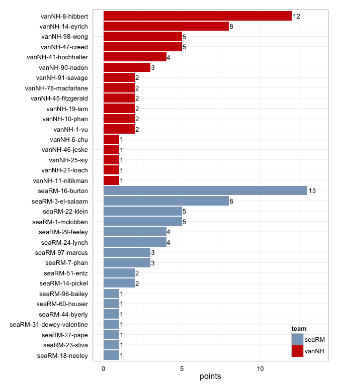
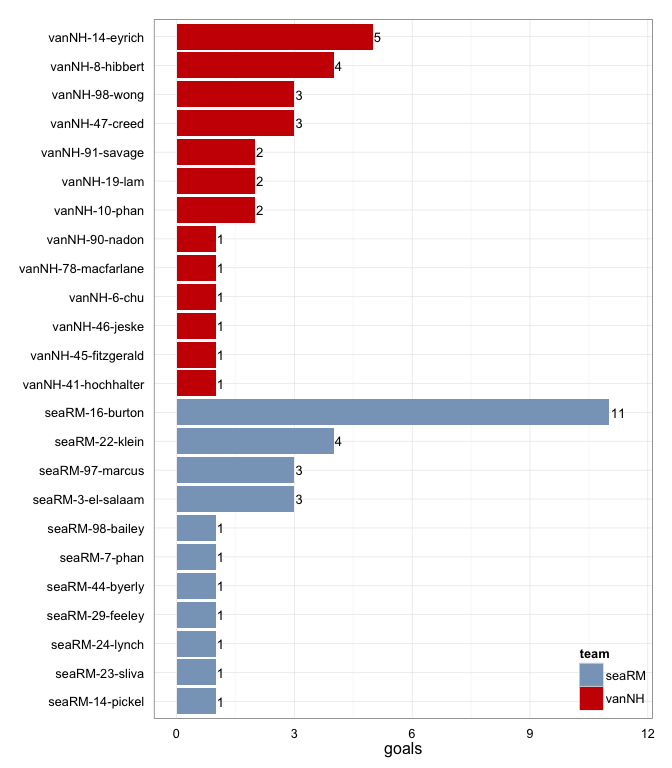
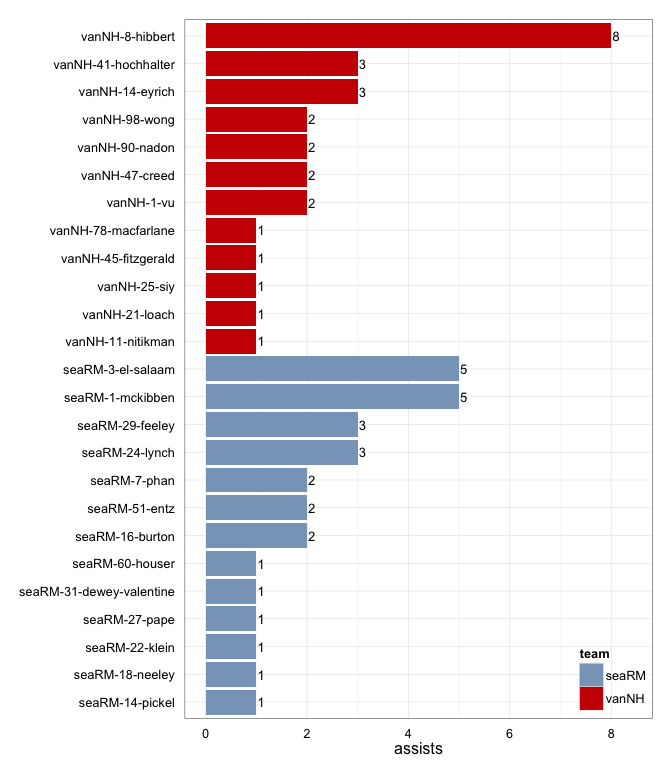
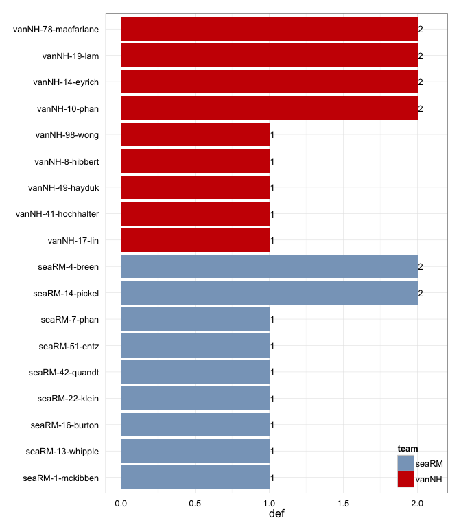

# seaRM at vanNH 2015-06-06

# seaRM 28
# vanNH 27
## game is complete

Go to ...  
  * [Scoring progression](#scoringProgression)  
  * [Player stats via figures](#pl_figs)  
  * [Player stats for seaRM](#away)  
  * [Player stats for vanNH](#home)  
  * [Data on goals, assists, D's](#selectData)  
  * [Full raw data](#rawData)  

## Scoring progression:

 point  period   begin      end       pt_duration   desc                                         seaRM   vanNH 
------  -------  ---------  --------  ------------  -------------------------------------------  ------  ------
    59  4        0:18:00    0:00:00   00:18         - no goal -                                  28      27    
    58  4        0:52:00    0:18:00   00:34         seaRM-27-pape to seaRM-29-feeley             28      27    
    57  4        1:10:00    0:52:00   00:18         vanNH-14-eyrich to vanNH-8-hibbert           27      27    
    56  4        1:36:00    1:10:00   00:26         seaRM-3-el-salaam to seaRM-24-lynch          27      26    
    55  4        1:48:00    1:36:00   00:12         vanNH-41-hochhalter to vanNH-6-chu           26      26    
    54  4        2:29:00    1:48:00   00:41         vanNH-8-hibbert to vanNH-14-eyrich           26      25    
    53  4        2:51:00    2:29:00   00:22         seaRM-7-phan to seaRM-16-burton              26      24    
    52  4        3:56:00    2:51:00   01:05         seaRM-24-lynch to seaRM-16-burton            25      24    
    51  4        4:38:00    3:56:00   00:42         vanNH-47-creed to vanNH-46-jeske             24      24    
    50  4        5:43:00    4:38:00   01:05         seaRM-3-el-salaam to seaRM-16-burton         24      23    
    49  4        6:06:00    5:43:00   00:23         vanNH-1-vu to vanNH-8-hibbert                23      23    
    48  4        7:04:00    6:06:00   00:58         seaRM-1-mckibben to seaRM-16-burton          23      22    
    47  4        7:23:00    7:04:00   00:19         vanNH-41-hochhalter to vanNH-10-phan         22      22    
    46  4        8:37:00    7:23:00   01:14         seaRM-18-neeley to seaRM-22-klein            22      21    
    45  4        9:35:00    8:37:00   00:58         seaRM-3-el-salaam to seaRM-16-burton         21      21    
    44  4        10:00:00   9:35:00   00:25         vanNH-8-hibbert to vanNH-10-phan             20      21    
    43  3        0:21:00    0:00:00   00:21         - no goal -                                  20      20    
    42  3        1:03:00    0:21:00   00:42         vanNH-8-hibbert to vanNH-47-creed            20      20    
    41  3        1:13:00    1:03:00   00:10         seaRM-24-lynch to seaRM-16-burton            20      19    
    40  3        3:03:00    1:13:00   01:50         vanNH-8-hibbert to vanNH-98-wong             19      19    
    39  3        4:28:00    3:03:00   01:25         seaRM-14-pickel to seaRM-22-klein            19      18    
    38  3        4:50:00    4:28:00   00:22         seaRM-29-feeley to seaRM-22-klein            18      18    
    37  3        5:18:00    4:50:00   00:28         seaRM-51-entz to seaRM-3-el-salaam           17      18    
    36  3        5:49:00    5:18:00   00:31         vanNH-98-wong to vanNH-90-nadon              16      18    
    35  3        6:48:00    5:49:00   00:59         seaRM-22-klein to seaRM-3-el-salaam          16      17    
    34  3        7:02:00    6:48:00   00:14         seaRM-24-lynch to seaRM-16-burton            15      17    
    33  3        7:16:00    7:02:00   00:14         vanNH-14-eyrich to vanNH-78-macfarlane       14      17    
    32  3        7:50:00    7:16:00   00:34         seaRM-51-entz to seaRM-3-el-salaam           14      16    
    31  3        8:19:00    7:50:00   00:29         vanNH-47-creed to vanNH-98-wong              13      16    
    30  3        8:35:00    8:19:00   00:16         seaRM-60-houser to seaRM-16-burton           13      15    
    29  3        9:25:00    8:35:00   00:50         vanNH-45-fitzgerald to vanNH-41-hochhalter   12      15    
    28  3        10:00:00   9:25:00   00:35         vanNH-8-hibbert to vanNH-14-eyrich           12      14    
    27  2        0:25:00    0:00:00   00:25         - no goal -                                  12      13    
    26  2        0:50:00    0:25:00   00:25         vanNH-8-hibbert to vanNH-47-creed            12      13    
    25  2        1:39:00    0:50:00   00:49         seaRM-31-dewey-valentine to seaRM-7-phan     12      12    
    24  2        2:19:00    1:39:00   00:40         seaRM-1-mckibben to seaRM-97-marcus          11      12    
    23  2        2:53:00    2:19:00   00:34         vanNH-25-siy to vanNH-19-lam                 10      12    
    22  2        4:28:00    2:53:00   01:35         vanNH-90-nadon to vanNH-14-eyrich            10      11    
    21  2        5:11:00    4:28:00   00:43         seaRM-16-burton to seaRM-97-marcus           10      10    
    20  2        5:40:00    5:11:00   00:29         vanNH-90-nadon to vanNH-14-eyrich            9       10    
    19  2        6:19:00    5:40:00   00:39         seaRM-3-el-salaam to seaRM-16-burton         9       9     
    18  2        6:36:00    6:19:00   00:17         vanNH-98-wong to vanNH-14-eyrich             8       9     
    17  2        7:07:00    6:36:00   00:31         seaRM-1-mckibben to seaRM-16-burton          8       8     
    16  2        8:21:00    7:07:00   01:14         vanNH-8-hibbert to vanNH-47-creed            7       8     
    15  2        8:48:00    8:21:00   00:27         seaRM-1-mckibben to seaRM-97-marcus          7       7     
    14  2        9:08:00    8:48:00   00:20         vanNH-14-eyrich to vanNH-98-wong             6       7     
    13  2        10:00:00   9:08:00   00:52         seaRM-1-mckibben to seaRM-16-burton          6       6     
    12  1        0:27:00    0:00:00   00:27         - no goal -                                  5       6     
    11  1        1:04:00    0:27:00   00:37         vanNH-21-loach to vanNH-91-savage            5       6     
    10  1        1:51:00    1:04:00   00:47         seaRM-29-feeley to seaRM-98-bailey           5       5     
     9  1        2:07:00    1:51:00   00:16         seaRM-29-feeley to seaRM-22-klein            4       5     
     8  1        5:32:00    2:07:00   03:25         seaRM-7-phan to seaRM-44-byerly              3       5     
     7  1        5:53:00    5:32:00   00:21         vanNH-11-nitikman to vanNH-19-lam            2       5     
     6  1        6:38:00    5:53:00   00:45         vanNH-1-vu to vanNH-8-hibbert                2       4     
     5  1        6:54:00    6:38:00   00:16         seaRM-16-burton to seaRM-14-pickel           2       3     
     4  1        7:47:00    6:54:00   00:53         vanNH-41-hochhalter to vanNH-45-fitzgerald   1       3     
     3  1        8:48:00    7:47:00   01:01         vanNH-78-macfarlane to vanNH-8-hibbert       1       2     
     2  1        9:26:00    8:48:00   00:38         seaRM-3-el-salaam to seaRM-23-sliva          1       1     
     1  1        10:00:00   9:26:00   00:34         vanNH-8-hibbert to vanNH-91-savage           0       1     

## Player stats via figures:

### Points = goals + assists

 

### Goals

 

### Assists

 

### D's
 

## Player stats for seaRM :

points = goals + assists  
tables sorted in decreasing order based on points (then goals, assists, Ds)  
Ds = total of plain ol' D's + interceptions (D), hand blocks (HB), and foot blocks (FB)  
stats are cumulative for this game

     player     last               points   comp_pct   goals   assists   throws   completions   catches   def   drop
---  ---------  ----------------  -------  ---------  ------  --------  -------  ------------  --------  ----  -----
1    seaRM-16   burton                 13       0.96      11         2       25            24        35     1      0
2    seaRM-3    el-salaam               8       0.91       3         5       23            21        25     0      0
3    seaRM-22   klein                   5       0.75       4         1        4             3         7     1      0
4    seaRM-1    mckibben                5       0.97       0         5       35            34        24     1      0
5    seaRM-24   lynch                   4       0.89       1         3        9             8        10     0      0
6    seaRM-29   feeley                  4       0.91       1         3       11            10         9     0      0
7    seaRM-97   marcus                  3       1.00       3         0        3             3         6     0      0
8    seaRM-7    phan                    3       1.00       1         2        7             7         4     1      0
9    seaRM-14   pickel                  2       0.86       1         1        7             6         7     2      0
10   seaRM-51   entz                    2       1.00       0         2        3             3         3     1      0
11   seaRM-23   sliva                   1       0.94       1         0       16            15        16     0      0
12   seaRM-44   byerly                  1         NA       1         0        0             0         1     0      0
13   seaRM-98   bailey                  1       0.67       1         0        3             2         4     0      0
14   seaRM-18   neeley                  1       0.50       0         1        2             1         2     0      1
15   seaRM-27   pape                    1       0.96       0         1       25            24        17     0      0
16   seaRM-31   dewey-valentine         1       0.86       0         1        7             6         6     0      0
17   seaRM-60   houser                  1       1.00       0         1        3             3         3     0      0
18   seaRM-4    breen                   0       1.00       0         0        1             1         1     2      0
19   seaRM-13   whipple                 0         NA       0         0        0             0         0     1      0
20   seaRM-42   quandt                  0       1.00       0         0        3             3         3     1      0
21   seaRM-?    ?name?                  0       1.00       0         0       12            12         8     0      0
22   seaRM-0    rupp                    0       0.92       0         0       12            11         9     0      0
23   seaRM-12   ?name?                  0       1.00       0         0        1             1         0     0      0
24   seaRM-17   bender                  0       1.00       0         0        1             1         1     0      0
25   seaRM-47   ?name?                  0       0.67       0         0        3             2         1     0      0
26   seaRM-6    trytiak                 0       0.89       0         0       37            33        31     0      0
27   seaRM-8    ?name?                  0       1.00       0         0        1             1         1     0      0
28   seaRM-90   ?name?                  0       1.00       0         0        2             2         2     0      0
29   seaRM-91   ?name?                  0         NA       0         0        0             0         1     0      0

## Player stats for vanNH :

points = goals + assists  
tables sorted in decreasing order based on points (then goals, assists, Ds)  
Ds = total of plain ol' D's + interceptions (D), hand blocks (HB), and foot blocks (FB)  
stats are cumulative for this game

     player     last          points   comp_pct   goals   assists   throws   completions   catches   def   drop
---  ---------  -----------  -------  ---------  ------  --------  -------  ------------  --------  ----  -----
30   vanNH-8    hibbert           12       0.95       4         8       44            42        48     1      0
31   vanNH-14   eyrich             8       0.88       5         3       26            23        30     2      0
32   vanNH-98   wong               5       0.80       3         2       10             8        14     1      0
33   vanNH-47   creed              5       0.96       3         2       47            45        38     0      0
34   vanNH-41   hochhalter         4       0.82       1         3       11             9         7     1      0
35   vanNH-90   nadon              3       1.00       1         2       23            23        14     0      0
36   vanNH-10   phan               2       1.00       2         0        1             1         3     2      0
37   vanNH-19   lam                2         NA       2         0        0             0         2     2      0
38   vanNH-91   savage             2       0.94       2         0       16            15        17     0      0
39   vanNH-78   macfarlane         2       1.00       1         1       17            17        17     2      0
40   vanNH-45   fitzgerald         2       0.50       1         1        2             1         3     0      0
41   vanNH-1    vu                 2       0.83       0         2        6             5         3     0      0
42   vanNH-46   jeske              1       0.80       1         0        5             4         5     0      0
43   vanNH-6    chu                1       1.00       1         0        4             4         5     0      0
44   vanNH-11   nitikman           1       1.00       0         1        4             4         0     0      0
45   vanNH-21   loach              1       0.75       0         1        8             6         7     0      0
46   vanNH-25   siy                1       1.00       0         1        1             1         1     0      0
47   vanNH-17   lin                0       1.00       0         0        1             1         0     1      0
48   vanNH-49   hayduk             0       1.00       0         0        1             1         0     1      0
49   vanNH-?    ?name?             0       1.00       0         0        1             1         0     0      0
50   vanNH-12   hoy                0       1.00       0         0       20            20        15     0      0
51   vanNH-42   ?name?             0       0.00       0         0        1             0         0     0      0
52   vanNH-66   aponte             0       0.00       0         0        1             0         1     0      0
53   vanNH-88   leross             0       0.00       0         0        1             0         1     0      0

## Raw data on select events (goals, assists, D's):

 point   period  pull_team    event   poss_abs   poss_rel  poss_team   pl_team   pl_pnum   pl_code   pl_lname          player                      seaRM   vanNH
------  -------  ----------  ------  ---------  ---------  ----------  --------  --------  --------  ----------------  -------------------------  ------  ------
     1        1  seaRM           10          1          1  vanNH       vanNH     8         A         hibbert           vanNH-8-hibbert                 0       1
     1        1  seaRM           11          1          1  vanNH       vanNH     91        G         savage            vanNH-91-savage                 0       1
     2        1  vanNH            8          2          1  seaRM       seaRM     3         A         el-salaam         seaRM-3-el-salaam               1       1
     2        1  vanNH            9          2          1  seaRM       seaRM     23        G         sliva             seaRM-23-sliva                  1       1
     3        1  seaRM           13          3          1  vanNH       vanNH     78        A         macfarlane        vanNH-78-macfarlane             1       2
     3        1  seaRM           14          3          1  vanNH       vanNH     8         G         hibbert           vanNH-8-hibbert                 1       2
     4        1  vanNH            6          4          1  seaRM       vanNH     17        D         lin               vanNH-17-lin                    1       3
     4        1  vanNH            9          5          2  vanNH       vanNH     41        A         hochhalter        vanNH-41-hochhalter             1       3
     4        1  vanNH           10          5          2  vanNH       vanNH     45        G         fitzgerald        vanNH-45-fitzgerald             1       3
     5        1  vanNH            5          6          1  seaRM       seaRM     16        A         burton            seaRM-16-burton                 2       3
     5        1  vanNH            6          6          1  seaRM       seaRM     14        G         pickel            seaRM-14-pickel                 2       3
     6        1  seaRM           15          7          1  vanNH       vanNH     1         PUA       vu                vanNH-1-vu                      2       4
     6        1  seaRM           16          7          1  vanNH       vanNH     8         G         hibbert           vanNH-8-hibbert                 2       4
     7        1  vanNH            4          9          2  vanNH       vanNH     11        PUA       nitikman          vanNH-11-nitikman               2       5
     7        1  vanNH            5          9          2  vanNH       vanNH     19        G         lam               vanNH-19-lam                    2       5
     8        1  vanNH            5         10          1  seaRM       vanNH     41        D         hochhalter        vanNH-41-hochhalter             3       5
     8        1  vanNH            9         11          2  vanNH       seaRM     16        D         burton            seaRM-16-burton                 3       5
     8        1  vanNH           20         13          4  vanNH       seaRM     13        D         whipple           seaRM-13-whipple                3       5
     8        1  vanNH           36         15          6  vanNH       seaRM     14        D         pickel            seaRM-14-pickel                 3       5
     8        1  vanNH           39         16          7  seaRM       seaRM     7         A         phan              seaRM-7-phan                    3       5
     8        1  vanNH           40         16          7  seaRM       seaRM     44        G         byerly            seaRM-44-byerly                 3       5
     9        1  seaRM            3         18          2  seaRM       seaRM     29        PUA       feeley            seaRM-29-feeley                 4       5
     9        1  seaRM            4         18          2  seaRM       seaRM     22        G         klein             seaRM-22-klein                  4       5
    10        1  seaRM           10         20          2  seaRM       seaRM     29        A         feeley            seaRM-29-feeley                 5       5
    10        1  seaRM           11         20          2  seaRM       seaRM     98        G         bailey            seaRM-98-bailey                 5       5
    11        1  seaRM           10         21          1  vanNH       vanNH     21        A         loach             vanNH-21-loach                  5       6
    11        1  seaRM           11         21          1  vanNH       vanNH     91        G         savage            vanNH-91-savage                 5       6
    12        1  vanNH           NA         NA         NA  NA          NA        NA        NA        NA                NA-NA-NA                        5       6
    13        2  vanNH           17         24          1  seaRM       seaRM     1         A         mckibben          seaRM-1-mckibben                6       6
    13        2  vanNH           18         24          1  seaRM       seaRM     16        G         burton            seaRM-16-burton                 6       6
    14        2  seaRM            7         25          1  vanNH       vanNH     14        A         eyrich            vanNH-14-eyrich                 6       7
    14        2  seaRM            8         25          1  vanNH       vanNH     98        G         wong              vanNH-98-wong                   6       7
    15        2  vanNH            9         26          1  seaRM       seaRM     1         A         mckibben          seaRM-1-mckibben                7       7
    15        2  vanNH           10         26          1  seaRM       seaRM     97        G         marcus            seaRM-97-marcus                 7       7
    16        2  vanNH           12         27          1  seaRM       vanNH     98        D         wong              vanNH-98-wong                   7       8
    16        2  vanNH           17         30          4  vanNH       vanNH     8         A         hibbert           vanNH-8-hibbert                 7       8
    16        2  vanNH           18         30          4  vanNH       vanNH     47        G         creed             vanNH-47-creed                  7       8
    17        2  vanNH            9         31          1  seaRM       seaRM     1         A         mckibben          seaRM-1-mckibben                8       8
    17        2  vanNH           10         31          1  seaRM       seaRM     16        G         burton            seaRM-16-burton                 8       8
    18        2  seaRM            6         32          1  vanNH       vanNH     98        A         wong              vanNH-98-wong                   8       9
    18        2  seaRM            7         32          1  vanNH       vanNH     14        G         eyrich            vanNH-14-eyrich                 8       9
    19        2  vanNH           10         33          1  seaRM       seaRM     3         A         el-salaam         seaRM-3-el-salaam               9       9
    19        2  vanNH           11         33          1  seaRM       seaRM     16        G         burton            seaRM-16-burton                 9       9
    20        2  seaRM            9         34          1  vanNH       vanNH     90        A         nadon             vanNH-90-nadon                  9      10
    20        2  seaRM           10         34          1  vanNH       vanNH     14        G         eyrich            vanNH-14-eyrich                 9      10
    21        2  vanNH           14         35          1  seaRM       seaRM     16        A         burton            seaRM-16-burton                10      10
    21        2  vanNH           15         35          1  seaRM       seaRM     97        G         marcus            seaRM-97-marcus                10      10
    22        2  seaRM           14         37          2  seaRM       vanNH     14        D         eyrich            vanNH-14-eyrich                10      11
    22        2  seaRM           19         38          3  vanNH       vanNH     90        A         nadon             vanNH-90-nadon                 10      11
    22        2  seaRM           20         38          3  vanNH       vanNH     14        G         eyrich            vanNH-14-eyrich                10      11
    23        2  vanNH            5         39          1  seaRM       vanNH     10        D         phan              vanNH-10-phan                  10      12
    23        2  vanNH            9         40          2  vanNH       vanNH     25        A         siy               vanNH-25-siy                   10      12
    23        2  vanNH           10         40          2  vanNH       vanNH     19        G         lam               vanNH-19-lam                   10      12
    24        2  vanNH           11         41          1  seaRM       seaRM     1         A         mckibben          seaRM-1-mckibben               11      12
    24        2  vanNH           12         41          1  seaRM       seaRM     97        G         marcus            seaRM-97-marcus                11      12
    25        2  seaRM           10         42          1  vanNH       seaRM     7         D         phan              seaRM-7-phan                   12      12
    25        2  seaRM           14         43          2  seaRM       seaRM     31        A         dewey-valentine   seaRM-31-dewey-valentine       12      12
    25        2  seaRM           15         43          2  seaRM       seaRM     7         G         phan              seaRM-7-phan                   12      12
    26        2  seaRM            7         44          1  vanNH       vanNH     8         A         hibbert           vanNH-8-hibbert                12      13
    26        2  seaRM            8         44          1  vanNH       vanNH     47        G         creed             vanNH-47-creed                 12      13
    27        2  vanNH            9         45          1  seaRM       vanNH     49        D         hayduk            vanNH-49-hayduk                12      13
    28        3  seaRM           13         46          1  vanNH       vanNH     8         A         hibbert           vanNH-8-hibbert                12      14
    28        3  seaRM           14         46          1  vanNH       vanNH     14        G         eyrich            vanNH-14-eyrich                12      14
    29        3  vanNH           11         48          2  vanNH       vanNH     45        A         fitzgerald        vanNH-45-fitzgerald            12      15
    29        3  vanNH           12         48          2  vanNH       vanNH     41        G         hochhalter        vanNH-41-hochhalter            12      15
    30        3  vanNH            4         49          1  seaRM       seaRM     60        A         houser            seaRM-60-houser                13      15
    30        3  vanNH            5         49          1  seaRM       seaRM     16        G         burton            seaRM-16-burton                13      15
    31        3  seaRM           10         50          1  vanNH       vanNH     47        A         creed             vanNH-47-creed                 13      16
    31        3  seaRM           11         50          1  vanNH       vanNH     98        G         wong              vanNH-98-wong                  13      16
    32        3  vanNH           10         51          1  seaRM       seaRM     51        A         entz              seaRM-51-entz                  14      16
    32        3  vanNH           11         51          1  seaRM       seaRM     3         G         el-salaam         seaRM-3-el-salaam              14      16
    33        3  seaRM            5         52          1  vanNH       vanNH     14        A         eyrich            vanNH-14-eyrich                14      17
    33        3  seaRM            6         52          1  vanNH       vanNH     78        G         macfarlane        vanNH-78-macfarlane            14      17
    34        3  vanNH            4         53          1  seaRM       seaRM     24        A         lynch             seaRM-24-lynch                 15      17
    34        3  vanNH            5         53          1  seaRM       seaRM     16        G         burton            seaRM-16-burton                15      17
    35        3  seaRM            3         54          1  vanNH       seaRM     4         D         breen             seaRM-4-breen                  16      17
    35        3  seaRM           15         55          2  seaRM       seaRM     22        A         klein             seaRM-22-klein                 16      17
    35        3  seaRM           16         55          2  seaRM       seaRM     3         G         el-salaam         seaRM-3-el-salaam              16      17
    36        3  seaRM            7         56          1  vanNH       vanNH     98        A         wong              vanNH-98-wong                  16      18
    36        3  seaRM            8         56          1  vanNH       vanNH     90        G         nadon             vanNH-90-nadon                 16      18
    37        3  vanNH            8         57          1  seaRM       seaRM     51        A         entz              seaRM-51-entz                  17      18
    37        3  vanNH            9         57          1  seaRM       seaRM     3         G         el-salaam         seaRM-3-el-salaam              17      18
    38        3  seaRM            5         58          1  vanNH       seaRM     22        D         klein             seaRM-22-klein                 18      18
    38        3  seaRM            7         59          2  seaRM       seaRM     29        A         feeley            seaRM-29-feeley                18      18
    38        3  seaRM            8         59          2  seaRM       seaRM     22        G         klein             seaRM-22-klein                 18      18
    39        3  seaRM           14         61          2  seaRM       vanNH     78        D         macfarlane        vanNH-78-macfarlane            19      18
    39        3  seaRM           17         62          3  vanNH       seaRM     42        D         quandt            seaRM-42-quandt                19      18
    39        3  seaRM           18         63          4  seaRM       seaRM     14        PUA       pickel            seaRM-14-pickel                19      18
    39        3  seaRM           19         63          4  seaRM       seaRM     22        G         klein             seaRM-22-klein                 19      18
    40        3  seaRM           10         64          1  vanNH       seaRM     14        D         pickel            seaRM-14-pickel                19      19
    40        3  seaRM           17         65          2  seaRM       vanNH     78        D         macfarlane        vanNH-78-macfarlane            19      19
    40        3  seaRM           26         66          3  vanNH       vanNH     8         A         hibbert           vanNH-8-hibbert                19      19
    40        3  seaRM           27         66          3  vanNH       vanNH     98        G         wong              vanNH-98-wong                  19      19
    41        3  vanNH            3         67          1  seaRM       seaRM     24        A         lynch             seaRM-24-lynch                 20      19
    41        3  vanNH            4         67          1  seaRM       seaRM     16        G         burton            seaRM-16-burton                20      19
    42        3  seaRM           14         68          1  vanNH       vanNH     8         A         hibbert           vanNH-8-hibbert                20      20
    42        3  seaRM           15         68          1  vanNH       vanNH     47        G         creed             vanNH-47-creed                 20      20
    43        3  vanNH            5         69          1  seaRM       vanNH     14        D         eyrich            vanNH-14-eyrich                20      20
    44        4  vanNH            6         70          1  seaRM       vanNH     19        D         lam               vanNH-19-lam                   20      21
    44        4  vanNH            8         71          2  vanNH       vanNH     8         A         hibbert           vanNH-8-hibbert                20      21
    44        4  vanNH            9         71          2  vanNH       vanNH     10        G         phan              vanNH-10-phan                  20      21
    45        4  vanNH           12         72          1  seaRM       seaRM     3         A         el-salaam         seaRM-3-el-salaam              21      21
    45        4  vanNH           13         72          1  seaRM       seaRM     16        G         burton            seaRM-16-burton                21      21
    46        4  seaRM            5         73          1  vanNH       seaRM     4         D         breen             seaRM-4-breen                  22      21
    46        4  seaRM           19         76          4  seaRM       seaRM     18        A         neeley            seaRM-18-neeley                22      21
    46        4  seaRM           20         76          4  seaRM       seaRM     22        G         klein             seaRM-22-klein                 22      21
    47        4  seaRM            6         77          1  vanNH       vanNH     41        A         hochhalter        vanNH-41-hochhalter            22      22
    47        4  seaRM            7         77          1  vanNH       vanNH     10        G         phan              vanNH-10-phan                  22      22
    48        4  vanNH           11         78          1  seaRM       seaRM     1         A         mckibben          seaRM-1-mckibben               23      22
    48        4  vanNH           13         78          1  seaRM       seaRM     16        G         burton            seaRM-16-burton                23      22
    49        4  seaRM            6         79          1  vanNH       vanNH     1         A         vu                vanNH-1-vu                     23      23
    49        4  seaRM            7         79          1  vanNH       vanNH     8         G         hibbert           vanNH-8-hibbert                23      23
    50        4  vanNH            9         80          1  seaRM       vanNH     19        D         lam               vanNH-19-lam                   24      23
    50        4  vanNH           12         81          2  vanNH       seaRM     1         D         mckibben          seaRM-1-mckibben               24      23
    50        4  vanNH           13         82          3  seaRM       seaRM     3         PUA       el-salaam         seaRM-3-el-salaam              24      23
    50        4  vanNH           14         82          3  seaRM       seaRM     16        G         burton            seaRM-16-burton                24      23
    51        4  seaRM           10         83          1  vanNH       vanNH     47        A         creed             vanNH-47-creed                 24      24
    51        4  seaRM           11         83          1  vanNH       vanNH     46        G         jeske             vanNH-46-jeske                 24      24
    52        4  vanNH            4         84          1  seaRM       vanNH     8         D         hibbert           vanNH-8-hibbert                25      24
    52        4  vanNH           14         86          3  seaRM       seaRM     24        A         lynch             seaRM-24-lynch                 25      24
    52        4  vanNH           15         86          3  seaRM       seaRM     16        G         burton            seaRM-16-burton                25      24
    53        4  seaRM            4         88          2  seaRM       seaRM     7         PUA       phan              seaRM-7-phan                   26      24
    53        4  seaRM            5         88          2  seaRM       seaRM     16        G         burton            seaRM-16-burton                26      24
    54        4  seaRM           12         89          1  vanNH       vanNH     8         A         hibbert           vanNH-8-hibbert                26      25
    54        4  seaRM           13         89          1  vanNH       vanNH     14        G         eyrich            vanNH-14-eyrich                26      25
    55        4  vanNH            3         90          1  seaRM       vanNH     10        D         phan              vanNH-10-phan                  26      26
    55        4  vanNH            4         91          2  vanNH       vanNH     41        A         hochhalter        vanNH-41-hochhalter            26      26
    55        4  vanNH            5         91          2  vanNH       vanNH     6         G         chu               vanNH-6-chu                    26      26
    56        4  vanNH            7         92          1  seaRM       seaRM     3         A         el-salaam         seaRM-3-el-salaam              27      26
    56        4  vanNH            8         92          1  seaRM       seaRM     24        G         lynch             seaRM-24-lynch                 27      26
    57        4  seaRM            5         93          1  vanNH       vanNH     14        A         eyrich            vanNH-14-eyrich                27      27
    57        4  seaRM            6         93          1  vanNH       vanNH     8         G         hibbert           vanNH-8-hibbert                27      27
    58        4  vanNH           12         94          1  seaRM       seaRM     27        A         pape              seaRM-27-pape                  28      27
    58        4  vanNH           13         94          1  seaRM       seaRM     29        G         feeley            seaRM-29-feeley                28      27
    59        4  seaRM            3         95          1  vanNH       seaRM     51        D         entz              seaRM-51-entz                  28      27

## Full raw data:

__Note: just for display purposes.__ Raw data in more useful forms can be found in the [GitHub repository](https://github.com/jennybc/vanNH). Find the game you're interested in in the `games` subdirectory.

 period   point  pull_team    event   poss_abs   poss_rel  poss_team   pl_team   pl_pnum   pl_code 
-------  ------  ----------  ------  ---------  ---------  ----------  --------  --------  --------
      1       1  seaRM            1          1          1  vanNH       seaRM     29        P       
      1       1  seaRM            2          1          1  vanNH       vanNH     12        PU      
      1       1  seaRM            3          1          1  vanNH       vanNH     91                
      1       1  seaRM            4          1          1  vanNH       vanNH     78                
      1       1  seaRM            5          1          1  vanNH       vanNH     98                
      1       1  seaRM            6          1          1  vanNH       vanNH     91                
      1       1  seaRM            7          1          1  vanNH       vanNH     12                
      1       1  seaRM            8          1          1  vanNH       vanNH     14                
      1       1  seaRM            9          1          1  vanNH       vanNH     78                
      1       1  seaRM           10          1          1  vanNH       vanNH     8         A       
      1       1  seaRM           11          1          1  vanNH       vanNH     91        G       
      1       2  vanNH            1          2          1  seaRM       vanNH     41        P       
      1       2  vanNH            2          2          1  seaRM       seaRM     1         PU      
      1       2  vanNH            3          2          1  seaRM       seaRM     6                 
      1       2  vanNH            4          2          1  seaRM       seaRM     27                
      1       2  vanNH            5          2          1  seaRM       seaRM     6                 
      1       2  vanNH            6          2          1  seaRM       seaRM     3                 
      1       2  vanNH            7          2          1  seaRM       seaRM     ?                 
      1       2  vanNH            8          2          1  seaRM       seaRM     3         A       
      1       2  vanNH            9          2          1  seaRM       seaRM     23        G       
      1       3  seaRM            1          3          1  vanNH       seaRM     98        P       
      1       3  seaRM            2          3          1  vanNH       vanNH     17        PU      
      1       3  seaRM            3          3          1  vanNH       vanNH     91                
      1       3  seaRM            4          3          1  vanNH       vanNH     78                
      1       3  seaRM            5          3          1  vanNH       vanNH     8                 
      1       3  seaRM            6          3          1  vanNH       vanNH     14                
      1       3  seaRM            7          3          1  vanNH       vanNH     8                 
      1       3  seaRM            8          3          1  vanNH       vanNH     91                
      1       3  seaRM            9          3          1  vanNH       vanNH     78                
      1       3  seaRM           10          3          1  vanNH       vanNH     91                
      1       3  seaRM           11          3          1  vanNH       vanNH     47                
      1       3  seaRM           12          3          1  vanNH       vanNH     91                
      1       3  seaRM           13          3          1  vanNH       vanNH     78        A       
      1       3  seaRM           14          3          1  vanNH       vanNH     8         G       
      1       4  vanNH            1          4          1  seaRM       vanNH     41        P       
      1       4  vanNH            2          4          1  seaRM       seaRM     ?         PU      
      1       4  vanNH            3          4          1  seaRM       seaRM     6                 
      1       4  vanNH            4          4          1  seaRM       seaRM     3                 
      1       4  vanNH            5          4          1  seaRM       seaRM     24                
      1       4  vanNH            6          4          1  seaRM       vanNH     17        D       
      1       4  vanNH            7          5          2  vanNH       vanNH     11        PU      
      1       4  vanNH            8          5          2  vanNH       vanNH     6                 
      1       4  vanNH            9          5          2  vanNH       vanNH     41        A       
      1       4  vanNH           10          5          2  vanNH       vanNH     45        G       
      1       5  vanNH            1          6          1  seaRM       vanNH     1         P       
      1       5  vanNH            2          6          1  seaRM       seaRM     27        PU      
      1       5  vanNH            3          6          1  seaRM       seaRM     6                 
      1       5  vanNH            4          6          1  seaRM       seaRM     23                
      1       5  vanNH            5          6          1  seaRM       seaRM     16        A       
      1       5  vanNH            6          6          1  seaRM       seaRM     14        G       
      1       6  seaRM            1          7          1  vanNH       seaRM     42        P       
      1       6  seaRM            2          7          1  vanNH       vanNH     14        PU      
      1       6  seaRM            3          7          1  vanNH       vanNH     91                
      1       6  seaRM            4          7          1  vanNH       vanNH     12                
      1       6  seaRM            5          7          1  vanNH       vanNH     78                
      1       6  seaRM            6          7          1  vanNH       vanNH     14                
      1       6  seaRM            7          7          1  vanNH       vanNH     91                
      1       6  seaRM            8          7          1  vanNH       vanNH     78                
      1       6  seaRM            9          7          1  vanNH       vanNH     14                
      1       6  seaRM           10          7          1  vanNH       vanNH     98                
      1       6  seaRM           11          7          1  vanNH       vanNH     98        SO      
      1       6  seaRM           12          7          1  vanNH       vanNH     1         SI      
      1       6  seaRM           13          7          1  vanNH       seaRM     ?         SO      
      1       6  seaRM           14          7          1  vanNH       seaRM     19        SI      
      1       6  seaRM           15          7          1  vanNH       vanNH     1         PUA     
      1       6  seaRM           16          7          1  vanNH       vanNH     8         G       
      1       7  vanNH            1          8          1  seaRM       vanNH     25        P       
      1       7  vanNH            2          8          1  seaRM       seaRM     1         PU      
      1       7  vanNH            3          8          1  seaRM       seaRM     6         VST     
      1       7  vanNH            4          9          2  vanNH       vanNH     11        PUA     
      1       7  vanNH            5          9          2  vanNH       vanNH     19        G       
      1       8  vanNH            1         10          1  seaRM       vanNH     8         P       
      1       8  vanNH            2         10          1  seaRM       seaRM     1         PU      
      1       8  vanNH            3         10          1  seaRM       seaRM     6                 
      1       8  vanNH            4         10          1  seaRM       seaRM     23                
      1       8  vanNH            5         10          1  seaRM       vanNH     41        D       
      1       8  vanNH            6         11          2  vanNH       vanNH     41        PU      
      1       8  vanNH            7         11          2  vanNH       vanNH     8                 
      1       8  vanNH            8         11          2  vanNH       vanNH     88                
      1       8  vanNH            9         11          2  vanNH       seaRM     16        D       
      1       8  vanNH           10         12          3  seaRM       seaRM     16        PU      
      1       8  vanNH           11         12          3  seaRM       seaRM     27                
      1       8  vanNH           12         12          3  seaRM       seaRM     6                 
      1       8  vanNH           13         12          3  seaRM       seaRM     27                
      1       8  vanNH           14         12          3  seaRM       seaRM     6                 
      1       8  vanNH           15         12          3  seaRM       seaRM     ?                 
      1       8  vanNH           16         12          3  seaRM       seaRM     3                 
      1       8  vanNH           17         13          4  vanNH       vanNH     41        PU      
      1       8  vanNH           18         13          4  vanNH       vanNH     8                 
      1       8  vanNH           19         13          4  vanNH       vanNH     66                
      1       8  vanNH           20         13          4  vanNH       seaRM     13        D       
      1       8  vanNH           21         14          5  seaRM       seaRM     ?         PU      
      1       8  vanNH           22         14          5  seaRM       seaRM     27                
      1       8  vanNH           23         14          5  seaRM       seaRM     16                
      1       8  vanNH           24         14          5  seaRM       seaRM     27                
      1       8  vanNH           25         14          5  seaRM       seaRM     1                 
      1       8  vanNH           26         14          5  seaRM       seaRM     27                
      1       8  vanNH           27         15          6  vanNH       vanNH     88        TO      
      1       8  vanNH           28         15          6  vanNH       vanNH     91        PU      
      1       8  vanNH           29         15          6  vanNH       vanNH     47                
      1       8  vanNH           30         15          6  vanNH       vanNH     90                
      1       8  vanNH           31         15          6  vanNH       vanNH     8                 
      1       8  vanNH           32         15          6  vanNH       vanNH     91                
      1       8  vanNH           33         15          6  vanNH       vanNH     8                 
      1       8  vanNH           34         15          6  vanNH       vanNH     21                
      1       8  vanNH           35         15          6  vanNH       vanNH     91                
      1       8  vanNH           36         15          6  vanNH       seaRM     14        D       
      1       8  vanNH           37         16          7  seaRM       seaRM     14        PU      
      1       8  vanNH           38         16          7  seaRM       seaRM     23                
      1       8  vanNH           39         16          7  seaRM       seaRM     7         A       
      1       8  vanNH           40         16          7  seaRM       seaRM     44        G       
      1       9  seaRM            1         17          1  vanNH       seaRM     98        P       
      1       9  seaRM            2         17          1  vanNH       vanNH     1                 
      1       9  seaRM            3         18          2  seaRM       seaRM     29        PUA     
      1       9  seaRM            4         18          2  seaRM       seaRM     22        G       
      1      10  seaRM            1         19          1  vanNH       seaRM     42        P       
      1      10  seaRM            2         19          1  vanNH       vanNH     47        PU      
      1      10  seaRM            3         19          1  vanNH       vanNH     91                
      1      10  seaRM            4         19          1  vanNH       vanNH     47                
      1      10  seaRM            5         19          1  vanNH       vanNH     14                
      1      10  seaRM            6         20          2  seaRM       seaRM     22        PU      
      1      10  seaRM            7         20          2  seaRM       seaRM     42                
      1      10  seaRM            8         20          2  seaRM       seaRM     29                
      1      10  seaRM            9         20          2  seaRM       seaRM     31                
      1      10  seaRM           10         20          2  seaRM       seaRM     29        A       
      1      10  seaRM           11         20          2  seaRM       seaRM     98        G       
      1      11  seaRM            1         21          1  vanNH       seaRM     98        P       
      1      11  seaRM            2         21          1  vanNH       vanNH     47        PU      
      1      11  seaRM            3         21          1  vanNH       vanNH     91                
      1      11  seaRM            4         21          1  vanNH       vanNH     21                
      1      11  seaRM            5         21          1  vanNH       vanNH     8                 
      1      11  seaRM            6         21          1  vanNH       vanNH     91                
      1      11  seaRM            7         21          1  vanNH       vanNH     47                
      1      11  seaRM            8         21          1  vanNH       vanNH     91                
      1      11  seaRM            9         21          1  vanNH       vanNH     90                
      1      11  seaRM           10         21          1  vanNH       vanNH     21        A       
      1      11  seaRM           11         21          1  vanNH       vanNH     91        G       
      1      12  vanNH            1         22          1  seaRM       vanNH     41        P       
      1      12  vanNH            2         22          1  seaRM       seaRM     ?         PU      
      1      12  vanNH            3         22          1  seaRM       seaRM     1                 
      1      12  vanNH            4         22          1  seaRM       seaRM     27                
      1      12  vanNH            5         22          1  seaRM       seaRM     24                
      1      12  vanNH            6         22          1  seaRM       seaRM     27                
      1      12  vanNH            7         22          1  seaRM       seaRM     1                 
      1      12  vanNH            8         22          1  seaRM       seaRM     98                
      1      12  vanNH            9         23          2  vanNH       vanNH     49        PU      
      1      12  vanNH           10         23          2  vanNH       vanNH     41                
      2      13  vanNH            1         24          1  seaRM       vanNH     41        P       
      2      13  vanNH            2         24          1  seaRM       seaRM     1         PU      
      2      13  vanNH            3         24          1  seaRM       seaRM     6                 
      2      13  vanNH            4         24          1  seaRM       seaRM     ?                 
      2      13  vanNH            5         24          1  seaRM       seaRM     16                
      2      13  vanNH            6         24          1  seaRM       seaRM     6                 
      2      13  vanNH            7         24          1  seaRM       seaRM     0                 
      2      13  vanNH            8         24          1  seaRM       seaRM     1                 
      2      13  vanNH            9         24          1  seaRM       seaRM     3                 
      2      13  vanNH           10         24          1  seaRM       seaRM     0                 
      2      13  vanNH           11         24          1  seaRM       seaRM     1                 
      2      13  vanNH           12         24          1  seaRM       seaRM     6                 
      2      13  vanNH           13         24          1  seaRM       seaRM     16                
      2      13  vanNH           14         24          1  seaRM       seaRM     3                 
      2      13  vanNH           15         24          1  seaRM       seaRM     16                
      2      13  vanNH           16         24          1  seaRM       vanNH     19        F       
      2      13  vanNH           17         24          1  seaRM       seaRM     1         A       
      2      13  vanNH           18         24          1  seaRM       seaRM     16        G       
      2      14  seaRM            1         25          1  vanNH       seaRM     29        P       
      2      14  seaRM            2         25          1  vanNH       vanNH     47        PU      
      2      14  seaRM            3         25          1  vanNH       vanNH     91                
      2      14  seaRM            4         25          1  vanNH       vanNH     78                
      2      14  seaRM            5         25          1  vanNH       vanNH     98                
      2      14  seaRM            6         25          1  vanNH       vanNH     8                 
      2      14  seaRM            7         25          1  vanNH       vanNH     14        A       
      2      14  seaRM            8         25          1  vanNH       vanNH     98        G       
      2      15  vanNH            1         26          1  seaRM       vanNH     41        P       
      2      15  vanNH            2         26          1  seaRM       seaRM     1         PU      
      2      15  vanNH            3         26          1  seaRM       seaRM     6                 
      2      15  vanNH            4         26          1  seaRM       seaRM     27                
      2      15  vanNH            5         26          1  seaRM       seaRM     60                
      2      15  vanNH            6         26          1  seaRM       seaRM     27                
      2      15  vanNH            7         26          1  seaRM       seaRM     60                
      2      15  vanNH            8         26          1  seaRM       seaRM     27                
      2      15  vanNH            9         26          1  seaRM       seaRM     1         A       
      2      15  vanNH           10         26          1  seaRM       seaRM     97        G       
      2      16  vanNH            1         27          1  seaRM       vanNH     98        P       
      2      16  vanNH            2         27          1  seaRM       seaRM     47        PU      
      2      16  vanNH            3         27          1  seaRM       seaRM     90                
      2      16  vanNH            4         27          1  seaRM       seaRM     91                
      2      16  vanNH            5         27          1  seaRM       seaRM     91        SO      
      2      16  vanNH            6         27          1  seaRM       seaRM     12        SI      
      2      16  vanNH            7         27          1  seaRM       seaRM     12        PU      
      2      16  vanNH            8         27          1  seaRM       seaRM     8                 
      2      16  vanNH            9         27          1  seaRM       seaRM     90                
      2      16  vanNH           10         27          1  seaRM       seaRM     47                
      2      16  vanNH           11         27          1  seaRM       seaRM     14                
      2      16  vanNH           12         27          1  seaRM       vanNH     98        D       
      2      16  vanNH           13         28          2  vanNH       vanNH     42        PU      
      2      16  vanNH           14         29          3  seaRM       seaRM     47        PU      
      2      16  vanNH           15         30          4  vanNH       vanNH     46        PU      
      2      16  vanNH           16         30          4  vanNH       seaRM     31        F       
      2      16  vanNH           17         30          4  vanNH       vanNH     8         A       
      2      16  vanNH           18         30          4  vanNH       vanNH     47        G       
      2      17  vanNH            1         31          1  seaRM       vanNH     41        P       
      2      17  vanNH            2         31          1  seaRM       seaRM     27        PU      
      2      17  vanNH            3         31          1  seaRM       seaRM     1                 
      2      17  vanNH            4         31          1  seaRM       seaRM     16                
      2      17  vanNH            5         31          1  seaRM       seaRM     3                 
      2      17  vanNH            6         31          1  seaRM       seaRM     51                
      2      17  vanNH            7         31          1  seaRM       seaRM     16                
      2      17  vanNH            8         31          1  seaRM       seaRM     3                 
      2      17  vanNH            9         31          1  seaRM       seaRM     1         A       
      2      17  vanNH           10         31          1  seaRM       seaRM     16        G       
      2      18  seaRM            1         32          1  vanNH       seaRM     22        P       
      2      18  seaRM            2         32          1  vanNH       vanNH     12        PU      
      2      18  seaRM            3         32          1  vanNH       vanNH     47                
      2      18  seaRM            4         32          1  vanNH       vanNH     78                
      2      18  seaRM            5         32          1  vanNH       vanNH     8                 
      2      18  seaRM            6         32          1  vanNH       vanNH     98        A       
      2      18  seaRM            7         32          1  vanNH       vanNH     14        G       
      2      19  vanNH            1         33          1  seaRM       vanNH     41        P       
      2      19  vanNH            2         33          1  seaRM       seaRM     27        PU      
      2      19  vanNH            3         33          1  seaRM       seaRM     6                 
      2      19  vanNH            4         33          1  seaRM       seaRM     16                
      2      19  vanNH            5         33          1  seaRM       seaRM     ?                 
      2      19  vanNH            6         33          1  seaRM       seaRM     16                
      2      19  vanNH            7         33          1  seaRM       vanNH     ?         F       
      2      19  vanNH            8         33          1  seaRM       seaRM     27                
      2      19  vanNH            9         33          1  seaRM       seaRM     16                
      2      19  vanNH           10         33          1  seaRM       seaRM     3         A       
      2      19  vanNH           11         33          1  seaRM       seaRM     16        G       
      2      20  seaRM            1         34          1  vanNH       seaRM     29        P       
      2      20  seaRM            2         34          1  vanNH       vanNH     12        PU      
      2      20  seaRM            3         34          1  vanNH       vanNH     8                 
      2      20  seaRM            4         34          1  vanNH       vanNH     78                
      2      20  seaRM            5         34          1  vanNH       vanNH     8                 
      2      20  seaRM            6         34          1  vanNH       vanNH     14                
      2      20  seaRM            7         34          1  vanNH       vanNH     8                 
      2      20  seaRM            8         34          1  vanNH       vanNH     98                
      2      20  seaRM            9         34          1  vanNH       vanNH     90        A       
      2      20  seaRM           10         34          1  vanNH       vanNH     14        G       
      2      21  vanNH            1         35          1  seaRM       vanNH     41        P       
      2      21  vanNH            2         35          1  seaRM       seaRM     6         PU      
      2      21  vanNH            3         35          1  seaRM       seaRM     1                 
      2      21  vanNH            4         35          1  seaRM       seaRM     24                
      2      21  vanNH            5         35          1  seaRM       seaRM     0                 
      2      21  vanNH            6         35          1  seaRM       seaRM     6                 
      2      21  vanNH            7         35          1  seaRM       seaRM     ?                 
      2      21  vanNH            8         35          1  seaRM       seaRM     16                
      2      21  vanNH            9         35          1  seaRM       seaRM     0                 
      2      21  vanNH           10         35          1  seaRM       seaRM     3                 
      2      21  vanNH           11         35          1  seaRM       seaRM     0                 
      2      21  vanNH           12         35          1  seaRM       seaRM     6                 
      2      21  vanNH           13         35          1  seaRM       seaRM     3                 
      2      21  vanNH           14         35          1  seaRM       seaRM     16        A       
      2      21  vanNH           15         35          1  seaRM       seaRM     97        G       
      2      22  seaRM            1         36          1  vanNH       seaRM     ?         P       
      2      22  seaRM            2         36          1  vanNH       vanNH     47        PU      
      2      22  seaRM            3         36          1  vanNH       vanNH     12                
      2      22  seaRM            4         36          1  vanNH       vanNH     8                 
      2      22  seaRM            5         36          1  vanNH       vanNH     14                
      2      22  seaRM            6         36          1  vanNH       vanNH     90                
      2      22  seaRM            7         36          1  vanNH       vanNH     14                
      2      22  seaRM            8         36          1  vanNH       vanNH     47                
      2      22  seaRM            9         36          1  vanNH       vanNH     78                
      2      22  seaRM           10         36          1  vanNH       vanNH     8                 
      2      22  seaRM           11         37          2  seaRM       seaRM     29        PU      
      2      22  seaRM           12         37          2  seaRM       seaRM     ?                 
      2      22  seaRM           13         37          2  seaRM       seaRM     22                
      2      22  seaRM           14         37          2  seaRM       vanNH     14        D       
      2      22  seaRM           15         38          3  vanNH       vanNH     47        PU      
      2      22  seaRM           16         38          3  vanNH       vanNH     8                 
      2      22  seaRM           17         38          3  vanNH       vanNH     12                
      2      22  seaRM           18         38          3  vanNH       vanNH     47                
      2      22  seaRM           19         38          3  vanNH       vanNH     90        A       
      2      22  seaRM           20         38          3  vanNH       vanNH     14        G       
      2      23  vanNH            1         39          1  seaRM       vanNH     1         P       
      2      23  vanNH            2         39          1  seaRM       seaRM     27        PU      
      2      23  vanNH            3         39          1  seaRM       seaRM     23                
      2      23  vanNH            4         39          1  seaRM       seaRM     6                 
      2      23  vanNH            5         39          1  seaRM       vanNH     10        D       
      2      23  vanNH            6         40          2  vanNH       vanNH     1                 
      2      23  vanNH            7         40          2  vanNH       vanNH     10                
      2      23  vanNH            8         40          2  vanNH       vanNH     6                 
      2      23  vanNH            9         40          2  vanNH       vanNH     25        A       
      2      23  vanNH           10         40          2  vanNH       vanNH     19        G       
      2      24  vanNH            1         41          1  seaRM       vanNH     41        P       
      2      24  vanNH            2         41          1  seaRM       seaRM     0         PU      
      2      24  vanNH            3         41          1  seaRM       seaRM     1                 
      2      24  vanNH            4         41          1  seaRM       seaRM     23                
      2      24  vanNH            5         41          1  seaRM       vanNH     49        F       
      2      24  vanNH            6         41          1  seaRM       seaRM     24                
      2      24  vanNH            7         41          1  seaRM       seaRM     3                 
      2      24  vanNH            8         41          1  seaRM       seaRM     23                
      2      24  vanNH            9         41          1  seaRM       seaRM     0                 
      2      24  vanNH           10         41          1  seaRM       seaRM     23                
      2      24  vanNH           11         41          1  seaRM       seaRM     1         A       
      2      24  vanNH           12         41          1  seaRM       seaRM     97        G       
      2      25  seaRM            1         42          1  vanNH       seaRM     31        P       
      2      25  seaRM            2         42          1  vanNH       vanNH     90        PU      
      2      25  seaRM            3         42          1  vanNH       vanNH     47                
      2      25  seaRM            4         42          1  vanNH       vanNH     90                
      2      25  seaRM            5         42          1  vanNH       vanNH     47                
      2      25  seaRM            6         42          1  vanNH       vanNH     12                
      2      25  seaRM            7         42          1  vanNH       vanNH     98                
      2      25  seaRM            8         42          1  vanNH       vanNH     8                 
      2      25  seaRM            9         42          1  vanNH       vanNH     14                
      2      25  seaRM           10         42          1  vanNH       seaRM     7         D       
      2      25  seaRM           11         43          2  seaRM       seaRM     7         PU      
      2      25  seaRM           12         43          2  seaRM       seaRM     31                
      2      25  seaRM           13         43          2  seaRM       seaRM     17                
      2      25  seaRM           14         43          2  seaRM       seaRM     31        A       
      2      25  seaRM           15         43          2  seaRM       seaRM     7         G       
      2      26  seaRM            1         44          1  vanNH       seaRM     29        P       
      2      26  seaRM            2         44          1  vanNH       vanNH     90        PU      
      2      26  seaRM            3         44          1  vanNH       vanNH     47                
      2      26  seaRM            4         44          1  vanNH       vanNH     41                
      2      26  seaRM            5         44          1  vanNH       vanNH     12                
      2      26  seaRM            6         44          1  vanNH       vanNH     21                
      2      26  seaRM            7         44          1  vanNH       vanNH     8         A       
      2      26  seaRM            8         44          1  vanNH       vanNH     47        G       
      2      27  vanNH            1         45          1  seaRM       vanNH     41        P       
      2      27  vanNH            2         45          1  seaRM       seaRM     23        PU      
      2      27  vanNH            3         45          1  seaRM       seaRM     6                 
      2      27  vanNH            4         45          1  seaRM       seaRM     97                
      2      27  vanNH            5         45          1  seaRM       seaRM     27                
      2      27  vanNH            6         45          1  seaRM       seaRM     97                
      2      27  vanNH            7         45          1  seaRM       seaRM     27                
      2      27  vanNH            8         45          1  seaRM       seaRM     16                
      2      27  vanNH            9         45          1  seaRM       vanNH     49        D       
      3      28  seaRM            1         46          1  vanNH       seaRM     42        P       
      3      28  seaRM            2         46          1  vanNH       vanNH     90        PU      
      3      28  seaRM            3         46          1  vanNH       vanNH     47                
      3      28  seaRM            4         46          1  vanNH       vanNH     14                
      3      28  seaRM            5         46          1  vanNH       vanNH     8                 
      3      28  seaRM            6         46          1  vanNH       vanNH     78                
      3      28  seaRM            7         46          1  vanNH       vanNH     47                
      3      28  seaRM            8         46          1  vanNH       vanNH     14                
      3      28  seaRM            9         46          1  vanNH       vanNH     12                
      3      28  seaRM           10         46          1  vanNH       vanNH     47                
      3      28  seaRM           11         46          1  vanNH       vanNH     8                 
      3      28  seaRM           12         46          1  vanNH       vanNH     90                
      3      28  seaRM           13         46          1  vanNH       vanNH     8         A       
      3      28  seaRM           14         46          1  vanNH       vanNH     14        G       
      3      29  vanNH            1         47          1  seaRM       vanNH     41        P       
      3      29  vanNH            2         47          1  seaRM       seaRM     1         PU      
      3      29  vanNH            3         47          1  seaRM       seaRM     6                 
      3      29  vanNH            4         47          1  seaRM       seaRM     23                
      3      29  vanNH            5         47          1  seaRM       seaRM     6                 
      3      29  vanNH            6         47          1  seaRM       seaRM     24                
      3      29  vanNH            7         47          1  seaRM       seaRM     0                 
      3      29  vanNH            8         48          2  vanNH       vanNH     41        PU      
      3      29  vanNH            9         48          2  vanNH       vanNH     6                 
      3      29  vanNH           10         48          2  vanNH       vanNH     1                 
      3      29  vanNH           11         48          2  vanNH       vanNH     45        A       
      3      29  vanNH           12         48          2  vanNH       vanNH     41        G       
      3      30  vanNH            1         49          1  seaRM       vanNH     25        P       
      3      30  vanNH            2         49          1  seaRM       seaRM     27        PU      
      3      30  vanNH            3         49          1  seaRM       seaRM     ?                 
      3      30  vanNH            4         49          1  seaRM       seaRM     60        A       
      3      30  vanNH            5         49          1  seaRM       seaRM     16        G       
      3      31  seaRM            1         50          1  vanNH       seaRM     98        P       
      3      31  seaRM            2         50          1  vanNH       vanNH     ?         PU      
      3      31  seaRM            3         50          1  vanNH       vanNH     47                
      3      31  seaRM            4         50          1  vanNH       vanNH     12                
      3      31  seaRM            5         50          1  vanNH       vanNH     47                
      3      31  seaRM            6         50          1  vanNH       vanNH     12                
      3      31  seaRM            7         50          1  vanNH       vanNH     8                 
      3      31  seaRM            8         50          1  vanNH       vanNH     47                
      3      31  seaRM            9         50          1  vanNH       vanNH     14                
      3      31  seaRM           10         50          1  vanNH       vanNH     47        A       
      3      31  seaRM           11         50          1  vanNH       vanNH     98        G       
      3      32  vanNH            1         51          1  seaRM       vanNH     45        P       
      3      32  vanNH            2         51          1  seaRM       seaRM     1         PU      
      3      32  vanNH            3         51          1  seaRM       seaRM     6                 
      3      32  vanNH            4         51          1  seaRM       seaRM     23                
      3      32  vanNH            5         51          1  seaRM       seaRM     1                 
      3      32  vanNH            6         51          1  seaRM       seaRM     27                
      3      32  vanNH            7         51          1  seaRM       seaRM     16                
      3      32  vanNH            8         51          1  seaRM       seaRM     1                 
      3      32  vanNH            9         51          1  seaRM       seaRM     3                 
      3      32  vanNH           10         51          1  seaRM       seaRM     51        A       
      3      32  vanNH           11         51          1  seaRM       seaRM     3         G       
      3      33  seaRM            1         52          1  vanNH       seaRM     42        P       
      3      33  seaRM            2         52          1  vanNH       vanNH     90        PU      
      3      33  seaRM            3         52          1  vanNH       vanNH     47                
      3      33  seaRM            4         52          1  vanNH       vanNH     8                 
      3      33  seaRM            5         52          1  vanNH       vanNH     14        A       
      3      33  seaRM            6         52          1  vanNH       vanNH     78        G       
      3      34  vanNH            1         53          1  seaRM       vanNH     1         P       
      3      34  vanNH            2         53          1  seaRM       seaRM     0         PU      
      3      34  vanNH            3         53          1  seaRM       seaRM     6                 
      3      34  vanNH            4         53          1  seaRM       seaRM     24        A       
      3      34  vanNH            5         53          1  seaRM       seaRM     16        G       
      3      35  seaRM            1         54          1  vanNH       seaRM     22        P       
      3      35  seaRM            2         54          1  vanNH       vanNH     47        PU      
      3      35  seaRM            3         54          1  vanNH       seaRM     4         D       
      3      35  seaRM            4         55          2  seaRM       seaRM     7         PU      
      3      35  seaRM            5         55          2  seaRM       seaRM     14                
      3      35  seaRM            6         55          2  seaRM       seaRM     31                
      3      35  seaRM            7         55          2  seaRM       seaRM     23                
      3      35  seaRM            8         55          2  seaRM       seaRM     14                
      3      35  seaRM            9         55          2  seaRM       seaRM     ?                 
      3      35  seaRM           10         55          2  seaRM       seaRM     14        TO      
      3      35  seaRM           11         55          2  seaRM       seaRM     6         PU      
      3      35  seaRM           12         55          2  seaRM       seaRM     3                 
      3      35  seaRM           13         55          2  seaRM       seaRM     6                 
      3      35  seaRM           14         55          2  seaRM       seaRM     29                
      3      35  seaRM           15         55          2  seaRM       seaRM     22        A       
      3      35  seaRM           16         55          2  seaRM       seaRM     3         G       
      3      36  seaRM            1         56          1  vanNH       seaRM     98        P       
      3      36  seaRM            2         56          1  vanNH       vanNH     12        PU      
      3      36  seaRM            3         56          1  vanNH       vanNH     47                
      3      36  seaRM            4         56          1  vanNH       vanNH     78                
      3      36  seaRM            5         56          1  vanNH       vanNH     98                
      3      36  seaRM            6         56          1  vanNH       vanNH     90                
      3      36  seaRM            7         56          1  vanNH       vanNH     98        A       
      3      36  seaRM            8         56          1  vanNH       vanNH     90        G       
      3      37  vanNH            1         57          1  seaRM       vanNH     1         P       
      3      37  vanNH            2         57          1  seaRM       seaRM     27        PU      
      3      37  vanNH            3         57          1  seaRM       seaRM     1                 
      3      37  vanNH            4         57          1  seaRM       seaRM     16                
      3      37  vanNH            5         57          1  seaRM       seaRM     0                 
      3      37  vanNH            6         57          1  seaRM       seaRM     16                
      3      37  vanNH            7         57          1  seaRM       seaRM     3                 
      3      37  vanNH            8         57          1  seaRM       seaRM     51        A       
      3      37  vanNH            9         57          1  seaRM       seaRM     3         G       
      3      38  seaRM            1         58          1  vanNH       seaRM     42        P       
      3      38  seaRM            2         58          1  vanNH       vanNH     90        PU      
      3      38  seaRM            3         58          1  vanNH       vanNH     47                
      3      38  seaRM            4         58          1  vanNH       vanNH     98                
      3      38  seaRM            5         58          1  vanNH       seaRM     22        D       
      3      38  seaRM            6         59          2  seaRM       seaRM     ?                 
      3      38  seaRM            7         59          2  seaRM       seaRM     29        A       
      3      38  seaRM            8         59          2  seaRM       seaRM     22        G       
      3      39  seaRM            1         60          1  vanNH       seaRM     42        P       
      3      39  seaRM            2         60          1  vanNH       vanNH     90        PU      
      3      39  seaRM            3         60          1  vanNH       vanNH     21                
      3      39  seaRM            4         60          1  vanNH       vanNH     14                
      3      39  seaRM            5         60          1  vanNH       vanNH     8                 
      3      39  seaRM            6         60          1  vanNH       vanNH     47                
      3      39  seaRM            7         60          1  vanNH       vanNH     14                
      3      39  seaRM            8         61          2  seaRM       seaRM     27        PU      
      3      39  seaRM            9         61          2  seaRM       seaRM     14                
      3      39  seaRM           10         61          2  seaRM       seaRM     42                
      3      39  seaRM           11         61          2  seaRM       seaRM     22                
      3      39  seaRM           12         61          2  seaRM       seaRM     31                
      3      39  seaRM           13         61          2  seaRM       seaRM     29                
      3      39  seaRM           14         61          2  seaRM       vanNH     78        D       
      3      39  seaRM           15         62          3  vanNH       vanNH     21                
      3      39  seaRM           16         62          3  vanNH       vanNH     46                
      3      39  seaRM           17         62          3  vanNH       seaRM     42        D       
      3      39  seaRM           18         63          4  seaRM       seaRM     14        PUA     
      3      39  seaRM           19         63          4  seaRM       seaRM     22        G       
      3      40  seaRM            1         64          1  vanNH       seaRM     98        P       
      3      40  seaRM            2         64          1  vanNH       vanNH     47        PU      
      3      40  seaRM            3         64          1  vanNH       vanNH     12                
      3      40  seaRM            4         64          1  vanNH       vanNH     90                
      3      40  seaRM            5         64          1  vanNH       vanNH     12                
      3      40  seaRM            6         64          1  vanNH       vanNH     14                
      3      40  seaRM            7         64          1  vanNH       vanNH     78                
      3      40  seaRM            8         64          1  vanNH       vanNH     8                 
      3      40  seaRM            9         64          1  vanNH       vanNH     98                
      3      40  seaRM           10         64          1  vanNH       seaRM     14        D       
      3      40  seaRM           11         65          2  seaRM       seaRM     31                
      3      40  seaRM           12         65          2  seaRM       seaRM     7                 
      3      40  seaRM           13         65          2  seaRM       seaRM     98                
      3      40  seaRM           14         65          2  seaRM       seaRM     7                 
      3      40  seaRM           15         65          2  seaRM       seaRM     98                
      3      40  seaRM           16         65          2  seaRM       seaRM     31                
      3      40  seaRM           17         65          2  seaRM       vanNH     78        D       
      3      40  seaRM           18         66          3  vanNH       vanNH     78        PU      
      3      40  seaRM           19         66          3  vanNH       vanNH     8                 
      3      40  seaRM           20         66          3  vanNH       vanNH     14                
      3      40  seaRM           21         66          3  vanNH       vanNH     47                
      3      40  seaRM           22         66          3  vanNH       vanNH     98                
      3      40  seaRM           23         66          3  vanNH       vanNH     8                 
      3      40  seaRM           24         66          3  vanNH       vanNH     14                
      3      40  seaRM           25         66          3  vanNH       vanNH     47                
      3      40  seaRM           26         66          3  vanNH       vanNH     8         A       
      3      40  seaRM           27         66          3  vanNH       vanNH     98        G       
      3      41  vanNH            1         67          1  seaRM       vanNH     1         P       
      3      41  vanNH            2         67          1  seaRM       seaRM     6         PU      
      3      41  vanNH            3         67          1  seaRM       seaRM     24        A       
      3      41  vanNH            4         67          1  seaRM       seaRM     16        G       
      3      42  seaRM            1         68          1  vanNH       seaRM     29        P       
      3      42  seaRM            2         68          1  vanNH       vanNH     47        PU      
      3      42  seaRM            3         68          1  vanNH       vanNH     12                
      3      42  seaRM            4         68          1  vanNH       vanNH     47                
      3      42  seaRM            5         68          1  vanNH       vanNH     8                 
      3      42  seaRM            6         68          1  vanNH       vanNH     47                
      3      42  seaRM            7         68          1  vanNH       vanNH     90                
      3      42  seaRM            8         68          1  vanNH       vanNH     47                
      3      42  seaRM            9         68          1  vanNH       vanNH     8                 
      3      42  seaRM           10         68          1  vanNH       vanNH     14                
      3      42  seaRM           11         68          1  vanNH       vanNH     78                
      3      42  seaRM           12         68          1  vanNH       vanNH     14                
      3      42  seaRM           13         68          1  vanNH       vanNH     46                
      3      42  seaRM           14         68          1  vanNH       vanNH     8         A       
      3      42  seaRM           15         68          1  vanNH       vanNH     47        G       
      3      43  vanNH            1         69          1  seaRM       vanNH     49        P       
      3      43  vanNH            2         69          1  seaRM       seaRM     0         PU      
      3      43  vanNH            3         69          1  seaRM       seaRM     1                 
      3      43  vanNH            4         69          1  seaRM       seaRM     6                 
      3      43  vanNH            5         69          1  seaRM       vanNH     14        D       
      4      44  vanNH            1         70          1  seaRM       vanNH     8         P       
      4      44  vanNH            2         70          1  seaRM       seaRM     1         PU      
      4      44  vanNH            3         70          1  seaRM       seaRM     6                 
      4      44  vanNH            4         70          1  seaRM       seaRM     1                 
      4      44  vanNH            5         70          1  seaRM       seaRM     3                 
      4      44  vanNH            6         70          1  seaRM       vanNH     19        D       
      4      44  vanNH            7         71          2  vanNH       vanNH     41        PU      
      4      44  vanNH            8         71          2  vanNH       vanNH     8         A       
      4      44  vanNH            9         71          2  vanNH       vanNH     10        G       
      4      45  vanNH            1         72          1  seaRM       vanNH     1         P       
      4      45  vanNH            2         72          1  seaRM       seaRM     1         PU      
      4      45  vanNH            3         72          1  seaRM       seaRM     16                
      4      45  vanNH            4         72          1  seaRM       seaRM     3                 
      4      45  vanNH            5         72          1  seaRM       seaRM     6                 
      4      45  vanNH            6         72          1  seaRM       seaRM     23                
      4      45  vanNH            7         72          1  seaRM       seaRM     1                 
      4      45  vanNH            8         72          1  seaRM       vanNH     1         F       
      4      45  vanNH            9         72          1  seaRM       seaRM     0                 
      4      45  vanNH           10         72          1  seaRM       seaRM     16                
      4      45  vanNH           11         72          1  seaRM       seaRM     23                
      4      45  vanNH           12         72          1  seaRM       seaRM     3         A       
      4      45  vanNH           13         72          1  seaRM       seaRM     16        G       
      4      46  seaRM            1         73          1  vanNH       seaRM     42        P       
      4      46  seaRM            2         73          1  vanNH       vanNH     12        PU      
      4      46  seaRM            3         73          1  vanNH       vanNH     47                
      4      46  seaRM            4         73          1  vanNH       vanNH     21                
      4      46  seaRM            5         73          1  vanNH       seaRM     4         D       
      4      46  seaRM            6         74          2  seaRM       seaRM     29                
      4      46  seaRM            7         74          2  seaRM       seaRM     18                
      4      46  seaRM            8         74          2  seaRM       seaRM     22        TD      
      4      46  seaRM            9         75          3  vanNH       vanNH     47        PU      
      4      46  seaRM           10         75          3  vanNH       vanNH     8                 
      4      46  seaRM           11         75          3  vanNH       vanNH     78                
      4      46  seaRM           12         75          3  vanNH       vanNH     12                
      4      46  seaRM           13         75          3  vanNH       vanNH     90                
      4      46  seaRM           14         75          3  vanNH       vanNH     21                
      4      46  seaRM           15         76          4  seaRM       seaRM     7         PU      
      4      46  seaRM           16         76          4  seaRM       seaRM     14                
      4      46  seaRM           17         76          4  seaRM       seaRM     42                
      4      46  seaRM           18         76          4  seaRM       seaRM     4                 
      4      46  seaRM           19         76          4  seaRM       seaRM     18        A       
      4      46  seaRM           20         76          4  seaRM       seaRM     22        G       
      4      47  seaRM            1         77          1  vanNH       seaRM     98        P       
      4      47  seaRM            2         77          1  vanNH       vanNH     47        PU      
      4      47  seaRM            3         77          1  vanNH       vanNH     1                 
      4      47  seaRM            4         77          1  vanNH       vanNH     8                 
      4      47  seaRM            5         77          1  vanNH       vanNH     46                
      4      47  seaRM            6         77          1  vanNH       vanNH     41        A       
      4      47  seaRM            7         77          1  vanNH       vanNH     10        G       
      4      48  vanNH            1         78          1  seaRM       vanNH     25        P       
      4      48  vanNH            2         78          1  seaRM       seaRM     1         PU      
      4      48  vanNH            3         78          1  seaRM       seaRM     6                 
      4      48  vanNH            4         78          1  seaRM       seaRM     23                
      4      48  vanNH            5         78          1  seaRM       seaRM     6                 
      4      48  vanNH            6         78          1  seaRM       seaRM     1                 
      4      48  vanNH            7         78          1  seaRM       seaRM     97                
      4      48  vanNH            8         78          1  seaRM       seaRM     6                 
      4      48  vanNH            9         78          1  seaRM       seaRM     1                 
      4      48  vanNH           10         78          1  seaRM       seaRM     16                
      4      48  vanNH           11         78          1  seaRM       seaRM     1         A       
      4      48  vanNH           12         78          1  seaRM       vanNH     25        F       
      4      48  vanNH           13         78          1  seaRM       seaRM     16        G       
      4      49  seaRM            1         79          1  vanNH       seaRM     42        P       
      4      49  seaRM            2         79          1  vanNH       vanNH     90        PU      
      4      49  seaRM            3         79          1  vanNH       vanNH     47                
      4      49  seaRM            4         79          1  vanNH       vanNH     14                
      4      49  seaRM            5         79          1  vanNH       vanNH     8                 
      4      49  seaRM            6         79          1  vanNH       vanNH     1         A       
      4      49  seaRM            7         79          1  vanNH       vanNH     8         G       
      4      50  vanNH            1         80          1  seaRM       vanNH     45        P       
      4      50  vanNH            2         80          1  seaRM       seaRM     1         PU      
      4      50  vanNH            3         80          1  seaRM       seaRM     6                 
      4      50  vanNH            4         80          1  seaRM       seaRM     16                
      4      50  vanNH            5         80          1  seaRM       seaRM     3                 
      4      50  vanNH            6         80          1  seaRM       seaRM     16                
      4      50  vanNH            7         80          1  seaRM       vanNH     ?         F       
      4      50  vanNH            8         80          1  seaRM       seaRM     6                 
      4      50  vanNH            9         80          1  seaRM       vanNH     19        D       
      4      50  vanNH           10         81          2  vanNH       vanNH     11        PU      
      4      50  vanNH           11         81          2  vanNH       vanNH     45                
      4      50  vanNH           12         81          2  vanNH       seaRM     1         D       
      4      50  vanNH           13         82          3  seaRM       seaRM     3         PUA     
      4      50  vanNH           14         82          3  seaRM       seaRM     16        G       
      4      51  seaRM            1         83          1  vanNH       seaRM     98        P       
      4      51  seaRM            2         83          1  vanNH       vanNH     90        PU      
      4      51  seaRM            3         83          1  vanNH       vanNH     47                
      4      51  seaRM            4         83          1  vanNH       vanNH     14                
      4      51  seaRM            5         83          1  vanNH       vanNH     8                 
      4      51  seaRM            6         83          1  vanNH       seaRM     18        F       
      4      51  seaRM            7         83          1  vanNH       vanNH     90                
      4      51  seaRM            8         83          1  vanNH       vanNH     12                
      4      51  seaRM            9         83          1  vanNH       vanNH     90                
      4      51  seaRM           10         83          1  vanNH       vanNH     47        A       
      4      51  seaRM           11         83          1  vanNH       vanNH     46        G       
      4      52  vanNH            1         84          1  seaRM       vanNH     8         P       
      4      52  vanNH            2         84          1  seaRM       seaRM     6         PU      
      4      52  vanNH            3         84          1  seaRM       seaRM     1                 
      4      52  vanNH            4         84          1  seaRM       vanNH     8         D       
      4      52  vanNH            5         85          2  vanNH       vanNH     11                
      4      52  vanNH            6         85          2  vanNH       vanNH     8                 
      4      52  vanNH            7         85          2  vanNH       vanNH     6                 
      4      52  vanNH            8         85          2  vanNH       vanNH     41                
      4      52  vanNH            9         85          2  vanNH       vanNH     8                 
      4      52  vanNH           10         85          2  vanNH       vanNH     41                
      4      52  vanNH           11         86          3  seaRM       seaRM     27        PU      
      4      52  vanNH           12         86          3  seaRM       seaRM     6                 
      4      52  vanNH           13         86          3  seaRM       seaRM     23                
      4      52  vanNH           14         86          3  seaRM       seaRM     24        A       
      4      52  vanNH           15         86          3  seaRM       seaRM     16        G       
      4      53  seaRM            1         87          1  vanNH       seaRM     31        P       
      4      53  seaRM            2         87          1  vanNH       vanNH     90        PU      
      4      53  seaRM            3         87          1  vanNH       vanNH     8                 
      4      53  seaRM            4         88          2  seaRM       seaRM     7         PUA     
      4      53  seaRM            5         88          2  seaRM       seaRM     16        G       
      4      54  seaRM            1         89          1  vanNH       seaRM     42        P       
      4      54  seaRM            2         89          1  vanNH       vanNH     47        PU      
      4      54  seaRM            3         89          1  vanNH       vanNH     14                
      4      54  seaRM            4         89          1  vanNH       vanNH     8                 
      4      54  seaRM            5         89          1  vanNH       vanNH     47                
      4      54  seaRM            6         89          1  vanNH       vanNH     12                
      4      54  seaRM            7         89          1  vanNH       vanNH     47                
      4      54  seaRM            8         89          1  vanNH       vanNH     8                 
      4      54  seaRM            9         89          1  vanNH       vanNH     47                
      4      54  seaRM           10         89          1  vanNH       vanNH     46                
      4      54  seaRM           11         89          1  vanNH       vanNH     47                
      4      54  seaRM           12         89          1  vanNH       vanNH     8         A       
      4      54  seaRM           13         89          1  vanNH       vanNH     14        G       
      4      55  vanNH            1         90          1  seaRM       vanNH     45        P       
      4      55  vanNH            2         90          1  seaRM       seaRM     6         PU      
      4      55  vanNH            3         90          1  seaRM       vanNH     10        D       
      4      55  vanNH            4         91          2  vanNH       vanNH     41        A       
      4      55  vanNH            5         91          2  vanNH       vanNH     6         G       
      4      56  vanNH            1         92          1  seaRM       vanNH     8         P       
      4      56  vanNH            2         92          1  seaRM       seaRM     6         PU      
      4      56  vanNH            3         92          1  seaRM       seaRM     1                 
      4      56  vanNH            4         92          1  seaRM       seaRM     3                 
      4      56  vanNH            5         92          1  seaRM       seaRM     16                
      4      56  vanNH            6         92          1  seaRM       seaRM     24                
      4      56  vanNH            7         92          1  seaRM       seaRM     3         A       
      4      56  vanNH            8         92          1  seaRM       seaRM     24        G       
      4      57  seaRM            1         93          1  vanNH       seaRM     98        P       
      4      57  seaRM            2         93          1  vanNH       vanNH     90        PU      
      4      57  seaRM            3         93          1  vanNH       vanNH     47                
      4      57  seaRM            4         93          1  vanNH       vanNH     8                 
      4      57  seaRM            5         93          1  vanNH       vanNH     14        A       
      4      57  seaRM            6         93          1  vanNH       vanNH     8         G       
      4      58  vanNH            1         94          1  seaRM       vanNH     8         P       
      4      58  vanNH            2         94          1  seaRM       seaRM     6         PU      
      4      58  vanNH            3         94          1  seaRM       seaRM     1                 
      4      58  vanNH            4         94          1  seaRM       seaRM     27                
      4      58  vanNH            5         94          1  seaRM       seaRM     29                
      4      58  vanNH            6         94          1  seaRM       seaRM     16                
      4      58  vanNH            7         94          1  seaRM       seaRM     29                
      4      58  vanNH            8         94          1  seaRM       seaRM     3                 
      4      58  vanNH            9         94          1  seaRM       seaRM     16                
      4      58  vanNH           10         94          1  seaRM       seaRM     29                
      4      58  vanNH           11         94          1  seaRM       seaRM     23                
      4      58  vanNH           12         94          1  seaRM       seaRM     27        A       
      4      58  vanNH           13         94          1  seaRM       seaRM     29        G       
      4      59  seaRM            1         95          1  vanNH       seaRM     29        P       
      4      59  seaRM            2         95          1  vanNH       vanNH     47        PU      
      4      59  seaRM            3         95          1  vanNH       seaRM     51        D       

