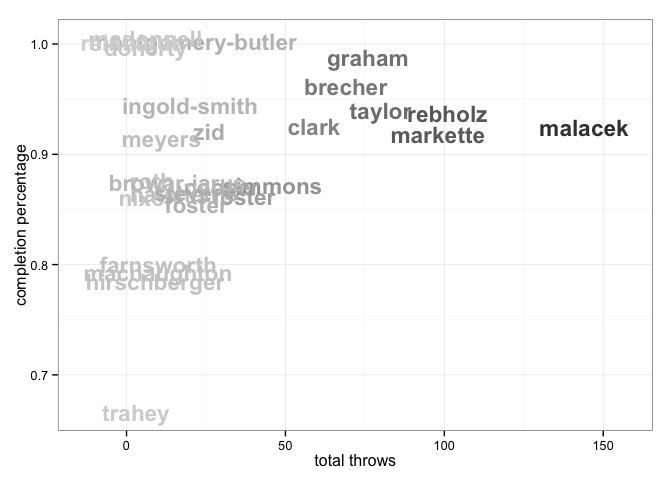
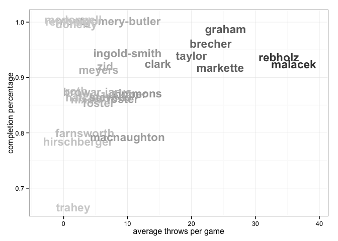
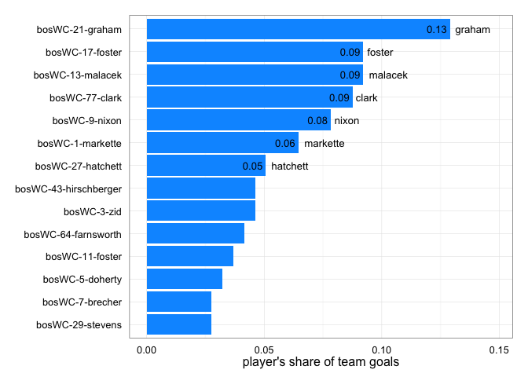
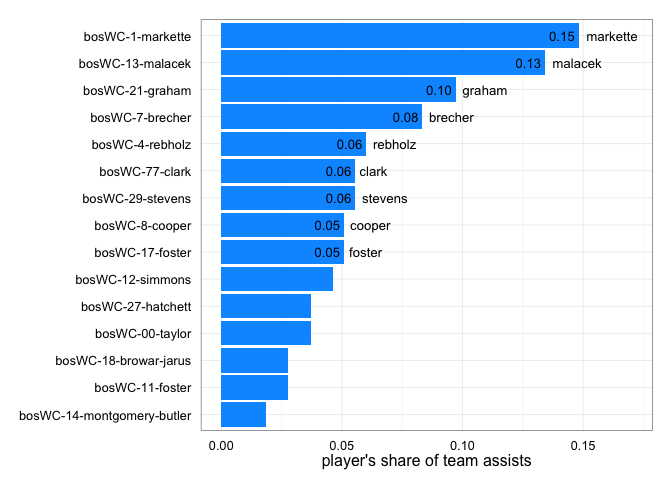
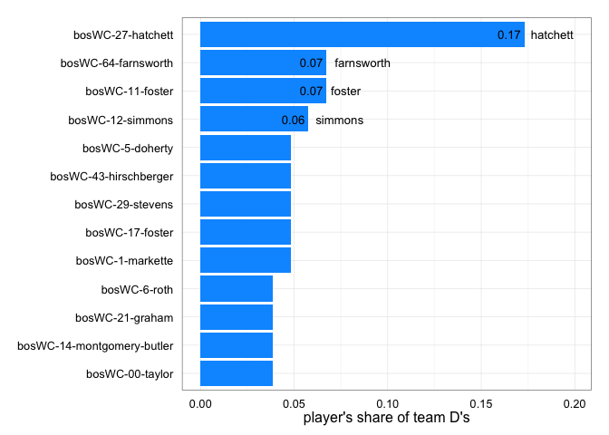
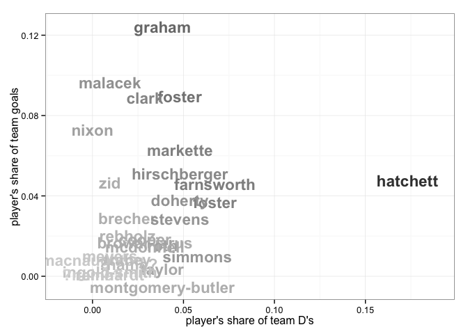

<a href="../index.html">Back to index</a>

# Player statistics for bosWC

## Data

Tables and figures below based on data from 4 games. The dataset covers 29 unique players. There are 87 rows of player-level statistics, each being a unique combination of a game and a player. 

## Player stat table

|last              |player   | games| points| goals| assists| throws| completions| comp_pct| def| catches| drop|
|:-----------------|:--------|-----:|------:|-----:|-------:|------:|-----------:|--------:|---:|-------:|----:|
|clark             |bosWC-77 |     4|     16|    11|       5|     59|          55|     0.93|   0|      70|    1|
|malacek           |bosWC-13 |     4|     16|     6|      10|    144|         133|     0.92|   0|     106|    3|
|markette          |bosWC-1  |     4|     16|     3|      13|     98|          90|     0.92|   1|      91|    1|
|graham            |bosWC-21 |     3|     13|    10|       3|     76|          75|     0.99|   2|      82|    0|
|foster            |bosWC-17 |     4|     11|     9|       2|     37|          32|     0.86|   2|      46|    2|
|brecher           |bosWC-7  |     3|      9|     0|       9|     69|          66|     0.96|   0|      59|    0|
|hatchett          |bosWC-27 |     4|      7|     5|       2|     15|          13|     0.87|   5|      18|    0|
|rebholz           |bosWC-4  |     3|      7|     2|       5|    101|          95|     0.94|   1|      91|    0|
|nixon             |bosWC-9  |     2|      6|     5|       1|      7|           6|     0.86|   0|      12|    0|
|simmons           |bosWC-12 |     4|      5|     1|       4|     46|          40|     0.87|   3|      32|    0|
|taylor            |bosWC-00 |     4|      4|     2|       2|     80|          75|     0.94|   1|      64|    2|
|farnsworth        |bosWC-64 |     3|      3|     3|       0|     10|           8|     0.80|   3|      12|    0|
|zid               |bosWC-3  |     4|      3|     2|       1|     26|          24|     0.92|   0|      28|    0|
|cooper            |bosWC-8  |     3|      3|     1|       2|     30|          26|     0.87|   0|      24|    0|
|stevens           |bosWC-29 |     3|      3|     1|       2|     22|          19|     0.86|   0|      23|    0|
|hirschberger      |bosWC-43 |     4|      2|     2|       0|      9|           7|     0.78|   5|       9|    0|
|foster            |bosWC-11 |     4|      2|     0|       2|     22|          19|     0.86|   4|      22|    0|
|montgomery-butler |bosWC-14 |     3|      2|     0|       2|     21|          21|     1.00|   1|      12|    0|
|mcdonnell         |bosWC-25 |     4|      1|     1|       0|      6|           6|     1.00|   2|       6|    0|
|doherty           |bosWC-5  |     3|      1|     1|       0|      6|           6|     1.00|   2|       6|    0|
|roth              |bosWC-6  |     4|      1|     1|       0|      8|           7|     0.88|   1|       8|    0|
|macnaughton       |bosWC-35 |     1|      1|     1|       0|     10|           8|     0.80|   0|      11|    0|
|browar-jarus      |bosWC-18 |     3|      1|     0|       1|     16|          14|     0.88|   1|      14|    0|
|ingold-smith      |bosWC-10 |     2|      1|     0|       1|     20|          19|     0.95|   0|      17|    0|
|trahey            |bosWC-28 |     2|      0|     0|       0|      3|           2|     0.67|   1|       3|    0|
|meyers            |bosWC-88 |     2|      0|     0|       0|     11|          10|     0.91|   0|       9|    0|
|reinhardt         |bosWC-2  |     1|      0|     0|       0|      1|           1|     1.00|   0|       1|    0|
|smart             |bosWC-93 |     1|      0|     0|       0|      0|           0|      NaN|   0|       1|    0|
|?name?            |bosWC-   |     1|      0|     0|       0|      0|           0|      NaN|   0|       0|    0|

## Scatterplot: completion percentage vs number of throws
 

## Scatterplot: completion percentage vs throws per game
 

## Barchart: player's share of total season goals
 

## Barchart: player's share of total season assists
 

## Barchart: player's share of total season D's
 

## Scatterplot: player's share of total season goals vs D's
 

