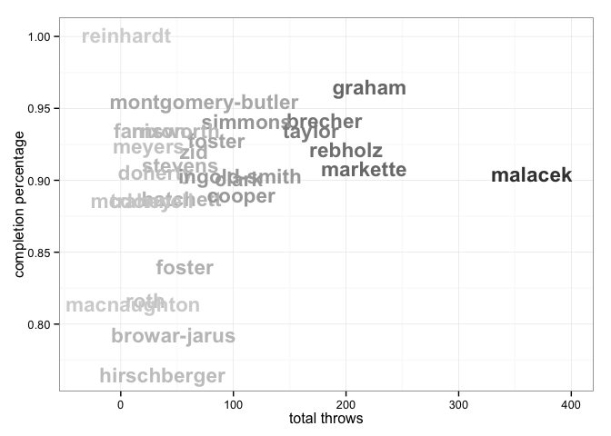
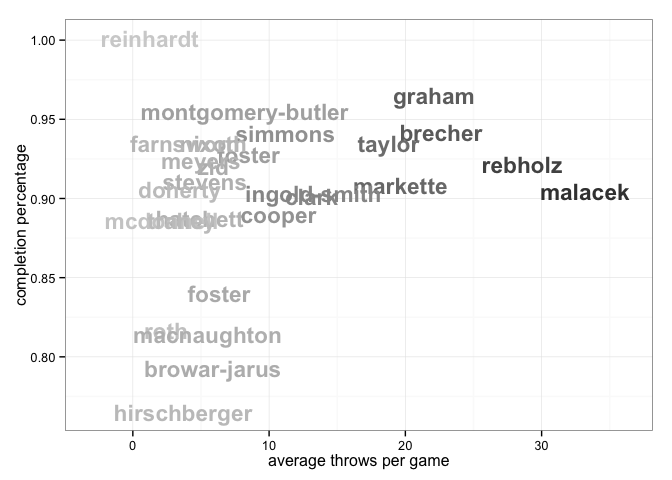

<a href="../index.html">Back to index</a>

# Player statistics for bosWC

## Data

Tables and figures below based on data from 11 games. The dataset covers 31 unique players. There are 240 rows of player-level statistics, each being a unique combination of a game and a player. 

## Player stat table

|last              |player   | games| points| goals| assists| throws| completions| comp_pct| def| catches| drop|
|:-----------------|:--------|-----:|------:|-----:|-------:|------:|-----------:|--------:|---:|-------:|----:|
|graham            |bosWC-21 |    10|     49|    28|      21|    221|         215|     0.97|   4|     238|    2|
|malacek           |bosWC-13 |    11|     49|    20|      29|    365|         328|     0.90|   1|     284|    9|
|markette          |bosWC-1  |    11|     46|    14|      32|    216|         197|     0.91|   5|     208|    4|
|foster            |bosWC-17 |    10|     31|    20|      11|     85|          79|     0.93|   5|     102|    2|
|clark             |bosWC-77 |     8|     31|    19|      12|    105|          95|     0.90|   3|     122|    1|
|brecher           |bosWC-7  |     8|     24|     6|      18|    181|         171|     0.94|   2|     144|    2|
|nixon             |bosWC-9  |     6|     19|    17|       2|     34|          32|     0.94|   0|      52|    1|
|hatchett          |bosWC-27 |    11|     19|    11|       8|     54|          48|     0.89|  18|      63|    1|
|stevens           |bosWC-29 |    10|     18|     6|      12|     53|          48|     0.91|   5|      60|    0|
|rebholz           |bosWC-4  |     7|     17|     4|      13|    200|         185|     0.92|   2|     168|    3|
|cooper            |bosWC-8  |    10|     15|     4|      11|    107|          95|     0.89|   3|      84|    1|
|foster            |bosWC-11 |     9|     14|     8|       6|     57|          48|     0.84|   7|      63|    2|
|zid               |bosWC-3  |    11|     13|    10|       3|     65|          60|     0.92|   1|      74|    0|
|simmons           |bosWC-12 |    10|     12|     2|      10|    112|         105|     0.94|   6|      76|    0|
|hirschberger      |bosWC-43 |    10|     11|    10|       1|     37|          28|     0.76|   5|      42|    0|
|farnsworth        |bosWC-64 |    10|     11|     9|       2|     41|          38|     0.93|   7|      49|    1|
|taylor            |bosWC-00 |     9|     10|     2|       8|    169|         159|     0.94|   4|     110|    4|
|browar-jarus      |bosWC-18 |     8|      9|     3|       6|     47|          37|     0.79|   3|      45|    2|
|doherty           |bosWC-5  |     9|      8|     7|       1|     31|          28|     0.90|   5|      36|    0|
|roth              |bosWC-6  |     9|      5|     4|       1|     22|          18|     0.82|   4|      25|    1|
|mcdonnell         |bosWC-25 |     9|      5|     4|       1|     19|          17|     0.89|   3|      23|    0|
|ingold-smith      |bosWC-10 |     8|      5|     2|       3|    106|          96|     0.91|   1|      86|    2|
|montgomery-butler |bosWC-14 |     9|      4|     0|       4|     74|          71|     0.96|   4|      36|    0|
|macnaughton       |bosWC-35 |     2|      3|     3|       0|     11|           9|     0.82|   0|      14|    0|
|?name?            |bosWC-44 |     1|      2|     1|       1|      9|           9|     1.00|   0|       7|    0|
|trahey            |bosWC-28 |     5|      1|     1|       0|     18|          16|     0.89|   2|      18|    0|
|?name?            |bosWC-37 |     3|      1|     1|       0|      7|           6|     0.86|   2|       7|    0|
|meyers            |bosWC-88 |     5|      1|     1|       0|     25|          23|     0.92|   1|      23|    0|
|reinhardt         |bosWC-2  |     4|      0|     0|       0|      5|           5|     1.00|   1|       5|    0|
|smart             |bosWC-93 |     2|      0|     0|       0|      0|           0|      NaN|   0|       2|    0|
|?name?            |bosWC-   |     5|      0|     0|       0|      0|           0|      NaN|   0|       0|    0|

## Scatterplot: completion percentage vs number of throws
 

## Scatterplot: completion percentage vs throws per game
 

## Barchart: player's share of total season goals
 

## Barchart: player's share of total season assists
 

## Barchart: player's share of total season D's
 

## Scatterplot: player's share of total season goals vs D's
 

