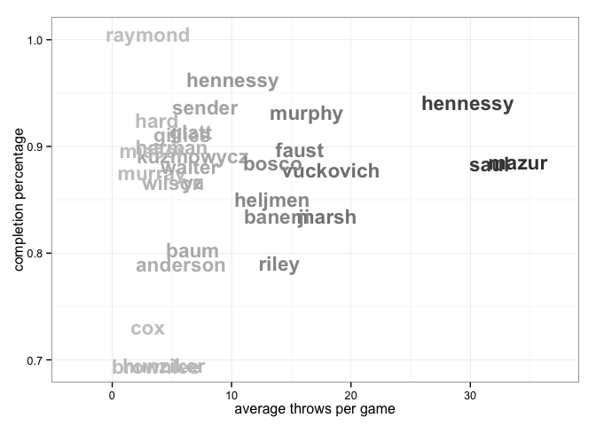
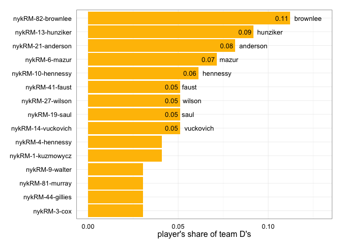

<a href="../index.html">Back to index</a>

# Player statistics for nykRM

## Data

Tables and figures below based on data from 10 games. The dataset covers 31 unique players. There are 211 rows of player-level statistics, each being a unique combination of a game and a player. 

## Player stat table

|last      |player   | games| points| goals| assists| throws| completions| comp_pct| def| catches| drop|
|:---------|:--------|-----:|------:|-----:|-------:|------:|-----------:|--------:|---:|-------:|----:|
|mazur     |nykRM-6  |     9|     34|    14|      20|    306|         271|     0.89|   7|     239|    4|
|saul      |nykRM-19 |    10|     28|     5|      23|    316|         278|     0.88|   5|     254|    8|
|vuckovich |nykRM-14 |     9|     26|    15|      11|    165|         146|     0.88|   5|     179|    2|
|faust     |nykRM-41 |     7|     24|    14|      10|    110|          99|     0.90|   5|     119|    0|
|hennessy  |nykRM-4  |     9|     22|    10|      12|    268|         253|     0.94|   4|     194|    6|
|gillies   |nykRM-44 |     8|     21|    18|       3|     47|          43|     0.91|   3|      62|    0|
|marsh     |nykRM-22 |     5|     19|     9|      10|     90|          76|     0.84|   2|      97|    2|
|yz        |nykRM-18 |     9|     18|    11|       7|     61|          53|     0.87|   0|      69|    0|
|kuzmowycz |nykRM-1  |     8|     14|     9|       5|     54|          48|     0.89|   4|      61|    1|
|murphy    |nykRM-47 |    10|     12|     4|       8|    163|         151|     0.93|   1|     122|    2|
|anderson  |nykRM-21 |     9|     11|     5|       6|     52|          41|     0.79|   8|      53|    3|
|herman    |nykRM-33 |     8|     10|     6|       4|     40|          36|     0.90|   0|      47|    1|
|heljmen   |nykRM-2  |     5|     10|     4|       6|     67|          57|     0.85|   0|      69|    3|
|cox       |nykRM-3  |     5|      8|     7|       1|     15|          11|     0.73|   3|      22|    0|
|hunziker  |nykRM-13 |     6|      8|     6|       2|     26|          18|     0.69|   9|      30|    1|
|banerji   |nykRM-38 |     5|      7|     1|       6|     69|          57|     0.83|   2|      65|    3|
|brownlee  |nykRM-82 |     9|      6|     4|       2|     33|          23|     0.70|  11|      27|    1|
|hennessy  |nykRM-10 |     9|      6|     3|       3|     91|          87|     0.96|   6|      79|    0|
|murray    |nykRM-81 |     9|      6|     3|       3|     30|          26|     0.87|   3|      34|    1|
|sender    |nykRM-5  |     9|      5|     2|       3|     70|          66|     0.94|   2|      55|    1|
|mieser    |nykRM-89 |     3|      4|     4|       0|     10|           9|     0.90|   2|      14|    0|
|baum      |nykRM-15 |     8|      4|     2|       2|     54|          44|     0.81|   1|      36|    3|
|bosco     |nykRM-26 |     9|      4|     1|       3|    121|         108|     0.89|   1|      74|    2|
|hard      |nykRM-45 |     4|      3|     2|       1|     15|          14|     0.93|   2|      17|    0|
|wilson    |nykRM-27 |     9|      3|     0|       3|     46|          40|     0.87|   5|      41|    1|
|glatt     |nykRM-24 |     5|      3|     0|       3|     33|          30|     0.91|   2|      25|    1|
|walter    |nykRM-9  |     4|      2|     1|       1|     26|          23|     0.88|   3|      24|    1|
|raymond   |nykRM-8  |     5|      1|     0|       1|     15|          15|     1.00|   2|      14|    0|
|riley     |nykRM-7  |     1|      1|     0|       1|     14|          11|     0.79|   0|      11|    1|
|snyder    |nykRM-50 |     1|      0|     0|       0|      0|           0|      NaN|   0|       1|    0|
|?name?    |nykRM-   |     4|      0|     0|       0|      0|           0|      NaN|   0|       0|    0|

## Scatterplot: completion percentage vs number of throws
 

## Scatterplot: completion percentage vs throws per game
 

## Barchart: player's share of total season goals
 

## Barchart: player's share of total season assists
 

## Barchart: player's share of total season D's
 

## Scatterplot: player's share of total season goals vs D's
 

