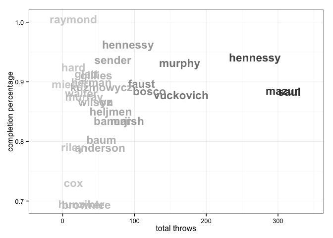

<a href="../index.html">Back to index</a>

# Player statistics for nykRM

## Data

Tables and figures below based on data from 3 games. The dataset covers 28 unique players. There are 62 rows of player-level statistics, each being a unique combination of a game and a player. 

## Player stat table

|last      |player   | games| points| goals| assists| throws| completions| comp_pct| def| catches| drop|
|:---------|:--------|-----:|------:|-----:|-------:|------:|-----------:|--------:|---:|-------:|----:|
|vuckovich |nykRM-14 |     3|     10|     6|       4|     59|          53|     0.90|   2|      66|    0|
|saul      |nykRM-19 |     3|      9|     1|       8|    105|          91|     0.87|   0|      93|    2|
|mazur     |nykRM-6  |     2|      7|     4|       3|     73|          61|     0.84|   1|      58|    0|
|yz        |nykRM-18 |     3|      7|     3|       4|     25|          23|     0.92|   0|      28|    0|
|hunziker  |nykRM-13 |     2|      6|     5|       1|     11|           9|     0.82|   1|      15|    0|
|faust     |nykRM-41 |     2|      6|     4|       2|     39|          35|     0.90|   0|      42|    0|
|herman    |nykRM-33 |     3|      6|     4|       2|     18|          17|     0.94|   0|      22|    0|
|murphy    |nykRM-47 |     3|      6|     3|       3|     71|          63|     0.89|   0|      59|    0|
|kuzmowycz |nykRM-1  |     2|      5|     2|       3|     16|          14|     0.88|   2|      18|    0|
|marsh     |nykRM-22 |     1|      5|     2|       3|     20|          18|     0.90|   0|      22|    0|
|hennessy  |nykRM-4  |     3|      4|     3|       1|    104|          97|     0.93|   2|      75|    3|
|heljmen   |nykRM-2  |     1|      4|     1|       3|     21|          19|     0.90|   0|      21|    0|
|brownlee  |nykRM-82 |     3|      3|     2|       1|     10|           8|     0.80|   2|       7|    0|
|murray    |nykRM-81 |     3|      3|     2|       1|      8|           7|     0.88|   1|      11|    0|
|anderson  |nykRM-21 |     3|      3|     0|       3|     23|          20|     0.87|   2|      21|    1|
|gillies   |nykRM-44 |     2|      2|     2|       0|     11|          10|     0.91|   0|      13|    0|
|baum      |nykRM-15 |     2|      2|     1|       1|     14|          12|     0.86|   0|      11|    1|
|sender    |nykRM-5  |     3|      2|     0|       2|     29|          28|     0.97|   1|      18|    0|
|hennessy  |nykRM-10 |     2|      1|     1|       0|     19|          17|     0.89|   2|      17|    0|
|bosco     |nykRM-26 |     3|      1|     1|       0|     50|          46|     0.92|   0|      30|    0|
|cox       |nykRM-3  |     1|      1|     1|       0|      0|           0|      NaN|   0|       1|    0|
|wilson    |nykRM-27 |     3|      1|     0|       1|     22|          19|     0.86|   2|      19|    0|
|glatt     |nykRM-24 |     3|      1|     0|       1|     20|          18|     0.90|   2|      16|    1|
|raymond   |nykRM-8  |     2|      1|     0|       1|      6|           6|     1.00|   0|       6|    0|
|walter    |nykRM-9  |     1|      0|     0|       0|      7|           6|     0.86|   1|       7|    0|
|mieser    |nykRM-89 |     1|      0|     0|       0|      4|           3|     0.75|   1|       4|    0|
|hard      |nykRM-45 |     1|      0|     0|       0|      1|           1|     1.00|   0|       1|    0|
|?name?    |nykRM-   |     1|      0|     0|       0|      0|           0|      NaN|   0|       0|    0|

## Scatterplot: completion percentage vs number of throws
 

## Scatterplot: completion percentage vs throws per game
 

## Barchart: player's share of total season goals
 

## Barchart: player's share of total season assists
 

## Barchart: player's share of total season D's
 

## Scatterplot: player's share of total season goals vs D's
 

