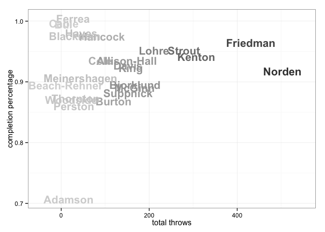
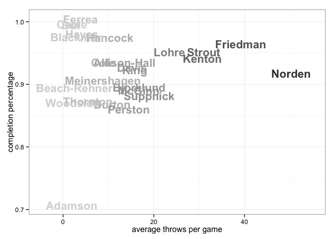
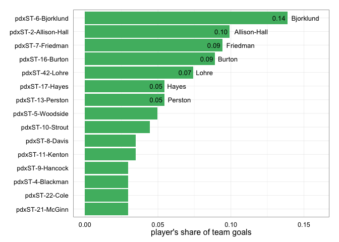
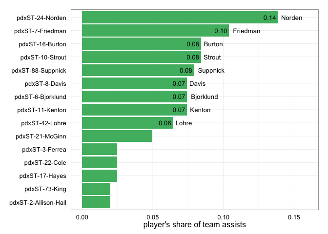
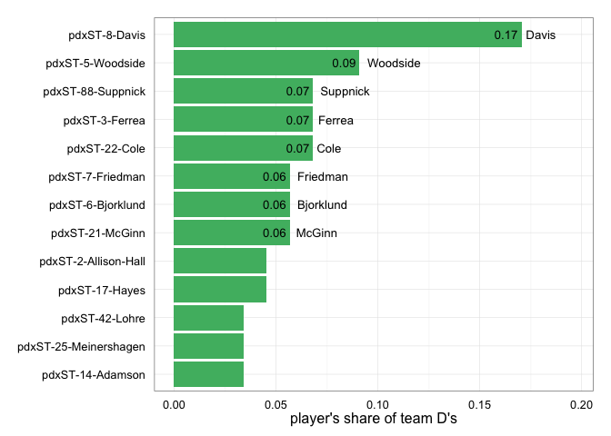
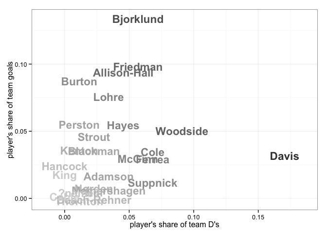

<a href="../index.html">Back to index</a>

# Player statistics for pdxST

## Data

Tables and figures below based on data from 11 games. The dataset covers 27 unique players. There are 214 rows of player-level statistics, each being a unique combination of a game and a player. 

## Player stat table

|last         |player   | games| points| goals| assists| throws| completions| comp_pct| def| catches| drop|
|:------------|:--------|-----:|------:|-----:|-------:|------:|-----------:|--------:|---:|-------:|----:|
|Bjorklund    |pdxST-6  |    10|     43|    28|      15|    168|         151|     0.90|   5|     188|    1|
|Friedman     |pdxST-7  |    11|     40|    19|      21|    431|         413|     0.96|   5|     388|    1|
|Burton       |pdxST-16 |    11|     35|    18|      17|    119|         104|     0.87|   1|     136|    2|
|Norden       |pdxST-24 |    10|     30|     2|      28|    503|         464|     0.92|   2|     419|    5|
|Lohre        |pdxST-42 |     9|     28|    15|      13|    211|         201|     0.95|   3|     216|    2|
|Strout       |pdxST-10 |     9|     26|     9|      17|    279|         265|     0.95|   2|     257|    2|
|Allison-Hall |pdxST-2  |    11|     24|    20|       4|    149|         140|     0.94|   4|     170|    1|
|Davis        |pdxST-8  |    10|     22|     7|      15|    152|         141|     0.93|  15|     131|    2|
|Kenton       |pdxST-11 |    10|     22|     7|      15|    307|         288|     0.94|   1|     259|    6|
|Suppnick     |pdxST-88 |     8|     18|     2|      16|    152|         134|     0.88|   6|     111|    1|
|Hayes        |pdxST-17 |    11|     16|    11|       5|     46|          45|     0.98|   4|      51|    0|
|McGinn       |pdxST-21 |    10|     16|     6|      10|    167|         149|     0.89|   5|     130|    1|
|Perston      |pdxST-13 |     2|     12|    11|       1|     29|          25|     0.86|   1|      39|    2|
|Woodside     |pdxST-5  |    11|     11|    10|       1|     23|          20|     0.87|   8|      32|    0|
|Cole         |pdxST-22 |    10|     11|     6|       5|     89|          83|     0.93|   6|      85|    2|
|Ferrea       |pdxST-3  |     7|     10|     5|       5|     27|          27|     1.00|   6|      27|    0|
|Hancock      |pdxST-9  |     9|      9|     6|       3|     93|          91|     0.98|   0|      87|    0|
|King         |pdxST-73 |    10|      7|     3|       4|    158|         145|     0.92|   0|     138|    1|
|Blackman     |pdxST-4  |    10|      6|     6|       0|     31|          30|     0.97|   2|      35|    0|
|Adamson      |pdxST-14 |     9|      5|     4|       1|     17|          12|     0.71|   3|      21|    1|
|Meinershagen |pdxST-25 |     5|      5|     2|       3|     44|          40|     0.91|   3|      44|    0|
|Thornton     |pdxST-15 |     6|      4|     1|       3|     33|          29|     0.88|   1|      31|    0|
|Bui          |pdxST-12 |     3|      2|     2|       0|      5|           5|     1.00|   2|       7|    0|
|Beach-Rehner |pdxST-20 |     4|      1|     1|       0|     10|           9|     0.90|   2|      10|    0|
|Cable        |pdxST-1  |     3|      1|     1|       0|      6|           6|     1.00|   0|       4|    0|
|?name?       |pdxST-?  |     2|      0|     0|       0|      5|           4|     0.80|   1|       5|    1|
|?name?       |pdxST-   |     3|      0|     0|       0|      0|           0|      NaN|   0|       0|    0|

## Scatterplot: completion percentage vs number of throws
 

## Scatterplot: completion percentage vs throws per game
 

## Barchart: player's share of total season goals
 

## Barchart: player's share of total season assists
 

## Barchart: player's share of total season D's
 

## Scatterplot: player's share of total season goals vs D's
 

