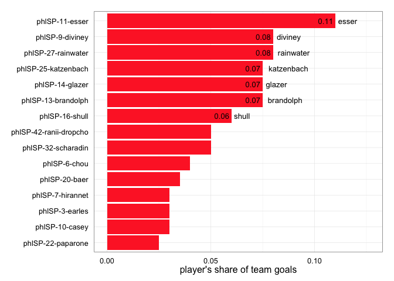
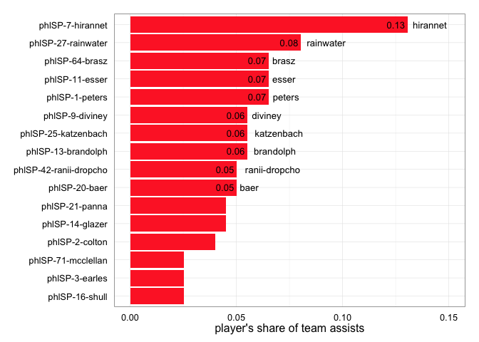

<a href="../index.html">Back to index</a>

# Player statistics for phlSP

## Data

Tables and figures below based on data from 10 games. The dataset covers 33 unique players. There are 225 rows of player-level statistics, each being a unique combination of a game and a player. 

## Player stat table

|last          |player   | games| points| goals| assists| throws| completions| comp_pct| def| catches| drop|
|:-------------|:--------|-----:|------:|-----:|-------:|------:|-----------:|--------:|---:|-------:|----:|
|esser         |phlSP-11 |    10|     35|    22|      13|    106|         102|     0.96|   9|     124|    1|
|rainwater     |phlSP-27 |     8|     32|    16|      16|    203|         189|     0.93|   6|     212|    3|
|hirannet      |phlSP-7  |    10|     32|     6|      26|    414|         390|     0.94|   3|     334|    6|
|diviney       |phlSP-9  |     8|     27|    16|      11|     70|          57|     0.81|   4|      82|    2|
|brandolph     |phlSP-13 |     9|     26|    15|      11|    264|         249|     0.94|   2|     223|    2|
|katzenbach    |phlSP-25 |     7|     26|    15|      11|    196|         188|     0.96|   1|     192|    1|
|glazer        |phlSP-14 |     9|     24|    15|       9|    158|         150|     0.95|   2|     171|    0|
|ranii-dropcho |phlSP-42 |     4|     20|    10|      10|     60|          56|     0.93|   2|      68|    1|
|shull         |phlSP-16 |    10|     17|    12|       5|     86|          80|     0.93|   8|      97|    1|
|baer          |phlSP-20 |     9|     17|     7|      10|    300|         277|     0.92|   3|     227|    4|
|brasz         |phlSP-64 |     9|     15|     2|      13|    138|         125|     0.91|   2|     122|    0|
|peters        |phlSP-1  |     9|     14|     1|      13|     90|          72|     0.80|   3|      74|    3|
|scharadin     |phlSP-32 |     4|     13|    10|       3|     42|          38|     0.90|   2|      48|    1|
|panna         |phlSP-21 |     9|     13|     4|       9|    146|         126|     0.86|   6|     105|    4|
|colton        |phlSP-2  |     9|     12|     4|       8|     83|          76|     0.92|   4|      60|    3|
|chou          |phlSP-6  |     9|     11|     8|       3|     58|          48|     0.83|   7|      63|    0|
|earles        |phlSP-3  |     4|     11|     6|       5|     45|          36|     0.80|   0|      43|    2|
|mcclellan     |phlSP-71 |     6|      9|     4|       5|     77|          57|     0.74|   0|      65|    2|
|paparone      |phlSP-22 |     9|      8|     5|       3|     29|          29|     1.00|   5|      33|    0|
|casey         |phlSP-10 |     9|      6|     6|       0|     14|          13|     0.93|   3|      16|    0|
|dillon        |phlSP-76 |     4|      6|     3|       3|     28|          24|     0.86|   3|      27|    2|
|damiano       |phlSP-4  |     7|      6|     3|       3|     50|          46|     0.92|   0|      47|    1|
|lindsey       |phlSP-31 |    10|      5|     4|       1|     38|          36|     0.95|   7|      39|    1|
|thorne        |phlSP-23 |     4|      5|     2|       3|     62|          59|     0.95|   1|      59|    0|
|baer          |phlSP-28 |     8|      3|     1|       2|     24|          21|     0.88|   2|      18|    0|
|wisch         |phlSP-38 |     4|      3|     1|       2|     28|          25|     0.89|   0|      26|    0|
|zumbrum       |phlSP-12 |     5|      1|     1|       0|     19|          17|     0.89|   1|      19|    0|
|ward          |phlSP-33 |     8|      1|     1|       0|     38|          38|     1.00|   0|      30|    0|
|furfari       |phlSP-8  |     3|      1|     0|       1|      3|           2|     0.67|   1|       3|    0|
|mathison      |phlSP-41 |     3|      0|     0|       0|      4|           4|     1.00|   1|       3|    0|
|li            |phlSP-77 |     2|      0|     0|       0|      5|           5|     1.00|   0|       4|    0|
|carter        |phlSP-88 |     3|      0|     0|       0|      4|           3|     0.75|   0|       4|    0|
|?name?        |phlSP-   |     3|      0|     0|       0|      0|           0|      NaN|   0|       0|    0|

## Scatterplot: completion percentage vs number of throws
 

## Scatterplot: completion percentage vs throws per game
 

## Barchart: player's share of total season goals
 

## Barchart: player's share of total season assists
 

## Barchart: player's share of total season D's
 

## Scatterplot: player's share of total season goals vs D's
 

