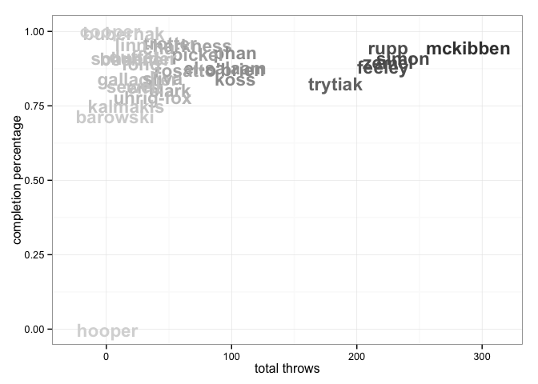
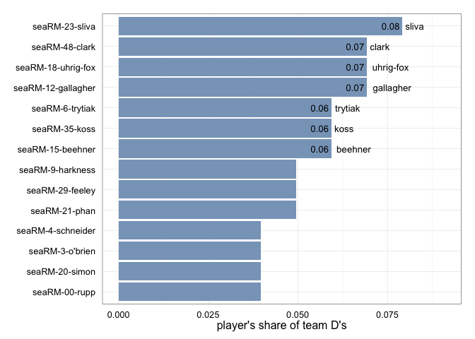

<a href="../index.html">Back to index</a>

# Player statistics for seaRM

## Data

Tables and figures below based on data from 10 games. The dataset covers 38 unique players. There are 210 rows of player-level statistics, each being a unique combination of a game and a player. 

## Player stat table

|last      |player   | games| points| goals| assists| throws| completions| comp_pct| def| catches| drop|
|:---------|:--------|-----:|------:|-----:|-------:|------:|-----------:|--------:|---:|-------:|----:|
|trytiak   |seaRM-6  |    10|     44|    17|      27|    183|         152|     0.83|   6|     193|    1|
|clark     |seaRM-48 |     6|     39|    32|       7|     51|          41|     0.80|   7|      81|    2|
|el-salaam |seaRM-99 |     6|     32|    20|      12|     95|          84|     0.88|   2|     116|    1|
|zemel     |seaRM-17 |     8|     25|     6|      19|    225|         202|     0.90|   2|     191|    5|
|simon     |seaRM-20 |     6|     21|     5|      16|    237|         215|     0.91|   4|     188|    5|
|feeley    |seaRM-29 |    10|     20|     3|      17|    221|         194|     0.88|   5|     147|    4|
|harkness  |seaRM-9  |     6|     19|    14|       5|     69|          66|     0.96|   5|      76|    1|
|mckibben  |seaRM-1  |     9|     19|    11|       8|    289|         274|     0.95|   2|     237|    0|
|gallagher |seaRM-12 |     6|     16|    10|       6|     25|          21|     0.84|   7|      35|    1|
|koss      |seaRM-35 |     5|     16|     3|      13|    103|          87|     0.84|   6|      82|    4|
|phan      |seaRM-21 |     8|     15|     2|      13|    103|          96|     0.93|   5|      86|    0|
|uhrig-fox |seaRM-18 |     8|     14|    11|       3|     37|          29|     0.78|   7|      48|    4|
|rosatto   |seaRM-25 |     6|     14|     8|       6|     63|          55|     0.87|   1|      62|    0|
|trotter   |seaRM-77 |     5|     10|     4|       6|     51|          49|     0.96|   1|      52|    0|
|entz      |seaRM-51 |     9|      9|     7|       2|     31|          25|     0.81|   2|      37|    0|
|sliva     |seaRM-23 |     8|      9|     6|       3|     45|          38|     0.84|   8|      48|    0|
|chu       |seaRM-5  |     6|      9|     4|       5|     42|          40|     0.95|   0|      47|    0|
|fong      |seaRM-8  |     5|      8|     4|       4|     28|          25|     0.89|   2|      31|    2|
|duffel    |seaRM-24 |     9|      7|     6|       1|     22|          20|     0.91|   2|      26|    0|
|beehner   |seaRM-15 |     9|      5|     3|       2|     23|          21|     0.91|   6|      26|    1|
|sewell    |seaRM-13 |     6|      5|     3|       2|     22|          18|     0.82|   3|      19|    2|
|o'brien   |seaRM-3  |     3|      5|     0|       5|    103|          91|     0.88|   4|      66|    3|
|bubernak  |seaRM-2  |     7|      4|     2|       2|     14|          14|     1.00|   1|      18|    0|
|pickel    |seaRM-14 |     6|      4|     2|       2|     73|          68|     0.93|   0|      62|    0|
|rupp      |seaRM-00 |     8|      3|     3|       0|    225|         214|     0.95|   4|     162|    1|
|barowski  |seaRM-31 |     1|      1|     1|       0|      7|           5|     0.71|   0|       8|    0|
|schneider |seaRM-4  |     6|      1|     0|       1|     22|          20|     0.91|   4|      19|    0|
|linn      |seaRM-28 |     5|      0|     0|       0|     20|          19|     0.95|   3|      20|    1|
|kalmakis  |seaRM-10 |     5|      0|     0|       0|     16|          12|     0.75|   1|      14|    1|
|cooper    |seaRM-7  |     3|      0|     0|       0|      3|           3|     1.00|   1|       3|    0|
|?name?    |seaRM-?  |     3|      0|     0|       0|      6|           5|     0.83|   0|       3|    1|
|?name?    |seaRM-26 |     2|      0|     0|       0|      3|           3|     1.00|   0|       3|    0|
|?name?    |seaRM-0  |     1|      0|     0|       0|      1|           1|     1.00|   0|       1|    0|
|hooper    |seaRM-16 |     1|      0|     0|       0|      1|           0|     0.00|   0|       1|    0|
|?name?    |seaRM-27 |     1|      0|     0|       0|      1|           1|     1.00|   0|       1|    0|
|?name?    |seaRM-32 |     1|      0|     0|       0|      1|           1|     1.00|   0|       1|    0|
|?name?    |seaRM-   |     5|      0|     0|       0|      0|           0|      NaN|   0|       0|    0|
|?name?    |seaRM-88 |     1|      0|     0|       0|      1|           1|     1.00|   0|       0|    0|

## Scatterplot: completion percentage vs number of throws
 

## Scatterplot: completion percentage vs throws per game
 

## Barchart: player's share of total season goals
 

## Barchart: player's share of total season assists
 

## Barchart: player's share of total season D's
 

## Scatterplot: player's share of total season goals vs D's
 

