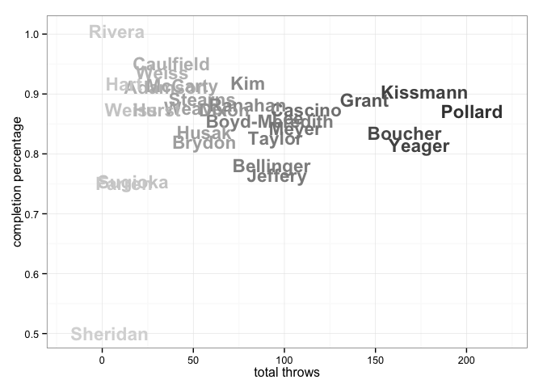
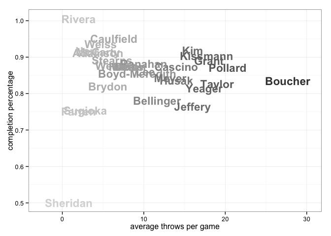
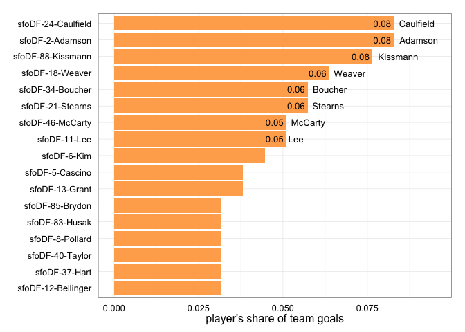
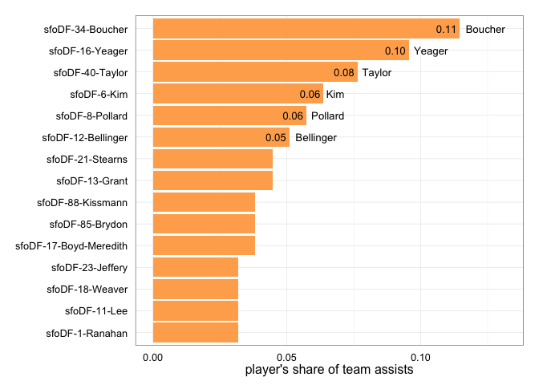
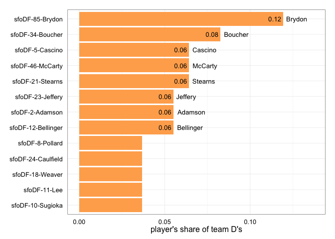
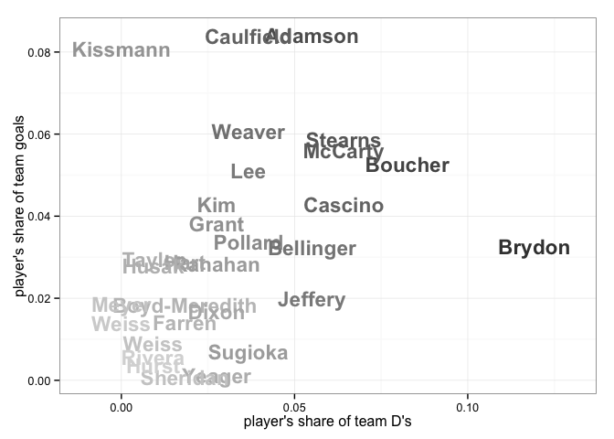

<a href="../index.html">Back to index</a>

# Player statistics for sfoDF

## Data

Tables and figures below based on data from 10 games. The dataset covers 33 unique players. There are 218 rows of player-level statistics, each being a unique combination of a game and a player. 

## Player stat table

|last          |player   | games| points| goals| assists| throws| completions| comp_pct| def| catches| drop|
|:-------------|:--------|-----:|------:|-----:|-------:|------:|-----------:|--------:|---:|-------:|----:|
|Boucher       |sfoDF-34 |     6|     27|     9|      18|    166|         139|     0.84|   9|     141|    7|
|Kissmann      |sfoDF-88 |    10|     18|    12|       6|    177|         160|     0.90|   0|     168|    0|
|Kim           |sfoDF-6  |     5|     17|     7|      10|     80|          74|     0.92|   3|      84|    1|
|Taylor        |sfoDF-40 |     5|     17|     5|      12|     95|          79|     0.83|   1|      87|    1|
|Adamson       |sfoDF-2  |     8|     16|    13|       3|     35|          32|     0.91|   6|      47|    0|
|Stearns       |sfoDF-21 |     9|     16|     9|       7|     55|          49|     0.89|   7|      64|    2|
|Yeager        |sfoDF-16 |    10|     16|     1|      15|    174|         143|     0.82|   3|     110|    8|
|Weaver        |sfoDF-18 |     8|     15|    10|       5|     52|          46|     0.88|   4|      57|    2|
|Caulfield     |sfoDF-24 |     6|     14|    13|       1|     38|          36|     0.95|   4|      49|    1|
|Pollard       |sfoDF-8  |    10|     14|     5|       9|    203|         176|     0.87|   4|     161|    7|
|Lee           |sfoDF-11 |    10|     13|     8|       5|    102|          88|     0.86|   4|      82|    2|
|Grant         |sfoDF-13 |     8|     13|     6|       7|    144|         128|     0.89|   3|     120|    4|
|Bellinger     |sfoDF-12 |     8|     13|     5|       8|     93|          73|     0.78|   6|      58|    4|
|Brydon        |sfoDF-85 |    10|     11|     5|       6|     56|          46|     0.82|  13|      63|    3|
|McCarty       |sfoDF-46 |    10|     10|     8|       2|     44|          40|     0.91|   7|      54|    2|
|Cascino       |sfoDF-5  |     8|      9|     6|       3|    112|          97|     0.87|   7|      92|    6|
|Jeffery       |sfoDF-23 |     6|      9|     4|       5|     96|          74|     0.77|   6|      72|    2|
|Ranahan       |sfoDF-1  |     8|      9|     4|       5|     80|          70|     0.88|   3|      61|    3|
|Boyd-Meredith |sfoDF-17 |    10|      8|     2|       6|     92|          78|     0.85|   2|      57|    1|
|Hart          |sfoDF-37 |     4|      7|     5|       2|     12|          11|     0.92|   2|      17|    1|
|Husak         |sfoDF-83 |     4|      7|     5|       2|     56|          47|     0.84|   1|      45|    1|
|Meyer         |sfoDF-57 |     8|      7|     4|       3|    106|          90|     0.85|   0|      72|    2|
|Weiss         |sfoDF-3  |     2|      7|     3|       4|     16|          14|     0.88|   0|      18|    0|
|Sugioka       |sfoDF-10 |     6|      6|     2|       4|     17|          13|     0.76|   4|      18|    1|
|Weiss         |sfoDF-19 |     7|      5|     2|       3|     33|          31|     0.94|   1|      35|    0|
|Dixon         |sfoDF-25 |     8|      4|     2|       2|     67|          58|     0.87|   3|      51|    3|
|Farren        |sfoDF-9  |     6|      2|     2|       0|     12|           9|     0.75|   2|      14|    0|
|Rivera        |sfoDF-22 |     4|      2|     0|       2|      8|           8|     1.00|   1|       9|    0|
|Sheridan      |sfoDF-7  |     5|      1|     0|       1|      4|           2|     0.50|   2|       4|    0|
|Hurst         |sfoDF-14 |     4|      1|     0|       1|     30|          26|     0.87|   1|      24|    1|
|?name?        |sfoDF-?  |     2|      0|     0|       0|      0|           0|      NaN|   0|       3|    0|
|?name?        |sfoDF-86 |     1|      0|     0|       0|      1|           1|     1.00|   0|       1|    0|
|?name?        |sfoDF-   |     2|      0|     0|       0|      0|           0|      NaN|   0|       0|    0|

## Scatterplot: completion percentage vs number of throws
 

## Scatterplot: completion percentage vs throws per game
 

## Barchart: player's share of total season goals
 

## Barchart: player's share of total season assists
 

## Barchart: player's share of total season D's
 

## Scatterplot: player's share of total season goals vs D's
 

