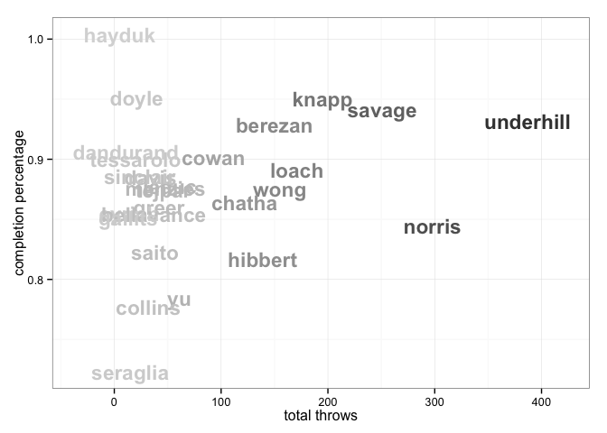

<a href="index.html">Back to index</a>

# Player statistics for vanNH

## Data

Tables and figures below based on data from 11 games. The dataset covers 31 unique players. There are 248 rows of player-level statistics, each being a unique combination of a game and a player. 

## Player stat table:

|last       |player   | points| goals| assists| throws| completions| comp_pct| def| catches| drop|
|:----------|:--------|------:|-----:|-------:|------:|-----------:|--------:|---:|-------:|----:|
|wong       |vanNH-98 |     67|    50|      17|    155|         136|     0.88|   4|     202|    1|
|chatha     |vanNH-10 |     35|    25|      10|    122|         105|     0.86|   1|     145|    4|
|berezan    |vanNH-22 |     30|    18|      12|    150|         139|     0.93|   7|     168|    3|
|leduc      |vanNH-72 |     29|    17|      12|     52|          46|     0.88|   3|      69|    1|
|loach      |vanNH-21 |     29|     9|      20|    171|         152|     0.89|   2|     177|    4|
|underhill  |vanNH-89 |     29|     7|      22|    387|         358|     0.93|   6|     287|   11|
|norris     |vanNH-5  |     29|     5|      24|    298|         254|     0.85|   1|     213|    9|
|hibbert    |vanNH-8  |     28|     8|      20|    139|         114|     0.82|  18|     132|    4|
|savage     |vanNH-91 |     25|     5|      20|    251|         235|     0.94|   2|     188|    3|
|cowan      |vanNH-45 |     15|     7|       8|     93|          84|     0.90|   2|      56|    1|
|knapp      |vanNH-19 |     14|     8|       6|    195|         185|     0.95|   2|     145|    4|
|tessarolo  |vanNH-13 |     13|     7|       6|     20|          18|     0.90|  11|      24|    1|
|greer      |vanNH-11 |     13|     4|       9|     42|          36|     0.86|   6|      40|    0|
|doyle      |vanNH-4  |     12|     9|       3|     21|          20|     0.95|   6|      26|    1|
|davis      |vanNH-27 |     11|     9|       2|     34|          30|     0.88|   3|      41|    0|
|tejpar     |vanNH-81 |     11|     5|       6|     46|          40|     0.87|   2|      37|    3|
|yu         |vanNH-24 |     10|     5|       5|     61|          48|     0.79|   9|      41|    3|
|saito      |vanNH-31 |      8|     6|       2|     38|          31|     0.82|   5|      40|    1|
|sinclair   |vanNH-37 |      8|     5|       3|     24|          21|     0.88|   1|      28|    2|
|collins    |vanNH-33 |      7|     5|       2|     32|          25|     0.78|   3|      22|    1|
|menzies    |vanNH-18 |      7|     2|       5|     48|          42|     0.88|   2|      31|    1|
|seraglia   |vanNH-39 |      6|     3|       3|     15|          11|     0.73|   5|      17|    1|
|eyrich     |vanNH-14 |      5|     3|       2|     14|          12|     0.86|   5|      17|    0|
|bellavance |vanNH-75 |      5|     2|       3|     37|          32|     0.86|   2|      24|    0|
|dandurand  |vanNH-7  |      4|     1|       3|     11|          10|     0.91|   3|      10|    0|
|hayduk     |vanNH-49 |      1|     1|       0|      5|           5|     1.00|   1|       4|    0|
|gailits    |vanNH-6  |      1|     0|       1|     13|          11|     0.85|   0|      12|    0|
|?name?     |vanNH-?  |      0|     0|       0|      0|           0|      NaN|   0|       7|    0|
|?name?     |vanNH-15 |      0|     0|       0|      1|           1|     1.00|   0|       0|    0|
|?name?     |vanNH-17 |      0|     0|       0|      2|           2|     1.00|   0|       0|    0|

## Scatterplot: completion percentage vs number of throws
 

