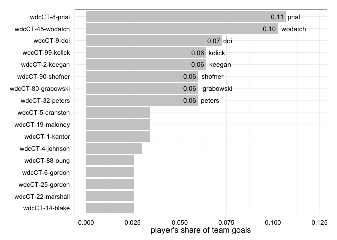

<a href="../index.html">Back to index</a>

# Player statistics for wdcCT

## Data

Tables and figures below based on data from 11 games. The dataset covers 33 unique players. There are 273 rows of player-level statistics, each being a unique combination of a game and a player. 

## Player stat table

|last           |player   | games| points| goals| assists| throws| completions| comp_pct| def| catches| drop|
|:--------------|:--------|-----:|------:|-----:|-------:|------:|-----------:|--------:|---:|-------:|----:|
|kolick         |wdcCT-99 |    11|     51|    15|      36|    431|         407|     0.94|   7|     364|    5|
|shofner        |wdcCT-90 |    11|     47|    14|      33|    201|         173|     0.86|   6|     189|    2|
|prial          |wdcCT-8  |     9|     42|    25|      17|    187|         172|     0.92|  10|     202|    3|
|wodatch        |wdcCT-45 |    11|     37|    24|      13|    127|         123|     0.97|   2|     150|    1|
|keegan         |wdcCT-2  |    10|     30|    15|      15|    239|         217|     0.91|   3|     196|    1|
|doi            |wdcCT-9  |    11|     28|    17|      11|     95|          82|     0.86|   2|     113|    6|
|peters         |wdcCT-32 |    10|     23|    14|       9|    125|         114|     0.91|   3|     115|    1|
|grabowski      |wdcCT-80 |    10|     18|    14|       4|     35|          32|     0.91|   0|      46|    1|
|blake          |wdcCT-14 |     9|     16|     6|      10|    129|         122|     0.95|   3|      97|    0|
|cranston       |wdcCT-5  |    11|     13|     8|       5|     95|          84|     0.88|   7|      97|    1|
|maloney        |wdcCT-19 |     9|     13|     8|       5|     46|          40|     0.87|   1|      44|    1|
|oung           |wdcCT-88 |    10|     13|     6|       7|    174|         164|     0.94|   9|     124|    2|
|marshall       |wdcCT-22 |     8|     13|     6|       7|     37|          31|     0.84|   7|      39|    0|
|kantor         |wdcCT-1  |    11|     11|     8|       3|     49|          46|     0.94|   5|      52|    0|
|johnson        |wdcCT-4  |     8|     11|     7|       4|     40|          39|     0.98|  11|      42|    0|
|gibson         |wdcCT-42 |     6|     11|     5|       6|     26|          25|     0.96|   8|      26|    0|
|bellinger      |wdcCT-12 |    10|     11|     3|       8|    106|          98|     0.92|   2|      73|    1|
|gordon         |wdcCT-6  |    10|     10|     6|       4|     32|          27|     0.84|   4|      35|    0|
|salmi          |wdcCT-61 |     8|      8|     3|       5|     56|          51|     0.91|   1|      47|    0|
|poole          |wdcCT-20 |     5|      8|     2|       6|     22|          20|     0.91|   0|      18|    1|
|gordon         |wdcCT-25 |     9|      7|     6|       1|     26|          23|     0.88|   5|      30|    0|
|dulabon        |wdcCT-21 |    10|      7|     5|       2|     28|          26|     0.93|   4|      30|    0|
|miner          |wdcCT-17 |    10|      7|     4|       3|     36|          36|     1.00|   3|      39|    0|
|boylan-kolchin |wdcCT-7  |    11|      7|     3|       4|     49|          44|     0.90|   5|      49|    3|
|cobb           |wdcCT-31 |     9|      5|     4|       1|     21|          18|     0.86|   3|      25|    0|
|castine        |wdcCT-15 |     3|      5|     0|       5|     43|          39|     0.91|   4|      33|    1|
|fickley        |wdcCT-3  |     4|      5|     0|       5|     33|          29|     0.88|   2|      22|    2|
|fleming        |wdcCT-24 |     8|      4|     3|       1|     12|          10|     0.83|   7|      14|    1|
|johnston       |wdcCT-27 |    10|      4|     2|       2|     97|          88|     0.91|   3|      69|    1|
|tsai           |wdcCT-23 |     5|      3|     1|       2|     36|          32|     0.89|   2|      32|    0|
|?name?         |wdcCT-49 |     1|      0|     0|       0|      1|           1|     1.00|   0|       1|    0|
|?name?         |wdcCT-82 |     1|      0|     0|       0|      1|           1|     1.00|   0|       1|    0|
|?name?         |wdcCT-   |     4|      0|     0|       0|      0|           0|      NaN|   0|       0|    0|

## Scatterplot: completion percentage vs number of throws
 

## Scatterplot: completion percentage vs throws per game
 

## Barchart: player's share of total season goals
 

## Barchart: player's share of total season D's
 

## Scatterplot: player's share of total season goals vs D's
 
