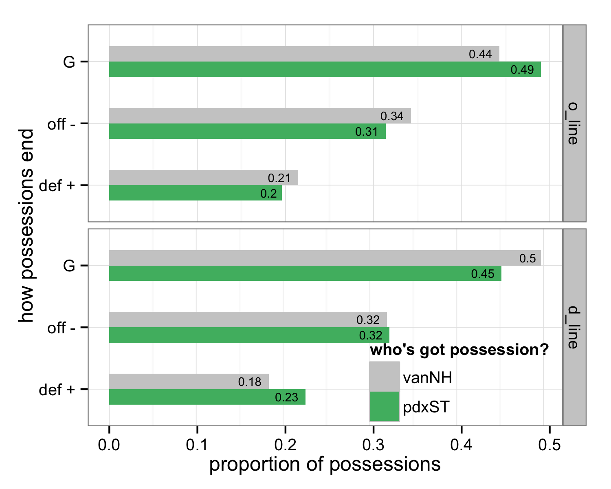
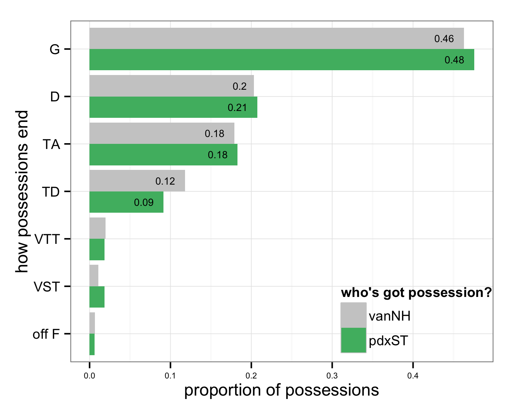

<a href="index.html">Back to index</a>

## Data

The figures below are based on data from all games the Vancouver Nighthawks played in 2014 (10 games) plus one "other"" Western Conference game, Week 3 - 4/26 - Stags @ Dogfish. I have data for all 10 "other" Western Conference games, but I've only processed them up to week 3. Therefore, this is the only Portland Stags game I've added that does not involved the Nighthawks.

In particular, all head-to-head games between Stags and Nighthawks are included. But we're only seeing 4 games-worth of Stags data versus 10 games-worth of Nighthawks data.

*Note: I have removed all possessions that ended due to time running out, previously included with code `eop`.*

### How possessions end, high-level.

y = how possessions end   

  * G = goal
  * off - = offense gives it up = throwaway + drop + travel + stall + offensive foul
  * def + = defense directly forces turn = knock down D + interception + hand block + foot block

x = proportion of possessions that end a certain way

The two teams are extremely close, but Portland's slight offensive edge can be seen.

### How possessions end, high-level and by line.

I use `o_line` to denote a line that was sent out to receive the pull and play offense. I use `d_line` to denote a line that was sent out to pull and play defense. Of course, if there's at least one turnover, an `o_line` plays defense and a `d_line` plays offense. How do possessions end if we split out by which type of line is currently on offense?

*Caveat: I am not (yet) adjusting for the full line changes we often see during timeouts. But that affects a small proportion of possessions.*

In an absolute sense there are *more* possessions by `o_lines` but the distribution of how the possessions end isn't very different at all.

x and y = *same as above*  

This is interesting. We see that the Nighthawks' o_line lags quite a bit behind that of the Stags and it's the offensive effectiveness of the Nighthawks' d_line that makes the overall offensive effectiveness so close. 

### How possessions end, detailed.

We revisit the same figures as above, but with a more detailed look at how possessions end. Here's what the codes mean:

y = how a possession ends  

  * G = goal
  * D = knock down D + interception + hand block + foot block
  * TA = throwaway, i.e. turnover that is neither a drop nor a clear D
  * TD = drop
  * eop = end of period
  * VTT = violation travel turnover
  * VST = violation stall
  * off F = offensive foul
  
x = proportion of possessions that end a certain way  

### How possessions end, detailed and by line.

x and y and meaning of `o_line` and `d_line` = *same as above*  

Things that stand out to me

  * our o_line has substantially more drops
  * our d_line is much less likely than theirs to get D'd

## Focus on the 3 head-to-head games between vanNH and pdxST

The figures below are based on data from the 3 regular season games between the Vancouver Nighthawks and the Portland Stags.

### How possessions end, high-level and by head-to-head game.

### How possessions end, high-level and by line and by head-to-head game.

*haven't made yet*

### How possessions end, detailed and by head-to-head game.

### How possessions end, detailed and by line and by head-to-head game.

*haven't made yet*
