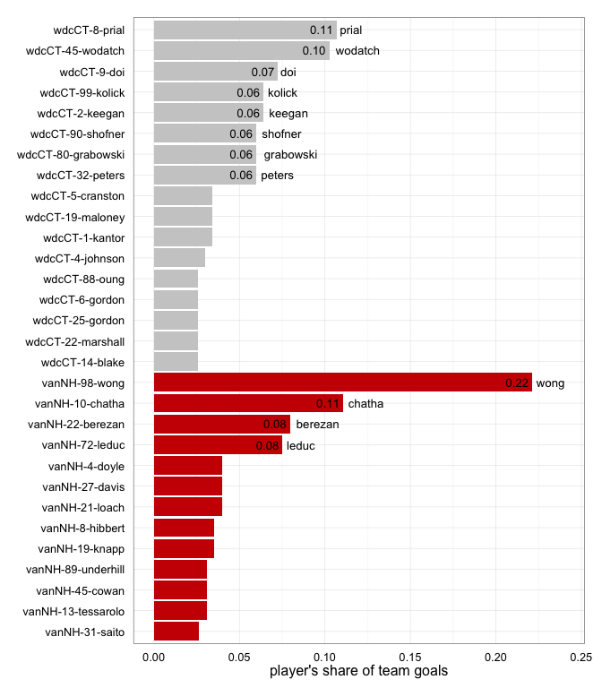
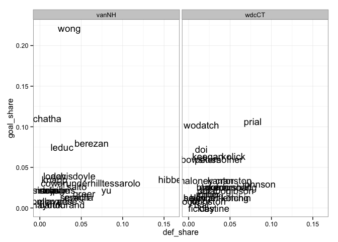
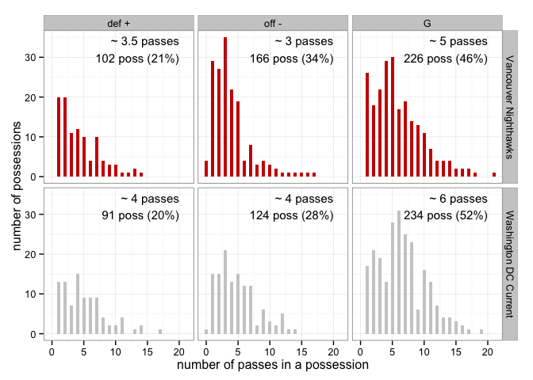
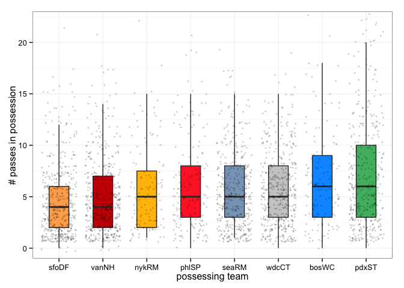

# Fodder for a finals preview article
17 July, 2014  

<a href="index.html">Back to index</a>

### Data

The figures below are based on data from all Western Conference games played in 2014 plus an increasing number of Eastern Conference games. In particular, all games involving the DC Current are already included.

### Scatterplot: completion percentage vs number of throws

The y positions (completion percentage) in the following two scatterplots are randomly jittered a bit to reduce overplotting. Excluding players with less than 5 throws.

  

### Barchart: player's share of team's total season goals

Figure includes players with rank 15 or higher for total season scoring. Due to ties this may not produce exactly 15 players. Players with goal share > 0.05 are labelled.
 

### Barchart: player's share of team's total season D's
Figure includes players with rank 15 or higher for total season defenses. Due to ties this may not produce exactly 15 players. Players with defense share > 0.06 are labelled.
 

### Scatterplot: player's share of total season goals vs D's
  

### Barchart of no. of passes in a possession
vanNH turn it over more and sooner than wdcCT.
 

### Densityplot of no. of passes in a possession
 

### Strip-and-boxplot of no. of passes in a possession (whole MLU)
wdcCT resembles pdxST in terms of making more passes than teams like vanNH. Only sfoDF have shorter possessions than vanNH, but luckily vanNH's possessions end well more often.
 

### Strip-and-boxplot of no. of passes in a possession (vanNH and wdcCT)
Head-to-head demonstration of wdcCT making more passes, across all possession outcomes.
 

### How possessions end, high-level.

y = how possessions end   

  * G = goal
  * off - = offense gives it up = throwaway + drop + travel + stall + offensive foul
  * def + = defense directly forces turn = knock down D + interception + hand block + foot block

x = proportion of possessions that end a certain way

### How possessions end, high-level and by line.

I use `o_line` to denote a line that was sent out to receive the pull and play offense. I use `d_line` to denote a line that was sent out to pull and play defense. Of course, if there's at least one turnover, an `o_line` plays defense and a `d_line` plays offense. How do possessions end if we split out by which type of line is currently on offense?

*Caveat: I am not (yet) adjusting for the full line changes we often see during timeouts. But that affects a small proportion of possessions.*

In an absolute sense there are *more* possessions by `o_lines` but the distribution of how the possessions end isn't very different at all.

x and y = *same as above*  

### How possessions end, detailed.

We revisit the same figures as above, but with a more detailed look at how possessions end. Here's what the codes mean:

y = how a possession ends  

  * G = goal
  * D = knock down D + interception + hand block + foot block
  * TA = throwaway, i.e. turnover that is neither a drop nor a clear D
  * TD = drop
  * VTT = violation travel turnover
  * VST = violation stall
  * off F = offensive foul
  
x = proportion of possessions that end a certain way  

### How possessions end, detailed and by line.

x and y and meaning of `o_line` and `d_line` = *same as above*  

