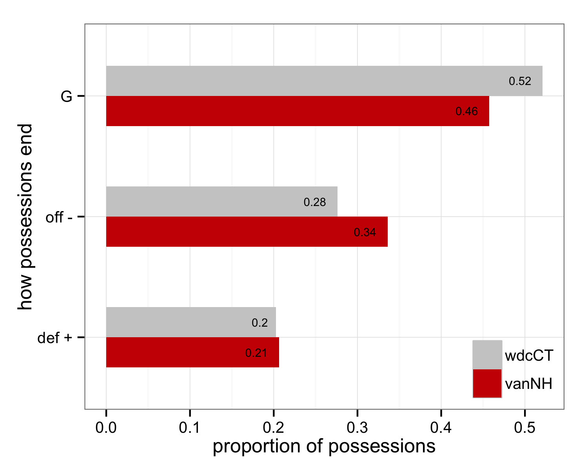
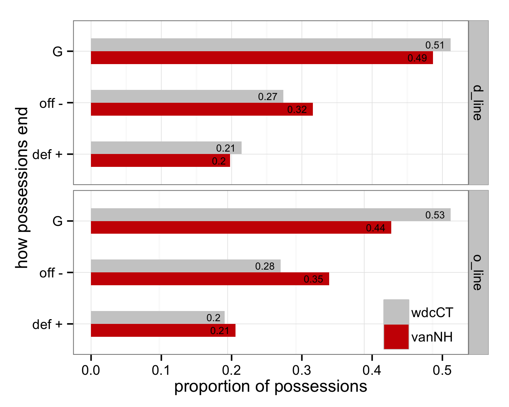
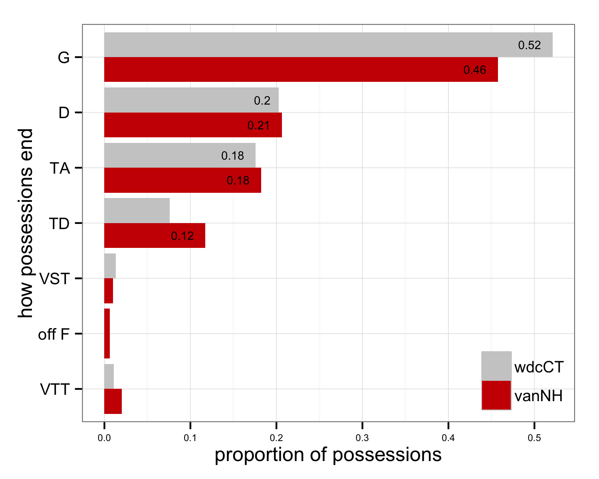

<a href="index.html">Back to index</a>

### Data

The figures below are based on data from all Western Conference games played in 2014 plus an increasing number of Eastern Conference games. In particular, all games involving the DC Current are already included.

*Note: I have removed all possessions that ended due to time running out, previously included with code `eop`.*

### Scatterplot: completion percentage vs number of throws

```{r scatterplot_comp_perc_vs_throws, echo = FALSE, warning = FALSE}
library(ggplot2)
library(plyr)

mlu_cols <-
  c(pdxST = "#4DB870", vanNH = "#CC0000", seaRM = "#88A5C3", sfoDF = "#FFAD5C",
    wdcCT = "#CCCCCC", bosWC = "#0099FF", phlSP = "#FE2E2E", nykRM = "#FFBF00")

pl_stats_agg <-
  readRDS(file.path("..", "games",
                    "2014_all-games", "2014_player-stats-aggregated.rds"))
pl_stats_agg <- pl_stats_agg[pl_stats_agg$team %in% c('vanNH', 'wdcCT'), ]
pl_stats_agg$pl_long <- with(pl_stats_agg, paste(player, last, sep = "-"))

p <- ggplot(pl_stats_agg, aes(x = throws, y = comp_pct))
#p + geom_point()
p + geom_text(aes(label = last), size = 4) + facet_wrap(~ team)

p <- ggplot(pl_stats_agg, aes(x = throws/games, y = comp_pct))
#p + geom_point()
p + geom_text(aes(label = last), size = 4) + facet_wrap(~ team)
```

### Barchart: player's share of team's total season goals
```{r barchart_share_of_goals, echo = FALSE, warning = FALSE, fig.height = 8}
tmp <- ddply(pl_stats_agg, ~ team, function(x) {
  x <- subset(x, select = c(pl_long, goals))
  tot_goals <- sum(x$goals)
  x <- subset(x, goals > 0)
  x$pl_long <- with(x, reorder(pl_long, goals))
  x$goal_share <- x$goals/tot_goals
  return(x)
  })
#str(tmp)
p <- ggplot(tmp, aes(x = pl_long, y = goal_share))
p + geom_bar(stat = "identity") + coord_flip()
```

### Barchart: player's share of team's total season D's
```{r barchart_share_of_ds, echo = FALSE, warning = FALSE, fig.height = 8}
tmp <- ddply(pl_stats_agg, ~ team, function(x) {
  x <- subset(x, select = c(pl_long, def))
  tot_ds <- sum(x$def)
  x <- subset(x, def > 0)
  x$pl_long <- with(x, reorder(pl_long, def))
  x$def_share <- x$def/tot_ds
  return(x)
  })
#str(tmp)
p <- ggplot(tmp, aes(x = pl_long, y = def_share))
p + geom_bar(stat = "identity") + coord_flip()
```

### Scatterplot: player's share of total season goals vs D's
```{r share_of_goals_vs_ds, echo = FALSE, warning = FALSE}
tmp <- ddply(pl_stats_agg, ~ team, function(x) {
  x <- subset(x, select = c(pl_long, def, goals, team, last))
  total_goals <- sum(x$goals)
  tot_ds <- sum(x$def)
  x <- subset(x, def > 0 | goals > 0)
  x$def_share <- x$def/tot_ds
  x$goal_share <- x$goals/total_goals
  return(x)
  })
#str(tmp)
p <- ggplot(tmp, aes(x = def_share, y = goal_share))
p + geom_text(aes(label = last)) + facet_wrap(~ team)
p + geom_text(aes(label = last, color = team))
```

### Barchart of no. of passes in a possession
vanNH turn it over more and sooner than wdcCT.
```{r barchart_passes_per_possession, echo = FALSE, warning = FALSE}
poss_dat <- readRDS(file.path("..", "games", "2014_all-games",
                              "2014_possessions.rds"))
#str(poss_dat)
## make b_code a factor with rational levels
poss_dat$b_code <- factor(poss_dat$b_code)
poss_dat$b_code <- with(poss_dat, reorder(b_code, game, length))
#table(poss_dat$b_code, useNA = "always")

poss_table_by_team <-
  as.data.frame(with(poss_dat, table(n_passes, b_code, poss_team)))
poss_table_finals <-
  droplevels(subset(poss_table_by_team, Freq > 0 & b_code != 'eop' &
                      poss_team %in% c('vanNH', 'wdcCT')))
#poss_table_finals
#str(poss_table_finals)
poss_table_finals <- mutate(poss_table_finals,
                            n_passes = as.numeric(as.character(n_passes)))
#poss_table_finals

## barchart of # passes in possession
## facetted by vanNH/wdcCT * how possession ends: goal, off -, def +
p <- ggplot(poss_table_finals, aes(x = n_passes, y = Freq, fill = b_code))
p + geom_bar(stat = "identity", width = 0.5) + facet_grid(b_code ~ poss_team)
```

### Densityplot of no. of passes in a possession
```{r densityplot_passes_per_possession, echo = FALSE, warning = FALSE}
## densityplot of # passes in possession
## vanNH and wdcCT overlaid, using alpha transparency
## facetted by how possession ends: goal, off -, def +
p <- ggplot(subset(poss_dat, b_code != 'eop' &
                     poss_team %in% c('vanNH', 'wdcCT')),
            aes(x = n_passes, fill = poss_team))
p + geom_density(alpha = 1/3) + facet_grid(b_code ~ .) +
  scale_fill_manual(values = mlu_cols)
```

### Strip-and-boxplot of no. of passes in a possession (whole MLU)
wdcCT resembles pdxST in terms of making more passes than teams like vanNH. Only sfoDF have shorter possessions than vanNH, but luckily vanNH's possessions end well more often.
```{r strip_and_boxplot_passes_per_possession, echo = FALSE, warning = FALSE}
tmp <- subset(poss_dat, b_code != "eop")
tmp$poss_team <- with(tmp, reorder(poss_team, n_passes, median))
p <- ggplot(tmp,
            aes(x = poss_team, y = n_passes, fill = poss_team))
p + geom_boxplot(outlier.colour = NA, width = 0.6) +
  geom_jitter(alpha = 1/5, size = 1) + scale_fill_manual(values = mlu_cols) +
  xlab("possessing team") + ylab("# passes in possession") +
  coord_cartesian(ylim = c(-1, 23)) +
  guides(fill = FALSE)
```

### Strip-and-boxplot of no. of passes in a possession (vanNH and wdcCT)
Head-to-head demonstration of wdcCT making more passes, across all possession outcomes.
```{r strip_and_boxplot_passes_per_possession_finals, echo = FALSE, warning = FALSE}
tmp <- subset(poss_dat, b_code != "eop" & poss_team %in% c('vanNH', 'wdcCT'))
tmp$poss_team <- with(tmp, reorder(poss_team, n_passes, median))
p <- ggplot(tmp,
            aes(x = b_code, y = n_passes, fill = poss_team))
p + geom_boxplot(outlier.colour = NA, width = 0.6,
                 position = position_dodge(width = 0.6)) +
  geom_jitter(alpha = 1/5, size = 1) + scale_fill_manual(values = mlu_cols) +
  xlab("how possession ends") + ylab("# passes in possession") +
  coord_cartesian(ylim = c(-1, 18)) +
  theme(legend.position = c(0.5, 1), legend.justification = c(0.5, 0.93),
        legend.background = element_rect(fill = 0),
        legend.direction = "horizontal")
```

### How possessions end, high-level.

y = how possessions end   

  * G = goal
  * off - = offense gives it up = throwaway + drop + travel + stall + offensive foul
  * def + = defense directly forces turn = knock down D + interception + hand block + foot block

x = proportion of possessions that end a certain way



### How possessions end, high-level and by line.

I use `o_line` to denote a line that was sent out to receive the pull and play offense. I use `d_line` to denote a line that was sent out to pull and play defense. Of course, if there's at least one turnover, an `o_line` plays defense and a `d_line` plays offense. How do possessions end if we split out by which type of line is currently on offense?

*Caveat: I am not (yet) adjusting for the full line changes we often see during timeouts. But that affects a small proportion of possessions.*

In an absolute sense there are *more* possessions by `o_lines` but the distribution of how the possessions end isn't very different at all.

x and y = *same as above*  



### How possessions end, detailed.

We revisit the same figures as above, but with a more detailed look at how possessions end. Here's what the codes mean:

y = how a possession ends  

  * G = goal
  * D = knock down D + interception + hand block + foot block
  * TA = throwaway, i.e. turnover that is neither a drop nor a clear D
  * TD = drop
  * VTT = violation travel turnover
  * VST = violation stall
  * off F = offensive foul
  
x = proportion of possessions that end a certain way  



### How possessions end, detailed and by line.

x and y and meaning of `o_line` and `d_line` = *same as above*  


