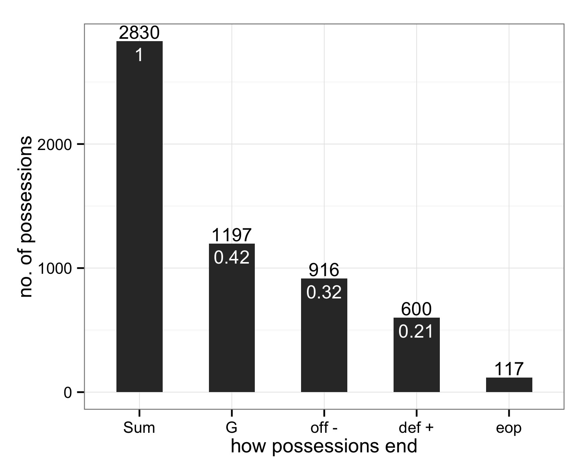

<a href="index.html">Back to index</a>

## How many possessions does it take to score?

Dataset: points that ended in a goal from all games involving Vancouver Nighthawks in 2014 through week 09 (n = 362 points)

x = the number of possessions before a goal is finally scored  
y = the proportion of points scored after x exactly possessions  
color indicates hold = receiving team scored vs. break = pulling team scored  

x = *same as above*  
y = cumulative proportion, i.e. proportion of points scored within x or fewer possessions  
color *same as above*  

## By team: how many possessions does it take to score?

x = the number of possessions before a goal is finally scored  
y = the proportion of points scored after x exactly possessions (relative to all points scored by a team)  
color indicates hold = receiving team scored vs. break = pulling team scored  

Observations:

  * pdxST and seaRM stand out as deriving more of their points by scoring on their first possession -- well over 55% vs. well below 45% for sfoDF and vanNH
  * sfoDF D line seems much less effective on offense than other D lines, with pdxST being best, then vanNH
  * makes me want to look at this: of points with x or more possessions, what proportion have exactly x possessions? The first "1 possession hold" bars will not change, but then we'll see conversion rate for the D line on it's first possession ("2 possession break"), conversion rate for O line if it gets disc back("3 possession hold), etc. I expect those bars to steadily decrease and to show higher conversion rate for O lines vs D. But who knows?

## How do possessions end?

### How possessions end, high-level.

Dataset: all possessions from all games involving Vancouver Nighthawks in 2014 through week 09 (n = 842 possessions by one of the 4 MLU Western Conference teams)

x = how possessions end   

  * G = goal
  * off - = offense gives it up = throwaway + drop + travel + stall + offensive foul
  * def + = defense directly forces turn = knock down D + interception + hand block + foot block

y = proportion of possessions that end a certain way

### How possessions end, high-level and by line.

I use `o_line` to denote a line that was sent out to receive the pull and play offense. I use `d_line` to denote a line that was sent out to pull and play defense. Of course, if there's at least one turnover, an `o_line` plays defense and a `d_line` plays offense. How do possessions end if we split out by which type of line is currently on offense?

*Caveat: I am not (yet) adjusting for the full line changes we often see during timeouts. But that affects a small proportion of possessions.*

x and y = *same as above*  

### How possessions end, high-level and by team.

x and y = *same as above*  

### How possessions end, high-level, by line and team.

To be clear here, within a team * line combination, the bar heights add up to 1. So we get the breakdown of how possessions end when, e.g. a Portland Stags' `o_line` had the disc: 55% end in a goal for them, 28% end in a turnover nominally due to offense error, and 17% end with an explicit stop by the defense.

One thing that really jumps out is the much greater similarity between `o_line` and `d_line` for Vancouver Nighthawks than anyone else.

x and y and meaning of `o_line` and `d_line` = *same as above*  

### How possessions end, detailed.

x = how a possession ends  

  * G = goal
  * TA = throwaway, i.e. turnover that is neither a drop nor a clear D
  * D = knock down D + interception + hand block + foot block
  * TD = drop
  * VTT = violation travel turnover
  * VST = violation stall
  * off F = offensive foul
  
y = proportion of possessions that end a certain way  

### How possessions end, detailed and by line.

x and y and meaning of `o_line` and `d_line` = *same as above*  

### How possessions end, detailed and by team.

x and y and meaning of `o_line` and `d_line` = *same as above*  

### How possessions end, detailed, by line and team.

x and y and meaning of `o_line` and `d_line` = *same as above*  

