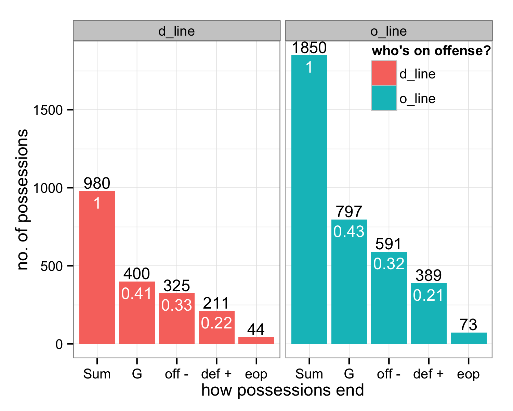
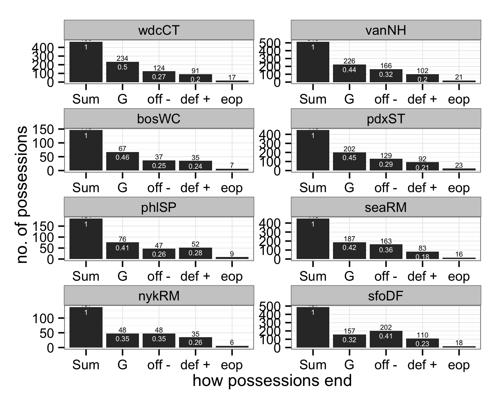
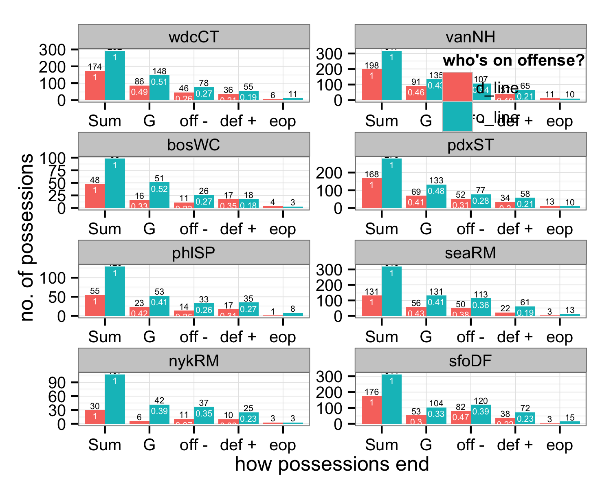
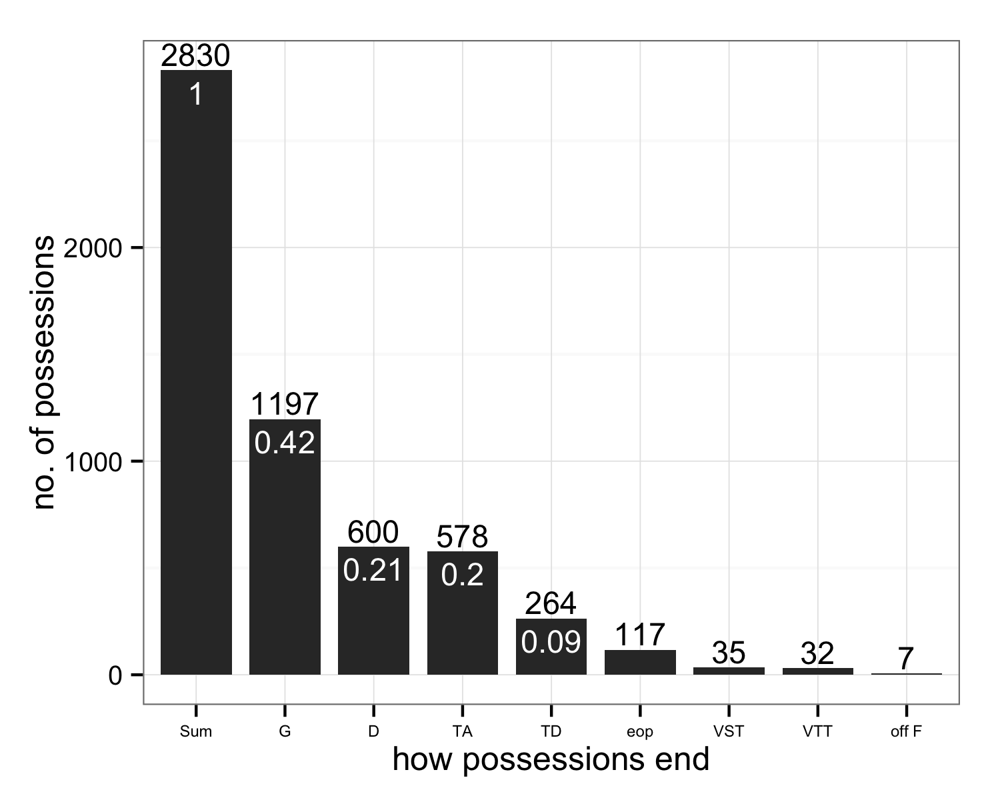
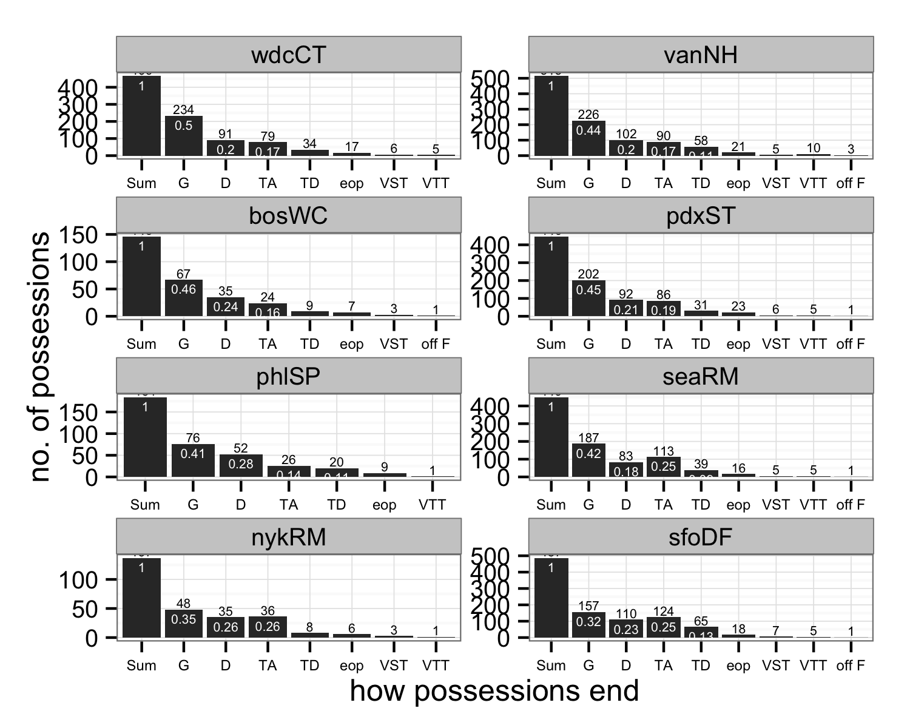
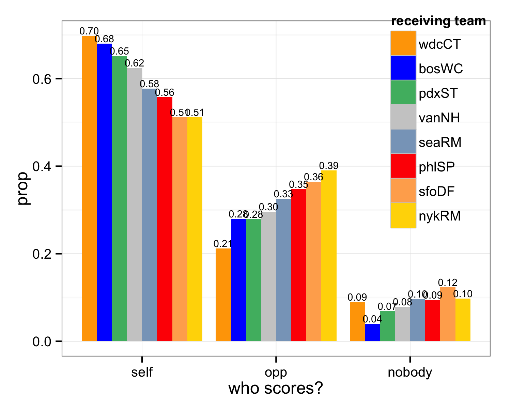
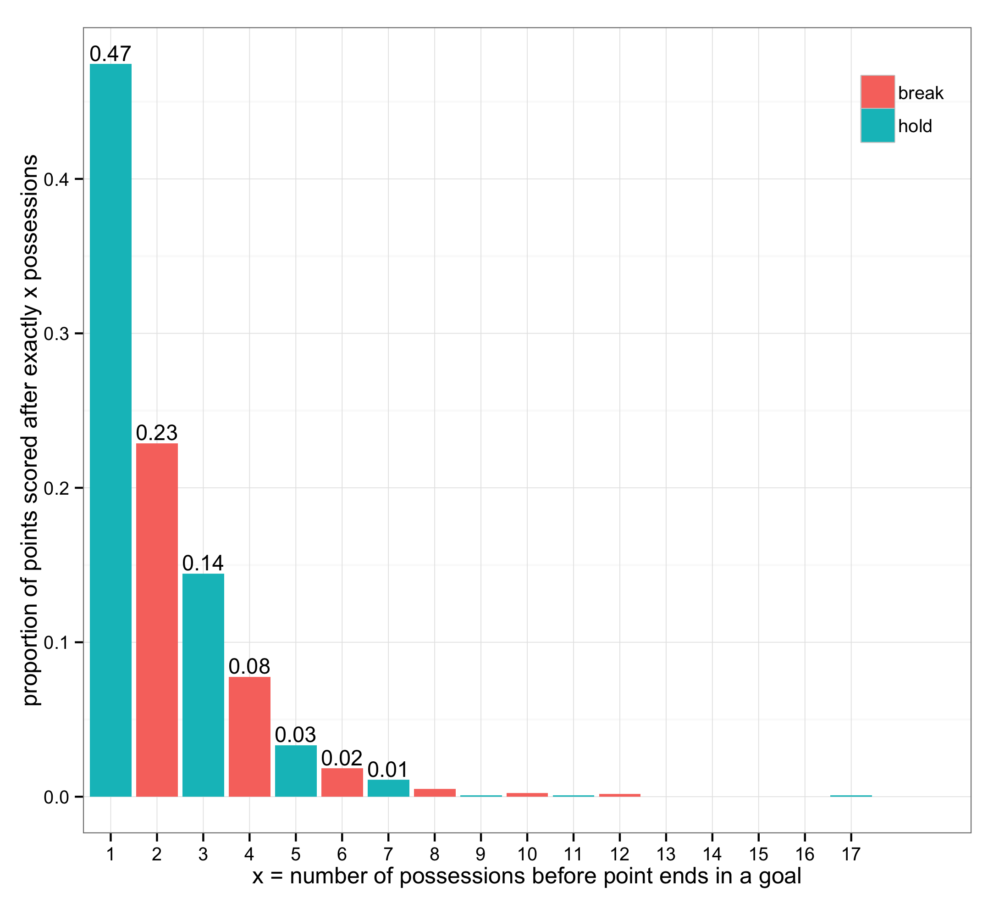
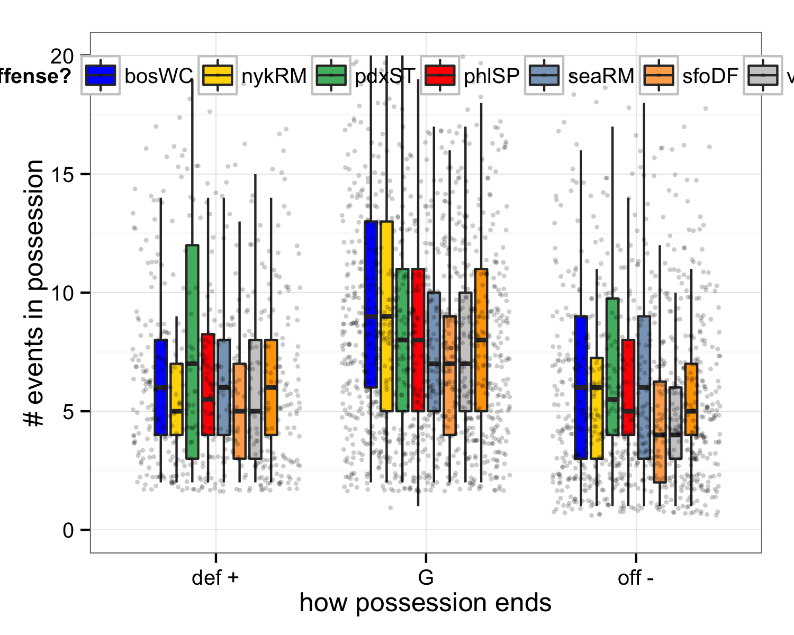

<a href="index.html">Back to index</a>

## Data

The figures below are based on data from all games the Vancouver Nighthawks played in 2014 (10 games) plus an increasing number of the "other" Western Conference games (eventually 10 more games). If you see a game listed [here](index.html), the data is included in these figures. Right now 3 of the 10 "other" games are included.

## How do possessions end?

### How possessions end, high-level.

x = how possessions end   

  * Sum = total number of possessions in the dataset
  * G = goal
  * off - = offense gives it up = throwaway + drop + travel + stall + offensive foul
  * def + = defense directly forces turn = knock down D + interception + hand block + foot block
  * eop = end of period

y = proportion of possessions that end a certain way

### How possessions end, high-level and by line.

I use `o_line` to denote a line that was sent out to receive the pull and play offense. I use `d_line` to denote a line that was sent out to pull and play defense. Of course, if there's at least one turnover, an `o_line` plays defense and a `d_line` plays offense. How do possessions end if we split out by which type of line is currently on offense?

*Caveat: I am not (yet) adjusting for the full line changes we often see during timeouts. But that affects a small proportion of possessions.*

In an absolute sense there are *more* possessions by `o_lines` but the distribution of how the possessions end isn't very different at all.

x and y = *same as above*  

### How possessions end, high-level and by team.

Here we just confirm the ranking in the Western Conference:

  * pdxST (46% of possessions end in a goal) > vanNH (44%) > seaRM (40%) >> sfoDF (29%)
  * The exact same ordering arises, in the reverse, when you look at how often the offense turns it over.

x and y = *same as above*  

### How possessions end, high-level, by line and team.

To be clear here, within a team * line combination, the bar heights add up to 1. So we get the breakdown of how possessions end when, e.g. a Portland Stags' `o_line` had the disc: 48% end in a goal for them, 30% end in a turnover nominally due to offense error, and 19% end with an explicit stop by the defense.

One thing that I see is that vanNH's `o_line` and `d_line` are more similar to each other than those of the other teams.

x and y and meaning of `o_line` and `d_line` = *same as above*  

### How possessions end, detailed.

We revisit the same figures as above, but with a more detailed look at how possessions end. Here's what the codes mean:

x = how a possession ends  

  * G = goal
  * TA = throwaway, i.e. turnover that is neither a drop nor a clear D
  * D = knock down D + interception + hand block + foot block
  * TD = drop
  * VTT = violation travel turnover
  * VST = violation stall
  * off F = offensive foul
  
y = proportion of possessions that end a certain way  

### How possessions end, detailed and by line.

x and y and meaning of `o_line` and `d_line` = *same as above*  

### How possessions end, detailed and by team.

x and y = *same as above*  

### How possessions end, detailed, by line and team.

x and y and meaning of `o_line` and `d_line` = *same as above*  

## Who scores?

`self` scores means a hold  
`opp` scores means a break  
`nobody` means time ran out  
`recv_team` indicates who received the pull  

## How many possessions does it take to score?

x = the number of possessions before a goal is finally scored  
y = the proportion of points scored after x exactly possessions  
color indicates hold = receiving team scored vs. break = pulling team scored  

x = *same as above*  
y = cumulative proportion, i.e. proportion of points scored within x or fewer possessions  
color *same as above*  

## By team: how many possessions does it take to score?

x = the number of possessions before a goal is finally scored  
y = the proportion of points scored after x exactly possessions (relative to all points scored by a team)  
color indicates hold = receiving team scored vs. break = pulling team scored  

Observations:

  * pdxST and seaRM stand out as deriving more of their points by scoring on their first possession
  * sfoDF D line seems much less effective on offense than other D lines
  * makes me want to look at this: of points with x or more possessions, what proportion have exactly x possessions? The first "1 possession hold" bars will not change, but then we'll see conversion rate for the D line on it's first possession ("2 possession break"), conversion rate for O line if it gets disc back("3 possession hold), etc. I expect those bars to steadily decrease and to show higher conversion rate for O lines vs D. But who knows?

## How many events in a possession?

Although I can resolve individual throws from the data I have, I have not done so yet. For now, I measure the "length" of a possession in terms of the number of *events*, which is highly and positively correlated to the number of throws. There are more events in a possession than throws, since there are events for defensive fouls, time outs, pulls, etc. However, this affects all teams uniformly, so this "cheat" shouldn't distort the story below re: possession length.

### How long possessions last, high-level.

The Stags' possessions are notably the longest of all Western teams.

### How long possessions last, by outcome.

Possessions leading to goals last longer than those leading turnovers. I guess that's to be expected. And still, regardless of the outcome, the Stags' possessions are the longest. The boxplots below give the median possession length.

Possessions leading to goals last longer than those ending with an unequivocal D. And both last longer than possessions that end because the offense gives it up. And still, regardless of the outcome, the Stags' possessions are the longest.

