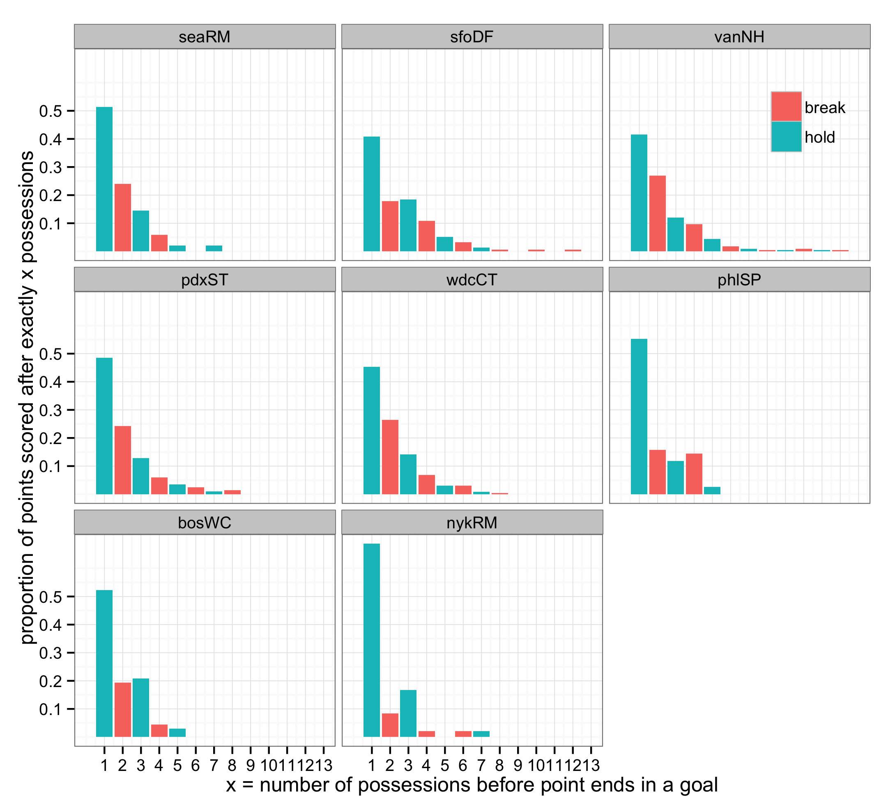

<a href="index.html">Back to index</a>

## How many possessions does it take to score?

Dataset: points that ended in a goal from all games involving Vancouver Nighthawks in 2014 through week 09 (n = 362 points)

x = the number of possessions before a goal is finally scored  
y = the proportion of points scored after x exactly possessions  
color indicates hold = receiving team scored vs. break = pulling team scored  

x = *same as above*  
y = cumulative proportion, i.e. proportion of points scored within x or fewer possessions  
color *same as above*  

## By team: how many possessions does it take to score?

x = the number of possessions before a goal is finally scored  
y = the proportion of points scored after x exactly possessions (relative to all points scored by a team)  
color indicates hold = receiving team scored vs. break = pulling team scored  

Observations:

  * pdxST and seaRM stand out as deriving more of their points by scoring on their first possession -- well over 55% vs. well below 45% for sfoDF and vanNH
  * sfoDF D line seems much less effective on offense than other D lines, with pdxST being best, then vanNH
  * makes me want to look at this: of points with x or more possessions, what proportion have exactly x possessions? The first "1 possession hold" bars will not change, but then we'll see conversion rate for the D line on it's first possession ("2 possession break"), conversion rate for O line if it gets disc back("3 possession hold), etc. I expect those bars to steadily decrease and to show higher conversion rate for O lines vs D. But who knows?

## How do possessions end?

Dataset: all possessions from all games involving Vancouver Nighthawks in 2014 through week 09 (n = 842 possessions)

x = how a possession ends  

  * G = goal
  * TA = throwaway, i.e. turnover that is neither a drop nor a clear D
  * D = knock down D + interception + hand block + foot block
  * TD = drop
  * VTT = violation travel turnover
  * VST = violation stall
  
y = proportion of possessions that end a certain way  

## By team: how do possessions end?

Dataset: all possessions from all games involving Vancouver Nighthawks in 2014 through week 09 (n = 842 possessions)

x = *same as above*
  
y = proportion of possessions that end a certain way, among all possessions by a specific team  

*I know I need to make another version that distinguishes whether it's an O or D line executing the possession... *

